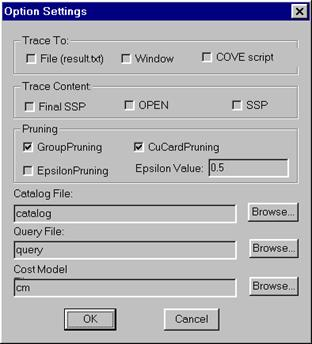
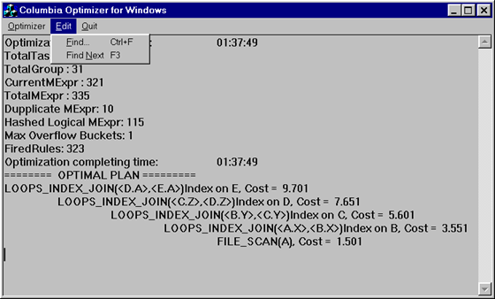

# COLUMBIA 数据库查询优化器的效率

[TOC]

## Chapter 1 . Introduction

### 1.1  Motivation for This Research

尽管查询优化已经是一个超过 15 年的研究课题 [SAC+79]，但查询优化器仍然是数据库系统中最大、最复杂的模块之一，使得它们的开发和修改成为困难和耗时的任务。由于现代数据库应用程序 [ZdM90] 的需求，如决策支持系统 (DSS) 和在线分析处理 (OLAP)、大型数据仓库、复杂对象（如多媒体数据库、WWW 和 GIS） ，以及处理新的计算技术（如并行和分布式计算）的需要，情况进一步复杂化。这些新的应用领域又需要新的数据库技术，例如新的查询语言和新的查询处理技术，这些技术与传统的事务处理应用程序有很大的不同。

在过去的几年中，已经开发了几代商业和研究查询优化器，为优化器的可扩展性和效率做出了贡献。

第一代可扩展优化器技术的第一次努力大约开始于**十年前**，意识到对新的数据模型、查询类、语言和计算技术的需求。这些项目包括 Exodus [GrD87] 和 Starburst [HCL90]。他们的目标是让优化器更模块化，更容易扩展。使用的技术包括组件分层、基于规则的转换等。这些努力有一些缺点，比如扩展的复杂性、搜索性能和对面向记录的数据模型的偏爱。

第二代可扩展优化器工具，如 Volcano 优化器生成器 [GrM93]，增加了更复杂的搜索技术，更多地使用物理属性来指导搜索，更好地控制搜索策略，以实现更好的搜索性能。尽管这些优化器有些灵活，但进行扩展仍然困难且复杂。

第三代查询优化器框架，如 Cascades [Gra95]、OPT++ [KaD96]、EROC [MBH96] 和 METU [ONK95]，使用面向对象的设计来简化实现、扩展和修改优化器的任务，同时保持效率，使搜索策略更加灵活。最新一代优化器达到了满足现代商业数据库系统要求和需求的复杂程度。这些优化器的行业实现证明了这一点，例如 Microsoft [Gra96] 和 Tandem [Cel96] 的 Cascades，NCR [MBH96] 的 EROC。

这三代查询优化器可以分为两种搜索策略，Starburst 风格自底向上动态规划优化器和 Cascades 风格自顶向下基于成本的优化器，==基于分支和约束规则驱动==。自底向上优化被广泛应用于传统的商业数据库系统中，因为它被认为是高效的，至少在传统应用中是这样。**但是自底向上的优化天生就没有自顶向下的优化那么可扩展，因为它需要将原始问题分解成子问题**。此外，为了在大型查询中获得可接受的性能，自底向上优化中需要采用启发式方法。

尽管以前的自顶向下优化器的实现表明，它们很难像自底向上优化那样调优出有竞争力的性能。但我们认为自上而下优化器在效率和可扩展性方面具有优势。本论文的其余部分描述了我们尝试开发另一种自上而下的优化器 Columbia，以证明可以在自上而下的方法中实现高效率。

基于 Cascades Optimizer Framework 自顶向下的优化，Columbia 广泛地利用了 C++的面向对象特性，精心设计和简化自顶向下优化，在保持可扩展性的同时实现效率。它定义了一些带有虚方法的关键抽象类。搜索策略完全是根据这些抽象类实现的。搜索策略调用这些抽象类的虚拟方法，来执行搜索和基于成本的搜索空间修剪。因此，很容易扩展优化器来操作复杂的<u>数据模型</u>，通过从抽象类派生新类并重写虚拟方法来添加新的运算符和转换规则。由于本文的主要重点是关系数据模型的优化效率，因此我们在此不讨论优化器的可扩展性，并将扩展优化器以操作其他数据模型作为未来的工作。

为了尽量减少CPU和内存的使用，Columbia 使用了多种工程技术来提高效率。包括用于**消除重复表达式的快速哈希函数**、Group 中逻辑和物理表达式的分离、小而紧凑的数据结构、优化 Group 和输入的高效算法，以及处理强制执行器的有效方法。

**Columbia 提供的一项重要技术是 Group 修剪**，它可以在不影响执行计划质量的情况下显著裁剪搜索空间。优化器在生成一些较低层的执行计划之前计算高层物理计划的成本。这些早期成本作为后续优化的上限。我们将证明，在许多情况下，这些上限可用于避免生成整组表达式，从而在搜索空间中裁剪大量可能的查询计划。

除了 Group 剪枝，Columbia 还实现了另一种剪枝技术：全局 epsilon 剪枝。该技术通过生成可接受的接近最优的解决方案，显著地缩小了搜索空间。当发现一个解足够接近最优解时，优化目标就完成了，因此无需考虑大量的表达式。对这种剪枝技术进行了分析。给出了优化的有效性和误差。

### 1.2  Overview of This Thesis

本文的其余部分组织如下：

1. 第 2 章介绍了本文使用的术语和基本概念。
2. 第 3 章介绍了相关工作，其中我们调研了<u>该领域的商业和研究贡献</u>，从传统到新一代，从自下而上到自上而下的优化器。我们将重点关注性能分析。
3. 在第 4 章中，描述了 Columbia 系统的总体结构和设计，包括搜索空间、规则和优化任务。讨论了两种**裁剪技术**。本章还讨论了可用性改进。由于 Columbia 是基于 Cascades 构造的，因此讨论将集中在它们之间的比较上，并解释 Columbia 如何实现更好的效率。
4. 第 5 章展示了我们使用优化器从经验中收集的结果。通过与其他优化器的比较，展示了性能改进。
5. 第 6 章包括总结和结论，并概述了未来潜在的研究方向。


## Chapter 2 . Terminology

在本节中，我们回顾查询优化 [ElN94] [Ram97] 文献中的术语和基本概念，它们也被用于描述 Columbia 的设计和实现。更详细的术语将在第 4 章，Columbia 优化器的结构中讨论。

### 2.1. Query Optimization

查询处理器接受用数据库系统的数据操作语言 (DML) 表示的请求，并根据数据库的内容对其进行求值。

<p align="center">
 
 图 1. Query Processing
</p>
图 1 显示了查询处理的步骤。DML 语法中的原始查询被解析为逻辑代数上的逻辑表达式树，后续阶段可以很容易地操作逻辑代数。然后，将查询内部的逻辑形式传递给查询优化器，查询优化器负责将逻辑查询转换为物理计划^1^，该计划将基于保存数据的物理数据结构执行。有两种类型的转换：**逻辑转换**，创建查询另外一种等价的逻辑形式，例如交换树的左右子节点；**物理转换**，选择特定物理算法来实现逻辑运算符，例如为 Join算子实现 sort-merge join算法。通常，此过程会生成大量实现查询树的执行计划。相对于成本模型，包括统计和其他 catalog 信息，寻找最优计划是查询优化器的主要关注点。一旦选择了查询的最佳（或接近最佳）物理计划，就会被传递到查询执行引擎。查询执行引擎使用存储的数据库作为输入执行计划，并产生查询结果作为输出。

> 1. 逻辑计划是一个代数表达式，对于它所包含的每个运算符，都可以选择实现方法。

如果我们从用户层面来看，查询处理隐藏在查询处理器的暗箱中。用户向数据库系统提交他们的查询，这些查询通常是用高级语言编写的，如 SQL、Quel 或 OQL [Cat94]（面向对象的数据库系统），并期望系统能够正确快速地输出查询结果。正确性是查询处理器的绝对要求，而性能是查询处理器的理想特性和主要关注点。正如我们在查询处理的系统级看到的那样，查询优化器**是有助于实现高性能的关键组件**。有大量的计划可以正确实现查询，但是对于某些性能度量（例如，执行时间、内存）具有不同的执行性能。优化器的目标之一是找到具有最佳^2^执行性能的计划。有一种简单的方法优化器可以做，即生成所有可能的执行计划并选择最便宜的。但是，由于即使是相对简单的查询也有大量替代计划，因此探索所有可能的计划的成本高得令人望而却步。因此优化器必须以某种方式缩小他们考虑的替代计划的空间。

> 2. 理论上，目标是找到最有执行计划。然而，最优性与许多方面有关，例如成本模型、catalog 信息，有时还与搜索空间的特定子集有关。因此，在实践中，更准确地说，查询优化器的目标是为给定的查询找到一个好的执行计划。

查询优化是一个复杂的搜索问题。研究表明，这个问题的简化版本是 NP-hard [IbK84]。事实上，即使对于最简单的 Join 关系，使用动态规划时必须计算的连接数量也与输入关系的数量呈指数关系 [OnL90]。所以一个好的搜索策略对一个优化器的成功至关重要。

本章的其余部分将回顾一些用于解决查询优化问题的基本概念。我们将使用这些概念来描述 Columbia 的设计和实现。


### 2.2. Logical Operators and Query Tree

> **Logical operators** are **==high-level==** operators that specify data transformations without specifying the physical execution algorithms to be used. In the relational model, logical operators generally take tables^3^ as inputs, and produce a single table as output. Each logical operator takes a fixed number of inputs (which is called the arity of the operator) and may have parameters that distinguish the variant of an operator. Two typical logical operators are GET and EQJOIN. The GET operator has no input and one argument, which is the name of the stored relation. GET retrieves the tuples of the relation from disk and outputs the tuples for further operations. The EQJOIN operator has two inputs, namely the left and right tables to be joined, and one argument which is a set of join predicates relating to the left and right tables.
>
> > 3. Here, we define table as a collection of tuples. In the relational model, it can be a real stored relation (roughly, a disk file) or a temporary collection of tuples produced in the evaluation of a query.
>
> A **query tree** is a tree representation of a query and serves as the input to an optimizer. Typically a query tree is represented as a tree of logical operators in which each node is a logical operator having zero or more logical operators as its inputs. The number of children of the node is exactly the arity of the operator. Leaves of the tree are operators with zero arity. An example of a query tree representation of a query is showed in Figure 2.
>
> Query trees are used to specify the order in which operators are to be applied. In order to apply the top operator in the tree, its inputs must be applied first. In this example, EQJOIN has two inputs, which are taken from the outputs of two GET operators. The argument of EQJOIN, i.e., “Emp.dno=Dept.dno”, describes the condition of the join operation. The output of EQJOIN will produce the result of query. GET operators have no input, so they are the leaves of the tree and generally provide data sources of the query evaluation. The argument of each GET operator defines which stored relation will be retrieved.
>

**逻辑运算符**是高级运算符，它指定了数据转换，但没有指定要使用的物理执行算法。在关系模型中，逻辑运算符通常将表^3^作为输入，并产生单个表作为输出。每个逻辑运算符接受固定数量的输入（称为运算符的元数），并且可以**<u>有区分运算符变体</u>**的参数。两个典型的逻辑运算符是 GET 和 EQJOIN。GET 运算符没有输入，只有一个参数，即关系的名称。GET 从磁盘中检索关系的元组，并输出这些元组以进行进一步的操作。EQJOIN 运算符有两个输入，即要 Join 的左表和右表，以及一个参数，它是与左表和右表相关的一组  Join 谓词。

> 3. 在这里，我们将**表**定义为元组的集合。在关系模型中，它可以是真实存储的关系（大致上，磁盘文件）或在查询计算中生成的临时元组集合。

**查询树**是查询的树状表示，是优化器的输入。通常，查询树表示为逻辑运算符树，其中每个节点是一个逻辑运算符，其输入为 0 个或多个逻辑运算符。节点的子节点数正好是运算符的元数。树的叶节点是没有输入的运算符。图 2 显示了一个查询的查询树表示示例。

<p align="center">
 
 图 2. Query Representation
</p>

查询树用于指定应用运算符的顺序。为了计算树中顶部的运算符，必须首先计算它的输入。在本例中，EQJOIN 有两个输入，它们取自两个 GET 运算符的输出。EQJOIN 的参数，即 `Emp.dno=Dept.Dno`，描述 Join 运算的条件。EQJOIN 的输出将产生查询的结果。GET 操作符没有输入，因此它们是树的叶子，通常是提供查询计算的数据源。每个 GET 运算符的参数表示将读取那张表。

### 2.3. Physical Operators and Execution Plan

> Physical Operators represent specific algorithms that implement particular database operations. One or more physical execution algorithms can be used in a database for implementing a given query logical operator. For instance, the EQJOIN operator can be implemented using **nested-loops** or **sort-merge** or other algorithms. These specific algorithms can be implemented in different physical operators. Thus, two typical physical operators are LOOPS_JOIN, which implements the nested-loops join algorithm, and MERGE_JOIN, which implements the sort-merge join algorithm. The typical implementing algorithm for the GET logical operator is scanning the table in stored order, which is implemented in another physical operator FILE_SCAN. Like logical operators, each physical operator also has fixed number of inputs (which is the arity of the operator), and may have parameters.
>
> Replacing the logical operators in a query tree by the physical operators which can implement them gives rise to a tree of physical operators which is called an Execution Plan or access plan for the given query. Figure 3 shows two possible execution plans corresponding to the query tree in Figure 2(b).
>
> > - [x] Figure 3. Execution plans
>
> Execution plans specify how to evaluate the query. Each plan has an execution cost corresponding to the cost model and catalog information. In general, a good execution plan for a given query is generated by the optimizer and serves as the input to the Query Execution Engine which executes the overall algorithms against the data of database systems to produce the output result of the given query.
>

**物理运算符**表示实现数据库特定操作的具体算法。数据库可以使用一个或多个物理执行算法来实现给定的查询逻辑运算符。例如，可以使用 **nested-loops** 或 **sort-merge** 或其他算法来实现 EQJOIN 运算符。这些特定的算法可以在不同的物理运算符中实现。因此，两个典型的物理操作符是 LOOPS_JOIN，它实现了**嵌套循环连接算法**，以及 MERGE_JOIN，它实现了归并排序连接算法。GET 逻辑运算符的典型实现算法是按存储顺序扫描表，这是在另一个物理运算符 FILE_SCAN 中实现。与逻辑运算符一样，每个物理运算符也有固定数量的输入（这是运算符的元数），并且可能有参数。

将查询树中的逻辑运算符替换为可以实现这些运算符符的物理运算符符，就会生成一个物理运算符符树，它被称为给定查询的执行计划或访问计划。图 3 显示了对应于图 2(b) 中的查询树，它有两种可能的执行计划。

<p align="center">
 
 图 3. Execution plans
</p>

执行计划指定如何计算查询。每个计划都有一个与成本模型和 Catalog 信息相对应的执行成本。通常，给定查询好的执行计划由优化器生成，并作为查询执行引擎的输入，查询执行引擎对数据库系统中的数据执行整体算法，以产生给定查询的输出结果。

### 2.4. Groups

> A given query can be represented by one or another query tree that is logically equivalent. Two query trees are logically equivalent if they output exactly the same result for any population of the database [Gra95]. For each query tree, in general, there are one or more corresponding execution plans implementing the query tree and producing exactly the same result. Analogously, these execution plans are logically equivalent. Figure 4 shows several logically equivalent query trees and logically equivalent execution plans implementing the query trees.
>
> > - [x] Figure 4. Logically equivalent query trees and plans
>
> As shown in Figure 4, we denote an **EQJOIN** operator by $\Join$, **LOOPS_JOIN** by $\Join_L$, and **MERGE_JOIN** by $\Join_M$. To simplify, we also denote a **GET** operator by its argument and **FILE_SCAN** by its argument plus sub F. In Figure 4, (a) and (b) are two logically equivalent query trees. The difference is the order of logical operators. (a-i) and (a-ii) are two logically equivalent execution plans implementing query tree (a). They use two different join algorithms.
>
> We can also use **expressions** to represent query trees and execution plans (or sub trees and sub plans). An expression consists of an operator plus zero or more input expressions. We refer to an expression as logical or physical based on the type of its operator. So query trees are logical expressions and execution plans are physical expressions.
>
> Given a logical expression, there are a number of logically equivalent logical and physical expressions. It is useful to collect them into groups and define their common characteristics. A Group is a set of logically equivalent expressions^4^. In general, a group will contain all equivalent logical forms of an expression, plus all physical expressions derivable based on selecting allowable physical operators for the corresponding logical forms. Usually, there will be more than one physical expression for each logical expression in a group. Figure 5 shows a group containing the expressions in Figure 4 and other equivalent expressions.
>
> > 4. Note that a group might not contain all equivalent expressions. In some case where a pruning technique has been applied, some expressions will not be considered and do not need to be included in the group.
>
> > - [x] Figure 5. Equivalent expressions in groups [ABC]
>
> We usually denote a group by one of its logical expressions. For instance, $(A \Join B) \Join C$, or simply [ABC]. Figure 5 shows all^5^ equivalent logical expressions for the group [ABC] and some physical expressions. We can see that there are a number of equivalent expressions, even for logical expressions.
>
> > 5. For simple cases, the group consists of join operators only.
>
> To reduce the number of expressions in a group, **Multi-expressions** are introduced. A **Multi-expression** consists of a logical or physical operator and takes groups as inputs. <u>A multi-expression is the same as an expression except it takes groups as inputs while expressions take other expressions as inputs</u>. For instance, the multi-expression “$[AB] \Join [C]$ ” denotes the EQJOIN operator taking the groups [AB] and [C] as its inputs. ==The advantage of multi-expressions is the great savings in space because there will be fewer equivalent multi-expressions in a group==. Figure 6 shows the equivalent multi-expressions in the group [ABC]. There are many fewer multi-expressions than expressions in figure 5. In fact, one multi-expression represents several expressions by taking groups as inputs. With multi-expressions, a group can be re-defined as a set of logically equivalent multi-expressions.
>
> > - [ ] Figure 6. Equivalent multi-expressions in group [ABC]
>
> In the typical processing of a query, many intermediate results (collections of tuples) are produced before the final result is produced. An intermediate result is produced by computing an execution plan (or a physical expression) of a group. In this meaning, groups correspond to intermediate results (these groups are called intermediate groups). There is only one final result, whose group is called the final group).
>
> The **Logical properties** of a group are defined as the logical properties of the result, regardless of how the result is physically computed and organized. These properties include the cardinality (number of tuples), the schema, and other properties. Logical properties apply to all expressions in a group.
>

给定的查询可以由逻辑上等价的多个查询树表示。如果无论数据库内有什么数据，两个查询树都输出完全相同的结果，那么它们在逻辑上是等价的[Gra95]。对于每个查询树，通常都有一个或多个相应的**==执行计划==**来实现并生成完全相同的结果。类似地，这些执行计划在逻辑上是等价。图 4 是逻辑上等价的查询树和（实现它们的）执行计划。

<p align="center">
 
 图 4. Logically equivalent query trees and plans
</p>
如图 4 所示，我们用 $\Join$ 表示 **EQJOIN** 运算符，用 $\Join_L$ 表示 **LOOPS_JOIN**，用 $\Join_M$ 表示 **MERGE_JOIN **。为了简化，我们还通过其参数表示 **GET** 运算符，参数加下标 **F** 表示 **FILE_SCAN**。图 4 中，（a）和（b）是逻辑上等价的两个查询树。区别在于逻辑运算符的顺序。（a-i）和（a-ii）是实现查询树（a）的两个逻辑上等价的执行计划。它们使用两种不同的 Join 算法。

我们还可以使用**表达式**来表示查询树和执行计划（或子树和子计划）。表达式由一个运算符加上零个或多个输入表达式组成。根据运算符的类型，我们将表达式称为逻辑或物理表达式。**因此，查询树是逻辑表达式，执行计划是物理表达式**。

给定一个逻辑表达式，存在许多逻辑等价的逻辑和物理表达式。将它们分组并定义其共同特征很有用。**Group** 是一组逻价上等价的表达式^4^。通常，**Group** 将包含表达式所有等价的逻辑形式，加上由此派生的物理表达式（只能产生允许的物理运算符）。通常，一个 Group 中每个逻辑表达式都会有多个物理表达式。图 5 中的这组表达式都和图 4 的表达式等价。

> 4. 请注意，Group 不一定包含所有等价的表达式。在裁剪的情况下，某些表达式将不被考虑并且不会包含在组中。

<p align="center">
 
 图 5.Equivalent expressions in groups [ABC]
</p>

我们通常用一个逻辑表达式来表示一个 Group。例如，$(A \Join B) \Join C$，或简称为 [ABC]。图 5 显示了组 [ABC] 所有^5^等价的逻辑表达式和一些物理表达式。我们可以看到，即使对于逻辑表达式，也存在许多等价表达式。

> 5. 对于简单的情况，Group 仅由联接运算符组成。

为了减少 Group 中表达式的数量，引入了**多重表达式**。**多重表达式**由逻辑或物理运算符组成，并将 **<u>Group</u>** 作为输入。**多重表达式与表达式相同，只是它将组作为输入，而表达式将其他表达式作为输入**。例如，多重表达式 $[AB]\Join[C]$ 表示 **EQJOIN** 运算符将 Group [AB] 和 [C] 作为其输入。多重表达式的优点是极大地节省了空间，因为 Group 中等价的多重表达式会更少。图 6 是 Group [ABC] 中等价的多重表达式。与图 5 的表达式相比，多重表达式要少得多。实际上，一个多重表达式通过将 Group 作为输入来表示多个表达式。**对于多重表达式，可以将 Group 重新定义为一组逻辑等价的多重表达式**。

<p align="center">
 
 图 6. Equivalent multi-expressions in group [ABC]
</p>

在典型的查询处理过程中，会在生成最终结果之前生成许多中间结果（元组集合）。通过计算 Group 的执行计划（或物理表达式）生成中间结果。在这个意义上，Group 对应于中间结果（这些 Group 称为中间 Group）。只有一个最终结果，它的 Group 被称为最终 Group。

组的逻辑属性定义为结果的逻辑属性，而不管物理上如何计算和组织结果。这些属性包括基数（元组数）、schema 和其他属性。逻辑属性应用于组中所有表达式。

### 2.5. The Search Space

> The **search space** represents logical query trees and physical plans for a given initial query. To save space, the search space is represented as a set of groups, each group takes some groups as input. There is a top group designated as the final group, corresponding to the final result from the evaluation of the initial query. Figure 7 shows the initial search space of the given query.
>
> > - [x] Figure 7. Initial Search Space of a given query
>
> In the **initial search space**, each group includes only one logical expression, which came from the initial query tree. In figure 7, the top group, group [ABC], is the final group of the query. It corresponds to the final result of the joins of three relations. <u>We can derive the initial query tree from an initial search space</u>. **Each node in a query tree corresponds to an operator of a multi-expression in each group of the search space**. In Figure 7, top group [ABC] has a multi-expression which consists of an operator EQJOIN and two groups, [AB] and [C], as inputs. We can derive a query tree with the EQJOIN as the top operator and the input operators are derived from group [AB] and group [C], keep deriving input operators of the query tree from the input groups recursively until the considering groups are leaves (no input). The query tree derived from this initial search space is exactly the initial query tree. In other words, initial search space represents initial query tree.
>
> In the course of optimization, the logically equivalent logical and physical expressions for each group are generated and the search space greatly expands. Each group will have a large number of logical and physical expressions. At the same time as the optimization generates physical expressions, the execution costs of the physical expressions (i.e., execution plans) are calculated. In some sense, generating all the physical expressions is the goal of the optimization since we want to find the cheapest plan and we know that costs are only related to physical expressions. But in order to generate all the physical expressions, all the logical expressions must be generated since each physical expression is the physical implementation of a logical expression. After the optimization is done, namely, all equivalent physical expressions are generated for each group and the costs of all possible execution plans are calculated, the cheapest execution plan can be located in the search space and served as the output of the optimizer. A completely expanded search space is called a final search space. Normally^6^, a final search space represents all the logically equivalent expressions (logical and physical) of a given query. ==In fact, all the possible query trees and execution plans can be derived from the final search space by using the recursive method we use to derive the initial query tree from the initial search space==. Each (logical or physical) operator of a multi-expression in the search space serves as an operator node in a query tree or an execution plan. Since a group in the search space contains a number of logical equivalent expressions, the final search space represents a large number of query trees and execution plans.
>
> > 6. In some cases, pruning applies to the expansion of the search space, and then some expressions may not be generated. It may be that entire groups are not expanded. Some pruning techniques will be described in Section 4.4.
>
> Table 1 [Bil97] shows the complexity of complete logical search space of join of n relations. (Only the numbers of logical expressions are showed.) For example, the search space of join of 4 relations has 15 groups, includes 54 logical expressions and represents 120 query trees.
>
> > - [x] Table 1. Complexity of Join of n Relations [Bil97]
>
> As can be seen from Table 1, even considering only the logical expressions, the size of the search space increases dramatically (exponentially) as the number of the  joined relations increases. The number of physical expressions depends on how many^7^ implementation algorithms used for the logical operators. For example, if there are N logical expressions in the search space, and M (M>=1) join algorithms are used in the database systems, then there will be M*N total physical expressions in the search space. So the number of physical expressions is at least the same as the number of logical expressions or larger.
>
> > 7. Different database systems may choose a certain different number of algorithms to implement one logical operator. For example, nested-loops, sort-merge and indexnested-loops are the common join algorithms database systems choose.
>

**搜索空间**表示给定初始查询的逻辑查询树和物理计划。为了节省空间，搜索空间被表示为 Group 的集合，每个 Group 接受一些 Group 作为输入。有一个顶层 Group 被指定为最终 Group，与初始查询的计算结果相对应。图 7 显示了给定查询的初始搜索空间

<p align="center">
 
 图 7. Initial Search Space of a given query
</p>

在**初始搜索空间**中，每个组只包含一个逻辑表达式，它来自于初始查询树。图 7 中，顶部 Group [ABC] 是查询的最后一组，对应三张表 Join 的最终结果。<u>我们可以从初始搜索空间推导出初始查询树</u>。**查询树中的每个节点对应搜索空间中每组多重表达式的一个运算符**。图 7 中，顶部 Group  [ABC] 有一个多重表达式，它由一个运算符 EQJOIN 和两个组 [AB] 和 [C] 作为输入组成。我们可以推导出一个以 EQJOIN 为顶层运算符的查询树，输入运算符从组 [AB] 和组 [C] 中导出，不断从输入组中递归地导出查询树的输入算子，直到考虑的组是叶子（ 没有输入）。从这个初始搜索空间派生的查询树正是初始查询树。换句话说，初始搜索空间代表初始查询树。

优化过程中，为每组生成逻辑上等价的逻辑和物理表达式，大大扩展了搜索空间。每个组都会有大量的逻辑和物理表达式。在优化器生成物理表达式的同时，计算物理表达式（即执行计划）的执行成本。在某种意义上，生成所有物理表达式是优化的目标，因为我们想找到成本最低的计划，而且我们知道成本只与物理表达式有关。但是为了生成所有物理表达式，必须生成所有逻辑表达式，因为每个物理表达式都是逻辑表达式的物理实现。优化完成后，即为每个组生成所有等价的物理表达式，并计算出所有可能的执行计划的成本，可以在搜索空间中找到成本最低的执行计划，作为优化器的输出。一个完全扩展的搜索空间称为最终搜索空间。通常^6^，最终搜索空间表示给定查询的所有逻辑等价表达式（逻辑和物理）。==事实上，通过使用<u>从初始搜索空间推导出初始查询树</u>的递归方法，所有可能的查询树和执行计划都可以从最终的搜索空间中推导出来==。搜索空间中多重表达式的每个（逻辑或物理）运算符充当查询树或执行计划中的运算符节点。由于搜索空间中的 Group 包含多个逻辑等价表达式，因此最终的搜索空间有大量的查询树和执行计划。

> 6. 在某些情况下，如果将剪枝应用于搜索空间的扩展，则可能无法生成某些表达式。可能是整个组都没有扩展。一些修剪技术将在第4.4 节中描述。

表 1 [Bil97] 给出了 n 张表 Join 的完整逻辑搜索空间的复杂读。（只显示了逻辑表达式的个数）例如，4 张表的 Join 搜索空间有 15 个 Group，包含 54 个逻辑表达式，代表 120 棵查询树。

<p align="center">
 
 表 1. Complexity of Join of n Relations [Bil97]
</p>

从表 1 中可以看出，即使只考虑逻辑表达式，搜索空间的大小也会随着 Join 表数量的增加而急剧增加（呈指数级）。物理表达式的数量取决于用于逻辑运算符的 ^7^ 实现算法的数量。例如，如果搜索空间中有 N 个逻辑表达式，并且数据库系统中使用了 M(M>=1) 个 Join 算法，那么搜索空间中总共会有 $M\times N$ 个物理表达式。所以物理表达式的数量至少与逻辑表达式的数量相同或更大。

> 7. 不同的数据库系统可能会选择不同数量的算法来实现一个逻辑运算符。例如，嵌套循环、归并排序和索引嵌套循环是数据库系统常见 Join 算法。

### 2.6 Rules

> Many optimizers use rules to generate the logically equivalent expressions of a given initial query. A rule is a description of how to transform an expression to a logically equivalent expression. A new expression is generated when a rule is applied to a given expression. It is the rules that an optimizer uses to expand the initial search space and generate all the logically equivalent expressions of a given initial query.
>
> Each rule is defined as a pair of pattern and substitute. A pattern defines the structure of the logical expression that can be applied to the rule. A substitute defines the structure of the result after applying the rule. When expanding the search space, the optimizer will look at each logical expression, (note that rules only apply to logical expressions), and check if this expression matches any patterns of the rules in the rule set. If the pattern of a rule is matched, the rule is fired to generate the new logically equivalent expression according to the substitute of the rule.
>
> Cascades used expressions to represent patterns and substitutes. Patterns are always logical expressions, while substitutes can be logical or physical. Transformation rules and implementation rules are two common types of rules. A rule is called transformation rule if its substitute is a logical expression. A rule is called implementation rule if its substitute is a physical expression.
>
> For example, **EQJOIN_LTOR** is a transformation rule that applies left to right associativity to a left deep logical expression and generates a right deep logical expression that is logically equivalent to the original expression. EQJOIN_MERGEJOIN is an implementation rule that generates a physical expression  by replacing the EQJOIN operator with MERGEJOIN physical operator. This physical expression implements the original logical expression using sort-merge join algorithm. Figure 8 shows a picture of these two simple rules.
>
> > - [x] Figure 8. Two types of Rules

许多优化器使用**规则**来生成给定初始查询的逻辑上等价的表达式。**<u>规则是描述如何将表达式转换为逻辑上等价的其他表达式</u>**。将规则应用于给定表达式时，将生成一个新表达式。优化器使用规则**扩展初始搜索空间**，并生成给定初始查询所有逻辑上等价的表达式。

每个规则定义为一对模式和替代。**模式**定义**<u>==符合规则的==</u>**逻辑表达式结构。**替代**定义了应用规则后逻辑表达式结构。扩展搜索空间时，优化器将查看每个逻辑表达式（注意，<u>规则仅适用于逻辑表达式</u>），并检查此表达式是否与规则集中的任何规则模式匹配。如果匹配某个规则的模式，则根据规则的替换，触发规则以生成新的逻辑等价表达式。

Cascades 使用表达式表示模式和替代。**模式总是逻辑表达式**，而**替代**可以是逻辑或物理表达式。转换规则和实现规则是两种常见的规则类型。如果规则的替代物是逻辑表达式，则称为转换规则。如果规则的替代物是物理表达式，则称为实现规则。

例如，**EQJOIN_LTOR** 是一个转换规则，将左到右的关联性应用于左深度逻辑表达式，并生成逻辑上等价于原始表达式的右深逻辑表达式。**EQJOIN_MERGEJOIN** 是一个实现规则，通过将 **EQJOIN** 运算符替换为 **MERGEJOIN** 物理运算符来生成物理表达式。该物理表达式使用 sort-merge-join 算法实现原始逻辑表达式。图 8 显示了这两个简单的规则。


<p align="center">
 
 图 8. Two types of Rules
</p>

## Chapter 3. Related Work
> Pioneering work in query optimization can be traced back to two decades ago. IBM’s System R optimizer [SAC+79] succeeded and worked so well that it has served as the foundation for many current commercial optimizers.
>
> Database systems and applications evolve and demand new generations of optimizers to handle new extensions to database systems. The relational data model is extended with more features, such as supporting new data types and new operations. The object oriented data model is introduced to handle more complex data. Since early optimizers were designed to use with a relatively simple relational data model, new generations of extensible optimizers were developed to meet the requirements of evolving database systems. The new generations of optimizers focus on extensibility as well as the difficult goal of all optimizers: efficiency. This chapter will look at some notable optimizers that contribute significantly to the query optimization literature.

查询优化方面的开创性工作可以追溯到==二十年==前。IBM 的 System R 优化器 [SAC+79] 取得了成功，并且工作得非常好，成为当前许多商业优化器的基础。

数据库系统和应用程序不断发展，需要新一代的优化器来处理数据库系统的新扩展。关系数据模型扩展了更多的特性，例如支持新的数据类型和新的操作。引入了面向对象的数据模型来处理更复杂的数据。由于早期的优化器被设计成与相对简单的关系数据模型一起使用，因此新一代的可扩展优化器被开发出来以满足不断发展的数据库系统的需求。新一代的优化器关注的是可扩展性，以及所有优化器的艰巨目标：效率。本章将介绍查询优化文献中，做出重要贡献的著名优化器。

### 3.1 The System R and Starburst Optimizer

Current relational query optimizers have been greatly influenced by techniques used in the design of IBM’s System R query optimizer [SAC+79]. One of the important contributions of the System R optimizer is cost-based optimization. The optimizer use statistics about relations and indexes stored in the system catalog to estimate the cost of a query evaluation plan. There are two parts to estimating the cost: one is estimating the cost of performing the operators. The other is estimating the size of the result of a query block^8^, and whether it is sorted.

> 8. System R decomposes queries into a collection of smaller units call query blocks.

Estimating the cost of operators requires knowledge of various parameters of the input relations, such as the cardinality (size of the relation), number of pages and available indexes. Such statistics are maintained in the DBMS’s system catalogs. Size estimation plays an important role in cost estimation because the output of one operator can be the input to another operator, and the cost of an operator depends on the size of its inputs. System R defined a series of size estimation formulas which are also used by current query optimizers, although more sophisticated techniques based on more detailed statistics (e.g., histograms of the values in a system) have been proposed in recent years [Ioa93] [PIH96].

Another important contribution of the System R optimizer is the bottom-up dynamic programming search strategy. The idea of dynamic programming is to find the best plans of the lower level query blocks^9^ in the query tree and only keep the best plans for consideration with the upper level query blocks. It is a bottom-up style, since it always optimizes the lower level expressions first. In order to calculate the cost of an upper level expression, all the costs (as well as the sizes of the results) of its lower level inputs (also expressions) must be calculated. The dynamic programming trick is: after we optimize a query block (i.e., we find a best plan), we throw away all the equivalent expressions of this query block and only keep the best plan for this query block. [OnL90] pointed out that dynamic programming needs to consider O(3^N^) expressions (plans). Because of this exponential growth rate, when N is large, the number of expressions which the optimizer needs to consider is still unacceptable. So the System R optimizer also use heuristics such as delaying optimization of Cartesian products until final processing or considering only left deep trees (which excludes a large number of query trees, like bushy trees) when optimizing large queries [GLS93]. However, the exclusion of Cartesian products or considering only left deep trees may force a poor plan to be chosen, hence optimality can not be guaranteed.

> 9. In some sense, a query block in System R is like a group in Cascades and Columbia.

IBM’s Starburst optimizer [HCL90] extends the System R optimizer with an extensible and more efficient approach. The Starburst optimizer consists of two rule- based sub systems: the query re-write or Query Graph Model (QGM) optimizer and the plan optimizer. A QGM is the internal, semantic representation of a query. The QGM optimizer uses a set of production rules to transform a QGM heuristically into a semantically equivalent “better” QGM. The purposes of this phrase are simplification and amelioration [JaK84]: eliminating redundancy and deriving expressions that are easier for the plan optimizer to optimize in a cost-based manner. The plan optimizer is a select-project-join optimizer consisting of a join enumerator and a plan generator. The join enumerator uses two kinds of join feasibility criteria (mandatory and heuristic) to limit the number of joins. The join enumerator algorithm is not rule-based and written in C and its modular design allows it to be replaced by alternative enumeration algorithms. The plan generator uses grammar-like production rules to construct access plans for joins. These parameterized production rules are called STrategic Alternative Rules (or STARs). The STARs can determine which table is the inner and which is the outer, which join methods to consider, etc.

In Starburst, Query optimization is a two step process. In the first phase, An initial query expressed as a QGM is passed to the QGM optimizer and be re-written to a new better QGM. The new QGM is then passed to the plan optimizer. In the second phase, the plan optimizer communicates with the QGM optimizer to produce access plans, and construct an optimal execution plan in a bottom up fashion similar to the System R optimizer.

The QGM optimizer is capable of sophisticated heuristic optimization. Thus it contributes to the efficiency of the Starburst optimizer. However, as [KaD96] pointed out, the heuristics sometimes make incorrect decisions because they are based on only logical information, i.e., not based on cost estimates. Also, heuristics are hard to extend to more complicated queries containing non-relational operators. Obviously, the grammar-like rule-based approach to transform QGMs and plans is a contribution to extensible query optimization, but is not clear how this can be used to optimize queries containing non-relational operators and complicated transformations.

### 3.2 The Exodus and Volcano Optimizer Generators

> The Exodus optimizer generator [GrD87] was the first extensible optimizer framework using top-down optimization. The goal of Exodus is to build an infrastructure and tool for query optimization with minimal assumptions about the data model. The input into Exodus is a model description file, which describes a set of **==operators==**, a set of methods to be considered when building and comparing access plans, transformation rules (defining the transformations of the query tree) and implementation rules (defining the correspondence between operators and methods). To implement a query optimizer for a new data model, the DBI10 writes a model description file and a set of C procedures. The generator transforms the model file into a C program which is compiled and linked with the set of C procedures to generate a data model specific optimizer. The generated optimizer transforms the initial query tree step by step, maintaining information about all the alternatives explored so far in a data structure called **MESH**. At any time during the optimization there can be a set of possible next transformations, which are stored in a queue structure, called OPEN. When the OPEN is not empty, the optimizer will select a transformation from OPEN, apply it to the correct nodes in MESH, do cost estimation for the new nodes and add newly enable transformation into OPEN.
>
> The main contribution of Exodus is the top-down optimizer generator framework which separates the search strategy of an optimizer from the data model and separates transformation rules and logical operators from implementation rules and physical operators. Although it was difficult to construct efficient optimizers, it contributed as a useful foundation for the next generation of extensible optimizers.
>
> With the primary goal of improving the efficiency of Exodus, Volcano Optimizer Generator [GrM93] is designed to achieve more efficiency, further extensibility and effectiveness. Efficiency was achieved by combing dynamic programming with directed search based on physical properties, branch-and-bound pruning and heuristic guidance into a new search algorithm that is called ==directed dynamic programming==. The search strategy in Volcano is a top-down, goal-oriented control strategy: sub expressions are optimized only if warranted. <u>That is, only those **expressions and plans** that truly participate in promising larger plans are considered for optimization</u>. It also uses dynamic programming to store all optimal sub plans as well as optimization failures until a query is completely optimized. Since it is very goal-oriented though the use of physical properties ( a generalization of “interesting properties” used in System R) and derives only those expressions and plans which are promising, the search algorithm is efficient. More extensibility in Volcano was achieved by generating optimizer source code from data model specifications and by encapsulating costs as well as logical and physical properties into abstract data types. **Effectiveness** was achieved by permitting exhaustive search, which is pruned only at the discretion of the optimizer implementers.
>
> The efficiency of the Volcano search strategy permitted the generation of real optimizers, one for an object-oriented database system [BMG93] and one for a prototype scientific database system with many rules [Wog93].
>

Exodus 优化器生成器 [GrD87] 是第一个使用**自顶向下优化**的可扩展优化器框架。Exodus 的目标是在对数据模型的假设最少的情况下，构建用于查询优化的基础设施和工具。Exodus 的输入是一个模型描述文件，它描述了一组**==运算符==**、一组<u>构建和比较</u>访问计划时要考虑的方法、转换规则（定义查询树的转换）和实现规则（定义运算符和方法之间的对应关系）。为了为新的数据模型实现查询优化器，DBI10 编写了一个<u>模型描述文件</u>和一组 C 程序。生成器将模型文件转换为 C 程序，编译该程序并与一组 C 程序链接，以生成特定于数据模型的优化器。生成的优化器逐步转换初始查询树，在名为 **MESH** 的数据结构中，维护到目前为止探索过的所有替代方案的信息。在优化过程中，任何时候都可能存在==一组可能的下一个转换==，这些转换存储在一个名为 OPEN 的队列结构中。OPEN 不为空时，==优化器会从 OPEN 中选择一个变换==，将其应用到 MESH 中正确的节点，对新节点进行成本估计，并将新启用的变换添加到 OPEN 中。

Exodus 的主要贡献是自顶向下优化器生成器框架，它将优化器的搜索策略与数据模型分离，并将**转换规则和逻辑运算符**与**实现规则和物理运算符**分开。尽管构建高效优化器很困难，但它为下一代可扩展优化器提供了一个有用的基础。

Volcano Optimizer Generator [GrM93] 的主要目标是提高 Exodus 的效率，以实现更高的性能、进一步的可扩展性和有效性。**将动态规划与基于物理性质的有向搜索、分枝定界剪枝和启发式引导相结合，形成一种新的搜索算法，称为==有向动态规划==，从而实现效率**。Volcano 中的搜索策略是一种自上而下、面向目标的控制策略：只在必要时优化子表达式。<u>也就是说，只有那些真正参与有前途的更大计划的**表达式和计划**才会被考虑优化</u>。它还使用动态规划来存储所有最优子计划以及失败的优化，直到完全优化完查询。由于它通过使用物理特性（系统 R 中**感兴趣的特性**的泛化），因此非常面向目标，并且只转换那些有希望的表达式和计划，所以搜索算法较高效。通过从**数据模型规范**中生成优化器源代码，并将成本以及逻辑和物理属性封装到抽象数据类型中，Volcano 实现了更多的可扩展性。有效性是通过穷举搜索来实现，只由优化器实现者来决定是否进行修剪。

Volcano 搜索策略的效率允许生成真正的优化器，一个用于面向对象的数据库系统 [BMG93]，另一个用于有许多规则的原型科学数据库系统 [Wog93]。

### 3.3 The Cascades Optimizer Framework

> The Cascades Optimizer Framework [Gra95] is an extensible query optimization framework that resolves many short-comings of the EXODUS and Volcano optimizer generators. It achieves a substantial improvement over its predecessors in functionality, ease-of-use, and robustness without giving up extensibility, dynamic programming and memoization. The choosing of Cascades as the foundation for new query optimizers in Tandem’s NonStop SQL product [Cel96] and in Microsoft’s SQL Server product [Gra96] demonstrated that Cascades satisfies the requirements and demands of modern commercial database systems. The following list some of advantages of Cascades:
>
> - Optimization tasks as data structures
> - Rules as objects
> - Rules to place property enforcers such as sort operations
> - ==Ordering of moves by promise==
> - Predicates as operators that is both logical and physical
> - Abstract interface class defining the DBI-optimizer interface and permitting DBI-defined subclass hierarchies.
> - More robust code written in C++ and a clean interface making full use of the abstraction mechanisms of C++
> - Extensive tracing support and better documentation to assist the DBI
>
>In Cascades, the optimization algorithm is broken into several parts, which are called “tasks”. Tasks are realized as objects in which a “perform” method is defined for them. All such task objects are collected in a task structure that is realized as a Last-In-First-Out stack^11^. Scheduling a task is very similar to invoking a function: the task is popped out of the stack and the “perform” method of the task is invoked. At any time during the optimization there is a stack of tasks waiting to be performed. Performing a task may result in more tasks being placed on the stack.
>
>> 11. As [Gra95] pointed out, other task structures can easily be envisioned. In particular, task objects can be reordered very easily at any point, enabling very flexible mechanisms for heuristic guidance, Moreover, There are more advantages in representing the task structure by a graph that captures dependencies or the topological ordering among tasks and permit efficient parallel search (using shared memory).
>
>The Cascades optimizer first copies the original query into the initial search space (**in Cascades, the search space is called “memo” which is inherited from Volcano**). The entire optimization process is then triggered by a task to optimize the top group of the initial search space, which in turn triggers optimization of smaller and smaller subgroups in the search space. Optimizing a group means finding the best plan in the group (which is called an “optimization goal”) and therefore applies rules to all expressions. In this process, new tasks are placed into the task stack and new groups and expressions are added into the search space. After the task of optimizing the top group is completed, which requires all the subgroups of the top group to complete their optimization, the best plan of the top group can be found, hence the optimization is done.
>
>Like the Volcano optimizer generator, Cascades begins the optimization process from the top group and is considered to use a top-down search strategy. Dynamic programming and memoization are also used in the task of optimizing a group. Before initiating optimization of all a group’s expressions, ==it checks whether the same optimization goal has been pursued already==; if so, it simply returns the plan found in the earlier search. One major difference between the search strategies in Cascades and Volcano is that Cascades only explores a group on demand while Volcano always generates all equivalent logical expressions exhaustively in the first pre-optimization phase before the actual optimization phase begin. In Cascades, there is no separation into two phases. It is not useful to derive all logically equivalent forms of all expressions, e.g., of a predicate. A group is explored using transformation rules only on demand, and it is explored only to create all members of the group that match a given pattern. Since it explores groups only for truly useful patterns, Cascades search strategy is more efficient^12^.
>
>> 12. In the worst case, exploration of Cascades is exhaustive. Thus in the worst case the efficiency of the Cascades search will equal that of the Volcano search strategy.
>
>Compared to the Volcano optimizer generator’s cumbersome user interface, Cascades provides a clean data structure abstraction and interface between DBI and optimizer. Each of the classes that makes up the interface between the Cascades optimizer and the DBI is designed to become the root of a subclass hierarchy. The optimizer relies only on the method defined in this interface; the DBI is free to add additional methods when defining subclasses. Some important interfaces include operators, cost model and rules. This clear interface is important in that it makes the optimizer more robust and makes it easier for a DBI to implement or extend an optimizer.
>
>[Bil97] describes an experimental optimizer, Model D, for optimizing the TPC-D queries [TPC95] developed under the Cascades optimizer framework. Model D has many logical operators which in turn require a number of rules and physical operators. The new operators and rules are defined and easily added to the optimizer by the DBI by deriving from the base interface class. With only a few changes to the Cascades search engine, Model D demonstrates the extensibility of the Cascade framework in the relational model.
>
>Cascades is just an optimizer framework. It proposed numerous performance improvements, but many features are currently unused or provided only in rudimentary form. The current design and implementation of Cascades leaves room for many improvements. The strong separation of optimizer framework and the DBI’s specification, extensive use of virtual methods, very frequent object allocation and deallocation can cause performance problems. Some pruning techniques can be applied to the top-down optimization to dramatically improve search performance. All these observations motivate our research in Cascades and development of a new, more efficient optimizer – the Columbia optimizer.
>

Cascades 优化器框架 [Gra95] 是一个可扩展的查询优化框架，它解决了 EXODUS 和 Volcano 优化器生成器的许多缺点。在不放弃可扩展性、动态规划和 memoization 的情况下，它在功能、易用性和健壮性方面比之前的版本有了实质性的改进。在 Tandem 的 NonStop SQL 产品 [Cel96] 和 Microsoft 的 SQL Server 产品 [Gra96] 中选择 Cascades 作为新查询优化器的基础，表明 Cascades 满足现代商业数据库系统的需求。下面列出了 Cascades 的一些优点：

- 优化任务作为数据结构
- 规则作为对象
- 设置属性强制执行器的规则，如排序操作
- ==按承诺排序动作==
- 谓词作为逻辑和物理运算符
- 抽象接口类定义了 DBI 优化器接口，并允许DBI 定义的子类层次结构。
- 用 C++ 编写的更健壮的代码和一个干净的接口，充分利用 C++ 的抽象机制
- 广泛的追踪支持和更好的文档来协助 DBI

在 Cascades 中，优化算法分为几个部分，称为**任务**。任务被实现为对象，其中定义了一个 `perform` 方法。所有这些任务对象都收集在一个任务结构中，该结构实现为**后进先出**的堆栈^11^。调度任务非常类似于调用函数：将任务从堆栈中弹出，并调用任务的 `perform`方法。在优化期间的任何时候，都有一堆任务等待执行。执行一个任务可能会导致更多的任务被放置在堆栈上。

> 11. 正如 [Gra95] 所指出的，可以很容易地设想其他任务结构。特别是，任务对象可以很容易地在任何点重新排序，这为启发式指导提供了非常灵活的机制。此外，用 **graph** 来表示任务结构更有优势，**graph** 可以捕获任务之间的依赖关系或拓扑排序，并允许高效的并行搜索(使用共享内存)。

Cascades 优化器首先将原始查询复制到初始搜索空间（在 Cascades 中，搜索空间称为 **memo**，继承自 Volcano）。然后一个任务触发整个优化过程，优化==初始搜索空间的顶层组==，该任务反过来又触发对搜索空间中越来越小的子组进行优化。优化一个组意味着在组中找到最好的计划（称为“优化目标”），因此将规则应用于所有表达式。在此过程中，将新任务放入任务堆栈中，将新组和表达式添加到搜索空间中。当顶层组的优化任务完成后，需要顶层组的所有子组完成自己的优化，才能找到顶层组的最优方案，从而完成优化。

和 Volcano 优化器生成器一样，Cascades 从最上层的组开始优化过程，使用自顶向下的搜索策略。动态规划和 **memoization** 也用于优化组的任务。在对所有组的表达式进行初始优化之前，==先检查是否已经追求了相同的优化目标==；如果是，它只返回在前面的搜索中找到的计划。Cascades 和 Volcano 中的搜索策略之间的一个主要区别在于，Cascades 仅按需探索一组，而 Volcano 总是在实际优化阶段开始之前的第一个预优化阶段详尽地生成所有等效的逻辑表达式。在 Cascades 中，没有分成两个阶段。推导出所有表达式（例如谓词）的所有逻辑等价形式是没有用的。只在需要时使用转换规则探索组，并且只在组的所有成员匹配给定模式时才探索该组。由于它只探索真正有用的模式组，因此 Cascades 搜索策略更有效^12^。

> 12. 最坏的情况下 ， Cascades 彻底探索。因此，在最坏的情况下，Cascades 搜索的效率将与 Volcano 搜索策略的效率相同。

与 Volcano 优化器生成器繁琐的用户接口相比，Cascades 在 DBI 和优化器之间提供了一个干净的数据结构抽象和接口。构成 Cascades 优化器和 DBI 之间接口的每个类都被设计成**子类层次结构的根**。优化器仅依赖于该接口中定义的方法； DBI 在定义子类时可以自由添加额外的方法。一些重要的接口包括运算符、成本模型和规则。这个清晰的接口很重要，因为它使优化器更加健壮，并使 DBI 更容易实现或扩展优化器。

[Bil97] 描述了一个实验优化器 **Model D**，用于优化在 Cascades 优化器框架下开发的 TPC-D 查询 [TPC95]。**Model D** 有许多逻辑运算符，而这些逻辑运算符又需要许多规则和物理运算符。DBI 可以通过派生基类接口来定义新的运算符和规则，并很容易地将它们添加到优化器中。只需对 Cascades 搜索引擎进行少量更改，**Model D** 就展示了 Cascade 框架在关系模型中的可扩展性。

Cascades 只是一个优化器框架。它提出了许多性能改进，但许多功能目前未使用或仅以基本形式提供。目前 Cascades 的设计和实现仍有许多改进的空间。优化器框架和 DBI 规范的强分离、虚方法的广泛使用、非常频繁的对象分配和释放都会导致性能问题。一些修剪技术可以应用于自上而下的优化，以显着提高搜索性能。所有这些观察结果都激发了我们对 Cascades 的研究和开发一种新的、更有效的优化器——哥伦比亚优化器。

## Chapter 4 . Structure of the Columbia Optimizer

Columbia 基于 Cascades 框架，专注于优化器的效率。本章将详细介绍 Columbia 优化器的设计和实现。与 Cascades 的比较也将讨论。

### 4.1 Overview of the Columbia Optimizer

图 9 演示了 Columbia 优化器的接口。Columbia 将初始查询文本文件作为输入，使用 DBI （通过文本文件）提供的目录和成本模型信息，输出查询的最佳执行计划。

<p align="center">
 
 图 9. Interface of Columbia Optimizer
</p>
#### 4.1.1 The Optimizer Input

> 优化器输入

在 Columbia 中，优化器的输入是一个文本文件，其中包含 LISP 样式树表示中的初始查询树。树由顶部运算符和其输入（如果存在的话）组成，这些输入表示为子树。每个树或子树都用括号括起来进行分隔。

表 2 以文本格式显示了查询树的 BNF 定义。查询文本文件中允许注释，每个注释行以 `//` 开头，查询解析器将忽略注释行。有时注释对于编写和/或阅读查询文本文件的人非常有帮助，因为它们提供了更多可读的信息。每个查询文本文件只表示一个查询树。当前逻辑运算符实现包括 `GET`、`EQJOIN`、`PROJECT` 和 `SELECT`，足以表示最典型的 Select-Project-Join 查询。==**这种设计还允许轻松扩展以支持其他逻辑运算符**==。

<p align="center">
 
表 2. Grammar of the Query Tree
</p>

优化器的查询解析器读取查询文本文件，并将其存储为表达式树。表达式树被实现为一个**递归数据结构**，是 `EXPR` 类的一个对象，由一个运算符和一个或多个 `EXPR` 对象作为输入组成。因此，可以从根（顶部）表达式遍历查询表达式树。表达式树作为一种中间格式，初始化搜索空间时，优化器将其复制到搜索空间中。这种模块分离允许高度的可扩展性。查询解析器与优化器的关系松散（解析器以查询文本文件作为输入并输出查询表达式），因此很容易向解析器中添加更多的运算，以支持更多的功能，如 schema检查、查询重写等。在 Cascades 中，初始查询被表示为直接用 C++ 代码编写的表达式树，并嵌入到优化器代码中。如果要优化另一个初始查询，则需要编译优化器的整个代码，以包含对初始查询表达式的更改。在 Columbia 中，只需要重写查询文本文件来表示新的初始查询，不需要编译代码。

图 10 是查询内容和相应的查询表达式树的示例。

<p align="center">
 
 图 10. An Example of Query Text File and Query Expression Tree
</p>


如图 10 所示，`SELECT` 的谓词表示为表达式树，作为 SELECT 运算符的输入之一。在 Columbia 中，除了逻辑和物理运算符外，还有从 Cascades 继承的 **item 运算符**。与 bulk 运算符（逻辑和物理运算符）的区别是，**item 运算符**对固定数量（通常是一个）的元组进行操作，而 bulk 运算符对任意数量的元组进行操作 [Bil97]。通常，**item 运算符**可以被认为是<u>具有固定数量元组，或固定数量（原子）值</u>的函数。返回布尔值的谓词，表示为 **item 运算符**的表达式树。将谓词表示为树简化了谓词处理，例如，将谓词（**item 运算符**的子树）推到 Join 下[Gra95]。

#### 4.1.2. The Optimizer Output

> 优化器输出

查询的最佳计划是在优化过程中找到的，并由优化器复制出来。最佳计划以物理表达式的缩进树表示格式打印出来，该格式包含与表达式相关的成本。相对于特定 catalog 和成本模型，最终成本是最优的。对于同一查询，不同的 catalog 和成本模型会产生不同的最佳计划。图 11 显示了优化器输出的两个示例，它们都是图 10 中所示查询相对于不同 catalog 的最佳计划。

`SELECT` 运算符的实现算法是 `FILTER`，它根据谓词计算输入表的每个元组。如图 11 所示，不同 catalog 产生非常不同的成本和最佳计划。使用索引的计划成本要低的多，这是合理的。

<p align="center">
 
 图 11. Two Optimal Plans for one Query with different Catalogs
</p>


#### 4.1.3 The External Dependence of Optimizer

[4.1.2 节](# 4.1.2. The Optimizer Output)说明优化器依赖于两种信息：Catalog 和成本模型。在 Columbia 中，Catalog 和成本模型也在文本文件中描述，以提供可扩展性和易用性的特性。catalog 解析器和成本模型解析器读取目录和成本模型信息，然后将它们存储在全局对象 `Cat` 和 `Cm` 中（分别是 `CAT` 和 `CM` 类的实例）。优化过程，优化器将从这些全局对象中获取信息并进行相应的操作。

目前 Columbia 支持的目录和成本模型比较简单。这些文本文件模型允许进一步扩展 Catalog 和成本模型，支持更多的 Catalog 信息和更复杂的成本模型。例如，通过在 Catalog 文本文件中添加一个新条目并相应地修改 Catalog，可以很容易地将功能依赖信息添加到 Catalog 中。此外，通过只编辑文本文件，优化器用户可以轻松地更改目录和成本模型信息，以体验不同的优化。在 Cascades 中，目录和成本模型都作为 C++ 代码硬编码到优化器系统中，就像硬编码查询表达式一样，因此对它们的任何更改都需要编译和链接所有代码。为了说明简单且可扩展的格式，附录 A 和 B 给出了 Catalog 和成本模型文本文件的示例。

### 4.2 The Search Engine

图 12 展示了 Columbia 搜索引擎的三个重要组件及其关系。通过复制初始查询表达式来初始化搜索空间。优化器的目标是扩展搜索空间，从最终的搜索空间中找到最优（即成本最低）的计划。在 Columbia 中，优化过程由一系列**任务**控制。这些任务优化搜索空间中的 Group 和表达式，通过应用**规则集**中的规则，生成新的表达式和 Group 来扩展搜索空间。优化完成后（即所有任务都已调度完成），最终搜索空间中的优化计划将作为优化器的输出被拷贝出来。

<p align="center">
 
 图 12. Columbia 搜索引擎的主要组件
</p>


#### 4.2.1 The Search Space

本节描述 Columbia **==搜索空间==**的结构。搜索空间的组件是<u>**组**</u>。每个<u>**组**</u>包含一个或多个逻辑上等价的多重表达式。

##### 4.2.1.1 Search Space Structure - Class SSP

我们从 AI 借来<u>**搜索空间**</u>一词，它是解决问题的工具。查询优化是要根据**==特定上下文==**，找到<u>给定查询成本最低的计划</u>。搜索空间通常由<u>问题及其子问题</u>可能解决方案的集合组成。**动态规划**和**记忆化**是使用搜索空间解决问题的两种方法。动态规划和<u>记忆化</u>都通过<u>逻辑等价</u>来划分可能的解决方案。我们将每个这样的划分称为 **==GROUP==**。因此，搜索空间由组的集合组成。

在 Columbia 中，类似于 Cascade 的 MEMO 的结构被用来表示搜索空间，即类 `SSP` 的一个实例，包含一个 **Group** 数组，Group ID 被标识为搜索空间中的 Root Group。搜索空间中的 **Group** 包含逻辑上等价的多个表达式。如[第 2.4 节](#2.4. Groups)所述，这些表达式**==由==**一个运算符，以及一个或多个 Group 作为输入组成。因此，搜索空间中的每个组都是 Root Group，或其他 Group 的输入Group，即从 Root Group 开始，所有其他 Group 都可以作为 Root Group 后代来访问。这就是为什么必须标识 Root Group 的原因。通过复制初始查询表达式，搜索空间被初始化为几个基本 Group。每个基本组只包含一个逻辑多重表达式。进一步的优化是通过在搜索空间中添加新的多重表达式和新的组来扩展搜索空间。方法 `CopyIn` 将一个表达式复制到多重表达式中，并将多重表达式包含到搜索空间中。可以将新的多重表达式包含在逻辑上等价的现有 Group 中，也可以将该新的多重表达式包含在新的 Group 中，此时，将首先创建新的 Group ，再将其追加到搜索空间中。`SSP` 的 `CopyOut` 将输出优化后的计划。

##### 4.2.1.2 Duplicate Multi-expression Detection in the Search Space

> 搜索空间中检测==重复的==多重表达式

在搜索空间中包含多重表达式的一个潜在问题是可能发生重复，即在搜索空间中可能存在与此多重表达式完全相同的多重表达式^13^。因此，在实际加入多重表达式之前，必须在整个搜索空间中检查是否已存在该多重表达式。如果已存在，则不应将此多重表达式添加到搜索空间中。

> 13. 实际上，在基于规则的优化器中，重复不可避免。即使存在唯一规则集（在第 [4.2.2](# 4.2.2 Rules) 节中讨论），也需要唯一标识，原因有二：(i) 唯一的规则集会产生副作用，例如，规则 (AB)C ->A(BC) 将包含 BC 的组作为副作用；尽管唯一规则集保证表达式 A(BC) 不存在，但 BC 可能已经存在。(ii) ==唯一规则集的泛化，例如，添加聚合下推，可能会破坏唯一性==。

至少有三种算法可以检查重复，：

1. 某种基于树的搜索
2. 可扩展哈希
3. 静态哈希

虽然算法 1 或 2 有一些现存的代码，但很复杂，很难说在这种情况下它们是否有效。方案 3 简单且易于编码，尽管当多重表达式的数量呈指数增长时可能会出现问题。一个固定桶数的哈希表适用于小型查询，但优化大型查询时，因为会生成更多的表达式，每个桶会被许多条目填满。	

Cascades 和 Columbia 都使用静态哈希（方案 3）来快速检测的重复多重表达式。因此，无法避免固定桶大小的潜在问题。搜索空间包含一个静态哈希表。多重表达式的所有三个组成部分，即**运算符类名**、**运算符参数**和**输入组号**都被哈希到哈希表中以检查重复。Columbia 和 Cascades 的主要区别在于 Columbia 使用了高效的哈希函数。

Columbia 选择了一种高效的哈希函数 `lookup2`，而不是像 Cascades 中那样使用传统的哈希函数（随机化然后对质数取模），它是对 Bob Jenkins 编写的原始哈希函数 `LOOKUP2` 的修改。Jenkins [Bob97]声称，与许多传统的哈希函数相比，`LOOKUP2` 简单且非常高效。通过简单和快速的操作（比如加法、减法和位运算），散列键的每一位都与另外三个**魔法值**的位混合在一起。键的每一位都会影响返回值的每一位。`lookup2` 的另一个优点是它的哈希表的大小是 2 的幂，这允许对这样的哈希表大小进行非常快速的^14^模运算。相反，传统的哈希函数需要对素数进行模运算，这比对 2 的幂的模运算慢得多。对于大量的哈希运算，哈希函数的效率非常重要。图 13 显示了使用函数  `Lookup2` 的伪代码。伪代码返回键的哈希值。

> 14. 诀窍是使用位掩码操作。例如，按 2^n^ 取模，等于用位掩码将值的高 n 位屏蔽掉。位操作比其他任何操作都快得多。

```C
/* Figure 13. Pseudo-code for the Use of lookup2() */
init_val = 0
for (each parameter of the key)
  init_val = lookup2 (parameter, init_val)
return init_val mod table_size
```
由于重复只发生在优化过程中的逻辑多重表达式上（物理表达式是由逻辑表达式唯一生成），因此优化器生成的所有逻辑多重表达式都会被散列，以在将它们包含到搜索空间时检查重复。多重表达式有三个组件：运算符类名、运算符参数和<u>零个或多个输入组</u>。为了最大化哈希值的分布，Columbia 使用所有这三个组件作为多重表达式 Key 的参数。所有这三个组件都依次应用于哈希函数：首先将运算符类名哈希为一个值，该值用于对运算符参数进行哈希的初始值。然后，该哈希值用作初始值来对输入组进行哈希处理。最终的哈希值产生多重表达式的散列值。

`SSP` 类的 `FindDup()` 方法实现了重复检测。搜索空间中的哈希表包含指向搜索空间中逻辑多重表达式的指针。`FindDup` 方法将多重表达式作为参数，如果找到重复项，就返回搜索空间中重复的多重表达式。`FindDup` 的算法是：计算多重表达式的哈希值，然后查找哈希表，查看是否有冲突。如果有，则按照简单的顺序比较两个多重表达式，即首先比较运算符的数量，然后比较输入组，最后比较运算符的参数。如果未找到重复项，则将新的多重表达式链接到具有相同哈希值的多重表达式。在哈希表没有冲突的情况下（即没有发现重复），直接将新的多重表达式添加到哈希表中。

回想搜索空间中的多重表达式数量非常多，Columbia 的这种哈希机制可以简单高效地消除整个搜索空间中重复的多重表达式。

##### 4.2.1.3 GROUP
`GROUP` 类是**自顶向下**优化的核心，是逻辑上等价的**逻辑和物理多重表达式**的集合。由于所有这些多重表达式都具有相同的逻辑属性，因此 `GROUP` 还存储了指向这些多重表达式共享的<u>逻辑属性</u>的指针。对于动态规划和==memoization==，包含了一个记录了组内最优计划的 `WINNER`。除了这些基本元素外，Columbia 还改进了 `GROUP`，使得搜索策略更加高效。与 Cascade 相比，该算法增加了一个下界成员，分离了物理表达式和逻辑多重表达式，并为胜者提供了更好的结构。

**Group 的下界**。Group 的下界是一个值 L，Group 中的每个计划 P ^15^ 都满足：$cost(P) >= L$。下界是自上而下优化的重要措施，当 Group 的下界大于当前上界（即当前优化的成本限制）时，可能会裁剪该 Group ，它可以避免枚举整个输入 Group 而不会丢失最优方案。第 4.4.1 节将讨论在 Columbia 进行Group 裁剪的细节，这是 Columbia 优化器对提高效率的主要贡献。在创建 Group 并将其追加到搜索空间时，将计算 Group 的下界，以便后续优化时使用，

> 15. 实际上，Group 中的计划是从显式存储在 Group 中的物理**多重表达式**<u>派生的</u>。

本节介绍如何在 Columbia 中计算 Group 的下界。**显然，下界越高越好**。我们的目标是根据我们从 Group 中收集到的信息找到最高的下界。构造 Group 时，将收集逻辑属性，包括基数和 Group 的 Schema，并从中计算出下界。**由于计算下界仅基于组的逻辑属性，因此可以在不枚举组中任何表达式的情况下进行计算**。

在介绍如何计算下界之前，先给出一些定义：

- `touchcopy()` 是一个返回数值的函数，对于任何 **Join**，该值都小于 Join 成本除以 Join 输出的基数。该函数表示<u>产生输出元组所需的两个元组</u>的接触成本，加上<u>将结果复制出去</u>的成本。
- `Fetch()` 是从磁盘中读取一个字节的<u>==均摊开销==</u>，假设数据是以块的形式读取的。
- $|G|$ 表示组 G 的基数。
- 给定一个组 G，如果基表 A 的某列 A.X 在 G 的 Schema 中，那么基表 A 就在 G 的 Schema 中。然后用 `cucard(A.X)` 表示 G 中 A.X 列的<u>**去重基数**</u>，G 中的 `cucard(A)` 表示 G 的 Schema 中，A中所有列 `cucard(A.X)` 的最大值。在不失一般性的前提下，我们假定 G 的 Schema 中基表为 A~1~，. . . ，A~n~，n> = 1，cucard(A~1~) <= ... <= cucard(A~n~)。

如何计算 Group 的下界，如图 14 所示：

```C
// Figure 14. 计算 Group 下界的伪码
if G contains Get(A)
  LowerBound = cost(FILE_SCAN(A)).
Else
  LowerBound = touchcopy() * |G|                                    // 来自于顶部联接
               +
               touchcopy() * sum (cucard(Ai) where i = 2, ..., n-1) // 来自于其他非顶部联接 
               +
               Fetch() * sum ( cucard(Ai) where i = 1, ..., n)      // 来自于叶节点
             
/*
注意：对于每个Ai，在联接顺序上没有的对应索引，将上面来自于叶节点中的 cucard(Ai）替换为 |A|, 以产生更好的下限。?
*/
```

图 14 中，我们为组定义了三种下界。下文将详细讨论。这三种下界相互独立，因此它们的总和提供了一个 Group 的下界^16^。

> 16. 对所有这些方法都有一种批评：它们依赖于基数和 `cucard` 估计，这是出了名的不准确。`cucard` 估计甚至比基数更糟糕。尽管存在更精确但更复杂的估计方法，例如使用直方图，但 Columbia 使用简单的估计，并允许在这种情况下进一步改进。

**（1）** G **顶部联接**的 <u>**touch-copy**</u> 界，基于 G 的基数，因为 G 的任何计划输出的元组集合是该组顶部联接的结果输出。根据 `touchcopy()` 的定义，任何联接的成本（包括复制成本）至少是 touchcopy() 乘以所得联接的基数。

**（2）** G **非顶部联接**的 <u>**touch-copy**</u> 界，基于 G 中列的唯一基数，即 G 的 Schema 中属性的 `curcard`。我们可以证明这个  <u>**touch-copy**</u> 界是**非顶部联接**的下界。

**定理**：对应于 G 的非顶部联接的下界由 `touchcopy() * sum(cucard(Ai) where i=2, …, n)` 给出

**动机**：按照 A~i~ 的顺序考虑左深计划树。第一个联接的 Schema 有 A~2~，因此 A~1~ 和 A~2~ 的联接下界是 `touchcopy() * C2`，其中 `C2 = cucard(A2)`。其他联接 A~i~（i> 2）的 join 具有相同的属性。因此，它们的总和就是定理的结果。下面的引理表明，这适用于各种联接序以及任何联接图，而不仅仅是左深联接。

**引理**：设 $L$ 是一个运算符树，使得 $schema(L)$ 包含来自基表A~1~，…，A~n~的列。设 $J$ 是 $L$ 中的**<u>==联接集==</u>**，设 A~*~ 是 $L$ 中任意一个基表。存在这样一个映射 $f$：$J \longleftrightarrow schema(L)$ ，这样：

1. $f$ 的范围是除 A~*~ 之外所有的 $schema(L)$
2. 对于 $J$ 中的每个 **j**，$f(j)$ 在 **j** 的 **schema** 中。

**引理证明**：使用归纳法，令 `k = size of schema(L)`。`k = 2` 时显然成立，归纳步骤：让 L 在其 Schema 中有 k 个表。将<u>**顶部联接**</u>映射到不带 A~*~ 的一侧。归纳在两个子树上成功，因为每个子树在其 Schema 中表少于 k 个。

**定理证明**：对于 A~i~ 的任意排序和 Group 中 G 的任何联接图，G 中都有 n-1个联接。设 J 是 G 的一组连接，J~i~（i=2，…，n）是 G 的一个联接。G 的 Schema 包含基表A~1~，…，A~n~中的属性。根据引理，存在一个从 J 到 G 的 Schema 的映射，使得J~i~（i=2，…，n）分别映射到 A~i~（i=2，…，n），A~i~ 在 J~i~ 的 Schema 中。所以，`touchcopy()*Ci` 是联接 J~i~ 的下界，其中`Ci >= cucard(Ai)` 。因此， `touchcopy() * sum(cucard(Ai) i = 2，…，n)`  是联接 J~i~（ i = 2，…，n）的下界之和，这证明了定理。

**（3）** 读取 G 中的叶子节点（基表）的下界，也基于 G 的 Schema 中列的 `cucard`，对应于从基表获取元组的开销。读取开销是 G 的一个界的原因是：

**定理**：假设 T.A 是 G 的一个属性，其中 T 是基表（也称为T）上的范围变量，而 A 是基表的列。令 *c* 为 T.A 的 `cucard`，那么，G 中的任何<u>**==计划==**</u>都必须从 A 中获取至少 *c* 个元组（从磁盘中检索）。特别地，如果 *c* 是 T上所有列最大的 `cucard` 值，则 G 有更高的读取成本。

**证明**：每个关系运算符保留<u>==属性==</u>的值（假设**<u>==属性==</u>**仍在输出中，比如，还未被投影出来）。因此，如果 G 的计划中两个具有不同 T.A 值的元组，则只需将<u>==计划树==</u>下推到 T，即可在 T 中找到这两个元组。

**逻辑和物理多重表达式分离**。Cascade 将逻辑和物理多重表达式存储在一个链表中。我们将它们分别存储在不同的链表中，这在两种情况下节省了时间。

首先，**规则绑定**将所有逻辑<u>**多重表达式**</u>作为输入来检查它们是否与模式匹配，因此我们不必跳过物理多重表达式。一个 Group 通常包含大量逻辑和物理多重表达式，可能占用好几页的虚拟内存，因此，物理多重表达式的单个引用可能会导致内存页面错误，从而大大降低程序执行速度。通常，Group 中物理多重表达式的数量是逻辑多重表达式数量的两到三倍。通过分离逻辑表达式和物理表达式并仅查看逻辑表达式，Columbia 中的绑定应该比 Cascades 中的绑定更快。

其次，如果已经优化过一个 Group，并且我们针对不同的属性正在对其进行优化，那么我们可以分别处理该 Group 中的物理和逻辑多重表达式。只扫描物理列表中的物理多重表达式，以检查是否满足所需属性并直接计算成本，只扫描逻辑列表中的逻辑多重表达式，以查看是否已触发所有适当的规则。只有当规则以前没有应用于<u>表达式</u>时，才需要优化逻辑表达式。在 Cascades 中，优化 Group 的<u>==任务==</u>不会查看物理<u>**多重表达式**</u>。相反，将再次优化所有逻辑多重表达式。显然，Columbia 优化 Group 的方法优于 Cascades，并且通过将逻辑链表和物理链表分开，简化了该方法。

**胜者的数据结构更优**。动态规划和 **memoization** 的关键思想是缓存胜者的信息，以便将来使用。针对每个问题或子问题，搜索其最佳的解决方案都是相对于某些上下文进行。这里，上下文由所需的物理属性（例如，结果集必须按 A.X 排序）和上界（例如，执行计划的成本必须小于5）组成。**胜者**是一个（物理）多重表达式，在某个上下文的搜索中获胜。由于不同的搜索上下文可能会为一个 Group 产生不同的赢家，所以 Group 中存储的是赢家对象的数组。

Cascade 中，`Winner` 类包含一个 `Pair`，由引导搜索的上下文和该上下文中胜者的多重表达式组成。Cascades 的 `Winner` 类还包含指向下一个 `Winner` 的指针，该指针表示对于不同的搜索上下文，该 Group 可能还有另一个 `Winner`。

Columbia 采用简化的结构代表获胜者。在不存储上下文和与其他获胜者的链接的情况下，Columbia 的 `Winner` 类由赢得搜索的多重表达式、表达式（即胜者）的执行成本、以及搜索所需的物理属性组成。<u>**Group 中的胜者对象表示一次可能搜索该 Group 的结果**</u>。因为 Group 包含一个胜者数组，所以不需要存储指向该组下一个胜者的指针。显然，Columbia 胜者的结构比 Cascade 的结构更简单、更小。Columbia 中的胜者也被用来存储搜索的临时结果。计算 Group 中物理多重表达式的成本时， 成本最低的表达式被存为胜者。在优化过程中，不断降低胜者的成本，最终找到最优（成本最低的）方案。有时，当找不到具有所需物理属性的物理多重表达式时，我们将多重表达式指针存储为 `NULL`，以指示该物理属性没有胜者。因为没有胜者也是搜索此子问题的解决方案，因此该信息将被保存，并在后续的优化过程中有用。以下是 Columbia 中 `WINNER` 类数据成员的定义：

 ```c++
Class WINNER { 
  M_EXPR * MPlan;       // 到目前为止，哪个计划最好？NULL 表明尚未找到具有此属性的物理 mexpr
  PHYS_PROP * PhysProp; // 需要的属性
  COST * Cost;          // MPlan 的成本，目前为止最低的成本。
}
 ```

##### 4.2.1.4 Expressions

表达式对象有两种：`EXPR` 和 `M_EXPR`。`EXPR` 对象对应于查询优化中的**表达式**，代表优化器中的**查询**或**子查询**。`EXPR` 对象被建模为<u>带参数的运算符</u>（`OP` 类），**且**含有指向<u>输入表达式</u>（`EXPR` 类）的指针。为方便起见，它保留了运算符参数的个数。`EXPR` 用于表示初始查询和最终查询，并参与规则的定义和绑定。

`M_EXPR` 实现了多重表达式，是 `EXPR` 的一种紧凑形式，利用了共享。M_EXPR 被建模为带参数的运算符，**且**含有指向输入 `GROUP` 的指针（不是指向 `EXPR` 的指针），因此 `M_EXPR` 包含了多个 `EXPR`。`M_EXPR` 是 **Group** 的主要组成部分，所有搜索都在 `M_EXPR` 上完成。因此，必须有一些与 `M_EXPR` 相关的状态。表 3 是 `M_EXPR` 类数据成员的定义，表 4 是 Cascade 中对应实现多重表达式的类 `EXPR_LIST` 的定义。

```c++
// Table 3. Columbia 中 M_EXPR 类数据成员的定义
Class M_EXPR {
  private:
    OP*         Op;        // 运算符
    GRP_ID*     Inputs;    // 输入 groups
    GRP_ID      GrpID;     // 这个 mexpr 所在的 group
    M_EXPR*     NextMExpr; // 链接到同一 group 内的下一个 mexpr
    M_EXPR *    HashPtr;   // 哈希桶中的链表
    BIT_VECTOR  RuleMask;  // 如果索引位打开，则不要使用该索引触发规则
}
```

```c++
// Table 4. Cascades 中 EXPR_LIST 类数据成员的定义
class EXPR_LIST {
  private:
    OP_ARG*       op_arg;         // 运算符
    GROUP_NO*     input_group_no; // 输入 groups
    GROUP_NO      group_no;       // 这个 mexpr 所在的 group
    EXPR_LIST*    group_next;     // group 内的链表
    EXPR_LIST*    bucket_next;    // 哈希桶中的链表
    BIT_VECTOR    dont_fire;      // 如果索引位打开，则不要使用该索引触发规则
    int           arity;          // 运算符的参数个数
    int           task_no;        // 创建改 mexpr 的任务，用于簿记
    PROPERTY_SET* phys_prop;      // 如果是物理多重表达式，这是其属性
    COST*         cost;           // 如果是物理多重表达式，这是其成本
}
```

表 3 和表 4 是 Columbia 和 Cascade 中多重表达式的两个实现类。可以看到，与 Cascade 中的对应的 `EXPR_LIST` 类相比，`M_EXPR` 的数据成员更少。`EXPR_LIST` 中额外的数据成员在 `M_EXPR` 中不需要：运算符参数的个数可以从运算符那获得。无需跟踪创建 `mexpr` 的任务，也无需存储物理多重表达式的物理属性和成本，因为一旦计算出它们并做出决策，就没有地方再用到它们。由于多重表达式占据了搜索空间内存的主要部分，因此该数据结构越简洁越好。例如，一个 `M_EXPR` 对象24个字节，而一个 `EXPR_LIST` 对象40个字节。类 `EXPR_LIST` 和 `M_EXPR` 之间的内存使用率约为 `1.67:1`。如果初始查询是 10 个表的联接，那么根据 2.5 节中的表 1，至少有 57k 个逻辑多重表达式。这些逻辑多重表达式在 Columbia 中，可能占用多达 `24 * 57k=1368k` 字节的内存。在 Cascade 中，它们可能占用多达`40 * 57k=2280k` 字节的内存。因此，Columbia 这种简洁的数据结构大大节省了内存。

#### 4.2.2 Rules

**规则集**中定义了引导优化搜索的**<u>规则</u>**，**规则集**与搜索结构和算法无关。通过添加或删除一些规则，可以独立地修改规则集。附录 C 是一个简单规则集，用于优化简单的联接查询。

所有规则都是 `RULE` 类的实例，它提供了<u>**规则名称**</u>，一个<u>**模式**</u>和一个<u>**替换项**</u>。<u>**模式**</u>和<u>**替换项**</u>表示为包含<u>叶运算符</u>的表达式（`EXPR` 对象）。叶运算符是只在规则中使用的**特殊运算符**。它没有输入，是**模式**或**替换项**<u>表达式树</u>中的叶节点。在匹配规则期间，模式的<u>叶运算符节点</u>会**匹配**<u>任何子树</u>。如，从左到右（`LTOR`）联接规则具有以下成员数据，其中 $L(i)$ 表示叶运算符 $i$：

1. 模式：$( L(1) \Join L(2) ) \Join L(3)$

2. 替换：$L(1) \Join ( L(2) \Join L(3) )$

模式和替代描述了如何在搜索空间中产生新的多重表达式。这些新的多重表达式由 `APPLY_RULE::perform()` 分为两步生成：首先，一个 `BINDERY` 对象在搜索空间中将模式绑定到 `EXPR`。然后 `RULE::next_substitute()`  产生新的表达式，该表达式通过 `SSP::copy_in()` 集成到搜索空间中。

`RULE` 类中还有其他方法可以方便规则的操作。`top_match()` 检查规则的顶层的运算符，是否与<u>要应用规则的当前表达式</u>的顶层运算符匹配。顶层匹配是在规则的实际绑定之前完成的，因此消除了许多明显不匹配的表达式。

方法 `promise()` 用于确定应用规则的顺序，或者不应用规则。`promise()`  会根据优化的上下文（例如所需的物理属性）返回规则的<u>**承诺**</u>值。因此，它是一个运行时值，并通知优化器该规则可能多有用。该值等于或小于 0 意味着不在此处应用此规则。较高的**<u>承诺</u>**值意味着可以更早地应用此规则。默认情况下，<u>**==实现规则==**</u>的承诺值为 2，其他规则的承诺值为 1，表示总是更早应用<u>**==实现规则==**</u>。这种规则调度机制使得优化器可以控制搜索顺序，并通过规则调度，以尽可能快的速度、尽可能低的成本获得搜索边界，从而从中获益。

Columbia 从 Cascade 继承了规则机制的基本设计，但做了一些改进，包括绑定算法和**<u>强制规则</u>**的处理。以下各节将详细讨论这些改进。

##### 4.2.2.1 Rule Binding

所有基于规则的优化器都必须将模式绑定到搜索空间中的表达式。例如，联接规则 `LTOR` 包括两个成员数据。这里$L(i)$ 代表索引为 *i* 的 `LEAF_OP`：

1. 模式：$( L(1) \Join L(2) ) \Join L(3)$
2. 替换：$L(1) \Join ( L(2) \Join L(3) )$

每次优化器应用此规则时，都必须将模式绑定到搜索空间中的表达式。绑定表达式的例子为：

$(G_7 \Join G_4 ) \Join G_{10}$

其中 G~i~ 是 `GROUP_NO`  为 $i$ 的 Group。

`BINDERY` 对象的重要任务是**识别**<u>给定模式所有绑定</u>，将在其生命周期内产生所有此类绑定。为了产生绑定，必须为每个输入子 Group 生成一个 `BINDERY` 实例。

例如，考虑联接规则 `LTOR`  的 bindery。它将为左输入生成一个 bindery，该 bindery 将查找模式 $L(1) \Join L(2)$ 的所有绑定，并为右输入生成一个 bindery，该 bindery 将查找模式 L(3) 的所有绑定。右侧的 bindery 只会找到整个右输入组的一个绑定。左侧的 bindery 通常会找到许多绑定，左输入组中每个联接一个绑定。

`BINDERY` 对象有两种类型：表达式 `BINDERY` 和 Group `BINDERY`。表达式 `BINDERY`  只将模式绑定到 Group 中的一个多重表达式。<u>顶层 Group 中的规则使用表达式 `BINDERY` 来绑定单个表达式</u>。为每个输入 Group 生成一个 Group `BINDERY`，用于绑定 Group 中所有的多重表达式。因为 Columbia 及其前身只对逻辑多重表达式应用规则，所以 `BINDERY` 只绑定逻辑运算符。

由于搜索空间中有大量的多重表达式，规则绑定是一项耗时的任务。实际上，查找绑定的函数 `BINDERY::advance()` 是 Cascade 优化器所有函数中最耗时的。对规则绑定算法的任何改进都必然导致优化器性能的提高。Columbia 改进了 `BINDERY` 类及其绑定算法，使规则绑定更加高效。

由于一个 `BINDERY` 可以在搜索空间中绑定多个 `EXPR`，它将经历几个阶段，基本上是：**开始**，然后在几个有效绑定中**循环**，最后**结束**。在 Columbia 中，这些阶段由三个绑定状态表示，每个绑定状态对应枚举类型 `BINDERY_STATE` 。其 C ++ 类型定义如下：

```c++
typedef enum BINDERY_STATE { 
  start,         // 新的 MExpression
  valid_binding, // 发现一个有效的绑定
  finished,      // 完成此表达式
} BINDERY_STATE;
```

Cascade 中，绑定算法使用更多状态来跟踪所有绑定阶段，使的算法更加复杂，并消耗更多的CPU时间。Cascade 的绑定阶段由 6 个绑定状态表示。Cascade 的绑定状态定义如下：

```c++
typedef enum BINDING_STATE {
  start_group,      // 为整个 Group 新建
  start_expr,       // 为单个表达式新建
  valid_binding,    // 上次绑定成功
  almost_exhausted, // 上次绑定成功，没有其他绑定了
  finished,         // 绑定的迭代已完成
  expr_finished     // 当前表达式已完成；仅限于 advance()
} BINDING_STATE;
```
Columbia 中的绑定算法在函数 `BINDERY::advance()` 中实现，该函数由 `APPLY_RULE::perform()` 调用。绑定函数**遍历**包含在搜索空间中的查询树，以找到可能的绑定。遍历是通过有限状态机完成的，如图 15 所示。

```c
/*Figure 15. BINDERY::advance() 的有限状态自动机 */
State start:
  If the pattern is a leaf, we are done.
    State = finished
    Return TRUE
  Skip over non-logical, non-matching expressions.
    State = finished
    break
  Create a group bindery for each input and try to create a binding for each input.
  If successful
    State = valid_binding
    Return TRUE
  else
    delete input binderys
    State = finished
    Break

State valid_binding:
    Increment input bindings in right-to-left order.
    If we found a next binding,
      State = valid_binding
      return TRUE
    else
      delete input binderys
      state = finished
      break

State finished:
  If pattern is a leaf OR         // 第二次通过，所以完成了 
     this is an expr bindery OR   // 我们完成了第一个表达式，所以完成了
     there is no next expression
     return FALSE
  else
    state = start
  break
```
由于有限状态机只有三个状态，因此与有 6 个状态的 Cascade 中更复杂的有限状态机相比，Columbia 的算法具有简单、高效的特点。此外，如第4.2.1.3节所述，Columbia 将逻辑和物理多重表达式分离为两个链接列表，因为不需要跳过组中的所有物理表达式，所以绑定速度更快。

##### 4.2.2.2 Enforcer Rule

**Enforcer 规则**是一种特殊规则，它插入物理运算符，以强制或保证所需的物理属性。**Enforcer 规则**插入的物理运算符称为 **enforcer**。通常，**Enforcer** 将**组**作为输入，并输出<u>结果相同但物理属性不同</u>的**组**。例如，`QSORT` 物理运算符是一个 **enforcer**，它在搜索空间中由组表示的元组集合上实现 QSORT 算法。`SORT_RULE` 规则是一个强制规则，它将 QSORT 运算符插入到==替换==中。它可以表示为:

```
Pattern: L(1) 
Substitute: QSORT L(1) 
其中 L(i) 代表索引为 i 的 LEAF_OP。
```

当且仅当搜索上下文需要排序的物理属性时，才会触发强制执行器规则。例如，考虑用 merge-join 优化时，对**其输入搜索上下文的物理属性**要求是，要按 merge-join 的属性对输入排序。考虑如下的多重表达式：

```
MERGE_JOIN(A.X, B.X), G1, G2.
```

当使用自顶向下方法优化这个多重表达式时，首先根据特定的上下文优化输入。左侧输入组 G1，搜索上下文中所需的物理属性是在 A.X 上排序，而右侧输入组 G2 所需的物理属性是在 B.X 上排序。搜索算法需要输入有序，触发 `SORT_RULE` 插入 QSORT 运算符，以强制输入**组**具有所需的属性。

其他强制规则类似，例如 HASH_RULE，它强制执行哈希物理属性。是否触发**Enforcer** 规则，由规则对象中的 `promise()` 方法决定。当且仅当搜索上下文具有所需的物理属性（例如，已排序或已散列）时，`promise()` 方法才返回正的承诺值。如果没有必需的物理属性，则承诺值返回零，表示不会触发强制执行器规则。

Cascades 和 Columbia 在处理强制执行规则上有两个不同之处。

**第一，排除属性**。Cascades 使用 `promise()` 函数中排除的属性来确定强制执行器的承诺值。当所需的物理属性集和排除的物理属性集都不为空时，`promise()` 函数返回一个非零的承诺值。使用排除属性的目的是避免对**组**重复应用**强制器规则**。但是很难跟踪那些被排除的属性，并且会占用更多内存（它要求搜索上下文包含一个指向被排除属性的指针），而且还会使搜索算法处理强制执行器变得复杂。相反，Columbia 不使用排除属性。上下文只包括必需的属性和上限。`promise()` 函数仅根据所需的物理属性确定规则的承诺（值）。为了避免可能重复应用强制器规则的问题，将唯一规则集技术应用于强制器规则。也就是说，每个 `M_EXPR` 中的 `RuleMask` 数据成员对于每个强制器规则都有一个比特。当某个强制器执行规则被触发时，与此规则相关联的位被设置为 **on**，这意味着已为此多重表达式触发了执行器规则。再次触发此强制执行器规则时，会检查规则掩码位，以保证不会重复触发该规则。另一方面，这种简单的方法会引发一个潜在的问题：如果一个组已经被优化，而我们正在为不同的属性对它进行优化，那么由于上次的优化，多重表达式中的强制执行规则位可能已经被设置为 On。在这个新的优化阶段，**强制器规则**不会有机会为不同的属性触发，即使它对这个新的物理属性有很好的承诺。因此，优化器可能会给这个优化阶段一个错误的答案。这个问题的解决方案产生了 Columbia 对 Cascades 的另一个改进。下面一段将讨论它与 Cascades 的第二个不同之处。

**第二，强制执行器的表示**。在 Cascades 中，强制执行器被表示为带有一些参数的物理运算符。例如，QSORT 运算符有两个参数：一个是需要排序的属性，另一个是排序顺序（升序或降序）。方法 `QSORT::input_reqd_prop()` ==返回不需要的物理属性和输入已排序的排除属性==。当向下优化多重表达式时，它为输入提供搜索上下文。强制执行器实际上是由强制执行器规则生成。当强制执行器规则成功绑定表达式之后，将调用方法 `RULE::next_substitute()` 以生成插入了强制执行器的新表达式。根据搜索上下文所需的物理属性生成强制执行器的参数。例如，如果搜索上下文必需的物理属性是在属性 `<A.X, A.Y>` 上排序，则生成的强制执行器将是带有参数 <A.X,A.Y> 的 QSORT，表示为 QSORT(<A.X,A.Y>)。这个带有强制执行器的新表达式将与搜索空间中（未带有强制执行器之前）的表达式包含在同一个组中。由于强制执行器有参数，因此名称相同但参数不同的强制执行器被视为不同的强制执行器。从这我们可以看出，如果搜索带有大量不同的且必需的物理属性，例如按不同的属性排序，则搜索空间中可能会有许多名称相同，但参数不同的强制执行器。这可能是一种潜在的浪费。

相反，在 Columbia 中，强制执行器被表示为不带任何参数的物理操作符。例如，QSORT 执行器表示为 QSORT()，它不包含任何参数。整个优化过程中只会生成一个 QSORT 算子并将其包含在一个组中，因为在触发第一个 SORT_RULE 后，表达式中相应的规则位被设置为 on，将阻止未来再次触发 SORT_RULE。这种方法是安全的，==因为我们假设不管排序 Key 是什么，对输入流的排序成本都是相同的==。Columbia 优化器的工作原理如下： 如果**组**已针对某个属性进行了优化，那么<u>强制器多重表达式</u>就会被添加到该组中。既然我们正在为不同的属性优化它，那么将不会生成相同的强制执行器，因为相应的规则位已设置。因此，不会触发执行者规则。另一方面，将检查组中的所有物理多重表达式（包括强制执行器多重表达式）以查看是否满足所需的属性，并且将直接在新上下文下使用新的所需物理属性计算成本。由于强制执行器没有参数，它满足新的物理属性，因此在新的物理属性下计算这个强制执行器多重表达式的成本。如果强制执行器多重表达式成为物理属性的赢家，那么它和物理属性将存储在赢家结构中，就像普通的多重表达式赢家一样。

当优化器要复制出最优计划时，需要特殊处理强制执行器赢家，即根据相应所需的物理属性向其添加参数，因为实际的强制执行器实现需要参数。例如，假设强制执行器多重表达式 `QSORT(), G1` 是物理属性**在 A.X 上排序**的赢家。当我们复制出这个赢家时，实际的计划是 `QSORT(A.X), G1`，它将实际的参数添加到强制执行器。

#### 4.2.3 Tasks -- Searching Algorithm

**任务**是搜索过程中的活动。原始任务是优化整个查询。任务相互创建和调度；当没有未完成的剩余任务时，结束优化。每个任务都与特定的上下文相关联，并有一个实际执行任务 `perform()` 方法。类 `TASK` 是一个抽象类，特定的任务从该类继承。它包含一个指向上下文的指针、创建此任务的父任务编号，及需要在子类中实现的纯虚拟函数  `perform()`。类 `PTASKS` 包含<u>需要调度执行的未完成任务</u>的集合。`PTASKS` 目前被实现为一个堆栈，其中 `pop()` 弹出要执行的任务，`push()` 用于将任务存储到堆栈中。优化开始时创建 `PTASKS` 对象 `PTasks` ，将优化顶层 Group 的原始任务推入 `PTASKS`。优化开始后，会弹出原始任务，并调用任务的 `perform()` 方法开始实际的优化。优化将创建后续任务，这些任务将被 `push` 到 `PTasks` 中以便进一步调度。图 16 显示了主要优化过程的伪代码。通过使用抽象类，我们实现了一个简单而干净的编程结构。

```c++
// Figure 16. Columbia 优化的主循环
optimize() {
  // 从顶层 Group 开始优化
  PTasks.push ( new O_GROUP ( TopGroup ) );
  // 优化的主循环
  // 当有任务未完成时，继续做
  while (! PTasks.empty ()) {
      TASK * NextTask = PTasks.pop (); // 获取下一个任务
    NextTask -> perform (); // 执行之
  }
  // 优化完成，复制出最佳方案
  Ssp.CopyOut() ;
}
```

整个搜索算法由优化器中的所有特定任务执行。Columbia 中的任务包括：Group 优化（**O_GROUP**），Group 探索（**E_GROUP**），表达式优化（**O_EXPR**），输入优化（**O_INPUTS**），规则应用（**APPLY_RULE**）。图 17 显示了这些任务之间的关系。箭头指示哪种类型的任务调度（调用）哪种类型的其他任务。本节的其余部分将详细描述 Columbia 中如何实现每个任务。描述每个任务时，比较了 Cascades 的实现。

<p align="center">
 
 图 17. Relationship between Tasks
</p>

##### 4.2.3.1 O_GROUP - Task to Optimize a Group

该任务在给定的一组上下文中，找到**组**中成本最低的计划，并将其（与上下文一起）存储在组的 **winner** 结构中。如果没有成本最低的计划（例如无法满足上限），那么带有空计划的上下文存储在 winner 结构中。该任务生成组中所有相关的逻辑和物理表达式，计算所有物理表达式的开销，并选择成本最低的计划。`O_GROUP` 创建两种其他类型的任务：`O_EXPR` 和 `O_INPUTS` 来生成和优化 **==Group==** 中的表达式。

这个任务使用动态规划和<u>==**缓存**==</u>。在优化 **Group** 中所有的表达式之前，它先检查是否已经搜索了相同的优化目标（即，相同的搜索上下文）； 如果是这样，只需要简单地返回先前搜索中找到的计划。重用先前找到的计划是动态规划的关键。

图 18 描述了 `O_GROUP` 任务。它由 `O_GROUP :: perform()` 实现。

```C++
/* Figure 18. Algorithm for O_GROUP */

// 在特定的上下文下为 Group 找到最好的执行计划
O_GROUP::perform( context ) {
  If ( Group 的下界 > context 中的上界)
    return;                                 // 不可能的目标

  If ( context 存在 winner )
    return;                                 // 完成，无需进一步优化

  // 否则，需要更多的搜索
    
  // 优化相同 context 中所有的逻辑 mexprs
  For ( each logical log_mexpr in the group )
    PTasks.push (new O_EXPR( log_mexpr, context ) );

  // cost all the physical mexprs with the same context
  For ( each physical phys_mexpr in the group )
    PTasks.push ( new O_INPUTS( phys_mexpr , context ) ) ;
}
/* 
注意：由于是将任务压入堆栈，因此 O_INPUTS 任务实际上比 O_EXPR 任务更早调度。这是预期的行为，因为可以更早地产生 winner。
*/
```

如图 18 所示，Group 中逻辑和物理多重表达式的分离有助于此任务中的搜索。执行 `O_GROUP` 任务有两种情况。

**首先**，第一次优化 Group（即在 Group 中搜索上下文）：在这种情况下，Group 中只有一个逻辑 **mexpr**（初始 mexpr）。该算法只创建一个任务 `O_EXPR`，即初始 **mexpr**，并将其推入任务栈，`O_EXPR` 将通过应用规则生成其他表达式。

**more efficient than that in Cascades.第二种**情况是在<u>**不同的上下文**</u>下（例如，所需物理属性不同）优化 Group 时：在这种情况下，已优化了 Group，可能有<u>==一些 winner==</u>。因此，组中可能有多个逻辑和物理多重表达式。需要做两件事：1）我们需要用新的上下文对每个逻辑多重表达式执行 O_EXPR 任务。因为在新的上下文中，规则集中某些不能应用于多重表达式的规则变得适用。由于独特的规则集技术，我们不会重复触发同一个规则，从而避免在组中生成重复的多个表达式；2）我们需要使用新的上下文对每个物理多重表达式执行 O_INPUTS 任务，以计算物理多重表达式的成本，并在可能的情况下为此上下文生成赢家。

在 Cascades 中，优化 Group 的任务不处理物理多重表达式。对于组中的所有逻辑多重表达式，任务为每个逻辑多重表达式创建 O_EXPR 任务，并将其压入堆栈。然后生成所有物理多重表达式，并计算成本。在第二次优化 Group 的情况下，将再次生成所有物理多重表达式，以在不同的上下文中计算成本。由于所有逻辑和物理多重表达式都存储在一个链表中，因此该方法必须跳过组中所有的物理多重表达式。从这个比较来看，Columbia 中优化 Group 的算法比 Cascades 中的优化算法效率更高。

##### 4.2.3.2 E_GROUP - Task to expand the group

有些规则要求它们的输入包含特定的目标运算符，通常是逻辑运算符。例如，Join 结合性规则要求输入之一必须是 Join。考虑 Join 的左结合律。当多重表达式中的 Join 运算符与规则中顶部的 Join 运算符匹配时，必须扩展多重表达式的左输入组以查看该组中是否存在 Join，因为该规则要求左输入必须是 Join。并且组中的所有 Join 都应与规则中的==左 Join== 匹配。

E_GROUP 任务通过<u>**创建可能属于该 Group 的所有目标逻辑运算符**</u>来扩展该 Group，例如，触发任何必要的规则，以创建可能属于某个 Group 的所有 Join。只在规则需要根据规则的模式进行探索时才会按需调用此任务。由 O_EXPR 任务在需要时创建和调度。

图 19 显示了探索组的过程。它由 `E_GROUP::perform()` 方法实现。

```c++
// Figure 19. Algorithm for E_GROUP
// 产生所有匹配模式的逻辑多重表达式
E_GROUP::perform(context) {
  if ( the group has been explored before)
    return;

  // else, the group has not yet been explored
  for ( each log_mexpr in the group )
      PTasks.push (new O_EXPR( log_mexpr, context, exploring ) );
  
  Mark the group explored;
}
```
这里还使用动态规划来避免重复工作。在探索 Group 的表达式之前，该任务检查该 Group 是否已被搜索过。如果是，任务立即终止，并不生成其他任务。当需要搜索时，任务为每个逻辑多重表达式调用带有 **“explore”** 标志的 O_EXPR 任务，以通知 O_EXPR 任务搜索表达式，即，只触发表达式的转换规则。

在 Cascades 中，E_GROUP 任务衍生出另一种类型的任务 E_EXPR，以探索多重表达式。由于 E_EXPR 和 O_EXPR 有类似的动作，Columbia 没有 E_EXPR 任务。相反，Columbia 只是简单地增加了一个标志，即可重用 O_EXPR。

##### 4.2.3.3 O_EXPR - Task to optimize a multi-expression

Columbia 中的 O_EXPR 任务有两个目的：一是优化多重表达式。该任务按 promise  的顺序，触发多重表达式规则集中的所有规则。通过触发转换规则来扩展表达式，生成新的**逻辑多重表达式**；同时触发**实现规则**以生成相应的物理多重表达式。O_EXPR 的另一个目的是探索多重表达式，为规则匹配做准备。这种情况下，只触发转换规则，只生成新的逻辑多重表达式。有一个与 O_EXPR 任务相关联的标志，指示任务的目的。默认情况下，该标志设置为 **optimizing**，因为 O_EXPR 任务主要用于优化表达式。如果任务用于探索，尤其是由 E_GROUP 任务产生，则标志设置为 **exploring**。

图 20 显示了 O_EXPR 任务的算法，该算法在方法 `O_EXPR::perform()` 中实现。在 `O_EXPR::perform()` 中，优化器决定将哪些规则压入PTASK 堆栈。注意，在扩展最顶层运算符的输入，并根据规则的模式进行匹配之前，将计算规则的 **promise **值，该值用于决定是否扩展这些输入。

```c++
/* Figure 20. Algorithm for O_EXPR */
// 优化或探索多重表达式，触发所有适当的规则
O_EXPR::perform( mexpr, context , exploring ) {
  // 识别有效的和有前途的规则
  For (each rule in the rule set) {
    // check rule bit in mexpr
    if ( rule has been fired for mexpr ) continue;
  
    // 探索时，只触发转换规则
    if (exploring && rule is implementation rule ) continue;
    
    // check top operator and promise
    if (top_match(rule, mexpr) && promise(rule,context) > 0 )
      store the rule with the promise;
  }
  
  sort the rules in order of promises;
  
  // 按顺序触发规则
  for ( each rule in order of promise) {
    // apply the rule
    PTasks.push ( new APPLY_RULE ( rule, mexpr, context, exploring ) );
    
    // explore the input group if necessary
    for (each input of the rule pattern )
    {
      if ( arity of input > 0 )
         PTasks.push ( new E_GROUP( input grp_no, context) );
    }
  }
}
```
Columbia 和 Cascades 中优化多重表达式的算法没有太大区别，只是 Columbia 重用了 O_EXPR 任务来探索多重表达式。在 Cascades 中，一种新的 E_EXPR 类型任务用于探索。

##### 4.2.3.4 APPLY_RULE - Task to Apply a Rule to a Multi-Expression

Columbia 和 Cascades 应用规则的算法没有区别。==规则只用于**逻辑表达式**。APPLY_RULE 的任务是将规则应用于**逻辑多重表达式**，并在搜索空间中生成新的逻辑或物理多重表达式==。给定规则和逻辑多重表达式，该任务确定与搜索空间中当前可用的表达式的所有合理模式绑定，然后应用该规则并将新的替代表达式包括到搜索空间中。如果新生成的多重表达式是逻辑多重表达式，则将对其做转换以便进一步的优化，如果是物理多重表达式，则计算其成本。

图 21 显示了 APPLY_RULE 任务的算法，该算法由方法 `APPLY_RULE::perform()` 实现。Columbia 的这个算法与 Cascades 的算法相同。

```c++
/* Figure 21. Algorithm for APPLY_RULE */

// apply a transformation or implementation rule
APPLY_RULE::perform( mexpr, rule, context, exploring ) {
  // check rule bit in mexpr
  if ( rule has been fired for mexpr ) return;
  
  for (each binding for the mexpr and rule) {
    before = binding->extract_expr();                      // get the binding expression
    
    if ( rule->condition(before) not satisfied ) continue; // check condition
    
    after = rule->next_substitute(expr );                  // get the substitute from the rule
    
    new_mexpr = Ssp->CopyIn(after);                        // include the substitute into SSP
    
    // further transformations to optimize new expr
    if ( new_mexpr is logical )
      PTasks.push (new O_EXPR (new_mexpr, context, exploring));
    
    // calculate the cost of the new physical mexpr
    if ( new_mexpr is physical )
      PTasks.push (new O_INPUTS (new_mexpr, context));
  }
  mexpr->set_rule_bit(rule);                                // mark the rule has been fired
}
```

**找到绑定后**，将调用方法 `RULE::condition()` 来确定规则是否可以实际应用于表达式。==例如，将过滤推到 Join 下的规则需要 Schema 兼容的条件==。直到绑定后才能检查此条件，因为输入组的 Schema 仅在绑定后可用。

规则应用于多重表达式后，必须设置多重表达式中相应的规则位，以免下次不会将相同的规则再应用于该多重表达式，从而避免重复工作。

##### 4.2.3.5 O_INPUTS - Task to optimize inputs and derive cost of an expression

在优化过程中应用了**实现规则**，即对查询树中的一个节点考虑了实现算法后，通过优化实现算法的每个输入来继续优化。任务 O_INPUTS 的目标是计算物理多重表达式的成本。它首先计算多重表达式输入的成本，然后将它们与顶层运算符的成本相加。`O_INPUTS` 类中的数据成员 `input_no`（初始为 0），表示对哪个输入已经计算了成本。==此任务和其他任务相比，比较独特，因为它不会在调度其他任务后终止。它首先将自己压入堆栈，然后对其输入进行优化==。当所有输入都计算完成本后，它会计算整个物理多重表达式的成本。

该任务是执行 Columbia 修剪技术的主要任务，在 4.3 节中详细讨论。基于 Cascades 中的相同任务，Columbia 中的 O_INPUTS  重新设计了算法，并添加了剪枝相关的逻辑来实现 Columbia 中新的剪枝技术。

图 22 说明了方法 `O_INPUTS_perform()` 的伪代码，它实现了任务 O_INPUTS 的算法。

> **符号**：
>
> - **G**：正在优化的组。
> - **IG**：G 中表达式的各种输入。
> - **GLB**：输入 Group 的组下界，存储为 Group 的数据成员。
> - **Full winner**：计划不为空的获胜者。
> - **InputCost**[]：包含对 G 的最优输入的实际（或下限）成本。
> - **LocalCost**：正在优化的顶层运算符的成本。
> - **CostSoFar**：LocalCost + 所有 InputCost[] 项的总和。
>

```c++
/* Figure 22 Pseudo-code of O_INPUTS::perform() */

// 在第一次（没有其他）执行时，代码初始化 O_INPUTS 成员 InputCost
For each input group IG
  If (Starburst case) InputCost is zero;
  Determine property required of search in IG;
  If (no such property) terminate this task.;
  Get Winner for IG with that property;
  If (the Winner from IG is a Full winner) InputCost[IG] = cost of that winner;
  else if (!CuCardPruning) InputCost[IG] = 0   //Group Pruning case
    else if (no Winner) InputCost[IG] = GLB    //remainder is Lower Bound Pruning case
      else                                     // Winner has a null plan, find a lower bound for IG
        InputCost[IG] = max(cost of winner, IG Lower Bound)
EndFor                                         // 初始化 InputCost

//The rest of the code should be executed on every execution of this method.
If (Pruning && CostSoFar >= upper bound) 
  terminate this task.                         // Note1: group pruning applied
        
//Calculate cost of remaining inputs
For each remaining (from InputNo to arity) input group IG;
  Probe IG to see if there is a winner;
    If (there is a Full Winner in IG)
      store its cost in InputCost;
      if (Pruning && CostSoFar exceeds G's context's upper bound) 
        terminate this task;
    else If (we did not just return from O_GROUP on IG)
      //optimize this input; seek a winner for it
      push this task;
      push O_GROUP for IG;
      return;
    else // we just returned from O_GROUP on IG, this is an impossible plan
      if(There is a winner in IG with a null plan)
         If appropriate, update null-plan winner in IG;
         terminate this task;
      else // There is no winner in IG
        Create a new null-plan winner in IG;
        terminate this task;
EndFor //calculate the cost of remaining inputs

//Now all inputs have been optimized
if (arity==0 and required property can not be satisfied) terminate this task;
if (CostSoFar >= than G's context's upper bound) terminate this task;

//Now we know current expression satisfies current context
if (GlobepsPruning && CostSoFar <= GLOBAL_EPS)   // Note2: global epsilon pruning applied
  Make current expression a winner for G;
  mark the current context as done;
  terminate this task;

if (either there is no winner in G or CostSoFar is cheaper than the cost of the winner in G)
  //so the expression being optimized is a new winner
  Make the expression being optimized a new winner
  update the upperbound of the current context
  return;
```
算法中有三个剪枝标志：Pruning、CuCardPruning 和 GlobepsPruning。优化器的用户可以相应地设置这些标志，以在 Columbia 试验不同的修剪技术。

我们可以在四种情况下为 Columbia 运行基准测试。O_INPUTS 算法用不同的逻辑处理这四种情况。Cascades 只处理情况 1 和 2。

1. **Starburst** - `[!Pruning && !CuCardPruning]` ：不进行裁剪，生成输入组的所有表达式，即彻底扩展输入组。
2. **Simple Pruning** - `[Pruning && !CuCardPruning]` ：尝试通过始终积极检查限制来避免输入组扩展，即表达式优化时，如果 `CostSoFar` 大于优化上下文的上限，则任务终止，不再进行进一步的优化。这时，如果在优化上下文中，输入有一个 winner，那么 `InputCost[]` 只存储输入 winner 的成本。
3. **Lower Bound Pruning** - `[CuCardPruning]` ：尽量避免输入组扩展。这与简单修剪的区别在于：如果输入组没有 winner，则它将输入组的 GLB 存储在 InputCost[] 中。在这种情况下，假设 Pruning 标志是打开的，即，如果 CuCardPruning 为真，那么代码强制 Pruning 标志为真。
4. **Global Epsilon Pruning** - `[GlobepsPruning]` ：如果计划的成本低于全局 **epsilon** 值（`GLOBAL_EPS`），则被认为是 G 的最终 winner，因此不需要进一步优化（即任务终止）。该标志独立于其他标志。它可以与其他三种情况结合进行优化。

### 4.3 Pruning Techniques

> In this section, two pruning techniques in Columbia are discussed. They extend Cascades’ search algorithm and improve search performance by effectively pruning the search space. As we can see from section 4.2.3.5, these pruning techniques are mainly implemented in task O_INPUTS.

本节将讨论 Columbia  的两种裁剪技术。它们扩展了 Cascades 的搜索算法，并通过有效地裁剪搜索空间来提高搜索性能。从 [4.2.3.5](#4.2.3.5 O_INPUTS - Task to optimize inputs and derive cost of an expression) 节可以看出，这些裁剪技术主要在任务 O_INPUTS 中实现。

#### 4.3.1 Lower Bound Group Pruning

> **Motivation**: Top-down optimizers compute a cost for high-level physical plans before some lower-level plans are generated. These early costs serve as upper bounds for subsequent optimizations. In many cases these upper bounds could be used to avoid generating entire groups of expressions. We call this group pruning.

自上而下的优化器在生成一些低级计划之前计算高级物理计划的成本。这些早期成本可作为后续优化的上限。在许多情况下，这些上限可用于避免生成整组表达式。我们称之为组修剪。

> Since Columbia searches top-down and memoizes, bounds could be used to prune entire groups. For example, suppose the optimizer’s input is $(A \Join B) \Join C$. The optimizer will first calculate the cost of one plan in the group ==[ABC]==, say $(A \Join_L B) \Join_L C$; imagine **its cost is 5 seconds**. It expanded the group [AB] and did not consider the groups [AC] or [BC] in calculating this 5 second cost. Now we are considering optimizing another expression in the group, say $[AC]\Join_L[B]$​. Suppose the group [AC] represents a Cartesian product, it is so huge that it takes more than 5 seconds just to copy out tuples from [AC] to [ABC]. It means the plans containing [AC] will never be the optimal plan for [ABC]. In this case the optimizer does not generate, so effectively prunes, all the plans in the group [AC]. Figure 23 shows the content of the search space after the optimization of the two expressions discussed above. Notice that the [AC] group was not expanded. On the other hand, Starburst and other bottom-up optimizers optimize the groups [AB], [AC] and [BC] before beginning to process [ABC], thus losing any chance to prune multiple plans.

由于 Columbia 从上到下搜索并记忆的，因此可以使用边界来修剪整个组。例如，假设优化器的输入是$(A\Join B)\Join C$。优化器将首先计算组==[ABC]==中一个计划的成本，比如$(A\Join_L B)\Join_LC$；假设**它的成本是5秒**。<u>它扩展了组[AB]，在计算这 5 秒的成本时没有考虑组[AC]或[BC]</u>。现在我们正在考虑优化组中的另一个表达式，比如$[AC]\Join_L[B]$。假设组[AC]表示笛卡尔乘积，它是如此巨大，以至于仅将元组从 [AC] 复制到 [ABC] 就需要 5 秒以上的时间。**这意味着包含 [AC] 的计划永远不会是 [ABC] 的最佳计划**。在这种情况下，优化器不会生成组 [AC] 中的所有计划，因此可以有效地修剪组[AC]。图23显示了对上述两个表达式进行优化后的搜索空间的内容。请注意，[AC] 组未展开。另一方面，Starburst 和其他自下而上的优化器在开始处理 [ABC] 之前优化组 [AB]、[AC] 和 [BC]，从而失去了修剪多个计划的机会。

> - [ ] Figure 23  **Search space during optimization ( [AC] is Cartesian product )**

> We say that an optimality group G is pruned if it is never enumerated. A pruned group will thus contain only one expression, namely the expression which created it. Group pruning can be very effective: a group representing the join of k tables can contain 2^k^ –2 logical expressions. And there are normally more than two times physical expressions than logical expressions in a group.

**如果最优组 G 从未被枚举过，我们就说它被剪枝了**。因此，修剪后的组将仅包含一个表达式，即创建它的表达式。组修剪非常有效：表示 k 个表的 Join 的组可以包含 2^k^ –2 个逻辑表达式。**在一组中，物理表达式的数量通常是逻辑表达式的两倍以上**。

**Algorithm**: In this section we will describe how Columbia increases the likelihood of achieving group pruning, through the use of an improved optimization algorithm, which is shown in Figure 24. This algorithm is one part of task O_INPUTS (section 4.2.3.5), and is the detail description of “Note1” line in Figure 22

> - [ ] Figure 24  **Algorithm of Lower Bound Pruning**

In Figure 24, lines (1) – (4) compute a lower bound for the cost of Expr. If this lower bound is greater than the current upper bound, Limit, then the routine can return without having enumerated any input groups. The difference between this algorithm and the algorithm of Cascades is that there is no line (4) in the algorithm of Cascades.

In Columbia, there is a group lower bound associated with a group, which represents the minimal cost of copying out tuples of the group and fetching tuples from the tables of the group (see details in section 4.1.2.3). This group lower bound is calculated and stored in the group before the optimization of an expression since it is based only on the logical properties of the group. Line (4) includes in the group lower bound of inputs which do not have optimal plans for the required properties, thus improves the lower bound of the cost of Expr and then the likelihood of group pruning.

Figure 25 shows the situation when this lower bound group pruning happens. In this situation, Cascades’ algorithm will not prune the group [BC] since the lower bound cost of the expression being optimized is only the sum of operator cost and the winner cost of inputs if any. In this case, it equals to 1+2+0 = 3 and not greater than the upper bound in the context. The group [BC] still will be expanded.

> - [ ] Figure 25  **A situation when lower bound pruning happens**

Lower Bound Group pruning is safe, i.e., the optimizer using this pruning technique produces optimal plans. Because we will only prune a set of plans when a lower bound for the cost of the set is greater than the cost of another plan, and we proved in section 4.1.2.3 that the bound we used is a lower bound.

#### 4.3.2 Global Epsilon Pruning

**Motivation**: The concept of satisficing originated in economics. The idea is that, in theory, economic systems are governed by laws which require everyone to optimize their satisfaction, subject to satisfying some constraints.  In practice people do not act this way: they settle for almost optimal solutions which *almost* satisfy the constraints. This behavior is called satisficing. One way to view satisficing is to imagine that there is some constant epsilon and that everything is optimized/satisfied within epsilon. The idea of satisficing is motivation for the following idea.

**Global Epsilon Pruning**: A plan is considered as a final winner of a group if its cost is close enough (within epsilon) to the cost of an optimal plan. Once such a winner is declared, no further optimization is needed for the group, hence possibly prunes the search space. For example, supposed we are optimizing the group [ABC], we will calculate the cost of the first plan we get in the group, say (A0**L**B)0**L**C and it costs 5 seconds. If the epsilon we choose is 6 second, i.e., we consider that a plan less than 6 seconds is a final winner. Although it is not optimal, we are satisfied with it. So the plan (A0**L**B)0**L**C with cost 5 seconds is consider as a final winner for the group [ABC], hence no further search is pursued for the group [ABC]. In other word, search for [ABC] is done, although we even do not expand group [ABC]. A lot of expressions in the search space are pruned by this method.

This pruning technique is called Global Epsilon Pruning since the epsilon is used globally during the whole optimization instead of localizing to a specific group optimization.

> ***Algorithm:\*** Choose a global parameter Globeps > 0. Follow the usual optimization algorithm, except that a final winner is declared in a group if a plan is found with
>
> cost(plan) < Globeps.
>
> Enter the winner in the group and mark the search context done indicating that no further search is needed for this group.

This algorithm is implemented in the task O_INPUTS, shown in “Note2” in Figure 22. After the cost of an optimizing expression is calculated, if the global epsilon pruning flag is set, the cost is compared with the global epsilon. The search is done if the cost is less than the epsilon.

Obviously, Global Epsilon Pruning does not yield an optimal plan. But the distance from absolute optimality is bounded in some sense.

> ***Theorem:\*** Let "absolute-optimum" denote the result of the usual optimization and "Globeps-optimum" denote the result of optimization with Global Epsilon Pruning. If absolute-optimum has N nodes whose cost is less than Globeps, then the cost of Globeps-optimum differs by at most
>
> N * Globeps
>
>  
>
> from the cost of absolute-optimum.
>
>  
>
> ***Proof:\*** Begin by performing a depth-first search on the absolute-optimum, but use Global Epsilon Pruning to replace every optimal input with the first plan having cost less then Globeps, if such a plan exists. N such optimal inputs will be replaced. Denote the plan which is the result of this process by P. Since P differs from the abosolute-optimum in at most N inputs, by at most Globeps, we have
>
> cost(P) - cost(absolute-optimum) < N * Globeps.
>
>  
>
> Since P is in the search space defined by the Global Epsilon Pruning algorithm, We must have
>
> Cost (Globeps-optimum) < cost(P).
>
>  
>
> The theorem follows.

Different epsilons greatly affect the pruning. A very small epsilon will produce no pruning at all since the costs of all plans in a group are greater than the epsilon. On the other hand, A large epsilon will prune a significant amount of plans but may yield a plan that is far away to the optimal plan. Since this pruning technique relies heavily on the epsilon we choose, the above theorem gives us an idea of how to choose an epsilon. For example, suppose we want to optimize a join of 10 tables. We estimate the cost of the optimal plan of this join is 100 seconds and the optimal plan has 20 nodes. We also assume a plan with a distance of 10 seconds from the optimal plan is acceptable. According to the theorem, we can have a Globeps-optimum plan whose cost differs from the optimal cost by at most 20* Globeps = 10, which is acceptable. Hence, we can choose a global epsilon to be 0.5.

### 4.4  Usability in the Columbia Optimizer

Besides efficiency improvement upon the Cascades described in the previous sections, usability is improved in Columbia by using a windows interface to interact with users and supporting sustained tracing information. This section presents Columbia’s improvement of usability upon Cascades.

#### 4.4.1 Windows Interface

Experimenting with an optimizer is a tedious task. There are three kinds of inputs to an optimizer: a query, a catalog and a cost model. Any of them will affect the behavior of the optimizer. Columbia provides a convenient interface for user to choose different query files, catalog files and cost model files. The optimizer will then optimize this new input set without quitting the optimizer.

Furthermore, an experimental optimizer like Columbia has some pruning flags for users to experience different pruning techniques. There are other parameters in the optimizer to allow users to control the output of the optimizer. The friendly user interface in Columbia provides an easy way to control and experiment with the optimizer.

Figure 26 illustrates an option setting dialog in the Columbia optimizer which lets the user select parameters for the optimizer. The optimizer will accept these settings when the user click “OK” on the dialog and the new optimization will be based on these current settings (parameters).

 

**Figure 26. A Dialog to allow user to change parameters of the optimizer**

As shown in Figure 26, the option setting dialog lets users select different input files. As discussed in section 4.1, the inputs to the optimizer are modeled as text files, they can be written outside of the optimizer using any text editors and stored in the file system where the optimizer program resides. The “Browse” buttons enable the user to find the files in the file system and select them as the inputs to the optimizer.

There are three pruning flags users can select in this dialog for the optimizer: GroupPruning, CuCardPruning and EpsilonPruning, which represent the three flags in the algorithm of task O_INPUTS repectively: Pruning, CuCardPruning and GlobalepsPruning. Section 4.2.3.5 describes the meanings of these three flags and how the combinations of them control the behavior of the optimizer. For EpsilonPruning, there is also an edit field for users to enter the epsilon they want.

On the top portion of the dialog, there are some options related to the tracing of the optimizer behavior. They will be described in the next section “Tracing of the optimizer”.

Once new parameters are set, next optimization of the optimizer will be based on these settings and output the result to a window. The optimizer application also provides a search tool in the application menu to let users search keywords in the result output. When the result has many lines, this search tool will help users to quickly locate the interesting part of the output.

Figure 27 shows a picture of the optimizer application after a result output is generated and the search tool menu is selected by users.



**Figure 27. A picture of the optimizer application**

#### 4.4.2    Tracing of the optimizer

Since the behavior of the optimizer is complicated, it is difficult to debug or verify the process of optimization. Tracing information provided by the optimizer during the optimization process is one way to let users look into the optimization process and see how the optimizer works. Columbia improves the tracing mechanism in Cascades to provide an easy-to-read, controllable tracing information to users.

A tracing of an optimization may include:

1. Content of inputs to the optimizer: the query being optimized, catalog, cost model and rule set used in the optimizer. By looking at this information, we know what the optimizer is working on.
2. Content of task stack: It is called OPEN stack. The stack contains tasks to be scheduled. Each time a task is removed from the top of the stack and is performed. By looking at the OPEN stack, we know how the optimizer is working and the scheduling of optimizing tasks.
3. Detail processing of each task: This information traces the processing of a particular task.
4. Content of the search space after each task: after each task is performed, the search space may change since more expressions or winners may be added into the search space. This information traces the result of each task.
5. Content of final search space: After the optimization is completed, the final search space is printed out. By looking at the final search space, users can find the final status of the optimizer. For example, how many expressions are generated in each group.

The above information is very extensive. Sometimes users are interested in only one of the parts in the tracing result. Columbia provides this control by setting the tracing options for the optimizer. In the “Option Setting” dialog (Figure 26), there are two sets of settings for tracing control.

1. Trace To: Users can select the tracing destination to a text file, to a window or to the COVE17 script file.
2. Trace Content: this option allows users to select the interesting part(s) of tracing contents. There are three choices and combinations are allowed. *Final SSP*: final search space content is included in the tracing. Appendix D shows a sample of final search space in the tracing result. *OPEN*: OPEN stack content after each task is included in the tracing. Appendix E shows a sample of some OPEN stacks in the tracing result. *SSP*: search space content after each task is included in the tracing.

These options allow users to control the tracing and provide them a convenient way to debug and verify the behavior of the optimizer.

> 17. COVE is a visualization environment designed for Cascades. It reads from a script file to visualize the process of the optimizer.