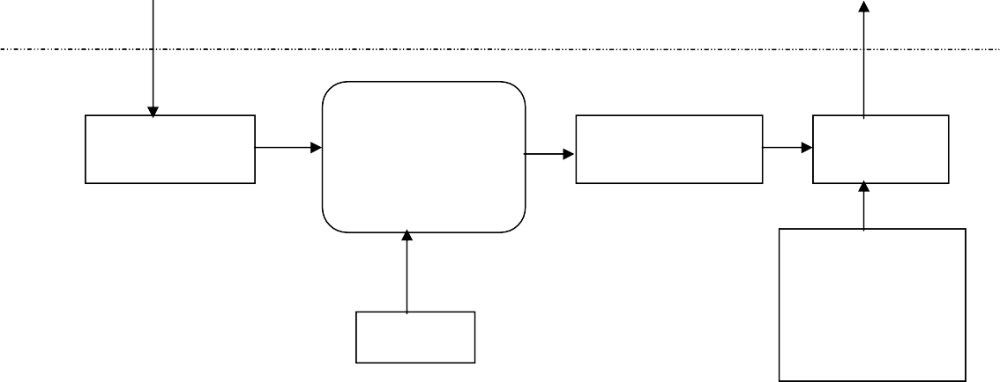
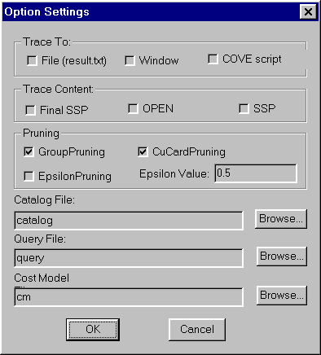
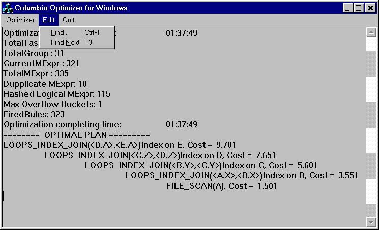

**EFFICIENCY IN THE COLUMBIA DATABASE QUERY OPTIMIZER**

By YONGWEN XU

A thesis submitted in partial fulfillment of the requirements for the degree of

MASTER OF SCIENCE

in COMPUTER SCIENCE

Portland State University 1998

ABSTRACT

An abstract of the thesis of Yongwen Xu for the Master of Science in Computer Science presented February 12,1998.

Title: Efficiency in the Columbia Database Query Optimizer

Query optimization is an area where database systems can achieve significant performance gains. Modern database applications demand optimizers with high extensibility and efficiency. Although more than one decade’s efforts have been contributed to these areas, the state of the art in optimizer research is still not adequate for the demands of business. The goal of our Columbia project is to provide efficient and extensible tools for query optimization, particularly for complex queries and new data models. Efficiency is the main focus of this thesis.

This thesis describes the design and implementation of the Columbia Query Optimizer, which obtains significant performance improvement while extensibility is not sacrificed. Based on the top-down optimization algorithm of the Cascades Optimizer Framework, Columbia simplifies the design of top-down optimizers by carefully reengineering the search space structure and search algorithms. Two pruning techniques are implemented which can achieve significantly better performance improvement. Usability is also improved in Columbia by adding a friendly user interface and extensive tracing support. Experiments on the Columbia optimizer were

done using the relational data model. Results will be demonstrated in efficiency

improvement by comparing Columbia to other top-down optimizers, such as Cascades.

THESIS APPROVAL

The abstract and thesis of Yongwen Xu for the Master of Science in Computer Science were presented February 12, 1998, and accepted by the thesis committee and the department.

COMMITTEE APPROVALS:

Leonard Shapiro, Chair

Jingke Li

John Rueter

Representative of the Office of Graduate Studies

DEPARTMENT APPROVAL:

Richard Hamlet, Chair Department of Computer Science

**Acknowledgments**

Many people helped in the work of this thesis. I am grateful to all of them.

Many thanks to my advisor, Professor Leonard Shapiro. I owe him a great deal for his help and guidance from the beginning of the research to the end of the thesis. Thanks for his friendly supervision, visionary instructions and extreme patience. Thanks to Keith Billings for sharing his work in Model D and the helpful discussions about models and search algorithms in Columbia and Cascades. Thanks to Professor Jingke Li for providing an experimental platform for the performance analysis of our work. Beth Phelps and Cynthia Beretta-Loepp in the Computer Science department office provided essential support for our efforts.

Thanks to Professor David Maier and graduate student Quan Wang at Oregon Graduate Institute for suggestions and helpful discussions regarding the design and development of Columbia, pruning techniques, and optimization of object-oriented data models. The work of this thesis also benefits from discussions on top-down optimization efforts in industry. Goetz Graefe and Cesar Galindo-Legaria told us about Microsoft’s new transformation-based optimizer. They are very useful for the design of the Columbia optimizer.

Last but not least, thanks to my wife, Wen Huang, for her long-lasting understanding and support during the entire project. She also provided valuable comments for this thesis as well as sharing her knowledge on TPC-D queries and Microsoft SQL Server optimizer.

This research is supported by NSF IRI-9119446, DARPA (BAAB07=91-C- Q513) subcontract from Oregon Graduate Institute to Portland State University.

**Table of Contents**

[Chapter 1 . Introduction 1](#chapter-1--introduction)

1.  [Motivation for This Research 1](#motivation-for-this-research)
    1.  [Overview of This Thesis 4](#overview-of-this-thesis)

        [Chapter 2 . Terminology 6](#chapter-2--terminology)

    2.  [Query Optimization 6](#query-optimization)
    3.  [Logical Operators and Query Tree 8](#logical-operators-and-query-tree)
    4.  [Physical Operators and Execution Plan 10](#physical-operators-and-execution-plan)
    5.  [Groups 11](#groups)
    6.  [The Search Space 15](#the-search-space)
    7.  [Rules 18](#rules)

        [Chapter 3. Related Work 21](#chapter-3-related-work)

    8.  [The System R and Starburst Optimizer 21](#the-system-r-and-starburst-optimizer)
    9.  [The Exodus and Volcano Optimizer Generators 24](#the-exodus-and-volcano-optimizer-generators)
    10. [The Cascades Optimizer Framework 26](#the-cascades-optimizer-framework)

        [Chapter 4 . Structure of the Columbia Optimizer 31](#chapter-4--structure-of-the-columbia-optimizer)

    11. [Overview of the Columbia Optimizer 31](#overview-of-the-columbia-optimizer)
        1.  [The Optimizer Input 31](#the-optimizer-input)

            [4.1.2. The Optimizer Output 34](#412-the-optimizer-output)

            [4.1.3 The External Dependence of Optimizer 35](#413-the-external-dependence-of-optimizer)

    12. [The Search Engine 36](#the-search-engine)
        1.  [The Search Space 37](#the-search-space-1)
            1.  [Search Space Structure - Class SSP 37](#search-space-structure---class-ssp)
            2.  [Duplicate Multi-expression Detection in the Search Space 39](#duplicate-multi-expression-detection-in-the-search-space)
            3.  [GROUP 42](#group)
            4.  [Expressions 49](#expressions)
        2.  [Rules 51](#rules-1)
            1.  [Rule Binding 53](#rule-binding)
            2.  [Enforcer Rule 56](#enforcer-rule)
        3.  [Tasks -- Searching Algorithm 61](#tasks----searching-algorithm)
            1.  [O_GROUP - Task to Optimize a Group 63](#o_group---task-to-optimize-a-group)
            2.  [E_GROUP - Task to expand the group 65](#e_group---task-to-expand-the-group)
            3.  [O_EXPR - Task to optimize a multi-expression 67](#o_expr---task-to-optimize-a-multi-expression)
            4.  [APPLY_RULE - Task to Apply a Rule to a Multi-Expression 69](#apply_rule---task-to-apply-a-rule-to-a-multi-expression)
            5.  O_INPUTS - Task to optimize inputs and derive cost of an expression 70 4.3 Pruning Techniques 74
        4.  [Lower Bound Group Pruning 74](#lower-bound-group-pruning)
        5.  [Global Epsilon Pruning 77](#global-epsilon-pruning)
    13. [Usability in the Columbia Optimizer 80](#usability-in-the-columbia-optimizer)
        1.  [Windows Interface 80](#windows-interface)
        2.  [Tracing of the optimizer 83](#tracing-of-the-optimizer)

            [Chapter 5 . Result and Performance 86](#chapter-5--result-and-performance)

            [5.1 Performance on Chain and Star Queries 86](#51-performance-on-chain-and-star-queries)

            [5.2. Comparison with Cascades 89](#52-comparison-with-cascades)

            [5.3 Epsilon Pruning Technique Analysis 91](#53-epsilon-pruning-technique-analysis)

            [Chapter 6 . Conclusions and Future works 94](#chapter-6--conclusions-and-future-works)

            [References 97](#references)

            [Appendix B. Cost Model Text File Example 101](#appendix-b-cost-model-text-file-example)

            [Appendix C. A Simple Rule Set for Join Queries 102](#appendix-c-a-simple-rule-set-for-join-queries)

            [Appendix D. A Final Search Space Example in Tracing File 103](#appendix-d-a-final-search-space-example-in-tracing-file)

            [Appendix E. An OPEN Task Stack Sample in Tracing File 105](#appendix-e-an-open-task-stack-sample-in-tracing-file)

**List of Tables**

Table 1. Complexity of Join of n Relations [Bil97] 18

Table 2. Grammar of the Query Tree 32

Table 3. Data Member Definition of class M_EXPR in Columbia 50

Table 4. Data Member Definition of class EXPR_LIST in Cascades 50

**List of Figures**

Figure 1. Query Processing 6

Figure 2. Query Representation 10

Figure 3. Execution plans 11

Figure 4. Logically equivalent query trees and plans 12

Figure 5. Equivalent expressions in groups [ABC] 13

Figure 6. Equivalent multi-expressions in group [ABC] 14

Figure 7. Initial Search Space of a given query 16

Figure 8. Two types of Rules 20

Figure 9. Interface of Columbia Optimizer 31

Figure 10. An Example of Query Text File and Query Expression Tree 34

Figure 11. Two Optimal Plans for one Query with different Catalogs 35

Figure 12. Main components in the Columbia Search Engine 37

Figure 13. Pseudo-code for the Use of lookup2() 41

Figure 14. Pseudo-code for calculating lower bound of a group 44

Figure 15. Finite State Machine for BINDERY::advance() 56

Figure 16. Main Loop of Optimization in Columbia 62

Figure 17. Relationship between Tasks 63

Figure 18. Algorithm for O_GROUP 64

Figure 19. Algorithm for E_GROUP 66

Figure 20. Algorithm for O_EXPR 68

Figure 21. Algorithm for APPLY_RULE 70

Figure 22 Pseudo-code of O_INPUTS::perform() 72

Figure 23. Search space during optimization ( [AC] is Cartesian product ) 75

Figure 24. Algorithm of Lower Bound Pruning 76

Figure 25. A situation when lower bound pruning happens 77

Figure 26. A Dialog to allow user to change parameters of the optimizer 81

Figure 27. A picture of the optimizer application 83

Figure 28. Optimization time for chain and star queries 87

Figure 29. Number of multi-expressions generated in chain and star queries 88

Figure 30. Memory usage for chain and star queries 89

Figure 31. Optimization time for chain queries 90

Figure 32. Optimization time for star queries 91

Figure 33.Effectiveness of Epsilon pruning 92

Figure 34. Errors to optimal plan of Epsilon pruning 93

# Chapter 1 . Introduction

## Motivation for This Research

In spite of the fact that query optimization has been a subject of research for more than 15 years [SAC+79], query optimizers are still among the largest and most complex modules of database systems, making their development and modification into difficult and time-consuming tasks. The situation is further complicated by the needs of modern database applications [ZdM90], such as Decision Support Systems (DSS) and On-Line Analytical Processing (OLAP), large data warehouses, complex objects (e.g., multimedia databases, WWW and GIS), and the need to handle new evaluation techniques (e.g., parallel and distributed evaluations). These new application areas in turn demand new database technologies, such as new query languages and new query processing techniques, which are quite different from those in traditional transaction processing applications.

Over the past several years, several generations of commercial and research query optimizers have been developed, making contributions to the extensibility and efficiency of optimizers.

The first efforts at extensible optimizer technology (we call it the first generation.), begun about ten years ago, realized the need for new data models, query classes, languages and evaluation techniques. These projects include Exodus [GrD87] and Starburst [HCL90]. Their goal was to make optimizers more modular and easier to extend. The techniques they used include layering of components, rule-based

transformations, etc. Those efforts had some shortcomings, such as the complexity of making extensions, search performance, and a bias toward record-oriented data models.

The second generation of extensible optimizer tools, such as the Volcano optimizer generator [GrM93], added more sophisticated search techniques, more use of physical properties to guide search, and better control over search strategy, to achieve better search performance. Although these optimizers are somewhat flexible, it is still hard and complex to make extensions.

The third generation of query optimizer frameworks, such as Cascades [Gra95], OPT++ [KaD96], EROC [MBH96] and METU [ONK95], use object-

oriented design to simplify the task of implementing, extending and modifying an optimizer, while maintaining efficiency and making search strategies more flexible. This latest generation of optimizers is reaching a level of sophistication that satisfies the requirements and demands of modern commercial database systems. This is demonstrated by industry’s implementation of these optimizers, such as Cascades by Microsoft [Gra96] and Tandem [Cel96], EROC by NCR [MBH96].

These three generations of query optimizers can be categorized into two kinds of search strategies, Starburst style bottom-up dynamic programming optimizers and Cascades style top-down branch and bound rule-driven cost based optimizers. Bottom- up optimization is widely used in current traditional commercial database systems because it is believed to be efficient, at least in traditional applications. But bottom-up optimization is inherently less extensible than top-down optimization since it requires the decomposition of the original problem into sub problems. Also, to achieve

acceptable performance for large queries, heuristics are required in bottom-up optimization.

Although previous implementations of top-down optimizers showed they have been difficult to tune for competitive performance as bottom-up optimization, we believe that top-down optimizers have advantages in efficiency as well as extensibility. The remainder of this thesis describes our attempt to develop an alternative top-down optimizer, Columbia, to demonstrate that high efficiency could be achieved in a top-down approach.

Based on the top-down optimization of the Cascades Optimizer Framework, Columbia extensively exploits the object-oriented features of C++ and carefully engineers and simplifies the top-down optimization to achieve efficiency while maintaining extensibility. It defines a few key abstract classes with virtual methods. The search strategy is implemented entirely in terms of these abstract classes. The search strategy invokes the virtual methods of these abstract classes to perform the search and the cost-based pruning of the search space. Hence, it is easy to extend the optimizer to manipulate complex data models, adding new operators and transformation rules by deriving new classes from the abstract classes and rewriting the virtual methods. Since the main focus of this thesis is optimization efficiency in the relational data model, we do not discuss extensibility of the optimizer here and leave extending the optimizer to manipulate other data model as future works.

To minimize the usage of CPU and memory, several engineering techniques are used to obtain efficiency in Columbia. They include a fast hash function to eliminate duplicate expressions, separation of logical and physical expressions in a

group, small and compact data structures, efficient algorithms to optimize groups and inputs, and an efficient way to handle enforcers.

An important technique Columbia provides is group pruning, which significantly prunes the search space without compromising plan quality. The optimizer computes the cost for high-level physical plans before some lower-level plans are generated. These early costs serve as upper bounds for subsequent optimization. We will show that in many cases these upper bounds can be used to avoid generating entire groups of expressions, hence, pruning significant amounts of possible query plans in the search space.

Besides group pruning, Columbia also implements another pruning technique: global epsilon pruning. This technique significantly prunes the search space by generating acceptable close-to-optimal solutions. An optimization goal is finished when a solution is found to be close enough to the optimal solution, hence a significant amount of expressions need not be considered. An analysis of this pruning technique is discussed. The effectiveness and error in the optimization are shown.

## Overview of This Thesis

The remainder of this thesis is organized as follows.

Chapter 2 describes the terminology and fundamental concepts used in this

thesis.

Related work is presented in Chapter 3, in which we survey the commercial and research contributions in this area, from traditional to new generations, from bottom-up to top-down optimizers. We will focus on performance analysis.

In Chapter 4, the overall structure and design of the Columbia system is described, including search space, rules and optimizing tasks. Two pruning techniques are discussed. Usability improvement is also discussed in this chapter. Since Columbia is built based on Cascades, the discussion will focus on the comparison between them and explain how Columbia achieves better efficiency.

Chapter 5 demonstrates the results we gathered from our experiences using our optimizer. Performance improvements are illustrated, comparing to other optimizers.

Chapter 6 contains a summary and conclusions, and outlines potential future research directions.

# Chapter 2 . Terminology

In this section we review the terminology and fundamental concepts in the literature of query optimization [ElN94] [Ram97], which are also used in the description of the design and implementation of Columbia. More detailed terminology will be discussed in Chapter 4, the structure of the Columbia optimizer.

## Query Optimization

The purpose of a query processor is to take a request expressed in the data manipulation language (DML) of a database system and evaluate it against the contents of a database.

**Figure 1. Query Processing**

Figure 1 diagrams the steps in query processing. The original query in DML syntax is parsed into a logical expression tree over a logical algebra that is easily manipulated by later stages. This internal logical form of the query then passes to the

Query Optimizer, which is responsible for transforming the logical query into a physical plan1 that will be executed against the physical data structure holding the data. Two kinds of transformations will be performed: Logical transformations which create alternative logical forms of the query, such as commuting the left and right children of the tree, and physical transformations which choose a particular physical algorithm to implement a logical operator, such as sort-merge join for join. This process generates, in general, a large number of plans that implement the query tree. Finding the optimal plan (relative to the cost model, which includes statistical and other catalog information) is the main concern of the query optimizer. Once an optimal (or near optimal) physical plan for the query is selected, it is passed to the query execution engine. The query execution engine executes the plan using the stored database as input, and produces the result of the query as output.

If we look at the user level, the query processing is hidden in the dark box of the query processor. Users will submit their queries, which in general, are written in a high level language like SQL, Quel, or OQL [Cat94] (in the case of object-oriented database systems) to the database system, with the expectation that the system will output the results of the queries correctly and quickly. Correctness is an absolute requirement of a query processor, while performance is a desirable feature and the main concern of a query processor. As we can see in the system level of query processing, the query optimizer is a critical component that contributes to high performance. There are a large number of plans that implement the query correctly,

1 A plan is an algebra expression with a choice of implementation methods for each operator that it contains.

but with different execution performance for some performance measures (e.g., execution time, memory). One goal of the optimizer is to find the plan with the best2 execution performance. A naive way an optimizer could do this is to generate all possible plans and choose the cheapest. But exploring all possible plans is prohibitively expensive because of the large number of alternative plans for even relatively simple queries. Thus optimizers have to somehow narrow down the space of alternative plans that they consider.

Query optimization is a complex search problem. Research has shown that simplified versions of this problem are NP-hard [IbK84]. In fact, even for the simplest class of relational joins, the number of joins that have to be evaluated when using dynamic programming is exponential with the number of input relations [OnL90]. So a good search strategy is critical to the success of an optimizer.

The remainder of this chapter will review some fundamental concepts used in solving the query optimization problem. We will use these concepts to describe the design and implementation of Columbia.

## Logical Operators and Query Tree

L**ogical operators** are high-level operators that specify data transformations without specifying the physical execution algorithms to be used. In the relational

2 In theory, optimality is the goal. However, optimality is relative to many aspects, such as cost model, catalog information and sometimes to a particular subset of the search space. So, in practice and more precisely, the goal of a query optimizer is to find a good evaluation plan for a given query.

model, logical operators generally take tables3 as inputs, and produce a single table as output. Each logical operator takes a fixed number of inputs (which is called the **arity** of the operator) and may have parameters that distinguish the variant of an operator. Two typical logical operators are GET and EQJOIN. The GET operator has no input and one argument, which is the name of the stored relation. GET retrieves the tuples of the relation from disk and outputs the tuples for further operations. The EQJOIN operator has two inputs, namely the left and right tables to be joined, and one argument which is a set of join predicates relating to the left and right tables.

A **query tree** is a tree representation of a query and serves as the input to an optimizer. Typically a query tree is represented as a tree of logical operators in which each node is a logical operator having zero or more logical operators as its inputs. The number of children of the node is exactly the arity of the operator. Leaves of the tree are operators with zero arity. An example of a query tree representation of a query is showed in Figure 2.

Query trees are used to specify the order in which operators are to be applied. In order to apply the top operator in the tree, its inputs must be applied first. In this example, EQJOIN has two inputs, which are taken from the outputs of two GET operators. The argument of EQJOIN, i.e., “Emp.dno=Dept.dno”, describes the condition of the join operation. The output of EQJOIN will produce the result of query. GET operators have no input, so they are the leaves of the tree and generally

3 Here, we define table as a collection of tuples. In the relational model, it can be a real stored relation (roughly, a disk file) or a temporary collection of tuples produced in the evaluation of a query.

provide data sources of the query evaluation. The argument of each GET operator defines which stored relation will be retrieved.

**Figure 2. Query Representation**

## Physical Operators and Execution Plan

**Physical Operators** represent specific algorithms that implement particular database operations. One or more physical execution algorithms can be used in a database for implementing a given query logical operator. For instance, the EQJOIN operator can be implemented using nested-loops or sort-merge or other algorithms. These specific algorithms can be implemented in different physical operators. Thus, two typical physical operators are LOOPS_JOIN, which implements the nested-loops join algorithm, and MERGE_JOIN, which implements the sort-merge join algorithm. The typical implementing algorithm for the GET logical operator is scanning the table in stored order, which is implemented in another physical operator FILE_SCAN. Like logical operators, each physical operator also has fixed number of inputs (which is the arity of the operator), and may have parameters.

Replacing the logical operators in a query tree by the physical operators which can implement them gives rise to a tree of physical operators which is called an **Execution Plan** or access plan for the given query. Figure 3 shows two possible execution plans corresponding to the query tree in Figure 2(b).

**Figure 3. Execution plans**

Execution plans specify how to evaluate the query. Each plan has an execution cost corresponding to the cost model and catalog information. In general, a good execution plan for a given query is generated by the optimizer and serves as the input to the Query Execution Engine which executes the overall algorithms against the data of database systems to produce the output result of the given query.

## Groups

A given query can be represented by one or another query tree that is logically equivalent. Two query trees are **logically equivalent** if they output exactly the same result for any population of the database [Gra95]. For each query tree, in general, there are one or more corresponding execution plans implementing the query tree and

producing exactly the same result. Analogously, these execution plans are logically equivalent. Figure 4 shows several logically equivalent query trees and logically equivalent execution plans implementing the query trees.

**Figure 4. Logically equivalent query trees and plans**

As shown in Figure 4, we denote an EQJOIN operator by 0**,** LOOPS_JOIN

by 0**L,** and MERGE_JOIN by 0**M**. To simplify, we also denote a GET operator by its argument and FILE_SCAN by its argument plus sub F. In Figure 4, (a) and (b) are two logically equivalent query trees. The difference is the order of logical operators.

(a-i) and (a-ii) are two logically equivalent execution plans implementing query tree (a). They use two different join algorithms.

We can also use **expressions** to represent query trees and execution plans (or sub trees and sub plans). An expression consists of an operator plus zero or more input expressions. We refer to an expression as logical or physical based on the type of its operator. So query trees are logical expressions and execution plans are physical expressions.

Given a logical expression, there are a number of logically equivalent logical and physical expressions. It is useful to collect them into groups and define their common characteristics. A **Group** is a set of logically equivalent expressions4. In general, a group will contain all equivalent logical forms of an expression, plus all physical expressions derivable based on selecting allowable physical operators for the corresponding logical forms. Usually, there will be more than one physical expression for each logical expression in a group. Figure 5 shows a group containing the expressions in Figure 4 and other equivalent expressions.

**Figure 5. Equivalent expressions in groups [ABC]**

4 Note that a group might not contain all equivalent expressions. In some case where a pruning technique has been applied, some expressions will not be considered and do not need to be included in the group.

We usually denote a group by one of its logical expressions. For instance, (A 0 B) 0 C, or simply [ABC]. Figure 5 shows all5 equivalent logical expressions for the group [ABC] and some physical expressions. We can see that there are a number

of equivalent expressions, even for logical expressions.

To reduce the number of expressions in a group, Multi-expressions are introduced. A **Multi-expression** consists of a logical or physical operator and takes groups as inputs. A multi-expression is the same as an expression except it takes groups as inputs while expressions take other expressions as inputs. For instance, the

multi-expression “ [AB] 0 [C] ” denotes the EQJOIN operator taking the groups [AB] and [C] as its inputs. The advantage of multi-expressions is the great savings in space because there will be fewer equivalent multi-expressions in a group. Figure 6

shows the equivalent multi-expressions in the group [ABC]. There are many fewer multi-expressions than expressions in figure 5. In fact, one multi-expression represents several expressions by taking groups as inputs. With multi-expressions, a group can be re-defined as a set of logically equivalent multi-expressions.

**Figure 6. Equivalent multi-expressions in group [ABC]**

5 For simple cases, the group consists of join operators only.

In the typical processing of a query, many intermediate results (collections of tuples) are produced before the final result is produced. An intermediate result is produced by computing an execution plan (or a physical expression) of a group. In this meaning, groups correspond to intermediate results (these groups are called **intermediate groups**). There is only one final result, whose group is called the **final group**).

The **Logical properties** of a group are defined as the logical properties of the result, regardless of how the result is physically computed and organized. These properties include the cardinality (number of tuples), the schema, and other properties. Logical properties apply to all expressions in a group.

## The Search Space

The **search space** represents logical query trees and physical plans for a given initial query. To save space, the search space is represented as a set of groups, each group takes some groups as input. There is a top group designated as the final group, corresponding to the final result from the evaluation of the initial query. Figure 7 shows the initial search space of the given query.

In the **initial search space**, each group includes only one logical expression, which came from the initial query tree. In figure 7, the top group, group [ABC], is the final group of the query. It corresponds to the final result of the joins of three relations. We can derive the initial query tree from an initial search space. Each node in a query tree corresponds to an operator of a multi-expression in each group of the search

space. In Figure 7, top group [ABC] has a multi-expression which consists of an operator EQJOIN and two groups, [AB] and [C], as inputs. We can derive a query tree with the EQJOIN as the top operator and the input operators are derived from group [AB] and group [C], keep deriving input operators of the query tree from the input groups recursively until the considering groups are leaves (no input). The query tree derived from this initial search space is exactly the initial query tree. In other words, initial search space represents initial query tree.

**Figure 7. Initial Search Space of a given query**

In the course of optimization, the logically equivalent logical and physical expressions for each group are generated and the search space greatly expands. Each group will have a large number of logical and physical expressions. At the same time as the optimization generates physical expressions, the execution costs of the physical expressions (i.e., execution plans) are calculated. In some sense, generating all the physical expressions is the goal of the optimization since we want to find the cheapest plan and we know that costs are only related to physical expressions. But in order to generate all the physical expressions, all the logical expressions must be generated

since each physical expression is the physical implementation of a logical expression. After the optimization is done, namely, all equivalent physical expressions are generated for each group and the costs of all possible execution plans are calculated, the cheapest execution plan can be located in the search space and served as the output of the optimizer. A completely expanded search space is called a **final search space.** Normally6, a final search space represents all the logically equivalent expressions (logical and physical) of a given query. In fact, all the possible query trees and execution plans can be derived from the final search space by using the recursive method we use to derive the initial query tree from the initial search space. Each (logical or physical) operator of a multi-expression in the search space serves as an operator node in a query tree or an execution plan. Since a group in the search space contains a number of logical equivalent expressions, the final search space represents a large number of query trees and execution plans.

Table 1 [Bil97] shows the complexity of complete logical search space of join of n relations. (Only the numbers of logical expressions are showed.) For example, the search space of join of 4 relations has 15 groups, includes 54 logical expressions and represents 120 query trees.

As can be seen from Table 1, even considering only the logical expressions, the size of the search space increases dramatically (exponentially) as the number of the

6 In some cases, pruning applies to the expansion of the search space, and then some expressions may not be generated. It may be that entire groups are not expanded. Some pruning techniques will be described in Section 4.4.

joined relations increases. The number of physical expressions depends on how many7 implementation algorithms used for the logical operators. For example, if there are N logical expressions in the search space, and M (M\>=1) join algorithms are used in the database systems, then there will be M\*N total physical expressions in the search space. So the number of physical expressions is at least the same as the number of logical expressions or larger.

| Number of Relations | Number of Groups | Number of Logical Expressions | Number of Query Trees    |
|---------------------|------------------|-------------------------------|--------------------------|
| N                   | 2N – 1           | 3N – (2N+1 – 1) + N           | (2N – 2)! / (N – 1)!     |
| 2                   | 3                | 4                             | 2                        |
| 3                   | 7                | 15                            | 12                       |
| 4                   | 15               | 54                            | 120                      |
| 5                   | 31               | 185                           | 1680                     |
| 6                   | 63               | 608                           | 30240                    |
| 7                   | 127              | 1939                          | 665280                   |
| 8                   | 255              | 6058                          | 17297280                 |
| 9                   | 511              | 18669                         | 518918400                |
| 10                  | 1023             | 57012                         | 17643225600              |
| 11                  | 2047             | 173063                        | 670442572800             |
| 12                  | 4095             | 523262                        | 28158588057600           |
| 13                  | 8191             | 1577953                       | 1295295050649600         |
| 14                  | 16383            | 4750216                       | 64764752532480000        |
| 15                  | 32767            | 14283387                      | 3497296636753920000      |
| 16                  | 65535            | 43915666                      | 202843204931727360000    |
| 17                  | 131071           | 128878037                     | 12576278705767096254464  |
| 18                  | 262143           | 386896220                     | 830034394580628315045888 |

**Table 1. Complexity of Join of n Relations [Bil97]**

## Rules

Many optimizers use rules to generate the logically equivalent expressions of a given initial query. A **rule** is a description of how to transform an expression to a

7 Different database systems may choose a certain different number of algorithms to implement one logical operator. For example, nested-loops, sort-merge and index- nested-loops are the common join algorithms database systems choose.

logically equivalent expression.. A new expression is generated when a rule is applied to a given expression. It is the rules that an optimizer uses to expand the initial search space and generate all the logically equivalent expressions of a given initial query.

Each rule is defined as a pair of pattern and substitute. A **pattern** defines the structure of the logical expression that can be applied to the rule. A **substitute** defines the structure of the result after applying the rule. When expanding the search space, the optimizer will look at each logical expression, (note that rules only apply to logical expressions), and check if this expression matches any patterns of the rules in the rule set. If the pattern of a rule is matched, the rule is fired to generate the new logically equivalent expression according to the substitute of the rule.

Cascades used expressions to represent patterns and substitutes. Patterns are always logical expressions, while substitutes can be logical or physical. Transformation rules and implementation rules are two common types of rules. A rule is called t**ransformation rule** if its substitute is a logical expression. A rule is called **implementation rule** if its substitute is a physical expression.

For example, EQJOIN_LTOR is a transformation rule that applies left to right associativity to a left deep logical expression and generates a right deep logical expression that is logically equivalent to the original expression. EQJOIN_MERGEJOIN is an implementation rule that generates a physical expression by replacing the EQJOIN operator with MERGEJOIN physical operator. This physical expression implements the original logical expression using sort-merge join algorithm. Figure 8 shows a picture of these two simple rules.

**Figure 8. Two types of Rules**

# Chapter 3. Related Work

Pioneering work in query optimization can be traced back to two decades ago. IBM’s System R optimizer [SAC+79] succeeded and worked so well that it has served as the foundation for many current commercial optimizers.

Database systems and applications evolve and demand new generations of optimizers to handle new extensions to database systems. The relational data model is extended with more features, such as supporting new data types and new operations. The object oriented data model is introduced to handle more complex data. Since early optimizers were designed to use with a relatively simple relational data model, new generations of extensible optimizers were developed to meet the requirements of evolving database systems. The new generations of optimizers focus on extensibility as well as the difficult goal of all optimizers: efficiency. This chapter will look at some notable optimizers that contribute significantly to the query optimization literature.

## The System R and Starburst Optimizer

Current relational query optimizers have been greatly influenced by techniques used in the design of IBM’s System R query optimizer [SAC+79]. One of the important contributions of the System R optimizer is cost-based optimization. The optimizer use statistics about relations and indexes stored in the system catalog to estimate the cost of a query evaluation plan. There are two parts to estimating the cost:

one is estimating the cost of performing the operators. The other is estimating the size of the result of a query block8, and whether it is sorted.

Estimating the cost of operators requires knowledge of various parameters of the input relations, such as the cardinality (size of the relation), number of pages and available indexes. Such statistics are maintained in the DBMS’s system catalogs. Size estimation plays an important role in cost estimation because the output of one operator can be the input to another operator, and the cost of an operator depends on the size of its inputs. System R defined a series of size estimation formulas which are also used by current query optimizers, although more sophisticated techniques based on more detailed statistics (e.g., histograms of the values in a system) have been proposed in recent years [Ioa93] [PIH96].

Another important contribution of the System R optimizer is the bottom-up dynamic programming search strategy. The idea of dynamic programming is to find the best plans of the lower level query blocks9 in the query tree and only keep the best plans for consideration with the upper level query blocks. It is a bottom-up style, since it always optimizes the lower level expressions first. In order to calculate the cost of an upper level expression, all the costs (as well as the sizes of the results) of its lower level inputs (also expressions) must be calculated. The dynamic programming trick is: after we optimize a query block (i.e., we find a best plan), we throw away all the equivalent expressions of this query block and only keep the best plan for this query block. [OnL90] pointed out that dynamic programming needs to consider O(3N)

8 System R decomposes queries into a collection of smaller units call query blocks.

9 In some sense, a query block in System R is like a group in Cascades and Columbia.

expressions (plans). Because of this exponential growth rate, when N is large, the number of expressions which the optimizer needs to consider is still unacceptable. So the System R optimizer also use heuristics such as delaying optimization of Cartesian products until final processing or considering only left deep trees (which excludes a large number of query trees, like bushy trees) when optimizing large queries [GLS93]. However, the exclusion of Cartesian products or considering only left deep trees may force a poor plan to be chosen, hence optimality can not be guaranteed.

IBM’s Starburst optimizer [HCL90] extends the System R optimizer with an extensible and more efficient approach. The Starburst optimizer consists of two rule- based sub systems: the query re-write or Query Graph Model (QGM) optimizer and the plan optimizer. A QGM is the internal, semantic representation of a query. The QGM optimizer uses a set of production rules to transform a QGM heuristically into a semantically equivalent “better” QGM. The purposes of this phrase are simplification and amelioration [JaK84]: eliminating redundancy and deriving expressions that are easier for the plan optimizer to optimize in a cost-based manner. The plan optimizer is a select-project-join optimizer consisting of a join enumerator and a plan generator. The join enumerator uses two kinds of join feasibility criteria (mandatory and heuristic) to limit the number of joins. The join enumerator algorithm is not rule-based and written in C and its modular design allows it to be replaced by alternative enumeration algorithms. The plan generator uses grammar-like production rules to construct access plans for joins. These parameterized production rules are called STrategic Alternative Rules (or STARs). The STARs can determine which table is the inner and which is the outer, which join methods to consider, etc.

In Starburst, Query optimization is a two step process. In the first phase, An initial query expressed as a QGM is passed to the QGM optimizer and be re-written to a new better QGM. The new QGM is then passed to the plan optimizer. In the second phase, the plan optimizer communicates with the QGM optimizer to produce access plans, and construct an optimal execution plan in a bottom up fashion similar to the System R optimizer.

The QGM optimizer is capable of sophisticated heuristic optimization. Thus it contributes to the efficiency of the Starburst optimizer. However, as [KaD96] pointed out, the heuristics sometimes make incorrect decisions because they are based on only logical information, i.e., not based on cost estimates. Also, heuristics are hard to extend to more complicated queries containing non-relational operators. Obviously, the grammar-like rule-based approach to transform QGMs and plans is a contribution to extensible query optimization, but is not clear how this can be used to optimize queries containing non-relational operators and complicated transformations.

## The Exodus and Volcano Optimizer Generators

The Exodus optimizer generator [GrD87] was the first extensible optimizer framework using top-down optimization. The goal of Exodus is to build an infrastructure and tool for query optimization with minimal assumptions about the data model. The input into Exodus is a model description file, which describes a set of operators, a set of methods to be considered when building and comparing access plans, transformation rules (defining the transformations of the query tree) and implementation rules (defining the correspondence between operators and methods).

To implement a query optimizer for a new data model, the DBI10 writes a model description file and a set of C procedures. The generator transforms the model file into a C program which is compiled and linked with the set of C procedures to generate a data model specific optimizer. The generated optimizer transforms the initial query tree step by step, maintaining information about all the alternatives explored so far in a data structure called MESH. At any time during the optimization there can be a set of possible next transformations, which are stored in a queue structure, called OPEN. When the OPEN is not empty, the optimizer will select a transformation from OPEN, apply it to the correct nodes in MESH, do cost estimation for the new nodes and add newly enable transformation into OPEN.

The main contribution of Exodus is the top-down optimizer generator framework which separates the search strategy of an optimizer from the data model and separates transformation rules and logical operators from implementation rules and physical operators. Although it was difficult to construct efficient optimizers, it contributed as a useful foundation for the next generation of extensible optimizers.

With the primary goal of improving the efficiency of Exodus, Volcano Optimizer Generator [GrM93] is designed to achieve more efficiency, further extensibility and effectiveness. Efficiency was achieved by combing dynamic programming with directed search based on physical properties, branch-and-bound pruning and heuristic guidance into a new search algorithm that is called directed dynamic programming. The search strategy in Volcano is a top-down, goal-oriented

10 DataBase Implementers (DBI) are the programmers implementing a database system, including creating a system for a new data model and enhancing an existing system.

control strategy: sub expressions are optimized only if warranted. That is, only those expressions and plans that truly participate in promising larger plans are considered for optimization. It also uses dynamic programming to store all optimal sub plans as well as optimization failures until a query is completely optimized. Since it is very goal-oriented though the use of physical properties ( a generalization of “interesting properties” used in System R) and derives only those expressions and plans which are promising, the search algorithm is efficient. More extensibility in Volcano was achieved by generating optimizer source code from data model specifications and by encapsulating costs as well as logical and physical properties into abstract data types. Effectiveness was achieved by permitting exhaustive search, which is pruned only at the discretion of the optimizer implementers.

The efficiency of the Volcano search strategy permitted the generation of real optimizers, one for an object-oriented database system [BMG93] and one for a prototype scientific database system with many rules [Wog93].

## The Cascades Optimizer Framework

The Cascades Optimizer Framework [Gra95] is an extensible query optimization framework that resolves many short-comings of the EXODUS and Volcano optimizer generators. It achieves a substantial improvement over its predecessors in functionality, ease-of-use, and robustness without giving up extensibility, dynamic programming and memoization. The choosing of Cascades as the foundation for new query optimizers in Tandem’s NonStop SQL product [Cel96] and in Microsoft’s SQL Server product [Gra96] demonstrated that Cascades satisfies

the requirements and demands of modern commercial database systems. The following list some of advantages of Cascades:

-   Optimization tasks as data structures
-   Rules as objects
-   Rules to place property enforcers such as sort operations
-   Ordering of moves by promise
-   Predicates as operators that is both logical and physical
-   Abstract interface class defining the DBI-optimizer interface and permitting DBI-defined subclass hierarchies.
    -   More robust code written in C++ and a clean interface making full use of the abstraction mechanisms of C++
        -   Extensive tracing support and better documentation to assist the DBI

In Cascades, the optimization algorithm is broken into several parts, which are called “**tasks**”. Tasks are realized as objects in which a “perform” method is defined for them. All such task objects are collected in a task structure that is realized as a Last-In-First-Out stack11. Scheduling a task is very similar to invoking a function: the task is popped out of the stack and the “perform” method of the task is invoked. At any time during the optimization there is a stack of tasks waiting to be performed. Performing a task may result in more tasks being placed on the stack.

11 As [Gra95] pointed out, other task structures can easily be envisioned. In particular, task objects can be reordered very easily at any point, enabling very flexible mechanisms for heuristic guidance, Moreover, There are more advantages in representing the task structure by a graph that captures dependencies or the topological ordering among tasks and permit efficient parallel search (using shared memory).

The Cascades optimizer first copies the original query into the initial search space (in Cascades, the search space is called “memo” which is inherited from Volcano). The entire optimization process is then triggered by a task to optimize the top group of the initial search space, which in turn triggers optimization of smaller and smaller subgroups in the search space. Optimizing a group means finding the best plan in the group (which is called an “optimization goal”) and therefore applies rules to all expressions. In this process, new tasks are placed into the task stack and new groups and expressions are added into the search space. After the task of optimizing the top group is completed, which requires all the subgroups of the top group to complete their optimization, the best plan of the top group can be found, hence the optimization is done.

Like the Volcano optimizer generator, Cascades begins the optimization process from the top group and is considered to use a top-down search strategy. Dynamic programming and memoization are also used in the task of optimizing a group. Before initiating optimization of all a group’s expressions, it checks whether the same optimization goal has been pursued already; if so, it simply returns the plan found in the earlier search. One major difference between the search strategies in Cascades and Volcano is that Cascades only explores a group on demand while Volcano always generates all equivalent logical expressions exhaustively in the first pre-optimization phase before the actual optimization phase begin. In Cascades, there is no separation into two phases. It is not useful to derive all logically equivalent forms of all expressions, e.g., of a predicate. A group is explored using transformation rules only on demand, and it is explored only to create all members of the group that match

a given pattern. Since it explores groups only for truly useful patterns, Cascades search strategy is more efficient12.

Compared to the Volcano optimizer generator’s cumbersome user interface, Cascades provides a clean data structure abstraction and interface between DBI and optimizer. Each of the classes that makes up the interface between the Cascades optimizer and the DBI is designed to become the root of a subclass hierarchy. The optimizer relies only on the method defined in this interface; the DBI is free to add additional methods when defining subclasses. Some important interfaces include operators, cost model and rules. This clear interface is important in that it makes the optimizer more robust and makes it easier for a DBI to implement or extend an optimizer.

[Bil97] describes an experimental optimizer, Model D, for optimizing the TPC-D queries [TPC95] developed under the Cascades optimizer framework. Model D has many logical operators which in turn require a number of rules and physical operators. The new operators and rules are defined and easily added to the optimizer by the DBI by deriving from the base interface class. With only a few changes to the Cascades search engine, Model D demonstrates the extensibility of the Cascade framework in the relational model.

Cascades is just an optimizer framework. It proposed numerous performance improvements, but many features are currently unused or provided only in rudimentary form. The current design and implementation of Cascades leaves room

12 In the worst case, exploration of Cascades is exhaustive. Thus in the worst case the efficiency of the Cascades search will equal that of the Volcano search strategy.

for many improvements. The strong separation of optimizer framework and the DBI’s specification, extensive use of virtual methods, very frequent object allocation and de- allocation can cause performance problems. Some pruning techniques can be applied to the top-down optimization to dramatically improve search performance. All these observations motivate our research in Cascades and development of a new, more efficient optimizer – the Columbia optimizer.

# Chapter 4 . Structure of the Columbia Optimizer

Based on the Cascades framework, Columbia focuses on efficiency of optimization. This chapter will describe in detail the design and implementation of the Columbia optimizer. Comparison with Cascades will be discussed.

## Overview of the Columbia Optimizer

Figure 9 illustrates the interface of the Columbia optimizer. Columbia takes an initial query text file as input, uses a catalog and cost model information also written in text files provided by the DBI, and generates the optimal plan for the query as output.

**Figure 9. Interface of Columbia Optimizer**

### The Optimizer Input

In Columbia, the optimizer input is a text file which contains the initial query tree in the LISP style tree representation. A tree consists of a top operator and (if they exist) its inputs, which are represented as sub trees. Each tree or sub tree is parenthesized for separation.

Table 2 shows the BNF definition of the query tree in text format. In the query text file, comments are allowed and begun with “ // ” in each comment line. The query parser will ignore the comment lines. Sometimes comments are very helpful for the people writing and/or reading the query text file, since they provide additional more readable information. Each query text file represents only one query tree. Our current implementation of logical operators includes GET, EQJOIN, PROJECT and SELECT, which is enough to represent most typical Select-Project-Join queries. This design also allows easy extension to support other logical operators.

| FileContent | -\> | [CommentLine]\*                     |
|-------------|-----|-------------------------------------|
|             |     | Query                               |
| CommentLine | -\> | //string \\n                        |
| Query       | -\> | Table                               |
| Table       | -\> | GET(QuoStr) \|                      |
|             |     | (EQJOIN(Keys,Keys),Table,Table)\|   |
|             |     | (PROJECT(Keys),Table) \|            |
|             |     | (SELECT(Table,Pred)                 |
| Pred        | -\> | (OP1, ItemOp ) \|                   |
|             |     | (OP2, ItemOp, ItemOp )              |
| ItemOp      | -\> | ATTR \|                             |
|             |     | INT(QuoStr) \|                      |
|             |     | STR(QuoStr)                         |
| OP1         | -\> | OP_NOT                              |
| OP2         | -\> | OP_EQ \| OP_LT \| OP_LE \| OP_GT \| |
|             |     | OP_GE \| OP_NE \| OP_AND \| OP_OR   |
| Keys        | -\> | Attr \|                             |
|             |     | \<Attr,[Attr]\*\>                   |
| Attr        | -\> | string.string                       |
| QuoStr      | -\> | "string"                            |

**Table 2. Grammar of the Query Tree**

The Query Parser of the Optimizer reads in the query text file and stores it as an expression tree. The expression tree is implemented as a recursive data structure, an object of class EXPR which consists of an operator and none or more EXPR objects as inputs. Thus, the query expression tree can be traversed from the root (top) expression.

The expression tree serves as an intermediate format which is finally copied into the search space by the optimizer when the search space is initialized. This kind of module separation permits a high level of extensibility. The query parser has a loose relation with optimization (it takes a query text file as input and outputs a query expression), hence more operations can be easily added into the parser to support more functionality, such as schema checking, query re-write, etc. In Cascades, the initial query is represented as an expression tree directly written in C++ code and embedded into the code of the optimizer. If another initial query is to be optimized, the whole code of the optimizer needs to be compiled to include the changes to the initial query expression. In Columbia, only the query text file needs to be rewritten to represent the new initial query and there is no need to compile code.

Figure 10 shows an example of the content of a query text file and the corresponding query expression tree.

As shown in Figure 10, the predicate of the SELECT is represented as an expression tree serving as one of the inputs of the SELECT operator. In Columbia, in addition to logical and physical operators, there are item operators inherited from Cascades. **Item operators** are distinguished from bulk operators (the logical and physical operators) in that they operate on a fixed number (usually one) of tuples, while bulk operators operate on an arbitrary number of tuples [Bil97]. Generally item operators can be thought of as functions either of a fixed number of tuples, or of a fixed number of (atomic) values. A predicate is represented as an expression tree of item operators, returning a Boolean value. Tree representation of predicates provides

easy predicate manipulation, such as pushing predicate components (sub trees of item operators) through joins [Gra95].

|   |                                 |                             |        |                           |        |   |           |          |
|---|---------------------------------|-----------------------------|--------|---------------------------|--------|---|-----------|----------|
|   | // initial query:               |                             |        |                           |        |   |           |          |
|   | // Select \*                    |                             |        |                           |        |   |           |          |
|   | // from A,B                     |                             |        |                           |        |   |           |          |
|   | // where A.X=B.X and // B.Y=100 | SELECT                      |        |                           |        |   |           |          |
|   | // tree representation          |                             |        |                           |        |   |           |          |
|   | ( SELECT, ( EQJOIN(A.X, B.X),   |  EQJOIN OP_GE               |        |                           |        |   |           |          |
|   | GET("A"),                       |                             |        |                           |        |   |           |          |
|   | GET("B")                        |                             |        |                           |        |   |           |          |
|   | ),                              |                             |        |                           |        |   |           |          |
|   | ( OP_GE, ATTR("B.Y"),           |                             | GET(A) |                           | GET(B) |   | Attr(B.Y) | Int(100) |
|   | INT("100")                      |                             |        |                           |        |   |           |          |
|   | )                               |                             |        |                           |        |   |           |          |
|   | )                               |                             |        |                           |        |   |           |          |
|   |                                 | (a) Query Text File Content |        | (b) Query Expression Tree |        |   |           |          |

**Figure 10. An Example of Query Text File and Query Expression Tree**

### 4.1.2. The Optimizer Output

The optimal plan of a query is found during the optimization process and copied out by the optimizer. The optimal plan is printed out in a format of indented tree representation of physical expressions with costs related to the expressions. The final cost is optimal relative to a specific catalog and cost model. Different catalogs and cost models yield different optimal plans for the same query. Figure 11 shows two examples of the optimizer’s output, both of which are the optimal plans of the query shown in Figure 10, relative to different catalogs.

An implementation algorithm of SELECT operator is FILTER, which evaluates each tuple of the input table against the predicate. As shown in Figure 11, different catalogs yield very different costs and optimal plans. It is reasonable that the plan using an index is much cheaper.

**Figure 11. Two Optimal Plans for one Query with different Catalogs**

### 4.1.3 The External Dependence of Optimizer

Section 4.1.2 illustrates that the optimizer depends on two kinds of information: catalog and cost model. In Columbia, catalog and cost model are also described in text files to provide the features of extensibility and ease-of-use. The catalog parser and cost model parser read in the catalog and cost model information,

then store them in global objects “Cat” and “Cm” (instances of class CAT and class CM respectively). During the optimization process, the optimizer will fetch information from these global objects and operate accordingly.

Currently Columbia supports a simple version of catalogs and cost models. These text file models allow further extension to catalogs and cost models which support more catalog information and more complex cost model. For instance, it is easy to add functional dependency information to the catalog by adding a new entry in the catalog text file and modifying the catalog accordingly. Moreover, by only editing the text files, users of the optimizer can easily change the catalog and cost model information to experience different optimizations. In Cascades, both catalog and cost model are hard-coded as C++ code into the optimizer system, like the hard-coded query expression, thus any changes to them require compilation and linking of all the code. To illustrate the simple and extensible format, Appendix A and B give examples of catalog and cost model text files.

## The Search Engine

Figure 12 illustrates the three important components of the Columbia search engine and their relationship. The search space is initialized by copying in the initial query expression. The goal of the optimizer is to expand the search space and find the optimal (i.e., least cost) plan from the final search space. In Columbia, the optimization process is controlled by a series of “tasks”. These tasks optimize groups and expressions in the search space, applying rules from the rule set, expanding the

search space by generating new expressions and groups. After the optimization is completed (i.e., all tasks are scheduled), the optimal plan in the final search space is copied out as the output of the optimizer.

**Figure 12. Main components in the Columbia Search Engine**

### The Search Space

This section will describe the structure of the Columbia search space. The components of the search space are groups. Each group contains one or more multi- expressions that are logically equivalent.

#### Search Space Structure - Class SSP

We borrow the term Search Space from AI, where it is a tool for solving a problem. In query optimization, the problem is to find the cheapest plan for a given query, subject to a certain context. A Search Space typically consists of a collection of possible solutions to the problem and its sub problems. Dynamic Programming and Memoization are two approaches to using a Search Space to solve a problem. Both Dynamic Programming and Memoization partition the possible solutions by logical

equivalence. We call each partition a GROUP. Hence, search space consists of a collection of groups.

In Columbia, a structure similar to the Cascades’ MEMO structure is used to represent the search space, namely an instance of class **SSP**, which consists of an array of groups with a group ID identified as the root group in the search space. A group in the search space contains a collection of logically equivalent multi-expressions. As is introduced in section 2.4, a multi-expression consists of an operator and none or more groups as inputs. Hence, each group in the search space is either a root group or an input group to other group(s), i.e., from the root group, all other groups can be visited as descendants of the root group. That is why the root group must be identified. By copying in the initial query expression, The search space is initialized with several basic groups. Each basic group contains only one logical multi-expression. The further operation of the optimization will expand the search space by adding new multi- expressions and new groups into the search space. The method “**CopyIn**” copies an expression to a multi-expression and includes the multi-expression into the search space. It may either include the new multi-expression into an existing group which the multi-expression logically equivalently belongs to, or include the new multi- expression into a new group in which case the method is respondent to first create the new group and append it to the search space. The method “**CopyOut**” of the class SSP will output the optimal plan after the optimization is finished.

#### Duplicate Multi-expression Detection in the Search Space

One potential problem of including a multi-expression into the search space is that duplication may happen, i.e., there may be a multi-expression in the search space which is exactly the same as this multi-expression13. So, before the actual including operation, duplication of this multi-expression must be checked through the whole search space. If there is a duplicate, this multi-expression should not be added into the search space.

To check duplication, there are at least three algorithms:

1.  some kind of tree-based search
1.  extendible hashing
1.  static hashing

Although there are some existing codes for algorithm 1 or 2, they are complicated and it is hard to say if they are efficient in this case. Alternative 3 is simple and easy to code, although there may be a problem when the number of multi- expressions grows exponentially. A hash table with a fixed number of buckets which is suitable for small queries will be fully filled with many entries per bucket when a large query is optimized since much more expressions are generated.

Both Cascades and Columbia use static hashing (alternative 3) to facilitate fast

13 Actually, duplication is unavoidable in rule-based optimizers. Duplicate identification is needed even in the presence of unique rule sets (discussed in section 4.2.2), for two reasons: (i). Unique rule sets generate side effects, e.g., rule (AB)C -\> A(BC) has the group containing BC as a side effect. BC may already exist, although the expression A(BC) is guaranteed not to exist by the unique rule sets. (ii). Generalizations of unique rule sets, e.g., adding aggregate pushdown, may destroy uniqueness.

detection of duplicate multi-expressions. Hence the potential problem of fixed bucket size can not be avoided. The search space contains a static hash table. All the three components of a multi-expression, i.e., operator class name, operator parameters, and input group numbers are hashed into the hash table to check duplication. The major difference between Columbia and Cascades is that Columbia use an efficient hash function.

Instead of using a traditional hash function (randomizing then modulo a prime) as in Cascades, Columbia chose an efficient hash function “lookup2”, which is a modification of the original hash function LOOKUP2 written by Bob Jenkins. Jenkins [Bob97] claims LOOKUP2 is simple and very efficient compared to many traditional hash functions. Every bit of a hashed key are mixed up with bits of other three “magic” values by simple and fast operations, such as addition, subtraction and bit operations. Every bit of the key affects every bit of the return value. Another advantage of lookup2 is that the sizes of its hash tables are powers of two, which allows very fast14 modular operations to such hash table sizes. Instead, a traditional hash function requires a modular operation to a prime which is much slower than a modular operation to the power of two. Regarding the large number of hash operations, efficiency of the hash function is very important. Figure 13 shows the pseudo-code for the use of the function Lookup2. The return value of this pseudo-code serves as the hash value of the key.

14 The trick is using a bit-mask operation. For example, the module of a value to 2n is equal to the value applying a bit-mask which masks off the higher bits expect the lower n bits of the value. Bit operation is much faster than any others.

**Figure 13. Pseudo-code for the Use of lookup2()**

Since duplication only happens for logical multi-expressions during the optimization (physical expressions are generated uniquely from logical expressions), all logical multi-expressions the optimizer generates are hashed to check the duplication when they are to be included into the search space. A multi-expression has three components: an operator class name, operator arguments and none or more input groups. To maximize the distribution of hash values, Columbia uses all of the three components as parameters of the key of a multi-expression. All of the three components are applied to the hash function successively: the operator class name is first hashed to a value which is used for the initial value to hash the operator parameters. This hash value is then in turn used as the initial value to hash the input groups. The final hash value yields the hash value for the multi-expression.

The method “FindDup()” of the class SSP implements duplicate detection. The hash table in the search space contains pointers to the logical multi-expressions in the search space. The FindDup method takes a multi-expression as parameter and returns the duplicate multi-expression in the search space if a duplicate is found. Here is the algorithm of FindDup: The hash value of the multi-expression is calculated, then the hash table is looked up to see whether there is a collision. If so, comparison of two multi-expressions is done by the order of simplicity, i.e., first compares arity of the operators, then input groups, finally parameters of the operators. If no duplicate is found, the new multi-expression is linked to the multi-expression with the same hash

value. In the case of no collision in the hash table, the new multi-expression is added to the hash table, and no duplication is found.

Recalling that the number of multi-expressions in the search space is very large, this hash mechanism in Columbia enables simple and efficient duplicate elimination of multi-expressions in the whole search space.

#### GROUP

The class GROUP is central to top-down optimization. A group contains a collection of logically equivalent logical and physical multi-expressions. Since all of these multi-expressions have the same logical properties, the class GROUP also stores a pointer to the logical property these multi-expressions shared. For dynamic programming and memoization, a winner structure that records the optimal plans of the group is included. Beyond these basic elements of a group, Columbia improved upon this class to facilitate an efficient search strategy. Compared to Cascades, the improvement includes the addition of a lower bound member, the separation of physical and logical multi-expressions and a better structure for winners.

**The Lower Bound of a Group.** A lower bound for a group is a value L such that every plan15 P in the group satisfies: cost(P) \>= L. Lower bound is an important measure for top-down optimization where group pruning could happen when the lower bound of a group is greater than the current upper bound, i.e., cost limit for the current optimization. Group pruning can avoid enumeration of entire input groups without

15 Actually, a plan in a group is derived from the physical multi-expressions explicitly stored in the group.

missing the optimal plan. Section 4.4.1 will discuss the details of group pruning in Columbia which is a main contribution to the efficiency of the Columbia optimizer. The lower bound of a group is calculated when the group is created and stored in the group to be used in future optimizing operations.

This section describes how the lower bound of a group is obtained in Columbia. Obviously, a higher lower bound is better. The goal is to find the highest possible lower bound according to the information we gathered from a group. When a group is constructed, the logical property is gathered, including the cardinality and the schema of the group, from which our lower bound is derived. Since the lower bound is based only on the group’s logical property, it can be calculated without enumerating any expressions in the group.

Before the calculation of the lower bound is described, some definitions are presented:

-   touchcopy() is a function which returns a numeric value such that for any join the value is less than cost of a join divided by cardinality of the join output. This function represents the cost of touching the two tuples needed to make the output tuple, and the cost of copying the result out.
-   Fetch() is the amortized cost of fetching one byte from disk, assuming data is fetched in blocks.
-   \|G\| denotes the cardinality of group G.
-   Given a group G, we say that a base table A is in the schema of G if A.X is in the schema of G for some attribute X of A. Then cucard(A.X) denotes the unique cardinality of a column A.X in G, cucard(A) in G denotes the

maximum value of cucard(A.X) over all attributes A.X in the schema of G. Without loss of generality we assume the base tables in the schema of G are A1, . . . , An, n \>= 1, and cucard(A1) \<= ... \<= cucard(An).

The calculation of the lower bound of a group is shown in Figure 14.

**Figure 14. Pseudo-code for calculating lower bound of a group**

In Figure 14, we defined three kinds of lower bounds for a group. Detailed discussions are presented in the following paragraphs. These three kinds of lower bounds are independent, hence the sum of them provides the lower bound for a group16.

1.  The touch-copy bound from top join of G. It is based on G’s cardinality since the set of tuples outputted by any plan in G is just the result output of the top join of the group. By the definition of touchcopy(), the cost of any join (including the copy-out cost) is at least touchcopy() times the cardinality of the resulting join.

16 There is one criticism which could be made of all these approaches: they depend on cardinality and cucard estimates, which are notoriously inaccurate. Cucard estimates are even worse than cardinality. Although there exist more accurate but sophisticated estimation methods, such as using histograms, Columbia uses simple estimates and allows further improvement in this case.

1.  The touch-copy bound from the non-top joins of G. It is based on the unique cardinality of columns in G, i.e., the cucards of attributes in G’s schema. We can prove that this touch-copy bound is a lower bound of the non-top joins.

    **Theorem:** A lower bound corresponding to non-top joins of G is given by touchcopy() \* sum ( cucard(Ai) where i=2, …, n )

    **Motivation:** Think of the left deep plan with the Ai’s in order. The first join has A2 in its schema so a lower bound for the join of A1 and A2 is touchcopy()\*C2 where C2=cucard(A2). Other joins Ai (i\>2) have the same properties. So the sum of them yields the result of the theorem. The following lemma says this works for any ordering of the Ai and for any join graph, not only left deep.

    **Lemma:** Let L be an operator tree such that schema(L) contains attributes from base tables A1, …, An. Let J be the set of joins in L and let A\* be an arbitrary table in the schema of L. There is a map f: J -\> schema(L) such that

    1.  the range of f is all of schema(L) except A\*
1.  for each j in J, f(j) is in the schema of j

**Proof of Lemma**: by induction on k = size of schema(L). The case k = 2 is obvious. Induction step: Let L have k tables in its schema. Map the top join to any table on the side without A\*. Induction succeeds on the two sub-trees since each of the sub-trees has less than k tables in its schema.

**Proof of theorem:** For any ordering of Ai and any join graph of the group G, there are n-1 joins in G. Let J be a set of joins of G and Ji (where i= 2, …, n) be a join of G. The schema of G contains attributes from base table A1, …, An.

According to the lemma, there is a map from J to the schema of G, such that Ji (i=2, …, n) maps to Ai (i=2, …, n) respectively and Ai is in the schema of Ji. Thus, a lower bound for the join Ji is touchcopy() \* Ci where Ci\>=cucard(Ai). Hence, the sum of these lower bounds for join Ji (where I=2,…, n) is touchcopy() \* sum ( cucard(Ai) where i=2, …, n ), which prove the theorem.

1.  The fetch bound from the leaves (base tables) of G. It is also based on the cucards of attributes in G’s schema, corresponding to the cost of fetching tuples from base tables. The reason why this fetch cost is a bound for G is:

    **Theorem:** Suppose T.A is an attribute of a group G, where T is a range variable ranging over a base table which we also call T, and A is an attribute of the base table. Let c = the cucard of T.A. Then any plan in G must fetch (retrieve from disc) at least c tuples from A. Especially, if c is the max cucard value over all T.As in G, it yields a higher fetch cost.

    **Proof:** Each relational operator preserves values of attributes (assuming the attributes are still in the output, e.g., are not projected out). Thus if there are two tuples in a plan from G with distinct T.A values, just descend the plan tree to T in order to find two tuples in T with these same T.A values.

**Separation of logical and physical multi-expressions.** Cascades stored logical and physical multi-expressions in a single linked list. We store them in separate lists, which saves time in two cases.

First, rule bindings take all logical multi-expressions as inputs to check if they match patterns, so we need not skip over physical multi-expressions. A group generally contains a huge number of logical and physical multi-expressions which may occupy several pages of virtual memory, so a single reference of physical multi- expressions may cause memory page fault which greatly slow down the program execution. Generally, the number of physical multi-expressions in a group is twice or three times as the number of logical multi-expressions. By separating logical and physical expressions and only looking at logical expressions, binding in Columbia should be faster than that in Cascades.

Second, if a group has been optimized and we are optimizing it for a different property, we can handle the physical and logical multi-expressions in the group separately. The physical multi-expressions in the physical list are scanned only to check whether the desired property is satisfied and calculate costs directly, and the logical multi-expressions in the logical list are scanned only to see if all appropriate rules have been fired. Only when a rule has not been applied to an expression before, is the logical expression to be optimized. In Cascades, the task for optimizing a group does not look at the physical multi-expressions. Instead, all logical multi-expressions are to be optimized again. Obviously, the approach in Columbia to optimize a group is superior to that in Cascades, and is facilitated by the separation of logical and physical linked lists in a group.

**Better Structure for Winners.** The key idea of dynamic programming and memoization is to save the winners of searches for future use. Each search for the

cheapest solution to a problem or subproblem is done relative to some context. Here a context consists of required physical properties (e.g. the solution must be sorted on

A.X ) and an upper bound (e.g. the solution must cost less than 5). A **WINNER** is the multi-expression (physical) which won the search for the context which guided a search. Since different search contexts may yield different winners for a group, an array of winner objects is stored into a group structure.

In Cascades, a Winner class contains a pair consisting of a context which guided a search, and a multi-expression which is the winner of that search. A winner class in Cascades also contains a pointer to link to the next winner indicating that there may be another winner for this group for a different search context.

In Columbia, a simplified structure is used to represent a winner. Without storing a context and a link to other winners, a winner class in Columbia consists of a multi-expression which won the search, the cost of the expression (i.e., the winner), and the required physical property of the search. A winner object in a group represents the result of one possible search for the group. Since a group contains an array of winners, there is no need to store a pointer to the next winner of the group. It is obvious that a winner structure in Columbia is simpler and smaller than that in Cascades. In Columbia, a winner is also used to store the temporary result of a search. While the costs of physical multi-expressions of a group are being calculated, the cheapest yet found expression is stored as a winner. During the optimization process, the winner is improved and finally the best (cheapest) plan is found. Sometimes, when no physical multi-expression can be found with the required physical property, we store the multi-expression pointer as NULL to indicate no winner for that physical

property. Since no winner is also a solution for a search of this sub-problem, this information is memoized and will be useful in the future optimizing process. The following is the definition of data members in a WINNER class in Columbia:

Class WINNER

{ M_EXPR \* MPlan; //Which plan is the best so far? NULL means no

// physical mexpr with this property found so far.

PHYS_PROP \* PhysProp; //What property are we trying to obtain? COST \* Cost; //cost of MPlan, Best cost so far.

}

#### Expressions

There are two kinds of expression objects: EXPR and M_EXPR. An **EXPR** object corresponds to an expression in query optimization, which represents a query or a sub-query in the optimizer. An EXPR object is modeled as an operator with arguments (class OP), plus pointers to input expressions (class EXPR). For convenience, it retains the operator's arity. EXPRs are used to represent the initial and final query and are involved in the definitions and bindings of rules.

An M_EXPR implements a multi-expression. It is a compact form of EXPR which utilizes sharing. An M_EXPR is modeled as an operator with arguments plus pointers to input GROUPs instead of EXPRs, so an M_EXPR embodies several EXPRs. M_EXPRs are the main component of groups and all searching is done over M_EXPRs. So there must be some state associated with M_EXPRs. Table 3 shows the

definition of data members in the class M_EXPR and Table 4 shows the definition of corresponding class EXPR_LIST implementing multi-expressions in Cascades.

| OP\*       | Op;        | //Operator                                                 |
|------------|------------|------------------------------------------------------------|
| GRP_ID\*   | Inputs;    | //input groups                                             |
| GRP_ID     | GrpID;     | //I reside in this group                                   |
| M_EXPR\*   | NextMExpr; | // link to the next mexpr in the same group                |
| M_EXPR \*  | HashPtr;   | // list within hash bucket                                 |
| BIT_VECTOR | RuleMask;  | //If the index bit is on, do not fire rule with that index |

**Table 3. Data Member Definition of class M_EXPR in Columbia**

**Table 4. Data Member Definition of class EXPR_LIST in Cascades**

Table 3 and 4 illustrate the two class implementations of multi-expressions in Columbia and Cascades. We can see that comparing to the corresponding class EXPR_LIST in Cascades, class M_EXPR has fewer data members. The extra data members in EXPR_LIST are not needed in M_EXPR: The arity of the mexpr can be gotten from the operator. There is no need to keep track of the tasks which created the

mexpr and store the physical properties and cost of the physical mexpr because they are no longer used anywhere once they are calculated and the decision is made. Since multi-expressions occupy the main part of the search space memory, it is very critical to make this data structure as succinct as possible. For example, an M_EXPR object takes 24 bytes of memory while an EXPR_LIST object takes 40 bytes of memory. The memory usage ratio between class EXPR_LIST and M_EXPR is about 1.67 : 1. If the initial query is a join of 10 tables, there are at least 57k logical multi-expressions according to Table 1 shown in Section 2.5. In Columbia these logical multi-expression may take up to 24\*57k = 1368k bytes of memory. In Cascades, they may take up to 40\*57k = 2280k bytes of memory. So this succinct data structure in Columbia causes a big saving in memory.

### Rules

Rules by which the optimizing search is guided are defined in a **rule set** which is independent of the search structure and algorithm. The rule set can be modified independently by adding or removing some rules. Appendix C shows a simple rule set used for optimizing simple join queries.

All rules are instances of the class **RULE**, which provides for rule name, an antecedent (the “pattern”), and a consequent (the “substitute”). Pattern and substitute are represented as expressions (EXPR objects) which contain leaf operators. A leaf operator is a special operator only used in rules. It has no input and is a leaf in a pattern or substitute expression tree. During the matching of a rule, a leaf operator

node of the pattern matches any sub-tree. For example, the Left To Right (LTOR) join associative rule has these member data, in which L(i) stands for Leaf operator i:

Pattern: ( L(1) join L(2) ) join L(3) Substitute: L(1) join ( L(2) join L(3) )

The pattern and substitute describe how to produce new multi-expressions in the search space. The production of these new multi-expressions is done by APPLY_RULE::perform(), in two parts: First a BINDERY object produces a binding of the pattern to an EXPR in the search space; Then RULE::next_substitute() produces the new expression, which is integrated into the search space by SSP::copy_in().

There are other methods in the class RULE to facilitate the operations of rules. The method **top_match()** checks whether the top operator of a rule matches the top operator of the current expression wanted to apply the rule. This top matching is done before the actual binding of the rule, hence eliminates a lot of obviously non-match expressions.

The method **promise()** is used to decide the order in which rules are applied, or even do not apply the rule. The promise() method returns a promise value of the rule according to the optimizing context, e.g., the required physical properties we are considering. So it is a run time value and informs the optimizer how useful the rule might be. A promise value of 0 or less means not to schedule this rule here. Higher promise values mean schedule this rule earlier. By default, an implementation rule has a promise of 2 and others a promise of 1, indicating implementation rules are always scheduled earlier. This rule scheduling mechanism allows the optimizer to control

search order and benefit from it by scheduling rules to obtain searching bounds as quick as possible, as low as possible.

Columbia inherited the basic design of rule mechanism from Cascades but made several improvements, including the binding algorithm and the handling of enforcers. The following sections will discuss these improvements in detail.

#### Rule Binding

All rule-based optimizers must bind patterns to expressions in the search space. For example, consider the LTOR join associative rule, which includes these two member data. Here L(i) stands for the LEAF_OP with index i:

Pattern: (L(1) join L(2)) join L(3) Substitute: L(1) join (L(2) join L(3))

Each time the optimizer applies this rule, it must bind the pattern to an expression in the search space. A sample **binding** is to the expression

( G7 join G4 ) join G10

where Gi is the group with GROUP_NO i.

A **BINDERY** object (a bindery) performs the nontrivial task of identifying all bindings for a given pattern. A BINDERY object will, over its lifetime, produce all such bindings. In order to produce a binding, a bindery must spawn one bindery for each input subgroup. For instance, consider a bindery for the LTOR associativity rule. It will spawn a bindery for the left input, which will seek all bindings to the pattern L(1) join L(2) and a bindery for the right input, which will seek all bindings for the pattern L(3). The right bindery will find only one binding, to the entire right input

group. The left bindery will typically find many bindings, one per join in the left input group.

BINDERY objects (binderies) are of two types: expression bindery and group bindery. **Expression binderies** bind the pattern to only one multi-expression in a group. An expression bindery is used by a rule in the top group, to bind a single expression. **Group binderies**, which are spawned for use in input groups, bind to all multi-expressions in a group. Because Columbia and its predecessors apply rules only to logical multi-expressions, binderies bind logical operators only.

Because of the huge number of multi-expressions in the search space, rule binding is a time-consuming task. In fact, in Cascades, the function BINDERY::advance() which finds a binding is the most expensive among all the functions in the optimizer system. Any improvement on the algorithm of rule binding will surely result in the performance improvement of the optimizer. Columbia refined the BINDERY class and binding algorithm to make rule binding more efficient.

Since a bindery may bind several EXPRs in the search space, it will go through several stages, basically they are: start, then loop over several valid bindings, then finish. In Columbia, these stages are represented by three binding states, each of which is a value of an enum type BINDERY_STATE. It is shown in the following C++ type definition:

typedef enum BINDERY_STATE

| { | start,         | // This is a new MExpression     |
|---|----------------|----------------------------------|
|   | valid_binding, | // A binding was found.          |
|   | finished,      | // Finished with this expression |

} BINDERY_STATE;

In Cascades, the binding algorithm used more states to keep track of all the binding stages, hence complicating the algorithm and consuming more CPU time. In Cascades, the binding stages are represented by six binding states. The following is the Cascades version of the binding state definition:

typedef enum BINDING_STATE

{ start_group, // newly created for an entire group start_expr, // newly created for a single expression valid_binding, // last binding was succeeded almost_exhausted, // last binding succeeded, but no further ones finished, // iteration through bindings is exhausted expr_finished // current expr is finished; in advance() only

} BINDING_STATE;

In Columbia, the binding algorithm is implemented in the function **BINDERY::advance()**, which is called by APPLY_RULE::perform().The binding function walks the many trees embedded in the search space structure in order to find possible bindings. The walking is done with a finite state machine, as shown in Figure 15.

Since the finite state machine only has three states, the algorithm in Columbia obtains its simplicity and efficiency compared to the more complex finite state machine in Cascades with six states. Moreover, as mentioned in section 4.2.1.3, the separation of logical and physical multi-expressions into two link lists in Columbia

made the binding much faster because there is no need to skip over all the physical expressions in the group.

**Figure 15. Finite State Machine for BINDERY::advance()**

#### Enforcer Rule

An **enforcer rule** is a special kind of rule that inserts physical operators that enforce or guarantee desired physical properties. The physical operator inserted by an

enforcer rule is called an **enforcer**. Typically, an enforcer takes a group as input and outputs the same group but with a different physical property. For instance, the QSORT physical operator is an enforcer, which implements the QSORT algorithm over a collection of tuples represented by a group in the search space. The rule SORT_RULE is an enforcer rule, which inserts the QSORT operator into the substitute. It can be represented as:

Pattern: L(1)

Substitute: QSORT L(1)

Where L(i) stands for the LEAF_OP with index i.

An enforcer rule is fired when and only when a search context requires a sorted physical property. For example, when a merge-join is being optimized, the search context for its inputs has a required physical property which requires the input is sorted on the merge-join attributes. Consider the multi-expression

MERGE_JOIN(A.X, B.X), G1, G2.

When we are optimizing this multi-expression using the top-down approach, the inputs are to be optimized first with certain contexts. For the left input group G1, the required physical property in the searching context is sorted on A.X, while the right input group G2 will have a required physical property sorted on B.X. When the searching requires a sorted property, the SORT_RULE is fired to insert the QSORT operator to force the input groups to have the required properties.

It is similar with other enforcer rules, for example, HASH_RULE, which enforces a hashed physical property. Whether an enforcer rule is fired or not is determined by the promise() method in the rule object. The promise() method returns a

positive promise value if and only if the search context has a required physical property, for example, sorted or hashed. If there is no required physical property, a zero promise value is returned indicating that the enforcer rule will not be fired.

There are two differences in the handling of enforcer rules between Cascades and Columbia.

**First, excluded property**. Cascades used excluded properties in the promise() function to determine the promise value of an enforcer. When both the required physical property set and excluded physical property set are not empty, the promise() function return a non-zero promise value. The purpose of using an excluded property is to avoid repeatedly applying an enforcer rule for a group. But those excluded properties are difficult to track and use more memory (it requires that a search context include a pointer to an excluded property), and also make the search algorithm complicated to handle enforcers. Instead, Columbia does not use excluded properties at all. A context only includes a required property and an upper bound. The promise() function determines a rule’s promise only by the required physical property. To avoid the potential problem of repeatedly applying an enforcer rule, the unique rule set technique is applied to enforcer rules. That is, the RuleMask data member in each M_EXPR has a bit for each enforcer rule. When an enforcer rule has been fired, the bit associated to this rule is set to on, which means the enforcer rule has been fired for this multi-expression. The other time the enforcer rule is to be fired, the rule mask bit is checked and the rule will not be fired repeatedly. On the other hand, this simple approach raises a potential problem: if a group has been optimized and we are optimizing it for a different property, an enforcer rule bit in a multi-expression may

have been set to on because of the last optimization. In this new optimization phrase, the enforcer rule will not have a chance to be fired for the different property, even it has a very good promise for this new physical property. Thus, the optimizer may give a wrong answer for this optimization phrase. The solution to this problem yields another improvement of Columbia over Cascades. It is discussed in the following paragraph as the second difference than Cascades.

**Second, representation of enforcers**. In Cascades, an enforcer is represented as a physical operator with some parameters. For example, a QSORT operator has two parameters: one is the attributes needed to sort on, the other is the sorting order (ascending or descending). The method QSORT::input_reqd_prop() returns no required physical property and a sorted excluded property for inputs. It provides the searching contexts for inputs when optimizing a multi-expression downward. An enforcer is actually generated by an enforcer rule. After an enforcer rule is successfully bound to an expression, method RULE::next_substitute() is invoked to produce a new expression where the enforcer is inserted. The parameters of the enforcer are produced according to the required physical properties of the searching context. For example, if the search context has a required physical property of being sorted on attributes \<A.X, A.Y\>, the enforcer generated will be a QSORT with parameter \<A.X,A.Y\>, denoted as QSORT(\<A.X,A.Y\>). This new expression with the enforcer will be included into the same group as the “before” expression in the search space. Since enforcers have parameters, enforcers with the same name but different parameters are treated as different enforcers. We can see from this that if the searches come with many different required physical properties, such as sorted on

different attributes, there may be many enforcers with the same name but different parameters in a group in the search space. This could be a potential waste.

In Columbia, instead, an enforcer is represented as a physical operator without any parameter. For example, a QSORT enforcer is denoted as QSORT(), which does not contain any parameter. Only one QSORT operator will be generated and included into a group during the whole optimizing process because after the first SORT_RULE is fired, the corresponding rule bit in the expression is set to on and prevents the future SORT_RULE applications. This approach is safe because we assume that sorting of an input stream costs same regardless of sort keys. Here is how the Columbia optimizer works: If a group has been optimized for a property, an enforcer multi-expression has been added into the group. Now that we are optimizing it for a different property, then the same enforcer will not be generated because the corresponding rule bit has been set. Thus the enforcer rule will not be fired. On the other hand, all the physical multi- expressions in the group (including the enforcer multi-expression) will be checked to see whether the desired property is satisfied and costs will be calculated directly under the new context with the new required physical property. Since the enforcer has no parameter, it satisfies the new physical property and hence the cost of this enforcer multi-expression will be calculated out under the new physical property. If an enforcer multi-expression becomes the winner for a physical property, it and the physical property are stored in the winner structure just like the normal multi-expression winners.

When the optimizer is going to copy out the optimal plan, the enforcer winners need a special treatment which is to append the parameters to them according to the

corresponding required physical properties, since the actual enforcer implementation requires parameters. For example, suppose the enforcer multi-expression “QSORT(), G1” is a winner for the physical property “sorted on A.X”. When we copy out this winner, the actual plan is “QSORT(A.X), G1” which appends the actual parameter to the enforcer.

### Tasks -- Searching Algorithm

A **task** is an activity within the search process. The original task is to optimize the entire query. Tasks create and schedule each other; when no undone tasks remain, optimization terminates. Each task is associated with a certain context and has a method “perform()” which actually performs the task. Class TASK is an abstract class from which specific tasks are inherited. It contains a pointer to the context, the parent tasks number which creates this task, and a pure virtual function “perform()” needed to be implemented in the subclasses. Class **PTASKS** contains a collection of undone tasks needed to be scheduled and performed. PTASKS is currently implemented as a stack structure which has method “pop()” to remove a task for performing and method “push()” to store a task into the stack structure. A PTASKS object “PTasks” is created at the beginning of the optimization and the original task of optimizing the top group is pushed into PTasks. When optimization begins, the original task is popped out and the perform() method in the task is invoked to begin the actual optimization. The optimization will create follow-up tasks which will be pushed into PTasks for further scheduling. Figure 16 shows the pseudo-code for the main optimization

process. By using the abstract class, we can see that a simple and clean programming structure is achieved.

**Figure 16. Main Loop of Optimization in Columbia**

The whole search algorithm is performed by all the specific tasks in the optimizer. The tasks in Columbia are: group optimization (O_GROUP), group exploration (E_GROUP), expression optimization (O_EXPR), input optimization (O_INPUTS), rule application (APPLY_RULE). Figure 17 shows the relationship between these tasks. Arrows indicate which type of task schedules (invokes) which other type. The remainder of this section will describe the Columbia implementation of each task in detail. In the description of each task, a comparison with Cascades is discussed.

**Figure 17. Relationship between Tasks**

#### O_GROUP - Task to Optimize a Group

This task finds the cheapest plan in this group, for a given set of contexts, and stores it (with the contexts) in the group's winner structure. If there is no cheapest plan (e.g. the upper bound cannot be met), the context with a null plan is stored in the winner structure. This task generates all relevant logical and physical expressions in the group, costs all the physical expressions and chooses the cheapest one. Two other types of tasks are created by O_GROUP task to generate and optimize the expressions in a group: O_EXPR and O_INPUTS.

Dynamic programming and memoization are used in this task. Before initiating optimization of all of a groups’ expressions, it checks whether the same optimization goal (i.e., same searching context) has been pursued already; if so, it simply returns the plan found in the earlier search. Reusing plans derived earlier is the crucial aspect of dynamic programming and memoization.

Figure 18 illustrates the process in O_GROUP task. It is implemented by O_GROUP::perform() method.

**Figure 18. Algorithm for O_GROUP**

As seen in figure 18, the separation of logical and physical multi-expressions in a group facilitates the search in this task.

There are two cases for performing a O_GROUP task.

First, the first time optimizing a group (i.e., searching a group for a context): In this case, only one logical mexpr (the initial mexpr) is in the group. By this algorithm, only one task, O_EXPR the intial mexpr, is created and pushed into the task stack, which will generate other expressions by applying rules.

The second case occurs when optimizing a group under a different context, e.g., a different required physical property: In this case, the group has been optimized

and may have some winners. So there may be more than one logical and physical multi-expression in the group. Two things are needed: 1. We need to perform O_EXPR on each logical multi-expression with the new context. Because under the new context, some rules in the rule set that can not be applied to a mexpr become applicable. Due to the unique rule set technique, we will not fire the same rule twice, thus avoiding duplicate multi-expressions generated into the group; 2. We need to perform O_INPUTS on each physical mexpr with the new context to calculate the cost of the physical mexpr and produce a winner for the context if possible.

In Cascades, the task of optimizing a group did not deal with physical multi- expressions. For all the logical multi-expressions in a group, the task creates and pushes the O_EXPR task for each logical multi-expression. Then all the physical multi-expressions will be generated and the costs are calculated. In the case of optimizing a group the second time, all physical multi-expressions would be generated again for cost calculations under a different context. And because all logical and physical multi-expressions are stored in one linked list, this method must skip over all the physical multi-expressions in a group. From this comparison, the algorithm of optimizing a group in Columbia is more efficient than that in Cascades.

#### E_GROUP - Task to expand the group

Some rules require that their inputs contain particular target operators, typically logical operators. For example, a join associativity rule requires that one of the inputs must be a join. Consider the left associativity rule of a join. When the join

operator in a multi-expression matches the top join operator in the rule, the left input group of the multi-expression must be expanded to see if there is any join in the group since the rule requires that the left input must be a join. And all the joins in the group should match the left join in the rule.

An E_GROUP task expands a group by creating all target logical operators that could belong to the group, e.g., fire whatever rules are necessary to create all joins that could belong to a join group. This task is only invoked on demand when an exploration is required by a rule according to the rule’s pattern. It is created and scheduled by O_EXPR task when necessary.

Figure 19 shows the process of exploring a group. It is implemented by the E_GROUP::perform() method.

**Figure 19. Algorithm for E_GROUP**

Dynamic programming is also used here to avoid duplicate work. Before exploring a group’s expressions, the task checks whether the group has already been explored. If so, the task terminates immediately without spawning other tasks. When exploration is needed, the task invokes an O_EXPR task for each logical multi-

expression with “exploring” flag to inform the O_EXPR task to explore the expression, i.e., only fire transformation rule for the expression.

In Cascades, An E_GROUP task spawns another type of task, E_EXPR, to explore a multi-expression. Since E_EXPR has similar actions with O_EXPR, Columbia does not have an E_EXPR task. Instead, Columbia simply reuses O_EXPR with a flag indicating the purpose of the task.

#### O_EXPR - Task to optimize a multi-expression

There are two purposes for an O_EXPR task in Columbia: One is to optimize a multi-expression. This task fires all rules in the rule set for the multi-expression, in order of promise. In this task, transformation rules are fired to expand the expression, generating new logical multi-expressions; while implementation rules are fired to generate corresponding physical multi-expressions. The other purpose for O_EXPR is to explore a multi-expression to prepare for rule matching. In this case, only transformation rules are fired and only new logical multi-expressions are generated. There is a flag associated with an O_EXPR task, indicating the purpose for the task. Be default, the flag is set to “optimizing”, since O_EXPR task is mostly used for optimizing an expression. If the task is used for exploring, especially spawned by E_GROUP task, the flag is set to “exploring”.

Figure 20 shows the algorithm for task O_EXPR, which is implemented in the method O_EXPR::perform(). In O_EXPR::perform(), the optimizer decides which rules are pushed onto the PTASK stack. Notice that a rule's promise is evaluated

before inputs of the top-most operator are expanded and matched against the rule's pattern while promise values are used to decide whether or not to expand those inputs.

**Figure 20. Algorithm for O_EXPR**

There is no major difference between the algorithm of optimizing a multi- expression in Columbia and in Cascades, except Columbia reused O_EXPR task to explore a multi-expression. In Cascades, a new type of task, “E_EXPR”, is used for exploring.

#### APPLY_RULE - Task to Apply a Rule to a Multi-Expression

There is no difference between the algorithm of applying a rule in Columbia and Cascades. A rule is only applied to logical expressions. APPLY_RULE is the task to apply a rule to a logical multi-expression and generate new logical or physical multi-expressions into the search space. Given a rule and a logical multi-expression, the task determines all sensible pattern bindings to expressions currently available in the search space, then applies the rule and includes new substitute expressions into the search space. The new generated multi-expressions will then be optimized for further transformations if it is a logical multi-expression, or be calculated its cost if it is a physical multi-expression.

Figure 21 shows the algorithm for task APPLY_RULE, which is implemented by the method APPLY_RULE::perform(). This algorithm in Columbia is the same as that in Cascades.

After a binding is found, the method RULE::condition() is invoked to determine whether the rule can actually apply to the expression. For example, a rule that pushes a select below a join requires a condition about compatibility of schemas. This condition can not be checked until after the binding, since schemas of input groups are only available after the binding.

After the rule is applied for the multi-expression, the corresponding rule bit in the multi-expression must be set so that the other time the same rule will not be applied again to this multi-expression and hence duplicate work is avoided.

**Figure 21. Algorithm for APPLY_RULE**

1.  **O_INPUTS - Task to optimize inputs and derive cost of an expression**

After an implementation rule has been applied during optimization, i.e., an implementation algorithm has been considered for one node in a query tree, optimization continues by optimizing each input to the implementation algorithm. The goal of task O_INPUTS is to compute the cost of a physical multi-expression. It first computes the costs of the multi-expression’s inputs then adds them up to the cost of the top operator. Member data input_no in class O_INPUTS, initially 0, indicates

which input has been costed. This task is unique to other tasks in that it does not terminate after scheduling other tasks. It first pushes itself onto the stack, then schedules the optimization of the next input. When all inputs are costed, it calculates the cost of the entire physical multi-expression.

This task is the major task for the implementation of Columbia’s pruning techniques which are discussed in detail in section 4.3. Based on the same task in Cascades, O_INPUTS in Columbia re-engineers the algorithm and adds pruning related logic to implement the pruning techniques that are new in Columbia.

Figure 22 illustrates the pseudo-code of method O_INPUTS_perform(), which implements the algorithm of task O_INPUTS.

**NOTATION:**

**G**: the group being optimized.

**IG**: various inputs to expressions in G.

**GLB**: the Group Lower Bound of an input group, stored as a data member of the group.

**Full winner**: a winner whose plan is non-null.

**InputCost[]**: contains actual (or lower bound) costs of optimal inputs to G.

**LocalCost:** cost of the top operator being optimized.

**CostSoFar**: LocalCost + sum of all InputCost[] entries.

//On the first (and no other) execution, the code initializes O_INPUTS member InputCost. For each input group IG

If (Starburst case) InputCost is zero; Determine property required of search in IG; If (no such property) terminate this task.; Get Winner for IG with that property;

If (the Winner from IG is a Full winner) InputCost[IG] = cost of that winner; else if (!CuCardPruning) InputCost[IG] = 0 //Group Pruning case

else if (no Winner) InputCost[IG] = GLB //remainder is Lower Bound Pruning case else // Winner has a null plan, find a lower bound for IG

InputCost[IG] = max(cost of winner, IG Lower Bound) EndFor // initialize InputCost

//The rest of the code should be executed on every execution of this method.

If (Pruning && CostSoFar \>= upper bound) terminate this task. // **Note1**: group pruning applied

//Calculate cost of remaining inputs

For each remaining (from InputNo to arity) input group IG; Probe IG to see if there is a winner;

If (there is a Full Winner in IG) store its cost in InputCost;

if (Pruning && CostSoFar exceeds G's context's upper bound) terminate this task; else If (we did not just return from O_GROUP on IG)

//optimize this input; seek a winner for it push this task;

push O_GROUP for IG; return;

else // we just returned from O_GROUP on IG, this is an impossible plan if(There is a winner in IG with a null plan)

If appropriate, update null-plan winner in IG; terminate this task;

else // There is no winner in IG

Create a new null-plan winner in IG; terminate this task;

EndFor //calculate the cost of remaining inputs

//Now all inputs have been optimized

if (arity==0 and required property can not be satisfied) terminate this task; if (CostSoFar \>= than G's context's upper bound) terminate this task;

//Now we know current expression satisfies current context

if (GlobepsPruning && CostSoFar \<= GLOBAL_EPS) // **Note2**: global epsilon pruning applied Make current expression a winner for G;

mark the current context as done; terminate this task;

if (either there is no winner in G or CostSoFar is cheaper than the cost of the winner in G)

//so the expression being optimized is a new winner Make the expression being optimized a new winner update the upperbound of the current context return;

**Figure 22 Pseudo-code of O_INPUTS::perform()**

There are three pruning flags in the algorithm: Pruning, CuCardPruning and GlobepsPruning. Users of the optimizer can set these flags accordingly to experiment different pruning techniques in Columbia.

There are four cases on which we can run benchmarks for Columbia. The O_INPUTS algorithm handles these four cases with different logic. In Cascades, only case 1 and 2 are addressed.

1.  **Starburst** - [!Pruning && !CuCardPruning] : no pruning applied, generates all expressions for input groups, i.e., expands input groups thoroughly.
    1.  **Simple Pruning** - [Pruning && !CuCardPruning] : tries to avoid input group expansions by aggressively checking limits at all times, i.e., if CostSoFar during optimization of the expression is greater than the upper bound of the optimizing context, the task is terminated with no further optimization. In this case, InputCost[] entries only store the winner costs of inputs, if the input has a winner for the optimizing context.
        1.  **Lower Bound Pruning** - [CuCardPruning] : tries to avoid input group expansions as much as possible. The difference between this and simple pruning is: if there is no winner for an input group, it stores the input group's GLB in the InputCost[] entry. This case assumes that the Pruning flag is on, i.e., the code forces Pruning flag to be true if CuCardPruning is true.
            1.  **Global Epsilon Pruning** - [GlobepsPruning] : If a plan costs less than the global epsilon value (GLOBAL_EPS), it is considered as a final winner for G, hence no further optimization is needed (i.e., the task is terminated). This flag

is independent of others. It can be combined with the other three cases in an optimization.

1.  **Pruning Techniques**

In this section, two pruning techniques in Columbia are discussed. They extend Cascades’ search algorithm and improve search performance by effectively pruning the search space. As we can see from section 4.2.3.5, these pruning techniques are mainly implemented in task O_INPUTS.

### Lower Bound Group Pruning

**Motivation***:* Top-down optimizers compute a cost for high-level physical plans before some lower-level plans are generated. These early costs serve as upper bounds for subsequent optimizations. In many cases these upper bounds could be used to avoid generating entire groups of expressions. We call this group pruning.

Since Columbia searches top-down and memoizes, bounds could be used to prune entire groups. For example, suppose the optimizer’s input is (A0B)0C. The optimizer will first calculate the cost of one plan in the group [ABC], say

(A0**L**B)0**L**C; imagine its cost is 5 seconds. It expanded the group [AB] and did not consider the groups [AC] or [BC] in calculating this 5 second cost. Now we are considering optimizing another expression in the group, say [AC]0**L**[B]. Suppose the

group [AC] represents a Cartesian product, it is so huge that it takes more than 5

seconds just to copy out tuples from [AC] to [ABC]. It means the plans containing [AC] will never be the optimal plan for [ABC]. In this case the optimizer does not generate, so effectively prunes, all the plans in the group [AC]. Figure 23 shows the content of the search space after the optimization of the two expressions discussed above. Notice that the [AC] group was not expanded. On the other hand, Starburst and other bottom-up optimizers optimize the groups [AB], [AC] and [BC] before beginning to process [ABC], thus losing any chance to prune multiple plans.

**Figure 23. Search space during optimization ( [AC] is Cartesian product )**

We say that an optimality group G is pruned if it is never enumerated. A pruned group will thus contain only one expression, namely the expression which created it. Group pruning can be very effective: a group representing the join of k tables can contain 2k –2 logical expressions. And there are normally more than two times physical expressions than logical expressions in a group.

**Algorithm:** In this section we will describe how Columbia increases the likelihood of achieving group pruning, through the use of an improved optimization

algorithm, which is shown in Figure 24. This algorithm is one part of task O_INPUTS (section 4.2.3.5), and is the detail description of “Note1” line in Figure 22.

**Figure 24. Algorithm of Lower Bound Pruning**

In Figure 24, lines (1) – (4) compute a lower bound for the cost of Expr. If this lower bound is greater than the current upper bound, Limit, then the routine can return without having enumerated any input groups. The difference between this algorithm and the algorithm of Cascades is that there is no line (4) in the algorithm of Cascades.

In Columbia, there is a group lower bound associated with a group, which represents the minimal cost of copying out tuples of the group and fetching tuples from the tables of the group (see details in section 4.1.2.3). This group lower bound is calculated and stored in the group before the optimization of an expression since it is based only on the logical properties of the group. Line (4) includes in the group lower bound of inputs which do not have optimal plans for the required properties, thus improves the lower bound of the cost of Expr and then the likelihood of group pruning.

Figure 25 shows the situation when this lower bound group pruning happens. In this situation, Cascades’ algorithm will not prune the group [BC] since the lower bound cost of the expression being optimized is only the sum of operator cost and the

winner cost of inputs if any. In this case, it equals to 1+2+0 = 3 and not greater than the upper bound in the context. The group [BC] still will be expanded.

**Figure 25. A situation when lower bound pruning happens**

Lower Bound Group pruning is safe, i.e., the optimizer using this pruning technique produces optimal plans. Because we will only prune a set of plans when a lower bound for the cost of the set is greater than the cost of another plan, and we proved in section 4.1.2.3 that the bound we used is a lower bound.

### Global Epsilon Pruning

**Motivation***:* The concept of satisficing originated in economics. The idea is that, in theory, economic systems are governed by laws which require everyone to optimize their satisfaction, subject to satisfying some constraints. In practice people do not act this way: they settle for almost optimal solutions which *almost* satisfy the constraints. This behavior is called satisficing. One way to view satisficing is to

imagine that there is some constant epsilon and that everything is optimized/satisfied within epsilon. The idea of satisficing is motivation for the following idea.

**Global Epsilon Pruning:** A plan is considered as a final winner of a group if its cost is close enough (within epsilon) to the cost of an optimal plan. Once such a winner is declared, no further optimization is needed for the group, hence possibly prunes the search space. For example, supposed we are optimizing the group [ABC],

we will calculate the cost of the first plan we get in the group, say (A0**L**B)0**L**C and it costs 5 seconds. If the epsilon we choose is 6 second, i.e., we consider that a plan less than 6 seconds is a final winner. Although it is not optimal, we are satisfied with it. So

the plan (A0**L**B)0**L**C with cost 5 seconds is consider as a final winner for the group [ABC], hence no further search is pursued for the group [ABC]. In other word, search for [ABC] is done, although we even do not expand group [ABC]. A lot of expressions

in the search space are pruned by this method.

This pruning technique is called Global Epsilon Pruning since the epsilon is used globally during the whole optimization instead of localizing to a specific group optimization.

**Algorithm:** Choose a global parameter Globeps \> 0. Follow the usual optimization algorithm, except that a final winner is declared in a group if a plan is found with

cost(plan) \< Globeps.

Enter the winner in the group and mark the search context done indicating that no further search is needed for this group.

This algorithm is implemented in the task O_INPUTS, shown in “Note2” in Figure 22. After the cost of an optimizing expression is calculated, if the global epsilon pruning flag is set, the cost is compared with the global epsilon. The search is done if the cost is less than the epsilon.

Obviously, Global Epsilon Pruning does not yield an optimal plan. But the distance from absolute optimality is bounded in some sense.

**Theorem:** Let "absolute-optimum" denote the result of the usual optimization and "Globeps-optimum" denote the result of optimization with Global Epsilon Pruning. If absolute-optimum has N nodes whose cost is less than Globeps, then the cost of Globeps-optimum differs by at most

N \* Globeps

from the cost of absolute-optimum.

**Proof:** Begin by performing a depth-first search on the absolute-optimum, but use Global Epsilon Pruning to replace every optimal input with the first plan having cost less then Globeps, if such a plan exists. N such optimal inputs will be replaced. Denote the plan which is the result of this process by P. Since P differs from the abosolute-optimum in at most N inputs, by at most Globeps, we have

cost(P) - cost(absolute-optimum) \< N \* Globeps.

Since P is in the search space defined by the Global Epsilon Pruning algorithm, We must have

Cost (Globeps-optimum) \< cost(P).

The theorem follows.

Different epsilons greatly affect the pruning. A very small epsilon will produce no pruning at all since the costs of all plans in a group are greater than the epsilon. On the other hand, A large epsilon will prune a significant amount of plans but may yield a plan that is far away to the optimal plan. Since this pruning technique relies heavily on the epsilon we choose, the above theorem gives us an idea of how to choose an epsilon. For example, suppose we want to optimize a join of 10 tables. We estimate the cost of the optimal plan of this join is 100 seconds and the optimal plan has 20 nodes. We also assume a plan with a distance of 10 seconds from the optimal plan is acceptable. According to the theorem, we can have a Globeps-optimum plan whose cost differs from the optimal cost by at most 20\* Globeps = 10, which is acceptable. Hence, we can choose a global epsilon to be 0.5.

## Usability in the Columbia Optimizer

Besides efficiency improvement upon the Cascades described in the previous sections, usability is improved in Columbia by using a windows interface to interact with users and supporting sustained tracing information. This section presents Columbia’s improvement of usability upon Cascades.

### Windows Interface

Experimenting with an optimizer is a tedious task. There are three kinds of inputs to an optimizer: a query, a catalog and a cost model. Any of them will affect the behavior of the optimizer. Columbia provides a convenient interface for user to choose

different query files, catalog files and cost model files. The optimizer will then optimize this new input set without quitting the optimizer.

Furthermore, an experimental optimizer like Columbia has some pruning flags for users to experience different pruning techniques. There are other parameters in the optimizer to allow users to control the output of the optimizer. The friendly user interface in Columbia provides an easy way to control and experiment with the optimizer.

Figure 26 illustrates an option setting dialog in the Columbia optimizer which lets the user select parameters for the optimizer. The optimizer will accept these settings when the user click “OK” on the dialog and the new optimization will be based on these current settings (parameters).

**Figure 26. A Dialog to allow user to change parameters of the optimizer**

As shown in Figure 26, the option setting dialog lets users select different input files. As discussed in section 4.1, the inputs to the optimizer are modeled as text files, they can be written outside of the optimizer using any text editors and stored in the file system where the optimizer program resides. The “Browse” buttons enable the user to find the files in the file system and select them as the inputs to the optimizer.

There are three pruning flags users can select in this dialog for the optimizer: GroupPruning, CuCardPruning and EpsilonPruning, which represent the three flags in the algorithm of task O_INPUTS repectively: Pruning, CuCardPruning and GlobalepsPruning. Section 4.2.3.5 describes the meanings of these three flags and how the combinations of them control the behavior of the optimizer. For EpsilonPruning, there is also an edit field for users to enter the epsilon they want.

On the top portion of the dialog, there are some options related to the tracing of the optimizer behavior. They will be described in the next section “Tracing of the optimizer”.

Once new parameters are set, next optimization of the optimizer will be based on these settings and output the result to a window. The optimizer application also provides a search tool in the application menu to let users search keywords in the result output. When the result has many lines, this search tool will help users to quickly locate the interesting part of the output.

Figure 27 shows a picture of the optimizer application after a result output is generated and the search tool menu is selected by users.

**Figure 27. A picture of the optimizer application**

### Tracing of the optimizer

Since the behavior of the optimizer is complicated, it is difficult to debug or verify the process of optimization. Tracing information provided by the optimizer during the optimization process is one way to let users look into the optimization process and see how the optimizer works. Columbia improves the tracing mechanism in Cascades to provide an easy-to-read, controllable tracing information to users.

A tracing of an optimization may include:

1.  Content of inputs to the optimizer: the query being optimized, catalog, cost model and rule set used in the optimizer. By looking at this information, we know what the optimizer is working on.
1.  Content of task stack: It is called OPEN stack. The stack contains tasks to be scheduled. Each time a task is removed from the top of the stack and is performed. By looking at the OPEN stack, we know how the optimizer is working and the scheduling of optimizing tasks.
    1.  Detail processing of each task: This information traces the processing of a particular task.
        1.  Content of the search space after each task: after each task is performed, the search space may change since more expressions or winners may be added into the search space. This information traces the result of each task.
            1.  Content of final search space: After the optimization is completed, the final search space is printed out. By looking at the final search space, users can find the final status of the optimizer. For example, how many expressions are generated in each group.

                The above information is very extensive. Sometimes users are interested in only one of the parts in the tracing result. Columbia provides this control by setting the tracing options for the optimizer. In the “Option Setting” dialog (Figure 26), there are two sets of settings for tracing control.

2.  Trace To: Users can select the tracing destination to a text file, to a window or to the COVE17 script file.
3.  Trace Content: this option allows users to select the interesting part(s) of tracing contents. There are three choices and combinations are allowed.

17 COVE is a visualization environment designed for Cascades. It reads from a script file to visualize the process of the optimizer.

*Final SSP*: final search space content is included in the tracing. Appendix D shows a sample of final search space in the tracing result. *OPEN*: OPEN stack content after each task is included in the tracing. Appendix E shows a sample of some OPEN stacks in the tracing result. *SSP*: search space content after each task is included in the tracing.

These options allow users to control the tracing and provide them a convenient way to debug and verify the behavior of the optimizer.

# Chapter 5 . Result and Performance

This chapter presents an experimental evaluation of efficiency in the Columbia optimizer. First, the performance of the Columbia optimizer on chain and star queries is illustrated, including expression generation, memory usage and optimization time. Second, the Columbia optimizer is compared with the Cascades optimizer. Third, the effectiveness of global epsilon pruning technique in Columbia is examined.

The queries used in the experiments are join-only queries. Two kinds of queries are examined, namely chain queries and star queries. They represent two basic shapes of join orderings. In a **chain** query, all joined relations are connected side by side through their join predicates. In a **star** query, the joined relation at the center is connected to the surrounding relations through their predicates.

The experiments of the Columbia optimizer were run on a SMP system with 4 Intel Pentium Pro 200MHz CPUs and 1G memory. The operating system is Windows NT Server 4.0. The simple cost model shown in Appendix B is used. The rule set used in the optimizer is shown in Appendix C. Nested loop-join and sorted merge-join are used to implement a join algorithm. All the base tables used in the queries are defined as having the same cardinality in the catalog.

## 5.1 Performance on Chain and Star Queries

This section presents the results of using the Columbia optimizer to optimize two classes of queries, chain queries and star queries. Here we only used lower bound

group pruning in Columbia to demonstrate the best performance of Columbia while still generates optimal solutions. Figure 28-30 illustrates the performance of the Columbia optimizer optimizing chain and star queries. Three measurements were performed: optimization time, number of multi-expressions and memory usage. As the number of tables in the query increases, the complexity of optimizing the query increases dramatically. The shape of the query also affects optimization complexity. It is more complex to optimize star queries than chain queries.

Figure 28 shows the times to optimize different chain and star queries. We can see that the times of optimizing star queries increases much faster than that of chain queries. Columbia optimizer is efficient when optimizing chain queries. From Figure 28 we can see that it takes a few seconds to optimize queries with less than 11 tables, and less than 1 minute to optimize a chain query of a join of 16 tables.

**Figure 28. Optimization time for chain and star queries**

The process of optimization is to generate possible multi-expressions and find

the cheapest plan. Hence the number of multi-expressions is also a major factor of optimization complexity. Figure 29 illustrates the numbers of multi-expressions

generated during the optimization of chain and star queries. All logical and physical multi-expressions are counted. We can see that star queries generate much more multi- expressions than chain queries when number of tables in query exceeds 11.

**Figure 29. Number of multi-expressions generated in chain and star queries**

In a top-down optimizer, all multi-expressions are memoized for further processing. They occupy a large amount of memory. The more multi-expressions generated, the more memory they take. Figure 30 shows the memory usage of optimizing chain and star queries. We can see that there is little change of memory usage of optimizing queries with less than 11 tables. As the number of tables increases, the memory usage increases dramatically, especially for the star queries.

As pointed out in [OnL90], the optimization of star queries is much more complex than chain queries because chain queries generate many Cartesian products during optimization, while star queries generate relatively few. Since Cartesian products are prone to be pruned by the optimizer using the group pruning technique, it

is reasonable that the optimizer optimized the chain queries more efficiently than the star queries.

**Figure 30. Memory usage for chain and star queries**

Given the fact that the Columbia optimizer can optimizer a chain query with 16 tables within 1 minute, and used less than 150M memory, it becomes practical for optimizing large chain queries.

## 5.2. Comparison with Cascades

This section presents an experimental comparison of the search efficiency of the Columbia optimizer and the Cascades optimizer. Several chain and star queries were optimized by both optimizers on the same data model, i.e., same catalog, same rule set and same cost model. The optimization times are compared.

Figure 31-32 shows the optimization times18 for chain and star queries. We can see from Figure 31 that it takes only a few seconds for the Columbia optimizer to optimize a chain query with 10 tables, while it takes 12 seconds for the Cascades optimizer to optimize it. There is a bigger difference between the Columbia optimizer and the Cascades optimizer when optimizing star queries. We can see from Figure 32 that, for the star query of 9 tables, the Columbia optimizer used a few seconds while the Cascades optimizer used more than 1 minute.

From this comparison, we can see that the Columbia optimizer performs better than the Cascades optimizer does. The performance improves significantly when the number of tables in a query increases. Furthermore, the Columbia optimizer does much better than the Cascades optimizer when optimizing star queries. This indicates that the pruning technique used in the Columbia optimizer is more effective than that in the Cascades optimizer for the star queries.

**Figure 31. Optimization time for chain queries**

18 The Cascades Optimizer was run on an Ultra-2 Sun workstation with 2 UltraSPARC-II 296MHz CPUs and 252MB Memory. The operating system is SunOS

5.5.1. The optimization time reported is the user time from the Unix time command.

**Figure 32. Optimization time for star queries**

## 5.3 Epsilon Pruning Technique Analysis

This section analyses the global epsilon pruning technique used in the Columbia optimizer. As discussed in section 4.3.2, effectiveness of epsilon pruning depends heavily on the epsilon we choose and epsilon pruning may not yield an optimal plan. We first ran the optimizer to optimize the query without using epsilon pruning and recorded the cost of the optimal plan the optimizer generated. Then we ran the optimizer to optimize the query using epsilon pruning by choosing different epsilons and measured the number of multi-expressions generated. At the mean time, the errors of the costs of the optimizer outputs to the costs of the optimal plans are calculated and reported. The error is calculated by:

Error = (cost of optimizer output – cost of optimal plan) / cost of optimal plan.

The error indicates the distance of the output to the optimal plan. For example, an error of 1 indicates the cost of the optimizer output is twice as much as the optimal plan. So we may consider an error of greater than 1 to be far from the optimal plan.

The experimented query is a chain query of a join of 8 tables with the same cardinality. Figure 33 shows the numbers of multi-expressions generated when optimizing with different epsilons. Figure 34 shows the errors of the outputs to the optimal plans when optimizing with different epsilons. We can see that as the epsilon increases, the number of multi-expressions decreases rapidly, while the error also increases. In the case that the epsilon is zero, which is the same as optimizing without epsilon pruning, the optimal plan is generated. The largest number of multi- expressions are generated when the error is zero. In the case that the epsilon is 15, the number of multi –expressions drops significantly, from 3174 to 1293. Less than one half of the multi-expressions is generated, while the error in this case is 0.4, which is relatively small. If we look at the case that the error is 1, which is in the case that the epsilon is 30, the number of multi-expressions drops to 608, one fifth of the original number of multi-expressions.

**Figure 33.Effectiveness of Epsilon pruning**

**Figure 34. Errors to optimal plan of Epsilon pruning**

From this, we conclude that by using the epsilon pruning technique, the optimizer can optimize a query and generate an acceptable close-to-optimal plan very quickly, hence this technique improves efficiency in the optimizer.

# Chapter 6 . Conclusions and Future works

This thesis has described the design and implementation of the Columbia query optimizer. Performance improvement was demonstrated by comparing with its predecessor, the Cascades optimizer. The performance of the Columbia optimizer shows that it could become practical for optimizing large queries. The ability of optimizing large queries efficiently is greatly demanded by many modern database applications.

Based on the design of the Cascades framework, several engineering techniques are used to obtain efficiency in Columbia. They include a fast hash function to eliminate duplicate expressions, separation of logical and physical expressions in a group, small and compact data structures, efficient algorithms to optimize groups and inputs, and an efficient way to handle enforcers. These techniques minimize the usage of CPU and memory in the optimization.

Two pruning techniques are implemented in the Columbia optimizer. By using lower bound group pruning, the search space is significantly pruned without compromising plan quality. A group lower bound can be obtained quickly before the group is optimized. The group whose lower bound exceeds the searching limit (upper bound) is pruned safely. Another pruning technique in the Columbia optimizer is global epsilon pruning. This technique significantly prunes the search space by generating acceptable close-to-optimal solutions. An optimization goal is finished when a solution is found to be close enough to the optimal solution. The analysis of

effectiveness and error of this pruning technique shows that by carefully choosing an epsilon, the optimization can be very efficient and still generate an acceptable solution.

Different query classes greatly affect the optimization. By comparing with the Cascades optimizer on different query classes, we show that the Columbia optimizer does much better than the Cascades optimizer does when optimizing star queries. This indicates that the pruning technique used in the Columbia optimizer is more effective than that in the Cascades optimizer for the star queries.

Besides the performance improvement upon Cascades, usability is also improved in Columbia by using windows user interface to interact with users and supporting sustain tracing information of optimization.

There is much additional work to be done to improve the Columbia optimizer. The optimizer still uses a large amount of memory to optimize large queries. The memory usage can become prohibitive when optimizing very large queries, such as the star queries with greater than 16 tables. Techniques analogous to periodic garbage collection and memory sharing may be useful to minimize memory usage. This deserves further systematic investigation.

Another important issue is correctness of the solutions produced by the optimizer. It is difficult to prove if the optimizer produces the optimal plan or a sub- optimal plan just because of a programming bug in the optimizer, especially when optimizing large queries. Although tracing facilities are added to the Columbia optimizer, proof and debugging of an optimization remains a complex and time-

consuming task. Some visualization tools or quick optimality verification tools are useful for experimenting the optimizer.

Finally, we intend to extend our work to other classes of queries such as TPC queries, OLAP queries and OQL-based queries. Provided its extensibility is inherited from Cascades, we hope that the Columbia optimizer can be easily extended while still retaining its high efficiency.

# References

[Bil97] Keith Billings, A TPC-D Model for Database Query Optimization in Cascades, M.S. Thesis, Portland State University, Spring 1997.

[BMG93] J.A. Blakeley, W.J. McKenna and G. Graefe, Experiences Building the Open OODB Query Optimizer. *Proc. ACM SIGMOD Conf.*,

Washington, DC, May 1993.287

[Bob97] Bob Jenkins, Hash Functions for Hash Table Lookup, *Dr. Dobb's Journal*, September 1997, pages 107-109.

[Cat94] R.G.G. Cattell, editor, *The Object Database Standard: ODMG-93*,

Release 1.1, Morgan Kaufmann, San Francisco, 1994

[Cel96] Pedro Celis, The Query Optimizer in Tandem's ServerWare SQL Product. *Proceedings of the 22th International Conference on Very Large Data Bases*, 1996.

[ElN94] R. Elmasri and S. Navathe. *Fundamentals of Database Systems*,

Second Edition, Benjamin-Cummings, 1994

[GLS93] P. Gassner, G. M. Lohman and K. B. Schiefer, Query Optimization in IBM's DB2 Family of DBMSs, *IEEE Data Engineering Bulletin*, 16(4), December 1993.

[Gra95] G. Graefe, The Cascades Framework for Query Optimization, *Bulletin of the Technical Committee on Data Engineering*, Vol 18 No. 3,

September 1995, Pg 19-29

[Gra96] G. Graefe, The Microsoft Relational Engine, *Proceedings of the 12th International Conference on Data Engineering",*, May 1996, 160-161.

[GrD87] G. Graefe and D. J. DeWitt, The EXODUS Optimizer Generator, *Proceedings ACM SIGMOD Conference*, San Francisco, CA, May 1987, 160.

[GrM93] G. Graefe and W. J. McKenna, The Volcano Optimizer Generator: Extensibility and Efficient Search, *Proc. IEEE Int’l. Conf. On Data Eng*., Vienna, Austria, April 1993, 209.

[HCL90] L.Haas, W.Chang, G.Lohman, etc, Starburst Mid-Flight: As the Dust Clears, *IEEE Trans. on Knowledge and Data Engineering*, pages 143, Vol. 2, No.1 March 1990

[IbK84] T.Ibaraki and T.Kameda, On the Optimal Nesting order for Computing N-Relational Joins, *ACM Trans.on the Database Sys*. Vol.9, No. 3,

September 1984 , 483

[Ioa93] Y.E.Ioannidis. Universality o serial histograms. *Proc. of the Conf. On Very Large Database*, Aug. 1993

[KaD96] N. Kabra, D. DeWitt, OPT++: An Object-Oriented Implementation for Extensible Database Query Optimization, *Proc. ACM SIGMOD Conf. 1996*.

[MBH96] W. McKenna, L. Burger, C. Hoang and M. Truong, EROC: A Toolkit for Building NEATO Query Optimizers, *PROC VLDB Conf. 1996*.

[JaK84] M.Jarke and J. Koch, “Query optimization in Database Systems”, *ACM Computing Surveys.* 16,2(June 1984),111

[ONK95] F. Ozcan, S. Nural, P. Koksal, M. Altinel, A. Dogac, A Region Based Query Optimizer through Cascades Optimizer Framework, *Bulletin of the Technical Committee on Data Engineering*, Vol 18 No. 3, September 1995, Pg 30-40.

[OnL90] K. Ono and G. M. Lohman, Measuring the Complexity of Join Enumeration in Query Optimization, *Proc. Int’l. Conf. on Very Large Data Bases*, Brisbane, Australia, August 1990, 314

[PIH96] V.Poosala, Y.Ioannidis, P.Haas, and E.Shekita. Improved histograms for selectivity estimation of range predicates. *ACM SIGMOD Conf. On the Management of Data*, Montreal, June 1996

[Ram97] R. Ramakrishnan. *Database Management Systems*, Second Edition,

McGraw-Hill, 1997

[SAC+79] P. Selinger, M. Astahan, D. Chamberlin, R. Lorie and T. Price Access Path Selection in a Relational Database Management System,

*Proceedings of SIGMOD*, May 1979

[TPC95] Transaction Processing Performance Council, TPC Benchmark D (Decision Support) Standard Specification Revision 1.1, December, 1995

[WoG93] R.H.Wolniewicz and G.Graefe, Algebraic Optimization of Computations over Scientific Databases, *Proc. Intl’ Conf. On Very Large Data Bases*, Dublin, Ireland, August 1993, 13

[ZdM 90] S. Zdonik and D. Maier. *Readings in Object-Oriented Database Systems*. Morgan Kaufmann, San Mateo, CA, 1990

**Appendix A. Catalog Text File Example**

| NumOfAttr: //Name(S)                           | 3         | // Type(E) | int_t     |  UCard(D) |  Max(D) |  Min(D) Comment |
|------------------------------------------------|-----------|------------|-----------|-----------|---------|-----------------|
| X real_t                                       | 5000      |            | 5000      | 0         | Primary | Key             |
| Y string_t                                     | 5000      |            |           |           |         |                 |
| Z int_t NumofIndex: 1 //IndexName(S) Attribute | 5000  (K) |   Order    | 5000  (E) | 0         |         |                 |
| A_X (X)                                        |           | btree      |           |           |         |                 |
| RelName: B Card: 5000                          |           |            |           |           |         |                 |

| NumOfAttr: //Name(S)  | 2                 |  Type(E)   |  UCard(D) |  Max(D) |  Min(D) |  Comment |
|-----------------------|-------------------|------------|-----------|---------|---------|----------|
| X                     |                   | real_t     | 5000      | 5000    | 0       |          |
| Y NumofIndex:         |                   | real_t 1   | 5000      | 5000    | 0       | Key      |
| //IndexName(S) B_X    | Attribute (K) (X) | Order hash | (E)       |         |         |          |
| RelName: C Card: 5000 |                   |            |           |         |         |          |

| NumOfAttr:         | 2                 |            |          |        |        |         |
|--------------------|-------------------|------------|----------|--------|--------|---------|
| //Name(S)          |                   | Type(E)    | UCard(D) | Max(D) | Min(D) | Comment |
| Y                  |                   | real_t     | 5000     | 5000   | 0      | Key     |
| Z                  |                   | real_t     | 5000     | 5000   | 0      |         |
| NumofIndex:        |                   | 1          |          |        |        |         |
| //IndexName(S) C_Y | Attribute (K) (Y) | Order hash | (E)      |        |        |         |

# Appendix B. Cost Model Text File Example

| CPU_READ:      | 0.00003 |
|----------------|---------|
| TOUCH_COPY:    | 0.00001 |
| CPU_PRED:      | 0.00001 |
| CPU_APPLY:     | 0.00002 |
| CPU_COMP_MOVE: | 0.00003 |
| HASH_COST:     | 0.00002 |
| HASH_PROBE:    | 0.00001 |
| INDEX_PROBE:   | 0.00001 |
| BF:            | 100     |
| INDEX_BF:      | 1000    |
| IO:            | 0.03    |

**Note:** A class CM in Columbia stores the above values in the corresponding private data members, and exports a series of methods for the optimizer to fetch these cost model values. These methods are considered normally as cost functions. The following is a list of the cost functions this cost model supported:

double cpu_read() ; // cpu cost of reading one block from the disk double touch_copy() ; //cpu cost of copying one tuple to the next operator double cpu_pred() ; // cpu cost of evaluating one predicate

double cpu_apply() ; // cpu cost of applying function on one attribute double cpu_comp_move() ; // cpu cost of comparing and moving tuples double hash_cost() ; // cpu cost of building hash table

double hash_probe() ; // cpu cost of finding hash bucket double index_probe() ; // cpu cost of finding index double bf() ; // block factor of table file

double index_bf() ; // block factor of index file double io() ; // i/o cost of reading one block

# Appendix C. A Simple Rule Set for Join Queries

**Note**: The binary number in front of each rule in the above rule set indicates whether the corresponding rule is used in the optimizer. If the number is 1, means the rule is turned on, the rule is being used in the optimizer.

This rule set is actually used in all the experiments we did with Columbia. A rule set is correspondent with a set of logical operators and physical operators which the query optimizer supports. In our experiments, we only deal with simple queries which is mainly join queries. If a new logical operator is to be added to the optimizer, new rules must be added to the rule set to guide the optimizer how to handle this new operator.

# Appendix D. A Final Search Space Example in Tracing File

SSP Content: RootGID: 0

**----- Group 0 : -----**

EQJOIN(\<B.Y\>,\<C.Y\>) , 1 , 4 ;

EQJOIN(\<A.X\>,\<B.X\>) , 2 , 5 ;

EQJOIN(\<B.X,B.Y\>,\<A.X,C.Y\>) , 3 , 6 ;

EQJOIN(\<A.X,C.Y\>,\<B.X,B.Y\>) , 6 , 3 ;

EQJOIN(\<B.X\>,\<A.X\>) , 5 , 2 ;

EQJOIN(\<C.Y\>,\<B.Y\>) , 4 , 1 ;

MERGE_JOIN(\<B.Y\>,\<C.Y\>) , 1 , 4 ;

LOOPS_JOIN(\<B.Y\>,\<C.Y\>) , 1 , 4 ; LOOPS_INDEX_JOIN(\<B.Y\>,\<C.Y\>)Index on C , 1 ; MERGE_JOIN(\<B.X,B.Y\>,\<A.X,C.Y\>) , 3 , 6 ;

LOOPS_JOIN(\<B.X,B.Y\>,\<A.X,C.Y\>) , 3 , 6 ;

MERGE_JOIN(\<A.X,C.Y\>,\<B.X,B.Y\>) , 6 , 3 ;

LOOPS_JOIN(\<A.X,C.Y\>,\<B.X,B.Y\>) , 6 , 3 ;

MERGE_JOIN(\<A.X\>,\<B.X\>) , 2 , 5 ;

LOOPS_JOIN(\<A.X\>,\<B.X\>) , 2 , 5 ;

MERGE_JOIN(\<B.X\>,\<A.X\>) , 5 , 2 ;

LOOPS_JOIN(\<B.X\>,\<A.X\>) , 5 , 2 ; LOOPS_INDEX_JOIN(\<B.X\>,\<A.X\>)Index on A , 5 ; MERGE_JOIN(\<C.Y\>,\<B.Y\>) , 4 , 1 ;

LOOPS_JOIN(\<C.Y\>,\<B.Y\>) , 4 , 1 ;

\----- has 20 MExprs -----

Winners:

Any Prop, LOOPS_INDEX_JOIN(\<B.Y\>,\<C.Y\>)Index on C , 1, 5.601

LowerBound: 1.594

log_prop: Card: 5000 UCard: 5000

Schema: A.X : 1250; A.Y : 1250; A.Z : 1250; B.X : 1250; B.Y : 1250; C.Y : 2500; C.Z : 2500

**----- Group 1 : -----**

EQJOIN(\<A.X\>,\<B.X\>) , 2 , 3 ;

EQJOIN(\<B.X\>,\<A.X\>) , 3 , 2 ; QSORT , 1 ; MERGE_JOIN(\<A.X\>,\<B.X\>) , 2 , 3 ;

LOOPS_JOIN(\<A.X\>,\<B.X\>) , 2 , 3 ; LOOPS_INDEX_JOIN(\<A.X\>,\<B.X\>)Index on B , 2 ; MERGE_JOIN(\<B.X\>,\<A.X\>) , 3 , 2 ;

LOOPS_JOIN(\<B.X\>,\<A.X\>) , 3 , 2 ; LOOPS_INDEX_JOIN(\<B.X\>,\<A.X\>)Index on A , 3 ;

\----- has 9 MExprs -----

Winners:

Any Prop, LOOPS_INDEX_JOIN(\<A.X\>,\<B.X\>)Index on B , 2, 3.551 sorted on (B.Y), QSORT , 1, 7.238

LowerBound: 1.551

log_prop: Card: 5000 UCard: 5000

Schema: A.X : 2500; A.Y : 2500; A.Z : 2500; B.X : 2500; B.Y : 2500

**----- Group 2 : -----**

GET(A) ; FILE_SCAN(A) ; QSORT , 2 ;

\----- has 3 MExprs -----

Winners:

Any Prop, FILE_SCAN(A), 1.501 sorted on (A.X), QSORT , 2, 5.188

LowerBound: 1.501

log_prop: Card: 5000 UCard: 5000 Schema: A.X : 5000; A.Y : 5000; A.Z : 5000

**----- Group 3 : -----**

GET(B) ; FILE_SCAN(B) ; QSORT , 3 ;

\----- has 3 MExprs -----

Winners:

Any Prop, FILE_SCAN(B), 1.501 sorted on (B.X), QSORT , 3, 5.188

sorted on (B.Y), NULL, 1.900 LowerBound: 1.501

log_prop: Card: 5000 UCard: 5000 Schema: B.X : 5000; B.Y : 5000

**----- Group 4 : -----**

GET(C) ; FILE_SCAN(C) ; QSORT , 4 ;

\----- has 3 MExprs -----

Winners:

sorted on (C.Y), FILE_SCAN(C), 1.501

LowerBound: 1.501

log_prop: Card: 5000 UCard: 5000 Schema: C.Y : 5000; C.Z : 5000

**----- Group 5 : -----**

EQJOIN(\<B.Y\>,\<C.Y\>) , 3 , 4 ;

EQJOIN(\<C.Y\>,\<B.Y\>) , 4 , 3 ;

MERGE_JOIN(\<B.Y\>,\<C.Y\>) , 3 , 4 ;

LOOPS_JOIN(\<B.Y\>,\<C.Y\>) , 3 , 4 ; LOOPS_INDEX_JOIN(\<B.Y\>,\<C.Y\>)Index on C , 3 ; MERGE_JOIN(\<C.Y\>,\<B.Y\>) , 4 , 3 ;

LOOPS_JOIN(\<C.Y\>,\<B.Y\>) , 4 , 3 ;

\----- has 7 MExprs -----

Winners:

Any Prop, NULL, 3.551

LowerBound: 1.551

log_prop: Card: 5000 UCard: 5000

Schema: B.X : 2500; B.Y : 2500; C.Y : 2500; C.Z : 2500

**----- Group 6 : -----**

EQJOIN(\<\>,\<\>) , 2 , 4 ;

\----- has 1 MExprs -----

Winners:

No Winners LowerBound: 251.502

log_prop: Card: 25000000 UCard: 25000000

Schema: A.X : 2500; A.Y : 2500; A.Z : 2500; C.Y : 2500; C.Z : 2500

# Appendix E. An OPEN Task Stack Sample in Tracing File

Note: the first 5 Stack status are shown

OPEN after task 1:

0 -- O_EXPR expression: EQJOIN(\<B.Y\>,\<C.Y\>) , 1 , 4, parent 1

OPEN after task 2:

1.  \-- APPLY_RULE: RULE EQJOIN -\> MERGE_JOIN , mexpr EQJOIN(\<B.Y\>,\<C.Y\>) , 1 , 4
2.  \-- APPLY_RULE: RULE EQJOIN-\>LOOPS_JOIN , mexpr EQJOIN(\<B.Y\>,\<C.Y\>) , 1 , 4
3.  \-- APPLY_RULE: RULE EQJOIN -\> LOOPS_INDEX_JOIN , mexpr EQJOIN(\<B.Y\>,\<C.Y\>) , 1 , 4
4.  \-- E_GROUP group 1, parent 2
5.  \-- APPLY_RULE: RULE EQJOIN_LTOR , mexpr EQJOIN(\<B.Y\>,\<C.Y\>) , 1 , 4
6.  \-- APPLY_RULE: RULE EQJOIN_COMMUTE , mexpr EQJOIN(\<B.Y\>,\<C.Y\>) , 1 , 4

OPEN after task 3:

1.  \-- O_INPUTS expression: MERGE_JOIN(\<B.Y\>,\<C.Y\>) , 1 , 4, parent 3
2.  \-- APPLY_RULE: RULE EQJOIN-\>LOOPS_JOIN , mexpr EQJOIN(\<B.Y\>,\<C.Y\>) , 1 , 4
3.  \-- APPLY_RULE: RULE EQJOIN -\> LOOPS_INDEX_JOIN , mexpr EQJOIN(\<B.Y\>,\<C.Y\>) , 1 , 4
4.  \-- E_GROUP group 1, parent 2
5.  \-- APPLY_RULE: RULE EQJOIN_LTOR , mexpr EQJOIN(\<B.Y\>,\<C.Y\>) , 1 , 4
6.  \-- APPLY_RULE: RULE EQJOIN_COMMUTE , mexpr EQJOIN(\<B.Y\>,\<C.Y\>) , 1 , 4

OPEN after task 4:

1.  \-- O_GROUP group 1, parent 4
2.  \-- O_INPUTS expression: MERGE_JOIN(\<B.Y\>,\<C.Y\>) , 1 , 4, parent 3
3.  \-- APPLY_RULE: RULE EQJOIN-\>LOOPS_JOIN , mexpr EQJOIN(\<B.Y\>,\<C.Y\>) , 1 , 4
4.  \-- APPLY_RULE: RULE EQJOIN -\> LOOPS_INDEX_JOIN , mexpr EQJOIN(\<B.Y\>,\<C.Y\>) , 1 , 4
5.  \-- E_GROUP group 1, parent 2
6.  \-- APPLY_RULE: RULE EQJOIN_LTOR , mexpr EQJOIN(\<B.Y\>,\<C.Y\>) , 1 , 4
7.  \-- APPLY_RULE: RULE EQJOIN_COMMUTE , mexpr EQJOIN(\<B.Y\>,\<C.Y\>) , 1 , 4

OPEN after task 5:

1.  \-- O_EXPR expression: EQJOIN(\<A.X\>,\<B.X\>) , 2 , 3, parent 5
2.  \-- O_INPUTS expression: MERGE_JOIN(\<B.Y\>,\<C.Y\>) , 1 , 4, parent 3
3.  \-- APPLY_RULE: RULE EQJOIN-\>LOOPS_JOIN , mexpr EQJOIN(\<B.Y\>,\<C.Y\>) , 1 , 4
4.  \-- APPLY_RULE: RULE EQJOIN -\> LOOPS_INDEX_JOIN , mexpr EQJOIN(\<B.Y\>,\<C.Y\>) , 1 , 4
5.  \-- E_GROUP group 1, parent 2
6.  \-- APPLY_RULE: RULE EQJOIN_LTOR , mexpr EQJOIN(\<B.Y\>,\<C.Y\>) , 1 , 4
7.  \-- APPLY_RULE: RULE EQJOIN_COMMUTE , mexpr EQJOIN(\<B.Y\>,\<C.Y\>) , 1 , 4
