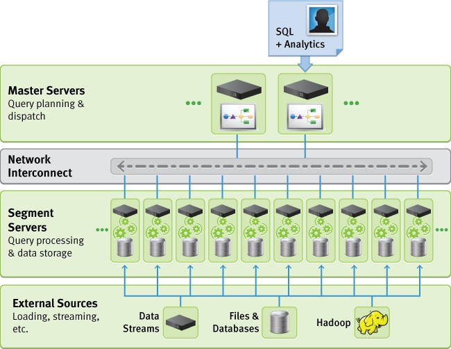
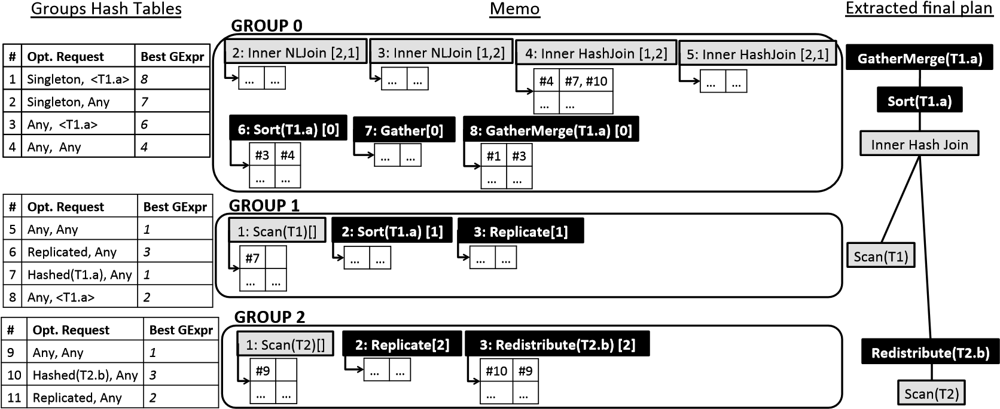
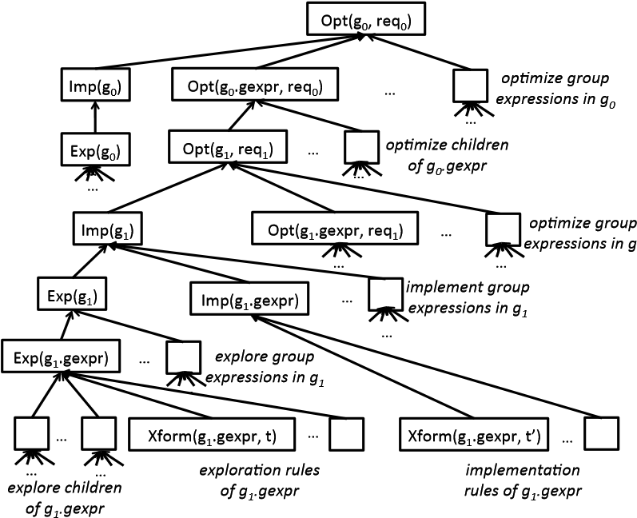
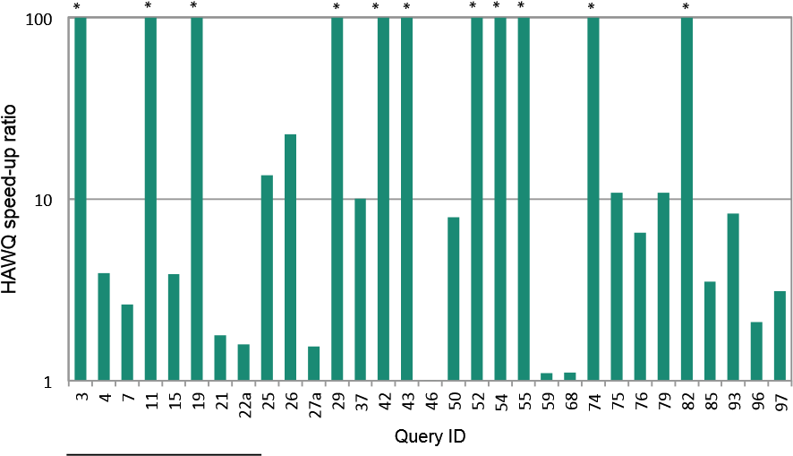
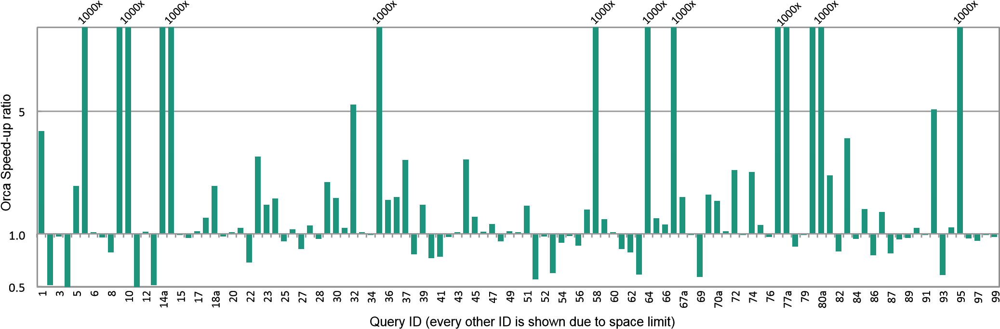

**Orca: A Modular Query Optimizer Architecture for Big Data**

Mohamed A. Soliman∗, Lyublena Antova∗, Venkatesh Raghavan∗, Amr El-Helw∗,

Zhongxian Gu∗, Entong Shen∗, George C. Caragea∗, Carlos Garcia-Alvarado∗,

Foyzur Rahman∗, Michalis Petropoulos∗, Florian Waas‡,

Sivaramakrishnan Narayanan§, Konstantinos Krikellas†, Rhonda Baldwin∗

| ∗ Pivotal Inc. Palo Alto, USA | ‡ Datometry Inc. San Francisco, USA | † Google Inc. Mountain View, USA | § Qubole Inc. Mountain View, USA |
|-------------------------------|-------------------------------------|----------------------------------|----------------------------------|

# ABSTRACT

The performance of analytical query processing in data management systems depends primarily on the capabilities of the system’s query optimizer. Increased data volumes and heightened interest in processing complex analytical queries have prompted Pivotal to build a new query optimizer.

In this paper we present the architecture of Orca, the new query optimizer for all Pivotal data management products, including Pivotal Greenplum Database and Pivotal HAWQ. Orca is a comprehensive development uniting state-of-theart query optimization technology with own original research resulting in a modular and portable optimizer architecture.

In addition to describing the overall architecture, we highlight several unique features and present performance comparisons against other systems.

# Categories and Subject Descriptors

H.2.4 [**Database Management**]: Systems—*Query processing; Distributed databases*

Keywords

Query Optimization, Cost Model, MPP, Parallel Processing

# INTRODUCTION

Big Data has brought about a renewed interest in query optimization as a new breed of data management systems has pushed the envelope in terms of unprecedented scalability, availability, and processing capabilities (cf. e.g., [9, 18, 20, 21]), which makes large datasets of hundreds of terabytes or even petabytes readily accessible for analysis through SQL or SQL-like interfaces. Differences between good and mediocre optimizers have always been known to be substantial [15]. However, the increased amount of data these systems have to process magnifies optimization mistakes and stresses the importance of query optimization more than ever.

| Permission to make digital or hard copies of all or part of this work for personal or classroom use is granted without fee provided that copies are not made or distributed for profit or commercial advantage and that copies bear this notice and the full citation on the first page. Copyrights for components of this work owned by others than ACM must be honored. Abstracting with credit is permitted. To copy otherwise, or republish, to post on servers or to redistribute to lists, requires prior specific permission and/or a fee. Request permissions from permissions@acm.org. *SIGMOD’14,* June 22–27, 2014, Snowbird, UT, USA. Copyright 2014 ACM 978-1-4503-2376-5/14/06 ...\$15.00. http://dx.doi.org/10.1145/2588555.2595637. |
|-----------------------------------------------------------------------------------------------------------------------------------------------------------------------------------------------------------------------------------------------------------------------------------------------------------------------------------------------------------------------------------------------------------------------------------------------------------------------------------------------------------------------------------------------------------------------------------------------------------------------------------------------------------------------------------------------------------------------------------------------------|

Despite a plethora of research in this area, most existing query optimizers in both commercial and open source projects are still primarily based on technology dating back to the early days of commercial database development [22], and are frequently prone to produce suboptimal results.

Realizing this significant gap between research and practical implementations, we have set out to devise an architecture that meets current requirements, yet promises enough headroom for future developments.

In this paper, we describe *Orca*, the result of our recent research and development efforts at Greenplum/Pivotal. Orca is a state-of-the-art query optimizer specifically designed for demanding analytics workloads. It is distinguished from other optimizers in several important ways:

**Modularity.** Using a highly extensible abstraction of metadata and system description, Orca is no longer confined to a specific host system like traditional optimizers. Instead it can be ported to other data management systems quickly through plug-ins supported by its Metadata Provider SDK.

**Extensibility.** By representing all elements of a query and its optimization as first-class citizens of equal footing, Orca avoids the trap of multi-phase optimization where certain optimizations are dealt with as an afterthought. Multi-phase optimizers are notoriously difficult to extend as new optimizations or query constructs often do not match the previously set phase boundaries.

**Multi-core ready.** Orca deploys a highly efficient multicore aware scheduler that distributes individual finegrained optimization subtasks across multiple cores for speed-up of the optimization process.

**Verifiability.** Orca has special provisions for ascertaining correctness and performance on the level of built-in mechanisms. Besides improving engineering practices, these tools enable rapid development with high confidence and lead to reduced turnaround time for both new features as well as bug fixes.

**Performance.** Orca is a substantial improvement over our previous system and in many cases offers query speedup of 10x up to 1000x.

We describe the architecture of Orca and highlight some of the advanced features enabled by its design. We provide

## **Figure 1: High level GPDB architecture**

a blueprint of various components and detail the engineering practices we have pioneered and deployed to realize this project. Lastly, we give performance results based on the TPC-DS benchmark comparing Orca to other systems. In particular, we focus on query processing systems contributed to the open source space.

The remainder of this paper is organized as follows. We give preliminaries on the computing architecture in Section 2. In Section 3, we present the architecture of Orca and describe its components. Section 4 presents the query optimization workflow. Section 5 describes how Orca exchanges metadata with the backend database system. We describe in Section 6 the tools we built to maintain a verifiable query optimizer. Section 7 presents our experimental study, followed by a discussion of related work in Section 8. We summarize this paper with final remarks in Section 9.

# PRELIMINARIES

We give preliminaries on massively parallel processing databases (Section 2.1), and Hadoop query engines (Section 2.2).

## Massively Parallel Processing

Pivotal’s Greenplum Database (GPDB) [20] is a massively parallel processing (MPP) analytics database. GPDB adopts a shared-nothing computing architecture with two or more cooperating processors. Each processor has its own memory, operating system and disks. GPDB leverages this high-performance system architecture to distribute the load of petabyte data warehouses, and use system resources in parallel to process a given query.

Figure 1 shows a high level architecture of GPDB. Storage and processing of large amounts of data are handled by distributing the load across several servers or hosts to create an array of individual databases, all working together to present a single database image. The *master* is the entry point to GPDB, where clients connect and submit SQL statements. The master coordinates work with other database instances, called *segments*, to handle data processing and storage. When a query is submitted to the master, it is optimized and broken into smaller components dispatched to segments to work together on delivering the final results. The interconnect is the networking layer responsible for inter-process communication between the segments. The interconnect uses a standard Gigabit Ethernet switching fabric.

During query execution, data can be distributed to segments in multiple ways including *hashed* distribution, where tuples are distributed to segments based on some hash function, *replicated* distribution, where a full copy of a table is stored at each segment and *singleton* distribution, where the whole distributed table is gathered from multiple segments to a single host (usually the master).

## SQL on Hadoop

Processing analytics queries on Hadoop is becoming increasingly popular. Initially, the queries were expressed as MapReduce jobs and the Hadoop’s appeal was attributed to its scalability and fault-tolerance. Coding, manually optimizing and maintaining complex queries in MapReduce though is hard, thus SQL-like declarative languages, such as Hive [28], were developed on top of Hadoop. HiveQL queries are compiled into MapReduce jobs and executed by Hadoop. HiveQL accelerated the coding of complex queries but also made apparent that an optimizer is needed in the Hadoop ecosystem, since the compiled MapReduce jobs exhibited poor performance.

Pivotal responded to the challenge by introducing HAWQ [21], a massively parallel SQL-compliant engine on top of HDFS. HAWQ employes Orca in its core to devise efficient query plans minimizing the cost of accessing data in Hadoop clusters. The architecture of HAWQ combines an innovative state-of-the-art cost-based optimizer with the scalability and fault-tolerance of Hadoop to enable interactive processing of data at petabyte scale.

Recently, a number of other efforts, including Cloudera’s Impala [17] and Facebook’s Presto [7], introduced new optimizers to enable SQL processing on Hadoop. Currently, these efforts support only a subset of the SQL standard features and their optimizations are restricted to rule-based. In comparison, HAWQ has a full-fledged standard compliant SQL interface and a cost-based optimizer, both of which are unprecedented features in Hadoop query engines. We illustrate in our experimental study in Section 7 the key role that Orca plays in differentiating HAWQ from other Hadoop SQL engines on both functional and performance sides.

# ORCA ARCHITECTURE

Orca is the new query optimizer for Pivotal data management products, including GPDB and HAWQ. Orca is a modern top-down query optimizer based on the Cascades optimization framework [13]. While many Cascades optimizers are tightly-coupled with their host systems, a unique feature of Orca is its ability to run outside the database system as a stand-alone optimizer. This ability is crucial to supporting products with different computing architectures (e.g., MPP and Hadoop) using one optimizer. It also allows leveraging the extensive legacy of relational optimization in new query processing paradigms like Hadoop [7,10,16,17]. Furthermore, running the optimizer as a stand-alone product enables elaborate testing without going through the monolithic structure of a database system.

DXL**.** Decoupling the optimizer from the database system requires building a communication mechanism to process queries. Orca includes a framework for exchanging information between the optimizer and the database system called *Data eXchange Language (DXL)*. The framework uses an XML-based language to encode the necessary information

**Figure 2: Interaction of Orca with database system**

|   | Excep9on' Handling' | **GPOS%** Concurrency' Control' | Memory'Manager' |
|---|---------------------|---------------------------------|-----------------|
|   |                     | **OS%**                         |                 |

## **Figure 3: Orca architecture**

for communication, such as input queries, output plans and metadata. Overlaid on DXL is a simple communication protocol to send the initial query structure and retrieve the optimized plan. A major benefit of DXL is packaging Orca as a stand-alone product.

Figure 2 shows the interaction between Orca and an external database system. The input to Orca is a DXL query. The output of Orca is a DXL plan. During optimization, the database system can be queried for metadata (e.g., table definitions). Orca abstracts metadata access details by allowing database system to register a metadata provider (MD Provider) that is responsible for serializing metadata into DXL before being sent to Orca. Metadata can also be consumed from regular files containing metadata objects serialized in DXL format.

The database system needs to include translators that consume/emit data in DXL format. Query2DXL translator converts a query parse tree into a DXL query, while DXL2Plan translator converts a DXL plan into an executable plan. The implementation of such translators is done completely outside Orca, which allows multiple systems to use Orca by providing the appropriate translators.

The architecture of Orca is highly extensible; all components can be replaced individually and configured separately. Figure 3 shows the different components of Orca. We briefly describe these components as follows.

**Memo.** The space of plan alternatives generated by the optimizer is encoded in a compact in-memory data structure called the Memo [13]. The Memo structure consists of a set of containers called *groups*, where each group contains logically equivalent expressions. Memo groups capture the different sub-goals of a query (e.g., a filter on a table, or a join of two tables). Group members, called *group expressions*, achieve the group goal in different logical ways (e.g., different join orders). Each group expression is an operator that has other groups as its children. This recursive structure of the Memo allows compact encoding of a huge space of possible plans as we illustrate in Section 4.1.

**Search and Job Scheduler.** Orca uses a search mechanism to navigate through the space of possible plan alternatives and identify the plan with the least estimated cost. The search mechanism is enabled by a specialized *Job Scheduler* that creates dependent or parallel work units to perform query optimization in three main steps: *exploration*, where equivalent logical expressions are generated, *implementation* where physical plans are generated, and *optimization*, where required physical properties (e.g., sort order) are enforced and plan alternatives are costed. We discuss the details of optimization jobs scheduling in Section 4.2.

**Transformations. [13]** Plan alternatives are generated by applying transformation rules that can produce either equivalent logical expressions (e.g., InnerJoin(A,B) → InnerJoin(B,A)), or physical implementations of existing expressions (e.g., Join(A,B) → HashJoin(A,B)). The results of applying transformation rules are copied-in to the Memo, which may result in creating new groups and/or adding new group expressions to existing groups. Each transformation rule is a self-contained component that can be explicitly activated/deactivated in Orca configurations.

**Property Enforcement.** Orca includes an extensible framework for describing query requirements and plan characteristics based on formal property specifications. Properties have different types including logical properties (e.g., output columns), physical properties (e.g., sort order and data distribution), and scalar properties (e.g., columns used in join conditions). During query optimization, each operator may request specific properties from its children. An optimized child plan may either satisfy the required properties on its own (e.g., an IndexScan plan delivers sorted data), or an *enforcer* (e.g., a Sort operator) needs to be plugged in the plan to deliver the required property. The framework allows each operator to control enforcers placement based on child plans’ properties and operator’s local behavior. We describe this framework in more detail in Section 4.1.

**Metadata Cache.** Since metadata (e.g., table definitions) changes infrequently, shipping it with every query incurs an overhead. Orca caches metadata on the optimizer side and only retrieves pieces of it from the catalog if something is unavailable in the cache, or has changed since the last time it was loaded in the cache. Metadata cache also abstracts the database system details from the optimizer, which is particularly useful during testing and debugging.

**GPOS.** In order to interact with operating systems with possibly different APIs, Orca uses an OS abstraction layer called GPOS. The GPOS layer provides Orca with an extensive infrastructure including a memory manager, primitives for concurrency control, exception handling, file I/O and synchronized data structures.

# QUERY OPTIMIZATION

We describe Orca’s optimization workflow in Section 4.1. We then show how the optimization process can be conducted in parallel in Section 4.2.

\<?xml version="1.0" encoding="UTF-8"?\>

\<dxl:DXLMessage xmlns:dxl="http://greenplum.com/dxl/v1"\>

\<dxl:Query\>

\<dxl:OutputColumns\>

\<dxl:Ident ColId="0" Name="a" Mdid="0.23.1.0"/\>

\</dxl:OutputColumns\>

\<dxl:SortingColumnList\>

\<dxl:SortingColumn ColId="0" OpMdid="0.97.1.0"\>

\</dxl:SortingColumnList\>

\<dxl:Distribution Type="Singleton" /\>

\<dxl:LogicalJoin JoinType="Inner"\>

\<dxl:LogicalGet\>

\<dxl:TableDescriptor Mdid="0.1639448.1.1" Name="T1"\>

\<dxl:Columns\>

\<dxl:Ident ColId="0" Name="a" Mdid="0.23.1.0"/\>

\<dxl:Ident ColId="1" Name="b" Mdid="0.23.1.0"/\>

\</dxl:Columns\>

\</dxl:TableDescriptor\>

\</dxl:LogicalGet\>

\<dxl:LogicalGet\>

\<dxl:TableDescriptor Mdid="0.2868145.1.1" Name="T2"\>

\<dxl:Columns\>

\<dxl:Ident ColId="2" Name="a" Mdid="0.23.1.0"/\>

\<dxl:Ident ColId="3" Name="b" Mdid="0.23.1.0"/\>

\</dxl:Columns\>

\</dxl:TableDescriptor\>

\</dxl:LogicalGet\>

\<dxl:Comparison Operator="=" Mdid="0.96.1.0"\>

\<dxl:Ident ColId="0" Name="a" Mdid="0.23.1.0"/\>

\<dxl:Ident ColId="3" Name="b" Mdid="0.23.1.0"/\>

\</dxl:Comparison\>

\</dxl:LogicalJoin\>

\</dxl:Query\>

\</dxl:DXLMessage\>

**Listing 1:** DXL **query message**

## Optimization Workflow

We illustrate query optimization workflow using the following running example:

SELECT T1.a FROM T1, T2

WHERE T1.a = T2.b

ORDER BY T1.a;

where the distribution of T1 is Hashed(T1.a) and the distribution of T2 is Hashed(T2.a) (cf. Section 2.1).

Listing 1 shows the representation of the previous query in DXL, where we give the required output columns, sorting columns, data distribution and logical query. Metadata (e.g., tables and operators definitions) are decorated with metadata ids (Mdid’s) to allow requesting further information during optimization. An Mdid is a unique identifier composed of a database system identifier, an object identifier and a version number. For example, ‘0.96.1.0’ refers to GPDB’s integer equality operator with version ‘1.0’. Metadata versions are used to invalidate cached metadata objects that have gone through modifications across queries. We discuss metadata exchange in more detail in Section 5.

The DXL query message is shipped to Orca, where it is parsed and transformed to an in-memory logical expression tree that is copied-in to the Memo. Figure 4 shows the initial contents of the Memo. The logical expression creates three groups for the two tables and the InnerJoin operation. We omit the join condition for brevity. Group 0 is called the *root group* since it corresponds to the root of the logical expression. The dependencies between operators in the logical expression are captured as references between groups. For example, InnerJoin[1,2] refers to Group 1 and Group 2 as children. Optimization takes place as described in the following steps.

### **Figure 4: Copying-in initial logical expression**

1.  **Exploration.** Transformation rules that generate logically equivalent expressions are triggered. For example, a Join Commutativity rule is triggered to generate InnerJoin[2,1] out of InnerJoin[1,2]. Exploration results in adding new group expressions to existing groups and possibly creating new groups. The Memo structure has a built-in duplicate detection mechanism, based on expression topology, to detect and eliminate any duplicate expressions created by different transformations.
2.  **Statistics Derivation.** At the end of exploration, the Memo maintains the complete logical space of the given query. Orca’s statistics derivation mechanism is then triggered to compute statistics for the Memo groups. A statistics object in Orca is mainly a collection of column histograms used to derive estimates for cardinality and data skew. Derivation of statistics takes place on the compact Memo structure to avoid expanding the search space.

In order to derive statistics for a target group, Orca picks the group expression with the highest promise of delivering reliable statistics. Statistics promise computation is expression-specific. For example, an InnerJoin expression with a small number of join conditions is more promising than another equivalent InnerJoin expression with a larger number of join conditions (this situation could arise when generating multiple join orders). The rationale is that the larger the number of join conditions, the higher the chance that estimation errors are propagated and amplified. Computing a confidence score for cardinality estimation is challenging due to the need to aggregate confidence scores across all nodes of a given expression. We are currently exploring several methods to compute confidence scores in the compact Memo structure.

After picking the most promising group expression in the target group, Orca recursively triggers statistics derivation on the child groups of the picked group expression. Finally, the target group’s statistics object is constructed by combining the statistics objects of child groups.

Figure 5 illustrates statistics derivation mechanism for the running example. First, a top-down pass is performed where a parent group expression requests statistics from its child groups. For example, InnerJoin(T1,T2) on (a=b) requests histograms on T1.a and T2.b. The requested histograms are loaded on demand from the catalog through the registered MD Provider, parsed into DXL and stored in the MD Cache to service future requests. Next, a bottom-up pass is performed to combine child statistics objects into a parent statistics object. This results in (possibly modified) histograms on columns T1.a and T2.b, since the join condition could impact columns’ histograms.

### **Figure 5: Statistics derivation mechanism**

Constructed statistics objects are attached to individual groups where they can be incrementally updated (e.g., by adding new histograms) during optimization. This is crucial to keep the cost of statistics derivation manageable.

1.  **Implementation.** Transformation rules that create physical implementations of logical expressions are triggered. For example, Get2Scan rule is triggered to generate physical table Scan out of logical Get. Similarly, InnerJoin2HashJoin and InnerJoin2NLJoin rules are triggered to generate Hash and Nested Loops join implementations.
2.  **Optimization.** In this step, properties are enforced and plan alternatives are costed. Optimization starts by submitting an initial *optimization request* to the Memo’s root group specifying query requirements such as result distribution and sort order. Submitting a request *r* to a group *g* corresponds to requesting the least cost plan satisfying *r* with a root physical operator in *g*.

For each incoming request, each physical group expression passes corresponding requests to child groups depending on the incoming requirements and operator’s local requirements. During optimization, many identical requests may be submitted to the same group. Orca caches computed requests into a group hash table. An incoming request is computed only if it does not already exist in group hash table. Additionally, each physical group expression maintains a local hash table mapping incoming requests to the corresponding child requests. Local hash tables provide the linkage structure used when extracting a physical plan from the Memo, as we show later in this section.

Figure 6 shows optimization requests in the Memo for the running example. The initial optimization request is *req.* \#*1:* {*Singleton, \<T1.a\>*}, which specifies that query results are required to be gathered to the master based on the order given by T1.a[^1]. We also show group hash tables where each request is associated with the best group expression (GExpr) that satisfies it at the least estimated cost. The black boxes indicate enforcer operators that are plugged in the Memo to deliver sort order and data distribution. Gather operator gathers tuples from all segments to the master. GatherMerge operator gathers sorted data from all segments to the master, while keeping the sort order. Redistribute operator distributes tuples across segments based on the hash value of given argument.

[^1]: Required properties also include output columns, rewindability, common table expressions and data partitioning. We omit these properties due to space constraints.

Figure 7 shows the optimization of *req.* \#*1* by InnerHashJoin[1,2]. For this request, one of the alternative plans is aligning child distributions based on join condition, so that tuples to be joined are co-located[^2]. This is achieved by requesting Hashed(T1.a) distribution from group 1 and Hashed(T2.b) distribution from group 2. Both groups are requested to deliver Any sort order. After child best plans are found, InnerHashJoin combines child properties to determine the delivered distribution and sort order. Note that the best plan for group 2 needs to hash-distribute T2 on T2.b, since T2 is originally hash-distributed on T2.a, while the best plan for group 1 is a simple Scan, since T1 is already hash-distributed on T1.a.

[^2]: There can be many other alternatives (e.g., request children to be gathered to the master and perform the join there). Orca allows extending each operator with any number of possible optimization alternatives and cleanly isolates these alternatives through property enforcement framework.

When it is determined that delivered properties do not satisfy the initial requirements, unsatisfied properties have to be *enforced*. Property enforcement in Orca in a flexible framework that allows each operator to define the behavior of enforcing required properties based on the properties delivered by child plans and operator local behavior. For example, an order-preserving NL Join operator may not need to enforce a sort order on top of the join if the order is already delivered by outer child.

Enforcers are added to the group containing the group expression being optimized. Figure 7 shows two possible plans that satisfy *req.* \#*1* through property enforcement. The left plan sorts join results on segments, and then gathermerges sorted results at the master. The right plan gathers join results from segments to the master, and then sorts them. These different alternatives are encoded in the Memo and it is up to the cost model to differentiate their costs.

Finally, the best plan is extracted from the Memo based on the linkage structure given by optimization requests. Figure 6 illustrates plan extraction for the running example. We show the local hash tables of relevant group expressions. Each local hash table maps incoming optimization request to corresponding child optimization requests.

We first look-up the best group expression of *req.* \#*1* in the root group, which leads to GatherMerge operator. The corresponding child request in the local hash table of GatherMerge is *req* \#*3*. The best group expression for *req* \#*3* is Sort. Therefore, we link GatherMerge to Sort. The corresponding child request in the local hash table of Sort is *req* \#*4*. The best group expression for *req* \#*4* is InnerHashJoin[1,2]. We thus link Sort to InnerHashJoin. The same procedure is followed to complete plan extraction leading to the final plan shown in Figure 6.

The extracted plan is serialized in DXL format and shipped to the database system for execution. DXL2Plan translator at the database system translates DXL plan to an executable plan based on the underling query execution framework.

**Multi-Stage Optimization.** Our ongoing work in Orca involves implementing multi-stage optimization. An opti-

|  **Figure 6: Processing optimization requests in the Memo** |
|------------------------------------------------------------------------------------------------------------|

*(c)\$Enforcing\$missing\$proper:es\$to\$sa:sfy\${Singleton,\$\<T1.a\>}\$request\$*

**Figure 7: Generating** InnerHashJoin **plan alternatives**

mization stage in Orca is defined as a complete optimization workflow using a subset of transformation rules and (optional) time-out and cost threshold. A stage terminates when any of the following conditions is met: (1) a plan with cost below cost threshold is found, (2) time-out occurs, or (3) the subset of transformation rules is exhausted. The specification of optimization stages can be given by the user through Orca’s configuration. This technique allows resource-constrained optimization where, for example, the most expensive transformation rules are configured to run in later stages to avoid increasing the optimization time. This technique is also a foundation for obtaining a query plan as early as possible to cut-down search space for complex queries.

**Query Execution.** A copy of the final plan is dispatched to each segment. During distributed query execution, a distribution enforcer on each segment acts as both sender and receiver of data. For example, a Redistribute(T2.b) instance running on segment *S* sends tuples on *S* to other segments based on the hash value of T2.b, and also receives tuples from other Redistribute(T2.b) instances on other segments.

## Parallel Query Optimization

Query optimization is probably the most CPU-intensive process in a database system. Effective usage of CPUs translates to better query plans and hence better system performance. Parallelizing query optimizer is crucial to benefit from advanced CPU designs that exploit an increasing numbers of cores.

Orca is a multi-core enabled optimizer. Optimization process is broken to small work units called optimization jobs. Orca currently has seven different types of optimization jobs:

-   Exp(g): Generate logically equivalent expressions of all group expressions in group g.
-   Exp(gexpr): Generate logically equivalent expressions of a group expression gexpr.
-   Imp(g): Generate implementations of all group expressions in group g.
-   Imp(gexpr): Generate implementation alternatives of a group expression gexpr.
-   Opt(g, req): Return the plan with the least estimated cost that is rooted by an operator in group g and satisfies optimization request req.
-   Opt(gexpr, req): Return the plan with the least estimated cost that is rooted by gexpr and satisfies optimization request req.
-   Xform(gexpr, t) Transform group expression gexpr using rule t.

For a given query, hundreds or even thousands of job instances of each type may be created. This introduces challenges for handling job dependencies. For example, a group expression cannot be optimized until its child groups are also optimized. Figure 8 shows a partial job graph, where optimization of group g0 under optimization request req0 triggers a deep tree of dependent jobs. Dependencies are encoded as child-parent links; a parent job cannot finish before its child jobs finish. While child jobs are progressing, the parent job needs to be suspended. This allows child jobs to pick up available threads and run in parallel, if they do not depend on other jobs. When all child jobs complete, the suspended parent job is notified to resume processing.

Orca includes a specialized *job scheduler* designed from scratch to maximize the fan-out of job dependency graph and provide the required infrastructure for parallel query

*1*

### **Figure 8: Optimization jobs dependency graph**

optimization. The scheduler provides APIs to define optimization jobs as re-entrant procedures that can be picked up by available processing threads. It also maintains job dependency graph to identify opportunities of parallelism (e.g., running transformations in different groups), and notify suspended jobs when the jobs they depend on have terminated. During parallel query optimization, multiple concurrent requests to modify a Memo group might be triggered by different optimization requests. In order to minimize synchronization overhead among jobs with the same goal (e.g., exploring the same group), jobs should not know about the existence of each other. When an optimization job with some goal is under processing, all other incoming jobs with the same goal are forced to wait until getting notified about the completion of the running job. At this point, the suspended jobs can pick up the results of the completed job. This functionality is enabled by attaching a job queue to each group, such that incoming jobs are queued as long as there exists an active job with the same goal.

# METADATA EXCHANGE

Orca is designed to work outside the database system. One major point of interaction between optimizer and database system is metadata exchange. For example, the optimizer may need to know whether indices are defined on a given table to devise an efficient query plan. The access to metadata is facilitated by a collection of Metadata Providers that are system-specific plug-ins to retrieve metadata from the database system.

Figure 9 shows how Orca exchanges metadata with different backend systems. During query optimization, all metadata objects accessed by Orca are pinned in an in-memory cache, and are unpinned when optimization completes or an error is thrown. All accesses to metadata objects are accomplished via MD Accessor, which keeps track of objects being accessed in the optimization session, and makes sure they are released when they are no longer needed. MD Accessor is also responsible for transparently fetching metadata data from external MD Provider if the requested metadata object is not already in the cache. Different MD Accessors serving different optimization sessions may have different external MD providers for fetching metadata.

In addition to system-specific providers, Orca implements a file-based MD Provider to load metadata from a DXL file,

## **Figure 9: Metadata exchange framework**

### **Figure 10: Replay of** AMPERe **dump**

eliminating the need to access a live backend system. Orca includes an automated tool for harvesting metadata that optimizer needs into a minimal DXL file. We show in Section 6.1 how this tool is used to replay optimization of customer queries while the backend database system is offline.

# VERIFIABILITY

Testing a query optimizer is a task as challenging as building one. Orca is built with testing in mind since the early development phase. There is a built-in testing scheme that makes it difficult for developers to introduce regressions as part of adding new features, and makes it simple for test engineers to add test cases to be verified with every build. In addition, we leverage several tools and testing frameworks we built to assure the quality and verifiability of Orca, including a cardinality estimation testing framework, a number of benchmark tests at various scales, a data generator that can generate data by reversing database statistics [24], and two unique testing tools we discuss next.

The first tool, discussed in Section 6.1, is automatic capturing and replaying of optimizer’s anomalies. The second tool, discussed in Section 6.2, implements an automated method to measure the accuracy of optimizer’s cost model.

## Minimal Repros

AMPERe [3] is a tool for Automatic capture of Minimal Portable and Executable Repros. The motivation for building AMPERe was to be able to reproduce and debug cus-

\<?xml version="1.0" encoding="UTF-8"?\>

\<dxl:DXLMessage xmlns:dxl="http://greenplum.com/dxl/v1"\>

\<dxl:Thread Id="0"\>

\<dxl:Stacktrace\>

1.  0x000e8106df gpos::CException::Raise
2.  0x000137d853 COptTasks::PvOptimizeTask
3.  0x000e81cb1c gpos::CTask::Execute
4.  0x000e8180f4 gpos::CWorker::Execute
5.  0x000e81e811 gpos::CAutoTaskProxy::Execute

    \</dxl:Stacktrace\>

    \<dxl:TraceFlags Value="gp_optimizer_hashjoin"/\>

    \<dxl:Metadata SystemIds="0.GPDB"\>

    \<dxl:Type Mdid="0.9.1.0" Name="int4"

    IsRedistributable="true" Length="4" /\>

    \<dxl:RelStats Mdid="2.688.1.1" Name="r" Rows="10"/\>

\<dxl:Relation Mdid="0.688.1.1" Name="r" DistributionPolicy="Hash"

DistributionColumns="0"\>

\<dxl:Columns\>

\<dxl:Column Name="a" Attno="1" Mdid="0.9.1.0"/\>

\</dxl:Columns\>

\</dxl:Relation\>

\</dxl:Metadata\>

\<dxl:Query\>

\<dxl:OutputColumns\>

\<dxl:Ident ColId="1" Name="a" Mdid="0.9.1.0"/\>

\</dxl:OutputColumns\>

\<dxl:LogicalGet\>

\<dxl:TableDescriptor Mdid="0.688.1.1" Name="r"\>

\<dxl:Columns\>

\<dxl:Column ColId="1" Name="a" Mdid="0.9.1.0"/\>

\</dxl:Columns\>

\</dxl:TableDescriptor\>

\</dxl:LogicalGet\>

\</dxl:Query\>

\</dxl:Thread\>

\</dxl:DXLMessage\>

### **Listing 2: Simplified** AMPERe **dump**

tomer issues in the optimizer without having access to the customer production system.

An AMPERe dump is automatically triggered when an unexpected error is encountered, but can also be produced on demand to investigate suboptimal query plans. The dump captures the minimal amount of data needed to reproduce a problem, including the input query, optimizer configurations and metadata, serialized in DXL (cf. Section 3). If the dump is generated due to an exception, it also includes the exception’s stack trace.

Listing 2 shows an example of a simplified AMPERe dump. The dump includes only the necessary data to reproduce the problem. For example, the dump captures the state of MD Cache which includes only the metadata acquired during the course of query optimization. AMPERe is also built to be extensible. Any component in Orca can register itself with the AMPERe serializer to generate additional information in the output dump.

AMPERe allows replaying a dump outside the system where it was generated. Any Orca instance can load the dump to retrieve the input query, metadata and configuration parameters in order to invoke an optimization session identical to the one that triggered the problematic situation at hand. This process is depicted in Figure 10, where the optimizer loads the input query from the dump, creates a file-based MD Provider for the metadata, sets optimizer’s configurations and then spawns the optimization threads to reproduce the problem instantly.

AMPERe is also used as a testing framework, where a dump acts as a test case that contains an input query and its expected plan. When replaying the dump file, Orca

#### Figure 11: Plan space

might generate a plan different from the expected one (e.g., because of changes in the cost model). Such discrepancy causes the test case to fail, and triggers investigating the root cause of plan difference. Using this framework, any bug with an accompanying AMPERe dump, whether filed by internal testing or through customer reports, can be automatically turned into a self-contained test case.

## Testing Optimizer Accuracy

The accuracy of Orca’s cost model can be impacted by a number of error sources including inaccurate cardinality estimates and not properly adjusted cost model parameters. As a result, cost model provides imperfect prediction of the wall clock time for the execution of a plan. Quantifying optimizer’s accuracy is crucial to avoid performance regressions introduced by bug fixes and newly added features.

Orca includes a built-in tool called TAQO [15] for Testing the Accuracy of Query Optimizer. TAQO measures the ability of optimizer’s cost model to order any two given plans correctly, i.e., the plan with the higher estimated cost will indeed run longer. For example, in Figure 11, the optimizer orders (*p*1*,p*3) correctly, since their actual cost is directly proportional to computed cost estimates. On the other hand, the optimizer orders (*p*1*,p*2) incorrectly, since their actual cost is inversely proportional to computed cost estimates.

TAQO measures the optimizer’s accuracy by costing and executing plans that the optimizer considers when optimizing a given query. Evaluating each single plan in the search space is infeasible, in general. This limitation can be overcome by sampling plans uniformly from the search space. Optimization requests’ linkage structure (cf. Section 4.1) provides the infrastructure used by TAQO to build a uniform plan sampler based on the method introduced in [29].

Given a sample of plans from the search space of a given query, TAQO computes a correlation score between the ranking of sampled plans based on estimated costs and their ranking based on actual costs. The correlation score combines a number of measures including importance of plans (the score penalizes optimizer more for cost miss-estimation of very good plans), and distance between plans (the score does not penalize optimizer for small differences in the estimated costs of plans that are actually close in execution time). The correlation score also allows benchmarking the optimizers of different database systems to evaluate their relative quality. We discuss the testing methodology implemented in TAQO in more detail in [15].

# EXPERIMENTS

In our experimental study, we chose to conduct an endto-end evaluation of a database system equipped with Orca, rather than evaluating Orca’s individual components, to highlight the added value of our new query optimizer. We first compare Orca to the legacy query optimizer of Pivotal GPDB. We then compare Pivotal HAWQ (which employs

Orca in its core) to other popular SQL on Hadoop solutions.

## TPC-DS Benchmark

Our experiments are based on the TPC-DS benchmark [1]. TPC-DS is a widely adopted decision support benchmark that consists of a set of complex business analytic queries. It has superseded the well-known TPC-H by providing a much richer schema and a larger variety of business problems ranging from business reporting, ad-hoc exploration, iterative queries to data mining. In our development process we have observed that TPC-H often lacks the sophistication of the workload from our enterprise customers. On the other hand, TPC-DS with its 25 tables, 429 columns and 99 query templates can well represent a modern decision-supporting system and is an excellent benchmark for testing query optimizers. The rich SQL syntax (WITH clause, window functions, subqueries, outer joins, CASE statement, Intersect, Except, etc.) in the TPC-DS queries is a serious SQL compliance test for any query engine.

## MPP Databases

In this part, we compare the performance of Orca with the GPDB legacy query optimizer (a.k.a. *Planner*) that inherits part of its design from the PostgreSQL optimizer. The *Planner* is a robust optimizer that has been serving hundreds of production systems well, and has been improving over the past decade.

### Experiment Setup

For the comparison between Orca and *Planner*, we use a cluster of 16 nodes connected with 10Gbps Ethernet. Each node has dual Intel Xeon processors at 3.33GHz, 48GB of RAM and twelve 600GB SAS drives in two RAID-5 groups. The operating system is Red Hat Enterprise Linux 5.5.

We installed two isolated instances of the same version of GPDB (one uses Orca, and the other uses *Planner*). We use 10 TB TPC-DS benchmark with partitioned tables for performance evaluation.

### Performance

We generated 111 queries out of the 99 templates of TPCDS. Both Orca and *Planner* support all the queries in their original form without any re-writing. The full SQL compliance provides maximum compatibility of BI tools and easeof-use for data analysts from different backgrounds. As we show in the SQL on Hadoop experiments in Section 7.3, many Hadoop SQL engines currently support only a small subset of TPC-DS queries out of the box.

The performance speed up of Orca compared to *Planner* for all queries is shown in Figure 12, where bars above the speed-up ratio of 1 indicate performance improvement of Orca. We observe that Orca is able to produce similar or better query plan for 80% of the queries. For the entire TPC-DS suite, Orca shows a 5x speed-up over *Planner*.

In particular, for 14 queries Orca achieves a speed-up ratio of at least 1000x - this is due to a timeout we enforced at 10000 seconds. These queries took more than 10000 seconds with *Planner*’s plan while they were able to finish with Orca’s plan in minutes.

The performance improvement provided by Orca is due to a combination of salient features including the following:

-   *Join Ordering.* Orca includes a number of join ordering optimizations based on dynamic programming, left-deep join trees and cardinality-based join ordering.
-   *Correlated Subqueries.* Orca adopts and extends a unified representation of subqueries to detect deeply correlated predicates and pull them up into joins to avoid repeated execution of subquery expressions.
-   *Partition Elimination.* Orca introduces a novel framework for on-the-fly pruning of partitioned tables [2]. This feature is implemented by extending Orca’s enforcers framework to accommodate new properties.
-   *Common Expressions.* Orca introduces a new producer-consumer model for WITH clause. The model allows evaluating a complex expression once, and consuming its output by multiple operators.

The interplay of the previous features is enabled by Orca’s architecture and components abstraction. Each feature is designed, implemented and tested with minimal changes in the behavior of other features. The combined benefit and clean interaction of features are manifested by Figure 12.

For a smaller number of queries, Orca produced suboptimal plans with up to 2x slow down compared to *Planner*. These sub-optimal plans are partly due to cardinality estimation errors or sub-optimal cost model parameters that need further tuning. We are actively investigating these issues and constantly improving Orca.

We have also measured optimization time and Orca’s memory footprint when using the full set of transformation rules. The average optimization time is around 4 seconds, while the average memory footprint is around 200 MB. As we mentioned in Section 4.1, our ongoing work involves implementing techniques to shortcut optimization and improve resource consumption for complex queries.

## SQL on Hadoop

Hadoop has quickly become a popular analytics ecosystem due to its scalability. In recent years, many Hadoop systems have been developed with SQL or SQL-like query interfaces. In this section, we compare the performance of Pivotal HAWQ (powered by Orca) against three Hadoop SQL engines: Impala [17], Presto [7], and Stinger [16]. Please refer to Section 8 for a discussion on these systems.

### Experiment Setup

The experiments are conducted on a cluster with 10 nodes; two for HDFS name node and coordinator services of SQL engines, and eight for HDFS data nodes and worker nodes. Each node has dual Intel Xeon eight-core processors at 2.7GHz, 64GB of RAM and 22 900GB disks in JBOD. The operating system is Red Hat Enterprise Linux 6.2.

We used CDH 4.4 and Impala 1.1.1 for Impala, Presto 0.52, and Hive 0.12 for Stinger. We made our best efforts to tune the optimal configurations of each system, including enabling short circuit read, allocating as much memory as possible to workers and having one standalone node for coordinator services. For HAWQ, we used Pivotal HD version 1.1 in our experiment.

Optimization of TPC-DS queries in different systems turned out to be quite challenging because systems currently have limited SQL support. For example, Impala does not yet support window functions, ORDER BY statement without

|  **Figure 12: Speed-up ratio of Orca vs Planner (TPC-DS 10TB)**  |
|-----------------------------------------------------------------------------------------------------------------|

(\*)"Query"runs"out"of"memory"in"Impala"

#### Figure 13: HAWQ vs Impala (TPC-DS 256GB)

LIMIT and some analytic functions like ROLLUP and CUBE. Presto does not yet support non-equi joins. Stinger currently does not support WITH clause and CASE statement. In addition, none of the systems supports INTERSECT, EXCEPT, disjunctive join conditions and correlated subqueries. These unsupported features have forced us to rule out a large number of queries from consideration.

After excluding unsupported queries, we needed to rewrite the remaining queries to work around parsing limitations in different systems. For example, Stinger and Presto do not support implicit cross-joins and some data types. After extensive filtering and rewriting, we finally managed to get query plans for 31 queries in Impala, 19 queries in Stinger and 12 queries in Presto, out of the total 111 queries.

### Performance

Our first attempt was to evaluate the different systems using 10TB TPC-DS benchmark. However, most of the queries from Stinger did not return within a reasonable time limit, and almost all the queries from Impala and Presto failed due to an out of memory error. This mainly happens due to the inability of these systems to spill partial results to disk when an operator’s internal state overflows the memory limits.

To obtain a better coverage across the different systems, we used 256GB TPC-DS benchmark, considering that the total working memory of our cluster is about 400GB (50GB × 8 nodes). Unfortunately even with this setting, we were

3" 12" 17" 18" 20" 22" 25" 29" 37" 42" 52" 55" 67" 76" 82" 84" 86" 90" 98"

Query ID

#### Figure 14: HAWQ vs Stinger (TPC-DS 256GB)

#### Figure 15: TPC-DS query support

unable to successfully run any TPC-DS query in Presto (although we managed to run much simpler join queries in Presto). For Impala and Stinger, we managed to run a number of TPC-DS queries, as we discuss next.

Figure 15 summarizes the number of supported queries in all the systems. We show the number of queries that each system can optimize (i.e., return a query plan), and the number of queries that can finish execution and return query results for the 256GB dataset.

Figure 13 and Figure 14 show the speedup ratio of HAWQ over Impala and Stinger. Since not all the queries are supported by the two systems, we only list the successful queries. The bars marked with ‘∗’ in Figure 13 indicate the queries that run out of memory. For query 46, 59 and 68, Impala and HAWQ have similar performance.

For queries where HAWQ has the most speedups, we find that Impala and Stinger handle join orders as literally specified in the query, while Orca explores different join orders to suggest the best one using a cost-based approach. For example in query 25, Impala joins two fact tables store_sales and store_returns first and then joins this huge intermediate results with another fact table catalog_sales, which is quite inefficient. In comparison, Orca joins the fact tables with dimension tables first to reduce intermediate results. In general, join ordering is a non-trivial optimization that requires extensive infrastructure on the optimizer side.

Impala recommends users to write joins in the descending order of the sizes of joined tables. However, this suggestion ignores the filters (which may be selective) on the tables, adds a non-trivial overhead to a database user for complex queries and may not be supported by BI tools that automatically generates queries. The lack of join ordering optimizations in a query optimizer has negative impact on the quality of produced plans. Other possible reasons for HAWQ speedups such as resource management and query execution is outside the scope of this paper.

The average speedup ratio of HAWQ in this set of experiments is 6x against Impala and 21x against Stinger. Note that the queries listed in Figure 13 and Figure 14 are relatively simple queries in TPC-DS benchmark. More complex queries (e.g., queries with correlated sub-queries) are not supported by other systems yet, while being completely supported by Orca. We plan to revisit TPC-DS benchmark performance evaluation in the future when all the queries are supported by other systems.

# RELATED WORK

Query optimization has been a fertile field for several ground breaking innovations over the past decades. In this section, we discuss a number of foundational query optimization techniques, and recent proposals in the space of MPP databases and Hadoop-based systems.

## Query Optimization Foundations

*Volcano Parallel Database* [12] introduced basic principles for achieving parallelism in databases. The proposed framework introduced *exchange* operators, which enable two means of parallelism, namely inter-operator parallelism, via pipelining, and intra-operator parallelism, via partitioning of tuples across operators running on different processes. The proposed design allows each operator to execute independently on local data, as well as work in parallel with other copies of the operator running in other processes. Several MPP databases [6,8,18,20,23] make use of these principles to build commercially successful products.

*Cascades* [13] is an extensible optimizer framework whose principles have been used to build MS-SQL Server, SCOPE [6], PDW [23], and Orca, the optimizer we present in this paper. The popularity of this framework is due to its clean separation of the logical and physical plan spaces. This is primarily achieved by encapsulating operators and transformation rules into self-contained components. This modular design enables Cascades to group logically equivalent expressions to eliminate redundant work, allows rules to be triggered on demand in contrast to Volcano’s [14] exhaustive approach, and permits ordering the application of rules based on their usefulness to a given operator.

Building on the principles of Cascades, a parallel optimization framework is proposed in [30] that enables building Cascades-like optimizers for multi-core architectures. The parallel query optimization framework in Orca (cf. Section 4.2) is based on the principles introduced in [30].

## SQL Optimization On MPP Databases

The exponential growth in the amount of data being stored and queried has translated into a wider usage of *Massively Parallel Processing* (MPP) systems such as Teradata [27], Oracle’s Exadata [31], Netezza [25], Pivotal Greenplum Database [20], and Vertica [18]. Due to space limitation, we summarize a few recent efforts in re-designing the query optimizer to meet the challenges of big data.

*SQL Server Parallel Data Warehouse (PDW)* [23] makes extensive re-use of the established Microsoft’s SQL Server optimizer. For each query, PDW triggers an optimization request to the SQL Server optimizer that works on a *shell database* that maintains only the metadata and statistics of the database and not its user data. The plan alternatives explored by SQL Server optimizer are then shipped to PDW’s *Data Movement Service* (DMS) where these logical plans are retrofitted with distribution information. While this approach avoids building an optimizer from scratch, it makes debugging and maintenance harder since the optimization logic is spread across two different processes and codebases.

*Structured Computations Optimized for Parallel Execution (SCOPE)* [6] is Microsoft’s data analysis platform that leverages characteristics of both parallel databases and MapReduce systems. SCOPE’s scripting language, like Hive [28], is based on SQL. SCOPE is developed for the Cosmos distributed data platform that employs an append-only file system, while Orca is designed with a vision to work with multiple underlying data management systems.

*SAP HANA* [11] is a distributed in-memory database system that handles business analytical and OLTP queries. Analytical queries in MPP databases can potentially generate a large amount of intermediate results. Concurrent analytical queries can exhaust the available memory, most of which is already consumed to store and index raw data, and will trigger data to be spilled to disk that results in a negative impact on query performance.

*Vertica* [18] is the commercialized MPP version of the CStore project [26] where the data is organized into *projections* and each projection is a subset of table attributes. The initial *StarOpt* and its modified *StratifiedOpt* optimizer were custom designed for queries over star/snowflake schemas, where the join keys of the same range are co-located. When data co-location cannot be achieved, the pertinent projections are replicated on all nodes to improve performance, as addressed by Vertica’s *V2Opt* optimizer.

## SQL On Hadoop

The classic approach of executing SQL on Hadoop is converting queries into MapReduce jobs using Hive [28]. MapReduce performance can be unsatisfactory for interactive analysis. Stinger [16] is an initiative to optimize query evaluation on Hadoop by leveraging and extending Hive. This approach, however, could entail significant redesign of MapReduce computing framework to optimize passes on data, and materialization of intermediate results on disk.

Several efforts have addressed interactive processing on Hadoop by creating specialized query engines that allow SQL-based processing of data in HDFS without the need to use MapReduce. Impala [17], HAWQ [21] and Presto [7] are key efforts in this direction. These approaches are different in the design and capabilities of their query optimizers and execution engines, both of which are differentiating factors for query performance. Co-location of DBMS and Hadoop technologies allows data to be processed natively on each platform, using SQL in the DBMS and MapReduce in HDFS. Hadapt [4] pioneered this approach. Microsoft has also introduced PolyBase [10] to offer the ability to join tables from PDW [23] with data on HDFS in order to optimize data exchange from one platform to another.

AsterixDB [5] is an open-source effort to efficiently store, index and query semi-structured information based on a NoSQL style data model. Currently, AsterixDB’s query planner is driven by user hints rather than a cost driven approach like Orca. Dremel [19] is a scalable columnar solution from Google used to analyze outputs of MapReduce pipeline. Dremel provides a high level scripting languages similar to AsterixDB’s scripting language (AQL) [5] and SCOPE [6] to process read-only nested data.

# SUMMARY

With the development of Orca, we aimed at developing a query optimization platform that not only represents the state-of-the-art but is also powerful and extensible enough to support rapid development of new optimization techniques and advanced query features.

In this paper, we described the engineering effort needed to build such a system entirely from scratch. Integrating into Orca a number of technical safeguards posed a significant investment, yet, has paid already significant dividends in the form of the rapid pace of its development and the resulting high quality of the software. Orca’s modularity allows it to be adapted easily to different data management systems by encoding a system’s capabilities and metadata using a clean and uniform abstraction.

# REFERENCES

1.  TPC-DS. <http://www.tpc.org/tpcds>[,](http://www.tpc.org/tpcds) 2005.
2.  L. Antova, A. ElHelw, M. Soliman, Z. Gu, M. Petropoulos, and F. Waas. Optimizing Queries over Partitioned Tables in MPP Systems. In *SIGMOD*, 2014.
3.  L. Antova, K. Krikellas, and F. M. Waas. Automatic Capture of Minimal, Portable, and Executable Bug Repros using AMPERe. In *DBTest*, 2012.
4.  K. Bajda-Pawlikowski, D. J. Abadi, A. Silberschatz, and E. Paulson. Efficient Processing of Data Warehousing Queries in a Split Execution Environment. In *SIGMOD*, 2011.
5.  A. Behm, V. R. Borkar, M. J. Carey, R. Grover, C. Li, N. Onose, R. Vernica, A. Deutsch, Y. Papakonstantinou, and V. J. Tsotras. ASTERIX: Towards a Scalable, Semistructured Data Platform for Evolving-world Models. *Dist. Parallel Databases*, 29(3), 2011.
6.  R. Chaiken, B. Jenkins, P.-˚A. Larson, B. Ramsey,

    D. Shakib, S. Weaver, and J. Zhou. SCOPE: Easy and Efficient Parallel Processing of Massive Data Sets. *PVLDB*, 1(2), 2008.

7.  L. Chan. Presto: Interacting with petabytes of data at Facebook. [http://prestodb.io](http://prestodb.io/)[,](http://prestodb.io/) 2013.
8.  Y. Chen, R. L. Cole, W. J. McKenna, S. Perfilov, A. Sinha, and E. Szedenits, Jr. Partial Join Order Optimization in the Paraccel Analytic Database. In *SIGMOD*, 2009.
9.  J. C. Corbett, J. Dean, M. Epstein, A. Fikes, C. Frost, J. J. Furman, S. Ghemawat, A. Gubarev, C. Heiser,

    P. Hochschild, W. Hsieh, S. Kanthak, E. Kogan, H. Li,

    A. Lloyd, S. Melnik, D. Mwaura, D. Nagle, S. Quinlan,

    R. Rao, L. Rolig, Y. Saito, M. Szymaniak, C. Taylor, R. Wang, and D. Woodford. Spanner: Google’s Globally-distributed Database. In *OSDI*, 2012.

10. D. J. DeWitt, A. Halverson, R. Nehme, S. Shankar,

    J. Aguilar-Saborit, A. Avanes, M. Flasza, and J. Gramling. Split Query Processing in Polybase. In *SIGMOD*, 2013.

11. F. Farber, S. K. Cha, J. Primsch, C. Bornh¨ ovd, S. Sigg, and¨

    W. Lehner. SAP HANA Database: Data Management for

    Modern Business Applications. *SIGMOD Rec.*, 40(4), 2012.

12. G. Graefe. Encapsulation of Parallelism in the Volcano Query Processing System. In *SIGMOD*, 1990.
13. G. Graefe. The Cascades Framework for Query Optimization. *IEEE Data Eng. Bull.*, 18(3), 1995.
14. G. Graefe and W. J. McKenna. The Volcano Optimizer Generator: Extensibility and Efficient Search. In *ICDE*, 1993.
15. Z. Gu, M. A. Soliman, and F. M. Waas. Testing the Accuracy of Query Optimizers. In *DBTest*, 2012.
16. Hortonworks. Stinger, Interactive query for Apache Hive. <http://hortonworks.com/labs/stinger/>[,](http://hortonworks.com/labs/stinger/) 2013.
17. M. Kornacker and J. Erickson. Cloudera Impala: Real-Time Queries in Apache Hadoop, for Real. [http://www.cloudera.com/content/cloudera/en/](http://www.cloudera.com/content/cloudera/en/products-and-services/cdh/impala.html) [products-and-services/cdh/impala.html](http://www.cloudera.com/content/cloudera/en/products-and-services/cdh/impala.html)[,](http://www.cloudera.com/content/cloudera/en/products-and-services/cdh/impala.html) 2012.
18. A. Lamb, M. Fuller, R. Varadarajan, N. Tran, B. Vandiver, L. Doshi, and C. Bear. The Vertica Analytic Database: C-store 7 Years Later. *VLDB Endow.*, 5(12), 2012.
19. S. Melnik, A. Gubarev, J. J. Long, G. Romer, S. Shivakumar, M. Tolton, and T. Vassilakis. Dremel: Interactive Analysis of Web-Scale Datasets. *PVLDB*, 3(1):330–339, 2010.
20. Pivotal. Greenplum Database.

    [http://www.gopivotal.com/products/pivotal-greenplum](http://www.gopivotal.com/products/pivotal-greenplum-database)[database](http://www.gopivotal.com/products/pivotal-greenplum-database)[,](http://www.gopivotal.com/products/pivotal-greenplum-database) 2013.

21. Pivotal. HAWQ. [http://www.gopivotal.com/sites/](http://www.gopivotal.com/sites/default/files/Hawq_WP_042313_FINAL.pdf) [default/files/Hawq_WP_042313_FINAL.pdf](http://www.gopivotal.com/sites/default/files/Hawq_WP_042313_FINAL.pdf)[,](http://www.gopivotal.com/sites/default/files/Hawq_WP_042313_FINAL.pdf) 2013.
22. P. G. Selinger, M. M. Astrahan, D. D. Chamberlin, R. A. Lorie, and T. G. Price. Access Path Selection in a Relational Database Management System. In *SIGMOD*, 1979.
23. S. Shankar, R. Nehme, J. Aguilar-Saborit, A. Chung, M. Elhemali, A. Halverson, E. Robinson, M. S.

    Subramanian, D. DeWitt, and C. Galindo-Legaria. Query Optimization in Microsoft SQL Server PDW. In *SIGMOD*,

    2012.

24. E. Shen and L. Antova. Reversing Statistics for Scalable Test Databases Generation. In *Proceedings of the Sixth International Workshop on Testing Database Systems*, pages 7:1–7:6, 2013.
25. M. Singh and B. Leonhardi. Introduction to the IBM Netezza Warehouse Appliance. In *CASCON*, 2011.
26. M. Stonebraker, D. J. Abadi, A. Batkin, X. Chen, M. Cherniack, M. Ferreira, E. Lau, A. Lin, S. Madden, E. J. O’Neil, P. E. O’Neil, A. Rasin, N. Tran, and S. B. Zdonik. C-Store: A Column-oriented DBMS. In *VLDB*, 2005.
27. Teradata. <http://www.teradata.com/>[,](http://www.teradata.com/) 2013.
28. A. Thusoo, J. S. Sarma, N. Jain, Z. Shao, P. Chakka,

    N. Zhang, S. Anthony, H. Liu, and R. Murthy. Hive - A Petabyte Scale Data Warehouse using Hadoop. In *ICDE*, 2010.

29. F. Waas and C. Galindo-Legaria. Counting, Enumerating, and Sampling of Execution Plans in a Cost-based Query Optimizer. In *SIGMOD*, 2000.
30. F. M. Waas and J. M. Hellerstein. Parallelizing Extensible Query Optimizers. In *SIGMOD Conference*, pages 871–878, 2009.
31. R. Weiss. A Technical Overview of the Oracle Exadata Database Machine and Exadata Storage Server, 2012.
