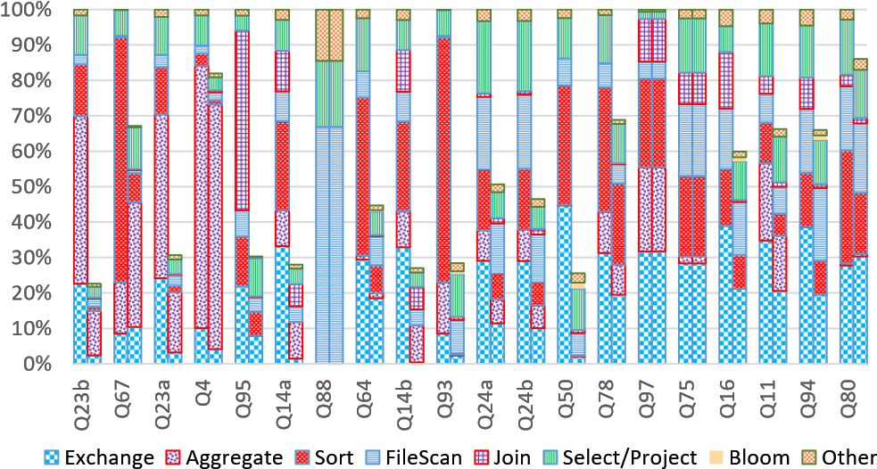
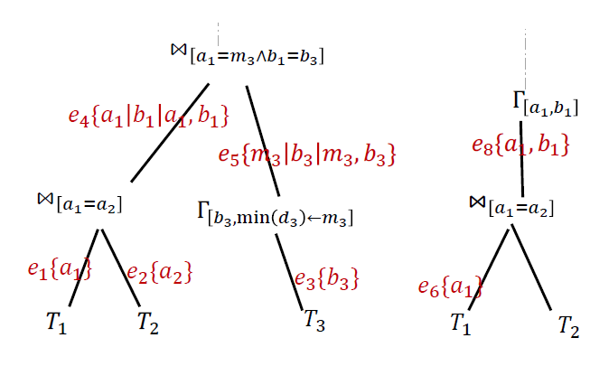
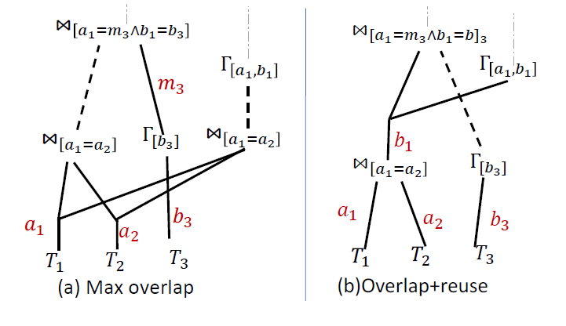
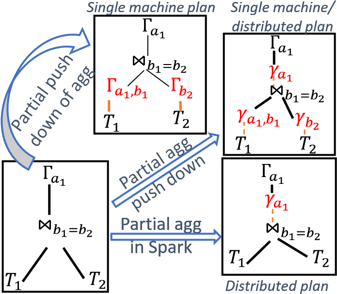
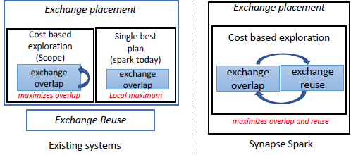
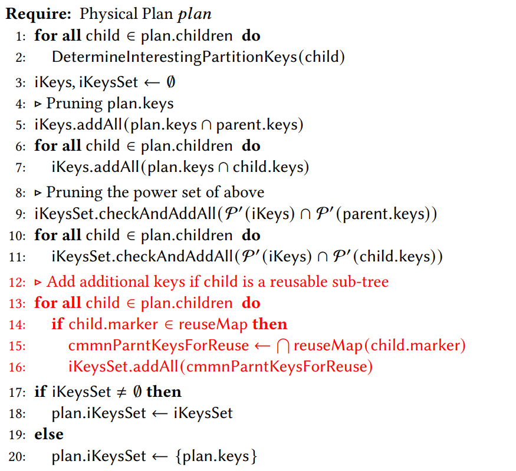
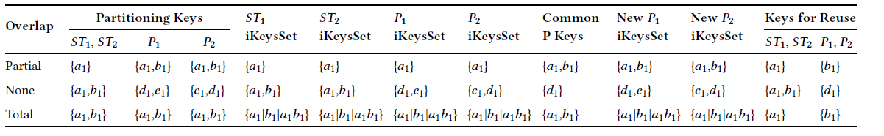
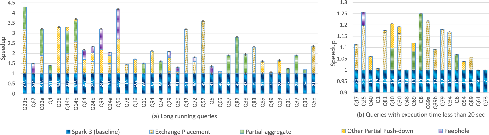
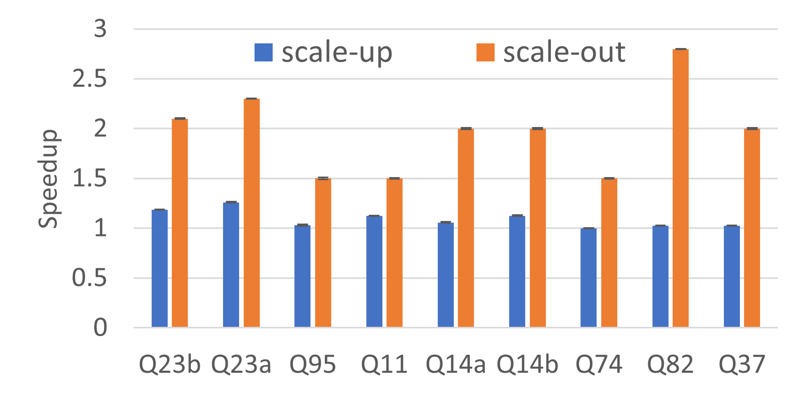

# New Query Optimization Techniques in the Spark Engine of Azure Synapse 

## ABSTRACT

The cost of big-data query execution is dominated by stateful operators. These include *sort* and *hash-aggregate* that typically materialize intermediate data in memory, and *exchange* that materializes data to disk and transfers data over the network. In this paper we focus on several query optimization techniques that reduce the cost of these operators. First, we introduce a novel exchange placement algorithm that improves the state-of-the-art and significantly reduces the amount of data exchanged. The algorithm simultaneously minimizes the number of exchanges required and maximizes computation reuse via multi-consumer exchanges. Second, we introduce three partial push-down optimizations that push down partial computation derived from existing operators (*group-by*s, *intersection*s and *join*s) below these stateful operators. While these optimizations are generically applicable we find that two of these

optimizations (*partial aggregate and partial semi-join push-down*) are only beneficial in the scale-out setting where *exchange*s are a bottleneck. We propose novel extensions to existing literature to perform more aggressive partial push-downs than the state-ofthe-art and also specialize them to the big-data setting. Finally we propose peephole optimizations that specialize the implementation of stateful operators to their input parameters. All our optimizations are implemented in the spark engine that powers azure synapse. We evaluate their impact on TPCDS and demonstrate that they make our engine 1*.*8× faster than Apache Spark 3*.*0*.*1.

## INTRODUCTION

Modern query compilers rely on a combination of logical SQL level query optimization techniques and low-level code-generation techniques to produce efficient query executables. In the big-data setting they produce plans with multiple stages, such that each stage can run in a data-parallel manner across many machines. Operators within a stage are further grouped together into code-generation blocks that are complied such that data is materialized only at block boundaries [23]. Spark [6] is a popular big-data system that is based on such a compilation methodology.

As one would expect, stateful operators, operators that materialize data at stage or code-generation boundaries, dominate the cost of execution in these settings. In particular we find *exchange*, *hash aggregate* and *sort* are the three most expensive operators in Spark. An exchange operator is used to transfer data between stages. It requires that data be materialized to disk at the end of every stage and shuffled over the network to the tasks in the next stage. *Hash aggregate* and *sort* on the other-hand are operators that materialize data within a stage and hence demarcate code-generation blocks. They both maintain state in memory, spilling to disk if needed.

In this paper we focus on a set of techniques that reduce the cost of these operators. The optimizations fall into three categories. Exchange placement*.* First, we introduce a new algorithm that determines where exchange operators should be placed and what exchange keys to be used by each of them. Exchange operators serve a dual purpose. They re-partition data to satisfy the requirements of key based operators like *group-by*, *join* and *window functions* so that they can run in a data-parallel manner. In addition, exchanges enable reuse of computation across different parts of the tree. If two different sub-trees rooted at exchanges are performing the exact same computation, then one could perform the computation only once, persist the output in a partitioned manner at the source stage and consume it multiple times.

Existing systems [14, 27, 29, 35] determine *exchange placement* without considering reuse opportunity. We find that there are sev-

eral cases where *exchange placement* conflicts with *exchange reuse* and leads to a sub-optimal plan overall. To address this, we propose a new algorithm that takes into account the possibility of exchange reuses during exchange placement to determine candidate plans with interesting trade-offs (see Section 2.2.1 for examples). We cost these alternatives and pick the least cost plan.

To efficiently realize the algorithm we introduce a new implementation mechanism called *plan-marking* which enables us to perform global reasoning across different parts of the tree. Our exchange placement algorithm utilizes *plan-marking* to tag identical sub-trees with the same marker, indicating reuse opportunity.

Partial push-down*.* Second, we introduce *partial* push-down techniques into the big-data query optimizer. These techniques do not substitute an operator but derive an auxiliary operator that can be pushed down the tree. We extend the Spark optimizer to enable three different partial pushdown techniques, namely *partial*

*aggregation*, *semi-join push-down* and *bit-vector filtering*.

Our partial aggregate push-down mechanism builds upon known techniques to partially push-down *group-by* below *joins* [10, 20, 22,

30]. We adapt these techniques to push-down *partial aggregates* not just below *select* and *join* as proposed in existing literature but also *unions*, *project* and *expand* [2]. The Spark optimizer today only introduces a partial aggregate directly before a *group-by* and does so during physical planning. In contrast, we enable more aggressive push-down by adding a new logical operator to represent partial aggregates and new rules that incrementally push partialaggregates down. Further we propose new rewrites that derive partial aggregates from other operators (*semi-join* and *intersect*).

We also propose a new partial semi-join push-down rule that

converts *inner-joins* in trees rooted at *semi-joins* into *semi-joins* without changing the root (see Section 2.2.2 for examples). We demonstrate (see Section 7.3) that both *partial aggregation and semijoin push-down* are much more impactful in the big-data setting when compared to the classical scale-up database setting.

Finally we incorporate push-down of *bit-vector* filters into the

Spark optimizer. While bit-vector filtering is well-known [11–13, 15] we propose an efficient implementation based on plan-marking to avoid unnecessary materialization in the big-data setting. Further we rely on Spark’s execution strategy to construct the filters inparallel; starting at tasks and finally combining across executors.

Partial push-downs perform additional computation but can save on exchange. We therefore introduce them in a cost-based manner. Our cost-functions combine column level statistics with partitioning properties in novel ways to determine when these partial push-downs are likely to be beneficial.

Peephole optimizations*.* Third, we propose a set of peephole optimizations that improve the implementation of stateful operators. For example, we optimize the order of keys for a multi-column sorting. Spark’s *sorter* compares keys in the byte space and lazily de-serializes data. Our optimization brings down the cost by picking an order that leads to fewer de-serializations and comparisons. Note that while *sort* is order sensitive, operators like (*sort-merge*) *join*

2.00

Figure 1: Speedup from optimizations in the spark engine of azure synapse over latest version of Apache Spark only need keys to be consistently ordered on both sides. Such an optimization again requires global reasoning and our implementation once again relies on *plan-marking* to enforce consistent ordering.

Summary of performance benefits*.* We implement all these optimizations in the spark engine of azure synapse (synapse spark for short) and compare it against the latest version of Apache Spark, Spark 3*.*0*.*1 (in this paper whenever we mention Spark we implicitly refer to this distribution). Figure 1 illustrates the speedup that the various optimizations bring about over all queries in TPCDS, a standard data analytics benchmark (at 1TB scale factor). As can be seen the optimizations together speedup the benchmark suite by 1*.*8×. Exchange placement brings about 27% speedup, the partial push-down techniques together bring a speedup of 40% and the rest of comes from our peephole optimizations.

Applicability of optimizations*.* synapse spark is a scale-out big-data system derived from Apache Spark. While the peephole optimizations we propose are specific to Spark based systems, the other optimizations are more broadly applicable. The exchange placement algorithm is applicable to all big-data systems [14, 27, 29, 35] as they all need an exchange operator. The patial pushdown techniques are not just applicable to scale-out systems but to scale-up single machine databases as well. However, our empirical evaluation brings up an interesting finding. While *bit-vector* filtering brings significant benefits in scale-up settings (as they filter data right after scan), we find that *partial-aggregation* and *semi-join* push-down are not as beneficial in the scale-up setting. We observe that they only bring benefits when they save on the amount of data exchanged.

In summary, the paper makes the following core contributions.

-   We characterize the performance bottlenecks in Spark. The previous analysis [24] was done before Spark incorporated codegeneration and is out-dated.
-   We propose a new algorithm for exchange placement that improves over the state-of-the-art and significantly reduces the number of exchanges needed to evaluate a query.
-   We extend ideas from existing literature to provide holistic support for partial aggregation. We add new rules to push-down below operators not considered in the past and propose a specialized cost model for big-data systems that incorporates partitioning information.
-   We propose a novel *semi-join* push-down technique that, we find, benefits scale-out big-data systems much more than scale-up databases (partial aggregation is similar).
-   We propose a set of peephole optimizations that significantly improve the performance of Spark’s sort implementation.
-   All these optimizations are implemented in the synapse spark, a production system available for general use. We demonstrate that these optimizations bring significant performance gains.

    

Figure 2: Normalized cost of operators in top 20 queries. Each query has two bars, the left bar corresponds to costs in baseline Spark. The right bar shows the reduced percentages after our optimizations as implemented in synapse spark.

⋈

1


## 2 MOTIVATION AND EXAMPLES

We begin with a performance characterization of Spark.

### 2.1 Workload characterization

We enhanced the instrumentation done by Spark to measure the time spent in each operator[^2] by each task. Figure 2 reports the time spent in various operators for the most expensive 20 queries in TPCDS (at 1TB scale factor). For each query it shows the breakdown before and after our optimizations, we focus on the cost before (left bar) in this section. We make the following observations. 

[^2]:   Spark today only reports metrics per code generation block and not per operator.

- *Exchange, hash-aggregate* and *sort* are the three most expensive operators. They contribute to 80% of the total task time in half the queries and 50 − 80% in another quarter of the queries.
- Exchange is uniformly expensive and contributes 20 − 40% of the cost in all but a few ( 5%) scan heavy queries. 
- *Sort* and *hash-aggregate* are almost equally expensive, they together contribute 20 − 50% of cost in most queries.
- *Scan* and *Join*, the other two significant operators are much less expensive on average. However, they are the most expensive operator in specific queries (like *𝑄*88 and *𝑄*95 respectively).

### 2.2 Examples of optimizations

Next we motivate the proposed optimizations with examples from TPCDS. Table 1 describes the notation we use to represent queries.

> [!TIP]
> Table 1: Symbols used for SQL operators are as shown. We use *𝑇,𝑇*1*,𝑇*2*,𝑇*3 as table names and *𝑎,𝑏,𝑐,𝑑,𝑒* as column names. We sub-script column names with the numeric sub-script of tables they come from. For example *𝑏*2 come from table *𝑇*2. A *union* renames columns, we ensure that inputs have the same column names but differ in suffixes and we assign new suffixes to the output. Solid lines represent exchanges, and dashed connect operators in the same stage.
>
> | Operator             | Symbol                                                       |
> | -------------------- | ------------------------------------------------------------ |
> | Select               | $\sigma_{\text {pred }}(T)$                                  |
> | Project              | $\Pi_{\text {expr }}(T)$                                     |
> | Group-by             | $\Gamma_{\text {keys, }[\text { aggs }(\text { exprs })]}(T_{1})$ |
> | Inner Join           | $\Join_{a_{1}=a_{2} \wedge b_{1}=b_{2} \ldots}$              |
> | Left/right Semi Join | $\ltimes / \rtimes_{a_{1}=a_{2} \wedge b_{1}=b_{2} \ldots}$  |
> | Union (all)          | $\cup(T_{1}, T_{2} \ldots T_{n})$                            |
> | Intersect (distinct) | $\cap\left(T_{1}, T_{2}\right)$                              |
> | Partial aggregate    | $\gamma_{\text {keys, }[\text { aggs }(\text { exprs })]}(T)$ |
> 

#### 2.2.1 Exchange placement

Consider a variant of Q23 (we show only 2 of the 4 subtrees and modify some operators for ease of exposition) as shown in Figure 3. The tree shows operators as nodes and their required partitioning properties annotated on edges. In case there are multiple possibilities the edge is annotated with a set of partitioning options, any one of which would suffice. For example, edge $𝑒_4$ requires partitioning on either the pair of columns $𝑎_1$, $𝑏_1$ or just $𝑎_1$ or just  $b_1$. All these are valid options as key based operators (*join*, *group-by* etc.) can execute in parallel as long as inputs are partitioned on some subset of the keys. Notice that the query performs $𝑇_1 \Join 𝑇_2$ twice but with different parent operators.

> [!NOTE]
> 考虑 Q23 的一个变体（我们仅显示 4 个子树中的 2 个，并修改一些运算符以便于说明），如图 3 所示。该树将运算符显示为节点，并在边上注释了它们所需的分区属性。如果存在多种可能性，则边缘会用一组分区选项进行注释，其中任何一个就足够了。例如，边 $𝑒_4$ 需要在一对列 $𝑎_1$、$𝑏_1$ 或仅 $𝑎_1$ 或仅 $b_1$ 上进行分区。所有这些都是有效的选项，因为只要输入在键的某个子集上进行分区，基于键的运算符（*join*、*group-by* 等）就可以并行执行。请注意，查询执行 $𝑇_1 \Join 𝑇_2$ 两次，但使用不同的父运算符。


<p align="center">
 
Figure 3: Query with multiple partitioning options. Each edge is annotated with a set of partitioning options any of which suffices to satisfy the requirement of the parent operator.
</p>
An exchange operator takes as input a set of columns (and a partition count) and partitions the data on those columns. Figure 4 shows two ways of placing exchanges in this query. The plan on the left is generated by state-of-the-art algorithms that minimize the number of exchanges needed to satisfy the required properties of all the operators. To do so ==it picks partitioning options at <u>edges</u>== such that they can be satisfied by exchanges introduced lower in the tree. For example, if we pick a partitioning option $𝑎_1$ at $𝑒_8$, it can be satisfied by the previous exchange on $𝑎_1$ at $e_6$ (we use shorthand $e_6 ← 𝑎_1$ to represent exchange assignments). Similarly if the partitioning option $𝑎_1$ at $e_4$ is chosen, it can make use of $𝑒_1 ← 𝑎_1$. <u>We refer to the careful choice of picking partitioning options to use a previous exchange as **overlapping** an exchange</u>. Such an assignment would lead to six exchanges (at all but $𝑒_8$ and $𝑒_4$). For this example, the above assignment is minimal in the number of exchanges needed to satisfy partitioning requirements of all operators. The exchange reuse rule would then trim this list down to 4 (Figure 4(a) shows the final plan). Note that in this plan the **join** between $𝑇_1$ and $𝑇_2$ is performed twice and the exchanges after $𝑇_1$ and $𝑇_2$ are reused and each is read by two consumer stages.

> [!NOTE]
> ==交换运算符==将一组列（和分区数）作为输入，并对这些列上的数据进行分区。图 4 显示了在此查询中放置==交换==的两种方法。左边的计划是由最先进的算法生成，该算法最大限度地减少了满足所有运算符所需属性所需要的==交换==数量。为此，==它会在<u>边缘</u>选择分区选项==，以便通过树中**较低位置引入的交换**来满足它们。例如，如果我们在 $𝑒_8$ 处选择用 $𝑎_1$ 分区 ，则可以通过先前在 $e_6$ 处  $𝑎_1$ 的分区来满足（我们使用简写 $e_6 ← 𝑎_1$ 来表示==**交换分配**==）。同样，如果在 $e_4$ 处选择用 $𝑎_1$ 分区，则可以使用 $𝑒_1 ← 𝑎_1$。<u>我们将仔细选择分区以便能使用==先前的交换称为**重叠**交换==</u>。这样的分配将导致六次交换（除了 $𝑒_8$ 和 $𝑒_4$ 之外）。对于该示例，上述分配在满足所有运算符的分区要求的同时，所需的交换数量方面是最少的。然后，==交换重用规则==会将此列表削减至 4 个（图 4(a) 显示最终计划）。请注意，在此计划中，$𝑇_1$ 和 $𝑇_2$ 之间的 **join** 执行两次，并且 $𝑇_1$ 和 $𝑇_2$ 之后的交换被重用，并且每个交换都由两个消费者 stage 读取。

<p align="center">
 
Figure 4: Exchange placement for query in Figure 3. Maximizing overlap leads to sub-optimal plans. Combining overlap with reuse information leads to better plans.
</p>


However as shown in Figure 4(b) there is another assignment which overlaps fewer exchanges but is better. Consider the plan when only exchange $𝑒_3 ← 𝑏_3$ is overlapped (with $𝑒_5$). This would lead to seven exchange assignments (before reuse exchange). Notice here we deliberately pick the partitioning choice $b_1$ at $e_8$ and this is clearly sub-optimal from an exchange overlap perspective. Despite this we get a better plan after the reuse exchange rule is applied (as shown in Figure 4(b)). This plan directly reuses the exchange $e_4 ← b_1$ at $e_8$ (thus reusing the result of the **join**) to generate a plan with 4 exchanges. As this is a deeper exchange reuse, this plan would not only avoid exchanges at $e_6$, $e_7$ and $e_8$ but also avoid performing the **join** a second time. Further note that this plan would also likely lead to lesser I/O as only one exchange is reused as opposed to two (2 reads instead of 4). Hence overall we expect this plan to be better.

In summary, combining exchange reuse opportunities with exchange overlap produces better plans, this is the focus of the exchange placement algorithm we propose.

> [!NOTE]
> 然而，如图 4(b) 所示，还有另一种分配，它重叠的交换较少，但效果更好。考虑==仅交换 $𝑒_3 ← 𝑏_3$ 与 $𝑒_5$ 重叠时的计划==。这将导致七个交换分配（在重用交换之前）。请注意，这里我们故意在 $e_8$ 处选择 $b_1$ 分区，从交换重叠的角度来看，这显然不是最优的。尽管如此，在应用重用交换规则后我们得到了一个更好的计划（如图 4(b) 所示）。该计划直接重用$e_8$处的交换$e_4←b_1$（从而重用 **join** 的结果）来生成具有4个交换的计划。由于这是更深层次的交换重用，该计划不仅可以避免在 $e_6$、$e_7$ 和 $e_8$​ 处进行交换，还可以避免再次执行 **join**。进一步请注意，该计划还可能导致 I/O 减少，因为仅重用一个交换而不是两个（2 次读取而不是 4 次读取）。因此总的来说，我们预计这个计划会更好。
>
> 总之，将交换重用机会与交换重叠相结合可以产生更好的计划，这是我们提出的交换布局算法的重点。

#### 2.2.2 Partial pushdown optimizations
Next we demonstrate examples of partial aggregate push-down and semi-join push-down. Figure 5 shows a basic query that performs a join on a column *𝑏* followed by an aggregation on a different key *𝑎*. It also shows three existing optimizations for this type of query. These are described in the box below.

<p align="center">
 
Figure 5: The figure shows the partial aggregation optimization as done in Spark today, the group-by push-down proposed in literature and the proposal made in this paper. 
</p>

> [!NOTE]
> **Previous work on partial push-down of aggregates**
>
> The first optimization is specific to the big-data setting, it is targeted at reducing the amount of data exchanged. Notice that the un-optimized plan in Figure 5 (bottom-left) would require 3 exchanges (on $b_1$, *𝑏*2 and *𝑎*1) as highlighted by bold lines. This optimization (bottom right) performs a partial aggregation where it would perform an additional aggregation before exchange, that is even before data is partitioned on the grouping key. Such partial aggregation would bring down the amount of data exchanged as it would produce only one row per group at each task in the stage before final aggregation.
>
> The second optimization is one that pushes down an entire aggregation below the join [10, 20, 30]. This optimized plan (as shown on the top left) performs aggregations along the inputs to the join on a key set containing the join and aggregation keys available at that input. Previous literature describes conditions under which such rewrites are safe. It advocates doing such push-downs in a cost based manner to ensure that pushing the *group-by* actually brings down the amount of data joined. Note that in the big-data setting this optimization in itself does not save on exchanges as the *group-by* and *join* would likely get placed in the same stage by the exchange placement rule.
>
> A third optimization [22] that is closest to our proposal combines these two optimizations to produce the single machine plan shown in the top-right, where a partial aggregation is performed before the *join* instead of a full aggregation. As on a single machine all intermediate data remains in memory, they also propose a specialized implementation of such trees that performs the partial aggregation along the input phase of the subsequent *join*. Such an implementation is not feasible in the big-data setting where data is materialized at exchange.

The proposal in [22] is specific to pushing aggregates below joins. We extend it to all other SQL operators and do so by adding *first class support for partial aggregation* during query optimization. We introduce a new logical operator (*𝛾*) to represent partial aggregates and introduce new rules into the optimizer that transform them. The distributed plan shown in the top-right of Figure 5 requires two rewrites. The first introduces a partial aggregation operator (*𝛾*) above the *join* and the second pushes it down below the *join*. Note that in our optimized plan the push-down does not introduce additional exchanges. In the big-data setting this optimization introduces an interesting trade-off, it increases the number of hashaggregates but reduces the amount of data exchanged. We propose a costing mechanism to determine if the optimization is beneficial.

Next we show examples where we derive partial aggregates from operators other than *group-by* and push them down below standard SQL operators. Figure 6(a) illustrates a standard query template that performs a chain of joins and (optionally) unions before performing an aggregation. As shown in the figure we can push-down partial aggregates in such queries all the way to the leaf. Such push downs are only possible because we added partial aggregates as first class logical operators and pushed them down operator by operator. Note the figure shows all candidate locations for partial aggregates, not all of them necessarily reduce the amount of data exchanged. In fact

Figure 6: Partial push-down examples. Left, Partial-agg pushed below union, like in Q11. Right, Semi-join push-down and partial-agg derived from semi-join in Q95 some of the push-downs (shown in gray/light shade) do not affect exchange at all. Our costing mechanism eliminates such options. Figure 6(b) illustrates partial push-down opportunities in queries with *semi-join*s. A *left semi-join* only checks if a row in the left table has a match in the right table, and hence only needs unique values of the columns from the right side that are referred to in the join predicate. This leads to two optimizations. First, we can introduce partial aggregates (refer figure) to eliminate duplicates. Second, other inner joins on the right tree could be converted into semi-joins. This is another example of a previously unexplored partial push-down that converts inner-joins into semi-joins without modifying the parent semi-join.

## 3 EXCHANGE PLACEMENT

This section describes the exchange placement algorithm we use in synapse spark. Figure 7 provides an overview of what existing systems do today and our proposal. Broadly there are two kinds of systems. Scope [35], employs cost based exploration to select among different exchange placement options [34]. As we describe later such exploration allows it to maximally *overlap* exchanges. On the other hand systems like Spark do not support exploration and instead maintain just a single plan. They traverse the plan bottom up and introduce exchanges after performing a local overlap check. As shown in the figure, both systems apply the *exchange reuse* rule separately, after exchange placement. In both systems, it transforms the final chosen plan without exploration.

In synapse spark we perform exchange placement in a cost based manner, while taking into account both *exchange overlap* and *exchange reuse* opportunities. Now, cost based exploration can be expensive, and Scope employs a large optimization time budget (several minutes). In synapse spark on the other-hand we impose a hard constraint on the optimizer time (in seconds) to meet customers expectations. To achieve this we improve the state-ofthe-art algorithm that has a large exploration space (Section 3.1). We do so by exploring multiple options only when there are multiple ways to *overlap* exchanges or when *exchange overlap* conflicts with *exchange reuse* (Section 3.2). Finally, to determine conflicting options, we need to identify potential for *exchange reuse* early. We employ plan marking for this (Section 3.3).

<p align="center">
 
Figure 7: Exchange placement overview 
</p>

> [!NOTE]
> 本节介绍我们在 Synapse Spark 中使用的==交换放置==算法。图 7 概述了现有系统目前的功能以及我们的建议。大体上有两种系统。Scope[35]，采用基于成本的探索来选择不同的节点来放置 Exchange [34]。正如我们稍后描述的，这种探索允许它最大限度地**重叠交换**。另一方面，像 Spark 这样的系统不支持探索，而是只维护一个单一的计划，自下而上遍历计划，执行完==本地重叠检查==后引入交换。如图所示，两个系统在交换放置后分别应用**交换重用**规则。两个系统都会在不进行探索的情况下转换最终选择的计划。
>
> 在 Synapse Spark 中，我们以基于成本的方式<u>执行交换放置</u>，同时考虑**交换重叠**和**交换重用**机会。现在，基于成本的探索可能会很昂贵，并且 Scope 采用大量优化时间预算（几分钟）。另一方面，在 Synapse Spark 中，我们对优化器时间（按秒为单位）施加严格限制，以满足客户的期望。为了实现这一目标，我们改进了<u>具有较大探索空间的最先进算法</u>（第 3.1 节）。仅当存在多种**重叠交换**方式或**交换重叠**与**交换重用**冲突时（第 3.2 节），我们才会探索多种选项。最后，为了确定相互冲突的选项，我们需要尽早确定**交换重用**的可能性。我们采用平面标记（第3.3节）。

### 3.1 Exploration based exchange placement

Lets begin by examining the state-of-the-art algorithm for exchange placement [34]. Algorithm 1 shows pseudo-code for a recursive routine that computes the interesting partitioning options at each operator in the plan. For ease of exposition, we assume that the plan only consists of key based operators. The implementation of-course deals with all SQL operators. First, we define $\mathcal{P}^{\prime}(\mathrm{X})=\mathcal{P}(\mathrm{X}) \backslash \emptyset$​ where $\mathcal{P}(\mathrm{X})$ is the power set of $\mathrm{X}$. In the this section when we mention power set, we refer to $\mathcal{P}^{\prime}$. Now in this method, the interesting partitioning options consists of all possible combinations of the operator keys i.e. $\mathcal{P}^{\prime}(\mathrm{\text{plan.keys}})$. In Figure 3, the *join* having $\{a_{1}, b_{1}\}$ as keys, would have $\{a_1|b_1| a_1, b_1\}$ in its *iKeysSet*.

```
# Algorithm 1 DetermineInterestingPartitionKeysDefault
Require: Physical Plan 𝑝𝑙𝑎𝑛
1: for all child ∈ plan.children do
2:   DetermineInterestingPartitionKeysDefault(child)
3: plan.iKeysSet ← P′(plan.keys)
```

> [!NOTE]
> 让我们首先检查最先进的交换放置算法 [34]。算法 1 显示了递归函数的伪代码，该递归函数计算计划中每个运算符感兴趣的分区选项。为了便于说明，我们假设该计划仅由基于 ***key*** 的运算符组成。当然，该实现涉及所有 SQL 运算符。首先，我们定义 $\mathcal{P}^{\prime}(\mathrm{X})=\mathcal{P}(\mathrm{X}) \backslash \emptyset$ 其中 $\mathcal{P}(\mathrm {X})$ 是 $\mathrm{X}$ 的**幂集**。在本节中，当我们提到幂集时，我们指的是$\mathcal{P}^{\prime}$。现在，在此方法中，感兴趣的分区选项由运算符的 ***key*** 的所有可能组合组成，即 $\mathcal{P}^{\prime}(\mathrm{\text{plan.keys}})$。在图 3 中，以 $\{a_{1}, b_{1}\}$ 作为键的 **Join** 其 *iKeysSet* 是 $\{a_1|b_1| a_1, b_1\}$ 。

> [!IMPORTANT]
> 在数学上，Power set 被称为幂集，是一个集合中所有可能子集的集合。假设我们有一个集合 X={a,b}，那么集合的幂集 P(X) 就是{{},{a},{b},{a,b}}。换句话说，它包含原集合的所有可能的组合，包括空集和原集合本身。正在讨论的公式 $\mathcal{P}^{\prime}(\mathrm{X})=\mathcal{P}(\mathrm{X}) \backslash \emptyset$  是用来定义一个新的集合 ，它就是原集合 $\mathrm{X}$ 的幂集去掉空集后的结果。

Next, plans with different combinations of partition keys are explored using a standard plan space exploration algorithm. Algorithm 2 shows a simplified version of the dynamic programming based exploration algorithm used in both synapse spark and Scope[^2]. The algorithm tracks up to *𝑘* plans per node. We discuss how *𝑘* is chosen at the end of the section.

> [!NOTE]
> 接下来，使用标准的<u>计划空间探索算法</u>来探索具有不同分区键组合的计划。算法 2 显示了 Synapse Spark 和 Scope[^2] 中使用的基于动态规划的探索算法的简化版本。该算法跟踪每个节点最多 *𝑘* 个计划。我们在本节末尾讨论如何选择 *𝑘*。

[^2]: There are several differences in the specifics of the algorithm used by the two systems. We focus here on exchange placement relevant aspects.

```
# Algorithm 2 OptimizePlan

Require: Physical Plan 𝑝𝑙𝑎𝑛
Require: Required Distribution 𝑟𝑒𝑞𝑑𝐷𝑖𝑠𝑡𝑟

1: If the plan has top k plans computed for reqdDistr already, fetch them from the map;
2: for all partnKeys ∈ plan.iKeysSet do
3:   childrenTopPlans ← ∅             # Compute top K plans for children
4:   for all child ∈ plan.children do
5:     childTopPlans ← OptimizePlan(child, Distr(partnKeys))
6:     childrenTopPlans.add(childTopPlans)
7:   for all childrenCombo ∈ allCombinations(childrenTopPlans) do
8:     newPlan ← plan.updateChildren(childrenCombo)
9:     optPlan ← EnforceExchange(newPlan, reqdDistr)
10:    plan.updateTopKPlans(reqdDistr, (optPlan, getCost(optPlan)))
11: return plan.getTopKPlans(reqdDistr)
```

In line 2, for each interesting partitioning key *partnKeys* of this operator, the best (up to ***𝑘***) plans for its children are computed first. Next, these alternative plans from the children are combined to get the alternative plans for the current operator. For example, if the plan has two children $𝐶_1$ and $𝐶_2$, having two and three top plans respectively,there would be six alternative options - plan having children as $\{\{C_{1}^{1}, C_{2}^{1}\},\{C_{1}^{1}, C_{2}^{2}\},\{C_{1}^{1}, C_{2}^{3}\},\{C_{1}^{2}, C_{2}^{1}\},\{C_{1}^{2}, C_{2}^{2}\},\{C_{1}^{2}, C_{2}^{3}\}\}$. This is followed by iterating over these alternatives, adding exchanges (using `EnforceExchange` at line 9) and selecting the top ***𝑘*** plans having minimum cost. `EnforceExchange`, as explained in more detail in [34], inserts an exchange only if the child partitioning does not satisfy the partitioning option at the parent. Specifically it checks for *exchange overlap*, that is whether the child partitioning is a (non-empty) subset of the partitioning option being explored.

This algorithm is exhaustive in the enumeration of interesting partitioning options. Scope, the existing system that uses the algorithm, can afford to employ a large value of ***𝑘*** (as it has a large time budget). This ensures that it is able to produce maximum overlap plans like the one shown in Figure 4(a).

> [!NOTE]
> 在第 2 行中，对于该运算符==每个感兴趣的分区键 ***partnKeys***==，首先计算其子项（最多 ***𝑘*** 个）的最佳计划。接下来，将来自子节点的这些替代计划组合起来以获得当前运算符的替代计划。例如，如果计划有两个子计划 $𝐶_1$ 和 $𝐶_2$，分别有两个和三个==顶层计划==，则将有六个替代选项 - 计划将子计划为 $\{\{C_{1}^{1}, C_{2}^{1}\},\{C_{1}^{1}, C_{2}^{2}\},\{C_{1}^{1}, C_{2}^{3}\},\{C_{1}^{2}, C_{2}^{1}\},\{C_{1}^{2}, C_{2}^{2}\},\{C_{1}^{2}, C_{2}^{3}\}\}$。接下来迭代这些替代方案，添加交换（使用第 9 行的 `EnforceExchange`）并选择成本最低的顶级 ***𝑘*** 计划。正如在 [34] 中有更详细地解释，`EnforceExchange` 仅当子分区不满足父分区的分区选项时才插入交换。具体来说，它检查**交换重叠**，即子分区是否是正在探索的分区选项的（非空）子集。
>
> 该算法详尽地列举了所有感兴趣的分区选项。SCOPE（使用该算法的现有系统）可以使用较大的 ***𝑘*** 值（因为它有大量的时间预算）。这确保了它能够生成如图 4(a) 所示的最大重叠计划。


### 3.2 Pruning the space with overlap reasoning

Algorithm 3 describes our implementation to prune the exploration space by reducing the partitioning options (lines 5-7). Instead of relying on `EnforceExchange` to detect overlap opportunities, we prune the options in two phases. First, we compute individual partitioning keys of the operator that have an overlap with its parent’s or children’s keys. We add[^3] all of them to set iKeys.

> [!NOTE]
> 算法 3 描述了我们通过==减少分区选项==来裁剪探索空间的实现（第 5-7 行）。我们不依赖 `EnforceExchange` 来检测重叠机会，而是分两个阶段裁剪分区选项。首先，我们计算==与其父键或子键重叠的运算符的各个分区键==。我们将它们全部添加[^3] 到 **iKeys** 集合中。

<p align="center">
<B>Algorithm 3</B> DetermineInterestingPartitionKeys
 
</p>

[^3]: X*.*addAll(Y) indicates adding all elements from Set Y to Set X. X*.*add(Y) indicates adding the Set Y to Set X as a single entity.

In the second phase, we obtain all overlap options by <u>intersecting the power set of *iKeys* with the power set of parent’s keys and the children’s keys</u>. We insert only these as options (in *iKeySet*) using a `checkAndAddAll` method. This method checks if the number of distinct values for the set is more than the number of partitions required (a job parameter) before adding it as a partitioning option. Table 2 demonstrates how this adds all overlap options. The third row (labeled **Total**) has 3 different ways to overlap between parent (P1) and child (ST1), all these are added as options. Row **Partial** (representative of example in Figure 3) only adds one option. This is sufficient to produce maximal overlap plan Figure 4(a). Finally, if no options are added based on overlap (row **None** in table), we only consider one option which is the entire key set (line 20). This pruning reduces the search space significantly whenever operators are keyed on multiple columns (like in TPCDS queries).

<p align="center">
 
Table 2: Examples showing overlap scenarios between two identical sub-trees’ keys (ST1 and ST2) and common partitioning keys from both parents (P1 and P2). Last column shows the one of the possible keys selection for exchange reuse.
</p>
> [!NOTE]
> 在第二阶段，我们通过<u>将 *iKeys* 的幂集与  parent’s keys 和 children’s keys 的幂集相交来获得所有重叠选项</u>。我们使用 `checkAndAddAll` 方法仅将这些作为==分区选项==插入 *iKeySet* 中。此方法在将其添加为分区选项之前，检查该集合的不同值的数量是否大于所需的分区数量（作业参数）。表 2 演示了如何添加所有重叠选项。第三行（标记为 **Total**）有 3 种不同的方式在父级 (P1) 和子级 (ST1) 之间重叠，所有这些都作为选项添加。行 **Partial**（代表图 3 中的示例）仅添加一个选项。这足以生成最大重叠计划图 4(a)。最后，如果没有基于重叠添加选项（表中的 **None** 行），我们只考虑一个选项，即整个键集（第 20 行）。当运算符有多列的组合键时（例如在 TPCDS 查询中），这种修剪会显着减少搜索空间。

### 3.3 Incorporating exchange reuse
As we saw in Section 2.2.1 *exchange reuse* can conflict with *exchange overlap*. This happens when there is an overlap between partitioning keys of the reusable sub-tree and its parent. For example, in Figure 3, there is an overlap in the partitioning keys of **join** having keys  $\{a_{1}\}$ and its parent **join** having keys  $\{a_{1}, b_{1}\}$ . If we simply maximize overlap we may not introduce an exchange after the **join** at all and hence there would be no scope for an **exchange reuse** (after **join**).

To resolve this, we will have to include additional keys in the interesting partitioning options (**iKeysSet**) tracked at the parents of the reusable sub-trees. We accomplish this in two steps.

We begin by executing a new routine before Algorithm 3 which is described in Algorithm 4. This algorithm adds plan markers at nodes in the tree such that if two nodes have the same marker value, the sub-trees rooted on them are identical. In addition to it, we use a **reuseMap**, to store the partitioning keys from these identical subtrees’ parent. This algorithm is followed by a cleanup routine (not shown) that removes singleton entries from the **reuseMap**.

> [!NOTE]
> 正如我们在第 2.2.1 节中看到的，**交换重用**可能与**交换重叠**发生冲突。当可重用子树及其父树的分区键之间存在重叠时，就会发生这种情况。例如，在图 3 中，具有键 $\{a_{1}\}$ 的 **Join** 及其具有键 $\{a_{1}, b_{1}\}$ 的父 **Join** 的分区键存在重叠。如果我们只是最大化重叠，我们可能根本不会在 **Join** 之后引入交换，因此就没有**交换重用**的场景（在**Join**之后）。
>
> 为了解决这个问题，我们必须在可重用子树的父级跟踪的感兴趣的分区选项（**iKeysSet**）中包含额外的键。我们分两步完成此任务。
>
> 我们首先在算法 4 中描述的算法 3 之前执行一个新例程。该算法在树中的节点处添加计划标记，这样如果两个节点具有相同的标记值，则以它们为根的子树是相同的。除此之外，我们还使用 **reuseMap** 来存储来自这些相同子树的父级的分区键。该算法后面是一个清理例程（未显示），该例程从 **reuseMap** 中删除单条记录。

```
Algorithm 4 PlanMarking
Require: Physical Plan 𝑝𝑙𝑎𝑛
1: for all child ∈ plan.children do
2:   PlanMarking(child)
3: plan.marker ← SemanticHashFunc(plan)
4: reuseMap(plan.marker).add(plan.parent.keys)
```

Next, we extend Algorithm 3 to support **exchange reuse** by adding the common keys (derived from **reuseMap**) in the interesting partitioning keys set if the child is a reusable sub-tree (lines 13-16).

Lets revisit row *Partial* in Table 2. Consider the two nodes at $(𝑆𝑇_1, 𝑆𝑇_2)$ at $\Join_{𝑎_1=𝑎_2} (𝑇_1,𝑇_2)$ in Figure 3 and their parents $(𝑃_1, 𝑃_2)$. We already established that their ***iKeysSet*** based on overlap reasoning would contain one element $𝑎_1$. Now in order to take reuse into account, we will add the common keys between the $𝑃_1$ and $𝑃_2$ in their ***iKeysSet***. Thus, the parents’ new ***iKeysSet*** would be $\{a_1|b_1\}$ . The exploration will now include exchange on $𝑏_1$ as an option. If costed right this should lead to the plan shown in Figure 4(b).

Since, we are depending on the costing model for the keys selection, we need to ensure that during costing we take *exchange reuse* into account. To accomplish this, we add a sub-routine `AddReuseExchange` after line 9 in Algorithm 2. At this point, *optPlan* would contain exchange operators at the required places, added by `EnforceExchange`. Since we have previously accomplished plan-marking, `AddReuseExchange` will identify exchange operators, whose children are marked for reuse. Now, for each group (consisting of identical sub-trees), it replaces all except one such exchange operators by *exchange reuse* operators in the *optPlan*. We will now use this *optPlanWithReuse* while updating the operator’s *top k plans* set. 

> [!NOTE]
> 接下来，如果子树是可重用子树（第 13-16 行），我们通过==**在感兴趣的分区键集**==中添加公共键（从 **reuseMap** 派生）来扩展算法 3 以支持 **交换重用**。
>
> 让我们重新审视表 2 中的 *Partial* 行。考虑图 3 中 $\Join_{𝑎_1=𝑎_2} (𝑇_1,𝑇_2)$ 处 $(𝑆𝑇_1, 𝑆𝑇_2)$ 的两个节点及其父节点 $(𝑃_1, 𝑃_2)$ 。我们已经确定他们基于重叠推理的 ***iKeysSet*** 将包含一个元素 $𝑎_1$。现在为了考虑重用，我们将在它们的 ***iKeysSet*** 中添加 $𝑃_1$ 和 $𝑃_2$ 之间的公共 **keys**。因此，父级新的 ***iKeysSet*** 将是 $\{a_1|b_1\}$ 。==探索现在将包括 $𝑏_1$​ 的交换作为一个选项==。如果成本计算正确，这应该会产生如图 4(b) 所示的计划。
>
> 由于 keys 的选择取决于成本计算模型，因此我们需要确保在成本计算过程中考虑到**交换重用**。为了实现这一点，我们在算法 2 的第 9 行之后添加一个子例程 `AddReuseExchange`。此时，*optPlan* 将在所需位置包含由`EnforceExchange`添加的交换运算符。 由于我们之前已经完成了计划标记，`AddReuseExchange` 将识别运算操作符，其这些运算符的子级被标记为可重用。 现在，对于每个组（由相同的子树组成），它用 *optPlan* 中的 *exchange-reuse* 运算符替换除一个交换运算符之外的所有交换运算符。现在，我们将在更新运算符的 *top k* 计划集时使用这个 *optPlanWithReuse*。

```
optPlanWithReuse ← AddReuseExchange(optPlan)
```

In summary, synapse spark incorporates cost based exploration to decide on the placement of exchanges. By detecting exchange reuse opportunity early and by using this along with overlap information it is able to prune the search space significantly to make exploration practical. Specifically, in synapse spark we desire to optimize every query within 30 seconds. We achieve this by dynamically choosing the values of *𝑘* based on the complexity of the query. We observe that because of pruning a value of *𝑘* = 4 is sufficient to find the optimal exchange placement for all queries. We show in Section 7.4 that a value above 16 (as would be needed without pruning) significantly slows down the optimizer.

> [!NOTE]
> 总之，Synapse Spark 结合了基于成本的探索来决定交换的位置。通过尽早检测交换重用机会，并将其与重叠信息一起使用，能够显著地裁剪搜索空间以使探索变得实用。具体来说，在 Synapse Spark 中，我们希望<u>在 30 秒内</u>优化每个查询。我们通过根据查询的复杂性动态选择 *𝑘* 的值来实现这一点。我们观察到，由于裁剪，*𝑘* = 4 的值足以找到所有查询的最佳交换位置。我们在第 7.4 节中表明，大于 16 的值（不需要修剪）会显著降低优化器的速度。

## PARTIAL AGGREGATION PUSH-DOWN

This sections discusses partial aggregate push-down. We discuss other partial push-down techniques in the next section.

The spark optimizer has a physical operator *PhyOp-PartialAgg* to represent partial aggregates [3] and a physical rewrite rule to add them to the physical operator tree [1]. This rule in-fact replaces every *group-by* with a pair of partial and final aggregate operators (*PhyOp-PartialAgg* and *PhyOp-FinalAgg*). Today it does so without any costing. The two operators incrementally compute the result of standard commutative and associative aggregates

(*𝑠𝑢𝑚,𝑚𝑖𝑛,𝑚𝑎𝑥,𝑐𝑜𝑢𝑛𝑡*). *PhyOp-PartialAgg* has no partitioning requirements, it computes partial results of standard aggregates even before data is partitioned. *PhyOp-FinalAgg* has a required partitioning property, it expects inputs to be partitioned on a subset of the grouping keys. It combines the partial results for each unique combination of grouping key values to produce the final aggregates.

In synapse spark we introduce a new logical operator *LogOp-*

*PartialAgg* to represent partial-aggregates. We use the shorthand

*𝛾𝑘𝑒𝑦𝑠,*[*𝑎𝑔𝑔𝑠*(*𝑒𝑥𝑝𝑟𝑠*)] whenever we need to refer to its arguments. Like a *group-by* (Γ*𝑘𝑒𝑦𝑠,*[*𝑎𝑔𝑔𝑠*[*𝑒𝑥𝑝𝑟𝑠*)]) the operator has two arguments,

*𝑘𝑒𝑦𝑠* is a list of aggregation keys, and *𝑎𝑔𝑔𝑠*(*𝑒𝑥𝑝𝑟𝑠*) is a list of commutative and associative aggregate functions. Each aggregation

*𝑎𝑔𝑔𝑖* is applied after computing *𝑒𝑥𝑝𝑟𝑖* on the elements of the group. The rest of the section describes how we utilize this operator.

### Seed rules to derive partial aggregates

We begin by describing *seed rules*, rules that introduce *partialaggregates* into the query tree.

Figure 8: Seed rules to derive *partial agg* from SQL operators. Figure 8(a) depicts how we derive a *partial-aggregate 𝛾* from a *group-by* Γ. This rule is exactly like the physical rule that introduces *PhyOp-PartialAgg* (discussed above) except that its in the logical space. The rule introduces a *partial aggregate* with the same keys as the *group-by* and introduces appropriate aggregation functions to compute the aggregate incrementally. The figure shows partial functions for standard aggregates.

We add two more seed rules which are not part of the optimizer today, even as physical rules. Figure 8(b) shows how we derive a partial aggregate from a *left semi-join*. The rule introduces a partialaggregate (*𝛾𝑎*2) on the right child of a *left semi-join*. The partial aggregate is keyed on the equi-join keys from the right side and it does not perform any aggregates (such an aggregate is also referred to as a distinct aggregation). This is semantics preserving as a *left semi-join* only checks for an existence of a match on the equi-join keys from the right side. The partial aggregate simply removes duplicate keys from the right side, this does not affect the existence check. A similar rule (not shown) derives partial aggregates on the left child of a *right semi-join*.

Figure 8(c) shows how we derive a *partial-aggregate* from an *Intersect* operator. An *intersect* [4] is a set based operator that only outputs those rows from the left that match with rows in the right. The output of an *intersect* is a set (and not a bag) so duplicate rows are eliminated from the output. Given these semantics it is safe to eliminate duplicates from both the inputs of *intersect*. We introduce partial aggregates on each input to *intersect* for this.

An important property of *partial-aggregates* that we exploit later is that they are *optional* operators, not including them in the plan does not affect the correctness of the optimization. Adding a partial aggregate below a *group-by* is optional as the final aggregate is responsible to producing the fully aggregated value. One detail that needs to be taken care of is that the partial and final aggregate for a *𝑐𝑜𝑢𝑛𝑡* (∗) are different, so it may appear that the plan would be different depending on whether or not a partial aggregate is introduced. We exploit the fact that its possible to simulate a *𝑐𝑜𝑢𝑛𝑡* (∗) with a *𝑠𝑢𝑚*(1) aggregate [31], which simply adds a constant 1 for every row in the group. So in the rest of the section we assume that every *group-by* with a *𝑐𝑜𝑢𝑛𝑡* (∗) is rewritten before the seed rule and hence the partial and final aggregate have then same functions. Its also obvious that partial aggregates derived from *semi-join* and *intersect* are optional as they just eliminate duplicates early.

Figure 9: Rule to push-down partial-aggregate below join

### Partial aggregate push-down rules

Push-down below joins*.* Our rules for pushing down *partialaggregates* below *join* are based on rules from past literature [10, 20,

30] that describe how to push a *group-by* below a *join*. We describe the rewrite in detail in the box below. Note that the same rule can be used when every instance of *𝛾* is replaced with a *group-by* Γ and the correctness of our *partial-aggregate* push-down follows from the correctness of the *group-by* push down rule.

Pushing down *partial aggregates* based on rule from literature to push-down *group-by* below *join*

We describe how a partial aggregate *𝛾𝑝𝑘𝑒𝑦𝑠,*[*𝑝𝑎𝑔𝑔𝑠*(*𝑝𝑒𝑥𝑝𝑟𝑠*)] can be pushed down below a join *⊲⊳𝑎*1=*𝑎*2 (*𝑇*1*,𝑇*2)). Figure 9 shows an example plan before and after the rule is applied. The rule has a pre-condition that checks if for each aggregation

(*𝑝𝑎𝑔𝑔𝑠𝑖*) its parameter (*𝑝𝑒𝑥𝑝𝑟𝑠𝑖*) can be computed from exactly one of the inputs to the join. In Figure 9, *𝑑*1 comes from the left and *𝑒*2 comes from the right. So the pre-conditions are satisfied. After checking the pre-condition the rule rewrites the tree by introducing *partial- aggregates* at both inputs to the *join*. Further, it adds a *project* above the join that combines results from the newly introduced operators.

The arguments of the *partial-aggregates* on each side and the *project* are derived as follows. The keys for the new *partialaggregates* are derived by splitting the parent keys between the left and the right. These sets are then appended with the *join* keys from that side. In the example, (*𝑎*1*,𝑏*1) become the keys for the *𝛾* on the left and (*𝑎*2*,𝑐*2) become the keys for the right. Next, the aggregation functions on the two sides are derived by splitting the *𝑎𝑔𝑔𝑠* into those whose expressions can be computed from the left and those from the right. In the example, *𝑠𝑢𝑚*(*𝑑*1) comes from left and *𝑚𝑖𝑛*(*𝑒*2) comes from right. Each aggregation is then replaced with the corresponding partial computation. Further, if any of the aggregates on the right (left) side perform a *𝑠𝑢𝑚* or *𝑐𝑜𝑢𝑛𝑡*, a *𝑐𝑜𝑢𝑛𝑡* aggregate is added on the left (right). These counts are needed in the final project (Π) to scale up the partial results from that side appropriately. For the example query we introduce a partial count on the right as the left has a *𝑠𝑢𝑚* aggregate. The *project* after the *join* is used to scale up the partial results. In the example, *𝑐𝑛𝑡𝑝𝑟𝑒* is used to scale up the partial sum from the left *𝑑*1*𝑝𝑟𝑒* to compute the new partial sum *𝑑𝑝𝑟𝑒*.

Figure 10: push-down of partial aggregates below *union*

One important difference between rules for *partial-aggregate* push-down and prior work on partial push-down of a *group-by* below a *join* is that the newly introduced partial aggregates are optional. As the parent is optional its clear that retaining any subset of (left, right, parent) aggregates leads to a valid plan. In particular its possible to push-down a partial aggregate on one side alone without having a parent aggregate. On the other hand with a *group-by* push-down more care needs to be taken. A *group-by* in the original query can only rarely[^4] be completely eliminated [10]. Pushing down on one side without having a parent *group-by* is even more rare. Such push-downs are always possible with *partial-aggregates*.

[^4]: If there is a primary key, foreign key relationship between the joining tables. Such constraints are neither enforced nor tracked in Spark.

Push down below unions*.* A union is an n-ary operator that concatenates *𝑛* inputs that have the same number of columns. A push-down below *union* is simple. Unlike *join*, the other multi-input operator, there are no pre-conditions to check and no additional keys to be added. We can simply push down the parent aggregate

(*𝛾𝑘𝑒𝑦𝑠,*[*𝑎𝑔𝑔𝑠*]) on each side, replacing the aggregate functions with their partial computations. Figure 10 shows an example with a *𝑠𝑢𝑚* aggregate , other aggregates can be supported as we have already seen in this section. Like with *joins* any subset of partial aggregates can be pushed down and retaining the parent partial aggregate is optional regardless of which subset was pushed down. Push down below row-wise SQL operators*.* Partial aggregates can be pushed down below *select* and *project*. To push-down below a *Select* we need to extend the keys with the columns refer-

enced in the selection predicates. For example, *𝛾𝑎,*[*𝑠𝑢𝑚*(*𝑑*)] can be

pushed below *𝜎𝑏\>𝑐* as *𝛾𝑎,𝑏,𝑐,*[*𝑠𝑢𝑚*(*𝑑*)]. Prior work [20] describes a similar rule that can push a *group-by* below a *select*. A *partialaggregate* can also be pushed down below a *project*. A project can assign results of expressions on input columns to its output columns (e.g. *𝑜𝑝* =Π*𝑎,𝑏*+*𝑐*→*𝑑*). We enable push-down under the simple precondition that the *project* uses expressions only to compute the aggregation keys but not columns used in aggregation expressions.

For example we push down *𝛾𝑑,*[*𝑚𝑎𝑥* (*𝑎*)] below *𝑜𝑝* as *𝛾𝑏,𝑐,*[*𝑚𝑎𝑥* (*𝑎*)] but disallow push-down of*𝛾𝑎,*[*𝑚𝑎𝑥* (*𝑑*)] as here*𝑑* which is used in an aggregation function is the result of an expression in *𝑜𝑝*. Its easy to see that these push-downs are semantics preserving as they retain every unique combination of the columns used in the *𝑠𝑒𝑙𝑒𝑐𝑡* and *𝑝𝑟𝑜 𝑗𝑒𝑐𝑡*. Its also obvious that the pushed down *partial-aggregates* are optional. Finally we introduce rules to push a partial-aggregates below *𝑒𝑥𝑝𝑎𝑛𝑑* [2], an operator that produces multiple output rows for each input row. This operator is used to evaluate advance SQL operators, *roll-up* and *cube*, and also for aggregation functions that apply on *distinct* values of a column (e.g. *count(distinct c)*) . We do not describe the rules in details here in the interest of space.

### Cost based placement of partial aggregates

A partial aggregate introduced by the seed rules in Section 4.1 can be pushed down to multiple places in a logical tree by recursively applying rules in Section 4.2. A partial aggregate can be expensive as it requires building a hash-table, sometimes on more keys than the *seed* aggregate. We rely on costing to decide which partial aggregates to retain if any. We exploit the property that all partial aggregates are optional to cost each *𝛾* independently. We apply the following two costing heuristics to determine which all partial aggregates pushed down from a single seed rule to retain.

1.  As the primary benefit of partial aggregation is a reduction in the amount of data exchanged we only consider a single partialaggregate in each stage. In particular, we consider the top-most partial aggregate as it occurs right before the exchange.
2.  We only retain a partial aggregate if the number of rows exchanged reduces by a threshold value. That is, at the parent exchange we check if the reduction ratio:

*𝑟𝑟* = *𝑟𝑜𝑤𝑠𝑎𝑓 𝑡𝑒𝑟* /*𝑟𝑜𝑤𝑠𝑏𝑒𝑓 𝑜𝑟𝑒 \< 𝑇ℎ*

where *𝑟𝑜𝑤𝑠𝑎𝑓 𝑡𝑒𝑟* and *𝑟𝑜𝑤𝑠𝑏𝑒𝑓 𝑜𝑟𝑒* are the number of rows exchanged with and without the partial aggregate respectively. Empirically we find that a value*𝑇ℎ* = 0*.*5 leads to good benefits (see Section 7.2 for sensitivity analysis).

To determine *𝑟𝑜𝑤𝑠𝑏𝑒𝑓 𝑜𝑟𝑒* and *𝑟𝑜𝑤𝑠𝑎𝑓 𝑡𝑒𝑟* we build upon the sta-

tistics propagation done by the optimizer.

Statistics propagation in Spark and the combinatorial blow-up for group-by

Today the optimizer maintains an estimate of the total number of rows and some column level statistics (number of distinct values, range of values etc) at each node in the plan. Starting from statistics on input tables, it derives the statistics for the output at each operator from the statistics at its input. Statistics propagation is well-studied [9] and the Spark optimizer builds on this literature. We only discuss propagation across a *group-by* here as it is relevant to how we derive cost for partial aggregates. A *group-by* produces one output row per distinct combination of its keys, so to calculate *𝑟𝑜𝑤𝑠𝑎𝑓 𝑡𝑒𝑟* we need an estimate for the number of distinct values for a set of keys. A well established conservative way (upper-bound) to determine the number of distinct values of a set of keys is to multiply the distinct values of individual columns. This is what the optimizer uses today. It is well known that with keys spanning many columns this can lead to a large over count. As it assumes every combination of values is possible this estimator suffers from a *combinatorial blow-up*.

Finally note that statistics are computed for logical plans and apply to the entire result of the operator. Propagation in itself is not specialized to the distributed nature of execution, where each operator is executed with several tasks that each compute parts of the results.

Figure 11: Costing partial aggregates

We derive costs for *partial-aggregate* from statistics by taking into account the distributed nature of execution. In particular its possible that some of the columns for partial aggregate overlap with the input/exchange partitioning of that stage. Figure 11 shows an example where *𝛾𝑟𝑟* and *𝛾𝑟* have a key *𝑏*3 that is also the partitioning key for that stage. So we make use of this to scale down the distinct values of the partition keys by the degree of parallelism, *𝑑𝑜𝑝* (which is a configuration parameter). For all other keys we (conservatively) assume that each task can get all distinct values for such columns.

As shown in the figure, the costs formula for*𝛾𝑟𝑟* and*𝛾𝑟* are products of distinct values of columns scaled down by the *𝑑𝑜𝑝*.

Another improvement we make is for stages that perform broadcast joins. Such stages usually have a single large input that is joined with multiple small tables (small enough to fit in memory even without partitioning) using one or more *broadcast join*s. Figure 11 shows a plan where a large input is joined with two other broadcastable inputs. In such stages the partial aggregates at the lower levels may include partition keys (like in the example) of the stage while the aggregate at the end of stage does not. To enable partial aggregation in this scenario we check if the reduction ratio at any of the partial aggregates along the chain from the large input is above threshold. If so we place a partial aggregate in the stage.

So in the example we check the reduction ratio at *𝛾𝑟𝑟* and *𝛾𝑟* and based on that make decisions for *𝛾*⊤. This can help mitigate the combinatorial blow-up that statistics propagation suffers from. *𝛾*⊤ has 5 multiplication terms while *𝛾𝑟𝑟* has only 2!, one of which is a partition key. These extensions to costing enable partial aggregate push-down in 8 additional TPCDS queries.

## OTHER FORMS OF PARTIAL PUSH-DOWN

This section covers two other partial push-down optimizations, namely semi-join push-down and bit-vector filters.

### Semi-join push-down

A *semi-join* is different from an *inner-join* in how it handles multiple matches. If a record from the left table has *𝑛* matches on the right , an *inner-join* duplicates the record *𝑛* times while a *left semijoin* only performs an existence check (*𝑛* ≠ 0) and outputs the

Figure 12: Semi-join push-down record once. As we have seen in the previous section we can exploit this to derive partial aggregates from *semi-joins*. *Semi-joins* offer another interesting optimization opportunity. Consider a *left semijoin* whose right child is an *inner-join* and that the *semi-join* keys come from one of the inputs to the *inner-join* (refer Figure 12(a)). In such cases we can convert the *inner-join* (*⊲⊳𝑏*2=*𝑏*3) itself into a *left semi-join* without modifying the root *semi-join*. This is safe because we are only interested in the unique values of *𝑎*2 for checking at the root *semi-join*. As *𝑎*2 comes from the left child of the *inner-join* we can avoid duplicates of *𝑎*2 by converting the *inner-join* into a *left semi-join*. The figure shows other valid variants of this rule.

These rules can be recursively applied to introduce additional *semi-joins* in a query that performs a multi-way join. Further, one can see that there are interesting connections between this and partial aggregate push-down. An *inner-join* followed by a *distinct partial aggregation* can be converted into a *semi-join* followed by a *distinct partial aggregation*. We exploit such properties to push *semi-joins* below *union* and other SQL operators. A note on performance. While both *inner-join* and *semi-join*

require data to be sorted (for a *sort merge join*) or inserted/lookedup in a hash-table (for a *hash-join*), a key difference between them is that a *semi-join* produces fewer output rows. Our evaluations showed that in queries where the *inner-join* and *semi-join* were happening in the same stage, we see little or no improvement with this optimization. But they yield significant gains when the amount of data exchanged reduces, that is when there is an exchange between the *inner-join* and the *semi-join*. As we do not expect a degradation, we perform this push-down without any costing.

### Bit-vector filtering

Bit-vector filtering is a well-studied technique to partially filter the larger input of a (semi/inner) *join*. The filtering is done by probing an approximate, bit-vector representation (e.g. a bloom filter) of the set of keys present on the smaller side. Note that as the representation is approximate, the filter cannot substitute a join, it is just a partial operator. Several standard algorithms to introduce bit-vector filters [11–13, 15] and data structures to represent bit vectors [8, 16, 25] have been proposed in literature. We build upon this to incorporate bit-vector filtering into Spark. We use a standard algorithm [18] to derive bit-vector filters and then carefully implement the technique in a distributed setting.

First, we perform the computation of the bit-vector itself in a distributed manner. A Spark run-time employs a set of tasks (typically one per core) to do the actual processing and a set of executors (one or two one per machine) that each manage a subset of the tasks. Finally each spark job is orchestrated by a single *orchestrator* task. We exploit this to construct *bloom filters* incrementally[^5]. Each task processing the smaller input constructs its own bloom filter. We then *𝑜𝑟* the bloom filters at the executor level and finally at the orchestrator. The final bloom filter is then passed back to the executors, and all tasks running at that executor probe the same in-memory (read-only) bit-vector without needing concurrency control.

[^5]: We choose bloom filters to as they allow for incremental computation. Other newer filter data structures like quotient filters [25] could also have been used.

Second, we make use of *plan marking* to avoid duplicate computation. There are two potential sources of redundancy. First, the same small input can be joined with several large inputs. Surprisingly, the *reuse exchange* rule often misses out on detecting that the multiple computations are identical. This happens because the rule runs right at the end and the different instances of the same sub-query are optimized differently. We make use of plan markers to work-around this. We have a special rule that detects if the same bit-vector computation is repeated multiple times, and associate the same marker with them. This computation is similar to what is described in Algorithm 4. Second, the sub-query that prepares the smaller join is needed both to compute the bit-vector and for the actual join. We piggyback on the above plan marking scheme to avoid this redundancy too.

## PEEPHOLE OPTIMIZATIONS

This section highlights some of the peephole optimizations we implement in synapse spark. We focus on optimizations to *sort* in this paper as they bring significant benefits. Due to space constraints we do not include other optimizations in this paper (we exclude them when reporting results as well).

The sorting algorithm employed by Spark is a variant of insertion sort called Tim sort [5]. The core step in the algorithm (performed repeatedly) is the insertion of a new row into a previously sorted array. The *sort* implementation in Spark employs lazy de-serialization. It first tries to sort based on a fixed width (4B) prefix of the serialized row. Only if there is a collision, that is another row with the same prefix exists in the sorted array, does it deserialize the row and perform a comparison. We employ two peephole optimizations to the sort implementation that significantly save 10× the comparisons in some of the most expensive queries in TPCDS.

### Sort key re-ordering

We re-order sort keys so that the columns with more distinct values occur before columns with fewer distinct values. This brings down the probability of collisions. A reduction in collisions reduces the number of times we need to deserialize the data and the number of comparisons we need to perform.

|  Figure 13: Per-query speed-up from optimizations. Queries are sorted in descending order of execution time, label in each bar |
|-------------------------------------------------------------------------------------------------------------------------------------------------------------------------------|

Note that *sort* is sensitive to order, re-rodering the keys can produce a different output. However when introduced to satisfy the requirements of a specific operator like *sort-merge-join*, any consistent ordering between the different inputs to the operator is safe. We rely on plan-marking to enforce such consistency constraints. reports execution time in seconds.

### Two-level sort

Some operators like *window functions* do not allow for a re-ordering of sort keys. In scenarios where first column has few distinct values, the prefix comparisons will have lots of collisions. In such cases we employ a two level sort. We first bucket rows based on the value of the first column. We then sort rows within each bucket using the standard sort algorithm and then output buckets in increasing order (decreasing for descending sort) of the value of the first column. We employ this technique so long as the number of distinct values of the first column is below a (configurable) threshold.

Table 3: Number of queries affected by each optimization and the reduction in execution time in seconds

| Optimization                                 | \#Rules | \#Queries | Improvement |
|----------------------------------------------|---------|-----------|-------------|
| Exchange Placement                           | 3       | 26        | 1149(27%)   |
| Partial-Aggregate                            | 10      | 19        | 888(21%)    |
| Other Partial Semi-Join Push-down Bit vector | 6       | 10        | 289(7%)     |
|                                              | 2       | 13        | 510(12%)    |
| Peephole key re-order Two-level              | 1       | 11        | 324(7%)     |
|                                              | 1       | 1         | 196(5%)     |

## EVALUATION

We compare synapse spark against Spark (Apache Spark 3*.*0*.*1) using the TPCDS benchmark suite at 1TB scale factor. These experiments were performed on a cluster with 64 cores and main memory of 512GB spread across 8 worker nodes. Each query was executed 5 times and we report the average speedup (along with width of the 95% confidence interval). We also evaluate some optimizations on a scale-up single machine database. This was done at 30GB scale factor using SQL server on a node with 8 cores and 64GB RAM.

### Performance summary

Table 3 reports the number of rules needed to implement each optimization, the number of queries affected and the corresponding reduction in execution time (both in absolute and in percentage).

The partial push-downs contribute to 75% of the new rules we added. Overall the optimizations impact about half the queries (53 out of

103, 17 of top 20) in the benchmark suite, speeding up this subset of queries by 2*.*1× and the entire suite by 1*.*8× (shown in Figure 1). *Exchange placement* (Section 3) and *partial-aggregation* (Section 4) have the biggest impact, both in terms of number of queries impacted and overall speedup. Figure 13 reports the breakdown of speedup from these optimization in each of the 53 queries. We observe significant improvements in long running queries where often multiple optimizations apply and bring non-overlapping benefits.

### Impact of each optimization

Next we highlight some of the most notable improvements for each optimization covering impacted queries from the top 20 (for operator costs before and after optimizations refer Figure 2).

Exchange Placement Some of the biggest gains due to this optimization are because of reuse reasoning via plan-marking. *Q23b, 14a, 14b, Q47, Q57* leverage this to attain 2−4× speedup. In addition to the bottleneck operators we target, this optimization reduces the cost of scans too by avoiding redundant scans (*14a,14b*).

Partial aggregate push-down We were able to push down the aggregates all the way to the first stage in all but two impacted queries (17 out of 19). Some of the most significant gains were when the partial aggregates were derived from *intersect* (*Q14a,Q14b*) and *semi-join* (*Q82,Q37*). All this was only possible because of our fundamental extensions to add first-class support for *partial-aggregation*. A careful look at the operator breakdown reveals that the cost model is quite effective at assessing the benefit. The optimization always brings down the cost of the bottleneck operators. The model infact rejects push-down of partial aggregates in about 25 queries (not shown), and we cross validated (see sensitivity analysis) that none would have seen significant benefits.

Other partial push-down *Semi-join push-down* and *bit-vector filtering* together had a significant impact on *Q95* (the only join heavy query in the benchmark) where they not only saved on exchange but also on *join* cost. Interestingly there were two instances (*Q82,Q37*) where there was no exchange between the *inner-join* and the root *semi-join*, and in these instances *semi-join push-down* yielded no benefit.



Figure 14: Comparison of speedup from partial aggregation and semi-join push-down, in scale-up and scale-out systems. About half the queries impacted by bit-vector filtering benefited from plan marking to avoid duplicate computation. As seen from Figure 2 (bloom) our optimized distributed implementation ensures that overhead of constructing the filter is negligible.

Peephole Apart from the partial push-downs, sort key re-ordering further reduced the execution time of *Q50* and *Q93* by an average of 38%. In *Q93*, the numbers of record comparisons decreased from 13 billion to 120 million (10× improvement) almost eliminating *sort* cost altogether. Two-level sort decreased the record comparisons in *Q67* by 89× (8*.*5 billion to 950 million) and reduced sort time by 7×.

### Impact on scale-up databases

We evaluate two of the partial push-down optimizations, namely

*partial-aggregation push-down* and *semi-join push-down*, in the scaleup setting as well. For these experiments we manually modified the queries to reflect the optimizations and verified that they had the desired effect on the plans. Note that for partial aggregation push-down we introduce addition full aggregates in place of partial aggregates. In essence our manual modifications simulate what would happen if the aggregation push-down from [10, 20, 30] were extended to other operators as proposed in this paper.

Figure 14 shows the speedup on queries that were most impacted by these two optimizations. As can be seen the benefits are much lower in scale-up settings as compared to synapse spark. Partial push-downs bring a maximum improvement of 20% in scale-up settings with several queries seeing no benefit at all, whereas in scale-out settings we see 1*.*5 − 3× improvement. We conclude that while these two optimizations are applicable to the scale-up setting, they are not as effective as they are in the scale-out setting.

### Sensitivity analysis

Partial aggregate sensitivity analysis We measured the impact of increasing the threshold *𝑇ℎ* (see Section 4.3) on the applicability and performance of the partial aggregation optimization. We observe that increasing the value from 0*.*5 to 0*.*95 increases the number of queries impacted (by 4) but these queries do not see any significant improvement or degradation.

Sensitivity to *𝑘* for exchange placement Recall that our exchange placement algorithm incorporates an aggressive pruning of the search space. With our algorithm the optimizer takes 1 − 12 seconds to optimize a TPCDS query, never needing a *𝑘* value (number of plans memoized per node) of more than 4 to search over all options. Without pruning optimization time increases by more than 2× for 7 queries (including *Q24,Q47,Q57* that benefit a lot from exchange placement), all of which require a *𝑘* of 16 or more to search the complete space. *𝑄*24 in-fact needs more time to optimize and reach the same optimal plan, than to run. This is unacceptable.

## RELATED WORK

Query optimization is a very well researched area, with several decades of literature and significant industrial impact. We already described (in boxes in earlier sections) some important and closely related work. We provide a few additional details here. Fundamentals components*.* Query costing, statistics propagation and plan space exploration are richly studied areas [7, 9, 18, 19]. We propose specific improvements targetting big-data systems. We propose a cost model (for partial push-downs) that accounts for exchanges and extend Spark to perform cost-based exploration.

Exchange and sorting*.* Recent literature proposes algorithms to introduce and implement exchanges [26, 28, 32–35]. We improve on the best exchange placement algorithm [34]. One interesting aspect of the prior algorithm is that it simultaneously optimizes sorting and partitioning in a cost-based manner. They support an order preserving exchange that interleaves reads from many machines . Spark today does not support such an exchange, it instead employs a carefully optimized sort implementation (winner of sort competition [5]) and relies on re-sorting data after exchange if required. In synapse spark we propose a peephole optimization that directly picks the best key order instead of exploring all combinations.

Finally our plan tagging mechanism is similar to what is used in other areas like view materialization and multi-query optimization [17, 21]. But our use case is very different, we are using it in the process of independently optimizing a single query.

Partial push-down*.* synapse spark differs from prior work [10, 20, 22, 30] in that it extends the big-data optimizer with first class support for partial aggregation. We add a new logical operator to and introduce several rules to seed partial aggregates and push them down below all SQL operators. [22] also proposes ways to limit the memory requirement of partial aggregation by using a bounded sized hash-table that can emit out multiple results for each set of partial aggregation keys. They also propose a cost model to specialize the parameters of their implementation. We explore a different trade-off (between hash-aggregate and exchange) that is more important in the big-data setting and propose a cost model to decide which partial aggregates are likely to be beneficial. Partial push-downs via bit-vector filtering [11–13, 15] is richly studied. We propose a specialized distributed implementation.

## CONCLUSIONS

This paper describes new query optimization techniques we incorporate in synapse spark. We identify the main bottlenecks in big-data systems and propose three types of optimizations to address them. We extend the Spark query optimizer with new operators and several new logical and physical rules to implement the optimizations.

## REFERENCES

1.  Spark SQL Aggregate Rewrite Rule. [https://github.com/apache/spark/blob/](https://github.com/apache/spark/blob/master/sql/core/src/main/scala/org/apache/spark/sql/execution/aggregate/AggUtils.scala) [master/sql/core/src/main/scala/org/apache/spark/sql/execution/aggregate/](https://github.com/apache/spark/blob/master/sql/core/src/main/scala/org/apache/spark/sql/execution/aggregate/AggUtils.scala) [AggUtils.scala.](https://github.com/apache/spark/blob/master/sql/core/src/main/scala/org/apache/spark/sql/execution/aggregate/AggUtils.scala)
2.  Spark SQL Expand Operator. [https://github.com/apache/spark/blob/master/](https://github.com/apache/spark/blob/master/sql/catalyst/src/main/scala/org/apache/spark/sql/catalyst/plans/logical/basicLogicalOperators.scala) [sql/catalyst/src/main/scala/org/apache/spark/sql/catalyst/plans/logical/](https://github.com/apache/spark/blob/master/sql/catalyst/src/main/scala/org/apache/spark/sql/catalyst/plans/logical/basicLogicalOperators.scala) [basicLogicalOperators.scala.](https://github.com/apache/spark/blob/master/sql/catalyst/src/main/scala/org/apache/spark/sql/catalyst/plans/logical/basicLogicalOperators.scala)
3.  Spark SQL HashAggregate Operator. [https://github.com/apache/spark/blob/](https://github.com/apache/spark/blob/master/sql/core/src/main/scala/org/apache/spark/sql/execution/aggregate/HashAggregateExec.scala) [master/sql/core/src/main/scala/org/apache/spark/sql/execution/aggregate/](https://github.com/apache/spark/blob/master/sql/core/src/main/scala/org/apache/spark/sql/execution/aggregate/HashAggregateExec.scala) [HashAggregateExec.scala.](https://github.com/apache/spark/blob/master/sql/core/src/main/scala/org/apache/spark/sql/execution/aggregate/HashAggregateExec.scala)
4.  Spark SQL Set Operators. [https://spark.apache.org/docs/latest/sql-ref-syntax](https://spark.apache.org/docs/latest/sql-ref-syntax-qry-select-setops.html)[qry-select-setops.html.](https://spark.apache.org/docs/latest/sql-ref-syntax-qry-select-setops.html)
5.  Apache Spark the Fastest Open Source Engine for Sorting a Petabyte. [https:](https://databricks.com/blog/2014/10/10/spark-petabyte-sort.html) [//databricks.com/blog/2014/10/10/spark-petabyte-sort.html,](https://databricks.com/blog/2014/10/10/spark-petabyte-sort.html) 2014.
6.  Michael Armbrust, Reynold S. Xin, Cheng Lian, Yin Huai, Davies Liu, Joseph K.

    Bradley, Xiangrui Meng, Tomer Kaftan, Michael J. Franklin, Ali Ghodsi, and Matei Zaharia. Spark sql: Relational data processing in spark. In *Proceedings of the 2015 ACM SIGMOD International Conference on Management of Data*, SIGMOD ’15, pages 1383–1394, New York, NY, USA, 2015. ACM.

7.  M. M. Astrahan, M. W. Blasgen, D. D. Chamberlin, K. P. Eswaran, J. N. Gray, P. P. Griffiths, W. F. King, R. A. Lorie, P. R. McJones, J. W. Mehl, G. R. Putzolu, I. L. Traiger, B. W. Wade, and V. Watson. System r: Relational approach to database management. *ACM Trans. Database Syst.*, 1(2):97–137, June 1976.
8.  Burton H. Bloom. Space/time trade-offs in hash coding with allowable errors. *Commun. ACM*, 13(7):422–426, July 1970.
9.  Surajit Chaudhuri. An overview of query optimization in relational systems.

    In *Proceedings of the Seventeenth ACM SIGACT-SIGMOD-SIGART Symposium on Principles of Database Systems*, PODS ’98, page 34–43, New York, NY, USA, 1998. Association for Computing Machinery.

10. Surajit Chaudhuri and Kyuseok Shim. Including group-by in query optimization. In *Proceedings of the 20th International Conference on Very Large Data Bases*, VLDB

    ’94, page 354–366, San Francisco, CA, USA, 1994. Morgan Kaufmann Publishers

    Inc.

11. M. S. Chen and P. S. Yu. Interleaving a join sequence with semijoins in distributed query processing. *IEEE Trans. Parallel Distrib. Syst.*, 3(5):611–621, September 1992.
12. Ming-syan Chen, Hui-i Hsiao, and Philip Yu. On applying hash filters to improving the execution of multi-join queries. *The VLDB Journal The International Journal on Very Large Data Bases*, 6, 02 2000.
13. Ming-Syan Chen, Hui-I Hsiao, and Philip S. Yu. Applying hash filters to improving the execution of bushy trees. In *Proceedings of the 19th International Conference on Very Large Data Bases*, VLDB ’93, page 505–516, San Francisco, CA, USA, 1993. Morgan Kaufmann Publishers Inc.
14. Benoit Dageville, Thierry Cruanes, Marcin Zukowski, Vadim Antonov, Artin

    Avanes, Jon Bock, Jonathan Claybaugh, Daniel Engovatov, Martin Hentschel,

    Jiansheng Huang, Allison W. Lee, Ashish Motivala, Abdul Q. Munir, Steven Pelley, Peter Povinec, Greg Rahn, Spyridon Triantafyllis, and Philipp Unterbrunner.

    The snowflake elastic data warehouse. In *Proceedings of the 2016 International Conference on Management of Data*, SIGMOD ’16, page 215–226, New York, NY, USA, 2016. Association for Computing Machinery.

15. Bailu Ding, Surajit Chaudhuri, and Vivek Narasayya. Bitvector-aware query optimization for decision support queries. In *Proceedings of the 2020 ACM SIGMOD International Conference on Management of Data*, SIGMOD ’20, page 2011–2026, New York, NY, USA, 2020. Association for Computing Machinery.
16. Bin Fan, Dave G. Andersen, Michael Kaminsky, and Michael D. Mitzenmacher. Cuckoo filter: Practically better than bloom. New York, NY, USA, 2014. Association for Computing Machinery.
17. Georgios Giannikis, Gustavo Alonso, and Donald Kossmann. Shareddb: Killing one thousand queries with one stone. *Proc. VLDB Endow.*, 5(6):526–537, February

    2012.

18. Goetz Graefe. Query evaluation techniques for large databases. *ACM Comput. Surv.*, 25(2):73–169, June 1993.
19. Goetz Graefe. The cascades framework for query optimization. *Data Engineering Bulletin*, 18, 1995.
20. Ashish Gupta, Venky Harinarayan, and Dallan Quass. Aggregate-query processing in data warehousing environments. In *Proceedings of the 21th International Conference on Very Large Data Bases*, VLDB ’95, page 358–369, San Francisco, CA, USA, 1995. Morgan Kaufmann Publishers Inc.
21. Alekh Jindal, Konstantinos Karanasos, Sriram Rao, and Hiren Patel. Selecting subexpressions to materialize at datacenter scale. *Proc. VLDB Endow.*, 11(7):800–812, March 2018.
22. P.-A. Larson. Data reduction by partial preaggregation. In *Proceedings 18th International Conference on Data Engineering*, pages 706–715, 2002.
23. Thomas Neumann. Efficiently compiling efficient query plans for modern hardware. *PVLDB*, 4(9), 2011.
24. Kay Ousterhout, Ryan Rasti, Sylvia Ratnasamy, Scott Shenker, and Byung-Gon Chun. Making sense of performance in data analytics frameworks. In *12th USENIX Symposium on Networked Systems Design and Implementation (NSDI 15)*, pages 293–307, Oakland, CA, May 2015. USENIX Association.
25. Anna Pagh, Rasmus Pagh, and S. Srinivasa Rao. An optimal bloom filter re-

    placement. In *Proceedings of the Sixteenth Annual ACM-SIAM Symposium on Discrete Algorithms*, SODA ’05, page 823–829, USA, 2005. Society for Industrial and Applied Mathematics.

26. Shi Qiao, Adrian Nicoara, Jin Sun, Marc Friedman, Hiren Patel, and Jaliya Ekanayake. Hyper dimension shuffle: Efficient data repartition at petabyte scale in. *PVLDB*, 12(10):1113–1125, 2019.
27. Raghav Sethi, Martin Traverso, Dain Sundstrom, David Phillips, Wenlei Xie,

    Yutian Sun, Nezih Yegitbasi, Haozhun Jin, Eric Hwang, Nileema Shingte, and Christopher Berner. Presto: Sql on everything. In *2019 IEEE 35th International Conference on Data Engineering (ICDE)*, pages 1802–1813, 2019.

28. Min Shen, Ye Zhou, and Chandni Singh. Magnet: Push-based shuffle service for large-scale data processing. *Proc. VLDB Endow.*, 13(12):3382–3395, August 2020.
29. Ashish Thusoo, Joydeep Sen Sarma, Namit Jain, Zheng Shao, Prasad Chakka, Suresh Anthony, Hao Liu, Pete Wyckoff, and Raghotham Murthy. Hive: A warehousing solution over a map-reduce framework. *Proc. VLDB Endow.*, 2(2):1626– 1629, August 2009.
30. Weipeng P. Yan and Per-Åke Larson. Eager aggregation and lazy aggregation. In *Proceedings of the 21th International Conference on Very Large Data Bases*, VLDB

    ’95, page 345–357, San Francisco, CA, USA, 1995. Morgan Kaufmann Publishers

    Inc.

31. Yuan Yu, Pradeep Kumar Gunda, and Michael Isard. Distributed aggregation for data-parallel computing: Interfaces and implementations. In *Proceedings of the ACM SIGOPS 22nd Symposium on Operating Systems Principles*, SOSP ’09, page 247–260, New York, NY, USA, 2009. Association for Computing Machinery.
32. Haoyu Zhang, Brian Cho, Ergin Seyfe, Avery Ching, and Michael J. Freedman. Riffle: Optimized shuffle service for large-scale data analytics. In *Proceedings of the Thirteenth EuroSys Conference*, EuroSys ’18, pages 43:1–43:15, New York, NY, USA, 2018. ACM.
33. Jiaxing Zhang, Hucheng Zhou, Rishan Chen, Xuepeng Fan, Zhenyu Guo, Haoxiang Lin, Jack Y. Li, Wei Lin, Jingren Zhou, and Lidong Zhou. Optimizing data shuffling in data-parallel computation by understanding user-defined functions.

    In *9th USENIX Symposium on Networked Systems Design and Implementation (NSDI 12)*, pages 295–308, San Jose, CA, April 2012. USENIX Association.

34. J. Zhou, P. Larson, and R. Chaiken. Incorporating partitioning and parallel plans into the scope optimizer. In *ICDE*, pages 1060–1071, 2010.
35. Jingren Zhou, Nicolas Bruno, Ming-Chuan Wu, Per-Ake Larson, Ronnie Chaiken, and Darren Shakib. Scope: Parallel databases meet mapreduce. *The VLDB Journal*, 21(5):611–636, October 2012.
