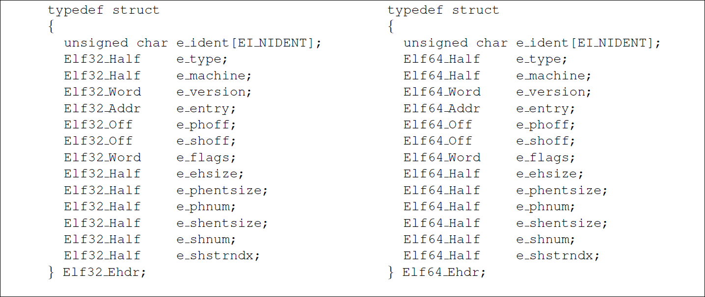
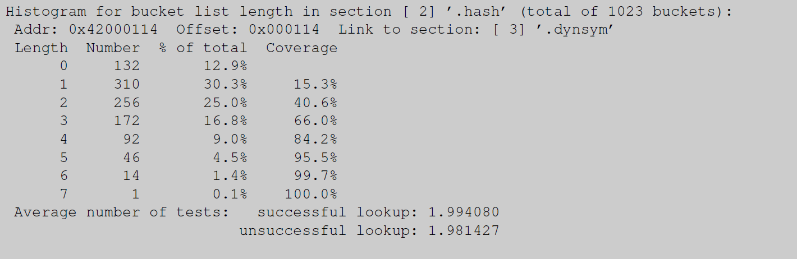
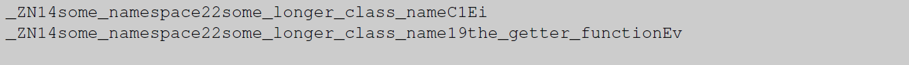
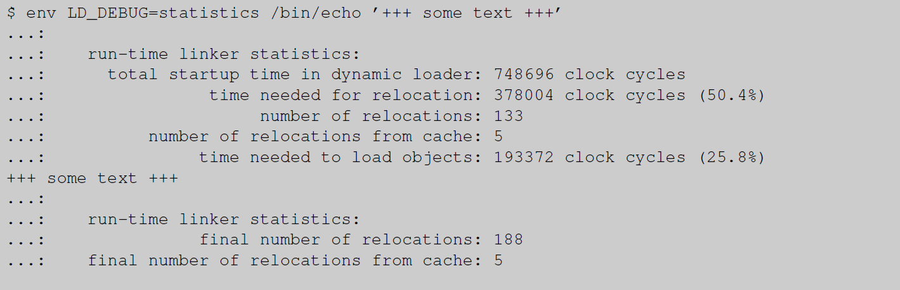

> 1. [非常详细地解释plt&got](https://zoepla.github.io/2018/04/%E9%9D%9E%E5%B8%B8%E8%AF%A6%E7%BB%86%E8%A7%A3%E9%87%8Aplt&got/)
>
> 2. [通过 GDB 调试理解 GOT/PLT](https://rickgray.me/2015/08/07/use-gdb-to-study-got-and-plt/)

# 如何编写共享库

**摘要**

今天，共享库无处不在。开发人员出于多种原因使用它们，并像创建应用程序代码一样创建它们。不过这里有一个问题，因为在许多平台上，必须应用一些额外的技术才能生成像样的代码。生成优化的代码需要更多知识。本文介绍了所需的规则和技术。此外，还介绍了 ABI（应用程序二进制接口）稳定性的概念，并展示了如何对其进行管理。

# 1 引言

长期以来，程序员将常用代码收集在库中，以便重用代码。这节省了开发时间并减少了错误，因为重用代码只需调试一次。对于同时运行数十个或数百个进程的系统，在链接时重用代码只能解决部分问题。<u>进程（程序）将相同的代码片段作为库导入，从而达到重复使用的目的</u>。使用现代操作系统中的内存管理系统，还可以在运行时共享代码。这是通过只将代码加载到物理内存中一次，并通过虚拟内存在多个进程中重用它来实现的。这种类型的库称为共享库。

这个概念并不新鲜。操作系统设计者使用以前使用的基础设施实现了系统的扩展。操作系统的扩展可以对用户透明地完成。**但是，用户必须直接处理的部分最初产生了问题**。

**主要是二进制格式方面的问题**。这是用来描述应用程序代码的格式。提供内存转储就足够的日子早已一去不复返了。多进程系统需要识别包含程序文件的不同部分，例如文本、数据和调试信息等部分。为此，很早就引入了二进制格式。早期的 Unix 常用的是诸如 `a.out` 或 COFF 之类的格式。这些二进制格式在设计时并未考虑共享库，这一点很明显。

## 1.1 一点点历史

Linux 最初使用的二进制格式是一种 `a.out` 变体。在引入共享库时，必须做出某些设计决策，以适应 `a.out` 的限制。主要接受的限制是在加载时和之后不执行**重定位**。<u>共享库必须以磁盘上使用的形式在运行时存在</u>。这对共享库的构建和使用方式施加了一个重大限制：**每个共享库必须有一个固定的加载地址**； 否则就无法生成不需要重定位的共享库。

必须分配固定的加载地址，这必须在没有重叠和冲突的情况下发生，并且通过允许共享库的增长来保证未来的安全。因此，必须有一个中央机构来分配地址范围，这本身就是一个主要问题。但情况变得更糟：今天的 Linux 系统有数百个 DSO（动态共享对象），应用程序可用的地址空间和虚拟内存变得非常分散。这将限制可以动态分配的内存块的大小，这将给某些应用程序带来无法克服的问题。甚至在今天，分配机构已经耗尽了可分配的地址范围，至少在32位机器上是这样。

我们仍然没有涵盖 `a.out` 共享库的所有缺点。由于使用共享库的应用程序在更改其使用的共享库后不必重新链接，因此入口点，即函数和变量地址，不得更改。**这只有在入口点与实际代码分开时才能保证，否则函数 size 的限制将被硬编码**。调用实际实现函数的存根表是 Linux 上使用的解决方案。<u>静态链接器</u>从一个特殊文件（文件扩展名为`.sa`）中获取每个函数存根的地址。在运行时，使用了一个以 `.so.X.Y.Z` 结尾的文件，它必须与使用的 `.sa` 文件相对应。这反过来又要求存根表中分配的条目始终必须用于相同的函数。**存根表的分配**必须小心处理。引入新接口意味着追加到表中。永远不可能淘汰表条目。为了避免将旧的共享库与链接到较新版本的程序一起使用，必须在应用程序中保留一些记录：`.so.X.Y.Z` 后缀名称的 *X* 和 *Y* 部分被记录下来，==并且<u>动态链接器</u>确保满足最低要求==。

该方案的好处是生成的程序运行速度非常快。即使是第一次调用，在这样的共享库中调用函数也非常高效。它可以通过两次绝对跳转来实现：第一次从用户代码跳转到存根，第二次从存根跳转到函数的实际代码。这可能比任何其他共享库实现都快，但其速度代价太高：

1. 需要集中分配地址范围；
2. 可能（大概率）发生碰撞，结果灾难性；
3. 地址空间变得严重碎片化。

由于所有这些以及更多原因，Linux 很早就转换为使用 ELF（可执行链接格式）作为二进制格式。ELF 格式由通用规范 (gABI) 定义，其中添加了特定于处理器的扩展 (psABI)。事实证明，函数调用的摊销成本几乎与 `a.out` 相同，但是没有限制了。

## 1.2 迁移到 ELF

对于程序员来说，切换到 ELF 的主要优势在于创建 ELF 共享库，或者用 ELF 表示的 DSO，变得非常容易。生成应用程序和生成 DSO 之间的唯一区别在于最终链接命令行。一个附加选项（在 GNU ld 的情况下为 `--shared`）告诉链接器生成 DSO 而不是应用程序，后者是默认设置。事实上，DSO 只不过是一种特殊的二进制文件； 不同之处在于它们没有固定的加载地址，因此需要**动态链接器**才能真正变为可执行文件。使用与位置无关的可执行文件 (PIE)，差异会进一步缩小。

这再加上后面将介绍的 GNU Libtool 的引入，导致程序员广泛采用 DSO。正确使用 DSO 可以帮助节省大量资源。但是<u>必须遵循一些规则</u>才能获得好处，并且<u>必须遵循**更多**规则</u>才能获得最佳结果。解释这些规则将是本文很大一部分的主题。

并非所有 DSO 的使用都是为了节省资源。如今，DSO 也经常用作构建程序的一种方式。程序的不同部分被放入不同的 DSO 中。这是一个非常强大的工具，尤其是在开发阶段。无需重新链接整个程序，只需重新链接已更改的 DSO。这通常要快得多。

一些项目甚至在部署阶段就决定保留许多独立的 DSO，即使这些 DSO 没有在其他程序中重用。在许多情况下，这肯定是一件有用的事情：DSO 可以单独更新，从而减少必须传输的数据量。但 DSO 的数量必须保持在一个合理的水平。不过，并非所有程序都这样做，我们稍后会看到为什么这会成为一个问题。

在我们开始讨论所有这些之前，需要对 ELF 及其实现有一些了解。

## 1.3 ELF 是如何实现的？

静态链接应用程序的处理非常简单。内核知道这样的应用程序有一个的固定加载地址。加载过程只包括使二进制文件在新创建的进程的适当地址空间中可用，并将控制权转移到应用程序的入口点。其他一切都是在创建可执行文件时由静态链接器完成的。

相比之下，动态链接的二进制文件在从磁盘加载时并不完整。因此，内核不可能立即将控制权转移给应用程序。取而代之的是，还要加载显然还需要（帮助其）完整的一些辅助程序。这个辅助程序是**动态链接器**。动态链接器的任务就是通过加载它需要的 DSO（依赖项）来完成动态链接的应用程序，并执行重定位。然后最终可以将控制权转移给程序。

不过，在大多数情况下，这不是动态链接器的最后一项任务。ELF 允许将与符号相关的重定位延迟到需要该符号的时候。这种延迟重定位方案是可选的，下面讨论的针对启动时执行的重定位的优化也会立即影响惰性重定位。**所以，我们在以下内容中忽略启动完成后的所有内容**。

## 1.4 启动：在内核中的操作<a id="_bookmark3"></a>

程序从内核开始执行，通常在 `execve` 系统调用中开始。**当前执行的代码被替换为新程序**。这意味着地址空间的内容被包含该程序文件的内容所取代。这不是简单地通过（使用 `mmap`）映射文件内容来实现。**ELF** 文件是结构化的，文件中通常至少有三种不同的区域：

- 可执行的代码；该区域通常不可写；
- 被修改的数据；该区域通常不可执行；
- 运行时不使用的数据；由于不需要，因此不应在启动时加载它。

现代操作系统和处理器可以保护内存区域，以允许和禁止对每个内存页单独读取、写入和执行 [1](#_bookmark7)。最好将尽可能多的页标记为不可写，因为这意味着使用该页的进程可以共享来自相同应用程序或 DSO 的页。写保护还有助于检测和防止对数据甚至代码的无意或恶意修改。

> ^1^<a id="_bookmark7"></a>内存页是操作系统内存子系统运行的最小实体。不同体系结构之间，甚至在使用相同体系结构的系统内，页面的大小都可能不同。

为了让内核找到不同的区域，或者说是 ELF 中的段，以及它们的访问权限，ELF 文件格式定义了<u>一个只包含这些信息的数据结构</u>。即所谓的 ELF **程序头**，必须存在于每个可执行文件和 DSO 中。它由 C 数据结构 `Elf32_Phdr` 和 `Elf64_Phdr` 表示，其定义如图 [1](#_bookmark5) 所示。

<a id="_bookmark5"></a>

<p align="center">

<div align="center">图 1：ELF 程序头 C 数据结构</div>
</p>

要定位**程序头**数据结构，需要另一个数据结构，即 ELF 头。ELF 头是唯一在文件中具有固定位置的数据结构，从偏移量零开始。其 C 数据结构见图 [2](#_bookmark9)。`e_phoff` 字段指定从文件开头算起，**程序头**从哪里开始。`e_phnum` 字段包含**程序头**中的条目数，而 `e_phentsize` 字段包含每个条目的大小。最后一个值仅用作二进制文件的运行时一致性检查。

<a id="_bookmark9"></a>
<p align="center">

<div align="center">图 2：ELF 头 C 数据结构</div>
</p>
**程序头**的条目表示不同的段，`p_type` 为 `PT_LOAD` 表示为可加载段。`p_offset` 和 `p_filesz` 字段指定段在文件中的开始位置和长度。`p_vaddr` 和 `p_memsz` 字段指定段在进程虚拟地址空间中的位置以及内存区域的大小。`p_vaddr` 字段本身的值不一定是最终加载地址。DSO 可以加载到虚拟地址空间中的任意地址。但是段的相对位置很重要。对于预链接的 DSO，`p_vaddr` 字段的实际值是有意义的：它指定 DSO 预链接的地址。但这并不意味着动态链接器在必要时不能忽略此信息。

文件中的大小可以小于它在内存中占用的地址空间。内存区域的第一个 `p_filesz` 字节基于文件中段的数据初始化，差值初始化为零。这可用于处理 **BSS 节**[2](#_bookmark6)，BSS 节内未初始化的变量，根据 C 标准初始化为零。以这种方式处理未初始化变量的优点是可以减小文件大小，因为无需存储初始化值，无需将数据从磁盘复制到内存，并且操作系统通过 `mmap` 接口提供的内存已经初始化为 零。

> ^2^<a id="_bookmark6"></a>BSS 节只包含 NUL 字节。因此，它们不必在存储介质上的文件中表示。加载器只需要知道大小，以便它可以分配足够大的内存并用 NUL 填充它。

`p_flags` 最终告诉内核对内存页面使用什么权限。该字段是一个位图，定义了下表中给出的位。这些标志直接对应为 `mmap` 理解的标志。

| p flags | Value | mmap flag  | Description |
| ------- | ----- | ---------- | ----------- |
| PF_X    | 1     | PROT EXEC  | 执行权限    |
| PF_W    | 2     | PROT WRITE | 写权限      |
| PF_R    | 4     | PROT READ  | 读权限      |

使用适当的权限和指定地址映射所有 `PT_LOAD` 段后，或者为没有固定加载地址的**动态对象**分配地址后，就可以开始下一阶段。**动态链接的可执行文件**本身的虚拟地址空间已建立。但是二进制文件并不完整。内核必须让**动态链接器**完成剩下的工作，为此，必须以与可执行文件本身相同的方式加载动态链接器（即，在程序头中查找可加载的段）。不同之处在于，动态链接器本身必须是完整的，并且应该是可不受限制地重新定位。

内核中没有硬编码实现动态链接器的二进制文件。相反，**应用程序**的程序头包含一个带有 `PT_INTERP` 标签的条目。此条目 `p_offset` 字段保存的偏移量指向一个以 NUL 结尾的字符串，该字符串指定该文件的文件名。对**动态链接器**的唯一要求是，它可能与任何可能的可执行文件一起使用，因此，不能与它们的加载地址有任何冲突。一般来说，这意味着动态链接器没有固定的加载地址，可以在任何地方加载；这正是动态二进制文件所允许的。

一旦动态链接器也被映射到待启动进程的内存中，我们就可以启动动态链接器了。请注意，它不是将控制权转移到的应用程序的入口点，只有动态链接器准备好运行。不是立即调用动态链接器，而是执行另一个步骤。==动态链接器必须以某种方式被告知应用程序可以在哪里找到，以及一旦应用程序完整，控制权必须转移到哪里==。为此，存在一种结构化的方式。内核在新进程的堆栈上放置一个**标记值对数组**。这个**辅助数组**除了前面提到的<u>两个值</u>之外还包含几个允许动态链接器避免多次系统调用的值。`elf.h` 头文件定义了一些带有 `AT_` 前缀的常量。这些是辅助数组中条目的标签。

设置辅助数组后，内核终于准备好将控制权转移到用户模式下的**动态链接器**。入口点在动态链接器的 ELF 头的 `e_entry` 字段中定义。

## 1.5 在动态链接器中启动

程序启动的第二阶段发生在动态链接器中。其任务包括：

- 确定并加载依赖项；
- 重新定位应用程序和所有依赖项；
- 以正确的顺序初始化应用程序和依赖项。

在下文中，我们将仅更详细地讨论重定位处理。对于其他两点，提高性能的方法很明确：减少依赖。每个参与的对象都只初始化一次，但必须进行一些拓扑排序。识别和加载过程也随着数量的依赖性而扩展； 在大多数（所有？）实现中，这不会线性扩展。

重定位过程通常是[[3](#_bookmark11)] 动态链接器工作中最昂贵的部分。它至少是一个渐近为 *O*(*R* +*nr*) 的过程，<u>其中 *R* 是**相对重定位**的数量，*r* 是**命名重定位**的数量，*n* 是参与的 DSO 的数量（加上可执行文件）</u>。ELF 哈希表函数中的缺陷和修改符号查找功能的各种 ELF 扩展可能会将因子增加到 *O*(*R* + *rn* log *s*)，其中 *s* 是符号的数量。这应该清楚地表明，为了提高性能，尽可能减少重定位和符号的数量是很重要的。在解释重定位过程后，我们将对实际数字进行一些估算。

> ^3^<a id="_bookmark11"></a>我们在这里忽略预链接支持，它在许多情况下可以显着降低甚至消除重定位成本。

### 1.5.1 重定位过程

在这种情况下，重定位意味着将应用程序和作为依赖项加载的 DSO 调整到它们自己的加载地址。有两种依赖关系：

- **已知位置在自己的 object 中的依赖**。这些不与特定符号相关联，因为链接器知道对象中位置的相对位置。

  请注意，应用程序没有相对重定位，因为代码的加载地址在链接时已知，因此静态链接器能够执行重定位。

- **基于符号的依赖**。**符号的引用**通常和**符号的定义**在不同的对象中，但也可以在同一个对象中。

相对重定位的实现很容易。（静态）链接器可以在链接时计算 object 文件中<u>目标目的地</u>的偏移量。对于这个值，动态链接器只需要添加对象的加载地址，并将结果存储在重定位指定的位置。在运行时，动态链接器只需花费非常少且恒定的时间，不会随着使用更多的 DSO 而增加。

基于符号的重定位要复杂得多。ELF 符号解析过程设计得非常强大，因此它可以处理许多不同的问题。但是，所有这些强大的功能都增加了复杂性和运行时成本。以下的描述，读者可能会质疑导致此过程的决策。我们不能在这里争论这个问题； 读者可以参考 ELF 的讨论。事实上，符号重定位是一个代价高昂的过程，**参与的 DSO 越多或 DSO 中定义的符号越多，符号查找所需的时间就越长**。

==任何重定位的结果都将**<u>与引用一起</u>**存储在 object 中的某个位置==。理想情况下，通常目标位置在数据段中。如果用户、编译器或<u>链接器重定位</u>错误地生成了代码，则可能会修改文本或只读段。如果按照 ELF 规范的要求，在**动态 section** 的 `DT_FLAGS` 条目中设置了 `DF_TEXTREL` （或者旧二进制文件中存在 `DT_TEXTREL` 标志），动态链接器将正确处理此问题。但结果是修改后的页面无法与使用同一对象的其他进程共享。修改过程本身也很慢，因为内核必须大量重组内存处理数据结构。

### 1.5.2 符号重定位

动态链接器必须对所有在运行时使用的符号执行重定位，并且在链接时不知道这些符号的引用是否与符号的定义在同一个 object 中。由于在某些体系结构上生成代码的方式，可能会延迟某些重定位的处理，直到实际使用相关引用时。在许多体系结构中调用函数都是这种情况。所有其他类型的重定位总是必须在 object 可以使用之前处理。我们将忽略**延迟重定位**，因为这只是延迟工作的一种方法，它最终必须完成，因此我们将把它包括在成本分析中。要在使用 object 之前实际执行所有重定位，可以通过将环境变量 `LD_BIND_NOW` 设置为非空值来使用。通过将 `-z now` 选项添加到链接器命令行，可以为单个 object 禁用延迟重定位。链接器会在动态 section 的`DT_FLAGS`条目中设置`DF_BIND_NOW`标志来标记 DSO。但是，如果不重新链接 DSO 或编辑二进制文件，则无法撤消此设置，因此只有在确实需要时才应使用此选项。

对于每个加载 object 中每个符号的重定位，实际查找过程从头开始重复。请注意，不同 object  中可能有对同一符号的多次引用。每个 object  的查找结果可能不同，因此除了在每个 object 中缓存一个符号的结果外，没有捷径可走，以防多个重定位引用相同的符号。以下步骤中提到的**查找范围**是已加载 object 子集的有序列表，每个 object 本身（的有序列表）可能不同。**查找范围**的计算方法非常复杂，与此处无关，因此我们建议感兴趣的读者参阅 ELF 规范和 [1.5.4](#_bookmark25) 节。重要的是**查找范围**的长度通常直接取决于加载 object 的数量。这是减少加载 object 数量可以提高性能的另一个因素。

现在有**两种不同**的方法来查找一个符号。传统的ELF方法分为以下几个步骤：

1. 确定**符号**的哈希值。
2. 在查找范围的第一个或下一个 object 中：

    1. 使用 object 中的哈希表大小和哈希值确定符号的哈希桶。
    2. 获取符号的名称偏移量并将其**以 NUL 结尾**的名称使用。
    3. 比较符号名和重定位名。
    4. 如果名称匹配，还要比较版本。这只有在**符号的引用和定义**都有版本控制时，才会发生这种情况。匹配版本也是比较字符串。如果版本匹配，或者无须执行此类比较，就找到了要查找的定义。
    5. 如果定义不匹配，则重试哈希桶链中的下一个元素。
    6. 如果链不包含任何其他元素，则在当前 object 中没有定义，继续在查找范围中的下一个 object 中查找。
3. 如果查找范围内没有其他 object，则查找失败。

注意，**查找范围**包含同一符号的多个定义，并没有问题。**符号查找算法只选择它找到的第一个定义**。请注意，DSO 中定义的**弱符号**没有任何影响。**弱定义只在静态链接中起作用**。拥有多个定义可能会产生一些令人惊讶的后果。假设 DSO “A”定义并引用一个接口，而 DSO “B” 定义了相同的接口。如果现在 “B” 在查找范围内位于 “A” 之前，则 “A” 中的引用将由 “B” 中的定义满足。也就是说 “B” 中的定义**拦截了** “A” 中的定义。这个概念非常强大，因为它允许在不替换通用代码的情况下使用更专业的接口实现。这种机制的一个示例是使用动态链接器的 `LD_PRELOAD` 功能，在运行时引入链接时不存在的附加 DSO。但是，在设计不当的代码中，**拦截**也会导致严重的问题。详见 [1.5.4](#_bookmark25)。

从算法可以看出，每次查找的性能，取决于哈希表桶链的长度和查找范围内 object 的数量等因素。这是上面描述的两个循环。哈希表桶链的长度取决于符号的数量和哈希表大小的选择。由于算法初始步骤中使用的哈希函数永远不会改变，因此只剩下这两个变量。许多链接器并不特别强调选择合适的表大小。如果 GNU 链接器通过 -O 选项，它会尝试优化哈希表大小，以最小化哈希表桶链的长度（注意：需要获取该选项的是链接器，**而不是**编译器）。

> 关于当前实现优化哈希表的说明。GNU binutils 链接器有一个简单的启发式算法，通常倾向于选择小表而不是较短的哈希表桶链。对于大型项目，这很可能**增加**启动成本。==整体内存消耗有时会显著减少（这可能迟早会出现），但仍建议检查优化的有效性==。将开发一个新的链接器实现，它包含一个更好的算法。

要衡量哈希表的有效性，两个数字很重要：

- 成功查找的平均链长。
- 不成功查找的平均链长。

在这里讨论不成功的查找可能会令人惊讶，但实际上它们是==规则==。请注意，**不成功**表示仅在当前 object 中不成功。只有当 object 实现了几乎所有需要查找的内容时，成功的查找数才更重要。在 Linux 系统上，这一类基本上只有两个 object：C 库和动态链接器本身。

某些版本的 readelf 程序直接计算值，输出类似于图 [3](#_bookmark13) 和 [4](#_bookmark14)。这些示例中的数据向我们展示了许多东西。根据符号的数量（2027 对 106），哈希表的大小完全不同。对于较小的表，链接器可以**浪费** 53.9% 不包含数据的哈希表条目。这在 gABI 兼容的系统上只有 412 字节。如果 libc.so 二进制文件允许相同数量的开销，则该表将大 4 KB 或更多。这是一个很大的不同。链接器集成了一个固定的成本函数，该函数将哈希表大小考虑在内。

<a id="_bookmark13"></a>
<p align="center">

<div align="center">图 3：eu-readelf -I libc.so 的示例输出</div>
</p>
<a id="_bookmark14"></a>
<p align="center">

<div align="center">图 4：eu-readelf -I libnss files.so 的示例输出</div>
</p>

哈希表**==相对大小==**的增加意味着哈希表桶链的长度明显更短。对于不成功查找的平均桶链长度尤其如此。小表的平均值仅为大表的 28%。

这些数字应该显示的是减少动态符号表中符号数量的效果。随着符号的显著减少，链接器就有更好的机会来抵消**次优哈希函数**的影响。

**查找算法成本的另一个因素与字符串本身有关**。符号名使用简单的字符串比较，符号名存储在与符号表数据结构相关联的字符串表中。字符串以 C 格式存储；它们以 NUL 字节终止，并且不使用初始长度字段。这意味着必须进行字符串比较，直到找到不匹配的字符或字符串结束。这种方法容易受到具有公共前缀的长字符串的影响。不幸的是，这并不少见。

```c++
namespace some_namespace { 
    class some_longer_class_name {
        int member_variable; 
      public:
        some_longer_class_name (int p);
        int the_getter_function (void);
    };
}
```
GNU C++ 编译器在 3.0 版本之前使用的名称修改方案，它将类成员的名称放在前面，然后是参数列表的描述，然后是名称的其他部分，如名称空间和嵌套类名称。结果是，如果成员名称不同，则名称一开始就可以区分。对于上面的示例，两个成员函数的改写名称如下图 [5](#_bookmark18) 所示。

<a id="_bookmark18"></a>
<p align="center">

<div align="center"> 图 5：gcc 3 之前改写名称的方案</div>
</p>
今天的 gcc 版本和通用 C++ ABI 兼容的所有其他编译器，所使用的新改写方案是：名称以命名空间和类名开头，以成员名结尾。图 [6](#_bookmark19) 显示了这个小例子的结果。两个成员函数的错位名称仅在第 43 个字符后不同。如果两个符号落入同一个哈希桶 [[4](#_bookmark16)]，那么性能就非常糟糕。

<a id="_bookmark19"></a>
<p align="center">

<div align="center"> 图 6：使用通用 C++ ABI 方案的名称改写</div>
</p>

> ^4^<a id="_bookmark16"></a>有人建议“为什么不从后面搜索？”。想想看，这些是 C 字符串，而不是 PASCAL 字符串。我们不知道长度，因此必须读取字符串的每个字符以确定长度。结果会更糟。

Ada 也有类似的问题。gcc 的标准 Ada 库的所有符号都以 ada 为前缀，然后是包和子包名称，最后是函数名称。图 [7](#_bookmark20) 显示了库中符号列表的简短摘录。所有符号名的前 23 个字符都相同。

<a id="_bookmark20"></a>
<p align="center">

<div align="center"> 图 7：来自标准 Ada 库的名称</div>
</p>

两种改写方案中的字符串长度都令人担忧，因为在搜索符号本身时必须完全比较每个字符串。示例中的名称也不是特别长。翻阅 C++ 标准库，可以找到许多长度超过 120 个字符的名称，甚至这还不是最长的。其他系统库的名称长度超过 200 个字符，而具有许多命名空间、模板和嵌套类的复杂、**“设计良好”**的 C++ 项目的名称可能超过 1,000 个字符。**设计加一分，性能减 100 分**。

了解哈希表和字符串查找的详细信息后，来看一个真实的示例：OpenOffice.org。该套件包含 144 个独立的 DSO。在启动期间执行大约 20,000 次重定位。许多重定位是作为 `dlopen` 调用的结果执行，因此无法通过使用预链接 <u>[7]</u> 进行优化。符号解析期间所需的字符串比较次数可用作启动开销的公允值。我们现在计算这个值的近似值。

在 IA-32 上的 OpenOffice.org 1.0 版本的所有 DSO 中，不成功查找的平均链长为 1.1931。这意味着对于每个符号查找，动态链接器必须平均执行 ==72 × 1*.*1931 = 85*.*9032==  次字符串比较。对于 20,000 个符号，总共进行了 1,718,064 次字符串比较。OpenOffice.org 的 DSO 中定义的导出符号的平均长度为 54*.*13。即使我们假设在发现不匹配之前只搜索了 20% 的字符串（这是一个乐观的猜测，因为每个符号名称至少被完全比较一次以匹配自身），这也意味着总共有超过 1850 万个字符 从内存中加载并进行比较。难怪启动如此缓慢，尤其是因为我们忽略了其他成本。

要计算动态链接器执行的查找次数，可以使用动态链接器的帮助。如果环境变量 `LD_DEBUG` 设置为 `symbols`，[只需要统计以 `symbol=` 开头的行数](https://gist.github.com/fcamel/2b6e5996b370bb9d9759d18bbd55193e)。最好使用 `LD_DEBUG_OUTPUT` 将动态链接器的输出重定向到一个文件中。然后可以通过将计数乘以平均哈希链长度来估计字符串比较的次数。由于收集的输出包含所查看文件的名称，因此甚至可以通过乘以 object 确切的哈希链长度来获得更准确的结果。

更改**导出符号的数量**、**符号字符串的长度**、**公共前缀的数量和长度**、**DSO 的数量**和**哈希表大小优化**中的任何一个因素都可以显著降低成本。一般来说，如果二进制文件已经在文件系统缓存中，则动态链接器在启动期间，重定位时间百分比约为 50-70%，如果必须从磁盘加载文件，则约为 20-30% [[5](#_bookmark21)]。因此，花时间研究这些问题是值得的，在本文的其余部分，我们将介绍实现这一点的方法。到目前为止要记住：将 `-O1` 传递给链接器以生成最终产品。

> ^5^<a id="_bookmark21"></a>这些数字假设未使用预链接。

### 1.5.3 GNU 风格的哈希表

上一节中提出的所有优化仍然将符号查找作为一个重要因素。必须检查大量数据，将所有这些数据加载到 CPU 缓存中的成本很高。如上所述，原始的 ELF 哈希表处理没有更多的灵活性，因此解决方案是必须取代它。这就是 GNU 风格哈希表所做的。它可以通过拥有自己的**动态 section 条目**(`DT_GNU_HASH`) 与旧式哈希表处理和平共存。更新后的动态链接器将使用新哈希表代替旧的，因此提供了完全透明的向后兼容性。新的哈希表实现与旧的一样，在每个可执行文件和 DSO 中都是独立的，因此在同一进程中使用新格式的二进制文件和一些仅使用旧格式的二进制文件是没有问题的。

查找的主要开销，特别是对于某些二进制文件，是符号比较。如果可以减少实际需要的比较次数，就可以获得很大的收益。第二个可能的优化是数据的布局。带有符号链的旧式哈希表不一定对 CPU 缓存有好处。当使用的内存位置是连续时，CPU 缓存工作得特别好。链表跳来跳去，降低 CPU 缓存加载和预取的效率。

GNU 风格的哈希表旨在解决这些问题。由于可以同时提供旧式哈希表来维护与现有运行时环境的兼容性，因此不需要对更改进行限制。新的查找过程略有不同：

1. 确定**符号**的哈希值。
2. 在查找范围的第一个或下一个 object 中：
   1. 哈希值用于确定是否存在具有给定哈希值的条目。通过 2 位布隆过滤器 [[6](#_bookmark23)] 完成。如果过滤器显示没有这样的定义，则搜索查找范围中的下一个 object 。
   1. 使用 object 中的哈希表大小和哈希值确定符号的哈希桶。哈希值是一个符号索引。
   1. 从符号索引对应的桶链数组中获取条目。将该值与我们试图定位的符号的哈希值进行比较。忽略位 0。
   1. 如果哈希值匹配，则获取符号的名称偏移量，并将其用作以 NUL 结尾的名称。
   1. 比较符号名和重定位名。
   1. 如果名称匹配，还要比较版本。这只有在**符号的引用和定义**都有版本控制时，才会发生这种情况。匹配版本也是比较字符串。如果版本匹配，或者无须执行此类比较，就找到了要查找的定义。
   1. 如果不匹配，并且从哈希桶加载的值没有设置位 0，则继续哈希桶数组中的下一个条目。
   1. 如果设置了位 0，则哈希链中没有其他条目，我们继续查找范围中的下一个 object。
3. 如果查找范围内没有其他 object，则查找失败。

> ^6^<a id="_bookmark23"></a>http://en.wikipedia.org/wiki/Bloom_filter

这个新过程似乎更复杂。事实并非如此，速度也快得多。我们实际上必须比较字符串的次数大大减少了。仅布隆过滤器通常会过滤掉所有查找的 80% 或更多（在许多情况下为 90+%）。也就是说，即使在哈希链很长的情况下，因为布隆过滤器有助于确定不会有匹配项，因此没有任何字符串比较工作。这通过一次内存访问完成。

其次，将哈希值与符号的哈希值进行比较会避免更多的字符串比较。每个哈希链可以包含具有不同哈希值的条目，这种简单的单词比较可以过滤掉很多重复项。哈希链中很少有两个具有相同哈希值的条目，这意味着不成功的字符串比较很少见。使用与原始 ELF 规范规定不同的哈希函数也会增加这种情况的可能性。新函数在将值分散到 32 位值的值范围方面要好得多。

哈希链数组的组织方式是，同一个哈希桶的所有元素彼此跟随。没有链表，因此缓存的利用率要高得多。

只有布隆过滤器和哈希函数测试成功，才访问符号本身。哈希链的所有符号也是连续的，因此如果我们需要访问多个条目，CPU 缓存预取也会在这里提供帮助。

对旧格式的最后一个更改是，哈希表只包含未定义符号的一些必要记录。大多数未定义的符号不必出现在哈希表中。这在某些情况下会显着降低散列冲突的可能性，并且肯定会提高布隆过滤器的成功率，并减少哈希链的平均长度。结果是在不依赖于预链接 [[7]()] 的代码中显著加速了 50% 或更多（预链接**总是**更快）。

但是，这并不意味着前一节中描述的优化技术是无关紧要的。它们仍然应该被广泛应用。使用新的哈希表实现仅意味着不优化导出和引用的符号，不会像过去那样对性能产生重大影响。

> 新的哈希表格式在 Fedora Core 6 中引入。整个操作系统通过使用 `--hash-style=gnu` 来创建，除了一些有意为之的例外之外，没有兼容旧哈希表。这意味着二进制文件不能在动态链接器中不支持新哈希表的老系统上使用。由于这从来都不是任何操作系统版本的目标，所以做出这个决定显而易见。结果是所有二进制文件都小于有**==第二组哈希表==**的二进制文件，在许多情况下甚至小于仅使用旧格式的二进制文件。

回到 OpenOffice.org 例子，我们可以对加速进行一些估计。如果 Bloom 过滤器能够过滤掉所有查找的 80%，而重复哈希值的概率高达 15%，我们实际上只需要平均比较 `72 × 0.2 × 0.15 × 1.1931 = 2.58` 字符串。这是 33 倍的改进。再加上改进的内存处理和对 CPU 缓存的尊重，我们获得了更高的收益。在现实世界的例子中，我们可以降低查找成本，使程序启动速度提高 50% 或更多。

### 1.5.4 查找范围<a id="_bookmark25"></a>

到目前为止，查找范围被描述为大多数加载 object 的有序列表。虽然这是正确的，但它也是故意模糊的。现在是时候更详细地解释查找范围了。

事实上，查找范围最多由三部分组成。主要部分是**全局查找范围**。它最初由可执行文件本身及其所有依赖项组成。依赖项按广度优先顺序添加。这意味着，**首先**，可执行文件的依赖项是按照其在可执行文件的动态 section 中 `DT_NEEDED` 条目的顺序添加。然后以相同的方式添加第一个依赖项的依赖项。已加载的 DSO 将被跳过；他们在名单上只出现一次。该过程递归进行，因为可用的 DSO 数量有限，它将在某个时刻停止。以这种方式加载的 DSO 的确切数量可能相差很大。一些可执行文件只依赖于 2 个 DSO，另一些则依赖于 200 个。

如果可执行文件设置了 `DF_SYMBOLIC` 标志（请参阅第 [2.2.7)](#_bookmark52)，则**带有引用的 object** 将添加到全局查找范围的前面。注意，只有**带有引用的 object** 被添加到前面，而不是它的依赖项。其影响和原因将在后面解释。

使用 `dlopen` 动态加载 DSO 时，会对查找范围进行更复杂的修改。如果是动态加载 DSO，它会引入一组自己可能需要搜索的依赖项。**如果带有引用的 object 位于已由 `dlopen` 加载的那些 object 中，则这些 object ，从 `dlopen` 调用中请求的那个开始，将组成查找范围**。这意味着，这些对象不会添加到全局查找范围，也不会在常规查找中搜索它们。这个第三部分查找范围，我们将其称为**本地查找范围**，它取决于带有引用的 object。

不过，可以更改 `dlopen` 的行为。如果该函数传递了 `RTLD_GLOBAL` 标志，则加载的 object 和所有依赖项**都会**添加到全局范围。这通常是一个非常糟糕的主意。动态添加的 object  可以被删除，当发生这种情况时，所有其他 object 的查找都会受到影响。在动态加载的 object 及其依赖项之前搜索整个全局查找范围，以便首先在全局查找范围的 object 中找到定义，然后再在本地查找范围中找到定义。如果动态链接器将查找作为重定位的一部分进行，则通常会自动处理此附加依赖项，但如果用户使用 `dlsym` 在查找范围内查找符号，则无法安排此操作。

通常没有理由使用 `RTLD_GLOBAL`。基于稍后解释的原因，要解析所有引用，始终强烈建议使用所有必要的 DSO 创建依赖关系。`RTLD_GLOBAL` 通常用于链接 DSO 时没有可用实现的情况。由于应该避免这种情况，因此对这个标志的需求应该是最小的。即使程序员不得不跳过一些障碍来解决由 `RTLD_GLOBAL` 解决的问题，这也是值得的。调试和解决通过将 object 添加到全局查找范围而引入的问题的痛苦要大得多。

自 2004 年 9 月以来，GNU C 库中的动态链接器又增加了一个扩展。此扩展有助于处理具有相同名称的符号的多个定义不兼容的情况，因此无法解析和按预期工作。这通常是编写冲突定义的 DSO 人员一方设计失败的标志，也是依赖于这些不兼容 DSO 应用程序编写者一方的失败标志。这里假设应用程序 app 与 DSO libone.so 链接，它定义了符号 `duplicate`，并且它动态加载的 DSO libdynamic.so，依赖于另一个 DSO libtwo.so，也定义了一个符号 `duplicate`。当应用程序启动时，它可能具有这样的全局范围：

```
app → libone.so → libdl.so → libc.so
```
如果现在加载了 libtwo.so，附加的本地查找范围可能是这样的：

```
libdynamic.so → libtwo.so → libc.so
```

在搜索**全局查找范围**之后搜索**本地查找范围**，libdynamic.so 可能是个例外，一旦使用`DF_DYNAMIC` 标志，则将首先在这个相同的 DSO 中搜索。但是，如果在 libdynamic.so 中需要符号 `duplicate`，会发生什么？毕竟我们到目前为止所说的结果总是：在 libone.so 中找到定义，因为 libtwo.so 只在**全局查找范围**之后搜索的**本地查找范围**中。如果这两个定义不兼容，程序就会出问题。

将 `dlopen` 第二个参数的**标志字**与 `RTLD_DEEPBIND` 进行 OR 运算，并使用足够新的 GNU C 库来更改这一点。如果发生这种情况，动态链接器将在全局查找范围**之前**搜索本地查找范围，以查找通过 `dlopen` 调用加载的所有对象。对于我们的例子来说，这意味着新加载的 DSO libdynamic.so 和 libtwo.so 中所有查找的搜索顺序都会更改，但不会更改 libc.so，因为此 DSO 已经加载。对于两个受影响的 DSO，对 `duplicate` 的引用现在将在 libtwo.so 中找到定义。其他所有的 DSO，则在 libone.so 中找到 `duplicate` 的定义。

虽然这听起来像是处理兼容性问题的好解决方案，但只有在无法避免时才应使用此功能。有几个原因：

- 查找范围的变化影响所有符号和所有加载的 DSO。某些符号可能必须由全局范围内的定义拦截，但现在不会发生了。
- 已加载的 DSO 不受影响，这可能会导致不一致的结果，具体取决于 DSO 是否已加载（它可能是动态加载的，因此甚至存在竞争条件）。
- `LD_PRELOAD` 对于动态加载对象中的查找无效，因为预加载对象是全局范围的一部分，已添加到可执行文件之后。因此，仅在本地查找范围之后查看它们。
- 应用程序可能期望本地定义总是优先于其他定义。这（和上一点）在一定程度上已经是使用`DF_SYMBOLIC`的问题，但由于此标志也不应该使用，因此参数仍然有效。
- 如果任何隐式加载的 DSO 之后被显式加载，其查找范围将发生变化。
- 最后，该标志不可移植。

`RTLD_DEEPBIND` 标志实际上只能用作最后的手段。修复应用程序使其不依赖于该标志的功能是更好的解决方案。

### 1.5.5 GOT 和 PLT<a id="_bookmark27"></a>

全局偏移表 (GOT) 和过程链接表 (PLT) 是 ELF 运行时的两个核心数据结构。我们现在将介绍使用它们的原因以及由此产生的后果。

重定位是为**源构造**创建的，例如：

```c
extern int foo;
extern int bar (int);
int call_bar (void) { 
    return bar (foo);
}
```

对 bar 的调用需要两次重定位：一次是加载 `foo` 的值，另一次是查找 `bar` 的地址。如果生成的代码知道变量的地址和函数，汇编程序指令将直接从该地址加载或跳转到该地址。对于 IA32，代码如下所示：

```assembly
pushl   foo 
call	bar
```

这会将 `foo` 和 `bar` 的地址编码为**文本段**指令中的一部分。如果只有动态链接器知道该地址，则必须在运行时修改文本段。根据我们上面的了解，必须避免这种情况。

因此，为 DSO 生成的代码，即使用 `-fpic` 或 `-fPIC` 时，如下所示：

```assembly
movl	foo@GOT(%ebx), %eax
pushl    (%eax)
call	bar@PLT
```

变量 `foo` 的地址现在不是指令的一部分。相反，它从 GOT 加载。在链接时，已知 GOT 中相对于 PIC 寄存器值 (`%ebx`) 的位置地址。因此不必更改**文本段**，只需更改 GOT[[7](#_bookmark28)]。
> ^7^<a id="_bookmark28"></a>使用这个方案还有一个好处。如果要修改指令，则每个加载/存储指令都需要一个重定位。通过将地址存储在 GOT 中，只需要一次重定位。

函数调用的情况类似。不直接调用函数 `bar`。相反，控制被转移到 PLT 中 `bar` 的存根（由 `bar@PLT` 表示）。对于 IA-32，PLT 本身不必修改，可以放在只读段中，每个条目的大小为 16 字节。只有 GOT 被修改，每个条目由 4 个字节组成。IA-32 DSO 中 PLT 的结构如下所示：

```assembly
.PLT0: pushl 4(%ebx)
       jmp *8(%ebx)
       nop; nop
       nop; nop
.PLT1: jmp *name1@GOT(%ebx)
       pushl $offset1
       jmp .PLT0@PC
.PLT2: jmp *name2@GOT(%ebx)
       pushl $offset2
       jmp .PLT0@PC
```

这显示了三个条目，需要多少都可以，都具有相同的大小。标有 `.PLT0` 的第一个条目是特殊的。我们将看到它在内部使用。以下所有条目都属于一个函数符号。第一条指令是间接跳转，地址取自 GOT 中的一个 **slot**。每个 PLT 条目都有一个 GOT **slot**。<u>在启动时，动态链接器用指向相应 PLT 条目第二条指令的地址填充 GOT **slot**</u>。即第一次使用 PLT 条目时，在 `pushl` 指令下面的那条跳转令处结束。压入堆栈的值也特定于 PLT **slot**，对于我们调用的函数，它是重定位条目的偏移量。然后，控制转移到特殊的第一个 PLT 条目，它将更多的值压入堆栈，最后跳转到动态链接器。动态链接器确保第三个 GOT slot（偏移量 8）包含动态链接器中入口点的地址。一旦动态链接器确定了函数的地址，它就会将结果存储在 GOT 条目中（在找到跳转的函数之前，它用于 PLT 条目开头的 jmp 指令)。这样做的效果是，以后对PLT 条目的所有使用都不会经过动态链接器，而是直接传递给函数。因此，除了第一次调用之外，所有调用的开销**只是**一次间接跳转。

如果不能保证函数在引用它的 object 中定义，则始终使用 PLT 存根。请注意，在带有引用的 object 中进行简单定义不足以避免 PLT 条目。从符号查找过程来看，应该很清楚，定义可以在另一个 object 中找到（拦截），在这种情况下需要 PLT。**稍后将详细解释何时以及如何避免 PLT 条目**。

GOT 和 PLT 的确切结构是体系结构特定，在各自的 psABI 中指定。这里所说的 IA-32 在某种程度上适用于其他一些架构，但并不适用于所有架构。例如，虽然 IA-32 上的 PLT 是只读的，但对于其他体系结构，它必须是可写的，因为 PLT 条目不是使用 GOT 值进行间接跳转，而是直接修改。读者可能会认为 IA-32 ABI 的设计者犯了一个错误，要求间接调用，而不是直接调用，因此速度较慢。不过，这没有错。可执行的段可写是一个巨大的安全问题，因为攻击者可以简单地将任意代码写入 PLT 并接管程序。无论如何，我们可以这样总结使用 GOT 和 PLT 的成本：

- 每次使用导出的全局变量都使用 GOT 条目并间接加载变量值；

- 每个被调用的（而不是作为变量引用的）函数（不能保证在调用的 object 中定义）都需要 PLT 条目。函数调用间接执行，方法是首先将控制权转移到 PLT 条目中的代码，然后依次调用该函数。

- 对于某些体系结构，每个 PLT 条目至少需要一个 GOT 条目。

因此，在 IA-32 上避免通过 PLT 跳转将删除 16 字节的文本（即指令）和 4 字节的数据。在访问全局变量时避免使用 GOT 可节省 4 个字节的数据和一个加载指令（即，在执行期间至少节省 3 字节的代码和周期）。此外，每个 GOT 条目都有一个与上述成本相关的重定位。

### 1.5.6 运行构造函数

一旦执行了重定位，DSO 和应用程序代码就可以实际使用了。但是还有一件事要做：某些情况下，必须初始化 DSO 和应用程序。代码的作者可以为每个 object 定义一些初始化函数，这些函数在其他代码使用 DSO 之前运行。要执行初始化，函数得能使用来自自个 object 和其依赖项的代码。**为实现这一点，动态链接器必须确保对象以正确的顺序初始化，即对象的依赖项必须在对象之前初始化**。

为了保证动态链接器按正确的顺序初始化，必须对 object 列表执行拓扑排序。这种排序不是线性过程。与所有排序算法一样，运行时间至少为 O(*n* log *n*)，并且由于实际上是一种拓扑排序，因此该值甚至更高。更重要的是：当必须运行**终结器**时，由于启动时的顺序与关闭时的顺序不同，整个过程必须重复。

因此，我们又有了一个成本因素，它直接取决于所涉及的 object 数量。尽管实际成本通常远低于重定位的成本，但减少数量会有所帮助。

在这一点上，了解正确编写 DSO 的构造函数和析构函数的方法很有用。一些系统有这样的约定，即名为 `_init` 和 `_fini` 的导出函数分别被自动选为构造函数和析构函数。GNU ld 仍遵循此约定，在 Linux 系统上使用这些名称的函数确实会导致使用这些功能。但这完全是 100% 错误的！

使用这些函数，程序员可以覆盖系统本身正在使用的任何初始化和销毁功能。结果是没有完全初始化 DSO，这迟早会导致灾难。添加构造函数和析构函数的正确方法是分别用 `constructor` 和 `destructor` 属性标记函数。

```c++
void
__attribute ((constructor)) init_function (void)
{
...
}

void
__attribute ((destructor)) fini_function (void)
{
...
}
```

也不应该导出这些函数（请参阅第 [2.2.2](#_bookmark39) 和 [2.2.3](#_bookmark41) 节），但这只是一种优化。使用这样定义的函数，运行时将安排在正确的时间调用它们，并在调用之前，执行任何必要的初始化。

## 1.6 ELF 成本汇总

我们现在已经讨论了启动过程，以及二进制文件的形式如何影响启动过程。现在我们将总结各种因素，以便稍后更容易确定优化的好处。

**代码大小** 与其他地方一样，对于相同语义的代码，缩小大小通常意味着更高的效率和性能。较小的 ELF 二进制文件在运行时需要较少的内存。

一般来说，编译器总是会尽可能生成最好的代码，我们不会进一步讨论这一点。但是必须知道，每个 DSO 都包含一定的数据和代码开销。因此，更少的 DSO 意味着更小的文本段（即代码尺寸更小）。

**Object 数量** 包含相同功能的 object 数量越少越好这一事实已在多处提及：

- 在运行时加载的对象更少。这直接转化为更少的系统调用。在 GNU 动态链接器实现中，加载一个 DSO 需要至少 8 个系统调用，所有这些都可能非常昂贵。

- 相关的，必须记录应用程序和<u>**其依赖的依赖**</u>的名称。这不是一个非常高的成本，但如果有许多依赖项，加起来成本肯定也不低。

- 查找范围不断扩大。这是重定位成本方程中的主要因素之一。

- 更多的 object 意味着更多的符号表，这通常意味着更多的重复。未定义的引用不会合并为一个；**==并且处理多个定义，动态链接器必须进行排序==**。

  此外，符号通常从 DSO 导出以用于另一个 DSO。如果 DSO 合并，这种情况就不会发生。

- 初始化器/终结器的排序更复杂。

- 通常，动态链接器为每个进程加载 DSO 都有一些开销。每次请求新的 DSO 时，都必须搜索已加载的 DSO 列表，这可能非常耗时，因为 DSO 可能有很多别名。

**符号数量** 导出和未定义符号的数量决定了动态符号表、哈希表的大小和哈希表桶链的平均长度。运行时不使用普通符号表，因此没有必要将它们从二进制文件中剥离。这对性能没有影响。

此外，导出的符号较少，使用预链接时发生冲突的机会就较少（未进一步介绍）。

**符号字符串的长度** 较长的符号长度通常会导致不必要的成本。一个符号的成功查找必须匹配整个字符串，比较几十个或数百个字符需要时间。如果公共前缀像新的 C++ 改编方案中那样长，则查找不成功会受到影响。任何情况下，长符号名都会导致必须在运行时出现大型字符串表，从而增加加载时间和地址空间使用的成本，这对于 32 位机器来说是一个问题。

**重定位次数** 处理重定位构成了启动期间的大部分工作，因此任何减少都是显而易见的。

**重定位的种类** 所需的重定位类型也很重要，因为处理**相对重定位**比**普通重定位**要便宜得多。此外，必须避免对**文本（代码）段**进行重定位。

**代码和数据的放置** 所有可执行代码都应放在只读内存中，编译器通常会确保正确完成此操作。创建数据对象时，主要由用户来确保将其放置在正确的段中。理想情况下，数据也是只读的，但这仅适用于常量。第二个最佳选择是将变量初始化为零，那就不必从文件内容初始化。其余的必须就进入数据段了。

在下文中，我们将不涵盖此处给出的前两点。这由 DSO 的开发人员决定。为使 DSO 表现更好，需要进行不小的额外更改，这些是基本的设计决策。我们在这里发表了意见，是否有效果还有待观察。

## 1.7 测量 ld.so 性能

要执行优化，量化优化效果很有用。幸运的是，使用 glibc 的动态链接器很容易做到这一点。使用 `LD_DEBUG` 环境变量，可以**转储**启动性能相关的信息。图 [8](#_bookmark32) 显示了一个调用了 `echo` 程序的示例。

<a id="_bookmark32"></a>
<p align="center">

<div align="center">图 8：收集启动统计数据</div>
</p>

动态链接器的输出分为两部分。<u>程序输出之前的部分</u>是在执行完本节中描述的所有工作之后，动态链接器将控制权移交给应用程序之前打印的。第二部分是摘要，在应用程序（正常）终止后打印。实际格式可能因不同的体系结构而异。它包含的时序信息，只来自于那些可轻松访问 CPU 周期计数器寄存器（现代 IA-32、IA-64、x86-64、Alpha）的体系结构。对于其他架构，这些行根本就没有。

计时信息提供了动态链接器启动期间花费的总时间、执行重定位所需的时间以及内核加载/映射二进制文件花费的时间的绝对值。在本例中，处理重定位处理占启动成本的 50% 以上。这里有很多优化的潜力。用于测量时间的单位是 CPU 周期。这意味着甚至无法在同一架构的不同实现之间比较这些值。例如，Pentium^RM^ III 和 Pentium^RM^ 4 机器的测量值将完全不同。但是这些测量非常适合测量一台机器上的改进，这正是我们在这里感兴趣的。

重定位在启动性能中起着很重要的作用，因此打印了一些有关重定位数量的信息。在该示例中，总共执行了 133 次重定位，来自动态链接器、C 库和可执行文件本身。其中有 5 个重定位可以从重定位缓存中获取。这是在动态链接器中实现的优化，可以更高效地处理针对同一符号的多次重定位的情况。程序本身终止后，再次打印相同的信息。这里重定位的总数更高，因为应用程序代码的执行导致执行了 55 次运行时重定位。

在程序的连续运行中，所处理的重新定位的数量是稳定的。时间测量值则不是。即使在没有其他程序运行的单用户模式下，也会有差异，因为必须访问高速缓存和主内存。因此有必要对多次运行的运行时间进行平均。

显然也可以在不运行程序的情况下计算重定位。在二进制文件上运行 `readelf -d` 显示**动态 section** ，我们关心其中的 `DT_RELSZ`、`DT_RELENT`、`DT_RELCOUNT` 和 `DT_PLTRELSZ` 条目。它们允许计算正常和相对重定位的数量以及 PLT 条目的数量。如果不想手动执行此操作，可以使用附录 [A](#_bookmark77) 中的 `relinfo` 脚本。

# 2. DSO 的优化 <a id="_bookmark33"></a>

在本节中，我们将描述基于 C 或 C++ 变量或函数的各种优化。除非明确说明，否则选择变量或函数是故意的，因为许多实现都适用于变量或函数。但是在某些架构中，函数像变量一样被处理。这主要是像 SH-3 和 SH-4 这样的嵌入式 RISC 架构的情况，它们提供的寻址模式有局限性，这使得它不可能像其他架构那样处理函数。在大多数情况下，同时优化变量和函数是没有问题的。为了在所有体系结构上获得最佳性能，实际上一直都应该这样做。

最重要的建议是生成 DSO 的代码时始终使用 `-fpic` 或 `-fPIC`。这适用于数据和代码。未以这种方式编译的代码几乎肯定会包含文本（代码）重定位。对于这个没有任何借口，总之必须得这么做。文本（代码）重定位需要额外的工作才能在动态链接器中应用。而说由于没有其他进程使用 DSO 而代码不需要共享的论证是无意义的。在这种情况下，不应该首先使用 DSO；应该将代码添加到应用程序代码中。

有些人试图争辩说，在某些架构上使用 `-fpic/-fPIC` 有太多缺点。这主要是在关于 IA-32 的争论中提出来的。此处使用 `%ebx` 作为 PIC 寄存器**剥夺了**编译器可用于优化的宝贵寄存器之一。但这真的不是什么大问题。**首先**，没有可用的 `%ebx` 从来都不是什么大的惩罚。其次，在现代编译器（例如 3.1 版后的 gcc）中，PIC 寄存器的处理更加灵活。并不总是需要使用 %ebx，这有助于消除不必要的复制操作。第三，如本节后面所述，通过为编译器提供更多信息，可以消除 PIC 中的许多开销。这一切结合起来会导致开销，但在大多数情况下并不明显。

使用 gcc 时，选项 `-fpic/-fPIC` 还会告诉编译器，不能使用一些可用于可执行文件的优化。这与符号查找和缩短有关。由于编译器能假定可执行文件是查找范围中的第一个 object，因此它知道引用在可执行文件中定义的所有全局符号，都是本地解析。本地定义的变量可直接访问，无需通过 GOT 进行间接访问。对于 DSO 而言并非如此：DSO 可以位于查找范围的较晚位置，可能会插入较早的 object。因此，必须使用 `-fpic`/`-fPIC` 编译所有可能最终出现在 DSO 中的代码，否则 DSO 可能无法正常工作。没有编译器选项将此优化与位置无关代码的生成分开。

选择 `-fpic` 还是 `-fPIC`，必须根据具体情况来决定。对于某些体系结构，根本没有区别，人们往往会忽略。对于大多数 RISC 来说，有很大的不同。例如，当使用`-fpic`时，这是 gcc 为 SPARC 生成的代码，用于读取全局变量`global`:

```assembly
sethi %hi(_GLOBAL_OFFSET_TABLE_-4),%l7 
call .LLGETPC0
add	%l7,%lo(_GLOBAL_OFFSET_TABLE_+4),%l7
ld	[%l7+global],%g1
ld	[%g1],%g1
```

如果使用 `-fPIC`，则代码如下：

```assembly
sethi %hi(_GLOBAL_OFFSET_TABLE_-4),%l7 
call .LLGETPC0
add	%l7,%lo(_GLOBAL_OFFSET_TABLE_+4),%l7
sethi %hi(global),%g1
or	%g1,%lo(global),%g1
ld	[%l7+%g1],%g1
ld	[%g1],%g1
```

两种情况下，`%l7` 首先加载 GOT 的地址。然后访问 GOT 得到 `global` 的地址。使用 `-fpic`，一条指令就足够，而使用 `-fPIC` ，需要 3 条指令。`-fpic` 选项告诉编译器 GOT 的大小不超过特定于架构的值（SPARC 为 8kB）。如果只有那么多 GOT 条目可以存在，则可以在指令本身中对 GOT **基址的偏移量**进行编码，即上面第一个代码序列的 `ld` 指令。如果使用 `-fPIC`，则不存在此类限制，因此编译器必须悲观，并生成可以处理**任何尺寸偏移量**的代码。本例中指令数量的差异正确地表明应始终使用 `-fpic`，除非绝对有必要使用 `-fPIC`。当到达这一点时，链接器会失败，并输出一条消息，此时只需要重新编译代码。

手动编写汇编代码时，很容易遗漏必须使用位置无关的代码序列的情况。非 PIC 序列看起来和实际上更简单、更自然。因此，在这种情况下，检查 DSO 是否标记为包含文本（代码）重定位极其重要。这很容易做到:

```bash
readelf -d binary | grep TEXTREL
```
如果这产生了任何输出，则会出现文本（代码）重定位，最好开始寻找导致它们的原因。

## 2.1 数据定义

在 C 和 C++ 中 基本上有三种方式定义变量：

**公共变量** 公共变量在 FORTRAN 中使用更广泛，但也用于 C 和 C++ 中，以解决程序员的错误。由于早期人们习惯于从变量定义中删除 `extern` 关键字，就像可以从函数声明中删除它一样，编译器通常在不同文件中对同一变量进行多个定义。<u>为了帮助那些无能的程序员，C/C++ 编译器通常会为未初始化的定义生成全局公共变量</u>，例如：

```c
int foo;
```

对于公共变量，**可以有多个定义**，它们都统一到输出文件中的一个位置。公共变量总是初始化为零。这意味着它们的值不必存储在 ELF 文件中。因此，<u>放置变量的段的文件大小小于内存大小</u>，如 [1.4](#_bookmark3) 所述。

**未初始化** 如果程序员使用编译器命令行选项 `-fno-common`，并且变量定义没有初始化，生成的代码将包含未初始化的变量而不是公共变量。或者，单个变量可以这样标记：

```c
int foo _attribute ((nocommon));
```
运行时的结果与普通变量相同，没有值存储在文件中。但是目标文件中的表示是不同的，它允许链接器找到多个定义并将它们标记为错误。另一个区别是可以为未初始化的变量定义别名，即替代名称，而这对于普通变量是不可能的。

在最近的 gcc 版本中，还有另一种**创建未初始化变量**的方法。以零初始化的变量以这种方式存储。早期的 gcc 版本将它们存储为占用文件空间的**初始化变量**。这对于具有结构化类型的变量来说有点麻烦。因此，坚持使用每个变量的属性可能是最好的方法。

**初始化** 变量已定义并初始化为程序员定义的值。在 C 中：

```c
int foo = 42;
```

在这种情况下，初始化值存储在文件中。如前所述，某些编译器对零初始化进行了特殊处理。

通常，用户无需做太多事情就可以创建最佳的 ELF 文件。编译器会注意避免初始化。为了即使使用旧编译器也能获得最佳结果，最好尽可能避免使用零进行显式初始化，但这通常会创建公共变量，但如果与 gcc 的 `-fno-common` 标志结合使用，则可以看到关于初始化变量有多个相同定义的报告。

程序员只负责一件事。作为示例，请查看以下代码：
```c
bool is_empty = true; 
char s[10];

const char *get_s (void) { 
    return is_empty ? NULL : s;
}
```
函数 `get_s` 根据变量 `is_empty` 来决定做什么。如果变量有初始值，则不使用变量 `s`。因为是非零初始化，`is_empty` 的初始化值存储在文件中。但是 `is_empty` 的语义是任意选择的。没有要求。代码可以改写为：

```c
bool not_empty = false; 
char s[10];

const char *get_s (void) { 
    return not_empty ? s : NULL;
}
```
现在控制变量的语义颠倒了。它被初始化为 `false`，这保证了它的数值为 0。函数`get_s` 中的测试也必须更改，但新代码并不比旧代码更低效或更高效。

通过像这样的简单转换，通常可以避免创建初始化变量，而是使用公共或未初始化变量。这节省了磁盘空间并最终缩短了启动时间。这种转换不限于布尔值。对于可能有两个以上值的变量，特别是枚举值，有时可以这样做。在定义枚举时，应该始终将最常用作初始值，放在枚举定义的第一位。即：

```c
enum { val1, val2, val3 };
```

应该重写为

```
enum { val3, val1, val2 };
```
如果 `val3` 是最常用于初始化的值。总而言之，最好将变量添加为未初始化或用零初始化，而不是用非零值初始化。

### [COMMON 块](https://www.cnblogs.com/fr-ruiyang/p/10483397.html)

> 更多的介绍

由于弱符号机制允许同一个符号的定义存在于多个文件中，所以可能会导致的一个问题是：如果一个弱符号定义在多个目标文件中，而它们的类型又不同，怎么办？目前的链接器本身并不支持符号的类型，即变量类型对于链接器来说是透明的，它只知道一个符号的名字，并不知道类型是否一致。当我们定义的多个符号定义类型不一致时，链接器如何处理呢？

事实上，现在的编译器和链接器都支持一种叫 COMMON 块的机制，这种机制最早来源于Fortan，早起的 Fortan 没有动态分配空间的机制，程序员必须事先声明它所需要的临时使用空间的大小。Fortan 把这种空间叫 COMMON 块，当不同的目标文件需要的COMMON 块空间大小不一致时，以最大的那块为准。

现代的链接机制在处理弱符号的时候，采用的就是与 COMMON 块一样的机制。**编译器将未初始化的全局变量定义作为弱符号处理**。

当然 COMMON 类型的链接规则是针对符号都是弱符号的情况，如果其中有一个符号为强符号，那么最终输出结果中的符号所占空间与强符号相同。如果链接过程中有弱符号大小大于强符号，那么 ld 链接器会报警告。

这种使用 COMMON 块的方法实际上是一种类似**黑客**的取巧办法，直接导致需要COMMON 机制的原因是编译器和链接器**允许不同类型的弱符号存在**，但最本质的原因还是链接器不支持符号类型，即链接器无法判断各个符号的类型是否一致。

通过了解链接器处理多个弱符号的过程，我们可以想到，当编译器将一个编译单元编译成目标文件的时候，如果该编译单元包含了弱符号（未初始化的全局变量就是典型的弱符号），那么该弱符号最终所占空间的大小在此时是未知的，因为有可能其他编译单元中该符号所占的空间比本编译单元该符号所占的空间要大。所以编译器此时无法为该弱符号在 BSS 段分配空间，因为所需要空间的大小未知。但是链接器在链接过程中可以确定弱符号的大小，因为当链接器读取所有输入目标文件以后，任何一个弱符号的最终大小都可以确定了，所以它可以再最终输出文件的 BSS 段为其分配空间。所以总体来看，未初始化全局变量最终还是被放在BSS段的。

> GCC的 `-fno-common` 也允许我们把所有未初始化的全局变量不以 COMMON 块的形式处理，或者使用 `__attribute__` 拓展。

一旦一个未初始化的全局变量不是以 COMMON 块的形式存在，那么它就相当于一个强符号，如果其他目标文件中还有同一个变量的强符号定义，链接时就会发生符号重复定义错误。

## 2.2 导出控制<a id="_bookmark37"></a>

从目标文件集合创建 DSO 时，**动态符号表**默认包含目标文件中全局可见的所有符号。在大多数情况下，这个集合太大了。只应该导出实际上属于 ABI 的符号。不能限制导出符号的集合有很多缺点：

- DSO 的用户可以使用他们不应该使用的接口。这在旨在兼容二进制的 DSO 修订版中是有问题的。DSO 开发人员的正确假设是，不属于 ABI 的接口可以任意更改。**但总有一些用户声称自己更了解规则，或者根本不关心规则**。

- 根据 ELF 查找规则，动态符号表中的所有符号都可以被拦截（除非符号的可见性受到限制）。也就是说，可以使用来自其他 object 的定义。这意味着本地引用不能在链接时绑定。如果已知或打算使用本地定义，则不能导出引用中的符号，或者必须限制可见性。

- 动态符号表及其字符串表需要在运行时可用，因此必须加载。这可能需要大量内存，即使它是只读的。人们可能认为大小不是什么大问题，但如果检查 C++ 变量或函数的改写名称的长度，就会发现事实并非如此。此外，我们还有上一节讨论过的较大符号表的运行时成本。

我们现在将针对导出接口的问题提出一些可能的解决方案。它们中的一些用略微不同的方法解决同样的问题。我们会说哪种方法更可取。程序员必须确保使用的任何东西在目标系统上都是可用的。

在讨论各种方法时，我们将使用一个示例：

```c
int last;

int next (void) {
    return ++last;
}

int index (int scale) { 
    return next () << scale;
}
```

在 IA-32 Linux 机器上编译，只有此代码（加上启动代码等）的 DSO 包含七个重定位，其中两个是相对的，以及四个 PLT 条目（使用 `relinfo` 脚本）。我们将看看如何改进这一点。链接器用于创建 DSO 的额外代码引入了四个普通重定位和两个相对重定位以及三个 PLT 条目。实际的示例代码只会为 `last` 创建一个正常重定位，为 `next` 创建一个 PLT 条目。要在`next`中递增并读取变量`last`，编译器会生成如下代码：

```assembly
movl last@GOT(%ebx), %edx 
movl (%edx), %eax
incl %eax
movl %eax, (%edx)
```

`next` 的调用被编译为:

```assembly
call next@PLT
```

这些代码片段在 [1.5.5](#_bookmark27) 节中进行了解释。

### 2.2.1 使用 static

不导出变量或函数的最简单方法是用**文件本地作用域**来定义它。在 C 和 C++ 中，这是通过使用 `static` 来定义的，在 C++ 中，还可以使用匿名名称空间。这对很多人来说是显而易见的，但不幸的是，并非所有人都如此。许多人认为添加 `static` 是可选的。当只考虑代码的 C 语义时，这是正确的。

如果在我们的例子中，`last` 和 `next` 在文件外部都不需要，我们可以将源改为:

```c
static int last;

static int next (void) { 
    return ++last;
}

int index (int scale) {
    return next () << scale;
}
```

编译方式和之前一样，我们看到示例代码引入的所有重定位都消失了。也就是说，我们剩下了 6 个重定位和 3 个PLT条目。现在访问 `last` 的代码看起来像这样：

```assembly
movl last@GOTOFF(%ebx), %eax 
incl %eax
movl %eax, last@GOTOFF(%ebx)
```

通过避免从 GOT 加载变量地址的步骤，改进了代码。但是，这两种内存访问都直接寻址内存中的变量。在链接时，变量位置与 PIC 寄存器有一个固定的偏移量，用符号 `last@GOTOFF` 表示。通过将值添加到 PIC 寄存器值，我们得到 `last` 的地址。由于该值在链接时已知，因此该<u>**构造**</u>不需要在运行时重定位。

调用 `next` 的情况类似。与许多其他体系结构一样，IA-32 体系结构知道一种相对于 PC 的寻址模式，用于跳转和调用。因此，编译器可以生成一条简单的跳转指令：

```assembly
call next
```

汇编器会生成一个相对当前 PC 的调用。`call` 之后的指令地址与 `next` 的地址之间的差异在链接时是常量，因此不需要任何重定位。**另一个优点是，在 IA-32 的情况下，PIC 寄存器不必在跳转前设置**。如果编译器不知道跳转目标在同一个 DSO 中，则必须设置 PIC 寄存器。其他架构也有类似的要求。

生成的代码是最优的。如果编译器发现内联一些代码有好处，它甚至可能会考虑内联一些代码。我们总是建议程序员将各种变量和函数定义与引用放在同一个文件中，然后将引用的对象定义为 `static`。在生成生产二进制文件时，甚至可能希望将尽可能多的输入文件合并在一起，以将尽可能多的对象标记为 `static`。除非能适应一个巨大的文件，否则可以将多少个函数组合在一起是有限制的。没有必要无限地继续这个过程，因为有其他方法可以达到相同的结果(减去内联)。

### 2.2.2 定义全局可见性 <a id="_bookmark39"></a>

除了使用 `static`，下一个最佳方法是在 DSO 中明确定义对象的可见性。通用 ELF ABI 定义了符号的可见性。该规范定义了四个类，这里只对其中两个感兴趣。`STV_DEFAULT` 表示正常可见性。输出符号，可以拦截。另一个有一样的类用`STV_HIDDEN`表示。像这样标记的符号不会从 DSO 中导出，因此不能在其他 object 中使用。定义可见性的方法有很几个。

从 gcc  4.0 开始，有一个命令行选项 `-fvisibility`。它接受一个参数，有效形式是：

```
-fvisibility=default
-fvisibility=hidden
-fvisibility=internal
-fvisibility=protected
```

只有前两个应该使用。默认值是 `default` 并不奇怪，因为这是引入此选项之前编译器的行为。当指定 `-fvisibility=hidden` 时，gcc 会更改所有未明确指定可见性符号的默认可见性：所有符号均使用 `STV_HIDDEN` 定义，除非另有说明。必须谨慎使用此选项，因为除非通过将所有 API 标记为具有默认可见性来准备 DSO，否则生成的 DSO 将没有单个导出符号。这通常不是我们想要的。

一般来说，是否使用`-fvisibility=hidden`取决于作者的偏好。如果不使用，则需要以某种方式标记不导出的符号。下一节将详细介绍。如果使用该选项，所有导出的函数都需要声明为默认可见性，这通常意味着头文件明显难看了。另一方面，这意味着不会因为缺少适当的声明，而意外导出任何符号。在某些情况下，这可以防止意外发生[[8](#_bookmark42)]。

>^8^<a id="_bookmark42"></a>意外导出符号可能意味着程序可以使用并依赖它们。然后由于二进制兼容性原因很难再次删除该符号。

### 2.2.3 定义每个符号的可见性 <a id="_bookmark41"></a>

程序员可以选择定义隐藏单个符号，而不是更改默认可见性。或者，如果默认可见性是隐藏的，则通过将可见性设置为 `default` 来使特定符号可导出。

由于 C 语言不提供定义函数或变量可见性的机制，gcc 再次求助于使用属性：

```c
int last __attribute__	((visibility ("hidden")));

int __attribute__ ((visibility ("hidden"))) 
next (void) {
    return ++last;
}

int index (int scale) {
    return next () << scale;
}
```

这将变量 `last` 和函数 `next` 定义为隐藏符号。定义了这两个符号的 DSO 所包含的所有目标文件都可以使用它们。也就是说，`static` 限制了符号的可见性，只在定义它的文件中可见，而 `hidden` 属性也限制了可见性，但在定义的 DSO 中可见。在上面的示例中，定义被标记。这不会造成任何伤害，但在任何情况下都必须标记声明。事实上，更重要的是适当地标记声明，因为受属性影响的主要是引用中生成的代码。

除了为每个声明或定义添加可见性属性外，还可以临时更改编译器编译时看到的所有定义和声明的默认值。这主要在头文件中很有用，因为它将更改减少到最低限度，但也可用于定义。gcc 4.0 中也引入了此编译器功能，使用编译指示 `pragma` [[9](#_bookmark43)] 实现：

> ^9^<a id="_bookmark43"></a>注意：ISO C99 引入了 Pragma，并允许在宏中使用 pragma。

```c
#pragma GCC visibility push(hidden)
int last;

int next (void) {
    return ++last;
}
#pragma GCC visibility pop

int index (int scale) {
    return next () << scale;
}
```

在使用属性的示例中，`last` 和 `next` 都定义为隐藏可见性，而 `index` 定义为默认可见性（假设这是当前使用的默认值）。正如 `pragma` 语法所暗示的那样，可以嵌套多个 `pragma` 以获得预期的结果。

如果使用 `-fvisibility=hidden` 命令行选项，则可以使用与本节相同的语法将单个符号标记为可导出，只是将 `hidden` 替换为 `default`。事实上，这四种可见性都可以在属性或编译 `pragma` 中指定。

除了告诉编译器后端将符号标记为隐藏之外，更改可见性还有另一个目的：**它允许编译器假定定义在本地**。这意味着可以寻址变量和函数，就像在文件中定义为 `static` 一样。因此，可以生成和上一节一样的代码序列。所以，使用隐藏的可见性属性几乎完全等同于使用 `static`；唯一的区别是编译器不能自动内联函数，因为它看不到定义。

现在可以完善使用 `static` 的规则：只要你觉得舒服，合并源文件并尽可能将函数标记为 `static`。**任何情况下，合并包含潜在可内联函数的文件**。**除此之外，将不从 DSO 导出的函数（声明）标记为隐藏**。

请注意，链接器不会将隐藏符号添加到**动态符号表**中。即，即使目标文件的符号表包含隐藏符号，它们也会自动消失。通过最大化隐藏声明的数量，我们因此将符号表的大小减少到最小。

通用 ELF ABI 定义了另一种可见性模式：`protected`。在此方案中，引用同一 object 中定义符号，总是使用本地符号。但是这些符号在 DSO 之外仍然可用。这听起来像是一种理想的机制，可以通过避免使用导出符号来优化  DSO（请参阅第 [2.2.7](#_bookmark50) 节），但事实并非如此。处理引用的受保护符号甚至比普通查找更昂贵。这是 ISO C 标准中的要求。标准要求指向同一个函数的函数指针可以比较是否相等。如果快速简单地实施受保护的可见性，就会违反此规则。假设一个应用程序引用 DSO 中的受保护函数。在 DSO 中还有另一个函数引用该函数。应用程序中的指针指向应用程序 PLT 中函数的 PLT 条目。如果受保护的符号查找将简单地返回 DSO 中函数的地址，则地址将不同。

在对函数指针没有这种要求的编程环境中，使用受保护的可见性将是有用且快速的。但是由于系统上通常只有一个动态链接器的实现，而且这个实现也必须处理 C 程序，所以强烈建议不要使用 protected。

这些规则有一些例外。可以创建具有非标准查找范围的 ELF 二进制文件。最简单的示例是使用 `DT_SYMBOLIC`（或旧式 ELF 二进制文件中的 `DT_SYMBOLIC`，请参阅第 [25](#_bookmark52) 页）。这时，程序员决定创建一个非标准二进制文件，因此不适用 ISO C 的标准规则。

### 2.2.4 定义 C++ 类的可见性

C++ 代码也可以使用属性，但必须非常小心地使用。普通函数或变量定义可以像 C 那样处理。额外的名称修改对可见性没有影响。谈到类，情况就不同了。<u>类定义创建的符号和代码是成员函数和静态数据</u>。这些变量和函数可以很容易声明为隐藏，但必须小心。首先是语法示例：

```C++
class foo {
    static int u __attribute__ 
        ((visibility ("hidden"))); 
    int a;
  public:
    foo (int b = 1); 
    void offset (int n);
    int val () const __attribute__
        ((visibility ("hidden")));
};

int foo::u __attribute__ 
    ((visibility ("hidden")));
foo::foo (int b) : a (b) { }
void foo::offset (int n) { u = n; }
int __attribute__ ((visibility ("hidden"))) 
    foo::val () const { return a + u; }

```

在此示例代码中，静态数据成员 `u` 和成员函数 `val` 被定义为隐藏的。<u>它们不能在定义的 DSO 之外访问</u>。请注意，这是 C++ 访问规则之上的<u>额外限制</u>。**对于成员函数**，解决该问题的一种方法是在多个 DSO 中实例化（定义）该类。这通常不会引起任何问题，**只是膨胀了代码**。

**当在成员函数中使用静态数据成员或静态局部变量时，事情会变得更加有意思**。这时，必须使用一个定义（请注意：**使用**，而不是**存在**）。要遵守此规则，<u>要么不限制从 DSO 导出成员函数的静态数据成员</u>，要么确保所有对数据或函数的访问都在 DSO 中进行定义。如果存在多个定义，在隐藏静态数据成员或带有静态变量的成员函数时，很容易出错，因为生成的代码无法知道变量的多个定义。这导致很难调试错误。

在上面的示例代码中，静态数据成员 `u` 被声明为隐藏。成员的所有用户必须在同一个 DSO 中定义。C++ 访问规则仅限制对成员函数的访问，而不管它们在何处定义。为了确保所有用户都在定义 `u` 的 DSO 中定义，通常有必要避免访问隐藏数据的内联函数，因为内联生成的代码可以放置在任何 DSO 中，只要它包含了使用该类的代码。成员函数 `offset` 是一个应该内联的函数，但由于它访问 `u`，所以无法完成。相反，`offset` 作为接口从定义 `u` 的 DSO 导出。

如果成员函数被标记为隐藏，如示例中的 `val`，则无法从 DSO 外部调用它。注意，在这个例子中，因为它被定义为公共成员，编译器允许全局访问成员函数。如果此成员函数在 DSO 外部与实例一起使用，则链接器而非编译器将发出警告。没有经验或不完全知情的用户可能会将此问题解释为缺乏实例化，然后由于多重定义而导致问题。

由于这些问题很难调试，因此必须让编译器参与进来，以确保用户遵循必要的规则。C++ 类型系统足够丰富，如果实现者在其中付出一些额外的努力，就会有所帮助。关键是通过类定义尽可能地模拟实际的符号访问。因此，上面示例的类定义实际上应该如下所示：

```c++
class foo {
  static int u __attribute__ ((visibility ("hidden")));
  int a;
public:
  foo (int b = 1);
  int val () const __attribute__ ((visibility ("hidden"))); 
  void offset (int n);
};

class foo_ext : protected foo {
  public:
    foo_ext (int b = 1) : foo (b) { } 
    void offset (int n)
    { return foo::offset (n); }
};
```

类 `foo` 被视为私有类，不能在 DSO 之外实例化使用。公共接口是 `foo_ext`。它提供了对基类的两个公开接口的访问。只要包含定义的 DSO 的用户遵守只能使用 `foo_ext` 的要求，编译器肯定能注意到，对 `foo::u` 和 `foo::val` 的访问，没有发生在定义它们的 DSO 内。

模板类和函数没有区别。语法是一样的。非内联函数的定义再次变得不那么可读，但这可以用一些宏隐藏。

```c++
template<class T>
class a {
    T u;
  public:
    a (T a = 0);
    T r () const __attribute__	((visibility ("hidden")));
};

template<class T> a<T>::a (T a){ u = a; } 

template<class T> T  __attribute__((visibility ("hidden"))) 
 a<T>::r () const { return u; }

```

对于模板化类，由于实例化的方法多种多样，确保在必要时只使用一个定义的问题更难解决。

一种可以安全地保持在本地而不导出的函数是内联函数，它可以在类定义中定义，也可以单独定义。每个编译单元都必须有自己的一组内联函数。所有 DSO 的所有函数和可执行文件最好是相同的，因此可以互换。可以将所有内联函数显式标记为隐藏，但工作量很大。从 4.0 开始，gcc 的 `-fvisibility-inline-hidden` 选项可满足需要。如果使用此选项，则假定引用的内联函数是隐藏的，并且**该函数的外联副本**被标记为`STV_HIDDEN`。即，如果函数未内联，则不会导出创建的单独函数。这种情况有时很常见，因为根据编译器的分析，并不是程序员认为应该内联的所有函数都符合条件。该选项几乎适用于所有情况。==只有当不同 DSO 中的函数可能不同，或者代码只依赖于所使用函数的一个副本时（例如，如果函数地址预期相同），才应该避免此选项==。

如果 C++ 类仅用于实现，而不是用做接口，被 DSO 使用，则可以将每个成员函数和静态数据元素标记为隐藏。但这很麻烦、容易出错的和不完整的。可能有大量成员需要标记，当添加新成员时，很容易忘记添加必要的属性。不完整源于 C++ 编译器自动生成一些成员函数，例如构造函数和析构函数。这些成员函数不会受到属性的影响。

这些问题的解决方案是显式确定整个类的可见性，从 4.0 版开始，gcc 就支持这个功能，有两种方法实现。首先，可以使用已经提到的 `pragma`。

```c++
#pragma GCC visibility push(hidden) 
class foo {
...
};
#pragma GCC visibility pop
```

`foo` 的所有成员函数和静态数据成员都自动定义为隐藏。如有必要，这甚至可以扩展到隐式生成的函数和运算符。

第二种可能性是使用 gcc 4.0 中的另一个扩展。可以在定义函数时将其标记为隐藏。语法是这样的：

```c++
class __attribute__ ((visibility ("hidden"))) 
foo {
...
};
```

就像 `pragma` 一样，所有定义的函数都被定义为隐藏符号。应该优先显式使用属性，因为编译指示的效果并不总是很明显。如果 `push` 和 `pop` 之间的距离足够远，程序员可能会不小心在该范围内添加一个新声明，即使这个新声明的可见性不会受到影响。`pragma` 和类属性都应该只在内部头文件中使用。在用于公开 DSO API 的头文件中，使用它们没有意义，**因为重点是隐藏实现细节**。**这意味着区分内部和外部头文件总是一个好主意**。

用隐藏可见性定义整个类存在一些问题，即不能用复杂的类布局建模，也不能在私有头文件中移动定义。对于异常处理，编译器生成（`typeinfo` 符号）数据结构，也根据使用的可见性属性进行标记。如果抛出此类型的对象，则 `catch` 操作必须查找 `typeinfo` 信息。如果该信息在不同的 DSO 中，搜索将不成功，程序将终止。所有用于异常处理的类，以及不能保证`throw`和`catch`都与定义一起驻留在 DSO 中的类，都必须以默认可见性声明。单个成员仍然可以使用可见性属性标记，但由于`typeinfo`数据是由编译器按命令合成的，因此程序员无法覆盖与类关联的隐藏可见性属性。

**使用尽可能严格的可见性对 C++ 代码有很大好处**。每个内联函数（也）可作为独立函数使用，每个合成函数都是变量，都有一个默认导出的关联符号。对于模板化类，情况更糟，因为每个实例化类可以带来更多的符号。最好立即设计代码，以便尽可能应用可见性属性。通过使用宏可以很容易地实现与旧编译器的兼容性。

### 2.2.5 使用导出映射 <a id="_bookmark47"></a>

如果出于某种原因，前两个解决方案均不适用，则下一个最好的解决方案是指示链接器执行某些操作。已知只有 GNU 和 Solaris 链接器支持此功能，至少支持这里介绍的语法。使用**导出映射**不仅对此处的讨论有用。在第 [3](#_bookmark65) 章中讨论 API 和 ABI 的维护时，使用了相同类型的输入文件。这并不意味着不应该首选前两种方法。相反，**导出映射（和符号映射）**可以而且**应该始终与描述的其他方法一起使用**。

导出映射的概念是明确地告诉链接器要从生成的对象中导出哪些符号。每个符号都可以属于两个类别之一：导出或未导出。可以单独列出符号，也可以使用通配表达式，或者使用特殊的 `*` 通配表达式来捕获所有情况。后者只有一次。我们示例代码的符号映射文件如下所示：

```c
{
    global: index;
    local: *;
};
```

这告诉链接器要导出符号 `index`，所有（由 * 匹配的）其他符号都是本地的。我们可以在 `local:` 列表中明确列出 `last` 和 `next`，但为了将所有<u>未明确提及的符号</u>标记为本地符号，通常建议捕获所有符号；只允许访问明确提到的符号，可以避免意外。否则会出现与 `global:` 和 `local:` 都不匹配的符号的问题，导致未指定的行为。另一个未指定的行为是，如果一个名称出现在两个列表中，或者在两个列表中使用通配匹配。

使用此方法生成 DSO，用户必须使用链接器的 `--version-script` 选项传递映射文件。该选项的名称表明脚本可用于更多用途。我们将在下一章讨论 ABI 时回到这一点。

```bash
$ gcc -shared -o foo.so foo.c -fPIC \
  -Wl,--version-script=foo.map
```

文件 foo.map 应该包含如上所示的文本。

当然，也可以在 C++ 代码中使用导出映射。这种情况下有两种选择：使用符号的改写名显式命名符号，或者依赖于改写名称的模式匹配。使用改写的名称是直截了当。只需像 C 示例中那样使用标识符即可。使用原始的名称需要链接器中的支持。假设一个文件定义了以下函数：

```c++
int foo (int a) { ... }
int bar (int a) { ... } 
struct baz {
    baz (int);
    int r () const; 
    int s (int);
};
```

包含所有这些函数和成员的定义的 DSO 应该只导出函数 `foo` 和 `baz` 的析构函数，以及 `baz::s`。实现此目的的导出映射可能如下所示：

```c
{
    global:
    extern "C++" { 
        foo*; 
        baz::baz*;
        baz::s*
    };
    local: *;
};
```

使用 `extern "C++"` 告诉链接器将以下模式与原生的 C++ 名称相匹配。第一条 `foo*` 与示例中的第一个全局函数匹配。第二条匹配 `baz` 的构造函数，第三条匹配函数 `baz::s`。注意，所有情况下都使用模式。这是必要的，因为 `foo`、`baz::baz` 和 `baz::s` 不是完整名称。函数参数也编码在改写的名称中，必须匹配。由于当前链接器实现不允许使用非字母数字字符，因此无法匹配完整的原始 C++ 名称。使用模式可能会产生不良影响。如果 `baz` 中有另一个以字母 `s` 开头的成员函数，也会被导出。**最后一个奇怪的地方应该提到：目前链接器要求在 C++ 块的最后一个条目之后不要有分号**。

使用导出映射似乎是一个非常理想的解决方案。不必使用属性声明或最终编译指示来降低源代码的可读性。ABI 的所有知识都保存在本地导出映射文件中。但是这个过程有一个根本问题：正是因为没有修改源代码，所以最终代码不是最优的。链接器只在编译器完成其工作，并且一旦生成的代码无法显著优化后才使用。

在我们的示例中，编译器必须假设最坏的情况（即 `last` 变量会被导出）下，为 `next` 函数生成代码。这意味着无法生成之前提到的使用 `@GOTOFF` 的代码序列。相反，必须使用 `@GOT` 生成正常的两条指令序列。

这是链接器在收到指示隐藏符号 `last` 时所看到的内容。链接器不会触及实际代码。这里的代码**<u>放宽</u>**需要对随后的代码进行大量分析，这在理论上可行，但尚未实现。但是链接器也不会生成正常的 `R_386_GLOB_DAT` 重定位。由于符号未导出，因此不允许进行任何拦截。本地定义相对于 DSO 开头的位置是已知，因此链接器将生成**相对重定位**。

> `R_386_GLOB_DAT` ：程序员的自我修养#动态链接重定位表#动态链接重定位相关结构

对于函数调用，结果通常是最好的。编译器为相对于 PC 跳转和通过 PLT 的跳转生成的代码是相同的。不同之处在于被调用的代码（目标函数与 PLT 中的代码）。<u>该代码只在一种情况下不是最佳的：如果加载 PIC 寄存器的唯一原因是调用函数</u>。调用本地函数没有必要加载 PIC，这只是浪费时间和代码。

总之，对变量使用符号映射会创建更大、效率更低的代码，要在 GOT 中添加一个条目，并添加一个**相对重定位**。对于函数，生成的代码有时包含不必要的 PIC 加载。一个**普通重定位**转换为一个**相对重定位**，并删除一个PLT项。这是一种<u>比前面的方法差一点</u>的相对重定位。这些缺陷是为什么最好告诉编译器正在发生什么的原因，因为在编译器完成其工作后，某些决定将无法再恢复。

### 2.2.6 Libtool 的 -export-symbols

第四种限制符号导出的方法是最不可取的。即 GNU Libtool 程序使用 `-export-symbols` 选项时。该选项用于向 Libtool 传递文件名，该文件包含所有应该导出的符号的名称，每行一个。Libtool 命令行可能如下所示：

```bash
$ libtool --mode=link gcc -o libfoo.la foo.lo -export-symbols=foo.sym
```

文件 `foo.sym` 将包含导出符号的列表。`foo.lo` 是 Libtool 生成的特殊类型的目标文件。有关此信息和命令行中其他奇怪细节的更多信息，请参阅 Libtool 手册。

我们感兴趣的是链接器使用此方法生成的代码。对于 GNU 链接器，Libtool 将 `-export-symbols` 选项转换为完全无用的 `-retain-symbols-file` 选项。此选项指示链接器裁剪普通符号表，而不是动态符号表。**普通符号表**将只包含在导出列表文件中命名的符号，加上重定位中可能需要的特殊符号 `STT_SECTION`。所有本地符号都消失了。问题是根本没有触及**动态符号表**，这是在运行时实际使用的表。

以这种方式使用 `libtool` 的效果是读取普通符号表（例如 nm）的程序除了在导出列表中列出的符号之外找不到任何符号。就是这样。没有运行时效果。既没有使任何符号对动态链接器不可见，也没有将任何**普通重定位**转换为相对重定位。

这里提到这种方法的唯一原因是，希望 `libtool` 在使用 GNU 链接器时，能学习如何将导出列表转换为我们在上一节中看到的匿名版本映射。届时 `libtool` 将变得有用。在此之前，依赖其 `-export-symbols` 选项充其量只是一种误导。

### 2.2.7 避免使用导出符号 <a id="_bookmark50"></a>

在某些情况下，可能希望导出符号，但同时所有本地引用都应使用本地定义。这也意味着符号的使用成本更低，因为使用的代码序列不那么通用。这是目前讨论的问题的一个子集。解决方案需要不同的方法，因为到目前为止，我们只是通过不导出符号来获得更好的代码。

由于符号要么导出，要么不导出，基本方法是对同一个变量或函数使用两个名称。然后区别对待这两个名称。创建两个名称有多种可能性，效率和工作量各不相同。

在这一点上，有必要添加一个警告。通过执行这种优化，程序的语义发生变化，因为优化**干扰**了符号查找规则。现在在程序中，一个名称（==定义，即变量或函数==）可能有多个符号。DSO 外部的代码可能会在其他地方找到符号的定义，而 DSO 中的代码始终使用本地定义。这可能会导致有趣的结果。因为不允许使用多个定义，通常可以接受。一个相关的问题是，这可能会违反 ISO C 的一条规则。ISO C 规定函数由它们的名称标识（标识符），比较函数指针可以测试是否相等。ELF 的实现努力确保正常遵守此规则。当强制使用本地符号时，DSO 内部和外部的代码可能会为给定的名称找到不同的定义，因此指针不匹配。在进行优化之前，务必考虑这些副作用，这一点很重要。

**函数包装器** 仅适用于函数，使用包装器（即替代入口点）是可移植性最强，但也是解决该问题成本最高的方法。如果在我们的示例代码中，我们想要导出`index`和`next`，我们可以使用如下代码:

```c
static int last;

static int next_int (void) {
    return ++last;
}

int next (void) { 
    return next_int ();
}

int index (int scale) {
    return next_int () << scale;
}
```

函数 `next` 现在是 `next_int` 的简单包装器。所有对 `next_int` 的调用都被编译器识别为对本地函数的调用，因为 `next_int` 与 `next` 不同，乃静态定义。因此，没有 PLT 条目用于 `index` 中的调用。

这种方法的缺点是需要额外的代码（新的 `next` 函数的代码），并且调用 `next` 在运行时也比必要的慢。作为后备解决方案，万一其他方法都不起作用，这总比没有好。

**使用别名** 可以通过为现有对象创建别名来实现在不添加代码的情况下引入两个名称。gcc 也提供了支持；这不仅包括别名的创建，gcc  还知道别名的类型，并且可以在使用别名时执行适当的测试。因此，这里的目标是创建一个别名，并告诉 gcc 和/或链接器不要导出该符号。也就是说，我们现在将前几节中描述的技术应用于别名。**唯一的区别是将别名定义为 `static` 将不起作用**。因此，最好的方法是使用可见性属性。之前讨论的其他方法也可以使用，但我们不会在这里详细介绍它们。

在我们的例子中，如果我们想导出 `last` 和 `next`，可以像这样重写这个例子：

```c
int last;
extern __typeof (last) last_int 
    __attribute ((alias ("last"),
                  visibility ("hidden")));

int next (void) {
    return ++last_int;
}
extern typeof (next) next_int
    __attribute ((alias ("next"),
                  visibility ("hidden")));

int index (int scale) {
    return next_int () << scale;
}
```

这是非标准的 gcc C 语言扩展集合，因此可能需要一些解释。所有三个对象的实际定义与原始代码中的相同。所有这些对象都被导出。定义上的不同之处在于，`next` 使用内部别名 `last_int` 而不是 `last`， `index` 和 `next` 也类似。类似于两个声明的是一种告知 gcc 有关别名的机制。本质是为一个有相同类型对象（我们在这里使用 `__typeof` 来确保这一点）的外部声明，添加一个别名。`alias` 属性指定别名对应的对象。

为了达到我们想要的结果，即不导出别名并且 gcc 被告知这一点，我们必须添加隐藏的可见性属性。回顾 [2.2.2](#_bookmark39) 和 [2.2.3](#_bookmark41) 节，应该很容易看出这个属性的使用是等价。

如果由于某种原因不能使用可见性属性，其他代码几乎相同，只需省略：

```c
, visibility ("hidden"). 
```

这将创建一个与原始符号具有相同范围的普通别名。使用导出映射可以隐藏别名。生成的二进制文件不会使用高效的代码序列（请参阅第 [2.2.5](#_bookmark47) 节），但始终会使用本地定义。

细心的读者可能会建议，像下面这样编写 `next` 的代码，可以避免一些复杂的情况：

```c
static int next_int (void) { 
    return ++last_int;
}
extern __typeof (next_int) next
     __attribute ((alias ("next_int")));

```

作为 `static` 定义，`next_int` 不被导出并符合内联条件，而 `next` 被定义为 `extern` 并因此被导出。尽管这有时有效，但不能保证它一直有效。编译器允许为静态函数和变量使用任意符号名称，因为这些名称不是目标文件 ABI 的一部分。这在某些情况下是必要的，以避免名称冲突。结果是 `alias("next_int")` 可能无法提供正确的符号名称，因此别名定义将失败。**因此，必须只为非静态函数和变量创建别名**。

对于定义别名的 C++ 程序，我们也面临名称的挑战。问题在于别名属性需要定义符号的**汇编程序名**作为字符串参数。对于 C++ 代码，这意味着改写的名称。对于简单的 C++ 函数，我们设法使用 C 示例中用到的相同技巧。

```c++
int add (int a, int b) {
    return a + b;
}
extern __typeof (add) add_int
    __attribute ((alias ("_Z3addii"),
                  visibility ("hidden")));
```

只有两个棘手的部分。首先是找到正确的改写名称。对于本地使用的编译器来说，确定名称很容易，只需编译没有别名定义的代码，并查看生成文件的符号表即可。不幸的是，名称改写传统上没有很好的标准化。有几种不同的名称改写方案，这意味着，必须根据编译时使用的编译器进行调整别名字符串。

第二个问题是在函数名重载时使用 `__typeof` 。这种情况下函数可能有多个版本，编译器不知道该使用哪个版本，因此会失败。

<a id="_bookmark52"></a>
**DF_SYMBOLIC** ELF 格式的最初设计者认为，首选本地定义可能是有用的。
它们包括了一种可以强制执行这一点的机制。如果在动态 section 的 `DT_FLAGS` 条目中设置了 `DF_SYMBOLIC` 标志（或在较旧的 ELF 二进制文件中：动态 section 包含 `DT_SYMBOLIC` 条目），则动态链接器必须优先选择本地定义。

这种方法有许多缺点。**首先**，所有接口都会受到影响。里讨论的其他方法按接口进行粒度划分。像这样对待所有接口通常不是正确的方法。第二个缺点是，编译器不会被告知局部符号的使用，因此无法优化使用，就像使用导出映射一样。更糟糕的是，对本地函数的调用仍然使用 PLT 条目。PLT 和 GOT 条目仍然被创建并且跳转是间接的。这在某些情况下可能很有用（例如，使用 `LD_PROFILE` 时），但通常意味着错失了很大的优化机会。

最后，**第三个问题**是，更改查找范围可能导致使用意外的依赖。带有 `DF_SYMBOLIC` 的 object 有效地将自己放在其查找范围的第一个位置，因此，还有许多其他 DSO，在它们的依赖关系之前可以看到。这不是什么新鲜事，但是标有 `DF_SYMBOLIC` 的 DSO 位于不寻常的位置这一事实，可能会导致获取的意外版本。

这里的建议是**永远不要用** `DF_SYMBOLIC`。它不会改进代码，强制所有符号都被同等对待，并且可能导致符号查找出现问题。这里提到它只是为了完整性和作为警告。

## 2.3 缩短符号名称

ELF 符号查找算法的描述表明，查找的成本因素之一是所涉及的符号的长度。对于成功的查找，必须匹配整个字符串，而不成功的查找需要匹配所涉及字符串的公共前缀。

C 编程环境的平面命名空间使得遵循使用短名称的指南变得容易。程序员使用的名称直接映射到 ELF 文件中的名称。对于其他一些编程环境，如传统的 Pascal 和 FORTRAN，也是如此。

具有更复杂符号处理的编程环境使用名称改写。此类中最突出的编程语言是 C++。函数的符号字符串除了函数名称外，还包括形参列表的描述、函数所属的类以及定义类或函数的名称空间。这可能导致符号名称非常长。在没有规范的环境中，发现了 1000 多个字符的名字。由于包命名空间，Ada 的名称往往非常长。

C++ 中的对象和命名空间模型用于管理大型项目的复杂性并促进代码重用。因此，最好在开发过程中保持符号名称不变。但是一旦要部署一个程序，长名称就变得很麻烦。这时就可以有人介入并缩短名字。

在 C++ 中，最关键的是那些带有模板和（/或者）深度嵌套的命名空间和类定义的类。如果这样的类是 DSO 接口的一部分，则程序员应进行更改。可以通过从长名称的类 `public` 派生新类来引入较短名称的类。该定义可以在全局范围内，以避免改写命名空间那部分的名称。可以导出与这个新类关联的符号，但不能导出和原始类相关的符号。这不会从非动态符号表中删除原始类的名称，但该表在运行时不起作用。

包装类必须重新定义它帮助导出类的所有非虚成员函数。这需要做一些工作，并且可能会因为额外的函数调用（包装函数调用）来增加运行时成本。请注意，内联定义这些函数将无济于事，这会重新引入对原始长名称的引用。避免额外调用的唯一方法是定义适当的别名，但这这可能会很麻烦。

缩短符号名称可视为微优化，当然不应过早执行。在开发过程中牢记这种优化可以很容易实现，并且可能带来很大的好处。内存操作很慢，如果可以减少必须加载的字节数，这肯定会产生可衡量的结果。

## 2.4 选择正确的类型

选择正确的类型会对程序的性能、启动时间和大小产生重大影响。大多数时候，什么是正确的类型似乎很明显，但有时可以使用替代方案，而在其他情况下，更可取的可能是稍微重新排列代码。本节将提供几个具体的例子，这些例子并没有完整表示所有可以优化的情况。

选择正确的类型会对程序的执行、启动时间和大小产生重大影响。大多数情况下，正确的类型是什么似乎是显而易见的，但有时有其他可用的方法，在其他情况下，可能更可取的是稍微重新排列代码。本节将提供几个具体的例子，这些例子并不是所有可以优化的情况的完整表示。

### 2.4.1 指针 vs. 数组

在某些情况下，C 中的指针和数组之间几乎没有区别。原型：

```c
void scale (int arr[10], int factor)
```

和 

```c
void scale (int *arr, int factor)
```

它们实际上基本上是等价的。因此，人们会觉得从来没有什么区别，经常会发现这样的代码：

```c
char *str = "some string";
```

这在某些情况下是正确且有意义的。创建变量 `str`，其初始值是一个指向字符串的指针。这段特定的代码在某些编译器上可以编译，但在用 gcc 编译时会产生警告。下一节会详细介绍。

这里要指出的是，这种情况下通常不需要使用变量。可能没有对 `str` 赋值（注意：`str` 是指针变量，不是字符串）。该（指针）值只能用于 I/O、字符串生成、字符串比较等。

如果是这种情况，上面的代码就不是最优的并且会浪费资源。所需要的只是字符串本身。因此，更好的定义是：

```c
char str[] = "some string";
```

这与之前的代码完全不同。这里的 `str` 是字节序列的名称，最初包含序列 `some string`。只要有可能，我们就用这种方式重写代码，在非共享数据段中节省了一个指针变量，并节省了一次相对重定位（用指向字符串的指针**初始化**变量  `str` ）。最终编译器能够生成更好的代码，因为它知道 `str` 的值（指针）永远不会改变（`str` 指向的字节可以改变）。

### 2.4.2 永远使用 const <a id="_bookmark54"></a>

最后一节的结果仍然存在一个问题：字符串是可修改的。通常永远不会修改字符串。这时，不可共享的数据段会不必要地大。

```c
const char str[] = "some string";
```

添加 `const` 关键字后，编译器能够将字符串移动到可共享的只读内存中。这不仅提高了程序的资源使用和启动速度，还允许捕获写入此字符串等错误。

但这还不是全部。现代 gcc 和链接器可以协同工作以执行**跨目标文件**的优化。即，出现在多个目标文件中的字符串在最终输出中只出现一次。甚至更多：一些链接器执行后缀优化，这对于 C 中使用的字符串表示是可能的。为此，有必要认识到一个字符串，如果它是一个较长字符串的后缀（包括 NUL 字节），可以由较长字符串的字节表示。

```c
const char s1[] = "some string";
const char s2[] = "string";
```

在这种情况下，只有字符串 `some string` 必须存储在只读数据段中。符号 `s2` 可以引用较长字符串的第五个字符。

为了使这成为可能，编译器必须在特殊标记的 **section** 中发出字符串数据。这些  **section** 带有标志 `SHF_MERGE` 和 `SHF_STRINGS`。

但是，并非所有字符串都可以处理。如果一个字符串包含一个显式 NUL 字节，而不是隐式的位于字符串末尾的 NUL 字节，则该字符串不能放在可合并的 **section** 中。由于链接器的算法使用 NUL 字节来查找字符串的结尾，因此输入字符串的其余部分将被丢弃。因此，最好避免使用显式 NUL 字节的字符串。

### 2.4.3 数据指针数组

某些数据结构的设计在应用程序中运行良好，在用于 DSO 时会显著增加成本。对于指针数组尤其如此。实例表明，这种困境在设计良好的库接口中经常遇到。一组接口返回错误号，可以使用另一个函数将其转换为字符串。代码可能如下所示：

```c
static const char *msgs[] = { 
    [ERR1] = "message for err1",
    [ERR2] = "message for err2", 
    [ERR3] = "message for err3"
};

const char *errstr (int nr) { 
    return msgs[nr];
}
```

有问题的部分是 `msgs` 的定义。`msgs` 是这里定义的一个变量，放置在不共享、可写的内存中。它初始化为指向只读内存中的三个字符串（这部分没问题）。即使定义写成：

```c
static const char *const msgs[] = {
```

（注意，增加了 `const`）这不会改变这一点（但它开辟了一些其他机会，参见 [2.6](#_bookmark63)）。编译器仍然会将变量放在可写内存中。原因是三个相对重定位在加载后修改了数组的内容。这段代码的总开销是在可写内存中存储 3 个数据**字**（word），以及除了字符串本身占用的内存之外，还要对这些数据进行 3 次重定位。

当变量、数组、结构或联合包含指针时，初始化变量的定义就需要重定位，**而重定位又需要将变量放置在可写内存中**。对于只在错误情况下使用的代码来说，处理重定位导致的启动时间增加是不可接受的。

以上面的例子为例，完全使用 C 语言的解决方案可以通过重写数组定义：

```c
static const char msgs[][17] = { 
    [ERR1] = "message for err1",
    [ERR2] = "message for err2",
    [ERR3] = "message for err3"
};
```

这段代码的结果是最优的。因为数组 `msgs` 不包含指针，它完全位于只读内存中。C 代码不必重写。该解决方案的缺点是它并不总是适用。如果字符串具有不同的长度，这将意味着浪费相当多的内存，因为数组的第二维必须是最长字符串的长度加一。如果`ERR0`、`ERR1`和`ERR2`不连续，且/或不是以 0 开头，则浪费会更大。在这种情况下，每少一个条目就意味着有 17 个未使用字节。

对于无法像上面的示例那样处理的情况，还有其他方法可用，但如果不重写主要代码，则没有方法可用 [[10](#_bookmark57)]。该问题的一种可能解决方案如下。此代码不如原始代码优雅，但仍然可维护。理想情况下，应该有一个工具从字符串的描述中生成适当的数据结构。这可以用几行代码完成。

> ^10^<a id="_bookmark57"></a>如果我们编写汇编代码，我们可以在 DSO 中存储相对于某个点的偏移量，并在使用数组元素时添加参考点的绝对地址。不幸的是，这在 C 中是不可能的。

```c
static const char msgstr[] =
    "message for err1\0" 
    "message for err2\0" 
    "message for err3";

static const size_t msgidx[] = {
    0,
    sizeof ("message for err1"), 
    sizeof ("message for err1")
        + sizeof ("message for err2")
};

const char *errstr (int nr) { 
    return msgstr + msgidx[nr];
}
```

这段代码中两个数组的内容在编译时都是常量。因为已知定义是本地的，在`errstr`中引用`msgstr`和`msgidx`也不需要重定位。这段代码的开销除了字符串内存之外，还包括只读内存中的三个`size_t`字。也就是说，没了所有的重定位（因此也减少了启动成本），并将数组从可写内存移动到只读内存。在这方面，上面的代码是最佳的。

附录 [B](#_bookmark79) 提供了一种更详细、更不容易出错的构建此类表的方法。所提供的代码不需要程序员复制必须保持同步的字符串。

### 2.4.4 函数指针数组

函数指针的情况与数据指针非常相似。如果在全局变量的初始化中使用指向函数的指针，则写入结果的变量必须是可写且不可共享的。对于本地定义的函数，我们得到一个相对重定位，对于 DSO 中未定义的函数，得到一个正常重定位，不会延迟执行。问题是如何避免可写变量和重定位。不幸的是，没有普遍接受的单一答案。我们在这里所能做的就是提出一些解决方案。我们本节的示例代码是这样的：

```c
static int a0 (int a) { return a + 0; }
static int a1 (int a) { return a + 1; } 
static int a2 (int a) { return a + 2; }

static int (*fps[]) (int) = {
    [0] = a0,
    [1] = a1,
    [2] = a2
};

int add (int a, int b) {
    return fps[b] (a);
}
```

这个问题的解决方案必然与我们对字符串所做的不同，我们将所有字符串组合成一个字符串。也可以对函数这样做，但看起来不同：

```c
int add (int a, int b) { 
    switch (b) {
        case 0:
            return a + 0;
        case 1:
            return a + 1;
        case 2:
            return a + 2;
    }
}
```

像上面这样的内联代码当然应该是首选的解决方案。编译器从不为 `switch` 语句的实现生成重定位，因此整个代码不需要任何重定位。即使内联函数很大，内联也有意义。编译器没有大函数的问题，甚至可以更好地优化。问题只在于程序员。最初的代码很干净，并且有意使用函数指针编写。转换后的代码可读性可能会差很多。这使得这种优化只有在代码经过测试后才会执行，并且不再需要太多的维护。

一个类似的问题，虽然它（不幸的是）在今天相当罕见，但在使用 `computed goto` 时出现了，这是 gcc 的 C 扩展。`computed goto` 在计算机生成的代码和高度优化的代码中非常有用 [[11](#_bookmark59)]。前面的示例使用计算 `goto` 可能如下所示：

```c
int add (int a, int b) {
    static const void *labels[] = {
        &&a0, &&a1, &&a2
    };
    goto *labels[b];
    a0:    return a + 0; 
    a1:    return a + 1; 
    a2:    return a + 2;
}
```

代码的工作原理应该显而易见。数组标签包含指向函数中标签所在位置的指针，`goto` 跳转到从数组中挑选出来的位置。此代码的问题在于数组包含绝对地址，这需要在 DSO 中进行相对重定位，并且要求数组`labels`是可写，需放置在非共享内存中。

上面的代码本质是 `switch` 语句的实现。不同的是，编译器从不存储绝对地址，这需要生成位置无关的代码的重定位。相反，地址是相对于 PIC 地址计算，产生一个常量偏移量。然后必须将该偏移量添加到 PIC 寄存器值，这是最少量的额外工作。要优化上述代码，可使用类似的方案。

```c
int add (int a, int b) {
    static const int offsets[] = { 
        &&a0-&&a0, &&a1-&&a0, &&a2-&&a0
    };
    goto *(&&a0 + offsets[b]);
    a0:return a + 0;
    a1:return a + 1;
    a2:return a + 2;
}
```

由于我们在编译时无法直接访问 PIC 寄存器，也无法表达偏移量的计算结果，因此我们必须找到另一个**基地址**。

在上面的代码中，它是 `a0`，目标地址之一。此时，数组 `offsets` 实际上是一个常量，放置在只读内存中，因为一旦编译器为函数生成完代码，所有的偏移量都已知。现在有了相对的地址，不需要重新定位。用于 `offset `的类型可能需要调整。如果差异太大（只有 64 位体系结构才有可能，而且只有非常大的函数才有可能），则可能必须将数组类型更改为 `ssize_t` 或类似的东西。另一方面，如果知道`short`或`signed char`类型的变量可以容纳这些偏移量，则可以使用这些类型来节省一些内存。

> ^11^<a id="_bookmark59"></a>有兴趣的读者可以看看 [GNU libc 中的 `vfprintf` 实现](https://github.com/bminor/glibc/blob/e6a252758cbadb13654e66e1f2445ef6f8a4dea0/stdio-common/vfprintf-internal.c#LL330C1-L330C1)。也可以参考:
>
> -  [Linux下computed-goto实验对比](https://blog.csdn.net/stayneckwind2/article/details/122762903)
>
> - [Computed goto for efficient dispatch tables](https://eli.thegreenplace.net/2012/07/12/computed-goto-for-efficient-dispatch-tables)

### 2.4.5 C++ 虚函数表

为标记为 `virtual` 的 C++ 成员函数生成虚函数表是一种特殊情况。这张表通常包含函数指针，如上所示，这会导致链接器创建重定位。与 DSO 内和 DSO 间调用相比，虚函数的运行时成本也值得一看。但首先是重定位问题。

通常虚函数表由一组函数指针或函数描述符组成。这些表示的共同点是，对于虚函数表中的每条记录，都必须有一个重定位，并且所有重定位都必须在启动时解决。因此，具有大量虚拟功能表或具有许多条目的虚拟功能表会影响启动时间。因此，如果虚函数表较多，或者虚函数表的记录较多，则会影响启动时间。

另一个含义值得注意。即使在运行时，==通常只使用一个虚函数表（因为名称相同，在查找范围内搜索到的第一个被使用）==，也必须初始化所有的表。动态链接器无法确定该表是否会在某个时刻被使用，因此无法避免对其进行初始化。因此，在所有参与的 DSO 中只有一个虚函数表定义不仅有利于节省空间。

每次重定位的代价取决于被引用的函数是否在本地定义，是否导出。只有使用可见性属性或版本脚本显式隐藏的函数，链接器才能使用可以快速处理的相对重定位。否则，必须使用带有符号查找的重定位。利用可见性属性作为获取相对重定位的一种可能性。但是由于虚函数表和实例化的成员函数是由编译器生成的，因此如果没有一些肮脏的技巧，就无法添加属性。所以使用链接器版本脚本真的是唯一的可能。

但即使这样也常常是不可能的。虚函数不仅可以通过虚函数表调用，如果编译器可以确定 C++ 对象的确切类型，也可以直接调用。因此，虚函数在大多数情况下必须从 DSO 导出。比如，下面例子中的虚函数是直接调用。

```c++
struct foo {
    virtual int virfunc () const;
};
foo var;
int bar () { return var.virfunc(); }
```

原因是 `var` 的类型已知是 `foo`，而不是使用虚函数表的派生类型。如果类`foo`在另一个 DSO 中实例化，不仅虚函数表必须由该 DSO 导出，而且还要导出虚函数`virfunc`。

如果可以接受微小的运行时开销，则应将虚函数和外部可用函数接口分开。像这样：

```c++
/* In the header. */
struct foo {
    virtual int virfunc () const; 
    int virfunc_do () const;
};

/* In the source code file. */ 
virtual int foo::virfunc () const
{ return virfunc_do (); } 
int foo::virfunc_do () const
{ ...do something... }
```

这种情况下，函数的真正实现是在 `virfunc_do` 中，虚函数只是调用它。用户不需要像上面的函数 `bar` 那样直接调用虚函数，因为可以调用 `virfunc_do`。因此，链接器**版本脚本**可以隐藏虚函数的符号，并导出 `virfunc_do` 以供其他 DSO 调用。如果用户仍然调用虚函数，链接器将无法找到定义，程序员必须知道这意味着她必须重写代码才能使用 `virfunc_do`。这使得类和 DSO 的使用变得有点复杂。

隐藏虚函数的结果是，`virfunc` 在虚函数表的记录可以通过相对重定位来处理。这是一个巨大的进步，不仅因为这种重定位类型的处理速度快得多。由于虚函数表包含数据引用，虚函数表记录的重定位必须在启动时发生。

上面改进的例子假设，直接调用比通过虚函数表调用更频繁，因为在调用 `virfunc` 时涉及额外的开销（一个额外的函数调用）。如果这个假设是错误的，通过虚函数表的调用更频繁，那么两个函数的实现可以互换。

总之，虚函数表的数量和大小应该保持较低，因为它直接影响启动时间行为。如果无法避免虚函数，则不应导出函数的实现。

## 2.5 改进生成的代码

在大多数平台上，为 DSO 生成的代码不同于为应用程序生成的代码。DSO 中的代码需要可重定位，而应用程序代码通常可以采用固定的加载地址。这不可避免地意味着 DSO 中的代码比应用程序代码稍慢并且可能更大。有时可以测量这种额外的开销。小型的、经常被调用的函数属于这一类。本节介绍 DSO 中代码的一些问题案例以及避免这些问题的方法。

在前面，我们看到在 IA-32 中，函数访问全局变量时必须加载并确定 GOT 的地址，才能使用 `@GOTOFF` 操作。假设这段 C 代码：

```c
static int foo; 
int getfoo (void)
{ return foo; }

```

编译器最终可能会创建如下代码：

```assembly
getfoo:
   call 1f
1: popl %ecx
   addl _GLOBAL_OFFSET_TABLE_[.-1b],%ecx
   movl foo@GOTOFF(%ecx),%eax
   ret
```

这样做的开销掩盖了实际的变量访问。将 GOT 地址加载到 `%ecx` 寄存器需要三个指令。如果频繁调用此函数怎么办？更糟糕的是：如果函数 `getfoo` 被定义为静态或隐藏，并且没有指向它的指针怎么办？在这种情况下，调用者可能已经计算出 GOT 地址；至少在 IA-32 上，DSO 或可执行文件中的所有函数的 GOT 地址都相同。不需要在 `foobar` 中计算 GOT 地址。==这个场景描述的关键词是“可能”==。IA-32 ABI 不要求调用者加载 PIC 寄存器。只有当函数调用使用 PLT 时，我们才知道 `%ebx` 包含 GOT 地址，在这种情况下，调用可能来自任何其他加载的 DSO 或可执行文件。也就是说，我们确实总是需要加载 GOT 地址。

在指令集设计更好的平台上，生成的代码一点也不差。例如，x86-64 版本可能如下所示：

```assembly
getfoo:
  movl foo(%rip),%eax 
  ret
```

**x86-64 架构提供了一种相对于 PC 的数据寻址模式，这在这种情况下非常有用**。

另一种可能的优化是要求调用者加载 PIC 寄存器。在 IA-64 上，gp 寄存器用于此目的。每个函数指针由一对函数地址和 gp 值组成。必须在调用之前加载 gp 值。结果是，对于我们的运行示例，生成的代码可能如下所示：

```assembly
getfoo:
  addl r14=@gprel(foo),gp;;
  ld4 r8=[r14] 
  br.ret.sptk.many b0

```

如果调用者知道被调用函数使用相同的 gp 值，就可以避免 gp 的加载。IA-32 确实是一个特例，但仍然是一个很常见的例子。所以寻找解决方案是合适的。

任何解决方案都必须完全避免使用 PIC 寄存器。我们提出两种可能的方法来改善这种情况。首先，不要使用与位置无关的代码。这将生成如下代码：

```assembly
getfoo:
  movl foo,%eax
  ret
```

缺点是生成的二进制文件会有**文本（代码）段重定位**。该代码所在的页面将不可共享，内存子系统因此压力更大，需要运行时重新定位，因为这两点，程序启动速度较慢，并影响程序的安全性。总体而言，不使用 PIC 会产生**可检测到的**成本。应尽可能避免。如果有问题的 DSO，在同一时间只有一次使用（即没有相同程序或其他程序使用 DSO 的额外副本），则复制页面的开销并不是那么糟糕。只有在页面必须从内存中撤出的情况下，我们才会观测到缺陷，因为不能简单地丢弃页面，必须将它存储在磁盘交换存储中。

第二个提议的解决方案对整个代码的影响更大。假设这个扩展示例：

```c
static int foo;
static int bar; 
int getfoo (void)
{ return foo; } 
int getboth (void)
{ return bar+getfoo(); }
```

如果此代码按原样翻译，两个函数都将加载 GOT 地址以访问全局变量。这可以通过将所有变量放在结构体中，并将结构体的地址传递给使用它的函数来避免。例如，上面的代码可以重写为：

```c
static struct globals { 
    int foo;
    int bar;
} globals;
static int intfoo (struct globals *g)
{ return g->foo; } 
int getfoo (void)
{ return intfoo(&globals); } 
int getboth (void)
{ return globals.bar+intfoo(&globals); }

```

为这个例子生成的代码每次调用 `getboth` 不会再计算两次 GOT 地址。函数`intfoo` 使用指针，不需要 GOT 地址。为了保持和前面代码一样的语义，必须引入这个额外的函数。==`getfoo` 现在只是 `intfoo` 的包装器==。如果可以为 DSO 编写源码，在一个结构中拥有所有全局变量，并将所有参数传递给所有内部函数，那么 IA-32 上的好处可能很大。

但必须记住，在大多数其他体系结构上，为修改后的示例生成的代码比为原始示例生成的代码更糟糕。可以看出，在 x86-64 的情况下， `intfoo` 的额外参数将是纯粹的开销，因为我们可以在没有 GOT 值的情况下访问全局变量。在 IA-64 上，将 `getfoo` 标记为隐藏可以避免 PLT，因此在调用 `getfoo` 期间不会重新加载 gp 寄存器。同样，该参数是纯粹的开销。出于这个原因，是否应该执行此 IA-32 特定优化是值得怀疑的。如果 IA-32 是迄今为止最重要的平台，它可能是一个选择。

## 2.6 提高安全性

到目前为止，对 ELF 的解释表明了动态链接器在运行时使用的 GOT 和 PLT 数据结构的重要性。由于这些数据结构用于直接内存访问和函数调用，因此它们也是一个安全隐患。如果程序错误，使攻击者有可能用他选择的值覆盖地址空间中的单个字，那么攻击特定的 GOT 条目就是一个值得的目标。对于某些体系结构，对于通过 PLT 调用的函数，更改的 GOT 值可能会将调用重定向到任意其他位置。类似地，如果 PLT 在重定位中被修改并因此可写，那么该内存也可以被修改。

一个与安全相关的示例可能是调用 `setuid` 以删除进程的特权，该特权可能被重定向到 `getpid` 。因此，攻击者可以保留提升的特权，并在以后造成更大的伤害。

如果数据 GOT 和 PLT 不能被用户程序修改，这种攻击就不可能发生。对于某些平台，如 IA-32，PLT 已经是只读的。但是 GOT 在运行时必须是可修改的。动态链接器是程序的普通部分，因此不可能将 GOT 放在动态链接器可写但应用程序的其他部分不能写的内存区域中。另一种可能是在修改时，动态链接器可以更改包含 GOT 和 PLT 的内存页的访问权限。然而`mprotect`的调用非常昂贵，这使得任何想要性能良好的系统都无法使用这种解决方案。

此时，我们应该记住动态链接器如何工作，以及 GOT 如何使用。每个 GOT 条目都属于某个符号，根据符号的使用方式，动态链接器将**在启动时**或在使用符号时按需执行重定位。这里感兴趣的是第一组的重新定位。我们确切地知道何时执行所有非惰性重定位。因此，启动时访问 GOT 需要的某些访问权限，可以在重定位完成后更改，以禁止写访问。通过链接器选项 `-z relro` 可以按这种方式创建 object。该选项指示链接器，将只通过重定位修改的 section，移动到单独的内存页上，并生成一个新的**程序头**条目 `PT_GNU_RELRO`，将动态链接器指向这些特殊页面。运行时，动态链接器在修改完这些页后，可以删除这些页的写权限。

这只是部分解决方案，但已经非常有用。通过使用 `-z now` 链接器选项，以增加启动成本为代价禁用所有延迟重定位，并使所有重定位符合这种特殊处理条件。对于与安全相关的长期运行的应用程序，这绝对是有吸引力的：启动成本不应与获得的安全性一样重要。**此外，如果应用程序和 DSO 编写得很好，可以避免重定位**。<u>例如，GNU C 库中的 DSO 都是使用 `-z relro` 和 `-z now` 构建的</u>。

GOT 和 PLT 并不是应用程序受益于此功能的唯一部分。我们在 [2.4.2](#_bookmark54) 节看到，定义数据对象时尽可能添加 `const`，在访问时有好处。但还有更多。请看以下代码：

```c
const char *msgs1[] = { 
    "one", "two", "three}"
};
const char *const msgs2[] = { 
    "one", "two", "three"
}
```

前面解释过，如果文件链接到 DSO，这两个数组都不能移动到只读数据段，因此也就不能共享数据。数组成员指向的字符串的地址只有在运行时才能知道。但是因为数组本身被定义为 `const`，一旦地址被填入，就绝不会再修改 `msgs2` 的成员。因此，gcc 将数组 `msgs1` 存储在 `.data` 节，而 `msgs2` 存储在 `.data.rel` 节。这个 `.data.rel` 节就像 `.data` 一样，但动态链接器可以在重定位完成后取消写访问。因此，将尽可能多的 `const` 与 `-z relro` 链接器选项一起使用，甚至可以保护程序数据。当代码错误地修改了声明为`const`的数据时，这甚至能捕获 bug。

一个完全不同，但在安全上下文中仍然值得一提的问题是文本（代码段）重定位。生成 的DSO 导致必须进行文本（代码段）重定位（请参阅第 [2](#_bookmark33) 节），意味着动态链接器必须使原本只读的内存页暂时可写。页面可写的时间通常很短，直到处理完 object 所有的非延迟重定位。但即使是这段短暂的时间也可能被攻击者利用。在恶意攻击中，代码区域可能会被攻击者选择的代码覆盖，如果程序到达这些地址，就会盲目执行代码。

在程序启动期间，这是不可能的，因为在页面可写时没有其他线程可以执行攻击。如果稍后，当程序已经执行正常代码并且可能已经启动线程时，一些 DSO 会使用 `dlopen` 动态加载，情况就不一样了。为此，创建文本（代码段）重定位的 DSO 意味着不必要地增加了系统的安全问题。

更关键的是，使用安全增强的 Linux (SELinux)，文本（代码段）重定位成为一个很大的负担。默认情况下，SELinux 扩展阻止修改（可写）可执行数据页。由于内核无法区分是动态链接器，还是程序攻击者进行修改，因此动态链接器的能力也受到限制。唯一的解决方法是授予程序权限，使之可以取消保护（这使得使攻击者也有同样的能力）或从所有 DSO 和 PIE 中删除文本重定位。前一种选择只应作为最后的手段。

## 2.7 接口使用的简单分析

GNU C 库中的动态链接器能轻松分析 DSO 的使用方式，无需重新编译任何代码。通过将环境变量 `LD_PROFILE` 的值设置为 DSO 的共享对象名称 (SONAME)，将记录此 DSO 中定义的所有通过 PLT 的接口的使用。此外，还会进行基于时间的采样，所有发生在分析的 DSO 中的样本都会被记录下来。这与基于 `gprof` （在 Unix 系统中已经存在很长时间）的分析很相似。

可以为同时运行的任意多个应用程序设置 `LD_PROFILE` 变量。所有分析活动都实时记录在同一个输出文件中，该文件通常存储在 `/var/tmp` 中。无需停止当前分析的任何或所有应用程序，可以通过运行 `sprof` 来检查当前状态。这个程序的选项与 `gprof` 的选项类似。基本上有三种报告类型：`--call-pairs`、`--flat-profile` 和 `--graph`，它们可以同时被请求。

如何使用这些分析文件的结果因应用程序而异。如果有足够的运行时间，很容易定位经常调用的函数和 DSO 内部运行时间长的函数。尽管 DSO 分析有其局限性，但使用过 `gprof` 的每个人都应该感到很舒服。

通过拦截通过 PLT 发出的调用来累积调用数据。动态链接器可以在应用程序不注意的情况下执行此操作。但如果不使用 PLT，则不会记录数据。如果应用程序使用 `dlsym` 查找符号然后直接调用它，就会出现这种情况。这可能会使分析数据无效。

这个问题的解决方案是使用 GNU C 库的 `<dlfcn.h>` 头文件中定义的 `DL_CALL_FCT` 宏。如果查找的函数指针 `fctp` 已被这样使用，

```c
foo = fctp (arg1, arg2);
```

或者如果您愿意，

```c
foo = (*fctp) (arg1, arg2);
```

[代码应重写为如下所示](https://github.com/hzcx998/xbook2/blob/1450d228ce538ae8ad1a2f96e442b8da22e06950/libs/xlibc/include/bits/dlfcn.h#L35)：

```c
foo = DL_CALL_FCT(fctp, (arg1, arg2));
```

`DL_CALL_FCT` 宏包含了必要的魔法，记录 `fctp` 指向的函数的调用。如果不分析包含该符号的 DSO ，则什么也不会发生。因此，在动态加载的 DSO 中，总是使用这个宏来调用符号是安全的。`DL_CALL_FCT` 宏的开销很低，因此可以无条件使用，但对于生产代码，最好避免使用它。

# 3 维护 API 和 ABI

在编写多个项目共享的 DSO 时，掌握编写优化 DSO 的技术方面只是所需内容的一部分。在一个成功的项目中，维护编程接口 (API) 和二进制接口 (ABI) 扮演着更重要的角色。如果没有 API 和 ABI 的稳定性，DSO 将成为使用的负担，甚至无法使用。本节，我们将介绍一些规则，当为其他项目提供接口时，这些规则可以增加成功机会。我们正在具体讨论 DSO 中的库实现，但大多数规则可以转移到任何类型的项目中。

## 3.1 什么是 API 和 ABI？

DSO 在编译时和运行时都在使用。**在编译时**，链接器会用 DSO 中的定义尝试满足未定义引用。然后链接器将引用与 DSO 中的定义相关联。在 ELF 对象中，该引用并非显式存在，因为符号查找允许在运行时查找不同的定义。但是引用被标记为满足。**在运行时**，程序可以依赖于存在定义这一事实。如果在链接和执行应用之间，DSO 中的某些内容会发生变化，则不是这种情况。符号消失的变化通常致命。但某些情况下，其他 DSO 中的定义可以接管，但这不是通常可以依赖的。导出后的符号必须在将来的运行时可用。

**在 DSO 的生命周期内，DSO 的 ABI 包括<u>所有可用定义</u>的集合**。维护 ABI 兼容性意味着没有定义（也称为接口）丢失。不过，这只是简单的部分。

**对于变量定义**，这还意味着变量的大小和结构不会以应用程序无法处理的方式发生变化。这实际上取决于具体情况。如果 DSO 之外的任何代码直接访问变量，则变量结构的访问部分不得更改。==在某些平台上（例如 IA-32），主应用程序需要**复制重定位**才能访问 DSO 中定义的变量，变量的大小根本不能改变。否则变量的大小可能会增加==。

函数定义的要求更难检查。文档中阐述的函数语义不得更改。不过，为任何重要函数定义**语义**并不容易。下一节，我们尝试定义稳定接口的需求。基本上，稳定性意味着过去运行的正确程序将来会继续运行。因此，其中一个要求是函数的参数不改变。这一点很有意思：在 C++ 中，这是自动确保的。函数在它们的错位名称中包含参数类型。这意味着函数签名的任何更改都将导致链接时和运行时错误，因此可以很容易地检测到。变量不是这种情况； 他们的错位名称仅包含命名空间部分。这是不在 API中 导出变量的又一个好理由。

## 3.2 定义稳定性

已经说过 ABI 的稳定性是 DSO 维护的最高目标，现在是时候定义稳定性的含义了。**这可能会让一些读者感到惊讶，因为对这个问题的<u>天真看法</u>，可能是以前有效的一切都必须在未来继续有效**。每个之前尝试过的人都会发现这有问题。

要求在后续版本中仍然支持**所有功能**，意味着甚至需要支持**那些使用未文档化接口的程序**。大多数函数接口会使用文档化接口之外的参数，并且大多数接口都受到其他功能或先前调用的副作用的影响。如果这种使用方式都要在后续版本中支持，意味着不仅接口而且实现也是固定的。

作为例子，假设在 C 运行时库中实现了 `strtok` 函数。标准规定，第一次调用 `strtok` 时，第一个参数必须非空。但是，如果第一次调用第一个参数为 `NULL` 怎么办？在这种情况下，行为是未定义（在这种情况下甚至没有实现定义）。某些版本的函数可能会返回 `NULL`，但没有保证。它也可能使程序崩溃。这两个结果都是有效的，但在 DSO 的生命周期中从一个更改为另一个将意味着不兼容。

问题是：这真的是个问题吗？ 有效的程序不受影响，只有不遵循文档化接口的程序才会受到影响。如果更改实现可以提高效率，这意味着损坏的应用程序会阻碍 DSO 改善实现。这不可接受。

因此，**稳定性的定义应该以文档化接口为基础**。接口的合法使用不应受到实现变化的影响；以未定义的方式使用接口没有稳定性。这同样适用于使用完全没有文档的内部符号。这些都不能用。虽然稳定性的定义被广泛接受，但这并不意味着避免或绕过（修改实现导致的）变化是错误的。如果实现稳定性需要付出代价（这几乎总是如此），那就没有必要了。

拒绝未定义功能的稳定性是一回事，**但如果某些已文档化的行为发生变化会怎样**？发生这种情况的原因有多种：

- 实现包含一个错误。其它实现会产生不同的结果，而这正是对跨平台兼容性感兴趣的人所感兴趣的。旧的、错误的行为也可能有用。

- 类似，与标准保持一致、修订它们或其他实现中的现有实践可以在未来获得收益，因此做出更改是有用的。

- 接口的功能根据底层技术的能力得到扩展或减少。例如，更先进的硬盘驱动器的引入可以处理以前版本无法处理的请求，这些额外的请求可以通过函数接口公开。

一方面不进行更改可能会产生负面结果。另一方面一味改代码肯定也会有负面的结果。进行更改并仍然保持 ABI 稳定性需要使用版本控制。

DSO 不兼容的改变并不是唯一可能导致问题的修改。添加新接口不会对现有应用程序造成问题。但是，如果新应用程序使用新接口，那么在运行时如果只有旧版本的 DSO（没有新添加的符号）可用，就会遇到问题。用户可以通过在启动应用程序之前将环境变量 `LD_BIND_NOW` 定义为非空值，在加载时，强制动态链接器执行所有重定位来检测到这一点。如果使用旧的 DSO，动态链接器将因错误而中止。但是强制重定位会引入主要的性能损失（这就是为什么首先引入惰性重定位的原因）。**动态链接器应该在不执行重定位的情况下检测旧的 DSO 版本**。

## 3.3 ABI 版本控制

术语**ABI 版本控制**是指将 ABI 与特定版本相关联，以便在必要时可以在任何时候出现多个版本的 ABI。这不是新概念，但随着时间的推移，它得到了改进，并非所有系统都支持所有可能的版本控制方法。

**第一种方法是最古老、粒度最粗的方法**。**通过为每个不兼容的 DSO 使用不同的文件名来实现**。在 ELF 二进制文件中，使用**动态 section** 中的 `DT_NEEDED` 条目记录 DSO 的依赖关系。与条目关联的字符串必须是现有 DSO 的名称。**它通常取自与 DSO 中的 `DT_SONAME`**。不同的名称可以指向不同的文件，这使得不同的 DSO 可以简单地共存成为可能。但是，虽然这种方法易于使用，并且可以轻松生产此类 DSO，但它有一个主要缺点。对于每个包含不兼容更改的 DSO 发布版本，必须更改 SONAME。这可能会导致 DSO 的版本太多，每个版本之间仅略有不同。这会浪费资源，特别是当运行中的多个应用需要多个版本的 DSO 时。另一个问题是单个应用程序加载多个版本的 DSO。这很容易实现，比如依赖项（应用程序需要的其他 DSO）独立地引入这些不同的版本。由于版本化 DSO 的两个版本彼此不认识，结果可能是灾难性的。处理文件名控制版本的唯一安全方法是完全避免上述情况。这很可能只有通过立即更新所有二进制文件才能实现，这意味着实际上没有版本控制发生。文件名版本控制的主要优点是它在任何地方都可以工作，并且在没有其他版本控制方法可用的情况下可以作为备用解决方案。

第二种方法控制粒度更细，是 Sun 为其 Solaris 操作系统开发的。DSO 内部有控制版本的方法（显然，文件名控制版本可用在之上）。内部版本控制允许对 DSO 进行兼容更改，同时，在只有旧版本 DSO 可用的环境中，避免程序出现运行时问题。**兼容的更改意味着添加新接口或为现有接口定义额外的行为**。每个符号都与一个版本相关联。版本之间形成了层次结构，可由一个有向无环图描述。如果与符号相关联的版本存在上一个版本，则意味着与上一个版本关联的符号的属性，也这一个版本中也得到满足。**简而言之：每当添加新功能时，都会为 DSO 的新版本定义新版本**。**以兼容方式更改的接口会关联新版本**。所有其他接口都不得更改，他们保留了在上一次发布的 DSO 中的版本。

当链接器使用版本化 DSO 来满足依赖时，它还记录所用符号的版本。这样它就可以为每个 DSO 获取所需版本的列表。并保存在生成的二进制文件中。现在有了这些信息，在启动时，动态链接器就很容易确定应用程序所需的所有接口，是否至少在（动态）链接时使用的版本中可用。为此，动态链接器必须遍历（应用）所需版本的列表，并在依赖的 DSO 中**定义**的版本列表里搜索匹配项。如果未找到匹配项，则运行时使用的 DSO 不兼容，程序不会启动。

需要注意的是，版本的数量远低于符号的数量，并且通常与符号的数目无关。只在 DSO 更新或操作系统版本更新时引入新版本。因此版本匹配是一个快速的过程。

虽然 Sun 的扩展有助于解决部分稳定性问题，但更大的问题仍有待解决：如何处理不兼容的更改。每个重要的 DSO 在其生命周期中迟早会需要一些不兼容的更改。即使是为纠正问题所做的更改有时也属于这一类。一些（损坏的）程序可能依赖于旧方法。到目前为止只有一种出路：更改 SONAME。

使用 Linux 的==**符号版本控制**==机制，这是不必要的。**只要需要，ABI 通常可以保持稳定**。==**符号版本控制**==机制 [4] 是 Sun 内部版本控制机制的扩展。两个主要区别是：给定符号可能有多个定义（关联的版本必须不同），与版本化的 DSO 链接的应用或 DSO 不仅包含所需版本的列表，还包含每个符号使用的**符号版本**，以及定义来自哪个 DSO 的记录。在运行时，此信息可用于从同一接口的所有不同版本中选择正确的版本。唯一的要求是 API 头文件、用于链接的 DSO 和文档是一致。每个版本化的 DSO 最多有一个可以在链接时使用的API版本。API（不是 ABI）也可以完全消失：这是一种在不影响二进制兼容性的情况下弃用 API 的方法。

这种方法唯一真正的问题是，如果在同一个应用程序中使用同一个 API 的多个版本。**只有在不同的 object、DSO 或应用程序本身中使用时才会发生这种情况**。对象内部只能访问一个版本。在过去 8 年多的时间里，这并没有被发现是 GNU C 库开发中的问题。如果它成为一个问题，则可以改变实现，让外部意识到有多个版本接口的实现来绕过它。由于接口的两个版本都在同一个 DSO 中实现，所以版本可以协调。一般来说，不同版本的大部分实现是共享的，实际的版本化接口通常是通用实现的包装器（见下文）。

如果可能，实现通用 DSO 的项目应该从第一天起就使用==**符号版本控制**==。由于相同的技术用于符号导出控制，因此很有吸引力。不幸的是，此版本控制方案需要更改动态链接器，目前仅在 Linux 和 GNU Hurd [[12](#_bookmark69)] 上可用。如果这不可能，使用 Sun 的内部版本控制进行兼容更改（实际上仅适用于 Solaris）。否则别无选择，只能为每个不兼容的版本更改 SONAME，甚至有可能兼容的版本也得更改 SONAME。但是，虽然存在这种有限制系统，但别让它成为唯一的实现方式：如果能用更好的机制，就应该用。

> ^12^<a id="_bookmark69"></a>显然，某些 BSD 变体**借用**了==**符号版本控制**==设计。不过他们从来没有告诉过我。

## 3.4 限制导出

DSO 修订版之间的变化看起来不兼容的原因之一是用户使用 DSO 的内部接口。这永远不应该发生，通常官方接口都有文档记录，内部接口有特殊的名称。尽管如此，许多用户还是选择忽略这些规则，然后在内部界面发生变化或完全消失时抱怨。这些抱怨是没有道理的，但开发人员可以通过限制从 DSO 导出的接口集来省去很多麻烦。

[2.2](#_bookmark37) 节介绍了可用于此的机制。现在已经引入了==**符号版本控制**==，我们可以稍微扩展一下这个讨论。使用符号映射作为限制导出符号的一种可能性被引入。理想情况下，在选择其他方法的基础上，应始终使用符号映射。原因是这允许将版本名称与接口相关联，这反过来又允许在不破坏 ABI 的情况下进行不兼容的更改。[2.2.5](#_bookmark47) 中的示例映射文件没有定义版本名称，它是一个匿名版本映射。定义版本名称的版本如下所示：

```c
VERS_1.0 {
    global: index; 
    local: *;
};
```

在此示例中，`VERS_1.0` 是任意选择的版本名称。就静态和动态链接器而言，版本名称只是字符串。但出于维护目的，建议名称含有包名和版本号。例如，对于 GNU C 库项目，选择的名称是 `GLIBC 2.0`、`GLIBC 2.1` 等。

## 3.5 处理兼容更改（GNU）

有两类更改是基本兼容的，扩展现有接口的功能和引入新接口，可以按类似但不完全相同的方式处理。我们需要稍微不同的代码来处理 Linux/Hurd 和 Solaris。为了举例说明这些变化，我们扩展了 [2.2](#_bookmark37) 节中的示例。定义的 `index` 函数不能处理负数。修复了此缺陷的版本可以兼容旧实现，但反之则不行。因此，如果只有旧的 DSO 可用，应该阻止使用新接口的应用程序运行。作为第二个更改，假设定义了一个新函数`indexp1`。当使用 Linux/Hurd 时，代码现在看起来像这样：

```c
static int last;

static int next (void) {
    return ++last;
}

int index1__(int scale) {
    return next () << (scale>0 ? scale : 0);
}
extern int index2__	(int)
    __attribute ((alias ("index1__"))); 
asm(".symver index1__,index@VERS_1.0"); 
asm(".symver index2__,index@@VERS_2.0");

int indexp1 (int scale) { 
    return index2__(scale) + 1;
}
```

这里有几点需要解释。**首先**，我们不再显式定义函数 `index`。相反，我们定义`index1__`（注意尾随下划线字符；[前导下划线由 C++ 为实现保留](https://stackoverflow.com/questions/228783/what-are-the-rules-about-using-an-underscore-in-a-c-identifier)）。此函数使用新语义定义。`extern` 声明后的函数定义实际上是名称 `index1__` 的别名定义。这是 gcc 的语法。还有其他的方法来表达这一点，但这个只使用了 C 语言的构造，编译器可以理解。使用该别名定义的原因可以在下面两行中找到。这引入了一种**魔法**，可以用多个定义来定义一个版本化的符号。汇编器伪操作 `.symver` 用于定义符号的别名，该别名由正式名称、`@` 或 `@@` 和版本名称组成。别名将是用于访问符号的名称。它必须与原始代码中使用的名称相同，在本例中为 `index`。版本名称必须与映射文件中使用的名称相对应（请参阅上一节中的示例）。

还有待解释的是`@`和`@@`的用法。使用 `@@` 定义的符号是默认定义。最多只能有一个。**它是每次静态链接 DSO 时使用的符号版本**。（静态）链接器从未考虑过使用 `@` 定义的符号。这些是由动态链接器考虑的兼容性符号。

本例使用相同的代码定义了两个版本的符号。也可以保留函数的旧定义，并添加新定义。这将增加代码大小，但提供完全相同的接口。调用老版本 `index@VERS_1.0` 的代码，使用老的 DSO 会产生未指定的行为，现在使用新的 DSO 会得到与调用 `index@@VERS_2.0` 相同的结果。但是由于这样的调用无论如何都无效，因此没有人可以期望 ABI 在这方面不会发生变化。

由于这段代码引入了一个新的版本名，因此映射文件也必须更改。

```c
VERS_1.0 {
    global: index; 
    local: *;
};

VERS_2.0 {
    global: index; indexp1;
} VERS_1.0;
```

这里需要注意的重点是 `index` 在多个版本中被提及， `indexp1` 只出现在 `VERS_2.0` 中， `local:` 定义只出现在 `VERS_1.0` 定义中，并且 `VERS_2.0` 的定义是指向 `VERS_1.0`。第一点应该很明显：我们想要两个版本的 `index` 可用，这就是源代码所说的。第二点也很好理解：`indexp1`是一个新函数，在 DSO 的第 1 版发布时还没有。没有必要在源代码中使用**版本名**标记 `indexp1` 的定义。由于只有一个定义，链接器自己能够弄清楚。

省略 `local: *` 可能有点令人惊讶。在 `VERS_2.0` 的定义中根本没有 `local:` 的定义。DSO 版本 2 中引入的内部符号呢？要理解这一点，必须注意版本定义的 `local:` 部分中匹配的所有符号实际上都没有分配版本名称。它们有一个特殊的内部版本名，表示分配的所有局部符号。所以，`local:` 部分可以出现在任何地方，结果都是一样的。复制 `local: *` 可能会混淆链接器，因为现在有两种 **catch-all** 的情况。在新版本的 `local:` 中明确提及新引入的本地符号是没有问题的，但通常没有必要，因为总是应该有一个 **catch-all** 分支。

第四点，`VERS_2.0` 定义中引用了 `VERS_1.0` 版本，在==**符号版本控制**==中并不重要。它标志着两个版本的前后关系，这样做是为了保持与 Solaris 内部版本控制的相似。不会造成任何问题，实际上可能对人类读者有用，因此应该始终提及上一版本。

## 3.6 处理兼容更改（Solaris）

修改上一节的代码，以使用 Solaris 的内部版本控制，简化源代码和映射文件。由于一个符号只能有一个定义（并且由于不能删除一个符号，**所以只有一个定义**），我们不需要任何别名，也不必在映射文件中两次提及 `index`。源代码如下所示：

```c
static int last;

static int next (void) {
    return ++last;
}

int index (int scale) {
    return next () << (scale>0 ? scale : 0);
}

int indexp1 (int scale) {
    return index (scale) + 1;
}
```

请注意，这之所以有效，是因为在新的实现中保留了之前定义的`index`函数的语义。如果不是这样，这种改变就不符合兼容性，整个讨论就没有意义了。同样简化的映射文件如下所示：

```c
VERS_1.0 {
    local: *;
}; 
VERS_2.0 {
    global: index; indexp1;
} VERS_1.0;
```

更改包括从版本 `VERS_1.0` 中删除 `index` 并将其添加到版本 `VERS_2.0` 中。因此版本 `VERS_1.0` 中没有符号导出，这是可以的。将 `local: *` 移动到`VERS_2.0`，并完全删除 `VERS_1.0` 是错误的。即使移动完成，`VERS_1.0` 的定义也必须保持不变，因为这个版本被命名为`VERS_2.0` 的前身。如果不引用上一个版本，则链接到旧版 DSO，并使用了版本 `VERS_1.0` 中 `index` 的程序将停止工作。就像符号一样，绝不能删除版本名称。

本节的代码有一个小问题，上一节 GNU 版本控制模型的代码没有：`indexp1` 的实现引用了公共符号 `index`，因此通过跳转到 PLT 来调用（比较慢，且可能被拦截）。这个问题的解决方案留给用户作为练习（参见 [2.2.7](#_bookmark50) 节）。

Solaris 运行时链接器使用链接时的版本的实现，来确定链接时的版本不支持的接口。如果应用程序链接的是旧 DSO，它会用 `index@VERS_1.0`。如果在运行时找到的是新的 DSO，则找到的版本将为 `index@VERS_2.0`。如果发现这种不匹配，动态链接器会查看符号列表，并依次尝试所有先前的版本，直到所有符号都被检查或找到匹配的符号。在我们的示例中，`VERS_2.0` 的前身是 `VERS_1.0`，因此第二次比较将成功。

## 3.7 不兼容的更改 <a id="_bookmark72"></a>

不兼容的更改只能使用 Linux 和 GNU Hurd 上的==**符号版本控制**==机制来处理。对于 Solaris，必须回退到文件名版本控制方法。

刚刚介绍了修改代码时保持兼容性，差异并不大。为了说明，我们再次选择示例代码。这一次，我们改变了接口，不再兼容 `index` 的语义。

```c
static int last;

static int next (void) { 
    return ++last;
}

int index1__(int scale) { 
    return next () << scale;
}
asm(".symver index1__,index@VERS_1.0");

int index2__(int scale, int *result) { 
    if (result < 0
        || result >= 8 * sizeof (int)) 
        return -1;
    *result = index1__(scale);
    return 0;
}
asm(".symver index2__,index@@VERS_2.0");
```

由 `index2__` 实现的 `VERS_2.0` 版本中的 `index` 接口是完全不同的（这是默认版本，版本定义中有两个 `@`），很容易看出，以前返回一些或多或少合理值的程序现在可能会崩溃，因为写入了 `*result`。如果该函数将与旧原型一起使用，则此参数将包含垃圾。`index1__` 的定义与之前的 `index` 实现相同。我们必须再次使用别名定义真正的函数，因为 `index` 名称是由汇编器伪操作 `.symver` 引入。

不兼容修改的特点是，不同版本的实现需要单独的代码。但是在这种情况下，一个功能通常可以根据另一个功能来实现（新代码使用旧代码，就像这里的情况一样，反之亦然）。

本例的映射文件看起来很像兼容更改的映射文件：

```c
VERS_1.0 {
  global: index; 
  local: *;
};

VERS_2.0 {
global: index;
} VERS_1.0;
```
`index` 有两个定义，因此两个版本的相应部分必须提及名称。

值得再次指出的是，在`index2__`中对`index1__`的调用不使用 PLT，而是直接跳转，通常是相关 PC 的跳转。

使用一个简单的函数定义，就像这个例子中的那样，如果程序的不同部分调用不同版本的 `index` 接口完全没有问题。唯一的要求是调用者在编译时看到的接口，也是链接器在处理可重定位目标文件时找到的接口。由于可重定位目标文件**不包含**版本控制信息，因此无法保留目标文件并希望链接器选择正确的接口。==**符号版本控制**==仅适用于 DSO 和可执行文件。如果以后需要重用可重定位目标文件，则需要重新创建链接器在编译代码时看到的链接环境。头文件（用于 C，以及其他语言存在的任何其他接口规范）和用于链接在一起的 DSO 构成了 API。编译和链接这两个步骤是不可能分开。由于这个原因，区分运行时包和开发包的打包系统，将头文件和可链接的 DSO 放在一个文件中，而运行时所需的文件则放在另一个文件中。

## 3.8 使用版本化 DSO

所有依赖于==**符号版本控制**==的方法都有一个共同的要求：DSO 的用户**绝对有必要**始终与它链接。这听起来像是一个奇怪的要求，但实际上并非如此，因为在创建 DSO 时没有必要为所有引用提供定义。即，如果 DSO 中的符号完全未定义，链接器会非常高兴。只有动态链接器会抱怨：如果查找范围内只定义了未定义的符号，但没有对象，则查找失败。

这种方法有时（很少）是一种有用的方法。如果 DSO 的行为根据其加载的上下文而有所不同，并且如果上下文必须提供一些回调，让 DSO 来完成，则使用未定义的符号是可以的。如果 DSO 使用版本化的符号，这并不适用。

问题是，**除非在链接时使用包含定义的 DSO，否则链接器无法向未定义的引用添加版本名**。根据==**符号版本控制**==规则[4]，这意味着使用运行时最早可用的版本，通常不是预期的版本。回到第 [3.7](#_bookmark72) 节中的示例，假设使用 DSO 的程序在编译时会期望使用新接口 `index2__`。链接时，DSO 没有包含该定义。引用将是 `index` 而不是 `index@@VERS_2.0`。在运行时，动态链接器将找到未版本化的引用和版本化的定义。然后它将选择最旧的定义，恰好是 `index1__`。结果可能是灾难性的。

因此，强烈建议不要依赖未定义的符号。如果将`-Wl，-z,defs `添加到编译器命令行，链接器可以帮助确保这点。如果确实需要使用未定义的符号，则应检查新构建的 DSO，以确保所有引用的符号，在定义的版本化 DSO 中都已适当标记。

## 3.9 Object 间的文件关系

**ABI 的一部分也是参与的各种可执行文件和由未定义引用创建的 DSO 之间的关系**。必须确保动态链接器可以在程序启动时准确定位正确的 DSO。静态链接器使用 DSO 的 SONAME 来指定两个对象之间的相互依赖关系。该该信息存储在（包含未定义引用的）DSO 的动态 section 的`DT_NEEDED`条目中。通常这只是一个文件名，没有完整的路径。然后动态链接器的任务是在启动时找到正确的文件。

这可能是个问题。默认情况下，动态链接器仅查看几个目录以查找 DSO（Linux 恰好在 `/lib` 和 `/usr/lib` 两个目录中）。可以在 `/etc/ld.so.conf` 添加更多目录，动态链接器总是会参考该文件。在启动应用程序之前，用户可以将 `LD_LIBRARY_PATH` 添加到进程的环境中。该值是另一个要查看的目录列表。

但这一切都意味着目录的选择在管理员的控制之下。程序的作者只能通过记录需求来间接影响这些设置。但也有办法让程序员直接决定路径。这有时很重要。系统的设置可能无法同时被所有程序使用。

对于 DSO 或者可执行文件，作者可以定义一个**运行路径**。在搜索<u>定义了运行路径的</u> obejct 的依赖时，动态链接器将使用定义在运行路径里的值。运行路径有两种变体，其中一种已弃用。可通过动态 section 中的条目访问运行路径，即带有标签 `DT_RPATH` 和`DT_RUNPATH` 的字段。这两个值之间的区别在于，在搜索依赖时使用它们的时间。在任何其他路径之前，首先使用 `DT_RPATH`，特别是在 `LD_LIBRARY_PATH` 环境变量中定义的路径之前。这是有问题的，因为它不允许用户覆盖该值。因此已弃用 `DT_RPATH`。新版本引入 `DT_RUNPATH` 在搜索了 `LD_LIBRARY_PATH` 中的路径之后，再使用该值，纠正了这一疏忽。

**如果 `DT_RPATH` 和 `DT_RUNPATH` 都存在，则忽略前者**。在运行路径中添加字符串，必须使用链接器 `-rpath` 或 `-R` 选项，即在 gcc 命令行上按如下使用：

```bash
gcc -Wl,-rpath,/some/dir:/dir2 file.o
```

这将按照在命令行中出现的顺序将两个目录添加到运行路径中。如果给出了多个`-rpath`/`-R`选项，参数将以冒号连接。该顺序再次与链接器命令行上的顺序相同。出于与旧版本链接器的兼容性原因，**默认创建 `DT_RPATH` 项**。链接器选项 `--enable-new-dtags` 也必须用于添加 `DT_RUNPATH` 条目。这将导致创建 `DT_RPATH` 和 `DT_RUNPATH` 条目。

使用运行路径时必须注意许多陷阱。**第一个**是空路径表示进程在运行时的当前工作目录 (CWD)。可以通过显式添加这样一个参数 (`-Wl,-R,""`) 来构造这样一个空路径，但也可以通过两个连续的冒号，或在字符串的开头或结尾添加一个冒号来构造空路径，而这是危险的部分。这意味着运行路径的值是 `:/home::/usr:`，搜索 CWD，`home`，再次搜索 CWD，`usr`，最后再次搜索 CWD [[13](#_bookmark75)]。添加这样的空路径非常容易。Makefile 通常包含这样的内容：

```makefile
RPATH = $(GLOBAL\_RPATH):$(LOCAL\_RPATH) LDFLAGS += -Wl,-rpath,$(RPATH)
```

如果 `GLOBAL_RPATH` 或 `LOCAL_RPATH` 为空，动态链接器将被迫在 CWD 中查找。因此，在构造字符串时，必须始终注意空字符串。

运行路径的**第二个**问题是，像 `/usr/lib/someapp` 这样的路径**不可重定位**。也就是说，如果不玩一些技巧，比如创建从 `/usr/lib/someapp` 到真实目录的符号链接，用户就无法将软件包安装在另一个地方。可以使用相对路径，但强烈建议不要使用。在始终控制其 CWD 的应用程序中可能没问题。在多个应用程序中使用的 DSO 中，相对路径意味着自找麻烦，因为应用程序可以更改 CWD。

摆脱困境的方案是为所有搜索路径（运行路径，还有 `LD_LIBRARY_PATH`）提供的扩展语法。字符串 `$ORIGIN` 表示的是包含运行路径文件所在目录的绝对路径。使用这种**动态字符串标记（DST）**的一个常见场景是，通常安装在 `bin/` 目录程序，它们附带一个或多个所需的 DSO，这些 DSO 安装在相应的 `lib/` 目录中。例如，路径可以是 `/bin` 和 `/lib` 或 `/usr/bin` 和 `/usr/lib`。在这种情况下，应用程序的运行路径可能包含 `$ORIGIN/../lib`，这将在刚刚提到的示例情况下扩展为 `/bin/../lib` 和 `/usr/bin/../ lib`分别。因此，有效路径将指向适当的 `lib/` 目录。

`$ORIGIN` 不是唯一可用的 DST。GNU libc 动态链接器目前还支持另外两个。第一个是 `$LIB`，它在可以（同时）运行 32 位和 64 位应用下的平台上很有用（将来可能会更多）。在此类平台上，32 位二进制文件中的替换值是 `lib`，64 位二进制文件中的替换值是 `lib64`。**这是系统 ABI 指定的可执行代码目录**。如果平台不知道有多个模式，则替换值为 `lib`。因此，此 DST 使得编写创建二进制文件的 Makefile 变得容易，因为不需要了解运行模式的区别。

最后一个 DST 是 `$PLATFORM`。它被动态链接器替换为一个特定于体系结构的字符串，表示平台的名称（顾名思义）。例如，在 IA-32 机器上，它被替换为`i386`或`i686`，具体取决于使用的 CPU。如果 CPU 支持，这允许使用（针对当前 CPU）更优化的 DSO 版本。在 GNU libc 的系统上，通常不需要，因为动态链接器本身会默认查找此类子目录。实际规则相当复杂，这里不再进一步讨论。重要的是要记住，`$PLATFORM` DST 并不是很有用； 它主要用于与 Solaris 的动态链接器兼容。

`DT_NEEDED` 的值得关注的另一个方面是，它们首先是否必需。特别是当遵循上述使用 `-z defs` 链接器选项的指导方针时，许多项目在链接器命令行上命名各种 DSO，无论在特定情况下是否真的需要它们。像 `pkg-config` 这样的无用包装器加剧了这个问题，它只会在链接时中添加大量依赖项。这在静态链接时代可能没问题，但出现在链接器命令行上的 DSO 的默认设置是：无论它们是否被实际使用，它们总是被添加到结果的依赖列表中。要确定可执行文件或 DSO 是否具有此类不必要的依赖项，可以使用 ldd 脚本：

```bash
$ ldd -u -r \
/usr/lib/libgtk-x11-2.0.so.0.600.0 Unused direct dependencies:

/usr/lib/libpangox-1.0.so.0
/lib/libdl.so.2
```

通过避免在链接器命令行上命名 DSO，可以手动消除这些引用。或者，可以使用 `--as-needed` 链接器选项。如果使用该选项，所有在命令行中以该选项命名的 DSO 仅在确实需要时才添加到依赖列表中。可以使用 `--no-as-needed` 选项再次禁用此模式。这样，懒惰的程序员仍然可以命名所有可能随时需要的 DSO。链接器完成所有艰苦的工作。

但是，不应盲目执行此过程。直接依赖列表中不再有 DSO 意味着符号查找路径已更改。如果所讨论的 DSO 包含一个符号的定义，该符号也出现在第二个 DSO 中，并且现在第二个 DSO 在查找路径中更早，则程序的语义可能会改变。不过，这种情况很少见。

> ^13^<a id="_bookmark75"></a>动态链接器当然可以避免三次搜索，因为在第一次搜索之后它就知道结果了。
