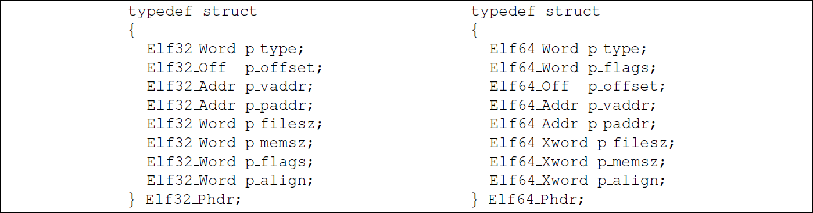
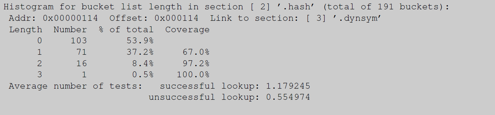
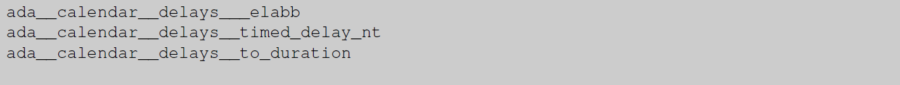

> 1. [非常详细地解释plt&got](https://zoepla.github.io/2018/04/%E9%9D%9E%E5%B8%B8%E8%AF%A6%E7%BB%86%E8%A7%A3%E9%87%8Aplt&got/)
>
> 2. [通过 GDB 调试理解 GOT/PLT](https://rickgray.me/2015/08/07/use-gdb-to-study-got-and-plt/)

# 如何编写共享库

**摘要**

今天，共享库无处不在。开发人员出于多种原因使用它们，并像创建应用程序代码一样创建它们。不过这里有一个问题，因为在许多平台上，必须应用一些额外的技术才能生成像样的代码。生成优化的代码需要更多知识。本文介绍了所需的规则和技术。此外，还介绍了 ABI（应用程序二进制接口）稳定性的概念，并展示了如何对其进行管理。

# 1 引言

长期以来，程序员将常用代码收集在库中，以便重用代码。这节省了开发时间并减少了错误，因为重用代码只需调试一次。对于同时运行数十个或数百个进程的系统，在链接时重用代码只能解决部分问题。<u>进程（程序）将相同的代码片段作为库导入，从而达到重复使用的目的</u>。使用现代操作系统中的内存管理系统，还可以在运行时共享代码。这是通过只将代码加载到物理内存中一次，并通过虚拟内存在多个进程中重用它来实现的。这种类型的库称为共享库。

这个概念并不新鲜。操作系统设计者使用以前使用的基础设施实现了系统的扩展。操作系统的扩展可以对用户透明地完成。**但是，用户必须直接处理的部分最初产生了问题**。

**主要是二进制格式方面的问题**。这是用来描述应用程序代码的格式。提供内存转储就足够的日子早已一去不复返了。多进程系统需要识别包含程序文件的不同部分，例如文本、数据和调试信息等部分。为此，很早就引入了二进制格式。早期的 Unix 常用的是诸如 `a.out` 或 COFF 之类的格式。这些二进制格式在设计时并未考虑共享库，这一点很明显。

## 1.1 一点点历史

Linux 最初使用的二进制格式是一种 `a.out` 变体。在引入共享库时，必须做出某些设计决策，以适应 `a.out` 的限制。主要接受的限制是在加载时和之后不执行**重定位**。<u>共享库必须以磁盘上使用的形式在运行时存在</u>。这对共享库的构建和使用方式施加了一个重大限制：**每个共享库必须有一个固定的加载地址**； 否则就无法生成不需要重定位的共享库。

必须分配固定的加载地址，这必须在没有重叠和冲突的情况下发生，并且通过允许共享库的增长来保证未来的安全。因此，必须有一个中央机构来分配地址范围，这本身就是一个主要问题。但情况变得更糟：今天的 Linux 系统有数百个 DSO（动态共享对象），应用程序可用的地址空间和虚拟内存变得非常分散。这将限制可以动态分配的内存块的大小，这将给某些应用程序带来无法克服的问题。甚至在今天，分配机构已经耗尽了可分配的地址范围，至少在32位机器上是这样。

我们仍然没有涵盖 `a.out` 共享库的所有缺点。由于使用共享库的应用程序在更改其使用的共享库后不必重新链接，因此入口点，即函数和变量地址，不得更改。**这只有在入口点与实际代码分开时才能保证，否则函数 size 的限制将被硬编码**。调用实际实现函数的存根表是 Linux 上使用的解决方案。<u>静态链接器</u>从一个特殊文件（文件扩展名为`.sa`）中获取每个函数存根的地址。在运行时，使用了一个以 `.so.X.Y.Z` 结尾的文件，它必须与使用的 `.sa` 文件相对应。这反过来又要求存根表中分配的条目始终必须用于相同的函数。**存根表的分配**必须小心处理。引入新接口意味着追加到表中。永远不可能淘汰表条目。为了避免将旧的共享库与链接到较新版本的程序一起使用，必须在应用程序中保留一些记录：`.so.X.Y.Z` 后缀名称的 *X* 和 *Y* 部分被记录下来，==并且<u>动态链接器</u>确保满足最低要求==。

该方案的好处是生成的程序运行速度非常快。即使是第一次调用，在这样的共享库中调用函数也非常高效。它可以通过两次绝对跳转来实现：第一次从用户代码跳转到存根，第二次从存根跳转到函数的实际代码。这可能比任何其他共享库实现都快，但其速度代价太高：

1. 需要集中分配地址范围；
2. 可能（大概率）发生碰撞，结果灾难性；
3. 地址空间变得严重碎片化。

由于所有这些以及更多原因，Linux 很早就转换为使用 ELF（可执行链接格式）作为二进制格式。ELF 格式由通用规范 (gABI) 定义，其中添加了特定于处理器的扩展 (psABI)。事实证明，函数调用的摊销成本几乎与 `a.out` 相同，但是没有限制了。

## 1.2 迁移到 ELF

对于程序员来说，切换到 ELF 的主要优势在于创建 ELF 共享库，或者用 ELF 表示的 DSO，变得非常容易。生成应用程序和生成 DSO 之间的唯一区别在于最终链接命令行。一个附加选项（在 GNU ld 的情况下为 `--shared`）告诉链接器生成 DSO 而不是应用程序，后者是默认设置。事实上，DSO 只不过是一种特殊的二进制文件； 不同之处在于它们没有固定的加载地址，因此需要**动态链接器**才能真正变为可执行文件。使用与位置无关的可执行文件 (PIE)，差异会进一步缩小。

这再加上后面将介绍的 GNU Libtool 的引入，导致程序员广泛采用 DSO。正确使用 DSO 可以帮助节省大量资源。但是<u>必须遵循一些规则</u>才能获得好处，并且<u>必须遵循**更多**规则</u>才能获得最佳结果。解释这些规则将是本文很大一部分的主题。

并非所有 DSO 的使用都是为了节省资源。如今，DSO 也经常用作构建程序的一种方式。程序的不同部分被放入不同的 DSO 中。这是一个非常强大的工具，尤其是在开发阶段。无需重新链接整个程序，只需重新链接已更改的 DSO。这通常要快得多。

一些项目甚至在部署阶段就决定保留许多独立的 DSO，即使这些 DSO 没有在其他程序中重用。在许多情况下，这肯定是一件有用的事情：DSO 可以单独更新，从而减少必须传输的数据量。但 DSO 的数量必须保持在一个合理的水平。不过，并非所有程序都这样做，我们稍后会看到为什么这会成为一个问题。

在我们开始讨论所有这些之前，需要对 ELF 及其实现有一些了解。

## 1.3 ELF是如何实现的？

静态链接应用程序的处理非常简单。内核知道这样的应用程序有一个的固定加载地址。加载过程只包括使二进制文件在新创建的进程的适当地址空间中可用，并将控制权转移到应用程序的入口点。其他一切都是在创建可执行文件时由静态链接器完成的。

相比之下，动态链接的二进制文件在从磁盘加载时并不完整。因此，内核不可能立即将控制权转移给应用程序。取而代之的是，还要加载显然还需要（帮助其）完整的一些辅助程序。这个辅助程序是**动态链接器**。动态链接器的任务就是通过加载它需要的 DSO（依赖项）来完成动态链接的应用程序，并执行重定位。然后最终可以将控制权转移给程序。

不过，在大多数情况下，这不是动态链接器的最后一项任务。ELF 允许将与符号相关的重定位延迟到需要该符号的时候。这种延迟重定位方案是可选的，下面讨论的针对启动时执行的重定位的优化也会立即影响惰性重定位。**所以，我们在以下内容中忽略启动完成后的所有内容**。

## 1.4 启动：在内核中的操作

程序从内核开始执行，通常在 `execve` 系统调用中开始。**当前执行的代码被替换为新程序**。这意味着地址空间的内容被包含该程序文件的内容所取代。这不是简单地通过（使用 `mmap`）映射文件内容来实现。**ELF** 文件是结构化的，文件中通常至少有三种不同的区域：

- 可执行的代码；该区域通常不可写；
- 被修改的数据；该区域通常不可执行；
- 运行时不使用的数据；由于不需要，因此不应在启动时加载它。

现代操作系统和处理器可以保护内存区域，以允许和禁止对每个内存页单独读取、写入和执行 [1](#_bookmark7)。最好将尽可能多的页标记为不可写，因为这意味着使用该页的进程可以共享来自相同应用程序或 DSO 的页。写保护还有助于检测和防止对数据甚至代码的无意或恶意修改。

> ^1^<a id="_bookmark7"></a>内存页是操作系统内存子系统运行的最小实体。不同体系结构之间，甚至在使用相同体系结构的系统内，页面的大小都可能不同。

为了让内核找到不同的区域，或者说是 ELF 中的段，以及它们的访问权限，ELF 文件格式定义了<u>一个只包含这些信息的数据结构</u>。即所谓的 ELF **程序头**，必须存在于每个可执行文件和 DSO 中。它由 C 数据结构 `Elf32_Phdr` 和 `Elf64_Phdr` 表示，其定义如图 [1](#_bookmark5) 所示。

<a id="_bookmark5"></a>

<p align="center">

<div align="center">图 1：ELF 程序头 C 数据结构</div>
</p>

要定位**程序头**数据结构，需要另一个数据结构，即 ELF 头。ELF 头是唯一在文件中具有固定位置的数据结构，从偏移量零开始。其 C 数据结构见图 [2](#_bookmark9)。`e_phoff` 字段指定从文件开头算起，**程序头**从哪里开始。`e_phnum` 字段包含**程序头**中的条目数，而 `e_phentsize` 字段包含每个条目的大小。最后一个值仅用作二进制文件的运行时一致性检查。

<a id="_bookmark9"></a>
<p align="center">

<div align="center">图 2：ELF 头 C 数据结构</div>
</p>
**程序头**的条目表示不同的段，`p_type` 为 `PT_LOAD` 表示为可加载段。`p_offset` 和 `p_filesz` 字段指定段在文件中的开始位置和长度。`p_vaddr` 和 `p_memsz` 字段指定段在进程虚拟地址空间中的位置以及内存区域的大小。`p_vaddr` 字段本身的值不一定是最终加载地址。DSO 可以加载到虚拟地址空间中的任意地址。但是段的相对位置很重要。对于预链接的 DSO，`p_vaddr` 字段的实际值是有意义的：它指定 DSO 预链接的地址。但这并不意味着动态链接器在必要时不能忽略此信息。

文件中的大小可以小于它在内存中占用的地址空间。内存区域的第一个 `p_filesz` 字节基于文件中段的数据初始化，差值初始化为零。这可用于处理 **BSS 节**[2](#_bookmark6)，BSS 节内未初始化的变量，根据 C 标准初始化为零。以这种方式处理未初始化变量的优点是可以减小文件大小，因为无需存储初始化值，无需将数据从磁盘复制到内存，并且操作系统通过 `mmap` 接口提供的内存已经初始化为 零。

> ^2^<a id="_bookmark6"></a>BSS 节只包含 NUL 字节。因此，它们不必在存储介质上的文件中表示。加载器只需要知道大小，以便它可以分配足够大的内存并用 NUL 填充它。

`p_flags` 最终告诉内核对内存页面使用什么权限。该字段是一个位图，定义了下表中给出的位。这些标志直接对应为 `mmap` 理解的标志。

| p flags | Value | mmap flag  | Description |
| ------- | ----- | ---------- | ----------- |
| PF_X    | 1     | PROT EXEC  | 执行权限    |
| PF_W    | 2     | PROT WRITE | 写权限      |
| PF_R    | 4     | PROT READ  | 读权限      |

使用适当的权限和指定地址映射所有 `PT_LOAD` 段后，或者为没有固定加载地址的**动态对象**分配地址后，就可以开始下一阶段。**动态链接的可执行文件**本身的虚拟地址空间已建立。但是二进制文件并不完整。内核必须让**动态链接器**完成剩下的工作，为此，必须以与可执行文件本身相同的方式加载动态链接器（即，在程序头中查找可加载的段）。不同之处在于，动态链接器本身必须是完整的，并且应该是可不受限制地重新定位。

内核中没有硬编码实现动态链接器的二进制文件。相反，**应用程序**的程序头包含一个带有 `PT_INTERP` 标签的条目。此条目 `p_offset` 字段保存的偏移量指向一个以 NUL 结尾的字符串，该字符串指定该文件的文件名。对**动态链接器**的唯一要求是，它可能与任何可能的可执行文件一起使用，因此，不能与它们的加载地址有任何冲突。一般来说，这意味着动态链接器没有固定的加载地址，可以在任何地方加载；这正是动态二进制文件所允许的。

一旦动态链接器也被映射到待启动进程的内存中，我们就可以启动动态链接器了。请注意，它不是将控制权转移到的应用程序的入口点，只有动态链接器准备好运行。不是立即调用动态链接器，而是执行另一个步骤。==动态链接器必须以某种方式被告知应用程序可以在哪里找到，以及一旦应用程序完整，控制权必须转移到哪里==。为此，存在一种结构化的方式。内核在新进程的堆栈上放置一个**标记值对数组**。这个**辅助数组**除了前面提到的<u>两个值</u>之外还包含几个允许动态链接器避免多次系统调用的值。`elf.h` 头文件定义了一些带有 `AT_` 前缀的常量。这些是辅助数组中条目的标签。

设置辅助数组后，内核终于准备好将控制权转移到用户模式下的**动态链接器**。入口点在动态链接器的 ELF 头的 `e_entry` 字段中定义。

## 1.5 在动态链接器中启动

程序启动的第二阶段发生在动态链接器中。其任务包括：

- 确定并加载依赖项；
- 重新定位应用程序和所有依赖项；
- 以正确的顺序初始化应用程序和依赖项。

在下文中，我们将仅更详细地讨论重定位处理。对于其他两点，提高性能的方法很明确：减少依赖。每个参与的对象都只初始化一次，但必须进行一些拓扑排序。识别和加载过程也随着数量的依赖性而扩展； 在大多数（所有？）实现中，这不会线性扩展。

重定位过程通常是[[3](#_bookmark11)] 动态链接器工作中最昂贵的部分。它至少是一个渐近为 *O*(*R* +*nr*) 的过程，<u>其中 *R* 是**相对重定位**的数量，*r* 是**命名重定位**的数量，*n* 是参与的 DSO 的数量（加上可执行文件）</u>。ELF 哈希表函数中的缺陷和修改符号查找功能的各种 ELF 扩展可能会将因子增加到 *O*(*R* + *rn* log *s*)，其中 *s* 是符号的数量。这应该清楚地表明，为了提高性能，尽可能减少重定位和符号的数量是很重要的。在解释重定位过程后，我们将对实际数字进行一些估算。

> ^3^<a id="_bookmark11"></a>我们在这里忽略预链接支持，它在许多情况下可以显着降低甚至消除重定位成本。

### 1.5.1 重定位过程

在这种情况下，重定位意味着将应用程序和作为依赖项加载的 DSO 调整到它们自己的加载地址。有两种依赖关系：

- **已知位置在自己的对象中的依赖**。这些不与特定符号相关联，因为链接器知道对象中位置的相对位置。

  请注意，应用程序没有相对重定位，因为代码的加载地址在链接时已知，因此静态链接器能够执行重定位。

- **基于符号的依赖**。**符号的引用**通常和**符号的定义**在不同的对象中，但也可以在同一个对象中。

相对重定位的实现很容易。（静态）链接器可以在链接时计算 object 文件中<u>目标目的地</u>的偏移量。对于这个值，动态链接器只需要添加对象的加载地址，并将结果存储在重定位指定的位置。在运行时，动态链接器只需花费非常少且恒定的时间，不会随着使用更多的 DSO 而增加。

基于符号的重定位要复杂得多。ELF 符号解析过程设计得非常强大，因此它可以处理许多不同的问题。但是，所有这些强大的功能都增加了复杂性和运行时成本。以下的描述，读者可能会质疑导致此过程的决策。我们不能在这里争论这个问题； 读者可以参考 ELF 的讨论。事实上，符号重定位是一个代价高昂的过程，**参与的 DSO 越多或 DSO 中定义的符号越多，符号查找所需的时间就越长**。

==任何重定位的结果都将**<u>与引用一起</u>**存储在对象中的某个位置==。理想情况下，通常目标位置在数据段中。如果用户、编译器或<u>链接器重定位</u>错误地生成了代码，则可能会修改文本或只读段。如果按照 ELF 规范的要求，在**动态 section** 的 `DT_FLAGS` 条目中设置了 `DF_TEXTREL` （或者旧二进制文件中存在 `DT_TEXTREL` 标志），动态链接器将正确处理此问题。但结果是修改后的页面无法与使用同一对象的其他进程共享。修改过程本身也很慢，因为内核必须大量重组内存处理数据结构。

### 1.5.2 符号重定位

动态链接器必须对所有在运行时使用的符号执行重定位，并且在链接时不知道这些符号的引用是否与符号的定义在同一个 object 中。由于在某些体系结构上生成代码的方式，可能会延迟某些重定位的处理，直到实际使用相关引用时。在许多体系结构中调用函数都是这种情况。所有其他类型的重定位总是必须在 object 可以使用之前处理。我们将忽略**延迟重定位**，因为这只是延迟工作的一种方法，它最终必须完成，因此我们将把它包括在成本分析中。要在使用 object 之前实际执行所有重定位，可以通过将环境变量 `LD_BIND_NOW` 设置为非空值来使用。通过将 `-z now` 选项添加到链接器命令行，可以为单个 object 禁用延迟重定位。链接器会在动态 section 的`DT_FLAGS`条目中设置`DF_BIND_NOW`标志来标记 DSO。但是，如果不重新链接 DSO 或编辑二进制文件，则无法撤消此设置，因此只有在确实需要时才应使用此选项。

对于每个加载 object 中每个符号的重定位，实际查找过程从头开始重复。请注意，不同 object  中可能有对同一符号的多次引用。每个 object  的查找结果可能不同，因此除了在每个 object 中缓存一个符号的结果外，没有捷径可走，以防多个重定位引用相同的符号。以下步骤中提到的**查找范围**是已加载 object 子集的有序列表，每个 object 本身（的有序列表）可能不同。**查找范围**的计算方法非常复杂，与此处无关，因此我们建议感兴趣的读者参阅 ELF 规范和 [1.5.4](#_bookmark25) 节。重要的是**查找范围**的长度通常直接取决于加载 object 的数量。这是减少加载 object 数量可以提高性能的另一个因素。

现在有**两种不同**的方法来查找一个符号。传统的ELF方法分为以下几个步骤：

1. 确定**符号**的哈希值。
2. 在查找范围的第一个或下一个 object 中：

    1. 使用 object 中的哈希表大小和哈希值确定符号的哈希桶。
    2. 获取符号的名称偏移量并将其**以 NUL 结尾**的名称使用。
    3. 比较符号名和重定位名。
    4. 如果名称匹配，还要比较版本。这只有在**符号的引用和定义**都有版本控制时，才会发生这种情况。匹配版本也是比较字符串。如果版本匹配，或者无须执行此类比较，就找到了要查找的定义。
    5. 如果定义不匹配，则重试哈希桶链中的下一个元素。
    6. 如果链不包含任何其他元素，则在当前 object 中没有定义，继续在查找范围中的下一个 object 中查找。
3. 如果查找范围内没有其他 object，则查找失败。

注意，**查找范围**包含同一符号的多个定义，并没有问题。**符号查找算法只选择它找到的第一个定义**。请注意，DSO 中定义的**弱符号**没有任何影响。**弱定义只在静态链接中起作用**。拥有多个定义可能会产生一些令人惊讶的后果。假设 DSO “A”定义并引用一个接口，而 DSO “B” 定义了相同的接口。如果现在 “B” 在查找范围内位于 “A” 之前，则 “A” 中的引用将由 “B” 中的定义满足。也就是说 “B” 中的定义**拦截了** “A” 中的定义。这个概念非常强大，因为它允许在不替换通用代码的情况下使用更专业的接口实现。这种机制的一个示例是使用动态链接器的 `LD_PRELOAD` 功能，在运行时引入链接时不存在的附加 DSO。但是，在设计不当的代码中，**拦截**也会导致严重的问题。详见 [1.5.4](#_bookmark25)。

从算法可以看出，每次查找的性能，取决于哈希表桶链的长度和查找范围内 object 的数量等因素。这是上面描述的两个循环。哈希表桶链的长度取决于符号的数量和哈希表大小的选择。由于算法初始步骤中使用的哈希函数永远不会改变，因此只剩下这两个变量。许多链接器并不特别强调选择合适的表大小。如果 GNU 链接器通过 -O 选项，它会尝试优化哈希表大小，以最小化哈希表桶链的长度（注意：需要获取该选项的是链接器，**而不是**编译器）。

> 关于当前实现优化哈希表的说明。GNU binutils 链接器有一个简单的启发式算法，通常倾向于选择小表而不是较短的哈希表桶链。对于大型项目，这很可能**增加**启动成本。==整体内存消耗有时会显著减少（这可能迟早会出现），但仍建议检查优化的有效性==。将开发一个新的链接器实现，它包含一个更好的算法。

要衡量哈希表的有效性，两个数字很重要：

- 成功查找的平均链长。
- 不成功查找的平均链长。

在这里讨论不成功的查找可能会令人惊讶，但实际上它们是==规则==。请注意，**不成功**表示仅在当前 object 中不成功。只有当 object 实现了几乎所有需要查找的内容时，成功的查找数才更重要。在 Linux 系统上，这一类基本上只有两个 object：C 库和动态链接器本身。

某些版本的 readelf 程序直接计算值，输出类似于图 [3](#_bookmark13) 和 [4](#_bookmark14)。这些示例中的数据向我们展示了许多东西。根据符号的数量（2027 对 106），哈希表的大小完全不同。对于较小的表，链接器可以**浪费** 53.9% 不包含数据的哈希表条目。这在 gABI 兼容的系统上只有 412 字节。如果 libc.so 二进制文件允许相同数量的开销，则该表将大 4 KB 或更多。这是一个很大的不同。链接器集成了一个固定的成本函数，该函数将哈希表大小考虑在内。

<a id="_bookmark13"></a>
<p align="center">

<div align="center">图 3：eu-readelf -I libc.so 的示例输出</div>
</p>
<a id="_bookmark14"></a>
<p align="center">

<div align="center">图 4：eu-readelf -I libnss files.so 的示例输出</div>
</p>

哈希表**==相对大小==**的增加意味着哈希表桶链的长度明显更短。对于不成功查找的平均桶链长度尤其如此。小表的平均值仅为大表的 28%。

这些数字应该显示的是减少动态符号表中符号数量的效果。随着符号的显著减少，链接器就有更好的机会来抵消**次优哈希函数**的影响。

**查找算法成本的另一个因素与字符串本身有关**。符号名使用简单的字符串比较，符号名存储在与符号表数据结构相关联的字符串表中。字符串以 C 格式存储；它们以 NUL 字节终止，并且不使用初始长度字段。这意味着必须进行字符串比较，直到找到不匹配的字符或字符串结束。这种方法容易受到具有公共前缀的长字符串的影响。不幸的是，这并不少见。

```c++
namespace some_namespace { 
    class some_longer_class_name {
        int member_variable; 
      public:
        some_longer_class_name (int p);
        int the_getter_function (void);
    };
}
```
GNU C++ 编译器在 3.0 版本之前使用的名称修改方案，它将类成员的名称放在前面，然后是参数列表的描述，然后是名称的其他部分，如名称空间和嵌套类名称。结果是，如果成员名称不同，则名称一开始就可以区分。对于上面的示例，两个成员函数的改写名称如下图 [5](#_bookmark18) 所示。

<a id="_bookmark18"></a>
<p align="center">

<div align="center"> 图 5：gcc 3 之前改写名称的方案</div>
</p>
今天的 gcc 版本和通用 C++ ABI 兼容的所有其他编译器，所使用的新改写方案是：名称以命名空间和类名开头，以成员名结尾。图 [6](#_bookmark19) 显示了这个小例子的结果。两个成员函数的错位名称仅在第 43 个字符后不同。如果两个符号落入同一个哈希桶 [[4](#_bookmark16)]，那么性能就非常糟糕。

<a id="_bookmark19"></a>
<p align="center">

<div align="center"> 图 6：使用通用 C++ ABI 方案的名称改写</div>
</p>

> ^4^<a id="_bookmark16"></a>有人建议“为什么不从后面搜索？”。想想看，这些是 C 字符串，而不是 PASCAL 字符串。我们不知道长度，因此必须读取字符串的每个字符以确定长度。结果会更糟。

Ada 也有类似的问题。gcc 的标准 Ada 库的所有符号都以 ada 为前缀，然后是包和子包名称，最后是函数名称。图 [7](#_bookmark20) 显示了库中符号列表的简短摘录。所有符号名的前 23 个字符都相同。

<a id="_bookmark20"></a>
<p align="center">

<div align="center"> 图 7：来自标准 Ada 库的名称</div>
</p>

两种改写方案中的字符串长度都令人担忧，因为在搜索符号本身时必须完全比较每个字符串。示例中的名称也不是特别长。翻阅 C++ 标准库，可以找到许多长度超过 120 个字符的名称，甚至这还不是最长的。其他系统库的名称长度超过 200 个字符，而具有许多命名空间、模板和嵌套类的复杂、**“设计良好”**的 C++ 项目的名称可能超过 1,000 个字符。**设计加一分，性能减 100 分**。

了解哈希表和字符串查找的详细信息后，来看一个真实的示例：OpenOffice.org。该套件包含 144 个独立的 DSO。在启动期间执行大约 20,000 次重定位。许多重定位是作为 `dlopen` 调用的结果执行，因此无法通过使用预链接 <u>[7]</u> 进行优化。符号解析期间所需的字符串比较次数可用作启动开销的公允值。我们现在计算这个值的近似值。

在 IA-32 上的 OpenOffice.org 1.0 版本的所有 DSO 中，不成功查找的平均链长为 1.1931。这意味着对于每个符号查找，动态链接器必须平均执行 ==72 × 1*.*1931 = 85*.*9032==  次字符串比较。对于 20,000 个符号，总共进行了 1,718,064 次字符串比较。OpenOffice.org 的 DSO 中定义的导出符号的平均长度为 54*.*13。即使我们假设在发现不匹配之前只搜索了 20% 的字符串（这是一个乐观的猜测，因为每个符号名称至少被完全比较一次以匹配自身），这也意味着总共有超过 1850 万个字符 从内存中加载并进行比较。难怪启动如此缓慢，尤其是因为我们忽略了其他成本。

要计算动态链接器执行的查找次数，可以使用动态链接器的帮助。如果环境变量 `LD_DEBUG` 设置为 `symbols`，[只需要统计以 `symbol=` 开头的行数](https://gist.github.com/fcamel/2b6e5996b370bb9d9759d18bbd55193e)。最好使用 `LD_DEBUG_OUTPUT` 将动态链接器的输出重定向到一个文件中。然后可以通过将计数乘以平均哈希链长度来估计字符串比较的次数。由于收集的输出包含所查看文件的名称，因此甚至可以通过乘以 object 确切的哈希链长度来获得更准确的结果。

更改**导出符号的数量**、**符号字符串的长度**、**公共前缀的数量和长度**、**DSO 的数量**和**哈希表大小优化**中的任何一个因素都可以显著降低成本。一般来说，如果二进制文件已经在文件系统缓存中，则动态链接器在启动期间，重定位时间百分比约为 50-70%，如果必须从磁盘加载文件，则约为 20-30% [[5](#_bookmark21)]。因此，花时间研究这些问题是值得的，在本文的其余部分，我们将介绍实现这一点的方法。到目前为止要记住：将 `-O1` 传递给链接器以生成最终产品。

> ^5^<a id="_bookmark21"></a>这些数字假设未使用预链接。

### 1.5.3 GNU 风格的哈希表

上一节中提出的所有优化仍然将符号查找作为一个重要因素。必须检查大量数据，将所有这些数据加载到 CPU 缓存中的成本很高。如上所述，原始的 ELF 哈希表处理没有更多的灵活性，因此解决方案是必须取代它。这就是 GNU 风格哈希表所做的。它可以通过拥有自己的**动态 section 条目**(`DT_GNU_HASH`) 与旧式哈希表处理和平共存。更新后的动态链接器将使用新哈希表代替旧的，因此提供了完全透明的向后兼容性。新的哈希表实现与旧的一样，在每个可执行文件和 DSO 中都是独立的，因此在同一进程中使用新格式的二进制文件和一些仅使用旧格式的二进制文件是没有问题的。

查找的主要开销，特别是对于某些二进制文件，是符号比较。如果可以减少实际需要的比较次数，就可以获得很大的收益。第二个可能的优化是数据的布局。带有符号链的旧式哈希表不一定对 CPU 缓存有好处。当使用的内存位置是连续时，CPU 缓存工作得特别好。链表跳来跳去，降低 CPU 缓存加载和预取的效率。

GNU 风格的哈希表旨在解决这些问题。由于可以同时提供旧式哈希表来维护与现有运行时环境的兼容性，因此不需要对更改进行限制。新的查找过程略有不同：

1. 确定**符号**的哈希值。
2. 在查找范围的第一个或下一个 object 中：
   1. 哈希值用于确定是否存在具有给定哈希值的条目。通过 2 位布隆过滤器 [[6](#_bookmark23)] 完成。如果过滤器显示没有这样的定义，则搜索查找范围中的下一个 object 。
   1. 使用 object 中的哈希表大小和哈希值确定符号的哈希桶。哈希值是一个符号索引。
   1. 从符号索引对应的桶链数组中获取条目。将该值与我们试图定位的符号的哈希值进行比较。忽略位 0。
   1. 如果哈希值匹配，则获取符号的名称偏移量，并将其用作以 NUL 结尾的名称。
   1. 比较符号名和重定位名。
   1. 如果名称匹配，还要比较版本。这只有在**符号的引用和定义**都有版本控制时，才会发生这种情况。匹配版本也是比较字符串。如果版本匹配，或者无须执行此类比较，就找到了要查找的定义。
   1. 如果不匹配，并且从哈希桶加载的值没有设置位 0，则继续哈希桶数组中的下一个条目。
   1. 如果设置了位 0，则哈希链中没有其他条目，我们继续查找范围中的下一个 object。
3. 如果查找范围内没有其他 object，则查找失败。

> ^6^<a id="_bookmark23"></a>http://en.wikipedia.org/wiki/Bloom_filter

这个新过程似乎更复杂。事实并非如此，速度也快得多。我们实际上必须比较字符串的次数大大减少了。仅布隆过滤器通常会过滤掉所有查找的 80% 或更多（在许多情况下为 90+%）。也就是说，即使在哈希链很长的情况下，因为布隆过滤器有助于确定不会有匹配项，因此没有任何字符串比较工作。这通过一次内存访问完成。

其次，将哈希值与符号的哈希值进行比较会避免更多的字符串比较。每个哈希链可以包含具有不同哈希值的条目，这种简单的单词比较可以过滤掉很多重复项。哈希链中很少有两个具有相同哈希值的条目，这意味着不成功的字符串比较很少见。使用与原始 ELF 规范规定不同的哈希函数也会增加这种情况的可能性。新函数在将值分散到 32 位值的值范围方面要好得多。

哈希链数组的组织方式是，同一个哈希桶的所有元素彼此跟随。没有链表，因此缓存的利用率要高得多。

只有布隆过滤器和哈希函数测试成功，才访问符号本身。哈希链的所有符号也是连续的，因此如果我们需要访问多个条目，CPU 缓存预取也会在这里提供帮助。

对旧格式的最后一个更改是，哈希表只包含未定义符号的一些必要记录。大多数未定义的符号不必出现在哈希表中。这在某些情况下会显着降低散列冲突的可能性，并且肯定会提高布隆过滤器的成功率，并减少哈希链的平均长度。结果是在不依赖于预链接 [[7]()] 的代码中显著加速了 50% 或更多（预链接**总是**更快）。

但是，这并不意味着前一节中描述的优化技术是无关紧要的。它们仍然应该被广泛应用。使用新的哈希表实现仅意味着不优化导出和引用的符号，不会像过去那样对性能产生重大影响。

> 新的哈希表格式在 Fedora Core 6 中引入。整个操作系统通过使用 `--hash-style=gnu` 来创建，除了一些有意为之的例外之外，没有兼容旧哈希表。这意味着二进制文件不能在动态链接器中不支持新哈希表的老系统上使用。由于这从来都不是任何操作系统版本的目标，所以做出这个决定显而易见。结果是所有二进制文件都小于有**==第二组哈希表==**的二进制文件，在许多情况下甚至小于仅使用旧格式的二进制文件。

回到 OpenOffice.org 例子，我们可以对加速进行一些估计。如果 Bloom 过滤器能够过滤掉所有查找的 80%，而重复哈希值的概率高达 15%，我们实际上只需要平均比较 `72 × 0.2 × 0.15 × 1.1931 = 2.58` 字符串。这是 33 倍的改进。再加上改进的内存处理和对 CPU 缓存的尊重，我们获得了更高的收益。在现实世界的例子中，我们可以降低查找成本，使程序启动速度提高 50% 或更多。

### 1.5.4 查找范围<a id="_bookmark25"></a>

到目前为止，查找范围被描述为大多数加载 object 的有序列表。虽然这是正确的，但它也是故意模糊的。现在是时候更详细地解释查找范围了。

事实上，查找范围最多由三部分组成。主要部分是**全局查找范围**。它最初由可执行文件本身及其所有依赖项组成。依赖项按广度优先顺序添加。这意味着，**首先**，可执行文件的依赖项是按照其在可执行文件的动态 section 中 `DT_NEEDED` 条目的顺序添加。然后以相同的方式添加第一个依赖项的依赖项。已加载的 DSO 将被跳过；他们在名单上只出现一次。该过程递归进行，因为可用的 DSO 数量有限，它将在某个时刻停止。以这种方式加载的 DSO 的确切数量可能相差很大。一些可执行文件只依赖于 2 个 DSO，另一些则依赖于 200 个。

如果可执行文件设置了 `DF_SYMBOLIC` 标志（请参阅第 [2.2.7)](#_bookmark52)，则**带有引用的 object** 将添加到全局查找范围的前面。注意，只有**带有引用的 object** 被添加到前面，而不是它的依赖项。其影响和原因将在后面解释。

使用 `dlopen` 动态加载 DSO 时，会对查找范围进行更复杂的修改。如果是动态加载 DSO，它会引入一组自己可能需要搜索的依赖项。**如果带有引用的 object 位于已由 `dlopen` 加载的那些 object 中，则这些 object ，从 `dlopen` 调用中请求的那个开始，将组成查找范围**。这意味着，这些对象不会添加到全局查找范围，也不会在常规查找中搜索它们。这个第三部分查找范围，我们将其称为**本地查找范围**，它取决于带有引用的 object。

不过，可以更改 `dlopen` 的行为。如果该函数传递了 `RTLD_GLOBAL` 标志，则加载的 object 和所有依赖项**都会**添加到全局范围。这通常是一个非常糟糕的主意。动态添加的 object  可以被删除，当发生这种情况时，所有其他 object 的查找都会受到影响。在动态加载的 object 及其依赖项之前搜索整个全局查找范围，以便首先在全局查找范围的 object 中找到定义，然后再在本地查找范围中找到定义。如果动态链接器将查找作为重定位的一部分进行，则通常会自动处理此附加依赖项，但如果用户使用 `dlsym` 在查找范围内查找符号，则无法安排此操作。

通常没有理由使用 `RTLD_GLOBAL`。基于稍后解释的原因，要解析所有引用，始终强烈建议使用所有必要的 DSO 创建依赖关系。`RTLD_GLOBAL` 通常用于链接 DSO 时没有可用实现的情况。由于应该避免这种情况，因此对这个标志的需求应该是最小的。即使程序员不得不跳过一些障碍来解决由 `RTLD_GLOBAL` 解决的问题，这也是值得的。调试和解决通过将 object 添加到全局查找范围而引入的问题的痛苦要大得多。

自 2004 年 9 月以来，GNU C 库中的动态链接器又增加了一个扩展。此扩展有助于处理具有相同名称的符号的多个定义不兼容的情况，因此无法解析和按预期工作。这通常是编写冲突定义的 DSO 人员一方设计失败的标志，也是依赖于这些不兼容 DSO 应用程序编写者一方的失败标志。这里假设应用程序 app 与 DSO libone.so 链接，它定义了符号 `duplicate`，并且它动态加载的 DSO libdynamic.so，依赖于另一个 DSO libtwo.so，也定义了一个符号 `duplicate`。当应用程序启动时，它可能具有这样的全局范围：

```
app → libone.so → libdl.so → libc.so
```
如果现在加载了 libtwo.so，附加的本地查找范围可能是这样的：

```
libdynamic.so → libtwo.so → libc.so
```

在搜索**全局查找范围**之后搜索**本地查找范围**，libdynamic.so 可能是个例外，一旦使用`DF_DYNAMIC` 标志，则将首先在这个相同的 DSO 中搜索。但是，如果在 libdynamic.so 中需要符号 `duplicate`，会发生什么？毕竟我们到目前为止所说的结果总是：在 libone.so 中找到定义，因为 libtwo.so 只在**全局查找范围**之后搜索的**本地查找范围**中。如果这两个定义不兼容，程序就会出问题。

将 `dlopen` 第二个参数的**标志字**与 `RTLD_DEEPBIND` 进行 OR 运算，并使用足够新的 GNU C 库来更改这一点。如果发生这种情况，动态链接器将在全局查找范围**之前**搜索本地查找范围，以查找通过 `dlopen` 调用加载的所有对象。对于我们的例子来说，这意味着新加载的 DSO libdynamic.so 和 libtwo.so 中所有查找的搜索顺序都会更改，但不会更改 libc.so，因为此 DSO 已经加载。对于两个受影响的 DSO，对 `duplicate` 的引用现在将在 libtwo.so 中找到定义。其他所有的 DSO，则在 libone.so 中找到 `duplicate` 的定义。

虽然这听起来像是处理兼容性问题的好解决方案，但只有在无法避免时才应使用此功能。有几个原因：

- 查找范围的变化影响所有符号和所有加载的 DSO。某些符号可能必须由全局范围内的定义拦截，但现在不会发生了。
- 已加载的 DSO 不受影响，这可能会导致不一致的结果，具体取决于 DSO 是否已加载（它可能是动态加载的，因此甚至存在竞争条件）。
- `LD_PRELOAD` 对于动态加载对象中的查找无效，因为预加载对象是全局范围的一部分，已添加到可执行文件之后。因此，仅在本地查找范围之后查看它们。
- 应用程序可能期望本地定义总是优先于其他定义。这（和上一点）在一定程度上已经是使用`DF_SYMBOLIC`的问题，但由于此标志也不应该使用，因此参数仍然有效。
- 如果任何隐式加载的 DSO 之后被显式加载，其查找范围将发生变化。
- 最后，该标志不可移植。

`RTLD_DEEPBIND` 标志实际上只能用作最后的手段。修复应用程序使其不依赖于该标志的功能是更好的解决方案。

### 1.5.5 GOT 和 PLT

全局偏移表 (GOT) 和过程链接表 (PLT) 是 ELF 运行时的两个核心数据结构。我们现在将介绍使用它们的原因以及由此产生的后果。

重定位是为**源构造**创建的，例如：

```c
extern int foo;
extern int bar (int);
int call_bar (void) { 
    return bar (foo);
}
```

对 bar 的调用需要两次重定位：一次是加载 `foo` 的值，另一次是查找 `bar` 的地址。如果生成的代码知道变量的地址和函数，汇编程序指令将直接从该地址加载或跳转到该地址。对于 IA32，代码如下所示：

```assembly
pushl   foo 
call	bar
```

这会将 `foo` 和 `bar` 的地址编码为**文本段**指令中的一部分。如果只有动态链接器知道该地址，则必须在运行时修改文本段。根据我们上面的了解，必须避免这种情况。

因此，为 DSO 生成的代码，即使用 `-fpic` 或 `-fPIC` 时，如下所示：

```assembly
movl	foo@GOT(%ebx), %eax
pushl    (%eax)
call	bar@PLT
```

变量 `foo` 的地址现在不是指令的一部分。相反，它从 GOT 加载。在链接时，已知 GOT 中相对于 PIC 寄存器值 (`%ebx`) 的位置地址。因此不必更改**文本段**，只需更改 GOT[[7](#_bookmark28)]。
> ^7^<a id="_bookmark28"></a>使用这个方案还有一个好处。如果要修改指令，则每个加载/存储指令都需要一个重定位。通过将地址存储在 GOT 中，只需要一次重定位。

函数调用的情况类似。不直接调用函数 `bar`。相反，控制被转移到 PLT 中 `bar` 的存根（由 `bar@PLT` 表示）。对于 IA-32，PLT 本身不必修改，可以放在只读段中，每个条目的大小为 16 字节。只有 GOT 被修改，每个条目由 4 个字节组成。IA-32 DSO 中 PLT 的结构如下所示：

```assembly
.PLT0: pushl 4(%ebx)
       jmp *8(%ebx)
       nop; nop
       nop; nop
.PLT1: jmp *name1@GOT(%ebx)
       pushl $offset1
       jmp .PLT0@PC
.PLT2: jmp *name2@GOT(%ebx)
       pushl $offset2
       jmp .PLT0@PC
```

这显示了三个条目，需要多少都可以，都具有相同的大小。标有 `.PLT0` 的第一个条目是特殊的。我们将看到它在内部使用。以下所有条目都属于一个函数符号。第一条指令是间接跳转，地址取自 GOT 中的一个 **slot**。每个 PLT 条目都有一个 GOT **slot**。<u>在启动时，动态链接器用指向相应 PLT 条目第二条指令的地址填充 GOT **slot**</u>。即第一次使用 PLT 条目时，在 `pushl` 指令下面的那条跳转令处结束。压入堆栈的值也特定于 PLT **slot**，对于我们调用的函数，它是重定位条目的偏移量。然后，控制转移到特殊的第一个 PLT 条目，它将更多的值压入堆栈，最后跳转到动态链接器。动态链接器确保第三个 GOT slot（偏移量 8）包含动态链接器中入口点的地址。一旦动态链接器确定了函数的地址，它就会将结果存储在 GOT 条目中（在找到跳转的函数之前，它用于 PLT 条目开头的 jmp 指令)。这样做的效果是，以后对PLT 条目的所有使用都不会经过动态链接器，而是直接传递给函数。因此，除了第一次调用之外，所有调用的开销**只是**一次间接跳转。

如果不能保证函数在引用它的 object 中定义，则始终使用 PLT 存根。请注意，在带有引用的 object 中进行简单定义不足以避免 PLT 条目。从符号查找过程来看，应该很清楚，定义可以在另一个 object 中找到（拦截），在这种情况下需要 PLT。**稍后将详细解释何时以及如何避免 PLT 条目**。

GOT 和 PLT 的确切结构是体系结构特定，在各自的 psABI 中指定。这里所说的 IA-32 在某种程度上适用于其他一些架构，但并不适用于所有架构。例如，虽然 IA-32 上的 PLT 是只读的，但对于其他体系结构，它必须是可写的，因为 PLT 条目不是使用 GOT 值进行间接跳转，而是直接修改。读者可能会认为 IA-32 ABI 的设计者犯了一个错误，要求间接调用，而不是直接调用，因此速度较慢。不过，这没有错。可执行的段可写是一个巨大的安全问题，因为攻击者可以简单地将任意代码写入 PLT 并接管程序。无论如何，我们可以这样总结使用 GOT 和 PLT 的成本：

- 每次使用导出的全局变量都使用 GOT 条目并间接加载变量值；

- 每个被调用的（而不是作为变量引用的）函数（不能保证在调用的 object 中定义）都需要 PLT 条目。函数调用间接执行，方法是首先将控制权转移到 PLT 条目中的代码，然后依次调用该函数。

- 对于某些体系结构，每个 PLT 条目至少需要一个 GOT 条目。

因此，在 IA-32 上避免通过 PLT 跳转将删除 16 字节的文本（即指令）和 4 字节的数据。在访问全局变量时避免使用 GOT 可节省 4 个字节的数据和一个加载指令（即，在执行期间至少节省 3 字节的代码和周期）。此外，每个 GOT 条目都有一个与上述成本相关的重定位。

### 1.5.6 运行构造函数

一旦执行了重定位，DSO 和应用程序代码就可以实际使用了。但是还有一件事要做：某些情况下，必须初始化 DSO 和应用程序。代码的作者可以为每个 object 定义一些初始化函数，这些函数在其他代码使用 DSO 之前运行。要执行初始化，函数得能使用来自自个 object 和其依赖项的代码。**为实现这一点，动态链接器必须确保对象以正确的顺序初始化，即对象的依赖项必须在对象之前初始化**。

为了保证动态链接器按正确的顺序初始化，必须对 object 列表执行拓扑排序。这种排序不是线性过程。与所有排序算法一样，运行时间至少为 O(*n* log *n*)，并且由于实际上是一种拓扑排序，因此该值甚至更高。更重要的是：当必须运行**终结器**时，由于启动时的顺序与关闭时的顺序不同，整个过程必须重复。

因此，我们又有了一个成本因素，它直接取决于所涉及的 object 数量。尽管实际成本通常远低于重定位的成本，但减少数量会有所帮助。

在这一点上，了解正确编写 DSO 的构造函数和析构函数的方法很有用。一些系统有这样的约定，即名为 `_init` 和 `_fini` 的导出函数分别被自动选为构造函数和析构函数。GNU ld 仍遵循此约定，在 Linux 系统上使用这些名称的函数确实会导致使用这些功能。但这完全是 100% 错误的！

使用这些函数，程序员可以覆盖系统本身正在使用的任何初始化和销毁功能。结果是没有完全初始化 DSO，这迟早会导致灾难。添加构造函数和析构函数的正确方法是分别用 `constructor` 和 `destructor` 属性标记函数。

```c++
void
__attribute ((constructor)) init_function (void)
{
...
}

void
__attribute ((destructor)) fini_function (void)
{
...
}
```

也不应该导出这些函数（请参阅第 [2.2.2](#_bookmark39) 和 [2.2.3](#_bookmark41) 节），但这只是一种优化。使用这样定义的函数，运行时将安排在正确的时间调用它们，并在调用之前，执行任何必要的初始化。

## 1.6 ELF 成本汇总

我们现在已经讨论了启动过程，以及二进制文件的形式如何影响启动过程。现在我们将总结各种因素，以便稍后更容易确定优化的好处。

**代码大小** 与其他地方一样，对于相同语义的代码，缩小大小通常意味着更高的效率和性能。较小的 ELF 二进制文件在运行时需要较少的内存。

一般来说，编译器总是会尽可能生成最好的代码，我们不会进一步讨论这一点。但是必须知道，每个 DSO 都包含一定的数据和代码开销。因此，更少的 DSO 意味着更小的文本段（即代码尺寸更小）。

**Object 数量** 包含相同功能的 object 数量越少越好这一事实已在多处提及：

- 在运行时加载的对象更少。这直接转化为更少的系统调用。在 GNU 动态链接器实现中，加载一个 DSO 需要至少 8 个系统调用，所有这些都可能非常昂贵。

- 相关的，必须记录应用程序和<u>**其依赖的依赖**</u>的名称。这不是一个非常高的成本，但如果有许多依赖项，加起来成本肯定也不低。

- 查找范围不断扩大。这是重定位成本方程中的主要因素之一。

- 更多的 object 意味着更多的符号表，这通常意味着更多的重复。未定义的引用不会合并为一个；**==并且处理多个定义，动态链接器必须进行排序==**。

  此外，符号通常从 DSO 导出以用于另一个 DSO。如果 DSO 合并，这种情况就不会发生。

- 初始化器/终结器的排序更复杂。

- 通常，动态链接器为每个进程加载 DSO 都有一些开销。每次请求新的 DSO 时，都必须搜索已加载的 DSO 列表，这可能非常耗时，因为 DSO 可能有很多别名。

**符号数量** 导出和未定义符号的数量决定了动态符号表、哈希表的大小和哈希表桶链的平均长度。运行时不使用普通符号表，因此没有必要将它们从二进制文件中剥离。这对性能没有影响。

此外，导出的符号较少，使用预链接时发生冲突的机会就较少（未进一步介绍）。

**符号字符串的长度** 较长的符号长度通常会导致不必要的成本。一个符号的成功查找必须匹配整个字符串，比较几十个或数百个字符需要时间。如果公共前缀像新的 C++ 改编方案中那样长，则查找不成功会受到影响。任何情况下，长符号名都会导致必须在运行时出现大型字符串表，从而增加加载时间和地址空间使用的成本，这对于 32 位机器来说是一个问题。

**重定位次数** 处理重定位构成了启动期间的大部分工作，因此任何减少都是显而易见的。

**重定位的种类** 所需的重定位类型也很重要，因为处理**相对重定位**比**普通重定位**要便宜得多。此外，必须避免对**文本（代码）段**进行重定位。

**代码和数据的放置** 所有可执行代码都应放在只读内存中，编译器通常会确保正确完成此操作。创建数据对象时，主要由用户来确保将其放置在正确的段中。理想情况下，数据也是只读的，但这仅适用于常量。第二个最佳选择是将变量初始化为零，那就不必从文件内容初始化。其余的必须就进入数据段了。

在下文中，我们将不涵盖此处给出的前两点。这由 DSO 的开发人员决定。为使 DSO 表现更好，需要进行不小的额外更改，这些是基本的设计决策。我们在这里发表了意见，是否有效果还有待观察。

## 1.7 测量 ld.so 性能

要执行优化，量化优化效果很有用。幸运的是，使用 glibc 的动态链接器很容易做到这一点。使用 `LD_DEBUG` 环境变量，可以**转储**启动性能相关的信息。图 [8](#_bookmark32) 显示了一个调用了 `echo` 程序的示例。

<a id="_bookmark32"></a>
<p align="center">

<div align="center">图 8：收集启动统计数据</div>
</p>

动态链接器的输出分为两部分。<u>程序输出之前的部分</u>是在执行完本节中描述的所有工作之后，动态链接器将控制权移交给应用程序之前打印的。第二部分是摘要，在应用程序（正常）终止后打印。实际格式可能因不同的体系结构而异。它包含的时序信息，只来自于那些可轻松访问 CPU 周期计数器寄存器（现代 IA-32、IA-64、x86-64、Alpha）的体系结构。对于其他架构，这些行根本就没有。

计时信息提供了动态链接器启动期间花费的总时间、执行重定位所需的时间以及内核加载/映射二进制文件花费的时间的绝对值。在本例中，处理重定位处理占启动成本的 50% 以上。这里有很多优化的潜力。用于测量时间的单位是 CPU 周期。这意味着甚至无法在同一架构的不同实现之间比较这些值。例如，Pentium^RM^ III 和 Pentium^RM^ 4 机器的测量值将完全不同。但是这些测量非常适合测量一台机器上的改进，这正是我们在这里感兴趣的。

重定位在启动性能中起着很重要的作用，因此打印了一些有关重定位数量的信息。在该示例中，总共执行了 133 次重定位，来自动态链接器、C 库和可执行文件本身。其中有 5 个重定位可以从重定位缓存中获取。这是在动态链接器中实现的优化，可以更高效地处理针对同一符号的多次重定位的情况。程序本身终止后，再次打印相同的信息。这里重定位的总数更高，因为应用程序代码的执行导致执行了 55 次运行时重定位。

在程序的连续运行中，所处理的重新定位的数量是稳定的。时间测量值则不是。即使在没有其他程序运行的单用户模式下，也会有差异，因为必须访问高速缓存和主内存。因此有必要对多次运行的运行时间进行平均。

显然也可以在不运行程序的情况下计算重定位。在二进制文件上运行 `readelf -d` 显示**动态 section** ，我们关心其中的 `DT_RELSZ`、`DT_RELENT`、`DT_RELCOUNT` 和 `DT_PLTRELSZ` 条目。它们允许计算正常和相对重定位的数量以及 PLT 条目的数量。如果不想手动执行此操作，可以使用附录 [A](#_bookmark77) 中的 `relinfo` 脚本。

# 2. DSO 的优化

在本节中，我们将描述基于 C 或 C++ 变量或函数的各种优化。除非明确说明，否则选择变量或函数是故意的，因为许多实现都适用于变量或函数。但是在某些架构中，函数像变量一样被处理。这主要是像 SH-3 和 SH-4 这样的嵌入式 RISC 架构的情况，它们提供的寻址模式有局限性，这使得它不可能像其他架构那样处理函数。在大多数情况下，同时优化变量和函数是没有问题的。为了在所有体系结构上获得最佳性能，实际上一直都应该这样做。

最重要的建议是生成 DSO 的代码时始终使用 `-fpic` 或 `-fPIC`。这适用于数据和代码。未以这种方式编译的代码几乎肯定会包含文本（代码）重定位。对于这个没有任何借口，总之必须得这么做。文本（代码）重定位需要额外的工作才能在动态链接器中应用。而说由于没有其他进程使用 DSO 而代码不需要共享的论证是无意义的。在这种情况下，不应该首先使用 DSO；应该将代码添加到应用程序代码中。

有些人试图争辩说，在某些架构上使用 `-fpic/-fPIC` 有太多缺点。这主要是在关于 IA-32 的争论中提出来的。此处使用 `%ebx` 作为 PIC 寄存器**剥夺了**编译器可用于优化的宝贵寄存器之一。但这真的不是什么大问题。**首先**，没有可用的 `%ebx` 从来都不是什么大的惩罚。其次，在现代编译器（例如 3.1 版后的 gcc）中，PIC 寄存器的处理更加灵活。并不总是需要使用 %ebx，这有助于消除不必要的复制操作。第三，如本节后面所述，通过为编译器提供更多信息，可以消除 PIC 中的许多开销。这一切结合起来会导致开销，但在大多数情况下并不明显。

使用 gcc 时，选项 `-fpic/-fPIC` 还会告诉编译器，不能使用一些可用于可执行文件的优化。这与符号查找和缩短有关。由于编译器能假定可执行文件是查找范围中的第一个 object，因此它知道引用在可执行文件中定义的所有全局符号，都是本地解析。本地定义的变量可直接访问，无需通过 GOT 进行间接访问。对于 DSO 而言并非如此：DSO 可以位于查找范围的较晚位置，可能会插入较早的 object。因此，必须使用 `-fpic`/`-fPIC` 编译所有可能最终出现在 DSO 中的代码，否则 DSO 可能无法正常工作。没有编译器选项将此优化与位置无关代码的生成分开。

选择 `-fpic` 还是 `-fPIC`，必须根据具体情况来决定。对于某些体系结构，根本没有区别，人们往往会忽略。对于大多数 RISC 来说，有很大的不同。例如，当使用`-fpic`时，这是 gcc 为 SPARC 生成的代码，用于读取全局变量`global`:

```assembly
sethi %hi(_GLOBAL_OFFSET_TABLE_-4),%l7 
call .LLGETPC0
add	%l7,%lo(_GLOBAL_OFFSET_TABLE_+4),%l7
ld	[%l7+global],%g1
ld	[%g1],%g1
```

如果使用 `-fPIC`，则代码如下：

```assembly
sethi %hi(_GLOBAL_OFFSET_TABLE_-4),%l7 
call .LLGETPC0
add	%l7,%lo(_GLOBAL_OFFSET_TABLE_+4),%l7
sethi %hi(global),%g1
or	%g1,%lo(global),%g1
ld	[%l7+%g1],%g1
ld	[%g1],%g1
```

两种情况下，`%l7` 首先加载 GOT 的地址。然后访问 GOT 得到 `global` 的地址。使用 `-fpic`，一条指令就足够，而使用 `-fPIC` ，需要 3 条指令。`-fpic` 选项告诉编译器 GOT 的大小不超过特定于架构的值（SPARC 为 8kB）。如果只有那么多 GOT 条目可以存在，则可以在指令本身中对 GOT **基址的偏移量**进行编码，即上面第一个代码序列的 `ld` 指令。如果使用 `-fPIC`，则不存在此类限制，因此编译器必须悲观，并生成可以处理**任何尺寸偏移量**的代码。本例中指令数量的差异正确地表明应始终使用 `-fpic`，除非绝对有必要使用 `-fPIC`。当到达这一点时，链接器会失败，并输出一条消息，此时只需要重新编译代码。

手动编写汇编代码时，很容易遗漏必须使用位置无关的代码序列的情况。非 PIC 序列看起来和实际上更简单、更自然。因此，在这种情况下，检查 DSO 是否标记为包含文本（代码）重定位极其重要。这很容易做到:

```bash
readelf -d binary | grep TEXTREL
```
如果这产生了任何输出，则会出现文本（代码）重定位，最好开始寻找导致它们的原因。

## 2.1 数据定义
