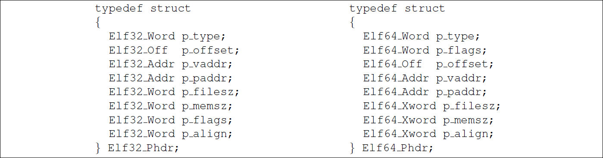
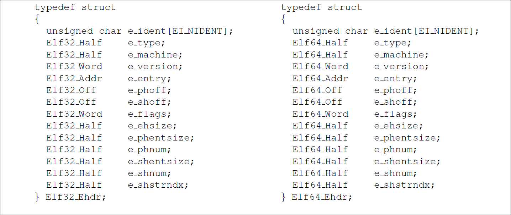
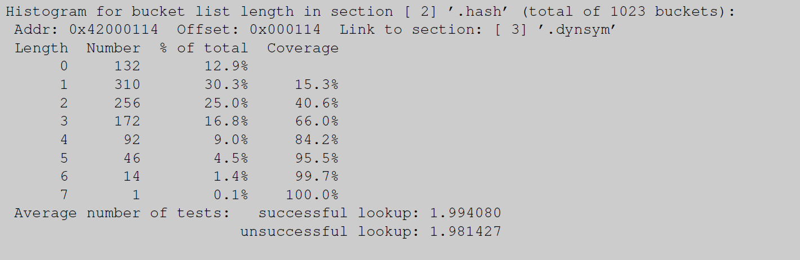
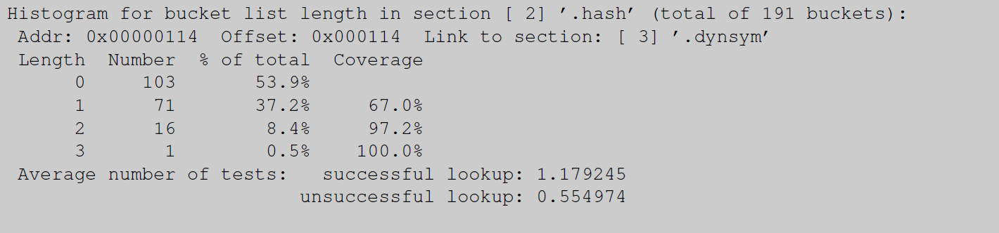
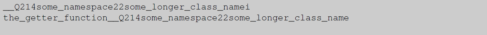
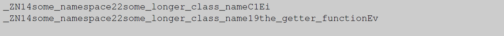
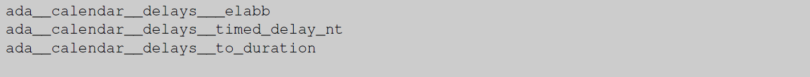
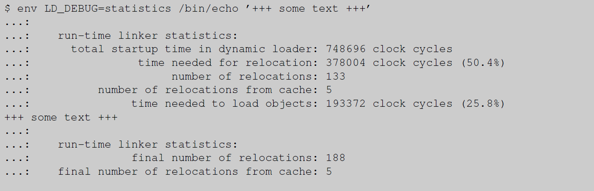

# How To Write Shared Libraries

**Abstract**

Today, shared libraries are ubiquitous. Developers use them for multiple reasons and create them just as they would create application code. This is a problem, though, since on many platforms some additional techniques must be applied even to generate decent code. Even more knowledge is needed to generate optimized code. This paper introduces the required rules and techniques. In addition, it introduces the concept of ABI (Application Binary Interface) stability and shows how to manage it.

# 1 Preface

For a long time, programmers collected commonly used code in libraries so that code could be reused. This saves development time and reduces errors since reused code only has to be debugged once. With systems running dozens or hundreds of processes at the same time reuse of the code at link-time solves only part of the problem. **Many processes will use the same pieces of code which they import for libraries**. With the memory management systems in modern operating systems it is also possible to share the code at run-time. This is done by loading the code into physical memory only once and reusing it in multiple processes via virtual memory. Libraries of this kind are called shared libraries.

The concept is not very new. Operating system designers implemented extensions to their system using the infrastructure they used before. The extension to the OS could be done transparently for the user. But the parts the user directly has to deal with created initially problems.

The main aspect is the binary format. This is the format which is used to describe the application code. **Long gone are the days that it was sufficient to provide a memory dump**. Multi-process systems need to identify different parts of the file containing the program such as the text, data, and debug information parts. For this, binary formats were introduced early on. Commonly used in the early Unix-days were formats such as `a.out` or COFF. These binary formats were not designed with shared libraries in mind and this clearly shows.

## 1.1 A Little Bit of History

The binary format used initially for Linux was an `a.out` variant. When introducing shared libraries certain design decisions had to be made to work in the limitations of `a.out`. The main accepted limitation was that no *relocations* are performed at the time of loading and afterward. **The shared libraries have to exist in the form they are used at run-time on disk**. This imposes a major restriction on the way shared libraries are built and used: every shared library must have a fixed load address; otherwise it would not be possible to generate shared libraries which do not have to be relocated.

The fixed load addresses had to be assigned and this has to happen without overlaps and conflicts and with some future safety by allowing growth of the shared library. It is therefore necessary to have a central authority for the assignment of address ranges which in itself is a major problem. But it gets worse: given a Linux system of today with many hundred of DSOs (Dynamic Shared Objects) the address space and the virtual memory available to the application gets severely fragmented. This would limit the size of memory blocks which can be dynamically allocated which would create unsurmountable problems for some applications. It would even have happened by today that the assignment authority ran out of address ranges to assign, at least on 32-bit machines.

We still have not covered all the drawbacks of the `a.out` shared libraries. Since the applications using shared libraries should not have to be relinked after changing a shared library it uses, the entry points, i.e., the function and variable addresses, must not change. This can only be guaranteed if the entry points are kept separate from the actual code since otherwise limits on the size of a function would be hard-coded. A table of function stubs which call the actual implementation was the solution used on Linux. The **static linker** got the address of each function stub from a special file (with the filename extension `.sa`). At run-time a file ending in `.so.X.Y.Z` was used and it had to correspond to the used `.sa` file. This in turn requires that an allocated entry in the stub table always had to be used for the same function. The allocation of the table had to be carefully taken care of. Introducing a new interface meant appending to the table. It was never possible to retire a table entry. To avoid using an old shared library with a program linked with a newer version, some record had to be kept in the application: the *X* and *Y* parts of the name of the `.so.X.Y.Z` suffix was recorded and the **dynamic linker** made sure minimum requirements were met.

The benefits of the scheme are that the resulting program runs very fast. Calling a function in such a shared libraries is very efficient even for the first call. It can be implemented with only two absolute jumps: the first from the user code to the stub, and the second from the stub to the actual code of the function. This is probably faster than any other shared library implementation, but its speed comes at too high a price:

1.  a central assignment of address ranges is needed;
2.  collisions are possible (likely) with catastrophic results;
3.  the address space gets severely fragmented.

For all these reasons and more, Linux converted early on to using ELF (Executable Linkage Format) as the binary format. The ELF format is defined by the generic specification (gABI) to which processor-specific extensions (psABI) are added. As it turns out the amortized cost of function calls is almost the same as for `a.out` but the restrictions are gone.

## 1.2 The Move To ELF

For programmers the main advantage of the switch to ELF was that creating ELF shared libraries, or in ELF speak DSOs, becomes very easy. The only difference between generating an application and a DSO is in the final link command line. One additional option (`--shared` in the case of GNU ld) tells the linker to generate a DSO instead of an application, the latter being the default. In fact, DSOs are little more than a special kind of binary; the difference is that they have no fixed load address and hence require the dynamic linker to actually become executable. With Position Independent Executable (PIEs) the difference shrinks even more.

This, together with the introduction of GNU Libtool which will be described later, has led to the wide adoption of DSOs by programmers. Proper use of DSOs can help save large amounts of resources. But some rules must be followed to get any benefits, and some more rules have to be followed to get optimal results. Explaining these rules will be the topic of a large portion of this paper.

Not all uses of DSOs are for the purpose of saving resources. DSOs are today also often used as a way to structure programs. Different parts of the program are put into separate DSOs. This can be a very powerful tool, especially in the development phase. Instead of relinking the entire program it is only necessary to relink the DSO(s) which changed. This is often much faster.

Some projects decide to keep many separate DSOs even in the deployment phase even though the DSOs are not reused in other programs. In many situations it is certainly a useful thing to do: DSOs can be updated individually, reducing the amount of data which has to be transported. But the number of DSOs must be kept to a reasonable level. Not all programs do this, though, and we will see later on why this can be a problem.

Before we can start discussing all this some understanding of ELF and its implementation is needed.

## 1.3 How Is ELF Implemented?

The handling of a statically linked application is very simple. Such an application has a fixed load address which the kernel knows. The load process consists simply of making the binary available in the appropriate address space of a newly created process and transferring control to the entry point of the application. Everything else was done by the static linker when creating the executable.

Dynamically linked binaries, in contrast, are not complete when they are loaded from disk. It is therefore not possible for the kernel to immediately transfer control to the application. Instead some other helper program, which obviously has to be complete, is loaded as well. This helper program is the *dynamic linker*. The task of the dynamic linker is it, to complete the dynamically linked application by loading the DSOs it needs (the dependencies) and to perform the relocations. Then finally control can be transferred to the program.

This is not the last task for the dynamic linker in most cases, though. ELF allows the relocations associated with a symbol to be delayed until the symbol is needed. This lazy relocation scheme is optional, and optimizations discussed below for relocations performed at startup immediately effect the lazy relocations as well. So we ignore in the following everything after the startup is finished.

## 1.4 Startup: In The Kernel<a id="_bookmark3"></a>

Starting execution of a program begins in the kernel, normally in the `execve` system call. The currently executed code is replaced with a new program. This means the address space content is replaced by the content of the file containing the program. This does not happen by simply mapping (using `mmap`) the content of the file. ELF files are structured and there are normally at least three different kinds of regions in the file:

- Code which is executed; this region is normally not writable;
- Data which is modified; this region is normally not executable;
- Data which is not used at run-time; since not needed it should not be loaded at startup.

Modern operating systems and processors can protect memory regions to allow and disallow reading, writing, and executing separately for each page of memory[1](#_bookmark7). It is preferable to mark as many pages as possible not writable since this means that the pages can be shared between processes which use the same application or DSO the page is from. Write protection also helps to detect and prevent unintentional or malignant modifications of data or even code.

> ^1^<a id="_bookmark7"></a>A memory page is the smallest entity the memory subsystem of the OS operates on. The size of a page can vary between different architectures and even within systems using the same architecture.

For the kernel to find the different **regions**, or segments in ELF-speak, and their access permissions, the ELF file format defines a table which contains just this information, among other things. The ELF Program Header table, as it is called, must be present in every executable and DSO. It is represented by the C types `Elf32_Phdr` and `Elf64_Phdr` which are defined as can be seen in figure [1](#_bookmark5).

<a id="_bookmark5"></a>

<p align="center">

<div align="center">Figure 1: ELF Program Header C Data Structure</div>
</p>

To locate the program header data structure another data structure is needed, the ELF Header. The ELF header is the only data structure which has a fixed place in the file, starting at offset zero. Its C data structure can be seen in figure [2](#_bookmark9). The `e_phoff` field specifies where, counting from the beginning of the file, the program header table starts. The `e_phnum` field contains the number of entries in the program header table and the `e_phentsize` field contains the size of each entry. This last value is useful only as a run-time consistency check for the binary.

<a id="_bookmark9"></a>
<p align="center">

<div align="center">Figure 2: ELF Header C Data Structure</div>
</p>

The different segments are represented by the program header entries with the `PT_LOAD` value in the `p_type` field. The `p_offset` and `p_filesz` fields specify where in the file the segment starts and how long it is. The `p_vaddr` and `p_memsz` fields specify where the segment is located in the the process’ virtual address space and how large the memory region is. The value of the `p_vaddr` field itself is not necessarily required to be the final load address. DSOs can be loaded at arbitrary addresses in the virtual address space. But the relative position of the segments is important. For pre-linked DSOs the actual value of the `p_vaddr` field is meaningful: it specifies the address for which the DSO was pre-linked. But even this does not mean the dynamic linker cannot ignore this information if necessary.

The size in the file can be smaller than the address space it takes up in memory. The first `p_filesz` bytes of the memory region are initialized from the data of the segment in the file, the difference is initialized with zero. This can be used to handle BSS sections[2](#_bookmark6), sections for uninitialized variables which are according to the C standard initialized with zero. Handling uninitialized variables this way has the advantage that the file size can be reduced since no initialization value has to be stored, no data has to be copied from disc to memory, and the memory provided by the OS via the `mmap` interface is already initialized with zero.

> ^2^<a id="_bookmark6"></a>A BSS section contains only NUL bytes. Therefore they do not have to be represented in the file on the storage medium. The loader just has to know the size so that it can allocate memory large enough and fill it with NUL

The `p_flags` finally tells the kernel what permissions to use for the memory pages. This field is a bitmap with the bits given in the following table being defined. The flags are directly mapped to the flags `mmap` understands.

| p flags | Value | mmap flag  | Description         |
| ------- | ----- | ---------- | ------------------- |
| PF_X    | 1     | PROT EXEC  | Execute  Permission |
| PF_W    | 2     | PROT WRITE | Write Permission    |
| PF_R    | 4     | PROT READ  | Read Permission     |

After mapping all the `PT_LOAD` segments using the appropriate permissions and the specified address, or after <u>freely</u> allocating an address for **dynamic objects** which have no fixed load address, the next phase can start. The virtual address space of the dynamically linked executable itself is set up. But the binary is not complete. The kernel has to get the dynamic linker to do the rest and for this the dynamic linker has to be loaded in the same way as the executable itself (i.e., look for the loadable segments in the program header). The difference is that the dynamic linker itself must be complete and should be freely relocatable.

Which binary implements the dynamic linker is not hardcoded in the kernel. Instead the program header of the application contains an entry with the tag `PT_INTERP`. The `p_offset` field of this entry contains the offset of a NUL-terminated string which specifies the file name of this file. The only requirement on the named file is that its load address does not conflict with the load address of any possible executable it might be used with. In general this means that the dynamic linker has no fixed load address and can be loaded anywhere; this is just what dynamic binaries allow.

Once the dynamic linker has also been mapped into the memory of the to-be-started process we can start the dynamic linker. Note it is not the entry point of the application to which control is transfered to. Only the dynamic linker is ready to run. Instead of calling the dynamic linker right away, one more step is performed. The dynamic linker somehow has to be told where the application can be found and where control has to be transferred to once the application is complete. For this a structured way exists. The kernel puts an array of tag-value pairs on the stack of the new process. This *auxiliary vector* contains beside the two aforementioned values several more values which allow the dynamic linker to avoid several system calls. The `elf.h` header file defines a number of constants with a `AT_` prefix. These are the tags for the entries in the auxiliary vector.

After setting up the auxiliary vector the kernel is finally ready to transfer control to the dynamic linker in user mode. The entry point is defined in `e_entry` field of the ELF header of the dynamic linker.

## 1.5 Startup in the Dynamic Linker

The second phase of the program startup happens in the dynamic linker. Its tasks include:

-   Determine and load dependencies;
-   Relocate the application and all dependencies;
-   Initialize the application and dependencies in the correct order.

In the following we will discuss in more detail only the relocation handling. For the other two points the way for better performance is clear: have fewer dependencies. Each participating object is initialized exactly once but some topological sorting has to happen. The identify and load process also scales with the number dependencies; in most (all?) implementations this does not scale linearly.

The relocation process is normally[3](#_bookmark11) the most expensive part of the dynamic linker’s work. It is a process which is asymptotically at least *O*(*R* +*nr*) <u>where *R* is the number of relative relocations, *r* is the number of named relocations, and *n* is the number of participating DSOs (plus the main executable).</u> Deficiencies in the ELF hash table function and various ELF extensions modifying the symbol lookup functionality may well increase the factor to *O*(*R* + *rn* log *s*) where *s* is the number of symbols. This should make clear that for improved performance it is significant to reduce the number if relocations and symbols as much as possible. After explaining the relocation process we will do some estimates for actual numbers.

> ^3^<a id="_bookmark11"></a>We ignore the pre-linking support here which in many cases can reduce significantly or even eliminate the relocation costs.

### 1.5.1 The Relocation Process

Relocation in this context means adjusting the application and the DSOs, which are loaded as the dependencies, to **<u>their own and all other load addresses</u>**. There are two kinds of dependencies:

- Dependencies to locations which are known to be in the own object. These are not associated with a specific symbol since the linker knows the relative position of the location in the object.

  Note that applications do not have relative relocations since the load address of the code is known at link-time and therefore the static linker is able to perform the relocation.

- Dependencies based on symbols. The reference of the definition is generally, but not necessarily, in a different object than the definition.

The implementation of relative relocations is easy. The linker can compute the offset of the target destination in the object file at link-time. To this value the dynamic linker only has to add the load address of the object and store the result in the place indicated by the relocation. At runtime the dynamic linker has to spend only a very small and constant amount of time which does not increase if more DSOs are used.

The relocation based on a symbol is much more complicated. The ELF symbol resolution process was designed very powerful so that it can handle many different problems. All this powerful functionality adds to the complexity and run-time costs, though. Readers of the following description might question the decisions which led to this process. We cannot argue about this here; readers are referred to discussions of ELF. Fact is that symbol relocation is a costly process and the more DSOs participate or the more symbols are defined in the DSOs, the longer the symbol lookup takes.

The result of any relocation will be stored somewhere in the object **with the reference**. Ideally and generally the target location is in the data segment. If code is incorrectly generated by the user, compiler, or linker relocations might modify text or read-only segments. The dynamic linker will handle this correctly if the object is marked, as required by the ELF specification, with the `DF_TEXTREL` set in the `DT_FLAGS` entry of the dynamic section (or the existence of the `DT_TEXTREL` flag in old binaries). But the result is that the modified page cannot be shared with other processes using the same object. The modification process itself is also quite slow since the kernel has to reorganize the memory handling data structures quite a bit.

### 1.5.2 Symbol Relocations

The dynamic linker has to perform a relocation for all symbols which are used at run-time and which are not known at link-time to be defined in the same object as the reference. Due to the way code is generated on some architectures it is possible to delay the processing of some relocations until the references in question are actually used. This is on many architectures the case for calls to functions. All other kinds of relocations always have to be processed before the **object** can be used. We will ignore the *lazy relocation processing* since this is just a method to delay the work. It eventually has to be done and so we will include it in our cost analysis. To actually perform all the relocations before using the object is used by setting the environment variable `LD_BIND_NOW` to a non-empty value. Lazy relocation can be disabled for an individual object by adding the `-z now` option to the linker command line. The linker will set the `DF_BIND_NOW` flag in the `DT_FLAGS` entry of the dynamic section to mark the DSO. This setting cannot be undone without relinking the DSOs or editing the binary, though, so this option should only be used if it is really wanted.

The actual lookup process is repeated from start for each symbol relocation in each loaded object. Note that there can be many references to the same symbol in different objects. The result of the lookup can be different for each of the objects so there can be no short cuts except for caching results for a symbol in each object in case more than one relocation references the same symbol. The *lookup scope* mentioned in the steps below is an ordered list of a subset of the loaded objects **which can be different for each object itself**. The way the scope is computed is quite complex and not really relevant here so we refer the interested reader to the ELF specification and section [1.5.4](#_bookmark25). Important is that the length of the scope is normally directly dependent on the number of loaded objects. This is another factor where reducing the number of loaded objects is increasing performance.

There are today **two different** methods for the lookup process for a symbol. The traditional ELF method proceeds in the following steps:

1. Determine the hash value for the symbol name.
2. In the first/next object in the lookup scope:

      1. Determine the hash bucket for the symbol using the hash value and the hash table size in the object.
      2. Get the name offset of the symbol and using it as the NUL-terminated name.
      3. Compare the symbol name with the relocation name.
      4. If the names match, compare the version names as well. This only has to happen if both, the reference and the definition, are versioned. It requires a string comparison, too. If the version name matches or no such comparison is performed, we found the definition we are looking for.
      5. If the definition does not match, retry with the next element in the chain for the hash bucket.
      6. If the chain does not contain any further element there is no definition in the current object and we proceed with the next object in the lookup scope.
3. If there is no further object in the lookup scope the lookup failed.

Note that there is no problem if the **scope** contains more than one definition of the same symbol. The symbol lookup algorithm simply picks up the first definition it finds. Note that a definition in a DSO being *weak* has no effects. Weak definitions only play a role in static linking. Having multiple definitions has some perhaps surprising consequences. Assume DSO ‘A’ defines and references an interface and DSO ‘B’ defines the same interface. If now ‘B’ precedes ‘A’ in the scope, the reference in ‘A’ will be satisfied by the definition in ‘B’. It is said that the definition in ‘B’ **interposes** the definition in ‘A’. This concept is very powerful since it allows more specialized implementation of an interface to be used without replacing the general code. One example for this mechanism is the use of the `LD_PRELOAD` functionality of the dynamic linker where additional DSOs which were not present at link-time are introduced at run-time. But interposition can also lead to severe problems in ill-designed code. More in this in section [1.5.4](#_bookmark25).

Looking at the algorithm it can be seen that the performance of each lookup depends, among other factors, on the length of the hash chains and the number of objects in the lookup scope. These are the two loops described above. The lengths of the hash chains depend on the number of symbols and the choice of the hash table size. **Since the hash function used in the initial step of the algorithm must never change these are the only two remaining variables**. Many linkers do not put special emphasis on selecting an appropriate table size. The GNU linker tries to optimize the hash table size for minimal lengths of the chains if it gets passed the -O option (note: the linker, *not* the compiler, needs to get this option).

> A note on the current implementation of the hash table optimization. The GNU binutils linker has a simple minded heuristic which often favors small table sizes over short chain length. For large projects this might very well *increase* the startup costs. ==The overall memory consumption will be sometimes significantly reduced which might compensate sooner or later but it is still advised to check the effectiveness of the optimization==. A new linker implementation is going to be developed and it contains a better algorithm.

To measure the effectiveness of the hashing two numbers are important:

-   The average chain length for a successful lookup.
-   The average chain length for an unsuccessful lookup.

It might be surprising to talk about unsuccessful lookups here but in fact they are the rule. Note that “unsuccessful” means only unsuccessful in the current objects. Only for objects which implement almost everything they get looked in for is the successful lookup number more important. In this category there are basically only two objects on a Linux system: the C library and the dynamic linker itself.

Some versions of the `readelf` program compute the value directly and the output is similar to figures [3](#_bookmark13) and [4.](#_bookmark14) The data in these examples shows us a number of things. Based on the number of symbols (2027 versus 106) the chosen table size is radically different. For the smaller table the linker can afford to “waste” 53.9% of the hash table entries which contain no data. That’s only 412 bytes on a **gABI-compliant system**. If the same amount of overhead would be allowed for the libc.so binary the table would be 4 kilobytes or more larger. That is a big difference. The linker has a fixed cost function integrated which takes the table size into account.

<a id="_bookmark13"></a>
<p align="center">

<div align="center">Figure 3: Example Output for eu-readelf -I libc.so</div>
</p>

<a id="_bookmark14"></a>
<p align="center">

<div align="center">Figure 4: Example Output for eu-readelf -I libnss files.so</div>
</p>
The increased **==relative table size==** means we have significantly shorter hash chains. This is especially true for the average chain length for an unsuccessful lookup. The average for the small table is only 28% of that of the large table.

What these numbers should show is the effect of reducing the number of symbols in the dynamic symbol table. With significantly fewer symbols the linker has a much better chance to counter the effects of the **suboptimal hashing function**.

**Another factor in the cost of the lookup algorithm is connected with the strings themselves**. Simple string comparison is used on the symbol names which are stored in a string table associated with the symbol table data structures. Strings are stored in the C-format; they are terminated by a NUL byte and no initial length field is used. This means string comparisons has to proceed until a non-matching character is found or until the end of the string. This approach is susceptible to long strings with common prefixes. Unfortunately this is not uncommon.

```c++
namespace some_namespace { 
    class some_longer_class_name {
        int member_variable; 
      public:
        some_longer_class_name (int p);
        int the_getter_function (void);
    };
}
```
The name mangling scheme used by the GNU C++ compiler before version 3.0 used a mangling scheme which put the name of a class member first along with a description of the parameter list and following it the other parts of the name such as namespaces and nested class names. The result is a name which distinguishable in the beginning if the member names are different. For the example above the mangled names for the two members functions look like this figure [5](#_bookmark18).

<a id="_bookmark18"></a>
<p align="center">

<div align="center"> Figure 5: Mangled names using pre-gcc 3 scheme</div>
</p>
In the new mangling scheme used in today’s gcc versions and all other compilers which are compatible with the common C++ ABI the names start with the namespaces and class names and end with the member names. Figure [6](#_bookmark19) shows the result for the little example. The mangled names for the two member functions differs only after the 43rd character. This is really bad performance-wise if the two symbols should fall into the same hash bucket[[4](#_bookmark16)].

<a id="_bookmark19"></a>
<p align="center">

<div align="center"> Figure 6: Mangled names using the common C++ ABI scheme</div>
</p>

> ^4^<a id="_bookmark16"></a>Some people suggested “Why not search from the back?”. Think about it, these are C strings, not PASCAL strings. We do not know the length and therefore would have to read every single character of the string to determine the length. The result would be worse.

Ada has similar problems. The standard Ada library for gcc has all symbols prefixed with ada , then the package and sub-package names, followed by function name. Figure [7](#_bookmark20) shows a short excerpt of the list of symbols from the library. The first 23 character are the same for all the names.

<a id="_bookmark20"></a>
<p align="center">

<div align="center"> Figure 7: Names from the standard Ada library</div>
</p>

The length of the strings in both mangling schemes is worrisome since each string has to be compared completely when the symbol itself is searched for. The names in the example are not extra ordinarily long either. Looking through the standard C++ library one can find many names longer than 120 characters and even this is not the longest. Other system libraries feature names longer than 200 characters and complicated, “well designed” C++ projects with many namespaces, templates, and nested classes can feature names with more than 1,000 characters. One plus point for design, but minus 100 points for performance.

With the knowledge of the hashing function and the details of the string lookup let us look at a real-world example: OpenOffice.org. The package contains 144 separate DSOs. During startup about 20,000 relocations are performed. Many of the relocations are performed as the result of `dlopen` calls and therefore cannot be optimized away by using prelink <u>[7]</u>. The number of string comparisons needed during the symbol resolution can be used as a fair value for the startup overhead. We compute an approximation of this value now.

The average chain length for unsuccessful lookup in all DSOs of the OpenOffice.org 1.0 release on IA-32 is 1.1931. This means for each symbol lookup the dynamic linker has to perform on average 72 × 1*.*1931 = 85*.*9032 string comparisons. For 20,000 symbols the total is 1,718,064 string comparisons. The average length of an exported symbol defined in the DSOs of OpenOffice.org is 54*.*13. Even if we are assuming that only 20% of the string is searched before finding a mismatch (which is an optimistic guess since every symbol name is compared completely at least once to match itself) this would mean a total of more then 18.5 million characters have to be loaded from memory and compared. No wonder that the startup is so slow, especially since we ignored other costs.

To compute number of lookups the dynamic linker performs one can use the help of the dynamic linker. If the environment variable `LD_DEBUG` is set to `symbols` one only has to count the number of lines which start with `symbol=`. It is best to redirect the dynamic linker’s output into a file with `LD_DEBUG_OUTPUT`. The number of string comparisons can then be estimate by multiplying the count with the average hash chain length. Since the collected output contains the name of the file which is looked at it would even be possible to get more accurate results by multiplying with the exact hash chain length for the object.

Changing any of the factors ‘number of exported symbols’, ‘length of the symbol strings’, ‘number and length of common prefixes’,‘number of DSOs’, and ‘hash table size optimization’ can reduce the costs dramatically. In general the percentage spent on relocations of the time the dynamic linker uses during startup is around 50-70% if the binary is already in the file system cache, and about 20-30% if the file has to be loaded from disk [[5](#_bookmark21)]. It is therefore worth spending time on these issues and in the remainder of the text we will introduce methods to do just that. So far to remember: pass `-O1` to the linker to generate the final product.

> ^5^<a id="_bookmark21"></a>These numbers assume pre-linking is not used.

### 1.5.3 The GNU-style Hash Table

All the optimizations proposed in the previous section still leave symbol lookup as a significant factor. A lot of data has to be examined and loading all this data in the CPU cache is expensive. As mentioned above, the original ELF hash table handling has no more flexibility so any solution would have to replace it. This is what the GNU-style hash table handling does. It can peacefully coexist with the old-style hash table handling by having its own dynamic section entry (`DT_GNU_HASH`). Updated dynamic linkers will use the new hash table insted of the old, therefore provided completely transparent backward compatibility support. The new hash table implementation, like the old, is self-contained in each executable and DSO so it is no problem to have binaries with the new and some with only the old format in the same process.

The main cost for the lookup, especially for certain binaries, is the comparison of the symbol names. If the number of comparisons which actually have to be performed can be reduced we can gain big. A second possible optimization is the layout of the data. The old-style hash table with its linked list of symbol table entries is not necessarily good to the CPU cache. CPU caches work particularly well when the used memory locations are consecutive. A linked list can jump wildly around and render CPU cache loading and prefetching less effective.

The GNU-style hash tables set out to solve these problem and more. Since compatibility with existing runtime environments could be maintained by providing the oldstyle hash tables in parallel no restrictions of the changes were needed. The new lookup process is therefore slightly different:

1.  Determine the hash value for the symbol name.
2.  In the first/next object in the lookup scope:
    1.  The hash value is used to determine whether an entry with the given hash value is present at all. This is done with a 2-bit Bloom filter[[6](#_bookmark23)]. If the filter indicates there is no such definition the next object in the lookup scope is searched.
    2.  Determine the hash bucket for the symbol using the hash value and the hash table size in the object. The value is a symbol index.
    3.  Get the entry from the chain array corresponding to the symbol index. Compare the value with the hash value of the symbol we are trying to locate. Ignore bit 0.
    4.  If the hash value matches, get the name offset of the symbol and using it as the NUL terminated name.
    5.  Compare the symbol name with the relocation name.
    6.  If the names match, compare the version names as well. This only has to happen if both, the reference and the definition, are versioned. It requires a string comparison, too. If the version name matches or no such comparison is performed, we found the definition we are looking for.
    7.  If the definition does not match and the value loaded from the hash bucket does not have bit 0 set, continue with the next entry in the hash bucket array.
    8.  If bit 0 is set there are no further entry in the hash chain we proceed with the next object in the lookup scope.
3. If there is no further object in the lookup scope the lookup failed.

> ^6^<a id="_bookmark23"></a>http://en.wikipedia.org/wiki/Bloom_filter

This new process seems more complicated. Not only is this not really the case, it is also much faster. The number of times we actually have to compare strings is reduced significantly. The Bloom filter alone usually filters out 80% or more (in many cases 90+%) of all lookups. I.e., even in the case the hash chains are long no work is done since the Bloom filter helps to determine that there will be no match. This is done with one signal memory access.

Second, comparing the hash value with that of the symbol table entry prevents yet more string comparisons. Each hash chain can contain entries with different hash value and this simple word comparison can filter out a lot of duplicates. There are rarely two entries with the same hash value in a hash chain which means that an unsuccessful string comparison is rare. The probability for this is also increased by using a different hash function than the original ELF specification dictates. The new function is much better in spreading the values out over the value range of 32-bit values.

The hash chain array is organized to have all entries for the same hash bucket follow each other. There is no linked list and therefore the cache utilization is much better.

Only if the Bloom filter and the hash function test succeed do we access the symbol table itself. All symbol table entries for a hash chain are consecutive, too, so in case we need to access more than one entry the CPU cache prefetching will help here, too.

One last change over the old format is that the hash table only contains a few, necessary records for undefined symbol. The majority of undefined symbols do not have to appear in the hash table. This in some cases significantly reduces the possibility of hash collisions and it certainly increases the Bloom filter success rate and reduces the average hash chain length. The result are significant speed-ups of 50% or more in code which cannot depend on pre-linking [[7]()] (pre-linking is *always* faster).

This does not mean, though, that the optimization techniques described in the previous section are irrelevant. They still should very much be applied. Using the new hash table implementation just means that not optimizing the exported and referenced symbols will not have a big effect on performance as it used to have.

> The new hash table format was introduced in Fedora Core 6. The entire OS, with a few deliberate exceptions, is created without the compatibility hash table by using `--hash-style=gnu`. This means the binaries cannot be used on systems without support for the new hash table format in the dynamic linker. Since this is never a goal for any of the OS releases making this decision was a no-brainer. The result is that all binaries are smaller than with the second set of hash tables and in many cases even smaller than binaries using only the old format.

Going back to the OpenOffice.org example, we can make some estimates about the speedup. If the Bloom filter is able to filter out a low 80% of all lookups and the probability of duplicates hash values is a high 15% we only have to actually compare on average `72 × 0.2 × 0.15 × 1.1931 = 2.58` strings. This is an improvement of a factor of 33. Adding to this to improved memory handling and respect for the CPU cache we have even higher gains. In real world examples we can reduce the lookup costs so that programs start up 50% faster or more.

### 1.5.4 Lookup Scope<a id="_bookmark25"></a>

The lookup scope has so far been described as an ordered list of most loaded object. While this is correct it has also been intentionally vague. It is now time to explain the lookup scope in more detail.

The lookup scope consists in fact of up to three parts. The main part is the global lookup scope. It initially consists of the executable itself and all its dependencies. The dependencies are added in breadth-first order. That means first the dependencies of the executable are added in the order of their `DT_NEEDED` entries in the executable’s dynamic section. Then the dependencies of the first dependency are added in the same fashion. DSOs already loaded are skipped; they do not appear more than once on the list. The process continues recursively and it will stop at some point since there are only a limited number of DSOs available. The exact number of DSOs loaded this way can vary widely. Some executables depend on only two DSOs, others on 200.

If an executable has the `DF_SYMBOLIC` flag set (see section [2.2.7)](#_bookmark52) the object with the reference is added in front of the global lookup scope. Note, only the object with the reference itself is added in front, not its dependencies. The effects and reasons for this will be explained later.

A more complicated modification of the lookup scope happens when DSOs are loaded dynamic using `dlopen`. If a DSO is dynamically loaded it brings in its own set of dependencies which might have to be searched. **These objects, starting with the one which was requested in the `dlopen` call, are appended to the lookup scope if the object with the reference is among those objects which have been loaded by `dlopen`**. That means, those objects are not added to the global lookup scope and they are not searched for normal lookups. This third part of the lookup scope, we will call it local lookup scope, is therefore dependent on the object which has the reference.

The behavior of `dlopen` can be changed, though. If the function gets passed the `RTLD_GLOBAL` flag, the loaded object and all the dependencies *are* added to the global scope. This is usually a very bad idea. The dynamically added objects can be removed and when this happens the lookups of all other objects is influenced. The entire global lookup scope is searched before the dynamically loaded object and its dependencies so that definitions would be found first in the global lookup scope object before definitions in the local lookup scope. If the dynamic linker does the lookup as part of a relocation this additional dependency is usually taken care of automatically, but this cannot be arranged if the user looks up symbols in the lookup scope with `dlsym`.

And usually there is no reason to use `RTLD_GLOBAL`. For reasons explained later it is always highly advised to create dependencies with all the DSOs necessary to resolve all references. `RTLD_GLOBAL` is often used to provide implementations which are not available at link time of a DSO. Since this should be avoided the need for this flag should be minimal. Even if the programmer has to jump through some hoops to work around the issues which are solved by `RTLD_GLOBAL` it is worth it. The pain of debugging and working around problems introduced by adding objects to the global lookup scope is much bigger.

The dynamic linker in the GNU C library knows since September 2004 one more extension. This extension helps to deal with situations where multiple definitions of symbols with the same name are not compatible and therefore cannot be interposed and expected to work. This is usally a sign of design failures on the side of the people who wrote the DSOs with the conflicting definitions and also failure on the side of the application writer who depends on these incompatible DSOs. We assume here that an application app is linked with a DSO libone.so which defines a symbol `duplicate` and that it dynamically loads a DSO libdynamic.so which depends on another DSO libtwo.so which also defines a symbol `duplicate`. When the application starts it might have a global scope like this:

```
app → libone.so → libdl.so → libc.so
```

If now `libtwo.so` is loaded, the additional local scope could be like this:

```
libdynamic.so → libtwo.so → libc.so
```

This local scope is searched after the global scope, possibly with the exception of libdynamic.so which is searched first for lookups in this very same DSO if the `DF_DYNAMIC` flag is used. But what happens if the symbol `duplicate` is required in libdynamic.so? After all we said so far the result is always: the definition in libone.so is found since libtwo.so is only in the local scope which is searched after the global scope. If the two definitions are incompatible the program is in trouble.

This can be changed with a recent enough GNU C library by ORing `RTLD_DEEPBIND` to the flag word passed as the second parameter to `dlopen`. If this happens, the dynamic linker will search the local scope before the global scope for all objects which have been loaded by the call to dlopen. For our example this means the search order changes for all lookups in the newly loaded DSOs libdynamic.so and libtwo.so, but not for libc.so since this DSO has already been loaded. For the two affected DSOs a reference to `duplicate` will now find the definition in libtwo.so. In all other DSOs the definition in libone.so would be found.

While this might sound like a good solution for handling compatibility problems this feature should only be used if it cannot be avoided. There are several reasons for this:

- The change in the scope affects all symbols and all the DSOs which are loaded. Some symbols might have to be interposed by definitions in the global scope which now will not happen.

- Already loaded DSOs are not affected which could cause unconsistent results depending on whether the DSO is already loaded (it might be dynamically loaded, so there is even a race condition).

- `LD_PRELOAD` is ineffective for lookups in the dynamically loaded objects since the preloaded objects are part of the global scope, having been added right after the executable. Therefore they are looked at only after the local scope.

- Applications might expect that local definitions are always preferred over other definitions. This (and the previous point) is already partly already a problem with the use of `DF_SYMBOLIC` but since this flag should not be used either, the arguments are still valid.

- If any of the implicitly loaded DSOs is loaded explicitly afterward, its lookup scope will change.

-   Lastly, the flag is not portable.

The `RTLD_DEEPBIND` flag should really only be used as a last resort. Fixing the application to not depend on the flag’s functionality is the much better solution.

### 1.5.5 GOT and PLT<a id="_bookmark27"></a>

The Global Offset Table (GOT) and Procedure Linkage Table (PLT) are the two data structures central to the ELF run-time. We will introduce now the reasons why they are used and what consequences arise from that.

Relocations are created for **source constructs** like

```c
extern int foo;
extern int bar (int);
int call_bar (void) { 
    return bar (foo);
}
```

The call to `bar` requires two relocations: one to load the value of `foo` and another one to find the address of `bar`. If the code would be generated knowing the addresses of the variable and the function the assembler instructions would directly load from or jump to the address. For IA32 the code would look like this:

```assembly
pushl   foo 
call	bar
```

This would encode the addresses of `foo` and `bar` as part of the instruction in the text segment. If the address is only known to the dynamic linker the text segment would have to be modified at run-time. According to what we learned above this must be avoided.

Therefore the code generated for DSOs, i.e., when using `-fpic` or `-fPIC`, looks like this:

```assembly
movl	foo@GOT(%ebx), %eax
pushl    (%eax)
call	bar@PLT
```

The address of the variable `foo` is now not part of the instruction. Instead it is loaded from the GOT. The address of the location in the GOT relative to the PIC register value (`%ebx`) is known at link-time. Therefore the text segment does not have to be changed, only the GOT[[7](#_bookmark28)].

> ^7^<a id="_bookmark28"></a>There is one more advantage of using this scheme. If the instruction would be modified we would need one relocation per load/store instruction. By storing the address in the GOT only one relocation is needed.

The situation for the function call is similar. The function `bar` is not called directly. Instead control is transferred to a stub for bar in the PLT (indicated by `bar@PLT`). For IA-32 the PLT itself does not have to be modified and can be placed in a read-only segment, each entry is 16 bytes in size. Only the GOT is modified and each entry consists of 4 bytes. The structure of the PLT in an IA-32 DSO looks like this:

```assembly
.PLT0: pushl 4(%ebx)
       jmp *8(%ebx)
       nop; nop
       nop; nop
.PLT1: jmp *name1@GOT(%ebx)
       pushl $offset1
       jmp .PLT0@PC
.PLT2: jmp *name2@GOT(%ebx)
       pushl $offset2
       jmp .PLT0@PC
```

This shows three entries, there are as many as needed, all having the same size. The first entry, labeled with `.PLT0`, is special. It is used internally as we will see. All the following entries belong to exactly one function symbol. The first instruction is an indirect jump where the address is taken from a slot in the GOT. Each PLT entry has one GOT slot. At startup time the dynamic linker fills the GOT slot with the address pointing to the second instruction of the appropriate PLT entry. I.e., when the PLT entry is used for the first time the jump ends at the following pushl instruction. The value pushed on the stack is also specific to the PLT slot and **it is the offset of the relocation entry for the function which should be called.** Then control is transferred to the special first PLT entry which pushes some more values on the stack and finally jumps into the dynamic linker. The dynamic linker has do make sure that the third GOT slot (offset 8) contains the address of the entry point in the dynamic linker. Once the dynamic linker has determined the address of the function it stores the result in the GOT entry which was used in the jmp instruction at the beginning of the PLT entry before jumping to the found function. This has the effect that all future uses of the PLT entry will not go through the dynamic linker, but will instead directly transfer to the function. The overhead for all but the first call is therefore “only” one indirect jump.

The PLT stub is always used if the function is not guaranteed to be defined in the object which references it. Please note that a simple definition in the object with the reference is not enough to avoid the PLT entry. Looking at the symbol lookup process it should be clear that the definition could be found in another object (interposition) in which case the PLT is needed. We will later explain exactly when and how to avoid PLT entries.

How exactly the GOT and PLT is structured is architecturespecific, specified in the respective psABI. What was said here about IA-32 is in some form applicable to some other architectures but not for all. For instance, while the PLT on IA-32 is read-only it must be writable for other architectures since instead of indirect jumps using GOT values the PLT entries are modified directly. A reader might think that the designers of the IA-32 ABI made a mistake by requiring a indirect, and therefore slower, call instead of a direct call. This is no mistake, though. Having a writable and executable segment is a huge security problem since attackers can simply write arbitrary code into the PLT and take over the program. We can anyhow summarize the costs of using GOT and PLT like this:

- every use of a global variable which is exported uses a GOT entry and loads the variable values indirectly;

- each function which is called (as opposed to referenced as a variable) which is not guaranteed to be defined in the calling object requires a PLT entry. The function call is performed indirectly by transferring control first to the code in the PLT entry which in turn calls the function.

- for some architectures each PLT entry requires at least one GOT entry.

Avoiding a jump through the PLT therefore removes on IA-32 16 bytes of text and 4 bytes of data. Avoiding the GOT when accessing a global variable saves 4 bytes of data and one load instruction (i.e., at least 3 bytes of code and cycles during the execution). In addition each GOT entry has a relocation associated with the costs described above.

### 1.5.6 Running the Constructors

Once the relocations are performed the DSOs and the application code can actually be used. But there is one more thing to do: optionally the DSOs and the application must be initialized. The author of the code can define for each object a number of initialization functions which are run before the DSO is used by other code. To perform the initialization the functions can use code from the own object and all the dependencies. To make this work the dynamic linker must make sure the objects are initialized in the correct order, i.e., the dependencies of an object must be initialized before the object.

To guarantee that the dynamic linker has to perform a topological sort in the list of objects. This sorting is no linear process. Like all sorting algorithms the run-time is at least O(*n* log *n*) and since this is actually a topological sort the value is even higher. And what is more: since the order at startup need not be the same as the order at shutdown (when **finalizer**s have to be run) the whole process has to be repeated.

So we have again a cost factor which is directly depending on the number of objects involved. Reducing the number helps a bit even though the actual costs are normally much less than that of the relocation process.

At this point it is useful to look at the way to correctly write constructors and destructors for DSOs. Some systems had the convention that exported functions named `_init` and `_fini` are automatically picked as constructor and destructor respectively. This convention is still followed by GNU ld and using functions with these names on a Linux system will indeed cause the functions used in these capacities. But this is totally, 100% wrong!

By using these functions the programmer overwrites whatever initialization and destruction functionality the system itself is using. The result is a DSO which is not fully initialized and this sooner or later leads to a catastrophy. The correct way of adding constructors and destructors is by marking functions with the `constructor` and `destructor` function attribute respectively.

```c++
void
__attribute ((constructor)) init_function (void)
{
...
}

void
__attribute ((destructor)) fini_function (void)
{
...
}
```

These functions should not be exported either (see sections [2.2.2](#_bookmark39) and [2.2.3](#_bookmark41)) but this is just an optimization. With the functions defined like this the runtime will arrange that they are called at the right time, after performing whatever initialization is necessary before.

## 1.6 Summary of the Costs of ELF

We have now discussed the startup process and how it is affected by the form of the binaries. We will now summarize the various factors so that we later on can determine the benefits of an optimization more easily.

**Code Size** As everywhere, a reduced size for code with the same semantics often means higher efficiency and performance. Smaller ELF binaries need less memory at run-time.

In general the compiler will always generate the best code possible and we do not cover this further. But it must be known that every DSO includes a certain overhead in data and code. Therefore fewer DSOs means smaller text.

**Number of Objects** The fact that a smaller number of objects **containing the same functionality** is beneficial has been mentioned in several places:

- Fewer objects are loaded at run-time. This directly translates to fewer system call. In the GNU dynamic linker implementation loading a DSO requires at least 8 system calls, all of them can be potentially quite expensive.

- Related, the application and the dependencies with additional dependencies must record the names of the dependencies. This is not a terribly high cost but certainly can sum up if there are many dozens of dependencies.

- The lookup scope grows. This is one of the dominating factors in cost equation for the relocations.

- More objects means more symbol tables which in turn normally means more duplication. Undefined references are not collapsed into one and **handling of multiple definitions have to be sorted out by the dynamic linker**.

  Moreover, symbols are often exported from a DSO to be used in another one. This would not have to happen if the DSOs would be merged.

- The sorting of initializers/finalizers is more complicated.

- In general does the dynamic linker have some overhead for each loaded DSO per process. Every time a new DSO is requested the list of already loaded DSOs must be searched which can be quite time consuming since DSOs can have many aliases.

**Number of Symbols** The number of exported and undefined symbols determines the size of the dynamic symbol table, the hash table, and the average hash table chain length. The normal symbol table is not used at run-time and it is therefore not necessary to strip a binary of it. It has no impact on performance.

Additionally, fewer exported symbols means fewer chances for conflicts when using pre-linking (not covered further).

**Length of Symbol Strings** Long symbol lengths cause often unnecessary costs. A successful lookup of a symbol must match the whole string and comparing dozens or hundreds of characters takes time. Unsuccessful lookups suffer if common prefixes are long as in the new C++ mangling scheme. In any case do long symbol names cause large string tables which must be present at run-time and thereby is adding costs in load time and in use of address space which is an issue for 32-bit machines.

**Number of Relocations** Processing relocations constitute the majority of work during start and therefore any reduction is directly noticeable.

**Kind of Relocations** The kind of relocations which are needed is important, too, since processing a relative relocation is much less expensive than a normal relocation. Also, relocations against text segments must be avoided.

**Placement of Code and Data** All executable code should be placed in read-only memory and the compiler normally makes sure this is done correctly. When creating data objects it is mostly up to the user to make sure it is placed in the correct segment. Ideally data is also read-only but this works only for constants. The second best choice is a zero initialized variable which does not have to be initialized from file content. The rest has to go into the data segment.

In the following we will not cover the first two points given here. It is up to the developer of the DSO to decide about this. There are no small additional changes to make the DSO behave better, these are fundamental design decisions. We have voiced an opinion here, whether it is has any effect remains to be seen.

## 1.7 Measuring ld.so Performance

To perform the optimizations it is useful to quantify the effect of the optimizations. Fortunately it is very easy to do this with glibc’s dynamic linker. Using the `LD_DEBUG` environment variable it can be instructed to dump information related to the startup performance. Figure [8](#_bookmark32) shows an example invocation, of the `echo` program in this case.

<a id="_bookmark32"></a>
<p align="center">

<div align="center">Figure 8: Gather Startup Statistics</div>
</p>

The output of the dynamic linker is divided in two parts. The part before the program’s output is printed right before the dynamic linker turns over control to the application after having performed all the work we described in this section. The second part, a summary, is printed after the application terminated (normally). The actual format might vary for different architectures. It includes the timing information only on architectures which provide easy access to a CPU cycle counter register (modern IA-32, IA-64, x86-64, Alpha in the moment). For other architectures these lines are simply missing.

The timing information provides absolute values for the total time spend during startup in the dynamic linker, the time needed to perform relocations, and the time spend in the kernel to load/map binaries. In this example the relocation processing dominates the startup costs with more than 50%. There is a lot of potential for optimizations here. The unit used to measure the time is CPU cycles. This means that the values cannot even be compared across different implementations of the same architecture. E.g., the measurement for a Pentium^RM^ III and a Pentium^RM^ 4 machine will be quite different. But the measurements are perfectly suitable to measure improvements on one machine which is what we are interested here.

Since relocations play such a vital part of the startup performance some information on the number of relocations is printed. In the example a total of 133 relocations are performed, from the dynamic linker, the C library, and the executable itself. Of these 5 relocations could be served from the relocation cache. This is an optimization implemented in the dynamic linker to **handle the case of multiple relocations against the same symbol more efficient**. After the program itself terminated the same information is printed again. The total number of relocations here is higher since the execution of the application code caused a number, 55 to be exact, of run-time relocations to be performed.

The number of relocations which are processed is stable across successive runs of the program. The time measurements not. Even in a single-user mode with no other programs running there would be differences since the cache and main memory has to be accessed. It is therefore necessary to average the run-time over multiple runs.

It is obviously also possible to count the relocations without running the program. Running `readelf -d` on the binary shows the dynamic section in which the `DT_RELSZ`, `DT_RELENT`, `DT_RELCOUNT`, and `DT_PLTRELSZ` entries are interesting. They allow computing the number of normal and relative relocations as well as the number of PLT entries. If one does not want to do this by hand the `relinfo` script in appendix [A](#_bookmark77) can be used.

# 2. Optimizations for DSOs <a id="_bookmark33"></a>

In this section we describe various optimizations based on C or C++ variables or functions. The choice of variable or function, unless explicitly said, is made deliberately since many of the implementations apply to the one or the other. But there are some architectures where functions are handled like variables. This is mainly the case for embedded RISC architectures like SH-3 and SH-4 which have limitations in the addressing modes they provide which make it impossible to implement the function handling as for other architectures. In most cases it is no problem to apply the optimizations for variables and functions at the same time. This is what in fact should be done all the time to achieve best performance across all architectures.

The most important recommendation is to always use `-fpic` or `-fPIC` when generating code which ends up in DSOs. This applies to data as well as code. Code which is not compiled this way almost certainly will contain text relocations. For these there is no excuse. Text relocations requires extra work to apply in the dynamic linker. And argumentation saying that the code is not shared because no other process uses the DSO is invalid. In this case it is not useful to use a DSO in the first place; the code should just be added to the application code.

Some people try to argue that the use of `-fpic/-fPIC` on some architectures has too many disadvantages. This is mainly brought forward in argumentations about IA-32. Here the use of `%ebx` as the PIC register **deprives** the compiler of one of the precious registers it could use for optimization. But this is really not that much of a problem. **First**, not having `%ebx` available was never a big penalty. Second, in modern compilers (e.g., gcc after release 3.1) the handling of the PIC register is much more flexible. It is not always necessary to use `%ebx` which can help eliminating unnecessary copy operations. And third, by providing the compiler with more information as explained later in this section a lot of the overhead in PIC can be removed. This all combined will lead to overhead which is in most situations not noticeable.

When gcc is used, the options `-fpic/-fPIC` also tell the compiler that a number of optimizations which are possible for the executable cannot be performed. This has to do with symbol lookups and cutting it short. Since the compiler can assume the executable to be the first object in the lookup scope it knows that all references of global symbols known to be defined in the executable are resolved locally. Access to locally defined variable could be done directly, without using indirect access through the GOT. This is not true for DSOs: the DSOs can be later in the lookup scope and earlier objects might be interposed. It is therefore mandatory to compile all code which can potentially end up in a DSO with -fpic/-fPIC since otherwise the DSO might not work correctly. There is no compiler option to separate this optimization from the generation of position-independent code.

Which of the two options, -fpic or -fPIC, have to be used must be decided on a case-by-case basis. For some architectures there is no difference at all and people tend to be careless about the use. For most RISC there is a big difference. As an example, this is the code gcc generates for SPARC to read a global variable `global` when using `-fpic`:

```assembly
sethi %hi(_GLOBAL_OFFSET_TABLE_-4),%l7 
call .LLGETPC0
add	%l7,%lo(_GLOBAL_OFFSET_TABLE_+4),%l7
ld	[%l7+global],%g1
ld	[%g1],%g1
```

And this is the code sequence if `-fPIC` is used:

```assembly
sethi %hi(_GLOBAL_OFFSET_TABLE_-4),%l7 
call .LLGETPC0
add	%l7,%lo(_GLOBAL_OFFSET_TABLE_+4),%l7
sethi %hi(global),%g1
or	%g1,%lo(global),%g1
ld	[%l7+%g1],%g1
ld	[%g1],%g1
```

In both cases `%l7` is loaded with the address of the GOT first. Then the GOT is accessed to get the address of `global`. While in the `-fpic` case one instruction is sufficient, three instructions are needed in the -fPIC case. The `-fpic` option tells the compiler that the size of the GOT does not exceed an architecture-specific value (8kB in case of SPARC). If only that many GOT entries can be present the offset from the base of the GOT can be encoded in the instruction itself, i.e., in the ld instruction of the first code sequence above. If `-fPIC` is used no such limit exists and so the compiler has to be pessimistic and generate code which can deal with offsets of any size. The difference in the number of instructions in this example correctly suggests that the `-fpic` should be used at all times unless it is absolutely necessary to use `-fPIC`. The linker will fail and write out a message when this point is reached and one only has to recompile the code.

When writing assembler code by hand it is easy to miss cases where position independent code sequences must be used. The non-PIC sequences look and actually are simpler and more natural. Therefore it is extremely important to in these case to check whether the DSO is marked to contain text relocations. This is easy enough to do:

```bash
readelf -d binary | grep TEXTREL
```

If this produces any output text relocations are present and one better starts looking what causes them.

## 2.1 Data Definitions

Variables can be defined in C and C++ in several different ways. Basically there are three kinds of definitions:

**Common** Common variables are more widely used FORTRAN but they got used in C and C++ as well to work around mistakes of programmers. Since in the early days people used to drop the `extern` keyword from variable definitions, in the same way it is possible to drop it from function declaration, the compiler often has multiple definitions of the same variable in different files. To help the poor and clueless programmer the C/C++ compiler normally generates common variables for uninitialized definitions such as:

```c
int foo;
```

For common variables there can be more than one definition and they all get unified into one location in the output file. Common variables are always initialized with zero. This means their value does not have to be stored in an ELF file. Instead the file size of a segment is chosen smaller than the memory size as described in [1.4](#_bookmark3).

**Uninitialized** If the programmer uses the compiler command line option `-fno-common` the generated code will contain uninitialized variables instead of common variables if a variable definition has no initializer. Alternatively, individual variables can be marked like this:

```c
int foo _attribute ((nocommon));
```

The result at run-time is the same as for common variable, no value is stored in the file. But the representation in the object file is different and it allows the linker to find multiple definitions and flag them as errors. Another difference is that it is possible to define aliases, i.e., alternative names, for uninitialized variables while this is not possible for common variables.

With recent gcc versions there is another method to create uninitialized variables. Variables initialized with zero are stored this way. Earlier gcc versions stored them as initialized variables which took up space in the file. This is a bit cumbersome for variables with structured types. So, sticking with the per-variable attribute is probably the best way.

**Initialized** The variable is defined and initialized to a programmer-defined value. In C:

```c
int foo = 42;
```

In this case the initialization value is stored in the file. As described in the previous case initializations with zero are treated special by some compilers.

Normally there is not much the user has to do to create optimal ELF files. The compiler will take care of avoiding the initializers. To achieve the best results even with old compilers it is desirable to avoid explicit initializations with zero if possible. This creates normally common variables but if combined with gcc’s `-fno-common` flag the same reports about multiple definitions one would get for initialized variables can be seen.

There is one thing the programmer is responsible for. As an example look at the following code:

```c
bool is_empty = true; 
char s[10];

const char *get_s (void) { 
    return is_empty ? NULL : s;
}
```

The function `get_s` uses the boolean variable `is_empty` to decide what to do. If the variable has its initial value the variable `s` is not used. The initialization value of `is_empty` is stored in the file since the initialize is nonzero. But the semantics of `is_empty` is chosen arbitrarily. There is no requirement for that. The code could instead be rewritten as:

```c
bool not_empty = false; 
char s[10];

const char *get_s (void) { 
    return not_empty ? s : NULL;
}
```

Now the semantics of the control variable is reversed. It is initialized with `false` which is guaranteed to have the numeric value zero. The test in the function `get_s` has to be changed as well but the resulting code is not less or more efficient than the old code.

By simple transformations like that it is often possible to avoid creating initialized variables and instead using common or uninitialized variables. This saves disk space and eventually improves startup times. The transformation is not limited to boolean values. It is sometimes possible to do it for variables which can take on more than two values, especially enumeration values. When defining enums one should always put the value, which is most often used as initializer, first in the enum definition. I.e.

```c
enum { val1, val2, val3 };
```

should be rewritten as

```
enum { val3, val1, val2 };
```

if `val3` is the value most often used for initializations. To summarize, it is always preferable to add variables as uninitialized or initialized with zero as opposed to as initialized with a value other than zero.

## 2.2 Export Control<a id="_bookmark37"></a>

When creating a DSO from a collection of object files the **dynamic symbol table** will by default contain all the symbols which are globally visible in the object files. In most cases this set is far too large. Only the symbols which are actually part of the ABI should be exported. Failing to restrict the set of exported symbols are numerous drawbacks:

- Users of the DSO could use interfaces which they are not supposed to. This is problematic in revisions of the DSO which are meant to be binary compatible. The correct assumption of the DSO developer is that interfaces, which are not part of the ABI, can be changed arbitrarily. But there are always users who claim to know better or do not care about rules.

- According to the ELF lookup rules all symbols in the dynamic symbol table can be interposed (unless the visibility of the symbol is restricted). I.e., definitions from other objects can be used. This means that local references cannot be bound at link time. If it is known or intended that the local definition should *always* be used the symbol in the reference must not be exported or the visibility must be restricted.

- The dynamic symbol table and its string table are available at run-time and therefore must be loaded. This can require a significant amount of memory, even though it is read-only. One might think that the size is not much of an issue but if one examines the length of the mangled names of C++ variables or functions, it becomes obvious that this is not the case. In addition we have the run-time costs of larger symbol tables which we discussed in the previous section.

We will now present a number of possible solutions for the problem of exported interfaces. Some of them solve the same problem in slightly different ways. We will say which method should be preferred. The programmer has to make sure that whatever is used is available on the target system.

In the discussions of the various methods we will use one example:

```c
int last;

int next (void) {
    return ++last;
}

int index (int scale) { 
    return next () << scale;
}
```

Compiled on a IA-32 Linux machine a DSO with only this code (plus startup code etc) contains seven relocations, two of which are relative, and four PLT entries (use the `relinfo` script). We will see how we can improve on this. Four of the normal and both relative relocations as well as three PLT entries are introduced by the additional code used by the linker to create the DSO. The actual example code creates only one normal relocation for `last` and one PLT entry for `next`. To increment and read the variable `last` in `next` the compiler generates code like

```assembly
movl last@GOT(%ebx), %edx 
movl (%edx), %eax
incl %eax
movl %eax, (%edx)
```

and the call of `next` is compiled to

```assembly
call next@PLT
```

These code fragments were explained in section [1.5.5](#_bookmark27).

### 2.2.1 Use static

The easiest way to not export a variable or function is to define it with file-local scope. In C and C++ this is done by defining it with static, in C++ additionally using anonymous namespaces. This is for many people obvious but unfortunately not for all. **Many consider adding static as optional. This is true when considering only the C semantics of the code**.

If in our example neither `last` or `next` are needed outside the file we can change the source to:

```c
static int last;

static int next (void) { 
    return ++last;
}

int index (int scale) {
    return next () << scale;
}
```

Compiled in the same way as before we see that all the relocations introduced by our example code vanished. I.e., we are left with six relocations and three PLT entries. The code to access last now looks like this:

```assembly
movl last@GOTOFF(%ebx), %eax 
incl %eax
movl %eax, last@GOTOFF(%ebx)
```
The code improved by avoiding the step which loads the address of the variable from the GOT. Instead, both memory accesses directly address the variable in memory. At link-time the variable location has a fixed offset from the PIC register, indicated symbolically by `last@GOTOFF`. By adding the value to the PIC register value we get the address of `last`. Since the value is known at link-time this construct does not need a relocation at run-time.

The situation is similar for the call to `next`. The IA-32 architecture, like many others, knows a PC-relative addressing mode for jumps and calls. Therefore the compiler can generate a simple jump instruction

```assembly
call next
```

and the assembler generates a PC-relative call. The difference between the address of the instruction following the `call` and the address of next is constant at link-time and therefore also does not need any relocation. Another advantage is that, in the case of IA-32, the PIC register does not have to be set up before the jump. If the compiler wouldn’t know the jump target is in the same DSO the PIC register would have to be set up. Other architectures have similar requirements.

The generated code is optimal. The compiler might even consider inlining some code if it finds that this is beneficial. It is always advised that the programmer places the various variable and function definitions in the same file as the references and then define the referenced objects as `static`. When generating the production binaries it might even be desirable to merge as many input files as possible together to mark as many objects as possible `static`. Unless one is comfortable with one giant file there is a limit on how many functions can be grouped together. It is not necessary to continue the process ad infinitum since there are other ways to achieve the same result (minus inlining).

### 2.2.2 Define Global Visibility <a id="_bookmark39"></a>

The next best thing to using `static` is to explicitly define the visibility of objects in the DSO. The generic ELF ABI defines visibility of symbols. The specification defines four classes of which here only two are of interest. `STV_DEFAULT` denotes the normal visibility. The symbol is exported and can be interposed. The other interesting class is denoted by `STV_HIDDEN`. Symbols marked like this are not exported from the DSO and therefore cannot be used from other objects. There are a number of different methods to define visibility.

Starting with version 4.0, gcc knows about a the command line option `-fvisibility`. It takes a parameter and the valid forms are these:

```
-fvisibility=default
-fvisibility=hidden
-fvisibility=internal
-fvisibility=protected
```

Only the first two should ever be used. The default is unsurprisingly `default` since this is the behavior of the compiler before the introduction of this option. When `-fvisibility=hidden` is specified gcc changes the default visibility of all defined symbols which have no explicit assignment of visibility: all symbols are defined with `STV_HIDDEN` unless specified otherwise. This option has to be used with caution since unless the DSO is prepared by having all APIs marked as having default visibility, the generated DSO will not have a single exported symbol. This is usually not what is wanted.

In general it is the preference of the author which decides whether `-fvisibility=hidden` should be used. If it is not used, symbols which are not to be exported need to be marked in one way or another. The next section will go into details. In case the option is used all exported functions need to be declared as having visibility default which usually means the header files are significantly uglified. On the other hand it means that no symbol can accidentally be exported because an appropriate declaration etc is missing. In some situations this can prevent bad surprises[[8](#_bookmark42)].

>^8^<a id="_bookmark42"></a>Accidentally exporting symbol can mean that programs can use and get dependent on them. Then it is hard to remove the symbol again for binary compatibility reasons.

### 2.2.3 Define Per-Symbol Visibility<a id="_bookmark41"></a>

Instead of changing the default visibility the programmer can choose to define to hide individual symbols. Or, if the default visibility is hidden, make specific symbols exportable by setting the visibility to `default`.

Since the C language does not provide mechanisms to define the visibility of a function or variable gcc resorts once more to using attributes:

```c
int last __attribute__	((visibility ("hidden")));

int __attribute__ ((visibility ("hidden"))) 
next (void) {
    return ++last;
}

int index (int scale) {
    return next () << scale;
}
```

This defines the variable `last` and the function `next` as hidden. All the object files which make up the DSO which contains this definition can use these symbols. I.e., while `static` restricts the visibility of a symbol to the file it is defined in, the hidden attribute limits the visibility to the DSO the definition ends up in. In the example above the definitions are marked. This does not cause any harm but it is in any case necessary to mark the declaration. In fact it is more important that the declarations are marked appropriately since it is mainly the code generated for in a reference that is influenced by the attribute.

Instead of adding an visibility attribute to each declaration or definition, it is possible to change the default temporarily for all definitions and declarations the compiler sees at this time. This is mainly useful in header files since it reduces changes to a minimum but can also be useful for definitions. This compiler feature was also introduced in gcc 4.0 and is implemented using a pragma[[9](#_bookmark43)]:


> ^9^<a id="_bookmark43"></a>Note: ISO C99 introduced Pragma which allows using pragmas in macros.

```c
#pragma GCC visibility push(hidden)
int last;

int next (void) {
    return ++last;
}
#pragma GCC visibility pop

int index (int scale) {
    return next () << scale;
}
```

As in the example using the attributes, `last` and `next` are both defined with hidden visibility while `index` is defined with default visibility (assuming this is the default currently in use). As the `pragma` syntax suggests, it is possible to nest the pragmas with the expected result.

In case the `-fvisibility=hidden` command line option is used, individual symbols can be marked as exportable by using the same syntax as presented in this section, except with `default` in place of `hidden`. In fact, the names of all four visibilities are allowed in the attribute or pragma.

Beside telling the backend of the compiler to emit code to flag the symbol as hidden, changing the visibility has another purpose: it allows the compiler to assume the definition is local. This means the addressing of variables and function can happen as if the definitions would be locally defined in the file as `static`. Therefore the same code sequences we have seen in the previous section can be generated. Using the hidden visibility attribute is therefore almost completely equivalent to using `static`; the only difference is that the compiler cannot automatically inline the function since it need not see the definition.

We can now refine the rule for using `static`: merge source files and mark as many functions `static` as far as one feels comfortable. **In any case merge the files which contain functions which potentially can be inlined**. **In all other cases mark functions (the declarations) which are not to be exported from the DSO as hidden**.

Note that the linker will not add hidden symbols to the dynamic symbol table. I.e., even though the symbol tables of the object files contain hidden symbols they will disappear automatically. By maximizing the number of hidden declarations we therefore reduce the size of the symbol table to the minimum.

The generic ELF ABI defines another visibility mode: `protected`. In this scheme references to symbols defined in the same object are always satisfied locally. But the symbols are still available outside the DSO. This sounds like an ideal mechanism to optimize DSO by avoiding the use of exported symbols (see section [2.2.7](#_bookmark50)) but it isn’t. Processing references to protected symbols is even more expensive than normal lookup. The problem is a requirement in the ISO C standard. The standard requires that function pointers, pointing to the same function, can be compared for equality. This rule would be violated with a fast and simple-minded implementation of the protected visibility. Assume an application which references a protected function in a DSO. Also in the DSO is another function which references said function. The pointer in the application points to the PLT entry for the function in the application’s PLT. If a protected symbol lookup would simply return the address of the function inside the DSO the addresses would differ.

In programming environments without this requirement on function pointers the use of the protected visibility would be useful and fast. But since there usually is only one implementation of the dynamic linker on the system and this implementation has to handle C programs as well, the use of protected is highly discouraged.

There are some exceptions to these rules. It is possible to create ELF binaries with non-standard lookup scopes. The simplest example is the use of `DT_SYMBOLIC` (or of `DT_SYMBOLIC` in old-style ELF binaries, see page [25](#_bookmark52)). In these cases the programmer decided to create a nonstandard binary and therefore accepts the fact that the rules of the ISO C standard do not apply.

### 2.2.4 Define Visibility for C++ Classes

For C++ code we can use the attributes as well but they have to be used very carefully. Normal function or variable definitions can be handled as in C. The extra name mangling performed has no influence on the visibility. The story is different when it comes to classes. <u>The symbols and code created for class definitions are member functions and static data or **function members**</u>. These variables and functions can easily be declared as hidden but one has to be careful. First an example of the syntax.

```C++
class foo {
    static int u __attribute__ 
        ((visibility ("hidden"))); 
    int a;
  public:
    foo (int b = 1); 
    void offset (int n);
    int val () const __attribute__
        ((visibility ("hidden")));
};

int foo::u __attribute__ 
    ((visibility ("hidden")));
foo::foo (int b) : a (b) { }
void foo::offset (int n) { u = n; }
int __attribute__ ((visibility ("hidden"))) 
    foo::val () const { return a + u; }

```

In this example code the static data member `u` and the member function `val` are defined as hidden. The symbols cannot be accessed outside the DSO the definitions appear in. Please note that this is an *additional* restriction on top of the C++ access rules. For the member functions one way around the problem is to instantiate the class in more than one DSO. This is usually causing no problems and “only” adds to code bloat.

Things are getting more interesting when static data members or static local variables in member functions are used. In this case there must be exactly one definition used (please note: “used”, not “present”). To obey this rule it is either necessary to not restrict the export of the static data member of member function from the DSO or to make sure all accesses of the data or function are made in the DSO with the definitions. If multiple definitions are present it is very easy to make mistakes when hiding static data members or the member functions with static variables since the generated code has no way of knowing that there are multiple definitions of the variables. This leads to very hard to debug bugs.

In the example code above the static data member `u` is declared hidden. All users of the member must be defined in the same DSO. C++ access rules restrict access only to member functions, regardless of where they are defined. To make sure all users are defined in the DSO with the definition of `u` it is usually necessary to avoid inline functions which access the hidden data since the inline generated code can be placed in any DSO which contains code using the class definition. The member function `offset` is a prime example of a function which should be inlined but since it accesses `u` it cannot be done. Instead `offset` is exported as an interface from the DSO which contains the definition of `u`.

If a member function is marked as hidden, as `val` is in the example, it cannot be called from outside the DSO. Note that in the example the compiler allows global access to the member function since it is defined as a public member. The linker, not the compiler, will complain if this member function is used outside the DSO with the instantiation. Inexperienced or not fully informed users might interpret this problem as a lack of instantiation which then leads to problems due to multiple definitions.

Because these problems are so hard to debug it is essential to get the compiler involved in making sure the user follows the necessary rules. The C++ type system is rich enough to help if the implementor puts some additional effort in it. The key is to mimic the actual symbol access as closely as possible with the class definition. For this reason the class definitions of the example above should actually look like this:

```c++
class foo {
  static int u __attribute__ ((visibility ("hidden")));
  int a;
public:
  foo (int b = 1);
  int val () const __attribute__ ((visibility ("hidden"))); 
  void offset (int n);
};

class foo_ext : protected foo {
  public:
    foo_ext (int b = 1) : foo (b) { } 
    void offset (int n)
    { return foo::offset (n); }
};
```

The class `foo` is regarded as a private class, not to be used outside the DSO with the instantiation. The public interface would be the class `foo_ext`. It provides access to the two public interfaces of the underlying class. As long as the users of the DSO containing the definitions respect the requirement that only `foo_ext` can be used there is no way for the compiler not noticing accesses to `foo::u` and `foo::val` outside the DSO containing the definitions.

Template class and functions are not different. The syntax is the same. Non-inline function definitions get yet again less readable but that is something which can be mostly hidden with a few macros.

```c++
template<class T>
class a {
    T u;
  public:
    a (T a = 0);
    T r () const __attribute__	((visibility ("hidden")));
};

template<class T> a<T>::a (T a){ u = a; } 

template<class T> T  __attribute__((visibility ("hidden"))) 
 a<T>::r () const { return u; }

```

For templatized classes the problems of making sure that if necessary only one definition is used is even harder to fix due to the various approaches to instantiation.

One sort of function which can safely be kept local and not exported are inline function, either defined in the class definition or separately. Each compilation unit must have its own set of all the used inline functions. And all the functions from all the DSOs and the executable better be the same and are therefore interchangeable. It is possible to mark all inline functions explicitly as hidden but this is a lot of work. Since version 4.0 gcc knows about the option `-fvisibility-inlines-hidden` which does just what is wanted. If this option is used a referenced inline function is assumed to be hidden and an out-of-line copy of the function is marked with `STV_HIDDEN`. I.e., if the function is not inlined the separate function created is not exported. This is a quite frequent situation at times since not all functions the programmer thinks should be inlined are eligible according to the compiler’s analysis. This option is usable in almost all situations. Only if the functions in the different DSOs can be different or if the code depends on exactly one copy of the function ever being used (e.g., if the function address is expected to be the same) should this option be avoided.

If a C++ class is used only for the implementation and not used in any interface of a DSO using the code, then it would be possible to mark each member function and static data element as hidden. This is cumbersome, errorprone, and incomplete, though. There is perhaps a large number of members which need to be marked and when a new member is added it is easy to forget about adding the necessary attributes. The incompleteness stems from the fact that the C++ compiler automatically generates a few members functions such are constructors and destructors. These member functions would not be affected by the attributes.

The solution to these problems is to explicitly determine the visibility of the entire class. Since version 4.0 does gcc have support for this. There are two ways to achieve the goal. First, the already mentioned `pragma` can be used.

```c++
#pragma GCC visibility push(hidden) 
class foo {
...
};
#pragma GCC visibility pop
```

All member functions and static data members of foo are automatically defined as hidden. This extends even to implicitly generated functions and operators if necessary.

The second possibility is to use yet another extension in gcc 4.0. It is possible to mark a function as hidden when it is defined. The syntax is this:

```c++
class __attribute__ ((visibility ("hidden"))) 
foo {
...
};
```

Just as with the `pragma`, all defined functions are defined as hidden symbols. Explicitly using attributes should be preferred since the effect of the pragmas is not always obvious. If the `push` and `pop` lines are far enough from each other a programmer might accidentally add a new declaration in the range even though the visibility of this new declaration is not meant to be affected. Both, the pragma and the class attribute, should only be used in internal headers. In the headers which are used to expose the API of the DSO it makes no sense to have them since the whole point is to hide the implementation details. This means it is always a good idea to differentiate between internal and external header files.

Defining entire classes with hidden visibility has some problems which cannot be modeled with sophisticated class layout or moving the definition in private headers. For exception handling the compiler generates data structures (`typeinfo` symbols) which are also marked according to the visibility attribute used. If an object of this type is thrown the `catch` operation has to look for the `typeinfo` information. If that information is in a different DSO the search will be unsuccessful and the program will terminate. All classes which are used in exception handling and where the `throw` and `catch` are not both guaranteed to reside in the DSO with the definition must be declared with default visibility. Individual members can still be marked with an visibility attribute but since the `typeinfo` data is synthesized by the compiler on command there is no way for the programmer to overwrite a hidden visibility attribute associated with the class.

The use of the most restrictive visibility possible can be of big benefit for C++ code. Each inline function which is (also) available as a stand-alone function, every synthesized function are variable has a symbol associated which is by default exported. For templatized classes this is even worse, since each instantiated class can bring is many more symbols. It is best to design the code right away so that the visibility attributes can be applied whenever possible. Compatibility with older compilers can easily be achieved by using macros.

### 2.2.5 Use Export Maps<a id="_bookmark47"></a>

If for one reason or another none of the previous two solutions are applicable the next best possibility is to instruct the linker to do something. Only the GNU and Solaris linker are known to support this, at least with the syntax presented here. Using export maps is not only useful for the purpose discussed here. When discussing maintenance of APIs and ABIs in chapter [3](#_bookmark65) the same kind of input file is used. This does not mean the previous two methods should not be preferred. Instead, export (and symbol) maps can and should always be used in addition to the other methods described.

The concept of export maps is to tell the linker explicitly which symbols to export from the generated object. Every symbol can belong to one of two classes: exported or not exported. Symbols can be listed individually, glob expressions can be used, or the special `*` catch-all glob expression can be used. The latter only once. The symbol map file for our example code could look like this:

```c
{
    global: index;
    local: *;
};
```

This tells the linker that the symbol `index` is to be exported and all others (matched by `*`) are local. We could have listed `last` and `next` explicitly in the `local`: list but it is generally advised to always use the catch-all case to mark all not explicitly mentioned symbols as local. This avoids surprises by allowing access only to the symbols explicitly mentions. Otherwise there would also be the problem with symbols which are matched neither by the `global:` nor by the `local:`, resulting in unspecified behavior. Another unspecified behavior is if a name appears in both lists or is matched using globbing in both lists.

To generate a DSO with this method the user has to pass the name of the map file with the `--version-script` option of the linker. The name of the option suggests that the scripts can be used for more. We will get back to this when we discuss ABIs in the next chapter.

```bash
$ gcc -shared -o foo.so foo.c -fPIC \
  -Wl,--version-script=foo.map
```

The file foo.map is supposed to contain text like the one shown above.

It is of course also possible to use export maps with C++ code. One has two options in this case: explicitly name the symbols using their mangled names, or rely on pattern matching for the mangled names. Using the mangled names is straight-forwarded. Just use the identifiers as in the C examples. Using the demangled names require support in the linker. Assume a file defining the following functions:

```c++
int foo (int a) { ... }
int bar (int a) { ... } 
struct baz {
    baz (int);
    int r () const; 
    int s (int);
};
```

A DSO containing definitions for all these functions and members should only export the function `foo` and the destructor(s) of `baz` and `baz::s`. An export map to achieve this could look like this:

```c
{
    global:
    extern "C++" { 
        foo*; 
        baz::baz*;
        baz::s*
    };
    local: *;
};
```

The use of `extern "C++"` tells the linker to match the following patterns with demangled C++ names. The first entry `foo*` matches the first global function in the example. The second entry matches the constructor(s) of `baz` and the third entry matches the function `baz::s`. Note that patterns are used in all cases. This is necessary since `foo`, `baz::baz`, and `baz::s` are not the complete names. The function parameter are also encoded in the mangled name and must be matched. It is not possible to match complete demangled C++ names since the current linker implementation refuses to allow non-alphanumeric characters. Using pattern might have unwanted effects. If there is another member function in baz starting with the letter ‘s’ it will also be exported. And one last oddity should be mentioned: currently the linker requires that there is no semicolon after the last entry in the C++ block.

Using export maps seems like a very desirable solution. The sources do not have to be made less readable using attribute declarations or eventually pragmas. All the knowledge of the ABI is kept locally in the export map file. But this process has one fundamental problem: exactly because the sources are not modified the final code is not optimal. The linker is used only after the compiler already did its work and the once generated code cannot be optimized significantly.

In our running example the compiler must generate the code for the `next` function under the worst case scenario assumption that the variable `last` is exported. This means the code sequence using `@GOTOFF` which was mentioned before cannot be generated. Instead the normal two instruction sequence using `@GOT` must be generated.

This is what the linker will see when it gets instructed to hide the symbol `last`. The linker will not touch the actual code. Code relaxation here would require substantial analysis of the following code which is in theory possible but not implemented. But the linker will not generate the normal `R_386_GLOB_DAT` relocation either. Since the symbol is not exported no interposition is allowed. The position of the local definition relative to the start of the DSO is known and so the linker will generate a relative relocation.

For function calls the result is often as good as it gets. The code generated by the compiler for a PC-relative jump and a jump through the PLT is identical. It is just the code which is called (the target function versus the code in the PLT) which makes the difference. The code is only not optimal in one case: if the function call is the only reason the PIC register is loaded. For a call to a local function this is not necessary and loading the PIC is just a waste of time and code.

To summarize, for variables the use of symbol maps creates larger and less efficient code, adds an entry in the GOT, and adds a relative relocation. For functions the generated code sometimes contains unnecessary loads of the PIC. One normal relocation is converted into a relative relocation and one PLT entry is removed. This is one relative relocation worse than the previous methods. These deficiencies are the reason why it is much preferable to tell the compiler what is going on since after the compiler finished its work certain decisions cannot be reverted anymore.

### 2.2.6 Libtool’s -export-symbols

The fourth method to restrict symbol export is the least desirable of them. It is the one used by the GNU Libtool program when the `-export-symbols` option is used. This option is used to pass to Libtool the name of a file which contains the names of all the symbols which should be exported, one per line. The Libtool command line might look like this:

```bash
$ libtool --mode=link gcc -o libfoo.la foo.lo -export-symbols=foo.sym
```

The file `foo.sym` would contain the list of exported symbols. `foo.lo` is the special kind of object files Libtool generates. For more information on this and other strange details from the command line consult the Libtool manual.

Interesting for us here is the code the linker produces using this method. For the GNU linker Libtool converts the `-export-symbols `option into the completely useless `-retain-symbols-file` option. This option instructs the linker to prune the normal symbol tables, not the dynamic symbol table. The normal symbol table will contain only the symbols named in the export list file plus the special `STT_SECTION` symbols which might be needed in relocations. All local symbols are gone. The problem is that the dynamic symbol table is not touched at all and this is the table which is actually used at runtime.

The effect of the using `libtool` this way is that programs reading the normal symbol table (for instance nm) do not find any symbols but those listed in the export list. And that is it. There are no runtime effects. Neither have any symbols been made unavailable for the dynamic linker, nor have any normal relocations been converted into relative relocations.

The only reason this method is mentioned here is that there is hope `libtool` will learn about converting the export lists into the anonymous version maps we have seen in the previous section when the GNU linker is used. At that point `libtool` will become useful. Until then relying on its `-export-symbols` option is misleading at best.

### 2.2.7 Avoid Using Exported Symbols<a id="_bookmark50"></a>

In some situations it might not be desirable to avoid exporting a symbol but at the same time all local references should use the local definition. This also means that the uses of the symbols is cheaper since the less general code sequences can be used. This is a subset of the problem discussed so far. A solution needs a different approach since so far we achieved the better code by not exporting only.

Since a symbol cannot be exported and not-exported at the same time the basic approach is to use two names for the same variable or function. The two names then can be treated differently. There are multiple possibilities to create two names, varying in efficiency and effort.

At this point it is necessary to add a warning. By performing this optimization the semantics of the program changes since the optimization **interferes** with the symbol lookup rules. **It is now possible to use more than one symbol with a given name in the program**. Code outside the DSO might find a definition of a symbol somewhere else while the code in the DSO always uses the local definition. This might lead to funny results. Often it is acceptable since multiple definitions are not allowed. A related issue is that one rule of ISO C can be violated by this. ISO C says that functions are identified by their names (identifiers) and that comparing the function pointers one can test for equality. The ELF implementation works hard to make sure this rule is normally obeyed. When forcing the use of local symbols code inside and outside the DSO might find different definitions for a given name and therefore the pointers do not match. It is important to always consider these side effects before performing the optimization.

**Wrapper Functions** Only applicable to functions, using wrappers (i.e. alternative entry points) is the most portable but also most costly way to solve the problem. If in our example code we would want to export `index` as well as `next` we could use code like this:

```c
static int last;

static int next_int (void) {
    return ++last;
}

int next (void) { 
    return next_int ();
}

int index (int scale) {
    return next_int () << scale;
}
```

The function `next` is now a simple wrapper around `next_int`. All calls to `next_int` are recognized by the compiler as calls to a local function since `next_int`, unlike `next`, is defined with static. Therefore no PLT entries is used for the call in `index`.

The drawback of this method is that additional code is required (the code for the new `next` function) and that calling `next` also minimally slower than necessary at runtime. As a fallback solution, in case no other method works, this is better than nothing.

**Using Aliases** Introducing two names without adding code can be achieved by creating aliases for existing objects. Support for this is included in gcc; this does not only include the creation of the alias, gcc also knows the type for the alias and can perform appropriate tests when the alias is used. The here goal is therefore to create an alias and tell gcc and/or the linker to not export the symbol. I.e., we apply the same techniques described in the previous sections now to an alias. The only difference is that defining an alias as `static` will not work. The best method therefore is to use visibility attributes. The other previously discussed methods will also work but we do not go into the details for them here.

If in our example we want to export both `last` and `next` we can rewrite the example like this:

```c
int last;
extern __typeof (last) last_int 
    __attribute ((alias ("last"),
                  visibility ("hidden")));

int next (void) {
    return ++last_int;
}
extern typeof (next) next_int
    __attribute ((alias ("next"),
                  visibility ("hidden")));

int index (int scale) {
    return next_int () << scale;
}
```

This is quite a collection of non-standard gcc extensions to the C language so it might need some explanation. The actual definitions of all three objects are the same as in the original code. All these objects are exported. The difference in the definitions is that `next` is using the internal alias `last_int` instead of `last` and similarly for `index` and `next`. What looks like two declarations is the mechanism by which gcc is told about the aliases. It is basically an extern declaration of an object with the same type (we use here `__typeof` to ensure that) which has an alias added. The alias attribute names the object this is an alias of.

To achieve the results we want, namely that the aliases are not exported and that gcc gets told about this, we have to add the hidden visibility attribute. Looking back at sections [2.2.2](#_bookmark39) and [2.2.3](#_bookmark41) it should be easy to see that the use of this attribute is equivalent.

If the visibility attributes cannot be used for some reason almost the same code should be used, only leaving out:

```c
, visibility ("hidden"). 
```

This will create a normal alias with the same scope as the original symbol. Using export maps the alias can then be hidden. The resulting binary will not use the efficient code sequences (see section [2.2.5)](#_bookmark47) but the local definition will always be used.

An attentive reader might suggest that it is possible to avoid some of the complications by writing the code for `next` like this:

```c
static int next_int (void) { 
    return ++last_int;
}
extern __typeof (next_int) next
     __attribute ((alias ("next_int")));

```

As a `static` definition, `next_int` is not exported and eligible for inlining, while `next` is defined as `extern` and therefore exported. Even though this sometimes works there is no guarantee it does all the time. The compiler is allowed to use arbitrary symbol names for static functions and variables since the names are not part of the ABI of the object file. This is necessary in some situations to avoid name clashes. The result is that the `alias("next_int")` part might fail to provide the correct symbol name and therefore the alias definition will fail. For this reason it is mandatory to create alias only of non-static functions and variables.

For C++ programs defining aliases we also are also challenged by names. The problem is that the alias attribute requires the assembler name of the defined symbol as a string parameter. For C++ code this means the mangled name. For simple C++ function we manage to get along with the same trick used in the C example.

```c++
int add (int a, int b) {
    return a + b;
}
extern __typeof (add) add_int
    __attribute ((alias ("_Z3addii"),
                  visibility ("hidden")));
```

There are only two tricky parts. The first is finding the correct mangled name. For the locally used compiler it is quite easy to determine the name, just compile the code without the alias definition and look at the symbol table of the generated file. Name mangling is unfortunately traditionally not well standardized. There exist several different name mangling schemes which means the alias string would have to be adjusted to the compiler which is used for the compilation.

The second problem is the use of `__typeof` if the function name is overloaded. In this case the compiler does not know which of the potentially many versions of the function is meant and it bails out.

<a id="_bookmark52"></a>
**DF_SYMBOLIC** The original designers of the ELF format considered the possibility that preferring local definitions might be useful. They have included a mechanism which can enforce this. If the `DF_SYMBOLIC` flag is set in the `DT_FLAGS` entry of the dynamic section (or in older ELF binaries: if the dynamic section contains an `DT_SYMBOLIC` entry) the dynamic linker has to prefer local definitions.

This approach has numerous disadvantages. First, all interfaces are affected. The other approaches discussed here have a per-interface granularity. Treating all interfaces like this is normally not the right way. The second disadvantage is that the compiler does not get told about the use of local symbols and therefore cannot optimize the uses, just as if export maps would be used. And what is even worse, calls to local functions still use the PLT entries. The PLT and GOT entries are still created and the jump is indirect. This might be useful in some situations (e.g., when using `LD_PROFILE`) but usually means a big, missed opportunity for optimization.

Finally the third problem is that the lookup scope is changed in a way which can lead to using unexpected dependencies. `DF_SYMBOLIC` effectively puts the own object in the first spot of its own lookup scope so that there are a number of other DSO which are seen before the dependencies. This is nothing new but the fact that the DSO marked with `DF_SYMBOLIC` is in an unusual place can cause unexpected versions from being picked up.

The advice here is to *never* use `DF_SYMBOLIC`. It does not improve the code, forces all symbols to be treated the same, and can cause problems in symbol lookup. It is mentioned here only for completeness and as a warning.

## 2.3 Shortening Symbol Names

The description of the ELF symbol lookup algorithm shows that one of the cost factors for the lookup is length of the symbols involved. For successful lookups the entire string has to be matched and unsuccessful lookups require matching the common prefix of the involved strings.

The flat namespace of the C programming environment makes following the guideline to use short names easy. The names the programmer uses are directly mapped to names in the ELF file. The same is true for some other programming environments such as traditional Pascal and FORTRAN.

Programming environments with more sophisticated symbol handling use name mangling. The most prominent programming language in this class is C++. The symbol string of a function consists beside the function name also of a description of the parameter list, the classes the function is a member of and the namespaces the class or function is defined in. This can lead to enormously long symbol names. Names of more than 1,000 characters have been sighted in the wild. Ada names tend to get very long because of the package namespace.

The object and namespace model in C++ is used to manage the complexity of large projects and to facilitate code reuse. Therefore it is desirable keep symbol names unmodified during the development process. But once a program is to be deployed the long names become a nuisance. This is when a person can step in and shorten the names.

In C++ the most critical classes are those with templates and/or deeply nested namespaces and class definitions. If such classes are part of the interface of a DSO the programmer should make a change. A shorter name for a class can be introduced by deriving publically a new class from the class with the long name. The definition could be in the global scope to avoid the namespace part of the mangled name. The symbols associated with this new class can be exported, the original class’ names are not. This does not remove the names of the original class from the non-dynamic symbol table but this table does not play any role at run-time.

The wrapper class will have to redefine all non-virtual member functions of the class it is helping to export. This requires some work and it might add run-time costs by an additional function call, the one to the wrapper function. Note that defining those functions inline will not help since then the reference to the original, long name is reintroduced. The only way to avoid the extra call is to define appropriate aliases, which might prove cumbersome.

Shortening symbol names can be considered a microoptimization and certainly should not be performed prematurely. When keeping this optimization in mind during the development it might be easy to implement and the possible benefits can be big. Memory operations are slow and if the number of bytes which have to be loaded can be reduced this definitely has measurable results.

## 2.4 Choosing the Right Type

The selection of the right type can have significant impact on the performs, startup time, and size of a program. Most of the time it seems obvious what the right type is but alternatives are sometimes available and in other cases it might be preferable to rearrange code slightly. This section will provide a few concrete examples which by no means are meant to be a complete representation of all the cases which can be optimized.

### 2.4.1 Pointers vs. Arrays

In some situations there is little or no difference between pointers and arrays in C. The prototypes

```c
void scale (int arr[10], int factor)
```

and

```c
void scale (int *arr, int factor)
```

are in fact mostly equivalent. So people got the impression that there is never a difference and one often finds code like this:

```c
char *str = "some string";
```

This is correct and meaningful in some situations. A variable `str` is created with an initial value being a pointer to a string. This specific piece of code compiles fine with some compilers but will generate a warning when compiled with gcc. More on that in the next section.

The point to be made here is that the use of a variable in this situation is often unnecessary. There might not be an assignment to `str` (note: not the string, the pointer variable). The value could be used only in I/O, string generation, string comparison or whatever.

If this is the case the code above is not optimal and wastes resources. All that would be needed is the string itself. A better definition would therefore be:

```c
char str[] = "some string";
```

This is something completely different than the code before. Here `str` is a name for a sequence of bytes which contains initially the sequence `"some string"`. By rewriting code in this way whenever it is possible we save one pointer variable in the non-sharable data segment, and one relative relocation to initialize the variable with a pointer to the string. Eventually the compiler is able to generate better code since it is known that the value of str can never change (the bytes pointed to by str can change).

### 2.4.2 Forever const <a id="_bookmark54"></a>

One nit still exists with the result in the last section: the string is modifiable. Very often the string will never be modified. In such a case the unsharable data segment is unnecessarily big.

```c
const char str[] = "some string";
```

After adding the `const` keyword the compiler is able to move the string in sharable read-only memory. This not only improves the program’s resource use and startup speed, it also allows to catch mistakes like writing into this string.

But that is not all. Modern gcc and linker versions can work together to perform cross-object optimizations. I.e., strings which appear in more than one object file appear only once in the final output. And even more: some linkers perform suffix optimizations, something which is possible with the string representation used in C. For this it is necessary to realize that a string, which is the backpart of a longer string (including the NUL byte), can be represented by the bytes from the longer string.

```c
const char s1[] = "some string";
const char s2[] = "string";
```

In this case only the string `"some string"` has to be stored in the read-only data segment. The symbol `s2` can be a reference to the fifth character of the longer string.

To make this possible the compiler has to emit the string data in specially marked section. The sections are marked with the flags `SHF_MERGE` and `SHF_STRINGS`.

Not all strings can be handled, though. If a string contains an explicit NUL byte, as opposed to the implicit one at the end of the string, the string cannot be placed in mergeable section. Since the linker’s algorithms use the NUL byte to find the end of the string the rest of the input string would be discarded. It is therefore desirable to avoid strings with explicit NUL bytes.

### 2.4.3 Arrays of Data Pointers

Some data structure designs which work perfectly well in application code add significant costs when used in DSOs. This is especially true for arrays of pointers. One example which shows the dilemma can be met frequently in well-designed library interface. A set of interfaces returns error number which can be converted using another function into strings. The code might look like this:

```c
static const char *msgs[] = { 
    [ERR1] = "message for err1",
    [ERR2] = "message for err2", 
    [ERR3] = "message for err3"
};

const char *errstr (int nr) { 
    return msgs[nr];
}
```

The problematic piece is the definition of `msgs`. msgs is as defined here a variable placed in non-sharable, writable memory. It is initialized to point to three strings in readonly memory (that part is fine). Even if the definition would be written as

```c
static const char *const msgs[] = {
```

(note the addition `const`) this would not change this (but it opens up some other opportunities, see [2.6](#_bookmark63)). The compiler still would have the place the variable in writable memory. The reason are three relative relocation which modify the content of the array after loading. The total cost for this code is three words of data in writable memory and three relocations modifying this data in addition to the memory for the strings themselves.

Whenever a variable, array, structure, or union, contains a pointer, the definition of an initialized variable requires relocations which in turn requires the variable to be placed in writable memory. This along with the increased startup time due to processing of the relocations is not acceptable for code which is used only in error cases.

For a simple case as the example above a solution entirely within C can be used by rewriting the array definition like this:

```c
static const char msgs[][17] = { 
    [ERR1] = "message for err1",
    [ERR2] = "message for err2",
    [ERR3] = "message for err3"
};
```

The result of this code is optimal. The array `msgs` is placed entirely in read-only memory since it contains no pointer. The C code does not have to be rewritten. The drawback of this solution is that it is not always applicable. If the strings have different lengths it would mean wasting quite a bit of memory since the second dimension of the array has to be that of the length of the longest string plus one. The waste gets even bigger if the values `ERR0`, `ERR1`, and `ERR2` are not consecutive and/or do not start with zero. Every missing entry would mean, in this case, 17 unused bytes.

There are other methods available for case which cannot be handled as the example above but none without major code rewrite [[10](#_bookmark57)]. One possible solution for the problem is the following. This code is not as elegant as the original code but it is still maintainable. Ideally there should be a tool which generates from a description of the strings the appropriate data structures. This can be done with a few lines.

> ^10^<a id="_bookmark57"></a>If we would write assembler code we could store offsets relative to a point in the DSO and add the absolute address of the reference point when using the array elements. This is unfortunately not possible in C.

```c
static const char msgstr[] =
    "message for err1\0" 
    "message for err2\0" 
    "message for err3";

static const size_t msgidx[] = {
    0,
    sizeof ("message for err1"), 
    sizeof ("message for err1")
        + sizeof ("message for err2")
};

const char *errstr (int nr) { 
    return msgstr + msgidx[nr];
}
```

The content of both arrays in this code is constant at compile time. The references to `msgstr` and `msgidx` in `errstr` also do not need relocations since the definitions are known to be local. The cost of this code include three `size_t` words in read-only memory in addition to the memory for the strings. I.e., we lost all the relocations (and therefore startup costs) and moved the array from writable to read-only memory. In this respect the code above is optimal.

For a more elaborate and less error-prone method of constructing such tables is appendix [B](#_bookmark79). The presented code does not require the programmer to duplicate strings which must be kept in sync.

### 2.4.4 Arrays of Function Pointers

The situation for function pointers is very similar to that of data pointers. If a pointer to a function is used in the initialization of a global variable the variable the result gets written to must be writable and non-sharable. For locally defined functions we get a relative relocation and for functions undefined in the DSO a normal relocation which is not lazily performed. The question is how to avoid the writable variable and the relocations. Unfortunately there is no generally accepted single answer. All we can do here is to propose a few solutions. Our example code for this section is this:

```c
static int a0 (int a) { return a + 0; }
static int a1 (int a) { return a + 1; } 
static int a2 (int a) { return a + 2; }

static int (*fps[]) (int) = {
    [0] = a0,
    [1] = a1,
    [2] = a2
};

int add (int a, int b) {
    return fps[b] (a);
}
```
A solution for this problem must inevitably be different from what we did for strings where we combined all strings into one. We can do this for functions as well but it will look different:

```c
int add (int a, int b) { 
    switch (b) {
        case 0:
            return a + 0;
        case 1:
            return a + 1;
        case 2:
            return a + 2;
    }
}
```

Inlining the code as in the code above should certainly be the preferred solution. The compiler never generates relocations for the implementation of a `switch` statement and therefore the whole code does not need any relocation.

Inlining makes sense even if the inlined function are much larger. Compilers do not have problems with large functions and might even be able to optimize better. The problem is only the programmer. The original code was clean and intentionally written using function pointers. The transformed code might be much less readable. This makes this kind of optimization one which is not performed until the code is tested and does not need much maintenance anymore.

A similar problem, though it (unfortunately) is rather rare today, arises for the use of computed `gotos`, a gcc extension for C. Computed gotos can be very useful in computer-generated code and in highly optimized code [[11](#_bookmark59)]. The previous example using computed gotos might look like this:

```c
int add (int a, int b) {
    static const void *labels[] = {
        &&a0, &&a1, &&a2
    };
    goto *labels[b];
    a0:    return a + 0; 
    a1:    return a + 1; 
    a2:    return a + 2;
}
```

How the code works should be obvious. The array labels contains pointers to the places in the function where the labels are placed and the gotos jumps to the place picked out of the array. The problem with this code is that the array contains absolute address which require relative relocations in a DSO and which require that the array `labels` is writable and placed in non-sharable memory.

The above code in principal is an implementation of a `switch` statement. The difference is that the compiler never stores absolute addresses which would need relocations of position-independent code is generated. Instead the addresses are computed relative to the PIC address, producing a constant offset. This offset then has to be added to the PIC register value which is a minimal amount of extra work. To optimize the code above a similar scheme but be used.

```c
int add (int a, int b) {
    static const int offsets[] = { 
        &&a0-&&a0, &&a1-&&a0, &&a2-&&a0
    };
    goto *(&&a0 + offsets[b]);
    a0:return a + 0;
    a1:return a + 1;
    a2:return a + 2;
}
```

Since we do not have direct access to the PIC register at compile-time and cannot express the computations of the offsets we have to find another base address. In the code above it is simply one of the target addresses, `a0`. The array `offsets` is in this case really constant and placed in read-only memory since all the offsets are known once the compiler finished generating code for the function. We now have relative addresses, no relocations are necessary. The type used for `offsets` might have to be adjusted. If the differences are too large (only really possible for 64-bit architectures, and then only for tremendously large functions) the type might have to be changed to `ssize_t` or something equivalent. In the other direction, if it is known that the offsets would fit in a variable of type `short` or `signed char`, these types might be used to save some memory.

> ^11^<a id="_bookmark59"></a>Interested readers might want to look at the vfprintf implementation in the GNU libc.

### 2.4.5 C++ Virtual Function Tables

Virtual function tables, generated for C++ classes with member functions tagged with `virtual`, are a special case. The tables normally involve function pointer which cause, as seen above, the linker to create relocations. It is also worthwhile looking at the runtime costs of virtual functions compared to intra- and inter-DSO calls. But first the relocation issues.

Usually the virtual function table consists of an array of function pointers or function descriptors. These representations have in common that for every slot in the virtual function table there must be one relocation and all the relocations have to be resolved at startup-time. Therefore having larger a number of virtual function tables or virtual function tables with many entries impact startup time.

One other implication is noteworthy. Even though at runtime normally only one virtual function table is used (since the name is the same the first is in the lookup scope is used) all tables must be initialized. The dynamic linker has no possibility to determine whether the table will be used at some point or not and therefore cannot avoid initializing it. Having exactly one virtual function table definition in all the participating DSOs is therefore not only useful for space conservation reasons.

The cost of each relocation depends on whether the function being referenced is defined locally and whether it is exported or not. Only for functions which are explicitly hidden by using the visibility attributes or a version script can the linker use relative relocations which can be processed quickly. Otherwise relocations with symbol lookups have to be used. Using the visibility attributes was mentioned as a possibility to get relative relocations. But since the virtual function table and the instantiated member functions are generated by the compiler adding an attribute cannot be done without some dirty tricks. So using linker version scripts is really the only possibility.

But even this is often not possible. The virtual functions can be called not only through the virtual function table but also directly if the compiler can determine the exact type of an C++ object. Therefore virtual function in most cases have to be exported from the DSO. For instance, the virtual function in the following example is called directly.

```c++
struct foo {
    virtual int virfunc () const;
};
foo var;
int bar () { return var.virfunc(); }
```

The reason is that `var` is known to have type `foo` and not a derived type from which the virtual function table is used. If the class `foo` is instantiated in another DSO not only the virtual function table has to be exported by that DSO, but also the virtual function `virfunc`.

If a tiny runtime overhead is acceptable the virtual function and the externally usable function interface should be separated. Something like this:

```c++
/* In the header. */
struct foo {
    virtual int virfunc () const; 
    int virfunc_do () const;
};

/* In the source code file. */ 
virtual int foo::virfunc () const
{ return virfunc_do (); } 
int foo::virfunc_do () const
{ ...do something... }
```

In this case the real implementation of the function is in `virfunc_do` and the virtual function just calls it. There is no need for the user to call the virtual function directly as in the function `bar` above since `virfunc_do`  can be called instead. Therefore the linker version script could hide the symbol for the virtual function and export `virfunc_do` to be called from other DSOs. If the user still calls the virtual function the linker will not be able to find a definition and the programmer has to know that this means she has to rewrite the code to use `virfunc_do`. This makes using the class and the DSO a bit more complex.

The consequence of hiding the virtual function is that the virtual function table slot for `virfunc` can be handled with a relative relocation. This is a big gain not only because this relocation type is much faster to handle. Since virtual function tables contain data references the relocation of the virtual function table slots must happen at startup time.

The improved example above assumes that direct calls are more frequent than calls through the virtual function table since there is additional overhead (one extra function call) involved when calling `virfunc`. If this assumption is wrong and calls through the virtual function table are more frequent, then the implementations of the two functions can be swapped.

In summary, the number and size of virtual function tables should be kept down since it directly impacts startup time behavior. If virtual functions cannot be avoided the implementations of the functions should not be exported.

## 2.5 Improving Generated Code

On most platforms the code generated for DSOs differs from code generated for applications. The code in DSOs needs to be relocatable while application code can usually assume a fixed load address. This inevitably means that the code in DSOs is slightly slower and probably larger than application code. Sometimes this additional overhead can be measured. Small, often called functions fall into this category. This section shows some problem cases of code in DSOs and ways to avoid them.

In the preceding text we have seen that for IA-32 a function accessing a global variable has to load determine the address of the GOT to use the `@GOTOFF` operation. Assuming this C code

```c
static int foo; 
int getfoo (void)
{ return foo; }

```

the compiler might end up creating code like this:

```assembly
getfoo:
   call 1f
1: popl %ecx
   addl _GLOBAL_OFFSET_TABLE_[.-1b],%ecx
   movl foo@GOTOFF(%ecx),%eax
   ret
```

The actual variable access is overshadowed by the overhead to do so. Loading the GOT address into the `%ecx` register takes three instructions. What if this function is called very often? Even worse: what if the function `getfoo` would be defined static or hidden and no pointer to it are ever available? In this case the caller might already have computed the GOT address; at least on IA-32 the GOT address is the same for all functions in the DSO or executable. The computation of the GOT address in `foobar` would be unnecessary. **The key word in this scenario description is “might”**. The IA-32 ABI does not require that the caller loads the PIC register. Only if a function calls uses the PLT do we know that `%ebx` contains the GOT address and in this case the call could come from any other loaded DSO or the executable. I.e., we really always have to load the GOT address.

On platforms with better-designed instruction sets the generated code is not bad at all. For example, the x86-64 version could look like this:

```assembly
getfoo:
  movl foo(%rip),%eax 
  ret
```

The x86-64 architecture provides a PC-relative data addressing mode which is extremely helpful in situations like this.

Another possible optimization is to require the caller to load the PIC register. On IA-64 the gp register is used for this purpose. Each function pointer consist of a pair function address and gp value. The gp value has to be loaded before making the call. The result is that for our running example the generated code might look like this:

```assembly
getfoo:
  addl r14=@gprel(foo),gp;;
  ld4 r8=[r14] 
  br.ret.sptk.many b0

```

If the caller knows that the called function uses the same gp value, it can avoid the loading of gp. IA-32 is really a special case, but still a very common one. So it is appropriate to look for a solution.

Any solution must avoid the PIC register entirely. We propose two possible ways to improve the situation. First, do not use position-independent code. This will generate code like

```assembly
getfoo:
  movl foo,%eax
  ret
```

The drawback is that the resulting binary will have text relocations. The page on which this code resides will not be sharable, the memory subsystem is more stressed because of this, a runtime relocation is needed, program startup is slower because of both these points, and security of the program is impacted. Overall, there is a measurable cost associated with not using PIC. This possibility should be avoided whenever possible. If the DSO is question is only used once at the same time (i.e., there are no additional copies of the same program or other programs using the DSO) the overhead of the copied page is not that bad. Only in case the page has to be evacuated from memory we would see measurable deficits since the page cannot simply be discarded, it must be stored in the disk swap storage.

The second proposed solution has a bigger impact on the whole code. Assume this extended example:

```c
static int foo;
static int bar; 
int getfoo (void)
{ return foo; } 
int getboth (void)
{ return bar+getfoo(); }
```

If this code gets translated as is, both functions will load the GOT address to access the global variables. This can be avoided by putting all variables in a struct and passing the address of the struct to the functions which can use it. For instance, the above code could be rewritten as:

```c
static struct globals { 
    int foo;
    int bar;
} globals;
static int intfoo (struct globals *g)
{ return g->foo; } 
int getfoo (void)
{ return intfoo(&globals); } 
int getboth (void)
{ return globals.bar+intfoo(&globals); }

```

The code generated for this example does not compute the GOT address twice for each call to `getboth`. The function `intfoo` uses the provided pointer and does not need the GOT address. To preserve the semantics of the first code this additional function had to be introduced; it is now merely ==a wrapper around `intfoo`==. If it is possible to write the sources for a DSO to have all global variables in a structure and pass the additional parameter to all internal functions, then the benefit on IA-32 can be big.

But it must be kept in mind that the code generated for the changed example is worse than what would be created for the original on most other architectures. As can be seen, in the x86-64 case the extra parameter to intfoo would be pure overhead since we can access global variables without the GOT value. On IA-64 marking getfoo as hidden would allow to avoid the PLT and therefore the gp register is not reloaded during the call to getfoo. Again, the parameter is pure overhead. For this reason it is questionable whether this IA-32 specific optimization should ever be performed. If IA-32 is the by far most important platform it might be an option.

## 2.6 Increasing Security

The explanation of ELF so far have shown the critical importance of the GOT and PLT data structures used at runtime by the dynamic linker. Since these data structures are used to direct memory access and function calls they are also a security liability. If a program error provides an attacker with the possibility to overwrite a single word in the address space with a value of his choosing, then targetting a specific GOT entry is a worthwhile goal. For some architectures, a changed GOT value might redirect a call to a function, which is called through the PLT, to an arbitrary other place. Similarly, if the PLT is modified in relocations and therefore writable, that memory could be modified.

An example with security relevance could be a call to `setuid` to drop a process’ privileges which is redirected to perhaps `getpid`. The attacker could therefore keep the raised priviledges and later cause greater harm.

This kind of attack would not be possible if the data GOT and PLT could not be modified by the user program. For some platforms, like IA-32, the PLT is already read-only. But the GOT must be modifiable at runtime. The dynamic linker is an ordinary part of the program and it is therefore not possible to require the GOT in a memory region which is writable by the dynamic linker but not the rest of the application. Another possibility would be to have the dynamic linker change the access permissions for the memory pages containing the GOT and PLT whenever it has to change a value. The required calls to `mprotect` are prohibitively expensive, ruling out this solution for any system which aims to be performing well.

At this point we should remember how the dynamic linker works and how the GOT is used. Each GOT entry belongs to a certain symbol and depending on how the symbol is used, the dynamic linker will perform the relocation at startup time or on demand when the symbol is used. Of interest here are the relocations of the first group. We know exactly when all non-lazy relocation are performed. So we could change the access permission of the part of the GOT which is modified at startup time to forbid write access after the relocations are done. Creating objects this way is enabled by the `-z relro` linker option. The linker is instructed to move the sections, which are only modified by relocations, onto separate memory page and emit a new program header entry `PT_GNU_RELRO` to point the dynamic linker to these special pages. At runtime the dynamic linker can then remove the write access to these pages after it is done.

This is only a partial solution but already very useful. By using the `-z now` linker option it is possible to disable all lazy relocation at the expense of increased startup costs and make all relocations eligible for this special treatment. For long-running applications which are security relevant this is definitely attractive: the startup costs should not weigh in as much as the gained security. Also, if the application and DSOs are written well, they avoid relocations. For instance, the DSOs in the GNU C library are all build with `-z relro` and `-z now`.

The GOT and PLT are not the only parts of the application which benefit from this feature. In section [2.4.2](#_bookmark54) we have seen that adding as many const to a data object definition as possible has benefits when accessing the data. But there is more. Consider the following code:

```c
const char *msgs1[] = { 
    "one", "two", "three}"
};
const char *const msgs2[] = { 
    "one", "two", "three"
}
```

It has been explained that neither array can be moved into the read-only, and therefore shared, data section if the file is linked into a DSO. The addresses of the strings pointed to by the elements are known only at runtime. Once the addresses are filled in, though, the elements of `msgs2` must never be modified again since the array itself is defined as `const`. Therefore gcc stores the array `msgs1` in the `.data` section while `msgs2` is stored into a section called `.data.rel`. This `.data.rel` section is just like `.data` but the dynamic linker could take away write access after the relocations are done. The previously described handling of the GOT is just a special case of exactly this feature. Adding as many `const` as possible together with the `-z relro` linker option therefore protects even program data. This might even catch bugs where code incorrectly modifies data declared as `const`.

A completely different issue, but still worth mentioning in the context of security, are text relocations. Generating DSOs so that text relocations are necessary (see section [2](#_bookmark33)) means that the dynamic linker has to make memory pages, which are otherwise read-only, temporarily writable. The period in which the pages are writable is usually brief, only until all non-lazy relocations for the object are handled. But even this brief period could be exploited by an attacker. In a malicious attack code regions could be overwritten with code of the attacker’s choice and the program will execute the code blindly if it reaches those addresses.

During the program startup period this is not possible since there is no other thread available which could perform the attack while the pages are writable. The same is not true if later, when the program already executes normal code and might have start threads, some DSOs are loaded dynamically with `dlopen`. For this reason creating DSOs with text relocation means unnecessarily increasing the security problems of the system.

Much more critical is that with Security Enhanced Linux (SELinux) text relocations become a big liability. By default, the SELinux extensions prevent making executable data pages writable. Since the kernel cannot distinguish between the dynamic linker doing this and the program or an attacker making the change, the abilities of the dynamic linker are also restricted. The only ways out are to grant the program permission to change the protection (and therefore give attackers the ability to do the same) or to remove text relocations from all DSOs and PIEs. The former option should only be used as a last resort.

## 2.7 Simple Profiling of Interface Usage

The dynamic linker in the GNU C library allows easy profiling of the way a DSO is used without recompiling any code. By setting the value of the environment variable `LD_PROFILE` to the shared object name (SONAME) of a DSO, all uses of interfaces defined in this DSO which go through a PLT are recorded. In addition time-based sampling happens as well and all samples which happen in the profiled DSO are recorded. This is all similar to the `gprof`-based profiling which is available on Unix systems for a long time.

The `LD_PROFILE` variable can be set for arbitrarily many applications running at the same time. All profiling activity is recorded in real-time in the same output file which is usually stored in `/var/tmp`. Without having to stop any or all applications currently profiled, the current status can be examined by running the `sprof` program. The options this program understands are similar to those `gprof` understand. There are basically three report types, call pairs, flat profiles, and graph profiles which can all be requested at once.

How to use these profile results is specific to the application. It is easy to locate often called functions and, given sufficient runtime, functions inside the DSO which run for a long time. Everybody who used `gprof` should feel right at home although DSO profiling has its limitations.

The call data is accumulated by intercepting the calls made through the PLT. The dynamic linker can do this without the application noticing it. But if the PLT is not used, data is not recorded. This is the case if an application looks a symbol up using dlsym and then calls it directly. This might make the profiling data useless.

The solution for this problem is to use the `DL_CALL_FCT` macro the GNU C library’s `<dlfcn.h>` header defines. If a looked-up function pointer `fctp` has been used like this

```c
foo = fctp (arg1, arg2);
```

or if you prefer

```c
foo = (*fctp) (arg1, arg2);
```

the code should be rewritten to look like this:

```c
foo = DL_CALL_FCT(fctp, (arg1, arg2));
```

The `DL_CALL_FCT` macro contains the necessary magic to record the calling of the function pointed to by `fctp`. If the DSO which contains the symbol is not profiled nothing happens. It is therefore safe to always use this macro to call symbols in dynamically loaded DSOs. The `DL_CALL_FCT` macro has a low overhead and so could be used unconditionally but for production code it is probably best to avoid it.

# 3 Maintaining APIs and ABIs

When writing DSOs which are used as resources in multiple projects mastering the technical aspects of writing optimized DSOs is only part of what is needed. Maintaining the programming interface (API) and the binary interface (ABI) play an even more important role in a successful project. Without API and ABI stability the DSO would be a burden to use or even unusable. In this section we will introduce a number of rules which increase the chance of success for projects which provides interfaces for other projects. We are talking specifically about library implementations in DSOs but most rules can be transferred to projects of any kind.

## 3.1 What are APIs and ABIs?

DSOs are used both at compile time and at run-time. At compile time the linker tries to satisfy undefined references from the definitions in the DSO. The linker then associates the reference with the definition in the DSO. In ELF objects this reference is not explicitly present since the symbol lookup allows finding different definitions at run-time. But the reference is marked to be satisfied. At run-time the program can rely on the fact that a definition is present. If this would not be the case something changed in the DSO between the time of linking the application and the time the application is executed. A change in which a symbol vanishes is usually fatal. In some cases definitions in other DSOs can take over but this is nothing which one can usually be depended on. A symbol once exported must be available at run-time in the future.

The ABI of the DSO comprises the collection of all the definitions which were available for use during the lifetime of the DSO. Maintaining ABI compatibility means that no definition, also called interface, gets lost. This is only the easy part, though.

For variable definitions it also means that the size and structure of the variable does not change in a way the application cannot handle. What this actually means depends on the situation. If any code outside the DSO directly accesses the variable, the accessed part of the structure of the variable must not change. On platforms which require copy relocations to handle accesses to variables defined in DSOs in the main application (such as IA-32) the size of the variable must not change at all. Otherwise variables might increase in size.

The requirements on function definitions are even harder to check. The documented semantic of a function must not change. Defining “semantic” for any non-trivial function is not easy, though. In the next section we try to define the requirements of a stable interface. Basically stability means that correct programs which ran in the past continue to run in the future. One of the requirements therefore is that the parameters of a function do not change. This brings up an interesting point: in C++ this is ensured automatically. Functions incorporate in their mangled names the parameter types. This means that any change in the signature of a function will result in linktime and run-time errors and therefore can be detected easily. This is not the case for variables; their mangled names only contain the namespace part. Another good reason to not export variables as part of the API.

## 3.2 Defining Stability

Having said that stability of the ABI is the highest goal of DSO maintenance, it is now time to define what stability means. This might be surprising for some readers as a na¨ıve view of the problem might be that everything which worked before has to continue working in the future. Everybody who tried this before will see a problem with it.

Requiring *everything* to continue to be possible in future releases would mean that even programs, which use interfaces in an undocumented way, have to be supported. Almost all non-trivial function interfaces allow parameters to specify values which are outside the documented interface and most interfaces are influenced by side effects from other functions or previous calls. Requiring that such uses of an interface are possible in future revisions means that not only the interface but also the implementation is fixed.

As an example assume the implementation of the `strtok` function in the C run-time library. The standard requires that the first call if `strtok`gets passed a non-NULL first parameter. But what happens if the first call has a NULL as the first parameter? In this case the behavior is undefined (not even implemented-defined in this case). Some implementations will in this case simply return NULL since this a common side effect of a possible implementation. But this is not guaranteed. The function call might as well cause the application to crash. Both are valid implementations but changing from one to the other in the lifetime of a DSO would mean an incompatibility.

The question is: does this really constitute an incompatibility? No valid program would ever be affected. Only programs which are not following the documented interface are affected. And if the change in the implementation would mean an improvement in efficiency (according to whatever measure) this would mean broken applications prevent progress in the implementation of a DSO. This is not acceptable.

The definition of stability should therefore use the *documented* interface as the basis. Legitimate uses of interfaces should not be affected by changes in the implementation; using interfaces in an undefined way void the warranty. The same is true for using completely undocumented, internal symbols. Those must not be used at all. **While this definition of stability is widely accepted it does not mean that avoiding or working around changes introduced by changes to the implementation is wrong. It just is not necessary if the achievement of stability comes at a cost which almost always is the case**.

Rejecting stability of undefined functionality is one thing, but what happens if some documented behavior changes? This is can happen for various reasons:

- The implementation contains a bug. Other implementations produce different results and this is what people interested in cross-platform compatibility are interested in. The old, broken behavior might be useful, too.

- Similarly, alignment with standards, revisions of them, or existing practice in other implementations can promise gains in the future and therefore making a change is useful.

- Functionality of an interface gets extended or reduced according to availability of underlying technology. For instance, the introduction of more advanced harddisk drives can handle requests which previous versions cannot handle and these additional requests can be exposed through function interfaces.

Not making the changes can have negative results. Blindly changing the code will definitely have negative results. Making the change and still maintaining ABI stability requires the use of versioning.

These incompatible changes to a DSO are not the only changes which can cause problems. Adding a new interface does not cause problems for existing applications. But if a new application uses the new interface it will run into problems if at runtime only the old version of the DSO, the one without the newly added symbol, is available. The user can detect this by forcing the dynamic linker to perform all relocations at load-time by defining `LD_BIND_NOW` to an nonempty value in the environment before starting the application. The dynamic linker will abort with an error if an old DSO is used. But forcing the relocations introduces major performance penalties (which is the reason why lazy relocations were introduced in the first place). Instead the dynamic linker should detect the old DSO version without performing the relocations.

## 3.3 ABI Versioning

The term “ABI versioning” refers to the process of associating an ABI with a specific version so that if necessary more than one version of the ABI can be present at any one time. This is no new concept but it was refined over time and not all possible versioning methods are available on all systems.

The first method is the oldest and coarsest grained one. It is implemented by using a different filename for each incompatible DSO. In ELF binaries dependencies on DSOs are recorded using `DT_NEEDED` entries in the dynamic segment. The string associated with the entry has to be the name of an existing DSO. **It is usually taken from the string associated with the `DT_SONAME` entry in the DSO.** Different names can point to different files which makes coexistence of different DSOs possible and easy. But while this method is easy to use and such DSOs can easily be produced, it has a major drawback. For every released version of the DSO which contains an incompatible change the SONAME would have to be changed. This can lead to large numbers of versions of the DSO which each differ only slightly from each other. This wastes resources especially at run-time when the running application need more than one version of the DSO. Another problem is the case when one single application loads more than one version of the DSO. This is easily possible if dependencies (other DSOs the application needs) pull in independently these different versions. Since the two versions of the versioned DSO do not know of each other, the results can be catastrophic. The only safe way to handle versioning with filenames is to avoid the described situation completely. This is most probably only possible by updating all binaries right away which means that effectively no versioning happens. The main advantage of filename versioning is that it works everywhere and can be used as a fallback solution in case no other versioning method is available.

A second method with finer grained control was developed by Sun for its Solaris OS. In this method DSOs have internal versioning methods (filename versioning is obviously available on top of them). The internal versioning allows to make compatible changes to a DSO while avoiding runtime problems with programs running in environments which have only the old version of the DSO available. Compatible changes mean adding new interfaces or defining additional behavior for existing interfaces. Each symbol is associated with a version. The versions in a file are described by a non-cyclical graph which forms a hierarchy. If a symbol is associated with a version which has a predecessor it means that the properties of the symbol associated with the predecessor version are also fulfilled in the successor version. In short: a new version is defined for a new release of a DSO whenever new features are added. The interfaces which changed in a compatible way get the new version associated. All the other interfaces must not change and they keep the version they had in the previous release.

When the linker uses the versioned DSO to satisfy a dependency it also records the version of the used symbol. This way it gets for each DSO a list of required versions. This list is recorded in the binary which is produced. With this information available it is now easy for the dynamic linker to determine at startup-time whether all the interfaces the application needs are available in at least the version which was used at link-time. To do this the dynamic linker has to go through the list of all required versions and search in the list of *defined* versions in the referenced DSOs for a matching entry. If no matching entry is found the DSO used at runtime is incompatible and the program does not start up.

It should be noted that the number of versions is much lower than the number of symbols and generally independent of it. New versions are introduced only for updates of the DSO package or an OS release. Therefore the version matching is a quick process.

While Sun’s extensions help to cope with parts of the stability problem, the much larger problem remains to be solved: how to handle incompatible changes. Every non-trivial DSO will sooner or later in its lifetime require some incompatible changes. Even changes made to correct problems fall sometimes into this category. Some (broken) program might depend on the old method. So far there is only one way out: change the SONAME.

With Linux’s symbol versioning mechanism this is not necessary. ABIs can normally be kept stable for as long as wanted. The symbol versioning mechanism [4] is an extension of Sun’s internal versioning mechanism. The two main differences are: it is possible to have more than one definition of a given symbol (the associated version must differ) and the application or DSO linked with the versioned DSO contains not only a list of the required version, but also records for each symbol which symbol version was used and from which DSO the definition came. At runtime this information can then be used to pick the right version from all the different versions of the same interface. The only requirement is that the API (headers, DSO used for linking, and documentation) is consistent. Every versioned DSO has at most one version of every API which can be used at link-time. An API (not ABI) can also vanish completely: this is a way to deprecate APIs without affecting binary compatibility.

The only real problem of this approach is that if more than one version of the same API is used in the same application. **This can only happen if the uses are in different objects, DSOs or the application itself**. From inside one object only one version can be accessed. In the last 8+ years this hasn’t been found to be a problem in the GNU C library development. If it becomes a problem it can potentially be worked around by changing the implementation of the multi-versioned interface to make it aware of it. Since both versions of the interface are implemented in the same DSO the versions can coordinate. In general, most of the implementation of the different versions is shared and the actual versioned interfaces are normally wrappers around a general implementation (see below).

If possible, projects implementing generally usable DSOs should use symbol versioning from day one. Since the same techniques are used for symbol export control this is attractive. Unfortunately this versioning scheme requires changes in the dynamic linker which are currently only available on Linux and GNU Hurd[12](#_bookmark69). If this is not possible use Sun’s internal versioning for compatible changes (really only applies to Solaris). Otherwise there is no option but to change the SONAME for every release with incompatible and possible even releases with compatible changes. But the fact that such limited systems exist should *never* make this the only implemented way: if better mechanisms are available they should be used.

> ^12^<a id="_bookmark69"></a>Apparently some of the BSD variants “borrowed” the symbol versioning design. They never told me though.

## 3.4 Restricting Exports

One of the reasons changes between revisions of a DSO appear incompatible is that users use internal interfaces of the DSO. This should never happen and usually the official interfaces are documented and the internal interfaces have special names. Still, many users choose to ignore these rules and then complain when internal interfaces change or go away entirely. There is no justification for these complaints but developers can save themselves a lot of nerves by restricting the set of interfaces which are exported from the DSO.

Section [2.2](#_bookmark37) introduced the mechanisms available for this. Now that symbol versioning has been introduced we can extend this discussion a bit. Using symbol maps was introduced as one of the possibilities to restrict the exported symbols. **Ideally symbol maps should be used all the time, *in addition* to the other method chosen.** The reason is that this allows associating version names with the interfaces which in turn later allow incompatible changes to be made without breaking the ABI. The example map file in section [2.2.5](#_bookmark47) does not define a version name, it is an anonymous version map. The version defining a version name would look like this:

```c
VERS_1.0 {
    global: index; 
    local: *;
};
```

In this example `VERS_1.0` is an arbitrarily chosen version name. As far as the static and dynamic linker are concerned version names are simply strings. But for maintenance purposes it is advised that the names are chosen to include the package name and a version number. For the GNU C library project, for instance, the chosen names are `GLIBC 2.0`, `GLIBC 2.1`, etc.

## 3.5 Handling Compatible Changes (GNU)

The two basic compatible changes, extending functionality of an existing interface and introducing a new interface, can be handled similarly but not exactly the same way. And we need slightly different code to handle the Linux/Hurd and the Solaris way. To exemplify the changes we extend the example in section [2.2](#_bookmark37). The `index` function as defined cannot handle negative parameters. A version with this deficiency fixed can handle everything the old implementation can handle but not vice versa. Therefore applications using the new interface should be prevented from running if only the old DSO is available. As a second change assume that a new function `indexp1` is defined. The code would now look like this when using Linux/Hurd:

```c
static int last;

static int next (void) {
    return ++last;
}

int index1__	(int scale) {
    return next () << (scale>0 ? scale : 0);
}
extern int index2__	(int)
    __attribute ((alias ("index1__"))); 
asm(".symver index1__,index@VERS_1.0"); 
asm(".symver index2__,index@@VERS_2.0");

int indexp1 (int scale) { 
    return index2__(scale) + 1;
}
```

Several things need explaining here. **First**, we do not explicitly define a function `index` anymore. Instead `index1__` is defined (note the trailing underscore characters; leading underscores are reserved for the implementation). This function is defined using the new semantic. The `extern` declaration following the function definition is in fact a definition of an alias for the name `index1__` . This is gcc’s syntax for expressing this. There are other ways to express this but this one uses only C constructs which are visible to the compiler. The reason for having this alias definition can be found in the following two lines. These introduce the “magic” to define a versioned symbol with more than one definition. The assembler pseudoop `.symver` is used to define an alias of a symbol which consists of the official name, `@` or `@@`, and a version name. The alias name will be the name used to access the symbol. It has to be the same name used in the original code, `index` in this case. The version name must correspond to the name used in the map file (see the example in the previous section).

What remains to be explained is the use of `@` and `@@`. The symbol defined using `@@` is the default definition. There must be at most one. **It is the version of the symbol used in all linker runs involving the DSO**. No symbol defined using `@` are ever considered by the linker. **These are the compatibility symbols which are considered only by the dynamic linker.**

In this example we define both versions of the symbol to use the same code. We could have just as well kept the old definition of the function and added the new definition. This would have increased the code size but would provide exactly the same interface. Code which calls the old version, `index@VERS_1.0`, would have produced unspecified behavior with the old DSO and now it would return the same as a call to `index@@VERS_2.0`. But since such a call is invalid anyway nobody can expect that the ABI does not change in this regard.

Since this code introduced a new version name the map file has to change, too.

```c
VERS_1.0 {
    global: index; 
    local: *;
};

VERS_2.0 {
    global: index; indexp1;
} VERS_1.0;

```

The important points to note here are that `index` is mentioned in more than one version, `indexp1` only appears in `VERS_2.0`, the `local:` definitions only appear in the `VERS_1.0` definition, and the definition of `VERS_2.0` refers to `VERS_1.0`. The first point should be obvious: we want two versions of `index` to be available, this is what the source code says. The second point is also easy to understand: `indexp1`is a new function and was not available when version 1 of the DSO was released. It is not necessary to mark the definition of `indexp1`in the sources with a version name. Since there is only one definition the linker is able to figure this out by itself.

The omission of the catch-all `local: *` case might be a bit surprising. There is no `local:` case at all in the `VERS_2.0` definition. What about internal symbols introduced in version 2 of the DSO? To understand this it must be noted that all symbols matched in the `local:` part of the version definition do not actually get a version name assigned. They get a special internal version name representing all local symbols assigned. So, the `local:` part could appear anywhere, the result would be the same. Duplicating `local: *` could possibly confuse the linker since now there are two catch-all cases. It is no problem to explicitly mention newly introduced local symbols in the `local:` cases of new versions, but it is normally not necessary since there always should be a catch-all case.

The fourth point, the `VERS_1.0` version being referred to in the `VERS_2.0` definition, is not really important in symbol versioning. It marks the predecessor relationship of the two versions and it is done to maintain the similarities with Solaris’ internal versioning. It does not cause any problem it might in fact be useful to a human reader so predecessors should always be mentioned.

## 3.6 Handling Compatible Changes (Solaris)

The code changes to the code of the last section to handle Solaris’ internal versioning simplify sources and the map file. Since there can only be one definition of a symbol (and since a symbol cannot be removed there is exactly one definition) we do not need any alias and we do not have to mention `index` twice in the map file. The source code would look like this:

```c
static int last;

static int next (void) {
    return ++last;
}

int index (int scale) {
    return next () << (scale>0 ? scale : 0);
}

int indexp1 (int scale) {
    return index (scale) + 1;
}
```

Note that this only works because the previously defined semantics of the `index` function is preserved in the new implementation. If this would not be the case this change would not qualify as compatible and the whole discussion would be moot. The equally simplified map file looks like this:

```c
VERS_1.0 {
    local: *;
}; 
VERS_2.0 {
    global: index; indexp1;
} VERS_1.0;

```

The change consists of removing the `index` entry from version `VERS_1.0` and adding it to `VERS_2.0`. This leaves no exported symbol in version `VERS_1.0` which is OK. It would be wrong to remove `VERS_1.0` altogether after moving the `local: *` case to `VERS_2.0`. Even if the move would be done the `VERS_1.0` definition must be kept around since this version is named as the predecessor of `VERS_2.0`. If the predecessor reference would be removed as well, programs linked against the old DSO and referencing `index` in version `VERS_1.0` would stop working. Just like symbols, version names must never be removed.

The code in this section has one little problem the code for the GNU versioning model in the previous section does not have: the implementation of `indexp1`references the public symbol `index` and therefore calls it with a jump to the PLT (which is slower and possibly allows interposition). The solution for this is left as an exercise to the user (see section [2.2.7](#_bookmark50)).

The Solaris runtime linker uses ==the predecessor implementation== to determine when it finds an interface not available with the version found at link-time. If an application was linked with the old DSO constructed from the code above it would reference `index@VERS_1.0`. If the new DSO is found at runtime the version found would be `index@VERS_2.0`. In case such a mismatch is found the dynamic linker looks into the list of symbols and tries all predecessors in turn until all are checked or a match is found. In our example the predecessor of `VERS_2.0` is `VERS_1.0` and therefore the second comparison will succeed.

## 3.7 Incompatible Changes <a id="_bookmark72"></a>

Incompatible changes can only be handled with the symbol versioning mechanism present on Linux and GNU Hurd. For Solaris one has to fall back to the filename versioning method.

Having just covered the code for the compatible change, the differences are not big. For illustration we pick up the example code once again. This time, instead of making a compatible change to the semantics of `index` we change the interface.

```c
static int last;

static int next (void) { 
    return ++last;
}

int index1__(int scale) { 
    return next () << scale;
}
asm(".symver index1__,index@VERS_1.0");

int index2__(int scale, int *result) { 
    if (result < 0
        || result >= 8 * sizeof (int)) 
        return -1;
    *result = index1__(scale);
    return 0;
}
asm(".symver index2__,index@@VERS_2.0");
```

The interface of `index` in version `VERS_2.0` as implemented in `index2__` (note: this is the default version as can be seen by the two `@` in the version definition) is quite different and it can easily be seen that programs which previously return some more or less sensible value now can crash because `*result` is written to. This parameter would contain garbage if the function would be used with an old prototype. The `index1__` definition is the same as the previous `index` implementation. We once again have to define the real function with an alias since the `index` names get introduced by the `.symver` pseudo-ops.

It is characteristic for incompatible changes that the implementations of the different versions require separate code. But as in this case one function can often be implemented in terms of the other (the new code using the old code as it is the case here, or vice versa).

The map file for this example looks very much like the one for the compatible change:

```c
VERS_1.0 {
  global: index; 
  local: *;
};

VERS_2.0 {
global: index;
} VERS_1.0;
```

We have two definitions of `index` and therefore the name must be mentioned by the appropriate sections for the two versions.

It might also be worthwhile pointing out once again that the call to `index1__` in `index2__` does not use the PLT and is instead a direct, usually PC-relative, jump.

With a simple function definition, like the one in this example, it is no problem at all if different parts of the program call different versions of the `index` interface. The only requirement is that the interface the caller saw at compile time, also is the interface the linker finds when handling the relocatable object file. Since the relocatable object file does *not* contain the versioning information it is not possible to keep object files around and hope the right interface is picked by the linker. Symbol versioning only works for DSOs and executables. If it is necessary to reuse relocatable object files later, it is necessary to recreate the link environment the linker would have seen when the code was compiled. The header files (for C, and whatever other interface specification exists for other languages) and the DSOs which are used for linking together form the API. It is not possible to separate the two steps, compiling and linking. For this reason packaging systems, which distinguish between runtime and development packages, put the headers and linkable DSOs in one file, while the files needed at runtime are in another.

## 3.8 Using Versioned DSOs

All methods which depend on symbol versioning have one requirement in common: it is absolutely necessary for the users of the DSO to always link with it. This might sound like a strange requirement but it actually is not since it is not necessary to provide definitions for all references when creating DSOs. I.e., the linker is perfectly happy if a symbol is completely undefined in a DSO. It is only the dynamic linker which would complain: if no object is in scope which defines the undefined symbol the lookup fails.

This method is sometimes, rarely, a useful method. If a DSO is behaving differently depending on the context it is loaded in and if the context has to provide some callbacks which make the DSO complete, using undefined symbols is OK. But this does not extend to definitions from DSOs which use symbol versioning.

The problem is that unless the DSO containing the definitions is used at link time, the linker cannot add a version name to the undefined reference. Following the rules for symbol versioning [4] this means the earliest version available at runtime is used which usually is not the intended version. Going back to the example in section [3.7](#_bookmark72), assume the program using the DSO would be compiled expecting the new interface `index2__`. Linking happens without the DSO, which contains the definition. The reference will be for `index` and not `index@@VERS_2.0`. At runtime the dynamic linker will find an unversioned reference and versioned definitions. It will then select the oldest definition which happens to be `index1__`. The result can be catastrophic.

It is therefore highly recommended to never depend on undefined symbols. The linker can help to ensure this if `-Wl,-z,defs `is added to compiler command line. If it is really necessary to use undefined symbols the newly built DSO should be examined to make sure that all references to symbols in versioned DSOs are appropriately marked.

## 3.9 Inter-Object File Relations

**Part of the ABI is also the relationship between the various participating executables and DSOs which are created by undefined references**. It must be ensured that the dynamic linker can locate exactly the right DSOs at program start time. The static linker uses the SONAME of a DSO in the record to specify the interdependencies between two objects. The information is stored in the `DT_NEEDED` entries in the dynamic section of the object with the undefined references. Usually this is only a file name, without a complete path. It is then the task of the dynamic linker to find the correct file at startup time.

This can be a problem, though. By default the dynamic linker only looks into a few directories to find DSOs (on Linux, in exactly two directories, `/lib` and `/usr/lib`). More directories can be added by naming them in the `/etc/ld.so.conf` file which is always consulted by the dynamic linker. Before starting the application, the user can add `LD_LIBRARY_PATH` to the environment of the process. The value is another list of directories which are looked at.

But all this means that the selection of the directories is under the control of the administrator. The program’s author can influence these setting only indirectly by documenting the needs. But there is also way for the programmer to decide the path directly. This is sometimes important. The system’s setting might not be usable by all programs at the same time.

For each object, DSO as well as executable, the author can define a “run path”. The dynamic linker will use the value of the path string when searching for dependencies of the object the run path is defined in. Run paths comes is two variants, of which one is deprecated. The runpaths are accessible through entries in the dynamic section as field with the tags `DT_RPATH` and `DT_RUNPATH`. The difference between the two value is when during the search for dependencies they are used. The `DT_RPATH` value is used first, before any other path, specifically before the path defined in the `LD_LIBRARY_PATH` environment variable. This is problematic since it does not allow the user to overwrite the value. Therefore `DT_RPATH` is deprecated. The introduction of the new variant, `DT_RUNPATH`, corrects this oversight by requiring the value is used after the path in `LD_LIBRARY_PATH`.

If both a `DT_RPATH` and a `DT_RUNPATH` entry are available, the former is ignored. To add a string to the run path one must use the `-rpath` or `-R` for the linker. I.e., on the gcc command line one must use something like

```bash
gcc -Wl,-rpath,/some/dir:/dir2 file.o
```

This will add the two named directories to the run path in the order in which say appear on the command line. If more than one `-rpath`/`-R` option is given the parameters will be concatenated with a separating colon. The order is once again the same as on the linker command line. For compatibility reasons with older version of the linker `DT_RPATH` entries are created by default. The linker option `--enable-new-dtags` must be used to also add `DT_RUNPATH` entry. This will cause both, `DT_RPATH` and `DT_RUNPATH` entries, to be created.

There are a number of pitfalls one has to be aware of when using run paths. The first is that an empty path represents the current working directory (CWD) of the process at runtime. One can construct such an empty path by explicitly adding such a parameter (`-Wl,-R,""`) but also, and this is the dangerous part, by two consecutive colons or a colon at the beginning or end of the string. That means the run path value ”`:/home::/usr:`” searches the CWD, `home`, the CWD again, `usr`, and finally the CWD again [[13](#_bookmark75)]. It is very easy to add such an empty path. Makefiles often contain something like this:

```makefile
RPATH = $(GLOBAL\_RPATH):$(LOCAL\_RPATH) LDFLAGS += -Wl,-rpath,$(RPATH)
```

If either `GLOBAL_RPATH` or `LOCAL_RPATH` is empty the dynamic linker will be forced to look in the CWD. When constructing strings one must therefore always be careful about empty strings.

The second issue run paths have is that either that paths like `/usr/lib/someapp` are not “relocatable”. I.e., the package cannot be installed in another place by the user without playing tricks like creating symbolic links from `/usr/lib/someapp` to the real directory. The use of relative paths is possible, but highly discouraged. It might be OK in application which always control their CWD, but in DSOs which are used in more than one application using relative paths means calling for trouble since the application can change the CWD.

A solution out of the dilemma is an extension syntax for all search paths (run paths, but also `LD_LIBRARY_PATH`). If one uses the string `$ORIGIN` this will represent the absolute path of the directory the file containing this run path is in. One common case for using this “dynamic string token” (DST) is a program (usually installed in a `bin/` directory) which comes with one or more DSOs it needs, which are installed in the corresponding `lib/` directory. For instance the paths could be `/bin` and `/lib` or `/usr/bin` and `/usr/lib`. In such a case the run path of the application could contain `$ORIGIN/../lib` which will expand in the examples case just mentioned to `/bin/../lib` and `/usr/bin/../lib` respectively. The effective path will therefore point to the appropriate `lib/` directory.

`$ORIGIN` is not the only DST available. The GNU libc dynamic currently recognizes two more. The first is `$LIB` which is useful on platforms which can run in 32and 64bit mode (maybe more in future). On such platforms the replacement value in 32-bit binaries is `lib` and for 64-bit binaries it is `lib64`. **This is what the system ABIs specify as the directories for executable code**. If the platform does not know more than one mode the replacement value is `lib`. This DST makes it therefore easy to write Makefiles creating the binaries since no knowledge about the differentiation is needed.

The last DST is `$PLATFORM`. It is replaced by the dynamic linker with an architecture-specific string representing the name of the platform (as the name suggests). For instance, it will be replaced with `i386` or `i686` on IA-32 machines, depending on the CPU(s) used. This allows using better optimized versions of a DSO if the CPU supports it. On system with the GNU libc this is generally not needed since the dynamic linker by itself and by default looks for such subdirectories. The actual rules are quite complicated and not further discussed here. What is important to remember is that the `$PLATFORM` DST is not really useful; it is mainly available for compatibility with Solaris’s dynamic linker.

Another aspect of `DT_NEEDED` entries worth looking at is whether they are necessary in the first place. Especially when the above guideline of using the `-z defs` linker option is followed, many projects name all kinds of DSOs on the linker command line, whether they are really needed or not in the specific case. This problem is intensified with useless wrappers like pkg-config which just add tons of dependencies to the link time. This might have been OK in the days of static linking, but the default for DSOs appearing on the linker command line is, that they are always added to the result’s dependency list, whether they are actually used or not. To determine whether an executable or DSO has such unnecessary dependencies the ldd script can be used:

```bash
$ ldd -u -r \
/usr/lib/libgtk-x11-2.0.so.0.600.0 Unused direct dependencies:

/usr/lib/libpangox-1.0.so.0
/lib/libdl.so.2
```

These references can be manually eliminated by avoiding to name the DSO on the linker command line. Alternatively the `--as-needed` linker option can be used. If this option is used, all DSOs named on the command line after the option are only added to the dependency list if they are really needed. This mode can be disabled again with the `--no-as-needed` option. This way the lazy programmer can still name all the DSOs which might be needed at all times. The linker does all the hard work.

This process should not be executed mindlessly, though. Not having the DSO on the direct dependency list anymore means the symbol lookup path is altered. If the DSO in question contains a definition of a symbol which also appears in a second DSO and now that second DSO is earlier in the lookup path, the program’s semantics might be altered. This is a rare occurrence, though.

> ^13^<a id="_bookmark75"></a>The dynamic linker is of course free to avoid the triple search since after the first one it knows the result.

# A. Counting Relocations <a id="_bookmark77"></a>

The following script computes the number of normal and relative relocations as well as the number of PLT entries present in a binary. If an appropriate readelf implementation is used it can also be used to look at all files in an archive. If prelink [7] is available and used, the script also tries to provide information about how often the DSO is used. This gives the user some idea how much “damage” an ill-written DSO causes.


```perl
#! /usr/bin/perl
eval "exec /usr/bin/perl -S \$0 \$\*"
   if 0;
# Copyright (C) 2000, 2001, 2002, 2003, 2004, 2005 Ulrich Drepper
# Written by Ulrich Drepper [<drepper@gmail.com>](mailto:drepper@gmail.com), 2000.
# This program is free software; you can redistribute it and/or modify
# it under the terms of the GNU General Public License version 2 as
# published by the Free Software Foundation. 
#
# This program is distributed in the hope that it will be useful,
# but WITHOUT ANY WARRANTY; without even the implied warranty of 
# MERCHANTABILITY or FITNESS FOR A PARTICULAR PURPOSE. See the
# GNU General Public License for more details.
#
# You should have received a copy of the GNU General Public License
# along with this program; if not, write to the Free Software Foundation,
# Inc., 59 Temple Place Suite 330, Boston, MA 02111-1307, USA. */

for ($cnt = 0; $cnt <= $#ARGV; ++$cnt) {
  $relent = 0;
  $relsz = 0;
  $relcount = 0;
  $pltrelsz = 0;
  $extplt = 0;
  $users = 0;
  open (READLINK, "readlink -f $ARGV[$cnt] |") || die "cannot open readlink"; 
  while (<READLINK>) {
    chop;
    $fullpath = $_;
  }
  close (READLINK);

  open (READELF, "eu-readelf -d $ARGV[$cnt] |") || die "cannot open $ARGV[$cnt]"; 
  while (<READELF>) {
    chop;
    if (/.* \(RELENT\) *([0-9]*).*/) {
      $relent = $1 + 0;
    } elsif (/.* \(RELSZ\) *([0-9]*).*/) {
      $relsz = $1 + 0;
    } elsif (/.* \(RELCOUNT\) *([0-9]*).*/) {
      $relcount = $1 + 0;
    } elsif (/.* \(PLTRELSZ\) *([0-9]*).*/) {
      $pltrelsz = $1 + 0;
    }
  }
  close (READELF);

  open (READELF, "eu-readelf -r $ARGV[$cnt] |") || die "cannot open $ARGV[$cnt]"; 
  while (<READELF>) {
    chop;
    if (/.*JU?MP_SLOT *0+ .*/) {
      ++$extplt;
    }
  }
  close (READELF);
  if (open (PRELINK, "/usr/sbin/prelink -p 2>/dev/null | fgrep \"$fullpath\" |")) {
    while (<PRELINK>) {
      ++$users;
    }
    close(PRELINK);
  } else {
    $users = -1;
  }
  printf("%s: %d relocations, %d relative (%d%%), %d PLT entries, %d for local syms (%d%%)",
  	$ARGV[$cnt], $relent == 0 ? 0 : $relsz / $relent, $relcount,
  	$relent == 0 ? 0 : ($relcount * 100) / ($relsz / $relent),
  	$relent == 0 ? 0 : $pltrelsz / $relent,
  	$relent == 0 ? 0 : $pltrelsz / $relent $extplt,
  	$relent == 0 ? 0 : ((($pltrelsz / $relent $extplt) * 100)
  		/ ($pltrelsz / $relent)));
  if ($users >= 0) {
    printf(", %d users", $users);
  }
  printf("\n");
}
```
# B. Automatic Handler of Arrays of String Pointers<a id="_bookmark79"></a>

The method to handle arrays of string pointers presented in section [2.4.3](#_bookmark55) show the principle method to construct data structures which do not require relocations. But the construction is awkward and error-prone. Duplicating the strings in multiple places in the sources always has the problem of keeping them in sync.

[Bruno Haible](mailto:bruno@clisp.org) suggested something like the following to automatically generate the tables. The programmer only has to add the strings, appropriately marked, to a data file which is used in the compilation. The framework in the actual sources looks like this:

```c
#include <stddef.h>

#define MSGSTRFIELD(line) MSGSTRFIELD1(line) 
#define MSGSTRFIELD1(line) str##line
static const union msgstr_t { 
  struct {
#define _S(n, s) char MSGSTRFIELD(__LINE__)[sizeof(s)]; 
#include "stringtab.h"
#undef _S
  };
  char str[0];
} msgstr = { { 
#define _S(n, s) s,
#include "stringtab.h"
#undef _S
} };
static const unsigned int msgidx[] = {
#define _S(n, s) [n] = offsetof(union msgstr_t, MSGSTRFIELD( LINE )), #include "stringtab.h"
#undef _S
};
const char *errstr (int nr) { 
    return msgstr.str + msgidx[nr];
}
```

The string data has to be provided in the file stringtab.h. For the example from section [2.4.3](#_bookmark55) the data would look like this:

```
_S(ERR1, "message for err1")
_S(ERR3, "message for err3")
_S(ERR2, "message for err2")
```

The macro `_S` takes two parameters: the first is the index used to locate the string and the second is the string itself. The order in which the strings are provided is not important. The value of the first parameter is used to place the offset in the correct slot of the array. It is worthwhile running these sources through the preprocessor to see the results. This way of handling string arrays has the clear advantage that strings have to be specified only in one place and that the order they are specified in is not important. Both these issues can otherwise easily lead to very hard to find bugs.

The array `msgidx` in this cases uses the type `unsigned int` which is in most cases 32 bits wide. This is usually far too much to address all bytes in the string collectionin `msgstr`. So, if size is an issue the type used could be `uint16_t` or even `uint8_t`.

Note that both arrays are marked with const and therefore are not only stored in the read-only data segment and therefore shared between processes, preserving, precious data memory, making the data read-only also prevents possible security problems resulting from overwriting values which can trick the program into doing something harmful.


# References

1.  *System V Application Binary Interface*, [http://www.caldera.com/developers/gabi/,](http://www.caldera.com/developers/gabi/) 2001.
2.  Ulrich Drepper, Red Hat, Inc., *ELF Handling For Thread-Local Storage*, [http://people.redhat.com/drepper/tls.pdf,](http://people.redhat.com/drepper/tls.pdf) 2003.
3.  Ulrich Drepper, Red Hat, Inc., *Good Practices in Library Design, Implementation, and Maintenance*, [http://people.redhat.com/drepper/goodpractices.pdf,](http://people.redhat.com/drepper/goodpractices.pdf) 2002.
4.  Ulrich Drepper, Red Hat, Inc., *ELF Symbol Versioning*, [http://people.redhat.com/drepper/symbol-versioning,](http://people.redhat.com/drepper/symbol-versioning) 1999.
5.  Sun Microsystems, *Linker and Library Guide*, [http://docs.sun.com/db/doc/816-1386,](http://docs.sun.com/db/doc/816-1386) 2002.
6.  TIS Committee, *Executable and Linking Format (ELF) Specification, Version 1.2*, [http://x86.ddj.com/ftp/manuals/tools/elf.pdf,](http://x86.ddj.com/ftp/manuals/tools/elf.pdf) 1995.
7.  Jakub Jelinek, Red Hat, Inc., *Prelink*, [http://people.redhat.com/jakub/prelink.pdf,](http://people.redhat.com/jakub/prelink.pdf) 2003.
8.  Security Enhanced Linux [http://www.nsa.gov/selinux/.](http://www.nsa.gov/selinux/)

# Revision History

**2002-11-2** First public draft.

**2002-11-8** Fixed a couple of typos.

Document one more possibility for handling arrays of string pointers. Describe PLT on IA-32 in more details.

**2002-11-14** Document implications of using C++ virtual functions.

**2003-1-20** Incorporate several suggestions by [Bruno Haible.](mailto:bruno@clisp.org) Describe visibility attribute and aliasing in C++ code.

**2003-2-9** Some more cleanups. Version 1.0 release.

**2003-2-27** Minor language cleanup. Describe using export maps with C++. Version 1.1.

**2003-3-18** Some more linguistic changes. Version 1.2.

**2003-4-4** Document how to write constructor/destructors. Version 1.3.

**2003-12-8** Describe how to use run paths. Version 1.4.

**2003-12-9** Add section about avoided PIC reload. Version 1.5.

**2004-2-4** Fix some typos. Explain optimizations gcc does without -fpic. Explain -z relro. Version 1.7.

**2004-2-8** Introduce the lookup scope in more details. Version 1.9.

**2004-8-4** Warn about aliases of static objects. Significant change to section [2.2](#_bookmark37) to introduce new features of gcc 4.0.

Version 1.99.

**2004-8-27** Update code in appendices A and B. Version 2.0.

**2004-9-23** Document `RTLD_DEEPBIND` and sprof. Version 2.2.

**2005-1-22** Brushed up language in many places. Add Index. Version 3.0.

**2006-8-20** Document GNU-style hash table. Version 4.0.
