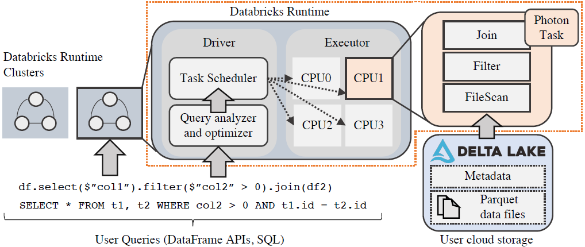
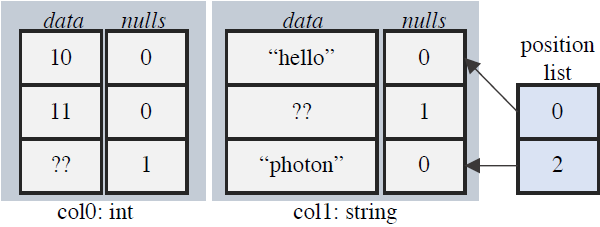
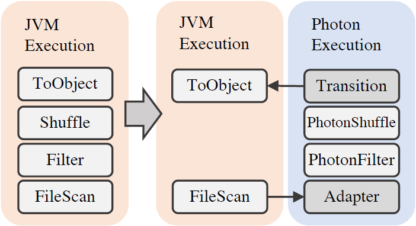
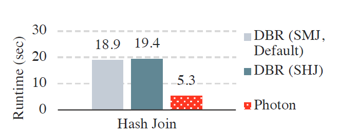
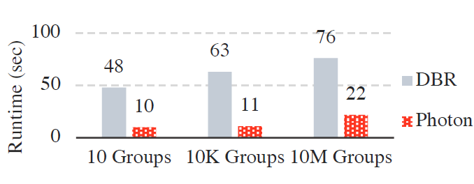
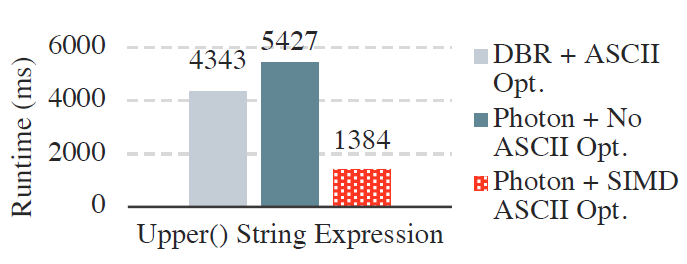
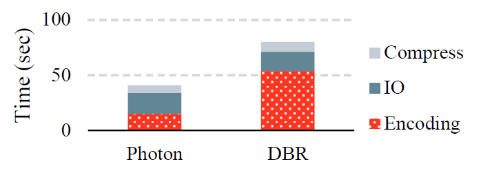
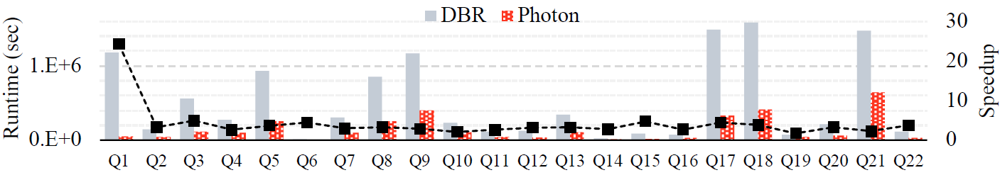
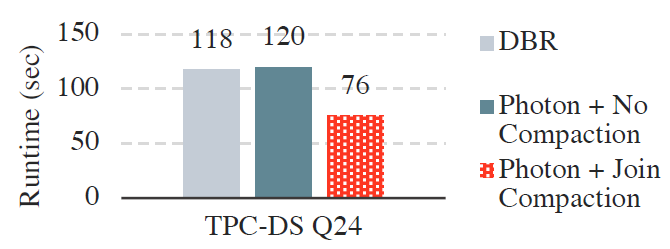

# Photon: A Fast Query Engine for Lakehouse Systems

**摘要**

许多组织正在转向一种称为 **Lakehouse** 的数据管理方式，即，**在非结构化数据湖之上实现结构化数据仓库的功能**。这给查询执行引擎带来了新的挑战。执行引擎需要在数据湖中普遍存在、未经管理的原始数据集上提供良好的性能，并在以流行的列式文件（如 Apache Parquet）存储的结构化数据上提供优异的性能。为了实现这些目标，本文介绍了 Databricks 开发的用于 **Lakehouse** 环境的向量化查询引擎 **Photon**。Photon 可以在 SQL 工作负载方面胜过现有的云数据仓库，但它实现了一个更通用的执行框架，可以高效地处理原始数据，并且 **Photon** 还支持 Apache Spark API。我们讨论了 Photon 中所做的设计选择（如，向量化与代码生成），并描述了它如何与 Apache Spark SQL Runtime、任务模型和内存管理器进行集成。**Photon** 将客户的一些工作负载的性能提高了10 倍以上，最近， Databricks 基于 **Photon** 在官方 100TB TPC-DS 基准测试中创造了新的性能记录。


## 1.  简介

如今，企业将绝大多数数据存储在可扩展的**弹性数据湖**中，例如 Amazon S3、Azure Data Lake Storage 和 Google 云存储。这些数据湖以开放的文件格式（例如 Apache Parquet 或 Delta Lake \[[4](#bookmark22)、[18](#_bookmark36)\]）保存原始的、通常都是未经整理的数据集；再通过各种引擎（如 Apache Spark 和 Presto [[49](#_bookmark67), [58](#_bookmark77)]）访问这些数据集，以运行各种从 SQL 到机器学习的工作负载。传统上，对于要求最苛刻的 SQL 工作负载，为了获得高性能、数据治理和并发性，企业还将其数据的精选子集移动到数据仓库中。然而，因为数仓中只有部分数据可用，这种两层体系结构复杂且昂贵；而且由于提取、转换和加载 (ETL) 过程中的问题，这些数据与原始数据可能不同步 [[19]](#_bookmark37)。

作为回应，许多组织正在转向名为 **Lakehouse **[[19](#_bookmark37)] 的数据管理结构，直接在数据湖上实现数据仓库功能，例如数据治理、ACID 事务和丰富的 SQL 支持。这种单层方法有望简化数据管理，因为用户将以统一的方式管理和查询所有数据，而且需要管理的 ETL 步骤和查询引擎更少。最近，Delta Lake [[18](#_bookmark36)] 等新存储层启用了数据仓库的许多管理功能 —— 如数据湖上的事务和时间旅行 —— 并提供了优化存储访问的实用工具：如 *data clustering* 和数据跳过索引。然而，最大限度地提高 Lakehouse 工作负载的性能不仅需要优化存储层，还需要优化查询处理。

本文介绍了 Photon，这是我们在 Databricks 为 Lakehouse 工作负载开发的一种新的向量化查询引擎，可以执行 SQL 或使用 Apache Spark DataFrame API [[20](#_bookmark38)]  编写的查询。Photon 已经执行了数百名客户的数千万次查询。有了 Photon，我们的客户观察到，和之前的 Databricks 运行时（基于Apache Spark 优化的引擎）相比，平均加速 3 倍，最大加速则超过 10 倍。Databricks 还在 2021 年 11 月在基于 Amazon S3 的 Lakehouse 系统上，凭借 Photon 使用 Delta Lake 格式，创造了 100 TB 的 TPC-DS 世界纪录，表明使用开放数据格式和商用云存储可以实现最先进的 SQL 性能。

设计 Photon 需要解决两个关键挑战。首先，与传统的数据仓库引擎不同，Photon 需要在**原始**、**未经处理的**数据上表现良好，这些数据可能包括高度不规则的数据集、糟糕的物理布局和大字段，所有这些都没有有用的聚类或数据统计。 其次，我们希望 Photon 支持现有的 Apache Spark DataFrame API，并在语义上与之兼容，该 API 广泛用于数据湖工作负载。这对于实现 Lakehouse 承诺的**单一查询引擎**、为组织的所有工作负载提供统一语义至关重要，但也带来了困难的工程和测试挑战。当然，面对这两个挑战，我们希望 Photon 尽可能快。本文描述了这两个挑战如何引导我们进行 Photon 的设计：一个用 C++ 编写的向量化引擎，它与 Apache Spark 的内存管理器之间有干净的接口，并且包括对原始、未经处理的数据的各种优化。

**挑战1：支持未经处理的原始数据**。与传统的 SQL 仓库相比，Lakehouse 环境对查询引擎提出了更大的挑战。一方面，对于 Lakehouse 中**干净的**表格数据集，用户非常注意通过设计带有约束、统计和索引的 **Schema** 来清理和组织数据，以提高读取性能。另一方面，未经处理的原始数据可能具有次优的数据布局，如小文件、多列、稀疏或大数据值，并且没有可用的<u>聚类</u>或统计数据，但许多用户也希望查询这样的数据。此外，字符串在原始数据中既方便又普遍，甚至可以表示整数和日期等数字数据。这些数据通常没有规范化，因此字符串列可能不会用 NULL，而是使用额外地占位符值来表示未知或缺失的值，并且通常不存在诸如**可空性**或字符串编码（例如ASCII与UTF-8）之类的模式信息。	

因此，Lakehouse 的执行引擎必须具有足够灵活的设计，以在任意未处理的数据上提供良好的性能，并在数据科学、ETL、即席 SQL 和 BI 等各种遵循了 Lakehouse 最佳实践的场景中提供出色的性能（此时，数据多维聚集 [[19](#_bookmark37)] 、有合理的文件大小和恰当的数据类型）。我们通过两个早期设计决策来应对这一挑战。

- **首先，我们选择使用向量化解释模型来构建执行引擎**，而不是代码生成，这与 Spark SQL 选择使用代码生成不同 [[20](#_bookmark38)]。向量化执行使得我们能够支持运行时得自适应性，其中 Photon 通过专门的代码路径发现、维护和利用微批量数据的特征，以适应 Lakehouse 数据集的属性，从而获得最佳性能。例如，对于很少有 NULL 值或主要是 ASCII 字符串数据的列，Photon 执行按批处理优化的代码。

  我们还观察到向量化方法的其他工程优势。虽然我们发现一些场景（例如，复杂的条件表达式），代码生成模型提供了更好的性能，但在对这两种方法进行原型设计，以及在其他引擎上的工作经验表明，向量化模型更容易构建、分析、调试和大规模操作。<u>这使我们能够在缩小两者之间的性能差距的特化上投入更多时间</u>。保留查询运算符等抽象边界也有助于收集丰富的指标，以帮助最终用户更好地理解查询行为。

- **其次，我们选择用原生语言（C++）实现 Photon**，而不是遵循使用 Java VM 的现有 Databricks 运行时引擎。做出这个决定的一个原因是，现有的基于 JVM 的引擎达到性能上限。切换到本机代码的另一个原因是内部即时编译器的限制（例如，方法大小），当 JVM 优化失败时会造成性能悬崖。最后，我们发现本机代码的性能通常比 JVM 引擎的性能更容易解释，<u>**因为内存管理和 SIMD 等方面都受到显式控制**</u>。原生引擎不仅提供了性能提升，还让我们能够更轻松地处理更大规模的记录和查询计划。

**挑战 2：支持现有的 Spark API。** 用户已经在其数据湖上运行各种应用程序，从 ETL 工作负载到机器学习等高级分析。 在 Databricks 平台上，这些工作负载利用 Apache Spark 的 API，混合使用经过 SQL 优化器的 DataFrame 或 SQL 代码，以及用户定义的代码（视为黑盒）。为了加速这些现有的工作负载，并确保 Databricks 上的 SQL 工作负载获得与 Spark 工作负载相同的语义，我们设计了 Photon 来集成 Spark 引擎，并支持 Spark 工作负载（混合使用 SQL 运算符和 UDF ）和纯 SQL 工作负载。这是一个挑战，因为 Photon 必须能够与用户定义的代码共享资源（就像Spark中发生的那样），并且必须匹配 Apache Spark 现有的基于 Java 的 SQL 引擎的语义。

为了应对这一挑战，Photon 与基于 Apache Spark 的 Databricks Runtime (DBR) 紧密集成。DBR 是 Apache Spark 的一个分支，它提供相同的 API，但包含对可靠性和性能的改进。Photon 作为一组新的物理运算符融入 DBR，查询优化器可以将其用于部分查询计划，并与 Spark 的内存管理器、监控和 I/O系统集成。通过在运算符级别与 DBR 集成，客户不经修改就可以继续运行其工作负载，以透明方式获得 Photon 的好处。查询可以部分在 Photon 中运行，对于不支持的操作，可以回退到 Spark SQL，同时不断添加 Photon 功能，以减少这些转换。这种部分推出 Photon 的能力为我们在现场使用 Photon 提供了宝贵的操作经验。Photon 还插入实时指标等功能，因此使用 Photon 的查询将像以前一样显示在Spark UI中。最后，我们严格测试 Photon，以确保其语义不会与 Spark SQL 不同，从而防止现有工作负载中出现意外的行为变化。

## 2.  背景

为了提供有关 Photon 如何融入 Lakehouse 产品系统的背景信息，本节将介绍 Databricks 的 Lakehouse 产品。

### 2.1 Databricks Lakehouse 架构

Databricks 的 Lakehouse 平台由四个主要组件组成：原始数据湖存储层、支持数据仓库式的事务和回滚等功能的自动数据管理层、用于执行<u>分析工作负载</u>的弹性执行层，以及客户与其数据交互的用户界面。

**数据湖存储**。Databricks的平台将数据计算与存储分离，允许客户选择自己低成本的存储提供商（如S3、ADL、GCS）。这种设计防止了客户数据锁定，并避免昂贵的迁移，因为客户可以用 Databricks 连接他们云存储中现有的大型数据集。Databricks 使用计算服务和数据湖之间的**连接器**访问客户数据。数据本身以开放的文件格式存储，如Apache Parquet。

**自动数据管理**。大多数 Databricks 客户已将其工作负载迁移到使用 Delta Lake [[18](#_bookmark36)]，这是对象存储上的开源 ACID 表存储层。Delta Lake 支持数仓风格的功能，例如 ACID 事务、时间旅行、审计日志记录，以及在表格数据集上快速执行元数据操作。Delta Lake 将其数据和元数据存储为 Parquet。

与 Delta Lake 相比，传统数仓以查询性能的名义将客户数据转换为专有格式 [[13](#_bookmark31), [21](#_bookmark39)]。使用 Delta Lake，我们发现通过正确的访问层，专有数据仓库中的许多存储优化也可以通过开放文件格式实现。Databricks 在 Delta Lake 格式之上实现了一些其他优化，例如<u>**自动数据聚类**</u>和<u>**缓存**</u>，以进一步提高性能，例如，通过<u>基于常见查询谓词对记录进行聚类</u>以实现数据跳过和减少 I/O [[18]](#_bookmark36)。

**弹性执行层。** 图 [1](#_bookmark0) 展示了 Databricks 的执行层。 该层实现了运行所有数据处理的**数据平面**。 执行层负责执行<u>内部查询</u>（例如，数据集自动聚集或者元数据访问）和<u>客户查询</u>（例如 ETL 作业、机器学习和 SQL）。在 Databricks，**执行层**每天读取和处理 EB 级的数据。 因此，该组件必须是可扩展的、可靠的、并提供出色的性能，以便为我们的客户降低成本并实现交互式数据分析。**Photon 通过在数据集的每个分区上，以单线程的方式执行查询来适应这个执行层**。

|    |
| ---- |
|  图 1：Databricks 的执行层。 Photon 作为 Databricks Runtime 的一部分运行，在公共云 VM 的分布式集群上执行查询。在这些集群中，Photon 在数据分区上以单线程的方式执行任务。    |

执行层使用 AWS、Azure 和 Google Cloud 上的云计算虚拟机。 Databricks 以**集群**为粒度管理这些虚拟机，包含一个集中的 **driver 节点**，用于协调执行，以及一个或多个 **executor 节点**，用于读取和处理数据。这些虚拟机运行一个处理用户查询的执行框架（Databricks Runtime），以及处理日志收集、访问控制等的管理软件。我们在 [2.2](#2.2 Databricks Runtime) 节中更详细地讨论 Databricks Runtime。

### 2.2 Databricks Runtime

Databricks Runtime (DBR) 是执行所有查询执行的组件（图 [1](#_bookmark0)）。它提供了 Apache Spark 的所有 API，但在开源代码库之上包含多项性能和健壮性的改进。Photon 位于 DBR 的最底层，在 DBR share-nothing 的多线程执行模型中，以单线程的方式执行任务。

提交给 DBR 的应用程序称为**作业**，每个作业分为几个 **Stage**。**Stage** 表示作业的一部分，它读取一个或多个文件或进行数据交换，并以数据交换或结果作为输出结束。**Stage** 本身被分解为单独的**任务**，这些**任务**在不同的数据分区上执行相同的代码。DBR中的 **Stage** 的边界是阻塞的，即前一个 **Stage** 结束后，下一个 **Stage** 才开始。因此，可以通过 **Stage**  重执行来实现容错，或者在 **Stage**  的边界重新规划查询以实现自适应执行。

DBR 使用单个 **driver** 节点进行调度、查询优化和其他集中任务。driver 节点管理一个或多个 executor 节点，每个 executor 节点都运行一个 task 执行进程，对数据进行扫描、处理并产生结果。 该进程是多线程的，包含一个**任务调度器**和一个**线程池**，用于并行 driver  提交的独立任务。

SQL 查询与所有其他查询共享相同的执行框架，可以构成一个或多个作业。例如，文件元数据查询和 SQL 子查询都可以在同一个整体查询中作为单独的作业执行。driver 负责将 SQL 文本或使用 Apache Spark 的 DataFrame API 构建的DataFrame 对象转换为查询计划。

查询计划是对应到 **Stage** 列表的 SQL 运算符树（例如，`Filter`、`Project`、`Shuffle`）。查询优化完成后，driver 启动任务来执行查询的每个 Stage。每个任务运行都使用<u>**内存中的执行引擎**</u>来处理数据。 Photon 就是这种执行引擎的一个例子。 它取代了以前基于 Apache Spark SQL 的引擎。

### 2.3 端到端SQL查询执行示例

考虑[清单 1](#_bookmark2) 中的 SQL 查询，用户将其提交给 Databricks 的。 该查询针对两个逻辑表 `customer` 和 `orders` 执行，两个表都是 Delta 文件格式，通过用户的云帐户来访问。

```SQL
-- Listing 1: An example SQL query. This query can benefit from both storage optimizations such as file clustering, as well as runtime engine optimizations that Photon provides, such as SIMD vectorized execution.

SELECT
  upper(c_name), sum(o_price)
FROM
  customer, orders
WHERE
   o_shipdate > '2021-01-01' AND
   customer.c_age > 25 AND
   customer.c_orderid = orders.o_orderid
GROUP BY
  c_name
```

Databricks 服务将首先将查询路由到集群的 driver 节点。driver 负责创建查询计划，包括逻辑优化（例如运算符重排序）和物理优化（例如选择连接策略）。对于示例查询，应用了几种优化：如果 `orders` 表按日期分区，我们可以修剪分区以避免扫描不必要的数据。如果数据是聚集的，并且已知某些文件不匹配 age 上的谓词，则可以跳过这些文件。Databricks 通过提供 Hilbert 聚类 [[32](#_bookmark49)] 等功能，在其 Lakehouse 中支持这两种优化。Delta 格式还使元数据操作更加快速，例如快速列出<u>表的最新的快照文件</u> [[18]](#_bookmark36)。


一旦 driver 选择了要扫描的文件并完成物理查询计划，driver 就会通过 Apache Spark RDD API 将查询计划转换为可执行代码，并将序列化的代码发送到每个 executor  节点。executor 将此代码作为输入数据分区上的任务运行。这些任务从用户的云存储（或者如果用户以前对该表执行过查询，则从本地 SSD 缓存）获取数据，然后计算其余的查询运算符。

## 3.  执行引擎设计决策

本节首先概述 Photon 的结构。 然后，深入研究查询引擎中的主要设计决策。

### 3.1 概述

Photon 是一个原生（即用 C++ 实现）的执行引擎，它被编译成一个共享库，并从 DBR 调用。Photon 作为 DBR 中单线程任务的一部分在 executor 的 JVM 进程中运行。与 DBR 一样，Photon 将SQL查询构造为运算符树，其中每个运算符使用 `HasNext()`/`GetNext()` API从其子节点中提取批量数据。该 API 还用于使用 Java 原生接口 [[8](#bookmark26)] 从在 Java 中实现的运算符中提取数据。同样，Photon 之上的运算符可以使用相同的 API 从 Photon 中提取数据。Photon 也不同于 Java 运算符，因为它处理列式数据，并使用**解释向量化**而不是**代码生成**来实现其运算符：这些差异意味着 Photon 和 Java 运算符期望的内存数据布局可能不同。在本节的其余部分，我们将更详细地介绍现有引擎和新引擎之间的这些差异。

### 3.2 JVM 与原生执行

早期的设计选择是远离 JVM，在**原生代码**中实现新的执行引擎。 这是一个重要决定，因为现有的 Databricks Runtime 基于 JVM ，所以转向原生引擎，并与运行时的其余部分集成是一项具有挑战性的工作。

决定放弃基于 JVM 的引擎的原因在于我们的工作负载越来越受 CPU 限制，并且提高现有引擎的性能变得越来越困难。 有几个因素促成了这一点。**首先**，本地 NVMe SSD 缓存 [[38](#_bookmark56)] 和自动优化 shuffle [[55](#_bookmark74)] 等低级优化显著降低了 IO 延迟。**其次**，Delta Lake 支持的数据聚类等技术允许查询通过文件修剪 [[32](#_bookmark49)] 更积极地跳过不需要的数据，进一步减少 IO 等待时间。**最后**，Lakehouse 引入了新的工作负载，这些工作负载需要对非规范化数据、大字符串和非结构化嵌套数据类型进行大量数据处理：这进一步强调了内存中的数据处理性能。

如此优化后的结果是，基于 JVM 的执行引擎在内存中执行时越来越成为瓶颈，但要从中挤出更多性能，需要深入了解 JVM 内部结构，以确保 JIT 编译器生成最佳代码（例如，使用 SIMD 指令的循环）。有趣的是，唯一定期更新生成的 Java 代码的工程师是过去从事 JVM 内部工作的工程师。此外我们还发现，缺乏对较低级别优化（如内存流水线和自定义 SIMD 内核）的控制，也导致了现有引擎的性能上限。我们还发现，我们也开始在生产中的查询中遇到 JVM 的性能悬崖。例如，我们观察到，垃圾收集性能在大于 64GB 的堆上受到严重影响（考虑到现代云实例的内存大小，这个限制相对较小）。这就要求我们甚至在基于 JVM 的执行引擎中手动管理堆外内存，导致与用原生语言编写的代码相比，编写或维护代码并不一定更容易。同样，现有执行引擎执行生成的 Java 代码 [[54](#_bookmark73)] 受到生成方法大小或代码缓存大小的限制，需要回退到更慢的 Volcano 解释风格 [[31](#bookmark50)] 的代码路径。**对于宽表（例如，100 列，在 Lakehouse 中很常见），我们在生产部署中经常达到这个限制**。总之，在评估了避开 JVM 性能上限和可伸缩性限制所需的工作量之后，我们选择实现原生查询执行引擎。

### 3.3  解释向量化与代码生成

现代高性能查询引擎主要遵循两种设计之一：一种是像 MonetDB/X100 系统 [[23](#_bookmark41)] 中的**解释向量化**，或类似Spark SQL、HyPer [[41](#_bookmark59)] 或 Apache Impala [[3](#bookmark21)] 使用的**代码生成**。简而言之，解释向量化引擎使用动态调度机制（例如，虚函数调用）来选择要为给定输入执行的代码，但批量处理数据，以分摊虚函数调用开销，启用 SIMD 向量化，并更好地利用 CPU 管道和内存层次结构。代码生成系统在运行时使用编译器生成专门用于查询的代码，从而消除了虚函数调用。

在对原生引擎进行原型设计时，我们尝试了上述两种方法的原生实现，使用 Weld [[45](#_bookmark63)] 作为代码生成方法的起点。最后，出于技术和实际原因，我们选择继续使用向量化方法，如下所述。

**更容易开发和扩展**。代码生成方法的一个早期观察结果是，它更难构建和调试。由于引擎在运行时生成执行代码，因此我们需要手动注入代码，以便更轻松地查找问题。此外我们发现，如果不手动添加工具，现有工具（例如调试器、堆栈跟踪工具等）很难使用。相比之下，解释的方法**只是C++**，现有的工具都是为其量身定做的。在解释引擎中，打印调试等技术也容易得多。

有趣的是，我们发现在更大系统的上下文中，使用代码生成运行时的大部分工作都是围绕添加工具和可观察性，而不是构建编译器。例如，在比较这两种方法之前，Weld 有一些性能问题需要解决，但是如果没有 perf 之类的工具，很难调试这些问题。一件轶事，我们的工程师花了两个月的时间用代码生成引擎完成聚合原型，用向量化引擎完成聚合原型则只用了几周。

**观察更容易**。代码生成通常通过将运算符折叠和内联到少量流水线函数中来消除解释和函数调用开销。虽然这对性能很有好处，但它使观察变得困难。例如，考虑到运算符代码可能会被融合到一次一行的处理循环中，有效地报告每个查询运算符内花费了多少时间的度量是一个挑战。向量化方法维护了算子之间的抽象边界，并通过一次处理一批数据来分摊开销：因此，每个算子都可以维护自己的一组度量。这在将引擎部署给客户后特别有用，因为这些指标是调试客户工作负载中性能问题的主要接口，==此时，引擎开发人员可能无法共享或直接执行查询==。

**更容易适应不断变化的数据**。正如我们在 [§4.6,](#adaptive-execution) 中所讨论的，Photon 可以通过在运行时选择代码路径，来适应<u>==批处理级别的属性==</u>。这在 Lakehouse 环境中尤为重要，因为传统的约束和统计数据可能不适用于所有类别的查询。解释向量化的执行模型使自适应变得更加容易，因为动态调度已经是引擎的基础。为了在代码生成引擎中实现同样的效果，我们必须在运行时编译数量惊人的分支，或者动态地重新编译部分查询，这会影响查询执行时间、内存使用等。虽然这当然是可能的，但会导致额外的编译时间和启动开销。事实上，即使是当今代码生成引擎的基准 HyPer [[41](#_bookmark59)]，也包括一个解释器来规避某些场景下的这些成本。

**专业化仍然是可能的**。代码生成在某些场景下具有明显的性能优势。例如，复杂的表达式树可以使用经典的编译器优化来简化，如公共子表达式消除，未使用的列引用可以通过**<u>死存储消除</u>**自动修剪，由于元组的处理没有解释开销，所以稀疏数据的批处理等问题也不是问题。

尽管代码生成有这些优势，但我们发现在许多情况下，通过为最常见的场景创建专门的融合运算符，从而使想量化引擎获得类似的好处。例如，我们观察到计算 `col \>= left` 和 `col \<= right` 的 `between` 表达式在我们客户的查询中很常见，但如果表示为**<u>连词</u>**（两个谓词的与），可能会导致较高解释开销。因此，我们为它创建了一个特殊的融合算子。总的来说，我们认为复杂度的权衡让我们能够将工程时间转移到这类专业化上，这让我们在许多情况下缩小了两种模型之间的性能差距。

### 3.4 面向行与面向列的执行

我们做出的第三个设计选择是在 Photon 中默认使用**列式**内存数据表示，而不是采用 Spark SQL 面向行的数据表示。在列表示法中，特定列的值连续存储在内存中，通过访问每列中的特定元素来逻辑组装一行。

以前的工作[[35](#_bookmark53)，[51](#_bookmark69)]详细介绍了列执行的优点。总而言之，列式布局更适合 SIMD，通过将运算符实现为紧密循环来实现更高效的数据流水线和预取，并且可以为 shuffle 和溢出带来更高效的数据序列化。Lakehouse 环境中的另一个优势是，我们的执行引擎主要使用列文件格式（例如 Parquet）：

因此，列式表示可以在扫描数据时跳过可能昂贵的列到行的旋转步骤。此外，我们可以维护字典以减少内存使用，这对于字符串和其他可变长度数据（同样，在我们的 Lakehouse 设置中很常见）尤其重要。最后，使用列式引擎编写列式数据也更容易。

实际在某些情况下， Photon 会将列旋转到行。<u>例如，我们通常将数据结构（如哈希表）中的数据缓冲为行，因为在哈希表探测期间执行 Key 比较等操作时，将数据存储为列需要昂贵的随机访问</u>。

### 3.5 部分推出（增量部署）

最后的一个设计决策是支持新执行引擎的**部分推出**。这意味着新引擎不仅需要与执行框架（即任务调度、内存管理等）集成，还需要与现有的SQL引擎集成。

这个决定完全是出于实际原因。现有的 SQL引擎基于开源 Apache Spark，是一个不断变化的引擎。开源社区积极贡献改进、功能和错误修复。 例如，2021 年 7 月，开源 Spark 项目有 321 次提交，其中 47% 是对 SQL packge 的提交。因此，构建一个支持现有执行引擎**所有功能**的新执行引擎是不可能的。这样做的结果是，可以在新引擎中**执行部分查询**，然后优雅地回退到旧引擎，以获得目前为止不支持的功能。

接下来的两节描述了我们如何实现本节概述的设计决策。 [§4](#4  Photon 中的向量化执行) 更详细地描述了我们的原生、向量化、面向列的执行引擎 Photon。 [§5](#5 与 DATABRICKS Runtime 的集成) 讨论了将 Photon 与我们现有基于 JVM 框架的执行引擎集成的具体挑战，以及我们如何实现**部分推出**。

## 4  Photon 中的向量化执行

在本节中，我们将描述 Photon 的向量化列执行引擎的实现。

### 4.1  分批的列数据布局

Photon 以列数据格式表示数据，其中每列值连续存储在内存中。 列组（逻辑上形成一组行）被分割并分批处理，以限制内存使用并利用缓存局部性。

因此， Photon 中的基本数据单位是包含一组值单列，称为**列向量**。除了值的连续缓冲区外，列向量还包含一个字节向量，以指示每个值是否为 `NULL` 。列向量还可以保存批处理级别的元数据，例如字符串编码。

**列批**是列向量的集合，表示行， 图 [2](#_bookmark3))。 除了为行中的每一列保存一个列向量外，**列批**还包含一个**位置列表**数据结构，它存储列批中**活动行**的索引（即该由表达式、运算符等考虑，尚未被过滤掉的行）。访问列批处理中的一行需要通过位置列表进行间接访问，如清单 [2](#_bookmark5) 所示。


|     |
| :--: |
| 图2：Photon 中的列批。这个列批用元组（10，"hello"）和（null，"photon"）表示 Schema {int, string}。非活动行索引中的数据可能仍然有效。 |

将行指定为活动与非活动的另一种可能设计是字节向量。 这种设计更适合 SIMD，但即使在稀疏批次中也需要迭代所有行。我们的实验表明，除了最简单的查询之外，大多数情况下，这会导致所有查询的整体性能变差，因为循环必须迭代 `O(batch size)` 个元素而不是 `O(active rows)`个元素。最近的工作证实了我们的结论 [ [42]](#_bookmark60)。

Photon 中的数据以列批的粒度流经运算符（例如，`Project`、`Filter`）。每个算子从其子节点接收一个列批并产生一个或多个输出列批。

### 4.2 向量化执行内核

Photon 的列式执行是围绕**执行内核**的概念构建的，这些执行内核是在一个或多个数据向量上执行高度优化循环的函数。这个想法最早在 X100 系统 [[23](#_bookmark41)] 中提出。数据平面上的几乎所有操作都是作为内核实现的。例如，表达式、哈希表探测、数据 shuffle 的序列化和运行时统计计算都是在底层作为内核实现。这些内核有时可以使用手工编码的 SIMD 内部函数，但我们通常依靠编译器来自动向量化内核（并在输入端提供诸如 RESTRICT 注释 [[1](#bookmark20)] 等提示，以帮助自动向量化）。内核使用 C++ 模板针对不同的输入类型进行专门化。

Photon 在向量粒度上调用运算符和表达式。内核都以**列向量**和**列批处理位置列表**作为输入，并产生一个列向量作为输出。运算符之间传递向量给其他运算符，直到最终从 Photon 传递出去供外部使用(例如，Spark)。清单[2](#_bookmark5)显示了一个示例内核，用于计算一个值的平方根。

### 4.3 过滤器和条件执行

Photon 中的过滤器是通过修改列批的位置列表来实现。 过滤表达式将列向量作为输入，并返回一个位置列表（它是输入位置列表的子集）作为输出。==为了实现 `CASE WHEN` 这样的条件表达式，我们修改位置列表，以便在写入同一输出向量时，在内核调用中为每个 case  **打开**一些行==。请注意，这意味着不允许修改非活动行（例如，为了使用 SIMD），因为非活动行位置可能仍然包含有效数据。

### 4.4 向量化哈希表

与标准的 **scalar-access** 哈希表不同，Photon 的哈希表是为向量化访问而优化的。哈希表的查找分三步进行。<u>首先</u>，使用 hash 内核在一批 key 上计算哈希函数。<u>接下来</u>，探测内核使用哈希值加载指向哈希表记录的指针（散列表中的记录存储为行，因此单个指针可以表示复合键）。<u>最后</u>，将哈希表中的记录逐列与查找 Key 进行比较，并为不匹配的行生成位置列表。根据探测策略（我们使用二次探测），不匹配的行通过==推进==它的桶索引来继续探测哈希表。

每一步都得益于向量化执行。哈希值和 Key 的比较得益于 SIMD。由于探测步骤会发出随机内存访问，因此它也受益于向量化。独立的数据加载在内核代码中彼此接近，因此可以由硬件并行。请注意，其他设计可能能够通过软件预取实现类似的效果，但根据我们的经验，手动预取很难调整，并且往往会对不同的硬件进行不同的优化配置。

### 4.5 向量化内存管理

在任何执行引擎中，内存管理都是一个重要的考虑因素。为了防止昂贵的操作系统级分配， Photon 使用内部缓冲池为**临时的列批**分配内存，释放分配的内存时，缓冲池并不将它们及时返回给操作系统，而是缓存起来，并用**最近使用的机制**分配内存。这等价于为每个输入批次重复分配<u>刚刚使用过的热内存</u>。由于查询运算符在执行期间是固定的，因此端到端处理没个批次所需的内存分配数是固定的。

单独管理可变长度数据（例如字符串缓冲区），使用一个 append-only 的池，在处理每个新批之前释放该池。该池使用的内存由全局内存跟踪器跟踪，因此理论上，引擎可以在遇到无法容纳的大字符串时调整批的大小。

使用**外部内存管理器**单独跟踪超过任何**单个批次的大型持久分配**（例如，用于聚合或 Join）。 我们在 [§5](#integration-with-databricks-runtime) 中更详细地讨论了这些分配。我们发现细粒度的内存分配很有价值，因为与 Spark SQL 引擎不同，我们可以更稳健地处理 Lakehouse 配置中经常出现的大型输入记录。

### 4.6 自适应执行

Lakehouse 环境文中的一个主要挑战是缺少统计信息、元数据或查询输入的规范化。虽然有些表有统计数据可供优化器决策，但其他表没有 Schema 之外的信息。此外，NULL 数据很常见，对字符串进行操作和规范化的表达式也经常出现。因此，执行引擎需要高效执行含有此类数据的查询。为了解决这个问题，我们的引擎支持批级的自适应执行。简而言之， Photon 可以在运行时构建关于一批数据的元数据，并使用它来优化其执行内核的选择。

Photon 中的每个执行内核至少可以适应两个变量：批中是否有空值，以及批中是否有非活动行。由于缺少空值， Photon 可以移除分支，从而提高性能。类似地，如果批中没有非活动行， Photon 可以避免通过位置列表进行间接查找，从而再次提高性能并启用 SIMD。清单 2 显示了这些专门化的一个示例。 

Photon 根据具体情况<u>专门研究其他几种内核</u>。例如，如果字符串都是 ASCII 编码的（与通用UTF-8相反），则可以使用优化的代码路径执行许多字符串表达式。因此， Photon 可以在列向量中计算和存储有关 ASCII 属性的元数据，并使用此信息在运行时选择正确的内核。另一个例子是 Photon 可以有选择地 **compact** 运行时稀疏的批，以提高性能。这在使用向量化 API 探测大型哈希表时特别有效，因为密集批的处理可以通过并行地从哈希表发出加载指令来更好地利用内存并行性；另一方面，稀疏批的处理会导致高内存延迟，而不会使内存带宽饱和。

<a id="_bookmark5"></a>

```c++
// Listing 2: A Photon kernel that is specialized on the presence of NULLs and inactive rows. Branches over compiletime constant template parameters are optimized away.
template <bool kHasNulls, bool kAllRowsActive>
void SquareRootKernel(const int16_t* RESTRICT pos_list,
                      int num_rows, const double* RESTRICT input,
                      const int8_t* RESTRICT nulls, double* RESTRICT result) {
    for (int i = 0; i < num_rows; i++) {
        // branch compiles away since condition is
        // compile-time constant.
        int row_idx = kAllRowsActive ? i : pos_list[i];
        if (!kHasNulls || !nulls[row_idx]) { 
            result[row_idx] = sqrt(input[row_idx]);
        }
    }
}
```

我们还探索了其他场景中的自适应性，例如，通过在运行时在用户数据中查找模式来进行自适应 shuffle 编码。例如，我们发现许多用户将唯一标识符编码为36个字符串，而不是（等效的）128位整数。我们还观察到编码为字符串的数字数据（例如整数），可以使用二进制格式更高效地序列化。

## 5 与 DATABRICKS Runtime 的集成

Photon 与 Databricks Runtime (DBR) 集成。 与传统数据仓库不同，Photon 与所有其他在 DBR 和 Lakehouse 存储架构执行的工作负载共享资源，从机器学习模型的数据清理到 ETL。 此外，Photon 与旧的基于 Spark SQL 的执行引擎共存，用于新引擎执行查询中还有尚未支持的运算符。由于这些原因，Photon 必须与 DBR 的查询优化器和内存管理器紧密集成。

### 5.1  将 Spark 计划转换为 Photon 计划

为了与传统的 Spark SQL 的引擎集成，我们将使用传统引擎执行的物理计划转换为使用 Photon 执行的物理计划。通过为 Spark SQL 的可扩展优化器 Catalyst [[20](#_bookmark38)] 增加新规则来完成这种转换。Catalyst 规则由<u>用于查询计划的模式匹配语句</u>和<u>相应替换的列表</u>组成。如果查询节点匹配上模式，则替换该查询节点为相应的 Photon 节点。 图 [3](#figure-3-a-spark-sql-plan-converted-to-a-photon-plan) 显示了一个示例。

|   |
| :--: |
| 图3：Spark SQL 计划转换为 Photon 计划。 |

转换规则如下。首先，我们从文件扫描节点开始，自下而上遍历输入查询计划，并将每个支持的旧引擎节点射到一个 Photon 节点。当我们看到 Photon 不支持的节点时，我们会插入一个**转换节点**，该节点将 Photon 的列式格式转换为传统引擎使用的行格式。我们不在计划的中间插入转换节点，以避免过多的列到行的转换。我们还在文件扫描和第一个 Photon 节点之间添加了一个**适配器**节点：将传统的扫描输入转换为 Photon 的列式输入，但由于扫描生成列式数据，因此是零拷贝。

### 5.2 执行 Photon 计划

查询优化之后，DBR 启动任务以执行计划的各个 Stage。在有 Photon 的任务中，Photon 执行节点首先将计划的 Photon 部分序列化为 Protobuf [[6](#_bookmark23)] 的 `Message`，通过 Java 本地接口 (JNI) [[8](#bookmark26)] 传递到 Photon C++ 库，后者将 Protobuf 反序列化并将其转换为 Photon 内部计划。在内部，Photon 中的执行计划看起来与它的 DBR 对应物相似：每个运算符都是一个具有 `HasNext()`/`GetNext()` 接口的节点，并且由父节点从子节点中拉取数据（以列批的粒度）。**请注意，Photon 在 JVM 进程中运行，并使用 JNI 与 Java 运行时通信**。

对于以**数据交换**结束的计划，Photon 会编写一个符合 Spark shuffle 协议的 shuffle 文件，并将有关 shuffle 文件的元数据传递给 Spark。 然后 Spark 使用此元数据执行 shuffle，一个新的 Photon 任务（在新 Stage）从 shuffle 中读取相关分区。<u>由于我们使用了与 Spark 格式不兼容的自定义的数据序列化格式，因此 Photon shuffle 写入必须伴随着 Photon shuffle 读取</u>。

**用于读取扫描数据的适配器节点**。 Photon 计划中的叶节点始终是**适配器**节点。 Photon 适配器节点的工作原理是获取 Spark 扫描节点生成的列式数据，并将指向该数据的指针传递给 Photon 。Photon 中，适配器节点的 `GetNext()` <u>方法进行 C++ 到 Java 的 JNI 调用</u>，将本机指针列表传递给 JVM。每列传递两个指针：一个表示列值的向量，另一个表示每列是否为 NULL 值。在 Java 端，扫描节点直接生成列数据，通过 Spark 中开源的 `OffHeapColumnVector` [[9](#_bookmark27)] 类存储在堆外内存中。与 Photon 一样，此类将值作为==<u>原语背靠背</u>==存储在堆外内存中，并将 NULL 存储为堆外字节数组（每个值一个字节）。因此，适配器节点只需要获取 Photon 提供的指针，并将它们指向堆外列向量内存，而无需复制。一次 JNI 调用一批扫描数据。在我们的测量中，JNI 调用的开销与 C++ 虚函数调用开销相当（每次调用大约 23ns）。

**将 Photon 数据传递给 Spark 的转换节点**。Photon 计划中的最后一个节点是**转换**节点。与适配器节点不同，转换节点必须将列数据转换为行数据，以便传统的行式 Spark SQL 引擎可以对其进行操作。由于 Apache Spark 的 Scan 节点在读取列格式时总是生成列数据，因此我们注意到，**即使没有 Photon**，也需要这样一个**转换**节点。由于我们只从 Scan 节点开始将执行计划转换为 Photon ，因此在 Photon 计划的顶部添加一个转换节点不会导致性能回退（Spark 计划和 Photon 计划都有一个转换节点）。然而，如果我们急切地将计划的任意部分转换为 Photon ，则可能会有任意数量的转换节点，这可能会导致性能回退。今天，我们选择保守，选择不这样做。将来，我们可能会研究如何在 Photon 提供的加速与增加列到行转换导致的减速之间做取舍。

### 5.3  统一内存管理

Photon 和 Apache Spark 共享同一个集群，因此必须有一致的内存和磁盘使用视图，以避免被操作系统或 JVM 杀死。==所以，Photon 连接到 Apache Spark 的内存管理器中==。

为了解决这个问题，我们将内存**保留**的概念与 Photon 中的**分配**分开。内存保留要求 Spark 的统一内存管理器提供内存。与所有对内存管理器的请求一样，这可能会导致 **Spill**，Spark 要求某些内存使用者释放内存以满足新请求。**Photon 连接到这个内存使用 API**，~~因此 Spark 可以请求 Photon 代表正在执行的其他消耗内存的运算符溢出数据~~（例如，Spark 中的排序任务可能会请求 Photon 运算符溢出）。类似地，Photon 可以进行保留，导致其他 Spark 运算符溢出，或导致 Photon 本身溢出（导致**递归溢出**，其中一个 Photon 运算符代表另一个 Photon  运算符溢出内存）。这与许多其他数据库引擎略有不同，在这些引擎中，运算符拥有固定的内存预算，并且只能**自溢出**。溢出是动态的，因为我们通常不知道一个运算符将消耗多少数据，特别是如果 SQL 运算符与也保留内存的用户自定义代码共存时。

我们使用与开源 Apache Spark 相同的策略来确定要溢出的运算符。 总而言之，如果我们需要溢出 **𝑁** 字节以满足内存预留请求，我们将内存使用者的分配的内存从最少到最多进行排序，并溢出至少拥有 **𝑁** 字节的第一个使用者。这背后的基本原理是我们尽量减少溢出的数量，并避免溢出不必要的数据。

保留内存后，Photon 可以安全地分配内存而不会溢出。分配纯粹在 Photon 内部发生：Spark 只考虑 Photon 要求的内存。在诸如 hash join 和分组聚合之类的溢出运算符中，输入批次的处理因此分为两个阶段：保留阶段，为新输入批次获取内存并处理溢出；分配阶段，由于不可能发生溢出，因此可以处理瞬态数据。这种灵活的溢出机制在 Lakehouse  环境中非常关键，因为查询经常超过可用内存。

### 5.4 堆外和堆内内存
DBR 和 Apache Spark 都支持从内存管理器请求堆外和堆上内存。为了管理堆外内存，Spark 集群为每个节点配置了一个静态的 **off-heap size**，内存管理器==<u>负责从这个分配中分发内存</u>==。每个内存消费者都有责任只使用分配的内存；过度使用可能会导致 OOM，从而被操作系统杀死。

不幸的是，仅仅提供内存并不足以稳定运行。JVM 通常在检测到堆内内存使用率较高时执行垃圾收集。然而，Photon 使用的大部分内存都是堆外的，所以垃圾收集很少发生。如果 Photon 的部分查询依赖于堆内内存，这就有问题了。一个例子是 **broadcasts**。 Photon 使用 Spark 内置的广播机制与集群中的每个节点共享数据（例如，用于广播 hash join）。

**广播机制是用 Java 实现的，需要从堆外 Photon 内存复制到堆内 Spark 内存**。但是，这种临时内存不会经常被垃圾收集，如果其他一些 Spark 代码尝试进行大量分配，可能会导致 Java `OutOfMemory` 错误。我们通过添加一个 **listener**，在查询结束后清除 Photon 的特定状态来解决这个问题：这将 Photon 状态与查询的生命周期，而不是 GC 的分代联系起来。

### 5.5 与其他 SQL 功能的交互

Photon 意味着改变了 DBR 的查询计划。尽管如此，DBR 和 Apache Spark 中的许多<u>**重要性能特性**</u>都与 Photon 兼容。例如 Photon 可以参与自适应查询执行 [[29](#_bookmark47)]，此时，运行时的统计信息用于运行时在 **Stage** 的边界重新分区和重新规划查询。Photon 的运算符实现了为此类决策导出统计信息所需的接口（例如，shuffle 文件大小和 stage 结束时的输出行数）。类似，Photon 可以利用诸如 **shuffle/exchange/subquery 重用**和**动态文件裁剪**等优化，这些可以实现高效的数据跳过，在 Lakehouse 环境中尤其重要。最后，Photon 还支持与 Spark 的指标系统集成，在查询执行期间，可以在 Spark UI 中显示实时指标。

### 5.6 确保语义一致性

我们面临的另一个有趣的挑战是确保 Photon 的**行为**与 Apache Spark 的相同。这是因为相同的查询表达式可以在 Photon 或 Spark 中运行，具体取决于查询的其他部分是否能够在 Photon 中运行，并且结果必须一致。例如，Java 和 C++ 以不同的方式实现整数到浮点的强制转换，这在某些情况下可能会导致不同的结果。作为另一个示例，许多基于时间的表达式依赖于 IANA 时区数据库 [[14](#_bookmark32)]。 JVM 附带此数据库的特定版本，如果 Photon 使用不同的版本，许多基于时间的表达式将返回不同的结果。为了对照 Spark 检查结果，使用了三种测试：**(1) 单元测试**：明确列举测试用例，例如 SQL 表达式；**(2) 端到端测试**：和 Spark SQL 的查询结果相比较；以及**(3) 模糊测试**：随机生成输入数据并将结果与 Spark 进行比较。我们将在下面逐一讨论。

**单元测试**。我们使用两种单元测试。在本机代码中，我们为 SQL 表达式（例如，`upper()`、`sqrt()` 等）构建了一个单元测试框架，允许为表中的任何表达式指定输入和输出值：然后该框架将表加载到列向量中，对所有可用的**特化**（例如，没有 NULL、有 NULL、没有非活动行等）计算表达式，并将结果与预期输出进行比较。==<u>这还可以确保不活动的行不会被错误地覆盖</u>==。

我们还和 Spark 现有<u>开源的表达式单元测试框架</u>集成。这些测试与函数注册表挂钩，它确定 Photon 是否支持该测试用例。如果是，我们为单元测试编译一个查询（例如，`SELECT expression(inputs) FROM in_memory_table`），并针对 Spark 和 Photon 执行它，然后比较结果。这为我们提供了由开源社区和 Databricks 贡献的、完整的单元测试覆盖率。

**端到端测试**。端到端测试通过分别向 Spark 和 Photon 提交查询并比较结果来测试查询运算符。我们有一套专门在启用 Photon 时执行的测试（例如，测试内存不足行为或特定于 Photon 的计划转换），但我们也在全套 Spark SQL 测试中启用 Photon 以增加覆盖率。我们通过这种方式发现了几个**意外**错误，例如，在 Spark 中启用堆外内存并从文件扫描中生成不兼容或损坏的数据而导致的内存错误。

**模糊测试**。兼容性测试的最后一个来源是模糊测试，我们测试针对 Spark 和 Photon 的随机查询。 我们的模糊测试包括一个完全通用的随机数和查询生成器，以及针对特定特征的==<u>外科模糊器</u>==。

Photon 的十进制（`Decimal`）实现，有一个专门的模糊测试器。Photon 的十进制实现在行为上与 Spark 不同，因为它可以对不同类型的输入进行操作以提高性能（相反，Spark 总是首先<u>将其十进制输入转换为输出类型</u>，这会导致性能更差）。这种差异导致一些不可避免的行为差异，我们的模糊测试器使用**行为白名单**来检查这些差异。

## 6 实验评估

在本节中，我们通过实验证明 Photon 在 DBR 上的加速。 特别地，我们试图回答以下问题：

1. 哪些查询从 Photon 中受益最多？
2. 与我们现有的引擎相比，Photon 的端到端性能如何？
3. 技术性优化（如适应性）的影响是什么?

### 6. 1 哪些查询将受益于 Photon？

Photon 主要提高了查询的性能，这些查询将大量时间花在 CPU 密集型操作上，如 Join、聚合和 SQL 表达式求值。使用这些操作的查询受 Photon 与 DBR 之间的差异影响最大：原生代码、列式、向量化执行和运行时自适应性。Photon 还可以通过加快这些运算符在内存中的执行速度，或在网络上传输数据时使用更好的编码格式，为其他运算符（如数据交换和写入）提供加速。我们不希望 Photon 能显著提高受 IO 或网络限制查询的性能。

我们首先在微基准上比较了 Photon 和 DBR，我们希望 Photon 能从中受益：Join、聚合、表达式计算和 Parquet 写入。然后，我们展示这些改进如何转化为 TPC-H 上端到端查询的性能提升。

**微基准配置**。我们在单个 i3.2xlarge Amazon EC2 实例上运行微基准测试，其中 11GB 内存用于 JVM，35GB 堆外内存用于 Photon^1^。 在单个线程上运行基准测试。从内存表中读取数据，==<u>以隔离 Photon 执行改进的影响</u>==。

**Hash Join**。为了测试 Join 的基准性能，我们比较了 Spark 的 sort merge join 和 hash join 与 Photon 的 hash join^2^。人工创建了两张表，每张表包含 1GB 的整数数据，并对整数列执行内部等值 Join。

> 1. 这是启用 Photon 的集群中，默认的实例类型配置。
> 2. Photon 不支持 sort-merge join，但 Spark 默认使用它，因为 Spark 的 shuffled hash join 不支持溢出。

图 [4](#section-1) 显示了结果。 Photon 的向量化哈希表的性能比 DBR 好 3.5 倍，这主要是因为通过==<u>并行化加载</u>==可以更好地利用内存层次结构：这是<u>解释向量化执行</u>带来的优化。Photon 还通过利用向量缓冲池来减少内存分配的波动，从而进一步提高速度。尽管 Photon 也使用 SIMD 进行 hash 和 Key 比较，但大多数 Join 都是内存密集型，因此在探测期间<u>并行加载的改进</u>对性能的影响最大。

**聚合**。为了展示 Photon 在聚合查询中的优势，在这个基准测试中，我们使用 `CollectList` 聚合函数在字符串列上进行分组聚合，维度列是不同数量的整数列。此函数将输入记录聚集到`数组数据类型`中。该函数的 DBR 实现使用 Scala 集合来执行聚合，不支持代码生成，很大程度上是因为 Spark SQL 代码生成框架与需要可变大小聚合状态的聚合函数不兼容。Photon 使用向量化实现该表达式。

图 [5](#section-6) 显示了结果。Photon 的性能在这个微基准测试中比 DBR 高出 5.7 倍。与 Join 一样，Photon 在解析要聚合的组时受益于向量化哈希表。在计算聚合表达式本身的同时，Photon 还采用内存池等技术，通过合并跨 `Group` 的列表分配来提高性能，而不是独立管理每个 `Group` 的状态。

|      |     |
| :--- | :--- |
| 图 4：`SELECT count(\*) from t1, t2 WHERE t1.id = t2.id`. 使用向量化哈希表，Join 在 Photon 中的运行速度提高了 3 倍。我们比较了DBR的 sort-merge join (SMJ) 和 shuffled-hash join (SMJ). | 图 5：`SELECT collect_list(strcol)GROUP BY intcol`. 原生的内存管理和快速的向量化哈希表可以产生高达 5.7 倍的加速。 |
|  |  |
| 图 6：向量化和原生代码的性能优势，例如自定义 SIMD ASCII 检查内核。自定义内核提供了比 DBR 高 3 倍的速度。 | 图7：使用 Photon 输出 Parquet 的好处。优化的列编码器提供 2 倍的加速。 |

**表达式计算**。为了展示 Photon 计算表达式的效果，我们运行了一个基准测试，它执行 `upper` 表达式将表达式转换为大写字符串。DBR 和 Photon 都对 `ASCII` 字符串的大写表达式进行了特殊处理：`ASCII` 字符串可以使用简单的逐字节减法运算进行大写，但一般 UTF-8 字符串需要使用 Unicode 库，将每个 UTF-8 编码转换为其大写版本。在 Photon 中，字符串 `ASCII` 检查和 `upper` 内核都使用 SIMD。

图 [6](#section-4) 显示了结果。 作为基线，我们也展示了 Photon 没有专门为 ASCII 码做优化的版本：使用 ICU [[7](#bookmark25)] 库将每个字符串大写（与 DBR 大写 UTF8 的代码路径相同）。Photon 自定义的 SIMD `ASCII` 检查和 `upper` 内核共同促成了 3 倍于 DBR 的加速，以及 4 倍于基于 ICU 实现的加速。

总体而言， Photon 支持来自 Apache Spark 的100多个表达式。Photon 的表达式计算很大程度上受益于本地代码和通过缓冲池的缓冲区重用，特别是在 DBR 依赖通用 Java 库进行计算的场景下。

**Parquet 写**。Photon 支持输出 Parquet/Delta 文件，此操作用于创建新表或向现有表追加数据。DBR 使用基于 Java 的开源 Parquet-MR 库 [[11](#_bookmark29)] 执行此操作。为了比较 Photon 在 Parquet 写入与 DBR 上的性能，我们运行了一个基准测试，该基准写入了一个 200M 行的 Parquet 表，其中包含六列（整数、长整数、日期、时间戳、字符串和布尔值）。这些类型涵盖了最流行的 Parquet 列编码 [[10](#_bookmark28)]。与其他基准测试不同，为了显示写入云存储的影响，我们在一个包含 8 个线程和 16 个分区的**单节点 i3.2xlarge 集群上**运行此基准测试，表存储在 S3 中。图 [7](#section-6) 显示了运行时细分的结果。Photon 端到端的性能是 DBR 的 2 倍，主要加速来自列编码。这是从更快的哈希表到字符串列字典编码 [[5](#bookmark24)]，以及使用优化的位打包 [[12](#bookmark30)] 和统计计算内核。DBR 和 Photon 在压缩和写入存储方面花费的时间大致相同。

### 6. 2. TPC-H 上与 DBR 的比较

现在，我们使用来自 TPC-H 基准的查询来评估集群上的端到端查询性能。在一个 8 节点 AWS 集群和一个 Driver 节点上运行 22 条 TPC-H 查询。每个节点都是一个 i3.2xlarge 实例，有 64GB 内存和 8 个 vCPU（Intel Xeon E5 2686 v4）。我们使用存储在 Amazon S3 中的 Delta 格式运行 SF=3000 的基准测试。图 [8](#e6) 显示了预热运行后所有查询的三个运行的最短时间。

|                                |
| :----------------------------------------------------------: |
| 图8： Photon 与 DBR 的 TPC-H 性能（SF=3000）。Photon 将 DBR 的平均性能提高了 4 倍。 |

总体而言，Photon 在所有查询中实现了 23 的最大加速比和平均为 4 的加速比。由于 Photon 和 DBR 在执行期间使用相同的逻辑计划，为了更好地了解加速的来源，使用 Databricks 内部集群分析工具分析了每个查询的一次运行。Profiler 显示，加速主要来自 [§6.1](#which-queries-will-photon-benefit) 中讨论的操作，由于有了向量化哈希表，Join 和聚合更快、表达式求值更快、在某些情况下，shuffle 期间的序列化更有效。大多数查询在大型 Join 或聚合上都会遇到瓶颈。

Q1 显示了所有查询中最大的加速——比 DBR 快 23 倍—— 因为 DBR 在 `Decimal` 算术上存在严重瓶颈。Photon 使用**原生整数类型**对 Decimal 算术进行向量化。DBR 仅对低精度的小数使用原生整数，但对所有其他操作使用无限精度的 Java Decimal，导致某些表达式的加速超过 80。出于同样的原因，简单的扫描和聚合查询（例如 Q6）表现出加速； Photon 中的聚合通过使用本机内核进行向量化。

Q9 是一个有代表性的查询，在大 Join 上遇到瓶颈（在 Photon 中作为 shuffled hash join 执行）。我们观察到，Join 运算符在 Photon 中比在 DBR 中消耗的周期更少（与 DBR 的 shuffled hash join 和 sort-merge join 相比）。尽管较小的优化（如在哈希表 resize 期间避免复制）也有助于加速，但==这种加速大部分来自==<u>通过并行加载到哈希表</u>来<u>屏蔽缓存未命中的延迟</u>。通过这些优化，Photon 中的 Q9 主要耗时在数据 shuffle 时的文件写入（占总时间的 50%）。

**TPC-DS 性能**。作为对 Photon 性能的进一步验证，TPC 委员会在启用 Photon 的 DBR 上以 100TB 的比例因子独立运行了完整的 TPC-DS 基准测试。数据存储在 Amazon S3 中，查询在 AWS 上的 i3.2xlarge 实例的 256 节点集群上运行。完整的基准测试包括所有查询背靠背的强力运行、并发运行和数据库更新运行。截至 2022 年 2 月，DBR with Photon 在整体基准测试 [[15](#bookmark33)、[53](#_bookmark71)] 上保持了 TPC 世界纪录。Photon 加速 TPC-DS 的原因与 TPC-H 相同：更快的表达式评估、Join 和聚合。

### 6. 3 JVM 转换的开销

Photon 使用 JNI 与 Spark 交互，并使用转换运算符在 Spark 和 Photon 之间传递数据。为了测量这些运算符的开销，我们运行了一个简单的查询，该查询从内存表中读取单个整数列。这显示了转换节点的最坏情况开销，因为查询没有其他工作，并且 Photon 必须将所有行从 Photon 格式转换为 Spark 格式。我们观察到 0.06% 的执行时间花在 JNI 内部方法上，而 0.2% 的时间花在适配器节点向 Photon 节点传送数据上。Photon 和 DBR 的其余热点相同：大约 95% 的时间用于将行序列化为 Scala 对象，以便可以使用无操作 UDF 处理它们，其余时间用于各种 Spark 迭代器。我们没有发现列到行操作的额外开销，因为 Spark 也必须应用此操作。总之，我们没有发现 JNI 或转换节点是开销的重要来源，尤其是当这些调用通过批处理摊销时。

### 6. 4 自适应运行的好处

在本节中，我们运行微基准测试来展示 Photon 自适应执行的效果。我们展示了两种自适应性。

**适应稀疏批次**。Photon 在探测哈希表之前压紧列批，以增加内存并行度。此功能是自适应的，因为 Photon 在运行时跟踪列批的稀疏性。为了说明它的好处，我们在 16 个节点集群上运行 TPC-DS 查询 24，分别使用和没有使用**自适应 join compaction**，图 [9](#_bookmark18) 显示了结果。总体而言，与直接探测稀疏批次相比，压紧产生了 1.5 倍的改进。此外，我们注意到没有压紧的 Photon 与 DBR 相比性能会回退：这是向量化执行模型的结果，因为稀疏列批在 Join 后会在下游运算符中造成较高的解释开销。DBR 的代码生成模型本质上不会产生这种解释开销，尽管引擎一次处理一个**值元组**，但是**内联**运算符可以消除这些开销。这种优化表明，精心设计向量化执行引擎也可以消除此类开销，但需要额外的特化。

|                                |
| :----------------------------------------------------------: |
|图9. Photon 中自适应 Join 压紧对 TPC-DS Q24 的影响。压紧使向量化的性能优于 code gen，并比 DBR 快 1.55 倍|

**自适应字符串编码微基准测试**。Shuffle 数据仍然是许多查询中的主要瓶颈。 除了消耗网络带宽外，大的 shuffle 也会造成内存压力，会导致数据溢出，从而降低性能。

我们在 Photon 中原型化的一种自适应机制将 UUID 字符串编码为 128 位整数。UUID 是一个标准化概念 [[37](#_bookmark55)]，有标准的 36 字节字符串格式。常出现在数据湖中，通常也直接由 Apache Spark 生成。由于它们的规范格式，UUID 可以使用紧凑的 128 位来表示。Photon 可在写入 shuffle 文件之前检测带有 UUID 的字符串，根据需要切换到这种优化的编码。

> 表1：Photon 中自适应 UUID 编码对人工数据的效果。自适应减少了 LZ4 需要压缩的数据量，并可以减少溢出。
| 配置              | 运行时间（毫秒） | 数据大小（MB） |
| ----------------- | ---------------- | -------------- |
| DBR               | 31501            | 1759.6         |
| Photon + 无自适应 | 17324            | 1715.1         |
| Photon + 适应性   | 15069            | 763.2          |

为了评估此功能，运行了一个单机的微基准测试，使用 50M 行 UUID 字符串对数据集进行重新分区。我们测量了端到端执行时间和 shuffle 数据量的减少。在写入 shuffle 文件之前都使用 LZ4 来压缩数据。表 [1](#_bookmark16) 显示了结果。总体而言，我们看到此微基准测试的端到端执行时间略微减少了 15%，主要是由于减少了 LZ4 需要压缩的数据量。然而，新的压缩方案导致数据量减少了 2 倍以上。 在内存密集型查询中，这种减少可以避免将数据溢出到磁盘或对下游运算符造成内存压力，这会对端到端性能产生巨大影响。

## 7 相关工作

Photon 建立在数据库引擎设计的学术和工业工作的丰富血统上。Photon 的向量化执行模型由 MonetDB/X100 [[23](#_bookmark41)]  引入，像 C-Store [[51](#_bookmark69)]、Vertica [[35](#_bookmark53)] 和 Snowflake [[26](#_bookmark44)] 等工业 OLAP DBMS 帮助证明了它的实用性。

本文描述的批处理级自适应方案类似于 Vectorwise 系统 [[47](#_bookmark65)] 中的微自适应，其中查询以细粒度的规模适应不断变化的数据。Ngom 等人同时研究了基于位置列表的行过滤器表示 [[42](#_bookmark60)]：这项工作与我们的实验得出了类似的结论，并表明除了最简单的查询之外，位置列表的性能优于字节向量。在 [[46](#_bookmark64), [59](#_bookmark78)] 之前也讨论过依赖 SIMD 来提高数据库运算符的性能。例如，Photon 的哈希表包含与 Polychroniou 等人 [[46](#_bookmark64)] 类似的模式访问，尽管我们的哈希表包含额外的优化以充分利用内存带宽。

我们讨论了选择向矢量化执行模型而不是代码生成执行模型的原因。其他几个系统已经实现并评估了代码生成模型，最值得注意的是 HyPer [[41](#_bookmark59)]。 之前的工作 [[34](#_bookmark52), [50](#_bookmark68)] 也探索了这个话题，一些系统已经尝试了混合方法 [[36](#_bookmark54), [40](#_bookmark58)]。我们的引擎将执行内核特化用于常见模式，作为**离线**代码生成的一种形式，但我们观察到代码生成可能有助于复杂的表达式。我们认为混合方法是未来的工作。

Photon 嵌入在基于 Apache Spark [[57](#_bookmark76)] 和 Spark SQL [[20](#_bookmark38)] 的 Databricks Runtime 中。 其他几个系统已经探索了在更通用的 MapReduce 样式框架内优化 SQL 查询执行 [[17](#_bookmark35)、[24](#_bookmark42)、[27](#_bookmark45)、[28](#_bookmark46)、 [30](#_bookmark48)、[44](#_bookmark62)、[48](#_bookmark66)、[56](#_bookmark75)]。 Flare [[28](#_bookmark46)] 特别在 Spark 中嵌入了原生执行引擎，但没有讨论内存管理和溢出等问题。Apache Arrow 项目 [[2](#_bookmark21)] 提供了一种类似于 Photon 的列向量的内存格式，并包含类似的==<u>内核概念</u>==以在 Arrow 缓冲区上执行表达式。

Photon 解决了 Lakehouse 存储架构 [[19](#_bookmark37)] 特有的查询处理难题。Delta Lake [[18](#_bookmark36)]存储层和列式 Parquet 文件格式[[4](#bookmark22)] 解决了数据存储、数据管理和高效文件检索等方面的挑战，从而实现了端到端效率。Abadi 等人已经讨论了许多针对 Parquet 和 Delta 的优化 [[16](#_bookmark34)]，例如，在整个执行引擎中保持文件格式的列压缩。

最后，Photon 受到几个长期观察的启发：硬件变得越来越并行，I/O 速度已经超过了单核的性能，优化内存层次结构对性能至关重要 [[22](#_bookmark40) , [25](#_bookmark43), [33](#_bookmark51), [39](#_bookmark57), [43](#_bookmark61), [52](#bookmark72)]。 这些趋势只会在未来变得重要。

## 8 结论

我们介绍了 Photon，一种新的用于 Lakehouse 环境的向量化查询引擎，它是 Databricks Runtime 的基础。Photon 的原生设计解决了我们之前基于 JVM 的执行引擎所面临的许多可扩展性和性能问题。其向量化处理模型支持快速开发、丰富的指标报告和微自适应执行，以处理数据湖中普遍存在的非结构化**原始**数据。我们的增量部署使我们能够为数百个客户和数百万个查询启用 Photon，即使在尚不支持完整查询的情况下也是如此。 通过标准化基准测试和微基准测试，我们已经展示了 Photon 在 SQL 工作负载上实现了最先进的性能。


##  参考文献
1. <a id="bookmark20"></a>[Restrict-qualified pointers in LLVM](https://llvm.org/devmtg/2017-02-04/Restrict-Qualified-Pointers-in-LLVM.pdf).
2. <a id="bookmark21"></a>2018. Apache Arrow. [https://arrow.apache.org/](https://arrow.apache.org/).
3. <a id="bookmark21"></a>2021. Apache Impala. [https://impala.apache.org/](https://impala.apache.org/).
4. <a id="bookmark22"></a>Apache Parquet. [https://parquet.apache.org](https://parquet.apache.org/).
5. <a id="bookmark24"></a>[2021. Dictionary encoding](https://github.com/apache/parquet-format/blob/master/Encodings.md#%23dictionary-encoding-plain_dictionary--2-and-rle_dictionary--8).
6. <a id="_bookmark23"></a>2021. Google Protocol Buffers. [https://developers.google.com/protocol-buffers/.](https://developers.google.com/protocol-buffers/)
7. <a id="bookmark25"></a>2021. ICU International Components for Unicode. [https://icu.unicode.org/.](https://icu.unicode.org/)
8. <a id="bookmark26"></a>2021. [JNI APIs and Developer Guides](https://docs.oracle.com/javase/8/docs/technotes/guides/jni/).
9. <a id="_bookmark27"></a>2021. [`OffHeapColumnVector`](https://github.com/apache/spark/blob/master/sql/core/src/main/java/org/apache/spark/sql/execution/vectorized/OffHeapColumnVector.java).
10. <a id="_bookmark28"></a>2021. [Parquet Encodings](https://github.com/apache/parquet-format/blob/master/Encodings.md).
11. <a id="_bookmark29"></a>2021. Parquet-MR. [https://github.com/apache/parquet-mr.](https://github.com/apache/parquet-mr)
12. <a id="bookmark30"></a>2021. [RLE/Bit-packing encoding](https://github.com/apache/parquet-format/blob/master/Encodings.md#run-length-encoding--bit-packing-hybrid-rle--3).
13. <a id="_bookmark31"></a>2021. [Snowflake Database Storage](https://docs.snowflake.com/en/user-guide/intro-key-concepts.html#database-storage).
14. <a id="_bookmark32"></a>2021. [Time Zone Database](https://www.iana.org/time-zones).
15. <a id="bookmark33"></a>2021. [TPC-DS Result Details](http://tpc.org/tpcds/results/tpcds_result_detail5.asp?id=121103001).
16. <a id="_bookmark34"></a>Daniel Abadi, Peter Boncz, Stavros Harizopoulos Amiato, Stratos Idreos, and Samuel Madden. 2013. *The Design and Implementation of Modern Column-oriented Database Systems*. Now Hanover, Mass.
17. <a id="_bookmark35"></a>Sameer Agarwal, Davies Liu, and Reynold Xin. 2016. [Apache Spark as a Compiler: Joining a Billion Rows per Second on a Laptop](https://databricks.com/blog/2016/05/23/apache-spark-as-a-compiler-joining-a-billion-rows-per-second-on-a-laptop.html).
18. <a id="_bookmark36"></a>Michael Armbrust, Tathagata Das, Liwen Sun, Burak Yavuz, Shixiong Zhu, Mukul Murthy, Joseph Torres, Herman van Hovell, Adrian Ionescu, Alicja undefineduszczak, Michał undefinedwitakowski, Michał Szafrański, Xiao Li, Takuya Ueshin, Mostafa Mokhtar, Peter Boncz, Ali Ghodsi, Sameer Paranjpye, Pieter Senster, Reynold Xin, and Matei Zaharia. 2020. [Delta Lake: High-Performance ACID Table Storage over Cloud Object Stores](https://dl.acm.org/doi/10.14778/3415478.3415560). *Proc. VLDB Endow.* 13, 12
19. <a id="_bookmark37"></a>Michael Armbrust, Ali Ghodsi, Reynold Xin, and Matei Zaharia. 2021. Lakehouse: [A New Generation of Open Platforms that Unify Data Warehousing and Advanced Analytics](https://cs.stanford.edu/~matei/papers/2021/cidr_lakehouse.pdf). CIDR.
20. <a id="_bookmark38"></a>Michael Armbrust, Reynold S. Xin, Cheng Lian, Yin Huai, Davies Liu, Joseph K. Bradley, Xiangrui Meng, Tomer Kaftan, Michael J. Franklin, Ali Ghodsi, and Matei Zaharia. 2015. [Spark SQL: Relational Data Processing in Spark](https://doi.org/10.1145/2723372.2742797). In *Proc. ACM SIGMOD* (Melbourne, Victoria, Australia). 1383--1394
21. <a id="_bookmark39"></a>Benoit Dageville. 2021. [Striking a balance with 'open' at Snowflake](https://www.infoworld.com/article/3617938/striking-a-balance-with-open-at-snowflake.html).
22. <a id="_bookmark40"></a>Peter A Boncz, Stefan Manegold, Martin L Kersten, et al. 1999. [Database architecture optimized for the new bottleneck: Memory access](https://www.vldb.org/conf/1999/P5.pdf). In *VLDB*, Vol. 99. 54--65.
23. <a id="_bookmark41"></a>Peter A Boncz, Marcin Zukowski, and Niels Nes. 2005. MonetDB/X100: Hyper Pipelining Query Execution.. In *CIDR*, Vol. 5. 225--237.
24. <a id="_bookmark42"></a>Yingyi Bu, Bill Howe, Magdalena Balazinska, and Michael D. Ernst. 2010. HaLoop: Efficient Iterative Data Processing on Large Clusters. *Proc. VLDB Endow.* 3, 1--2 (September 2010), 285--296. <https://doi.org/10.14778/1920841.1920881>
25. <a id="_bookmark43"></a>Björn Daase, Lars Jonas Bollmeier, Lawrence Benson, and Tilmann Rabl. 2021. Maximizing persistent memory bandwidth utilization for OLAP workloads. In *Proceedings of the 2021 International Conference on Management of Data*. 339--351.
26. <a id="_bookmark44"></a>Benoit Dageville, Thierry Cruanes, Marcin Zukowski, Vadim Antonov, Artin Avanes, Jon Bock, Jonathan Claybaugh, Daniel Engovatov, Martin Hentschel, Jiansheng Huang, Allison W. Lee, Ashish Motivala, Abdul Q. Munir, Steven Pelley, Peter Povinec, Greg Rahn, Spyridon Triantafyllis, and Philipp Unterbrunner. 2016. [The Snowflake Elastic Data Warehouse](https://doi.org/10.1145/2882903.2903741). In *Proceedings of the 2016 International Conference on Management of Data* (San Francisco, California, USA) *(SIGMOD '16)*. Association for Computing Machinery, New York, NY, USA, 215--226. 
27. <a id="_bookmark45"></a>J. Dees and P. Sanders. 2013. Efficient many-core query execution in main memory column-stores. In *Data Engineering (ICDE), 2013 IEEE 29th International Conference on*. 350--361. <https://doi.org/10.1109/ICDE.2013.6544838>
28. <a id="_bookmark46"></a>Grégory M. Essertel, Ruby Y. Tahboub, James M. Decker, Kevin J. Brown, Kunle Olukotun, and Tiark Rompf. 2018. Flare: Optimizing Apache Spark with Native Compilation for Scale-up Architectures and Medium-Size Data. In *Proceedings of the 13th USENIX Conference on Operating Systems Design and Implementation (Carlsbad, CA, USA) (OSDI'18)*. USENIX Association, USA, 799--815.

29. <a id="_bookmark47"></a>Wenchen Fan, Herman van Hövell, and MaryAnn Xue. 2020. [Adaptive Query Execution: Speeding Up Spark SQL at Runtime](https://databricks.com/blog/2020/05/29/adaptive-query-execution-speeding-up-spark-sql-at-runtime.html).

30. <a id="_bookmark48"></a>Ionel Gog, Malte Schwarzkopf, Natacha Crooks, Matthew P. Grosvenor, Allen Clement, and Steven Hand. 2015. [Musketeer: All for One, One for All in Data Processing Systems](https://doi.org/10.1145/2741948.2741968). In *Proc. ACM EuroSys* (Bordeaux, France). Article 2, 16 pages.

31. <a id="bookmark50"></a>Goetz Graefe. 1990. *Encapsulation of Parallelism in the Volcano Query Processing System*. Vol. 19. ACM.

32. <a id="_bookmark49"></a>Adrian Ionescu. 2018. [Processing Petabytes of Data in Seconds with Databricks Delta](https://databricks.com/blog/2018/07/31/processing-petabytes-of-data-in-seconds-with-databricks-delta.html).

33. <a id="_bookmark51"></a>A Kagi, James R Goodman, and Doug Burger. 1996. Memory Bandwidth Limitations of Future Microprocessors. In *Computer Architecture, 1996 23rd Annua International Symposium on*. IEEE, 78--78.

34. <a id="_bookmark52"></a>Timo Kersten, Viktor Leis, Alfons Kemper, Thomas Neumann, Andrew Pavlo, and Peter Boncz. 2018. Everything you always wanted to know about compiled and vectorized queries but were afraid to ask. *Proceedings of the VLDB Endowment* 11, 13 (2018), 2209--2222.

35. <a id="_bookmark53"></a>Andrew Lamb, Matt Fuller, Ramakrishna Varadarajan, Nga Tran, Ben Vandier, Lyric Doshi, and Chuck Bear. 2012. The Vertica analytic database: C-store 7 years later. *arXiv preprint arXiv:1208.4173* (2012).

36. <a id="_bookmark54"></a>Harald Lang, Tobias Mühlbauer, Florian Funke, Peter A. Boncz, Thomas Neumann, and Alfons Kemper. 2016. [Data Blocks: Hybrid OLTP and OLAP on Compressed Storage Using Both Vectorization and Compilation](https://doi.org/10.1145/2882903.2882925). In *Proceedings of the 2016 International Conference on Management of Data* (San Francisco, California, USA) *(SIGMOD '16)*. ACM, New York, NY, USA, 311--326.

37. <a id="_bookmark55"></a>P. Leach, M. Mealling, and R. Salz. 2005. RFC 4122: [A Universally Unique IDentifier (UUID) URN Namespace](https://datatracker.ietf.org/doc/html/rfc4122). 

38. <a id="_bookmark56"></a>Alicja Luszczak, Michał Szafrański, Michał Switakowski, and Reynold Xin. 2018. [Databricks Cache Boosts Apache Spark Performance](https://databricks.com/blog/2018/01/09/databricks-cache-boosts-apache-spark-performance.html).

39. <a id="_bookmark57"></a>John D McCalpin et al. 1995. Memory bandwidth and Machine Balance in Current High Performance Computers. *IEEE Computer Society Technical Committee on Computer Architecture (TCCA)* 1995 (1995), 19--25.

40. <a id="_bookmark58"></a>Prashanth Menon, Todd C Mowry, and Andrew Pavlo. 2017. Relaxed operator fusion for in-memory databases: Making compilation, vectorization, and prefetching work together at last. *Proceedings of the VLDB Endowment* 11, 1 (2017), 1--13.

41. <a id="_bookmark59"></a>Thomas Neumann. 2011. [Efficiently Compiling Efficient Query Plans for Modern Hardware](https://doi.org/10.14778/2002938.2002940). *Proc. VLDB* 4, 9 (2011), 539--550. 

42. <a id="_bookmark60"></a>Amadou Ngom, Prashanth Menon, Matthew Butrovich, Lin Ma, Wan Shen Lim, Todd C. Mowry, and Andrew Pavlo. 2021. [Filter Representation in Vectorized Query Execution](https://doi.org/10.1145/3465998.3466009). In *Proceedings of the 17th International Workshop on Data Management on New Hardware* (Virtual Event, China) *(DAMON'21)*. Association for Computing Machinery, New York, NY, USA, Article 6, 7 pages.

43. <a id="_bookmark61"></a>Kay Ousterhout, Ryan Rasti, Sylvia Ratnasamy, Scott Shenker, Byung-Gon Chun, and V ICSI. 2015. Making Sense of Performance in Data Analytics Frameworks. In *NSDI*, Vol. 15. 293--307.

44. <a id="_bookmark62"></a>Shoumik Palkar, James Thomas, Deepak Narayanan, Pratiksha Thaker, Rahul Palamuttam, Parimajan Negi, Anil Shanbhag, Malte Schwarzkopf, Holger Pirk, Saman Amarasinghe, et al. 2018. Evaluating End-to-end Optimization for Data Analytics Applications in Weld. *Proceedings of the VLDB Endowment* 11, 9 (2018), 1002--1015.

45. <a id="_bookmark63"></a>Shoumik Palkar, James Thomas, Anil Shanbhag, Deepak Narayanan, Holger Pirk, Malte Schwarzkopf, Saman Amarasinghe, and Matei Zaharia. 2017. Weld: A Common Runtime for High Performance Data Analytics. In *Conference on Innovative Data Systems Research (CIDR)*.

46. <a id="_bookmark64"></a>Orestis Polychroniou, Arun Raghavan, and Kenneth A. Ross. 2015. [Rethinking SIMD Vectorization for In-Memory Databases](https://doi.org/10.1145/2723372.2747645). In *Proceedings of the 2015 ACM SIGMOD International Conference on Management of Data* (Melbourne, Victoria, Australia) *(SIGMOD '15)*. Association for Computing Machinery, New York, NY, USA, 1493--1508. 

47. <a id="_bookmark65"></a>Bogdan Răducanu, Peter Boncz, and Marcin Zukowski. 2013. Micro Adaptivity in Vectorwise. In *Proceedings of the 2013 ACM SIGMOD International Conference on Management of Data*. ACM, 1231--1242.

48. <a id="_bookmark66"></a>Christopher J. Rossbach, Yuan Yu, Jon Currey, Jean-Philippe Martin, and Dennis Fetterly. 2013. [Dandelion: A Compiler and Runtime for Heterogeneous Systems](https://doi.org/10.1145/2517349.2522715). In *Proc. ACM SOSP* (Farmington, Pennsylvania, USA). ACM, 49--68.

49. <a id="_bookmark67"></a>Raghav Sethi, Martin Traverso, Dain Sundstrom, David Phillips, Wenlei Xie, Yutian Sun, Nezih Yegitbasi, Haozhun Jin, Eric Hwang, Nileema Shingte, and Christopher Berner. 2019. [Presto: SQL on Everything](https://doi.org/10.1109/ICDE.2019.00196). In *2019 IEEE 35th International Conference on Data Engineering (ICDE)*. 1802--1813.

50. <a id="_bookmark68"></a>Juliusz Sompolski, Marcin Zukowski, and Peter Boncz. 2011. Vectorization vs. compilation in query execution. In *Proceedings of the Seventh Internationa Workshop on Data Management on New Hardware*. 33--40.

51. <a id="_bookmark69"></a>Mike Stonebraker, Daniel J Abadi, Adam Batkin, Xuedong Chen, Mitch Cherniack, Miguel Ferreira, Edmond Lau, Amerson Lin, Sam Madden, Elizabeth O'Neil, et al. 2018. C-store: a column-oriented DBMS. In *Making Databases Work: the Pragmatic Wisdom of Michael Stonebraker*. 491--518.

52. <a id="bookmark72"></a>Wm. A. Wulf and Sally A McKee. 1995. Hitting the memory wall: implications of the obvious. *ACM SIGARCH Computer Architecture News* 23, 1 (1995), 20--24.

53. <a id="_bookmark71"></a>Reynold Xin and Mostafa Mokhtar. 2021. [Databricks Sets Official Data Warehousing Performance Record]https://databricks.com/blog/2021/11/02/databricks-sets-official-data-warehousing-performance-record.html.

54. <a id="_bookmark73"></a>Reynold Xin and Josh Rosen. 2015. [Project Tungsten: Bringing Apache Spark Closer to Bare Metal](https://databricks.com/blog/2015/04/28/project-tungsten-bringing-spark-closer-to-bare-metal.html).

55. <a id="_bookmark74"></a>MaryAnn Xue and Allison Wang. 2018. [Faster SQL: Adaptive Query Execution in Databricks](https://databricks.com/blog/2020/10/21/faster-sql-adaptive-query-execution-in-databricks.html).

56. <a id="_bookmark75"></a>Yuan Yu, Michael Isard, Dennis Fetterly, Mihai Budiu, Úlfar Erlingsson, Pradeep Kumar Gunda, and Jon Currey. 2008. DryadLINQ: A System for GeneralPurpose Distributed Data-Parallel Computing Using a High-Level Language.. In *OSDI*, Vol. 8. 1--14.

57. <a id="_bookmark76"></a>Matei Zaharia, Mosharaf Chowdhury, Tathagata Das, Ankur Dave, Justin Ma, Murphy McCauley, Michael J. Franklin, Scott Shenker, and Ion Stoica. 2012. Resilient Distributed Datasets: A Fault-tolerant Abstraction for In-memory Cluster Computing. In *Proceedings of the 9th USENIX conference on Networked Systems Design and Implementation*. USENIX Association, 2--2.

58. <a id="_bookmark77"></a>Matei Zaharia, Reynold S. Xin, Patrick Wendell, Tathagata Das, Michael Armbrust, Ankur Dave, Xiangrui Meng, Josh Rosen, Shivaram Venkataraman, Michael J. Franklin, Ali Ghodsi, Joseph Gonzalez, Scott Shenker, and Ion Stoica. 2016. [Apache Spark: A Unified Engine for Big Data Processing](https://doi.org/10.1145/2934664). *Commun. ACM* 59, 11 (October 2016), 56--65. 

59. <a id="_bookmark78"></a>Jingren Zhou and Kenneth A Ross. 2002. Implementing database operations using SIMD instructions. In *Proceedings of the 2002 ACM SIGMOD international conference on Management of data*. 145--156.