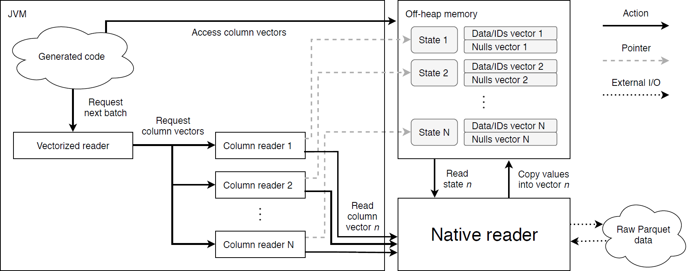

# Predicate Pushdown in Parquet and Apache Spark

*Author:*

Boudewijn Braams

VU: bbs820 (2527663) UvA: 10401040

> *Supervisor:*
>
> Peter Boncz
>
> *Daily supervisor (Databricks):*
>
> Michał S´witakowski

*Second reader:*

Alexandru Uta

December, 2018

> *A thesis submitted in fulfillment of the requirements for the joint UvA-VU Master of Science degree in Computer Science*

**MSC COMPUTER SCIENCE**

> Vrije Universiteit Amsterdam Universiteit van Amsterdam

*Abstract*

> The cost of warehousing data has dropped significantly over the years, and as a result, many organizations now store large amounts of both recent and historical data. Gaining insights from this data involves queries of an analytical nature. Such queries typically access large amounts of the data while selecting only a small fraction of it. In this thesis we research *predicate pushdown*, an optimization technique for speeding up such selective queries by pushing down filtering operations into the scan operator responsible for reading in the data. Exploiting early filtering opportunities allows us to reduce the amount of data entering the query execution pipeline and thereby increase overall query performance. Our approach goes beyond established early filtering techniques such as min/max skipping, which rely on minimum and maximum value statistics. Even considering clustered indexes and multi-dimensional clustering, there will still be columns that the indexing did not prepare for.
>
> We discuss the implementation, applicability and performance aspects of predicate pushdown in an established data processing framework, given the constraints of an established file format. We present a predicate pushdown implementation for the *Databricks Runtime* (a performance optimized version of *Apache Spark*) and the *Apache Parquet* columnar storage format. We explore predicates expressed directly on the scanned columns, as well as predicates that can be derived from filters on other tables involved in a join operation. For the latter, we employ Bloom filters to be able to express non-trivial filtering. Our experiments show that we can effectively speed up the evaluation of predicates up to 8x by exploiting the dictionary compression scheme of the Parquet format. We exemplify the benefit of Bloom filter pushdown on *query 17* of the industry standard *TPC-H* benchmark suite, for which we observe speedup up to 10x. Additionally we demonstrate that we can leverage the selection on the predicate/join key columns to effectively skip I/O for the payload columns. However, we also argue how several aspects of the Parquet format hinder the potential for predicate pushdown.
>
> **Contents**
>
> **[Abstract](#_bookmark0) i**

1.  [Introduction](#_bookmark1) 1

[1.1 Research questions](#research-questions) . . . . . . . . . . . . . . . . . . . . . . . . . . . . . . . . . . . . . 3

[1.2 Related research](#related-research) . . . . . . . . . . . . . . . . . . . . . . . . . . . . . . . . . . . . . . . 3

[1.3 Thesis outline](#thesis-outline) . . . . . . . . . . . . . . . . . . . . . . . . . . . . . . . . . . . . . . . . 3

2.  [Background](#_bookmark6) 4

[2.1 Database fundamentals](#database-fundamentals) . . . . . . . . . . . . . . . . . . . . . . . . . . . . . . . . . . . 4

[2.1.1 Relational model and SQL](#relational-model-and-sql) . . . . . . . . . . . . . . . . . . . . . . . . . . . . . 4

[OLAP](#olap) . . . . . . . . . . . . . . . . . . . . . . . . . . . . . . . . . . . . . . . . 6

[2.1.2 Execution model](#execution-model) . . . . . . . . . . . . . . . . . . . . . . . . . . . . . . . . . . 6

[2.1.3 Storage models](#storage-models) . . . . . . . . . . . . . . . . . . . . . . . . . . . . . . . . . . . 6

[2.2 Optimizing for modern hardware](#optimizing-for-modern-hardware) . . . . . . . . . . . . . . . . . . . . . . . . . . . . . 8

[2.2.1 Instruction pipelining](#instruction-pipelining) . . . . . . . . . . . . . . . . . . . . . . . . . . . . . . . 8

[Data hazards](#data-hazards) . . . . . . . . . . . . . . . . . . . . . . . . . . . . . . . . . . . . 9

[Control hazards](#control-hazards) . . . . . . . . . . . . . . . . . . . . . . . . . . . . . . . . . . . 9

2.  [SIMD](#simd) 10

3.  [Virtual memory](#virtual-memory) 10

4.  [Memory hierarchy and CPU caches](#memory-hierarchy-and-cpu-caches) 10

&nbsp;

3.  [Apache Spark](#apache-spark) 12

    1.  [Architectural overview](#architectural-overview) 12

    2.  [RDDs, DataFrames and Spark SQL](#rdds-dataframes-and-spark-sql) 12

    3.  [Query execution and terminology](#query-execution-and-terminology) 13

4.  [Apache Parquet](#apache-parquet) 14

    1.  [Logical data organization](#logical-data-organization) 14

[File structure](#file-structure) 14

[Metadata](#metadata) 15

2.  [Physical data layout](#physical-data-layout) 15

[Repetition and definition levels](#repetition-and-definition-levels) 15

[Encoding schemes](#encoding-schemes) 16

[Page compression](#page-compression) 18

3.  [Discussion](#discussion) 18

&nbsp;

5.  [The Databricks platform](#the-databricks-platform) 20

    1.  [Native Parquet reader](#native-parquet-reader) 20

    2.  [Databricks IO cache](#databricks-io-cache) 20

    3.  [Reading Parquet data from cloud storage](#reading-parquet-data-from-cloud-storage) 21

&nbsp;

3.  [Equality and range predicate pushdown](#_bookmark55) 22

    1.  [Regular predicate evaluation in Spark](#regular-predicate-evaluation-in-spark) 22

        1.  [Query plan and generated code](#query-plan-and-generated-code) 22

[Scanning Parquet files](#scanning-parquet-files) 25

2.  [Coarse-grained predicate pushdown](#coarse-grained-predicate-pushdown) 26

[TABLE]

4.  **[Join pushdown](#_bookmark131) 62**

    1.  [Regular join execution in Spark](#bookmark132) 62

        1.  [Join implementations](#bookmark134) 62

> [Broadcast hash join](#_bookmark135) 62
>
> [Sort-merge join](#_bookmark137) 63

2.  [Query plans](#bookmark138) 63

&nbsp;

2.  [Pushed-down join execution](#bookmark142) 68

    1.  [High-level approach](#bookmark143) 68

    2.  [Bloom filter implementation](#bookmark144) 69

> [Traditional Bloom filter](#_bookmark145) 69
>
> [Register-blocked Bloom filter](#_bookmark147) 70

3.  [Building and pushing down the Bloom filter](#bookmark150) 72

4.  [Probing the Bloom filter](#bookmark152) 73

&nbsp;

3.  [Benchmarks](#bookmark153) 74

    1.  [Benchmarking dimensions](#bookmark154) 74

> [Query dimensions](#_bookmark155) 74

2.  [Experimental setup](#bookmark156) 74

3.  [Pushed-down join execution](#bookmark158) 75

> [Bloom filter implementation](#_bookmark159) 75
>
> [Join selectivity](#_bookmark162) 76
>
> [Payload skipping](#_bookmark165) 78
>
> [TPC-H Q17](#_bookmark167) 79

4.  [Summary of benchmark results](#bookmark169) 80

&nbsp;

5.  ### [Conclusion](#_bookmark170) 81

    1.  [Future work](#bookmark171) 83

        1.  [Delivery mechanism](#bookmark172) 83

        2.  [Compound predicates](#bookmark173) 83

        3.  [Adaptive reordering of predicates](#bookmark174) 83

        4.  [Non-trivial predicates](#bookmark175) 84

        5.  [Leveraging SIMD instructions](#bookmark176) 84

        6.  [Addressing the indexing problem](#bookmark177) 84

        7.  [First read I/O skipping](#bookmark178) 85

        8.  [Adaptive join pushdown](#bookmark179) 85

        9.  [Less conservative BHJs](#bookmark180) 86

        10. [General adaptivity](#bookmark181) 86

### [Bibliography](#_bookmark182) 88

# Chapter 1 Introduction

> The research for this thesis was conducted at Databricks, who offer a platform for deploying managed big data processing clusters in the cloud [\[Dat\].](#_bookmark190) We explore the implementation of *predicate pushdown*, a query optimization technique whereby data filtering operations are performed as early as possible. This works by pushing down these filtering operations into the scan operator responsible for reading in the data. As a result, we can reduce the volume of data entering the query execution pipeline, which in turn increases query performance. We implement this technique in the Databricks Runtime (DBR), an in-house performance optimized version of the Apache Spark framework. Around 90% of all data read in the DBR is in the Apache Parquet format, which is a popular open-source compressed columnar storage format. We research the implementation and applicability of predicate pushdown in an established data processing framework (DBR) given the constraints of an established file format (Parquet).
>
> In recent years we have seen the development of performance-oriented database systems for *online analytical processing* (OLAP) workloads. These workloads are designed to extract useful high-level insights from large amounts of data. One of the most common ways to organize data for such workloads is by employing a star schema, in which the measurable and quantitative observations are stored in large fact tables and their descriptive attributes are stored in much smaller dimension tables. Analytical queries on this data typically only select a single or a small faction of all rows, and usually only consider a small subset of all the columns. Such queries are thus point or range queries, whereby data is filtered via equality or range predicates and joins between fact and dimension tables.
>
> A common way in which these database systems optimize query performance is by employing two complementary techniques: *vectorized execution* and *compressed columnar storage*. Vectorized execution takes a batched approach to data processing, whereby small batches (or vectors) of values are processed at a time instead of just a single value. This model allows exploiting modern hardware features such as CPU caches, speculative execution and *single instruction multiple data* (SIMD) instructions to speed up queries. It was pioneered by the MonetDB/X100 database system [\[BZN05\],](#_bookmark187) and has since seen wide-spread adoption in many other systems (e.g. Actian Vector/VectorWise [\[Zuk09\],](#_bookmark222) IBM BLU [\[Ram+13\],](#_bookmark214) SAP HANA [\[Fär+12\]](#_bookmark194) and Apache Spark [\[Spab\]).](#_bookmark217) What makes columnar storage a good fit for OLAP is that allows efficient skipping of columns not relevant to the query. Moreover, columnar storage presents excellent compression opportunities, as values from a single value domain are stored contiguously. Compression can reduce I/O and thereby speed up queries. Another well established technique for optimizing OLAP queries is the use of *small materialized aggregates* [\[Moe98\].](#_bookmark206) These are column statistics such as the minimum and maximum values found in a column. These statistics are then stored for parts of the data at some granularity, which subsequently allows for skipping of these parts in certain scenarios. Consider for example a simple range predicate which selects all values larger than 42. By referencing the minimum and maximum value statistics, it can be determined if the values contained within that part of the data satisfy the predicate without actually reading all the values.
>
> Vectorized execution, columnar data and small materialized aggregates are all present in the combination of the DBR and Parquet. The DBR features a high-performance vectorized reader for Parquet written in C (whereas the rest of the DBR is in Scala/Java). Parquet is columnar storage format, in which data can be compressed using a compression scheme combining dictionary compression, run-length encoding and bit-packing. Moreover, Parquet features minimum and maximum value statistics at different levels of granularity.
>
> The practical goal of this research is to optimize for two typical OLAP query operations: (i) the filtering of data via predicates against constant values and (ii) the joining of fact tables and dimension tables, and do this with modern hardware in mind. The first is done by pushing down predicates into the scan operator and evaluating them there. The second is done by condensing the information required to perform the join in a compact Bloom filter and pushing this to the scan of the fact table. Doing this reduces the amount of data passed to the rest of the query pipeline. Both forms of pushdown are depicted in Figure [1.1](#_bookmark2) below:


> FIGURE 1.1: Left: equality and range predicate pushdown into the scan operator, right: join pushdown using a Bloom filter
>
> We note that the Spark and the DBR already feature a form of coarse-grained predicate pushdown, in that they leverage the minimum and maximum value statistics of the Parquet format. Skipping based on minimum and maximum values is however not always effective, and does not fully cover our goals. First of all because it is really only effective when there is a natural ordering to the values (e.g. when the column is a clustered index, or some form of multi-dimensional clustering has been applied). In the case the values of a column are in apparent random order, it is evident that the minimum and maximum will be of little use. In any case, any non-skippable part of the data will still have to be fully scanned.

## 1.1 Research questions

> We implement a generic and fine-grained predicate pushdown solution that is applicable to any column, even those indexing did not prepare for. Moreover, we do this given the constraints of an established data processing system and file format. In doing this, we answer the following research questions:

-   **RQ1** *What is the most efficient way to evaluate pushed down predicates on data encoded in Parquet?*

> **RQ2** *How do we efficiently represent a selection on a predicate column and communicate this to the other columns?*

-   **RQ3** *Given a selection, how do we efficiently deliver the selected values to the execution engine?*

> **RQ4** *Given a selection on a predicate column, what is the most efficient way of leveraging this to fetch the remaining non-predicate columns?*

-   **RQ5** *How effective is the use of Bloom filters for join pushdown in Parquet?*

## 1.2 Related research

> There has been much research on improving data layouts for efficient handling on modern systems. Data Blocks is a novel columnar format abandoning the bit packing encoding scheme used in many columnar storage formats (Parquet included), thereby circumventing the related packing/unpacking overhead [\[Lan+16\],](#_bookmark200) BitWeaving is technique employing a novel encoding scheme that allows operating on bits of multiple columns in a single cycle [\[LP13\].](#_bookmark202) ByteSlice is another novel memory storage layout designed for efficient scan operations using SIMD instructions [\[Fen+15\].](#_bookmark191) All of these approaches however require modifications to the memory layout or propose entirely new file formats. Seeing as the goal of this research is to investigate accelerating predicate evaluation given the constraints of a well-established file format, these solutions are not applicable.
>
> Using Bloom filters to speed up joins in a distributed setting was introduced as early as 1986, in the form of *bloomjoins* [\[ML86\].](#_bookmark205) With respect to leveraging modern hardware features, there have been efforts in speeding up Bloom filter implementations using SIMD instructions [\[PR14\]](#_bookmark212) [\[Lu+17\].](#_bookmark203) However, to the best of our knowledge there has been no research on the effectiveness of join acceleration using Bloom filters in the context of Spark.

## 1.3 Thesis outline

> In this chapter we have provided the context of our research and laid out our research questions. Before we delve into our implementation, we provide essential background information in Chapter [2,](#_bookmark6) covering generic topics such as database fundamentals and optimizing for modern hardware, as well as specifics on Spark, Parquet and the Databricks platform. In Chapter [3](#_bookmark55) we cover our implementation of equality and range predicate pushdown, and in Chapter [4](#_bookmark131) we cover our implementation of join pushdown. In both cases an evaluation of the approaches is provided at the end of the chapter. The thesis is concluded in Chapter [5,](#_bookmark170) in which we summarize our findings, answering our research questions and discussing future work.
>

# Chapter 2 Background
>
> In this chapter we provide the essential background knowledge required for understanding our predicate pushdown implementation. First, we discuss database fundamentals, followed by a discussion on optimizing for modern hardware. We then introduce Apache Spark, followed by the specifics of Apache Parquet and a discussion of relevant aspects of the Databricks platform.

## 2.1 Database fundamentals

> A *database* is an organized collection of electronic data. A computer program interacting with a database is commonly referred to as a *database-management system* (DMBS). The most widely used form of DMBS is the *relational database-management system* (RDBMS), which exploits the relation model. In this section we introduce this model and the *Structured Query Language* (SQL) commonly used to express operations on it. After this, we discuss the commonly used execution model used to execute these operations. Lastly, we discuss the different storage models used for actually storing data.

### 2.1.1 Relational model and SQL

> In the relation model, data is described via *relations*, *attributes* and *tuples* [\[Cod70\].](#_bookmark189) A relation is defined as a set of attributes, a *tuple* is an ordered set of attribute values and an *attribute* defines a name and data type to characterize these values. The common way to represent this model is via a *table*, where the table itself represents the relation, the *columns* represent the attributes and the *rows* of the table represent the tuples. In this thesis we will refer to the concepts in the relation model by their table representation equivalents. See Figure [2.1](#_bookmark9) below for an example of how data can be laid out in tables.
>
> FIGURE 2.1: Example of a simple database represented using tables
>
> In an RDBMS, a database is defined as a set of tables and the relationships between them. This organization is formally described using a database *schema*, which serves as the blueprint for the high-level data layout. In Figure [2.2](#_bookmark10) below, we give a visualization of the schema for the example data presented in Figure [2.1.](#_bookmark9)
>
> FIGURE 2.2: Example of a simple database schema
>
> Note how the schema captures the relations between the Orders table and both the Products and Stores table. Each table usually has an id column, which is referred to as the *primary index* or *primary key* and can be used to uniquely identify a row. We see that the store_id and product_id columns in the Orders table are effectively references to the primary keys of the Stores and Products table respectively. Such columns are usually referred to as a *foreign key*.
>
> The most common way to express operations on such data and their relations is via queries written in SQL. SQL is a language with a clear syntax that allows you to express a large variety of data manipulation operations on data stored in a relational database. It allows for adding, updating and removing data via the INSERT, UPDATE and DELETE commands. Moreover, data specific columns of a set of rows can be retrieved using the SELECT command, whereby it is possible to supply predicates in the form of WHERE clauses to narrow down the selection of rows. Retrieving all or a subset of the columns for a set of rows is called a *projection* query. It is also possible to describe so called *aggregation* queries, which apply aggregate functions combining column values into a single derived value. Examples of such aggregate functions are the COUNT, AVG or SUM functions. One can also express queries joining rows from multiple tables, joining them on a specific set of conditions. Given the database from Figure [2.1,](#_bookmark9) if we for example wanted to retrieve the id, quantity and product_id columns for each order with a quantity larger than 20, we could issue the following query:
>
> 1 SELECT
>
> 2 id , quantity , product_id
>
> 3 FROM
>
> 4 orders
>
> 5 WHERE
>
> 6 quantity \> 20
>
> This query would return values for the selected columns for rows 0 and 5, as only these rows have value for the quantity that satisfies the predicate. Note that the output of this query would contain the numerical values for the product_id column, not any of the actual columns of the Products table. If we wanted to for example include the actual product name in the query results, we have to join the two tables. We can do this by issuing join query with specific join condition, which in our case is an equality predicate between the foreign key product_id of the Orders table and the primary key of the Products table:
>
> 1 SELECT
>
> 2 orders . id , orders . quantity , products . name
>
> 3 FROM
>
> 4 orders
>
> 5 JOIN
>
> 6 products ON products . id = orders . product_id
>
> 7 WHERE
>
> 8 orders . quantity \> 20
>
> This query would return a similar result as the first query, except that it would have the actual product name instead of the product’s primary key in the output.

#### OLAP

> Traditionally, (R)DMBSs have been focused on *online transaction processing* (OLTP). That is, they are primarily designed to handle a high frequency of transactional queries such as row insertions, updates or removals. However, in recent years we have seen the development of DBMSs specifically designed for *online analytical processing* (OLAP) workloads. Such systems are instead optimized for more complex queries of an analytical nature, which commonly only involve a subset of the columns while accessing a large fraction of the data.
>
> The most common way to organize data for OLAP workloads is by employing a *star schema*. In such a schema, the collection of measurements or observations are stored separately from their descriptive attributes. The measurements or observations are stored in a *fact* table, while their descriptive attributes are stored in *dimension* tables. The schema in Figure [2.2](#_bookmark10) can actually be considered a small star schema, with Orders being the fact table and Products and Stores both dimension tables. Note that in general, fact tables are typically much larger than dimension tables.

### 2.1.2 Execution model

> An SQL query is merely a description of what the outcome should contain, it does not say anything about how the query is executed. The most widely implemented model is the *volcano* iterator model [\[Gra94\].](#_bookmark197) In this model, a query is represented as a tree of operators whereby each operator consumes input from its input operator(s) one row at a time. A more recent development is the *vectorized* execution model. This model is conceptually similar to the volcano iterator model, but instead of processing rows one value at a time, it processes them one vector at a time. A vector is simply an array of values. This model was proven the be greatly beneficial to OLAP query performance by systems such as VectorWise [\[Zuk09\].](#_bookmark222) In such a model, interpretation and function call overhead is amortized simply by the fact that multiple values are processed in a single go. Moreover, the vector size is chosen such that the entire vectors fits in the CPU cache. This can drastically reduce the time needed to access each of the individual values. Lastly, the model exposes the opportunity for leveraging modern *single instruction, multiple data* (SIMD) instructions that operate on multiple values in parallel. The vectorized execution model has therefore been adopted by many modern OLAP oriented database systems.

### 2.1.3 Storage models

> The traditional way of storing data for use with an RDBMS is via the *n-ary storage model* (NSM), in which all the values of a row are stored back-to-back, row-by-row (i.e. *horizontal partitioning*). See Figure [2.3](#_bookmark14) below for a visualization how data is stored in this model. This is a good fit for OLTP workloads, in which the operations us usually involve full rows.

[TABLE]

> FIGURE 2.3: Visualization of the row-wise NSM storage model
>
> Queries in OLAP workloads usually only consider a subset of all columns. When fetching data from an external data source such as main memory or disk, it is not done at the granularity of individual bytes (as will be discussed in more detail in Section [2.2).](#optimizing-for-modern-hardware) Consider a query that is only concerned with columns A and B as depicted in [2.3.](#_bookmark14) Transferring the required data to the CPU will likely result in column B being fetched as well, simply due to the way a modern memory subsystem operates. It is evident that is inefficient and can negatively impact query performance, as part of the limited I/O bandwidth will be spent on fetching useless data. An alternative to the NSM model is the *decomposition storage model* (DSM), in which data is stored column-by-column (i.e. *vertical partitioning*) [\[CK85\].](#_bookmark188) See Figure [2.4](#_bookmark15) below for a visualization of how data is stored in this model.

[TABLE]

> FIGURE 2.4: Visualization of the columnar DSM storage model
>
> The clear advantage of this model is that *column pruning* comes for free. Combing back to the query concerning only columns A and B, in this model we can efficiently skip reading the values of column B. Many modern DBMSs employ a data model that combines the two: the *partition attributes across* (PAX) model [\[Ail+01\].](#_bookmark183) In this model, data is horizontally partitioned at some multi-row granularity, whereby the data within this partition itself is vertically partitioned. Essentially it is a hybrid storage model that stores chunks of rows in a columnar fashion. See Figure [2.5](#_bookmark16) below for a visualization of how data is stored in this model.

[TABLE]

> FIGURE 2.5: Visualization of the hybrid PAX storage model

##  2.2 Optimizing for modern hardware

> When developing performance-oriented software, one has to be aware of the intricacies of modern hardware. In this section we highlight four aspects with respect to modern CPUs and memory that are relevant to understanding the design choices and results presented in this research.

### 2.2.1  Instruction pipelining

> To maximize utilization of hardware and increase parallelism, modern CPUs feature complex instruction pipelines capable of executing multiple instructions at the same time. This technique relies on the fact that modern CPUs execute a instruction in multiple stages. Examples of such stages are: instruction fetching (IF), instruction decoding (ID), execution (EX), memory access (MEM) and writing back a result (WB). Each of these stages are handled by different components of the CPU. A naive approach to scheduling these stages would be to simply execute only one instruction at a time, see Figure [2.6](#_bookmark19) below.
>
> Instruction #1
>
> Instruction #2
>
> Instruction #3


Time

> FIGURE 2.6: Example of non-pipelined execution of the stages of a CPU instruction
>
> A better approach, and the one employed by modern CPUs, is to overlap the execution of non-conflicting stages. This way, we can execute stages from different instructions in parallel thereby increasing the throughput of instructions and making sure the CPU components are kept busy (see Figure [2.7](#_bookmark20) below).
>
> Instruction #1
>
> Instruction #2
>
> Instruction #3


Time

> FIGURE 2.7: Example of pipelined execution of the stages of a CPU instruction
>
> It is important to note however that in pipelined execution of instructions, the CPU has to ensure that if a stage of one instruction is somehow dependent on the result of a stage of a previous instruction, we always observe correct behaviour. Such a pipeline conflict is called a *hazard*. In general, a CPU will resolve such conflicts by introducing *bubbles* in the pipeline to artificially delay the execution of a specific stage of an instruction[1](#_bookmark21). In order to maximize the potential of a pipelined architecture, a program should avoid such hazards where possible. Below we discuss two types of hazards: *data hazards* and *control hazards*.
>
> 1Modern CPUs will in specific cases employ faster and more sophisticated methods of resolving such conflicts, however these are out of scope of this discussion.

#### Data hazards

> A data hazard occurs if there is a data dependency between instructions. Consider two instructions, the first storing a value in a certain memory location and the second using that value to compute a new value. Mapping these two instructions to the first two instructions depicted in Figure [2.7,](#_bookmark20) this means that requires the EX stage of instruction #2 can only execute after the WB stage of instruction #1. Although completely eradicating data hazards is impossible from practical point of view, it is important to be aware of them and the possible performance consequences.

#### Control hazards

> A more severe form of hazard is the control hazard, in which there is a control dependency between instructions caused by branching logic. In this case it is the outcome of one instruction that will determine which instruction should be executed next (e.g. in an if/else conditional statement). Branching logic is intrinsic to so many applications, that modern CPUs feature branch predictors that try to minimize the impact of control hazards by speculatively executing the branch it deems most likely to be taken. To make an educated guess on which branch it should execute, the branch predictor keeps record of the outcomes of conditional instruction it encounters. Take for example the following pseudocode for evaluating a simple condition on an array of data (we assume the elements of the result array to be initialized to 0):
>
> 1 for ( int i = 0; i \< n; i ++) {
>
> 2 if ( data \[ i\] \> 0) {
>
> 3 result \[ i\] = 1;
>
> 4 }
>
> 5 }
>
> LISTING 2.1: Example for loop with conditional statement for each iteration
>
> After a number of iterations of this loop and depending on the content of the data array, the branch predictor will establish a pattern on how this branch is usually taken. Depending on the content of the data array, it could for example establish that the condition on line 2 evaluates to true more often than false, and decide to speculatively executing the instruction on line 3, even though the result of the evaluation of this iteration is not yet available. If this guess was correct, this should result in good utilization of the pipeline and thereby yield superior performance to simply waiting for the result to becomes available.
>
> The branch predictor will of course not always be able to predict the right outcome. In case the branch predictor gets it wrong, the speculatively executed instructions must be discarded and the proper branch must be executed instead. Such mispredictions are costly, as the pipeline has to be flushed. Ideally you want your program to be as predictable as possible in terms of branching behavior. However, one can imagine that this is not always trivial, and in some cases even impossible.
>
> A notable technique of avoiding costly branch mispredictions is *predication*. It does so by converting a control dependency into data dependency. The rationale behind it being that in practice, a data dependency is much cheaper to deal with than a branch misprediction. We can rewrite the code from Listing [2.1](#_bookmark24) into something which is semantically equivalent:
>
> 1 for ( int i = 0; i \< n; i ++) {
>
> 2 result \[ i\] = data \[ i\] \> 0;
>
> 3 }
>
> LISTING 2.2: Example for loop with predication
>
> Notice that the branch was eliminated by converting the condition into a boolean value, and using it in an assignment. Although this loop will do a write to result on every iteration (while
>
> the other loop only does it if the branch is taken), it is likely that for unpredictable input the loop with predication will be faster than the branching variant by avoiding branch mispredictions.

### 2.2.2 SIMD

> Many modern CPUs feature so called *single instruction, multiple data* (SIMD) or vector instructions to exploit data level parallelism. These instructions are executed by special *vector units* inside the CPU. Instead of an instruction operating on a single value, a SIMD instruction operates on multiple values in parallel. In the context of this research, an obvious candidate for use with this would be predicate evaluation. Instead of having a for loop iterating over each single element in a vector of values and evaluating a predicate on it, we can do the evaluation on multiple elements in parallel and thereby drastically reducing the number of required loop iterations to process all the elements. The exact number of elements that can be processed in parallel depends on the specific SIMD implementation on a CPU and the data width of the vector elements. In this research we consider the *AVX2* extension to the Intel x86 instruction set architecture, which features 256-bit wide numeric processing capabilities \[[A](#_bookmark184)vx\]. This means that for example for 32-bit wide data types, it is able to process 8 values at once.
>
> The primary method of using SIMD instructions without manually writing assembly is by using *intrinsics*. These are special C/C++ macros handled by the compiler and converted into the proper SIMD assembly instructions [\[Int\].](#_bookmark199) In addition to this manual approach, some compilers like gcc provide auto-vectorization optimization, which automatically compiles certain loop structures with SIMD instructions [\[Gcc\].](#_bookmark195)

### 2.2.3  Virtual memory

> With the exception of the boot phase, modern CPUs rarely address physical memory directly, but instead address memory via a *virtual* address space. The virtual address space spans the entire range from the lowest possible address value to the highest possible address value, regardless of the actual available physical memory. The operating system is in charge of managing the virtual address space, mapping sections of physical memory or files on disk to sections of virtual memory. This mapping occurs at the granularity of a memory *page*, which in the *x86-64* architecture is either 4KB, 2MB or 1GB in size.
>
> With respect to reading data from disk, modern operating systems employ a technique called *demand paging*. This technique attempts to avoid costly disk reads (see Table [2.1)](#_bookmark28) by only copying data from disk into main memory when it is actually needed. When a section of virtual memory is mapped to pages residing on disk, this data is not immediately copied into main memory. Instead, demand paging ensures that data is only copied from disk into main memory on the first access to it by a program. When such a page is mapped into memory, but is not yet actually present in main memory, such an access will trigger a *page fault*, which subsequently triggers the operating system to perform the actual copy operation. This mechanism saves on costly I/O when reading only parts of a large file residing on disk. Many modern operating systems feature a page cache, which stores pages read from disk into unused areas of memory. Any subsequent request to the same page can then be served directly from memory instead of having to read from disk again.

### 2.2.4 Memory hierarchy and CPU caches

> Fast memory is expensive and slow memory is cheap. To keep commodity computers economical, they nearly always feature a hierarchical memory organization with multiple different types of memory, ranging from small and fast to large but slow. Using such a memory hierarchy, overall access latency is kept low by exploiting spatial and temporal locality. Spatial locality refers to
>
> the situation in which if a certain piece of memory is accessed, it is likely that adjacent memory will be accessed as well. Temporal locality refers to the situation in which if a certain piece of memory is accessed at a particular point in time, it is likely to be accessed again soon after. Many memory access patterns exhibit both temporal and spatial locality, which is why such a memory hierarchy is very effective at amortizing access latency. To fill the gap between CPU registers and main memory (DRAM), modern X86-64 CPUs commonly feature three caching layers (referred to as L1, L2 and L3 cache respectively). See Table [2.1](#_bookmark28) below for an access time comparison of a typical memory hierarchy.

[TABLE]

> TABLE 2.1: Access time comparison for different types of memory, source: [\[Hém15\]](#_bookmark198)
>
> When the CPU attempts to access a piece of memory, it is first checked whether this particular piece of data resides in L1, L2 or L3. If it is, we have a *cache hit* and the request is served from the appropriate caching layer. When the data does not reside in any of the caching levels, we have a *cache miss*, and have to fetch the data from a lower layer. Note that when data is transferred from a lower layer to the CPU, entries for it will be added to the cache. The caches operate at *cache line* or *cache block* granularity, which are usually 64 bytes in size. To further decrease access latency, modern CPUs can do *cache prefetching*, a technique very similar to speculative execution. When the CPU detects sequential memory access patterns, it can choose to prefetch a piece of memory before it is actually requested.
>
> Database systems employing vectorized execution as described in Section [2.1.2](#execution-model) exploit the caching layers by essentially trying to operate in cache for as long as possible. Instead of fetching values to process from memory or disk one at a time, an entire batch (or vector) of values is processed at a time. If this batch is sized such that it fits entirely in for example L2 or L3 cache, in the subsequent processing of this vector all data requests can then be served quickly from cache.

## 2.3 Apache Spark

> Apache Spark is a popular open-source cluster computing framework designed to facilitate large scale parallel data processing [\[Spaa\]](#_bookmark216). It manages and coordinates the execution of tasks on large volumes of data in a cluster setting. It started out as a research project at UC Berkeley’s AMPLab in 2009, after it was made open-source in 2010 and eventually donated to the Apache Software Foundation in 2013. It is primarily written in Scala (with parts written in Java) and runs in the *Java Virtual Machine* (JVM). In this section we discuss the high-level architecture of Spark and cover some basic concepts and terminology.

### 2.3.1 Architectural overview

> A Spark application essentially comprises a *driver* process and independent set of *executor* processes. The driver runs the user program, and resides on a node in the cluster. It analyzes the workload defined by the user program and subsequently distributes and schedules over the available executors. The executors are the processes that do the actual work and process the data Executor processes are distributed over the other worker nodes in the cluster, note that there can be multiple executor processes running on the same cluster node. Spark relies on an external cluster manager to keep track of the available nodes. Moreover, it does not define its own file system. Any data processed by Spark will therefore always be read from an external source, and can be in a variety of different formats. Note that Spark also features a local mode, where both the driver and executor processes reside on a single machine. See Figure [2.8](#_bookmark31) below for a visualization of the Spark architecture.


> FIGURE 2.8: Architectural overview of Spark cluster

### 2.3.2  RDDs, DataFrames and Spark SQL

> At the core of Spark lies the concept of *resilient distributed datasets* (RDDs). An RDD represents a dataset as a immutable horizontally partitioned collection of records. At the lowest level, manipulations on the dataset are expressed as transformations on the RDD. Each partition can be operated on by a different executor in parallel, which how Spark achieves its parallelism. If there is only a single partition, there is no parallelism, which is detrimental to performance. Thus ideally we want to be operating on data in parallel as much as possible, which means retaining a sizable number of partitions while operating on the data.
>
> There are two general types of RDD transformations: *narrow transformation* and *wide transformations*. A narrow transformation has one input partition and exactly one output partition. An operation like filtering out values using a predicate against a constant value for example is a narrow transformation, as the result of the operation does not depend on any of the other partitions. A wide transformation has one input partition and potentially many output partitions. For example, sorting all the values in a dataset is a wide transformation, as the sorted values have to end up in the right partition. It is clear that this requires data transfer between the executors, which in Spark terminology is referred to as a *shuffle*.
>
> Although Spark exposes a low-level API for interfacing with RDDs directly, it is not the recommended way of expressing data manipulations. First of all because it exposes partitioning directly to the user, and secondly because it is not user-friendly with respect to expressing complex manipulations and queries. The recommended way of expressing manipulations on structured data is through the DataFrame API or via the *Spark SQL* module. Instead of manually specifying low-level RDD transformations, which are limited in expressivity, the DataFrame API allows the user to express high-level operations on the data through the familiar concepts of tables, rows and columns. Similarly, the user can express them via SQL queries which are handled by Spark SQL. Note that both still rely on RDDs underneath, and that the expressed computation will be internally converted into a set of RDD transformations. However, operations expressed in Spark SQL or DataFrames benefit from query optimization, whereas manually written RDD code does not. Choosing between Spark SQL or the DataFrame API is merely a matter of preference, as both provide similar expressivity, are at a similar level of abstraction, and benefit from the *Catalyst* query optimizer. In this thesis we will make use of the Spark SQL module, and express operations as SQL queries.

### 2.3.3 Query execution and terminology

> Before Spark can execute a query, it generates several *query plans*, which are sets of logical or physical operators organized in a tree organized in a tree structure (similar to what was described for the volcano execution model Section [2.1.2).](#execution-model) Given a raw SQL query, the query is first parsed and then converted into a *logical query plan*. This logical query plan is fed into the query optimizer, yielding an *optimized query plan*. Note that both the logical and optimized query plan merely describe *what* data operations are required to perform the computation, not *how* they should be executed. Eventually the optimized query plan is converted into a *physical plan*, which describes how the plan and the operations should actually be executed on the cluster.
>
> When a query is issued and the physical plan has been generated, a Spark *job* is created which encapsulates the computation. A Spark job is divided into multiple interdependent *stages*, whereby each stage comprises multiple *tasks*. A task is the smallest unit of computation, and is what the driver will delegate to an executor. Note that in contrast to the volcano iterator model, whereby each operator is usually implemented as a separate function, Spark features what is known as *Whole-Stage CodeGen*. This feature generates optimized Java code for a stage in the physical plan, whereby multiple operators are fused into a single function.

## 2.4  Apache Parquet

> Apache Parquet is a popular open-source columnar storage format, well established as a storage back-end for Spark [\[Para\].](#_bookmark207) The format supports both flat and nested schemas, and was designed for use for use with OLAP systems. The format has built-in support for coarse-grained predicate pushdown, as it explicitly stores column value statistics at different levels of granularity. Data in Parquet can be encoded and compressed using a variety of different schemes.
>
> A dataset in Parquet is not necessarily stored a single file, but is usually referred to by a root directory. This directory either directly contains a single or multiple files, or contains a sub-directory structure with the files contained in the leaf directories. In case of the latter, the sub-directories define a high-level partitioning scheme, with each sub-directory representing a specific partition[2](#_bookmark37). Such partitions can for example be a specific column, or a subset of the data with a specific value for one of the columns. Support for partition pruning on this level is already present in Spark, and is orthogonal to the early filtering techniques explored in this thesis.
>
> In this section we touch upon the aspects of the Parquet storage format that are relevant for implementing fine-grained predicate pushdown. We discuss the logical organization of data first, which is followed by a description of how the actual content itself is physically stored. We conclude with a brief discussion of several potential inefficiencies with respect to the format given the context of this research, and describe how the upcoming V2 specification of the format addresses several of these.

### 2.4.1 Logical data organization

> In Parquet, data is organized using to the PAX data model as introduced in Section [2.1.3.](#storage-models) Below we outline the exact internal file structure, i.e. how the data is vertically and horizontally partitioned, and what accompanying metadata that is stored.

#### File structure

> In Parquet, a data set comprising of rows and columns is partition into one or multiple files. Each individual file contains one or multiple horizontal partitions of rows called *row groups* (by default 128MB in size). Each row group subsequently contains a *column chunk* (i.e. vertical partition) for each of the columns of the horizontal partition. Within a column chunk, the actual values are stored in *data pages* (by default storing 1MB of values). Each data page stores either a fixed or variable amount of (compressed) values, depending on the data type of the column values and the encoding scheme used. See Figure [2.9](#_bookmark38) for an overview diagram.
>
> 2Not to be confused with the Spark RDD notion of a partition, which is something different.
>
> FIGURE 2.9: Overview diagram of logical data organization in a Parquet file

#### Metadata

> To aid in query optimization, Parquet borrows the idea of *small materialized aggregates* [\[Moe98\].](#_bookmark206) The idea behind this is to explicitly store useful statistics for subsets of the data that can facilitate early data filtering. In the case of Parquet, these aggregates include the value count and minimum/maximum value statistics. These count, min and max values are stored at row group, column chunk and page level granularity. Given for example a query with a range predicate against a constant value, we can simply reference the min and max values and subsequently decide whether to read or skip the row group, column chunk or page. This will not only reduce the amount of data that has to be read from the files, but also reduces the amount of data that needs to be processed by the query execution engine upstream.

### 2.4.2 Physical data layout

> Now that we have discussed the logical data organization in Parquet, we address how the actual tuples themselves are physically stored within the pages.

#### Repetition and definition levels

> In addition to storing metadata and the actual values, a page contains so called *repetition* and *definition levels* (as can be seen in Figure [2.9).](#_bookmark38) Repetition and definition levels provide a means for reconstructing nested data from a flattened representation. The concept or repetition and definition levels was introduced by Google’s Dremel, and was subsequently adopted for the Parquet format [\[Mel+10\].](#_bookmark204) In this research we only consider flat schemas, we therefore refer the reader to the Dremel paper for an in-depth description of how repetition and definition levels work. While repetition levels do not apply to flat schemas, definition levels do apply to them since they are used to encode null values present in the data. In Parquet, null values are not stored explicitly, but are inferred from the definition levels. For a flat schema, the definition levels are essentially an array of numbers, which maps each data value stored in the page to either a 1 if is defined and
>
> to 0 if it is undefined (i.e. is null). In many cases, it is likely that such an array contains repeated runs of 1’s and 0’s. To make more efficient use of space, it is encoded using a combination of run-length encoding (RLE) and bit-packing (the details of which are discussed below).

#### Encoding schemes

> For storing the actual data values, the Parquet specification features six encoding schemes [\[Parb\].](#_bookmark209) Several of these encoding schemes are however part of the yet unfinished V2 specification. The V1 specification is the current standard, and features only three encoding schemes: PLAIN, RLE and RLE_DICTIONARY. In the context of this research, we limit ourselves to these encoding schemes, as they are what the native reader in the Databricks Runtime supports (see Section [2.5.1).](#native-parquet-reader) We discuss the potential impact of the V2 encoding schemes in Section [2.4.3.](#discussion)
>
> In PLAIN encoding, values are simply stored back to back for fixed-width data types. Non fixed-width data types such as strings are stored in a similar fashion, the only difference being that each value has its length prefixed (see Figure [2.10](#_bookmark43) below).
>
> FIGURE 2.10: Example of PLAIN encoded strings in Parquet, lengths are prefixed to non-fixed width data
>
> The RLE scheme combines run-length encoding (RLE) with bit-packing, but is only used to store the repetition/definition levels and boolean values. The RLE_DICTIONARY scheme employs the same techniques as the RLE scheme and combines it with dictionary compression. In contrast to the RLE scheme, the RLE_DICTIONARY scheme is not limited in its application and can be used for all the data types supported by Parquet. See Figure [2.11](#_bookmark44) for an illustration of the compression performed by this scheme on string data. To explain how the RLE_DICTIONARY scheme works, below we discuss how dictionary compression, RLE and bit-packing are applied respectively.
>
> Dictionary compression

FIGURE 2.11: High level overview of the compression performed by the

RLE_DICTIONARY encoding scheme in Parquet on an example string column

> The first technique, dictionary encoding, is a compression technique that relies on the assumption that values can frequently occur more than once in a dataset. Instead of naively storing each
>
> value explicitly, we can create a dictionary containing all the occurring values in a dataset and simply substitute all values with a reference to the relevant dictionary entry (also referred to as a *dictionary code*). In Parquet dictionary compression, this reference is simply a 32-bit integer value, which serves as an index into the dictionary. Given that there are enough duplicate values to justify the additional space needed to store both the dictionary *and* the codes, it is evident that we can save space for data types larger than 32-bits using this technique.
>
> The second technique, RLE, assumes that values will sometimes be repeated many times. Instead of naively storing repeated values back to back, we can substitute a sequence of repeated values with the repeated value itself, combined with the number of times the value is repeated. Going by the example in Figure [2.11,](#_bookmark44) instead of storing the dictionary code for The Netherlands three times after each other, we can simply store it as 3,3. It is evident that if values are repeated often, the space savings can be significant.
>
> The third technique, bit-packing, a compression technique whereby we attempt to save space by reducing the number of bits used to represent a value. For fixed-width data types, all of the bits are used to represent a value, regardless of the actual value itself. For example, the binary representation of a 32-bit integer with value 3 is 00000000 00000000 00000000 00000011. The idea of bit-packing is to only use the number of bits that you actually need to represent all values in a dataset, based on the maximum value present in that dataset. Again, going by the example in Figure [2.11,](#_bookmark44) we know that the value of the dictionary codes will never exceed 3. We therefore will never require more than 2 bits to represent all the possible codes (00 for 0, 01 for 1, 10 for 2 and 11 for 3). It is evident that in the case that the maximum occurring value is much smaller than the maximum value of the supporting data type, we can save significant space by bit-packing the values before storing them.
>
> When encoding using the RLE_DICTIONARY scheme, a special dictionary page containing the dictionary is stored at the start of a column chunk (note that new dictionary is created for each column chunk). The actual values, now in the form of dictionary codes, are encoded using RLE and bit-packing and stored as a sequence of *bit-packed* and *RLE runs* (see Figure [2.12](#_bookmark45) below). Bit-packed runs contain sequences of non-repeated values: bit packed dictionary codes prefixed with a short header containing the length of the run. Repeated values are stored in RLE runs, containing the repeated value followed by the number of times the value is repeated.


> FIGURE 2.12: Example of RLE_DICTIONARY encoded data in Parquet, bit-packed and RLE runs are mixed
>
> Note that it might not always be beneficial to encode data using this scheme. If there are for example only unique values (e.g. in the case of a primary key column), using this scheme would actually increase the space needed to store the data. The encoding scheme is therefore only applied when it makes sense, this choice is made dynamically by the Parquet file writer. Moreover, since in Parquet pages are subjected to a size limit, it can be the case that RLE_DICTIONARY pages are followed by PLAIN pages, which occurs when the dictionary page reaches its maximum allowed size This fallback mechanism avoids reverting to PLAIN encoding for the entire column chunk, and allows for part of the data to still be reduced in size.

#### Page compression

> In addition to the encoding schemes described above, the format allows for individual data pages to be optionally compressed in their entirety as well. They can be compressed using a variety of compression schemes, such as snappy or gzip. While support for specific compression schemes differs per Parquet reader/writer implementation, Apache Spark supports the aforementioned schemes out of the box.

### 2.4.3 Discussion

One of the goals of predicate pushdown is to reduce I/O and thereby avoid reading data that will not be needed. We identified the following four inefficiencies with respect to I/O skipping potential in the Parquet format.

1.  Page headers are stored at the beginning of a page. This makes min/max skipping at page level is not as efficient as it can be, since it requires reading all the individual page headers spread out throughout the file. Note that the same applies to determining in which page to find a value at a specific index.

2.  For non fixed-width data types stored in PLAIN, the lengths are prefixed to the values (see Figure [2.10).](#_bookmark43) Consider that we know before reading the values of a column chunk that we can skip reading *k* of these values, since we have established that the values at these locations do not satisfy a predicate evaluated on another column (i.e. skipping portions of the payload columns). Since we can only know the offset at which to find value *k* + 1 by reading the lengths of the values at 0..*k*, we can not do any effective I/O skipping. Note that this does not hold for fixed-width data types, for which we can simply calculate the offset at which to find a specific value.

3.  There is no indexing structure for RLE_DICTIONARY data. By mixing content with length metadata, it exhibits the same intrinsic problem as for PLAIN non fixed-width data types. Since bit-packed and RLE runs are mixed and can be of variable length, there is no trivial skipping to a value given an index.

4.  There is limited applicability of page level min/max metadata with respect to payload skipping. The number of values contained within a page is not fixed among columns within a row group, meaning this number can vary between column chunks. This means that considering a tuple (i.e. a set of column values at a specific row), there is no guaranteed one-to-one mapping between the pages of the constituting columns. If we for example know that we can skip all the values contained in page *n* in one column, we cannot just skip page *n* of the other column. Instead, we would have to parse the page headers of the other column and subsequently deal with the three issues described above.

> These inefficiencies are known to the Parquet community and efforts are being to made address these problems. The repository of the Parquet format specification features a document proposing new page level indexing metadata to be added to the footer of a V2 Parquet file [\[Parc\].](#_bookmark210) It proposes two new per-column structures to be added to the row-group metadata. These new structures are stored together, back to back for all the columns in a row-group, per row-group in a Parquet file (as depicted in Figure [2.13](#_bookmark48) below).
>
> 
>
> FIGURE 2.13: Physical layout of newly proposed page level indexing structures in V2 Parquet specification
>
> The first of these new structures, ColumnIndex, stores the min/max values for each page. The second, OffsetIndex, stores byte offsets for values given their row index at page granularity. Note that these new indexing structures directly address problems 1 and 4, as they allow for min/max skipping at page granularity without having to read the individual (dispersed) page headers, while also making it trivial to find the page storing a column value given a row index. Note that the latter also partially addresses problem 3, however indexing a value within a page still requires the parsing of mixed bit-packed/RLE run headers.
>
> The V2 specification also adds three new encoding schemes employing *delta encoding*. Delta encoding is a technique whereby values are stored as differences (or deltas) with respect to some reference value (e.g. the previous value). If the absolute difference in value in between a sequence of values is relatively small, the value range of the delta values will be much smaller than the value range of the original values. Since these delta values are usually small, they can be bitpacked to achieve compression. What follows is a description of the three new encoding schemes.
>
> The DELTA_BINARY_PACKED encoding scheme supports integer data types and combines delta encoding with bit-packing. Data is divided into blocks, with each block subdivided into mini-blocks. Delta encoding is applied per block, thus each block has its own reference value. Within a block, delta encoding is applied to each mini-block whereby each miniblock is bit-packed with its own number of bits. The number of values within a block must be multiple of 128, the number of values in a mini-block must be a multiple of 32. If there are not enough values to fill a block, it is padded with zeroes. This technique is based on work by Lemire and Boytsov and allows for fast encoding and decoding using SIMD instructions [\[LB15\].](#_bookmark201) Block headers only contain the number of values, and not the length in bytes. Indexing within a page in this encoding scheme is thus still problematic.
>
> The DELTA_LENGTH_BYTE_ARRAY is essentially improved PLAIN encoding for variable length data. The lengths are stored before the data, whereby the length values themselves encoded using the DELTA_BINARY_PACKED encoding scheme. This encoding scheme in combination with the proposed OffsetIndex indexing structure solve problem 2, as indexing within a page can be done by referencing the lengths.
>
> The DELTA_BYTE_ARRAY combines the other two delta schemes with incremental encoding. It encodes common prefixes using the DELTA_BINARY_PACKED and stores the suffixes after that which are encoding using DELTA_LENGTH_BYTE_ARRAY scheme. This scheme has similar indexing properties as DELTA_LENGTH_BYTE_ARRAY, the only difference being that to fully decode the value, the prefixes have to be referenced.
>
> At the time of writing, the V2 specification is still a work in progress and has not yet been finalized. It is unclear when the specification will be completed and when it will be fully supported by the reference Parquet reader/writer implementation parquet-mr [\[Pard\].](#_bookmark211) Nevertheless, it is good to see that several of the pain points of Parquet indexing are being addressed. We discuss the indexing problem in more detail in Section [5.1.6.](#bookmark177)

## 2.5 The Databricks platform

> Databricks is company founded by the original creators of Spark who offer a fully managed solution for deploying Spark clusters in a cloud environment. The Databricks platform features a web-based notebook interface for writing and running Spark applications and deploying them on on-demand provisioned clusters. Instead of open-source Spark (OSS), the platform offers an in-house performance optimized version of Spark referred to as the Databricks Runtime (DBR). In this section we first cover two DBR exclusive features that are relevant to this research: a fast Parquet reader written in native code, and a Parquet column chunk caching layer. We then briefly touch upon how Parquet data is read from cloud storage.

### 2.5.1 Native Parquet reader

The DBR features a vectorized Parquet reader written in native code to achieve near-optimal decoding speed for Parquet files residing locally. While OSS already includes a vectorized Parquet reader, it is written in Java and is therefore subjected to JVM overhead. When reading Parquet data from a cloud object store, most of the time spent in the scan operator will be attributed to fetching the data over the network. In that case the benefits of fast decoding are only marginal. However when reading data locally from memory or from disk, we would like the reader to be as fast as possible, as the time spent in the scan operator will be dominated by the time spent decoding (assuming high-speed SSD drives). This was the motivation for implementing decoding in native code.

The native reader is written in C and communicates with the JVM using the Java Native Interface (JNI), and decodes data into shared off-heap memory. In the JVM, by default all memory is always allocated *on* the heap, and is subjected to a garbage collector (GC). It thus abstracts away explicit memory management and relies on the GC to free any unused memory. While it is possible to modify on-heap memory from native code, a major caveat of doing so is that the garbage collector can move around objects in memory. To avoid pointers from being suddenly invalidated while accessing on-heap memory from native code, one would have to use a locking mechanism to prevent the GC from moving around the referenced memory [\[Gcl\].](#_bookmark196) We avoid this overhead by using off-heap memory and diligent memory management. The sun.misc.Unsafe class allows for explicit off-heap memory management. The data shared between the native reader and Spark running in the JVM is therefore allocated and freed using this method.

### 2.5.2 Databricks IO cache

> For analytical queries and experimentation, it is likely that a user will run multiple queries on (subsets of) the same data. Unless data is explicitly cached by the user, each of these queries will issue a new request to fetch the same data. When this data resides in a cloud object store, it is evident that this inefficiency can have a significant negative impact on query performance. To combat this, the DBR features a transparent Parquet cache dubbed the *Databricks IO Cache* or DBIO cache. This caching layer automatically caches Parquet data and stores it on disk[3](#_bookmark52). On the first read, data is fetched from the object store and copied to disk. Any subsequent reads of (parts of) this data can then be served from the cache. The current implementation of the cache stores *uncompressed* copies of Parquet pages at the column-chunk granularity (by compression we refer to *page compression* as described in Section [2.4.2,](#page-compression) the encoding of the data is left as is). Note that an uncompressed copy is stored regardless of the compression on the original page. From the
>
> 3The cloud VM instances on which this feature is enabled all feature high speed NVMEe SSDs, which significantly speed up cache access when compared to regular HDD/SSD drives.
>
> perspective of the native reader, the cached data is mapped into main memory using mmap[⁴](#_bookmark54), and can thus be accessed as if it was residing in main memory.
>
> Support for caching compressed pages will be added in a future version of the DBIO cache. With respect to predicate pushdown when reading from the cache, it will be interesting to see what effect it will have. In many cases operating on compressed pages can actually be faster than operating on non-compressed pages. The light-weight compression algorithms used are designed to balance the potential I/O savings and decompression overhead, such that it is actually faster to fetch and decompress a chunk of data than it would be to fetch it uncompressed. It is therefore possible that it can amplify any benefits gained from predicate pushdown.
>
> Lastly we note that the DBIO cache present an excellent opportunity for generating and storing custom metadata, and could be leveraged to address the indexing issues discussed in [2.4.3.](#discussion) We discuss the indexing problem in more detail in Section [5.1.6.](#bookmark177)

### 2.5.3 Reading Parquet data from cloud storage

Since the DBR is deployed in a cloud environment and runs on on-demand provisioned clusters, data is always fetched from an external source on the first read. The majority of the total volume of this data is read from cloud object storage. For data stored in Parquet, this is done by interfacing with the reference Parquet reader implementation parquet-mr. When reading from cloud storage, instead of fetching whole files, data can be fetched at column chunk granularity. Since fetching data over the network is usually much slower than reading from memory or local disk, implementing skipping capabilities for first reads is promising in terms of potential performance gains. However, due to the tight integration with parquet-mr, this would require a significant rearchitecture effort. It for this reason that in this thesis we will implement first-read skipping, and only implement I/O skipping for the DBIO cache. Note that we do briefly touch upon first-read skipping briefly in the future work section, see Section [5.1.7.](#bookmark178)

> 4<http://man7.org/linux/man-pages/man2/mmap.2.html>

# Chapter 3 Equality and range predicate pushdown

> In this chapter we cover our implementation of predicate pushdown for equality and range predicates. We do so by first looking at how Spark normally evaluates predicates and how it reads Parquet data. We then describe the means by which we establish and represent a selection in the native reader, which we follow up by looking at how this selection can be leveraged for fetching payload columns. In doing so, we motivate several of our design choices by means of microbenchmarks. Lastly, we evaluate our equality and range predicate pushdown implementation using a set of custom benchmarks.

## 3.1 Regular predicate evaluation in Spark

> Before we delve into pushed down predicate evaluation, we discuss how regular predicate evaluation is performed in Spark. We do this by considering a simple query with a single predicate column and a single payload column on a Parquet data source:
>
> 1 SELECT id , val FROM data WHERE val \> 42

LISTING 3.1: Simple projection query with predicate

> In this section we describe how this query is executed by Spark. In doing this, we go over the generated query plan, the generated code and how the scan operator is implemented for Parquet files.

### 3.1.1 Query plan and generated code

> To understand how Spark executes the query in Listing [1,](#_bookmark103) we can examine how the query is translated into a physical execution plan:
>
> 1 == Physical Plan ==
>
> 2 \*(1) Project \[ id #51 L, val #52\]
>
> 3 +\*(1) Filter ( isnotnull ( val #52) && ( val #52 \> 42) )
>
> 4 +\*(1) File Scan parquet \[ id #51 L, val #52\] Batched : true , Format : Parquet , Location : In Memory File Index \[ \< path_to_parquet_file \>\], Partition Filters : \[\], Pushed Filters : \[ Is Not Null ( val ), Greater Than ( val ,42) \], Read Schema : struct \<id: bigint , val : int \>

LISTING 3.2: Generated physical plan for simple query with predicate

> We see that it contains three operators, starting from the bottom we have a FileScan operator, a Filter operator and finally a Project operator. The operators have parameters specific to the operation performed (e.g. the Project operator has two references the columns it projects). Note that a number is added to a column reference to make the reference unique (when referencing columns from multiple tables, there could otherwise be name clashes). Also note that the Filter operator does not only contain the \> 42 predicate as you would expect, but also contains an
>
> isnotnull predicate. Considering SQL semantics this makes sense, as null will never satisfy a WHERE clause in the absence of an explicit ISNULL predicate. The null check being explicitly added to the filter, instead of simply being implicitly embedded in the execution of the \> 42 predicate, can be considered both an optimization and a requirement in the context of Parquet. It can be considered an optimization since a null check can be done against the definition levels and thus only requires the metadata, and a requirement for the same reason, as null values are not explicitly stored in Parquet and we would have nothing to compare to. We see projection pushdown in the FileScan operator, as it directly references the projected columns. The Project operator in this case does no column pruning, but is still necessary to output the result. Lastly, we note the presence of PartitionFilters and PushedFilters in the FileScan operator, which are used for coarse grained predicate pushdown. The partition filters contain predicates used in partition pruning, and the pushed filters contain predicates used in row group skipping. Both approaches leverage Parquet metadata to do skipping based on the min/max values and the definition levels (for skipping nulls).
>
> When executing a query, the Spark UI tool visualizes the query plan and displays several operator statistics. Figure [3.1](#_bookmark58) below shows the execution of the query described above against a Parquet dataset consisting of 1 file containing 100,000 rows of uniformly distributed random values.


> FIGURE 3.1: Visualization of executed physical plan for simple query with predicate
>
> We see that the scan operator read all of the 100,000 rows and fed those to the filter operator. Note that since the values are uniformly randomly distributed, min/max skipping is ineffective, which is why we see no effect of the PushedFilters. The filter operator subsequently applied the isnotnull and \> 42 predicates and outputs 56,649 qualifying rows. The projection operator then materialized the final result. While this is conceptually what happens, we note that the operators
>
> are inside of a WholeStageCodegen stage and that we have vectorized execution that processed data per batch (a set of column vectors). As discussed in Section [2.3.3,](#query-execution-and-terminology) WholeStageCodegen merges operators into a single compact function. In Listing [3.3](#_bookmark59) below we present code generated for this stage. Note that we have added comments and condensed the code as to only show the relevant bits (surrounding boiler plate code, metric collection and wrapper functions are not included).

<a id="_bookmark59"></a>

``` java
protected void processNext () throws java .io. IOException {
  if ( scan_mutableStateArray_2 [0] == null ) {
    // Scan operator , get first batch ( vectors for ’id ’ and ’val ’ columns )
    scan_nextBatch_0 ();  // line 4
  }
  while ( scan_mutableStateArray_2 [0] != null ) {
    int scan_numRows_0 = scan_mutableStateArray_2 [0]. numRows ();
    int scan_localEnd_0 = scan_numRows_0 - scan_batchIdx_0 ;
    // Iterate over current batch
    for (int scan_localIdx_0 = 0; scan_localIdx_0 < scan_localEnd_0 ;scan_localIdx_0 ++) {
      int scan_rowIdx_0 = scan_batchIdx_0 + scan_localIdx_0 ;
      do {
        // Filter operator , evaluate predicates on ’val ’ column
        boolean scan_isNull_1 = scan_mutableStateArray_3 [1]. isNullAt (scan_rowIdx_0 ); // line 14
        int scan_value_1 = scan_isNull_1 ? -1 : ( scan_mutableStateArray_3 [1].getInt ( scan_rowIdx_0 )); // line 15
        if (!(! scan_isNull_1 )) continue ;
        if (!( scan_value_1 > 42)) continue ;
        // Project operator , output ’id ’ and ’val ’ column
        boolean scan_isNull_0 = scan_mutableStateArray_3 [0]. isNullAt (scan_rowIdx_0 );
        long scan_value_0 = scan_isNull_0 ? -1L : ( scan_mutableStateArray_3[0]. getLong ( scan_rowIdx_0 ));
        scan_mutableStateArray_6 [2]. zeroOutNullBytes ();
        if ( scan_isNull_0 ) {
          scan_mutableStateArray_6 [2]. setNullAt (0);
        } else {
          scan_mutableStateArray_6 [2]. write (0, scan_value_0 );
        }
        scan_mutableStateArray_6 [2]. write (1, scan_value_1 );
        append ( scan_mutableStateArray_4 [2]) ;
      } while ( false );
      if ( shouldStop ()) {
        scan_batchIdx_0 = scan_rowIdx_0 + 1;
        return ;
      }
    }
    scan_batchIdx_0 = scan_numRows_0 ;
    scan_mutableStateArray_2 [0] = null ;
    // Scan operator , get next batch
    scan_nextBatch_0 ();  // line 40
  }
}
// LISTING 3.3: Simplified version of code generated for simple query with predicate
```
#### Scanning Parquet files

In this research, we want to push down early filtering operations into the scan operator. Here we therefore give an architectural overview of the implementation of the scan operator for Parquet files in the DBR. As mentioned in Section [2.5.1,](#2.5.1 native-parquet-reader) the DBR features a vectorized reader for Parquet files. The vectorized reader runs in the JVM, while the decoding is done in C code. The decoded data (a set of column vectors) is stored in off-heap memory, which can be accessed by both code running in the JVM and the native code. In Figure [3.2](#_bookmark61) below we present a high-level overview of the implementation of the vectorized Parquet reader from the perspective of the generated code for a query stage.

In the generated code in Listing [3.3,](#_bookmark59) we see that a new batch is requested from the scan operator on lines 4 and 40. This translates into a request to a *vectorized reader* instance to provide the next batch of values. The vectorized reader maintains a set of *column readers*, one for each column relevant to the query. Each of these column readers is allocated off-heap memory, some *state* to keep track of where we are in the decoding process for this column, a *Data/IDs vector* containing the decoded values or dictionary codes (dictionary IDs) and a *nulls vector* which serves as a mask for the Data/IDs vector to denote which values are to be interpreted as null. The vectorized reader makes a request to each column reader to produce their respective column vector. Note that these are requests fulfilled one after another, and do not happen in parallel. To fulfill these requests, the column readers subsequently invoke the *native reader* with pointers to their off-heap state and vectors. The native reader then accesses the raw Parquet data and decodes it into the off-heap vectors while also updating the state of the decoding process so it can be resumed from on a next invocation. Through wrapper functions, the generated code is able to access the off-heap vectors (e.g. in lines 14 and 15).

<a id="_bookmark61"></a>

|   |
| :--: |
|FIGURE 3.2: Architectural overview of the vectorized Parquet scan operator in the DBR |

### 3.1.2 Coarse-grained predicate pushdown

> As mentioned in Section [3.1.1,](#query-plan-and-generated-code) there is support for coarse-grained predicate pushdown in the DBR and OSS. First of all, there is skipping of entire row groups based on min/max values. This functionality is not implemented in the vectorized or native reader, but instead is borrowed from parquet-mr. Since parquet-mr is used to actually read the Parquet pages from files into memory, its row group skipping functionality is reused. Spark converts the predicates from the parsed query to a format compatible with parquet-mr, and passes them when requesting Parquet pages. Thus, the skipping occurs in the background considering the architectural overview in Figure [3.2,](#_bookmark61) as the skipped pages from such a row group are simply never presented to the vectorized reader. The second form of coarse-grained predicate pushdown comes in the form of partition pruning, which essentially prunes individual files. This occurs on the driver and manifests itself simply by there not being a task to read this skipped file. Lastly, we would like to mention that although there is page level min/max metadata, neither parquet-mr nor the DBR vectorized reader currently leverage this to perform any skipping. As discussed in Section [2.4.3,](#discussion) such skipping would not be very efficient in the current specification of the Parquet format. The new page level
>
> indexing structures proposed for in the V2 specification should address this. However, until the V2 specification is released and parquet-mr is updated to support these new indexing structures, there is no page level min/max skipping.

# Pushed-down predicate evaluation

> In this section we discuss how we push down predicates into the Parquet scan operator and evaluate them there. We do this by first explaining the mechanism with which we capture a selection at row level, given that we evaluate predicates on individual columns. We then discuss how we deliver only these selected values to the upstream operator. Lastly, we discuss how we actually evaluate predicates on raw Parquet pages given these techniques, describing how we handle both PLAIN and RLE_DICTIONARY encoded values.

1.  **Capturing a selection**

> If we determine that a set of rows is not selected by evaluating a predicate on a column vector, we must be able to capture this row-level selection and be able to communicate it to the other columns. Considering payload columns, it makes sense that we need to know which elements we can skip and should not deliver upstream. Moreover, considering for example two predicates on different columns, col_a \> 10 AND col_b \< 5, it is essential that there is a shared means of knowing which rows should in the end be selected based on the individual predicates evaluated on col_a and col_b.
>
> For storing a selection on a batch of column vectors, the two main solutions are storing it in either a *selection mask* or a *selection vector*. A selection mask has exactly the same number of elements as the column vector, and for each element has a binary value representing whether the element at the same index in the column vector is selected or not. A selection vector on the other hand is of variable length, and explicitly stores the indices of the selected vector elements. See Figure [3.3](#_bookmark65) below for how both capture a selection on rows and column vectors.
>
> 

Selection vector

vs.

> 
>
> Selection mask
>
>  Selected Not selected
>
> FIGURE 3.3: Mapping of selection mask and selection vector to rows and column vectors
>
> Pushed down predicate evaluation in the context of sequentially fetching a set of column vectors with a selection mask is illustrated in Figure [3.4.](#_bookmark66) Essentially what we want to do is start off with a selection vector selecting all elements, have the predicate columns deselect any nonqualifying elements, and use this selection to fetch the payload columns. Note that in the case of multiple predicate columns, any predicate column after the first can be considered both a predicate and a payload column, since there may already be a selection.
>
> Get 0
>
> remaining 1
>
> predicate
>
> columns, 1
>
> evaluate
>
> Get payload
>
> 0
>
> 1 Get
>
> 1 remaining payload

[TABLE]

> FIGURE 3.4: Example of incrementally updating a selection mask by fetching predicate columns first and using this selection on the payload columns
>
> We chose to implement the selection using a selection mask as an off-heap byte array with the array elements set to 0 if the element is not selected, and to 1 if it is. As we are only storing binary values, it is evident that using bytes to store them is wasteful and that storing the selection in a bit array would be better in terms of space efficiency and caching. However, as CPUs can not access individual bits directly, it requires more complex logic to access them. Considering this additional overhead to access an element and the fact that for the default vector size of 4096 a byte array easily fits in cache, we deemed the byte array the superior solution. The scenario in which a selection vector makes sense over a selection mask is when the number of selected elements is small. A selection vector can be smaller in size than a selection mask if less than 50% of the elements are selected[1](#_bookmark68). When fetching payload columns, we are effectively looping over an established selection. It clear to see that looping over a selection vector would require fewer iterations than looping over a selection mask, which makes a good case for using a selection vector. The way we deal avoid the additional overhead of a selection mask is described in Section [3.3.3.](#_bookmark92)
>
> The two main operations given a selection are (i) setting it during predicate evaluation, and

2.  reading it to find out which elements are selected. The first operation is trivial given this implementation. When evaluating a predicate on the elements of a column vector, we simply set it in the same loop. Since the indices of the selection mask align with the indices of the column vector, we can access both arrays in the same loop using the same iterator variable.

    1.  **Delivering the selection**

> Now that we have a means of conveying a selection, we need a mechanism to only deliver these selected values. Considering the current architecture of delivering batches of column vectors to upstream operators on every request for the next batch, there are three main approaches: (i) deliver full vectors where non-selected values are explicitly marked as such, (ii) deliver shorter vectors containing only selected values (i.e. *compaction*) and (iii) deliver full vectors containing only selected values (i.e. *accumulation*).
>
> Approach (i) is arguably the simplest and requires no drastic API modifications, as it still delivers vectors on every request for a new batch, regardless of whether any selection was made on the values or not. Approach (ii) requires changes to the API in that a vector is now no longer of
>
> 1Given the default vector size of 4096, a selection mask in the form of a byte array will always require 4096 bytes, regardless of the selection. The smallest data type that we can use for the selection vector is 2-byte short, as we need to be able to store the values 0 4095. Therefore, if we select 50% of the element (i.e. 2048 elements), we need
>
> 2 2048 = 4096 bytes to represent this. A selection vector will therefore only be smaller than a selection byte mask when selecting *less* than 50% of the elements.
>
> fixed length. This not only impacts the scan operator logic, but also the generated code for a query accessing the vectors (as these must now be aware of the varying length). Another drawback of this approach however is that it adds complexity to the native reader when copying values to the data/IDs vector, as elements need to be copied to the proper index. Instead of a value always being assigned a fixed index in the vector, this index now becomes a runtime variable. Approach

3.  requires similar changes as (ii), but furthermore also changes the number of interactions between vectorized reader and the native reader. Filling up a full vector by accumulating selected values might actually span multiple *next batch* requests. However, this is at the same time the main selling point of this approach, as it actually reduces the number of returned vectors, thereby reducing the number of round trips between the vectorized reader and the native reader. For our implementation we went with approach (i), as it significantly reduced prototyping efforts. Approaches (ii) and (iii) are further discussed in Section [5.1.1.](#bookmark172)

> We implemented delivering a selection of column vectors by leveraging the nulls vector (introduced in Section [3.1.1).](#scanning-parquet-files) Whenever an element is not selected, we artificially insert a null value by setting the appropriate element in the nulls vector. Since the upstream filter operator already performs an isnotnull check, these rows will be filtered out accordingly. Both the selection mask and the nulls vectors are byte arrays, so applying the selection mask on it is a trivial operation.

1.  **Evaluating predicates**

> Now that we have a means of capturing and delivering a selection, we can combine them with actual evaluation of predicates. To get access to the predicates in the scan operator, we reuse the existing pushed down predicates used for row group skipping, and make them available to the column readers. Since we will be evaluating the predicates in the scan operator, we remove any predicates that are pushed down from being evaluated in the filter operator (thus these will not appear in the generated code). In order to maximize the skipping potential, we reorder the sequence in which the column readers are invoked to do the predicate columns first, followed by the payload columns. We have implemented equality and range predicate pushdown for both PLAIN and RLE_DICTIONARY encoded Parquet pages. This section covers the implementation specifics of both and provide micro-benchmarks motivating design choices.
>
> **Plain encoded values**
>
> For PLAIN encoded values, we can apply the pushed down predicates directly on the column vector. To do this we serialize the predicates and store them off-heap so they can be accessed from the native reader. Given that we have access to the selection mask and predicates, the most verbose implementation for evaluating a predicate would be using branching code as follows:
>
> 1 for ( int i = 0; i \< vector Size ; i ++) {
>
> 2 // Only evaluate the predicate if the value at this index is not null and was not already deselected
>
> 3 if ( nulls \[ i\] != 1 && selection Mask \[ i\] == 1) {
>
> 4 if (!( data \[ i\] \> constant )) {
>
> 5 // Deselect the element if it does not satisfy the predicate
>
> 6 selection Mask \[ i\] = 0;
>
> 7 // Set it to null so it will be filtered out
>
> 8 nulls \[ i\] = 1;
>
> 9 }
>
> 10 }
>
> 11 }
>
> LISTING 3.4: Branching implementation for evaluating a *\>* predicate
>
> We can optimize the above loop in several ways. Since we can not make any assumption about the data this loop will be operating on and do not know anything about the selectivity on
>
> this data, we do not know how often the branches will be taken or not. As discussed in Section [2.2.1,](#instruction-pipelining) the penalties for branch mispredictions can be severe in terms of performance. Furthermore, the auto-vectorization optimization mentioned in [2.2.2](#simd) is unlikely to trigger on branching code. Thus for out purposes, it makes sense to avoid branching code where possible. We can apply *predication* and bitwise operators to remove both branches from the code as follows:
>
> 1 for ( int i = 0; i \< vector Size ; i ++) {
>
> 2 selection Mask \[ i\] &= data \[ i\] \> constant ;
>
> 3 nulls \[ i\] \|= selection Mask \[ i\] ^ 0 x1 ;
>
> 4 }
>
> LISTING 3.5: Non-branching implementation for evaluating a *\>* predicate
>
> In the loop above, we converted the branch required for predicate evaluation into a boolean assignment (i.e. predication). We also removed the branch that does the null check and check if the value was already deselected before evaluating the predicate. As a result, the predicate will always be evaluated, even if the value at data\[i\] was already deselected or is marked as null by the nulls vector. In terms of memory access this is not problem, as the column vector (i.e. the data array) is reused in between requests for the next batch, which means that this memory region is always allocated. What can now happen is that the predicate is evaluated on garbage data. However, this is solved by using a bitwise AND operator when setting the selection mask. As a result of AND-ing the element with the result of the evaluation, we ensure that an element is never re-selected if it was previously deselected (i.e. a 0 will never become a 1 again). Similarly, to prevent a null value from becoming non-null after predicate evaluation on garbage data (i.e. a 1 becoming a 0), we use a bitwise OR on the nulls vector. Note that we need to XOR the value of the selection mask with 1 to get the inverse value needed for setting the nulls vector, since both values are bytes and not bits (if they were bits, a NOT operation could have been used instead).
>
> To demonstrate the effectiveness of these changes, we set up a micro-benchmark comparing both implementations by measuring the number of CPU cycles required per vector element. In the benchmark[2](#_bookmark72), each loop was applied 32,768 times to a vector of 4096 elements whereby the content of the vector was randomized on each iteration. We ran the branched variant with cleared selection vectors (all 1’s) and nulls vectors (all 0’s) to simulate the situation where the branch predictor should always get it right, and one in which both vectors were filled with random 0’s and 1’s to simulate the worst-case scenario for the branch predictor. The predicate itself was chosen so that it evaluates to true for half of the random vector elements. For the branched variant with a cleared selection mask and nulls vector, this evidently results in a simulated selectivity of 50%. However, in the case where the selection mask and nulls vector are randomized, the simulated selectivity will be less. Note that this is not an issue, as this comparison was set up to demonstrate the effect of branch mispredictions by simulating the worst-case scenario. The results are presented Table [3.1](#_bookmark71) below:

[TABLE]

> TABLE 3.1: Average performance of *branching* predicate evaluation loop, applied to a vector of 4096 random values
>
> 2The benchmark was in the form of a small custom C program and not in the context of Spark. The experiments were run on a Intel Core i7-4980HQ system with 16GB of RAM.
>
> It is evident from these results that there is hefty price to pay in the case the branch predictor is not able to make proper predictions (a \~15x performance penalty). We ran the same experiments on the non-branched variant, while also enabling auto-vectorization in gcc to trigger generating SIMD instructions where possible. Given the simple nature of the non-branching loop, gcc was able to produce SIMD instructions for it, something which was not possible for the branched variant. These results are presented in Table [3.2](#_bookmark73) below:

[TABLE]

> TABLE 3.2: Average performance of *non-branching* predicate evaluation, applied to a vector of 4096 random values
>
> Comparing the ideal situation for the branched variant with the non-SIMD non-branched variant, we see that this variant is about 2.5x slower. This can attributed to the slightly more complex assignment operands and to always writing to the selection mask and nulls vector, regardless of the outcome of the evaluation. However, when compared to the worst case, it is clear that this solution is overall a more robust solution, as performance wise it is completely insensitive to the content of the selection mask and nulls vector. What is however most striking is the effect of using SIMD instructions, for which this variant outperforms the branched variant for all three data types. We can also clearly see the expected linear performance increase when reducing the width of the data type. This makes perfect sense, since you can fit twice as many values in a SIMD register when halving the width of these values. Given the performance figures presented above, we have chosen to implement predicate evaluation on PLAIN encoded data using the non-branching variant. They are generated using C macros for the combinations of different data types and predicate operators.
>
> **Dictionary encoded values**
>
> The RLE_DICTIONARY encoding scheme and the way it is handled by the vectorized reader presents us with several alternatives with respect to evaluating predicates. As hinted in Section [3.1.1,](#scanning-parquet-files) the vectorized reader employs lazy dictionary decoding where possible. While scanning the raw dictionary encoded Parquet pages, instead of translating the dictionary codes using the dictionary and then copying the actual values into the data vector, the codes themselves are copied into the IDs vector. Whenever the actual value is needed in an upstream operator, the dictionary is referenced to produce the translation.
>
> Two simple approaches to implementing predicate evaluation in this situation would be to either not do lazy decoding, or to always perform a translation to value before evaluating a predicate. Both approaches however always require decoding all values simply to evaluate a predicate, which as we shall see is unnecessary. A better approach would be to somehow directly translate predicates against constant values into predicates against dictionary codes. A one-toone mapping is easy to find in the case of an equality or inequality predicate, in which case you just replace the original predicate constant with the dictionary code representing that same value (if it exists). For range predicates however, there is no such trivial solution. In Parquet, the values in a dictionary page are not required to be sorted, which means that we can not simply translate a
>
> range predicate against constant values to a range predicate against dictionary codes. One possible solution would be to find partially sorted regions of the dictionary, split the original predicate into multiple smaller ones, and map them to one another.
>
> There is however a more universal and simpler approach, which leverages the fact that the dictionary is in fact a complete representation of the value domain of a column in a row group. Instead of evaluating the predicates on each value or code, we evaluate the predicates against the dictionary itself to produce a *dictionary mask*. This mask contains binary values for each dictionary code representing whether a code satisfies the predicates or not. Now we only have to evaluate all the predicates on the dictionary once, and simply reference the produced mask when copying the codes into the IDs vector to determine whether a value should be selected or not (see Figure
>
> [3.5](#_bookmark75) below).


> Evaluate predicate
>
> *\> 42*
>
> Apply dictionary mask
>
>  
>
> 
>
> 
>
> FIGURE 3.5: Example of how a dictionary mask is used to evaluate a predicate on a vector of dictionary codes
>
> Given that dictionary codes are just integer values ranging from 0 to the number of dictionary elements minus one, the underlying datastructure for such a mask can simply be a byte array. To reference the mask, we can simply index it with the current dictionary code:
>
> 1 for ( int i = 0; i \< vector Size ; i ++) {
>
> 2 selection Mask \[ i\] &= dictionary Mask \[ ids \[ i \]\];
>
> 3 nulls \[ i\] \|= selection Mask \[ i\] ^ 0 x1 ;
>
> 4 }
>
> LISTING 3.6: Evaluating predicates on dictionary codes using a byte array dictionary mask
>
> When the dictionary contains 64 entries or less, we tried to optimize this further by not storing the mask as a byte array, but simply as a single 64-bit integer where the location of a bit corresponds to the dictionary code. Given a dictionary code, we can get the value of the corresponding bit using bitwise operations as such:
>
> 1 for ( int i = 0; i \< vector Size ; i ++) {
>
> 2 selection Mask \[ i\] &= ( dictionary Bitmask \>\> ids \[ i\]) & 0 x1 ;
>
> 3 nulls \[ i\] \|= selection Mask \[ i\] ^ 0 x1 ;
>
> 4 }
>
> LISTING 3.7: Evaluating predicates on dictionary codes using dictionary bitmask
>
> In the case that only a single dictionary code satisfies the predicates, we do not even require a mask. Instead of passing a mask of one element, we pass the satisfying code directly and perform an equality check on it:
>
> 1 for ( int i = 0; i \< vector Size ; i ++) {
>
> 2 selection Mask \[ i\] &= ids \[ i\] == selected Id ;
>
> 3 nulls \[ i\] \|= selection Mask \[ i\] ^ 0 x1 ;
>
> 4 }
>
> LISTING 3.8: Evaluating predicates on dictionary codes when only a single code satisfies the predicates
>
> To see whether these optimizations make sense, we set up a micro-benchmark comparing the three implementations for a simulated dictionary of 64 entries of which only a single one is selected by the predicate. Only for the byte array implementation gcc was not able to automatically generate SIMD instructions[3](#_bookmark78). The results of are presented in Table [3.3](#_bookmark77) below:

[TABLE]

> TABLE 3.3: Average performance of dictionary predicate evaluation selecting a single dictionary entry, applied to a vector of 4096 random dictionary codes
>
> From these results we can see that although intuitively the bitmask optimization made sense, it actually performs worse than the byte array implementation. After examining the assembly output for the non-SIMD variants, we observed that the loop body of the bitmask implementation a few more instructions than the byte array implementation. It turns out that in this case, the cost of these extra instructions outweigh the cost of having to fetch the byte array element from cache. After examining the assembly output for the SIMD variant of the bitmask loop, it turns out that generated code was relatively complex and large, negating any benefit of vectorized execution. What we have confirmed however is that the SIMD variant in the case of a single selected dictionary code is significantly faster than both other variants.
>
> Given these results, we have chosen to implement the byte array variant in combination with the single selected dictionary code optimization. Additionally, we have added an optimization whereby when it is determined that no dictionary element passes the predicate, we simply skip decoding those dictionary encoded pages altogether. Note that all of the above is applied to the IDs vector, thus after decoding the bit-packed and repeated runs. We additionally implemented the option for evaluating predicates on bit-packed values directly, along with an optimization whereby we avoid materialization of repeated values in case it is not selected. However, experiments included in the benchmarking section at the end of this chapter showed that neither optimization adds much in terms of performance.
>
> 3This is due to the indexing of the dictionary mask with the result of fetching the code of the IDs vector. Implementing this level of indirection in SIMD requires a hand-coded implementation.

3.  **Efficient fetching of payload columns**

> Instead of simply applying the selection mask to payload columns, we can leverage it to avoid unnecessary computation and I/O for data that is not selected. We first describe the potential for avoiding computation and I/O from main-memory and disk[4](#_bookmark82). We then describe the mechanism by which we ensure efficient skipping, establishing a proper skipping granularity and an efficient means for encoding skippable ranges at this granularity. Lastly, we examine this in the context of the Parquet encoding schemes.

1.  **Skipping computation**

> Given a selection mask, we know which values will be selected. Thus, ideally we want to eliminate the cost of decoding the values that are not selected. The potential benefit of avoiding decoding is tied to encoding scheme and the underlying column data type. For common fixedwidth PLAIN encoded data types, there is very little decoding overhead, as values can be usually copied directly from the source into the destination column vector. For variable length PLAIN encoded data, the decoding process is somewhat more involved as it involves processing both the length and content data. The RLE_DICTIONARY scheme imposes the largest decoding overhead, as it involves iterating over bit-packed/RLE runs, processing the header runs and bit-unpacking the values. Note that due to lazy dictionary decoding, the translation of dictionary codes to their respective value is not part of the decoding process in the native reader.
>
> In any scenario, the decoding process involves the copying of values (or dictionary codes) into the resulting column vector. When the data layout of the source data maps directly to the destination column vector, this is in the form of a memcpy function call. When there is no such direct mapping, it is the form of a custom loop iterating over the source data that copies the values at a finer granularity. Note that the underlying implementation of memcpy is usually optimized for saturating memory bandwidth. This means that generally it is significantly faster to copy a large chunk of contiguous memory than it is to copy the same memory using multiple calls. Moreover, in the case of custom loops, they can be optimized for efficiently handling multiple values at time. A clear example of this are the bit-unpacking routines employed by the native reader, which are optimized for unpacking 32 values at a time. Considering the above, we note that it might not always be beneficial to skip computation at the granularity of single values, and that it might actually make sense to impose a threshold on when it should be triggered.

2.  **Skipping I/O**

> In addition to avoiding computation, we want to avoid fetching data that we know is not going to be needed. When a modern CPU accesses data, this data traverses the memory hierarchy and cascades through the caching layers[5](#_bookmark83). We can therefore skip I/O at various levels, depending on where the requested data resides. Considering how the memory subsystem works, when we avoid I/O from a specific level, we also avoid I/O from the levels above. That is, when we avoid reading from disk, we also avoid reading from main memory. The potential performance gains from avoiding a disk read therefore subsume the performance gains from avoiding a memory read. Below we discuss skipping fetching data from disk as well as skipping fetching data from main memory.
>
> 4Note that for reasons discussed in Section [2.5.3,](#reading-parquet-data-from-cloud-storage) we will not explore first read I/O skipping from cloud storage here.
>
> 5Note that direct data transfer between I/O devices and main memory is possible using a technique called Direct Memory Access (DMA), which prevents data having to go through the CPU. However, DMA is not used in any of the cases we consider here. It is therefore irrelevant to this discussion.
>
> **Disk**
>
> Accessing data from disk is a costly I/O operation. Even when reading from an SSD drive, it can take anywhere from 10,000-1,000,000 CPU cycles for the data to become available. Avoiding disk reads therefore presents ample opportunity for performance gains.
>
> Since the OS employs demand paging, and the cache files of the DBIO cache are mapped into memory, we can avoid disk I/O simply by not accessing pages that we do not need. A consequence of this however is that there is a lower bound on the number of consecutive values that must not be selected for there to be disk I/O skipping at all. We have illustrated this in Figure [3.6](#_bookmark85) below, which sketches two scenarios in which we select four 4-byte integers from a column storing 4096 PLAIN encoded values in total. In terms of OS pages, a single page can
>
> store 4096/4 = 1024 4-byte integer values. The entire column therefore requires four pages in
>
> total. Now consider a scenario in which we select only the first four values. Accessing only
>
> these values will trigger the OS to read the entire first page from disk and copy this content into memory. However, since none of the other values are selected, we do not need to access the other three pages and thereby avoid disk I/O. Now consider a second scenario in which we select the values at index 0, 1024, 2048 and 3072. Even though we are still only interested four values, all four underlying pages will have to be fetched to obtain these values. As a result, there is no disk I/O skipping in the second scenario.

vs.

> FIGURE 3.6: Example of a selection of four 4-byte integer values. In the left case, three OS pages can be skipped, in the right case, all four OS pages have to be read.
>
> We can only skip disk I/O if we can skip at least an entire OS page, or 4KB of data. However, as the entire range of virtual memory is divided into fixed pages, this 4KB lower bound does not always hold. When a skippable range of exactly 4KB does not start at the beginning of a page, its content will actually be span two pages. Assuming that the space needed to represent an individual value is much smaller than 4KB, we do not require a skipping mechanism the granularity of individual values. For disk I/O skipping to trigger, a more coarse-grained approach will suffice.
>
> **Main memory**
>
> Even though main memory access is relatively fast when compared to disk, it is still between 10-400x slower than the CPU cache and registers. It is for this reason that we still consider it an overhead, and that avoiding it can be beneficial in terms of performance.
>
> Whenever the CPU accesses data from main memory, it goes through the cache. This data transfer is done at cache line granularity (typically 64 bytes). Considering data types smaller than a cache line, this means that when we fetch a single value from main memory, we also load several adjacent values into the cache. For example, when we have a selection of 2 values that
>
> are in close enough vicinity, fetching one of them will also load the other one into the cache (see Figure [3.7).](#_bookmark87) When we take into account cache prefetching, this effect is even more present.


> FIGURE 3.7: Example of a selection of two 4-byte integer values. Even though the values are spaced out, both of them are fetched in the same cache line.
>
> Note that after copying data into cache, it still needs to be copied into a CPU register before it can actually be used by an instruction. This happens at register granularity, which vary from 64 bits for regular registers, to 512 bits for the latest generation SIMD registers. However, data transfer from the cache to a CPU register is about 10-100x faster than data transfer from main memory to cache. This means that it contributes very little to the total cost of main memory access. For this reason, we state that for main memory I/O skipping to be effective, we only need to consider skipping at cache line granularity and not at the granularity of individual values.

3.  **Efficient skipping**

> A simple but naive approach to implementing skipping would be to do it at value granularity by referencing the selection mask directly for every value. In the most basic form, this would require surrounding the decoding of each single value with an if statement that checks if the value at this index should be decoded or not. It is evident that would add significant per-value overhead to the decoding process in general, as branch mispredictions could seriously deteriorate performance. Moreover, a consequence of requiring per-value checks, is that we would have to rewrite the decoding functions such that they explicitly process only a single value at a time. With respect to skipping computation, this would for example negate any benefits from a SIMD memcpy operation, or batch optimized bit-unpacking. With respect to I/O skipping, operating at value granularity simply has no added benefit and therefore adds unnecessary overhead. What we want is a robust solution that minimizes the per-value overhead by operating at a sensible granularity.
>
> **Establishing the skipping granularity**
>
> We have established that skipping at the granularity of individual values is not sensible. Ideally, we want to skip at a granularity that maximizes the potential performance gains from skipping computation, main memory I/O and disk I/O combined. Generally, given the access latency of
>
> disk I/O, it will be the dominating factor with respect to any performance gains. We therefore want to choose a granularity that does negatively impact disk I/O performance.
>
> To determine how disk throughput is affected by skipping at different granularity, we set up a micro-benchmark to simulate this. When reading Parquet data, Spark typically creates one task for each row-group, which then reads all columns of that row-group serially in a vectorized fashion. There can be multiple tasks running at the same time on a multi-core system. When we are reading from disk, we are reading data from the DBIO cache. In essence, what we end up with is multiple threads simultaneously reading data from distinct locations on an NVMe drive. Generally, the I/O access pattern can be considered random. However, the cache operates at column chunk granularity, meaning that for a single column reader, the access pattern is sequential within that column chunk. We attempt to find the middle ground between the two by simulating the following two scenarios at different granularity:
>
> **Random:** data is read at fixed size chunks from completely random locations. This simulates the worst possible case with respect to where data resides in cache.
>
> **Sequential with gaps:** data is read at fixed size chunks sequentially with holes of the same size in between every read. This simulates the best possible scenario with respect to where data resides in cache, while at the same time skipping with in an unfavorable pattern.
>
> We used the fio disk benchmarking tool to simulate both scenarios [\[Fio\].](#_bookmark192) The benchmark was run on a cloud VM with of the same instance type as those featuring the DBIO cache (in this case an AWS *i3.4xlarge* instance). To simulate the fact that multiple column chunks are being read from on each request for a new batch (set of column vectors), and the fact that multiple Spark tasks can be reading Parquet data at the same time, we run the benchmarks multi-threaded. In both scenarios we have 8 threads reading 1GB of data from 8 different files. We average the results over three runs, whereby the OS page cache is flushed on every run. Note that we configured fio to use mmap to map the data into memory, just as is done in the DBIO cache.
>
> The results for the *random* scenario can be found in Figure [3.8](#_bookmark90) below:


> FIGURE 3.8: Random read throughput for an NVMe SSD, simulates hypothetical worst case payload skipping scenario with respect to data locality
>
> We observe deteriorated throughput only for very small granularity (32B to 256B). For reads between 512B and 256KB in size, the granularity does not seem to influence the aggregated random read performance.
>
> The results for the *sequential with gaps* scenario can be found in Figure [3.9](#_bookmark91) below:


> FIGURE 3.9: Sequential read with gaps throughput for an NVMe SSD, simulates hypothetical best scane payload skipping scenario with respect to data locality
>
> Here we observe a more pronounced penalty for smaller sized reads, and see the stabilization only at around 2KB granularity. It is common knowledge that random reads are notoriously slow on HDDs due to their mechanical nature. It is therefore interesting to see that although SSDs are inherently more parallel, allowing requests to multiple memory banks to be made in parallel, we still see that random reads are \~10x slower than even sequential reads with gaps, even in a multi-threaded context.
>
> From these results, we conclude that with respect to skipping I/O from disk, we need to avoid skipping at a granularity lower than \~512B as not to negatively influence disk throughput for the DBIO cache. Note that number is lower than the 4KB OS page size, which one might intuitively expect to be the perfect skipping granularity for disk. However, we see that when multiple threads are simultaneously reading data from disk, we can actually get away with skipping at a lower granularity without deteriorating aggregated disk throughput. We choose 512B as the fixed skipping granularity for our prototype implementation.
>
> **Encoding skippable ranges**
>
> Now that we have established a granularity at which we want to skip, we want to have a skipping mechanism with minimal overhead. The naive approach to implementing skipping would be to reference the selection mask directly. However, this would introduce unnecessary overhead as it would require looping over the selection mask as a granularity lower than the one we have established. Instead, what we want is to encode skippable ranges at the desired granularity. Below we describe and compare two alternative compact representations.
>
> The determined skipping granularity is in number of bytes, and not in number of values. Since the selection mask gives selections per value, a translation between number of values and
>
> size in bytes is therefore required. For both implementations, we assume there to be a *fixed* translation between a number of values and the number of bytes. For fixed-width data types, such a translation is trivial, as it can simply be calculated on the fly. For variable length data types, this will require there to be an estimate of the size in bytes of a value[6](#_bookmark94). Note that for the rest of this discussion, we assume that this translation is available. We consider the following two alternative implementations (note that we define 512B as skippable only if none of the values contained within in it are selected, this means that if at least one value is selected, the entire 512B is not skippable).
>
> **Byte array:** here we represent skippable sections in a byte array, where each element is either set to 1 or 0 to represent whether to skip 512B worth of values at that offset or not respectively. This is the simplest approach, with the advantage that indexing and implementation is trivial. The drawbacks are that there is a branch for every byte in the array, and that it is space inefficient (as it takes up a whole byte to represent a binary value).
>
> **Byte array (RLE):** here we also represent skippable sections in a byte array, but apply RLE encoding to condense skippable/non-skippable sections larger than 512B. As the selection mask is a sequence of binary values, we do not have to explicitly store what value is repeated for every repeated run. We simply store the value (0 or 1) of the first run, from which we can infer the values of the following runs. The main advantage of this implementation is that it eliminates looping overhead for repeated values.
>
> An example encoding of a selection mask of 512 elements is given in Figure [3.10](#_bookmark93) below. Here both encodings are done for 8-byte long integers, for which skippable sections of 512B are 64 values.

64 values,

64 array elements

Not skippable

64 values,

1 array element

Skippable

> Not skippable
>
> Skippable
>
> Not skippable

4.  x 64 = 256 values,

1 array element

>  
>
> Byte array (RLE)
>
> Value of first run Not skippable Skippable
>
> Not skippable

Byte array

> Not skippable
>
> Selection mask
>
> FIGURE 3.10: Example of how the skippable ranges of a selection mask of 512 elements are encoded in a byte array and an RLE encoded byte array. The lower bound for a skippable section here is 64 elements.
>
> To demonstrate the effectiveness of the *byte array (RLE)* approach, we set up a micro-benchmark comparing the two alternatives. We simulate decoding using a simple memcpy operation, copying
>
> 6One possible solution would be combine a cardinality (total number of rows) estimate with statistics on the total size in bytes of column to determine an average size per value. Note that such an estimate is evidently not perfect, as it will not capture large variances.
>
> data from a source array into a destination array. Note that we are primarily benchmarking the overhead of referencing the skippable sections here, and not so much actual computation of I/O skipping itself. Although the cost of the memcpy *is* included in the measurements, both the source and destination arrays will reside in cache at all time. Therefore there will be no main memory or disk I/O skipping at all. In the experiments below, we assume a vector size of 4096 and that both the data and source arrays contains 8-byte longs (the vector is therefore divided into 64 skippable sections).
>
> We have a baseline for comparison, which simulates no skipping:
>
> 1 memcpy ( dst , src , 4096 \* sizeof ( int64_t ));
>
> LISTING 3.9: Trivial decoding without any skipping logic, serves as a baseline
>
> Referencing the *byte array* representation:
>
> 1 for ( int i = 0; i \< 64; i ++) {
>
> 2 if ( selection Mask Byte Array \[ i\] == 1) {
>
> 3 memcpy ( dst + ( i \* 64 \* sizeof ( int64_t )),
>
> 4 src + ( i \* 64 \* sizeof ( int64_t )),
>
> 5 64 \* sizeof ( int64_t ));
>
> 6 }
>
> 7 }
>
> LISTING 3.10: Skipping by referencing the byte array representation for 8-byte long integers
>
> Referencing the *byte array (RLE)* representation:
>
> 1 int i = 0;
>
> 2 int nDone = 0;
>
> 3 int nTodo ;
>
> 4 // The first element of the selection Mask RLE array indicates the value of the
>
> 5 // first run , if it is a 0 run , do skipping by advancing counter
>
> 6 if ( selection Mask RLE \[ i ++\] == 0) {
>
> 7 nDone += selection Mask RLE \[ i ++\] \* 64;
>
> 8 }
>
> 9 while ( nDone \< to Read ) {
>
> 10 // Apply 1 run
>
> 11 nTodo = selection Mask RLE \[ i ++\] \* 64;
>
> 12 memcpy ( dst + ( nDone \* sizeof ( int64_t )),
>
> 13 src + ( nDone \* sizeof ( int64_t )),
>
> 14 nTodo \* sizeof ( int64_t ));
>
> 15 nDone += nTodo ;
>
> 16 // Skip 0 run
>
> 17 nDone += selection Mask RLE \[ i ++\] \* 64;
>
> 18 }
>
> LISTING 3.11: Skipping by referencing the RLE encoded byte array representation for 8-byte long integers
>
> We consider the following four scenarios with respect to the original selection mask:

-   **None**: a selection mask with no elements selected

-   **All**: a selection mask with every element selected

-   **Random**: a selection mask with a uniformly distributed random selection

> **Skipping with gaps**: a selection mask with each subsequent block of 64 values being selected/not selected in an alternating fashion (i.e. 50% selectivity)
>
> The first two scenarios are trivial and should favour RLE. The third scenario simulates the case where the skipping threshold of 512B is not reached, which in both cases should result in no skipping. The fourth scenario simulates a scenario whereby each subsequent section of 512B is skipped/not skipped, in which case RLE encoding will have no effect. The results of the experiments can be found in Table [3.4](#_bookmark96) below:

[TABLE]

> TABLE 3.4: Comparison of average performance overhead of two skipping implementation in four scenarios
>
> From these results we see that the RLE approach is faster across the board. In the trivial *None* scenario, we can skip the entire vector. Without any skipping mechanism we would effectively have zero overhead and thus 0 cycles per values. We see that the RLE approach captures this very well, which makes sense considering that the selection vector is encoded into just a single value. Although requiring 64 iterations, we see that the overhead for the byte array approach is very little (due to the relatively low number iterations and perfectly predictable branches). In the *All* scenario, ideally we want performance similar to the baseline, as the entire vector is selected. We see that this is indeed the case for the RLE approach, as again, the selection mask is encoded into just a single value. The byte array approach has some more overhead, which makes sense it splits up the large memcpy call into 64 calls. We have included the *Random* scenario to simulate the scenario where although the selection mask contains non selected elements, the skipping threshold is never reached, resulting in a full vector read. In essence we end up in the same state as we do for the *All* scenario, which is exactly what we observe when looking at the measurement. Lastly, we see that both implementations perform similarly in the *Skipping with gaps* scenario. This makes sense, as there are no repeated runs to be RLE encoded, which means both loops will have the same amount of iterations.
>
> All in all we see that we get sub-cycle per-value overhead for the RLE implementation, which is why have chosen it for our prototype skipping implementation. Given these results, we consider our RLE implementation a robust skipping mechanism that should exhibit little overhead in any scenario.

1.  **Skipping values**

> Now that we have discussed the potential for skipping and have established a means iterating over skippable ranges efficiently, we can apply it in the context of Parquet. In our prototype implementation, we support skipping for fixed-width PLAIN encoded data, which we describe below. Due to the absence of an indexing structure, we do not support skipping for RLE_DICTIONARY encoded data in our prototype implementation. However, we do provide a skipping algorithm for RLE_DICTIONARY data at *page* granularity that does not require an external index.
>
> **Plain encoded values**
>
> For data encoded in PLAIN, the decoding of the values is handled by a conversion function that is specific to the Spark data type. While some of conversion functions are trivial memory copy loops or even just calls to memcpy, some of them have some additional conversion logic (such as in the case of timestamps). In any case, the conversion function can be regarded as a black box which copies a specified number of values from the Parquet page into the destination column vector. We have implemented skipping for fixed-width data types using a loop very similar to the one in Listing [3.11,](#_bookmark95) the only difference being that the call to memcpy on line 11 is replaced with a call to the appropriate conversion function. We note that these conversion functions are not vectorized explicitly, but that the underlying memcpy (if present) can opt for vectorized copying of memory.
>
> We have not implemented skipping for variable length PLAIN data, as without an external
>
> index, there is near zero potential for effective skipping. We refer the reader to Section [5.1.6](#bookmark177) for the discussion of a potential solution for the indexing problem.
>
> **Dictionary encoded values**
>
> For RLE_DICTIONARY encoded data, there is no way of skipping to a value at a specific row index without touching the data itself. Considering that bit-packed runs are interleaved with repeated runs, having to read the run headers to know where to skip to negates much of the potential I/O skipping benefit. Therefore, we did not implement skipping of RLE_DICTIONARY encoded data in our prototype. However, even in the absence of an indexing structure, we could implement skipping at Parquet *page* level granularity in the current architecture.
>
> We can achieve this by lazily decoding pages. Instead of always accessing the underlying Parquet page on every request for a new vector, we postpone doing this if none of the values are selected (i.e. we have a selection mask filled with zeroes). This way, in the event that none of the values in the page are selected, we avoid touching the underlying data and thereby effectively skipping computation and I/O. Note that to check if the selection mask selects zero elements, we do not need to loop over it and check each value. Instead, we could set and reference a global indicator flag whenever a selection mask is updated and results in zero selected elements. Another way of checking this would be by referencing the first two values of the RLE encoded selection mask (as discussed in Section [3.3.3).](#_bookmark92) If the first value is 0, and the second value is equal to the number of elements of the selection mask (when multiplied with the skipping granularity), this means the full vector can be skipped. We present the algorithm in pseudocode below. Note that the top-level variables decoderState, nSkipped and stillSkippable are all global and keep their value after each call to decodeColumnVector.
>
> *decoderState nSkipped* ← 0
>
> *stillSkippable* ← *True*
>
> **function** DECODECOLUMNVECTOR(*vectorSize*, *selectionMaskRLE*)
>
> **if** *stillSkippable* = *True* **then**
>
> **if** Selection mask selects no elements **then** *nSkipped nSkipped* + *vectorSize* **return**
>
> **else**
>
> *decoderState* DECODERSTATESKIPTO(*decoderState*, *nSkipped*) *stillSkippable False*
>
> **end if end if**
>
> DECODEVALUES(*vectorSize*, *decoderState*)
>
> **end function**
>
> FIGURE 3.11: Page skipping algorithm for RLE_DICTIONARY encoded data
>
> On the first encounter of a selection mask that does select one or more values, it means we can no longer skip the page. We now have to actually read the page, starting at a value offset equal to the number of skipped values. Instead of decoding the entire page up to that point and only start returning there, we would implement a decoderSkipTo function. This function would parse the bit-packed and RLE run headers starting at the beginning of the page, and advance any counters and offsets in the decoder state such that the next call to decodeValues would start reading from that point.

3.  **Benchmarks**

> In this section we present the results of our synthetic benchmarks. These benchmarks were devised to explore the design space of predicate pushdown in the context of the DBR and Parquet, and to highlight the effectiveness of the presented solutions. For this reason, we note that the simulated workloads are not necessarily an accurate reflection of real-world scenarios. In this section we first present the benchmarking design in terms of benchmarking dimensions, the experimental setup and followed this with the results of the evaluation of both pushed-down predicate evaluation and efficient fetching of payload columns.

1.  **Benchmarking dimensions**

> We discretize the spectrum between best and worst-case scenarios by identifying key benchmarking dimensions that are likely to influence the effectiveness of the presented solutions. We want to see where our approaches attain the highest performance gains and where they might actually negatively affect performance. We do this by (i) devising queries that trigger specific code paths,

2.  generating Parquet files with desired properties and (iii) configuring consistent execution environments. This subsection will provide descriptions of the chosen benchmarking dimensions for each of the three categories. These descriptions include a brief explanation of the dimension, a note on the relevance and in the case it is not trivial, how the dimensions can be turned into a customizable parameter.

> **Query dimensions**

1.  **Query type**

> For evaluating equality and range predicate pushdown, we regard simple *projection* queries with predicates. A projection query selects the values in a set of columns from a table, whereby the data is filtered by the predicates on one or multiple of those columns. We chose projection as it is a minimalistic query that involves no computation except for the evaluation of the predicates. This means that the total time spent executing the query (excluding any Spark overhead) will be dominated by the factors we are interested in. The only drawback of projection is that it has materialization overhead, as the result of query is materialized on the Spark driver. We completely remove this overhead by making use of the CACHE command available in the DBR:
>
> 1 CACHE SELECT col_a \[, col_b ,...\] FROM table \[ WHERE predicates \]
>
> Originally designed to explicitly read data into the DBIO cache, essentially what it does is execute a query without materializing the result, which is exactly what we want. In addition to removing materialization overhead from the query execution time, this will also avoid running into memory limitations on the Spark driver for large selections of sizable datasets, as these would otherwise have to completely materialized.

2.  **Selectivity**

> The selectivity of a query of predicate directly dictates the amount of data that is filtered. Intuitively, we expect to see the highest performance gains for queries selecting only a small fraction of the total amount of tuples. In such a scenario, we maximize the potential for pushed down predicate evaluation and skipping for payload columns.
>
> For numerical data types, we parameterize the selectivity *s* by generating uniformly distributed values in the range \[*a*, *b*\] for a predicate column (rand_val) and leveraging the cumulative distribution function *F*(*x*). This function gives the probability that a random
>
> variable takes on a value less than or equal to *x*, and is defined as follows for a continuous uniform distribution:

0 for *x \< a*

> 1 for *x* ≥ *b*
>
> The key insight here is that we can equate *F*(*x*) to the desired selectivity *s* and subsequently leverage the bounding value *x*. By rewriting the formula provided above, we can calculate the required *x* for the values in rand_val and apply it as a range predicate:

*x* = *a* + *s* · (*b* − *a*)

SELECT rand_val FROM table WHERE rand_val \<= x

> Given *n* uniformly distributed values, this selects *s n* values. We can accurately simulate a specific selectivity by having a sizable tuple count and large enough range \[*a*, *b*\]. This way we avoid any possible rounding issues for integer data types.
>
> This method only works for selectivity fractions, and does not work for selecting exactly *m* tuples. However, we can easily achieve this by inserting a value *y* that is not in \[*a*, *b*\] exactly *m* times into the column. To now simulate a query that selects exactly *n* tuples, we can introduce an equality predicate against *y*.
>
> For string columns, we generate a column that contains *s n* occurrences of a specific string *z* at random locations, with the remaining *n* (*s n*) values set to unique random strings not equal to *z*. We subsequently apply an equality predicate against the string *z* to simulate the selectivity *s*.
>
> A major drawback of using uniformly distributed random values or locations is that they are not representative of realistic data distributions. Real life data is rarely uniformly randomly distributed, and usually exhibits some (partial) ordering. For triggering disk I/O skipping, we require selections containing 4KB gaps non-selected values in between the selected values. Given that a uniform distribution exhibits uniform spacing in between values, this condition holds true for only very few values. We therefore note that the fraction of tuples selected that we require to trigger I/O skipping in a random distribution will be significantly lower than in real-world scenarios.

3.  **Number of payload columns**

> The number of payload columns directly dictates the potential for payload skipping. In the event that payload skipping reduces query time, increasing the number of payload columns will likely reduce it even further. This potential amplifying effect is why we regard the number of payload columns as a benchmarking dimension.

**Data dimensions**

1.  **Dataset size**

> By dataset size we refer to the total size of a dataset in terms of bytes or number of rows. For some experiments it makes generate datasets with a number of bytes, while for others it makes sense to generate a fixed number of rows.

2.  **Data type**

> By data type we refer to both the logical data type (the data type in the query) and the
>
> supporting primitive data type of the column values. On the storage level, a logical data type is implemented using a primitive type, either as a byte, short, int, long, float, double or as an array of bytes (e.g. for strings or other binary data). With respect to pusheddown predicate evaluation, it is evident that the choice of data type can have significant performance implications. Fixed width data types are generally faster to operate on due to their inherently simple comparison logic and data alignment properties. With respect to SIMD evaluation, the width of the data type directly determines the number of elements that can be processed in parallel. For variable length data types such as strings, predicate evaluation is usually costlier operation, as it requires more complex logic. With respect to payload skipping, we only consider fixed-width data types.

3.  **Parquet encoding scheme**

> The way in which pushed-down predicates are evaluated is fundamentally different for PLAIN and RLE_DICTIONARY encoded data. For PLAIN encoded values, predicates are evaluated on the values directly. For RLE_DICTIONARY encoded values, the predicates are evaluated on the dictionary itself, after which a dictionary mask is created and referenced to apply the predicates to the dictionary codes directly. For this reason, they will likely display different performance characteristics.
>
> When a column is RLE_DICTIONARY encoded, it has a dictionary the size of which is dictated by the number of unique values for that column in a column chunk. Given the dictionary mask implementation for predicate evaluation on these columns, it is evident that the size of the dictionary can influence performance.
>
> With respect to payload skipping, we only consider PLAIN encoded data.

4.  **Predicate column value distribution**

> The distribution of values directly dictates the potential for skipping and thereby the impact on query performance. As touched upon in the description of the selectivity dimension, we will be primarily looking at uniformly distributed random values. However, a consequence of this is that there are virtually no sequences of repeated values. For RLE_DICTIONARY encoded data, this prevents triggering our optimization whereby we evaluate a predicate on a repeated run only once. Since in that case, we essentially replace multiple predicate evaluations (i.e. referencing the dictionary mask) with a single one, there is potential for increasing query performance. For this reason, we additionally generate datasets with sequences of repeated runs. We parameterize the repeated runs via their length and frequency.

5.  **Total number of columns**

> The total number of columns in a table dictates the internal structure of the generated Parquet files. Since each row group contains column chunks for *all* columns in a table, there is an increased I/O and metadata processing overhead when reading only a subset of these columns compared to a reading a file containing only those columns. It is for this reason that this dimension can influence the benchmarking results, and is therefore taken into account.

6.  **Compression scheme**

> Individual Parquet pages can be compressed using snappy, gzip or lzo compression. The overhead of decompression contributes to the query execution time, while on the other hand, transferring compressed data results in less I/O. The interplay between decompression overhead and reduced I/O is therefore an interesting benchmarking dimension. Note that currently the DBIO cache always stores pages in an uncompressed fashion. As a result, when the cache is enabled, there will only be a decompression penalty on the first read. We will therefore disable have to disable the DBIO cache when benchmarking compression schemes. A consequence of this is that we will not be able to test disk I/O skipping for various compression schemes.
>
> **Execution environment dimensions**

1.  **Data location**

> All benchmarking datasets reside in cloud object storage, meaning that initially they will always have to fetched from there. However, as we have not implemented first-read skipping, we only consider two scenarios: reading data from the on-disk DBIO cache, or reading directly from memory.
>
> The on-disk scenario can be simulated by enabling the DBIO cache and explicitly caching the data before running a query. This is done by using the CACHE operator described in the query type dimension above. A side effect of this command is that since the data will be touched by the CPU, the data will now also partially reside in main memory (in the OS page cache). We can force the on-disk scenario by making sure that the dataset is significantly larger than main memory. This way we force data to be read from disk eventually, even if some smaller portion of it still resides in memory from a previous benchmark run. The in-memory scenario can simply be simulated by having a data set that fits in main memory and running the cache command.

2.  **Spark configuration flags**

> In Spark, many features and optimizations can be turned on/off or be configured via flags or threshold values. For several implemented techniques there are optimizations that will only trigger when specific conditions are met. To test the effectiveness of these optimizations, we introduced Spark configuration flags and threshold values to be able to turn them on and off before a benchmark run.

1.  **Experimental setup**

> We ran our experiments on the Databricks platform, where we deployed our custom DBR version. To ensure that our measurements were correct and reproducible, we set up custom benchmarking notebooks and adhered to the following principles:
>
> We measure query time not as the end-to-end measured execution time, but as the time spent executing Spark stages only during query execution.
>
> We run each experiment 5 times, after which we take the smallest observed query time to be the representative measurement for an experiment.
>
> We precede each experiment by running a CACHE command for the data relevant to the experiment. This ensures similar state in between different experiments.

-   We disable row-group skipping in all experiments, to avoid it skewing our results.

> All the experiments were run on a 2 node cluster (1 driver, 1 executor), where both run on AWS *i3.2xlarge* instances, featuring 8 vCPUs (threads) running on an Intel Xeon E5-2686 v4 (supports AVX2 SIMD instructions), 61GB of main memory and a 1.9TB NVMe SSD for the DBIO cache.
>
> For in-depth CPU profiling, we made use of an existing profiling infrastructure in the DBR that produces *flame graphs* for Spark executors. A flame graph is a visualization of stack trace data, where the time spent in individual functions is presented in a hierarchical manner [\[Fla\].](#_bookmark193) Essentially this means that one can easily see how much time is spent in each function, whereby functions calling other functions is captured in the hierarchical structure.

2.  **Pushed-down predicate evaluation**

> **Plain encoded integers**
>
> In this experiment we evaluated the effect of pushing down predicate evaluation of fixed-width data types into the native reader. We chose 4-byte integers as the data type, as this could reveal if there is any benefit to pushed down SIMD predicate evaluation.

[TABLE]


> FIGURE 3.12: Comparison of query runtime for pushed down predicate evaluation of a single predicate on PLAIN encoded integers
>
> In the results presented in Figure [3.12](#_bookmark109) we see that there is only a very marginal decrease in query time when selecting very few rows. In these cases, nearly all the of the column values will have been filtered out in the scan stage. When selecting 30% of the rows or more, we even observe a performance decrease for pushed down evaluation. Intuitively it feels as though pushed down
>
> evaluation in the native reader should be faster, due to evaluation in native code and the use of SIMD instructions.
>
> The first step to further investigate this was by surrounding our modifications to the native reader (e.g. the predicate evaluation functions) with simple profiling code. The results from this confirmed that predicate evaluation was fast, as integer predicate evaluation required on average less than 1 CPU cycle per value. The next step was look at the flame graphs generated for the query execution in both scenarios) This also confirmed our intuition, as on average the relative time spent in the native reader only marginally increased (from \~9% to \~11%, meaning predicate evaluation constitutes \~2%). In any case, it is interesting to see even for this simple query, most of the query time is not actually spent scanning and filtering. From this we conclude that the observed slowdown is unlikely caused by predicate evaluation being slower.
>
> Our suspicion is that our current delivery mechanism, combined with the uniform distribution of values, is what prevents pushed down evaluation to be faster in this case. When predicate evaluation is pushed down, the evaluation is removed from the generated code (line 17 in Listing [3.3).](#_bookmark59) Currently artificial nulls are inserted when a value is filtered out in the native reader, which means that these will still have to be filtered out upstream. The branching line of code filtering out null values is present in both scenarios (line 16 in Listing [3.3).](#_bookmark59) In the pushed down scenario, we observe speedup when selecting very few rows, which makes sense as nearly all the values delivered upstream will be null, making the null check a very predictable branch. When selecting 50% of the rows, the null check is at its most unpredictable given the uniform value distribution, which could explain why it is slower. When selecting more than 50% of the rows, the penalty for branch misprediction decreases, and one would therefore expect the query time to go down. However, as is apparent from the absolute difference in query time when selecting very few rows (faster) or many rows (slower), in both cases there is a cost involved for the materialization of preliminary results in the stage itself. This could explain why we do not see a pronounced decrease in query time when selecting 50% of the rows or more, as we in any case now additionally have the overhead of predicate evaluation in the native reader. We decided not to investigate this issue any further, as these problems might simply not be present when we eventually switch to a better delivery mechanism (see Section [5.1.1).](#bookmark172)
>
> **Dictionary encoded integers**
>
> In this experiment we evaluated the effect of pushed down predicate evaluation on dictionary encoded integers. For dictionary encoded values, we only actually evaluate the predicates directly on the dictionary itself. For the actual scanned data, the predicate evaluation is applied by referencing the generated dictionary mask. In essence, we are replacing a dictionary lookup and predicate evaluation in the generated code with an array lookup for the dictionary mask in the native reader.

[TABLE]

> 
>
> FIGURE 3.13: Comparison of query runtime for pushed down predicate evaluation of a single predicate on RLE_DICTIONARY encoded integers
>
> In the graph presented in Figure [3.13](#_bookmark111) we see that when selecting very few rows, we indeed speed up predicate evaluation. For the 1match case, where the only one out of all values was selected, we see a marginal but observable speedup of 1.7x. Considering that the we are evaluating an integer predicate, it makes sense that the gains are only marginal. Effectively we are only saving on a dictionary lookup in the non-pushdown case, as the dictionary mask lookup in the pushdown case is actually an integer comparison operation itself and therefore is not necessarily faster[7](#_bookmark113). For larger fractions wee that the performance benefits gradually decrease, which makes sense considering the fact that we are saving less on dictionary lookups, but do have the overhead of the pushdown mechanism.
>
> **Dictionary encoded strings**
>
> In this experiment we evaluated the effect of pushed down predicate evaluation on dictionary encoded strings. Since string comparisons are costly operations, we expect to see a performance increase when the predicate is very selective, as then we replace many expensive string comparisons with referencing the dictionary mask.
>
> 7Note that we assume here that a non-SIMD integer comparison operation in Java is roughly as fast as it is in C, which we believe to be a fair assumption

[TABLE]


> FIGURE 3.14: Comparison of query runtime for pushed down predicate evaluation of a single predicate on RLE_DICTIONARY encoded strings
>
> In the results presented in Figure [3.14](#_bookmark114) we see reduction in query times for any selectivity. This clearly shows the benefit of replacing a costly string comparison operation with the dictionary mask mechanism. Since there is speedup across the board, we set out to investigate the effect of the dictionary size on the speedup. We ran the experiment again, this time varying the size of the dictionary. We observed that increasing the dictionary size increased the query time with pushdown disabled. At the same time, we that query times with pushdown disabled remained fairly unchanged. To visualize this, we plotted the speedup of non-pushed down vs. pushed down evaluation for the tested dictionary sizes in Figure [3.15](#_bookmark115) below.
>
> 

FIGURE 3.15: Comparison of speedup for pushed down predicate evaluation on

RLE_DICTIONARY encoded strings with varying dictionary sizes

> We clearly see that the speedup increases when increasing the size of the dictionary. This makes sense considering what happens when increasing the dictionary size for both non-pushed down and pushed down evaluation. For non-pushed down evaluation, an increased dictionary size results in more expensive dictionary lookups when materializing the intermediate result at the end of the stage. To understand why, consider what happens when the dictionary size is increased. In this experiment all strings are of length 10, increasing the size of the dictionary therefore means that the dictionary has to store all those new string values. On the other hand, the dictionary mask is implemented as a byte array and does not store the dictionary values, its increase in size is therefore much less significant. Considering only the values themselves, a dictionary storing 512 strings of length 10 is \~5KB in size (512B dictionary mask), while a dictionary storing 32768 strings of length 10 is \~300KB in size (32KB dictionary mask). Given the uniform distribution of values and therefore the uniform random access to the dictionary when having to translate the values, a large dictionary suffers more from performance penalties due to data locality penalties (e.g. such as L1 misses).
>
> **Parquet page compression**
>
> In this experiment we evaluated the effect of Parquet page compression on pushed down predicate evaluation. We did this by taking the best-case scenario for pushed down predicate evaluation on dictionary strings (selecting 1 value with a dictionary of 32768 elements) and rerunning it on the same dataset with Parquet page compression enabled. Note that we had to turn off the DBIO cache for this experiment, as otherwise already decompressed pages would be read from the cache. A consequence of this however, is that data will always be read from cloud storage, as the CACHE command does not do anything in this case. Moreover, as there is no local disk, there is no OS page cache for DBIO pages. This means that data will also reside not in main memory in
>
> between runs. Regardless, we should still be able to see the effect of page compression on pushed down predicate evaluation.

[TABLE]


> FIGURE 3.16: Comparison of query runtime for pushed down predicate evaluation of a single predicate on RLE_DICTIONARY encoded strings for different Parquet page compression schemes
>
> In the graph presented in Figure [3.16](#_bookmark117) we clearly see the benefits of page compression, as it results in an overall reduction in query time. This can be explained by the fact that there is less I/O for compressed pages (smaller in size), and that the cost of decompression does not negate this. Without page compression, enabling push down reduced query time by \~30%. When pages are compressed, the effect of pushdown is more pronounced: for both snappy and gzip page compression, we observe a \~40% query time reduction. This makes sense, since the absolute performance gains from pushed down predicate evaluation are the same regardless of page compression. An overall reduction in query time due thanks to page compression will therefore
>
> amplify the effect of pushdown. This result is promising considering that the DBIO cache will have support for storing compressed pages in the future (as discussed in [2.5.2).](#databricks-io-cache)
>
> **Skipping of repeated values**
>
> In this experiment we evaluated the effect of skipping materialization of repeated values in RLE_DICTIONARY encoded data. To test this, we generated a custom dataset containing sequences of two repeated strings, and ran a query with an equality predicate For a given selectivity fraction *s*, we laid out the data as in Figure [3.17](#_bookmark119) below. At the start of every 1000 values, the dataset contains *s* · 1000 times the selected string, followed by (1 − *s*) · 1000 times a non-selected string. This means that for every *s* · 1000 values we select, we can skip the following (1 − *s*) · 1000 values.
>
> 1000 values 1000 values
>
> s x 1000 (1-s) x 1000
>
> FIGURE 3.17: Layout of dataset generated for an experiment to test the skipping of repeated values, *s* is defined as the fraction of selected elements

[TABLE]

> 
>
> FIGURE 3.18: Comparison of query runtime for pushed down predicate evaluation of a single predicate on RLE_DICTIONARY encoded strings with RLE skipping, maximum of 1000 repeated values
>
> In Figure [3.18,](#_bookmark120) we see that even though the dictionary only contains 2 elements, pushed down evaluation is still faster in most cases. We also see that enabling RLE skipping consistently makes pushed down evaluation faster, albeit by a very small fraction (likely measurement noise). The only real difference between pushdown without RLE skipping and pushdown with RLE skipping, is that for the latter we avoid copying an integer value (the repeated dictionary ID) into the column vector. It is likely that since we are already optimizing predicate evaluation on dictionary encoded strings by using a dictionary mask, the relative impact of avoiding this is negligible. However, we note that our choice of repeating the sequence of the 2 strings every 1000 values is arguably arbitrary, and limits the size of the repeated runs. We ran the same experiment, but now repeating the sequence of 2 strings every 100,000 values, increasing the length of the repeated runs by 100x. See Figure [3.19](#_bookmark121) below for the results of this experiment.


> FIGURE 3.19: Comparison of query runtime for pushed down predicate evaluation of a single predicate on RLE_DICTIONARY encoded strings with RLE skipping, maximum of 100,000 repeated values
>
> We observe the exact same pattern, which confirms our suspicion that there is little to no added benefit for avoiding materialization of repeated runs. As the pushdown mechanism already prevents the repeated dictionary IDs from being materialized into their original string form upstream, it is evident that the column data type has no further influence on the absolute gains. Given the RLE_DICTIONARY encoding scheme, for any data type, the repeated values will always be 4-byte integers representing dictionary IDs.
>
> **Dictionary predicate evaluation on bit-packed codes directly**
>
> In this experiment we evaluated the effect of evaluating the predicate (i.e. applying the dictionary mask) on bit-packed dictionary codes directly. Normally the code is unpacked before the dictionary mask is referenced, here we instead reference the dictionary mask on the bit-packed code directly before unpacking. To do this we took the 1match benchmark for both dictionary integers and strings and reran them (see Section [3.4.3](#_bookmark112) and [3.4.3](#_bookmark110) respectively for the original experiments). We chose the point query as it maximizes the number of times we can avoid bit-unpacking.

[TABLE]


> FIGURE 3.20: Comparison of query runtime for pushed down predicate evaluation of a single predicate on RLE_DICTIONARY encoded strings with RLE skipping, maximum of 1000 repeated values
>
> As we can see in Figure [3.20,](#_bookmark123) there is no real added benefit to avoiding bit-unpacking of non-selected dictionary codes. Moreover, the number of bits used to pack the codes (dictated by the number of elements in the dictionary) does not influence the results. From these results we conclude that predicate evaluation on bit-packed codes directly is not fruitful, as the overhead of doing so is dwarfed by the rest of the query execution.

3.  **Efficient fetching of payload columns**

> **Avoiding main-memory I/O**
>
> In this experiment we evaluated the potential of skipping main-memory I/O. The experiment is similar to the one described in [3.4.3,](#_bookmark108) except that we now also include a set of payload columns. The skipping potential for the payload columns is directly dictated by the selectivity on the predicate column. We varied the number of payload columns while keeping the size of the dataset constant to see if this has any impact. Note that for this experiment, we actually lowered the skipping granularity to 64B instead of 512B in order increase the skipping potential.

[TABLE]


> FIGURE 3.21: Comparison of query runtime for pushed down predicate evaluation with payload skipping from main-memory, 25GB, 10 payload columns
>
> From the results in Figure [3.24](#_bookmark129) we see that there is definite potential for main-memory I/O skipping. When the query is very selective, we observe speedups up to \~2.5x, while there is no speedup when selecting more than 10% of the rows. This is likely the result of the uniform
>
> distribution of values in the datasets used for this experiment. Due to the way we simulated selectivity, the distribution of selected values will therefore also be uniform. This means that we require a very small selection for there to be long stretched of non-selected values. For this dataset, the stretches of non-selected values are sizable enough to trigger main-memory I/O skipping only when selecting 1% or less of the values. Nonetheless, this experiment confirms that skipping payload values can result in increased query performance even when skipping main-memory I/O.
>
> To see the effect of increasing the number of payload columns on the benefit of main-memory I/O skipping, we ran the same experiment for 25 and 50 payload columns respectively. The results of which can be found in Figure [3.22](#_bookmark126) and [3.23](#_bookmark127) below.


> FIGURE 3.22: Comparison of query runtime for pushed down predicate evaluation with payload skipping from main-memory, 25GB, 25 payload columns


> FIGURE 3.23: Comparison of query runtime for pushed down predicate evaluation with payload skipping from main-memory, 25GB, 50 payload columns
>
> We see that increasing the number of payload columns does not seem to influence the impact of I/O skipping. Considering that the number of skipped/selected values remains roughly the same when increasing the number of payload columns while keeping the total size fixed, this makes makes. Contrary to what we expected, we conclude that the number of payload columns does not influence seem to influence the impact of payload skipping in main-memory.
>
> **Avoiding disk I/O**
>
> In this experiment we evaluated the potential of skipping disk I/O when reading from the DBIO cache. This experiment is similar to the main-memory skipping experiment as described in Section [3.4.4,](#_bookmark128) except that the dataset in this case no longer fits in main memory.

[TABLE]


> FIGURE 3.24: Comparison of query runtime for pushed down predicate evaluation with payload skipping from disk, 100GB, 10 payload columns
>
> In Figure [3.24](#_bookmark129) we see that disk I/O skipping can significantly drastically speed up scans. In the extreme case that when we do not select any values, we reduce query time for a simple projection by a factor of \~13x. Note that just as we observed in the main-memory skipping experiment, we only seem trigger actual I/O skipping when selecting very few rows. As was discussed with the results of that experiment, this is can be attributed to the uniform distribution of the values in the dataset used in this experiment. We clearly see the difference in granularity at which main-memory and disk operate. Whereas for uniform selections on this dataset, main-memory skipping was triggered when selecting 1% of the rows, we see that disk skipping is triggered only at 0.01%. Unsurprisingly, this factor 100 difference is exactly what we expect, as main memory operates at cache line granularity (64B) and disk at OS page granularity (4096B). We therefore
>
> need gaps of non-selected values roughly 100x as large before we can avoid disk I/O, which is exactly what we get with a uniform distribution and a 100x reduction in the fraction of tuples selected.
>
> Another interesting observation when comparing the graph for main-memory skipping (Figure [3.24](#_bookmark129) with the graph presented above is the shape of the curve. When data resides in main memory, query runtime increases roughly linearly when increasing the fraction of rows selected. When data is read from disk however, the query time is largely unaffected by the selectivity. As we have established that there is no disk I/O skipping when selecting more than 0.01% of the rows in this experiment, it means that in those cases the entire dataset will always be copied fully to main memory (since all of the underlying OS pages will be touched). Effectively what happens is that the disk I/O becomes a constant in the query execution time, regardless of selectivity. Considering that the cost of disk I/O is the dominating factor in the execution of this query, it explains why we observe a virtually constant query execution time.
>
> Lastly, we note that we ran the same experiment with an increased number of payload columns (25 and 50). We have omitted these results, as increasing the number of payload columns did not influence the impact of payload skipping (identical to what we observed in the main-memory scenario).

4.  **Summary of benchmark results**

> With respect to purely the evaluation of predicates in the native reader, we observed no significant speedup for evaluation on PLAIN encoded values. We would like to note however that it is likely that our current delivery mechanism is preventing the evaluation of predicates in the native reader from being (marginally) faster than predicate evaluation in the JVM, especially considering that we are evaluating predicates for fixed-width data types using SIMD instructions. We do see performance gains for predicate evaluation on RLE_DICTIONARY encoded data. Using the dictionary mask approach, we are effectively turning the combination of a dictionary lookup followed by a predicate evaluation, into the referencing of a byte array in the native reader. Doing this filters out the majority of values, we can significantly speed up predicate evaluation when filtering out a majority of values. For example, for point queries on RLE_DICTIONARY encoded integers we observed a speedups of 1-2x, while for strings we observed speedups of 4-8x (depending on the size of the dictionary). Experimenting with Parquet page compression showed that compressing a page can increase the positive effect of pushdown on the query as a whole, as it effectively reduces the fixed cost of fetching the data (that is, the combined cost of fetching the smaller compressed the overhead of decompression is lower than that of fetching the uncompressed data). Lastly, we concluded that both the skipping of repeated values and dictionary mask predicate evaluation on bit-packed codes directly had no significant impact.
>
> In the experiments for the efficient fetching of payload columns we have seen that I/O skipping can considerably speed up scans. When reading from main-memory, we speed up scans when we can skip cache-line sized (64B) stretches on non-selected values. When reading from disk (i.e. the DBIO cache), we speed up scans when we can skip OS page sized (4KB) stretches of non-selected values. For skipping main-memory I/O, we observed a maximum speedup of
>
> \~2.5x, while for skipping disk I/O we observed a maximum speedup \~13x. Lastly, we concluded that when the size of the data set is fixed, the number of payload columns seems to have no significant impact on the effect of I/O skipping when selecting all payload columns.
>
> **Chapter 4**
>
> **Join pushdown**
>
> In this chapter describe how we implemented pushdown for selective joins by means of Bloom filters. We do so by first looking at how joins are executed in Spark. We then go over our join pushdown implementation, describing how Bloom filters operate, how we can speed up selective joins using them, and how we push them down into the scan operator. Lastly, we evaluate our join pushdown implementation using various benchmarks to characterize the impact on join queries.

1.  **Regular join execution in Spark**

> Before we examine pushed down join execution, we look at how a regular join is executed in Spark. We are interested in speeding up selective joins between large fact tables and smaller dimension tables. An example of such a query is given below, in which we join a fact table with a dimension table and have a predicate on the dimension table to narrow down our selection.
>
> 1 SELECT fact . fact_id FROM fact
>
> 2 JOIN dim ON dim . dim_id = fact . fact_join_id
>
> 3 WHERE dim . dim_rand_int \> 42
>
> LISTING 4.1: Simple join query between a fact table and a dimension table
>
> In this section we describe how this query in executed by Spark, going over the possible join execution implementations and generated query plans.

1.  **Join implementations**

> Since Spark operates in a distributed setting, it means that data can be partitioned and that it is likely that a single executor does not have access to all the data. For this reason, join execution in Spark is not trivial. When the join condition is an equality predicate on two columns, and the respective join keys are sortable (as is the case for the query in Listing [4.1),](#_bookmark133) Spark chooses between two join implementations[1](#_bookmark136). It executes the join either using a *broadcast hash join (BHJ)*, or a *sortmerge join (SMJ)*. A BHJ is preferred over a SMJ, as it can be significantly faster in many situations. However, a BHJ is only possible is certain situations. When a BHJ is not possible, Spark reverts to a SMJ. What follows is a brief description of both implementations.
>
> **Broadcast hash join**
>
> A BHJ applies the concept of a *hash join* in a distributed setting. A hash join works by building a hash table for the smaller (dimension) table, and probing it while scanning the larger (fact) table.
>
> 1There is actually a third available join implementation, the *shuffle hash-join*, however in the current version of Spark (2.3) it is disabled by default. The reason for this is that is that it can potentially run into memory issues, as it requires the hash-table needed to perform the join to fit in main-memory. The consensus seems to be that is it not robust enough, and that the other two implementations should be preferred.
>
> The hash table is built by hashing the join keys of the smaller table, and storing the corresponding rows in the hash table entries. While scanning the rows of the larger table, we now probe the hash table with the join key of the current row. If we find an entry in the hash table, it means there is a matching row in the smaller table, and we join the two rows. If we find no entry in the hash table, it means that there is no matching row in the smaller table, and we can simply discard the current row. It is clear that this can be a fast way of executing joins, as hash table lookups take constant time.
>
> The idea of a BHJ is that if the smaller table (and thereby hash table) is able to fit in mainmemory, we broadcast it to all executors scanning data from the larger table. This means that each executor can fully execute the join for the data it is responsible for. Executing the join therefore does not require any shuffling of data over the network during execution, except for the initial broadcast of the hash table and the final output of the joined result. Currently Spark is very conservative with respect to the threshold at which a join should be a BHJ. The threshold for the maximum size of the smaller table is set to 10MB by default, but can be increased if necessary.
>
> **Sort-merge join**
>
> A sort-merge join exploits the fact that the join keys are sortable. It works by first sorting both tables by the join key, and then applying an interleaved scan over both results. The key insight is that since the rows are sorted by join key, an interleaved scan will encounter join keys from both tables in the same order. When matching join keys are encountered, the rows from both tables can be merged, thus executing the join. A SMJ is generally much slower than hash-based join algorithms, as it requires both tables to be sorted, which can be an expensive operation. In the context of Spark, this can be even more expense, as data is usually distributed and thus requires shuffles over the network. That being said, SMJ is a robust join algorithm that does not require all data to be in main-memory at all times (as data can be spilled to disk).

2.  **Query plans**

> Considering the join implementations, there are two possible query plans for the query in Listing

1.  The first executes the join as a BHJ, and the other executes it using a SMJ. Here we will briefly go over both of them. Please note that these query plans were generated locally for very tiny example data sets. The statistics such as the file sizes and number of rows output by each operator can therefore be safely ignored, and are irrelevant to this discussion.

> The first query plan we look at is the one which executes the join using a BHJ.
>
> 1 == Physical Plan ==
>
> 2 \*(2) Project \[ fact_id #4 L\]
>
> 3 +\*(2) Broadcast Hash Join \[ fact_join_id #5 L\], \[ dim_id #0 L\], Inner , BuildRight , false
>
> 4 :\*(2) Project \[ fact_id #4 L, fact_join_id #5 L\]
>
> 5 : +\*(2) Filter isnotnull ( fact_join_id #5 L)
>
> 6 : +\*(2) File Scan parquet \[ fact_id #4 L, fact_join_id #5 L\] Batched : true , Format : Parquet , Location : In Memory File Index \[ \< path_to_fact_table \>\], Partition Filters : \[\], Pushed Filters : \[ Is Not Null ( fact_join_id )\], Read Schema
>
> : struct \< fact_id : bigint , fact_join_id : bigint \>
>
> 7 +Broadcast Exchange Hashed Relation Broadcast Mode ( List ( input \[0 , bigint , true
>
> \]))
>
> 8 +\*(1) Project \[ dim_id #0 L\]
>
> 9 +\*(1) Filter (( isnotnull ( dim_rand_int #1) && ( dim_rand_int #1 \> 42) ) && isnotnull ( dim_id #0 L))
>
> 10 +\*(1) File Scan parquet \[ dim_id #0 L, dim_rand_int #1\] Batched : true , Format : Parquet , Location : In Memory File Index \[ \< path_to_dim_table \>\], Partition Filters : \[\], Pushed Filters : \[ Is Not Null ( dim_rand_int ), Greater Than ( dim_rand_int ,42) , Is Not Null ( dim_id )\], Read Schema : struct \< dim_id : bigint , dim_rand_int : int \>
>
> LISTING 4.2: Generated physical plan for simple join query using a broadcast hash join
>
> Admittedly, the query plan in textual form as presented above is not very legible. For this reason we have included the visualization produced for this query by the Spark UI in Figure [4.1](#_bookmark140) below.
>
> 
>
> FIGURE 4.1: Visualization of executed physical plan for simple query with predicate
>
> We see that there are two stages, one for each table. The stage on the right scans two columns
>
> of the dimension table (dim_id and dim_rand_int), filters the output with predicate on dim_rand_int and subsequently outputs only the dim_id column via the Project operator. Then there is a BroadcastExchange operator, which is broadcasting the hash table to the other stage. Note that there is no separate operator in the query plan for building the hash table, but it is hinted to in the BroadcastExchange operator (see line 7 in Listing [4.2).](#_bookmark139) The stage on the left scans the required two columns of the fact table (fact_id and fact_join_id), filters out null values for fact_join_id and subsequently outputs both columns to the BroadcastHashJoin operator. This operator performs the BHJ by probing the hash table received from the BroadcastExchange operator. Finally, after the join is performed, the last Project operator outputs the requested column fact_id.
>
> We can force a SMJ by lowering the threshold at which BHJs are triggered. When doing this, Spark generated the following query plan, which executes the join as SMJ.
>
> 1 == Physical Plan ==
>
> 2 \*(5) Project \[ fact_id #4 L\]
>
> 3 +\*(5) Sort Merge Join \[ fact_join_id #5 L\], \[ dim_id #0 L\], Inner
>
> 4 :\*(2) Sort \[ fact_join_id #5 L ASC NULLS FIRST \], false , 0
>
> 5 : +Exchange hashpartitioning ( fact_join_id #5 L, 200)
>
> 6 : +\*(1) Project \[ fact_id #4 L, fact_join_id #5 L\]
>
> 7 : +\*(1) Filter isnotnull ( fact_join_id #5 L)
>
> 8 : +\*(1) File Scan parquet \[ fact_id #4 L, fact_join_id #5 L\] Batched : true , Format : Parquet , Location : In Memory File Index \[ \< path_to_fact_table \>\], Partition Filters : \[\], Pushed Filters : \[ Is Not Null ( fact_join_id )\], Read Schema
>
> : struct \< fact_id : bigint , fact_join_id : bigint \>
>
> 9 +\*(4) Sort \[ dim_id #0 L ASC NULLS FIRST \], false , 0
>
> 10 +Exchange hashpartitioning ( dim_id #0 L, 200)
>
> 11 +\*(3) Project \[ dim_id #0 L\]
>
> 12 +\*(3) Filter (( isnotnull ( dim_rand_int #1) && ( dim_rand_int #1 \> 42) ) && isnotnull ( dim_id #0 L))
>
> 13 +\*(3) File Scan parquet \[ dim_id #0 L, dim_rand_int #1\] Batched : true , Format : Parquet , Location : In Memory File Index \[ \< path_to_dim_table \>\], Partition Filters : \[\], Pushed Filters : \[ Is Not Null ( dim_rand_int ), Greater Than ( dim_rand_int ,42) , Is Not Null ( dim_id )\], Read Schema : struct \< dim_id : bigint , dim_rand_int : int \>
>
> LISTING 4.3: Generated physical plan for simple join query using a sort-merge join
>
> We include the visualization of the query plan in Figure [4.2](#_bookmark141) below.
>
> 
>
> FIGURE 4.2: Visualization of executed physical plan for simple query with predicate
>
> We see that we have a very different query plan for a semantically equivalent query execution. We still have two table scan stages, however we see that the output is fed into two Exchange operators. These shuffle the data and feed it into two new stages which sort both the fact and dimension table data by the their join key fact_join_id and dim_id respectively. This sorting prepares the data for the next stage, in which the SortMergeJoin operator takes the sorted data and merges the matching rows. Finally, after the join is performed, the last Project operator outputs the requested column fact_id.

2.  **Pushed-down join execution**

> In this section we discuss how we push down join execution into the Parquet scan operator by the use of Bloom filters. We do this by first describing our high-level approach, explaining how we approach pushdown of joins and motivating our choice for leveraging a Bloom filter for pushing down join execution. We then discuss the specifics of our Bloom filter implementation, motivating our choice for implementing a custom *register-blocked Bloom filter* instead of opting for a readily available implementation. Then we discuss how our pushdown mechanism is triggered, and how exactly we make sure that the Bloom filter ends up in the scan operator. Lastly, we discuss how we actually probe the Bloom filter for both PLAIN and RLE_DICTIONARY encoded Parquet data.

1.  **High-level approach**

> Pushing down predicate evaluation against constant values into the scan operator in conceptually simple. Firstly, because it only concerns a single table. Secondly, because the pushed down operation itself is inherently simple, and Spark only has one way in which it executes it (namely via the Filter operator). Thirdly, because the information required for pushed down execution, the predicate operator and the constant value, is known before actually running the query. Pushdown of join execution on the other hand is not as simple. First of all because it involves not one, but two tables, which means there needs to be communication of some form between the two scans. Secondly, because a join is a more complex operation, and we have seen that Spark can execute the joins that we will be looking at in two different ways (BHJ or SMJ). Lastly, because the data required to perform the operation, effectively the output of another scan, is only known while actually running the query. In general, it is fair to state that the concept of join pushdown is less well defined and can be approach from different angles.
>
> One approach would be to limit ourselves to BHJs. Analogous to equality and range predicate pushdown, what we could do is push down the probing of the hash table to the scan operator. This would allow us to do early filtering in the native reader, which could speed up query execution as the probing itself could potentially be faster (as it happens in native code) and we could skip for non-selected payload columns. However, this solution would not be applicable for SMJs. Essentially what we want is a universal solution whereby we push down early filtering capability for joins into the scan operator.
>
> The way we do this is by constructing a Bloom filter from the matching join keys of smaller dimension table, and broadcasting this to the scan operator of the fact table. While scanning the fact table, we probe the Bloom filter to filter out any non-matching rows. This approach is analogous to a BHJ, except that we now broadcast a compact Bloom filter instead of more bulky hash table. A Bloom filter is compact by design, and is used to test if an element belongs to a set or not, optimizing for speed and space efficiency at the expense of allowing for false positives tests. Its size is relative only to the number of expected elements in the Bloom filter (in our case the number of matching join keys) and the desired false positive probability. A hash table on the hand is error free, however, to maintain its fast lookup property, it needs to be sized relative to the number of elements in the entire set (in our case the entire value range of all possible join keys). It is for this reason that we chose a Bloom filter for our join pushdown implementation.
>
> Note that we are only pushing down the filtering aspect of the join, not the actual execution of the join itself. We therefore still rely on the upstream join operator to performing the actual joining of rows. Note that this is also a necessity for our implementation, as Bloom filters can produce false positives. We therefore also need the upstream join operator to filter out those false positives. As a consequence of this, it is clear that join pushdown using Bloom filters is only effective for selective joins, and that it has no effect if the join does not do any filtering. Worse still, it is actually likely that this can decrease query performance, as in that case we are performing
>
> futile computation where we would otherwise not. For this reason we focus on making sure that the additional overhead of the Bloom filter is as low as possible.

2.  **Bloom filter implementation**

> Spark features an implementation of a traditional Bloom filter, written in Java. In our initial join pushdown implementation we used this Bloom filter, as it was readily available. However, initial experimentation showed that it was not very performant and could prevent join pushdown from becoming viable. We took this opportunity to implement our own performance-oriented register-blocked Bloom filter. Note that we include the original Spark Bloom filter in some of the benchmarks at the end of this chapter to illustrate its inadequacy. Here we first describe how a traditional Bloom filter works, after which we describe how the register-blocked variant works.
>
> **Traditional Bloom filter**
>
> A traditional Bloom filter is a collection of *m* bits, representing a set of *n* elements [\[Blo70\].](#_bookmark185) Initially all *m* bits are unset. When inserting an element, *k* bits are set by hashing the element using *k* independent hash functions which determine the positions of the bits. To test if an element is in the set, we hash the element using the *k* hash functions and subsequently check if those bits are set. If at least one of the bits is not set, it means that the element is definitely not in the set, as otherwise all bits would have been set on inserting this element before (false negatives are therefore impossible). Given the finite size of a Bloom filter and the fact that hash functions can yield identical hashes for different elements, it is possible that the same *k* bits will be set for different elements. See Figure [4.3](#_bookmark146) below for an example Bloom filter with *k* = 3, which shows how false positives can occur.
>
> Insertion (*n* elements) E1 E2 E3
>
> Bloom filter (*m* bits)
>
> Testing membership (probing)
>
> E4
>
> (true negative)
>
> E2
>
> (true positive)
>
> E5
>
> (false positive)

FIGURE 4.3: Example of a traditional Bloom Filter with *m* = 23, *n* = 3 and *k* = 3

> It is clear that there is an inherent trade-off between space and the probability of false positives (FPP), and that the choice of values for *m*, *n* and *k* directly influence this. We do not go into the details here, but it can be shown that for optimal values of *k*, the FPP is given by the below [\[BM04\].](#_bookmark186) Given a desired FPP and the expected number of elements in the set *n*, one can calculate the values for *m* and *k* that are needed to construct a Bloom filter with that FPP.

*Fpp*(*m*, *n*, *k*) = (1 − (1 − *1* )*^(kn)*)*^(k)*

> Note that in practice it is usually not required to have *k* individual hash functions. For example, the Spark Bloom filter uses only the Murmur3 hash function [\[Mur\].](#_bookmark208) When hashing a 64-byte
>
> long integer, it generates two distinct 32-bit hash values for that element, and iteratively combines them via multiplication and addition to generate the required *k* hash values. Given a robust hashing algorithm such as Murmur3 and a large enough Bloom filter, the FPP will remain largely unaffected by this in practice. This speeds up probing of the Bloom filter, as multiplication and addition are much cheaper operations than calculating the hash values.
>
> **Register-blocked Bloom filter**
>
> A blocked Bloom filter differs from a traditional Bloom filter in that it splits up the *m* bits into equally sized blocks of *B* bits, essentially turning each block into a separate Bloom filter [\[PSS07\].](#_bookmark213) Instead of setting/checking *k* bits in the entire space of *m* bits, *k* bits are only set/checked in a specific block, see Figure [4.4](#_bookmark148) below.
>
> Insertion (*n* elements) E1 E2 E3 E3
>
> Blocked Bloom filter (*m* bits*, m/B* blocks)
>
> Testing membership (probing) E4

(true negative)

> E2
>
> (true positive)
>
> E5
>
> (false positive)

FIGURE 4.4: Example of a blocked Bloom Filter with *m* = 64, *B* = 8, *n* = 4 and

*k* = 3

> The main advantage of this it optimizes data locality and can thereby reduce the number of cache misses when probing the Bloom filter. In a traditional Bloom filter, the *k* bits that need to be checked can be set anywhere. Thus, if the Bloom filter is much larger than the cache, we get *k* cache misses for a positive test (meaning that we must check *all* bits). For negative tests this is less of an issue, as we can stop testing on the first unset bit we encounter. For a blocked Bloom filter and a block size smaller than a cache line, both a positive and negative test lead to at most a single cache miss, namely for the block itself. It is evident that reducing the number of cache misses can increase performance.
>
> Another advantage is that it reduces the number of hash bits required to address an individual bit. For a traditional Bloom filter of size *m*, we need at most *k* · log₂(*m*) hash bits to be able to address any of the *m* bits *k* times (note that log₂(*m*) is simply the number of binary digits required to represent a number in the range (0, *m*\]). For a blocked Bloom filter this is only log₂ ( *^(*m*)* ) + *k* · log₂ (*B*) hash bits, in other words we first address a single block and then *k* bits within that block. It is evident that this can increase performance, as it reduces the cost of hashing.
>
> A *register*-blocked Bloom filter is a blocked Bloom filter where the size of the block matches the size of a CPU register. This significantly reduces the cost of checking the *k* individual bits, as they can all be checked at once using a single comparison operation with a bitmask.
>
> For our prototype join pushdown implementation we implemented a register-blocked Bloom filter for *B* = 64. We implemented it in Java, with the probing functions written both Java and C (for use with the native reader). In our first implementation, we used the Murmur3 hash function. However, after running initial tests we found that a significant portion of the time spent probing the Bloom filter was spent calculating hashes. To combat this, we replaced the Murmur3 hash
>
> function with the simplest viable alternative hashing function: a multiplication with a prime
>
> number. Such a multiplication is likely to suffer more collisions, however it much *much* cheaper to calculate.
>
> To demonstrate this, we set up a micro-benchmark similar to those described in Section [3.2.3](#bookmark69) and [3.3.3.](#bookmark88) We simulate the probing of our register-blocked Bloom filter on a column vector using both the Murmur3 hashing function and the prime number multiplication. For this implementation we hardcoded *k* = 5. Given the block size *B* = 64, this means that we need 5 log₂(64) = 30 hash bits to test the *k* bits inside a block (6 bits per *k*). The number of bits required to address the block itself (log₂( *^(*m*)* )) naturally depends on the size of the Bloom filter (in the code below denoted
>
> as NUMHASHBITSBLOCK). Given this configuration, a single primate number multiplication yielding
>
> a long integer (i.e. 64 hash bits) is enough. We need 30 bits for addressing bits within a block, leaving 34 bits for addressing a block itself. Given a block size of 8 bytes, this limits the size of the Bloom filter to 137GB, which is more than enough for our purposes.
>
> What follows is the code for probing the join key column vector using the prime multiplication variant. Notice that checking if the *k* bits are set is simply a combination of bit-shifts and a single comparison.
>
> 1 for ( int i = 0; i \< vector Size ; i ++) {
>
> 2 // Calculate the hash using prime number multiplication
>
> 3 int64_t h = (( int64_t ) data \[ i\]) \* 596572387 L;
>
> 4 // Consume hash bits from the h to determine the block index
>
> 5 int32_t block Ix = ( int32_t ) ( h & ((1 \<\< HASHBITSBLOCK ) 1));
>
> 6 h = h \>\> HASHBITSBLOCK ;
>
> 7 // Create a mask by setting the k=5 bits for this value
>
> 8 int64_t mask = 0;
>
> 9 mask \|= 1 \<\< ( h & ((1 \<\< 6) 1)); // Consume 6 bits from h, set bit
>
> 10 h = h \>\> 6;
>
> 11 mask \|= 1 \<\< ( h & ((1 \<\< 6) 1));
>
> 12 h = h \>\> 6;
>
> 13 mask \|= 1 \<\< ( h & ((1 \<\< 6) 1));
>
> 14 h = h \>\> 6;
>
> 15 mask \|= 1 \<\< ( h & ((1 \<\< 6) 1));
>
> 16 h = h \>\> 6;
>
> 17 mask \|= 1 \<\< ( h & ((1 \<\< 6) 1));
>
> 18 // Test if the same bits are set in the block and store the result
>
> 19 selection Mask \[ i\] &= (( bf Blocks \[ block Ix \] & mask ) == mask ) & 0 x1 ;
>
> 20 nulls \[ i\] \|= selection Mask \[ i\] ^ 0 x1 ;
>
> 21 }
>
> LISTING 4.4: Probing a register blocked Bloom filter on a column vector using a prime multiplication hash function
>
> The code for the Murmur3 variant is similar, except that the prime number multiplication is replaced with a call to the Murmur3 library. In the benchmark, we executed both loops 32,768 times with a vector size of 4096, randomizing the content of the data array on iteration as to probe the Bloom filter with different hashes every time. Note that the content of the Bloom filter has no significant influence on the execution of the loop, as there is no branch based on the result, only a comparison operation. It was therefore simply initialized with random bits. The results of the micro-benchmark can be found in Figure [3.13](#_bookmark111) below, where we plot the average number of CPU cycles per value against the size of the Bloom filter in the number of Blocks.
>
> 
>
> FIGURE 4.5: Comparison of prime multiplication and Murmur3 hashing for a register-blocked Bloom filter while probing a column vector
>
> As expected, we see that choosing prime multiplication hashing over Murmur3 significantly reduces the cost of probing a column vector. When the Bloom filter fits in cache (i.e. with the number of blocks up to 262144, or 2MB), we see that the prime multiplication is \~5x faster than Murmur3 (\~10 vs \~50 cycles per value). When the Bloom does not fit in cache[2](#_bookmark151), we see a reduction in speedup. However, this makes sense considering that the probing cost in that case will be dominated by fetching blocks from main-memory.
>
> A drawback of the blocked approach is that it can create clusters of bits, in other words it is possible that some blocks will become overloaded. The choice of a block is at a coarse granularity, and the setting of *k* bits is limited to a single block. A traditional Bloom filter does not suffer from this problem, as it can set bits in the entire Bloom filter. A blocked Bloom filter of the same size as a traditional one will therefore have a higher FPP. We refer the reader to the original paper by [\[PSS07\]](#_bookmark213) for more detailed analysis of this. A simple solution to countering the native influence of blocking on the FPP is simply by increasing the size of the Bloom filter, which is what we do in our implementation.

3.  **Building and pushing down the Bloom filter**

> To create a Bloom filter on the join keys of the dimension table we first need to attain this list of keys. We do this using a custom optimizer rule. This rule analyzes the logical query plan and attempts to find a join between two tables with a filter on one of them. If such a join is detected, a new custom predicate object is created which contains a copy of the subquery responsible for scanning the table with the filter on it. This subquery is the scan of the dimension table that we need to get the list of join keys. The custom predicate wrapped the subquery is then added to the other (fact table) side of the join. The optimizer makes sure that this ends up in the filter operator atop the fact table scan operator (i.e. in the Filter operator in the scan stages on the left in both Figure [4.1](#_bookmark140) and Figure [4.2).](#_bookmark141)
>
> The logical plan is eventually turned into a physical plan, which is the phase in which the Bloom filter is actually created. While converting the logical plan into a physical plan and our custom predicate is encountered, the subquery contained within in it is executed (note that this happens on the driver). Note that if the join is a BHJ, the result of executing this subquery will be reused for the original scan of the dimension table in the join. If the join is SMJ, there will effectively be an additional scan of the dimension table to create the Bloom filter. A new empty Bloom
>
> 2This benchmark was run on an Intel Core i7-4980H, which has 6MB of L3 cache
>
> filter is created, after which all the join keys collected by the subquery are inserted into it. We now leverage the existing Parquet predicate pushdown infrastructure to push this Bloom filter into the scan operator (we use the same infrastructure to push down equality and range predicates). This is done by creating a custom filter, which we then add to PushedFilters parameter of the scan operator (as described in Section [3.1.1).](#query-plan-and-generated-code) The naive approach to this would be to store the entire Bloom filter in the custom filter object, which would then be serialized and sent over to the executors performing the scan. The problem with this is that it would perform this serialization and transfer of data for every generated task. As Spark typically creates a separate task for the reading of each row-group of a Parquet file, this could seriously deteriorate performance. We address this by turning the Bloom filter into a *broadcast variable*, which in Spark is a special kind of variable used to broadcast data to executors only once. Thus, what we do is instead of storing the entire Bloom filter in the custom filter object, is storing a reference to the broadcast variable. In the actual scan operator running on the executor, we can access the broadcast variable to fetch the local copy of the Bloom filter that Spark has broadcast to the executor. We now have a copy of the Bloom filter in the scan operator, which is then copied to off-heap memory and can subsequently be probed from the native reader.

4.  **Probing the Bloom filter**

> For PLAIN encoded join keys, we simply probe the Bloom filter for each value directly from the native reader using a loop as given in Listing [4.4.](#_bookmark149) For RLE_DICTIONARY encoded join keys, we apply the same dictionary mask method as described in Section [3.2.3.](#_bookmark74) So instead of probing the Bloom filter on each of the join keys individually, we probe it only on the dictionary. This yields a dictionary mask, which we use in the native reader to filter out the non-matching join keys.
>
> It is evident that because of this, the probing overhead for RLE_DICTIONARY encoded join keys will be significantly less than for PLAIN encoded join keys. We argue that there is high chance of this being applied, as it is actually very likely for the join key column in the fact table to be RLE_DICTIONARY encoded. The value domain of join keys is limited to the size of the dimension table. The fact table is usually also much larger than the dimension table. As a result, it is likely that join keys will be repeated in the join key column of the fact table. The small value domain combined with the chance of repeated values increase the likeliness of RLE_DICTIONARY encoding when the table is encoded to Parquet.

3.  **Benchmarks**

> In this section we present the evaluation of our join pushdown implementation. Similar to the evaluation of equality and range predicate pushdown, we do this using a set of custom synthetic benchmarks specifically designed to characterize the performance characteristics of our implementation. We first briefly go over the benchmarking dimensions, after which we present the results.

1.  **Benchmarking dimensions**

> The benchmarking dimensions for these experiments are largely identical to those described in Section [3.4.1.](#bookmark101) However, the definition and implementation of two of the query dimensions have changed, for which we provide the updated descriptions below.
>
> **Query dimensions**

1.  **Query type**

> For evaluating join pushdown, we will be joining a large fact table with a smaller dimension table which has a predicate. To avoid materialization of all selected rows, we opt for a simple aggregation:[3](#_bookmark157)
>
> 1 SELECT
>
> 2 SUM ( col_a ) \[, SUM ( col_b ) ,...\]
>
> 3 FROM
>
> 4 fact
>
> 5 JOIN
>
> 6 dim ON dim . id = fact . join_col
>
> 7 WHERE
>
> 8 predicates
>
> By doing this, we will only materialize the results of the aggregations instead of all the individual matching column values. The drawback is that the cost of aggregation will now be included in the query time. In the generated query plans there is a single join operation, with no additional operators in between the scan and the join.

2.  **Selectivity**

> We simulate join selectivity by constructing the fact table and dimension table in such a way that we can control the overall join selectivity via the predicate on the dimension table. We generate a dimension table of *n* rows, with a primary index column id, a column containing uniformly randomly distributed random numbers, and any desired number of additional payload columns. We generate a fact table that has many more rows than *n*, but has a join key column that contains the values (0, *n*\] in a uniformly randomly distributed fashion.
>
> When we apply a range predicate to the random value column of the dimension table, we
>
> can simulate a specific selectivity on the dimension table. If we now join the primary keys of this selection on the dimension table with the join key column of the fact table, we effectively simulate the same selectivity on the fact table.

2.  **Experimental setup**

> The experimental setup for these experiments is exactly the same as described in Section [3.4.2.](#bookmark106)
>
> 3In the evaluation of equality and range pushdown, we relied on a projection query and the CACHE command to avoid materialization of the results. Unfortunately the CACHE command does not support joins.

3.  **Pushed-down join execution**

> **Bloom filter implementation**
>
> In this experiment we compared the performance of the existing Bloom filter available in Spark to that of our register-blocked Bloom filter in a simple join scenario. For this reason we set up a very selective join, in which the Bloom filter can filter out most fact table rows. We used a simple query with a single aggregation on the primary key column of the fact table to minimize materialization overhead.

[TABLE]


> FIGURE 4.6: Comparison of traditional and register-blocked Bloom filters for join pushdown in a sort-merge join
>
> In Figure [4.6](#_bookmark160) above, we see that we can significantly speed up a SMJ using join pushdown, regardless of the choice of Bloom filter. Since this is a SMJ, both the fact table and the dimension table have to be sorted before the join is executed. Without join pushdown, this means that the entire fact table has to be sorted by the join key. In our test dataset, this column is randomly ordered, which means that the sorting is a very expensive operation. Given the selectivity of the join in this experiment, we are able to filter out nearly all fact table rows in the scan operator when join pushdown is enabled. As a result, only the remaining fact table rows now have to be sorted, which vastly reduces query time.
>
> We observe a \~5x speedup for the original Spark Bloom filter, and a \~10x and \~11x speedup for the register-blocked Bloom filter with probing in Java and in C respectively. Considering how we simulate join selectivity, 0.1% selectivity means that only 1000 join keys were inserted into the Bloom filter. Given the small size of the resulting Bloom filter, it is safe to assume that the performance increase is not due to a reduction in the number of cache misses (which is the main advantage for the blocked approach). Instead, it can be attributed to the simpler hashing function and overall reduction in hashing costs (less requires hash bits) of the register-blocked Bloom filter. It is interesting to see that probing the register-blocked Bloom filter in Java is only marginally slower than doing it in C.
>
> We note that with the default BHJ thresholds, Spark did not opt for a BHJ for this query. We increased the thresholds to force a BHJ and reran the same query, the results of which are given in Figure [4.7](#_bookmark161) below.


> FIGURE 4.7: Comparison of traditional and register-blocked Bloom filters for join pushdown in a broadcast hash join
>
> Here we get vastly different results compared to the SMJ. Even without join pushdown, this clearly shows how much faster BHJ can be (\~14x faster in this case). What is also immediately clear from these results is that probing the Spark Bloom filter is much slower than the probing the hash table in a BHJ. After inspecting the source code for the hash table used in BHJ execution, we discovered that it uses multiplicative hashing with a prime number (the same as we do in our register-blocked Bloom filter). Considering that the Murmur3 hash is a much more expensive hashing function, it is clear why join pushdown with the original Bloom filter is slower than probing the hash table.
>
> We note that is was an early experiment similar to this one that incentivized us abandon the original Bloom filter and opt for a new implementation instead. We see that join pushdown with the register-blocked Bloom filter is actually faster than probing the hash table for all fact table rows, albeit with only a small factor of \~1.5x. A more general observation that we make here is that BHJs are fast, and that Spark perhaps need not be so conservative for triggering them (we discuss this in more detail in Section [5.1.9).](#bookmark180)
>
> **Join selectivity**
>
> In the experiment comparing the two Bloom filter implementations, we establishing that join pushdown provided some speedup for a very selective join. In this experiment we parameterized join selectivity, and explored how it affects the effectiveness of join pushdown. We evaluated join pushdown for both PLAIN and RLE_DICTIONARY encoded join keys. The benefit of join pushdown
>
> for SMJs is very pronounced, but therefore also less interesting. For this reason, we forced BHJs for the joins, as we consider hash table probing to be the toughest contender for the Bloom filter.

[TABLE]


FIGURE 4.8: Comparison of query runtime for join pushdown in a BHJ with PLAIN

encoded join keys

> With respect to merely reducing workload for the upstream BHJ, the results in Figure [4.8](#_bookmark163) confirm that it is only effective for very selective joins. We see that in our current implementation we get marginally shorter query times for joins selecting less than 20% of the fact table rows, and increasingly longer query times for joins selecting more than that. Regular BHJ query times are steady for any join selectivity, which makes sense since in any case all the fact table rows will be used to probe the hash table. With join pushdown however, we observe a largely linear increase in query time when increasing the number of joined rows. This also makes sense, as the amount of double probing increases when more rows are joined. With join pushdown enabled, when a row passes the join condition both the Bloom filter and the hash table will have been probed for it. These results clearly demonstrate that join pushdown should not be an always-on optimization, as it can potentially seriously deteriorate query performance.
>
> 

FIGURE 4.9: Comparison of query runtime for join pushdown in a BHJ with

RLE_DICTIONARY encoded join keys

> For RLE_DICTIONARY encoded join key columns, we only probe the Bloom filter using the dictionary itself and use the dictionary mask to filter out the non-matching fact table rows. It is evident that this significantly reduces the probing overhead. This is exactly what we see in Figure [4.9.](#_bookmark164) Whereas for PLAIN we observed a maximum speedup of \~1.5x, here we observe a max speedup of \~2.5x. We also see that the point at which join pushdown negatively starts to influence query performance has shifted. This makes sense, considering that the Bloom filter probing have become less, while probing the hash table has become more expensive due to dictionary translations. Overall these results confirm the added benefit of the dictionary mask approach.
>
> **Payload skipping**
>
> Since join pushdown uses the same selection mask implementation as equality and range predicate pushdown, there is the opportunity for skipping payload columns in the fact table. In this experiment we evaluated the effect of payload skipping with join pushdown. For the selected join keys, the query fully joins all columns of the fact table with all the columns of the dimension table. It does so by aggregating the values of all the individual columns. Note that in this experiment we forced a BHJ by increasing the threshold of triggering it.

[TABLE]

> 
>
> FIGURE 4.10: Comparison of query runtime for join pushdown in a BHJ with payload skipping
>
> From the results in Figure [4.10](#_bookmark166) we see that for very selective joins, skipping in payload columns provides an added benefit to join pushdown. In the best in this experiment we observe a speedup of \~4.5x. This is much less than we saw when skipping from disk with regular predicate pushdown (see Section [3.4.4).](#_bookmark128) The major difference with that experiment is that it used the CACHE command, thereby avoiding materialization of the query result. In this experiment, we perform aggregations on all the columns in both the fact and dimension table. Combined with that the query is inherently more expensive due to the joining of two tables, it explains why the benefit of payload skipping is less pronounced. That being said, these results do confirm that payload skipping can positively contribute to the effectiveness of join pushdown.
>
> **TPC-H Q17**
>
> TPC-H is an industry standard OLAP benchmarking suite [\[Tpc\].](#_bookmark218) We evaluated our join pushdown implementation with one of its queries particularly suited to it. Query 17 is given below:
>
> 1 SELECT
>
> 2 SUM ( l_extendedprice ) / 7.0 AS avg_yearly
>
> 3 FROM
>
> 4 lineitem , part
>
> 5 WHERE
>
> 6 p_partkey = l_partkey
>
> 7 AND P_brand = ’ Brand #23 ’
>
> 8 AND P_container = ’ MED BOX ’
>
> 9 AND L_quantity \< (
>
> 10 SELECT
>
> 11 0.2 \* AVG ( l_quantity )
>
> 12 FROM
>
> 13 lineitem
>
> 14 WHERE
>
> 15 l_partkey = p_partkey
>
> 16 )
>
> It performs a top level join between a fact table lineitem and a dimension table part, joining them on l_partkey and p_partkey. We see that there is filter on dimension table, which triggers our join pushdown and creates a Bloom filter for the scan of lineitem. There is however another join, with a second scan of lineitem performing the 0.2 \* AVG(l_quantity) aggregation. Note
>
> that it joins on the same key with the part table. As a result, we can use the Bloom filter for both scans.


> FIGURE 4.11: Comparison of query runtime for join pushdown on TPC-H query 17
>
> The results presented in Figure [4.11](#_bookmark168) show that join pushdown can drastically speed up this query. We get a \~10x and \~6x speedup for the SMJ and BHJ variants respectively. The query time is reduced by reducing the aggregation workload of the second scan of lineitem. This reveals an interesting applicability of our Bloom filters in general, namely sharing them between different fact table scans with the same join key. We discuss the possibilities of this in more detail in Section [5.1.8.](#bookmark179)

4.  **Summary of benchmark results**

> In our experiments we have seen that join pushdown can be very effective when applied to a SMJ, regardless of the underlying Bloom filter used. This demonstrated how join pushdown can reduce the workload for expensive upstream operations like sorting. However, for BHJs we observed that the original Spark Bloom filter was actually slower to probe than the hash table in a BHJ. This hindered the applicability of it, and therefore justified the implementation of a faster Bloom filter.
>
> Our experiments in which we varied join selectivity confirmed that join pushdown by using Bloom filters is really only selective for very selective joins, and that query performance actually deteriorates when applied to much less selective joins. This is entirely as expected, as in the latter case the amount of filtering done by the Bloom filter does not outweigh the cost of probing it. We found that reusing both the dictionary mask and payload skipping mechanisms introduced for equality and range predicate pushdown works well for join pushdown, and that they can positively contribute to the effectiveness of it.
>
> In our TPC-H experiment we were able to significantly reduce the query time of Q17. What is however more interesting is that it revealed a new opportunity for our join pushdown implementation, namely the sharing of Bloom filters between different joins.
>
> A general observation that we made was the striking difference in join performance between SMJs and BHJs.While this makes sense considering the difference in the underlying join algorithms, it has lead us to believe that the current default BHJ threshold are perhaps too restrictive, as it leaves many scenarios that could benefit from a BHJ unexploited.
>
> **Chapter 5**
>
> **Conclusion**
>
> In this thesis we presented a predicate pushdown implementation for the DBR and Apache Parquet. We have shown that exploiting early filtering opportunities for queries involving equality and range predicates or selective joins can significantly improve query performance in many different scenarios. At the same time, we have also encountered scenarios in which pushdown provided little to no benefit, or even negatively influenced query performance. Below we answer the five research questions posed in the introduction, and in doing so also highlight both cases.

-   **RQ1** *What is the most efficient way to evaluate pushed down predicates on data encoded in Parquet?*

> In the evaluation of equality and range predicate pushdown presented in Chapter [3,](#_bookmark55) we have seen that our current pushdown mechanism provides only marginal speedup with respect to predicate evaluation on PLAIN encoded values. Given the nature of the PLAIN encoding scheme, we believe there is little room for improvement solely looking at predicate evaluation itself. However, we have shown that we can exploit dictionary encoding to significantly speed up predicate evaluation for RLE_DICTIONARY encoded data. We do this by evaluating the predicate only on the dictionary itself, yielding dictionary mask which is subsequently referenced while reading in the dictionary codes. By doing this we were able to speed up predicate evaluation for integers by 1-2x, while speeding predicate evaluation for strings by 4-8x. In experiments with evaluation on bit-packed codes directly and the skipping of RLE encoded repeated values we observed that both had little impact. We therefore believe that the dictionary mask approach is one of the most efficient ways of evaluating predicates on dictionary encoded values.
>
> **RQ2** *How do we efficiently represent a selection on a predicate column and communicate this to the other columns?*
>
> In our implementation we used a selection mask to represent a selection, which is shared among the column readers. Since column readers are invoked sequentially, the selection mask can be updated in an iterative fashion. Experiments presented in Chapter [3](#_bookmark55) showed that this presents very little overhead, since a selection mask can be operated on using fast bitwise operators. Moreover, it is easily integrated into existing loops and is SIMD friendly.

-   **RQ3** *Given a selection, how do we efficiently deliver the selected values to the execution engine?*

> This is something that we did not explore fully. Our current delivery mechanism works by inserting artificial nulls, which is very likely a sub-optimal solution. We discuss this in more detail in Section [5.1.1](#bookmark172) below.
>
> **RQ4** *Given a selection on a predicate column, what is the most efficient way of levering this to fetch the remaining non-predicate columns?*
>
> In the evaluation of both equality and range predicate pushdown and join pushdown in Chapter [3](#_bookmark55) and [4](#_bookmark131) respectively, we have demonstrated that it can be beneficial to actually leverage a selection to do skipping for payload columns. We encode skippable sections by
>
> RLE encoding the selection mask at a granularity greater than individual values. Doing this allows us to avoid situations in which finer grained skipping would actually negatively affect scan performance. For very selective queries we have seen that skipping main memory I/O can reduce scan times by \~2.5x. When skipping from disk, we observed speedups of up to \~13x. However, we note that in order to benefit from payload skipping, we need to be able to get the byte offset at which to find a certain value at a given row index without having to touch the actual data. In general, we conclude that the Parquet format is problematic with respect to skipping due to lack of proper indexing. Our current implementation only supports skipping for fixed-width PLAIN encoded data. Even in this case however, we note that it relies on the page header having been read, and that cross-page skipping is not possible without reading each of the page headers. We propose a solution to this indexing problem in Section [5.1.6.](#bookmark177) Lastly, we note that in our implementation we have only implemented skipping from main-memory and disk, and not when reading from cloud object storage. We discuss this in more detail in Section [5.1.7.](#bookmark178)

-   **RQ5** *How effective is the use of Bloom filters for join pushdown in Parquet?*

> In the evaluation of join pushdown presented in Chapter [4](#_bookmark131) we have shown that leveraging Bloom filters to accelerate joins is really only effective for very selective joins, and that it will negatively influence query performance otherwise. This makes sense, considering that when the join is not selective, the Bloom filter performs little filtering. In these cases, the probing overhead that would not be there without pushdown is what causes the deteriorated performance. However, in the event of a selective join, we observed that join pushdown will in fact reduce query times. When Spark opts for a SMJ, we observed speedups of up to \~11x. However, in the event of a BHJ the speedup was a much less pronounced
>
> \~1.5x. Since join pushdown uses the same selection mask and payload skipping infrastructure as equality and range pushdown, we can get skipping of fact table payload columns. In our experiments we observed a maximum speedup for simple join query of \~4.5x when skipping from disk. In general, we have established that in our current implementation, probing the Bloom filter is only marginally faster than probing a hash table in the event of a BHJ. However this much less the case if the join key column is RLE_DICTIONARY encoded, in which case we can leverage our dictionary mask approach. This way we only have to probe the Bloom filter for the dictionary itself, and turn the probing of the join keys into referencing the dictionary mask, which is much faster. In reality, it is actually very likely for this situation to occur. Given that dimension tables are much smaller than fact tables, the join key values will therefore be limited in range, which increases the odds of them being dictionary encoded. Besides being able to speed up very selective single joins, we established another use case when looking at TPC-H Q17. Here we not only observed the expected speedup for a SMJ of \~10x, but also \~6x for a BHJ. The query involves two joins on the same join key, whereby we achieved aforementioned speedup by reusing the Bloom filter generated for one of the joins to reduce an aggregation workload on the other, even when both joins are BHJs. We note that our current join pushdown implementation is all or nothing, but that ideally we want to trigger it in a more robust fashion, which we discuss in more detail in Section [5.1.8](#bookmark179) below.
>
> All in all, in this research we have established that fine-grained predicate pushdown for the DBR and Parquet makes sense. For equality and range predicates, we can achieve considerable speedups by exploiting dictionary encoding and skipping I/O for payload columns. For selective joins, there are definitely scenarios which benefit from our join pushdown implementation. Our prototype solution is however far from all encompassing. We discuss future work in Section [5.1](#bookmark171) below.

1.  **Future work**

    1.  **Delivery mechanism**

> Currently we filter out non-selected values by inserting artificial nulls. While this does allow us to delegate the evaluation of a predicate to the native reader, it is not an ideal solution. One obvious drawback is that it requires/forces a nullable schema, which is not always desirable. Another drawback is that it still relies on a null-check somewhere upstream to do the final filtering. Considering the generated code (see Listing [3.3),](#_bookmark59) we’re adding useless iterations to the main loop, as we’ve effectively already established the outcome of the loop in the native reader. More importantly, by filtering out values using this method we are likely increasing the unpredictability of the null check branch. In fact, if we were to push down the null check into the native reader as well and were to only to deliver actual selected values, we could get rid of the null check entirely. As demonstrated by the micro-benchmarks in Section [3.2.3,](#bookmark69) the penalty for branch mispredictions can be severe. It is thus very likely that we speed up the scan stage in general by getting rid of the null checks when possible.
>
> As mentioned in Section [3.2.2,](#bookmark67) there are two main ways in which we could deliver only selected values without requiring additional filtering upstream. The first of which is compaction, whereby we compact only the selected values in a shorter vector and communicate the length of the vector to the generated code. The second is accumulation, whereby we only deliver full vectors of selected values. Compaction is conceptually simpler and easier to implement, as we are largely leaving the interaction between the generated code and the column readers as it is. The obvious drawback is that when there are no values selected in a vector, there is still a round trip between the native reader and the JVM. Accumulation does not suffer from this problem, as the request to the native reader is only returned from when enough selected values are read to fill a full vector. To conclude, it is evident that the current delivery mechanism can negatively impact performance and should be replaced by one that employs either compaction or accumulation.

2.  **Compound predicates**

> Currently our prototype pushdown implementation only supports compound predicates in the form of conjuctions, that is, multiple WHERE clauses combined using the logical AND operator. This was a conscious decision as it simplified the implementation and allowed for quick prototyping. When multiple predicates are only combined using logical AND operators, this means we can evaluate predicate columns in any order and update the selection mask using a *bitwise* AND operation. When predicates are allowed to be combined using the logical OR operator (i.e. a disjunction), evaluation of the predicates becomes much more complex. Even if the predicates are on a single column, proper evaluation requires imposing an order on how the individual predicates are evaluated such that intermediate results can be combined to produce the correct output. Considering disjunct predicates on multiple columns, similar rigid communication is required between the individual column readers. Evidently, a full-fledged pushdown implementation should support disjunct predicates.

3.  **Adaptive reordering of predicates**

> In our implementation we did not consider the reordering of predicate columns. Considering compound predicates, each individual predicate will have a specific selectivity. This in turn implies that some orderings will be faster to compute than others. First evaluating the predicate that reduces the fraction of selected tuples the most, means that the next predicate will only have to be evaluated on this smaller selection. Thus ideally we want to reorder predicates based on their selectivity. However, generally we do not have a priori knowledge on the selectivity of the individual predicates. We propose an adaptive solution to this, whereby the ordering of the predicate
>
> columns is dynamically updated using runtime measurements that approximate the selectivity of each predicate.

4.  **Non-trivial predicates**

> In our implementation we have only considered the basic predicate operators: =, !=, \<, \<=, \> and
>
> \>=. However, there are also more complex predicates such as startsWith, contains or endsWith. The implementation of evaluating these is more than a simple comparison. For PLAIN encoded data, it is therefore likely that performing them in C can be made faster than performing them in Java/Scala. For RLE_DICTIONARY encoded data, we have already seen that we can significantly speed up string equality predicates. It is therefore likely that we can expect similar performance increases for more complex predicates.

5.  **Leveraging SIMD instructions**

> In our implementation we have thus far relied solely on gcc auto-vectorization. While this compiler optimization is able to generate SIMD code for simple loops such as fixed-width predicate evaluation, it is not always able to generate SIMD code for more complex loops. However, this does not mean that it is impossible for such loops to be expressed in SIMD instructions, or more generally that they can not benefit from parallel execution.
>
> In the join pushdown benchmarks, we observed that probing the Bloom filter is only marginally faster than probing the hash table in the case of a BHJ and PLAIN encoded join keys. The current probing code does not benefit from auto-vectorization and therefore does not leverage SIMD instructions. Re-implementing the probing loop using SIMD intrinsics is something that could give join pushdown more of a performance edge for BHJs. An additional improvement to the Bloom filter probing loop would be to probe batches of keys instead of doing it one by one. This is not only a requirement for a SIMD implementation, but also improves memory throughput by stacking memory requests and thereby stacking cache misses. We can improve the loops applying the dictionary mask to RLE_DICTIONARY encoded join key/predicate columns (i.e. loops similar to the one as in Listing [3.6)](#_bookmark76) as well. Currently they do not leverage SIMD instructions. It is clear that re-implementing this loop using SIMD intrinsics can benefit both regular predicate and join pushdown.
>
> Early work on leveraging SIMD instructions to speed up database operations has shown that is indeed beneficial [\[ZR02\].](#_bookmark221) Research on performing evaluating predicates on bit-packed values using SIMD instructions has shown it to be both possible and effective [\[Wil+09\],](#_bookmark219) which is something that we could apply to our dictionary mask loops for RLE_DICTIONARY encoded data. Willhalm et al. even researched vectorized evaluation of compound predicates by combining them in a single operation [\[Wil+13\].](#_bookmark220) All in all, it is fair to state that we have not fully tapped into the potential of SIMD with our current implementation.

6.  **Addressing the indexing problem**

> As discussed in Section [2.4.3,](#discussion) the V2 specification of the Parquet format addresses several of the current indexing issues. However, at the time of writing the specification has not yet been finalized. Moreover, even the V2 specification does not solve the issue of sub-page skipping for RLE_DICTIONARY encoded data. We propose an alternative solution that could work for both V1 and V2 Parquet data by leveraging the DBIO cache.
>
> We could create and store custom indexing structures for all data that is added to the cache, by having a background thread parsing all newly added data. Note that for fixed-width PLAIN data this would not be necessary, but for variable length PLAIN data and RLE_DICTIONARY encoded data this would require parsing the lengths and bit-packed/RLE run headers respectively. For
>
> each page in the cache, we could create an array containing the prefix sums of the byte lengths for the values contained within the page. If we do this at the granularity of individual values, essentially what we end up with is an array where the value at index *i* gives you the byte offset at which to find the value at row index *i*. We can further improve on this by storing the *partial* prefix
>
> sums of the byte lengths for fixed intervals of size *m*. By doing this, we get an array of *^(*n*)* values,
>
> where each value at index *j* gives the byte offset to the (*j m*)-th value of the data. Essentially this provides a set of entry points, at a level of granularity defined by *m*. If we do this at various different levels, we create a multi-level indexing structure that allows for very efficient indexing within Parquet a page. For all the pages in the cache, we would create and store such indexing structures alongside each other at a fixed location in the cache or even in main memory. If we additionally also store the number of values containing within a page alongside this, we end up with indexing structure that we can use for both whole-page and sub-page skipping, regardless of the Parquet encoding scheme.

7.  **First read I/O skipping**

> In our prototype implementation we have not considered first-read skipping (i.e. skipping network I/O from cloud object storage). Currently, parquet-mr is used for actually retrieving Parquet data from cloud object storage. This tight integration is what withheld us from implementing first-read skipping for our prototype, as integrating our pushdown mechanism with it requires a considerable engineering effort. However, a full-fledged pushdown implementation would indeed have first-read skipping, as it is evident that only having I/O skipping for data that is cached in main-memory or in the DBIO cache limits the applicability of it, precluding skipping for workloads in which data is only accessed once. Moreover, given that fetching data from cloud object storage is usually slower than accessing data from main-memory or disk, the potential performance gains are greater.
>
> One of the potential problems for skipping from cloud object storage is that a network request has inherently greater latency than a main-memory or disk I/O request. Chopping up a single large network request into multiple smaller ones therefore means incurring this latency for each request. It is therefore possible that skipping at a too fine granularity could actually negate any benefits from skipping. In the current architecture, data is fetched at the granularity of column chunks. Moreover, before fetching the actual column chunk data, the column chunk metadata is fetched. Doing skipping at this granularity would make sense, and is in fact already done for row-group min/max skipping, but it requires an entire column chunk to not be selected. In the V1 specification, there is no way we could do page level skipping given only the column chunk metadata. Doing this would require fetching the individual dispersed page headers, which could potentially negate much of the benefit of skipping at this level. The new indexing structures in the V2 specification on the other hand would allow for page level skipping given only row-group metadata. In the absence of the new V2 metadata however, further experimentation will have to show whether the benefit of being able to skip pages outweigh having to fetch the individual page headers from cloud storage.

8.  **Adaptive join pushdown**

> In our current implementation we trigger join pushdown whenever there is a join between a large fact table and a smaller dimension table with a filter on the dimension table. This triggers the creation of a Bloom filter on the dimension side, which is then pushed to the fact side. However, as we have seen in our experiment with TPC-H Q17, this is not the only case when join pushdown makes sense. Moreover, we have seen that the probing of the Bloom filter can actually negatively affect query performance if the join is not selective enough.
>
> A more universal solution would be one where the decision whether to create a Bloom filter at all is actually made at runtime, and not right before query execution as is the case now. Essentially what we require for this are good estimations for number of matching join keys on the dimension side and the selectivity of the join. If these are available, the creation of a Bloom filter can be triggered by setting sensible thresholds for both estimates. Moreover, we can use the selectivity estimate to pick the proper FPP to create the Bloom filter with. Whenever a Bloom filter is created, it will have to be registered somewhere stating for what table and join key it has been created. Any scan involved in a join could then periodically check this registry to see if there is an available Bloom filter that it could use. If one is found, it can be used in the scan. Note that even applying the Bloom filters itself could be made adaptive by taking runtime measurements of join performance with and without it. In doing this we could switch off the probing of the Bloom filter if is observed that it is slowing down the query. We discuss the possibility of an adaptive FPP in Section [5.1.10](#bookmark181) below.

9.  **Less conservative BHJs**

> One of the things we set out to do was improving join performance by means of pushing down Bloom filters. While we have shown that it can indeed speed up very selective joins, a more striking observation that we made was the performance difference of SMJs and BHJs in similar scenarios. In the experiment described in Section [4.3.3](#_bookmark159) we observed that the same simple join was \~15x faster in the form of a BHJ than it was as a SMJ. Even in the experiment with TPC-H Q17 (Section [4.3.3),](#_bookmark167) we saw that executing it using a BHJ was \~4x faster than a SMJ. Note that in both cases we had to increase the threshold for triggering BHJs significantly. It is evident that join performance in general can be accelerated simply by having less conservative thresholds for BHJs.
>
> Heuristics are used to determine the size of the dimension table after filtering, after which the threshold is enforced to determine whether the join becomes a BHJ or not. The reason for the threshold being so conservative is that there is currently no fallback mechanism for when a BHJ fails. This can happen since the hash table has to fit in main memory, when it does not, the executor will run out of memory and the join will simply fail. Having a less conservative threshold therefore requires there to be a fallback mechanism, which could for example resort to a SMJ in case the BHJ fails.

10. **General adaptivity**

> In general, we have observed that there are scenarios in which our pushdown implementation actually decreases query performance. We have seen this for pushed down evaluation of very non-selective equality and range predicates for PLAIN encoded integers (Section [3.4.3)](#_bookmark108) and RLE_DICTIONARY encoded integers (Section [3.13)](#_bookmark111). We have also seen it for join pushdown of nonselective joins in general (Section [4.3.3).](#bookmark158) It is evident that we want to avoid pushdown in these scenarios, and only enable it when it actually increases query performance. Instead of making this choice before actually running the query, we could do this adaptively by dynamically turning on or off pushdown based on runtime performance metrics.
>
> A notable effort with respect to adaptivity is the *Micro Adaptivity* framework proposed by Ra˘ducanu, Boncz, and Zukowski [\[RBZ13\].](#_bookmark215) In their paper they argue that even with proper tuning of heuristics and cost model thresholds, these dynamic approaches are not robust enough and will always be constrained by their initial optimization efforts. To deal with this they propose that a system actually implements all *flavors* of a function and then use a framework employing a learning algorithm that chooses the most promising flavor at each function call, taking into account the actual cost of function calls observed during runtime.
>
> This fine-grained approach to adaptivity is very compelling. In the case of equality and range predicate pushdown, the two flavors would simply be enabling/disabling pushed down evaluation. In the case of joins this can be much more intricate, as it could cover creating/not creating a Bloom filter, probing/not probing the Bloom filter and even the FPP the Bloom filter with which to create the Bloom filter. Especially varying the FPP is an interesting opportunity, as it could for example respect the source of the probed data to maximize I/O skipping benefits. A Bloom filter with a low FPP is able to filter out many values, but to realize this FPP, it will be larger and/or have to check more bits per element (i.e. a more precise Bloom filter has a higher probing overhead). If the potential I/O skipping benefits are great, we could opt for a more precise Bloom filter as doing so would increase the odds for triggering skipping. If the potential I/O skipping benefits are only marginal, we could opt for a less precise but faster Bloom filter.
>
> **Bibliography**
>
> \[Ail+01\] Anastassia Ailamaki et al. “Weaving Relations for Cache Performance.” In: *VLDB*. Vol. 1. 2001, pp. 169–180.
>
> \[Avx\] *Overview: Intrinsics for Intel Advanced Vector Extensions 2 (Intel AVX2) Instructions*. https://software.intel.com/en-us/node/523876. Accessed: 28-06-2018.
>
> \[Blo70\] Burton H Bloom. “Space/time trade-offs in hash coding with allowable errors”. In:
>
> *Communications of the ACM* 13.7 (1970), pp. 422–426.
>
> \[BM04\] Andrei Broder and Michael Mitzenmacher. “Network applications of bloom filters: A survey”. In: *Internet mathematics* 1.4 (2004), pp. 485–509.
>
> \[BZN05\] Peter A Boncz, Marcin Zukowski, and Niels Nes. “MonetDB/X100: Hyper-Pipelining Query Execution”. In: *Cidr*. Vol. 5. 2005, pp. 225–237.
>
> \[CK85\] George P Copeland and Setrag N Khoshafian. “A decomposition storage model”. In:
>
> *Acm Sigmod Record*. Vol. 14. 4. ACM. 1985, pp. 268–279.
>
> \[Cod70\] Edgar F Codd. “A relational model of data for large shared data banks”. In: *Communications of the ACM* 13.6 (1970), pp. 377–387.
>
> \[Dat\] *Databricks*. https://databricks.com/. Accessed: 02-08-2018.
>
> \[Fen+15\] Ziqiang Feng et al. “Byteslice: Pushing the envelop of main memory data processing with a new storage layout”. In: *Proceedings of the 2015 ACM SIGMOD International Conference on Management of Data*. ACM. 2015, pp. 31–46.
>
> \[Fio\] *Flexible I/O Tester*. https://github.com/axboe/fio. Accessed: 24-07-2018.
>
> \[Fla\] *Flame Graphs*. [http://www.brendangregg.com/flamegraphs.html.](http://www.brendangregg.com/flamegraphs.html) Accessed: 26-072018.
>
> \[Fär+12\] Franz Färber et al. “SAP HANA database: data management for modern business applications”. In: *ACM Sigmod Record* 40.4 (2012), pp. 45–51.
>
> \[Gcc\] *Auto-vectorization in GCC*. https://gcc.gnu.org/projects/tree-ssa/vectorization.html.
>
> Accessed: 28-06-2018.
>
> \[Gcl\] *JNI Critical and GC Locker*. https://shipilev.net/jvm-anatomy-park/9-jni-critical-gclocker/.
>
> Accessed: 26-06-2018.
>
> \[Gra94\] Goetz Graefe. “Volcano/spl minus/an extensible and parallel query evaluation system”. In: *IEEE Transactions on Knowledge and Data Engineering* 6.1 (1994), pp. 120–135.
>
> \[Hém15\] Sándor Antal Bernardus Christophorus Héman. “Updating Compressed ColumnStores”. In: (2015).
>
> \[Int\] *Intel Intrinsics Guide*. https://software.intel.com/sites/landingpage/IntrinsicsGuide/.
>
> Accessed: 28-06-2018.
>
> \[Lan+16\] Harald Lang et al. “Data blocks: Hybrid OLTP and OLAP on compressed storage using both vectorization and compilation”. In: *Proceedings of the 2016 International Conference on Management of Data*. ACM. 2016, pp. 311–326.
>
> \[LB15\] Daniel Lemire and Leonid Boytsov. “Decoding billions of integers per second through vectorization”. In: *Software: Practice and Experience* 45.1 (2015), pp. 1–29.
>
> \[LP13\] Yinan Li and Jignesh M Patel. “BitWeaving: fast scans for main memory data processing”. In: *Proceedings of the 2013 ACM SIGMOD International Conference on Management of Data*. ACM. 2013, pp. 289–300.
>
> \[Lu+17\] Jianyuan Lu et al. “Ultra-Fast Bloom Filters using SIMD techniques”. In: *Quality of Service (IWQoS), 2017 IEEE/ACM 25th International Symposium on*. IEEE. 2017, pp. 1–6.
>
> \[Mel+10\] Sergey Melnik et al. “Dremel: interactive analysis of web-scale datasets”. In: *Proceedings of the VLDB Endowment* 3.1-2 (2010), pp. 330–339.
>
> \[ML86\] Lothar F Mackert and Guy M Lohman. *R\* optimizer validation and performance evaluation for local queries*. Vol. 15. 2. ACM, 1986.
>
> \[Moe98\] Guido Moerkotte. “Small materialized aggregates: A light weight index structure for data warehousing”. In: (1998).
>
> \[Mur\] *MurmurHash*. https://github.com/aappleby/smhasher. Accessed: 30-06-2018. \[Para\] *Apache Parquet*. https://parquet.apache.org/. Accessed: 24-06-2018.
>
> \[Parb\] *Apache Parquet Encoding Schemes*. https://github.com/apache/parquet-format/blob/master/Enco Accessed: 25-06-2018.
>
> \[Parc\] *ColumnIndex Layout to Support Page Skipping*. https://github.com/apache/parquetformat/blob/master/PageIndex.md. Accessed: 25-07-2018.
>
> \[Pard\] *Parquet MR*. https://github.com/apache/parquet-mr. Accessed: 25-07-2018.
>
> \[PR14\] Orestis Polychroniou and Kenneth A Ross. “Vectorized Bloom filters for advanced SIMD processors”. In: *Proceedings of the Tenth International Workshop on Data Management on New Hardware*. ACM. 2014, p. 6.
>
> \[PSS07\] Felix Putze, Peter Sanders, and Johannes Singler. “Cache-, hash-and space-efficient bloom filters”. In: *International Workshop on Experimental and Efficient Algorithms*. Springer. 2007, pp. 108–121.
>
> \[Ram+13\] Vijayshankar Raman et al. “DB2 with BLU acceleration: So much more than just a column store”. In: *Proceedings of the VLDB Endowment* 6.11 (2013), pp. 1080–1091.
>
> \[RBZ13\] Bogdan Ra˘ducanu, Peter Boncz, and Marcin Zukowski. “Micro adaptivity in vectorwise”. In: *Proceedings of the 2013 ACM SIGMOD International Conference on Management of Data*. ACM. 2013, pp. 1231–1242.
>
> \[Spaa\] *Apache Spark*. https://spark.apache.org/. Accessed: 01-08-2018.
>
> \[Spab\] *\[SPARK-12854\] Vectorize Parquet reader*. https://issues.apache.org/jira/browse/SPARK12854. Accessed: 02-08-2018.
>
> \[Tpc\] *TPC-H*. [http://www.tpc.org/tpch/.](http://www.tpc.org/tpch/) Accessed: 31-06-2018.
>
> \[Wil+09\] Thomas Willhalm et al. “SIMD-scan: ultra fast in-memory table scan using on-chip vector processing units”. In: *Proceedings of the VLDB Endowment* 2.1 (2009), pp. 385– 394.
>
> \[Wil+13\] Thomas Willhalm et al. “Vectorizing Database Column Scans with Complex Predicates.” In: *ADMS@ VLDB*. 2013, pp. 1–12.
>
> \[ZR02\] Jingren Zhou and Kenneth A Ross. “Implementing database operations using SIMD instructions”. In: *Proceedings of the 2002 ACM SIGMOD international conference on Management of data*. ACM. 2002, pp. 145–156.
>
> \[Zuk09\] Marcin Zukowski. “Balancing vectorized query execution with bandwidth-optimized storage”. In: *University of Amsterdam, PhD Thesis* (2009).
