# Rethinking SIMD Vectorization for In-Memory Databases

## ABSTRACT

> Analytical databases are continuously adapting to the underlying hardware in order to saturate all sources of parallelism. At the same time, hardware evolves in multiple directions to explore different trade-offs. The MIC architecture, one such example, strays from the mainstream CPU design by packing a larger number of simpler cores per chip, relying on SIMD instructions to fill the performance gap. Databases have been attempting to utilize the SIMD capabilities of CPUs. However, mainstream CPUs have only recently adopted wider SIMD registers and more advanced instructions, since they do not rely primarily on SIMD for efficiency. In this paper, we present novel vectorized designs and implementations of database operators, based on advanced SIMD operations, such as gathers and scatters. We study selections, hash tables, and partitioning; and combine them to build sorting and joins. Our evaluation on the MIC-based Xeon Phi co-processor as well as the latest mainstream CPUs shows that our vectorization designs are up to an order of magnitude faster than the state-of-the-art scalar and vector approaches. Also, we highlight the impact of efficient vectorization on the algorithmic design of in-memory database operators, as well as the architectural design and power efficiency of hardware, by making simple cores comparably fast to complex cores. This work is applicable to CPUs and co-processors with advanced SIMD capabilities, using either many simple cores or fewer complex cores.

分析数据库不断适应底层硬件，以饱和所有并行性来源。同时，硬件向多个方向发展以探索不同的权衡。MIC 架构就是这样一个例子，它偏离了主流 CPU 设计，它在每个芯片上封装了大量更简单的内核，依靠 SIMD 指令来填补性能差距。数据库一直在尝试利用 CPU 的 SIMD 功能。然而，主流 CPU 直到最近才采用更宽的 SIMD 寄存器和更高级的指令，因为它们主要不依赖 SIMD 来提高效率。在本文中，我们基于高级 SIMD 操作（例如 gather 和 scatter）提出了新的向量化数据库操作的设计和实现。我们研究==选择==、==哈希表==和==分区==； 并将它们组合起来以构建==排序==和==连接==。我们对基于 MIC 的 Xeon Phi 协处理器以及最新主流 CPU 的评估表明，我们的向量化设计比最先进的标量和向量方法快一个数量级。此外，我们==通过使简单内核的速度与复杂内核的速度相当==，强调了高效向量化对<u>内存数据库运算符的算法设计</u>以及<u>硬件的架构设计和功率效率</u>的影响。这项工作适用于具有高级 SIMD 功能的 CPU 和协处理器，==使用多个简单内核或较少复杂内核==。

## 1 INTRODUCTION

> Real time analytics are the steering wheels of big data driven business intelligence. Database customer needs have extended beyond OLTP with high ACID transaction throughput, to interactive OLAP query execution across the entire database. As a consequence, vendors offer fast OLAP solutions, either by rebuilding a new DBMS for OLAP [28, 37], or by improving within the existing OLTP-focused DBMS.
> 
> The advent of large main-memory capacity is one of the reasons that **blink-of-an-eye** analytical query execution has become possible. Query optimization used to measure blocks fetched from disk as the primary unit of query cost. Today, the entire database can often remain main-memory resident and the need for efficient in-memory algorithms is apparent. The prevalent shift in database design for the new era are column stores [19, 28, 37]. They allow for higher data compression in order to reduce the data footprint, minimize the number of columns accessed per tuple, and use column oriented execution coupled with late materialization [9] to eliminate unnecessary accesses to RAM resident columns.
>
> Hardware provides performance through three sources of parallelism: *thread parallelism*, *instruction level parallelism*, and *data parallelism*. Analytical databases have evolved to take advantage of all sources of parallelism. Thread parallelism is achieved, for individual operators, by splitting the input equally among threads [3, 4, 5, 8, 14, 31, 40], and in the case of queries that combine multiple operators, by using the pipeline breaking points of the query plan to split the materialized data in chunks that are distributed to threads dynamically [18, 28]. Instruction level parallelism is achieved by applying the same operation to a block of tuples [6] and by compiling into tight machine code [16, 22]. Data parallelism is achieved by implementing each operator to use SIMD instructions effectively [7, 15, 26, 30, 39, 41].
>
> The different sources of parallelism were developed as a means to deliver more performance within the same power budget available per chip. Mainstream CPUs have evolved on all sources of parallelism, featuring massively superscalar pipelines, out-of-order execution of tens of instructions, and advanced SIMD capabilities, all replicated on multiple cores per CPU chip. For example, the latest Intel Haswell architecture issues up to 8 micro-operations per cycle with 192 reorder buffer entries for out-of-order execution, 256-bit SIMD instructions, two levels of private caches per core and a large shared cache, and scales up to 18 cores per chip.
>
> Concurrently with the evolution of mainstream CPUs, a new approach on processor design has surfaced. The design, named the many-integrated-cores (MIC) architecture, uses cores with a smaller area (transistors) and power footprint by removing the massively superscalar pipeline, out-of-order execution, and the large L3 cache. Each core is based on a Pentium 1 processor with a simple in-order pipeline, but is augmented with large SIMD registers, advanced SIMD instructions, and ==simultaneous multithreading== to hide load and instruction latency. Since each core has a smaller area and power footprint, more cores can be packed in the chip.
>
> The MIC design was originally intended as a GPU [33], but now targets high performance computing applications. Using a high FLOPS machine to execute compute-intensive algorithms with superlinear complexity is self-evident. Executing analytical queries in memory, however, consists of data-intensive linear algorithms that mostly “move” rather than“process” data. Previous work to add SIMD in databases has optimized sequential access operators such as index [41] or linear scans [39], built multi-way trees with nodes that match the SIMD register layout [15, 26], and optimized specific operators, such as sorting [7, 11, 26], by using *ad-hoc* vectorization techniques, usshieful only for a specific problem.
>
> In this paper, we present good design principles for SIMD vectorization of main-memory database operators, without modifying the logic or the data layout of the baseline scalar algorithm. The baseline algorithm is defined here as the most straightforward scalar implementation. Formally, assume an algorithm that solves a problem with optimal complexity, its simplest scalar implementation, and a vectorized implementation. We say that the algorithm can be *fully vectorized*, if the vector implementation executes *O*(*f* (*n*)*/W* ) vector instructions instead of *O*(*f* (*n*)) scalar instructions where *W* is the vector length, excluding random memory accesses that are by definition not data-parallel. We define fundamental vector operations that are frequently reused in the vectorizations and are implemented using advanced SIMD instructions, such as non-contiguous loads (*gathers*) and stores (*scatters*). The fundamental operations that are not directly supported by specific instructions can be implemented using simpler instructions at a performance penalty. 
>
> We implement vectorized operators in the context of mainmemory databases: selection scans, hash tables, and partitioning, which are combined to build more advanced operators: sorting and joins. These operators cover a large portion of the time needed to execute analytical queries in main memory. For selection scans, we show branchless tuple selection and in-cache buffering. For hash tables, we study both building and probing across using multiple hashing schemes. For partitioning, we describe histogram generation, including all partitioning function types: radix, hash, and range. We also describe data shuffling, including inputs larger than the cache. All of the above are combined to build radixsort and multiple hash join variants that highlight the impact of vectorization on determining the best algorithmic design.
>
> We compare our vectorized implementations of in-memory database operators against the respective state-of-the-art scalar and vector techniques, by evaluating on the Intel Xeon Phi co-processor and on the latest mainstream CPUs. Xeon Phi is currently the only available hardware based on the MIC architecture and is also the only generally available hardware that supports *gathers* and *scatters*, while the latest mainstream CPUs (Intel Haswell) support gathers.
>
> We use the sorting and join operator to compare a Xeon Phi 7120P co-processor (61 P54C cores at 1.238 GHz, 300 Watts TDP) against four high-end Sandy Bridge CPUs (4 × 8 Sandy Bridge cores at 2.2 GHz, 4 × 130 Watts TDP), and found that they have similar performance, but on a different power budget, since Xeon Phi spends almost half the energy.
>
> The next generation of Xeon Phi will also be available as a standalone CPU,¹ even if the current generation is only available as a co-processor, and will support more advanced SIMD instructions (AVX 3), also supported by the next generation of mainstream CPUs.² Our work does not focus on evaluating Xeon Phi as a co-processing accelerator, such as GPUs, that would also be bound by the PCI-e bandwidth, but as an alternative CPU design that is suitable and more power efficient for executing analytical database workloads.
>> ¹newsroom.intel.com/community/intel_newsroom/blog/2014/06/23/intel-re-architects-the-fundamental-building-block-for-high-performance-computing
>> ²software.intel.com/blogs/2013/avx-512-instructions
> We summarize our contributions:
>
> - We introduce design principles for efficient vectorization of in-memory database operators and define fundamental vector operations that are frequently reused.
> - We design and implement vectorized selection scans, hash tables, and partitioning, that are combined to design and build sorting and multiple join variants.
> - We compare our implementations against state-of-theart scalar and vectorized techniques. We achieve up to an order of magnitude speedups by evaluating on Xeon Phi as well as on the latest mainstream CPUs.
> - We show the impact of vectorization on the algorithmic design of in-memory operators, as well as the architectural design and power efficiency of hardware, by making simple cores comparably fast to complex cores.
>
> The rest of the paper is organized as follows. Section 2 presents related work. Sections 4, 5, 6, and 7 discuss the vectorization of selection scans, hash tables, Bloom filters, and partitioning. Sections 8 and 9 discuss algorithmic designs for sorting and hash join. We present our experimental evaluation in Section 10, we discuss how SIMD vectorization relates to GPUs in Section 11, and conclude in Section 12. Implementation details are provided in the Appendix.

实时分析是大数据驱动商业智能的方向盘。数据库客户的需求已经从具有高 ACID 事务吞吐量的 OLTP 扩展到跨整个数据库的交互式 OLAP 查询执行。因此，供应商提供快速的 OLAP 解决方案，或者通过为 OLAP 重建新的 DBMS[28, 37]，或者通过改进现有的以 OLTP 为中心的 DBMS。

大容量内存的出现是**瞬时**分析查询执行成为可能的原因之一。过去，查询优化衡量查询成本的主要单位是**从磁盘中读取的块数**。今天，整个数据库通常可以保留在主内存中，并且对高效内存算法的需求是显而易见的。新时代数据库设计的普遍转变是列存储 [19, 28, 37]。它们允许更高的数据压缩以减少数据占用空间，最大限度地减少每个元组访问的列数，并使用面向列的执行和延迟物化 [9] 来消除对 RAM 驻留列的不必要访问。

硬件通过三种方式的并行来提高性能：**线程并行**、**指令级并行**和**数据并行**。分析数据库已经发展到可以利用所有的并行方式。对于单个运算符，通过在线程 [3, 4, 5, 8, 14, 31, 40] 之间平均拆分输入来实现**线程并行性**，并且在组合多个运算符的查询的情况下，在**查询计划的==管道断点==**处，将<u>物化的数据分块</u>动态分配给线程 [18, 28]。**==指令级并行性==**是通过将相同的操作应用于元组块 [6] 并编译成紧凑的机器代码 [16、22] 来实现。每个运算符高效地使用 SIMD 指令来实现 **数据并行性** [7、15、26、30、39、41]。

开发不同的并行方式是为了在每个芯片可用的相同功率预算内提供更高的性能。主流 CPU 在所有并行方式上都得到了发展，其特点是大规模超标量流水线、数十条指令的乱序执行和高级 SIMD 功能，所有这些功能都复制在每个 CPU 芯片的多个核心上。例如，最新的 Intel Haswell 架构每个周期最多可<u>==发出==</u> 8 个微操作，==用于乱序执行的重排缓冲区节点有 192 个==、256 位 SIMD 指令、每个核心有两级私有缓存和一个大型共享缓存，每个芯片最多可扩展 18 个内核。

随着主流 CPU 的发展，一种新的处理器设计方法已经浮出水面。该设计被称为**集成众核（MIC）架构**，通过移除大规模超标量流水线、乱序执行和大型 L3 缓存，使用面积更小的核心（晶体管）和功耗。每个内核都基于 Pentium 1 处理器，带有简单的顺序流水线，但增加了大型SIMD寄存器、高级 SIMD 指令和[同步多线程](https://zh.wikipedia.org/zh-cn/%E5%90%8C%E6%97%B6%E5%A4%9A%E7%BA%BF%E7%A8%8B)，以隐藏<u>加载</u>和<u>指令延迟</u>。由于每个核心的面积和功耗都更小，因此可以在芯片中封装更多的内核。

MIC 设计最初用于 GPU [33]，但现在针对高性能计算应用。使用高 FLOPS 机器执行<u>具有超线性复杂度</u>的<u>计算密集型算法</u>是不言而喻的。**然而，在内存中执行的分析查询==包含数据密集型线性算法==，这些算法主要是“移动”而不是“处理”数据**。先前在数据库中添加 SIMD 的工作优化了顺序访问运算符，例如索引 [41] 或线性扫描 [39]，构建了节点与 SIMD 寄存器布局匹配的多路树 [15, 26]，并且使用专门的向量化技术优化特定运算符，例如排序 [7, 11, 26]，这仅对特定问题有用。

在不改变基线（baseline）标量算法逻辑或数据布局的情况下，我们提出了内存数据库运算符 SIMD 向量化的良好设计原则。基线算法在这里定义为最简单的标量实现。形式上，假设一个算法以最优复杂度、最简单的标量实现和向量实现来解决问题。我们说，如果向量化实现执行 $O(f (n)/W)$ 条<u>向量指令</u>而不是 $O(f (n))$ 条<u>标量指令</u>，其中 *W* 是向量长度，排除随机内存访问（根据定义随机内存访问是非数据并行），则该算法可以**完全向量化**。我们定义了在向量化中经常重用的基本向量操作，并使用高级 SIMD 指令实现，例如非连续加载 (**gathers**) 和存储 (**scatters**)。不被特定指令直接支持的基本操作可以使用更简单的指令来实现，但会降低性能。

我们在内存数据库的上下文中实现向量化运算符：**==选择==扫描**、哈希表和分区，将它们组合起来构建更高级的运算符：排序和连接。这些运算符涵盖了在内存中执行分析查询所需的大部分时间。对于选择扫描，我们展示了<u>无分支</u>元组选择和<u>缓存内缓冲</u>（in-cache buffering）。对于哈希表，我们研究了使用多个方法构建和探测哈希表。对于分区，我们描述了直方图生成，包括所有分区函数类型：基数、哈希和范围。我们还描述了数据 shuffle，包括输入大于缓存的场景。以上所有内容结合起来构建基数排序和多个不同的 Hash Join 算法，突出了向量化在确定最佳算法设计方面的影响。

通过在 [Intel Xeon Phi](https://zh.wikipedia.org/zh-cn/%E8%87%B3%E5%BC%BA%E8%9E%8D%E6%A0%B8) 协处理器和最新的主流 CPU 上进行评估，我们将内存数据库运算符的向量化实现与各自最先进的标量和向量技术进行了比较。Xeon Phi是目前唯一可用的基于MIC架构的硬件，也是唯一支持 **gathers** 和 **scatter** 的通用硬件，而最新的主流 CPU（Intel Haswell）支持**gathers**。

我们使用排序和连接运算符将 Xeon Phi 7120P 协处理器（61 个 P54C 内核，1.238 GHz，300 瓦 [TDP（热设计功耗）](https://zh.wikipedia.org/zh-cn/%E7%83%AD%E8%AE%BE%E8%AE%A1%E5%8A%9F%E8%80%97)）与四个高端 Sandy Bridge CPU（4 × 8 Sandy Bridge 内核，2.2 GHz，4 × 130 瓦 TDP），并发现它们具有相似的性能，但功耗预算不同，因为 Xeon Phi 几乎只消耗了一半的能量。

下一代 Xeon Phi 也将作为独立 CPU 提供¹，即使当前这一代仅作为协处理器提供，但将支持更高级的 SIMD 指令（AVX 3），也支持下一代主流 CPU ²。我们的工作重点不是评估 Xeon Phi 作为一种也受 PCI-e 带宽限制的协处理加速器（例如 GPU），我们的工作重点不是评估 Xeon Phi 作为协处理加速器也会受到 PCI-e 带宽的限制，而是，它作为替代 CPU 的设计，更适合<u>执行分析数据库工作负载</u>，且<u>能效更低</u>。

> ¹newsroom.intel.com/community/intel_newsroom/blog/2014/06/23/intel-re-architects-the-fundamental-building-block-for-high-performance-computing
> ²software.intel.com/blogs/2013/avx-512-instructions

我们的贡献如下总结：

- 我们介绍了内存数据库运算符高效向量化的设计原则，并定义了经常重复使用的基本的**向量操作**。
- 我们设计和实现了向量化的<u>选择扫描</u>、<u>哈希表</u>和<u>分区</u>，它们结合起来设计和构建排序和 Join 的多个变体。
- ==我们将我们的实现与最先进的标量和向量化技术进行比较。通过在 Xeon Phi 和最新的主流 CPU 上进行评估，我们实现了一个数量级的加速==。
- 我们让简单的核心相对复杂的核心更快，展示了向量化对内存运算符算法设计的影响，以及硬件的架构设计和功率效率。

本文的其余部分安排如下。第 2 节介绍了相关工作。第 4、5、6 和 7 节讨论了选择扫描、哈希表、布隆过滤器和向量化分区。第 8 节和第 9 节讨论排序和 Hash Join 的算法设计。我们在第 10 节中展示了我们的实验评估，我们在第 11 节中讨论了 SIMD 向量化与 GPU 的关系，并在第 12 节中总结。附录中提供了实现细节。

## 2 RELATED WORK

> Previous work that added SIMD instructions in database operators is briefly summarized. Zhou et al. used SIMD for linear scans, index scans, and nested loop joins [41]. Ross proposed probing multiple keys per bucket for cuckoo hashing [30]. Willhalm et al. optimized decompression of bit packed data [39]. Inoue et al. proposed data-parallel combsort and merging [11]. Chhugani et al. optimized bitonic merging for mergesort [7]. Kim et al. designed multi-way trees tailored to the SIMD layout [15]. Polychroniou et al. discussed trade-offs for updating <u>heavy hitter aggregate</u>s [25], fast range partitioning via a range function index [26], and Bloom filter probing using gathers [27]. Schlegel et al. described scalable frequent itemset mining on Xeon Phi [32]. 
>
> Database operators have been extensively optimized for modern processors. Manegold et al. introduced hash joins with cache-conscious partitioning [19], which Kim et al. extended to multi-core CPUs and compared against SIMD sort-merge joins [14]. Cieslewicz et al. and Ye et al. studied contention-free aggregation [8, 40]. Blanas et al. and Balkesen et al. evaluated hardware-tuned hash joins [3, 5]. Albutiu et al. introduced NUMA-aware joins and Balkesen et al. evaluated join variants on multiple CPUs [1, 4]. Satish et al. and Wassenberg et al. introduced buffered partitioning for radixsort [31, 38]. Polychroniou et al. introduced in-place and range partitioning for sorting variants [26]. Jha et al. optimized hash joins on Xeon Phi, but used SIMD partially only to compute hash functions and load hash buckets [12].
>
> Compilers partially transform scalar to SIMD code based on loop unrolling [17] and control flow predication [34]. Our designs are far more complicated and not strictly equivalent. ==Database operators can be compiled directly [22], thus manual vectorization is also desirable to maximize performance==. 
>
> GPUs have also been used in databases for generic queries[2] and to accelerate operators, such as indexes [15], sorting [31], joins [13, 24], and selections [36]. SIMT GPU threads are organized in *warps* that execute the same scalar instruction per cycle by predicating all control flow. In SIMD code, control flow is converted to data flow in software. We discuss the similarities between SIMD and SIMT code and to what extent our work is applicable to SIMT GPUs in Section 11.

简要总结前人在数据库运算符中添加 SIMD 指令的工作。Zhou 等人使用 SIMD 进行线性扫描、索引扫描和嵌套循环连接 [41]。Ross 建议探测 cuckoo hashing时，同时探测每个桶里的多个键 [30]。Willhalm 等人优化了位压缩数据的解压缩 [39]。Inoue 等人提出了数据并行排序和合并[11]。Chhugani 等人为 mergesort 提出了 bitonic merging [7]。Kim 等人设计了适合 SIMD 布局的多路树[15]。Polychroniou 等人讨论了更新<u>==重量级聚合==</u>[25]、通过范围函数索引进行快速范围分区 [26] 以及使用 gathers 进行 Bloom 滤波器探测 [27] 的权衡。Schlegel 等人描述了 Xeon Phi 上的可扩展频繁项集挖掘 [32]。

数据库运算符已针对现代处理器进行了广泛优化。Manegold 等人的 Hash Join 引入了缓存敏感的分区 [19]，Kim 等人将其扩展到多核 CPU，并将其和基于 SIMD 的 sort-merge join 进行了比较 [14]。Cieslewicz 等人和 Ye 等人研究了无竞争聚合 [8，40]。Blanas 等人和 Balkesen 等人评估了基于硬件调优的 Hash Join [3，5]。Albuti u等人引入了基于 NUMA 架构的 Join，Balkesen 等人评估了多个 CPU 上的 Join 变体 [1，4]。Satish 等人和Wassenberg 等人为 radixsort 引入了缓冲分区 [31，38]。Polychroniou 等人为各种排序引入了<u>==就地和范围分区==</u> [26]。Jha 等人优化了 Xeon Phi 上的Hash Join，但仅部分使用 SIMD 来计算哈希函数和加载哈希**桶** [12]。

编译器基于循环展开 [17] 和控制流预测 [34] 将标量部分转换为 SIMD 代码。我们的设计要复杂得多，严格来说并不等效。数据库运算符可以直接编译 [22]，因此，手动向量化也是需要的，以最大限度地提高性能。

GPU 还被用于数据库中的通用查询 [2] 和加速运算符，例如索引 [15]、排序 [31]、连接 [13、24] 和选择 [36]。SIMT GPU 线程以 **warp** 的形式组织，通过预测所有控制流，每个周期执行相同的标量指令。**在 SIMD 代码中，控制流在软件中转换为数据流**。在第 11 节中，我们讨论了 SIMD 和 SIMT 代码之间的相似之处，以及我们的工作在多大程度上适用于 SIMT GPU。

## 3 FUNDAMENTAL OPERATIONS

> In this section we define the fundamental vector operations that we will need to implement vectorized database operators. The first two operations, termed *selective load* and *selective store*, are spatially contiguous memory accesses that load or store values using a *subset* of vector lanes. The last two operations are spatially non-contiguous memory loads and stores, termed *gathers* and *scatters* respectively.
>
> Selective stores write a specific subset of the vector lanes to a memory location contiguously. The subset of vector lanes to be written is decided using a vector or scalar register as the mask, which must not be limited to a constant.
>
> Selective loads are the symmetric operation that involves loading from a memory location contiguously to a subset of vector lanes based on a mask. The lanes that are inactive in the mask retain their previous values in the vector.
>
> Gather operations load values from non-contiguous locations. The inputs are a vector of indexes and an array pointer. The output is a vector with the values of the respective array cells. By adding a mask as an input operand, we define the selective gather that operates on a subset of lanes. The inactive mask lanes retain their previous contents.
>
> |   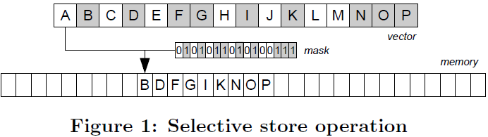   | 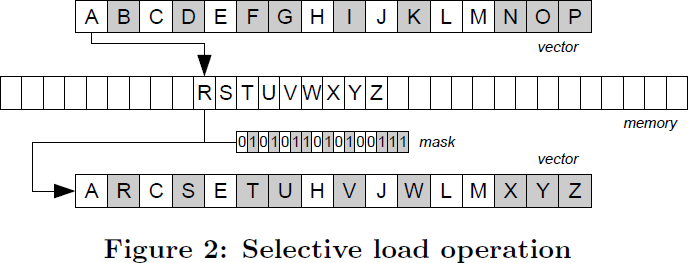     |
> | ---- | ---- |
> | 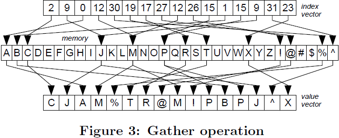     | 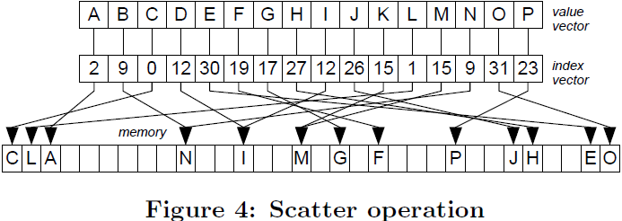     |
>
> Scatter operations execute stores to multiple locations. The input is a vector of indexes, an array pointer, and a vector of values. If multiple vector lanes point to the same location, we assume that the rightmost value will be written. By adding a mask as an input we can store lanes selectively. 
>
> Gathers and scatters are not really executed in parallel because the (L1) cache allows one or two distinct accesses per cycle. Executing *W* cache accesses per cycle is an impractical hardware design. Thus, random memory accesses have to be excluded from the *O*(*f* (*n*)*/W* ) vectorization rule. 
>
> Gathers are supported on the latest mainstream CPUs (Haswell) but scatters are not. Older mainstream CPUs (e.g., Sandy Bridge) support neither. Emulating gathers is possible at a performance penalty, which is small if done carefully. We discuss more hardware details in Appendix B. 
>
> Selective loads and stores are also not supported on the latest mainstream CPUs, but can be emulated using vector permutations. The lane selection mask is extracted as a bitmask and is used as an array index to load a permutation mask from a pre-generated table. The data vector is then permuted in a way that splits the active lanes of the mask to the one side of the register and the inactive lanes to the other side. In case of a selective store we can store the vector (unaligned) and in case of a selective load, we load a new vector (unaligned) and blend the two vectors to replace the inactive lanes. This technique was first used in vectorized Bloom filters [27] on CPUs, without defining the operations. We describe the Xeon Phi instructions in Appendix C.
>

在本节中，我们将定义实现向量化数据库运算符所需的基本向量操作。前两个操作被称为**选择性加载**和**选择性存储**，是空间上连续的内存访问，使用向量通道的**子集**加载或存储值。最后两个操作是空间上不连续的内存加载和存储，分别称为 **gather** 和 **scatter**。

选择性存储将向量通道的特定子集连续写入内存位置。要写入的向量通道的子集是使用向量或标量寄存器作为掩码来决定的，不能将其限制为常量。

选择性加载是选择性存储的对称操作，从内存连续位置加载到基于掩码的向量通道子集。掩码中<u>不活动</u>的通道在向量中保留其先前的值。

|      |      |
| ---- | ---- |
|      |      |

**Gather** 操作从非连续位置加载值。输入是<u>索引向量</u>和<u>一个数组指针</u>。输出是<u>一个向量</u>，包含各个数组单元格的值。通过添加掩码作为输入操作数，我们定义了在通道子集上操作的选择性 **gather**。非活动掩码通道保留其先前的内容。

**Scatter** 操作将值存储到多个位置。输入是索引向量、数组指针和值向量。如果多个向量通道指向同一位置，我们假设将写入最右边的值。通过添加掩码作为输入，我们可以选择性地存储通道。

**Gather** 和 **Scatter** 并不是**真正并行执行**，因为 (L1) 缓存每个周期只允许==进行一次或两次**不同**的访问==。每个周期执行 *W* 次缓存访问是一种不切实际的硬件设计。因此，随机内存访问必须从 $O(f (n)/W)$  向量化规则中排除。

最新的主流 CPU (Haswell) 支持 **Gather**，但不支持 **Scatter**。较老的主流 CPU（例如 Sandy Bridge）都不支持。模拟  **Gather** 可能会导致性能损失，如果小心完成，性能损失很小。我们在附录 B 中讨论了更多硬件细节。

最新的主流 CPU 也不支持选择性加载和存储，但可以使用<u>==向量排列==</u>来模拟。**通道选择掩码**被提取为**位掩码**，并用作数组索引以从预生成的表中加载置换掩码。然后，以一种将掩码的<u>==活动通道==</u>分割到寄存器的一边，将<u>==非活动通道==</u>分割到另一边的方式排列数据向量。在选择性存储的情况下，我们可以<u>存储向量</u>（未对齐），在选择性加载的情况下，我们<u>加载一个新向量</u>（未对齐）并混合两个向量以替换非活动通道。该技术首先用于 CPU 上的向量化布隆过滤器 [27]，但没有定义操作。我们在附录 C 中描述了 Xeon Phi 指令。

## 4 SELECTION SCANS

> Selection scans have re-emerged for main-memory query execution and are replacing traditional **unclustered indexes** in modern OLAP DBMSs [28]. Advanced optimizations include lightweight bit compression [39] to reduce the RAM bandwidth, generation of statistics to skip data regions [28], and scanning of <u>**bitmaps-zonemaps**</u> to skip ==cache lines== [35]. 
>
> Linear selective scan performance has been associated with branch mispredictions, if the operator is implemented as shown in Algorithm 1. Previous work has shown that converting control flow to data flow can affect performance, making different approaches optimal per selectivity rate [29]. Branches can be eliminated as shown in Algorithm 2 to avoid misprediction penalties, at the expense of accessing all payload columns and eagerly evaluating all selective predicates.
>
> > **Algorithm 1** Selection Scan (Scalar Branching)
> > **Algorithm 2** Selection Scan (Scalar Branchless)
>
> Vectorized selection scans use selective stores to **store** the lanes that satisfy the selection predicates. We use SIMD instructions to evaluate the predicates resulting in a bitmask of the qualifying lanes. Partially vectorized selection extracts one bit at a time from the bitmask and accesses the corresponding tuple. Instead, we use the bitmask to selectively store the qualifying tuples to the output vector at once.
>
> When the selection has a very low selectivity, it is desirable to avoid accessing the payload columns due to the performance drop caused by the memory bandwidth. Furthermore, when the branch is speculatively executed, we issue needless loads to payloads. <u>To avoid reducing the bandwidth, we use a small cache resident buffer that stores indexes of qualifiers rather than the actual values.</u> When the buffer is full, we reload the indexes from the buffer, gather the actual values from the columns, and flush them to the output. This variant is shown in Algorithm 3. Appendix A describes the notation used in the algorithmic descriptions. 
>
> When we materialize data on RAM without intent to reuse them soon, we use streaming stores. Mainstream CPUs provide non-temporal stores that bypass the higher cache levels and increase the RAM bandwidth for storing data. Xeon Phi does not support scalar streaming stores, but provides an instruction to overwrite a cache line with data from a vector without first loading it. This technique requires the vector length to be equal to the cache line and eliminates the need for write-combining buffers used in mainstream CPUs. All operators that write the output to memory sequentially, use buffering, which we omit in the algorithmic descriptions.
>
> >**Algorithm 3** Selection Scan (Vector)
>

在现代 OLAP DBMSs [28]中，选择扫描重新出现在内存查询执行中，并正在取代传统的**非聚集索引**。高级优化包括轻量级位压缩 [39]以减少 RAM 带宽、生成统计数据以跳过数据区域 [28]，以及扫描 <u>**bitmaps-zonemaps**</u> 以跳过缓存行 [35]。

如果算子的实现如算法 1 所示，则**<u>线性选择性扫描</u>**的性能与分支预测错误有关。之前的工作表明，将**控制流**转换为**数据流**会影响性能，从而使不同的方法根据选择性率达到最优 [29]。如算法 2 所示，可以消除分支以避免**错误预测惩罚**，代价是访问所有的有效负载列，并<u>==急切地==</u>计算所有选择性谓词。

| 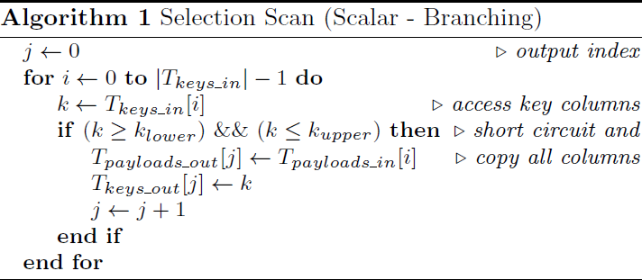     | 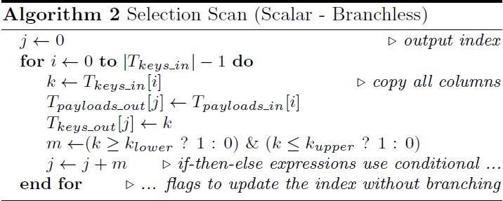     |
| ---- | ---- |

向量化选择扫描使用==选择性存储==来**存储**满足选择谓词的通道。我们使用 SIMD 指令来计算谓词，从而得到符合条件通道的位掩码。部分向量化选择每次从位掩码中提取一位，并访问相应的元组。相反，我们使用位掩码来有选择地一次性将符合条件的元组存储到输出向量中。

当选择的选择性很低时，最好避免访问有效载荷列，因为内存带宽会导致性能下降。此外，当分支被推测执行时，我们向有效负载发出不必要的**加载**。为了避免减少带宽，我们使用一个小的缓冲区来存储符合条件的索引而不是实际值。当缓冲区已满时，我们从缓冲区重新加载索引，从列中收集实际值，并将它们刷新到输出。这种变体如算法 3 所示。附录 A 描述了算法描述中使用的符号。
| 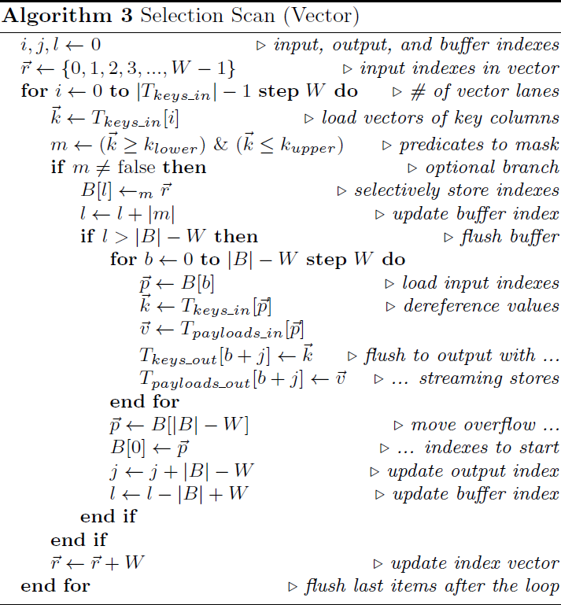 |
| :----------------------------------------------------------: |

当我们在内存中物化数据而不打算很快重用它们时，我们使用<u>**流式存储**</u>（Stream Store）。主流 CPU 提供<u>**非临时存储**</u>（non-temporal store），可以绕过较高的缓存层，且增加了用于存储数据的内存带宽。Xeon Phi 不支持标量<u>流式存储</u>，但提供了一条指令，<u>在不首先加载向量的情况下，用向量中的数据覆盖缓存行</u>。这种技术要求向量长度等于高速缓存行，并且消除了对主流 CPU 中使用<u>**写组合缓冲区**</u>的需要。所有按顺序将输出写入内存的运算符都使用缓冲，在算法描述中省略了它。

##  5 HASH TABLES

> Hash tables are used in database systems to execute joins and aggregations since they allow constant time key lookups. In hash join, one relation is used to build the hash table and the other relation probes the hash table to find matches. In group-by aggregation they are used either to map tuples to unique group ids or to insert and update partial aggregates. 
>
> Using SIMD instructions in hash tables has been proposed as a way to build bucketized hash tables. Rather than comparing against a single key, we place multiple keys per bucket and compare them to the probing key using SIMD vector comparisons. We term the approach of comparing a single input (probing) key with multiple hash table keys, *horizontal vectorization*. Some hash table variants such as bucketized cuckoo hashing [30] can support much higher load factors. Loading a single 32-bit word is as fast as loading an entire vector, thus, the cost of bucketized probing **diminishes** to extracting the correct payload, which requires log *W* steps. 
>
> Horizontal vectorization, if we expect to search fewer than *W* buckets on average per probing key, is wasteful. For example, a 50% full hash table with one match per key needs to access ≈ 1.5 buckets on average to find the match using linear probing. In such a case, comparing one input key against multiple table keys cannot yield high improvement and takes no advantage of the increasing SIMD register size. 
>
> In this paper, we propose a generic form of hash table vectorization termed *vertical vectorization* that can be applied to any hash table variant without altering the hash table layout. **The fundamental principle is to process a different input key per vector lane**. All vector lanes process different keys from the input and access different hash table locations. 
>
> The hash table variants we discuss are linear probing (Section 5.1), double hashing (Section 5.2), and cuckoo hashing (Section 5.3). For the hash function, we use multiplicative hashing, which requires two multiplications, or for 2*^(n)* buckets, one multiplication and a shift. Multiplication costs very few cycles in mainstream CPUs and is supported in SIMD.
>

哈希表在数据库系统中用于执行 Join 和聚合，因为它们允许常量时间的 *key* 查找。在 Hash join 中，一个**关系**用于构建哈希表，另一个**关系**探测哈希表以找到匹配项。在分组聚合中，它们用于将元组映射到唯一的组 ID，或者用于插入和更新部分聚合。

在哈希表中使用 SIMD 指令是一种构建**分桶哈希表**的方法。在每个桶中放置多个 *key*，使用 SIMD 将它们与探测 *key* 进行向量化比较，而不是与单个 *key* 进行比较。我们将单个输入（探测）*key* 与多个哈希表 *key* 比较的方法称为**水平向量化**。一些哈希表变体，例如 bucketized cuckoo hashing [30]，可以支持更高的负载因子。加载单个 32 位的**字**与加载整个向量一样快，因此，分桶探测的成本减少到和提取正确的有效负载一样，这需要 $log W$ 个步骤。

如果我们期望每个探测 *key* 平均搜索少于 *W* 个桶，水平向量化是浪费的。例如，一个 50% 完整的哈希表，每个 *key* 一个匹配，使用线性探测来找到匹配项平均需要访问 ≈1.5 个桶。在这种情况下，将一个输入 *key* 与多个哈希表 *key* 进行比较不会带来很大的性能提升，也无法利用 SIMD 寄存器大小的增加。

本文，我们提出了一种哈希表向量化的通用形式，称为**垂直向量化**，可应用于哈希表的任何变体，而无需改变哈希表布局。**基本原则是为每个向量通道处理不同的输入 *key***。所有向量通道都处理来自输入的不同 *key*，并访问哈希表的不同位置。

我们讨论的哈希表变体是线性探测（第 5.1 节）、双重哈希（第 5.2 节）和 cuckoo 哈希（第 5.3 节）。对于哈希函数，我们使用乘法哈希，这需要两次乘法，或者对于 2^n^ 个桶，一次乘法和一次移位。乘法在主流 CPU 中花费很少的周期，并且 SIMD 也支持。

### 5.1 Linear Probing

> Linear probing is an open addressing scheme that, to either insert an entry or terminate the search, traverses the table linearly until an empty bucket is found. The hash table stores keys and payloads but no pointers. The scalar code for probing the hash table is shown in Algorithm 4.
>
> > **Algorithm 4** Linear Probing Probe (Scalar)
> > **Algorithm 5** Linear Probing Probe (Vector)
>
> The vectorized implementation of probing a hash table using a linear probing scheme is shown in Algorithm 5. Our vectorization principle is to process a different key per SIMD lane using gathers to access the hash table. Assuming *W* vector lanes, we process *W* different input keys on each loop. <u>Instead of using a nested loop to find all matches for the *W* keys before loading the next *W* keys, we reuse vector lanes as soon as we know there are no more matches in the table, by selectively loading new keys from the input to replace finished keys</u>. Thus, each key executes the same number of loops as in scalar code. Every time a match is found, we use selective stores to write to the output the vector lanes that have matches. In order to support each key having executed an arbitrary number of loops already, we keep a vector of offsets that maintain how far each key has searched in the table. When a key is overwritten, the offset is reset to zero.
>
>
> A simpler approach is to process *W* keys at a time and use a nested loop to find all matches. However, **==the inner loop would be executed as many times as the maximum number of buckets accessed by any one of the *W* keys==**, underutilizing the SIMD lanes, because the average number of accessed buckets of *W* keys can be significantly smaller than the maximum. By reusing vector lanes dynamically, we are reading the probing input “out-of-order”. Thus, the probing algorithm is no longer *stable*, i.e., the order of the output does not always match the previous order of the probing input.
>
> Building a linear probing table is similar. We need to reach an empty bucket to insert a new tuple. The scalar code is shown in Algorithm 6 and the vector code in Algorithm 7.
>
> > **Algorithm 6** Linear Probing Build (Scalar)
> > **Algorithm 7** Linear Probing Build (Vector)
>
> The basics of vectorized probe and build of linear probing hash tables are the same. We process different input keys per SIMD lane and on top of gathers, we now also use scatters to store the keys non-contiguously. We access the input“out-oforder” to reuse lanes as soon as keys are inserted. To insert tuples, we first gather to check if the buckets are empty and then scatter the tuples only if the bucket is empty. <u>==The tuples that accessed a non-empty bucket increment an offset vector in order to search the next bucket in the next loop==</u>.
>
>
> In order to ensure that multiple tuples will not try to fill the same empty bucket, we add a conflict detection step before scattering the tuples. Two lanes are conflicting if they point to the same location. However, we do not need to identify both lanes but rather the leftmost one that would get its value overwritten by the rightmost during the scatter. <u>==To identify these lanes, we scatter arbitrary values using a vector with unique values per lane (e.g., [1,2,3,...,*W* ])==</u>. Then, we gather using the same index vector. If the scattered matches the gather value, the lane can scatter safely. The conflicting lanes search the next bucket in the next loop.
>
> Future SIMD instruction sets include special instructions that can support this functionality (vpconflictd in AVX 3), thus saving the need for the extra scatter and gather to detect conflicts. Nevertheless, these instructions are not supported on mainstream CPUs or the Xeon Phi as of yet. 
>
> If the input keys are unique (e.g., join on a candidate key), we can scatter the keys to the table and gather them back to find the conflicting lanes instead of a constant vector with unique values per lane. Thus, we save one scatter operation. 
>
> The algorithmic descriptions show the keys and values of the hash table on separate arrays. In practice, the hash table uses an interleaved key-value layout. To halve the number of cache accesses, we pack multiple gathers into fewer wider gathers. For example, when using 32-bit keys and 32-bit payloads, the two consecutive 16-way 32-bit gathers of the above code can be replaced with two 8-way 64-bit gathers and a few shuffle operations to split keys and payloads. The same applies to scatters (see Appendix E for details).
>
> For both probing and building, selective loads and stores assume there are enough items in the input to saturate the vector register. To process the last items in the input, we switch to scalar code. The last items are bounded in number by $2 * W$ , which is negligible compared to the total number of input tuples. Thus, the overall throughput is unaffected.

线性探测是一种开放寻址方案，为了插入条目或终止搜索，线性遍历表直到找到一个空桶为止。哈希表存储 *key* 和有效负载但不存储指针。用于探测哈希表的标量代码如算法 4 所示。

| 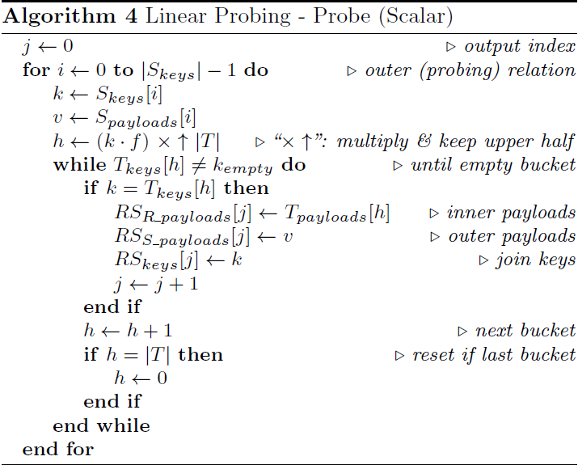     | 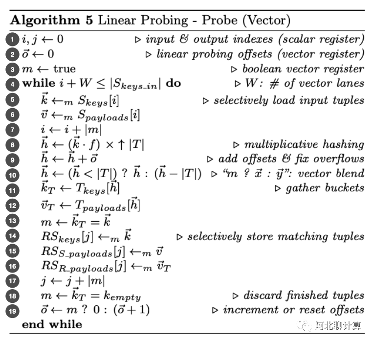     |
| ---- | ---- |

算法 5 显示了使用线性探测方案**探测**哈希表的向量化实现。我们的向量化原理是使用 gather 来访问哈希表，每个 SIMD 通道处理不同的 *key*。假设有 *W* 个向量通道，我们在每轮循环中处理 *W* 个不同的输入 *key*。<u>在加载下一轮 *W* 个 *key* 之前，我们没有使用嵌套循环来查找 *W* 个 *key* 的所有匹配项，而是在知道表中没有更多匹配项时，通过有选择地从输入中加载新 *key* 来替换已完成的 *key*，重用向量通道</u>。因此，每个 *key* 执行的循环次数与标量代码相同。每次找到匹配项时，都会使用**选择性存储**将具有匹配项的向量通道写入输出。为了支持那些已经执行了任意数量循环的 *key*，我们保留了一个偏移量向量，用于维护每个 *key* 在表中搜索的距离。当某个 *key* 被覆盖时，重置偏移量为 0。

更简单的方法是一次处理 *W* 个 *key*，并使用嵌套循环来查找所有匹配项。然而，**==内部循环的执行次数将与任何一组 *W* 个 *key* 访问的桶的最大数量一样多==**，因而未充分利用 SIMD 通道，因为 *W* 个 *key* 访问的桶的平均数量可能明显小于最大桶数。通过动态重用向量通道，我们正在**乱序**读取探测输入。因此，探测算法不再*稳定*，即输出的顺序并不总是与探测输入之前的顺序匹配。

线性探测表的**构建**类似。我们需要找到一个空桶以插入一个新的元组。标量代码如算法 6 所示，向量代码如算法 7 所示。

| 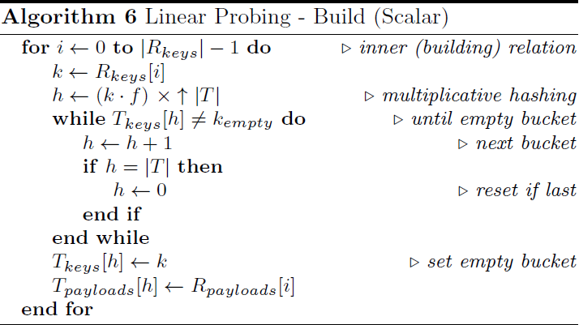     | 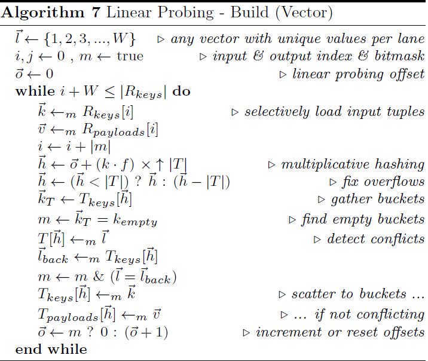     |
| ---- | ---- |

向量化探测和构建线性探测散哈希的基础是相同的。<u>==基于 gather==</u>，我们在每个 SIMD 通道处理不同的输入 *key*，现在还使用 scatters 来非连续地存储 *key*。一旦插入 *key*，就“乱序”访问输入以重用车道。为了插入元组，我们首先 **gather** 以检查桶是否为空，然后仅当桶为空时才 *scatter* 元组。<u>==访问非空桶的元组会递增加一个偏移向量，以便在下一个循环中搜索下一个桶==</u>。

为了确保多个元组不会尝试填充同一个空桶，我们在 scatter 元组之前添加了冲突检测步骤。 如果两条通道指向同一位置，则它们是冲突的。然而，我们不需要同时识别两条通道，而是需要识别最左边的通道，在 scatter 过程中，最右边的通道将覆盖其值。为了识别这些通道，我们使用每个通道具有唯一值的向量（例如，[1,2,3,...,*W*]）来 scatter 任意值。然后，我们使用相同的索引向量进行 gather 。如果 scatter 的值与 gather 的值匹配，则通道可以安全 scatter。冲突通道会在下一轮循环中搜索下一个桶。

未来的 SIMD 指令集包括可以支持此功能的特殊指令（AVX 3 中的 `vpconflictd`），从而无需额外的 gather 和 scatter 来检测冲突。然而，主流 CPU 或 Xeon Phi 目前尚不支持这些指令。

如果输入键是唯一的（例如，在候选 *key* 上 Join），我们可以将 *key* **scatter** 到表中，并将它们 **gather** 回来，以找到冲突的通道，<u>而不是让每个通道成为具有唯一值的常量向量</u>。我们因此节省了一个 **scatter** 操作。

这里算法描述的哈希表是在不同的数组中保存 *key* 和**值**。实际上，哈希表使用交错的 key-value 布局。为了将缓存访问次数减半，我们将多个 gather 打包为更少更宽的 gather。例如，当使用 32 位 key 和 32 位 payload 时，上述代码中两个连续的 16 路 32 位 gather 可以替换为两个 8 路 6 4位 gather 和一些用于拆分 key 和 payload 的 shuffle 操作。这同样适用于 **scatter**（详见附录 E）。

对于探测和构建，**选择性加载**和**选择性存储**假设输入中有足够的数据饱和向量寄存器。为了处理输入中的最后一项，要切换到标量代码。最后一项的数量以 $2 \cdot W$ 为界，与输入元组的总数相比可以忽略不计。因此，总吞吐量不受影响。

### 5.2 Double Hashing

> Duplicate keys in hash tables can be handled by storing the payloads in a separate table, or by **repeating** the keys. The first approach works well when most matching keys are repeated. The second approach works well with mostly unique keys, but suffers from clustering duplicate keys in the same region, if linear probing is used. Double hashing uses a second hash function to distribute collisions so that the number of accessed buckets is close to the number of true matches. Thus, we can use the second approach for both cases. Comparing multiple hash table layouts based on the number of repeats is out of the scope of this paper.
>
> >**Algorithm 8** Double Hashing Function
>
> Algorithm 8 shows the double hashing scheme that we propose. Here, *m* is the subset of vector lanes that have probed at least one bucket. If the primary hash function *h*~1~ is in [0*, |T|*), the **collision** hash function *h*~2~ is in [1*, |T|*), and *|T|* is prime, then *h* = *h*~1~ +*N·h*~2~ modulo *|T|* (double hashing) *never* repeats the same bucket for *N \< |T|* collisions. To avoid the expensive modulos, we use *h − |T|* when *h ≥ |T|*.

哈希表中的重复键可以通过将有效载荷存储在单独的表中，或者通过**重复** *key* 来处理。当大多数<u>匹配</u> *key* 重复时，第一种方法效果很好。第二种方法适用于大多数 *key* 唯一的情况，但如果使用线性探测，则会在同一区域聚集重复 *key*。双重哈希使用第二个哈希函数来分散冲突，使访问的桶数接近真正匹配的数量。这样，两种情况都可以使用第二种方法。基于重复数量比较多种哈希表布局超出了本文的范围。

|  |
| :----------------------------------------------------------: |

算法 8 展示了我们提出的双重哈希方案。这里，*m* 是探测过至少一个桶的向量通道的子集。如果主哈希函数 *h*~1~ 在 [0, |T|) 中，==**碰撞**哈希函数 *h*~2~ 在 [1, |T|) 中，并且 |T| 是素数，则 *h* = *h*~1~ +*N·h*~2~ % |T| （双重哈希）**不会**对 N < |T|  重复碰撞同一个桶==。**为了避免昂贵的取模**，当 h ≥ |T| 时，我们使用 h − |T|。

### 5.3 Cuckoo Hashing
> Cuckoo hashing [23] is another hashing scheme that uses multiple hash functions. and is the only hash table scheme that has been vectorized in previous work [30], as a means to allow multiple keys per bucket (horizontal vectorization). Here, we study cuckoo hashing to compare our (vertical vectorization) approach against previous work [30, 42]. We also show that complicated control flow logic, such as cuckoo table building, can be transformed to data flow vector logic.
>
> The scalar code for cuckoo table probing, which we omit due to space requirements, can be written in two ways. In the simple way, we check the second bucket only if the first bucket does not match. The alternative way is to always access both buckets and blend their results using bitwise operations [42]. The latter approach eliminates branching at the expense of always accessing both buckets. Still, it has been shown to be faster than other variants on CPUs [42].
>
> > **Algorithm 9** Cuckoo Hashing Probing
>
Vectorized cuckoo table probing is shown in Algorithm 9. No inner loop is required since we have only two choices. We load *W* keys with an aligned vector load and gather the first bucket per key. For the keys that do not match, we gather the second bucket. Cuckoo tables do not directly support key repeats. Probing is stable by reading the input “inorder”, but accesses **==remote buckets==** when out of the cache. 
>
Building a cuckoo hashing table is more complicated. If both bucket choices are not empty, we create space by displacing the tuple of one bucket to its alternate location. This process may be repeated until an empty bucket is reached.
>
> >**Algorithm 10** Cuckoo Hashing Building
>
> Vectorized cuckoo table building, shown in Algorithm 10, reuses vector lanes to load new tuples from the input. The remaining lanes are either previously conflicting or displaced tuples. The newly loaded tuples gather buckets using one or both hash functions to find an empty bucket. The tuples that were carried from the previous loop use the alternative hash function compared to the previous loop. We scatter the tuples to the hash table and gather back the keys to detect conflicts. The lanes with newly displaced tuples, which were gathered earlier in this loop, and the conflicting lanes are passed through to the next loop. The other lanes are reused.

Cuckoo 哈希 [23] 是另一种使用多个哈希函数的<u>==哈希方案==</u>。作为一种每个桶允许有多个 *key* 的方法（水平向量化），它是唯一一个在之前的工作 [30] 中被向量化的<u>==哈希表方案==</u>。本文研究 Cuckoo  哈希，将所提出的方法（垂直向量化）与以前工作 [30、42] 进行比较。文中还证明，复杂的<u>==控制流逻辑==</u>，如构造 Cuckoo  哈希表，可以转化为<u>==数据流向量逻辑==</u>。

Cuckoo  哈希表探测的标量代码可以用两种方式编写，由于篇幅原因而省略。简单来说，我们只在第一个桶不匹配时才检查第二个桶。另一种方法是始终访问两个桶，并使用按位运算混合它们的结果 [42]。后一种方法消除了分支，但总是需要访问两个桶。尽管如此，已经证明它比 CPU 上的其他变体更快 [42]。

向量化的 Cuckoo  哈希表探测如算法 9 所示。因为只有两种选择，所以不需要内循环。我们使用对齐的向量加载加载 *W* 键，并 **gather** 每个键的第一个桶。对于不匹配的键，gather 第二个桶。Cuckoo 表不直接支持重复 *key*。通过**按顺序**读取输入，探测是稳定的，但在超出缓存时要访问**==远程桶==**。

构建 Cuckoo  哈希表要复杂得多。如果两个桶都不为空，通过将一个桶的元组置换到它的备用位置来创建空间。重复此过程，直到找到一个空桶为止。

| 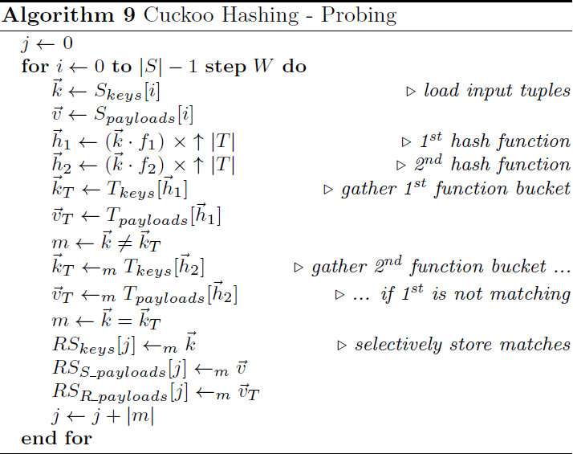     | 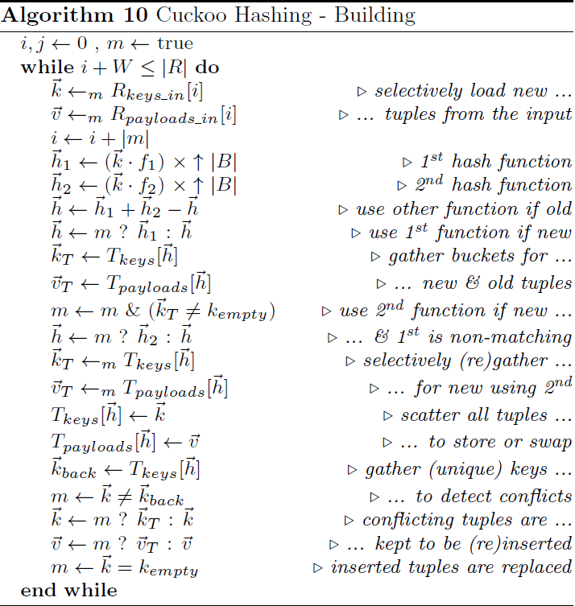     |
| ---- | ---- |

向量化构建Cuckoo  哈希表如算法 10 所示，重用向量通道以从输入中加载新的元组。剩余的通道**要么是先前冲突的元组，要么是被置换的元组**。新加载的元组使用一个或两个哈希函数 **gather** 桶，以找到空桶。与前一轮循环相比，从先前循环携带的元组使用替代哈希函数。我们将元组 **scatter** 到哈希表中，并 **gather** 回 *key* 以检测冲突。具有新置换元组（在此循环中较早期 gather ）的通道和冲突通道将传递到下一个循环。其他通道可重复使用。

#### 参考
1. [Cuckoo Hashing的应用及性能优化](https://developer.aliyun.com/article/563053)
2. [Cuckoo Hashing](https://medium.com/@kewei.train/cuckoo-hashing-95e037f4f024)

## 6 BLOOM FILTERS

> Bloom filters are an essential data structure for applying selective conditions across tables before joining them, a *semi join*. A tuple qualifies from the Bloom filter, if *k* specific bits are set in the filter, based on *k* hash functions. Aborting a tuple as soon as one bit-test fails is essential to achieve high performance, because most tuples fail after a few bit tests.
>
> Vectorized Bloom filter probing was recently shown to get a significant performance boost over scalar code on the latest mainstream CPUs, especially when the Bloom filter is cache resident [27]. The design and implementation follows the principle of processing different input keys per lane and is one of our influences for this paper. However, no fundamental vector opeations were explicitly defined. Here, we evaluate the vectorized Bloom filter design [27] on Xeon Phi.

Bloom 过滤器是一种基本的数据结构，用于在关联表之前，在表之间应用选择性条件，即**半连接**。如果 *k* 个哈希函数在过滤器中设置了 *k* 个特定位，则元组通过 Bloom 过滤器的测试。因为大多数元组都无法通过几个位测试，为了获得高性能，在一个位测试失败后，必须立即中止元组测试。

最近的研究表明，在最新的主流 CPU 上，与标量代码相比，向量化 Bloom 过滤器探测可以获得显著的性能提升，特别是当布隆过滤器驻留在缓存时 [27]。本文的创新点之一是，**设计和实现遵循每个通道处理不同输入 *key* 的原则**。本文没有明确定义基本向量操作，而是评估 Xeon Phi 上向量化 Bloom 过滤器的设计 [27]。

## 7 PARTITIONING

> Partitioning is a ubiquitous operation for modern hardware query execution as a way to split large inputs into cache-conscious non-overlapping sub-problems. For example, join and aggregation operators can use hash partitioning to split the input into small partitions that are distributed among threads and now fit in the cache [3, 4, 5, 14, 19, 26]. We study all types of partitioning: radix, hash, and range.

在现代硬件中执行查询，分区是一种普遍存在的操作，**它将大输入拆分为==缓存敏感==的、不重叠的子问题**。例如，Join 和聚合操作符可以用 Hash 分区将输入拆分为，分布在线程之间的小分区，适合放入缓存 [3, 4, 5, 14, 19, 26]。我们所有类型的分区：基数、Hash 和 Range。

### 7.1 Radix & Hash Histogram

> Prior to moving any data, in order to partition into contiguous segments, we use a histogram to set the boundaries. To compute the histogram, <u>==we increment a count based on the partition function of each key==</u>. By using multiplicative hashing, hash partitioning becomes equally fast to radix.
>
> > **Algorithm 11** Radix Partitioning Histogram
>
> Vectorized histogram generation, shown in Algorithm 11, uses gathers and scatters to increment counts. However, if multiple lanes scatter to the same histogram count, the count will still be incremented by 1 and all items (over)written to the same location. To avoid conflicts, we replicate the histogram to isolate each lane. Thus, lane *j* increments *H*′[*i · W* + *j*] instead of *H*[*i*]. In the end, the *W* histograms  are reduced into one. <u>==If the histograms do not fit in the fastest cache, we use 1-byte counts and flush on overflow==</u>.
>

在移动任何数据之前，为了拆分成连续的段，使用<u>==直方图==</u>来设置边界。为了计算直方图，<u>==为每个 *key* 的分区函数增加一个计数==</u>。使用乘法哈希，Hash 分区变得与基数分区一样快。

如算法 11 中所示，向量化直方图生成使用 **gather** 和 **scatter** 来递增计数。但是，如果多个通道 **scatter** 到同一个直方图计数，则计数仍只递增 1，并且所有数据（覆盖）写入同一位置。为避免冲突，我们复制直方图以隔离每条通道。因此，通道 *j* **递增** *H*′[*i · W* + *j*] 而不是 *H*[*i*]。最后，*W* 个直方图被缩减为一个直方图。<u>==如果直方图放不进最快的缓存，使用 1 字节计数，并在溢出时刷新==</u>。

### 7.2 Range Histogram

> Radix and hash partitioning functions are significantly faster than range partitioning functions. In range function, we execute a binary search over a sorted array of **splitters**. Although the array is cache resident, the number of accesses is logarithmic and all accesses are dependent on each other, thus the cache hit latency in the critical path is exposed [26]. Branch elimination only marginally improves performance. 
>
> Binary search can be vectorized using gather instructions to load the splitters from the sorted array, as shown in Algorithm 12, by processing *W* keys in parallel. The search path is computed by blending low and high pointers. We can assume without loss of generality that $P = 2^n$, since we can always patch the splitter array with maximum values.
>
> > **Algorithm 12** Range Partitioning Function
>
> Recently, a range index was proposed where each node has multiple splitters that are compared against one input key using SIMD comparisons [26]. Each node is at least as wide as a vector and scalar code is used for index arithmetic and to access the nodes (without gathers), relying on the superscalar pipeline to hide the cost of scalar instructions. The SIMD index can be seen as horizontal vectorization for binary search and is evaluated on simple and complex cores.

基数和哈希分区函数明显快于范围分区函数。在范围函数中，我们对已排序的**拆分器**数组执行二分搜索。虽然数组有缓存，但访问次数是对数的，所有访问都相互依赖，因此暴露了关键路径中的**缓存命中延迟** [26]。分支消除只会略微提高性能。

如算法 12 所示，通过并行处理 *W* 个键，可以使用 **gather** 指令对二分搜索进行向量化，以从排序的数组中加载**拆分器**。<u>==通过混合低指针和高指针来计算搜索路径==</u>。我们可以假设 $P=2^n$，而不失一般性，因为我们总是可以用最大值修补**拆分器**数组。

最近，提出了一种范围索引，其中每个节点都有多个**拆分器**，这些**拆分器**使用 SIMD 与一个输入键进行比较 [26] 。每个节点至少与向量一样宽，标量代码用于索引算法和访问节点（没有 **gather**），依靠超标量流水线来隐藏标量指令的成本。SIMD 索引可以看作是二分查找的水平向量化，可以在简单和复杂的核心上进行计算。

### 7.3 Shuffling

> The data shuffling phase of partitioning involves the actual movement of tuples. To generate the output partitions in contiguous space, we maintain an array of partition offsets, initialized by the **prefix sum** of the histogram. The offset array is updated for every tuple transferred to the output.
>
> Vectorized shuffling uses gathers and scatters to increment the offset array and scatters the tuples to the output. However, if multiple vector lanes have tuples that belong to the same partition, the offset would be incremented by one and these tuples would be (over)written to the same location.
>
> We compute a vector of conflict offsets, by using gathers and scatters to detect conflicts iteratively, as shown in Algorithm 13. First, we scatter unique values per lane to an array with *P* entries. Then, we gather using the same indexes and compare against the scattered vector to find conflicts. We increment the conflicting lanes and repeat the process for these lanes only until no lanes conflict. Even if *W* iterations are executed, the total number of accesses to distinct memory locations is always *W* , i.e., if *a~i~* is the number of accesses to distinct memory locations in iteration *i*, then $\sum a_i = W$.
>
> > **Algorithm 13** Conflict Serialization Function $(\vec{h}, A)$
>
> Since the rightmost lane is written during conflicts, tuples of the same partition in the same vector are written in reverse order. Also, per group of *k* conflicting lanes, the rightmost lane will incorrectly increment the offset by 1, not by *k*. By reversing the index vector during serialization, we update the offsets correctly and also maintain the input order. *Stable* partitioning is essential for algorithms such as LSB radixsort. Vectorized shuffling is shown in Algorithm 14.
>
> > **Algorithm 14** Radix Partitioning Shuffling
>

分区数据的 **shuffle** 阶段涉及元组的实际移动。为了在连续空间中生成输出分区，我们维护一个分区偏移数组，由直方图的**前缀和**初始化。输出每个元组时都会更新这个偏移数组。

向量化 **shuffle** 使用 **gather** 和 **scatter** 递增偏移数组，并将元组 **scatter** 到输出。但是，如果多个向量通道具有属于同一个分区的元组，则偏移量将递增 1，并且这些元组将被（覆盖）写入同一位置。

如算法 13 所示，通过使用 gather 和 scatter 迭代地检测冲突，获得**冲突偏移量**向量。首先，我们将每个通道的唯一值分散到具有 *P* 个元素的数组中。然后，我们使用相同的索引进行收集，并与分散的向量进行比较，以找到冲突。我们增加冲突通道，并仅对这些通道重复该过程，直到没有通道冲突为止。即使执行了 *W* 次迭代，对不同内存位置的访问总数始终为 *W* ，即，如果 *a~i~* 是迭代 *i* 中对不同内存位置的访问次数，则 $ \sum a_i = W$。

由于最右边的通道是在冲突期间写入的，所以同一向量中相同分区的元组是以相反的顺序写入的。此外，每组 *k* 个冲突通道，最右边的通道将错误地将偏移量增加 1，而不是 *k*。通过在序列化期间反转索引向量，我们可以正确更新偏移量并保持输入顺序。稳定分区对于 LSB 基数排序等算法至关重要。向量化 **shuffle** 如算法 14 所示。

### 7.4 Buffered Shuffling

> Shuffling, as described so far, is fast if the input is cache resident, but falls into certain performance pitfalls when larger than the cache. First, it suffers from TLB thrashing when the **partitioning fanout** exceeds the TLB capacity [20]. Second, it generates many cache conflicts [31] and in the worst case, may be bound by the size of the **cache associativity set.** ==Third, using normal stores, we trigger <u>cache loads</u> to execute the stores== and reduce the bandwidth due to loading cache lines that will only be overwritten [38].
>
> The vectorized implementation of simple non-buffered shuffling improves performance, but suffers from the same performance pitfalls as the scalar version. In general, vectorization improves performance compared to its scalar counterpart, but does not overcome algorithmic inefficiencies.
>
> To solve these problems, recent work proposed keeping the data in buffers and flushing them in groups [31]. If the buffers are small and packed together, they will not cause TLB or cache misses. Thus, with *W* buffer slots per partition, we reduce cache and TLB misses to 1*/W* . If the buffers are flushed with non-temporal stores, we facilitate hardware write combining and avoid polluting the cache with output data [38]. The fanout is bounded by the cache capacity to keep the buffer cache resident. The scalar code for buffered shuffling is thoroughly described in previous work [4, 26].
>
> The improvement of vectorized buffered shuffling shown in Algorithm 15 over vectorized unbuffered shuffling shown in Algorithm 14, is scattering the tuples to the cache resident buffer rather than directly to the output. For each vector of tuples, once the tuples are scattered, we iterate over the partitions that the current *W* input tuples belong to, and flush to the output when all available buffer slots are filled.
>
> > **Algorithm 15** Radix Partitioning Buffered Shuffling
>
> Since multiple tuples can be written to the buffer for the same partition on each loop, we identify which vector lanes will not cause overflow and scatter them selectively before flushing the buffers that are full. After the buffers are flushed, we scatter the remaining tuples to the buffer.
>
> We identify which vector lanes point to partitions that have filled their buffers using the output index. Given that tuples in multiple vector lanes can belong to the same partition, we identify the lanes that wrote to the last partition slot and ensure that we will not flush the same data twice in the same loop. 
>
> Flushing occurs “horizontally” one partition at a time, after selectively storing the partitions in the stack. Flushing data from the buffers to the output is done by streaming stores to avoid polluting the cache with output data [38]. Note that we are streaming to multiple outputs, thus, single output buffering (Section 4) does not apply.
>
> Hash partitioning is used to split the data into groups with non-overlapping keys and **has no need to be stable**. Instead of <u>==conflict serialization==</u>, we detect and process conflicting lanes during the next loop. Performance is slightly increased because very few conflicts normally occur per loop if *P > W* . 
>
> As in hash tables, if the tuples are keys and rids stored on separate arrays, **we do fewer and wider scatters by interleaving the two columns before storing to the buffers**.
>
> To partition multiple columns of payloads, we can either shuffle all the columns together as a unified tuple or shuffle one column at a time. Shuffling unified tuples should optimally compile specific code for each query at run time. Otherwise, we can process one column at a time using precompiled type-specialized code. In the latter approach, which we use here, during histogram generation, we store **partition destinations** alongside the **conflict serialization offsets** in a temporary array. Thus, we avoid reloading the wider keys as well as redoing conflict serialization for each column. The temporary array must be log *P* + log *W* bits wide per entry.

如前所述，如果输入可以驻留在缓存中，则 **shuffle** 速度很快，但当输入大于缓存时，就会陷入某些性能缺陷。首先，当**分区扇出**超过 TLB 容量时，会遭受 TLB 抖动 [20]。其次，它会产生许多缓存冲突 [31]，在最坏的情况下，可能会受到缓存关联集大小的限制。第三，我们触发缓存加载以执行存储（即使用普通存储），为了减少带宽，只加载会被覆盖的缓存行 [38]。

简单无缓冲 shuffle 的向量化实现提高了性能，但与标量版本存在相同的性能缺陷。一般来说，与标量相比，向量化提高了性能，但不能克服算法的低效。

为了解决这些问题，最近的工作提出将数据保存在缓冲区中，并分组刷新它们 [31]。如果缓冲区很小并且打包在一起，则不会导致 TLB 或缓存未命中。因此，每个分区有 *W* 个缓冲区插槽，我们将缓存和 TLB 未命中率减少到 1*/W* 。如果使用<u>**非临时存储**</u>（non-temporal store）刷新缓冲区，我们将促进硬件写入组合，避免输出数据污染缓存 [38]。为了能驻留在缓冲区中，扇出受缓存容量限制。**缓冲 shuffle** 的标量代码在之前的工作 [4、26] 中有详细描述。

算法 15 中所示的向量化缓冲 shuffle 算法相对于算法 14 中所示的向量化无缓冲 shuffle 的改进是：将元组 scatter 到缓冲区而不是直接输出。对于元组的每个向量，一旦元组分散，我们将迭代当前 *W* 个输入元组所属的分区，并在所有可用的缓冲区槽都已填满时刷新到输出。

> **Algorithm 15** Radix Partitioning Buffered Shuffling

由于在每个循环中可以将多个元组写入同一分区的缓冲区，因此我们确定哪些向量通道不会导致溢出，并在刷新已满的缓冲区之前有选择地分散它们。刷新缓冲区后，我们将剩余的元组分散到缓冲区中。

我们使用输出索引确定哪些向量通道指向的分区已填充其缓冲区。考虑到多个向量通道中的元组可以属于同一个分区，我们确定写入最后一个<u>==分区**槽**==</u>的通道，并确保我们不会在同一个循环中两次刷新相同的数据。

在有选择地将分区存储在堆栈中之后，每次**水平**刷新一个分区。通过<u>**流式存储**</u>（Stream Store）将数据从缓冲区刷新到输出，以避免输出数据污染缓存 [38]。请注意，我们是在流式传输到多个输出，因此，单输出缓冲区（第 4 节）不适用。

哈希分区用于将数据分成多个组，每个组的 *key* 不重叠，且不需要数据的稳定性。我们在下一个循环中检测并处理冲突通道，而不是<u>==冲突序列化==</u>。性能略有提高，因为如果 *P > W* ，每个循环通常会发生很少的冲突。

与在哈希表中一样，如果元组是存储在不同数组中的 *key* 和 *rid*，那么在存储到缓冲区之前，**交错两列来进行更少和更广泛的分散**。

要对多个列的有效载荷进行分区，我们可以将所有列作为一个统一的元组来 shuffle，也可以一次 shuffle 一列。Shuffle 统一元组应该在运行时为每个查询编译特定的代码。否则，我们可以使用预编译的类型专用代码一次处理一列。我们使用后一种方法，在直方图生成期间，将**分区目的地**和**冲突序列化偏移量**存储在一个临时数组中。因此，我们可以避免重新加载较宽的 *key*，以及为每列重做冲突序列化。临时数组的每条记录必须为 log *P* + log *W* 位宽。

## 8 SORTING

> Sorting is used in databases as a subproblem for join and aggregation. Sorting is also used for <u>==declustering==</u>, index building, compression, and duplicate elimination. Recent work showed that large-scale sorting is synonymous to partitioning. **Radixsort and comparison sorting based on range partitioning have comparable performance, by maximizing the fanout to minimize the number of partition passes [26].** 
>
> Here, we implement least-significant-bit (LSB) radixsort, which is the fastest method for 32-bit keys [26]. We do not evaluate larger keys as Xeon Phi only supports 32-bit integer arithmetic in vector code. Parallel LSB radixsort splits the input equally among threads and uses the prefix sum of the histograms from all threads to interleave the partition outputs. Histogram generation and shuffling operate shared nothing maximizing thread parallelism. By using vectorized buffered partitioning, we also maximize data parallelism.

在数据库中，排序是 Join 和聚合的子问题。排序还用于<u>==去聚类==</u>、索引构建、压缩和重复消除。最近的工作表明，大规模排序等同于分区。**通过最大化扇出来最小化分区的轮数，基数排序和基于范围分区的比较排序具有相当的性能 [26]**。

这里，我们实现了最低有效位 (LSB) 基数排序，这是 32 位 *key* 最快的方法 [26]。我们不评估更大的 *key*，因为 Xeon Phi 仅支持在向量代码中进行 32 位整数运算。并行 LSB 基数排序在线程之间平均分配输入，并使用来自所有线程**直方图的前缀和**来交错分区输出。直方图生成和 shuffle 操作不共享任何数据，最大化线程并行性。通过使用向量化缓冲分区，我们还可以最大限度地提高数据并行性。

## 9 HASH JOIN

> Joins are one of the most frequent operators in analytical queries that can be expensive enough to dominate query execution time. Recent work has focused on comparing main memory equi-joins, namely sort-merge join and hash join. The former is dominated by sorting [4, 14]. In the baseline hash join, the inner relation is built into a hash table and the outer relation probes the hash table to find matches.
>
> Partitioning can be applied to hash join forming multiple variants with different strengths and weaknesses. Here, we design three hash join variants using different degrees of partitioning that also allow for different degrees of vectorization. Because the inputs are much larger than the cache, we use buffered shuffling during partitioning (Section 7.4).
>
> In the first variant termed *no partition*, we do not use partitioning. The building procedure builds a shared hash table across multiple threads using atomic operations. The threads are synchronized using a barrier. The read-only probing procedure then proceeds without atomics. On the other hand, building the hash table cannot be fully vectorized because atomic operations are not supported in SIMD. 
>
> In the second variant termed *min partition*, we use partitioning to eliminate the use of atomics by not building a shared hash table. We partition the inner (building) relation into *T* parts, *T* being the number of threads, and build *T* hash tables without sharing across threads. During probing, we pick both which hash table and which bucket to search. All parts of the algorithm can be fully vectorized, after we slightly modify the code to probe across the *T* hash tables. 
>
> In the third variant termed *max partition*, we partition both relations until the inner relation parts are small enough to fit in a cache-resident hash table. In our implementation, the original partitioning phase splits both relations across *T* threads and each part is further partitioned by a single thread in one or more passes. The resulting partitions are used to build and probe hash tables in the cache, typically the L1. All parts of the algorithm can be fully vectorized.

Join 是分析查询中最常见的运算符之一，其开销可能足以支配整个查询执行时间。最近的工作重点是内存中的等值 join，即，sort-merge join和 hash join。前者的开销以排序为主 [4, 14]。在 hash join 的基础实现中，内部关系用于构建哈希表，外部关系用于探测哈希表以找到匹配项。

分区可以应用于 hash join，形成具有不同优点和缺点的多个变体。这里，我们设计了三个 hash join 的变体，使用不同程度的分区，也允许不同程度的向量化。因为输入比缓存大得多，所以我们在分区期间使用缓存 shuffle（第 7.4 节）。

第一个称为**无分区**变体，不使用分区。构建过程使用原子操作跨多个线程构建共享哈希表。线程使用屏障（barrier）进行同步。只读探测过程接下来不需要原子操作。另一方面，由于 SIMD 不支持原子操作，构建哈希表不能完全向量化。

第二种称为**最小分区**变体，因为使用分区不需要构建共享的哈希表，所以消除了原子指令（同步）。我们将内部（构建）关系划分为 *T* 部分，*T* 是线程数，构建 *T* 个不跨线程共享的哈希表。在探测期间，我们选择要搜索的哈希表和桶。在我们稍微修改代码以遍历 *T* 个哈希表后，算法的所有部分都可以完全向量化。

第三种称为**最大分区**变体，我们对两个关系进行分区，直到**内部关系**部分足够小，使得哈希表可以放进缓存中。在我们的实现中，原始分区阶段在 *T* 个线程中拆分两个关系，每个部分在单个线程进一步进行一轮或多轮分区。按分区构建和探测（缓存中的）哈希表，通常是 L1。算法的所有部分都可以完全向量化。

## 10 EXPERIMENTAL EVALUATION

We use three platforms throughout our evaluation. The first is a Xeon Phi co-processor based on the MIC design, the second has one Haswell CPU, and the third has four high-end Sandy Bridge CPUs. Details are shown in Table 1. 

> Table 1: Experimental platforms

We use the Haswell CPU to compare our vectorized implementations against scalar and state-of-the-art vectorized implementations, because Haswell has 256-bit SIMD registers and supports gathers, being the closest to the 512-bit SIMD registers of Xeon Phi. However, because one CPU cannot match the scale of Xeon Phi, we use four Sandy Bridge CPUs with comparable processing power and memory bandwidth to measure aggregate performance and power efficiency.

To compile for Xeon Phi, we use ICC 15 with the -mmic and the -no-vec flag to avoid automatic vectorization. To compile for mainstream CPUs, we use either ICC 15 or GCC 4.9, the fastest per case. In all cases we use -O3 optimization. For the Haswell CPU we use -mavx2 (AVX 2) and for the Sandy Bridge CPUs we use -mavx (SSE 4 with VEX). Xeon Phi runs Linux 2.6 as an embedded OS, the Haswell machine has Linux 3.13 and the Sandy Bridge machine has Linux 3.2. 

Unless specified otherwise, we use all hardware threads, including SMT, to minimize load and instruction latencies. All data are synthetically generated in memory and follow the uniform distribution. Uniform data are used in the most common analytical DBMS benchmarks, such as TPC-H, and are not particularly favorable to any specific operation. In fact, previous work has shown that joins, partitioning, and sorting are faster under skew [5, 26]. Nevertheless, optimizing for skew efficiency is out of the scope of this paper.

### 10.1 Selection Scans

Figure 5 shows the performance of selection scans on Xeon Phi and Haswell. The input table consists of 32-bit keys and 32-bit payloads and the selective condition on the key column is *kmin k kmax*, as shown in Section 4, where *kmin* and *kmax* are query constants. We vary the selectivity and measure the throughput of six selection scan versions, two scalar with and without branching [29], and four vectorized using two orthogonal design choices. First, we either select the qualifying tuples by extracting one bit at a time from the bitmask, or use vector selective stores. Second, we either access both keys and payloads during predicate evaluation and buffer the qualifiers, or we load the key column only and buffer the indexes of qualifiers, which are used to dereference the actual key and payload values during buffer flushing.

On Xeon Phi, scalar code is almost an order of magnitude slower than vector code, whereas on Haswell, vector code is about twice faster. Low selectivities are faster because RAM loading is faster than copying, and more payload column accesses are skipped. Branch elimination [29] improves performance on Haswell, but decreases performance on Xeon Phi due to slow set instructions. On Haswell, all vector versions are almost identical by saturating the bandwidth, while the branchless scalar code catches up on 10% selectivity. On Xeon Phi, avoiding payload column accesses dominates low selectivities, while using selective stores instead of extracting one tuple at a time dominates high selectivities. On the simple cores of Xeon Phi, vectorization is essential to saturate the bandwidth. On the complex cores of mainstream CPUs, vectorization remains useful for low selectivities.

> **Figure 5: Selection scan (32-bit key & payload)**

### 10.2 Hash Tables

In this section we evaluate hash table vectorization. The first set of experiments measures the probing throughput and compares against state-of-the-art scalar and vectorized approaches, on both Xeon Phi and Haswell. The second set evaluates iterative building and probing of shared-nothing hash tables on Xeon Phi only since Haswell has no scatters. 

Figure 6 shows linear probing (LP) and double hashing (DH). The input is a 32-bit column with 10⁹ keys, the output is a 32-bit column with the payloads of matches, almost all keys match, and the hash table is half full. The horizontal vector code uses bucketized hash table where each input key is compared against multiple table keys [30]. In our approach, vertical vector code, we compare multiple input keys against one hash table key each using gathers. We are up to 6X faster than everything else on Xeon Phi, and gain a smaller speedup for cache resident hash tables on Haswell.

> Figure 6: Probe linear probing & double hashing tables (shared, 32-bit key *→* 32-bit probed payload)

Figure 7 shows the probing throughput of cuckoo hashing, with the same setting as Figure 6. The scalar versions are either branching or branchless [42], and the vector versions are either horizontal (bucketized) [30] or vertical, where we evaluate two vertical techniques, loading both buckets and blending them, or loading the second bucket selectively. The branchless scalar version [42] is slower than branching scalar code on both Xeon Phi and Haswell. Also, branching scalar code is faster than branchless on Haswell using ICC, while GCC produces very slow branching code. Vertically vectorized code is 5X faster on Xeon Phi and 1.7X on Haswell.

Bucketized hash table probing is faster by using 128-bit SIMD (SSE 4) to probe 4 key, rather than use 256-bit SIMD (AVX 2) to probe 8 keys, due to faster in-register broadcasts.

> **Figure 7: Probe cuckoo hashing table (2 functions, shared, 32-bit key *→* 32-bit probed payload)**

Figure 8 interleaves building and probing of shared-nothing tables, as done in the last phase of partitioned hash join, using Xeon Phi. The build to probe ratio is 1:1, all keys match, and we vary the hash table size. The hash tables are 4 KB in L1, 64 KB in L2, and 1 MB out of cache. Both inputs have 32-bit keys and payloads, the output has the matching keys and the two payloads, the load factor is 50%, and we saturate Phi’s memory. Throughput is defined as (*|R|* + *|S|*)*/t*. The speedup is 2.6–4X when the hash table resides in L1, 2.4–2.7X in L2, and 1.2–1.4X out of the cache.

> **Figure 8: Build & probe linear probing, double  hashing, & cuckoo hashing on Xeon Phi (1:1 build– probe, shared-nothing, 2X 32-bit key & payload)**

In Figure 9, we modify the experiment of Figure 8 by varying the number of key repeats with the same output size. All tables are in L1 and the build to probe ratio is 1:10. The other settings are as in Figure 8. With no key repeats, the speedup is 6.6–7.7X, higher than Figure 8, since building is more expensive than probing and also detects conflicts. Here, building alone gets a speedup of 2.5–2.7X. With 5 key repeats, the speedup is 4.1X for DH and 2.7X for LP. Thus, DH is more resilient to key repeats than LP.

> **Figure 9: Build & probe linear probing, double hashing, & cuckoo hashing on Xeon Phi (1:10 build– probe, L1, shared-nothing, 2X 32-bit key & payload)**

### 10.3 Bloom Filters

In Figure 10, we measure Bloom filter probing throughput using the design of [27] with selective loads and stores for Xeon Phi. We disable loop unrolling and add buffering. The speedup is 3.6–7.8X on Xeon Phi and 1.3–3.1X on Haswell

>**Figure 10: Bloom filter probing (5 functions, shared, 10 bits / item, 5% selectivity, 32-bit key & payload)**

### 10.4 Partitioning

Figure 11 shows radix and hash histogram generation on Xeon Phi. On mainstream CPUs, the memory load bandwidth is saturated [26]. Scalar code is dominated by the partition function. By replicating each count *W* times, we get a 2.55X speedup over scalar radix. A slowdown occurs when we exceed the L1, but we can increase *P* by compressing to 8-bit counts. Conflict serialization does not replicate but is slower, especially if *P W* . If *P* is too large, both count replication and conflict serialization are too expensive.

> **Figure 11: Radix & hash histogram on Xeon Phi**

Figure 12 shows the performance of computing the range partition function. The binary search vectorization speedup is 7–15X on Xeon Phi and 2.4–2.8X on Haswell. SIMD range indexes [26] are even faster on Haswell but are slower on Xeon Phi, where the pipeline is saturated by scalar instructions. Each node has *W* keys and the root stays in registers.

> **Figure 12: Range function on Xeon Phi (32-bit key)**

Figure 13 measures shuffling on Xeon Phi using inputs larger than the cache. On mainstream CPUs, shuffling cannot be fully vectorized without scatters, but saturates the memory copy bandwidth at higher fanout [4, 26]. On Xeon Phi, among the unbuffered versions, vectorization achieves up to 1.95X speedup. Among the scalar versions, buffering achieves up to 1.8X speedup. Among the buffered versions, vectorization achieves up to 2.85X speedup, using up to 60% of the bandwidth. The optimal fanout, maximizing throughput bits, is 5–8 radix bits per pass. Unstable hash partitioning, shown here, is up to 17% faster than stable radix.

> **Figure 13: Radix shuffling on Xeon Phi (sharednothing, out-of-cache, 32-bit key & payload)**

### 10.5  Sorting & Hash Join

We now evaluate sorting and hash joins in three stages: first, we measure performance on Xeon Phi and highlight the impact of vectorization on algorithmic designs; second, we compare against 4 high-end CPUs to highlight the impact on power efficiency; and third, we study the cost of a generic implementation and materialization of multiple columns.

#### 10.5.1  Vectorization Speedup & Algorithmic Designs

Figure 14 shows the performance of LSB radixsort on Xeon Phi. The vectorization speedup is 2.2X over stateof-the-art scalar code and time scales with size. In mainstream CPUs, we are already almost saturated, since each partitioning pass runs close to the bandwidth [31, 26, 38].

> **Figure 14: Radixsort on Xeon Phi (LSB)**

Figure 15 shows the performance of the three hash join variants as described in Section 9, on Xeon Phi. We assume a foreign key join but our implementation is generic. The “nopartition” and the “min-partition” methods get small 1.05X and 1.25X speedups, while the fully partitioned gets a 3.3X speedup and becomes the fastest overall by a 2.25X gap, which is too large to justify hardware-oblivious joins [12]. Hash join is faster than sort-merge join [4, 14], since we sort 4*·*10⁸ in 0.6 seconds and join 2*×*2*·*10⁸ tuples in 0.54 seconds.

> **Figure 15: Multiple hash join variants on Xeon Phi (2 *·* 10 *da* 2 *·* 10 32-bit key & payload)**

Figure 16 shows the thread scalability of radixsort and partitioned hash join on Xeon Phi. The speedup is almost linear, even when using 2-way and 4-way SMT due to hiding load and instruction latencies. On Xeon Phi, using 4-way SMT is essential to hide the 4-cycle vector instruction latencies. On mainstream CPUs, LSB radixsort is again saturated, gaining only marginal speedup from 2-way SMT [26].
> **Figure 16: Radixsort & hash join scalability (**4 *·* 10⁸ **&** 2 *·* 10⁸ *da* 2 *·* 10⁸ **32-bit key & payload, log/log scale)**

#### 10.5.2 Aggregate Performance & Power Efficiency

We now compare Xeon Phi to 4 Sandy Bridge (SB) CPUs in order to get comparable performance, using radixsort and hash join. On the SB CPUs, we implemented partitioned hash join and use the source code of [26] for LSB radixsort.

Partitioning passes on the SB CPUs are memory bound, thus cannot benefit from full vectorization. Both radixsort and hash join on SB are NUMA aware and transfer the data at most once across CPUs [26]. To join the partitions in cache, we use horizontal linear probing, shown in Figure 6.

> Figure 17: Radixsort & hash join on Xeon Phi 7120P **versus 4 Xeon E5 4620 CPUs (sort** 4 *·* 10⁸ **tuples, join** 2 *·* 10⁸ *da* 2 *·* 10⁸ **tuples, 32-bit key & payload per table)**

As shown in Figure 17, radixsort and hash join are both ≈ 14% slower on the Phi compared to the 4 SB CPUs. If we assume the operating power of both platforms to be equally proportional to TDP, both radixsort and hash join are ≈ 1.5X more power efficient on the Phi. We also include results after equalizing the two platforms. We set the frequency of the SB CPUs to 1.2 GHz and halve the bandwidth of the Phi to 40 GB/s for copying, which is done by adjusting the code to access twice as many bytes as are processed. Phi is then 7% faster for radixsort and 8% slower for hash join.

As shown in previous work [4, 14], hash joins outperform sort-merge joins. Here, we join 2 *×* 2 *·* 10⁸ tuples faster than sorting 4*·*10⁸ tuples alone, also materializing the join output.

#### 10.5.3  *Multiple Columns, Types & Materialization*

Vector code cannot handle multiple types as easily as scalar code. So far we used 32-bit columns, which suffices for sorting orders and join indexes of 32-bit keys. Also, typegeneric materialization methods, such as radix-decluster [21], can only do a single pass that is bounded by the cache capacity. Type-generic buffered shuffling can solve both problems. 

Figure 18 measures radixsort with 32-bit keys by varying the number and width of payload columns. Per pass, we generate the histogram once and shuffle one column at a time. Shuffling 8-bit or 16-bit columns costs as much as 32bit columns since we are compute-bound. Also, Xeon Phi upcasts 8-bit and 16-bit operations to 32-bit vector lanes. This approach scales well with wider columns, as we sort 8-byte tuples in 0.36 seconds and 36-byte tuples in 1 second.

> **Figure 18: Radixsort with varying payloads on Xeon Phi (2 *·* 10⁸ tuples, 32-bit key)**

Figure 19 shows partitioned hash join with 32-bit keys and multiple 64-bit payload columns. Out of the cache, we shuffle one column at a time as in Figure 18. In the cache, we store rids in hash tables and then dereference the columns. 

A different materialization strategy would be, after joining keys and rids, to cluster to the order of the side with shorter payloads, and then re-partition to the order of the other side. Thus, instead of using radix-decluster [21] that is done in a single pass, we partition the shorter payloads in one or more passes to remain cache-conscious. Neverthless, finding the fastest strategy per case is out of the scope of this paper.

> **Figure 19: Hash join with varying payload columns on Xeon Phi (10⁷ *da* 10⁸ tuples, 32-bit keys)**

## 11. SIMD CPUS & SIMT GPUS

The SIMT model in GPUs exhibits some similarity to SIMD in CPUs. SIMT GPUs run scalar code, but “tie” all threads in a *warp* to execute the same instruction per cycle. For instance, gathers and scatters are written as scalar loads and stores to non-contiguous locations. Horizontal SIMD instructions can be supported via special shuffle instructions that operate across the warp. Thus, CPU threads are analogous to GPU warps and GPU threads are analogous to SIMD lanes. However, while conditional control flow is eliminated in SIMD code “manually”, SIMT transforms control flow to data flow automatically, by executing all paths and nullifying instructions from paths that are not taken per thread.

One-to-one conversion from SIMD to SIMT code is of limited use for in-memory database operators, due to the vastly different memory hierarchy dynamics. The speedup from SIMD vectorization is maximized for cache-conscious processing, which is achieved by partitioning. On the other hand, GPUs are fast even without partitioning [13, 24], due to good memory latency hiding. Sequential operators, such as selection scans, have already been studied in detail [36].

A comparison of GPUs and Xeon Phi is out of the scope of this paper. We view Xeon Phi as a potential CPU design and study the impact of vectorization on making it more suitable for analytical databases. Thus, we do not transfer data through the PCI-e bus of Xeon Phi in our evaluation.

## 12 CONCLUSION

We presented generic SIMD vectorized implementations for analytical databases executing in-memory. We defined fundamental vector operations and presented good vectorization principles. We implemented selection scans, hash tables, and partitioning using entirely vector code, and then combined them to build sorting and join operators. Our implementations were evaluated against scalar and stateof-the-art vector code on the latest mainstream CPUs, as well as the Xeon Phi co-processor that is based on many simple cores with large SIMD vectors. In the context of inmemory database operators, we highlighted the impact of vectorization on algorithmic designs, as well as the architectural designs and power efficiency, by making the simple cores comparable to complex cores. Our work is applicable to all SIMD processors, using either simple or complex cores.

## 13 REFERENCES

1.  M.-C. Albutiu et al. Massively parallel sort-merge joins in main memory multi-core database systems. *PVLDB*, 5(10):1064–1075, June 2012.

2.  P. Bakkum et al. Accelerating SQL database operations on a GPU with CUDA. In *GPGPU*, pages 94–103, 2010.

3.  C. Balkesen et al. Main-memory hash joins on multi-core CPUs: Tuning to the underlying hardware. In *ICDE*, pages 362–373, 2013.

4.  C. Balkesen et al. Multicore, main-memory joins: Sort vs. hash revisited. *PVLDB*, 7(1):85–96, Sept. 2013.

5.  S. Blanas et al. Design and evaluation of main memory hash join algorithms for multi-core CPUs. In *SIGMOD*, pages 37–48, 2011.

6.  P. Boncz et al. MonetDB/X100: Hyper-pipelining query execution. In *CIDR*, 2005.

7.  J. Chhugani et al. Efficient implementation of sorting on multi-core SIMD CPU architecture. In *VLDB*, pages 1313–1324, 2008.

8.  J. Cieslewicz et al. Automatic contention detection and amelioration for data-intensive operations. In *SIGMOD*, pages 483–494, 2010.

9.  D. J. DeWitt et al. Materialization strategies in a column-oriented DBMS. In *ICDE*, pages 466–475, 2007.

10. J. Hofmann et al. Comparing the performance of different x86 SIMD instruction sets for a medical imaging application on modern multiand manycore chips. *CoRR*, arXiv:1401.7494, 2014.

11. H. Inoue et al. AA-sort: A new parallel sorting algorithm for multi-core SIMD processors. In *PACT*, pages 189–198, 2007.

12. S. Jha et al. Improving main memory hash joins on Intel Xeon Phi processors: An experimental approach. *PVLDB*, 8(6):642–653, Feb. 2015.

13. T. Kaldewey et al. GPU join processing revisited. In *DaMoN*, 2012.

14. C. Kim et al. Sort vs. hash revisited: fast join implementation on modern multicore CPUs. In *VLDB*, pages 1378–1389, 2009.

15. C. Kim et al. Fast: fast architecture sensitive tree search on modern CPUs and GPUs. In *SIGMOD*, pages 339–350, 2010.

16. K. Krikellas et al. Generating code for holistic query evaluation. In *ICDE*, pages 613–624, 2010.

17. S. Larsen et al. Exploiting superword level parallelism with multimedia instruction sets. In *PLDI*, pages 145–156, 2000.

18. V. Leis et al. Morsel-driven parallelism: A NUMA-aware query evaluation framework for the many-core age. In *SIGMOD*, pages 743–754, 2014.

19. S. Manegold et al. Optimizing database architecture for the new bottleneck: Memory access. *J. VLDB*, 9(3):231–246, Dec. 2000.

20. S. Manegold et al. What happens during a join? dissecting CPU and memory optimization effects. In *VLDB*, pages 339–350, 2000.

21. S. Manegold et al. Cache-conscious radix-decluster projections. In *VLDB*, pages 684–695, 2004.

22. T. Neumann. Efficiently compiling efficient query plans for modern hardware. *PVLDB*, 4(9):539–550, June 2011.

23. R. Pagh et al. Cuckoo hashing. *J. Algorithms*, 51(2):122–144, May 2004.

24. H. Pirk et al. Accelerating foreign-key joins using asymmetric memory channels. In *ADMS*, 2011.

25. O. Polychroniou et al. High throughput heavy hitter aggregation for modern SIMD processors. In *DaMoN*, 2013.

26. O. Polychroniou et al. A comprehensive study of main-memory partitioning and its application to large-scale comparisonand radix-sort. In *SIGMOD*, pages 755–766, 2014.

27. O. Polychroniou et al. Vectorized Bloom filters for advanced SIMD processors. In *DaMoN*, 2014.

28. V. Raman et al. DB2 with BLU acceleration: So much more than just a column store. *PVLDB*, 6(11):1080–1091, Aug. 2013.

29. K. A. Ross. Selection conditions in main memory. *ACM Trans. Database Systems*, 29(1):132–161, Mar. 2004.

30. K. A. Ross. Efficient hash probes on modern processors. In *ICDE*, pages 1297–1301, 2007.

31. N. Satish et al. Fast sort on CPUs and GPUs: a case for bandwidth oblivious SIMD sort. In *SIGMOD*, pages 351–362, 2010.

32. B. Schlegel et al. Scalable frequent itemset mining on many-core processors. In *DaMoN*, 2013.

33. L. Seiler et al. Larrabee: A many-core x86 architecture for visual computing. *ACM Trans. Graphics*, 27(3), Aug. 2008.

34. J. Shin. Introducing control flow into vectorized code. In *PACT*, pages 280–291, 2007.

35. L. Sidirourgos et al. Column imprints: A secondary index structure. In *SIGMOD*, pages 893–904, 2013.

36. E. A. Sitaridi et al. Optimizing select conditions on GPUs. In *DaMoN*, 2013.

37. M. Stonebraker et al. C-store: A column-oriented DBMS. In *VLDB*, pages 553–564, 2005.

38. J. Wassenberg et al. Engineering a multi core radix sort. In *EuroPar*, pages 160–169, 2011.

39. T. Willhalm et al. SIMD-scan: ultra fast in-memory table scan using on-chip vector processing units. *PVLDB*, 2(1):385–394, Aug. 2009.

40. Y. Ye et al. Scalable aggregation on multicore processors. In *DaMoN*, 2011.

41. J. Zhou et al. Implementing database operations using SIMD instructions. In *SIGMOD*, pages 145–156, 2002.

42. M. Zukowski et al. Architecture-conscious hashing. In *DaMoN*, 2006.

## APPENDIX

### A.  **NOTATION**

> We now explain the notation of the vectorized algorithmic descriptions. Boolean vector operations result in boolean vector bitmasks that are shown as scalar variables. For example, $m \leftarrow \vec{x}<\vec{y}$ results in the bitmask *m*. Assignments such as $m \leftarrow true$, set the *W* bits of *m*. Vectors as array indexes denote a gather or a scatter. For example, $\vec{x} \leftarrow A[y]$ is a vector load, while $\vec{x} \leftarrow A[\vec{y}]$ is a gather. Selective loads and stores as well as selective gathers and scatters use a bitmask as a subscript in the assignment. For example, $\vec{x} \leftarrow_m A[y]$ is a selective load, while $\vec{x} \leftarrow_m A[\vec{y}]$ is a selective gather. $|m|$ is the bit population count of *m* and $|T|$ is the size of array *T* . If-then-else statements, such as $\vec{x} \leftarrow m\ ?\ \vec{y}:\vec{z} $, use vector blending. Finally, scalar values in vector expressions use vectors generated before the main loop. For example, $\vec{x} \leftarrow \vec{x}+k$ and $m \leftarrow \vec{x}>k$ use a vector with *k* in all lanes.

我们现在解释描述向量化算法的符号。布尔向量操作的结果是布尔向量位掩码，以标量的形式显示。例如，$m \leftarrow \vec{x}<\vec{y}$ 的结果是位掩码 *m*。如 $m \leftarrow true$ 这样的赋值，表示设置 *m* 的 *W* 位。作为数组索引的向量表示 **gather**  或 **scatter**。例如，$\vec{x} \leftarrow A[y]$ 表示向量加载，而 $\vec{x} \leftarrow A[\vec{y}]$ 是  **gather** 。选择性加载和存储，以及选择性 **gather** 和 **scatter**，都使用位掩码作为赋值的下标。例如，$\vec{x} \leftarrow_m A[y]$ 是选择性加载，而 $\vec{x} \leftarrow_m A[\vec{y}]$ 是选择性 **gather**。$|m|$ 是 *m* 的位总数， $|T|$ 是数组 *T* 的大小。If-then-else 语句，例如 $\vec{x} \leftarrow m\ ?\ \vec{y}:\vec{z} $，使用向量混合。最后，向量表达式中的标量值使用在主循环之前生成的向量。例如，$\vec{x} \leftarrow \vec{x}+k$ 和 $m \leftarrow \vec{x}>k$ 在所有通道中使用带有 *k* 的向量。

### B. GATHER & SCATTER

In the latest mainstream CPUs (AVX 2), gathers and scatters are executed in one instruction. On Xeon Phi, each instruction call accesses one cache line and is called repeatedly until all *W* lanes are processed. If *N* distinct cache lines are accessed, the instructions are issued *N* times with *N W* .

An implementation for 16-way gather on Xeon Phi is shown below. The rax scalar register holds the array pointer. The 512-bit zmm0 vector holds the indexes and zmm1 vector holds the loaded values. k1 is a 16-bit boolean vector set by kxnor. Each call to vpgatherdd finds the leftmost set bit in k1, extracts the index from zmm0, identifies other lanes pointing to the same cache line, loads the values in zmm1, and resets the bits in k1. The jknzd branches back if k1 has more set bits.

Scatters are symmetric to gathers. If multiple lanes of the index vector have the same value, the value in the rightmost lane is written but all respective bits in k1 are reset. We can detect multiple references to the same cache line by checking if multiple bits of k1 were reset, but we cannot distinguish between conflicts and distinct writes in the same cache line. 

Non-selective gathers and scatters initially have all bits in k1 set. Selective gathers and scatters, use k1 and zmm1 as both inputs and outputs to load a subset of lanes determined by k1. The rest lanes in zmm1 not set in k1 are unaffected. 

The latency and throughput of each gather or scatter operation is determined by the number of cache lines accessed. Assuming all cache lines are L1 resident, the operation is faster if assembled in fewer cache lines. For the same cache lines, accessing fewer items reduces the total latency [10].

In Haswell gathers, k1 is a vector. The asymmetry between Xeon Phi and Haswell on how gather instructions work, is possibly due to the fact that out-of-order CPUs can overlap a single high-latency branchless gather with other instructions more effectively. Haswell gathers have been shown to perform almost identically in L1 and L2. Also, loading *W* items from distinct cache lines in L1 or L2 has been shown to be almost as fast as loading the same item *W* times [10]. 

On Xeon Phi, mixing gather and scatter instructions in the same loop reduces performance. Thus, executing gather and scatter operations in a loop of gather and scatter instructions offers no performance benefit. Ideally, we would like to combine the spatial locality aware gathers and scatters of Xeon Phi with the single instruction of Haswell, also implementing the logic to iterate over *W* ^(′) *W* distinct cache lines inside the execution unit without branching.

Gathers and scatters can be emulated, if not supported. We did a careful implementation of gathers using other vector instructions and used it in linear probing and double hashing tables. We found that we lose up to 13% probing performance compared to the hardware gathers (Figure 6), which reduces as the table size increases. When the loads are not cache resident, there is no noticeable difference, which is expected since gathers and scatters go through the same memory access path as loads and stores to a single location.

### C. SELECTIVE LOAD & STORE

Selective loads and stores must be able to access unaligned memory. Thus, a load can span across two cache lines. Xeon Phi provides two instructions for these two cache lines. In Haswell, we use unaligned vector accesses and permutations, which are shown in the code examples of Appendix D and E.

The selective load of 16 32-bit data for Xeon Phi is shown above. The symmetric selective store is shown below. The functions with prefix \_mm are intrinsics available online.³

>  ^3^software.intel.com/sites/landingpage/IntrinsicsGuide/

### D. SELECTION SCANS

The code for selection scans assuming 32-bit keys and payloads in Xeon Phi is shown below. We use the version that was described in Section 4 that stores input pointers of qualifiers in a cache resident buffer and then gather the data from the input. The selective condition is *k_(lower) k k_(upper)*. The buffer must be small enough to be L1 resident. The streaming store instruction (\_mm512_storenrngo_ps) mechanism is to not read back the cache line that is overwritten. The input and output here must be aligned in cache lines.

We now show the same code in Haswell using AVX 2 intrinsics. The selective store is replaced by a 2-way partition that loads the permutation mask from a lookup array [27].

### E. HASH TABLES

The code for probing a hash table using linear probing for Xeon Phi is shown below. The probing input has 32-bit keys and payloads and the table stores 32-bit keys and payloads. The output includes keys and the two payload columns.

The code for building linear probing hash tables with 32bit keys and payloads for Xeon Phi is shown below. The implementation of double hashing is very similar with the difference being in the way the hash index is computed.

The constants used in the procedures are the multiplicative hashing factor (mask_factor), the number of hash table buckets (mask_buckets), a special key for empty buckets (mask_empty), and constant numbers. The tuples are stored in the table using an interleaved layout, thus, we access the hash table buckets using 64-bit gathers. The code used to unpack the 32-bit keys and payloads from registers with 64bit pairs (\_MM512_UNPACK_EPI32) as well as the code for the inverse packing (\_MM512_PACK_EPI32), are omitted.

Conflict detection, used here for hash table building, is the most common problem in vectorization with scatters. The future AVX 3 ISA provides specialized instructions (e.g., `_mm512_conflict_epi32`) that compare all pairs of vector lanes *i*, *j* for *i \< j* and generate a bitmask per lane of vector lanes to the left with the same value. The zero lanes are nonconflicting and thus we avoid using gathers and scatters.

Hash table probing may or may not reuse the output directly. In such a case, we must use the same buffering technique we used for selection scans. The difference from the code shown is that selective stores are used to write the data to the buffer, which is then flushed with streaming stores.

We now show the same hash table probing code for Haswell, using both selective loads and stores through permutation.

### F. PARTITIONING

We show the code for radix histogram generation using 32-bit keys for Xeon Phi below. For the radix function, we use two shifts (`mask_shift_left`, `mask_shift_right`). To compute the replicated histogram index, we multiply by the vector lanes (`mask_16`) and add the lane offset (`mask_lane`).

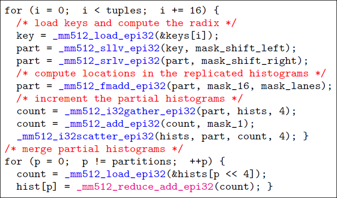

To compress the partial histograms in cache, we use 8-bit counts and add code to handle overflows. The assembly of Xeon Phi allows us to specify modifiers to gather and scatter instructions, that load or store 8-bit and 16-bit memory locations. The operations are executed on 16 32-bit lanes.

We also show vectorized binary search of 32-bit keys for Xeon Phi, which is used to compute range functions. We can patch the array so that *P* = 2*^(n)*. Haswell code is identical.

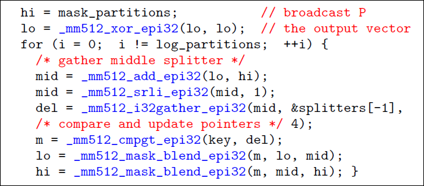

The code for conflict serialization using gathers and scatters is shown below. The constant permutation mask used to reverse the lanes of a vector (mask_reverse), also used to detect conflicts since due to having distinct values per lane. Using the conflict detection instruction provided by AVX 3, we can also implement conflict serialization. Given that AVX 3 does not provide vectorized bit count, we run a loop that clears one bit at a time per lane using x & (x 1) and increments the non-zero lanes in the resulting offset vector.

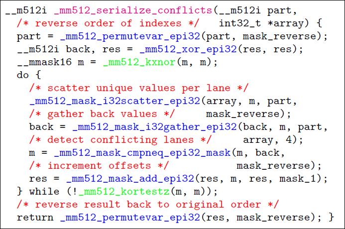

The code for stable buffered shuffling for radix partitioning using 32-bit keys and payloads for Xeon Phi is shown below. Both the input and the output are assumed to be aligned on cache line boundaries. After the loop, we clean the buffer by flushing remaining tuples. If multiple threads are used, the buffer cleanup occurs after synchronizing, to fix the first cache line of each partition that may be corrupted. 

When partitioning columns of multiple widths, assuming we partition one column at a time, the number of buffered items per partition varies. We implement 8-bit, 16-bit, 32bit, and 64-bit shuffling by storing 64, 32, 16, and 8 items in the buffer per partition respectively. When we partition 64-bit columns, because 16 64-bit values can span across two cache lines, we scatter the tuples to the buffers in three phases instead of two, as overflows can occur twice per loop.

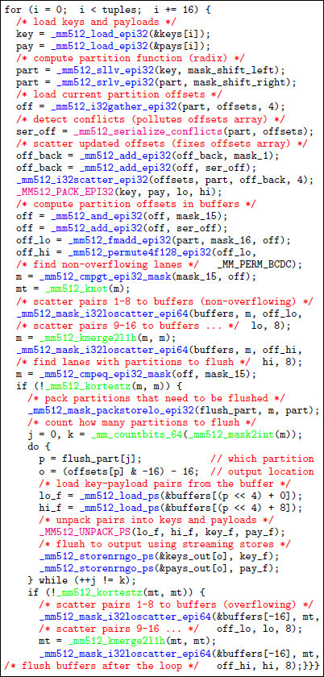
