# SAHA: A String Adaptive Hash Table for Analytical Databases

**摘要**：哈希表是分析数据库工作负载的基础数据结构，如聚合、Join、集合过滤以及删除重复记录。面对不同的数据，以及不同数量的插入、查找和删除时，哈希表的性表现能有很大差异。本文讨论哈希表的一个常见场景：**对任意字符串数据进行聚合和 Join**。我们设计了一个新的哈希表 SAHA，与现代分析数据库紧密集成，并针对字符串数据进行了优化，具有以下优点：（1）内联短字符串，只保存长字符串的哈希值；(2) 使用特殊的内存加载技术进行快速分派和哈希计算；(3) 利用向量化批量处理哈希操作。我们的实验结果表明，SAHA 在分析工作负载中的性能优于最先进的哈希表一到五倍（包括 Google 的 `SwissTable` 和 Facebook 的 `F14Table`）。已经合并到 ClickHouse 中，并在生产中显示出良好的效果。

## 1 简介

### 1.1  背景

我们正处于大数据时代。过去十年的特点是数据分析应用程序的爆炸式增长，管理各种类型和结构的数据。数据集的指数级增长对数据分析平台提出了很大的挑战，其中典型的平台是关系数据库，通常用于存储和提取可以货币化或包含其他商业价值的信息。数据库系统的一个重要用途是通过 SQL [[1](#bookmark28)] 语言回答决策支持查询。例如，一个典型的查询可能是检索所有帐户余额超过规定限额的客户。它主要使用两个 SQL 运算符：Join 运算符关联相应的值，分组运算符汇总帐户余额。这两个运算符几乎出现在每个决策支持查询中。例如，最著名的决策支持基准测试 TPC-DS [[2](#_bookmark29)] 的 99 个查询中，80 个查询包含分组运算符，97 个查询包含 Join 运算符。这两个运算符的高效实现将大大减少决策支持查询的运行时间，并有利于交互式数据探索。分组和 Join 运算符有许多不同的实现。为了了解分析数据库如何处理这些操作符，以及可以进行哪些优化，我们将首先介绍著名分析数据库的著名实现，例如 ClickHouse [[3](#bookmark30)]、Impala [[4]( #_bookmark31)] 和 Hive [[5](#_bookmark32)]，然后讨论这些运算符的计算热点。

#### 1.1.1 分组运算符

图 [1](#_bookmark1) 显示了分析数据库分组运算符的典型实现。可能的查询语句是计算每个 col 的数量并输出 `<col, count>` 对：`SELECT col, count(*) FROM table GROUP BY col`。它包含两个处理阶段：阶段 1 是使用来自数据源的数据构建哈希表。哈希表中的每条记录都与一个计数器相关联。如果记录是新插入的，则相关计数器设置为 1；否则，计数器将递增。第 2 阶段是将哈希表中的记录组装成可用于进一步查询处理的格式。需要注意的重要一点是，聚合算子从 Scanner 中读取一批记录，并将它们**逐个插入**到哈希表中。这称为向量化处理，它有助于提高缓存利用率、减少虚拟化函数，并且由于循环体更小，它可能被编译成更快的 SIMD（单指令多数据）[[6](#_bookmark33)] 实现。 向量化处理是一次对一组值进行操作，而不是一次对单个值重复操作。它通常用于分析数据库中。

<a id="_bookmark1"></a>
|     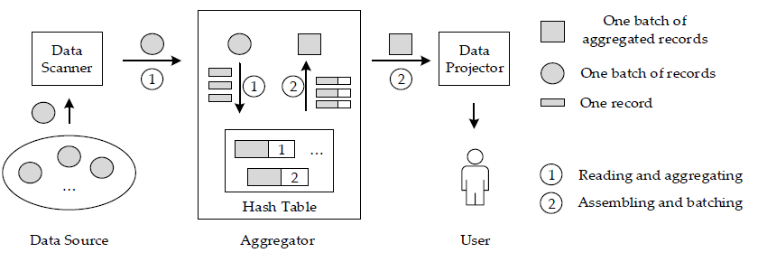     |
| :------------------------------------: |
| 图 1. 向量化数据库分组运算符的典型实现 |

#### 1.1.2 Join 运算符

图 [2](#_bookmark2) 是分析数据库 **Join** 的典型实现。查询语句：`SELECT A.left_col, B.right_col FROM A JOIN B USING (key_col)`，使用 `key_col` Join 表 A 和 B，分别输出 `<A.left_col, B.right_col>` 两列。也有两个阶段：阶段 1 是使用 Join 语句为右侧表中的数据构建哈希表，阶段2是以流线型的方式从左边的表中读取数据，并**探测**刚刚构建的哈希表。构建阶段类似于之前的分组实现，但每个表槽都存储对右列的引用。两个阶段都是向量化的。

<a id="_bookmark2"></a>
|      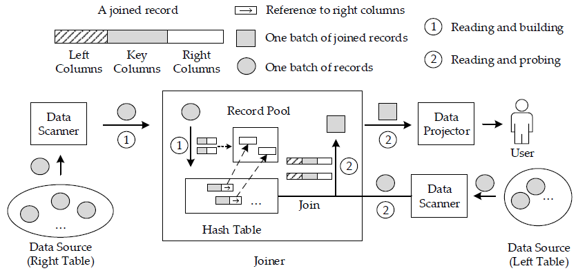      |
| :--------------------------------------: |
| 图 2. 向量化数据库 Join 运算符的典型实现 |

#### 1.1.3 哈希表

分组和 Join 运算符的核心数据结构是**哈希表**。哈希表是一种将 Key 与值关联起来的数据结构。它支持通过选择适当的哈希函数在常量时间内查询给定的键。基本思想是选择一个哈希函数，将任意 Key 映射到哈希值，这些哈希值是哈希表中<u>存储值的槽的</u>索引。但是，两个不同的键最终可能具有相同的哈希，因此有相同的索引。如果任何 Key 与哈希表中同一索引的现有 Key 发生冲突，则使用**探测函数**来解决冲突。

解决冲突的方法主要有两种，即 **Open addressing** 和 **Separate chaining**，如图 [3](#_bookmark3) 所示。在 **Separate chaining** 中，使用链表<u>在哈希表的外部</u>存储元素。发生冲突的元素在单独的链表中链接。要找到给定的记录，需要计算键的哈希值，返回相应的链表，并对其进行搜索。与 **Open addressing** 相比，**Separate chaining** 因为存在额外的缓存缺失和分支条件，效率较低；但它很容易实现，并且有像**引用稳定性**这样的属性（哈希表中 Key 和值的引用和指针必须保持有效，直到相应的键被删除），因此，仍然被广泛使用，并且是 C++ 哈希表的默认实现。

<a id="_bookmark3"></a>
| 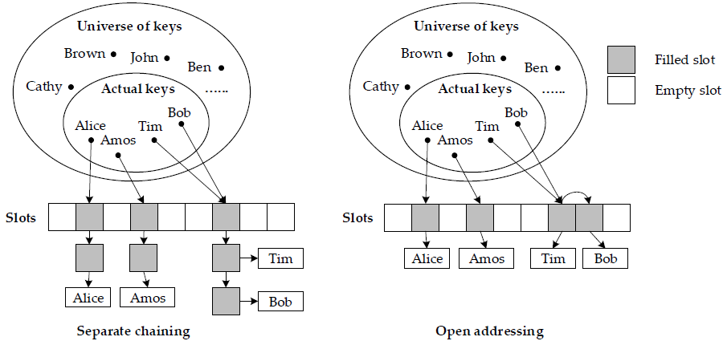 |
| :----------------------------: |
|   图 3. 哈希表的两种主要实现   |

在 **Open addressing** 中，所有元素都存储在哈希表中。为了找到给定的记录，在搜索期间系统地检查**表槽**，直到找到所需的元素。这个过程称为探测冲突链，有许多不同的探测方案，如**线性探测**、**二次探测**和**双重哈希**。这些方案根据探测过程命名，因此很直观。还有更复杂的策略，例如 RobinHood [[7](#_bookmark34)] 和 Hopscotch [[8](#_bookmark35)]，它们包含复杂的元素调整。哈希表变满时，许多冲突链会很长，探测会变得很昂贵。为了保持效率，使用 `rehash` 将元素分散到更大的数组中。`rehash` 的指标称为负载因子，是哈希表中存储的记录数除以容量。**Open addressing** 哈希表具有更好的缓存局部性、更少的间接指针，非常适合于向量化处理。因此，对于分析工作负载，应该使用 **Open addressing** 方案来实现卓越的性能。后面除非另有说明，本文中提到的哈希表均使用  **Open addressing** 。

### 1.2 问题

为分析性数据库实现高效的哈希表并非易事，因为它们属于巨大的设计空间，而且它们对查询运行时的性能影响很大。Richter 等人 [[9](#_bookmark36)] 深入分析了如何为整数 Key 实现哈希表。他们提出了 10 多个检查条件，以找到最佳的哈希表实现。但是，分析数据库中几乎没有信息可以完成这些检查，并且处理字符串键比整数更困难，因为字符串长度可变。同时，现实世界中，许多查询通常使用字符串做关键列，例如 URL 域、昵称、关键字、RDF属性（资源描述框架）和 ID 等等。这些数据集有一个共同的属性：平均长度很短。也有一些字符串数据集具有较长的平均字符串长度，比如网络搜索短语中的包裹投递地址。<u>然而，在当前的分析数据库中，这两种分布都没有得到优化，而且事先没有简单的方法来判断字符串数据集在每个子集中的实际长度分布如何，以选择合适的哈希表实现</u>。总之，我们讨论了以下三个问题来处理字符串数据集上的分析工作负载：

1. 处理字符串数据集时，要根据字符串长度的分布情况进行不同的优化。**没有一个哈希表可以适合所有分布的情况**。
2. 使用指针存储短字符串不划算，为短字符串存储保存的哈希值是浪费空间。
3. 在哈希表中进行插入或查找时，对长字符串进行哈希处理**缓存不友好**。

### 1.3 我们的解决方案和贡献

为了解决这些问题，我们提出了 SAHA，一种用于分析数据库的字符串自适应哈希表。它将短字符串键重新解释为整数数组，并直接将它们存储在槽中，没有任何间接指针。对于长字符串键，它将计算的哈希值与字符串数据指针一起保存在每个槽中，以降低长字符串比较的频率。SAHA 在分组操作符和 Join 运算符的每个向量化处理步骤中预先计算哈希值，并在接下来的操作中直接使用这些哈希值。这减少了在哈希表插入和查找期间探测空槽时的**缓存污染**，特别是对于长字符串，SAHA 还提供了基于字符串长度的，高度优化的 Key 分派。它可以适应不同的字符串数据集，并动态地选择最适合的哈希表实现。我们工作的主要贡献总结如下:

1. **优化的字符串分派**。我们实现了一个基于字符串长度的 **Key 分派**。用于将字符串数据集分类为具有预定义字符串长度分布的子集。分派程序使用特殊的内存加载技术进行了优化，因此不会给底层哈希表带来性能回退化。
2. **混合字符串哈希表**。我们为不同长度的字符串设计了五种哈希表的实现。每个实现都针对字符串长度的一种分布进行了优化。所有实现都与标准哈希表接口统一为一个哈希表，但可以适应字符串数据。它有峰值内存低的好处，因为子哈希表独立增长，这比整体增长更平滑。
3. **预哈希和向量化编程接口**。我们确定了在哈希表中进行向量化处理之前预先计算哈希值的时机。如果当前批次字符串较长，会优化缓存利用率。提出了一个新的编程接口，接受对插入和查找函数的回调，以便可以在哈希表中计算额外的信息，比如预计算。
4. **广泛的实验**。我们使用真实世界和生成的数据集进行了广泛的实验，以验证 SAHA 的性能。我们的实验研究了哈希表的关键性能因素，包括哈希函数、计算时间和内存利用率的有效性。结果表明，SAHA 在所有情况下都优于最先进的哈希表一到五倍，如图 [4](#_bookmark4) 所示。

<a id="_bookmark4"></a>
|                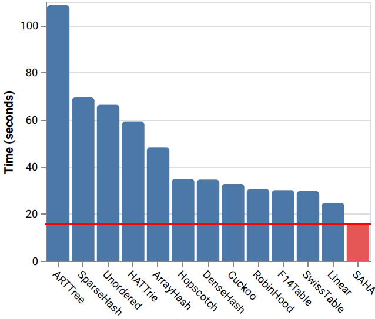                |
| :----------------------------------------------------------: |
| 图 4. 与 SAHA 相比，各种哈希表处理分组和 Join 的基准时间条图。 |

本文的其余部分组织如下。第 [2](#2 相关的工作) 节讨论了相关工作。第 [3](#3 实现) 节描述 SAHA 的主要实现及其优化。第 [4](#4 预哈希和向量化编程接口) 节展示了 SAHA 的特定向量化优化及其支持的编程接口。第 [5](#5 实验) 节包含实验结果。最后，第 [6](#6 结论) 节给出了结束语。

## 2 相关的工作

### 2.1 Hash Tables

哈希表是一种成熟且广泛研究的数据结构，至今仍是研究热点。第 [1](#1 简介) 节中简要介绍了教科书中人所共知的实现。这里，我们讨论在现实世界中活跃使用的其他三个实现：（1）Robin Hood 哈希表 [[7](#_bookmark34)] 是一个派生的线性探测哈希表，如果探测 Key 离其插槽太远，它通过将当前元素移出插槽来限制每个插槽冲突链的长度； (2) Hopscotch [[8](#_bookmark35)] 类似，但不是将元素移出，而是根据每个插槽中的元数据将探测Key交换到其插槽中； (3) Cuckoo hash [[10](#_bookmark37)] 使用两个哈希函数，为每个 Key 在哈希表中提供两个可能的位置。因此，它保证每次查找较少的内存访问次数。冲突的链变成了带有有趣数学特征的图状结构，吸引了许多研究人员[[11](#_bookmark38)--[13](#_bookmark39)]。所有这些工作都集中在一般数据集上，与我们的工作正交。SAHA 可以使用这些哈希表中的任何一个作为后端，只需稍作调整。

一些哈希表通过支持高负载因子 [[14](#_bookmark40), [15](#_bookmark41)] 来节省内存。这些紧凑的哈希表使用位图进行占用检查，并使用压紧的数组来存储元素。但是，与字符串编码技术相比，处理字符串数据时节省的内存量实际微不足道。由于需要维护额外的位图，插入和查找操作都会变得更慢。SAHA 通过内联短字符串来优化内存使用。它实现了类似的内存消耗，但比这些紧凑的哈希表更高效。

业界广泛使用、最先进的哈希表是 Google 的 SwissTable [[16](#_bookmark42)] 和 Facebook 的 F14Table [[17](#_bookmark43)]。两者都是为一般用途而设计，并针对现代硬件进行了优化。它们将元素分组为小块，通过额外的元数据将每个小块打包为一个小哈希表，以进行探测。与在整个哈希表上操作相比，可以更有效地操作这些块。SwissTable 和 F14Table 的主要区别在于，在 SwissTable 中，数据块的元数据是分开存储，而在 F14 中，元数据和数据块一起存储。尽管它们在常见的查找和插入操作中实现了良好的性能，但它们比精心设计的线性探测哈希表稍慢，比如 ClickHouse [[3](#bookmark30)] 中使用的哈希表，后者是我们能找到的最快的聚合实现。它使用专用的线性哈希表，针对分组和 Join 算子精简了实现，并优化了 `rehash`。在分组工作负载，它比 SwissTable 和 F14Table 快 20%。但是，它在处理字符串数据时并未优化。**SAHA 将字符串优化与这个经过严格调整的哈希表相结合，使其能够胜任字符串数据集的分析工作负载**。

### 2.2 字符串数据结构和优化

一个著名的字符串关联容器是名为 **trie** [[18](#_bookmark44)] 的树状数据结构。它提供了与哈希表类似的功能，以及字符串前缀搜索等额外操作。**Tries** 已经得到了很好的研究，并且已经提出了许多高效的实现 [[19](#_bookmark45)--[22](#_bookmark46)]。但是，它不适用于分析工作负载，例如字符串聚合。正如 [[23](#_bookmark48)] 中所指出，他们观察到 ART [[22](#_bookmark46)] 在运行一些简单的聚合查询时，与  **Open addressing**  哈希表相比几乎慢了五倍。我们在第 [5](#5 实验) 节中也观察到类似的结果。这主要是因为任何 **trie** 结构在每个节点中都包含指针，与   **Open addressing**  哈希表的平面数组实现相比，遍历树有太多的间接访问。

一些哈希表实现 [[21](#bookmark47),[24](#_bookmark49)] 尝试将冲突链的字符串键压缩成连续的内存块。当字符串被内联时，这减少了内存消耗并降低了使用指针的频率。因此，在这些哈希表中进行查找更加有效。 但是，由于需要额外的内存移动，**插入速度要慢得多**，尤其是对于长字符串。SAHA 只内联短字符串并直接将它们存储在插槽中，而不是单独的冲突链。因此，它具有相同的优势，但对插入没有任何影响。

许多分析数据库采用字符串编码作为压缩方案 [[3](#bookmark30), [25](#_bookmark50)--[27](#_bookmark51)]。为每个字符串列维护一个字符串字典，将输出的编码存储为整数。然后这些整数可以直接用于分组和 Join 算子。但只在字符串列的基数较低时才有效； 否则字典维护变得太昂贵。 SAHA 适用于任何基数，也可以与字符串编码一起使用。

### 2.3 小结

我们选择了 12 个哈希表，并尝试在表 [1](#_bookmark6) 中概述，可用于字符串数据集上的分组和 Join 的主要数据结构。与 SAHA相比，列出了简短的描述和与字符串相关的功能。我们还在第 [5](#5 实验) 节的详细基准中评估了所有这些数据结构。

1.**内联字符串**。哈希表是否直接存储字符串数据，<u>而不是保存字符串指针</u>。

2.**保存哈希值**。字符串的哈希值是否与字符串一起保存在哈希表中。

3.**紧凑型**。哈希表是否具有高负载因子（我们考虑尝试100%的负载因子）。

<span id="_bookmark6" class="anchor">**表1** 哈希表.</span>

| 名字                   | 内联字符串 | 保存哈希值 | Compact | 描述                            |
| ------------------------------- | ----------------- | -------------- | ----------- | ------------------------------------------ |
| SAHA                            | Hybrid            | Hybrid         | No          | 按长度分派后的**线性探测** |
| Linear [[3](#bookmark30)] | No                | **Yes**        | No          | **线性探测**                     |
| RobinHood [[7](#_bookmark34)]   | No                | **Yes**        | No          | 有限距离内的**线性探测** |
| Hopscotch [[8](#_bookmark35)]   | No                | **Yes**        | No          | <u>Neighborhood probing</u>                |
| Cuckoo [[10](#_bookmark37)]     | No                | **Yes**        | No          | 在两个表之间进行交替探测 |
| Unordered                       | No                | No             | No          | 链表（GNU stdlib c++ 实现） |
| SwissTable [[16](#_bookmark42)] | No                | Partial        | No          | 使用分离的元数据进行**二次探测** |
| F14Table [[17](#_bookmark43)]   | No                | Partial        | No          | 使用内联元数据进行**二次探测** |
| DenseHash [[14](#_bookmark40)]  | No                | No             | No          | **二次探测**                  |
| SparseHash [[14](#_bookmark40)] | No                | No             | **Yes**     | 稀疏表的**二次探测** |
| HATTrie [[21](#bookmark47)]     | **Yes**           | No             | **Yes**     | 以 `ArrayHash` 作为叶节点的 **Trie** 树 |
| ArrayHash [[24](#_bookmark49)]  | **Yes**               | No             | **Yes**     | 使用紧凑数组链接    |
| ARTTree [[22](#_bookmark46)]    | **Yes**               | No             | **Yes**     | 带有混合节点的 **Trie** 树 |

## 3 实现

SAHA 的主要结构是两组子哈希表：哈希表 Sn 和哈希表 L，以及一个字符串键分派器。图 [5](#_bookmark8) 显示了 SAHA 的架构。所有子表都实现为**线性探测哈希表**，除了哈希表 S0，它是一个数组查找表。数组查找表将 Key 直接解释为数组索引； 因此，它可以在一个或两个 CPU 指令中进行元素查找，而根本不存储关键数据。 数组查找表通常用于通用数据基数很小的情况 —— 例如，小整数 —— 而字符串数据则不行，因为它们具有无限的基数。但是，由于我们将字符串长度限制为两个字节，因此哈希表 S0 只能有 65,536 个不同的 Key；因此，我们甚至可以对字符串数据使用数组查找技术。

<a id="_bookmark8"></a>
|             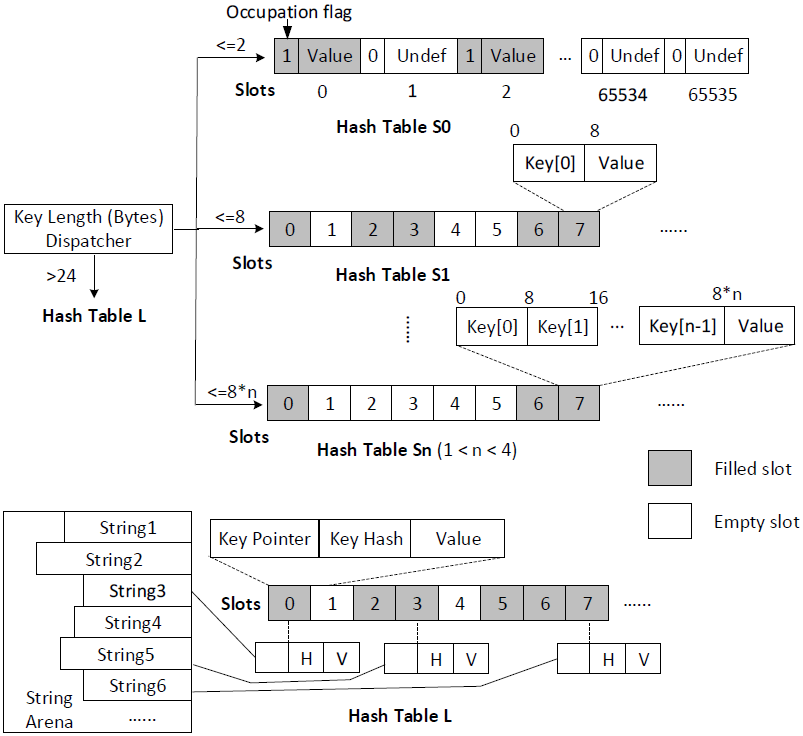              |
| :-----------------------------------------------------: |
| 图 5. SAHA 架构，多个哈希表来存储不同长度范围的字符串。 |

对于**长度大于 2 个字节但小于 25 个字节**的字符串键，我们将它们存储在 Hash Table S 的多个实现中。这些表之间的主要区别在于它们的插槽大小。我们将字符串键重新解释为整数数组。对于长度为 (2, 8] 字节的字符串键，使用 8 个字节的 1 个整数；对于 (8, 16] 的长度，使用 8 个字节的 2个整数；长度 (16, 24]，使用 8 个字节的 3 个整数。这些整数直接存储在槽中，没有字符串指针。使用线性探测哈希表的原因是，它在分析工作负载中实现了很好的性能结果，并且它的实现代码量小，这对于 SAHA 很重要。由于我们将 Key 分派在多个不同的哈希表实现上，如果使用了一个复杂的实现，代码会膨胀，对性能产生显著的影响。为了验证这个选择，我们将线性探测哈希表与第 [5](#5 实验) 节中的大量其他实现进行比较。

对于长度超过 24 字节的字符串键，我们将字符串指针及其哈希值直接存储在哈希表 L 中。由于移动长字符串的代价很高，持有指针而不是内联字符串键会使插入和 `rehash` 更快。选择 24 字节作为阈值的原因是：（1）我们观察到大量字符串数据集，其中 80% 的字符串短于 24 字节；（2）使用更多整数来表示字符串会抵消性能优势，因为引入过多的数据复制。保存长字符串的哈希值也很重要，因为计算哈希值的成本很高，并且与存储长字符串相比，存储额外的哈希值的内存开销可以忽略不计。线性探测时，保存的哈希值还可以用于检查给定槽是否包含当前键。<u>否则，即使它们的哈希值不同，也必须始终比较两个长字符串以检查它们是否相等</u>。哈希表 L 还包含一个名为 **String Arena** 的内存池，用于保存插入的字符串。必须对哈希表内插入的数据拥有完整的所有权，==<u>因为分组或 Join 算子在插入当前记录后，会释放它们</u>==。

字符串键分派器接受一个字符串键并将其分派到相应的哈希表中。因为它位于代码的关键部分，所以分派器需要仔细实现和优化，以避免引入性能回退。为了分派短字符串，它需要将字符串数据从给定指针加载到当前堆栈中，并将其转换为数字数组。为了实现高效的内存复制，应该使用恒定数量的字节，而不是直接执行 `memcpy(dst, src, len)`。我们使用 8 个字节作为最小内存复制单元，一次将一个整数从字符串数据中读取到数组中。如果字符串长度不能被 8 整除，则我们从结束位置减去 8，然后加载最后的一批字节。因此，我们仍然复制 8 个字节，但将 H 部分移出，如图 [6](#_bookmark9) 所示。但是，如果字符串小于 8 个字节，则复制 8 个字节可能会导致分段错误，这在图 [6](#_bookmark9) 中表现为下溢和上溢（分段故障是由具有内存保护的硬件引起的，通知操作系统软件在尝试访问内存的一个受限区域）。 为了解决此问题，我们在分派到哈希表 S1 时对字符串指针进行内存地址检查。由于内存页大小为 4096 字节，如果`指针 & 2048 = 0`，则表示字符串数据位于内存页的上半部分，只能下溢。然后我们可以安全地从 0 复制 8 个字节并去掉 T 部分。否则只能溢出，之前的算法会正常工作。

<a id="_bookmark9"></a>

|              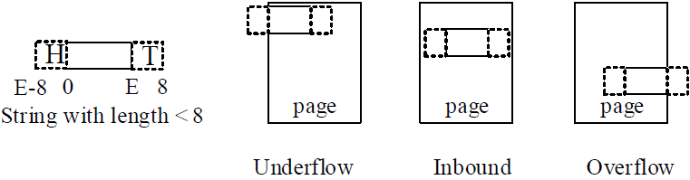              |
| :------------------------------------------------------: |
| 图 6. 长度小于 8 个字节字符串 Key 的三种不同的内存布局。 |

代码清单 [1](#_bookmark10) 显示了 C++ 伪码中字符串键分派程序的实现。==<u>它接受</u>==带有指针和长度的字符串 Key，并将 Key 分派到子哈希表。不同的哈希表需要不同的 Key 类型但相同的字符串数据；因此，使用了 `union`。==<u>每个字符串键中 T 部分的长度可以使用 `(-key.size & 7) * 8` 计算，用于快速内存加载</u>==。用于分组和 Join 时，哈希表主要有两个函数：`emplace` 和 `find`。如果给定的 Key 没有在哈希表里找到，`emplace` 用于将数据插入哈希表，否则返回哈希表中的数据（返回数据的 Key 等于插入数据的 Key）。`find` 与 `emplace` 略有不同，它在哈希表中缺少给定键时不插入数据，而是向调用者返回未找到 Key 指示符。这里我们演示了通过 emplace 进行分派，其他函数的分派也类似。需要确保子哈希表的所有方法都内联到分派代码中，否则分派过程会因为引入额外的函数调用而影响性能。要达到这个效果，需要仔细调优实际的实现。一种可能的实现可以参考 [[28](#_bookmark52)]。

除了这些结构，SAHA还提供了以下优化来进一步减少运行时间:

-   **检查哈希表 Sn 的插槽是否为空**。由于字符串长度未存储在哈希表 Sn 中，==<u>因此检查给定插槽是否为空的一种方法是验证插槽的 key 数组中的所有整数是否等于 0</u>==。 然而，由于 UTF8 中的零字节是代码点 0，即 NUL 字符。在 UTF8 中，没有任何其他 Unicode 代码点会以零字节进行编码。我们只需要检查第一个整数，即图 [5](#_bookmark8) 中的 `key[0] == 0`。 这带来了相当大的改进，特别是对于每个 Key 包含三个整数的哈希表 S3。
-   **哈希表 L 的自动所有权处理**。我们将长字符串数据复制到 String Arena 中，在成功插入时持有字符串 Key 的所有权。 这需要插入方法返回插入字符串 Key 的引用，以便将字符串指针修改为 String Arena 中的新位置。但是，返回 Key 引用的成本很高，因为字符串在 SAHA 中也存储为整数；==<u>普遍返回</u>==引用需要构造临时字符串。为了解决这个问题，我们使用可选的内存池引用来扩充字符串键，并允许哈希表决定何时需要将字符串键解析到内存池中。它用于哈希表 L，在新插入时自动解析字符串。
-   **CRC32 哈希与内存加载优化**。循环冗余校验 (CRC) 是一种错误检测代码。它以尽可能少的冲突对字节流进行哈希处理，这使其成为哈希函数的良好候选者。现代 CPU 提供了原生的 CRC32 指令，可在几个周期内计算 8 个字节的 CRC 值。因此，我们可以使用字符串分派函数中的内存加载技术来有效地进行 CRC32 哈希。

<span id="_bookmark10" class="anchor"></span> **Listing 1.** Implementatation of string dispatcher for the emplace routine in pseudo C++.

```c++
void dispatchEmplace(StringRef key , Slot*& slot) {
    int tail = (-key.size & 7) * 8;
    union {StringKey8 k8; StringKey16 k16; StringKey24 k24 ; uint64_t n[3]; }; 
    switch ( key.size ) {
        case 0:
            Hash_Table_S0.emplace(0, slot);
        case 1..8:
            if ( key.pointer & 2048) == 0)
            { memcpy(&n[0] , key.pointer, 8); n[0] &= -1 >> tail;}
            else {memcpy(&n[0], key.pointer + key.size-8 , 8); n[0] >>= tail;}
            if (n[0] < 65536) Hash_Table_S0.emplace( k8 , slot );
            else Hash_Table_S1.emplace(k8 , slot);
        case 9.. 16:
            memcpy(&n[0], key.pointer, 8);
            memcpy(&n[1], key.pointer + key.size - 8 , 8);
            n[1] >>= s;
            Hash_Table_S2.emplace(k16, slot);
        case 17.. 24:
            memcpy(&n[0],key.pointer, 16);
            memcpy(&n[2],key.pointer + key.size - 8 , 8);
            n [2] >>= s;
            Hash_Table_S3.emplace(k24, slot);
        default :
            Hash_Table_L.emplace(key, slot );
    }
}
```

为了更好地理解我们优化的有效性，我们分别讨论哈希表 `find` 和 `emplace` 的成本模型。 对于 `find` ，它主要包括两个步骤： (a) 计算当前 key 的哈希值以查找其冲突链，记为 *H*； (b) *P* 表示探测冲突链以查找是否存在匹配的 Key。探测的复杂度与冲突链的平均长度有关，表示为 *alpha*。 我们可以将探测过程进一步划分为加载每个槽的内存内容 *P~L~* 和进行 Key 比较 *P~C~* 。

在添加其他维护操作（例如 `rehash`）的复杂度 *O* 之后，我们可以将不成功查找操作的运行时复杂度 *T~find~*  化为公式（[1](#_bookmark11)）。

|   *T~find~* = *O* + *H* + *alpha* ∗ (*P~L~* + *P~C~*)   |<span id="_bookmark11" class="anchor"></span>       |    (1)  |
| ---- | ---- | ---- |

一个成功的发现具有几乎相同的复杂度，只是 *alpha* 较小；也就是说，当找到匹配时，它可以更早地完成。一个不成功`emplace`（我们称之为不成功，因为在哈希表中找到同一个 Key 时，`emplace` 无法存储 Key）与成功的查找相同，而成功的 `emplace` 还有一个额外的步骤：找到一个空槽后，需要存储被放置的元素，表示为 *S*。 对于字符串值，意味着将字符串数据解析到哈希表的内存池 *S~P~*，并将更新后的字符串指针写入插槽 *S~W~*。因此，成功的 emplace 操作的总运行时复杂度 *T~emplace~* 高于查找操作，如公式 ([2](#_bookmark12)) 所示。

|   *T~emplace~* = *O* + *H* + *alpha* ∗ (*P~L~* + *P~C~*) + *S~P~* + *S~W~* |<span id="_bookmark12" class="anchor"></span>       |    (2)  |
| ---- | ---- | ---- |

优化这些参数对于提高哈希表的性能必不可少，不包括参数 *O*，它与 **Open addressing** 的机制有关，优化空间不大。*alpha* 参数与探测方案、哈希函数和数据集本身有关。优化 *alpha* 是一个广泛的主题，超出了这项工作的范围。相反，我们采用了经过行业验证的哈希表，ClickHouse 的策略，它以高质量的 *alpha* 值作为我们的构建块，而且维护成本也很低。为了验证我们在其余参数上的优化的有效性，我们使用从 **twitter.com** 收集的真实字符串数据集设计了一个字符串 `emplace` 基准，以评估每个参数的运行时复杂性。为了涵盖所有参数，我们只测试成功的 `emplace`，事先预处理数据集，只保留唯一的字符串，以便所有 `emplace` 操作都成功。以 ClickHouse 中的哈希表为基准进行比较，测试结果如表 [2](#_bookmark13) 所示。基准测试表明，我们的优化显著改善了所有参数。

<span id="_bookmark13" class="anchor"></span> **表2**. 优化前后成本模型参数复杂度的比较。

| 参数            | 基准           | **SAHA**       | 优化                           |
| --------------- | -------------- | -------------- | ------------------------------ |
| *H*             | 33             | 22             | 内存加载优化                   |
| *P~L~* + *P~C~* | 56             | 37             | 字符串内联和检查插槽为空的优化 |
| *S~P~*          | 34             | 6              | 字符串分派和自动所有权处理     |
| *S~w~*          | 16             | 14             | 选择性的哈希保存               |
| **Unit**        | Cycles per key | Cycles per key |                                |

## 4 预哈希和向量化编程接口

SAHA 专为分析数据库而设计，向量化处理查询管道为优化提供了独特的机会。主要的优化之一是预哈希。在哈希表中插入或查找元素时，一个必需的步骤是计算元素的哈希值。这需要检查元素的全部内容，这意味着 CPU 缓存将填充此元素。当字符串很长时，它会占用缓存中的大量空间，并可能驱逐用于哈希表插槽的空间，从而导致缓存争用。为了在探测时更好地利用 CPU 缓存，我们需要避免读取字符串内容。这对于插入新的长字符串或使用预先计算的哈希查找不存在的长字符串是可能的。例如，当一个新的长字符串插入 SAHA 时，它会被分派到哈希表 L。然后我们直接使用预先计算的哈希进行探测。因为哈希表 L 也在插槽中保存了哈希值，因此新字符串很可能会在不涉及任何字符串比较的情况下找到空槽。即使两个不同的长字符串具有相同的哈希值，比较这两个字符串也可能会提前完成，除非这两个字符串共享一个长前缀。对于长字符串，数据集通常具有高基数，处理新键是哈希表的主要情况。因此使用预先计算的哈希值，有很大的概率不需要读取字符串内容。

我们可以在接收到一批记录之后，但在哈希表中处理它们之前，计算哈希值。图 [7](#_bookmark15) 比较了使用和不使用预哈希。在哈希表之外实现预哈希很简单。然而，对于分析数据库来说，这是一种糟糕的设计，因为它也会在预哈希没有意义的地方聚合整数键和组合键。因此，优化对聚合应该是透明的，且存在于哈希表中。为了实现预哈希，哈希表应该接收一批记录，而不是每次接收一行记录。因此，我们为 SAHA 提出了一个向量化编程接口。 也可以应用于其他哈希表。

<a id="_bookmark15"></a>
|        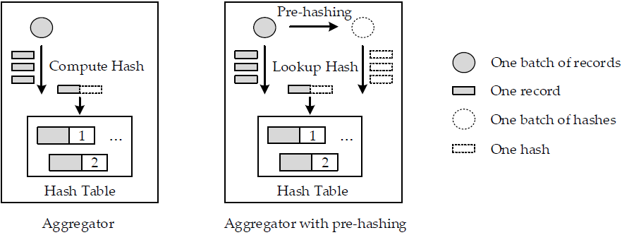         |
| :-------------------------------------------: |
| 图7. 比较使用和不使用预哈希的向量化聚合实现。 |

图 [8](#_bookmark17) 显示了一个接受一批记录的哈希表。它在执行其他操作之前预先计算哈希值。处理完每条记录后，调用注册的回调来完成操作。在聚合器示例中，回调是应用于记录的聚合函数。清单 [2](#_bookmark16) 显示了使用和不使用向量化的 `emplace` 例程的比较。在向量化编程接口的帮助下，我们可以实现其他优化，==<u>例如重新排序这批记录以打破数据依赖性</u>==。

<a id="_bookmark16"></a>
| 清单2. 比较 C++ 伪码中使用和不使用向量化的 `emplace`。 |
| :----------------------------------------------------: |
|               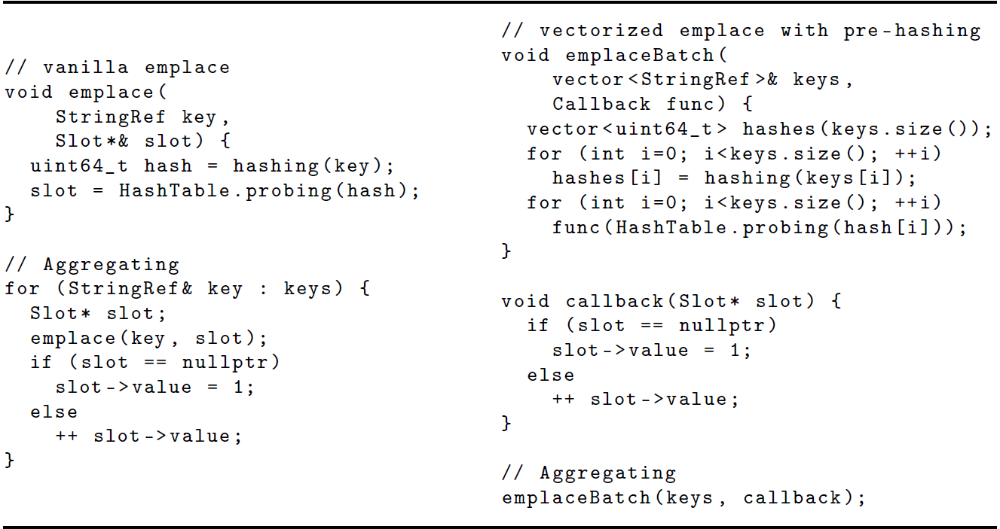               |

<a id="_bookmark17"></a>
|            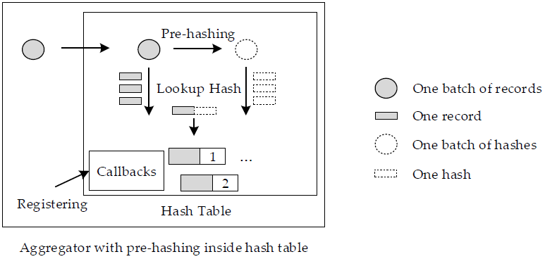             |
| :---------------------------------------------------: |
| 图8. 聚合算子使用带有向量化编程接口和预哈希的哈希表。 |

## 5 实验

本节，我们使用物理服务器和四个基准（SetBuild、SetLookup、group 和 join）来评估 SAHA 的性能。表 [3](#_bookmark19) 描述了四个真实世界中的数据集和不同字符串长度的分布属性。我们还生成了额外的合成数据集，以进一步研究不同字符串长度分布的性能。物理服务器包含两台 128 GB 内存的 Intel Xeon E5-2640v4 CPU。我们使用不同的平均值，合成了 Term 数据集，字符串长度符合二项式分布。

<a id="_bookmark19"></a>
| **表3.** 数据集 |
| :----------------------------------------------------: |
|               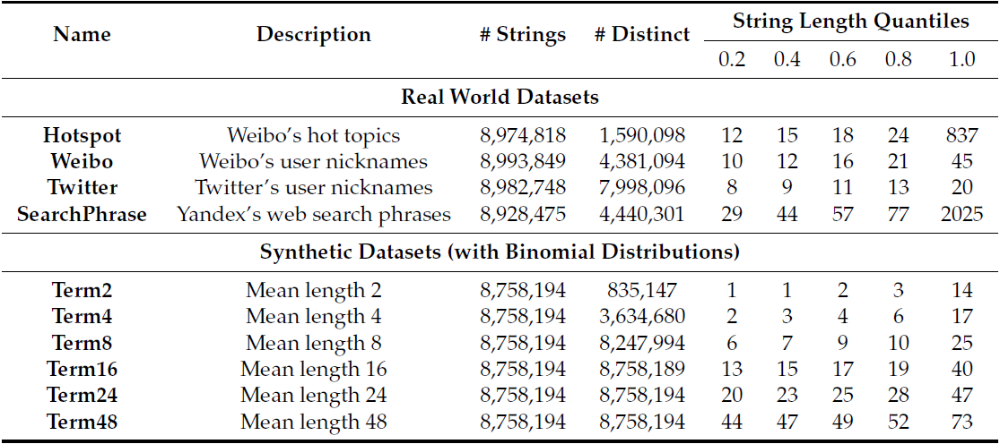               |

我们将 SAHA 和各种不同的哈希表进行比较，如表 [1](#_bookmark6) 所示。首先使用四个基准，基于真实世界的数据集评估这些哈希表，累积运行时间，获得一个大概的性能比较。如图 [9](#_bookmark20) 所示，对于每个数据集和基准测试，我们显示了与所有哈希表中最快的相比的减速热图。然后，通过更详细的测试来评估最快的哈希表。这有助于减少更详细基准测试的数量。此外，由于我们试图选出最快的哈希表，因为并不是所有的哈希表都适用于预哈希，所以没有包括预哈希优化。

从图 [9](#_bookmark20) 我们可以看到 SAHA 在几乎所有的基准测试中都取得了最好的性能。在处理长字符串时，它只比 ClickHouse 的线性探测哈希表慢一点。基于 **Trie** 的实现非常慢，不应该用于分组和 Join 算子。在所有 **Open addressing** 的哈希表中，线性探测在没有复杂探测方案的情况下已经足够好，并且在所有实现中实现了第二好的性能。==<u>向量化哈希表在所有四个基准测试中都没有显示出性能优势</u>==。

<a id="_bookmark20"></a>
| 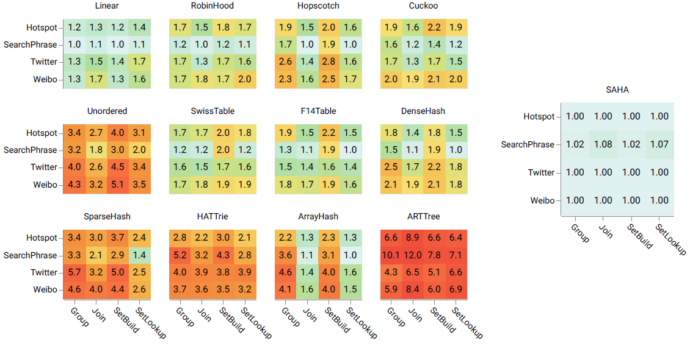                               |
| :----------------------------------------------------------- |
| 图 9. 在四个字符串长度分布不同的数据集（HotSpot、Weibo、Twitter、SearchPhrase）上，各种哈希表的减速热图，与 SetBuild, SetLookup, Group（分组）和 Join 基准测试中最快的哈希表相比。数字越小（绿色）越好，每个数据集上运行的每种基准测试，有一个是最快的。 |

为了完成评测，我们比较每个哈希表进行基准测试时分配的峰值内存。为了获得准确的内存统计，我们使用 `malloc` 钩子记录每次分配和释放，同时跟踪达到的最大值。我们只在两个数据集上评估组基准，因为它足以衡量内存消耗特征。如图 [10](#_bookmark21) 所示，SAHA 处理短字符串时的内存效率，接近于紧凑的实现，并且实现了最佳的运行时性能。**HATTrie** 的内存消耗最低，比 SAHA 低 30%，但它运行时间慢了四倍。对于长字符串数据集，SAHA 不提供内存优化，与所有使用保存哈希值的实现有相同的内存量。由于我们还没有包括预优化，它与线性探测有相同的性能特征。紧凑型哈希表和基于 **trie** 树的实现非常节省内存，但需要更多时间，因此应谨慎使用。向量化哈希表比其他 **Open addressing** 的实现消耗的内存略少，因为它们以块的形式分配内存，内存对齐带来的空间浪费更少。

<a id="_bookmark21"></a>
| 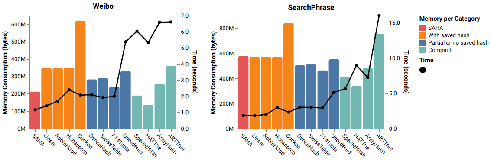                             |
| :----------------------------------------------------------- |
| 图 10. 显示两个数据集Weibo （短字符串长度分布）和 SearchPhrase（长字符串长度分布）上分组基准测试时，各种哈希表的内存消耗和运行时间。条形图和折线图组合在一起，其中条形图按内存消耗特性分组。 |

如前所述，为了在处理长字符串时获得更好的性能，我们引入了预哈希优化。从之前的基准测试中，我们看到线性哈希表可以作为一个很好的基准。因此，我们对线性和 SAHA 进行了详细比较，并在图 [11](#_bookmark22) 中展示了对长字符串进行预哈希的好处。测试表明，预哈希大大提高了长字符串数据集的性能，并且也有利于短字符串数据集。有两个数据集 SearchPhrase 和 Term48，其中没有预哈希的 SAHA 由于代码膨胀而引入了一点性能回退；但是，它完全被预哈希优化所抵消。唯一比没有预哈希慢的数据集是 Term2，因为它包含很小的字符串，在这种情况下哈希计算微不足道。但总运行时间也很小，性能回退可以忽退不计。因此，应该始终使用预哈希，因为它通常可以提高哈希表的性能。

<a id="_bookmark22"></a>
| 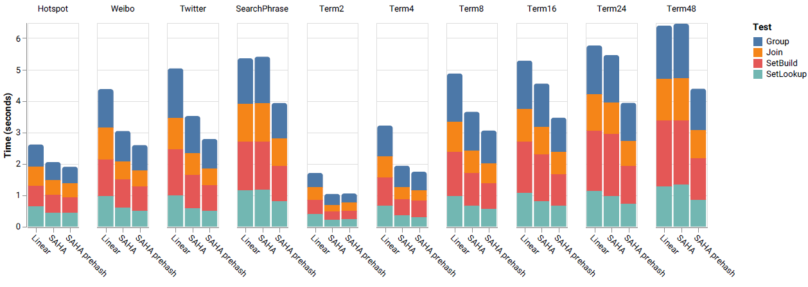                             |
| :----------------------------------------------------------- |
| 图 11. 显示 Linear、SHHA 和启用预哈希的 SAHA 在所有数据集上 SetBuild、SetLookup、分组和 Join 基准测试的累积执行时间条形图。 |

我们还评测了 SAHA 的字符串分派程序的优化。该基准与我们评测预哈希优化时所做的类似。我们使用字符串分派程序的简单实现作为基线。它是在没有内存加载优化的情况下实现的，代码量更大。从图 [12](#_bookmark23) 我们可以看到，与简单的分派相比，我们的优化在大多数测试用例中使性能提升了一倍。但是，在处理包含**小字符串**或**长字符串**数据集时，优化不会影响性能，==<u>因为这两种情况几乎不受内存加载的影响</u>==。

<a id="_bookmark23"></a>
| 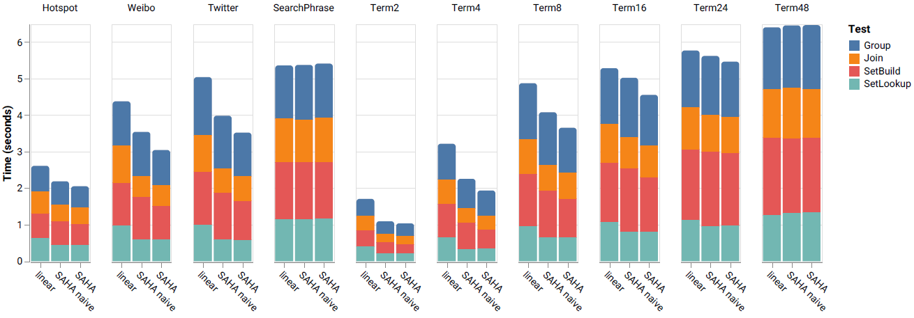                             |
| :----------------------------------------------------------- |
| 图 12. 显示 Linear、使用简单分派的 SHHA 和 SAHA 在所有数据集上 SetBuild、SetLookup、分组和 Join 基准测试的累积执行时间条形图。 |

为了了解不同哈希表的可扩展性及其在大型数据集上的性能，我们使用从网站 weibo.com 收集的真实世界字符串数据集 —— 有 10 亿行。图 [13](#_bookmark24) 使用折线图比较多个哈希表，以揭示每个哈希表的可扩展性。可以看出 SAHA 是线性扩展的，并且由于我们的字符串内联优化，SAHA 对内存更友好，因此在处理大型数据集时改进更多。而且，由于 Join 工作负载主要包含 Key 查找的操作，SAHA 的性能优势更加突出。

<a id="_bookmark24"></a>
|               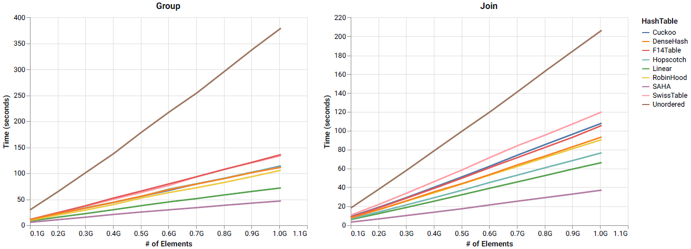               |
| :----------------------------------------------------------: |
| 图13. 分组和 Join 基准测试，真实的 Weibo 数据集上，各种哈希表执行时间的线形图。 |

为了验证使用 CRC32 指令作为哈希函数的优势，我们将其与其他七个哈希函数进行对比。其中一些被广泛使用，例如 `MurmurHash`，而另一些则更现代，并声称取得了可喜的结果，例如 `t1ha` 和 `xxHash`。由于每个基准中的哈希操作的相似性，我们只使用分组基准进行比较。由于哈希函数可能会影响底层哈希表的性能，因此我们从之前的基准测试中选择了六个哈希表，替换它们的哈希函数来重新运行测试。我们还使用两个显著不同的数据集：Weibo 和 SearchPhrase，来评估字符串长度分布对哈希函数的影响。如图 [14](#_bookmark25) 所示，`CRC32Hash`是所有场景中最快的。结果表明，哈希函数在不同的哈希表上执行一致。与以短字符串为主的 Weibo 数据集相比，长字符串数据集 SearchPhrase 上的哈希函数之间的差异更大。这是因为在处理短字符串时，哈希操作占总运行时间的比例较小；因此， Weibo 数据集上的基准对不同的哈希函数不太敏感。CRC32 的性能优势主要是因为现代 CPU 中的 `_mm_crc32_u64` 等原生指令。因此，它是 SAHA 中的默认哈希函数。

<a id="_bookmark25"></a>
| 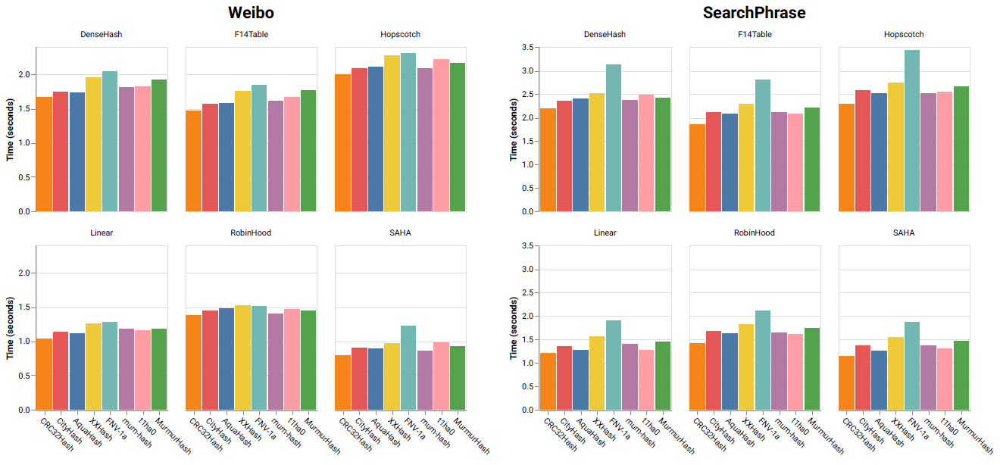                             |
| :----------------------------------------------------------- |
| 图 14. 分组基准测试，在短字符串长度分布和长字符串长度分布的两个数据集（Weibo 和 SearchPhrase）上，使用各种哈希函数的执行时间条形图。 |

我们的目标是优化分析数据库中的实际工作负载。所以在 ClickHouse 数据库中实现了 SAHA，并将其端到端时间消耗与内置哈希表实现进行了比较。==<u>由于目前 ClickHouse 的 Join 机制的限制</u>==，我们只评估了分组基准，它可以作为改进查询运行性能一个很好的指标。使用 `SELECT str, count(*) FROM <table> GROUP BY str` 作为基准查询，其中 `<table>` 是我们在之前评估中使用的任何数据集，用它们填充了一个字符串类型的列 `str`。从图 [15](#_bookmark26) 可以看出，SAHA 有助于将总查询运行时间提高 40%，并且在所有字符串数据分布上始终更快。由于在进行端到端分组基准测试时还有其他操作参与，例如数据扫描、内存复制和各种字符串操作，我们无法获得前述哈希表评估中所示的相同改进；但是，对于像分析数据库这样一个高度优化的应用程序，40% 是显著的，这也表明哈希表在像组分这样的分析查询中发挥着重要作用。此外，在对短字符串数据集进行评估时，内存消耗大大减少，因为我们将短字符串表示为数值，并且没有使用保存的哈希值。

<a id="_bookmark26"></a>

| 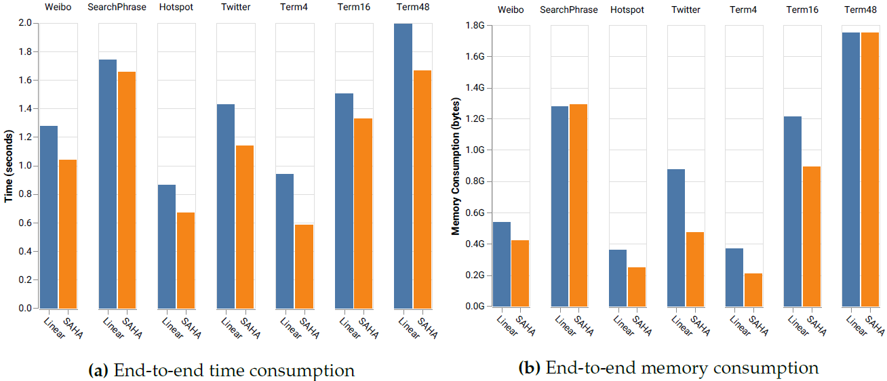                             |
| :----------------------------------------------------------- |
| 图15. 两个条形图显示 ClickHouse 内置哈希表和启用预哈希的 SAHA 在不同数据集上，端到端分组查询基准测试的执行时间和内存消耗。 |

## 6 结论

本文，我们提出了 SAHA，一种**混合的哈希表实现**，它将短字符串作为整数存储在一组底层哈希表中。SAHA 的主要思想是根据字符串长度分派，以便最终将小字符串 Key 插入为整数构建的哈希表中；保存长字符串 Key 的哈希值，以避免重新计算哈希值的开销。与使用指针存储短字符串相比，它的 CPU 和内存效率更高。连同其他优化，例如预哈希和内存加载，结果是一个比我们能找到的第二好的哈希表快近 100%。我们进行了广泛的评估，并对哈希表、哈希函数和字符串数据分布进行了详细分析。SAHA 的部分代码已被合并到 ClickHouse 中，并已在生产中广泛使用和测试。

我们未来计划研究是否有可能为长字符串实现向量化哈希表，还计划结合排序和其他数据结构来进一步优化分析查询。


## References

1.  <span id="bookmark28" class="anchor"></span>Wikipedia Contributors. SIMD---Wikipedia, The Free Encyclopedia, 2020. [Available online](https://en.wikipedia.org/w/index.php?title=SQL&oldid=938477808)  (accessed on 1 Feburary 2020).
2.  <span id="_bookmark29" class="anchor"></span>Nambiar, R.O.; Poess, M. The Making of TPC-DS. *VLDB* **2006**, *6*, 1049--1058.
3.  <span id="bookmark30" class="anchor"></span>ClickHouse Contributors. ClickHouse: Open Source Distributed Column-Oriented DBMS, 2020. Available online: [https://clickhouse.tech](https://clickhouse.tech/) (accessed on 1 Feburary 2020).
4.   <span id="_bookmark31" class="anchor"></span>Bittorf, M.K.A.B.V.; Bobrovytsky, T.; Erickson, C.C.A.C.J.; Hecht, M.G.D.; Kuff, M.J.I.J.L.; Leblang, D.K.A.; Robinson, N.L.I.P.H.; Rus, D.R.S.; Wanderman, J.R.D.T.S.; Yoder, M.M. **Impala: A Modern, Open-Source SQL Engine for Hadoop**; CIDR: Asilomar, CA, USA, 2015.
5.  <span id="_bookmark32" class="anchor"></span>Thusoo, A.; Sarma, J.S.; Jain, N.; Shao, Z.; Chakka, P.; Anthony, S.; Liu, H.; Wyckoff, P.; Murthy, R. Hive: A Warehousing Solution over a Map-reduce Framework. Proc. VLDB Endow. 2009, 2, 1626--1629. doi:10.14778/1687553.1687609.
6.  <span id="_bookmark33" class="anchor"></span>Wikipedia contributors. SQL --- Wikipedia, The Free Encyclopedia, 2020. Available online: [https://en.wikipedia.org/w/index.php?title=SIMD&oldid=936265376](https://en.wikipedia.org/w/index.php?title=SIMD&oldid=936265376) (accessed on 1 Feburary 2020).
7.  <span id="_bookmark34" class="anchor"></span>Celis, P.; Larson, P.A.; Munro, J.I. Robin hood hashing. In Proceedings of the IEEE 26th Annual Symposium on Foundations of Computer Science (sfcs 1985), Washington, DC, USA, 21--23 Oct 1985; pp. 281--288.
8.  <span id="_bookmark35" class="anchor"></span>Herlihy, M.; Shavit, N.; Tzafrir, M. Hopscotch Hashing. In *Distributed Computing*; Taubenfeld, G., Ed.; Springer: Berlin/Heidelberg, Germany, 2008; pp. 350--364.
9.  <span id="_bookmark36" class="anchor"></span>Richter, S.; Alvarez, V.; Dittrich, J. A seven-dimensional analysis of hashing methods and its implications on query processing. *Proc. VLDB Endow.* **2015**, *9*, 96--107.
10. <span id="_bookmark37" class="anchor"></span>Pagh, R.; Rodler, F.F. Cuckoo hashing. In *European Symposium on Algorithms*; Springer: Berlin/Heidelberg, Germany, 2001; pp. 121--133.
11. <span id="_bookmark38" class="anchor"></span>Kirsch, A.; Mitzenmacher, M.; Wieder, U. More robust hashing: Cuckoo hashing with a stash. SIAM J. Comput. 2010, 39, 1543--1561.
12.  Breslow, A.D.; Zhang, D.P.; Greathouse, J.L.; Jayasena, N.; Tullsen, D.M. Horton tables: Fast hash tables for in-memory data-intensive computing. In Proceedings of the 2016 USENIX Annual Technical Conference(USENIX ATC 16), Denver, CO, USA, 22--24 June 2016; pp. 281--294.
13. <span id="_bookmark39" class="anchor"></span>Scouarnec, N.L. Cuckoo++ hash tables: High-performance hash tables for networking applications. In Proceedings of the 2018 Symposium on Architectures for Networking and Communications Systems, Ithaca, NY, USA, 23--24 July 2018; pp. 41--54.
14. <span id="_bookmark40" class="anchor"></span>Google Sparse Hash, 2020. Available online: [https://github.com/sparsehash/sparsehash](https://github.com/sparsehash/sparsehash) (accessed on 1 Feburary 2020).
15. <span id="_bookmark41" class="anchor"></span>Barber, R.; Lohman, G.; Pandis, I.; Raman, V.; Sidle, R.; Attaluri, G.; Chainani, N.; Lightstone, S.; Sharpe, D. Memory-efficient hash joins. *Proc. VLDB Endow.* **2014**, *8*, 353--364.
16. <span id="_bookmark42" class="anchor"></span>Benzaquen, S.; Evlogimenos, A.; Kulukundis, M.; Perepelitsa, R. Swiss Tables and absl::Hash, 2020. Available online: <https://abseil.io/blog/20180927-swisstables> (accessed on 1 Feburary 2020).
17. <span id="_bookmark43" class="anchor"></span>Bronson, N.; Shi, X. Open-Sourcing F14 for Faster, More Memory-Efficient Hash Tables, 2020. Available online: <https://engineering.fb.com/developer-tools/f14/> (accessed on 1 Feburary 2020).
18. <span id="_bookmark44" class="anchor"></span>Wikipedia contributors. Trie---Wikipedia, The Free Encyclopedia, 2020. Available online: [https://en.wikipedia.org/w/index.php?title=Trie&oldid=934327931](https://en.wikipedia.org/w/index.php?title=Trie&oldid=934327931) (accessed on 1 Feburary 2020).
19. <span id="_bookmark45" class="anchor"></span>Aoe, J.I.; Morimoto, K.; Sato, T. An efficient implementation of trie structures. Softw. Pract. Exp. 1992, 22, 695--721.
20. Heinz, S.; Zobel, J.; Williams, H.E. Burst tries: A fast, efficient data structure for string keys. ACM Trans. Inf. Syst. (Tois) 2002, 20, 192--223.
21. <span id="bookmark47" class="anchor"></span>Askitis, N.; Sinha, R. HAT-trie: A cache-conscious trie-based data structure for strings. In Proceedings of the Thirtieth Australasian Conference on Computer Science, Ballarat, VIC, Australia, 30 January--2 February2007; Australian Computer Society, Inc.: Mountain View, CA, USA, 2007; Volume 62, pp. 97--105.
22. <span id="_bookmark46" class="anchor"></span>Leis, V.; Kemper, A.; Neumann, T. The adaptive radix tree: ARTful indexing for main-memory databases. In Proceedings of the 2013 IEEE 29th International Conference on Data Engineering (ICDE), Brisbane, QLD, Australia, 8--12 April 2013; pp. 38--49. doi:10.1109/ICDE.2013.6544812.
23. <span id="_bookmark48" class="anchor"></span>Alvarez, V.; Richter, S.; Chen, X.; Dittrich, J. A comparison of adaptive radix trees and hash tables. In Proceedings of the 2015 IEEE 31st International Conference on Data Engineering, Seoul, Korea, 13--17 April 2015; pp. 1227--1238.
24. <span id="_bookmark49" class="anchor"></span>Askitis, N.; Zobel, J. Cache-conscious collision resolution in string hash tables. In *International Symposium on String Processing and Information Retrieval*; Springer: Berlin/Heidelberg, Germany, 2005; pp. 91--102.
25. <span id="_bookmark50" class="anchor"></span>Lamb, A.; Fuller, M.; Varadarajan, R.; Tran, N.; Vandiver, B.; Doshi, L.; Bear, C. The Vertica Analytic Database: C-store 7 Years Later. *Proc. VLDB Endow.* **2012**, *5*, 1790--1801. doi:10.14778/2367502.2367518.
26. Färber, F.; Cha, S.K.; Primsch, J.; Bornhövd, C.; Sigg, S.; Lehner, W. SAP HANA Database: Data Management for Modern Business Applications. *SIGMOD Rec.* **2012**, *40*, 45--51. doi:10.1145/2094114.2094126.
27. <span id="_bookmark51" class="anchor"></span>Stonebraker, M.; Abadi, D.J.; Batkin, A.; Chen, X.; Cherniack, M.; Ferreira, M.; Lau, E.; Lin, A.; Madden, S.; O'Neil, E.; et al. C-store: A column-oriented DBMS. In *Making Databases Work: The Pragmatic Wisdom of Michael Stonebraker*; ACM: New York, NY, USA, 2018; pp. 491--518.
28. <span id="_bookmark52" class="anchor"></span>Amos Bird (Tianqi Zheng). Add StringHashMap to Optimize String Aggregation, 2019. Available online: <https://github.com/ClickHouse/ClickHouse/pull/5417> (accessed on 1 Feburary 2020).
