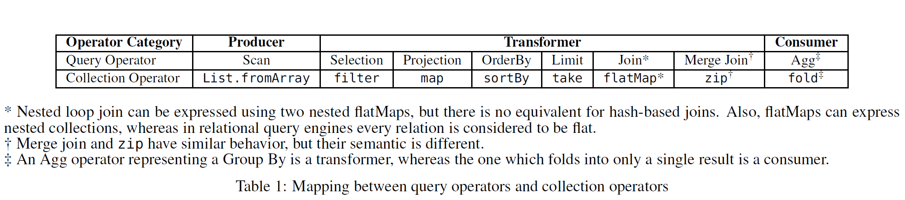

# 1 简介

数据库查询引擎成功地利用了关系代数式查询计划语言的组合性。查询计划是运算符的组合，至少从概念上讲，它们可以一个接一个地按顺序执行。然而，以这种方式实际评估查询会导致性能非常差。在将第一个运算符的结果传递给第二个运算符之前计算（“具体化”）它可能非常昂贵，特别是如果中间结果很大并且需要向下推内存层次结构。编程语言和编译器社区也进行了同样的观察，并导致了循环融合和<u>**森林砍伐（消除数据结构构造和破坏中间结果）**</u>的工作。

在关系数据库系统历史的早期，已经以 Volcano Iterator 模型 [19] 的形式提出了该问题的解决方案。在这个模型中，元组通过一系列运算符向上拉，这些运算符由以锁步方式前进的迭代器链接。运算符之间的中间结果不会累积，但元组是根据概念上“后来的”运算符的请求按需生成的。

最近，已经提出了一种运算符链接模型，它具有避免中间结果具体化但反转控制流的优点； 元组从源关系向前推到产生最终结果的运算符。最近的论文 [42、30] 似乎表明，这种推模型始终比拉模型具有更好的查询处理性能，即使没有提供直接、公平的比较。

本文的主要贡献之一是揭穿这个神话。正如我们所展示的，如果公平比较，基于推和拉的引擎具有非常相似的性能，各有优缺点，而且都不是明显的赢家。**推送引擎本质上只在查询编译的上下文中被考虑，将推送范例的潜在优势与代码内联的优势混为一谈**。为了公平地比较它们，必须将这些方面分开。

图 1 显示了这两个引擎在公平场景中使用 8 GB 数据的几个 TPC-H 查询的性能比较。这两个引擎之间没有明显的赢家。对于两个查询（TPC-H 查询 12 和 14），拉式引擎的性能优于推式引擎。但是，在某些情况下，基于推送的查询引擎的性能稍好一些。这些引擎的优点和局限性在第 2 节中有更详细的解释。

> - [ ] 图 1 

在本文中，我们对推与拉范式的权衡进行了深入研究。在推拉（push and pull）或任何合理的替代方案之间进行选择，**是一个基本决策，在整个查询引擎的体系结构中推动许多决策**。因此，必须深入了解相关的属性和权衡，而不应押注于自己有能力通过黑客手段克服选择的缺点。

此外，我们还说明了 PL 社区是如何应对和解决同样的挑战和权衡的，并展示了一些可以从那里吸取的教训中继承下来的结果。具体来说，我们研究了 PL 社区对问题的回答，即如何让**流融合 [11]**适应查询处理场景，并展示它如何结合拉取和推送方法的优势。此外，我们还演示了如何使用推送方法的想法来解决**流融合**众所周知的局限性。因此，我们构建了一个结合了推和拉方法优点的查询引擎。从本质上讲，该引擎是一个粗粒度级别的基于拉的引擎，但是，在更精细的粒度级别上，它会z推送各个数据元组。

综上所述，本文做出以下贡献：

1. 我们在第 2 节讨论流水线查询引擎。在第 3 节介绍集合编程的循环融合之后，我们在第 3.3 节展示这两个概念之间的联系。此外，我们展示了与每种方法相关的局限性。
2. 基于这种与循环融合的联系，我们在第 4 节中提出了一种新的流水线查询引擎，其灵感来自为 PL 社区中的集合编程开发的流融合 [11] 技术。此外，我们在第 5 节讨论了在 PL 社区中提议的流水线查询引擎所需的实现问题和编译器优化。此外，我们在第 5 节中讨论了建议的流水线查询引擎所需的实现问题和编译器优化。
3. 我们在第 6 节中通过实验评估了各种查询引擎体系结构。使用微基准，我们讨论了现有引擎的弱点以及所提出的引擎如何通过结合两个世界的优点来规避这些弱点。然后，我们使用TPC-H查询证明，这些引擎的良好实现对于任何形式的流水线查询引擎都没有显示出显著的优势。

在本文中，我们将Scala编程语言用于所有代码片段、接口和示例。没有一个概念和想法特别需要这种语言——可以使用OCaml、F#、C++11、C#或Java8等其他不纯的功能性面向对象编程语言。

# 2. 流水线查询引擎

数据库管理系统接受声明性查询（例如，用SQL编写）。这样的查询被传递给查询优化器以找到快速的物理查询计划，然后由查询引擎解释或编译为低级代码（例如C代码）。

物理查询计划执行计算和数据转换。一系列查询运算符可以被流水线化，这意味着一个运算符的输出被流式传输到下一个运算符，而无需具体化中间数据。

流水线有两种方法。第一种方法是需求驱动的流水线，其中运算符反复从其源运算符中提取下一个数据元组。第二种方法是数据驱动流水线，其中运算符将每个数据元组推送到其目标运算符。接下来，我们将详细介绍基于拉式和基于推式的查询引擎。

## 2.1 拉式引擎——又名迭代器模式

迭代器模型是查询引擎中使用最广泛的流水线技术。该模型最初在 XRM[37] 中提出。然而，该模型的流行是由于在 Volcano [19] 系统中采用了该模型， Volcano 利用并行化丰富了该模型。

简而言之，在迭代器模型中，每个运算符通过从其源运算符请求下一个元素来传递数据。这样，就不用等到生成整个中间关系，而是在每个运算符中惰性地生成数据。这是通过目标运算符调用源运算符的 `next` 方法实现。基于拉的引擎的设计直接对应于面向对象编程中的迭代器设计模式[54]。

图 2 显示了一个示例查询和该查询的查询处理控制流。每个查询算子执行目标算子的角色，并从其源算子（沿数据流向的前任算子）请求数据。在拉式引擎中，这是通过调用源运算符的 `next` 函数实现，并显示为**控制流边**。此外，每个运算符充当源运算符，并为其目标运算符（沿数据流方向的后续运算符）生成结果数据。生成的数据是 `next` 函数的返回值，由图 2 中的**数据流边**表示。注意图 2 中拉式引擎的控制流和数据流的相反方向。

从不同的角度来看，每个运算符都可以被视为一个 `while` 循环，其中每次迭代都会调用源运算符的 `next` 函数。当 `next` 函数返回一个特殊值（例如，`null` 值）时，循环终止。换句话说，每当观察到这个特殊值时，就会执行 `break` 语句来终止循环执行。

基于拉取的查询引擎有两个主要问题。**首先**，next 函数调用被实现为虚函数——具有不同 `next` 实现的运算符必须链接在一起。这些函数有多次调用，每次调用都需要查找虚表，导致指令局部性不好。查询编译通过内联这些虚函数调用解决了这个问题，这在第 2.3 节中有解释。

**第二**，虽然拉引擎通过流水线运算符来流水线化数据，但实际上，选择运算符是有问题的。当调用选择运算符的 `next` 方法时，目标运算符应等待，直到选择运算符返回满足其谓词的下一个数据元组。通过引入更多的循环和分支，这使得查询引擎的控制流更加复杂，如图 3c 所示。这种复杂的控制流程图降低了分支预测。直观地说，这是因为没有用于跳过不相关结果的构造（例如 `continue` 构造）。这个问题在基于推送的查询引擎中得到了解决。

## 2.2 推送引擎——又名访问者模式

基于推送的引擎广泛用于流式系统 [24]。Volcano 系统使用数据驱动的流水线（这是一种基于推送的方法）在查询引擎中实现运算符间的并行性。在查询编译的上下文中，StreamBase [1] 和 Spade [16] 以及 HyPer [42] 和 LegoBase [30] 等流式处理引擎使用基于推送的查询引擎方法。

在基于推的查询引擎中，与基于拉的引擎相比，控制流是反转的。更具体地说，不是目标运算符向其源运算商请求数据，而是将数据从源运算符推送到目标运算符。这是通过源运算符将数据作为参数传递给目标运算符的 `consume` 方法来实现。这导致**急切**逐个元组传输数据，而不是在拉式引擎中**惰式地**请求它。

**可以使用来自面向对象编程的访问者设计模式 [54] 来实现推送引擎**。这种设计模式允许将算法与特定类型的数据分开。对于查询引擎，访问者模式允许我们将查询运算符（数据处理算法）与数据元素关系分开。为此，每个运算符都应定义为**访问者**，其中 `consume` 方法具有  `visit` 方法的功能。运算符链的初始化过程是使用访问者模式的 accept 方法执行的，它对应于推送引擎中的 `produce` 方法。

图 2 显示了给定示例 SQL 的查询处理工作流程。每个运算符中的查询处理包括两个主要阶段。在第一阶段，运算符为生产数据做好准备。这在初始化时只执行一次。在第二阶段，他们消费源运算符提供的数据并为目标运算符生产数据。这是主要的处理阶段，包括调用目标运算符的 `consume` 方法并将生成的数据传递给它。这导致**控制流**和**数据流**的方向相同，如图 2 所示。

> - [ ] 图 2 

推送引擎解决了拉式引擎与选择运算符之间的问题。这是通过忽略生成的数据来实现的，如果它不满足给定的谓词，（例如，使用 continue）跳过循环的当前数据。这简化了控制流程，并在选择运算符的情况下改进了分支预测。这与拉式引擎不同，在拉式引擎中，目标运算符应该等待源运算符提供数据。

但是，推送引擎在使用 `limit` 和 merge join 运算符时会遇到困难。对于 `limit` 运算符，推送引擎不允许自然终止迭代。这是因为，在推送引擎中，运算符无法控制何时不再由其源运算符生成数据。这会导致产生永远不会被使用的数据。

Merge join 运算符也有类似的问题。Merge join 运算符无法指导其两个源运算符（均已排序并且它们之间存在 1 对 n 关系）中的哪一个应该生成下一份数据。因此，不可能在 merge join 中流水线化来自两个源运算符的数据。因此，至少对于其中一个源运算符来说，**管道需要被中断**。所以，来自其中一个源运算符的传入数据可以进行流水线处理（当然，假设它已正确排序），但必须具体化来自另一个源运算符的输入数据。

上述限制并非特定于 merge join 等运算符在必须使用集合编程 API（例如 Spark RDD [57]）的更复杂的分析任务的情况下，可能会发生类似的情况集合编程中的 `zip` 方法与 merge join 运算符具有相似的行为，并且在基于推送的引擎中不容易流水线化。

请注意，可以通过在推送引擎中特殊处理这两个运算符来解决这些限制在 `limit` 的情况下，可以通过手动将此运算符与其源运算符（在大多数情况下是排序运算符）融合来避免产生不必要的元素此外，可以实现 merge join 的一种变体，它对其源运算符使用不同的线程，并使用同步来控制其两个输入的数据生成，这可能代价高昂但在本文中，对于推送引擎，我们指的是没有此类增强功能的纯推送引擎。

## 2.3 引擎编译

通常，给定查询的运行时成本取决于两个因素第一个因素是跨存储和计算组件传输数据所需的时间第二个因素是执行实际计算（即运行查询指令）所花费的时间在基于磁盘的 DBMS 中，主要成本通常是读写辅助存储的数据传输成本因此，只要流水线算法不破坏流水线，拉式引擎和推送引擎之间就没有区别因此，拉式引擎中选择的实际问题（参见第 2.1 节）被数据传输成本所掩盖。

随着内存中 DBMS 的出现，指令的代码布局成为一个非常重要的因素因此，查询编译使用代码生成和编译技术来内联虚函数并进一步专门化代码以改善缓存局部性 [20, 2, 32, 35, 42, 33, 34, 30, 53, 12, 41, 29, 3, 48, 28]因此，每个流水线算法中使用的代码模式非常重要因此，研究针对不同工作负载的每种流水线算法的性能非常重要。

图 3a 显示了图 2 中给出的示例 SQL 查询的内联拉式引擎代码。请注意，对于选择运算符，我们需要一个额外的 `while` 循环。这个额外的循环在生成的代码中创建了更多的分支，这使得控制流图 (CFG) 更加复杂。图 3c 演示了内联拉式引擎代码的 CFG。图中的每个矩形对应一个语句块，而菱形代表条件语句。这些节点之间的边代表执行流程。向后的边表示循环内的跳跃。这种复杂的 CFG 使代码更难理解和优化编译器。结果，在运行时执行期间，性能下降主要是因为较差的分支预测。

图 3b 显示了前面示例 SQL 查询的推送引擎的专用查询。这里的选择运算符总结在一个 `if` 语句中。因此，与拉式引擎代码相比，内联推引擎代码的 CFG 更简单，如图 3d 所示。这使得底层优化编译器的推理和优化更容易，从而在运行时执行期间实现更好的分支预测。

到目前为止，还没有将流水线概念与<u>**相关的优化**</u>分开。例如，HyPer [42] 本质上是一个**推送引擎**，它默认使用编译器优化，而没有识别这两个因素对性能的单独贡献。作为另一个例子，LegoBase [30] 假设推送引擎后面跟着运算符内联，而拉式引擎不使用运算符内联 [31]。另一方面，在同一环境中，内联拉式引擎（我们怀疑Hekaton[13]属于该类）与基于推送的内联引擎之间没有比较。因此，没有在完全公平的实验条件、共享环境和尽可能一致的代码库下，比较推拉引擎和推送引擎。在第 6 节中，我们尝试进行这样一个公平的比较。

此外，简单地编译拉式引擎不会带来良好的性能。这是因为迭代器模型的简单实现没有考虑 `next` 函数调用的次数。例如，选择运算符的简单实现调用其源运算符的 next 方法两次，如下所示：

```scala
class SelectOp[R] (p: R => Boolean) {
  def next(): R = {
    var elem: R = source.next()
    while(elem != null && !p(elem)) {
      elem = source.next()
    }
    elem
  }
}
```

第一次调用发生在初始化循环之前（第 3 行），第二次调用发生在循环内部（第 5 行）。内联会导致代码大小激增，从而导致更糟糕的指令缓存行为。因此，在实现查询引擎时考虑这些问题很重要。例如，我们在基于拉取的查询引擎中实现的选择运算符通过更改 `while` 循环，只调用其源运算符的 `next` 方法一次（参见图 5e）。第 6 节展示了拉式引擎的这种内联感知实现的影响。

# 3. 集合编程中的循环合并

集合编程 API 越来越流行。Ferry [21, 20] 和 LINQ [39] 使用这样的 API 将应用程序与数据库后端无缝集成。Spark RDD [57] 使用与集合编程 API 相同的操作。此外，函数集合编程抽象存在于 Scala、Haskell 和最近的 Java 8 等主流编程语言中。此类 API 的理论基础基于 **Monad Calculus 和 Monoid Comprehensions [7, 8, 56, 22, 52, 15 ]**.

与查询引擎类似，集合编程的声明性特性是有代价的。每个集合操作都对集合执行计算并生成转换后的集合。这些调用链会导致创建不必要的中间集合。Loop fusion 或 Deforestation [55] 删除了集合编程中的中间集合。这种转换是一种非本地和脆弱的转换，很难应用于不纯的函数式程序（即，在包含命令式功能的语言中），因此在此类语言的主流编译器中是不存在的。为了提供实用的实现，以将语言限制为纯函数式 DSL，融合规则可以在本地应用。这些方法被称为 **short-cut deforestation**，它使用局部转换而不是全局转换来删除中间集合。这使得将它们集成到真正的编译器中更加现实；在Haskell[50，11，18]和基于Scala的DSL[27，48]的上下文中，已经成功地实现了 **short-cut deforestation**

接下来，我们按照发现的顺序介绍两种 **short-cut deforestation** 方法。两种方法都采用两种 `collection` 微指令方法，可以将大量 collection 操作映射到这些方法。这允许使用很少的重写规则（根据这些微指令）来实现融合。

## 3.1 `Fold` 合并

这种方法，每个集合操作都使用两个**构造**来实现：1) 用于**生产**集合的 `build` 方法，以及 2) 用于**消费**集合的 `foldr` 方法。某些方法（例如转换集合的 `map`）使用这两种构造<u>==消费==</u>给定集合并生成新集合。但是，某些方法（例如 sum）从集合中生成聚合结果，只需要使用 `foldr` 方法来消费给定集合。

我们考虑该算法的命令式变体，其中 `foldr` 方法被 `foreach` 替代。主要区别在于 `foldr` 方法显式处理状态，而在 `foreach` 的情况下，状态是在内部处理的，不会暴露给接口。

使用 Scala 语法，列表上的  `foreach` 方法的签名如下：

```scala
class List[T] {
  def foreach(f: T => Unit): Unit
}
```

`foreach` 方法通过遍历该集合的元素并将给定函数应用于每个元素来消费该集合。`build` 函数是 `foreach` 方法对应的生产者。此函数生成一个集合，其中 `foreach` 方法将 `consumer` 高阶函数应用于函数 `f`。`build` 函数的签名如下：

```scala
def build[T](consumer: (T => Unit) => Unit): List[T]
```

我们通过一个例子来说明这两种方法的含义。考虑集合的 `map` 方法，它通过将给定函数应用于每个元素来转换集合。此方法使用 `build` 和 `foreach` 函数以下面的方式表示：

```scala
class List[T] {
  def map[S](f: T => S): List[S] = build { consume =>
    this.foreach(e => consume(f(e)))
  }
}
```

图 5b 给出了使用这两种方法实现一些其他的集合运算符。

在使用 `build` 和 `foreach` 重写集合操作后，集合运算符的管道涉及构建中间集合。使用以下重写规则删除这些中间集合：

**Fold-Fusion Rule:**

```
build(f1).foreach(f2) => f1(f2)
```

例如，`map` 函数有一个循环合并规则，它将两个连续的 `map` 操作合并为一个。更具体地说，表达式 `list.map(f).map(g)` 被转换为 `list.map(f o g)`。图 4 演示了 `fold` 合并技术如何通过用 `foreach` 和 `build` 表达 `map` 运算符，然后应用 `fold` 合并规则来推导出这种转换。

这种方法的主要优点之一是，无需为集合操作的每个组合编写融合重写规则，只需根据 `build` 和 `foreach` 方法来表达这些操作就足够了。这样，不用为 n 个集合操作编写 O(n^2^) 个重写规则，而是用 `build` 和 `foreach` 来表达这些操作就足够了，这只是 O(n) 重写规则。因此，这种方法极大地简化了底层编译器转换的维护 [48]。

这种方法很好地成功地消除了大多数集合运算符。但是，并不能成功消除 `zip` 和 `take` 运算符。`zip` 方法涉及迭代两个集合，这不能使用仅迭代一个集合的 `foreach` 来表达。因此，这种方法只能消除其中一个集合的运算符，而对于另一个集合，必须创建一个中间集合。另外，对于 `take` 方法，没有办法在 `foreach` 方法的迭代中途停止。因此，`Fold` 合并技术在这两种情况下表现不佳。下面的合并技术解决了这两种方法的问题。

## 3.2 `Unfold` 合并

这被认为是 `Fold` 合并的**双重方法**。每个集合操作都用两个构造 generate^1^ 和 destroy 来表示，它们具有以下原型：

```scala
class List[T] {
  def destroy[S](f: (() => T) => S): S
}
def generate[T](next: () => T): List[T]
```

> 1. We are presenting an imperative version of unfold fusion here; the purely functional version employs an unfold function instead of generate, and the approach derives its name from that.

`destroy` 方法消费给定的列表。<u>==这个集合的每个元素都可以通过调用 `destroy` 方法可用的 `next` 函数来访问==</u>。`generate` 函数生成一个集合，其元素由传递给此方法的输入函数指定。对于 `map` 运算符，结果集合的元素是在输入集合的元素上应用 f 函数。

集合的 `map` 方法使用 `generate` 和 `destroy` 方法以如下方式表示：

```scala
class List[T] {
  def map[S](f: T => S): List[S] = this.destroy { next =>
    generate { () =>
      val elem = next()
      if(elem == null) null
      else f(elem)
    }
  }
}
```

图 5f 给出了使用这两种方法实现一些其他的集合运算符。

为了删除中间集合，可以删除中间 `generate` 和 `destroy` 链。这一事实用以下的转换规则表示：

**Unfold-Fusion Rule**:

```
generate(f1).destroy(f2) => f2(f1)
```

图4演示了该规则如何将前面的示例 `list.map(f).map(g)` 合并为 `list.map(f o g)`。注意，为了简洁起见，删除了用于检查列表末尾的空检查语句。

这种方法为 `filter` 操作引入了递归迭代。在实践中，这可能会导致性能问题，但从理论角度来看，成功地消除[23]了集合运算符。此外，这种方法不会合并嵌套集合上的操作，这超出了本文的范围。

## 3.3 Loop Fusion is Operator Pipelining

通过串接查询运算符，可以表达给定 SQL 的查询。**类似，给定集合程序可以使用集合运算符的管道来表示**。关系查询和集合程序之间的关系已经得到很好的研究。特别是，可以在关系查询计划和一类集合程序之间建立精确的对应关系 [44]。

运算符可分为三类：1) 负责从给定源（例如文件或数组）**生成**集合的运算符，2) 将给定集合**转换**为另一个集合的运算符，以及 3) **consumer** 运算符，它将给定的集合聚合成一个结果。

表 1 总结了**查询运算符**和**集合运算符**之间的对应关系。大多数 Join 运算符没有直接对应的集合运算符，但有两个例外：**嵌套循环连接**可以使用嵌套的 `flatMap` 表示，而 `zip` 集合运算符与 merge join 查询运算符非常相似。两个运算符都需要并行遍历两个输入序列。对于其它的 Join 运算符，我们使用 Join 运算符（例如 **hashJoin**、**semiHashJoin** 等）扩展集合编程。Steno [40] 中显示了 LINQ [39] 运算符和 Haskell 列表之间类似的对应关系。请注意，为了强调与关系查询引擎的相似性，我们在这里不考虑嵌套集合，尽管在集合编程中支持它很简单。



Pipelining in query engines is analogous to loop fusion in collection programming. Both concepts remove the intermediate relations and collections, which break the stream pipeline. Also, pipelining in query engines matches well-known design patterns in object-oriented programming [54]. The correspondence among pipelining in query engines, design patterns in object-oriented languages, and loop fusion in collection programming is summarized in Table 2.

**Push Engine = Fold Fusion**. There is a similarity between the Visitor pattern and fold fusion. On one hand it has been proven that the Visitor design pattern corresponds to the Church-encoding [6] of data types [9]. On the other hand, the `foldr` function on a list corresponds to the Church-encoding of lists in λ-calculus [45, 49]. Hence, both approaches eliminate intermediate results by converting the underlying data structure into its Church-encoding. In the former case, specialization consists of inlining, which results in removing (virtual) function calls. In the latter case, the fold fusion rule and β-reduction are performed to remove the materialization points and inline the λ expressions. The correspondence between these two approaches is shown in Figure 5 (compare (a) vs. (b)). The invocations of the `consume` method of the destination operators in the push engine corresponds to the invocation of the `consume` function which is passed to the `build` operator in fold fusion.

**Pull Engine = Unfold Fusion.** In a similar sense, the Iterator pattern is similar to unfold fusion. Although the category-theoretic essence of the iterator model was studied before [17], there is no literature on the direct correspondence between the `unfold` function and the Iterator pattern. However, Figure 5 shows how a pull engine is similar to unfold fusion (compare Figure 5 (e) vs. (f)), to the best of our knowledge for the first time. Note the correspondence between the invocation of the `next` function of the source operator in pull engines, and the invocation of the `next` function which is passed to the `destroy` operator in unfold fusion, which is highlighted in the figure.

#  7. 讨论：并行

在本节中，我们讨论本文的结果如何应用于并行查询引擎。**运算符内并行**是查询引擎中实现并行性的主要方式之一。在这种方法中，数据在不同的线程之间被拆分，每个线程负责以顺序的方式在其关联的块上执行计算。最后，不同线程计算的结果被**合并**成一个结果。

在中断管道的运算符之间（例如**聚合**和**Hash Join运算符**）注入拆分和合并运算符 [38] 。**因此，每个线程都在一系列流水线运算符中依次计算结果**。所以，通过使用相同的拆分和合并运算符，拉式引擎和推送引擎之间的唯一区别**在于它们计算流水线运算符链结果的效率**。因此，如果为内部运算符并行性提供基于拉和推的引擎的公平环境，我们在本文中针对单线程场景展示的实验结果有望与多线程场景相匹配。

**运算符内并行**的关键决定之一是做出分区决定的时间。如果在查询编译期间做出此决定，则称为**计划驱动**。如果将此决定推迟到运行时，则称为 **morsel driven** [36]。后者的主要优点是使用运行时信息并通过使用工作窃取 [5] 来执行更好的负载平衡。然而，分区决策选择也独立于查询引擎的类型。所有类型的查询引擎都可以使用这两种方法，并且工作窃取调度对它们的影响相似。

PL 社区也为集合程序的并行性进行了类似的努力。例如，**morsel driven** 的并行性 [36] 与并行集合编程库 [46] 有着相似的想法，例如工作窃取调度。

> **Intra-Operator Parallelism (Horizontal)** 
>
> In **intra-operator parallelism**, the query plan’s operators are decomposed into independent fragments that perform the same function on different (disjoint) subsets of data. 
>
> The DBMS inserts an exchange operator into the query plan to coalesce results from child operators. The exchange operator prevents the DBMS from executing operators above it in the plan until it receives all of the data from the children. An example of this is shown in Figure 4. 
>
> In general, there are three types of exchange operators: 
>
> - **Gather**: Combine the results from multiple workers into a single output stream. This is the most common type used in parallel DBMSs. 
>
> - **Distribute**: Split a single input stream into multiple output streams. 
>
> - **Repartition**: Reorganize multiple input streams across multiple output streams. This allows the DBMS take inputs that are partitioned one way and then redistribute them in another way. 
>
> **Inter-Operator Parallelism (Vertical)** 
>
> In inter-operator parallelism, the DBMS overlaps operators in order to pipeline data from one stage to the next without materialization. This is sometimes called pipelined parallelism. See example in Figure 5. 
>
> This approach is widely used in stream processing systems, which are systems that continually execute a query over a stream of input tuples.
