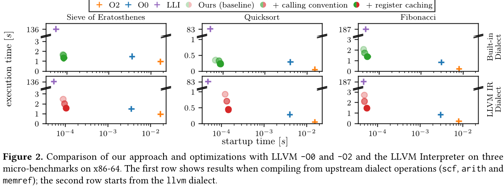
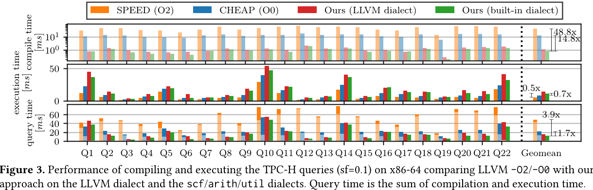
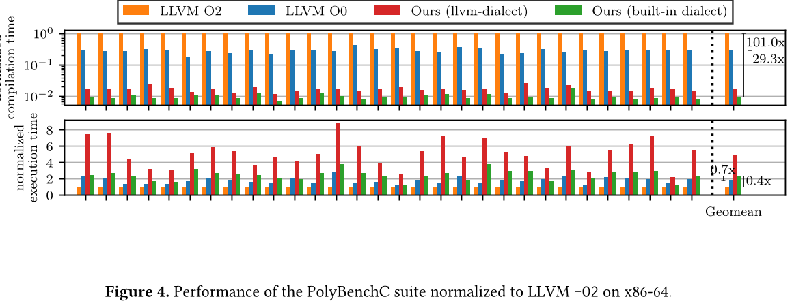
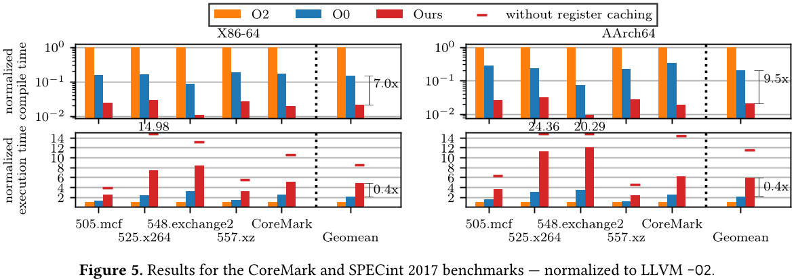

# 基于模板的 MLIR 快速代码生成

## 摘要
对于动态语言或数据库等 JIT 编译用例，以及在编译静态语言时提升开发效率而言，快速编译至关重要。基于模板的编译能够实现快速的编译速度，但在现有方法中，模板通常需要手动编写，这限制了灵活性，并带来了大量的工程工作量。

在本文中，我们介绍了一种基于 MLIR 的方法，可提前自动为任何方言的指令生成代码模板。模板生成过程复用了 MLIR 对指令进行降级时已有的编译路径，从而天然支持从不同抽象级别一次性生成代码。 

我们在编译数据库查询和标准 C 程序方面的结果表明，与 LLVM -00 相比，编译时性能提升了 10 至 30 倍，而运行时仅出现 1 至 3 倍的适度延迟，从而在基于 JIT 编译的数据库环境中实现了整体性能提升 2 倍。

> CCS 概念：·软件及其工程→即时编译器；翻译器编写系统与编译器生成器。
>
> 关键词：MLIR、JIT 编译、基于模板的编译、快速编译、二进制代码修补

## 1 引言
即时编译通常用于提升程序性能，要么通过加速后续计算来实现，如数据库查询引擎的编译[14, 24, 28, 31]，要么通过为此前从未见过的代码生成可执行文件，例如客户端 JavaScript 或 WebAssembly 代码的执行[5, 19, 34]。无论哪种情况，编译输入并生成可执行文件所花费的时间都会计入程序的执行时间，从而直接影响用户体验。

因此，构建即时编译器的一个关键挑战在于，在不牺牲代码质量的前提下，尽可能缩短编译时间。基于模板的代码生成方法只需在编译时将预先编译好的代码片段进行组合，从而实现极低的编译速度。这一方法此前已在 VCode[16] 中得到验证：该方法通过使用人工编写的机器码模板，以精简的操作集快速生成机器码；此外，Java 虚拟机 Maxine[41] 的基准编译器也为每条字节码指令组合了模板，这些模板均以 Java 语言编写，并由优化编译器预先编译。近期，该领域又出现了一种新方法[42]，它利用 Clang/LLVM[25] 来编译用 C++ 编写的模板，并证明了这种方法适用于规模更大的模板。由于在预编译阶段进行了更多优化，这种方法不仅能够显著缩短编译时间，还能带来更优异的运行时性能。然而，迄今为止的所有方法都需手动编写模板——这不仅需要投入大量开发精力，而且除了现有的降级优化措施之外，还需对模板本身进行持续维护，以确保其与优化编译流程的兼容性。

因此，我们提出一种基于模板的编译方法，该方法利用 MLIR [26]，其中指令通常会提供一种——可能包含多步——向 LLVM-IR 的降级，以实现原生代码生成。这种方法能够自动地利用现有的降级操作生成模板，从而无需手动开发或维护模板。此外，由于单条 MLIR 指令并不局限于简单的操作，这种方法能够轻松支持具有复杂逻辑的模板，进而在模板预编译阶段实现进一步优化，并因模板数量减少而缩短编译时间。图1 直观地展示了这一方法。我们的实验结果表明，与 LLVM -00 相比，我们可将编译时间提速 10 至 30 倍，同时运行时仅出现 1 至 3 倍的适度性能下降，这使得基于 JIT 编译的数据库环境的整体性能提升高达 2 倍。 

本文的主要贡献如下：
- 一种从任意 MLIR 指令的已定义降级中提取语义的框架，用于生成可重用的模板。
- 一款基于模板的编译器，可从 MLIR 程序生成针对 x86-64 和 AArch64 的原生代码。
- 针对基于模板的编译器中寄存器使用优化及常量值处理的改进。

## 2 背景：MLIR
### 2.1 MLIR 核心特性
MLIR[26] 是一个编译器框架，旨在简化静态单赋值（SSA）表示形式下中间表示的创建、转换与优化过程。该框架支持实现自定义指令集（称为方言，dialects），其中每个 SSA 指令由输入值和输出值构成，其内部可包含其他指令序列的区域（例如，自然循环的循环体），并具备常量属性以进一步配置单个指令（例如，常量指令的值）。这些属性进一步分为固有属性（也称为特性，properties）和可丢弃属性：可丢弃属性可随时省略，因此不包含指令执行所需的关键信息。

### 2.2 MLIR 优化与转换能力
MLIR 框架为通用优化（例如，常量传播和公共子表达式消除）以及从高层级方言到低层级方言的转换提供了统一的方式。为方便使用，MLIR 内置了一组上游方言，包括用于处理结构化控制流的 scf 方言、用于数学表达式的 arith 和 math 方言，以及用于内存交互的 memref 方言。LLVM-IR 是常见的下游转换（lowering）目标，转换过程中可选择使用不同的中间方言。为此，MLIR 将大部分 LLVM-IR 封装为 MLIR 方言，作为转换的目标对象，后续可轻松将其翻译为实际的 LLVM-IR。

### 2.3 MLIR 的跨领域应用
近年来的相关研究已开始将 MLIR 的能力应用于超出其原始机器学习应用场景的多个领域[10, 20, 27, 40]，例如在编译 Fortran、C 和 C++ 等静态语言时探索新的优化机会[4, 29, 30]，以及为数据处理流水线提供不同的抽象表示[13, 21]。

## 3 模板生成
### 3.1 指令前提条件
我们提出的自动模板生成方法通常适用于所有方言（dialect），不受其抽象层级限制——已成功应用于低层级方言（如 LLVM IR）和极高层级方言（如 ONNX 方言[20]）。其唯一前提条件是：每条指令的下转换（lowering）过程不依赖任何来自指令本身之外的信息。否则，将无法孤立处理每条指令，进而无法将其语义自动捕获为独立模板。

大多数常见指令均符合这一规则。但存在部分例外情况，例如 LLVM 分支指令（依赖外部基本块标签）和 alloca 指令（其下转换依赖周围作用域）。另一类存在冲突的指令来自上游 OpenMP 方言，该方言中的许多指令与周围指令存在极强的耦合关系（例如，临界区内/外的指令）。

### 3.2 捕获指令语义
由于我们希望避免手工编写模板，因此我们的方法直接从 MLIR 指令中生成原生代码模板，无需任何手动实现工作。主要挑战在于，MLIR 指令本身是不透明的：其完整语义仅在降级过程中定义。为了将指令的语义捕获到原生代码模板中，我们将每条指令隔离为一个函数，为该指令提供不透明的输入，并使用 unrealized_conversion_casts 捕获输出。这些转换通常不会被进一步的转换或变换所折叠。清单1 展示了一个示例。

1 函数.函数@添加()->pt r{
2// 在输入中
3%0,%1= 未实现的转换，类型为(i64, i64)
4%2= 算术.addi%0,%1: i64
5// 输出（s）- 返回以使其存活
6%3= 未实现的转换类型转换%2：i64 转 p 指针
7返回%3:p tr
8}

列表1. 在内部中间状态中自动生成的 arith.addi 指令抽象。通过未实现的转换强制转换，将该指令的输入和输出设为不透明。对输出应用转换后得到的符号值将从函数中返回，以保持这些值及相应计算的有效性。

对于包含区域的指令，我们进一步在每个区域中放置外部函数调用，以封装相关行为。为了跟踪区域参数，这些参数会在调用前写入内存，而终结器指令的操作数则从内存中加载。

指令的不透明性为将传入指令与合适的二进制模板进行匹配带来了另一项挑战。指令的降级方式会因操作数或结果类型的差异而有所不同。例如，来自数学或算术方言的大多数上游指令的行为都取决于类型——这种类型并不一定是个标量值，也可能是一个数值张量。因此，必须针对每种指令的输入和输出类型组合生成唯一的模板，因为每种组合的降级方式可能各不相同。同样的情况也适用于固有属性：这些属性可能会影响降级过程，但却无法通过任何指令输入来体现。 

对于不满足已定义先决条件的操作，我们提供了两个扩展点以支持手动处理：(a) 可在模板生成时提供自定义抽象；(b) 可在模板运行时编译期间插入自定义实现。

### 3.3 降低与编译
接下来，我们对派生的抽象应用特定于方言的转换，将其降级为 LLVM-IR。在示例中，这会将算术加法指令 arith.addi 转换为 llvm.add，并将 MLIR 原生指针类型转换为其对应的 LLVM 版本。随后，我们需要为不透明的输入和输出提供实现，以便能够真正编译代码。一种简单但行之有效的方法是：将输入视为内存加载操作，将输出视为内存存储操作。这些值存储在值存储器中，该存储器稍后将在栈上分配，并作为参数传递给模板函数。这种方法允许使用 32 位偏移量进行高效寻址，而非任意 64 位内存地址，同时还复用了栈的自然增长与收缩机制。正如[42] 中所采用的，实际的地址和偏移量是在运行时编译期间计算得出的，并通过符号的地址将其修补到模板中。这会导致重定位，因此可在运行时编译期间进行修补（参见第4.2 节）。作为进一步优化，我们将这些符号设为弱符号，以防止 LLVM 对符号值是否非零做出任何假设；同时，我们使用 absolute_symbol 属性，将重定位限制为绝对的 32 位重定位，从而生成更高效的代码。

为实现模板的组合以及支持指令间的控制流，我们采用了延续传递风格（CPS）[38] 这一概念：我们在每个模板的末尾强制执行对延续函数的尾调用，并使用 musttail 注解将控制流转移至下一个模板。延续是一个外部符号，其实际地址在运行时编译期间会被修补。在拼接模板时，模板末尾的 jmp 指令可被轻松识别并省略。

然而，这种技术不适用于区域调用，因为区域调用属于常规的非尾调用，调用结束后执行将继续在模板内部进行。相反，这些调用会生成常规调用，并将值存储指针作为参数传递。区域终止符的操作数将在调用之后从值存储中加载。清单2 展示了一个最终 LLVM-IR 代码的示例，该代码随后将被编译为模板。

；外部符号地址作为可 patch 的常量
@off_0= 外部弱全局 i8，对齐 1，
3!绝对符号!{i64 0, i64 INT32_MAX}
@off_1= 外部弱全局 i8，对齐 1，
5!绝对符号!{i64 0, i64 INT32_MAX}
@off_2= 外部弱全局 i8，对齐1，
7!绝对符号!{i64 0, i64 INT32_MAX}
🟥 声明 void@next(指针%值存储)
🟥 定义 void@add(ptr%value_storage){
10；从内存中按修补后的偏移量加载操作数
11%1= 获取元素指针 i8，指针%value_storage，
12i64 将ptr@off_0转换为i64
13%2= 加载 i64，指针%1，对齐 4
14%3= 获取元素指针 i8, 指针%value_storage,
15i64 将ptr@off_1 转换为i64
16%4= 加载 i64，指针%3，对齐 4
17%5= 将 i64%2 和 %4 相加；该操作本身
18；将结果存储到已修补偏移量的内存中
19%6= 获取元素指针 i8, 指针%value_storage,
20i64 将ptr@off_2 转换为i64
21商店 i64%5，ptr%6，对齐 4
22；调用继续
23必须调用void@next(指针%值存储)
24返回空值
25}

清单2. LLVM-IR 中算术加法指令的自动派生抽象。操作数为内存加载，结果写回内存。值存储中的偏移量以外部符号的地址表示，并在运行时编译期间进行后续修补。控制流通过强制尾调用进行转移。

### 3.4 二进制格式
为了最终生成二进制代码模板，抽象后的函数会使用 LLVM 优化与代码生成基础设施，在最高优化级别下编译为二进制对象——目前仅限于 ELF 格式。 

1 添加：; rdi=指向值存储的指针
2移动 q$off_0(%rdi),%rax
3加q$off_1(%rdi),%rax
将 q%rax 的值加载到 off_2(%rdi) 中。 
5j m p$下一个

清单3：来自清单2 的 arith.addi 编译后模板。模板结果的值存储偏移量和继续地址会导致重定位（已高亮显示）。

我们通过解析 ELF 文件来提取模板，将文本节用作模板的二进制代码，并将数据节（例如，.data 和.rodata）存储起来以供后续使用。

### 3.5 模板运行时系统交互
到运行时系统。此外，我们还会跟踪重定位条目，并根据名称识别用于值存储偏移量和继续调用的补丁点符号。我们还会跟踪并非源自框架的其他重定位，因为我们还需接管一些运行时链接器的任务（例如，将地址修补至其他符号或数据段）。

清单3 中展示了一个用于算术加法操作的简单模板二进制文件，该文件仅包含二进制代码和一些补丁点，其中包括继续执行地址。

### 3.6 案例研究：LLVM 方言的模板
作为其中一个例子，我们考察了将我们的方法应用于 LLVM 方言的情况，而该方言是运行评估过程中所用基准测试所必需的。对于大多数指令，我们能够自动生成模板，无需任何人工干预。然而，为了全面覆盖基准测试所需的 LLVM IR 指令，我们不得不提供一些自定义实现：
- 分支指令（Br、Condbr 和 Switch）采用手工汇编，运行时编译还会处理 SSA 破坏问题。
- AddressOf 需要自定义抽象，因为内存位置仅在运行时编译时确定。
- 全局变量的区域和值属性在运行时编译期间进行评估，并被放置到内存中，随后可使用 AddressOf 进行引用。
- 栈分配（Alloca）从值存储（固定大小）或堆（可变大小）中获取内存。

尽管如此，为如此庞大的指令集投入这么一点精力，也算得上是相对较小的付出。 

## 4 模板的运行时编译
运行时编译阶段会将预先编译好的模板拼接在一起，以生成针对此前从未见过的输入程序的代码。这一过程对应于即时编译器中的编译环节，因此也被称为“编译”。与前一阶段不同，这一阶段对时间非常敏感，因为编译过程会直接影响整体执行时间。 

### 4.1 模板选择
作为第一步，必须用现有的模板覆盖输入程序。为此，我们从顶层区域开始，以深度优先的方式遍历输入程序，并针对每条指令从模板库中逐一查找匹配的模板。如第3.2 节所述，一条指令可能以不同的配置出现（例如，输入类型或属性值不同）。因此，要使模板能够匹配，它必须与完整的签名完全吻合，该签名由操作名称、输入和输出类型、区域数量以及属性值组成。为了尽可能高效地进行签名查找，我们将这些签名存储在哈希映射中。所使用的哈希函数基于操作类型和属性构建，因为这两者的组合提供了签名的大部分熵值。 

此外，MLIR 上下文确保每个已注册的操作类型都是唯一的，因此我们可以比较操作类型标识符——它只是一个指针——而不是字符串表示形式。 

### 4.2 模板实例化
一旦找到匹配的模板，便会对其进行实例化。相应的二进制代码会被复制到指定的内存位置，并且所识别的补丁点——主要是值存储中的偏移量以及继续地址——会被调整为各自的正确值。在复制过程中，我们可以省略相邻两个模板之间的无谓跳转。 

当前指令定义的所有值（结果和区域参数）都会被分配到值存储中的一个槽位。为了将编译时间保持在较低水平，我们会在生成本地代码的同一遍扫描中分配这些槽位。为降低值存储的内存占用，我们会跟踪槽位的活跃状态，并在槽位空闲后重新加以利用。不过，为了提升性能，我们并未执行专门的活跃度分析，而是对生命周期区间进行了较为宽松的上界近似：槽位的结束时间默认设定为区域的结束时间，除非该指令在同一基本块中仅有一个使用点，在这种情况下，槽位的生命周期则终止于该指令处。 

### 4.3 修复与包装函数
由于我们在对输入进行单次扫描时生成代码，某些地址或符号在首次被引用时尚无法确定。这种情况主要源于对尚未定义的函数、全局符号或基本块标签的前向引用。这些位置会被跟踪并及时更新，一旦所引用的数据可用即可完成相应修正。对于所有地址引用——包括实例化期间——我们都会充分利用编译时信息，这有助于实现进一步的链接优化。例如，如果目标地址位于可范围之内，我们会直接计算所需地址来替代对全局偏移表（GOT）的加载操作，从而节省 GOT 条目的空间，并避免运行时从内存中加载数据。 

代码生成完成后，控制流必须切换到新生成的汇编代码中。通过查找生成的主函数的地址，并以默认的 C 语言调用约定进行调用，即可实现从宿主 C++ 程序到生成汇编代码的转换。为体现函数声明而生成的函数模板负责分配初始值存储空间、保存寄存器（并在返回时恢复它们）、准备值存储指针参数，并最终调用其函数体。自此之后，我们的框架在执行过程中将不再提供任何运行时组件。 

## 5 优化
### 5.1 常量求值
与 LLVM 不同，后者可随意将常量用作值，而 MLIR 在概念上并不区分常量，而是将其建模为常量指令，例如用于常量数字的 arith.constant。由于这些常量的实际值作为属性存储，每条指令都会被识别为各自的模板。为了避免生成大量仅因值不同而彼此迥异的常量模板，可在模板生成期间执行那些无副作用、无区域、无输入操作数且不引用任何动态地址的操作。在运行时编译过程中，可按需使用自定义模板注入这些结果。这种优化大大减少了所生成模板的数量，因为所有经过常量求值的指令都共享同一个专用模板。 

### 5.2 模板调用约定
到目前为止，每个值都存储在内存中的值存储区，并通过将偏移量修补到已实例化的二进制文件中传递给模板。对于常量而言，这会导致将该值存储到内存中，而模板随即立即再次加载该值。为了改进这一点，我们调整了模板输入和输出的处理方式。

合理的小输入值（最多两个寄存器宽）直接通过寄存器传递，而较大的值则保留在内存中，并通过修补后的偏移量进行寻址。我们通过将这些值作为参数传递来实现这一点：根据底层调用约定，这些参数会以寄存器形式传递给函数模板。类似地，较小的输出操作数也会作为参数传递给延续函数。对于较大的数据类型，处理方式保持不变，因为通常只使用其值的一个小子集。因此，这类数据更适合在内存中传递，因为模板能够专门访问所需的元素，从而避免了大规模的加载和存储操作。清单4 给出了应用此优化后的 arith.addi 示例的二进制代码。

1 添加：; 参数：%rdi= 值存储，%rsi= a，%rdx= b
2加%rdx,%rsi
3jmp$下一个；参数：%rdi= 值存储，%rsi= 结果

清单4. 使用优化调用约定编译的 arith.addi 模板：输入和输出值位于寄存器中；待修补的继续地址（已高亮显示）。

在运行时编译过程中，我们还会额外生成代码，以便在需要时从内存中加载值，并直接将常量材料化到寄存器中。每次处理完一个模板后，结果都会写回内存。由于操作数加载与计算过程被明确分离，内存操作数不再能与算术运算融合（如清单3 中所示：第二个操作数的加载被融合进了 addq 指令）。不过，这一变化并未对性能造成明显影响，因为大多数现代 x86-64 CPU 本身就会将加载-算术指令拆分为多个微操作。作为附加效果，这也显著减小了模板的大小，因为加载和存储值不再成为每个模板的必要组成部分。 

### 5.3 寄存器缓存
即使经过之前的优化，生成的代码仍会过度地将值从内存加载到寄存器，并将结果再存储回内存。为了减少内存访问次数，我们除了将结果值写回值存储区之外，还将其缓存到寄存器中——这样一来，在许多情况下，就可以用寄存器中的副本替代从内存的加载操作。如果某个值仅在紧随其后的指令中被使用一次，我们甚至可以完全省去向内存的存储操作。

虽然完全可以只依赖被调用者保存的寄存器——这些寄存器由模板保证不会被修改，但许多模板仅使用极少数寄存器，因此其他由调用者保存的寄存器可作为额外的缓存空间。因此，在模板生成过程中，我们会分析哪些寄存器会被破坏。我们通过分析函数最终机器 IR 中的指令，在 LLVM 编译期间获得了这一信息。 

在代码生成过程中，我们还会额外跟踪寄存器中的缓存值，并生成代码以将结果值存入和取出这些寄存器。尽管额外的移动操作会增加指令数量，但在执行时却能带来收益，因为我们减少了从内存中加载数据的次数。

我们评估了两种不同的缓存寄存器分配策略。当需要缓存某个寄存器但没有可用的缓存空间时，我们可采取以下两种方式：(1) 根本不缓存该值；或 (2) 以轮转方式覆盖已缓存的某个值。我们选择了轮转方式，因为 SSA 值通常仅在局部范围内使用，随着代码的推进，其重要性会逐渐降低。不过，这两种策略之间并无显著差异——两者均能节省多达 30% 的内存加载开销。因此，基于编译时间更短这一优势，我们的评估采用了策略(1)。如果某个值到达其生命周期终点（参见第4.2 节），或者模板覆盖了这些缓存寄存器，则缓存寄存器将被释放——此时，我们将回退至从值存储中加载数据。 

### 5.4 更高层次的优化
针对解释器和基于模板的编译器的其他常见优化措施还包括超节点生成[11, 37] 以及针对特定输入的模板特化[22]。然而，借助像 MLIR 这样灵活的框架，我们认为无需采用此类技术。相反，开发者可以充分利用 MLIR 的多级方法，直接在更高层次、面向特定领域的方言上进行代码生成。这样做会隐式地生成超节点，因为较高层次的指令通常更为复杂，往往会被降级为若干较低层次的指令。一个简单的例子便是用于结构化控制流的 scf 方言，它已为常见的循环结构（如 while 循环和 for 循环）提供了显式的操作，而不再使用较低层次方言 cf 和 llvm 中常见的普通分支指令。由于指令数量减少且控制流更加简单，以较高层次方言作为代码生成的起点，还能有效缩短编译时间。

## 6 目标架构考量
尽管到目前为止的示例都针对 x86-64 架构，但我们的方法并不要求特定的架构。模板生成完全依赖于 LLVM，因此能够为各种架构生成模板。甚至内部代码生成（例如，将寄存器存储到内存或反之）也复用了模板编译的方法。因此，将这种方法移植到新架构只需付出适度的努力（例如，进行特定于架构的重定位）。

除了 x86-64，我们目前还支持 AArch64。两者之间的一个关键区别在于，AArch64 的指令集是固定长度的，因此灵活性较低。特别是，常量通常需要通过多条指令来组合，而重定位操作往往涉及对代码进行位级别的调整——这与 x86-64 形成鲜明对比，后者重定位一般以字节为单位且连续对齐。反过来，固定长度的指令集使得二进制代码的修改更加直接，从而简化了指令优化过程，例如用直接地址计算取代 GOT 表项的加载操作。 

## 7 评估
我们在一系列微基准测试和基准测试套件上评估了我们的方法。我们假定所有必要的模板均已生成并为所有基准测试做好了使用准备。这一假设通常是可行的，因为潜在指令的数量本身是有限的——这一点已在[42] 中得到证明。

我们针对不同的 LLVM 后端对我们的方法进行了对比。由于 LLVM 后端并不直接操作 MLIR，而是使用 LLVM-IR，因此我们首先将 MLIR 输入降级为 LLVM-IR。这一步并未计入测量结果，因为其耗时已远高于我们方法本身的编译时间。随后，我们采用 LLVM ORC JIT，通常搭配小型代码模型；仅 SPEC 测试需要中型代码模型。对于 -00 优化级别，我们使用 FastISel 作为指令选择器；而对于优化编译，则采用 -02 优化级别，因为与其他后端优化级别相比，未发现显著差异。在可能的情况下，我们分别将采用我们方法编译的结果与更高级别上游方言以及更低级别 LLVM 方言的编译结果进行了对比。MLIR 上游方言的输入是通过 Polygeist [29] 的 C 前端生成的，且优化功能已关闭。对于 LLVM 方言，我们首先使用 Clang 并指定 -00 选项以生成 LLVM-IR，随后再利用 MLIRTranslate 工具将其导入 MLIR。 

我们的 x86-64 基准测试平台配备了一颗英特尔至强铂金 8260 CPU，搭配 160 GiB 内存；我们的 AArch64 平台则搭载了苹果 M1 芯片，配备 16 GiB 内存。所有机器均运行 Linux 操作系统，并使用了 LLVM 开发快照版本（提交号为 5d492766a8）。除昂贵的 SPEC 基准测试外，所有图表均报告了十次运行的中位数结果。

### 7.1 优化的影响
为了分析第5 节所述优化措施的影响，我们选取了一组微基准测试，将我们的方法与 LLVM 后端的优化级别 00 和 02，以及 LLVM 解释器进行了对比。这些基准测试旨在突出我们的优化技术对计算密集型任务的显著影响。其中，埃拉托斯特尼筛法仅在一个函数中运行，重点考察控制流、内存访问及算术运算；快速排序基准则在此基础上进一步扩展，将关注点从单个函数内部的控制流略微转向递归调用和内存操作。最后，斐波那契数列用于展示极小规模程序的启动开销可忽略不计，同时也揭示了我们的方法在完全依赖函数调用的程序中的局限性。图2 展示了实验结果。在编译时间维度上，我们方法的结果标准差始终低于 10%，而 LLVM 各优化级别的标准差则低于 5%；在执行时间方面，所有方法的标准差均低于 3%。 

与使用 LLVM 编译相比，我们方法的编译时间比 -00 快了一个数量级，范围在 32 到 72 倍之间。运行时性能方面，微基准测试的结果总体上与 LLVM -00 相当，速度介于其 2 倍慢到 20% 快之间。LLVM 解释器的速度则比所有其他方法慢约 100 倍。启动时间普遍较短，但一旦采用我们的方法，即使是启动时间也已超越了 LLVM。在斐波那契基准测试中，显著的运行时开销源于递归调用的影响——由于递归调用在概念上会破坏所有寄存器，从而阻碍了寄存器缓存的使用。我们通过优化模板设计，优先使用寄存器并显式化常量，将执行时间缩短了 15%。然而，单独插入加载/存储操作导致编译时间略微增加了 8%。若再结合我们的寄存器缓存策略，执行时间将进一步大幅缩短 26%（相比基线提升了 37%）。尽管如此，生成额外指令并跟踪寄存器仍带来了 10% 的编译时间开销（相比基线增加了 19%）。 

在我们的方法中，从较高的抽象层次（第一行）入手显然更有利，因为这类程序通常包含更少且更复杂的操作，因此编译时所需的工作量更小，并能更好地优化模板内的代码。 

### 7.2 LingoDB - 一款基于 MLIR 的数据库引擎
编译数据库引擎是即时编译（JIT）的重要应用领域，因为编译时间会完全计入查询的总体处理时间。LingoDB[21] 是一款基于 MLIR 的查询执行引擎，它通过一种声明式顶层方言对 SQL 查询进行降级处理，同时在此基础上执行查询计划优化，最终将查询转换为 LLVM 方言，以编译成原生代码。

我们直接采用自研方法替换了最后的降级阶段，以生成原生代码。该技术应用于两个层级：最低的 LLVM-IR 层以及其上一层——该层由上游方言和一种专为 LingoDB 设计的实用方言组成。我们以 TPC-H[39]（缩放因子 0.1）作为典型的小规模工作负载。由于我们的代码生成方法旨在作为未优化层级，自适应执行流水线可切换至优化后端来处理更大规模的数据集。

图 3 展示了现有 LingoDB 高速模式（-02）与经济型模式（-00）和我们方法的对比结果。LLVM 执行阶段的执行时间和编译时间标准差约为 5%，而我们的方法由于绝对值显著降低，编译时间维度的偏差为 20%，执行时间维度的偏差则为 10%（上游方言）至 20%（LLVM IR 方言）。

从高级方言编译时，我们的方法生成代码的速度比 LLVM -00 快一个数量级，每条查询大约只需一毫秒。作为代价，与 LLVM -00 相比，平均执行时间增加了 40%（从 Q14 的 3% 到 Q17 的 76%）。尽管如此，综合编译和执行两个阶段，采用我们的方法编译并执行 TPC-H 查询的总时间，相比 LingoDB 经济型模式减少了 43%，相比 LingoDB 高速模式则缩短了约 4 倍。考虑到查询执行通常是多线程的，提速效果还会进一步提升，因为并行执行只能在单线程编译完成后才开始。

与 LLVM -02 相比，执行时间增加了 108%（从 Q15 的 35% 到 Q17 的 200%）。然而，在如此小的数据集上，生成优化代码所花费的时间并未得到充分摊销。与微基准测试类似，从更高级别的方言开始编译，能够同时提升编译时间和执行时间的性能。

尽管文献[42]中的基于模板的编译方法也支持 TPC-H 查询的一个子集，但两者难以直接比较——因为 LingoDB 提供了更优化的算子实现和改进的查询计划器。即使对于查询计划完全相同的 TPC-H Q6，我们的方法执行速度也快约 2 倍（两者均在我们的机器上运行）。对于其他那些查询优化至关重要的查询，运行时差异更是高达几个数量级。不过，我们方法的编译时间要长 10 倍；我们将在 7.5 节中详细探讨这一问题。尽管如此，毫秒级别的代码生成时间仍足够短，因为查询执行流水线中其余阶段（包括查询优化和之前的 MLIR 降级）的执行时间本身就已达到数毫秒级别。

### 7.3 PolyBenchC
除了 JIT 编译之外，我们的方法还可用于 Fortran 和 C 等语言的静态编译，在开发过程中，短编译时间至关重要。

我们首先在 PolyBenchC [36]基准测试集上评估了我们的方法，该测试集是多面体优化技术的一个广泛实例。图4 展示了结果。对于所有方法，该指标的标准差均保持在执行时间和编译时间的 10% 以下。

从上游方言输入进行编译，不仅比从 LLVM 方言起步的编译速度更快，而且对于这些程序而言，执行时间差异也十分明显。这是因为采用 MLIR 上游方言的规范化表示在数值内核计算方面更加简洁且更具表达力。与 LLVM 相比，我们的方法在两个抽象层次上的编译速度均快了一到两个数量级；与 LLVM -00 相比，执行速度的提升幅度从放缓 165%（Jacobi 2D）到提速 20%（Jacobi 1D）不等——中位数放缓幅度为 34%。 

与[42] 方法的比较只能部分实现。尽管他们运行的是相同的基准测试套件，但他们的评估目标是基于优化后的 WebAssembly 代码进行编译，而我们采用的则是优化程度较低、更高级别的表示形式。我们能做的最接近的对比是：不从未经优化的输入代码入手，而是直接使用 Clang 的 -03 优化级别，生成一种类似于 WebAssembly 输入已被初步优化过的优化后输入表示。然而，由于我们的输入依然保持相对较高的抽象层次，因此错失了在 WebAssembly 生成过程中可能应用的任何后端优化机会。此外，我们还在自己的机器上重新评估了他们的结果。与他们的方法相比，我们所采用的方法在执行时间上的差异介于慢 10 倍到快 2 倍之间。不过，我们生成代码所花费的时间仅为他们方法的一半，这再次得益于高级别 IR 简洁的表示形式。 

### 7.4 CoreMark 和 SPECint 2017
为全面展示 LLVM-IR 的覆盖范围，我们运行了 CoreMark[1]和 SPEC CPU 2017 整数基准测试[2]。在所有情况下，由于 Polygeist 的功能有限，我们均无法从 C 源代码生成 MLIR 代码，因此仅测量了 LLVM 方言级别的性能。Fortran 基准测试（SPECint 548.exchange2）采用 Flang[4] 编译，该工具可直接输出 LLVM MLIR 方言。部分 SPEC 基准测试（500.perlbench、502.gcc 和 531.deep-sjeng）根本无法转换为 MLIR，或者生成的 MLIR 会导致编译时超时或程序崩溃，即便使用 LLVM 后端进行编译亦是如此。此外，我们还排除了其他 C++ 基准测试，因为这些测试使用了目前尚不支持的 C++ 异常机制。由于我们的 AArch64 机器内存有限，我们只能在 AArch64 平台上运行 SPEC 557.xz 的一个参考执行实例。我们在图5 中报告了参考工作负载三次编译/执行所得结果的中位数。所有方法在两个维度上的结果标准差均低于 5%。

我们的方法生成代码的速度比 LLVM 快一到两个数量级，而执行时间则比 LLVM-00 慢 2 到 3 倍。尤其值得一提的是，我们的寄存器缓存优化对这些基准测试产生了显著影响，使运行时间提升了近 2 倍。

在 AArch64 上，相对编译时间与 x86-64 上的编译时间基本一致，而执行时间的 slowdown 在 AArch64 上略高于 x86-64，尤其是在 525.x264 和 548.exchange2 这两个测试中。 

### 7.5 编译时分析
#### 7.5.1 模板生成
模板生成发生在编译时，因此不被视为时间关键型操作。表1 列出了用于先前评估的模板的数量、大小及生成时间。这些数据是通过计时模板生成阶段并检查生成的模板库获得的。

表1. 各基准测试的提前模板生成阶段的指标。大小为原始代码大小，元数据包含补丁位置和类型信息。

SPEC 基准测试套件的模板数量看似相当多，但其中主要由 1400 个函数模板和 1300 个调用模板组成。这些模板的签名中包含了相应的符号名称；此外，还有 2000 个 getelementpr 模板，因为常量索引被存储为指令的属性。通过为 getelementpr 提供自定义模板实现，并忽略符号名称——对具有相同函数签名的所有函数仅使用一个模板——同时将函数模板（func）精简至 280 个、调用模板（call）精简至 400 个，我们便能将所需模板的数量减少到约 1000 个。

与[42] 相比，我们生成的模板要少得多，因为我们只为每条指令签名生成单一变体，而他们采用的寄存器分配方案和超节点构造则需要生成多种变体。此外，他们报告的模板生成时间以分钟为单位，明显慢于我们的方法。

#### 7.5.2 运行时编译
从本质上讲，基于模板的代码生成力求实现极低的编译时间。为了更深入地了解耗时关键的编译阶段具体在哪些环节上花费了时间，我们对编译器进行了插桩处理，增加了额外的时间测量——图6 展示了最显著的几个组成部分。其中，花费时间最多的部分是模板实例化（参见第4.2 节），其次是模板选择（参见第4.1 节）。后者本可以避免，完全通过将输入的 MLIR 指令直接映射到其对应的签名来实现。

这种映射可采用完美哈希（如[42]所用）；然而，这样做将无法动态地添加更多模板。通过哈希表跟踪每个值的当前存储位置同样开销较大；虽然可以通过将位置信息内联存储于值中来优化这一过程，但 MLIR 并不支持向值附加自定义信息。最后，全局常量的求值也会占用一部分编译时间，因为正如第3.5节所述，必须先对它们进行求值，才能生成相应的代码。 

剩余时间用于针对每个输入的 MLIR 指令，对其类型、输入操作数、结果值以及区域进行反射，以正确配置模板实例化。操作数必须放入预期的寄存器，或其存储偏移量必须被重新调用；结果值会被分配到槽位，并存储和缓存在寄存器中；同时，还需记录区域参数及终止符操作数的内存偏移量。性能分析表明，相当一部分时间直接耗费在了 MLIR 的反射操作上。这一开销可通过在框架编译期间静态提供相关信息来避免，但这种做法仅适用于事先已知的受限领域，而这与 MLIR 所提供的灵活性并不相符。 

总之，利用 MLIR 提供的灵活性会带来一些代价，目前也限制了编译时的重大性能提升，这促使我们未来进一步优化 MLIR 的性能。 

## 8 讨论与未来工作
结果表明，我们的方法实现的编译时间比 LLVM -00 快了一个数量级。尽管在某些基准测试中，执行时间高出 3 倍，但在其他基准测试中，执行时间与现有基线相当，有时甚至更快。值得注意的是，大幅缩短启动时间且执行速度并未明显降低，这使得该方法能够作为有效的 JIT 编译器基线使用。 

以 MLIR 作为起点，能够让我们面向一个持续增长且开放的生态系统，同时降低复杂性——因为高级别优化（例如超节点）可轻松地反映在 MLIR 的多级架构中。自动模板生成省去了实现与维护所需的工作量，且不会影响编译时与运行时之间所承诺的权衡。然而，MLIR 的灵活性也带来了一定的代价：其编译时间有时难以跟上先前提出的“复制并修补”方法[42]——后者编译速度大约慢 2 倍到快 10 倍不等。尽管如此，我们认为，从绝对值来看，这些微小差异几乎不会导致端到端场景中的延迟增加，因此，手动构建模板所带来的努力并不值得。相反，我们的代码在执行速度上不仅能够保持同步，甚至还能有所提升。 

此外，我们的方法并不仅限于即时编译用例：我们能够为几乎任意方言输入提供合理的编译到运行时的权衡，包括 LLVM-IR。我们的方法可提供一种快速编译层，至少适用于开发场景——在这些场景中，大部分时间都花在代码编译上，而真正执行的代码片段却只是其中一小部分。不过，要全面覆盖这一场景，还需在生成调试信息以及支持更多二进制格式（例如 Mach-O 和 PE）方面做些工作。 

在所有情况下，我们的方法都无需对现有的 MLIR 基础设施进行重大改动即可适用：它采用与常规编译相同的输入表示形式，并且所有可降级至 LLVM-IR 的方言，至少都能在 LLVM-IR 方言级别上得到支持。

## 9 相关工作
### 9.1 近期基于模板的编译器实现
最新且最接近的独立式、基于模板的编译器实现[42]采用以 C++ 编写的模板，并借助 LLVM 将其预编译为机器码。在编译程序时，该框架会将操作所需的模板进行组合，并应用一些开销较低的优化措施（例如，消除跳转）。为进一步提升性能，他们还采用了一种简单的寄存器分配方案，该方案仅限于在表达式内部使用，并为多种可能的寄存器分配提供了模板。相比之下，我们的方法则完全自动地生成模板，而非依赖手动编写 C++ 代码。此外，我们的寄存器缓存通常更具灵活性，不受表达式使用的限制。因此，这种方法不仅在微基准测试中表现更优，还能显著提升大型程序的执行效率。 

### 9.2 历史上的模板代码生成应用
历史上，基于模板的代码生成的一个主要应用是在运行时针对不同变体进行动态代码优化。Vcode[16]是最早一批以快速编译为目标的基于模板的代码生成系统之一。它提供了一套精简的、与平台无关的指令集，只需通过组合为每种操作手工组装的模板，即可将其翻译成机器码。该系统曾被用于 TCC 编译器[17,35]中，以实现动态运行时编译。另一种方法[6]则着眼于动态代码特化，它结合预先准备好的机器码模板，并在运行时编译过程中为动态常量填补缺失的部分。Consel 等人[12,32]则从 C 代码中生成模板，并结合其实例化所需的代码。他们利用块标签在目标文件中定位补丁点，并提出了使用外部符号地址来模拟未知运行时常量的思想[32]。这些方法主要针对计算密集型内核，需要手动编写模板、添加注解或使用专门的编译器。而我们的方法并不以运行时性能为优先，且无需离线程序准备即可正常工作。 

### 9.3 模板生成技术的现代应用
基于模板的代码生成技术的最新应用见于 QEMU 的初始版本[8]。客机指令被映射到一组微操作，这些微操作以手工编写的模板形式实现，可通过组合这些模板生成目标代码。这些模板采用 GNU C 语言编写，并利用了 GCC 的特殊标志来完成特定寄存器的分配；它们还复用了外部符号地址的概念，用于处理运行时常量[18]。然而，这种方法后来被弃用，转而将输入指令提升至 TCG 中间表示[9]。 

基于模板的代码生成如今已广泛应用于自适应执行的基准编译器[5,7,41]或轻量级汇编器[3,23,33]。这两种应用与我们的方法有所不同，因为它们处理的是字节码或原生代码输入，而我们则是从高级别表示生成代码。

## 10 总结
在本文中，我们概述了一种基于模板的 MLIR 代码生成方法。我们的模板生成利用了通过 LLVM 对 MLIR 指令已有的降级处理，从而克服了当前最先进方法的局限性——后者需要显式的手写模板。

我们的结果显示，与现有的 LLVM -00 流水线相比，编译时性能提升了 10 至 30 倍。运行时性能通常会慢 1 到 3 倍，但在少数程序上甚至能实现相当或更优的性能。我们的方法只需付出适度的努力即可集成到现有的 MLIR 工作流中，并提供一个编译速度较快但执行速度仅略慢的编译层级。 

## 数据可用性声明
我们基于模板的 MLIR 编译器及其相应基准数据的来源已在 Zenodo [15]上提供。

## 参考文献
[1] EEMBC 2009。CoreMark 基准测试。EEMBC。检索日期：2023-08-30，来源：https://www.eembc.org/coremark/
[2] SPEC2017。SPEC CPU 2017。SPEC。检索日期：2023-08-30，来源：https://www.spec.org/cpu2017/
[3] 自由软件基金会，2022 年。GNU Lightning。自由软件基金会。检索日期：2023-08-29，来源：https://www.gnu.org/software/lightning/manual/lightning.html
[4] LLVM 2023。Flang。LLVM。于 2023-08-30 从 https://github.com/llvm/llvm-project/tree/main/flang/ 获取。
[5] Mozilla 基金会 2023 年。SpiderMonkey。Mozilla 基金会。于 2023 年 8 月 25 日从 https://spidermonkey.dev/ 重新获取
[6] 乔尔·奥斯兰德、马泰·菲利波斯、克雷格·钱伯斯、苏珊·J·埃格斯和布莱恩·N·贝尔沙德。1996 年。快速高效的动态编译。载于 ACM SIGPLAN 1996 年编程语言设计与实现大会论文集，第 149-159 页。https://doi.org/10.1145/231379.231409
[7] 克莱门斯·巴克斯。2018 年。Liftoff：V8 中面向 WebAssembly 的全新基准编译器。检索日期：2023 年 8 月 28 日，来源：https://v8.dev/blog/liftoff
[8] 法布里斯·贝拉尔。2005 年。OEMU，一种快速且便携的动态翻译器。载于 USENIX 年度技术大会，FREENIX 专题。美国加利福尼亚州，46 页。
[9] 法布里斯·贝拉尔。2009 年。微型代码生成器。检索日期：2023 年 8 月 28 日，来源：https://github.com/qemu/qemu/blob/v4.2.0/tcg/README
[10] 阿特·比克、彭蓬·科安安塔库尔、塔蒂亚娜·什佩伊曼、尼古拉斯·瓦西-拉切、毕霞·郑和弗雷德里克·克约尔斯塔。2022 年。MLIR 中稀疏张量计算的编译器支持。ACM 体系结构与代码优化汇刊（2022）。https://doi.org/10.1145/3544559
[11] 凯文·凯西、大卫·格雷格、M·安东·埃特尔和安德鲁·尼斯贝特。2003 年。面向 Java 解释器的超指令研究。载于《嵌入式系统软件与编译器：第 7 届国际研讨会，SCOPES 2003，奥地利维也纳，2003 年 9 月 24 日至 26 日。论文集 7》。施普林格出版社，329-343 页。https://doi.org/10.1007/978-3-540-39920-9_23
[12] 查尔斯·康塞尔和弗朗索瓦·诺埃尔。1996 年。一种用于运行时特化的通用方法及其在 C 语言中的应用。载于第 23 届 ACM SIGPLAN-SIGACT 编程语言原理研讨会论文集，145-156 页。https://doi.org/10.1145/237721.237767
[13] 帕特里克·达梅、马里乌斯·比肯巴赫、康斯坦丁诺斯·比察科斯、马蒂亚斯·博姆、菲利普·博内、弗洛里娜·乔尔巴、马克·多克特、帕韦尔·多夫-贾洛、艾哈迈德·埃莱利米、克里斯蒂安·弗贝尔、格奥尔吉奥斯·古马斯、迪尔克·哈比希、尼克拉斯·赫达姆、玛尔莉丝·霍费尔、黄文军、凯文·伊内雷布纳、瓦西里奥斯·卡拉科斯塔斯、罗曼·克恩、托马兹·科萨尔和肖·朱。2022 年。DAPHNE：一种用于集成数据分析流程的开放且可扩展的系统基础设施。载于《创新数据系统研究会议》。
[14] 克里斯蒂安·迪亚科努、克雷格·弗里德曼、埃里克·伊斯默特、佩尔-阿克·拉尔森、普拉文·米塔尔、瑞安·斯通西弗、尼廷·维尔玛和迈克·茨维林。2013 年。Heka-ton：SQL Server 的内存优化 OLTP 引擎。载于 2013 年 ACM SIGMOD 国际数据管理大会论文集，第 1243-1254 页。https://doi.org/10.1145/2463676.2463710
[15] 弗洛里安·德雷舍尔与阿莱克西斯·恩格尔克。2024 年。用于 CC'24 论文的 MLIR 快速模板化代码生成工具。https://doi.org/10.5281/zenodo.10571103
[16] 道森·R·恩格勒。1996 年。VCODE：一种可重定向、可扩展、极快的动态代码生成系统。载于 ACM SIGPLAN 1996 年编程语言设计与实现大会论文集，160-170 页。https://doi.org/10.1145/231379.231411
[17] 道森·R·恩格勒、威尔逊·C·谢赫和 M·弗兰斯·卡阿肖克。1996 年。“C：一种用于高级、高效且与机器无关的动态代码生成的语言”。载于第 23 届 ACM SIGPLAN-SIGACT 编程语言原理研讨会论文集，第 131-144 页。https://doi.org/10.1145/237721.237765
[18] 纳撒尼尔·韦斯利·菲拉多。2007 年。将 QEMU 移植到 Plan 9：QEMU 内部机制与移植策略。检索日期：2024 年 1 月 19 日，来源：https://www.contrib.andrew.cmu.edu/用户/nwf/论文-策略.pdf
[19] 谷歌。2023 年。什么是 V8？检索日期：2023-04-28，来源：https://v8.dev
[20] 田津、格奥尔盖-特奥多尔·贝尔恰、邓德乐、陈彤、龚苏、今井春树、根岸康史、黎安、凯文·奥布莱恩、川千国等人。2020 年。使用 MLIR 编译 ONNX 神经网络模型。arXiv:2008.08272（2020）。
[21] 迈克尔·容格迈尔、安德烈·科恩和雅娜·吉切娃。2022 年。设计一种用于查询优化与编译的开放框架。VLDB 协会会议论文集（2022）。https://doi.org/10.14778/3551793.3551801
[22] 明哈吉·艾哈迈德·汗、H-P 查尔斯和丹尼斯·巴尔图。2007 年。一种高效的代码专业化自动化方法。载于《并行计算语言与编译器国际研讨会》。施普林格出版社，308-322 页。https://doi.org/10.1007/978-3-540-85261-2_21
[23] 佩特尔·科巴利切克。2014 年。AsmJIT 项目。检索日期：2023 年 8 月 29 日，来源：https://asmjit.com/
[24] 马塞尔·科尔纳克尔、亚历山大·贝姆、维克托·比托夫、塔拉斯·波布罗维茨基、凯西·青、艾伦·蔡、贾斯汀·埃里克森、马丁·格朗德、丹尼尔·赫希特、马修·雅各布斯、伊沙安·乔希、伦尼·库夫、迪利普·库马尔、亚历克斯·勒布朗、农丽、伊波克拉蒂斯·潘迪斯、亨利·罗宾逊、大卫·罗克、西尔维乌斯·罗斯、约翰·拉塞尔、迪米特里斯·齐罗吉安尼斯、斯凯·万德曼-米尔恩和迈克尔·约德。2015 年。Impala：面向 Hadoop 的现代化开源 SQL 引擎。载于《创新数据系统研究会议》。
[25] 克里斯·拉特纳和维克拉姆·阿德韦。2004 年。LLVM：一种用于终身程序分析与转换的编译框架。载于国际代码生成与优化研讨会（CGO）。https://doi.org/10.1109/CGO.2004.1281665
[26] 克里斯·拉特纳、梅迪·阿米尼、乌代·邦杜古拉、阿尔伯特·科恩、安迪·戴维斯、雅克·皮纳尔、里弗·里德尔、塔蒂亚娜·什佩伊斯曼、尼古拉斯·瓦西-拉切和奥列克桑德·齐涅科。2021 年。MLIR：面向领域特定计算的编译器基础设施扩展。载于 2021 年 IEEE/ACM 国际代码生成与优化研讨会（CGO）。2-14 页，https://doi.org/10.1109/CGO51591.2021.9370308
[27] 辛伊·辛迪·刘、马里乌斯·布雷勒、马赫什·拉维尚卡尔、尼古拉斯·瓦西-拉切、本·瓦尼克和斯特拉·劳伦佐。2022 年。TinyIREE：一种面向嵌入式系统的机器学习执行环境——从编译到部署。IEEE Micro（2022），9-16 页。https://doi.org/10.1109/MM.2022.3178068
[28] 普拉桑特·梅农、安德鲁·帕夫洛和托德·C·莫里。2017 年。面向内存数据库的宽松算子融合：让编译、向量化与预取终于协同工作。《VLDB 基金会会议论文集》（2017），1-13 页。https://doi.org/10.14778/3151113.3151114
[29] 威廉·S·摩西、洛伦佐·凯利尼、赵瑞哲和奥列克桑德·齐-涅科。2021 年。Polygeist：将 C 语言提升至多面体 MLIR。载于 2021 年第 30 届国际并行架构与编译技术大会（PACT）。45-59 页。https://doi.org/10.1109/PACT52795.2021.00011
[30] 威廉·S·摩西、伊万·R·伊万诺夫、延斯·多姆克、远藤俊雄、约哈内斯·多尔费特和奥列克桑德·齐涅科。2023 年。基于高级并行构造的高性能 GPU 到 CPU 转译与优化。载于第 28 届 ACM SIGPLAN 并行编程原理与实践年度研讨会论文集，第 119-134 页。https://doi.org/10.1145/3572848.3577475
[31] 托马斯·诺伊曼和迈克尔·J·弗莱塔格。2020 年。Umbra：一种基于磁盘且具备内存级性能的系统。载于创新数据系统研究会议。https://api.semanticscholar.org/CorpuslD:209379505
[32] F. Noel，L. Hornof，C. Consel 和 J.L. Lawall。1998 年。基于模板的自动运行时专用化：实现与实验研究。载于 1998 年国际计算机语言会议论文集（目录号：98CB36225）。132-142 页。https://doi.org/10.1109/ICCL.1998.674164
[33] 迈克·帕尔。1999 年。DynASM。2023 年 8 月 29 日检索自 https://luajit.org/dynasm.html
[34] 菲利普·皮兹洛。2020 年。JavaScriptCore 中的推测技术。检索日期：2023 年 10 月 4 日，来源：https://webkit.org/blog/10308/speculation-in-javascriptcore/
[35] 马西米利亚诺·波莱托、道森·R·恩格勒和 M·弗朗斯·卡阿肖克。1997 年。Tcc：一种用于快速、灵活且高级动态代码生成的系统。载于 ACM SIGPLAN 1997 年编程语言设计与实现大会论文集，第 109-121 页。https://doi.org/10.1145/258915.258926
[36] L.-N. 普谢和 T. 尤基。2015 年。PolyBench：多面体基准测试套件。检索日期：2024 年 1 月 19 日，来源：https://web.cs.ucla.edu/~pouchet/software/polybench/
[37] 托德·A·普罗布斯廷。1995 年。利用超级运算符优化 ANSI C 解释器。载于第 22 届 ACM SIGPLAN-SIGACT 程序设计语言原理研讨会论文集，第 322-332 页。https://doi.org/10.1145/199448.199526
[38] 杰拉尔德·苏斯曼和盖伊·斯蒂尔。1998 年。Scheme：一种扩展 lambda 演算的解释器。高阶与符号计算（121998），405-439。https://doi.org/10.1023/A:1010035624696
[39] 事务处理性能委员会。2023 年。TPC 基准 H。技术报告。事务处理性能委员会。
[40] 尼古拉斯·瓦西拉克、奥列克桑德·齐涅科、阿特·J·C·比克、马赫什·拉维-汉卡尔、托马斯·劳克斯、亚历山大·别利亚耶夫、马蒂亚斯·施普林格、托比亚斯·吉西、迭戈·卡瓦列罗、施特凡·赫尔胡特、斯特拉·劳伦佐和阿尔贝特·科恩。2022 年。MLIR 中的可组合与模块化代码生成：一种结构化且可重定向的张量编译器构建方法。CoRR（2022）。
[41] 克里斯蒂安·维默、迈克尔·豪普特、迈克尔·L·范德万特、米克·乔丹、洛朗·达伊内斯和道格拉斯·西蒙。2013 年。Maxine：一种易于使用的面向 Java 及运行于 Java 之中的虚拟机。ACM 事务：体系结构与代码优化（2013）。https://doi.org/10.1145/2400682.2400689
[42] 徐浩然与弗雷德里克·克约尔斯塔德。2021 年。复制与修补编译：一种面向高级语言和字节码的快速编译算法。ACM 程序语言大会论文集（2021）。https://doi.org/10.1145/3485513

收到日期：2023 年 11 月 13 日；接受日期：2023 年 12 月 23 日