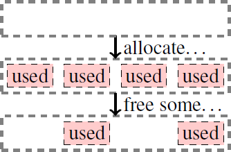
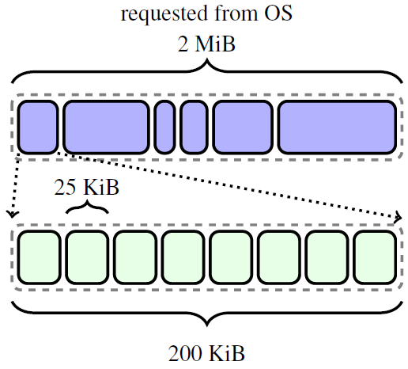
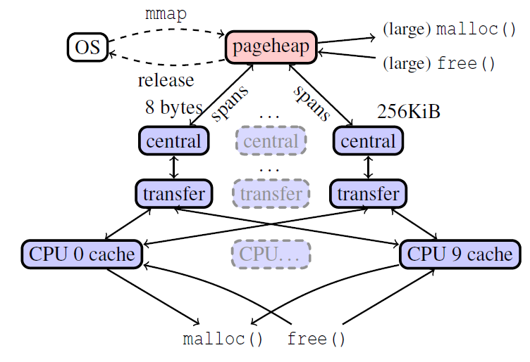
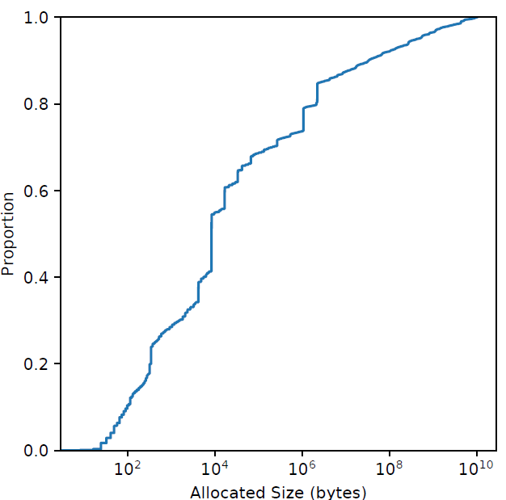
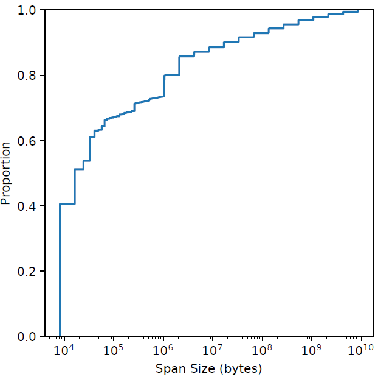

# Beyond malloc efficiency to fleet efficiency: a hugepage-aware memory allocator

**Abstract**

Memory allocation represents significant compute cost at the warehouse scale and its optimization can yield considerable cost savings. One classical approach is to increase the efficiency of an allocator to minimize the cycles spent in the *allocator code*. However, memory allocation decisions also impact overall application performance via data placement, offering opportunities to improve *fleetwide productivity* by completing more units of application work using fewer hardware resources. Here, we focus on hugepage coverage. We present TEMERAIRE, a hugepage-aware enhancement of TCMALLOC to reduce CPU overheads in the application’s code. We discuss the design and implementation of TEMERAIRE including strategies for hugepage-aware memory layouts to maximize hugepage coverage and to minimize fragmentation overheads. We present application studies for 8 applications, improving requests-per-second (RPS) by 7.7% and reducing RAM usage 2.4%. We present the results of a 1% experiment at fleet scale as well as the longitudinal rollout in Google’s warehouse scale computers. This yielded 6% fewer TLB miss stalls, and 26% reduction in memory wasted due to fragmentation. We conclude with a discussion of additional techniques for improving the allocator development process and potential optimization strategies for future memory allocators.

## 1 Introduction

The *datacenter tax* [[23](#_bookmark59), [41](#_bookmark77)] within a warehouse-scale computer (WSC) is the cumulative time spent on common service overheads, such as serialization, RPC communication, compression, copying, and memory allocation. WSC workload diversity [[23](#_bookmark59)] means that we typically cannot optimize single application(s) to strongly improve total system efficiency, as costs are borne across many independent workloads. In contrast, focusing on the components of datacenter tax can realize substantial performance and efficiency improvements in aggregate as the benefits can apply to entire classes of application. Over the past several years, our group has focused on minimizing the cost of memory allocation decisions, to great effect; realizing whole system gains by dramatically reducing the time spent in memory allocation. But it is not only the cost of these components we can optimize. Significant benefit can also be realized by improving the efficiency of application code by changing the allocator. In this paper, we consider how to optimize application performance by improving the hugepage coverage provided by memory allocators.

Cache and Translation Lookaside Buffer (TLB) misses are a dominant performance overhead on modern systems. In WSCs, the memory wall [[44](#_bookmark80)] is significant: 50% of cycles are stalled on memory in one analysis [[23](#_bookmark59)]. Our own workload profiling observed approximately 20% of cycles stalled on TLB misses.

Hugepages are a processor feature that can significantly reduce the number, and thereby the cost, of TLB misses [[26](#_bookmark62)]. The increased size of a hugepage enables the same number of TLB entries to map a substantially larger range of memory. On the systems under study, hugepages also allow the total stall time for a miss+fill to be reduced as their page-table representation requires one fewer level to traverse.

While an allocator cannot modify the amount of memory that user code accesses, or even the pattern of accesses to objects, it can cooperate with the operating system and control the placement of new allocations. By optimizing hugepage coverage, an allocator may reduce TLB misses. Memory placement decisions in languages such as C and C++ must also deal with the consequence that their decisions are final: Objects cannot be moved once allocated [[11](#_bookmark47)]. Allocation placement decisions can only be optimized at the point of allocation. This approach ran counter to our prior work in this space, as we can potentially increase the CPU cost of an allocation, *increasing* the datacenter tax, but make up for it by *reducing* processor stalls elsewhere. This improves application metrics^1^ such as requests-per-second (RPS).

> 1. While reducing stalls can improve IPC, IPC alone is a poor proxy [[3](#_bookmark39)] for how much useful application work we can accomplish with a fixed amount of hardware. A busy-looping spinlock has extremely high IPC, but does little useful work under contention.

Our contributions are as follows:

-   The design of TEMERAIRE, a hugepage-aware enhancement of TCMALLOC to reduce CPU overheads in the rest of the application’s code. We present strategies for hugepage-aware memory layouts to maximize hugepage coverage and to minimize fragmentation overheads.
-   An evaluation of TEMERAIRE in complex real-world applications and scale in WSCs. We measured a sample of 8 applications running within our infrastructure observed requests-per-second (RPS) increased by 7.7% and RAM usage decreased by 2.4%. Applying these techniques to all applications within Google’s WSCs yielded 6% fewer TLB miss stalls, and 26% reduction in memory wasted due to fragmentation.
-   Strategies for optimizing the development process of memory allocator improvements, using a combination of tracing, telemetry, and experimentation at warehousescale.

## 2 The challenges of coordinating Hugepages

> Virtual memory requires translating user space addresses to *physical* addresses via caches known as Translation Lookaside Buffers (TLBs) [[7](#_bookmark43)]. TLBs have a limited number of entries, and for many applications, the entire TLB only covers a small fraction of the total memory footprint using the default page size. Modern processors increase this coverage by supporting *hugepages* in their TLBs. An entire aligned hugepage (2MiB is a typical size on x86) occupies just one TLB entry. *Hugepages* reduce stalls by increasing the effective capacity of the TLB and reducing TLB misses [[5](#_bookmark41), [26](#_bookmark62)].
>
> Traditional allocators manage memory in page-sized chunks. Transparent Huge Pages (THP) [[4](#_bookmark40)] provide an opportunity for the kernel to opportunistically cover consecutive pages using hugepages in the page table. A memory allocator, superficially, need only allocate hugepage-aligned and -sized memory blocks to take advantage of this support.
>
> A memory allocator that *releases* memory back to the OS (necessary at the warehouse scale where we have long running workloads with dynamic duty cycles) has a much harder challenge. The return of non-hugepage aligned memory regions requires that the kernel use smaller pages to represent what remains, defeating the kernel’s ability to provide hugepages and imposing a performance cost for the remaining used pages. Alternatively, an allocator may wait for an entire hugepage to become free before returning it to the OS. This preserves hugepage coverage, but can contribute significant amplification relative to true usage, leaving memory idle. DRAM is a significant cost the deployment of WSCs [[27](#_bookmark63)]. The management of *external fragmentation*, unused space in blocks too small to be used for requested allocations, by the allocator is important in this process. For example consider the allocations in  [Figure 1](#_bookmark3). After this series of allocations there are 2 units of free space. The choice is to either use small pages, which result in lower fragmentation but less efficient use of TLB entries, or hugepages, which are TLB-efficient but have high fragmentation.
>
> > Figure 1: Allocation and deallocation patterns leading to fragmentation
>
> A user-space allocator that is aware of the behavior produced by these policies can cooperate with their outcomes by densely aligning the packing of allocations with hugepage boundaries, favouring the use of allocated hugepages, and (ideally) returning unused memory at the same alignment^2^. A *hugepage-aware allocator* helps with managing memory contiguity at the user level. The goal is to maximally pack allocations onto nearly-full hugepages, and conversely, to minimize the space used on empty (or emptier) hugepages, so that they can be returned to the OS as complete hugepages. This efficiently uses memory and interacts well with the kernel’s transparent hugepage support. Additionally, more consistently allocating and releasing hugepages forms a positive feedback loop: reducing fragmentation at the kernel level and improving the likelihood that future allocations will be backed by hugepages.
>
> >  2. This is important as the memory backing a hugepage must be physically contiguous. By returning complete hugepages we can actually assist the operating system in managing fragmentation.

虚拟内存需要通过称为转换后备缓冲区 (TLB) [[7](#_bookmark43)] 的缓存将用户空间地址转换为**物理**地址。TLB 的容量有限，对于许多应用程序，使用默认页面大小时，整个 TLB 仅能覆盖总内存的一小部分。现代处理器通过在其 TLB 中支持 **hugepages** 来增加这种覆盖范围。一个完整对齐的大页（x86 上通常 2MiB）只占用一条 TLB 条目。**Hugepages** 通过增加 TLB 的有效容量和减少 TLB 未命中来减少停顿 [[5](#_bookmark41), [26](#_bookmark62)]。

传统的分配器以页面大小的块来管理内存。Transparent Huge Pages (THP) [[4](#_bookmark40)] 提供了一个机会，内核可以利用页表中的大页，**机会性地**覆盖连续的页。从表面上看，内存分配器只需要分配与大页对齐，且大小等于大页的内存块，即可利用此支持。

将内存**释放**回操作系统（仓库规模下，我们有长期运行的工作负载和动态工作周期，因此释放内存是必需的）的内存分配器面临着更加艰巨的挑战。返回非大页面的对齐内存区域，要求内核使用较小的页面来表示剩余的内容，这破坏了内核提供大页的能力，并为剩余使用的页面强加了性能成本。或者，分配器可能会等待整个大页面空闲，然后再将其返回给操作系统。这保留了大页面的覆盖率，但相对于实际使用量可能会显着放大，从而使内存闲置。DRAM 是部署 WSC 的一项重要成本 [[27](#_bookmark63)]。在这个过程中，分配器对外部碎片的管理是很重要的，这些未使用的空间块太小，无法服务于分配请求。例如，考虑 [图 1](#_bookmark3) 中的分配。在这一系列分配之后，有 2 个可用空间单元。选择要么使用小页面，这会导致碎片较少但 TLB 条目的使用效率较低，要么使用大页面，TLB 效率高但碎片较多。

| Figure 1: Allocation and deallocation patterns leading to fragmentation |
| :----------------------------------------------------------: |
|               |

**了解这些策略产生行为**的用户空间分配器，通过将内存打包在一起分配，以便与大页面边界紧密对齐，有利于使用已分配的大页面，（理想情况下）能以相同的对齐方式返回未使用的内存来配合它们的结果^2^。**Hugepage** 感知的分配器有助于在用户级别管理内存连续性。目标是最大限度地在几乎满的大页面上分配打包的内存，相反，在空的（或更空的）大页面上最小化使用的空间，以便它们可以作为完整的大页面返回给操作系统。这有效地使用了内存，并与内核的透明大页面支持很好地交互。此外，更一致地分配和释放大页面形成了一个正反馈循环：减少内核级别的碎片，提高了未来分配大页的可能性。

> 2. 这很重要，因为支持大页面的内存必须在物理上是连续的。通过返回完整的大页面，我们实际上可以帮助操作系统管理碎片。

## 3 Overview of TCMALLOC

TCMALLOC is a memory allocator used in large-scale applications, commonly found in WSC settings. It shows robust performance [[21](#_bookmark57)]. Our design builds directly on the structure of TCMALLOC.

[Figure 2](#_bookmark6) shows the organization of memory in TCMALLOC. Objects are segregated by size. First, TCMALLOC partitions memory into *spans*, aligned to page size^3^.

> 3. Confusingly, TCMALLOC’s “page size” parameter is not necessarily the system page size. The default configuration is to use an 8 KiB TCMALLOC “page”, which is two (small) virtual memory pages on x86.

> Figure 2: Organization of memory in TCMALLOC. Systemmapped memory is broken into (multi-)page *spans*, which are sub-divided into objects of an assigned, fixed *sizeclass*, here 25 KiB.


TCMALLOC’s structure is defined by its answer to the same two questions that drive any memory allocator.

1.  How do we pick object sizes and organize metadata to minimize space overhead and fragmentation?
2.  How do we scalably support concurrent allocations?

Sufficiently large allocations are fulfilled with a span containing only the allocated object. Other spans contain multiple smaller objects of the same size (a *sizeclass*). The “small” object size boundary is 256 KiB. Within this “small” threshold, allocation requests are rounded up to one of 100 sizeclasses. TCMALLOC stores objects in a series of caches, illustrated in [Figure 3](#_bookmark7). Spans are allocated from a simple *pageheap*, which keeps track of all unused pages and does best-fit allocation.

> Figure 3: The organization of caches in TCMALLOC; we see memory allocated from the OS to the pageheap, distributed up into spans given to the central caches, to local caches. This paper focuses on a new implementation for the pageheap.

The pageheap is also responsible for returning no-longer needed memory to the OS when possible. Rather than doing this on the free() path, a dedicated release-memory method is invoked periodically, aiming to maintain a configurable, steady rate of release in MB/s. This is a heuristic. TCMALLOC wants to simultaneously use the least memory possible in steady-state, avoiding expensive system allocations that could be elided by using previously provisioned memory. We discuss handling this peak-to-trough allocation pattern in more detail in Section [4.3](#_bookmark16).

Ideally, TCMALLOC would return all memory that user code will not need *soon*. Memory demand varies unpredictably, making it challenging to return memory that will go unused while simultaneously retaining memory to avoid syscalls and page faults.. Better decisions about memory return policies have high value and are discussed in section [7](#_bookmark35).

TCMALLOC will first attempt to serve allocations from a “local” cache, like most modern allocators [[9](#_bookmark45),[12](#_bookmark48),[20](#_bookmark56),[39](#_bookmark75)]. Originally these were the eponymous per-Thread Caches, storing a list of free objects for each sizeclass. To reduce stranded memory and improve re-use for highly threaded applications, TCMALLOC now uses a per-hyperthread local cache. When the local cache has no objects of the appropriate sizeclass to serve a request (or has too many after an attempt to free()), requests route to a single *central cache* for that sizeclass. This has two components–a small fast, mutex-protected *transfer cache* (containing flat arrays of objects from that sizeclass) and a large, mutex-protected *central freelist*, containing every span assigned to that sizeclass; objects can be fetched from, or returned to these spans. When all objects from a span have been returned to a span held in the central freelist, that span is returned to the *pageheap*.

In our WSC, most allocations are small (50% of allocated space is objects ≤ 8192 bytes), as depicted in Figure [4](#_bookmark8). These are then aggregated into spans. The pageheap primarily allocates 1or 2-page spans, as depicted in Figure [5](#_bookmark9). 80% of spans are smaller than a hugepage.

> Figure 4: CDF of allocation sizes from WSC applications, weighted by bytes.
> Figure 5: CDF of TCMALLOC span sizes from WSC applications, weighted by bytes.

The design of “stacked” caches make the system usefully modular, and there are several concomitant advantages:

-   Clean abstractions are easier to understand and test.
-   It’s reasonably direct to replace any one level of the cache with a totally new implementation.
-   When desired, cache implementations can be selected at runtime, with benefits to operational rollout and experimentation.

TCMALLOC’s pageheap has a simple interface for managing memory.

-   `New(N)` allocates a span of *N* pages
-   `Delete(S)` returns a New’d span (S) to the allocator.
-   `Release(N)` gives >= *N* unused pages cached by the page heap back to the OS

**TCMALLOC** 是一种用于大规模应用程序的内存分配器，常见于 WSC 设置中。它显示出强大的性能 [[21](#_bookmark57)]。我们的设计直接建立在 TCMALLOC 的结构之上。

| Figure 2: Organization of memory in TCMALLOC. Systemmapped memory is broken into (multi-)page *spans*, which are sub-divided into objects of an assigned, fixed *sizeclass*, here 25 KiB. |
| :----------------------------------------------------------: |
|               |

[图 2](#_bookmark6) 展示了内存在 TCMALLOC 中的组织结构。对象按大小分开。首先，TCMALLOC 将内存划分为 **spans**，与页面大小对齐^3^。

> 3. 令人困惑的是，TCMALLOC 的**页面大小**参数不一定是系统页面大小。默认配置是使用 8 KiB TCMALLOC**页面**，这是 x86 上的两个（小）虚拟内存页面。


任何内存分配器都应该回答的两个问题定义了 TCMALLOC 的结构：

1. 我们如何选择对象大小和组织元数据以最小化空间开销和碎片？
2. 我们如何可扩展地支持并发分配？

足够大的分配是通过仅包含分配对象的 **span** 来实现的。其他 **span** 包含多个相同大小的较小对象（**sizeclass**）。**小**对象大小边界是 256 KiB。在这个小阈值内，**分配请求**被四舍五入到 100 个大小级别中的一个。TCMALLOC 将对象存储在一系列缓存中，如[图 3](#_bookmark7) 所示。从一个简单的 **pageheap** 分配 **span**，它跟踪所有未使用的页面并进行最佳分配。

|Figure 3: The organization of caches in TCMALLOC; we see memory allocated from the OS to the pageheap, distributed up into spans given to the central caches, to local caches. This paper focuses on a new implementation for the pageheap. |
| :----------------------------------------------------------: |
|               |

Pageheap 还负责在可能的情况下将不再需要的内存返回给操作系统。不是在 `free()` 路径上执行此操作，而是定期调用专用的释放内存方法，旨在维持可配置的、稳定的释放速率（以 MB/s 为单位）。这是一种启发式。TCMALLOC 希望在稳定状态下同时使用尽可能少的内存，避免昂贵的系统分配，而这些分配可能会通过使用先前提供的内存来消除。我们在第 [4.3](#_bookmark16) 节中更详细地讨论了处理这种峰谷分配模式。

理想情况下，TCMALLOC 将返回用户代码**很快**不需要的所有内存。内存需求的变化不可预测，这使得返回未使用的内存同时保留内存以避免系统调用和页面错误变得具有挑战性。关于内存返回策略的更好决策具有很高的价值，在 [7](#_bookmark35) 节中进行了讨论。

TCMALLOC 将首先尝试从**本地**缓存提供分配，就像大多数现代分配器一样 [[9](#_bookmark45),[12](#_bookmark48),[20](#_bookmark56),[39](#_bookmark75) ]。最初这些是同名的**<u>==每线程缓存==</u>**，为不同尺寸的分配存储一个空闲对象列表。为了减少闲置内存并提高高线程应用程序的重用率，TCMALLOC 现在使用**每超线程本地缓存**。当本地缓存没有适合<u>大小</u>的对象来服务请求时（或者在尝试 free() 后有太多对象），请求路由到该<u>大小类</u>的单个**中央缓存**。它有两个组件——一个快速的、受互斥锁保护的**传输缓存**（包含来自该<u>大小类</u>的平面对象数组）和一个大的、受互斥锁保护的**中央空闲列表**，包含分配给该<u>大小类</u>的每个 span；可以从这些 span 中获取或返回对象。当一个 span 中的所有对象都已返回到中央空闲列表中的一个 span 时，该 span 将返回到 **pageheap**。

在我们的 WSC 中，大多数分配都很小（50% 的分配空间是对象≤ 8192 字节），如图 [4](#_bookmark8) 所示。然后将这些聚合到 span 中。pageheap 主要分配 1 或 2 页 span，如图 [5](#_bookmark9) 所示。80% 的 span 小于**大页面**。

| Figure 4: CDF of allocation sizes from WSC applications, weighted by bytes. | Figure 5: CDF of TCMALLOC span sizes from WSC applications, weighted by bytes. |
| ------------------------------------------------------------ | ------------------------------------------------------------ |
|  |  | 

**堆叠**缓存的设计使系统有效地模块化，并且有几个伴随的优点：

- 干净的抽象更容易理解和测试。
- 用全新的实现替换任何一级缓存是相当直接的。
- 如果需要，可以在运行时选择缓存实现，这有利于操作推出和实验。

TCMALLOC 的 pageheap 有一个简单的内存管理接口。

- `New(N)` 分配*N* 页的 span
- `Delete(S`) 释放一个 span (S) 给分配器。
- `Release(N)` 将页面堆缓存的 >= *N* 个未使用页面返回给操作系统。

## 4 TEMERAIRE’s approach

> TEMERAIRE, this paper’s contribution to TCMALLOC, replaces the pageheap with a design that attempts to maximally fill (and empty) hugepages. The source code is on Github (see Section [9](#availability)). We developed heuristics that pack allocations densely onto highly-used hugepages and simultaneously form entirely unused hugepages for return to the OS.
>
> We refer to several definitions. *Slack* is the gap between an allocation’s requested size and the next whole hugepage. Virtual address space allocated from the OS is *unbacked* without reserving physical memory. On use, it is *backed*, mapped by the OS with physical memory. We may release memory to the OS once again making it *unbacked*. We primarily pack within hugepage boundaries, but use *regions* of hugepages for packing allocations *across* hugepage boundaries.
>
> From our **telemetry** of `malloc` usage and TCMALLOC internals, and knowledge of the kernel implementation, we developed several key principles that motivate TEMERAIRE’s choices.

1. **Total memory demand varies unpredictably with time, but not every allocation is released**. We have no control over the calling code, and it may rapidly (and repeatedly) modulate its usage; we must be hardened to this. But many allocations on the pageheap are immortal (and it is difficult to predict which they are [[30](#_bookmark66)]); any particular allocation might disappear instantly or live forever, and we must deal well with both cases.

2. **Completely draining hugepages implies packing memory at hugepage granularity**. Returning hugepages that aren’t nearly-empty to the OS is costly (see section [2](#_bookmark2)). Generating empty/nearly-empty hugepages implies densely packing the *other* hugepages in our binary. Our design must enable densely packing allocations into as few, saturated, bins as possible.

   While we aim to use exclusively hugepage-sized bins, malloc must support allocation sizes larger than a single hugepage. These can be allocated normally, but we place smaller allocations into the *slack* of the allocation to achieve high allocation density. Only when small allocations are dominated by *slack* do we need to place large allocations end on end in *regions*.

3. Draining hugepages gives us new release decision points. When a hugepage becomes completely empty, we can choose whether to retain it for future memory allocations or return it to the OS. Retaining it until released by TCMALLOC’s background thread carries a higher memory cost. Returning it reduces memory usage, but comes at a cost of system calls and page faults if reused. Adaptively making this decision allows us to return memory to the OS faster than the background thread while simultaneously avoiding extra system calls.

4. **Mistakes are costly, but work is not**. Very few allocations directly touch the pageheap, but *all* allocations are backed via the pageheap. We must only pay the cost of allocation once; if we make a bad placement and fragment a hugepage, we pay either that space or the time-cost of breaking up a hugepage for a long time. It is worth slowing down the allocator, if doing so lets it make better decisions.

Our allocator implements its interface by delegating to several subcomponents, mapped in [Figure 6](#_bookmark11). Each component is built with the above principles in mind, and each specializes its approximation for the type of allocation it handles best. As per principle \#4, we emphasize smart placement over speed^4^. 

While the particular implementation of TEMERAIRE is tied to TCMALLOC internals, most modern allocators share similar large backing allocations of page (or higher) granularity, like TCMALLOC’s spans: compare jemalloc’s “extents” [[20](#_bookmark56)], Hoard’s “superblocks” [[9](#_bookmark45)], and mimalloc’s “pages” [[29](#_bookmark65)]. Hoard’s 8KB superblocks are directly allocated with ‘mmap‘, preventing hugepage contiguity. Those superblocks could instead be densely packed onto hugepages. mimalloc places its 64KiB+ “pages” within “segments,” but these are maintained per-thread which hampers dense packing across the segments of the process. Eagerly returning pages to the OS minimizes the RAM cost here, but breaks up hugepages. These allocators could also benefit from a TEMERAIRE-like hugepage aware allocator^5^.

> 4. As each operation holds an often-contended mutex, we do maintain reasonable efficiency: most operations are *O*(1), with care taken to optimize constant factors.
> 5. Indeed, jemalloc is doing so, based on TEMERAIRE.

> Figure 6: TEMERAIRE’s components. Arrows represent the flow of requests to interior components.

---

TEMERAIRE，本文对 TCMALLOC 的贡献，用一种尝试最大限度填充（和清空）大页面的设计取代了页面堆（**PageHeap**）。源代码在 Github 上（参见第 [9](#availability)）。**我们开发了启发式方法**，将内存分配密集地<u>==打包==</u>到使用率较高的大页面上，同时形成完全未使用的大页面以返回给操作系统。

我们参考了几个定义。 **Slack** 是内存分配请求的大小与下一个整个大页面之间的差距。 从操作系统分配的虚拟地址空间是 **==unbacked==** 的，没有分配（或者映射）物理内存。使用时，它是 **backed** 的，由操作系统分配（或映射）物理内存。我们可能会再次向操作系统释放内存，使之 **unbacked**。 我们主要在大页面边界内打包，但使用大页面的**区域**来**跨**大页面边界打包分配。

根据我们对`malloc`用法和 **TCMALLOC** 内部的**监控**，以及对内核实现的了解，我们制定了几个关键原则，这些原则促使我们对 TEMERAIRE 的设计做出了如下选择：

### 4.1 The overall algorithm

We will briefly sketch the overall approach and each component’s role, then describe each component in detail. Our goal is to minimize generated slack, and if we do generate slack, to reuse it for other allocations (as with any page-level fragmentation.)

Behind all components is the `HugeAllocator`, which deals with virtual memory and the OS. It provides other components with *unbacked* memory that they can back and pass on. We also maintain a cache of *backed*, fully-empty hugepages, called the `HugeCache`.

We keep a list of partially filled single hugepages (the `HugeFiller`) that can be densely filled by subsequent small allocations. Where binpacking the allocations along hugepage boundaries would be inefficient, we implement a specialized allocator (the `HugeRegion`).

TEMERAIRE directs allocation decisions to its subcomponents based on request size with the algorithm in Figure [7](#_bookmark10). Each subcomponent is optimized for different allocation sizes. 

```c++
Span New(N) {
    // Slack is too small to matter
    if (N >= 1 GiB) return HugeCache.New(N);
    // Help bin-pack a single hugepage
    if (N <= 1 MiB)  return HugeFiller.New(N);
    
    if (N < 2 MiB) {
        // If we can reuse empty space, do so 
        Span s = HugeFiller.TryAllocate(N); 
        if (s != NULL) return s;
    }
    // If we have a region, use it 
    Span s = HugeRegion.TryAllocate(N);
    if (s != NULL) return s;
    
    // We need a new hugepage. 
    s = HugeCache.New(N); 
    HugeFiller.DonateTail(s);
    
    return s;
}
// Figure 7: Allocation flow for subcomponents. Hugepage size is 2 MiB.
```

Allocations for an exact multiple of hugepage size, or those sufficiently large that slack is immaterial, we forward directly to the `HugeCache`.

Intermediate sized allocations (between 1MiB and 1GiB) are typically also allocated from the `HugeCache`, with a final step of *donation* for slack. For example, a 4.5 MiB allocation from the `HugeCache` produces 1.5 MiB of slack, an unacceptably high overhead ratio. TEMERAIRE donates that slack to the `HugeFiller` by pretending that the last hugepage of the request has a single “leading” allocation on it (Figure [8](#_bookmark15)).

> Figure 8: The slack from a large allocation spanning 3 hugepages is “donated” to the HugeFiller. The larger allocation’s tail is treated as a fictitious allocation.

When such a large span is deallocated, the allocator also marks the fictitious leading allocation as free. If the slack is unused, it is returned to the tail hugepage along with the rest. Otherwise the tail hugepage is left behind in the `HugeFiller` and only the first *N* − 1 hugepages are returned to the `HugeCache`. 

For certain allocation patterns, intermediate-size allocations produce more slack than we can fill with smaller allocations in strict 2MiB bins. For example, many 1.1MiB allocations will produce 0.9MiB of slack per hugepage (see Figure [12](#_bookmark20)). When we detect this pattern, the HugeRegion allocator places allocations across hugepage boundaries to minimize this overhead.

Small requests (<= 1MiB) are always served from the `HugeFiller`. For allocations between 1MiB and a hugepage, we evaluate several options:

1. We *try* the `HugeFiller`: if we have available space there we use it and are happy to fill a mostly-empty page.
2. If the HugeFiller can’t serve these requests, we next consider HugeRegion; if we have regions allocated which can serve the request, we do so. If no region exists (or they’re all too full) we consider allocating one, but only, as discussed below, if we’ve measured high ratios of slack to small allocations.
3. Otherwise, we allocate a full hugepage from the HugeCache. This generates *slack*, but we anticipate that it will be filled by future allocations.

We make a design choice in TEMERAIRE to care about external fragmentation up to the level of a hugepage, but essentially not at all past it (but see Section [4.5](#_bookmark19) for an exception.) For example, a system with a single 1 GiB free range and one with 512 discontiguous free hugepages is handled equally well by TEMERAIRE. In either case, the allocator will (typically) return all of the unused space to the OS; a fresh allocation of 1 GiB will require faulting in memory in either case. In the fragmented scenario, we will need to do so on fresh virtual memory. Waste of virtual address range unoccupied by live allocations and not consuming physical memory is not a concern, since with 64-bit address spaces, virtual memory is practically free.

### 4.2 HugeAllocator

`HugeAllocator` tracks mapped virtual memory. All OS mappings are made here. It stores hugepage-aligned *unbacked* ranges (i.e. those with no associated physical memory.) Virtual memory is nearly free, so we aim for simplicity and reasonable speed. Our implementation tracks unused ranges with a treap [[40](#_bookmark76)]. We augment subtrees with their largest contained range, which lets us quickly select an approximate best-fit.

### 4.3 HugeCache

The `HugeCache` tracks *backed* ranges of memory at full hugepage granularity. A consequence of the `HugeFiller` filling and draining whole hugepages is that we need to decide when to return empty hugepages to the OS. We will regret returning memory we will need again, and equally regret *not* returning memory that will languish in the cache. Returning memory eagerly means we make syscalls to return the memory and take page faults to reuse it. Releasing memory only at the rate requested by TCMALLOC’s periodic release thread means memory is held unused.

Consider the artificial program in Figure [9](#_bookmark14) with no additional heap allocations. On each iteration of the loop, ‘New‘ requires a new hugepage and places it with the HugeFiller. ‘Delete‘ removes the allocation and the hugepage is now completely free. Returning eagerly would require a syscall every iteration for this simple, but pathological program.

```c++
while (true) { 
    Delete(New(512KB))
}
// Figure 9: Program which repeatedly drains a single hugepage.
```

We track periodicity in the demand over a 2-second sliding window and calculate the minimum and maximum seen (*demand~min~*, *demand~max~*). Whenever memory is returned to the `HugeCache`, we return hugepages to the OS if the cache would be larger than *demand~max~* − *demand~min~*. We also tried other algorithms, but this one is simple and suffices to capture the empirical dynamics we’ve seen. The cache is allowed to grow as long as our windowed demand has seen a need for the new size. In oscillating usage, this will (incorrectly) free memory once, then (correctly) keep it from then on. Figure [10](#_bookmark17) shows our cache size for a Tensorflow workload which rapidly oscillates usage by a large fraction; we track the actually needed memory tightly.

> Figure 10: Tensorflow’s demand on the `HugeCache` over time, plotted with the cache limit (+demand). Notice that we tightly track their saw-toothed demand the first time it drops. After that, we recognize the pattern and keep the peak demand in cache.

### 4.4 HugeFiller

The `HugeFiller` satisfies smaller allocations that each fit within a single hugepage. This satisfies the majority of allocations (78% of the pageheap is backed by the `HugeFiller` on average across the fleet) and is the most important–and most optimized–component of our system. *Within* a given hugepage, we use a simple (and fast) best-fit algorithm to place an allocation; the challenging part is deciding *which* hugepage to place an allocation on.

This component solves our binpacking problem: our goal is to segment hugepages into some that are kept maximally full, and others that are empty or nearly so. The emptiest hugepages can be reclaimed (possibly breaking up a hugepage as needed) while minimizing the impact on hugepage coverage as the densely-filled pages cover most used memory with hugepages. But it is challenging to empty out hugepages, since we cannot rely on any particular allocation disappearing.

A secondary goal is to minimize fragmentation *within* each hugepage, to make new requests more likely to be served. If the system needs a new *K*-page span and no free ranges of ≥ *K* pages are available, we require a hugepage from the `HugeCache`. This creates slack of (2*MiB* − *K* ∗ *pagesize*), wasting space.

These give us two goals to prioritize. Since we want to maximize the probability of hugepages becoming totally free, nearly-empty hugepages are precious. Since we need to minimize fragmentation, hugepages with long free ranges are also precious. Both priorities are satisfied by preserving hugepages with the longest free range, as longer free ranges must have fewer in-use blocks. We organize our hugepages into ranked lists correspondingly, leveraging per-hugepage statistics.

Inside each hugepage, we track a bitmap of used pages; to fill a request from some hugepage we do a best-fit search from that bitmap. We also track several statistics:

-   the *longest free range* (*L*), the number of contiguous pages not already allocated,
-   the total *number of allocations* (*A*),
-   the total *number of used pages* (*U* ).

These three statistics determine a *priority order* of hugepages to place allocations. We choose the hugepage with the lowest sufficient *L* and the highest *A*. For an allocation of *K* pages, we first consider only hugepages whose longest free range is sufficient (*L* ≥ *K*). This determines whether a hugepage is a *possible* allocation target. Among hugepages with the minimum *L* ≥ *K*, we prioritize by fullness. Substantial experimentation led us to choose *A*, rather than *U* .

This choice is motivated by a *radioactive decay-type allocation model* [[16](#_bookmark52)] where each allocation, of any size, is equally likely to become free (with some probability *p*). In this model a hugepage with 5 allocations has a probability of becoming free of *p*^5^ << *p*; so we should very strongly avoid allocating from hugepages with very few allocations. In particular, this model predicts *A* is a much better model of "emptiness" than *U* : one allocation of size *M* is more likely to be deallocated than *M* allocations of size 1.

The decay model isn’t perfectly true in real applications, but it is an effective approximation, and experimentation backs up its primary claim: prioritizing by *A* empties substantially more pages than prioritizing by *U* . (In practice, using *U* produces acceptable results, but meaningfully worse ones.)

In some more detail, *A* is used to compute a *chunk index C*, given by *min*(0,*C*max − *log*2(*A*)). We compute our chunk index so that our fullest pages have *C* = 0 and the emptiest have *C* = *C*max −1. In practice, we have found that *C*max = 8 chunks are sufficient to avoid allocation from almost-empty pages. Distinguishing hugepages with large counts is less important: For example, we predict a hugepage with 200 allocations and one with 150 as both very unlikely to completely drain. This scheme prioritizes distinguishing gradations among pages that might become empty.

We store hugepages in an array of lists, where each hugepage is stored on the list at index *I* = *C*max ∗ *L* + *C*. Since a *K*-page allocation is satisfiable from any hugepage with *L* >= *K*, the hugepages which can satisfy an allocation are exactly those in lists with *I* >= *C*max ∗ *K*. We pick an (arbitrary) hugepage from the least such nonempty list, accelerating that to constant time with a bitmap of nonempty lists.

Our strategy differs from best fit. Consider a hugepage *X* with a 3 page gap and a 10 page gap and another hugepage *Y* with a 5 page gap. Best fit would prefer *X* . Our strategy prefers *Y* . This strategy works since we are looking to allocate on the most fragmented page, since fragmented pages are less likely to become entirely free. If we need, say, 3 pages, then pages which contain at most a gap of 3 available pages are more likely to be fragmented and therefore good candidates for allocation. Under the radioactive-decay model, allocations near large gaps are as likely as any other to become free, which can cause those gaps to substantially grow; they can then be used for large allocations. We treat that 10-page gap as precious and avoid allocating near it unless nothing else works, which allows it to grow.

> Figure 11: `HugeFiller` with various bin-packing strategies. Best fit is outperformed by prioritizing either fullness or longest free range (LFR); LFR dominates fullness.

Figure [11](#_bookmark18) demonstrates this in a simple case. We plot the demand on the HugeFiller from a synthetic trace (see Section [6.1](#_bookmark32)). We also show the total used memory from three approaches: HugeFiller’s actual search, a search that prioritizes fullness over fragmentation (*A* over *L*), and a global best fit. Note that the trace includes a substantial one-time drop, to go with random fluctuations in usage. Our LFR-priority algorithm beats both other approaches. In particular, we see that after the usage drop, best-fit barely recovers any total memory, and finishes with close to 100% overhead, whereas both other algorithms closely match the actual demand.

Surprisingly, this simple strategy substantially outperforms a *global* best fit algorithm–placing a request in the single gap in any hugepage that is closest to its size. Best-fit would be prohibitively expensive—we cannot search 10-100K hugepages for every request, but it’s quite counter-intuitive that it also produces higher fragmentation. Best-fit being far from optimal for general fragmentation problems is not a new result [[36](#_bookmark72)], but it’s interesting to see how poor it can be here.

A last important detail is that donated hugepages are less desirable allocation targets than any non-donated hugepage. Consider the pathological program looping:

``` c++
while (true) {
    // Reserve 51 hugepages + donate tail of last 
    L = New(100 MiB + 1 page);
    // Make a small allocation 
    S = New(1);
    // Delete large allocation 
    Delete(L);
}
```

Each iteration only allocates 1 (net) page, but if we always use the slack from L to satisfy S, we will end up placing each S on its own hugepage. In practice, simply refusing to use donated pages if others are available prevents this, while effectively using slack where it’s needed.

### 4.5 HugeRegion

HugeCache (and HugeAllocator behind it) suffices for large allocations, where rounding to a full hugepage is a small cost. HugeFiller works well for small allocations that can be packed into single hugepages. HugeRegion helps those between.

Consider a request for 1.1 MiB of memory. We serve it from the HugeFiller, leaving 0.9 MiB of unused memory from the 2MiB hugepage: the *slack* space. The HugeFiller assumes that slack will be filled by future small (<1MiB) allocations, and typically it is: our observed byte ratio of fleetwide small allocations to slack is 15:1. In the limit we can imagine a binary that requests literally nothing but 1.1 MiB spans in Figure [12](#_bookmark20).

> Figure 12: Slack (“s”) can accumulate when many allocations (“a”) are placed on single hugepages. No single slack region is large enough to accommodate a subsequent allocation of size “a.”


The HugeRegion deals with this problem, which is to some extent *caused* by our own choices. We focus heavily on packing allocations into hugepage-sized bins with the HugeFiller, and our desire to do that with donated slack is catastrophic with some allocation patterns. Most normal binaries are of course fine without it, but a general purpose memory allocator needs to handle diverse workloads, even those dominated by slack-heavy allocations. Clearly, we must be able to allocate these lying across hugepage boundaries. HugeRegion neatly eliminates this pathological case.

A HugeRegion is a large fixed-size allocation (currently 1 GiB) tracked at small-page granularity with the same kind of bitmaps used by individual hugepages in the HugeFiller. As with those single hugepage ranges, we best-fit any request across all pages in the region. We keep a list of these regions, ordered by longest free range, for the same reason as HugeFiller. Allocating from these larger bins immediately allows large savings in wasted space: rather than losing 0.9 MiB/hugepage in our pessimal load, we lose 0.9 MiB per HugeRegion, only about 0.1%. (This motivates the large size of each region.)

Most programs don’t need regions at all. We do not allocate any region until we’ve accumulated large quantities of slack that are larger than the total of the program’s small allocations. Fleetwide, only 8.8% of programs trigger usage of regions, but the feature is still important: 53.2% of allocations in those binaries are served from regions. One such workload is a key-value store that loads long-lived data in large chunks into memory and makes a small number of short-lived small allocations for serving requests. Without regions, the requestrelated allocations are unable to fill the slack generated by the larger allocations. This technique prevents this slack-heavy uncommon allocation pattern from bloating memory use.

### 4.6 Memory Release

As discussed above, Release(N) is invoked periodically by support threads at a steady trickle.

To implement our interface’s Release(N) methods, TEMERAIRE typically just frees hugepage ranges from HugeCache and possibly shrinks its limit as described above. Releasing more than the hinted *N* pages is not a problem; the support threads use the actual released amount as feedback, and adjust future calls to target the correct overall rate.

If the HugeCache cannot release *N* pages of memory, the HugeFiller will subrelease just the free (small) pages on the emptiest hugepage.

Returning small pages from partially filled hugepages (“subreleasing” them) is the last resort for reducing memory footprints as the process is largely irreversible^6^. By returning some but not all small pages on a hugepage, we cause the OS to replace the single page table entry spanning the hugepage with small entries for the remaining pages. This one-way operation, through increased TLB misses, slows down accesses to the remaining memory. The Linux kernel will use small pagetable entries for the still-used pages, even if we re-use the released address space later. We make these return decisions in the HugeFiller, where we manage partially filled hugepages.

> ^6^While the THP machinery may reassemble hugepages, it is nondeterministic and dependent on system utilization. There is a negative feedback loop here where high-utilization scenarios actually compete with and impede THP progress that might benefit them the most.

The `HugeFiller` treats the subreleased hugepages separately: we do not allocate from them unless no other hugepage is usable. Allocations placed on this memory will not benefit from hugepages, so this helps performance and allows these partially released hugepages to become completely empty.

## 5 Evaluation of TEMERAIRE

We evaluated TEMERAIRE on Google’s WSC workloads. The evaluation was concerned with several metrics, including both CPU and memory savings. We present evaluations of TEMERAIRE on several key services, measuring 10% of cycles and 15% of RAM usage in our WSC. In section [6.4](#_bookmark34) we discuss workload diversity; in this evaluation we examine data across all workloads using our experimental framework and fleetwide-profiler telemetry. We’ve argued for prioritizing workload efficiency over the attributable cost of malloc; we therefore examine IPC metrics (as a proxy for user throughput) and where possible, we obtained application-level performance metrics to gauge workload productivity (e.g., requestsper-second per core) on our servers. We present longitudinal data from the rollout of TEMERAIRE to all TCMALLOC users in our fleet.

Overall, TEMERAIRE proved a significant win for CPU and memory.

### 5.1 Application Case Studies

We worked with performance-sensitive applications to enable TEMERAIRE in their production systems, and measure the effect. We summarize the results in Table [1](#_bookmark24). Where possible, we measured each application’s user-level performance metrics (throughput-per-CPU and latency). These applications use roughly 10% of cycles and 15% of RAM in our WSC.

| Application                                      | Throughput | Mean Latency | RSS (GiB) | RAM change | IPC         |             | dTLB Load  | Walk (%)   | malloc (%   | of cycles)  | Page Fault (% | of cycles)    |
|--------------------------------------------------|------------|--------------|-----------|------------|-------------|-------------|------------|------------|-------------|-------------|---------------|---------------|
|                                                  |            |              |           |            | Before      | After       | Before     | After      | Before      | After       | Before        | After         |
| Tensorflow [[1](#_bookmark37)]                   | +26%       |              |           |            |             |             |            |            |             |             |               |               |
| search1 [[6,](#_bookmark42) [18](#_bookmark54)]† |            |              | 8.4       | -8.7%      | 1.33 ± 0.04 | 1.43 ± 0.02 | 9.5 ± 0.6  | 9.0 ± 0.6  | 5.9 ± 0.09  | 5.9 ± 0.12  | 0.005 ± 0.003 | 0.131 ± 0.071 |
| search2†                                         |            |              | 3.7       | -20%       | 1.28 ± 0.01 | 1.29 ± 0.01 | 10.3 ± 0.2 | 10.2 ± 0.1 | 4.37 ± 0.05 | 4.38 ± 0.02 | 0.003 ± 0.003 | 0.032 ± 0.002 |
| search3 †                                        |            |              | 234       | -7%        | 1.64 ± 0.02 | 1.67 ± 0.02 | 8.9 ± 0.1  | 8.9 ± 0.3  | 3.2 ± 0.02  | 3.3 ± 0.04  | 0.001 ± 0.000 | 0.005 ± 0.001 |
| ads1                                             | +2.5%      | -14%         | 4.8       | -6.9%      | 0.77 ± 0.02 | 0.84 ± 0.01 | 38.1 ± 1.3 | 15.9 ± 0.3 | 2.3 ± 0.04  | 2.7 ± 0.05  | 0.012 ± 0.003 | 0.011 ± 0.002 |
| ads2                                             | +3.4%      | -1.7%        | 5.6       | -6.5%      | 1.12 ± 0.01 | 1.22 ± 0.01 | 27.4 ± 0.4 | 10.3 ± 0.2 | 2.7 ± 0.03  | 3.5 ± 0.08  | 0.022 ± 0.001 | 0.047 ± 0.001 |
| ads3                                             | +0.5%      | -0.2%        | 50.6      | -0.8%      | 1.36 ± 0.01 | 1.43 ± 0.01 | 27.1 ± 0.5 | 11.6 ± 0.2 | 2.9 ± 0.04  | 3.2 ± 0.03  | 0.067 ± 0.002 | 0.03 ± 0.003  |
| ads4                                             | +6.6%      | -1.1%        | 2.5       | -1.7%      | 0.87 ± 0.01 | 0.93 ± 0.01 | 28.5 ± 0.9 | 11.1 ± 0.3 | 4.2 ± 0.05  | 4.9 ± 0.04  | 0.022 ± 0.001 | 0.008 ± 0.001 |
| ads5                                             | +1.8%      | -0.7%        | 10.0      | -1.1%      | 1.16 ± 0.02 | 1.16 ± 0.02 | 21.9 ± 1.2 | 16.7 ± 2.4 | 3.6 ± 0.08  | 3.8 ± 0.15  | 0.018 ± 0.002 | 0.033 ± 0.007 |
| ads6                                             | +15%       | -10%         | 53.5      | -2.3%      | 1.40 ± 0.02 | 1.59 ± 0.03 | 33.6 ± 2.4 | 17.8 ± 0.4 | 13.5 ± 0.48 | 9.9 ± 0.07  | 0.037 ± 0.012 | 0.048 ± 0.067 |
| Spanner [[17](#_bookmark53)]                     | +6.3%      |              | 7.0       |            | 1.55 ± 0.30 | 1.70 ± 0.14 | 31.0 ± 4.3 | 15.7 ± 1.8 | 3.1 ± 0.88  | 3.0 ± 0.24  | 0.025 ± 0.08  | 0.024 ± 0.01  |
| loadbalancer†                                    |            |              | 1.4       | -40%       | 1.38 ± 0.12 | 1.39 ± 0.28 | 19.6 ± 1.2 | 9.5 ± 4.5  | 11.5 ± 0.60 | 10.7 ± 0.46 | 0.094 ± 0.06  | 0.057 ± 0.062 |
| Average (all WSC apps)                           | +5.2%      |              |           | -7.9%      | 1.26        | 1.33        | 23.3       | 12.4       | 5.2         | 5.0         | 0.058         | 0.112         |
| Redis†                                           | +0.75%     |              |           |            |             |             |            |            |             |             |               |               |
| Redis                                            | +0.44%     |              |           |            |             |             |            |            |             |             |               |               |

Table 1: Application experiments from enabling TEMERAIRE. Throughput is normalized for CPU. †: Applications’ periodic memory release turned off. dTLB load walk (%) is the fraction of cycles spent page walking, not accessing the L2 TLB. malloc (% of cycles) is the *relative* amount of time in allocation and deallocation functions. 90%th confidence intervals reported.

Four of these applications (search1; search2; search3; and loadbalancer) had previously turned off the periodic memory release feature of TCMALLOC. This allowed them to have good hugepage coverage, even with the legacy pageheap’s hugepage-oblivious implementation, at the expense of memory. We did not change that setting with TEMERAIRE. These applications maintained their high levels of CPU performance while reducing their total memory footprint.

With the exception of Redis, all of these applications are multithreaded. With the exception of search3, these workloads run on a single NUMA domain with local data.

-   Tensorflow [[1](#_bookmark37)] is a commonly used machine learning application. It had previously used a high periodic release rate to minimize memory pressure, albeit at the expense of hugepages and page faults.
-   search1, search2, ads1, ads2, ads4, ads5 receive RPCs and make subsequent RPCs of their own other services.
-   search3, ads3, ads6 are leaf RPC servers, performing read-mostly retrieval tasks.
-   Spanner [[17](#_bookmark53)] is a node in a distributed database. It also includes an in-memory cache of data read from disk which adapts to the memory provisioned for the process and unused elsewhere by the program.
-   loadbalancer receives updates over RPC and periodically publishes summary statistics.
-   Redis is a popular, open-source key-value store. We evaluated the performance of Redis 6.0.9 [[42](#_bookmark78)] with TEMERAIRE, using TCMALLOC’s legacy page heap as a baseline. These experiments were run on servers with Intel Skylake Xeon processors. Redis and TCMALLOC were compiled with LLVM built from [Git commit](https://github.com/llvm/llvm-project/commit/cd442157cf) [‘cd442157cf‘](https://github.com/llvm/llvm-project/commit/cd442157cf) using ‘-O3‘. In each configuration, we ran 2000 trials of ‘redis-benchmark‘, with each trial making 1000000 requests to push 5 elements and read those 5 elements.

For the 8 applications with periodic release, we observed a mean CPU improvement of 7.7% and a mean RAM reduction of 2.4%. Two of these workloads did not see memory reductions. TEMERAIRE’s HugeCache design handles Tensorflow’s allocation pattern well, but cannot affect its bursty demand. Spanner maximizes its caches up to a certain memory limit, so reducing TCMALLOC’s overhead meant more application data could be cached within the same footprint.

### 5.2 Fleet experiment

We randomly selected 1% of the machines distributed throughout our WSCs as an experiment group and a separate 1% as a control group (see section [6.4](#_bookmark34)). We enabled TEMERAIRE on all applications running on the experiment machines. The applications running on control machines continued to use the stock pageheap in TCMALLOC.

Our fleetwide profiler lets us correlate performance metrics against the groupings above. We collected data on memory usage, hugepage coverage, overall IPC, and TLB misses. At the time of the experiment, application-level performance metrics (throughput-per-CPU, latency) were not collected. In our analysis, we distinguish between applications that periodically release memory to the OS and those that turn off this feature to preserve hugepages with TCMALLOC’s prior nonhugepage-aware pageheap. Figure [13](#_bookmark25) shows that TEMERAIRE improved hugepage coverage, increasing the percentage of heap memory backed by hugepages from 11.8% to 23% for applications periodically releasing memory and from 44.3% to 67.3% for applications not periodically releasing memory.

> Figure 13: Percentage of heap memory backed by hugepages during fleet experiment and 90%th confidence interval. (Error bars in "release on" condition are too small to cleanly render.)

We observed a strong improvement even in the case that periodic release was disabled. Since these binaries do not break up hugepages in either configuration, the benefit is derived from increased system-wide availability of hugepages (due to reduced fragmentation in other applications). TEMERAIRE improves this situation in two ways: since we aggressively release empty hugepages (where the traditional pageheap does not), we consume fewer hugepages that we do not need, allowing other applications to more successfully request them, and other co-located applications are no longer breaking up hugepages at the same rate. Even if we map large aligned regions of memory and do not interfere with transparent hugepages, the kernel cannot always back these with hugepages [[26](#_bookmark62), [33](#_bookmark69)]. Fragmentation in physical memory can limit the number of available hugepages on the system.

We next examine the effect this hugepage coverage had on TLB misses. Again, we break down between apps that enable and disable periodic memory release. We measure the percentage of total cycles spent in a dTLB load stall^7^.

> 7. More precisely cycles spent page walking, not accessing the L2 TLB.

We see reductions of 4.5-5% of page walk miss cycles (Table [2](#_bookmark26)). We see in the experiment data that apps not releasing memory (which have better hugepage coverage) have higher dTLB stall costs, which is slightly surprising. Our discussions with teams managing these applications is that they turn off memory release because they *need* to guarantee performance: on average, they have more challenging memory access patterns and consequently greater concerns about microarchitectural variance. By disabling this release under the prior implementation, they observed better application performance and fewer TLB stalls. With TEMERAIRE, we see our improved hugepage coverage leads to materially lower dTLB costs for *both* classes of applications.

> Table 2: dTLB load miss page walk cycles as percentage of application usage and dTLB misses per thousand instructions (MPKI) without TEMERAIRE (Control) TEMERAIRE enabled 15 (Exp.)

For our last CPU consideration, we measured the overall impact on IPC^8^. Fleetwide overall IPC in the control group was 0.796647919 ± 4e−9; in the experiment group, 0.806301729 ± 5e−9 instructions-per-cycle. This 1.2% improvement is small in relative terms but is a large absolute savings (especially when considered in the context of the higher individual application benefits discussed earlier).

> 8. Our source of IPC data is not segmented by periodic background memory release status.

For memory usage, we looked at *pageheap overhead*: the ratio of backed memory in the pageheap to the total heap memory in use by the application. The experiment group decreased this from 15.0% to 11.2%, again, a significant improvement. The production experiments comprise thousands of applications running continuously on many thousands of machines, conferring high confidence in a fleetwide benefit.

### 5.3 Full rollout trajectories

With data gained from individual applications and the 1% experiment, we changed the default^9^ behavior to use TEMERAIRE. This rolled out to 100% of our workloads gradually [[10](#_bookmark46), [38](#_bookmark74)].

> 9. This doesn’t imply, quite, that every binary uses it. We allow opt outs for various operational needs.

Over this deployment, we observed a reduction in cycles stalled on TLB misses (L2 TLB and page walks) from 21.6% to 20.3% (6% reduction) and a reduction in pageheap overhead from 14.3% to 10.6% (26% reduction). [Figure 14](#_bookmark30) shows the effect on TLB misses over time: at each point we show the total percentage of cycles attributable to TLB stalls (load and store), broken down by pageheap implementation. As TEMERAIRE rolled out fleetwide, it caused a noticeable downward trend.

> Figure 14: Stacked line graph showing effect of TEMERAIRE rollout on TLB miss cycles. We see an overall downward trend from 21.6% to 20.3% as TEMERAIRE became a larger fraction of observed usage in our WSC.

[Figure 15](#_bookmark31) shows a similar plot of pageheap overhead. We see another significant improvement. Hugepage optimization has a natural tradeoff between space and time here; saving the maximum memory possible requires breaking up hugepages, which will cost CPU cycles. But TEMERAIRE outperforms the previous design in *both* space and time. We highlight several conclusions from our data:

> Figure 15: Stacked line graph showing effect of TEMERAIRE rollout on pageheap overhead. Total memory overhead goes from 14.3% to 10.6%, as TEMERAIRE became a larger fraction of observed usage in our WSC by growing from a handful of applications (section [5.1](#_bookmark23)) to nearly all applications.

*Application productivity outpaced IPC*. As noted above and by Alameldeen et al. [[3](#_bookmark39)], simple hardware metrics don’t always accurately reflect application-level benefits. By all indication, TEMERAIRE improved application *metrics* (RPS, latencies, etc.) by *more* than IPC.

*Gains were not driven by reduction in the cost of malloc.* Gains came from accelerating user code, which was sometimes drastic–in both directions. One application (ads2) saw an increase of malloc cycles from 2.7% to 3.5%, an apparent regression, but they reaped *improvements* of 3.42% RPS, 1.7% latency, and 6.5% peak memory usage.

*There is still considerable headroom, and small percentages matter*. Even though TEMERAIRE has been successful, hugepage coverage is still only 67% when using TEMERAIRE without subrelease due to physical memory contiguity limitations. Increasing to 100% would significantly improve application performance.

## 6 Strategies used in building TEMERAIRE

It is difficult to predict the best approach for a complex system a priori. Iteratively designing and improving a system is a commonly used technique. Military pilots coined the term “OODA (Observe, Orient, Decide, Act) loop” [[13](#_bookmark49)] to measure a particular sense of reaction time: seeing incoming data, analyzing it, making choices, and acting on those choices (producing new data and continuing the loop). Shorter OODA loops are a tremendous tactical advantage to pilots and accelerate our productivity as well. Optimizing *our* own OODA loop–how quickly we could develop insight into a design choice, evaluate its effectiveness, and iterate towards better choices–was a crucial step in building TEMERAIRE.

While our final evaluation was driven by execution on our production servers, this was both too disruptive and too risky to test intermediate ideas; however, malloc microbenchmarks are also not particularly interesting at the page level. To address these challenges, we generated traces to drive the development of TCMALLOC in two ways.

### 6.1 “Empirical” distribution sampling 

Our production fleet implements a fleet wide profiler [[35](#_bookmark71)]. Among the data collected by this profiler are fleet-wide samples of malloc tagged with request size and other useful properties. We collect a sample of currently-live data in our heap and calls to malloc. From these samples we can infer the empirical distribution of size both for live objects and malloc calls. Our *empirical driver* generates calls to malloc and free as a Poisson process^10^ that replicates these distributions, while also targeting an arbitrary (average) heap size. That target size can be changed over simulated time, reproducing factors such as diurnal cycles, transient usage, or high startup costs. We have made this driver and its inputs available on Github (see Section [9](#availability)).

> 10. Little’s law tells us that the average number of live objects *L* is equal to the product of the arrival rate λ and average lifetime *W* . To replicate a given distribution of live/allocation object sizes where *pa* of live objects have size *a*, we set $W_{a}=\frac{c \cdot p_{a}}{\lambda_{a}}$. (*c* is a scaling parameter that determines the total heap size.)

Despite the name “empirical driver,” this remains a *highly* unrealistic workload: every allocation (of a given size) is equally likely to be freed at any timestep, and there is no correlation between the sizes of consecutive allocation. Neither does it reproduce per-thread or per-CPU dynamics. Nevertheless, the empirical driver is a fast, efficient way to place malloc under an extremely challenging load that successfully replicates many macro characteristics of real work.

### 6.2 Heap tracing

Tracing every call to malloc without the instrumentation overhead perturbing the workload itself is extremely difficult, even infeasible over long timescales. Typical applications can make millions of calls to malloc per second. Even if tracing was accomplished non-disruptively, replaying these traces back accurately into a memory allocator in real time *or faster* is similarly intractable: it’s difficult to force the right combinations of threads to allocate, access, and free the right buffers on the right CPU at the right (relative) time.

Fortunately, tracing the *pageheap* is considerably easier. It is a single-threaded allocator, only invoked by a small fraction of requests. Playback is also simple–our abstractions allow directly instantiating and manipulating our pageheap representation, rather than going through malloc() itself. Traces taken from both real binaries and, surprisingly, the empirical driver itself, played a major role in developing TEMERAIRE.

TEMERAIRE’s components serve a request for *K* pages with memory at address [*p*, *p* + *K*), but never read or write that memory range. We built this for unit testing–allowing the test of corner cases such as 64 GiB of allocations without actually needing 64 GiB of memory–but this is also crucial to accelerating simulations. What might take hours with the empirical driver can be played back in minutes.

### 6.3 Telemetry

Beyond producing numbers motivating and evaluating our work, our fleetwide profiler is itself a powerful tool for *designing* allocators. It reveals patterns of allocation we can use to derive heuristics, it allows validation of hypotheses about typical (or even possible) behavior, it helps identify which patterns we can safely ignore as unimportant and which we must optimize. Besides being used in obvious ways–such as tuning cache sizes to fit typical use or determining thresholds for “small” allocations based on the CDF of allocations–querying the profiler was our first step *whenever* we were unsure of useful facts. We gained confidence that our approach to filling slack (see section [4.5](#_bookmark19)) worked on diverse workloads by querying the profiler for ratios of page allocation sizes. Providing large scale telemetry that can be consumed by data analysis tools makes it easy to test and eliminate hypotheses. Such "tiny experiments" [[8](#_bookmark44)] lead to better designs.

This reflects a cultivated mindset in identifying new telemetry. Our first question for any new project is “What metrics should we add to our fleetwide profiler?” We continually expose more of the allocator’s internal state and derived statistics, such as cache hit rates. While we can form some hypotheses using traditional loadtests, this technique helps validate their generality.

### 6.4 Experiment framework

We have also developed an experiment framework allowing us to A/B test implementations or tuning choices across our fleet at scale. We can enable or disable experiment groups across a small percentage of *all* our machines, without requiring product teams running services on those machines to take any action. A/B testing is not a new approach, but enabling it at the scale of our WSC is a powerful development tool.

As discussed above, our A/B experiment for TEMERAIRE demonstrated improved hugepage coverage, even for jobs that never released memory. This is an example of an effect– against neighboring, collocated services–that might go unnoticed during the test of an individual service.

We’ve observed two noteworthy advantages to A/B experimentation:

-   Reduced cost and uncertainty associated with major behavioral changes. Small 1% experiments can uncover latent problems well before we roll new defaults, at far less cost [[10](#_bookmark46), Appendix B].
-   Reduced likelihood of overfitting to easily tested workloads. Tuning for production-realistic loadtests, while great for the applications they represent, can result in non-ideal results for other workloads. Instead, we can be confident our optimization is good on average for everyone, and detect (and fix) applications that see problems.

Experiments allow us to evaluate changes on diverse workloads. Kanev, et. al. [[24](#_bookmark60)] proposed prefetching the next object *i* + 1 when malloc is returning object *i* from its freelists. Effective prefetches need to be *timely* [[28](#_bookmark64)]. Too early and data can be evicted from the cache before use. Too late and the program waits. In this case, prefetching object *i* when returning it, turns out to be too late: User code will write to the object within a few cycles, far sooner than the prefetch’s access to main memory can complete. Prefetching object *i* + 1 gives time for the object to be loaded into the cache by the time the next allocation occurs. Independent of the experiments to develop TEMERAIRE, we added this *next* object prefetch for TCMALLOC usage in our WSC despite the contrarian evidence that it appears to slowdown microbenchmarks and increases apparent malloc cost. We were able to still identify this benefit thanks to the introspective techniques described here, allowing us to prove that application performance was improved at scale in our WSC; both unlocking important performance gains and proving the generality of these macro approaches.

## 7 Future Work

**Peak vs. average**. A job quickly oscillating between peak and trough demand cannot be usefully binpacked against its average. Even if the allocator could instantaneously return unused memory, job schedulers could not make use of it before it was required again. Thus transient overhead is not a practical opportunity [[43](#_bookmark79)]. This guides us to measure how overhead changes over time, which can motivate slower release rates [[31](#_bookmark67)] or application of compaction techniques (such as Mesh [[34](#_bookmark70)]).

**Intermediate caches / exposed free spans**. TCMALLOC’s design of stacked caches makes for direct optimization and is highly scalable, but hides useful cross-layer information. A good example comes from Bigtable at Google [[14](#_bookmark50)]. Cached ranges are 8 KiB malloc’d segments (i.e. one TCMALLOC page) to avoid fragmentation. Meaning, most freed buffers won’t make it past the local cache or central freelist; only when a full span’s worth is simultaneously freed (and somehow pushed out of TCMALLOC’s local cache) do these freed buffers get returned to the pageheap. If every alloc/free of these chunks were visible to the pageheap, we’d be able to reduce fragmentation–we’d have a much more precise estimate of available space within each hugepage. Of course, if every malloc(8192)/free went to the pageheap, we would also eliminate all scalability! There must be a middle ground. Can we expose the contents of frontline caches to the pageheap and reduce fragmentation?

**Upfront costs / amortization / prediction.** The fact we cannot anticipate what Delete() calls will come in the future is the hardest part of building a hugepage-friendly algorithm. We try to generate empty hugepages through heuristics and hope: we aim to have mostly-empty things stay that way and hope that the final allocations will quickly get freed. But some allocations are likely immortal–common data structures that are used throughout the program’s run, or frequently used pages that will bounce in and out of local caches.

We can improve allocation decisions when we know– immortal or not–they will be hot and see frequent access. Ensuring these allocations are placed onto hugepages provides larger marginal performance benefit. TLB misses occur on access, so it may be preferable to save memory rather than improve access latency to colder allocations.

**Far memory cooperation** “Far memory” [[27](#_bookmark63)] allows us to move data to slower, but less expensive memory, reducing DRAM costs. Clustering rarely accessed allocations can make far memory more effective. More overhead can be afforded on those decisions since they can’t happen very often. Avenues like machine learning [[30](#_bookmark66)] or profile directed optimization [[15](#_bookmark51), [37](#_bookmark73)] show promise for identifying these allocations.

**Userspace-Kernel Cooperation** TEMERAIRE places memory in a layout designed to be compatible with kernel hugepage policy (Section [2](#_bookmark2)), but this is only an implicit cooperation. Kernel APIs which prioritize the allocation of hugepages within an address space or across processes would enable proactive management of which regions were hugepagebacked, versus the current best-effort reactive implementation. In developing TEMERAIRE, we considered but did not deploy an interface to request a memory region be immediately repopulated with hugepages. TEMERAIRE primarily tries to avoid breaking up hugepages altogether as the existing THP machinery is slow to reassemble them (Section [4.6](#_bookmark21)). Being able to initiate on-demand repopulation would allow an application to resume placing allocations in that address space range without a performance gap.

A common problem today is that the first applications to execute on a machine are able to claim the majority of hugepages, even if higher priority applications are subsequently assigned. We ultimately imagine that such a management system might execute as an independent user daemon, cooperating with individual applications. Kernel APIs could allow hugepages to be more intelligently allocated against a more detailed gradient of priority, benefit, and value.

## 8 Related work

Some work has optimized malloc for cache efficiency of user-level applications. To minimize L1 conflicts, Dice [[19](#_bookmark55)] proposed jittering allocation sizes. Similarly, a cache-indexaware allocator [[2](#_bookmark38)] reduces conflict misses by changing relative placement of objects inside pages. mimalloc [[29](#_bookmark65)] tries to give users objects from the same page, increasing the locality. 

Addressing this at the kernel level alone would face the same fragmentation challenges and be more difficult to handle because we have less control over application memory usage. The kernel can back the memory region with a hugepage, but if the application does not densely allocate from that hugepage, memory is wasted by fragmentation. Prior work has examined the kernel side of this problem: Kwon et. al. [[26](#_bookmark62)] proposed managing memory contiguity as a resource at the kernel level. Panwar et. al. [[32](#_bookmark68)] observed memory bloat from using the Linux’s transparent hugepage implementation, due to insufficient userspace level packing.

Optimization of TLB usage in general has been discussed extensively; Basu [[7](#_bookmark43)] suggested resurrecting segments to avoid it entirely, addressing TLB usage at the architectural level. CoLT [[33](#_bookmark69)] proposed variable-size hugepages to minimize the impact of fragmentation. Illuminator [[5](#_bookmark41)] improves page decisions in the kernel to reduce physical memory fragmentation. Ingens [[26](#_bookmark62)] attempts to fairly distribute a limited supply of kernel-level hugepages and HawkEye [[32](#_bookmark68)] manages kernel allocation of hugepages to control memory bloat. Kernel-based solutions can be defeated by hugepageoblivious user allocators that return partial hugepages to the OS and fail to densely pack allocations onto hugepages.

At the `malloc` level, SuperMalloc [[25](#_bookmark61)] considers hugepages, but only for very large allocations. MallocPool [[22](#_bookmark58)] uses similar variable-sized TLBs as CoLT [[33](#_bookmark69)] but does not attempt to used fixed-size hugepages. LLAMA [[30](#_bookmark66)] studies a possible solution using lifetime predictions, but solutions with practical costs remain open problems.

## 9 Conclusion

In warehouse scale computers, TLB lookup penalties are one of the most significant compute costs facing large applications. TEMERAIRE optimizes the whole WSC by changing the memory allocator to make hugepage-conscious placement decisions while minimizing fragmentation. Application case studies of key workloads from Google’s WSCs show RPS/CPU increased by 7.7% and RAM usage decreased by 2.4%. Experiments at fleet scale and longitudinal data during the rollout at Google showed a 6% reduction in cycles spent in TLB misses, and 26% reduction in memory wasted due to fragmentation. Since the memory system is the biggest bottleneck in WSC applications, there are further opportunities to accelerate application performance by improving how the allocator organizes memory and interacts with the OS.

## Acknowledgments

Our thanks to our shepherd Tom Anderson for his help improving this paper. We also thank Atul Adya, Sanjay Ghemawat, Urs Hölzle, Arvind Krishnamurthy, Martin Maas, Petros Maniatis, Phil Miller, Danner Stodolsky, and Titus Winters, as well as the OSDI reviewers, for their feedback.

## Availability

The code repository at <https://github.com/google/tcmalloc> includes TEMERAIRE. It also includes the empirical driver ([6.1](#_bookmark32)) and its input parameters (CDF of allocation sizes).

## References

1. Martin Abadi, Paul Barham, Jianmin Chen, Zhifeng Chen, Andy Davis, Jeffrey Dean, Matthieu Devin, Sanjay Ghemawat, Geoffrey Irving, Michael Isard, Manjunath Kudlur, Josh Levenberg, Rajat Monga, Sherry Moore, Derek G. Murray, Benoit Steiner, Paul Tucker, Vijay Vasudevan, Pete Warden, Martin Wicke, Yuan Yu, and Xiaoqiang Zheng. Tensorflow: A system for largescale machine learning. In *12th USENIX Symposium on Operating Systems Design and Implementation (OSDI 16)*, pages 265–283, 2016.
2. Yehuda Afek, Dave Dice, and Adam Morrison. Cache Index-Aware Memory Allocation. *SIGPLAN Not.*, 46(11):55–64, June 2011.
3. A. R. Alameldeen and D. A. Wood. IPC Considered Harmful for Multiprocessor Workloads. *IEEE Micro*, 26(4):8–17, 2006.
4. Andrea Arcangeli. Transparent hugepage support. 2010.
5. Aravinda Prasad Ashish Panwar and K. Gopinath. Making Huge Pages Actually Useful. In *Proceedings of the Twenty-Third International Conference on Architectural Support for Programming Languages and Operating Systems (ASPLOS ’18)*, 2018.
6. Luiz Andre Barroso, Jeffrey Dean, and Urs Hölzle. Web search for a planet: The google cluster architecture. *IEEE Micro*, 23:22–28, 2003.
7. Arkaprava Basu, Jayneel Gandhi, Jichuan Chang, Mark D. Hill, and Michael M. Swift. Efficient Virtual Memory for Big Memory Servers. In *Proceedings of the 40th Annual International Symposium on Computer Architecture*, ISCA ’13, page 237–248, New York, NY, USA, 2013. Association for Computing Machinery.
8. Jon Bentley. Tiny Experiments for Algorithms and Life. In *Experimental Algorithms*, pages 182–182, Berlin, Heidelberg, 2006. Springer Berlin Heidelberg.
9. Emery D. Berger, Kathryn S. McKinley, Robert D. Blumofe, and Paul R. Wilson. Hoard: A Scalable Memory Allocator for Multithreaded Applications. *SIGPLAN Not.*, 35(11):117–128, November 2000.
10. Jennifer Petoff Betsy Beyer, Chris Jones and Niall Richard Murphy. *Site Reliability Engineering: How Google Runs Production Systems*. O’Reilly Media, Inc, 2016.
11. Stephen M. Blackburn, Perry Cheng, and Kathryn S. McKinley. Myths and Realities: The Performance Impact of Garbage Collection. In *Proceedings of the Joint*

    *International Conference on Measurement and Modeling of Computer Systems*, SIGMETRICS ’04/Performance ’04, page 25–36, New York, NY, USA, 2004. Association for Computing Machinery.

12. Jeff Bonwick and Jonathan Adams. Magazines and Vmem: Extending the Slab Allocator to Many CPUs and Arbitrary Resources. In *Proceedings of the General Track: 2001 USENIX Annual Technical Conference*, page 15–33, USA, 2001. USENIX Association.
13. John R. Boyd. Patterns of Conflict. 1981.
14. Fay Chang, Jeffrey Dean, Sanjay Ghemawat, Wilson C. Hsieh, Deborah A. Wallach, Mike Burrows, Tushar Chandra, Andrew Fikes, and Robert E. Gruber. Bigtable: A Distributed Storage System for Structured Data. In *7th USENIX Symposium on Operating Systems Design and Implementation (OSDI)*, pages 205–218, 2006.
15. Dehao Chen, David Xinliang Li, and Tipp Moseley. Autofdo: Automatic Feedback-Directed Optimization for Warehouse-Scale Applications. In *CGO 2016 Proceedings of the 2016 International Symposium on Code Generation and Optimization*, pages 12–23, New York, NY, USA, 2016.
16. William D. Clinger and Lars T. Hansen. Generational Garbage Collection and the Radioactive Decay Model. *SIGPLAN Not.*, 32(5):97–108, May 1997.
17. James C. Corbett, Jeffrey Dean, Michael Epstein, Andrew Fikes, Christopher Frost, JJ Furman, Sanjay Ghemawat, Andrey Gubarev, Christopher Heiser, Peter Hochschild, Wilson Hsieh, Sebastian Kanthak, Eugene Kogan, Hongyi Li, Alexander Lloyd, Sergey Melnik, David Mwaura, David Nagle, Sean Quinlan, Rajesh Rao, Lindsay Rolig, Yasushi Saito, Michal Szymaniak, Christopher Taylor, Ruth Wang, and Dale Woodford. Spanner: Google’s Globally-Distributed Database. In *10th USENIX Symposium on Operating Systems Design and Implementation (OSDI 12)*, Hollywood, CA, 2012.
18. Jeffrey Dean. Challenges in building large-scale information retrieval systems: invited talk. In *WSDM ’09: Proceedings of the Second ACM International Conference on Web Search and Data Mining*, pages 1–1, New York, NY, USA, 2009.
19. Dave Dice, Tim Harris, Alex Kogan, and Yossi Lev. The Influence of Malloc Placement on TSX Hardware Transactional Memory. *CoRR*, abs/1504.04640, 2015.
20. Jason Evans. A scalable concurrent malloc (3) implementation for FreeBSD. In *Proceedings of the BSDCan Conference*, 2006.
21. T. B. Ferreira, R. Matias, A. Macedo, and L. B. Araujo. An Experimental Study on Memory Allocators in Multicore and Multithreaded Applications. In *2011 12th International Conference on Parallel and Distributed Computing, Applications and Technologies*, pages 92– 98, 2011.
22. M. Jägemar. Mallocpool: Improving Memory Performance Through Contiguously TLB Mapped Memory. In *2018 IEEE 23rd International Conference on Emerging Technologies and Factory Automation (ETFA)*, volume 1, pages 1127–1130, 2018.
23. Svilen Kanev, Juan Darago, Kim Hazelwood, Parthasarathy Ranganathan, Tipp Moseley, Gu-Yeon Wei, and David Brooks. Profiling a warehouse-scale computer. In *ISCA ’15 Proceedings of the 42nd Annual International Symposium on Computer Architecture*, pages 158–169, 2014.
24. Svilen Kanev, Sam Likun Xi, Gu-Yeon Wei, and David Brooks. Mallacc: Accelerating Memory Allocation. *SIGARCH Comput. Archit. News*, 45(1):33–45, April 2017.
25. Bradley C. Kuszmaul. Supermalloc: A Super Fast Multithreaded Malloc for 64-Bit Machines. *SIGPLAN Not.*, 50(11):41–55, June 2015.
26. Youngjin Kwon, Hangchen Yu, Simon Peter, Christopher J. Rossbach, and Emmett Witchel. Coordinated and Efficient Huge Page Management with Ingens. In *Proceedings of the 12th USENIX Conference on Operating Systems Design and Implementation*, OSDI’16, page 705–721, USA, 2016. USENIX Association.
27. Andres Lagar-Cavilla, Junwhan Ahn, Suleiman Souhlal, Neha Agarwal, Radoslaw Burny, Shakeel Butt, Jichuan Chang, Ashwin Chaugule, Nan Deng, Junaid Shahid, Greg Thelen, Kamil Adam Yurtsever, Yu Zhao, and Parthasarathy Ranganathan. Software-Defined Far Memory in Warehouse-Scale Computers. In *Proceedings of the Twenty-Fourth International Conference on Architectural Support for Programming Languages and Operating Systems*, ASPLOS ’19, page 317–330, New York, NY, USA, 2019. Association for Computing Machinery.
28. Jaekyu Lee, Hyesoon Kim, and Richard Vuduc. When Prefetching Works, When It Doesn’t, and Why. *ACM Transactions on Architecture and Code Optimization TACO*, 9:1–29, 03 2012.
29. Daan Leijen, Ben Zorn, and Leonardo de Moura. Mimalloc: Free List Sharding in Action. Technical Report MSR-TR-2019-18, Microsoft, June 2019.
30. Martin Maas, David G. Andersen, Michael Isard, Mohammad Mahdi Javanmard, Kathryn S. McKinley, and Colin Raffel. Learning-based Memory Allocation for C++ Server Workloads. In *25th ACM International Conference on Architectural Support for Programming Languages and Operating Systems (ASPLOS)*, 2020.
31. Martin Maas, Chris Kennelly, Khanh Nguyen, Darryl Gove, Kathryn S. McKinley, and Paul Turner. Adaptive huge-page subrelease for non-moving memory allocators in warehouse-scale computers. In *Proceedings of the 2021 ACM SIGPLAN International Symposium on Memory Management*, ISMM 2021, New York, NY, USA, 2021. Association for Computing Machinery.
32. Ashish Panwar, Sorav Bansal, and K. Gopinath. HawkEye: Efficient Fine-Grained OS Support for Huge Pages. In *Proceedings of the Twenty-Fourth International Conference on Architectural Support for Programming Languages and Operating Systems*, ASPLOS ’19, page 347–360, New York, NY, USA, 2019. Association for Computing Machinery.
33. Binh Pham, Viswanathan Vaidyanathan, Aamer Jaleel, and Abhishek Bhattacharjee. CoLT: Coalesced LargeReach TLBs. In *Proceedings of the 2012 45th Annual IEEE/ACM International Symposium on Microarchitecture*, MICRO-45, page 258–269, USA, 2012. IEEE Computer Society.
34. Bobby Powers, David Tench, Emery D. Berger, and Andrew McGregor. Mesh: Compacting Memory Management for C/C++ Applications. In *Proceedings of the 40th ACM SIGPLAN Conference on Programming Language Design and Implementation*, PLDI 2019, page 333–346, New York, NY, USA, 2019. Association for Computing Machinery.
35. Gang Ren, Eric Tune, Tipp Moseley, Yixin Shi, Silvius Rus, and Robert Hundt. Google-Wide Profiling: A Continuous Profiling Infrastructure for Data Centers. *IEEE Micro*, pages 65–79, 2010.
36. John Robson. Worst Case Fragmentation of First Fit and Best Fit Storage Allocation Strategies. *Comput. J.*, 20:242–244, 08 1977.
37. Joe Savage and Timothy M. Jones. HALO: Post-Link Heap-Layout Optimisation. In *Proceedings of the 18th ACM/IEEE International Symposium on Code Generation and Optimization*, CGO 2020, page 94–106, New York, NY, USA, 2020. Association for Computing Machinery.
38. T. Savor, M. Douglas, M. Gentili, L. Williams, K. Beck, and M. Stumm. Continuous Deployment at Facebook and OANDA. In *2016 IEEE/ACM 38th International Conference on Software Engineering Companion (ICSEC)*, pages 21–30, 2016.
39. Scott Schneider, Christos D. Antonopoulos, and Dimitrios S. Nikolopoulos. Scalable Locality-Conscious Multithreaded Memory Allocation. In *Proceedings of the 5th International Symposium on Memory Management*, ISMM ’06, page 84–94, New York, NY, USA, 2006. Association for Computing Machinery.
40. Raimund Seidel and Cecilia R Aragon. Randomized search trees. *Algorithmica*, 16(4-5):464–497, 1996. 
41. Akshitha Sriraman and Abhishek Dhanotia. Accelerometer: Understanding Acceleration Opportunities for Data Center Overheads at Hyperscale. In *Proceedings of the Twenty-Fifth International Conference on Architectural Support for Programming Languages and Operating Systems*, ASPLOS ’20, page 733–750, New York, NY, USA, 2020. Association for Computing Machinery.
42. Redis Team. Redis 6.0.9 and 5.0.10 are out.
43. Abhishek Verma, Luis Pedrosa, Madhukar R. Korupolu, David Oppenheimer, Eric Tune, and John Wilkes. Largescale cluster management at Google with Borg. In *Proceedings of the European Conference on Computer Systems (EuroSys)*, Bordeaux, France, 2015.
44. Wm. A. Wulf and Sally A. McKee. Hitting the Memory Wall: Implications of the Obvious. *SIGARCH Comput. Archit. News*, 23(1):20–24, March 1995.
