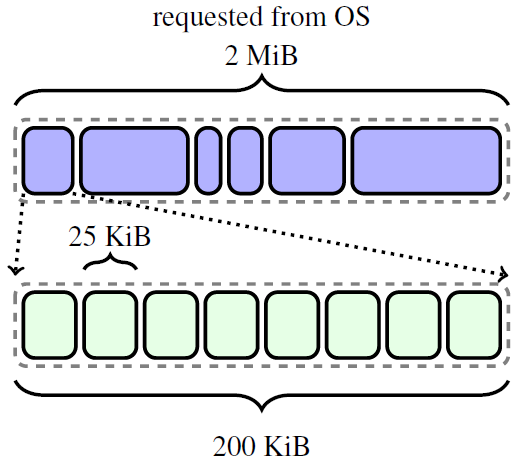
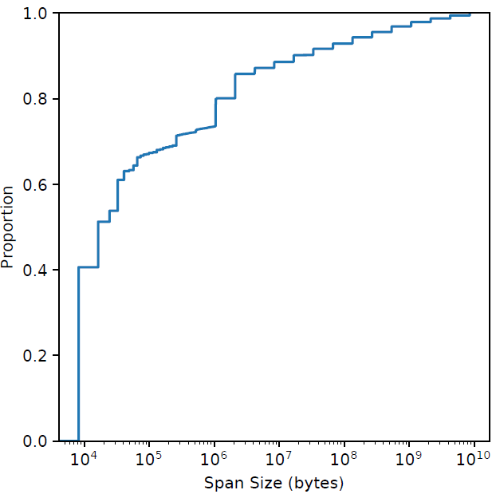

# 从 malloc 效率到整体效率：大页面感知的内存分配器

**摘要**

在<u>仓库规模</u>下，内存分配代表着巨大的计算成本，对其进行优化可以节省大量的计算成本。一种经典方法是提高分配器的效率，最大限度地减少**分配器代码**中花费的 CPU 周期。然而，内存分配决策也通过数据放置影响整个应用程序的性能，通过使用更少的硬件资源完成**更多的应用程序工作单元**，从而提供了提高**整体生产力**的机会。本文，我们关注大页覆盖率，引入 TEMERAIRE，它是 TCMALLOC 的大页感知的增强功能，可减少应用程序代码中的 CPU 开销。我们讨论了 TEMERAIRE 的设计和实现，包括大页感知的内存布局策略，以最大化大页覆盖率和最小化碎片开销。我们对 8 个应用程序进行了应用研究，每秒请求数 (RPS) 提高了 7.7%，RAM 使用量减少了 2.4%。==我们展示了 **1% 整体规模**实验的结果，以及谷歌<u>仓库规模</u>计算机的纵向部署==。这减少了 6% 的 TLB 未命中停顿，减少了 26% 由于碎片而浪费的内存。最后，我们讨论了用于改进分配器开发过程的其他技术，以及未来内存分配器的潜在优化策略。

## 1. 简介

仓库级计算机 (WSC) 中的**数据中心税** [[23](#_bookmark59), [41](#_bookmark77)] 是指花费在常见服务开销（如序列化、RPC 通信、压缩、 复制和内存分配）上的累积时间。WSC 工作负载多样性 [[23](#_bookmark59)] 意味着我们通常无法优化单个应用程序来显着提高整体系统效率，因为成本是由许多独立的工作负载承担的。相比之下，专注于**数据中心税**的组成部分可以实现总体性能和效率的显着提高，因为好处可以适用于所有应用。在过去的几年里，我们的团队一直致力于最小化内存分配决策的成本，并取得了很好的效果； 通过显著减少内存分配时间来**提升**系统整体收益。但我们可以优化的不仅仅是组件的这些成本。通过改变分配器来提高应用程序代码的效率，也可以获得显著的好处。本文考虑，如何通过提高**内存分配器提供的大页面覆盖率**来优化应用程序性能。

缓存未命中和 TLB 未命中是现代系统的主要性能开销。在 WSC 中，内存墙 [[44](#_bookmark80)] 很明显：在一次分析中，50% 的周期在内存停滞上 [[23](#_bookmark59)]。分析我们自己的工作负载发现，大约 20% 的周期因 TLB 未命中而停滞。

大页面是处理器的一种功能，可以显着减少 TLB 未命中的数量，从而降低成本 [[26](#_bookmark62)]。大页面的容量越大，同样数量的 TLB 项可以映射更大范围的内存。在研究的系统上，大页面还能减少<u>未命中+填充</u>的总停顿时间，因为它们页表的**表示**需要更少的层来遍历。

虽然分配器不能修改用户代码访问的内存量，甚至不能修改对象的访问模式，但它可以与操作系统合作并控制新分配的位置。**通过优化大页面覆盖率，分配器可以减少 TLB 未命中率**。C 和 C++ 等语言中的内存放置决策还必须**面对这样的后果**：即它们的决策是最终的，对象一旦分配就不能移动 [[11](#_bookmark47)]。分配位置的决策只能在分配点进行优化。这种方法可能会增加内存分配的 CPU 成本，从而**增加**数据中心税，与我们之前（降成本）的工作背道而驰，但通过**减少**其他地方处理器的停顿来弥补。这改进了应用程序的指标**^1^**，例如每秒请求数 (RPS)。

> ^1^虽然减少停顿可以提高 IPC，但 IPC 本身并不能很好地代表 [[3](#_bookmark39)] 我们可以使用固定数量的硬件完成多少有用的应用程序工作。**忙循环自旋锁**具有极高的 IPC，**但在争用下几乎没有用处**。

我们的贡献如下：

- TEMERAIRE 的设计，增强了 TCMALLOC 大页面感知的功能，可减少应用程序中其它代码的 CPU 开销。我们提出了大页面感知的内存布局策略，以最大化大页面覆盖率并最小化碎片开销。
- 在复杂的现实世界应用程序和 WSC 规模中评估 TEMERAIRE。我们测量了在我们的基础架构中运行的 8 个应用，观察到每秒请求数 (RPS) 增加了 7.7%，RAM 使用量减少了 2.4%。将这些技术应用于 Google 的 WSC 中的所有应用程序后，TLB 未命中停顿减少了 6%，由于碎片而浪费的内存减少了 26%。
- 开发过程中优化内存分配器改进的策略：结合使用跟踪、**监控**和仓库规模的实验。

## 2 管理大页（Hugepage） 的挑战

虚拟内存需要通过称为转换后备缓冲区 (TLB) [[7](#_bookmark43)] 的缓存将用户空间地址转换为**物理**地址。TLB 的容量有限，大多数应用程序在使用默认页面大小时，整个 TLB 仅能覆盖总内存的一小部分。现代处理器通过在其 TLB 中支持 **大页** 来增加这种覆盖范围。一个完整对齐的大页（x86 上通常 2MiB）只占用一条 TLB 条目。**大页**通过增加 TLB 的有效容量和减少 TLB 未命中来减少停顿 [[5](#_bookmark41), [26](#_bookmark62)]。

传统的分配器以页面大小的块来管理内存。Transparent Huge Pages (THP) [[4](#_bookmark40)] 提供了一个机会，内核可以利用页表中的大页，**适时地**覆盖连续的**小**页。从表面上看，内存分配器只需要分配与大页对齐，且大小等于大页的内存块，即可利用此支持。

将内存**释放**回操作系统（仓库规模下，应用长期运行，但工作周期是动态的，因此释放内存是必需的）的内存分配器面临着更加艰巨的挑战。返回非大页面的对齐内存区域，要求内核使用较小的页面来表示剩余的内容，这破坏了内核提供大页的能力，并为剩余使用的页面强加了性能成本。或者，分配器可能会等待整个大页面空闲，然后再将其返回给操作系统。这保留了大页面的覆盖率，但相对于实际使用量可能会显着放大，从而使内存闲置。DRAM 是部署 WSC 的一项重要成本 [[27](#_bookmark63)]。在这个过程中，分配器对外部碎片的管理是很重要的，这些未使用的空间块太小，无法服务于分配请求。例如，考虑 [图 1](#_bookmark3) 中的分配。在这一系列分配之后，有 2 个可用空间单元。要么使用小页面，内存碎片较少但 TLB 条目的使用效率较低，要么使用大页面，TLB 效率高但碎片较多。

| Figure 1: Allocation and deallocation patterns leading to fragmentation |
| :----------------------------------------------------------: |
|               |

**==了解这些策略产生行为==**的用户空间分配器，通过将内存打包在一起分配，以便与大页面边界紧密对齐，有利于使用已分配的大页面，（理想情况下）能以相同的对齐方式返回未使用的内存来配合它们的结果^2^。**Hugepage** 感知的分配器有助于在用户级别管理内存连续性。目标是最大限度地在几乎满的大页面上分配打包的内存，相反，在空的（或更空的）大页面上最小化使用的空间，以便它们可以作为完整的大页面返回给操作系统。这有效地使用了内存，并与内核的透明大页面支持很好地交互。此外，更一致地分配和释放大页面形成了一个正反馈循环：减少内核级别的碎片，提高了未来分配大页的可能性。

> ^2^这很重要，因为支持大页面的内存必须在物理上是连续的。通过返回完整的大页面，我们实际上可以帮助操作系统管理碎片。

## 3 TCMALLOC 概述

**TCMALLOC** 是一种用于大规模应用程序的内存分配器，常见于 WSC 设置中。它显示出强大的性能 [[21](#_bookmark57)]。我们的设计直接建立在 TCMALLOC 的结构之上。

| Figure 2: Organization of memory in TCMALLOC. System mapped memory is broken into (multi-)page *spans*, which are sub-divided into objects of an assigned, fixed *sizeclass*, here 25 KiB. |
| :----------------------------------------------------------: |
|                                          |

[图 2](#_bookmark6) 展示了内存在 TCMALLOC 中的组织结构。对象按大小分开。首先，TCMALLOC 将内存划分为 **spans**，与页面大小对齐^3^。

> 3. 令人困惑的是，TCMALLOC 的**页面大小**参数不一定是系统页面大小。默认配置是使用 8 KiB TCMALLOC**页面**，这是 x86 上的两个（小）虚拟内存页面。


任何内存分配器都应该回答的两个问题定义了 TCMALLOC 的结构：

1. 我们如何选择对象大小和组织元数据以最小化空间开销和碎片？
2. 我们如何可扩展地支持并发分配？

足够大的分配是通过仅包含分配对象的 **span** 来实现的。其他 **span** 包含多个相同大小的较小对象（**sizeclass**）。**小**对象大小边界是 256 KiB。在这个小阈值内，**分配请求**被四舍五入到 100 个大小级别中的一个。TCMALLOC 将对象存储在一系列缓存中，如[图 3](#_bookmark7) 所示。从一个简单的 **pageheap** 分配 **span**，它跟踪所有未使用的页面并进行最佳分配。

|Figure 3: The organization of caches in TCMALLOC; we see memory allocated from the OS to the pageheap, distributed up into spans given to the central caches, to local caches. This paper focuses on a new implementation for the pageheap. |
| :----------------------------------------------------------: |
|               |

Pageheap 还负责在可能的情况下将不再需要的内存返回给操作系统。不是在 `free()` 路径上执行此操作，而是定期调用专用的释放内存方法，旨在维持可配置的、稳定的释放速率（以 MB/s 为单位）。这是一种启发式。TCMALLOC 希望在稳定状态下同时使用尽可能少的内存，避免昂贵的系统分配，而这些分配可能会通过使用先前提供的内存来消除。我们在第 [4.3](#_bookmark16) 节中更详细地讨论了处理这种峰谷分配模式。

理想情况下，TCMALLOC 将返回用户代码**很快**不需要的所有内存。内存需求的变化不可预测，这使得返回未使用的内存同时保留内存以避免系统调用和页面错误变得具有挑战性。关于内存返回策略的更好决策具有很高的价值，在 [7](#_bookmark35) 节中进行了讨论。

TCMALLOC 将首先尝试从**本地**缓存提供分配，就像大多数现代分配器一样 [[9](#_bookmark45),[12](#_bookmark48),[20](#_bookmark56),[39](#_bookmark75) ]。最初这些是同名的**<u>==每线程缓存==</u>**，为不同尺寸的分配存储一个空闲对象列表。为了减少闲置内存并提高高线程应用程序的重用率，TCMALLOC 现在使用**每超线程本地缓存**。当本地缓存没有适合<u>大小</u>的对象来服务请求时（或者在尝试 free() 后有太多对象），请求路由到该<u>大小类</u>的单个**中央缓存**。它有两个组件——一个快速的、受互斥锁保护的**传输缓存**（包含来自该<u>大小类</u>的平面对象数组）和一个大的、受互斥锁保护的**中央空闲列表**，包含分配给该<u>大小类</u>的每个 span；可以从这些 span 中获取或返回对象。当一个 span 中的所有对象都已返回到中央空闲列表中的一个 span 时，该 span 将返回到 **pageheap**。

在我们的 WSC 中，大多数分配都很小（50% 的分配空间是对象≤ 8192 字节），如图 [4](#_bookmark8) 所示。然后将这些聚合到 span 中。pageheap 主要分配 1 或 2 页 span，如图 [5](#_bookmark9) 所示。80% 的 span 小于**大页面**。

| Figure 4: CDF of allocation sizes from WSC applications, weighted by bytes. | Figure 5: CDF of TCMALLOC span sizes from WSC applications, weighted by bytes. |
| ------------------------------------------------------------ | ------------------------------------------------------------ |
|  |  | 

**堆叠**缓存的设计使系统有效地模块化，并且有几个伴随的优点：

- 干净的抽象更容易理解和测试。
- 用全新的实现替换任何一级缓存是相当直接的。
- 如果需要，可以在运行时选择缓存实现，这有利于操作推出和实验。

TCMALLOC 的 pageheap 有一个简单的内存管理接口。

- `New(N)` 分配*N* 页的 span
- `Delete(S`) 释放一个 span (S) 给分配器。
- `Release(N)` 将页面堆缓存的 >= *N* 个未使用页面返回给操作系统。

## 4 TEMERAIRE 的方案

TEMERAIRE，本文对 TCMALLOC 的贡献，用一种尝试最大限度填充（和清空）大页面的设计取代了页面堆（**PageHeap**）。源代码在 Github 上（参见第 [9](#availability)）。**我们开发了启发式方法**，将内存分配密集地<u>==打包==</u>到使用率较高的大页面上，同时形成完全未使用的大页面以返回给操作系统。

我们参考了几个定义。**Slack** 是内存分配请求的大小与下一个整个大页面之间的差距。从操作系统分配的虚拟地址空间是 **==unbacked==** 的，没有分配（或者映射）物理内存。使用时，它是 **backed** 的，由操作系统分配（或映射）物理内存。我们可能会再次向操作系统释放内存，使之 **unbacked**。我们主要在大页面边界内打包，但使用大页面的**区域**来**跨**大页面边界打包分配。

根据我们对`malloc`用法和 **TCMALLOC** 内部的**监控**，以及对内核实现的了解，我们制定了几个关键原则，这些原则促使我们对 TEMERAIRE 的设计做出了如下选择：

**总内存需求随时间不可预测地变化，但并非每次内存分配都被释放**。我们无法控制调用代码，它可能会迅速（并反复）调整其用法； 我们必须对此适应。但是 Pageheap 上的总有大量的内存分配不会被释放（很难预测它们是什么 [[30](#_bookmark66)]）； 任何特定的内存分配都可能立即消失或永远存在，我们必须妥善处理这两种情况。

**完全耗尽大页面意味着以大页面粒度打包内存**。将几乎不为空的大页面返回给操作系统的代价很高（请参阅第 [2](#_bookmark2) 节）。生成空或几乎空的大页面意味着在我们的二进制文件中密集打包**其他**大页面。我们的设计必须能够将内存分配密集地打包到尽可能少的饱和容器中。

虽然我们的目标是只使用大页大小的容器，但 `malloc` 必须支持大于单个大页的内存分配。这些可以正常分配，但我们将较小的内存分配放在分配的 *slack* 中，以实现较高的内存分配密度。只有当小内存分配由 *slack* 主导时，我们才需要将大内存分配依次放置在 *regions* 中。

**耗尽大页面给了我们新的释放决策点**。当大页面完全变空时，我们可以选择是保留它以供将来分配内存，还是将其返回给操作系统。在 TCMALLOC 的后台线程释放之前保留它会带来更高的内存开销。返回它可以减少内存使用，但如果重用，则会以系统调用和缺页异常为代价。<u>自适应地做出这个决定使我们能够比后台线程更快地将内存返回给操作系统，同时避免额外的系统调用</u>。

**错误代价高昂，但工作不是**。很少有内存分配直接接触 PageHeap，但**所有**分配都是通过 PageHeap 支持的。我们必须只支付一次分配成本； 如果我们做了一个错误的放置并<u>碎片化</u>了一个大页，我们要么付出空间成本，要么付出长时间拆分大页的时间成本。**如果可以让分配器做出更好的决策，那么放慢分配器的速度是值得的**。

> Figure 6: TEMERAIRE’s components. Arrows represent the flow of requests to interior components.

我们的分配器通过委托给几个子组件来实现其接口，参见 [图 6](#_bookmark11)。每个组件都根据上述原则构建，==并且每个组件都有自己最擅长处理的分配类型的近似值==。根据原则 #4，我们重视智能布局而不是速度^4^。

> 4. 由于每个操作都持有一个经常竞争的互斥体，我们确实保持了合理的效率：大多数操作都是 *O*(1)，并注意优化常数因子。

虽然 TEMERAIRE 的特定实现与 TCMALLOC 内部联系在一起，但大多数现代分配器共享类似的页面（或更高）粒度的大型后端分配，如 TCMALLOC 的跨度：比较 jemalloc 的**范围**[[20](#_bookmark56)]，Hoard 的**超级块** [[9](#_bookmark45)]，以及 mimalloc 的**页面**[[29](#_bookmark65)]。Hoard 的 8KB 超级块直接使用 `mmap` 分配，防止大页连续。这些超级块可以改为密集地打包到大页面上。mimalloc 将其 64KiB+**页面**放置在**段**中，但这些页面是按线程维护的，这阻碍了进程段之间的密集打包。急切地将页面返回给操作系统可以最大限度地减少此处的 RAM 成本，但会破坏大页面。这些分配器还可以受益于类似 TEMERAIRE 的大页面感知分配器^5^。

> 5. 事实上，jemalloc 正在参考 TEMERAIRE 的方法。

### 4.1 整体算法

我们将简要概述整体方法和每个组件的作用，然后详细描述每个组件。目标是最小化生成的 Slack，如果确实生成了 Slack，就像任何页面级碎片一样，将其重新用于其他内存分配。

所有组件的背后是和操作系统交互处理虚拟内存的 `HugeAllocator`。它为其他组件提供了虚拟地址空间^注1^、**并分配物理内存**。我们还维护了一个称为 `HugeCache`、全空的大页面缓存，用于**缓存物理内存**。

> 注1：只分配了虚拟地址空间

我们保存了一个部分填充的单个大页列表（`HugeFiller`），后续的小内存分配可以密集地填充它们。沿着大页边界进行**打包分配**会导致效率低下，因此我们实现了一个专门的内存分配器 （` hugerregion `）。

TEMERAIRE 使用图 [7](#_bookmark10) 中的算法，根据请求大小将分配决策**定向**到其子组件。每个子组件都针对不同的分配大小进行了优化。

```c++
Span New(N) {
    // Slack is too small to matter
    if (N >= 1 GiB) return HugeCache.New(N);
    // Help bin-pack a single hugepage
    if (N <= 1 MiB)  return HugeFiller.New(N);
    
    if (N < 2 MiB) {
        // If we can reuse empty space, do so 
        Span s = HugeFiller.TryAllocate(N); 
        if (s != NULL) return s;
    }
    // If we have a region, use it 
    Span s = HugeRegion.TryAllocate(N);
    if (s != NULL) return s;
    
    // We need a new hugepage. 
    s = HugeCache.New(N); 
    HugeFiller.DonateTail(s);
    
    return s;
}
// Figure 7: Allocation flow for subcomponents. Hugepage size is 2 MiB.
```

对于大页面大小的精确倍数的分配，或者那些足够大，以至于 Slack 无法满足的分配，我们直接转发到 `HugeCache`。

中等大小的分配（在 1MiB 和 1GiB 之间）通常也从 HugeCache 分配，最后一步是**捐赠** slack。例如，来自 `HugeCache` 的 4.5 MiB 分配会产生 1.5 MiB 的 slack，这是一个不可接受的高开销率。TEMERAIRE 通过假装<u>==请求的最后一个大页面上有一个**前导**分配==</u>，将 slack 部分捐赠给 `HugeFiller`（图 [8](#_bookmark15)）。

| Figure 8: The slack from a large allocation spanning 3 hugepages is “donated” to the HugeFiller. The larger allocation’s tail is treated as a fictitious allocation. |
| :----------------------------------------------------------: |
|                                          |

当释放如此大的 Spam 时，分配器还将虚构的前导分配标记为空闲。如果 slack 未被使用，它会与其余部分一起返回到尾部大页面。否则，尾部大页面会留在 `HugeFiller` 中，只有前 *N* − 1 个大页面会返回到 `HugeCache`。

对于某些分配模式，<u>==中等规模的分配产生的 Slack，比我们在严格的 2MiB 容器中用较小的分配所能填补的更多==</u>。例如，许多 1.1MiB 的分配将为每个大页面产生 0.9MiB 的 Slack（参见图 [12](#_bookmark20)）。检测到这种模式时，`HugeRegion` 分配器会**跨大页面边界**进行分配，以最大限度地减少这种开销。

小请求（<= 1MiB）始终由 `HugeFiller` 提供。对于 1MiB 和大页面之间的分配请求，我们评估了几个选项：

1. 我们**尝试** `HugeFiller`：如果有可用空间，我们会使用它，并乐于填充大部分空白的页面。
2. 如果 `HugeFiller` 不能满足这些请求，我们接下来考虑 `HugeRegion`； 如果有 Region 可以满足请求，那就会这么做。如果不存在这样的 Region（或者它们都太满了），我们会考虑分配一个 Region，但前提是，检测到 Slack 分配与小分配的比例很高。如下所述。
3. 否则，我们从 `HugeCache` 中分配一个完整的大页面。这会产生 **Slack**，但我们预计它将被未来的分配填补。

在 TEMERAIRE 中，我们的设计选择是，**主要**关注大页面以下的外部碎片，即外部碎片基本上根本不会超过 2MB（参阅第 [4.5](#_bookmark19) 节的例外情况）。例如，对于一个只有 1 GiB 空闲页的系统和一个有 512 个不连续的空闲 hugepage 的系统，TEMERAIRE 都能很好地处理。在任何一种情况下，分配器（通常）会将所有未使用的空间返回给操作系统； 新分配 1 GiB 的内存都需要发生异常（page fault）。在碎片场景中，我们需要在新的虚拟内存上执行此操作。由于 64 位地址空间实际上足够大，因此不需要担心浪费虚拟地址范围，它们也不会消耗物理内存。

### 4.2 HugeAllocator

`HugeAllocator` 跟踪映射的虚拟内存。所有操作系统映射都在此处进行。<u>==它存储大页对齐的 **unbacked** 范围（即那些没有关联物理内存的范围）^注^==</u>。虚拟内存几乎是免费的，所以我们的目标是简单和合理的速度。我们的实现使用 treap [[40](#_bookmark76)] 跟踪未使用的范围。我们用它们最大的包含范围来扩充子树，这让我们可以快速选择一个近似的最佳拟合。

> 注：就是虚拟内存地址空间

### 4.3 HugeCache

`HugeCache` 以完整的大页粒度跟踪 **backed** 内存范围。`HugeFiller` 填充和耗尽整个大页的结果是，需要决定何时将空的大页返回给操作系统。我们会<u>**后悔**</u>返回将再次需要的内存，同样<u>**后悔**</u>在缓存中**保留**不再使用的内存。提前返回内存意味着通过系统调用返回内存，并利用页面异常来重用之。按 TCMALLOC 后台线程周期性地释放内存，意味着（某些物理）内存将处于未使用状态。

考虑图 [9](#_bookmark14) 中没有额外堆分配的人工程序。每次循环，`New` 需要一个新的大页面并将其放置在 `HugeFiller` 中。`Delete` 删除分配，大页面现在完全免费。对于这个简单但病态的程序，如果是提前返回，则每次循环都需要进行一次系统调用。

```c++
while (true) { 
    Delete(New(512KB))
}
// Figure 9: Program which repeatedly drains a single hugepage.
```

我们在 2 秒的滑动窗口中跟踪需求的周期性，并计算所见的最小值和最大值（*demand~min~*，*demand~max~*）。每当内存返回到 `HugeCache` 时，如果缓存大于 *demand~max~* − *demand~min~*，我们会将大页面返回给操作系统。我们还尝试了其他算法，但这个算法很简单，足以捕捉我们所看到的经验动态。只要我们在窗口内看到对内存有新的需求，缓存就可以增长。在振荡使用中，这将（错误地）释放内存一次，然后从那时起（正确地）保留之。图 [10](#_bookmark17) 显示了我们的 Tensorflow 工作负载的缓存大小，该工作负载的缓存使用量有一段时间急剧波动； 我们严格跟踪实际需要的内存。

| 图 10：随着时间的推移，Tensorflow 对 `HugeCache` 的需求，用缓存限制 (+demand) 绘制。请注意，我们在第一次下降时密切跟踪他们的锯齿状需求。之后，我们识别模式并将峰值需求保留在缓存中。 |
| :----------------------------------------------------------: |
|                                         |

### 4.4 HugeFiller

`HugeFiller` 满足较小的分配，每个分配都**在单个大页内**。这满足了大多数分配（平均而言，整体上 78% 的页面堆由 `HugeFiller` 支持），是我们系统中最重要和最优化的组件。**在**一个给定的大页中，我们使用一个简单（快速）的最佳匹配（best-fit）算法来放置一个分配； **具有挑战性的部分是决定<u>在哪个</u>大页上进行分配**。

这个组件解决了我们的 **bin-packing**（打包） 问题：我们的目标是将大页分割成一些最大限度地保持满的页面，而另一些则是空的或接近空的页面。可以回收最空的大页（可能根据需要分解大页），同时最大限度地减少对大页**覆盖率**的影响，因为密集填充的页面用大页覆盖了大多数使用的内存。但是清空大页是一项挑战，<u>==因为我们不能指望任何特定的分配消失==</u>。

第二个目标是最小化每个**大页内**的碎片，使新请求更<u>==有可能==</u>得到满足。如果系统需要一个新的 *K* 页面<u>==跨度==</u>，且没有 ≥ *K* 页的空闲范围可用，我们需要来自 `HugeCache` 的大页。这会造成 (2*MiB* − *K* ∗ *pagesize*) 的 slack，浪费空间。

这给了我们两个优先考虑的目标。由于我们希望最大限度地提高大页完全空闲的可能性，因此几乎空的大页非常宝贵。由于我们需要最小化碎片，具有较长空闲范围的大页也很宝贵。这两个优先项都是通过保留具有最长空闲范围的大页来满足，因为更长的空闲范围必须有更少的正在使用的块。我们利用每个大页的统计信息，将大页组织成相应的<u>==排名列表（ranked lists）==</u>。

在每个大页面中，我们跟踪已用页面的位图； 为了满足某个大页面的请求，我们在该位图中进行**最佳匹配搜索**（best-fit）。我们还跟踪了一些统计数据：

- **最长的空闲范围** (*L*)，尚未分配的连续页数，
- 总**分配数量** (*A*)，
- 总**使用页数** (*U*)。

这三个统计数据决定了分配大页的**优先顺序**。我们选择 *L* 足够最小和 *A* 最大的大页。对于 *K* 页的分配，我们首先只考虑最长可用范围足够大（*L* ≥ *K*）的大页。这决定了一个大页是否为一个**可能的**分配目标。在 *L* ≥ *K* （*L* 最小）的大页中，我们按**饱和度**进行排序。大量实验使我们选择了 *A*，而不是 *U*。

这种选择的动机是**放射性<u>衰减</u>型分配模型** [[16](#_bookmark52)]，其中每个分配，无论大小，都同样有可能（有一定的概率 *p*）被释放。在这个模型中，具有 5 个分配的大页有可能变为空闲的概率是 *p*^5^ << *p*；因此，我们应该非常<u>==强烈地==</u>避免从分配很少的大页面进行分配。特别是，该模型预测 *A* 是比 *U* 更好的**空**模型：一个大小为 *M* 的分配比大小为 1 的 *M* 个分配更有可能被释放。

**衰减模型**在实际应用中并不完全正确，但它是一个有效的近似值，实验支持了它的主要主张：按 *A* 排序比按 *U* 排序能清空更多页面。<u>==实际上，使用 *U* 会产生可接受的结果，但会产生更糟糕的结果==</u>。

更详细地说，*A* 用于计算**块索引 *C***，由 *min*(0,*C*~max~ − *log*~2~(*A*)) 给出。我们计算块索引，那么最满的页面有 *C* = 0，最空的页面有 *C* = *C*~max~ -1。在实践中，我们发现 *C*~max~ = 8 个块足以避免从几乎为空的页面进行分配。区分大量分配的大页不太重要：例如，我们预测一个有 200 个分配的大页和一个有 150 个分配的大页都不太可能完全耗尽。该方案优先区分可能为空的页面之间的等级。

我们将大页存储在列表数组中，其中每个大页存储在列表的索引 *I* = *C*~max~ ∗ *L* + *C* 处。由于 *K* 页分配可以从任何具有 *L* >= *K* 的大页满足，可以满足分配的大页恰好是列表中索引 *I* >= *C*~max~ ∗ *K* 的大页。我们从最少的非空列表中（任意）选择一个大页，使用非空列表的位图将其加速到常数时间。

我们的策略不同于（<u>经典的</u>）最佳匹配。考虑一个大页 *X* 分别有 3 页的**==空隙==**和 10 页的**==空隙==**，另一个大页 *Y* 有 5 页的**==空隙==**。最佳匹配选择 *X* 。我们的策略倾向于 *Y* 。这种策略之所以有效，是因为碎片化的页面很难变为空闲，因此我们希望在碎片最多的大页上分配。例如，如果我们需要 3 页，那么<u>==最多只==</u>包含 <u>3 个可用页面</u>的大页更有可能是碎片化的，因此很适合分配。在放射性衰减模型下，大空闲页面附近的分配与其他任何分配一样有可能变为空闲，这可能导致这些空闲页面大幅增加； 然后它们可以用于较大的分配。我们将这 10 个空闲页视为宝贵的资源，除非没有其他方法，否则避免在它附近分配，以便可以让它增长。

| 图 11：`HugeFiller` 和各种 **bin-packing**（打包）策略。优先考虑**饱和度**或**最长空闲范围**（LFR）优于最佳匹配； 相比**饱和度**，LFR 占主导地位。 |
| :----------------------------------------------------------: |
|                                         |

图 [11](#_bookmark18) 用一个简单的例子演示了这一点。这是根据**合成测试**（参见第 [6.1](#_bookmark32)节）的结果，绘制了对 `HugeFiller` 的内存需求。我们还显示了三种方法使用的总内存：`HugeFiller` 的实际搜索、优先考虑**饱和度**的搜索（即，*A* 优先于 *L*）和全局最佳匹配。请注意，**合成测试**有一个一次性释放大量内存的操作，以模拟使用中的随机波动。我们的 LFR 优先算法优于其他两种方法。特别是，我们看到在内存使用量下降后，最佳匹配几乎无法恢复任何总内存，并以接近 100% 的开销结束，而其他两种算法都非常符合实际需求。

令人惊讶的是，这个简单的策略大大优于**全局最佳匹配算法** —— 将请求放置在任何大页中最接近其大小的单个空闲空间中。最佳匹配的代价非常昂贵—— 我们不能为每个请求搜索 10-100K 个大页，另外非常违反直觉的是，它也会产生更多的碎片。对于一般的碎片问题，最佳匹配远不是最优的，并不是一个新结果[[36](#_bookmark72)]，但有趣的是，这里可以看到它有烂。

最后一个重要的细节是，**==捐赠==**的大页比任何**==非捐赠==**的大页都不是理想的分配目标。假设下面的病态程序循环：

``` c++
while (true) {
    // Reserve 51 hugepages + donate tail of last 
    L = New(100 MiB + 1 page);
    // Make a small allocation 
    S = New(1);
    // Delete large allocation 
    Delete(L);
}
```

每次循环只分配 1 个（净）页面，但如果我们总是使用 L 的 **==slack==**来满足 S，我们最终将把每个 S 放在它自己的大页上。在实践中，如果有其他页面可用，则简单地拒绝使用**==捐赠==**页面可以防止这种情况，同时在需要的地方有效地使用 **==slack==**。

### 4.5 HugeRegion

`HugeCache`（及其背后的 `HugeAllocator`）足以进行大型内存分配，其中四舍五入到完整大页面的成本很小。`HugeFiller` 适用于可以打包到单个大页的小分配。`HugeRegion` 服务那些介于两者之间的分配。

考虑一个分配 1.1 MiB 内存的请求。我们通过 `HugeFiller` 分配，从 2MiB 的大页面留下 0.9 MiB 未使用的内存：*slack* 空间。`HugeFiller` 假定 slack 将由未来的小 (<1MiB) 分配来填充，通常情况是这样：我们观察到整体小分配与 slack 的字节比为 15:1。假设一种极端情况，即一个二进制文件只是请求 1.1 MiB 的内存空间，如图 [12](#_bookmark20) ：

| Figure 12: Slack (“s”) can accumulate when many allocations (“a”) are placed on single hugepages. No single slack region is large enough to accommodate a subsequent allocation of size “a.”|
| :----------------------------------------------------------: |
|                                          |

`HugeRegion` 处理这个问题，在某种程度上，是由我们自己的**选择**造成的：我们非常关注使用 `HugeFiller` 将分配打包到大页大小的容器中，而我们想通过**捐赠**的 slack 来做到这一点，对于某些分配模式来说是灾难性的。没有它，大多数普通二进制文件当然也很好，但是通用内存分配器需要处理不同的工作负载，即使是那些以 slack 分配为主的工作负载。显然，我们必须能够跨大页边界分配这些。`HugeRegion` 巧妙地消除了这种病态情况。

`HugeRegion` 是一个大的固定大小分配（目前为 1 GiB），以小页面粒度跟踪，与 `HugeFiller` 中单个大页使用的位图类型相同。与单个大页一样，我们在该区域的所有页面上，使用最佳匹配分配内存。出于与 `HugeFiller` 相同的原因，我们持有这些区域的列表，按最长的空闲范围排序。从这些较大的容器中立即分配可以节省大量浪费的空间，而不是在我们的悲观负载中每个大页损失 0.9 MiB，不过是每个 `HugeRegion` 损失 0.9 MiB，只有大约 0.1%。（这促使每个区域的规模都很大。）

大多数程序根本不需要区域。在我们积累的大量 slack 大于程序的小分配总量之前，不会分配任何区域。从整体上看，只有 8.8% 的程序触发了区域的使用，但是这个功能仍然很重要：<u>这些二进制文件</u>中 53.2% 的分配由区域提供。其中一种工作负载是 KV 存储，它以大块的形式将长期存在的数据加载到内存中，以少量短期的小分配**==响应请求==**。没有区域，与请求相关的分配将无法填补较大分配产生的空闲空间。`HugeRegion` 可以防止这种不常见分配模式导致的内存使用膨胀。

### 4.6 Memory Release

如上所述，`Release(N)` 由支持线程以稳定的方式定期调用。

为了实现我们的 `Release(N)` 接口，TEMERAIR 通常只从 `HugeCache` 中释放大页，并可能如上所述缩小其限制。释放超过提示的 *N* 页不是问题； 支持线程使用实际释放量作为反馈，并调整未来的调用以达到正确的总体速率。

如果 `HugeCache` 无法释放 *N* 页内存，则 `HugeFiller` 将只**==释放==**空大页上的空闲(小)页。从部分填充的大页面返回（**==释放==**）小页面是减少内存占用的最后手段，因为该过程在很大程度上是不可逆的^6^。通过返回大页上的部分小页，我们使得操作系统将横跨大页的**单个页表项**替换为剩余小页的**多个页表项**。这种**单向操作**，增加了 TLB 未命中，拖慢了对剩余内存的访问。<u>Linux 内核将为仍在使用的小页使用页表条目</u>，即使我们稍后重新使用已释放的地址空间也是如此。我们在 `HugeFiller` 管理部分填充的大页，所以在此决定是否释放。

> ^6^虽然 THP 可能会重新组装大页面，但这是不确定的，并依赖于系统利用率。这里有一个负反馈循环，高利用率场景实际上会竞争并阻碍可能最有利于他们的 THP 进展。

`HugeFiller` 单独处理释放了部分小页的大页：在这类大页上分配内存没有收益，因此除非没有其他大页可用，否则我们不会从中分配。所以这有助于提高性能，并允许这些部分释放的大页完全为空。

## 5 评估 TEMERIRE

我们在 Google 的 WSC 工作负载上评估了 TEMERAIRE。评估涉及多个指标，包括 CPU 和节省的内存。我们在几个关键服务上对 TEMERAIRE 进行了评估，<u>==测量了我们 WSC 中 10% 的周期和 15% 的 RAM 使用情况==</u>。在 [6.4](#_bookmark34) 节中，我们讨论了工作负载的多样性；在此评估中，使用我们的实验框架和 <u>fleetwide-profiler</u> **==监控==**技术来检查所有工作负载的数据。我们认为应该优先考虑**工作负载效率**而不是 **malloc 的归因成本**；因此，我们检查（作为用户吞吐量代理的） IPC 指标，在可能的情况下，我们获得应用程序级别的性能指标，来衡量我们服务器上工作负载的生产力（例如，每个核心每秒的请求数）。我们向我们团队中的所有 TCMALLOC 用户展示了 TEMERAIRE 推出的<u>**纵向**</u>数据。

总的来说，TEMERAIR 在 CPU 和内存方面取得了重大胜利。

### 5.1 应用案例研究

我们和性能敏感的应用程序合作，在其生产系统中启用 TEMERAIRE，并衡量效果。在表 [1](#_bookmark24) 中总结了结果。在可能的情况下，我们测量了每个应用程序的用户级性能指标（每个 CPU 的吞吐量和延迟）。这些应用程序使用我们 WSC 中大约 10% 的周期和 15% 的 RAM。

> 表1

其中四个应用（search1、search2、search3 和 loadbalancer）之前关闭了 TCMALLOC 定期释放内存的功能。这使得他们以内存为代价，即使是在原始大页无关的页堆实现上，也有很好的大页覆盖率。我们没有更改 TEMERAIRE 的配置。这些应用程序保持了其高水平的 CPU 性能，同时减少了总内存的占用。

除了 Redis 之外，所有这些应用程序都是多线程的。除了 search3 之外，这些工作负载都在具有本地数据的单个 NUMA 域上运行。

- Tensorflow [[1](#_bookmark37)] 是一种常用的机器学习应用程序。它以前以大页和页面错误为代价，使用高周期性释放率来最小化内存压力。

- search1、search2、ads1、ads2、ads4、ads5 接收 RPC，并为自己的其他服务进行后续 RPC。

- search3、ads3、ads6 是**叶子** RPC 服务器，执行以读取为主的检索任务。

- Spanner [[17](#_bookmark53)] 是分布式数据库中的一个节点。<u>==它把从磁盘读取的数据保存在内存缓存中，它适应于为进程提供的内存，并在程序的其他地方未使用==</u>。

- loadbalancer 通过 RPC 接收更新，并定期发布汇总统计信息。

- Redis 是一种流行的开源键值存储。我们使用 TEMERAIRE 评估了 Redis 6.0.9 [[42](#_bookmark78)] 的性能，使用 TCMALLOC **==遗留==**的页面堆作为基线。这些实验在配备 Intel Skylake Xeon 处理器的服务器上运行。Redis 和 TCMALLOC 是使用 LLVM 编译，LLVM 使用 **-O3** 从 [Git commit cd442157cf](https://github.com/llvm/llvm-project/commit/cd442157cf) 构建。针对不同的配置，我们运行 2000 次 **redis-benchmark** 试验，每次试验发出 1000000 个请求，**==推送==** 5 个元素并读取这 5 个元素。

对于定期释放的 8 个应用程序，我们观察到平均 CPU 提高了 7.7%，平均 RAM 减少了 2.4%。其中两个工作负载没有看到内存减少。TEMERAIRE 的 `HugeCache` 设计很好地处理了 Tensorflow 的分配模式，但不能影响其突发性需求。Spanner 将其缓存最大化到一定的内存限制，因此减少 TCMALLOC 的开销意味着，可以在相同的内存占用中缓存更多的应用程序数据。

### 5.2 Fleet experiment

随机选择分布在我们 WSC 中 1% 的机器作为实验组，另外 1% 作为对照组（参见 [6.4](#_bookmark34) 节）。我们在实验机器上运行的所有应用程序上启用了 TEMERAIRE。在控制机器（对照组）上运行的应用程序继续使用 TCMALLOC 中的**==库存页面堆==**。

我们的 **Fleetwide  Profiler**（全局分析工具）  可以将性能指标与上述分组相关联。我们收集了有关内存使用、大页覆盖率、整体 IPC 和 TLB 未命中的数据。在实验时，未收集应用程序级性能指标（每 CPU 的吞吐量、延迟）。在我们的分析中，区分了两类应用程序：定期向操作系统释放内存的应用；和为了保留大页，关闭了此功能，使用 TCMALLOC 之前无大页感知页面堆的应用。图 [13](#_bookmark25) 显示 TEMERAIRE 提高了大页覆盖率，对于定期释放内存的应用程序，大页支持的堆内存百分比从 11.8% 增加到 23%，对于不定期释放内存的应用程序，从 44.3% 增加到 67.3%。

| 图 13：整体实验期间大页支持的堆内存百分比和 90% 的置信区间。（释放条件下的错误栏太小而无法清晰呈现。） |
| :----------------------------------------------------------: |
|             |

即使在禁用定期释放的情况下，我们也观察到了很大的改进。由于这些**二进制文件**在任何一种配置中都不会分解大页面，因此好处来自大页在系统范围内的可用性增加（由于其他应用程序碎片的减少）。TEMERAIRE 通过两种方法获得这种改善：由于我们主动释放空的大页面（传统的页面堆不释放大页），因此减少了空耗的大页，允许其他应用程序更成功地请求它们；其他位于同一位置的应用程序则不再以相同的速度分解大页。即使我们**==分配==**对齐的大内存区域，不干扰透明的巨型页，内核也不能总是用大页 [[26](#_bookmark62), [33](#_bookmark69)] 来支持这些区域。物理内存中的碎片会限制系统上可用大页面的数量。

接下来，我们检查大页覆盖率对 TLB 未命中的影响。同样，我们区分了启用和禁用定期内存释放的应用程序。我们测量 dTLB 加载停顿 ^7^ 占总周期的百分比。

> ^7^更准确地说，周期花费在页面遍历上，而不是访问 L2 TLB。

我们看到页面遍历未命中周期减少了 4.5-5%（表 [2](#_bookmark26)）。我们在实验数据中看到，不释放内存的应用程序（具有更好的大页覆盖率）具有更高的 dTLB 停顿成本，这有点令人惊讶。我们与管理这些应用程序的团队的讨论是，他们关闭内存释放，因为他们**需要**保证性能：平均而言，他们具有更具挑战性的内存访问模式，因此对微架构差异的担忧更大。通过在之前的实施中禁用释放，他们观察到更好的应用程序性能和更少的 TLB 停顿。有了 TEMERAIRE，我们看到我们改进的大页覆盖率将大大降低**两类**应用程序的dTLB成本。

> Table 2: dTLB load miss page walk cycles as percentage of application usage and dTLB misses per thousand instructions (MPKI) without TEMERAIRE (Control) TEMERAIRE enabled 15 (Exp.)

对于最后一个考虑的 CPU 因素，我们测量了对 IPC^8^ 的总体影响。对照组的总 IPC 为 0.796647919 ± 4e-9； 实验组的总 IPC 为 0.806301729 ± 5e−9 。相对而言，1.2% 的改进幅度不大，但绝对<u>==值==</u>节省了很多（尤其是考虑到前面讨论的各个应用收益更高）。

> ^8^IPC 数据源未按后台周期性释放内存分组。

对于内存使用，我们查看了**页面堆开销**：<u>有对应物理内存的页面堆</u>与<u>应用程序使用的总堆内存</u>的比率。实验组将此值从 15.0% 降低到 11.2%，这又是一个显着的改进。生产实验包括在数千台机器上连续运行的数千个应用程序，使我们对整体的收益充满信心。

### 5.3 Full rollout trajectories

根据从单个应用程序和 1% 实验中获得的数据，将默认^9^ 行为改为使用 TEMERAIRE。这逐渐扩展到我们 100% 的工作负载 [[10](#_bookmark46), [38](#_bookmark74)]。

> ^9^这并不意味着每个二进制文件都使用它。我们允许针对各种运维需求选择退出。

在此部署中，我们观察到因 TLB 未命中（L2 TLB 和页面遍历）而停顿的周期从 21.6% 减少到 20.3%（减少 6%），页面堆开销从 14.3% 减少到 10.6%（减少 26%）。[图 14](#_bookmark30) 显示了随时间推移对 TLB 未命中的影响：在每个点，我们显示归因于 TLB 停顿（加载和存储）的周期的总百分比，按页面堆的实现分组。随着整体使用 TEMERAIRE ，产生了明显的下降趋势。


| 图 14：堆叠线显示了 TEMERAIRE 的部署对 TLB 未命中周期的影响。随着 TEMERAIRE 在 WSC 中所占的比例越来越大，我们看到了从 21.6% 下降到 20.3% 的整体下降趋势。 | 图 15：堆叠线图显示了 TEMERAIRE 的部署对页面堆开销的影响。随着 TEMERAIRE 从少数应用（第 [5.1](#_bookmark23) 节）增长到几乎所有应用，在我们 WSC 中观察到的使用量中所占比例越来越大，总内存开销从 14.3% 增加到 10.6%， |
| ------------------------------------------------------------ | ------------------------------------------------------------ |
|                                         |                                         |

[图 15](#_bookmark31) 显示了类似的页面堆开销图。我们看到了另一个显着的改进。大页优化在空间和时间之间有一个自然的权衡； 尽可能节省最大内存需要分解大页，这将消耗 CPU 周期。但是 TEMERAIRE 在空间和时间上**都**优于以前的设计。根据我们的数据，强调几个结论：

**应用程序==生产力==超过 IPC**。如上所述，Alameldeen 等人 [[3](#_bookmark39)] 指出，简单的硬件指标并不总能准确反映应用程序层的收益。所有迹象表明，与 IPC 相比，TEMERAIRE 对应用程序的**性能指标**（RPS、延迟等）提升更多。

**收益并非来自 malloc 开销的减少**。收益来自于加速用户代码，有时在两个方向上都是剧烈的。一个应用程序 (ads2) 的 malloc 周期从 2.7% 增加到 3.5%，这是一个明显的倒退，但他们获得了 3.42% RPS、1.7% 延迟和 6.5% 内存使用峰值的**改进**。

**仍有相当大的上升空间，而且小比例很重要**。尽管 TEMERAIRE 已经成功，但由于物理内存连续性限制，在没有<u>==子释放==</u>的情况下使用 TEMERAIRE 时，大页覆盖率仍然只有 67%。增加到 100% 将显着提高应用程序性能。

## 6 构建 TEMERAIRE 的策略

**==很难先验地预测复杂系统的最佳方法==**。迭代设计和改进系统是一种常用的技术。军事飞行员创造了术语 **OODA**（观察、定向、决定、行动）循环 [[13](#_bookmark49)]  来衡量一种特殊的反应时间：看到传入的数据、分析数据、做出选择并根据这些数据采取行动（产生新数据并继续循环）。**较短的 OODA 循环对飞行员来说是一个巨大的战术优势，也可以提高我们的生产力**。**优化我们自己的 OODA 循环**——我们能够多快地洞察设计选择、评估其有效性并迭代以获得更好的选择——是构建TEMERAIRE的关键步骤。

虽然我们最终的评估是由生产服务器上的<u>==执行应用==</u>驱动，但这对于测试中间想法来说太具有破坏性和风险了； malloc 的微基准测试在页面级别也不是特别有效。为了应对这些挑战，我们有两种方法，生成驱动 TCMALLOC 开发的 trace 日志。

### 6.1 **经验**分布抽样<a id="_bookmark32"></a>

由于我们实现了全局范围的分析器 [[35](#_bookmark71)]。在这个分析器采集的数据中，有标有请求大小和其他有用属性的 malloc 样本。我们在堆中收集当前活动数据的样本，并调用 malloc。从这些样本中，我们可以推断出活动对象和 malloc 调用大小的**经验分布**。我们有一个**基于经验生成分布的程序**以任意（平均）堆大小为目标，生成对 malloc 和 free 的调用，作为复制这些分布的泊松进程^10^。堆的大小可以随着模拟时间的变化而改变，重现诸如**昼夜循环**、瞬态使用或高启动成本等因素。我们在 Github 上提供该程序及其输入（请参阅第 [9](#availability) 节）。

> ^10^利特尔定律告诉我们，平均存活对象数 *L* 等于到达率 λ 与平均寿命 *W* 的乘积。要复制活动/分配对象大小的给定分布，用 *p~a~* 表示大小为 *a* 的活动对象，我们设置 $W_{a}=\frac{c \cdot p_{a}}{\lambda_{a}} $。（*c* 是确定总堆大小的缩放参数）

尽管是**基于经验的程序**，但这仍然是一个**高度**不切实际的工作负载：每个（给定的大小）分配在任何时间步都有同等可能被释放，并且连续分配的大小之间没有相关性。它也不会重现每个线程或每个 CPU 的动态。然而，这是一种快速、有效的方法，可以将 malloc 置于极具挑战性的负载下，成功复制实际工作的许多宏观特征。

### 6.2 Heap tracing

在不影响工作负载本身的情况下（无成本）跟踪对 malloc 的每次调用非常困难，甚至在长时间内是不可行的。典型的应用程序每秒可以对 malloc 进行数百万次调用。即使跟踪是在无中断的情况下完成的，实时或**更快**将这些跟踪准确地重放回内存分配器也同样难以处理：很难强制正确的线程组合，在正确的（相对）时间点、在正确的 CPU 上分配、访问和释放正确的缓冲区。

幸运的是，跟踪**页堆**要容易得多。它是一个单线程分配器，仅由一小部分请求调用。回放也很简单——我们的抽象允许直接实例化和操作我们的页面堆实例，而不是通过 malloc() 本身。**在开发 TEMERAIRE 的过程中，从真实应用和基于经验生成分布程序本身（这个令人惊讶）获取的跟踪数据发挥了重要作用**。

TEMERAIRE 的组件服务于这样的请求：分配地址 [*p*, *p* + *K*) 的 *K* 页，但从不读取或写入该内存范围。我们构建它是为了单元测试——允许测试极端情况，例如 64 GiB 的分配，而实际上不需要 64 GiB 的内存——但这对于加速模拟过程也至关重要。对于经验分布生成程序来说，可能需要几个小时的事情可以在几分钟内回放。

### 6.3 Telemetry

除了产生数字（KPI），推动和评估我们的工作外，我们的全局分析器本身是一个**设计**分配器的强大工具。它**揭示**了我们可以用来设计规则的分配模式，它允许验证关于典型（甚至可能）行为的假设，有助于确定哪些模式不重要，可以安全地忽略，以及我们必须优化的模式。除了以明显的方式使用之外——比如调优缓存大小以适应典型场景，或者根据分配的 CDF 确定**小**分配的阈值——每当我们有**不确定**的有用事实时，我们的第一步就是查询分析器。通过查询分析器获取页面分配大小的比例，我们对在不同的工作负载上，填充 Slack 的方法（参见第 [4.5](#_bookmark19) 节）充满了信心。提供数据分析工具分析监控的大规模数据，使得测试和消除假设更加容易。这样的**小实验**[[8](#_bookmark44)]会带来更好的设计。

这反映在识别新监控数据时的思维模式。对于任何新项目，我们的第一个问题是：我们应该将哪些指标添加到我们的全局分析器中？我们不断公开更多分配器的内部状态和相关的统计数据，例如缓存命中率。虽然我们可以使用传统的负载测试形成一些假设，但这种技术有助于验证它们的普遍性。

### 6.4 实验框架<a id="_bookmark34"></a>

我们还开发了一个实验框架，允许我们大规模地 A/B 测试整体实现或调参。可以在**一小部分**机器上启用或禁用实验组，而无需在这些机器上运营这些服务的产品团队采取任何行动。A/B 测试不是一种新方法，**但在我们 WSC 范围内启用它是一种强大的开发工具**。

如上所述，TEMERAIRE 的 A/B 实验证明了大页覆盖率的改进，即使对于从未释放内存的应用也是如此。<u>==这是一个影响的例子——针对相邻的、并置的服务——在单个服务的测试期间可能不会被注意到==</u>。

我们观察到 A/B 实验有两个值得注意的优点：

- 降低与主要行为变化相关的成本和不确定性。1% 的小实验可以在我们推出新的默认值之前发现潜在问题，成本要低得多 [[10](#_bookmark46)，附录 B]。
- 降低**过度适配**易于测试的工作负载的可能性。针对生产实际负载测试进行调整，虽然对它们所代表的应用程序来说很好，但对其他工作负载来说可能会导致不理想的结果。相反，平均来说，我们可以确信我们的优化对每个应用都很好，并检测（和修复）出现问题的应用。

实验让我们能够评估不同工作负载的变化。Kanev 等人 [[24](#_bookmark60)] 建议在 `malloc` 从其空闲列表返回对象 *i* 时预取下一个对象 *i* + 1。有效的预取需要**及时** [[28](#_bookmark64)]。太早，数据可能会在使用前从缓存中被逐出。太晚，程序就会等待，此时，在返回时预取对象 *i* 被证明为时已晚：用户代码将在几个周期内写入该对象，**远远早于**预取对主内存的访问可以完成的时间。预取对象 *i* + 1 提供了在下一次分配发生之前将对象加载到缓存中的时间。独立于开发 TEMERAIRE 的实验，我们在 WSC 中为 TCMALLOC 使用添加了这个 *next* 对象预取，尽管相反的证据表明它似乎会减慢微基准测试并明显增加 `malloc` 的成本。由于此处描述的**==内省技术==**，我们仍然能够确定这种好处，使我们能够证明应用程序性能在我们的 WSC 中得到了大规模改进； 既获得了重要的性能增益，又证明了这些宏观方法的普遍性。

## 7 未来的工作

**峰值与均值**。一个在需求峰值和低谷之间快速波动的应用，不能根据其平均需求高效分配内存。即使分配器可以立即返回未使用的内存，**==应用调度器==**也无法在再次需要它之前使用它。因此瞬时开销不是一个实际的机会 [[43](#_bookmark79)]。这指导我们测量开销如何随时间变化，这可能会导致较慢的释放速度 [[31](#_bookmark67)] 或应用（像 Mesh [[34](#_bookmark70)]这样的）压缩（compaction）技术。

**中间缓存/暴露的空闲 span**。TCMALLOC 的堆栈缓存设计有利于直接优化和高度扩展，但隐藏了有用的跨层信息。一个很好的例子来自 Google [[14](#_bookmark50)] 的 Bigtable。缓存范围是 8 KiB 用 malloc 分配的段（即一个 TCMALLOC 页面）以避免碎片。这意味着，大多数释放的缓冲区不会通过本地缓存或中央空闲列表； 只有当一个完整的 span 被同时被释放（并以某种方式从 TCMALLOC 的本地缓存中推出）时，这些释放的缓冲区才会返回到页面堆。 如果这些块的每个分配/释放对页面堆都是可见的，就能够减少碎片——我们会对每个大页内的可用空间有一个更精确的估计。当然，如果每个 `malloc(8192)`/`free` 都进入页面堆，我们也会消除所有可伸缩性！必须有一个中间立场。 我们能否将**==前线缓存==**的内容暴露给页面堆并减少碎片？

**前期成本/摊销/预测**。事实上，我们无法预测将来何时会调用 `Delete()` ，这是构建大页友好算法最难的部分。我们尝试通过启发式方法生成空的大页面，并希望：我们的目标是让大部分空页保持这种状态，并希望最终的分配将很快得到释放。但是有些分配可能是永久存在的——在整个程序运行过程中使用的通用数据结构，或者会在本地缓存中频繁进出使用的页面。

当我们知道页面（无论是否永久存在）会很热并且访问频繁时，我们可以改进分配决策，确保将这些分配放在大页上可提供更大的边际性能优势。TLB 未命中发生在访问的时候，因此更可取的做法是节省内存，而不是提高较冷分配的访问延迟。

**==远内存==合作**。 **远内存**[[27](#_bookmark63)] 允许我们将数据移动到速度较慢但更便宜的内存，从而降低 DRAM 成本。 集群很少访问的分配可以使远内存更有效。 这些决定可以承担更多的开销，因为它们不会经常发生。 机器学习 [[30](#_bookmark66)] 或通过分析的定向优化 [[15](#_bookmark51), [37](#_bookmark73)] 等途径有望识别这些分配。

**用户空间-内核合作** TEMERAIRE 将内存放在与内核大页策略（第 [2](#_bookmark2)节）兼容的布局中，但这只是一种隐式合作。内核 API 在地址空间内或跨进程优先分配大页，与当前尽力而为的反应式实现相比，将能够主动管理哪些区域该由大页支持。

在开发 TEMERAIRE 时，我们考虑但没有部署接口来请求立即用大页面新填充内存区域。 TEMERAIRE 主要试图避免完全分解大页，因为现有的 THP 机器重新组装它们的速度很慢（第 [4.6](#_bookmark21)节）。能够启动按需重新填充将，允许应用程序在该地址空间范围内**恢复分配**，而不会出现性能差距。

今天的一个常见问题是，在机器上执行的第一个应用程序能够占用大部分大页，即使随后分配了更高优先级的应用。我们最终的设想是，有这样一个管理系统，可能作为独立的用户守护程序执行，与各个应用程序协作。内核 API 能允许根据更详细的优先级、收益和价值梯度更智能地分配大页。

## 8 相关工作

一些工作优化 malloc，以提高用户级应用程序的缓存效率。为了最小化 L1 冲突，Dice [[19](#_bookmark55)] 提出了抖动分配大小。同样，缓存索引感知分配器 [[2](#_bookmark38)] 通过更改页面内对象的相对位置来减少冲突未命中。 mimalloc [[29](#_bookmark65)] 尝试为用户提供来自同一页面的对象，从而增加局部性。

只在内核解决这个问题将同样面临碎片化挑战，而且更难处理，因为对应用程序内存使用的控制较少。内核可以用大页返回（物理）内存区域，但如果应用程序不从大页密集分配，内存就会因碎片而浪费。先前的工作已经研究了这个问题：Kwon 等人 [[26](#_bookmark62)] 建议在内核将内存连续性作为一种资源进行管理。Panwar 等人  [[32](#_bookmark68)] 观察到由于在用户空间将**分配打包到大页的不足**，使用 Linux 的透明大页导致内存膨胀。

TLB 使用的优化已被广泛讨论；Basu [[7](#_bookmark43)] 建议**恢复段**以完全避免它，在体系结构级解决 TLB 使用问题。CoLT [[33](#_bookmark69)] 提出了可变大小的大页来最小化碎片的影响。Illuminator [[5](#_bookmark41)] 改进了内核中的页面决策，以减少物理内存碎片。Ingens [[26](#_bookmark62)] 尝试公平分配有限的内核级大页，而 HawkEye [[32](#_bookmark68)] 管理大页的内核分配以控制内存膨胀。基于内核的解决方案可能会被不管大页的用户态分配器搞坏，这些分配器将部分大页返回给操作系统，并且不能将分配密集地打包到大页上。

在 `malloc` 级别，SuperMalloc [[25](#_bookmark61)] 考虑了大页，但仅适用于非常大的分配。 MallocPool [[22](#_bookmark58)] 使用与 CoLT [[33](#_bookmark69)] 类似的可变大小 TLB，但不尝试使用固定大小的大页。 LLAMA [[30](#_bookmark66)] 研究了一种使用生命周期预测的可能解决方案，但具有实际成本的解决方案仍然是悬而未决的问题。

## 9 结论

在仓库规模的计算机中，TLB 查找惩罚是大型应用程序面临的最重要的计算成本之一。 TEMERAIRE 通过更改内存分配器来优化整个 WSC，有意识的做出大页放置决策，同时最大限度地减少碎片。 谷歌 WSC 关键工作负载的应用案例研究表明，RPS/CPU 增加了 7.7%，RAM 使用率下降了 2.4%。在谷歌部署期间，整体上和**==纵向数据==**的实验表明，TLB 未命中所花费的周期减少了 6%，由于碎片而浪费的内存减少了 26%。 由于内存系统是 WSC 应用程序中的最大瓶颈，因此通过改进分配器组织内存和与操作系统交互的方式，可以进一步提高应用程序的性能。

## 10 感谢

...

## Availability

<https://github.com/google/tcmalloc> 包括了 TEMERAIRE。还包括基于经验生成分布的程序 ([6.1](#_bookmark32)) 及其输入参数（分配大小的 CDF）。

## 参考

1. <a id="_bookmark37"></a>Martin Abadi, Paul Barham, Jianmin Chen, Zhifeng Chen, Andy Davis, Jeffrey Dean, Matthieu Devin, Sanjay Ghemawat, Geoffrey Irving, Michael Isard, Manjunath Kudlur, Josh Levenberg, Rajat Monga, Sherry Moore, Derek G. Murray, Benoit Steiner, Paul Tucker, Vijay Vasudevan, Pete Warden, Martin Wicke, Yuan Yu, and Xiaoqiang Zheng. Tensorflow: A system for largescale machine learning. In *12th USENIX Symposium on Operating Systems Design and Implementation (OSDI 16)*, pages 265–283, 2016.
2. <a id="_bookmark38"></a>Yehuda Afek, Dave Dice, and Adam Morrison. Cache Index-Aware Memory Allocation. *SIGPLAN Not.*, 46(11):55–64, June 2011.
3. <a id="_bookmark39"></a>A. R. Alameldeen and D. A. Wood. **IPC Considered Harmful for Multiprocessor Workloads**. *IEEE Micro*, 26(4):8–17, 2006.
4. <a id="_bookmark40"></a>Andrea Arcangeli. Transparent hugepage support. 2010.
5. <a id="_bookmark41"></a>Aravinda Prasad Ashish Panwar and K. Gopinath. **Making Huge Pages Actually Usefu**l. In *Proceedings of the Twenty-Third International Conference on Architectural Support for Programming Languages and Operating Systems (ASPLOS ’18)*, 2018.
6. <a id="_bookmark42"></a>Luiz Andre Barroso, Jeffrey Dean, and Urs Hölzle. Web search for a planet: The google cluster architecture. *IEEE Micro*, 23:22–28, 2003.
7. <a id="_bookmark43"></a>Arkaprava Basu, Jayneel Gandhi, Jichuan Chang, Mark D. Hill, and Michael M. Swift. **Efficient Virtual Memory for Big Memory Servers**. In *Proceedings of the 40th Annual International Symposium on Computer Architecture*, ISCA ’13, page 237–248, New York, NY, USA, 2013. Association for Computing Machinery.
8. Jon Bentley. Tiny Experiments for Algorithms and Life. In *Experimental Algorithms*, pages 182–182, Berlin, Heidelberg, 2006. Springer Berlin Heidelberg.
9. <a id="_bookmark45"></a>Emery D. Berger, Kathryn S. McKinley, Robert D. Blumofe, and Paul R. Wilson. Hoard: **A Scalable Memory Allocator for Multithreaded Applications**. *SIGPLAN Not.*, 35(11):117–128, November 2000.
10. <a id="_bookmark46"></a>Jennifer Petoff Betsy Beyer, Chris Jones and Niall Richard Murphy. ***Site Reliability Engineering: How Google Runs Production Systems***. O’Reilly Media, Inc, 2016.
11. <a id="_bookmark47"></a>Stephen M. Blackburn, Perry Cheng, and Kathryn S. McKinley. Myths and Realities: **The Performance Impact of Garbage Collection**. In *Proceedings of the Joint*

    *International Conference on Measurement and Modeling of Computer Systems*, SIGMETRICS ’04/Performance ’04, page 25–36, New York, NY, USA, 2004. Association for Computing Machinery.

12. <a id="_bookmark48"></a>Jeff Bonwick and Jonathan Adams. **Magazines and Vmem: Extending the Slab Allocator to Many CPUs and Arbitrary Resources**. In *Proceedings of the General Track: 2001 USENIX Annual Technical Conference*, page 15–33, USA, 2001. USENIX Association.
13. <a id="_bookmark49"></a>John R. Boyd. Patterns of Conflict. 1981.
14. <a id="_bookmark50"></a>Fay Chang, Jeffrey Dean, Sanjay Ghemawat, Wilson C. Hsieh, Deborah A. Wallach, Mike Burrows, Tushar Chandra, Andrew Fikes, and Robert E. Gruber. Bigtable: A Distributed Storage System for Structured Data. In *7th USENIX Symposium on Operating Systems Design and Implementation (OSDI)*, pages 205–218, 2006.
15. <a id="_bookmark51"></a>Dehao Chen, David Xinliang Li, and Tipp Moseley. Autofdo: Automatic Feedback-Directed Optimization for Warehouse-Scale Applications. In *CGO 2016 Proceedings of the 2016 International Symposium on Code Generation and Optimization*, pages 12–23, New York, NY, USA, 2016.
16. <a id="_bookmark52"></a>William D. Clinger and Lars T. Hansen. **Generational Garbage Collection and the Radioactive Decay Model**. *SIGPLAN Not.*, 32(5):97–108, May 1997.
17. <a id="_bookmark53"></a>James C. Corbett, Jeffrey Dean, Michael Epstein, Andrew Fikes, Christopher Frost, JJ Furman, Sanjay Ghemawat, Andrey Gubarev, Christopher Heiser, Peter Hochschild, Wilson Hsieh, Sebastian Kanthak, Eugene Kogan, Hongyi Li, Alexander Lloyd, Sergey Melnik, David Mwaura, David Nagle, Sean Quinlan, Rajesh Rao, Lindsay Rolig, Yasushi Saito, Michal Szymaniak, Christopher Taylor, Ruth Wang, and Dale Woodford. Spanner: Google’s Globally-Distributed Database. In *10th USENIX Symposium on Operating Systems Design and Implementation (OSDI 12)*, Hollywood, CA, 2012.
18. <a id="_bookmark54"></a>Jeffrey Dean. Challenges in building large-scale information retrieval systems: invited talk. In *WSDM ’09: Proceedings of the Second ACM International Conference on Web Search and Data Mining*, pages 1–1, New York, NY, USA, 2009.
19. <a id="_bookmark55"></a>Dave Dice, Tim Harris, Alex Kogan, and Yossi Lev. The Influence of Malloc Placement on TSX Hardware Transactional Memory. *CoRR*, abs/1504.04640, 2015.
20. <a id="_bookmark56"></a>Jason Evans. A scalable concurrent malloc (3) implementation for FreeBSD. In *Proceedings of the BSDCan Conference*, 2006.
21. <a id="_bookmark57"></a>T. B. Ferreira, R. Matias, A. Macedo, and L. B. Araujo. **An Experimental Study on Memory Allocators in Multicore and Multithreaded Applications**. In *2011 12th International Conference on Parallel and Distributed Computing, Applications and Technologies*, pages 92– 98, 2011.
22. <a id="_bookmark58"></a>M. Jägemar. Mallocpool: Improving Memory Performance Through Contiguously TLB Mapped Memory. In *2018 IEEE 23rd International Conference on Emerging Technologies and Factory Automation (ETFA)*, volume 1, pages 1127–1130, 2018.
23. <a id="_bookmark59"></a>Svilen Kanev, Juan Darago, Kim Hazelwood, Parthasarathy Ranganathan, Tipp Moseley, Gu-Yeon Wei, and David Brooks. **Profiling a warehouse-scale computer**. In *ISCA ’15 Proceedings of the 42nd Annual International Symposium on Computer Architecture*, pages 158–169, 2014.
24. <a id="_bookmark60"></a>Svilen Kanev, Sam Likun Xi, Gu-Yeon Wei, and David Brooks. **Mallacc: Accelerating Memory Allocation**. *SIGARCH Comput. Archit. News*, 45(1):33–45, April 2017.
25. <a id="_bookmark61"></a>Bradley C. Kuszmaul. Supermalloc: A Super Fast Multithreaded Malloc for 64-Bit Machines. *SIGPLAN Not.*, 50(11):41–55, June 2015.
26. <a id="_bookmark62"></a>Youngjin Kwon, Hangchen Yu, Simon Peter, Christopher J. Rossbach, and Emmett Witchel. **Coordinated and Efficient Huge Page Management with Ingens**. In *Proceedings of the 12th USENIX Conference on Operating Systems Design and Implementation*, OSDI’16, page 705–721, USA, 2016. USENIX Association.
27. <a id="_bookmark63"></a>Andres Lagar-Cavilla, Junwhan Ahn, Suleiman Souhlal, Neha Agarwal, Radoslaw Burny, Shakeel Butt, Jichuan Chang, Ashwin Chaugule, Nan Deng, Junaid Shahid, Greg Thelen, Kamil Adam Yurtsever, Yu Zhao, and Parthasarathy Ranganathan. **Software-Defined Far Memory in Warehouse-Scale Computers**. In *Proceedings of the Twenty-Fourth International Conference on Architectural Support for Programming Languages and Operating Systems*, ASPLOS ’19, page 317–330, New York, NY, USA, 2019. Association for Computing Machinery.
28. <a id="_bookmark64"></a>Jaekyu Lee, Hyesoon Kim, and Richard Vuduc. **When Prefetching Works, When It Doesn’t, and Why**. *ACM Transactions on Architecture and Code Optimization TACO*, 9:1–29, 03 2012.
29. <a id="_bookmark65"></a>Daan Leijen, Ben Zorn, and Leonardo de Moura. Mimalloc: Free List Sharding in Action. Technical Report MSR-TR-2019-18, Microsoft, June 2019.
30. <a id="_bookmark66"></a>Martin Maas, David G. Andersen, Michael Isard, Mohammad Mahdi Javanmard, Kathryn S. McKinley, and Colin Raffel. Learning-based Memory Allocation for C++ Server Workloads. In *25th ACM International Conference on Architectural Support for Programming Languages and Operating Systems (ASPLOS)*, 2020.
31. <a id="_bookmark67"></a>Martin Maas, Chris Kennelly, Khanh Nguyen, Darryl Gove, Kathryn S. McKinley, and Paul Turner. **Adaptive huge-page subrelease for non-moving memory allocators in warehouse-scale computers**. In *Proceedings of the 2021 ACM SIGPLAN International Symposium on Memory Management*, ISMM 2021, New York, NY, USA, 2021. Association for Computing Machinery.
32. <a id="_bookmark68"></a>Ashish Panwar, Sorav Bansal, and K. Gopinath. HawkEye: Efficient Fine-Grained OS Support for Huge Pages. In *Proceedings of the Twenty-Fourth International Conference on Architectural Support for Programming Languages and Operating Systems*, ASPLOS ’19, page 347–360, New York, NY, USA, 2019. Association for Computing Machinery.
33. <a id="_bookmark69"></a>Binh Pham, Viswanathan Vaidyanathan, Aamer Jaleel, and Abhishek Bhattacharjee. CoLT: Coalesced LargeReach TLBs. In *Proceedings of the 2012 45th Annual IEEE/ACM International Symposium on Microarchitecture*, MICRO-45, page 258–269, USA, 2012. IEEE Computer Society.
34. <a id="_bookmark70"></a>Bobby Powers, David Tench, Emery D. Berger, and Andrew McGregor. **Mesh: Compacting Memory Management for C/C++ Applications**. In *Proceedings of the 40th ACM SIGPLAN Conference on Programming Language Design and Implementation*, PLDI 2019, page 333–346, New York, NY, USA, 2019. Association for Computing Machinery.
35. <a id="_bookmark71"></a>Gang Ren, Eric Tune, Tipp Moseley, Yixin Shi, Silvius Rus, and Robert Hundt. **Google-Wide Profiling: A Continuous Profiling Infrastructure for Data Centers**. *IEEE Micro*, pages 65–79, 2010.
36. <a id="_bookmark72"></a>John Robson. Worst Case Fragmentation of First Fit and Best Fit Storage Allocation Strategies. *Comput. J.*, 20:242–244, 08 1977.
37. <a id="_bookmark73"></a>Joe Savage and Timothy M. Jones. HALO: Post-Link Heap-Layout Optimisation. In *Proceedings of the 18th ACM/IEEE International Symposium on Code Generation and Optimization*, CGO 2020, page 94–106, New York, NY, USA, 2020. Association for Computing Machinery.
38. <a id="_bookmark74"></a>T. Savor, M. Douglas, M. Gentili, L. Williams, K. Beck, and M. Stumm. **Continuous Deployment at Facebook and OANDA**. In *2016 IEEE/ACM 38th International Conference on Software Engineering Companion (ICSEC)*, pages 21–30, 2016.
39. <a id="_bookmark75"></a>Scott Schneider, Christos D. Antonopoulos, and Dimitrios S. Nikolopoulos. **Scalable Locality-Conscious Multithreaded Memory Allocation**. In *Proceedings of the 5th International Symposium on Memory Management*, ISMM ’06, page 84–94, New York, NY, USA, 2006. Association for Computing Machinery.
40. <a id="_bookmark76"></a>Raimund Seidel and Cecilia R Aragon. **Randomized search trees**. *Algorithmica*, 16(4-5):464–497, 1996. 
41. <a id="_bookmark77"></a>Akshitha Sriraman and Abhishek Dhanotia. Accelerometer: **Understanding Acceleration Opportunities for Data Center Overheads at Hyperscale**. In *Proceedings of the Twenty-Fifth International Conference on Architectural Support for Programming Languages and Operating Systems*, ASPLOS ’20, page 733–750, New York, NY, USA, 2020. Association for Computing Machinery.
42. <a id="_bookmark78"></a>Redis Team. Redis 6.0.9 and 5.0.10 are out.
43. <a id="_bookmark79"></a>Abhishek Verma, Luis Pedrosa, Madhukar R. Korupolu, David Oppenheimer, Eric Tune, and John Wilkes. Largescale cluster management at Google with Borg. In *Proceedings of the European Conference on Computer Systems (EuroSys)*, Bordeaux, France, 2015.
44. <a id="_bookmark80"></a>Wm. A. Wulf and Sally A. McKee. **Hitting the Memory Wall: Implications of the Obvious**. *SIGARCH Comput. Archit. News*, 23(1):20–24, March 1995.