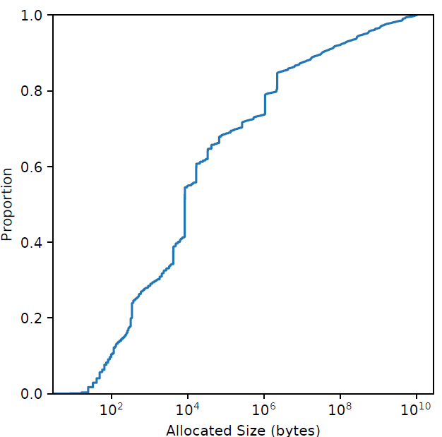

# 从 malloc 效率到整体效率：大页面感知的内存分配器

**摘要**

在仓库规模下，内存分配代表着巨大的计算成本，对其进行优化可以节省大量的计算成本。一种经典方法是提高分配器的效率，最大限度地减少**分配器代码**中花费的 CPU 周期。然而，内存分配决策也通过数据放置影响整个应用程序的性能，通过使用更少的硬件资源完成**更多的应用程序工作单元**，从而提供了提高**整体生产力**的机会。本文，我们关注大页面覆盖率，引入了 TEMERAIRE，它是 TCMALLOC 的大页面感知增强功能，可减少应用程序代码中的 CPU 开销。我们讨论了 TEMERAIRE 的设计和实现，包括大页面感知的内存布局策略，以最大化大页面覆盖率和最小化碎片开销。我们对 8 个应用程序进行了应用研究，每秒请求数 (RPS) 提高了 7.7%，RAM 使用量减少了 2.4%。==我们展示了**fleet 规模** 1% 实验的结果，以及谷歌仓库规模计算机的纵向部署==。这减少了 6% 的 TLB 未命中停顿，由于碎片而浪费的内存减少了 26%。最后，我们讨论了用于改进分配器开发过程的其他技术，以及未来内存分配器的潜在优化策略。

## 1. 简介

仓库级计算机 (WSC) 中的**数据中心税** [[23](#_bookmark59), [41](#_bookmark77)] 是指花费在常见服务开销（如序列化、RPC 通信、压缩、 复制和内存分配）上的累积时间。WSC 工作负载多样性 [[23](#_bookmark59)] 意味着我们通常无法优化单个应用程序来显着提高整体系统效率，因为成本是由许多独立的工作负载承担的。相比之下，专注于**数据中心税**的组成部分可以实现总体性能和效率的显着提高，因为好处可以适用于所有应用。在过去的几年里，我们的团队一直致力于最小化内存分配决策的成本，并取得了很好的效果； 通过显著减少内存分配时间来**提升**系统整体收益。但我们可以优化的不仅仅是组件的这些成本。通过改变分配器来提高应用程序代码的效率，也可以获得显著的好处。本文考虑，如何通过提高**内存分配器提供的大页面覆盖率**来优化应用程序性能。

缓存未命中和 TLB 未命中是现代系统的主要性能开销。在 WSC 中，内存墙 [[44](#_bookmark80)] 很明显：在一次分析中，50% 的周期在内存停滞上 [[23](#_bookmark59)]。分析我们自己的工作负载发现，大约 20% 的周期因 TLB 未命中而停滞。

大页面是处理器的一种功能，可以显着减少 TLB 未命中的数量，从而降低成本 [[26](#_bookmark62)]。大页面的容量越大，同样数量的 TLB 项可以映射更大范围的内存。在研究的系统上，大页面还能减少<u>未命中+填充</u>的总停顿时间，因为它们页表的**表示**需要更少的层来遍历。

虽然分配器不能修改用户代码访问的内存量，甚至不能修改对象的访问模式，但它可以与操作系统合作并控制新分配的位置。**通过优化大页面覆盖率，分配器可以减少 TLB 未命中率**。C 和 C++ 等语言中的内存放置决策还必须**面对这样的后果**：即它们的决策是最终的，对象一旦分配就不能移动 [[11](#_bookmark47)]。分配位置的决策只能在分配点进行优化。这种方法可能会增加内存分配的 CPU 成本，从而**增加**数据中心税，与我们之前（降成本）的工作背道而驰，但通过**减少**其他地方处理器的停顿来弥补。这改进了应用程序的指标**^1^**，例如每秒请求数 (RPS)。

> 1. 虽然减少停顿可以提高 IPC，但 IPC 本身并不能很好地代表 [[3](#_bookmark39)] 我们可以使用固定数量的硬件完成多少有用的应用程序工作。**忙循环自旋锁**具有极高的 IPC，**但在争用下几乎没有用处**。

我们的贡献如下：

- TEMERAIRE 的设计，增强了 TCMALLOC 大页面感知的功能，可减少应用程序中其它代码的 CPU 开销。我们提出了大页面感知的内存布局策略，以最大化大页面覆盖率并最小化碎片开销。
- 在复杂的现实世界应用程序和 WSC 规模中评估 TEMERAIRE。我们测量了在我们的基础架构中运行的 8 个应用，观察到每秒请求数 (RPS) 增加了 7.7%，RAM 使用量减少了 2.4%。将这些技术应用于 Google 的 WSC 中的所有应用程序后，TLB 未命中停顿减少了 6%，由于碎片而浪费的内存减少了 26%。
- 开发过程中优化内存分配器改进的策略：结合使用跟踪、**监控**和仓库规模的实验。

## 2 协调大页（Hugepage） 的挑战

虚拟内存需要通过称为转换后备缓冲区 (TLB) [[7](#_bookmark43)] 的缓存将用户空间地址转换为**物理**地址。TLB 的容量有限，大多数应用程序在使用默认页面大小时，整个 TLB 仅能覆盖总内存的一小部分。现代处理器通过在其 TLB 中支持 **hugepages** 来增加这种覆盖范围。一个完整对齐的大页（x86 上通常 2MiB）只占用一条 TLB 条目。**Hugepages** 通过增加 TLB 的有效容量和减少 TLB 未命中来减少停顿 [[5](#_bookmark41), [26](#_bookmark62)]。

传统的分配器以页面大小的块来管理内存。Transparent Huge Pages (THP) [[4](#_bookmark40)] 提供了一个机会，内核可以利用页表中的大页，**机会性地**覆盖连续的页。从表面上看，内存分配器只需要分配与大页对齐，且大小等于大页的内存块，即可利用此支持。

将内存**释放**回操作系统（仓库规模下，我们有长期运行的工作负载和动态工作周期，因此释放内存是必需的）的内存分配器面临着更加艰巨的挑战。返回非大页面的对齐内存区域，要求内核使用较小的页面来表示剩余的内容，这破坏了内核提供大页的能力，并为剩余使用的页面强加了性能成本。或者，分配器可能会等待整个大页面空闲，然后再将其返回给操作系统。这保留了大页面的覆盖率，但相对于实际使用量可能会显着放大，从而使内存闲置。DRAM 是部署 WSC 的一项重要成本 [[27](#_bookmark63)]。在这个过程中，分配器对外部碎片的管理是很重要的，这些未使用的空间块太小，无法服务于分配请求。例如，考虑 [图 1](#_bookmark3) 中的分配。在这一系列分配之后，有 2 个可用空间单元。要么使用小页面，内存碎片较少但 TLB 条目的使用效率较低，要么使用大页面，TLB 效率高但碎片较多。

| Figure 1: Allocation and deallocation patterns leading to fragmentation |
| :----------------------------------------------------------: |
|               |

**==了解这些策略产生行为==**的用户空间分配器，通过将内存打包在一起分配，以便与大页面边界紧密对齐，有利于使用已分配的大页面，（理想情况下）能以相同的对齐方式返回未使用的内存来配合它们的结果^2^。**Hugepage** 感知的分配器有助于在用户级别管理内存连续性。目标是最大限度地在几乎满的大页面上分配打包的内存，相反，在空的（或更空的）大页面上最小化使用的空间，以便它们可以作为完整的大页面返回给操作系统。这有效地使用了内存，并与内核的透明大页面支持很好地交互。此外，更一致地分配和释放大页面形成了一个正反馈循环：减少内核级别的碎片，提高了未来分配大页的可能性。

> 2. 这很重要，因为支持大页面的内存必须在物理上是连续的。通过返回完整的大页面，我们实际上可以帮助操作系统管理碎片。

## 3 TCMALLOC 概述

**TCMALLOC** 是一种用于大规模应用程序的内存分配器，常见于 WSC 设置中。它显示出强大的性能 [[21](#_bookmark57)]。我们的设计直接建立在 TCMALLOC 的结构之上。

| Figure 2: Organization of memory in TCMALLOC. System mapped memory is broken into (multi-)page *spans*, which are sub-divided into objects of an assigned, fixed *sizeclass*, here 25 KiB. |
| :----------------------------------------------------------: |
|                                          |

[图 2](#_bookmark6) 展示了内存在 TCMALLOC 中的组织结构。对象按大小分开。首先，TCMALLOC 将内存划分为 **spans**，与页面大小对齐^3^。

> 3. 令人困惑的是，TCMALLOC 的**页面大小**参数不一定是系统页面大小。默认配置是使用 8 KiB TCMALLOC**页面**，这是 x86 上的两个（小）虚拟内存页面。


任何内存分配器都应该回答的两个问题定义了 TCMALLOC 的结构：

1. 我们如何选择对象大小和组织元数据以最小化空间开销和碎片？
2. 我们如何可扩展地支持并发分配？

足够大的分配是通过仅包含分配对象的 **span** 来实现的。其他 **span** 包含多个相同大小的较小对象（**sizeclass**）。**小**对象大小边界是 256 KiB。在这个小阈值内，**分配请求**被四舍五入到 100 个大小级别中的一个。TCMALLOC 将对象存储在一系列缓存中，如[图 3](#_bookmark7) 所示。从一个简单的 **pageheap** 分配 **span**，它跟踪所有未使用的页面并进行最佳分配。

|Figure 3: The organization of caches in TCMALLOC; we see memory allocated from the OS to the pageheap, distributed up into spans given to the central caches, to local caches. This paper focuses on a new implementation for the pageheap. |
| :----------------------------------------------------------: |
|               |

Pageheap 还负责在可能的情况下将不再需要的内存返回给操作系统。不是在 `free()` 路径上执行此操作，而是定期调用专用的释放内存方法，旨在维持可配置的、稳定的释放速率（以 MB/s 为单位）。这是一种启发式。TCMALLOC 希望在稳定状态下同时使用尽可能少的内存，避免昂贵的系统分配，而这些分配可能会通过使用先前提供的内存来消除。我们在第 [4.3](#_bookmark16) 节中更详细地讨论了处理这种峰谷分配模式。

理想情况下，TCMALLOC 将返回用户代码**很快**不需要的所有内存。内存需求的变化不可预测，这使得返回未使用的内存同时保留内存以避免系统调用和页面错误变得具有挑战性。关于内存返回策略的更好决策具有很高的价值，在 [7](#_bookmark35) 节中进行了讨论。

TCMALLOC 将首先尝试从**本地**缓存提供分配，就像大多数现代分配器一样 [[9](#_bookmark45),[12](#_bookmark48),[20](#_bookmark56),[39](#_bookmark75) ]。最初这些是同名的**<u>==每线程缓存==</u>**，为不同尺寸的分配存储一个空闲对象列表。为了减少闲置内存并提高高线程应用程序的重用率，TCMALLOC 现在使用**每超线程本地缓存**。当本地缓存没有适合<u>大小</u>的对象来服务请求时（或者在尝试 free() 后有太多对象），请求路由到该<u>大小类</u>的单个**中央缓存**。它有两个组件——一个快速的、受互斥锁保护的**传输缓存**（包含来自该<u>大小类</u>的平面对象数组）和一个大的、受互斥锁保护的**中央空闲列表**，包含分配给该<u>大小类</u>的每个 span；可以从这些 span 中获取或返回对象。当一个 span 中的所有对象都已返回到中央空闲列表中的一个 span 时，该 span 将返回到 **pageheap**。

在我们的 WSC 中，大多数分配都很小（50% 的分配空间是对象≤ 8192 字节），如图 [4](#_bookmark8) 所示。然后将这些聚合到 span 中。pageheap 主要分配 1 或 2 页 span，如图 [5](#_bookmark9) 所示。80% 的 span 小于**大页面**。

| Figure 4: CDF of allocation sizes from WSC applications, weighted by bytes. | Figure 5: CDF of TCMALLOC span sizes from WSC applications, weighted by bytes. |
| ------------------------------------------------------------ | ------------------------------------------------------------ |
|  |  | 

**堆叠**缓存的设计使系统有效地模块化，并且有几个伴随的优点：

- 干净的抽象更容易理解和测试。
- 用全新的实现替换任何一级缓存是相当直接的。
- 如果需要，可以在运行时选择缓存实现，这有利于操作推出和实验。

TCMALLOC 的 pageheap 有一个简单的内存管理接口。

- `New(N)` 分配*N* 页的 span
- `Delete(S`) 释放一个 span (S) 给分配器。
- `Release(N)` 将页面堆缓存的 >= *N* 个未使用页面返回给操作系统。

## 4 TEMERAIRE 的方案

TEMERAIRE，本文对 TCMALLOC 的贡献，用一种尝试最大限度填充（和清空）大页面的设计取代了页面堆（**PageHeap**）。源代码在 Github 上（参见第 [9](#availability)）。**我们开发了启发式方法**，将内存分配密集地<u>==打包==</u>到使用率较高的大页面上，同时形成完全未使用的大页面以返回给操作系统。

我们参考了几个定义。**Slack** 是内存分配请求的大小与下一个整个大页面之间的差距。从操作系统分配的虚拟地址空间是 **==unbacked==** 的，没有分配（或者映射）物理内存。使用时，它是 **backed** 的，由操作系统分配（或映射）物理内存。我们可能会再次向操作系统释放内存，使之 **unbacked**。我们主要在大页面边界内打包，但使用大页面的**区域**来**跨**大页面边界打包分配。

根据我们对`malloc`用法和 **TCMALLOC** 内部的**监控**，以及对内核实现的了解，我们制定了几个关键原则，这些原则促使我们对 TEMERAIRE 的设计做出了如下选择：

**总内存需求随时间不可预测地变化，但并非每次内存分配都被释放**。我们无法控制调用代码，它可能会迅速（并反复）调整其用法； 我们必须对此适应。但是 Pageheap 上的总有大量的内存分配不会被释放（很难预测它们是什么 [[30](#_bookmark66)]）； 任何特定的内存分配都可能立即消失或永远存在，我们必须妥善处理这两种情况。

**完全耗尽大页面意味着以大页面粒度打包内存**。将几乎不为空的大页面返回给操作系统的代价很高（请参阅第 [2](#_bookmark2) 节）。生成空或几乎空的大页面意味着在我们的二进制文件中密集打包**其他**大页面。我们的设计必须能够将内存分配密集地打包到尽可能少的饱和容器中。

虽然我们的目标是只使用大页大小的容器，但 `malloc` 必须支持大于单个大页的内存分配。这些可以正常分配，但我们将较小的内存分配放在分配的 *slack* 中，以实现较高的内存分配密度。只有当小内存分配由 *slack* 主导时，我们才需要将大内存分配依次放置在 *regions* 中。

**耗尽大页面给了我们新的释放决策点**。 当大页面完全变空时，我们可以选择是保留它以供将来分配内存，还是将其返回给操作系统。 在 TCMALLOC 的后台线程释放之前保留它会带来更高的内存开销。返回它可以减少内存使用，但如果重用，则会以系统调用和缺页异常为代价。<u>自适应地做出这个决定使我们能够比后台线程更快地将内存返回给操作系统，同时避免额外的系统调用</u>。

**错误代价高昂，但工作不是**。 很少有内存分配直接接触 PageHeap，但**所有**分配都是通过 PageHeap 支持的。 我们必须只支付一次分配成本； 如果我们做了一个错误的放置并<u>碎片化</u>了一个大页，我们要么付出空间成本，要么付出长时间拆分大页的时间成本。 **如果可以让分配器做出更好的决策，那么放慢分配器的速度是值得的**。

> Figure 6: TEMERAIRE’s components. Arrows represent the flow of requests to interior components.

我们的分配器通过委托给几个子组件来实现其接口，参见 [图 6](#_bookmark11)。 每个组件都根据上述原则构建，==并且每个组件都有自己最擅长处理的分配类型的近似值==。根据原则 #4，我们重视智能布局而不是速度^4^。

> 4. 由于每个操作都持有一个经常竞争的互斥体，我们确实保持了合理的效率：大多数操作都是 *O*(1)，并注意优化常数因子。

虽然 TEMERAIRE 的特定实现与 TCMALLOC 内部联系在一起，但大多数现代分配器共享类似的页面（或更高）粒度的大型后端分配，如 TCMALLOC 的跨度：比较 jemalloc 的**范围**[[20](#_bookmark56)]，Hoard 的**超级块** [[9](#_bookmark45)]，以及 mimalloc 的**页面**[[29](#_bookmark65)]。 Hoard 的 8KB 超级块直接使用 `mmap` 分配，防止大页连续。 这些超级块可以改为密集地打包到大页面上。 mimalloc 将其 64KiB+**页面**放置在**段**中，但这些页面是按线程维护的，这阻碍了进程段之间的密集打包。 急切地将页面返回给操作系统可以最大限度地减少此处的 RAM 成本，但会破坏大页面。 这些分配器还可以受益于类似 TEMERAIRE 的大页面感知分配器^5^。

> 5. 事实上，jemalloc 正在参考 TEMERAIRE 的方法。

### 4.1 整体算法

我们将简要概述整体方法和每个组件的作用，然后详细描述每个组件。目标是最小化生成的 Slack，如果确实生成了 Slack，就像任何页面级碎片一样，将其重新用于其他内存分配。

所有组件的背后是和操作系统交互处理虚拟内存的 `HugeAllocator`。 它为其他组件提供了虚拟地址空间^注1^、**并分配物理内存**。我们还维护了一个称为 `HugeCache`、全空的大页面缓存，用于**缓存物理内存**。

> 注1：只分配了虚拟地址空间

我们保存了一个部分填充的单个大页列表（`HugeFiller`），后续的小内存分配可以密集地填充它们。沿着大页边界进行**打包分配**会导致效率低下，因此我们实现了一个专门的内存分配器 （` hugerregion `）。

TEMERAIRE 使用图 [7](#_bookmark10) 中的算法，根据请求大小将分配决策**定向**到其子组件。 每个子组件都针对不同的分配大小进行了优化。

```c++
Span New(N) {
    // Slack is too small to matter
    if (N >= 1 GiB) return HugeCache.New(N);
    // Help bin-pack a single hugepage
    if (N <= 1 MiB)  return HugeFiller.New(N);
    
    if (N < 2 MiB) {
        // If we can reuse empty space, do so 
        Span s = HugeFiller.TryAllocate(N); 
        if (s != NULL) return s;
    }
    // If we have a region, use it 
    Span s = HugeRegion.TryAllocate(N);
    if (s != NULL) return s;
    
    // We need a new hugepage. 
    s = HugeCache.New(N); 
    HugeFiller.DonateTail(s);
    
    return s;
}
// Figure 7: Allocation flow for subcomponents. Hugepage size is 2 MiB.
```

对于大页面大小的精确倍数的分配，或者那些足够大，以至于 Slack 无法满足的分配，我们直接转发到 `HugeCache`。

中等大小的分配（在 1MiB 和 1GiB 之间）通常也从 HugeCache 分配，最后一步是**捐赠** slack。 例如，来自 `HugeCache` 的 4.5 MiB 分配会产生 1.5 MiB 的 slack，这是一个不可接受的高开销率。 TEMERAIRE 通过假装<u>==请求的最后一个大页面上有一个**前导**分配==</u>，将 slack 部分捐赠给 `HugeFiller`（图 [8](#_bookmark15)）。

| Figure 8: The slack from a large allocation spanning 3 hugepages is “donated” to the HugeFiller. The larger allocation’s tail is treated as a fictitious allocation. |
| :----------------------------------------------------------: |
|                                          |

当释放如此大的 Spam 时，分配器还将虚构的前导分配标记为空闲。 如果 slack 未被使用，它会与其余部分一起返回到尾部大页面。 否则，尾部大页面会留在 `HugeFiller` 中，只有前 *N* − 1 个大页面会返回到 `HugeCache`。

对于某些分配模式，<u>==中等规模的分配产生的 Slack，比我们在严格的 2MiB 容器中用较小的分配所能填补的更多==</u>。例如，许多 1.1MiB 的分配将为每个大页面产生 0.9MiB 的 Slack（参见图 [12](#_bookmark20)）。 检测到这种模式时，`HugeRegion` 分配器会**跨大页面边界**进行分配，以最大限度地减少这种开销。

小请求（<= 1MiB）始终由 `HugeFiller` 提供。 对于 1MiB 和大页面之间的分配请求，我们评估了几个选项：

1. 我们**尝试** `HugeFiller`：如果有可用空间，我们会使用它，并乐于填充大部分空白的页面。
2. 如果 `HugeFiller` 不能满足这些请求，我们接下来考虑 `HugeRegion`； 如果有 Region 可以满足请求，那就会这么做。如果不存在这样的 Region（或者它们都太满了），我们会考虑分配一个 Region，但前提是，检测到 Slack 分配与小分配的比例很高。如下所述。
3. 否则，我们从 `HugeCache` 中分配一个完整的大页面。 这会产生 **Slack**，但我们预计它将被未来的分配填补。

在 TEMERAIRE 中，我们做了一个设计选择，即关注大页面以下的外部碎片，基本上根本不会超过它（参阅第 [4.5](#_bookmark19)节的例外情况）。

例如，一个系统有 单个 1 GiB 空闲范围和一个具有 512 个不连续的空闲大页面的 TEMERAIRE 处理得同样好。 在任何一种情况下，分配器（通常）会将所有未使用的空间返回给操作系统； 在任何一种情况下，1 GiB 的新分配都需要内存故障。 在碎片化的场景中，我们需要在新的虚拟内存上这样做。 浪费未被实时分配占用且不消耗物理内存的虚拟地址范围不是问题，因为对于 64 位地址空间，虚拟内存实际上是免费的。

例如，对于一个只有1 GiB空闲页的系统和一个有512个不连续的空闲巨大页的系统，TEMERAIRE同样可以很好地处理。在这两种情况下，分配器都会(通常)将所有未使用的空间返回给操作系统。在这两种情况下，重新分配1 GiB内存都需要发生异常。在碎片场景中，我们需要在新的虚拟内存上执行此操作。由于64位地址空间实际上是空闲的，因此不需要担心动态分配中未占用的虚拟地址范围的浪费，也不需要消耗物理内存。


