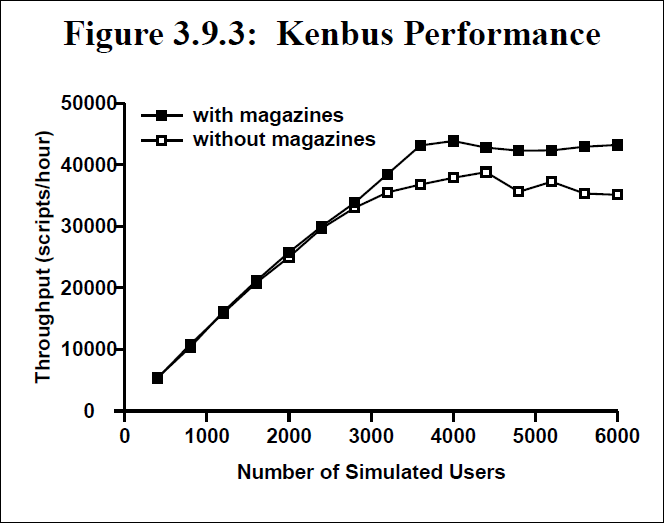

# Magazines and Vmem: Extending the Slab Allocator to Many CPUs and Arbitrary Resources

**Abstract**

The slab allocator [Bonwick94] provides efficient object caching but has two significant limitations: its global locking doesn’t scale to many CPUs, and the allocator can’t manage resources other than kernel memory. To provide scalability we introduce a per−processor caching scheme called the *magazine layer* that provides linear scaling to any number of CPUs. To support more general resource allocation we introduce a new virtual memory allocator, *vmem*, which acts as a universal backing store for the slab allocator. Vmem is a complete general−purpose resource allocator in its own right, providing several important new services; it also appears to be the first resource allocator that can satisfy arbitrary−size allocations in constant time. Magazines and vmem have yielded performance gains exceeding 50% on system−level benchmarks like LADDIS and SPECweb99.

We ported these technologies from kernel to user context and found that the resulting *libumem* outperforms the current best−of−breed user−level memory allocators. libumem also provides a richer programming model and can be used to manage other user−level resources.

## 1. Introduction

The slab allocator [Bonwick94] has taken on a life of its own since its introduction in these pages seven years ago. Initially deployed in Solaris 2.4, it has since been adopted in whole or in part by several other operating systems including Linux, FreeBSD, NetBSD, OpenBSD, EROS, and Nemesis. It has also been adapted to applications such as BIRD and Perl. Slab allocation is now described in several OS textbooks [Bovet00, Mauro00, Vahalia96] and is part of the curriculum at major universities worldwide.

Meanwhile, the Solaris slab allocator has continued to evolve. It now provides per−CPU memory allocation, more general resource allocation, and is available as a user−level library. We describe these developments in seven sections as follows:

**§2. Slab Allocator Review**. We begin with brief review of the original slab allocator.

**§3. Magazines: Per−CPU Memory Allocation**. As servers with many CPUs became more common and memory latencies continued to grow relative to processor speed, the slab allocator’s original locking strategy became a performance bottleneck. We addressed this by introducing a per−CPU caching scheme called the *magazine layer.*

**§4. Vmem: Fast, General Resource Allocation**. The slab allocator caches relatively small objects and relies on a more general−purpose backing store to provide slabs and satisfy large allocations. We describe a new resource allocator, *vmem*, that can manage arbitrary sets of integers − anything from virtual memory addresses to minor device numbers to process IDs. Vmem acts as a universal backing store for the slab allocator, and provides powerful new interfaces to address more complex resource allocation problems. Vmem appears to be the first resource allocator that can satisfy allocations and frees of any size in guaranteed constant time.

**§5. Vmem−Related Slab Allocator Improvements**. We describe two key improvements to the slab allocator itself: it now provides object caching for *any* vmem arena, and can issue *reclaim callbacks* to notify clients when the arena’s resources are running low.

**§6. libumem: A User−Level Slab Allocator**. We describe what was necessary to transplant the slab allocator from kernel to user context, and show that the resulting *libumem* outperforms even the current best−of−breed multithreaded user−level allocators.

**§7. Conclusions**. We conclude with some observa− tions about how these technologies have influenced Solaris development in general.

## 2. Slab Allocator Review

### 2.1. Object Caches
Programs often cache their frequently used objects to improve performance. If a program frequently allocates and frees `foo` structures, it is likely to employ highly optimized `foo_alloc()` and `foo_free()` routines to **avoid the overhead of malloc**. The usual strategy is to cache `foo` objects on a simple freelist so that most allocations and frees take just a handful of instructions. Further optimization is possible if `foo` objects naturally return to a partially initialized state before they’re freed, in which case `foo_alloc()` can assume that an object on the freelist is already partially initialized.

We refer to the techniques described above as *object caching.* Traditional malloc implementations cannot provide object caching because the malloc/free interface is typeless, so the slab allocator introduced an explicit object cache programming model with interfaces to create and destroy object caches, and allocate and free objects from them (see Figure 2.1).

```c
// Figure 2.1: Slab Allocator Interface Summary
kmem_cache_t *kmem_cache_create(
    char *name,                    /* descriptive name for this cache */
    size_t size,                   /* size of the objects it manages */
    size_t align,                  /* minimum object alignment */ 
    int (*constructor)(void *obj, void *private, int kmflag),
    void (*destructor)(void *obj, void *private),
    void (*reclaim)(void *private), /* memory reclaim callback */
    void *private,                  /* argument to the above callbacks */
    vmem_t *vmp,                    /* vmem source for slab creation */
    int cflags);                    /* cache creation flags */

/*
Creates a cache of objects, each of size size, aligned on an align boundary. name identifies the cache for statistics and debugging. constructor and destructor convert plain memory into objects and back again; constructor may fail if it needs to allocate memory but can’t. reclaim is a callback issued by the allocator when system−wide resources are running low (see §5.2). private is a parameter passed to the constructor, destructor and reclaim callbacks to support parameterized caches (e.g. a separate packet cache for each instance of a SCSI HBA driver). vmp is the *vmem source* that provides memory to create slabs (see §4 and §5.1). cflags indicates special cache properties. kmem_cache_create() returns an opaque pointer to the object cache (a.k.a. *kmem cache*).
*/

void kmem_cache_destroy(kmem_cache_t *cp);
/*Destroys the cache and releases all associated resources. All allocated objects must have been freed.*/

void *kmem_cache_alloc(kmem_cache_t *cp, int kmflag);
/*Gets an object from the cache. The object will be in its constructed state. kmflag is either KM_SLEEP or KM_NOSLEEP, indicating whether it’s acceptable to wait for memory if none is currently available.*/

void kmem_cache_free(kmem_cache_t *cp, void *obj);
/*Returns an object to the cache. The object must be in its constructed state.*/
```

The allocator and its clients cooperate to maintain an object’s partially initialized, or *constructed*, state. The allocator guarantees that an object will be in this state when allocated; the client guarantees that it will be in this state when freed. Thus, we can allocate and free an object many times without destroying and reinitializing its locks, condition variables, reference counts, and other invariant state each time.

### 2.2. Slabs

A *slab* is one or more pages of virtually contiguous memory, carved up into equal−size chunks, with a reference count indicating how many of those chunks are currently allocated. To create new objects the allocator creates a slab, applies the *constructor* to each chunk, and adds the resulting objects to the cache. If system memory runs low the allocator can reclaim any slabs whose reference count is zero by applying the *destructor* to each object and returning memory to the VM system. Once a cache is populated, allocations and frees are very fast: they just move an object to or from a freelist and update its slab reference count.

## 3. Magazines

> “Adding per−CPU caches to the slab algorithm would provide an excellent allocator.”
>
> Uresh Vahalia, *UNIX Internals: The New Frontiers*

The biggest limitation of the original slab allocator is that it lacks multiprocessor scalability. To allocate an object the allocator must acquire the lock that protects the cache’s slab list, thus serializing all allocations. To allow all CPUs to allocate in parallel we need some form of per−CPU caching.

Our basic approach is to give each CPU an M−element cache of objects called a *magazine*, by analogy with automatic weapons. Each CPU’s magazine can satisfy M allocations before the CPU needs to *reload* – that is, exchange its empty magazine for a full one. The CPU doesn’t access any global data when allocating from its magazine, so we can increase scalability arbitrarily by increasing the magazine size (M).

In this section we describe how the magazine layer works and how it performs in practice. Figure 3 (below) illustrates the key concepts.


### 3.1 Overview

A *magazine* is an M−element array of pointers to objects^1^ with a count of the number of *rounds* (valid pointers) currently in the array. Conceptually, a magazine works like a stack. To allocate an object from a magazine we pop its top element:

> ^1^We use an array of object pointers, rather than just linking objects together on a freelist, for two reasons: first, freelist linkage would overwrite an object’s constructed state; and second, we plan to use the slab allocator to manage arbitrary resources, so we can’t assume that the objects we’re managing are backed by writable memory.

```
obj = magazine[--rounds];
```

To free an object to a magazine we push it on top:

```
magazine[rounds++] = obj;
```

We use magazines to provide each object cache with a small per−CPU object supply. Each CPU has its own *loaded magazine,* so transactions (allocations and frees) can proceed in parallel on all CPUs.

The interesting question is what to do if the loaded magazine is empty when we want to allocate an object (or full when we want to free one). We cannot just fall through to the slab layer, because then a long run of allocations would miss in the CPU layer every time, ruining scalability. Each object cache therefore keeps a global stockpile of magazines, the *depot*, to replenish its CPU layer. We refer to the CPU and depot layers collectively as the *magazine layer*.

With M−round magazines we would intuitively expect the CPU layer’s miss rate to be at most 1/M, but in fact a tight loop of two allocations followed by two frees can cause **thrashing**, with half of all transactions accessing the globally−locked depot *regardless of M*, as shown in Figure 3.1a below.


We address this by keeping the *previously loaded magazine* in the CPU layer, as shown in Figure 3 (previous page). If the loaded magazine cannot satisfy a transaction but the previous magazine can, we exchange *loaded* with *previous* and try again. If neither magazine can satisfy the transaction, we return *previous* to the depot, move *loaded* to *previous*, and load a new magazine from the depot.

The key observation is that the only reason to load a new magazine is to replace a full with an empty or vice versa, so we know that after each reload the CPU either has a full *loaded magazine* and an empty *previous magazine* or vice versa. The CPU can therefore satisfy at least M allocations *and* at least M frees entirely with CPU−local magazines before it must access the depot again, so the CPU layer’s worst−case miss rate is bounded by 1/M regardless of workload.

In the common case of short−lived objects with a high allocation rate there are two performance advantages to this scheme. First, balanced alloc/free pairs on the same CPU can almost all be satisfied by the loaded magazine; therefore we can expect the actual miss rate to be even lower than 1/M. Second, the LIFO nature of magazines implies that we tend to reuse the same objects over and over again. This is advantageous in hardware because the CPU will already own the cache lines for recently modified memory.

Figure 3.1b (next page) summarizes the overall magazine algorithm in pseudo−code. Figure 3.1c shows the actual code for the hot path (i.e. hitting in the loaded magazine) to illustrate how little work is required.

> **Figure 3.1b: The Magazine Algorithm** The allocation and free paths through the magazine layer are almost completely symmetric, as shown below. The only asymmetry is that the free path is responsible for populating the depot with empty magazines, as explained in §3.3.
>
> ```
> Alloc:
> if (the CPU's loaded magazine isn't empty)
>    pop the top object and return it;
> 
> if (the CPU's previous magazine is full)
>    exchange loaded with previous,
>    goto Alloc;
> 
> if (the depot has any full magazines)
>    return previous to depot,
>    move loaded to previous,
>    load the full magazine,
>    goto Alloc;
> 
> 
> 
> allocate an object from the slab layer,
> apply its constructor, and return it;
> ```
>
> ```
> Free:
> if (the CPU's loaded magazine isn't full)
>    push the object on top and return;
> 
> if (the CPU's previous magazine is empty)
>    exchange loaded with previous,
>    goto Free;
> 
> if (the depot has any empty magazines)
>    return previous to depot,
>    move loaded to previous,
>    load the empty magazine,
>    goto Free;
> 
> if (an empty magazine can be allocated)
>    put it in the depot and goto Free;
> 
> apply the object's destructor
> and return it to the slab layer
> ```
>
> **Figure 3.1c: The Hot Path in the Magazine Layer**
> ``` c++
> void *
> kmem_cache_alloc(kmem_cache_t *cp, int kmflag)
> {
>        kmem_cpu_cache_t *ccp = &cp->cache_cpu[CPU->cpu_id];
>     
>        mutex_enter(&ccp->cc_lock);
>        if (ccp->cc_rounds > 0) {
>            kmem_magazine_t *mp = ccp->cc_loaded;
>            void *obj = mp->mag_round[--ccp->cc_rounds];
>            mutex_exit(&ccp->cc_lock);
>            return (obj);
>        }
>        //...
> }
> /*-------------------------------------*/
> void
> kmem_cache_free(kmem_cache_t *cp, void *obj)
> {
>        kmem_cpu_cache_t *ccp = &cp->cache_cpu[CPU->cpu_id];
>     
>        mutex_enter(&ccp->cc_lock);
>        if (ccp->cc_rounds < ccp->cc_magsize) {
>            kmem_magazine_t *mp = ccp->cc_loaded;
>            mp->mag_round[ccp->cc_rounds++] = obj;
>            mutex_exit(&ccp->cc_lock);
>            return;
>        }
>        //...    
> }
> ```

### 3.2. Object Construction

The original slab allocator applied constructors at slab creation time. This can be wasteful for objects whose constructors allocate additional memory. To take an extreme example, suppose an 8−byte object’s constructor attaches a 1K buffer to it. Assuming 8K pages, one slab would contain about 1000 objects, which after construction would consume 1MB of memory. If only a few of these objects were ever allocated, most of that 1MB would be wasted.

We addressed this by moving object construction up to the magazine layer and keeping only raw buffers in the slab layer. Now a buffer becomes an object (has its constructor applied) when it moves from the slab layer up to the magazine layer, and an object becomes a raw buffer (has its destructor applied) when it moves from the magazine layer back down to the slab layer.

### 3.3. Populating the Magazine Layer

We have described how the magazine layer works once it’s populated, but how does it *get* populated?

There are two distinct problems here: we must allocate objects, and we must allocate magazines to hold them.

-   **Object allocation**. In the allocation path, if the depot has no full magazines, we allocate a single object from the slab layer and construct it.
-   **Magazine allocation**. In the free path, if the **depot** has no empty magazines, we allocate one.

We never allocate full magazines explicitly, because it’s not necessary: empty magazines are eventually filled by frees, so it suffices to create empty magazines and let full ones emerge as a side effect of normal allocation/free traffic.

We allocate the magazines themselves (i.e. the arrays of pointers) from object caches, just like everything else; there is no need for a special magazine allocator^2^.

> ^2^Note that if we allocated full magazines in the allocation path, this would cause infinite recursion the first time we tried to allocate a magazine for one of the magazine caches. There is no such problem with allocating empty magazines in the free path.

### 3.4. Dynamic Magazine Resizing

Thus far we have discussed M−element magazines without specifying how M is determined. We’ve observed that we can make the CPU layer’s miss rate as low as we like by increasing M, but making M larger than necessary would waste memory. We therefore seek the smallest value of M that delivers linear scalability.

Rather than picking some “magic value,” we designed the magazine layer to tune itself dynamically. We start each object cache with a small value of M and observe the contention rate on the depot lock. We do this by using a non−blocking `trylock` primitive on the depot lock; if that fails we use the ordinary blocking lock primitive and increment a contention count. If the contention rate exceeds a fixed threshold we increase the cache’s magazine size. We enforce a maximum magazine size to ensure that this feedback loop can’t get out of control, but in practice the algorithm behaves extremely well on everything from desktops to 64−CPU Starfires. The algorithm generally stabilizes after several minutes of load with reasonable magazine sizes and depot lock contention rates of less than once per second.

### 3.5. Protecting Per−CPU State

An object cache’s CPU layer contains per−CPU state that must be protected either by per−CPU locking or by disabling interrupts. We selected per−CPU locking for several reasons:

-   **Programming Model**. Some operations, such as changing a cache’s magazine size, require the allocator to modify the state of each CPU. This is trivial if the CPU layer is protected by locks.
-   **Real−time**. Disabling interrupts increases dispatch latency (because it disables preemption), which is unacceptable in a real−time operating system like Solaris [Khanna92].
-   **Performance**. On most modern processors, grabbing an uncontended lock is cheaper than modifying the processor interrupt level.

### 3.6. Hardware Cache Effects

Even per−CPU algorithms don’t scale if they suffer from *false sharing* (contention for ownership of a cache line that can occur when multiple CPUs modify logically unrelated data that happens to reside in the same physical cache line). We carefully pad and align the magazine layer’s per−CPU data structures so that each one has its own cache line. We found that doing so is *critical* for linear scalability on modern hardware.

An allocator can also *induce* false sharing by handing out objects smaller than a cache line to more than one CPU [Berger00]. We haven’t found this to be a problem in practice, however, because most kernel data structures are larger than a cache line.

### 3.7. Using the Depot as a Working Set

When the system is in steady state, allocations and frees must be roughly in balance (because memory usage is roughly constant). The variation in memory consumption over a fixed period of time defines a form of working set [Denning68]; specifically, it defines how many magazines the depot must have on hand to keep the allocator working mostly out of its high−performance magazine layer. For example, if the depot’s full magazine list varies between 37 and 47 magazines over a given period, then the working set is 10 magazines; the other 37 are eligible for reclaiming.

The depot continuously tracks the working set sizes of its full and empty magazine lists, but does not actually free excess magazines unless memory runs low.

### 3.8. Microbenchmark Performance

The two key metrics for an MT−hot memory allocator are latency and scalability. We measured latency as the average time per iteration of a tight alloc/free loop. We measured scalability by running multiple instances of the latency test on a 333MHz 16−CPU Starfire.

The latency test revealed that the magazine layer improves even single−CPU performance (356ns per alloc/free pair vs. 743ns for the original slab allocator) because the hot path is so simple (see Figure 3.1c). Indeed, there is little room for further improvement in latency because the cost of locking imposes a lower bound of 186ns.

As we increased the number of threads the magazine layer exhibited perfect linear scaling, as shown below. Without the magazine layer, throughput was actually *lower* with additional threads due to increasingly pathological lock contention. With 16 threads (all 16 CPUs busy) the magazine layer delivered 16 times higher throughput than a single CPU (and 340 times higher throughput than the original allocator), with the same 356ns latency.


### 3.9. System−Level Performance
We ran several system−level benchmarks both with and without the magazine layer to assess the magazine layer’s effectiveness^3^. The system was uniformly faster with magazines, with the greatest improvements in allocator−intensive workloads like network I/O.

> ^3^ Unfortunately we could not make direct comparisons with other kernel memory allocators because the Solaris kernel makes extensive use of the object cache interfaces, which are simply not available in other allocators. We will, however, provide direct comparisons with best−of−breed user−level allocators in §6.

#### 3.9.1 SPECweb99
We ran the industry−standard SPECweb99 web server benchmark [SPEC01] on an 8−CPU E4500. The magazine layer more than *doubled* performance, from 995 to 2037 simultaneous connections. The gain is so dramatic because every network packet comes from the allocator.

#### 3.9.2 TPC−C
We ran the industry−standard TPC−C database benchmark [TPC01] on an 8−CPU E6000. Magazines improved performance by 7%. The gain here is much more modest than with SPECweb99 because TPC−C is not very demanding of the kernel memory allocator.

##### 3.9.3 Kenbus
We ran Kenbus, a precursor to the SPEC SMT (**S**ystem **M**ulti**−T**asking) benchmark currently under development [SPEC01], on a 24−CPU E6000. The magazine layer improved peak throughput by 13% and improved the system’s ability to *sustain* peak throughput as load increased. At maximum tested load (6000 users) the magazine layer improved system throughput by 23%.


### 3.10. Summary
The magazine layer provides efficient object caching with very low latency and linear scaling to any number of CPUs. We discussed the magazine layer in the context of the slab allocator, but in fact the algorithms are completely general. A magazine layer can be added to *any* memory allocator to make it scale.


## 4. Vmem

The slab allocator relies on two lower−level system services to create slabs: a virtual address allocator to provide kernel virtual addresses, and VM routines to back those addresses with physical pages and establish virtual−to−physical translations.

Incredibly, we found that our largest systems were scalability−limited by the old virtual address allocator. It tended to fragment the address space badly over time, its latency was linear in the number of fragments, and the whole thing was single−threaded.

Virtual address allocation is just one example of the more general problem of *resource allocation*. For our purposes, a *resource* is anything that can be described by a set of integers. For example, virtual addresses are subsets of the 64−bit integers; process IDs are subsets of the integers [0, 30000]; and minor device numbers are subsets of the 32−bit integers.

Resource allocation (in the sense described above) is a fundamental problem that every operating system must solve, yet it is surprisingly absent in the literature. It appears that 40 years of research on memory allocators has simply never been applied to resource allocators. The resource allocators for Linux, all the BSD kernels, and Solaris 7 or earlier all use linear−time algorithms.

In this section we describe a new general−purpose resource allocator, *vmem*, which provides guaranteed constant−time performance with low fragmentation. Vmem **appears to be** the first resource allocator that can do this.

We begin by providing background on the current state of the art. We the	n lay out our objectives in creating vmem, describe the vmem interfaces, explain the implementation in detail, and discuss vmem’s performance (fragmentation, latency, and scalability) under both benchmarks and real−world conditions.

### 4.1. Background

Almost all versions of Unix have a *resource map allocator* called `rmalloc()` [Vahalia96]. A resource map can be any set of integers, though it’s most often an address range like [0xe0000000, 0xf0000000). The interface is simple: `rmalloc(map, size)` allocates a segment of the specified size from map, and `rmfree(map, size, addr)` gives it back.

Linux’s *resource allocator* and BSD’s *extent allocator* provide roughly the same services. All three suffer from serious flaws in both design and implementation:

-   **Linear−time performance**. All three allocators maintain a list of **free segments**, sorted in address order so the allocator can detect when *coalescing* is possible: if segments [a, b) and [b, c) are both free, they can be merged into a single free segment [a, c) to reduce fragmentation. The allocation code performs a linear search to find a segment large enough to satisfy the allocation. The free code uses insertion sort (also a linear algorithm) to return a segment to the free segment list. It can take several *milliseconds* to allocate or free a segment once the resource becomes fragmented.
-   **Implementation exposure**. A resource allocator needs data structures to keep information about its free segments. In various ways, all three allocators make this *your problem:*
    -   `rmalloc()` requires the creator of the resource map to specify the maximum possible number of free segments at map creation time. If the map ever gets more fragmented than that, the allocator throws away resources in `rmfree()` because it has nowhere to put them. (!)
    -   Linux puts the burden on its *clients* to supply **a segment structure** with each allocation to hold the allocator’s internal data. (!)
    -   BSD allocates segment structures dynamically, but in so doing creates an awkward failure mode: `extent_free()` fails if it can’t allocate a segment structure. It’s difficult to deal with an allocator that won’t let you give stuff back.

We concluded that **it was time to abandon our stone tools** and bring modern technology to the problem.

### 4.2. Objectives

We believe a good resource allocator should have the following properties:

-   A powerful interface that can cleanly express the most common resource allocation problems.
-   Constant−time performance, regardless of the size of the request or the degree of fragmentation.
-   Linear scalability to any number of CPUs.
-   Low fragmentation, even if the operating system runs at full throttle for *years*.

We’ll begin by discussing the interface considerations, then drill down to the implementation details.

### 4.3. Interface Description

The vmem interfaces do three basic things: create and destroy *arenas* to describe resources, allocate and free resources, and allow arenas to *import* new resources dynamically. This section describes the key concepts and the rationale behind them. Figure 4.3 (next page) provides the complete vmem interface specification.

#### 4.3.1 Creating Arenas

The first thing we need is the ability to define a resource collection, or *arena*. An arena is simply a set of integers. Vmem arenas most often represent virtual memory addresses (hence the name *vmem*), but in fact they can represent any integer resource, from virtual addresses to minor device numbers to process IDs.

The integers in an arena can usually be described as a single contiguous range, or *span*, such as [100, 500), so we specify this *initial span* to vmem_create(). For discontiguous resources we can use vmem_add() to piece the arena together one span at a time.

- **Example**. To create an arena to represent the integers in the range [100, 500) we can say:

  `foo = vmem_create(“foo”, 100, 400, ...);`

  (Note: 100 is the start, 400 is the size.) If we want `foo` to represent the integers [600, 800) as well, we can add the span [600, 800) by using vmem_add():
  
  `vmem_add(foo, 600, 200, VM_SLEEP);`

`vmem_create()` specifies the arena’s natural unit of currency, or *quantum*, which is typically either 1 (for single integers like process IDs) or `PAGESIZE` (for virtual addresses). Vmem rounds all sizes to quantum multiples and guarantees quantum−aligned allocations.

#### 4.3.2 Allocating and Freeing Resources

The primary interfaces to allocate and free resources are simple: `vmem_alloc(vmp, size, vmflag)` allocates a *segment* of size bytes from arena `vmp`, and `vmem_free(vmp, addr, size)` gives it back.

We also provide a `vmem_xalloc()` interface that can specify common *allocation constraints: alignment*, *phase* (offset from the alignment), *address range*, and *boundary−crossing restrictions* (e.g. “don’t cross a page boundary”). `vmem_xalloc()` is useful for things like kernel DMA code, which allocates kernel virtual addresses using the phase and alignment constraints to ensure correct cache coloring.

- **Example**. To allocate a 20−byte segment whose address is 8 bytes away from a 64−byte boundary, and which lies in the range [200, 300), we can say:

  `addr = vmem_xalloc(foo, 20, 64, 8, 0, 200, 300, VM_SLEEP);`

  In this example addr will be 262: it is 8 bytes away from a 64−byte boundary (262 mod 64 = 8), and the segment [262, 282) lies within [200, 300).

Each `vmem_[x]alloc()` can specify one of three *allocation policies* through its `vmflag` argument:

-   **VM_BESTFIT**. Directs vmem to use the smallest free segment that can satisfy the allocation. This policy tends to minimize fragmentation of very small, precious resources.
-   **VM_INSTANTFIT**. Directs vmem to provide a good approximation to best−fit in guaranteed constant time. This is the default allocation policy.
-   **VM_NEXTFIT**. Directs vmem to use the next free segment after the one previously allocated. This is useful for things like process IDs, where we want to cycle through all the IDs before reusing them.

We also offer ==an arena−wide allocation policy== called *quantum caching*. The idea is that most allocations are for just a few quanta (e.g. one or two pages of heap or one minor device number), so we employ high− performance caching for each multiple of the quantum up to qcache_max, specified in `vmem_create()`. We make the caching threshold explicit so that each arena can request the amount of caching appropriate for the resource it manages. Quantum caches provide *perfect−fit*, very low latency, and linear scalability for the most common allocation sizes (§4.4.4).

#### 4.3.3  Importing From Another Arena

Vmem allows one arena to *import* its resources from another. vmem_create() specifies the *source arena*, and the functions to allocate and free from that source. The arena imports new spans as needed, and gives them back when all their segments have been freed.

The power of importing lies in the *side effects* of the import functions, and is best understood by example. In Solaris, the function `segkmem_alloc()` invokes `vmem_alloc()` to get a virtual address and then backs it with physical pages. Therefore, we can create an arena of mapped pages by simply importing from an arena of virtual addresses using `segkmem_alloc()` and `segkmem_free()`. Appendix A illustrates how vmem’s import mechanism can be used to create complex resources from simple building blocks.

```c
/* Figure 4.3: Vmem Interface Summary */
vmem_t *vmem_create(
    char *name,                              /* descriptive name */
    void *base,                              /* start of initial span */
    size_t size,                             /* size of initial span */
    size_t quantum,                          /* unit of currency */
    void *(*afunc)(vmem_t *, size_t, int),   /* import alloc function */ 
    void (*ffunc)(vmem_t *, void *, size_t), /* import free function */ 
    vmem_t *source,                          /* import source arena */
    size_t qcache_max,                       /* maximum size to cache */
    int vmflag);                             /* VM_SLEEP or VM_NOSLEEP */
/** Creates a vmem arena called name whose initial span is [base, base + size). The arena’s natural unit of currency is quantum, so vmem_alloc() guarantees quantum−aligned results. The arena may import new spans by invoking afunc on source, and may return those spans by invoking ffunc on source. Small allocations are common, so the arena provides high−performance caching for each integer multiple of quantum up to qcache_max. vmflag is either VM_SLEEP or VM_NOSLEEP depending on whether the caller is willing to wait for memory to create the arena. vmem_create() returns an opaque pointer to the arena.*/

void vmem_destroy(vmem_t *vmp);
/** Destroys arena vmp.*/

void *vmem_alloc(vmem_t *vmp, size_t size, int vmflag);
/** Allocates size bytes from vmp. Returns the allocated address on success, NULL on failure. vmem_alloc() fails only if vmflag specifies VM_NOSLEEP and no resources are currently available. vmflag may also specify an allocation policy (VM_BESTFIT, VM_INSTANTFIT, or VM_NEXTFIT) as described in §4.3.2. If no policy is specified the default is VM_INSTANTFIT, which provides a good approximation to best−fit in guaranteed constant time.*/

void vmem_free(vmem_t *vmp, void *addr, size_t size);
/** Frees size bytes at addr to arena vmp.*/

void *vmem_xalloc(vmem_t *vmp, size_t size, size_t align, size_t phase, 
                  size_t nocross, void *minaddr, void *maxaddr, int vmflag);
/** Allocates size bytes at offset phase from an align boundary such that the resulting segment [addr, addr + size) is a subset of [minaddr, maxaddr) that does not straddle a nocross− aligned boundary. vmflag is as above. One performance caveat: if either minaddr or maxaddr is non−NULL, vmem may not be able to satisfy the allocation in constant time. If allocations within a given [minaddr, maxaddr) range are common it is more efficient to declare that range to be its own arena and use unconstrained allocations on the new arena.*/

void vmem_xfree(vmem_t *vmp, void *addr, size_t size);
/** Frees size bytes at addr, where addr was a constrained allocation. vmem_xfree() must be used if the original allocation was a vmem_xalloc() because both routines bypass the quantum caches.*/

void *vmem_add(vmem_t *vmp, void *addr, size_t size, int vmflag);
/** Adds the span [addr, addr + size) to arena vmp. Returns addr on success, NULL on failure. vmem_add() will fail only if vmflag is VM_NOSLEEP and no resources are currently available.*/
```

### 4.4.  Vmem Implementation

In this section we describe how vmem actually works. Figure 4.4 illustrates the overall structure of an arena.

#### 4.4.1 Keeping Track of Segments

> “Apparently, too few researchers realized the full significance of Knuth’s invention of boundary tags.”
>
> Paul R. Wilson et. al. in [Wilson95]

Most implementations of malloc() prepend a small amount of space to each buffer to hold information for the allocator. These *boundary tags*, invented by Knuth in 1962 [Knuth73], solve two major problems:

-   They make it easy for `free()` to determine how large the buffer is, because `malloc()` can store the size in the boundary tag.
-   They make coalescing trivial. Boundary tags link all segments together in address order, so `free()` can simply look both ways and coalesce if either neighbor is free.

Unfortunately, resource allocators can’t use traditional boundary tags because the resource they’re managing may not be memory (and therefore may not be able to hold information). In vmem we address this by using *external boundary tags*. For each segment in the arena we allocate a boundary tag to manage it, as shown in Figure 4.4 below. (See Appendix A for a description of how we allocate the boundary tags themselves.) We’ll see shortly that external boundary tags enable constant−time performance.

<p align="center">
<B>Figure 4.4: Structure of a Vmem Arena</B> vmem_alloc() vectors allocations based on size: small allocations go to the quantum caches, larger ones to the segment list. In this figure we’ve depicted an arena with a 1−page quantum and a 5−page qcache_max. Note that the “segment list” is, strictly speaking, a list of boundary tags (“BT” below) that represent the segments. Boundary tags for allocated segments (white) are also linked into an allocated−segment hash table, and boundary tags for free segments (gray) are linked into size−segregated freelists (not shown).<br>

</p>

#### 4.4.2 Allocating and Freeing Segments

Each arena has a *segment list* that links all of its segments in address order, as shown in Figure 4.4. Every segment also belongs to either a freelist or an allocation hash chain, as described below. (The arena’s segment list also includes *span markers* to keep track of span boundaries, so we can easily tell when an imported span can be returned to its source.)

We keep all free segments on power−of−two freelists; that is, freelist[n] contains all free segments whose sizes are in the range [2^n^, 2^n+1^). To allocate a segment we search the appropriate freelist for a segment large enough to satisfy the allocation. This approach, called *segregated fit,* actually approximates *best−fit* because *any* segment on the chosen freelist is a *good* fit [Wilson95]. (Indeed, with power−of−two freelists, a segregated fit is necessarily within 2x of a *perfect fit.*) Approximations to best−fit are appealing because they exhibit low fragmentation in practice for a wide variety of workloads [Johnstone97].

The algorithm for selecting a free segment depends on the allocation policy specified in the flags to `vmem_alloc()` as follows; in all cases, assume that the allocation size lies in the range [2^n^, 2^n+1^):

-   **VM_BESTFIT**. Search for the smallest segment on freelist[n] that can satisfy the allocation.
-   **VM_INSTANTFIT**. If the size is exactly 2^n^, take the first segment on freelist[n]. Otherwise, take the first segment on freelist[n+1]. Any segment on this freelist is necessarily large enough to satisfy the allocation, so we get constant−time performance with a reasonably good fit^4^.
-   **VM_NEXTFIT**. Ignore the freelists altogether and search the arena for the next free segment after the one previously allocated.

> ^4^We like instant−fit because it guarantees constant time performance, provides low fragmentation in practice, and is easy to implement. There are many other techniques for choosing a suitable free segment in reasonable (e.g. logarithmic) time, such as keeping all free segments in a size−sorted tree; see [Wilson95] for a thorough survey. Any of these techniques could be used for a vmem implementation.

Once we’ve selected a segment, we remove it from its freelist. If the segment is not an exact fit we split the segment, create a boundary tag for the remainder, and put the remainder on the appropriate freelist. We then add our newly−allocated segment’s boundary tag to a hash table so `vmem_free()` can find it quickly.

`vmem_free()` is straightforward: it looks up the segment’s boundary tag in the allocated−segment hash table, removes it from the hash table, tries to coalesce the segment with its neighbors, and puts it on the appropriate freelist. All operations are constant−time. Note that the hash lookup also provides a cheap and effective **sanity check**: the freed address must be in the hash table, and the freed size must match the segment size. This helps to catch bugs such as duplicate frees.

The key feature of the algorithm described above is that its performance is independent of both transaction size *and* arena fragmentation. Vmem appears to be the first resource allocator that can perform allocations and frees of any size in guaranteed constant time.

#### 4.4.3  Locking Strategy

For simplicity, we protect each arena’s segment list, freelists, and hash table with a global lock. We rely on the fact that large allocations are relatively rare, and allow the arena’s quantum caches to provide linear scalability for all the common allocation sizes. This strategy is very effective in practice, as illustrated by the performance data in §4.5 and the allocation statistics for a large Solaris 8 server in Appendix B.

#### 4.4.4  Quantum Caching

The slab allocator can provide object caching for any vmem arena (§5.1), so vmem’s quantum caches are actually implemented as object caches. For each small integer multiple of the arena’s quantum we create an object cache to service requests of that size. `vmem_alloc()` and `vmem_free()` simply convert each small request `(size <= qcache_max)` into a `kmem_cache_alloc()` or `kmem_cache_free()` on the appropriate cache, as illustrated in Figure 4.4. Because it is based on object caching, quantum caching provides very low latency and linear scalability for the most common allocation sizes.

-   **Example**. Assume the arena shown in Figure 4.4. A 3−page allocation would proceed as follows: `vmem_alloc(foo, 3 * PAGESIZE)` would call `kmem_cache_alloc(foo->vm_qcache[2])`. In most cases the cache’s magazine layer would satisfy the allocation, and we would be done. If the cache needed to create a new slab it would call `vmem_alloc(foo, 16 * PAGESIZE)`, which would be satisfied from the arena’s segment list. The slab allocator would then divide its 16−page slab into five 3−page objects and use one of them to satisfy the original allocation.

When we create an arena’s quantum caches we pass a flag to `kmem_cache_create()`, `KMC_QCACHE`, that directs the slab allocator to use a particular slab size: the next power of two above `3 * qcache_max`. We use this particular value for three reasons: (1) the slab size *must* be larger than qcache_max to prevent infinite recursion; (2) by numerical luck, this slab size provides near−perfect slab packing (e.g. five 3−page objects fill 15/16 of a 16−page slab); and (3) we’ll see below that using a common slab size for all quantum caches helps to reduce overall arena fragmentation.

#### 4.4.5  Fragmentation

> “A waste is a terrible thing to mind.” − Anonymous

Fragmentation is the disintegration of a resource into unusably small, discontiguous segments. To see how this can happen, imagine allocating a 1GB resource one byte at a time, then freeing only the even− numbered bytes. The arena would then have 500MB free, yet it could not even satisfy a 2−byte allocation.

We observe that it is the *combination* of different allocation sizes and different segment lifetimes that causes persistent fragmentation. If all allocations are the same size, then any freed segment can obviously satisfy another allocation of the same size. If all allocations are transient, the fragmentation is transient.

We have no control over segment lifetime, but quantum caching offers some control over allocation size: namely, all quantum caches have the same slab size, so most allocations from the arena’s segment list occur in slab−size chunks.

At first it may appear that all we’ve done is move the problem: the segment list won’t fragment as much, but now the quantum caches *themselves* can suffer fragmentation in the form of partially−used slabs. The critical difference is that the free objects in a quantum cache are *of a size that’s known to be useful*, whereas the segment list can disintegrate into *useless* pieces under hostile workloads. Moreover, prior allocation is a good predictor of future allocation [Weinstock88], so free objects are likely to be used again.

It is impossible to *prove* that this helps^5^, but it seems to work well in practice. We have never had a report of severe fragmentation since vmem’s introduction (we had many such reports with the old resource map allocator), and Solaris systems often stay up for *years*.

> ^5^In fact, it has been proven that “there is no reliable algorithm for ensuring efficient memory usage, *and none is possible*.” [Wilson95]

### 4.5.   Performance

#### 4.5. 1  Microbenchmark Performance

We’ve stated that `vmem_alloc()` and `vmem_free()` are constant−time operations regardless of arena fragmentation, whereas `rmalloc()` and `rmfree()` are linear−time. We measured alloc/free latency as a function of fragmentation to verify this.

> f4.5.1

`rmalloc()` has a slight performance edge at very low fragmentation because the algorithm is so naïve. At zero fragmentation, vmem’s latency *without quantum caching* was 1560ns, vs. 715ns for `rmalloc()`. Quantum caching reduces vmem’s latency to just 482ns, so for allocations that go to the quantum caches (the common case) vmem is faster than `rmalloc()` even at very low fragmentation.

#### 4.5. 2   System−Level Performance

Vmem’s low latency and linear scaling remedied serious pathologies in the performance of kernel virtual address allocation under `rmalloc()`, yielding dramatic improvements in system−level performance.

-   **LADDIS**. Veritas reported a 50% improvement in LADDIS peak throughput with the new virtual memory allocator [Taylor99].
-   **Web Service**. On a large Starfire system running 2700 Netscape servers under Softway’s Share II scheduler, vmem reduced system time from 60% to 10%, roughly doubling system capacity [Swain98].
-   **I/O Bandwidth**. An internal I/O benchmark on a 64−CPU Starfire generated such heavy contention on the old `rmalloc()` lock that the system was essentially useless. Contention was exacerbated by very long hold times due to `rmalloc()`’s linear search of the increasingly fragmented kernel heap. lockstat(1M) (a Solaris utility that measures kernel lock contention) revealed that threads were spinning for an average of 48 *milliseconds* to acquire the `rmalloc()` lock, thus limiting I/O bandwidth to just 1000/48 = 21 I/O operations per second per CPU. With vmem the problem completely disappeared and performance improved by several *orders of magnitude*.

### 4.6. Summary

The vmem interface supports both simple and highly constrained allocations, and its *importing* mechanism can build complex resources from simple components. The interface is sufficiently general that we’ve been able to eliminate over 30 special−purpose allocators in Solaris since vmem’s introduction.

The vmem implementation has proven to be very fast and scalable, improving performance on system−level benchmarks by 50% or more. It has also proven to be very robust against fragmentation in practice.

Vmem’s *instant−fit policy* and *external boundary tags* appear to be new concepts. They guarantee constant− time performance regardless of allocation size or arena fragmentation.

Vmem’s *quantum caches* provide very low latency and linear scalability for the most common allocations. They also present a particularly friendly workload to the arena’s segment list, which helps to reduce overall arena fragmentation.

## 5. Core Slab Allocator Enhancements

Sections 3 and 4 described the magazine and vmem layers, two new technologies above and below the slab layer. In this section we describe two vmem−related enhancements to the slab allocator itself.

### 5.1. Object Caching for Any Resource

The original slab allocator used rmalloc() to get kernel heap addresses for its slabs and invoked the VM system to back those addresses with physical pages.

Every object cache now uses a vmem arena as its slab supplier. The slab allocator simply invokes `vmem_alloc()` and `vmem_free()` to create and destroy slabs. It makes no assumptions about the nature of the resource it’s managing, so it can provide object caching for *any* arena^6^. This feature is what makes vmem’s high−performance *quantum caching* possible (§4.4.4).

> ^6^For caches backed by non−memory vmem arenas, the caller must specify the `KMC_NOTOUCH` flag to `kmem_cache_create()` so the allocator won’t try to use free buffers to hold its internal state.

### 5.2. Reclaim Callbacks

For performance, the kernel caches things that aren’t strictly needed. The DNLC (directory name lookup cache) improves pathname resolution performance, for example, but most DNLC entries aren’t actually in use at any given moment. If the DNLC could be notified when the system was running low on memory, it could free some of its entries to relieve memory pressure.

We support this by allowing clients to specify a *reclaim callback* to `kmem_cache_create()`. The allocator calls this function when the cache’s vmem arena is running low on resources. The callback is purely advisory; what it actually does is entirely up to the client. A typical action might be to give back some fraction of the objects, or to free all objects that haven’t been accessed in the last N seconds.

This capability allows clients like the DNLC, inode cache and NFS_READDIR cache to grow more or less unrestricted until the system runs low on memory, at which point they are asked to start giving some back.

One possible future enhancement would be to add an argument to the reclaim callback to indicate the number of bytes wanted, or the “level of desperation.” We have not yet done so because simple callback policies like “give back 10% each time I’m called” have proven to be perfectly adequate in practice.

## 6. User−Level Memory Allocation: The libumem Library

It was relatively straightforward to transplant the magazine, slab, and vmem technologies to user−level. We created a library, *libumem*, that provides all the same services. In this section we discuss the handful of porting issues that came up and compare libumem’s performance to other user−level memory allocators. libumem is still experimental as of this writing.

### 6.1.  Porting Issues

The allocation code (magazine, slab, and vmem) was essentially unchanged; the challenge was to find user− level replacements for the kernel functionality on which it relies, and to accommodate the limitations and interface requirements of user−level library code.

-   **CPU ID**. The kernel uses the CPU ID, which can be determined in just a few instructions, to index into a cache’s cache_cpu[] array. There is no equivalent of CPU ID in the thread library; we need one^7^. For the prototype we just hashed on the thread ID, which is available cheaply in libthread.
-   **Memory Pressure**. In the kernel, the VM system invokes `kmem_reap()` when system−wide free memory runs low. There is no equivalent concept in userland. In libumem we check the depot working set size whenever we access the depot and return any excess to the slab layer.
-   **Supporting malloc(3C) and free(3C)**. To implement `malloc()` and `free()` we create a set of about 30 fixed−size object caches to handle small−to−medium `malloc()` requests. We use `malloc()`’s size argument to index into a table to locate the nearest cache, e.g. `malloc(350)` goes to the `umem_alloc_384` cache. For larger allocations we use the VM system directly, i.e. sbrk(2) or mmap(2). We prepend an 8−byte boundary tag to each buffer so we can determine its size in `free()`.
-   **Initialization**. The cost of initializing the kernel memory allocator is trivial compared to the cost of booting, but the cost of initializing libumem is not entirely trivial compared to the cost of `exec(2)`, primarily because libumem must create the 30 standard caches that support `malloc`/`free`. We therefore create these caches lazily (on demand).

> ^7^Our game plan is to make the kernel and thread library cooperate, so that whenever the kernel dispatches a thread to a different CPU, it stores the new CPU ID in the user−level thread structure.

### 6.2. Performance

A complete analysis of user−level memory allocators is beyond the scope of this paper, so we compared libumem only to the strongest competition:

-   the Hoard allocator [Berger00], which appears to be the current best−of−breed among scalable user− level memory allocators;
-   ptmalloc [Gloger01], a widely used multithreaded malloc used in the GNU C library;
-   the Solaris mtmalloc library.

We also benchmarked the Solaris C library’s malloc [Sleator85] to establish a single−threaded baseline.

During our measurements we found several serious scalability problems with the Solaris mtmalloc library. mtmalloc creates per−CPU power−of−two freelists for sizes up to 64K, but its algorithm for selecting a freelist was simply round−robin; thus its workload was merely fanned out, not made CPU−local. Moreover, the round−robin index was itself a global variable, so frequent increments by all CPUs caused severe contention for its cache line. We also found that mtmalloc’s per−CPU data structures were not suitably padded and aligned to cache line boundaries to prevent false sharing, as discussed in §3.6.

We fixed mtmalloc to select a per−CPU freelist by thread ID hashing as in libumem, and we padded and aligned its per−CPU data structures. These changes improved the scalability of mtmalloc dramatically, making it competitive with Hoard and libumem.

We measured the allocators’ scalability on a 10−CPU E4000 using the methods described in §3.8. Figure 6.2 shows that libc’s malloc and the original mtmalloc perform abysmally as the number of threads increases. ptmalloc provides good scalability up to 8 CPUs, but appears not to scale beyond that. By contrast, libumem, Hoard, and the fixed mtmalloc all show linear scaling. Only the slopes differ, with libumem being the fastest.

> Figure 6.2

## 7. Conclusions

The enduring lesson from our experience with the slab allocator is that it is essential to create excellent core services. **It may seem strange at first, but core services are often the most neglected**.

People working on a particular performance problem such as web server performance typically focus on a specific goal like better SPECweb99 numbers. If profiling data suggests that a core system service is one of the top five problems, our hypothetical SPECweb99 performance team is more likely to find a quick−and−dirty way to avoid that service than to embark on a major detour from their primary task and redesign the offending subsystem. This is how we ended up with over 30 special−purpose allocators before the advent of vmem.

Such quick−and−dirty solutions, while adequate at the time, do not advance operating system technology. Quite the opposite: they make the system more complex, less maintainable, and leave behind a mess of ticking time bombs that will eventually have to be dealt with. None of our 30 special−purpose allocators, for example, had anything like a magazine layer; thus every one of them was a scalability problem in waiting. (In fact, some were no longer waiting.)

Before 1994, Solaris kernel engineers avoided the memory allocator because it was known to be slow. Now, by contrast, our engineers actively seek ways to use the allocator because it is known to be fast and scalable. They also know that the allocator provides extensive statistics and debugging support, which makes whatever they’re doing that much easier.

We currently use the allocator to manage ordinary kernel memory, virtual memory, DMA, minor device numbers, System V semaphores, thread stacks and task IDs. More creative uses are currently in the works, including using the allocator to manage pools of worker threads − the idea being that the depot working set provides an effective algorithm to manage the size of the thread pool. And in the near future, libumem will bring all of this technology to user−level applications and libraries.

We’ve demonstrated that magazines and vmem have improved performance on real−world system−level benchmarks by 50% or more. But equally important, we achieved these gains by investing in a core system service (resource allocation) that many other project teams have built on. Investing in core services is critical to maintaining and evolving a fast, reliable operating system.

## Acknowledgments

We would like to thank:

-   Bruce Curtis, Denis Sheahan, Peter Swain, Randy Taylor, Sunay Tripathi, and Yufei Zhu for system−level performance measurements;
-   Bryan Cantrill, Dan Price and Mike Shapiro for creating an excellent suite of debugging tools for the slab and vmem allocators, now available in Solaris 8 as part of mdb(1);
-   Mohit Aron, Cathy Bonwick, Bryan Cantrill, Roger Faulkner, Dave Powell, Jonathan Shapiro, Mike Shapiro, Bart Smaalders, Bill Sommerfeld, and Mike Sullivan for many helpful comments on draft versions of the paper.

## References

Magazines and vmem are part of Solaris 8. The source is available for free download at [www.sun.com](http://www.sun.com/).

For general background, [Wilson95] provides an extensive survey of memory allocation techniques. In addition, the references in [Berger00], [Bonwick94], and [Wilson95] list dozens of excellent papers on memory allocation.

**[Berger00]** Emery D. Berger, Kathryn S. McKinley, Robert D. Blumofe, Paul R. Wilson. *Hoard: A Scalable Memory Allocator for Multithreaded Applications*. ASPLOS−IX, Cambridge, MA, November 2000. Available at [http://www.hoard.org.](http://www.hoard.org/)

**[BIRD01]** BIRD Programmer’s Documentation. Available at [http://bird.network.cz.](http://bird.network.cz/)

**[Bonwick94]** Jeff Bonwick. *The Slab Allocator: An Object−Caching Kernel Memory Allocator*. Summer 1994 Usenix Conference, pp. 87−98. Available at [http://www.usenix.org.](http://www.usenix.org/)

**[Bovet00]** Daniel P. Bovet and Marco Cesati.

*Understanding the Linux Kernel*. Prentice Hall, 2000.

**[Denning68]** Peter J. Denning. *The Working Set Model for Program Behaviour*. CACM 11(5), 1968, pp. 323−333.

**[FreeBSD01]** The FreeBSD source code. Available at [http://www.freebsd.org.](http://www.freebsd.org/)

**[Gloger01]** Source code and documentation for ptmalloc are available on Wolfram Gloger’s home page at [http://www.malloc.de.](http://www.malloc.de/)

**[Johnstone97]** Mark S. Johnstone and Paul R. Wilson. *The Memory Fragmentation Problem: Solved?* ISMM’98 Proceedings of the ACM SIGPLAN International Symposium on Memory Management, pp. 26−36. Available at ftp://ftp.dcs.gla.ac.uk/pub/drastic/gc/wilson.ps.

**[Khanna92]** Sandeep Khanna, Michael Sebree and John Zolnowski. *Realtime Scheduling in SunOS 5.0*. Winter 1992 USENIX Conference.

**[Knuth73]** Donald Knuth. *The Art of Computer Programming: Fundamental Algorithms*. Addison Wesley, 1973.

**[Linux01]** The Linux source code. Available at [http://www.linux.org.](http://www.linux.org/)

**[Mauro00]** Jim Mauro and Richard McDougall. *Solaris Internals: Core Kernel Architecture*. Prentice Hall, 2000.

**[McKenney93]** Paul E. McKenney and Jack Slingwine. *Efficient Kernel Memory Allocation on Shared−Memory Multiprocessors*. Proceedings of the Winter 1993 Usenix Conference, pp. 295−305. Available at [http://www.usenix.org.](http://www.usenix.org/)

**[Nemesis01]** The Nemesis source code. Available at [http://nemesis.sourceforge.net.](http://nemesis.sourceforge.net/)

**[NetBSD01]** The NetBSD source code. Available at [http://www.netbsd.org.](http://www.netbsd.org/)

**[OpenBSD01]** The OpenBSD source code. Available at [http://www.openbsd.org.](http://www.openbsd.org/)

**[Perl01]** The Perl source code. Available at [http://www.perl.org.](http://www.perl.org/)

**[Shapiro01]** Jonathan Shapiro, personal communi− cation. Information on the EROS operating system is available at http://www.eros−os.org.

**[Sleator85]** D. D. Sleator and R. E. Tarjan. *Self− Adjusting Binary Trees*. JACM 1985.

**[SPEC01]** Standard Performance Evaluation Corporation. Available at [http://www.spec.org.](http://www.spec.org/)

**[Swain98]** Peter Swain, Softway. Personal communication.

**[Taylor99]** Randy Taylor, Veritas Software. Personal communication.

**[TPC01]** Transaction Processing Council. Available at [http://www.tpc.org.](http://www.tpc.org/)

**[Vahalia96]** Uresh Vahalia. *UNIX Internals: The New Frontiers*. Prentice Hall, 1996.

**[Weinstock88]** Charles B. Weinstock and William A. Wulf. *QuickFit: An Efficient Algorithm for Heap Storage Allocation*. ACM SIGPLAN Notices, v.23, no. 10, pp. 141−144 (1988).

**[Wilson95]** Paul R. Wilson, Mark S. Johnstone, Michael Neely, David Boles. *Dynamic Storage Allocation: A Survey and Critical Review.* Proceedings of the International Workshop on Memory Management, September 1995. Available at [http://citeseer.nj.nec.com/wilson95dynamic.html.](http://citeseer.nj.nec.com/wilson95dynamic.html)

## Author Information

Jeff Bonwick (bonwick@eng.sun.com) is a Senior Staff Engineer at Sun Microsystems. He works primarily on core kernel services (allocators, lock primitives, timing, filesystems, VM, scalability) and has created several system observability tools such as kstat(3K), mpstat(1M) and lockstat(1M). He is currently leading the design and implementation of a new storage architecture for Solaris.

Jonathan Adams (jonathan−adams@ofb.net) is a senior at the California Institute of Technology. He developed libumem during his summer internship at Sun.

## Appendix A: Composing Vmem Arenas and Object Caches

In this Appendix we describe all the key steps to get from system boot to creating a complex object cache.

At compile time we statically declare a few vmem arena structures and boundary tags to get us through boot. During boot, the first arena we create is the primordial heap_arena, which defines the kernel virtual address range to use for the kernel heap:
```c
heap_arena =  vmem_create(
    "heap",
    kernelheap, heapsize, /* base and size of kernel heap */
    PAGESIZE,             /* unit of currency is one page */
    NULL, NULL, NULL,  /* nothing to import from -- heap is primordial */ 
    0,                    /* no quantum caching needed */
    VM_SLEEP);            /* OK to wait for memory to create arena */
```
`vmem_create()`, seeing that we’re early in boot, uses one of the statically declared arenas to represent the heap, and uses statically declared boundary tags to represent the heap’s initial span. Once we have the heap arena, we can create new boundary tags dynamically. For simplicity, we always allocate a whole page of boundary tags at a time: we select a page of heap, map it, divvy it up into boundary tags, use one of those boundary tags to represent the heap page we just allocated, and put the rest on the arena’s free boundary tag list.

Next, we create `kmem_va_arena` as a subset of `heap_arena` to provide virtual address caching (via quantum caching) for up to 8 pages. Quantum caching improves performance and helps to minimize heap fragmentation, as we saw in §4.4.5. `kmem_va_arena` uses `vmem_alloc()` and `vmem_free()` to import from `heap_arena`:

```c
kmem_va_arena = vmem_create(
    "kmem_va",
    NULL, 0,      /* no initial span; we import everything */
    PAGESIZE,     /* unit of currency is one page */
    vmem_alloc,   /* import allocation function */
    vmem_free,    /* import free function */
    heap_arena,   /* import vmem source */
    8 * PAGESIZE, /* quantum caching for up to 8 pages */
    VM_SLEEP);    /* OK to wait for memory to create arena */
```

Finally, we create `kmem_default_arena`, the backing store for most object caches. Its import function, `segkmem_alloc()`, invokes `vmem_alloc()` to get virtual addresses and then backs them with physical pages:

```c
kmem_default_arena = vmem_create(
    "kmem_default",
    NULL, 0,       /* no initial span; we import everything */
    PAGESIZE,      /* unit of currency is one page */
    segkmem_alloc, /* import allocation function */
    segkmem_free,  /* import free function */
    kmem_va_arena, /* import vmem source */
    0,             /* no quantum caching needed */
    VM_SLEEP);     /* OK to wait for memory to create arena */
```

At this point we have a simple page−level allocator: to get three pages of mapped kernel heap, we could call `vmem_alloc(kmem_default_arena, 3 * PAGESIZE, VM_SLEEP)` directly. In fact, this is precisely how the slab allocator gets memory for new slabs. Finally, the kernel’s various subsystems create their object caches. For example, the UFS filesystem creates its inode cache:

```c
inode_cache = kmem_cache_create(
    "ufs_inode_cache",
    sizeof (struct inode),       /* object size */
    0,                           /* use allocator's default alignment */ 
    ufs_inode_cache_constructor, /* inode constructor */ 
    ufs_inode_cache_destructor,  /* inode destructor */
    ufs_inode_cache_reclaim,     /* inode reclaim */
    NULL,                        /* argument to above funcs */
    NULL,                        /* implies kmem_default_arena */
    0);                          /* no special flags */
```

## Appendix B: Vmem Arenas and Object Caches in Solaris 8

The data on this page was obtained by running the ::kmastat command under mdb(1) on a large Solaris 8 server. It was substantially trimmed to fit the page.

The (shortened) list of all vmem arenas appears below; the (shortened) list of all object caches appears to the right. Shaded regions show the connection between vmem arenas and their quantum caches. [Note: vmem names its quantum caches by appending the object size to the arena name, e.g. the 8K quantum cache for kmem_va is named kmem_va_8192.]

Arena names are indented in the table below to indicate their importing relationships. For example, kmem_default imports virtual addresses from kmem_va, which in turn imports virtual addresses from heap.

The allocation statistics demonstrate the efficacy of quantum caching. At the time of this snapshot there had been over a million allocations for sbus0_dvma (1.18 million 8K allocations, as shown in the total allocation column for sbus0_dvma_8192; 309,600 16K allocations, and so on). All of this activity resulted in just 14 segment list allocations. Everything else was handled by the quantum caches.

