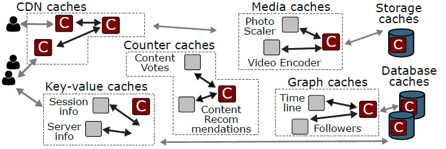
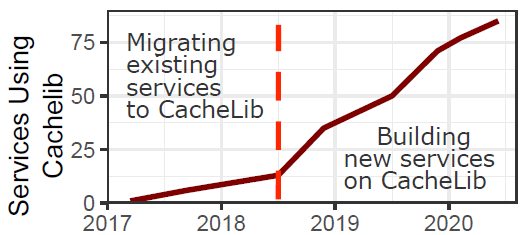

# The *CacheLib* Caching Engine: Design and Experiences at Scale

**Abstract**

Web services rely on caching at nearly every layer of the system architecture. Commonly, each cache is implemented and maintained independently by a distinct team and is highly specialized to its function. For example, an application-data cache would be independent from a CDN cache. However, this approach ignores the difficult challenges that different caching systems have in common, greatly increasing the overall effort required to deploy, maintain, and scale each cache.

This paper presents a different approach to cache development, successfully employed at Facebook, which extracts a core set of common requirements and functionality from otherwise disjoint caching systems. *CacheLib* is a general purpose caching engine, designed based on experiences with a range of caching use cases at Facebook, that facilitates the easy development and maintenance of caches. CacheLib was first deployed at Facebook in 2017 and today powers over 70 services including CDN, storage, and application-data caches. This paper describes our experiences during the transition from independent, specialized caches to the widespread adoption of CacheLib. We explain how the characteristics of production workloads and use cases at Facebook drove important design decisions. We describe how caches at Facebook have evolved over time, including the significant benefits seen from deploying CacheLib. We also discuss the implications our experiences have for future caching design and research.

## 1 Introduction

Large web services rely on caching systems to achieve high performance and efficiency. For example, at Facebook, CDN caches serve 70% of web requests, reducing latency by an order of magnitude. A single caching server can replace tens of backend database servers by achieving 20 higher throughput and hit ratios exceeding 80%.

At Facebook, a wide variety of caching systems form an integral part of the system architecture. Facebook’s architecture includes CDN caches, key-value application caches, socialgraph caches, and media caches (Figure 1). Caching plays a similar role at Amazon [26], Twitter [42, 92], Reddit [33, 89], and many other large web services.

| **Figure 1**: Large web services rely on caching in many subsystems to improve system performance and efficiency |
| :----------------------------------------------------------: |
|                                          |

**Caching systems at Facebook**. Historically, each caching system at Facebook was implemented separately. For example, Facebook separately designed CDN caches [86], key-value caches [72], social-graph caches [17], storage caches [71], database caches [2], and many others. The belief was that each of these highly specialized systems required a highly specialized cache in order to implement complex consistency protocols, leverage custom data structures, and optimize for a desired hardware platform.

Although these caching systems serve different workloads and require different features, they share many important engineering and deployment challenges (Section 2). All of these systems process millions of queries per second, cache working sets large enough to require using both flash and DRAM for caching, and must tolerate frequent restarts due to application updates, which are common in the Facebook production environment. As the number of caching systems at Facebook increased, maintaining separate cache implementations for each system became untenable. By repeatedly solving the same hard engineering challenges, teams repeated each other’s efforts and produced redundant code. Additionally, maintaining separate caching systems prevented the sharing of efficiency gains from performance optimizations between systems.

Hence, Facebook was faced with a tradeoff between generality and specialization. A more general-purpose caching solution might lose some domain-specific optimizations for individual systems, but it could reduce development overhead and increase synergistic efficiency between systems. The desire to balance this tradeoff gave rise to CacheLib, the general-purpose caching engine.

**This paper describes Facebook’s solution for scalable cache deployment: CacheLib**. CacheLib is a C++ library that provides a common core of cache functionality, including efficient implementations of cache indexes, eviction policies, and stability optimizations for both DRAM and flash caches. CacheLib exposes its features via a simple, thread-safe API that allows programmers to easily build and customize scalable, highly concurrent caches. CacheLib is used both to build standalone caching systems and to add in-process caches to applications. Facebook’s CDN, social-graph cache, application look-aside cache, and block-storage system all use caches built and customized using CacheLib.

CacheLib has been deployed in production since 2017 and today powers over 70 different services. Figure 2 shows CacheLib’s growth during this period. Initially, CacheLib replaced existing caches, but since mid-2018 it has facilitated an explosive growth in caches throughout Facebook, leading to a significant reduction in backend load.

| **Figure 2**: The number of Facebook services built using CacheLib over time. For example, one service is Facebook’s key-value caching system. Initial growth was due to migration of existing systems, but more recently, many new systems are built using CacheLib |
| :----------------------------------------------------------: |
|                                          |

### 1.1 Lessons Learned from CacheLib

Developing an effective general-purpose caching framework has required not only understanding common caching use cases within Facebook, but also understanding more general trends in how caches will be deployed in the future. This section describes instances where the conventional wisdom about caching does not match our experience with Facebook’s production environment.

**Specialized caching systems can and should be built using a general-purpose caching engine**. At Facebook, CacheLib has replaced existing specialized caches in several major services and has spurred the adoption of caches in many new applications. CacheLib offers a broader feature set than any single specialized caching system. Having a common core of features saves tens of thousands of lines of redundant code, improves system stability, and makes it easy for developers to deploy and tune new caches. Moreover, CacheLib serves as an aggregation point for optimizations and best practices. As a result, systems built on CacheLib achieve peak throughputs of a million requests per second on a single production server and hit ratios between 60 and 90%. To achieve this performance, each caching system customizes its cache to use their desired subset of CacheLib’s features. To accommodate as many systems as possible, CacheLib’s feature set has grown over time. As a result, features that once justified the construction of a specialized caching system are now available to any CacheLib-based system.

Production workloads require caching at massive scale. Prior workload studies of production systems [4, 5] have not shared the popularity distribution of keys. Consequently, popular benchmarking tools [24, 59] and academic papers [19, 36, 41, 49, 53, 65, 66, 68, 74, 90, 94] assume a Zipf popularity model with shape parameter α  *.*9. This leads to the conclusion that DRAM-based caches are sufficient in most situations. We provide strong evidence that prior models have been too optimistic about the cacheability of production workloads.

Because workloads at Facebook are less cacheable than is generally assumed, caches at Facebook require massive capacities to achieve acceptable hit ratios. Caching systems at Facebook often comprise large distributed systems where each node has hundreds of gigabytes of cache capacity. This makes the use of flash for caching attractive. However, most caching systems have historically targeted DRAM and do not achieve acceptable performance using flash.

**Caching is not a solved problem**. CacheLib has continuously added features since its initial deployment in 2017 as new use cases and feature requests have come to light. These new features have seen rapid, widespread adoption from both existing CacheLib users and new systems developed using CacheLib, so that the common core of CacheLib features has grown with applications over time.

### 1.2 Bridging the Gap between Research and Production Caching Systems

Just as developers at Facebook had historically developed specialized caching systems, we note that the caching literature has often targeted specialized caching systems. This presents an obstacle to the uptake of ideas from the research community by industry, since the assumptions made by a specialized research system rarely align perfectly with the realities of a production environment. Our hope is that CacheLib can reduce these obstacles by providing a platform for the exploration of new ideas developed outside of Facebook. CacheLib and a selection of Facebook workloads will be open-sourced^1^.

> ^1^For more information, visit [www.cachelib.org](http://www.cachelib.org/)

## 2 Motivation: Caching Use Cases

Large web services rely on hundreds of specialized services, which contain diverse use cases for caching. This section describes the caching needs of a sample of six production systems at Facebook.

**Hierarchical and geo-distributed caches**. Facebook’s CDN focuses on serving HTTP requests for static media objects such as photos, audio, and video chunks from servers in user proximity. Specifically, a goal of CDN servers deployed outside of Facebook’s network is to reduce the number of bytes sent over the wide-area network (byte miss rate). There are also CDN servers within Facebook’s data centers; their goal is to reduce the number of backend and storage queries (object miss rate). Each CDN server uses a local cache, spanning both DRAM and flash.

**Application look-aside caches**. Web applications have a wide range of caching needs. For example, applications must cache database queries, user data, and usage statistics. Providing a specialized caching service for each application would be inefficient and hard to maintain. Thus, applications use RPCs to access a set of shared caching services. Each caching service consists of a large distributed system of caches.

**In-process caches**. Many applications cannot tolerate the RPC overhead of a remote cache. CacheLib makes it easy for these applications to include high-performance, in-process caches that are decoupled from the application logic.

For example, some backend applications use a CacheLib cache to store client session information which is used to rate-limit clients. Specifically, these applications cache flow counters that see very high bursts in request rates but can be evicted once a flow slows down. In this case, the latency and bandwidth requirements of the cache make remote caches infeasible. Instead, applications instantiate a CacheLib cache which provides zero-copy access to cached flow counters.

**Machine-learning-model serving systems**. User-facing machine-learning applications benefit from caching in multiple places. First, models often use inputs based on how users interact with content (e.g., liking a piece of content). Content interaction counters are thus cached so applications can quickly access the inputs required to generate a prediction (e.g., ranking content). Second, because repeatedly generating predictions based on the same inputs is computationally expensive, model predictions are also cached.

**Storage-backend cache**. Facebook uses large clusters of servers with spinning disks to store blocks of persistent data. Even with several caching layers in front of the block storage servers, some blocks remain popular enough to exceed the target IOPS of the disks. Storage servers use flash drives to cache popular blocks and shield the spinning disks from load. To support byte-range requests and append operations, these flash caches are tightly integrated in the storage-system stack.

**Database page buffer**. Data structures and small objects are stored in a variety of database systems. Database systems use page caches to increase their throughput and decrease access latencies. To support consistency and transactional operations, page caches are tightly integrated with database logic.

Across Facebook, we find hundreds of different services which implement a cache or whose efficiency could benefit from a caching layer. These use cases span all layers of the data-center stack and administrative domains. Research on caching spans operating systems [16,52], storage systems [20, 58], distributed systems [8, 22, 66], network systems [9, 65], databases [30], and computer architecture [7, 56, 91]. 

CacheLib handles these diverse use cases by providing a *library* of components that makes it easy to rapidly build performant caches. In many cases, CacheLib caches have replaced highly specialized caching systems at Facebook. CacheLib is currently used in dozens of production systems, spanning five of the six examples described above. Notably, CacheLib is not currently used as a database page buffer (see Section 6). Hence, while CacheLib will not replace every specialized caching system, we have seen significant adoption of a general-purpose caching engine at Facebook.

## 3 Shared Challenges Across Caching Systems at Facebook

Despite the diversity of use cases for caching, our experience scaling and maintaining caching systems has revealed a set of core challenges that frequently overlap between use cases. This section describes the common challenges at Facebook.

The data in this section was gathered between December 2019 and May 2020 from 4 important workloads from a variety of caching use cases (Section 2). The *Lookaside* and *SocialGraph* systems are both from application-data caches. *Lookaside* is a service which provides on-demand caching to a variety of applications. *SocialGraph* is specifically used to cache information from the Facebook social graph. The *Storage* system is a storage backend cache, and *CDN* is a cache in Facebook’s CDN. Each workload represents the traffic to one machine within its respective service.

### 3.1 Massive Working Sets

One central challenge at Facebook is massive *working sets*. A working set describes the set of objects in a workload which are popular enough to benefit from caching. A workload with a larger working set requires a larger cache to produce the same hit ratio as a workload with a smaller working set.

To measure working sets, one must account for both the amount of popular data seen over time and the rate of change in the popularity of data over time. Therefore, we present both popularity distributions and churn rates at Facebook.

**Popularity**. The popularity distribution of a workload measures the frequency of each key over some time horizon in a sampled trace. These frequencies indicate the relative popularity of different objects in the system. Prior measurements of CDN and web workloads indicate that highlyskewed Zipf distributions are a common popularity distribution [5, 14, 24, 38, 41, 48, 83, 85]. Informally, in a Zipf distribution “the most popular 20% of objects account for 80% of requests”. Formally, in a Zipf distribution the *i*-th most popular object has a relative frequency of 1*/i*α. While some studies indicate α as low as 0*.*56 [38, 40], most prior measurements indicate 0*.*9 *\<* α 1 [5, 14, 24, 41, 48, 85]. This parameter range has become the standard evaluation assumption in many recent system papers [19, 36, 41, 49, 53, 65, 66, 68, 74, 90, 94].

Figure 3 shows the popularity distributions on log-log scale for four workloads at Facebook. At this scale, a Zipf distribution would be a straight line with negative slope ( α). *Lookaside* is the only system of the four whose popularity distribution is Zipfian with α close to 1. *Storage*’s distribution is much flatter at the head of the distribution, even though the tail follows a Zipf distribution. Furthermore, although Zipfian, *SocialGraph* and *CDN* ’s distributions exhibit α = 0*.*55 and α = 0*.*7, respectively. Lower α means that a significantly higher proportion of requests go to the tail of the popularity distribution, which leads to a larger working set.

> **Figure 3: Many services are hard to cache**. *Each graph plots the number of requests per object as a function of object popularity rank (log-log) for four production caching systems at Facebook. The green dashed line shows the best-fit Zipf distribution for each workload. Lower values of* α *indicate that a workload is harder to cache, hence SocialGraph and CDN are harder to cache. Storage is not Zipfian. Each sample consists of requests taken over 24 hours. The black dashed vertical lines along the x-axis show the cumulative size of the popular objects to the left of the line.*

**Churn**. *Churn* refers to the change in the working set due to the introduction of new keys and changes in popularity of existing keys over time. The popular YCSB [24] workload generator assumes that there is no churn, i.e., each key will remain equally popular throughout the benchmark. This benchmark and the no-churn assumption is used widely in the evaluation of system papers [19,36,49,53,65,66,68,74,90,94].

In Facebook production workloads, we find a high degree of churn. We define an object to be *popular* if it is among the 10% of objects that receive the most requests. Figure 4 shows how the set of popular objects changes over time. For example, the blue bar at *x* = 3 shows the probability that an object which was popular 3 hours ago is still in the top 10%most-requested objects. Across all workloads, over two-thirds of popular objects in a given hour fall out of the top 10% after just one hour. Such high churn applies independent of which hour we use as the baseline, for different percentiles (e.g., top 25%), and with different time granularities (e.g., after 10 minutes, 50% of popular objects are no longer popular). This high churn rate increases the importance of temporal locality and makes it harder for caching policies to estimate object popularity based on past access patterns.

> **Figure 4: Object popularity changes rapidly over time**. *Each graph plots the probability that the top 10%-most-requested objects remain popular after x hours. Across all workloads, there is a significant drop off in popularity after even a single hour*.

### 3.2 Size Variability

In addition to popularity and churn, object sizes play a key role in cache performance. Figure 5 shows the object size distribution for four large use case. For *Storage* and *CDN* , we find that 64KB and 128KB chunks, respectively, are very common, which result from dividing large objects into chunks. For *Lookaside* and *SocialGraph* , we find object sizes spanning more than seven orders of magnitude. Note the preponderance of small objects, which arise from graph edges/nodes, RPC computation results, and negative caching (see Section 4.3).

> **Figure 5: Object sizes vary widely and small objects are common**. *Distribution of value sizes for all four workloads. Object size is shown on the X-axis on a log scale. The Y-axis shows a complimentary CDF – the fraction of requests for objects which are less than a given size. Object sizes are small in the Lookaside and SocialGraph workloads. Storage and CDN split objects greater than 64 KB and 128 KB, respectively, across multiple keys*.

These findings restrict the design space for a general caching system. For example, many existing caching systems [3, 32, 35, 37, 70, 75, 79, 87] store at most a single object per cache line (64B). For a system such as *SocialGraph* , where a significant fraction of objects are between 10B and 20B, this approach wastes space. Another challenge is in-memory data structures which are used as an index for objects on flash. The per-object overhead differs across existing systems between 8B and 100B [32, 37, 70, 79, 86, 87]. For a system with a median object size of 100B, such as *Lookaside*, this means that 80GB 1TB of DRAM is needed to index objects on a 1TB flash drive. It is imperative to handle highly variable object sizes while limiting memory and storage overhead.

### 3.3 Bursty Traffic

Another common theme is that Facebook’s traffic is quite bursty. Figure 6 shows the actual request arrival rate compared to a Poisson arrival sequence, which is often assumed in system evaluations [53, 66, 73, 74, 84]. Figure 6 shows that the actual arrival rate varies much more than Poisson suggests.

> **Figure 6: Requests are very bursty**. *Number of requests (blue) for every two minutes over the 2 hour horizon compared to a Poisson arrival sequence (orange) with the same mean number of arrivals. The two hour window covers the peak traffic time within a day for each service. CDN has particularly high short-term bursts.*

This is particularly apparent for *CDN* , which has sharp bursts of traffic on top of a fairly steady request rate. Variable arrival rates make it hard to provision caching systems with sufficient resources to maintain low latencies during a load spike.

### 3.4 Resource Management

To be efficient, caches should make use of all available resources without exceeding them. This is particularly important for DRAM. A common deployment scenario includes CacheLib as well as application processes, and the kernel, all of which consume DRAM. As the workload composition or intensity changes, the memory available for caching can vary widely. For example, caches which handle variable-sized objects often have unpredictable levels of memory usage. Attempting to provision all available memory for caching can therefore lead to memory over-commitment, a well known challenge for in-process caches [78]. Specifically, a memory spike in the application might lead to the cache being dropped due to the kernel’s out-of-memory (OOM) killer. Many opensource caching systems are not OOM-aware [87], leading to significant operational challenges [77]. CacheLib dynamically allocates and frees memory used by the cache to avoid these crashes without leaving too much unused memory.

### 3.5 Computationally Costly Query for Empty Results

Caching systems typically focus on tracking and storing results for valid backend queries. However, some use cases frequently send queries that have empty results, indicating that the requested object does not exist. This occurs often in database systems that track associations between users, where a user might query for the set of acquaintances they have in common with another user. Such queries are typically computationally costly for the backend database. For example, when querying the social graph, users frequently ask to see the set of associations they share with another user, and find that these associations do not exist. Hence, in *SocialGraph* ’s workload, we measure that 55.6% of requests are for keys that do not exist. The remaining 44.4% of requests ask for valid objects, and the corresponding cache hit ratio among these requests is 86.5%. Failure to cache empty results would thus lower the cache hit ratio significantly.

### 3.6 Updating Cached Data Structures

Caches should efficiently support structured data. This is particularly important for in-process caches that directly interact with application data structures. For instance, the rate limiter described in Section 2 stores multiple fields in a single cache object. Applications often want the ability to update specific fields in a cached data structure without deserializing, updating, and re-serializing the object.

### 3.7 Frequent Restarts

Finally, production caches frequently restart in order to pick up code fixes and updates. This happens because engineering teams require the ability not only to roll out new code quickly, but to roll back changes quickly as well. For example, 75% of *Lookaside* caches and 95% of *CDN* caches have an uptime less than 7 days. Even systems such as *Storage* and *SocialGraph* which have longer uptimes on average follow a regular monthly maintenance schedule which requires restarting cache processes. Most caching systems are transient, meaning that their content is lost upon application restart [37,55]. Transience is problematic because large caches take a long time to warm up. It would take hours or even days for cache hit ratios to stabilize following the restart of a transient cache at Facebook. Prior work has suggested the alternative of warming a cache after restart, but this requires an explicit warm-up phase as part of routing [33, 72] or requires slow deployments [42].

### 3.8 Summary

While not every caching use case exhibits every challenge above, each use case does exhibit multiple of these challenges. We describe how CacheLib addresses these issues next in Section 4. The power of using a general-purpose caching engine to address these challenges is that all applications which use CacheLib have access to every CacheLib feature if and when it is needed.

## 4 Design and Implementation

CacheLib enables the construction of fast, stable caches for a broad set of use cases. To address common challenges across these use cases as described in Sections 2 and 3, we identify the following features as necessary requirements for a generalpurpose caching engine.

**Thread-safe cache primitives**: To simplify programming for applications that handle highly bursty traffic, CacheLib provides a thread-safe API for reads, writes, and deletes. In addition, thread-safety simplifies the implementation of consistency and invalidation protocols. Concurrent calls to the CacheLib API leave the cache in a valid state, respect linearizablility [47] if referencing a common key, and incur minimal resource contention.

**Transparent hybrid caching**: To achieve high hit ratios while caching large working sets, CacheLib supports caches composed of both DRAM and flash, known as *hybrid caches*.

Hybrid caches enable large-scale deployment of caches with terabytes of cache capacity per node. CacheLib hides the intricacies of the flash caching system from application programmers by providing the same byte-addressable interface (Section 4.1) regardless of the underlying storage media. This transparency allows application programmers to ignore when and where objects get written across different storage media. It also increases the portability of caching applications, allowing applications to easily run on a new hardware configurations as they become available.

**Low resource overhead**: CacheLib achieves high throughput and low memory and CPU usage for a broad range of workloads (Section 2). This makes CacheLib suitable for inprocess use cases where the cache must share resources with an application. Low resource overheads allow CacheLib to support use cases with many small objects.

**Structured items**: CacheLib provides a native implementation of arrays and hashmaps that can be cached and mutated efficiently without incurring any serialization overhead. Caching structured data makes it easy for programmers to efficiently integrate a cache with application logic.

**Dynamic resource monitoring, allocation, and OOM protection**: To prevent crashes from temporary spikes in system memory usage, CacheLib monitors total system memory usage. CacheLib dynamically allocates and frees memory used by the cache to control the overall system memory usage.

**Warm restarts**: To handle code updates seamlessly, CacheLib can perform *warm restarts* that retain the state of the cache. This overcomes the need to warm up caches every time they are restarted.

### 4.1 CacheLib API

The CacheLib API is designed to be simple enough to allow application programmers to quickly build in-process caching layers with little need for cache tuning and configuration. At the same time, CacheLib must scale to support complex application-level consistency protocols, as well as zero-copy access to data for high performance. Choosing an API which is both simple and powerful was an important concern in the design of CacheLib.

The API centers around the concept of an Item, an abstract representation of a cached object. The Item enables byte-addressable access to an underlying object, independent of whether the object is stored in DRAM or flash. Access to cached Items is controlled via an ItemHandle which enables reference counting for cached Items. When an ItemHandle object is constructed or destroyed, a reference counter for the corresponding Item is incremented or decremented, respectively. An Item cannot be evicted from the cache unless its reference count is 0. If an Item with a non-zero reference count expires or is deleted, existing ItemHandles will remain valid, but no new ItemHandles will be issued for the Item.

Figure 7 shows the basic CacheLib API. To insert a new object into the cache, allocate may first evict another Item (according to an eviction policy) as long as there are no outstanding ItemHandles that reference it. The new Item can be configured with an expiration time (TTL). It is created within the given memory “pool” (see below), which can be individually configured to provide strong isolation guarantees. Any new Items only become visible after an insertOrReplace operation completes on a corresponding ItemHandle.

> **Figure 7**: *The CacheLib API uses an Item to represent a cached object, independent of whether it is cached in DRAM or on flash.*

To access cached `Items`, find creates an ItemHandle from a key, after which getMemory allows unsynchronized, zero-copy access to the memory associated with an Item. To atomically update an Item, one would allocate a new ItemHandle for the key they wish to update, perform the update using getMemory, and then make the update visible calling insertOrReplace with the new ItemHandle. Because CacheLib clients access raw memory for performance, CacheLib trusts users to faithfully indicate any mutations using the method markNvmUnclean. Finally, remove deletes the Item identified by a key, indicating invalidation or deletion of the underlying object.

> **Figure 8**: *Typed ItemHandles allow CacheLib to natively store structured objects. In addition to statically sized Items, CacheLib also supports variably sized Items. For example, CacheLib implements a hashmap that can dynamically grow, offer zero-copy access to its entries, and is treated as an evictable cache Item.*

Figure 8 shows a simple example of CacheLib’s native support for structured data. Structured `Items` are accessed through a `TypedHandle`, which offers the same methods as an `ItemHandle`. `TypedHandles` enable low-overhead access to user-defined data structures which can be cached and evicted just like normal Items. In addition to statically sized data structures, CacheLib also supports variably-sized data structures; for example, CacheLib implements a simple hashmap that supports range queries, arrays, and iterable buffers.

CacheLib implements these APIs in C++, with binding to other languages such as Rust.

### 4.2 Architecture Overview

CacheLib is designed to be scalable enough to accommodate massive working sets (Section 3.1) with highly variable sizes (Section 3.2). To achieve low per-object overhead, a single CacheLib cache is composed of several subsystems, each of which is tailored to a particular storage medium and object size. Specifically, CacheLib consists of a DRAM cache and a flash cache. The flash cache is composed of two caches: the Large Object Cache (LOC) for Items 2KB in size and Small Object Cache (SOC) for Items *\<*2KB in size.

An `allocate` request is fulfilled by allocating space in DRAM, evicting `Items` from DRAM if necessary. Evicted `Items` are either admitted to a flash cache (potentially causing another eviction) or discarded. A `find` request successively checks for an object in DRAM, then LOC, then SOC. This lookup order minimizes the average memory access time [46] of the cache (see Appendix A). A `find` call returns an `ItemHandle` immediately. If the requested object is located on DRAM, this `ItemHandle` is ready to use. If the requested object is located on flash, it is fetched asynchronously and the `ItemHandle` becomes ready to use once the object is in DRAM. An empty `ItemHandle` is returned to signify a cache miss. These data paths are summarized in Figure 9.

> **Figure 9**: *The find and allocate paths for a hybrid cache constructed using CacheLib.*

We now describe CacheLib’s subsystems in more detail. **DRAM cache**. CacheLib’s DRAM cache uses a chained hash table to perform lookups. The DRAM cache can be partitioned into separate *pools*, each with its own eviction policy. Programmers select a particular PoolId when calling allocate (see Figure 7), allowing the isolation of different types of traffic within a single cache instance.

For performance, cache memory is allocated using slab classes [6, 22, 37] which store objects of similar sizes. CacheLib uses 4MB slabs and implements a custom slab allocator. Each slab requires 7B of DRAM (3B of internal metadata + 4B to identify the size of objects in the slab). Because CacheLib workloads often include many objects of a specific size (e.g., 80B), the sizes corresponding to each slab class are configured on a per-workload basis to minimize fragmentation. Further optimizations for objects smaller than 64B or larger than 4MB are described in Section 4.3.

Each slab class maintains its own eviction policy state. CacheLib is designed to support the continual development of new eviction policies, and currently supports LRU, LRU with multiple insertion points, 2Q [54, 93], and TinyLFU [31]. These eviction policies differ in their overheads and their biases towards either recency or frequency, and are thus configured on a per-workload basis as well. To approximate a global eviction policy, memory is rebalanced between slab classes using known rebalancing algorithms [72]. To support these policies, among other features, CacheLib dedicates 31B of DRAM overhead per item. Table 1 describes the metadata which comprises this DRAM overhead.

> **Table 1**: *CacheLib’s DRAM cache uses 31B of metadata per Item.*

To guarantee atomic metadata operations, CacheLib relies on a variety of known optimization techniques [35, 62, 64], including fine-grained locking, user-space mutexes, and C++ atomics. This is particularly important for eviction policies, where naive implementations lead to lock contention and limit throughput [6, 9, 10, 61]. For example, under LRU, popular Items frequently compete to be reset to the most-recentlyused (MRU) position. This is particularly common at Facebook due to our high request rates (see Figure 6). CacheLib adopts a simple solution to reduce contention: Items that were recently reset to the MRU position are not reset again for some time *T* [9, 87]. As long as *T* is much shorter than the time it takes an object to percolate through the LRU list (i.e., eviction age), this simplification does not affect hit ratios in practice. CacheLib also uses advanced locking mechanisms such as flat combining [45] to reduce resource contention.

**Flash cache**. When Items are evicted from the DRAM cache, they can optionally be written to a flash cache. Due to high popularity churn (Section 3), the content cached on flash changes continually. Hence, in addition to maintaining low per-object overhead, CacheLib must contend with the limited write endurance of flash cells.

To reduce the rate of writes to flash, CacheLib selectively writes objects to the flash cache. If an object exists on flash and was not changed while in DRAM, it is not written back to flash. Otherwise, CacheLib admits objects to flash according to a configurable admission policy. CacheLib’s default admission policy is to admit objects to the flash cache with a fixed probability *p* [57]. Adjusting the probability *p* allows finegrained control over write rate to flash. Section 5 describes our experience with more complex admission policies.

Another consideration for flash endurance is *write amplification* which happens when the number of bytes written to the device is larger than the number of bytes inserted into the cache. For instance, CacheLib performs extra writes to store metadata and is forced to write at block granularities. We distinguish between *application-level* write amplification, which occurs when CacheLib itself writes more bytes to flash than the size of the inserted object, and *device-level* write amplification, which is caused by the flash device firmware. CacheLib’s flash caches are carefully designed to balance both sources of write amplification and DRAM overhead.

The *Large Object Cache* (LOC) is used to store objects larger than 2KB on flash. Because LOC objects are larger than 2KB, the number of unique objects in a LOC will only number in the millions. It is therefore feasible to keep an in-memory index of the LOC. The LOC uses segmented B+ trees [23, 34, 63] in DRAM to store the flash locations of `Items`. `Items` are aligned to 4KB flash pages, so the flash location is a 4B, 4KB-aligned address. This allows the LOC to index up to 16TB of flash storage space.

The LOC uses flash to further limit the size of the DRAM index. Keys are hashed to 8B. The first 4B identify the B+tree segment, and the second 4B are used as a key within in a tree segment to lookup a flash location. A hash collision in the DRAM index will cause CacheLib to believe it has found an object’s flash location. Hence, LOC stores a copy of each object’s full key on flash as part of the object metadata and validates the key after the object is fetched off flash. Each flash device is partitioned into regions which each store objects of a different size range. Hence, the object size can be inferred from where it is located on flash, without explicitly storing object sizes in DRAM. CacheLib can then retrieve the object via a single flash read for the correct number of bytes. To reduce the size of addresses stored in DRAM, every 4KB flash page stores at most a single object and its metadata. This is spaceefficient because LOC only stores objects larger than 2KB. Objects larger than 4KB can span multiple pages. Because the LOC reads and writes at the page level, any fragmentation also causes application-level write amplification.

To amortize the computational cost of flash erasures, the LOC’s caching policy evicts entire regions rather than individual objects. (Region size is configurable, e.g., 16MB.) By default, FIFO is used so that regions are erased in strictly sequential order [60]. Writing sequentially improves the performance of the flash translation layer and greatly reduces device-level write amplification (see Section 5.2). If FIFO eviction evicts a popular object, it may be readmitted to the cache [86]. Alternatively, LOC supports a pseudo-LRU policy which tracks recency at region granularity. A request for any object in a region logically resets the region to the MRU position. Evictions erase the entire region at the LRU position. 

The *Small Object Cache* (SOC) is used to store objects smaller than 2KB on flash. Because billions of small objects can fit on a single 1TB flash device, an exact lookup index (with associated per-object metadata) would use an unreasonably large amount of DRAM [32]. Hence, SOC uses an approximate index that scales with the number of flash pages. 

>  **Figure 10**: *SOC alloc proceeds by hashing into sets (I). CacheLib then rewrites the page (II), possibly evicting an object (following FIFO order). Finally, CacheLib recalculates the bloom filter with the Items currently stored in this set’s 4KB page (III)*.

SOC hashes keys into sets.Each set identifies a 4KB flash page which is used to store multiple objects. Objects are evicted from sets in FIFO order. A naive implementation of this design would always read a set’s page off flash to determine whether it contains a particular object. As an optimization, CacheLib maintains an 8B Bloom filter in DRAM for each set, each with 4 probes. This filter contains the keys stored on the set’s flash page and prevents unnecessary reads more than 90% of the time [11, 12]. Figure 10 shows the alloc path, and Figure 11 shows the `find` path.

> **Figure 11**: *SOC find proceeds by hashing into sets (I) and then checking a bloom filter, which indicates whether an object is likely to be stored on flash (II). If the bloom filter does not contain the key, the object is definitely not present on flash. Otherwise, CacheLib reads the 4KB flash cache and searches for the key (III)*.

Controlling write amplification in the SOC is particularly challenging. Admitting an object to the SOC requires writing an entire 4KB flash page, and is thus a significant source of application-level write amplification. This also applies to the remove operation, which removes an object from flash. Similarly, because keys are hashed to sets, admitting a stream of objects to the SOC causes random writes that result in higher device-level write amplification. Furthermore, the SOC only supports eviction policies that do not require state updates on hits, such as FIFO, since updating a set on a hit would require a 4KB page write. These challenges highlight the importance of advanced admission policies (see Section 5.2).

### 4.3 Implementation of Advanced Features

CacheLib supports many applications with demanding requirements. To support these applications efficiently, CacheLib implements several advanced features, making them available to all CacheLib-based services under the same, generalpurpose CacheLib API. We describe the implementation of four important features: structured items, caching large and small objects, warm restarts, and resource monitoring, corresponding to challenges already discussed in Section 3.

**Structured items**. Because CacheLib provides raw access to cached memory, flat data structures can be easily cached using the CacheLib API. In addition, CacheLib natively supports arrays and maps. CacheLib supports an Array type for fixedsize objects at no additional overhead for each entry in the array. The Map type supports variable object sizes, and comes in ordered and unordered variants. The overhead for each Map entry is 4B to store its size.

**Caching large and small objects in DRAM**. To store objects larger than 4MB in size, CacheLib chains multiple DRAM Items together into one logical large item. This chaining requires an additional 4B next pointer per object in the chain. The most common use case for large objects is the storage of structured items. While it is uncommon for a single, logical object to be larger than 4MB, we frequently see Arrays or Maps that comprise more than 4MB in aggregate.

CacheLib also features *compact caches*, DRAM caches designed to cache objects smaller than a cache line (typically 64B or 128B). Compact caches store objects with the same key size and object size in a single cache line [18, 29, 46, 80]. Compact caches are set-associative caches, where each cache line is a set which is indexed by a key’s hash. LRU eviction is done within each set by repositioning objects within a cache line. Compact caches have no per-object overhead.

One prominent example of using compact caches is CacheLib’s support for *negative caching*. Negative cache objects indicate that a backend query has previously returned an empty result. Negative cache objects are small, fixed-size objects which only require storing a key to identify the empty query. As discussed in Section 3.5, negative caching improves hit ratios drastically in *SocialGraph* . Negative caching is not used by *Lookaside*, *Storage*, or *CDN* , but it is employed by 4 of the 10 largest CacheLib-based systems.

Both of these features reinforce CacheLib’s overarching design, which is to provide specialized solutions for objects of different sizes in order to keep per-object overheads low.

**Dynamic resource usage and monitoring**. CacheLib monitors the total system memory usage and continuously adapts the DRAM cache size to stay below a specified bound. CacheLib exposes several parameters to control the memory usage mechanism. If the system free memory drops below `lowerLimitGB` bytes, CacheLib will iteratively free `percentPerIteration` percent of the difference between `upperLimitGB` and `lowerLimitGB` until system free memory rises above `upperLimitGB`. A maximum of `maxLimitPercent` of total cache size can be freed by this process, preventing the cache from becoming too small. Although freeing memory may cause evictions, this feature is designed to prevent outright crashes which are far worse for cache hit ratios (see Figure 15). As system free memory increases, CacheLib reclaims memory by an analogous process. 

**Warm restarts**. CacheLib implements warm restarts by allocating DRAM cache space using POSIX shared memory [76]. This allows a cache to shut down while leaving its cache state in shared memory. A new cache can then take ownership of the cache state on start up. The DRAM cache keeps its index permanently in shared memory by default. All other DRAM cache state is serialized into shared memory during shutdown. The LOC B-tree index and SOC Bloom filters are serialized and written in a dedicated section on flash during shutdown.

## 5 Evaluation

In evaluating CacheLib, we aim to show that CacheLib’s API and feature set is flexible enough to implement common use cases both inside and outside Facebook. Specifically, we show that CacheLib-based systems can easily achieve performance that is competitive with specialized solutions without requiring any specialization of the core caching engine. We also show how CacheLib’s widespread adoption has had a significant impact on the Facebook production environment.

### 5.1 System Comparisons

We drive our experiments using *CacheBench*, the cache benchmarking tool that ships with CacheLib. For the sake of comparison, we extend CacheBench to target an in-process version of Memcached [37], as well as HTTP proxy (CDN) caches.

CacheBench provides a modular request generator by sampling from configurable popularity, key size, and object size distributions. To emulate churn, CacheBench continuously introduces new keys at a configurable rate. We instantiate these parameters from the measurements for the application look-aside and CDN use cases presented in Section 3.

**Application look-aside cache**. Before CacheLib was developed, several teams at Facebook used an internal variant of Memcached as a look-aside cache. However, applications now use a CacheLib-based look-aside cache. We therefore compare CacheLib to a minimally changed Memcached v1.6.6, which is the latest version and incorporates many recent optimizations. For fairness, we configure CacheLib and Memcached to both use their implementations of LRU eviction. To implement the look-aside pattern, CacheBench configures CacheLib to implement a “set” as an `allocate` followed by `insertOrReplace` and a “get” by `find` and a subsequent access to the `ItemHandle`’s `getMemory` method.

We evaluate CacheLib and Memcached on a range of cache sizes using 32 threads each. When the cache is small, the hit ratio is low, which stresses the eviction code paths (set operations). When the cache is large, the hit ratio is high, which stresses the LRU-head update code paths (get operations).

> **Figure 12**: *A comparison of CacheLib to Memcached for a range of cache sizes. CacheLib and Memcached achieve similar hit ratios, but CacheLib achieves much higher throughput*.

Figure 12 shows the hit ratios and throughputs for cache sizes between 8 and 144GB and a typical working set of 100 million objects. Memcached and CacheLib achieve similar hit ratios, with Memcached slightly higher at small cache sizes and slightly lower at large cache sizes. Across all cache sizes, CacheLib achieves higher throughputs than Memcached, processing up to 60% more requests per second than Memcached.

CacheLib’s higher throughput is largely due to optimizations that reduce lock contention. For example, CacheLib uses flat combining (see Section 4.2) to reduce contention on the LRU list head. Also, CacheLib uses *T* = 60 seconds (see Section 4.2) in this experiment. For *T* = 10 seconds, CacheLib consistently outperforms Memcached’s hit ratio, at the cost of lower throughput. In production, most deployments use the default *T* = 60 seconds.

**HTTP server cache**. Hybrid DRAM-flash caches are prevalent at Facebook. For example, hybrid caches are used as CDN proxy caches. We compare a CacheLib-based HTTP server cache to NGINX and Apache Traffic Server (ATS), which are widely used to build flash-based CDNs [1, 44, 69, 82]. The CacheLib implementation is a FastCGI server with an NGINX frontend. Each system uses its default configuration for a 512GB flash cache. The systems fetch misses from a high-performance origin backend that is never the bottleneck.

To illustrate the effect of object size on flash cache performance, we configured all object sizes to be equal and then repeated the experiment for a range of object sizes. To keep hit ratios constant across trials, we adjusted the number of unique objects to maintain a constant working set size.

Figure 13 shows that CacheLib’s explicit handling of small objects for flash caching provides a sizable advantage over NGINX and ATS. As the object size becomes larger, this advantage wanes. Eventually object sizes become large enough that all three systems become network-bound and their throughputs drop precipitously.

> **Figure 13**: *Comparison of CacheLib to ATS and NGINX HTTP flash caching systems for different object sizes. CacheLib significantly improves throughput for most object sizes*.

We observe that NGINX performs particularly well when object sizes are between 4KB and 16KB, outperforming CacheLib slightly when objects sizes are 8KB. We were unable to pinpoint the cause of this trend. Nonetheless, CacheLib compares favorably to both NGINX and ATS across a wide range of object sizes.

**LSM tree-based stores**. It is natural to ask whether existing storage systems that target flash devices could be used as flash caching systems. In particular, Facebook’s RocksDB [13] key value store provides hybrid DRAM and flash storage by using a Log-Structured Merge-Tree (LSM Tree). We investigated whether RocksDB could be used as a hybrid look-aside cache for application data by deploying RocksDB in production to cache data from the *SocialGraph* workload.

RocksDB trades off higher space usage in favor of lower write and delete latencies, using tombstones to defer deletes operations until compaction time [13]. However, most compaction methods are computationally expensive and must be done sparingly. It is therefore infeasible to use RocksDB’s `Delete` method to perform targeted evictions of objects, since compaction does not happen frequently enough for deletes to control the flash footprint of the cache. If RocksDB fills a flash device, it begins failing write and delete operations. This is particularly problematic in the *SocialGraph* system, which relies on deletes to maintain cache consistency. If a *SocialGraph* cache fails a certain number of deletes, the policy is to perform a cold restart (see Figure 15) to restore consistency. 

As an alternative, we tested RocksDB using FIFO compaction, which simply evicts the oldest data when the size of the store exceeds its desired size. This compaction method is lightweight enough to run constantly and effectively limit RocksDB’s flash usage. Evicting the oldest data will tend to evict the least recently *updated* objects, but these are generally not the same as the least recently *used* objects. RocksDB does not provide facilities for tracking which blocks contain recently used objects. Due to its simple eviction policy, RocksDB achieved only a 53% hit ratio compared to CacheLib’s 76% hit ratio when tested with a production *SocialGraph* workload. Additionally, RocksDB under FIFO compaction suffers from severe read amplification and thus required 50% higher CPU utilization than CacheLib in order to meet production throughput levels. Hence, although some of the principles of LSM tree-based solutions can be carried over to the design of flash caches, we conclude that RocksDB itself is not suitable for caching at Facebook.

### 5.2 Characterizing CacheLib in Production

We quantify the impact that CacheLib has had on the Facebook production environment by considering the notable caching improvements that CacheLib has introduced.

**DRAM overhead**. By design, the DRAM overheads of the LOC and SOC are small; in production we measure less than 0.1% and 0.2%, respectively. The DRAM Cache has generally low (*\<* 7%) overhead. There are two main sources of DRAM overhead: slab class fragmentation and metadata overhead (Section 4.2). Tuning CacheLib’s slab classes is crucial to limit fragmentation. Tuning currently happens manually. Without tuning, fragmentation overhead would more than double in many clusters. Unfortunately, we are not aware of automated tuning algorithms for slab-class boundaries^2^. A detailed analysis of DRAM overhead appears in Appendix B.

> ^2^Prior work has considered how to partition cache space between fixed slab classes [22] but not how to optimally define boundaries in the first place. Conceptually, this problem resembles the facility placement problem on a line [15], but we are not aware of optimal algorithms.

**Flash endurance**. CacheLib is designed to limit the rate of writes to flash in order to prolong flash device lifetimes (see Section 4.2). We now evaluate the effectiveness of this design.

The LOC incurs application-level write amplification due to fragmentation from the use of 4KB pages and size classes. Fragmentation is generally small, but *Storage* and *CDN* caches have 4.9% and 7% fragmentation overhead, respectively. To further reduce write amplification, CacheLib has recently introduced a new feature which buffers all writes to a region before flushing it to disk. This allows the application to write in sizes aligned to as low as 512 bytes, reducing fragmentation in *CDN* caches from 7% to 2%.

The LOC’s use of FIFO eviction instead of LRU allows CacheLib to write to flash sequentially. Writing sequentially reduced device-level write amplification from 1*.*5 to 1*.*05 at the expense of slight increase in application-level write amplification. The net effect was a 15% reduction in the number of NAND writes to the flash device per second.

The SOC incurs application-level write amplification due to always writing 4KB (even as object sizes *\<* 2KB). On average, we measure this to be around 6*.*5 the number of inserted bytes. The SOC also incurs significant device-level write amplification from writing random 4KB pages [43]. We measure this overhead to be between between 1*.*1 (for *Lookaside*) and 1*.*4 (for *Storage*) depending on the workload.

To achieve these levels of device-level write amplification, flash is typically overprovisioned by 50%. This overprovisioning is offset by the space efficiency of the SOC and the low cost of flash relative to DRAM, but reducing flash overprovisioning while maintaining the current level of performance is an open challenge at Facebook.

To further limit the number of bytes written to a flash device, CacheLib uses admission policies for flash caches. The default CacheLib admission policy, which admits objects with a fixed probability, prolongs flash device lifetimes, but also decreases hit ratios by rejecting objects at random. CacheLib also includes *reject first* admission policies, which reject objects the first *n* times they are evicted from DRAM.

Recently, CacheLib was updated to include a more advanced admission policy, similar to the *Flashield* policy proposed in [32], which makes flash admission decisions by trying to predict an object’s future popularity. Flashield’s predictions are based on how many hits an object receives while in DRAM. At Facebook, however, many objects do not stay in DRAM long enough to get multiple hits. Thus, CacheLib implements efficient tracking of object request frequencies beyond their DRAM-cache lifetimes. These frequencies are then used to predict how many hits an object would receive if admitted to flash. Our experience with this advanced admission policy is described in detail in Appendix C. The advanced admission policy reduced the rate of writes to flash by 44% in *SocialGraph* without decreasing hit ratios.

**Hit ratios**. CacheLib’s DRAM cache initially used a variant of the LRU eviction policy. A notable improvement in hit ratios across systems occurred when we deployed a 2Q-based eviction policy [54]. For example, the hit ratio for *SocialGraph* caches increased by 5 percentage points and the hit ratio for *CDN* caches increased by 9 percentage points.

An even larger improvement in hit ratios resulted from the deployment of high-capacity hybrid DRAM-flash caches. Services requiring massive cache capacities generally consist of a two-layer hierarchy where “L1” DRAM-only cache forward misses to “L2” hybrid DRAM-flash caches. To see the improvement due to hybrid caches, we compare *SocialGraph* ’s L2 caches from a deployment which uses hybrid caches to *SocialGraph* ’s L2 caches from a deployment which still uses DRAM-only caches. The DRAM-only L2 caches for *SocialGraph* currently achieve a 25% hit ratio. The hybrid-cache L2 offers 20 more cache capacity, achieves a 60% hit ratio, and costs 25% less than the DRAM-only deployment.

Figure 14 shows hit ratio distributions for L1 and L2 caches for *Lookaside*, *SocialGraph* , and *CDN* clusters, some of the largest CacheLib deployments. L1 caches achieve much higher hit ratios than L2 caches, with median hit ratios ranging from 75% (*CDN* ) to 92% (*SocialGraph* ) while median L2 cache hit ratios range from 67% (*CDN* ) to 75% (*SocialGraph* ). The combined hit ratios of these systems are very high: ranging between 95-99%.

> **Figure 14**: *Distribution of hit ratios for servers in the top four CacheLib users during a typical day*.

**Impact of warm restarts**. Figure 15 shows the hit ratios of L1 and L2 *SocialGraph* caches restarting without performing a warm restart. Without this feature enabled, a cache restart causes a dip in hit ratio, which slowly returns to normal. This is particularly damaging in L2 hybrid caches where largecapacity caches can take several days to “warm-up”. Such a hit ratio dip can translate into temporary overload on backend systems, which assume a relatively stable arrival rate.

> **Figure 15**: *SocialGraph L1 cache (left) and L2 cache (right) hit ratios during a cache restart. Hit ratios suffer when warm restarts are disabled*.

## 6 Experience and Discussion

Facebook’s experience with CacheLib reveals a great deal about the trajectory of modern caching systems.

**New features are adopted by many systems**. One might expect that many CacheLib features end up being suitable for only a small number of services. However, our experience shows a trend in the opposite direction: *features developed for one particular service are frequently adopted by many other CacheLib-based services*. For example, hybrid caches and efficient object expirations (TTLs), were both added after the initial deployment of CacheLib. Today, hybrid caches are used by five large CacheLib use cases. Object expirations were originally added to enforce fair sharing in look-aside caches, but were later adopted by CDN caches, which need to refresh static content periodically. Nevertheless, not every feature is used by every system. Using a general-purpose caching engine is not equivalent to developing a single, onesize-fits-all approach to caching. Instead, we aim to benefit from extracting common caching functionality while still allowing a high degree of flexibility for cache customization. 

**Performance improvements help many systems**. Even small performance improvements in CacheLib (see Section 5.2) have an outsized impact due to the broad deployment of CacheLib-based systems at Facebook. Deploying new features typically involves a simple code update or configuration change. The ability to make centralized improvements motivates a continuous effort to optimize the CacheLib code base. For example, while writing this paper, the LOC index implementation (see Section 4) changed to use a new sparse hashmap implementation, lowering CPU utilization by 0.5% with no change in memory overhead. While a 0.5% CPU decrease in a single system may not be worth the development cost, a 0.5% decrease across all of Facebook’s hybrid caches amounts to a massive resource savings. This highlights the advantage of a common engine over specialization.

**Improved stability**. Another benefit of a common caching engine is improved stability due to the reduction of previously disjoint implementations to a single mature, well-tested platform. As new systems are built, using CacheLib greatly reduces the number of new lines of code that must be introduced into the production environment. This reduces the potential for production incidents and outages. CacheLib also provides explicit mechanisms for stability informed by years of experience deploying caches in the production environment.

**No single caching system dominates**. One can ask whether it might be sufficient to focus CacheLib engineering efforts on accommodating a small set of use cases instead of deploying CacheLib widely. To answer this question, we compare the total amounts of DRAM cache used by each system^3^. Figure 16 shows that the top ten users account for 89% of all DRAM cache usage, but no single service dominates. For example, the top two services account for only 25% and 20% of DRAM usage, respectively. Hence, unless CacheLib can accommodate many diverse use cases, the overall gains from optimizing CacheLib would be limited.

> ^3^Not all services use hybrid caches, especially throughput-focused L1 caches.

> **Figure 16**: *A wide range of Facebook services are built using CacheLib. We measure a service’s deployment size in terms of its total DRAM cache size. No service has more than 25% of the total cache space across Facebook services*.

**Flash caching signals a paradigm shift**. One might think that cache hit ratios are generally high, and hence expect little benefit from the additional cache capacity afforded by flash. While this is true in some cases, high hit ratios do not always imply that additional cache capacity is futile. Specifically, engineers provision caches to equalize the marginal cost of the next byte of DRAM with the marginal benefit of the ensuing increase in hit ratio. Flash caches alter this cost calculation, lowering the marginal cost of additional cache capacity by an order of magnitude. This makes it worthwhile to not only increase cache capacities dramatically, but to deploy new hybrid caches that did not make sense with DRAM alone.

Additionally, the benefit of a cache hit is no longer strictly a latency proposition for most systems. While a classical view of caching suggests that caching is only worthwhile if it reduces average memory access time [46], this ignores the knock-on effects of a cache miss such as increased network congestion, backend load, and backend power usage. From this perspective, a cache hit in flash is as valuable as a DRAM hit, even though flash is several orders-of-magnitude slower than DRAM. This again tips the scales of the marginal cost calculation in favor of deploying flash caches.

**CacheLib does not always lead to performance gains**. CacheLib-based systems have not always outperformed the specialized systems they replaced from the outset. For example, the first CacheLib-based implementation of the *CDN* system was not able to match the performance of the original *CDN* system, which optimized for flash caching by implementing advanced eviction policies with low flash write rates. The first CacheLib-based implementation of *CDN* achieved a 10% lower hit ratio and 20% higher flash write rate than the specialized system in testing.

Before the CacheLib-based implementation of *CDN* was deployed, optimizations were added to CacheLib to improve the hybrid caching mechanism. The LOC eviction policy was expanded from pure FIFO eviction to include a readmission policy which can readmit frequently requested objects when they are evicted. Write buffers were also added between the DRAM and flash caches. These buffers reduce applicationlevel write amplification by reducing the internal fragmentation due to 4KB aligned writes. The write buffers also allow CacheLib to issue fewer, larger writes to flash, which reduces device-level write amplification.

The improved LOC eviction policy achieved a hit ratio close to that of the specialized system while performing 10% fewer writes to flash than the specialized system. Both of these optimizations add almost no overhead if turned off, and ended up improving the performance of other CacheLib-based systems as well. *Lookaside*, for example, saw a 25% reduction in P99 flash read latency, and a 2% reduction in flash write rate after these changes.

The *CDN* example illustrates the common case in balancing the generalization-versus-specialization tradeoff: CacheLib does not always address the needs of every use case from the outset. However, the features needed by specialized systems are often not fundamentally incompatible with the design of CacheLib. If one is willing to invest time into building the necessary features into CacheLib, they will gain access to CacheLib’s full feature set while exporting new optimizations to the rest of the Facebook’s caching systems.

**CacheLib does not work for every use case**. Although CacheLib handles many use cases, we are aware of limitations that have prevented some from adopting CacheLib. For instance, some ad-serving systems rely on caching *nested* data structures. In order to control its memory usage and quickly serialize `Items` from DRAM into flash, CacheLib only supports data structures that map into a flat address space. These ad-serving systems were thus unable to adopt CacheLib.

Another example is RocksDB, which wanted to use CacheLib to implement its internal page buffer. CacheLib’s C++ API leverages object constructors and destructors to perform reference counting for `ItemHandle` objects. This ultimately prevented programmers from integrating CacheLib with RocksDB’s C-style code base. However, the ease of automatic reference counting has led to widespread adoption of CacheLib for C++and Rust-based use cases.

## 7 Related Work

There is vast body of research on caching systems including in-depth descriptions of individual production caches. We review prior work from industry and academia relevant in the context of web and data center caches.

**Production caching systems**. Caching systems are found within many major web services. Akamai’s geo-distributed CDN [9, 28, 39, 67, 81, 85], Microsoft’s web caching systems [8], Amazon’s use of aggregation caches [26], and Facebook’s many individual caching systems [5, 48, 71, 72, 86] are all documented in the literature. Similarly, Twitter [42, 92] and Reddit [33, 89] frequently talk about their DRAM caches based on open-source caching systems. CacheLib addresses a superset of the challenges faced by these individual systems, providing a single, general-purpose caching engine.

**Research caching systems**. Academic research has considered optimizing many different aspects of caching systems. These include building highly concurrent systems [6, 9, 35, 62, 64] and improving hit ratios [6, 9, 10, 21, 50, 51, 61, 88]. Facebook’s goal is to use CacheLib as a platform to more easily evaluate and deploy systems based on this research. 

While the literature mainly focuses on DRAM caching, there is some prior work on flash caching [32, 57, 60, 86]. CacheLib incorporates ideas from [86] and [60] to reduce write amplification by doing FIFO eviction on flash. Likewise, CacheLib includes the admission policy of [57] and a variant of the admission policy from [32] (see Appendix C).

Although dynamic cache partitioning is possible in CacheLib, the impact of existing research on cache partitioning policies is limited at Facebook. Partitioning can be used to eliminate performance cliffs in a cache’s hit ratio as a function of size [7, 22, 88], but performance cliffs are not a major issue at Facebook. As the authors of RobinHood [8] note in their work, the RobinHood partitioning scheme is limited when infrastructure is shared between different backend systems, which is the case at Facebook. Additionally, the computational overhead of retrieving the size of objects stored on flash is too high to use size-aware sharding [27] in practice.

## 8 Conclusions

Caching is an important component of modern data-center applications, and this paper has only scratched the surface of its many challenges and opportunities. CacheLib shows that it is feasible to build a general-purpose caching engine to address a wide variety of caching use cases. In sharing our experience of building and deploying CacheLib, we hope to solicit ideas and feedback from the growing community of caching researchers and to encourage other production systems to share their architectures and workloads. We hope that CacheLib will serve as an aggregation point for best practices in industry and academia, enabling a continual improvement in performance and facilitating the deployment of caches in many new applications. There are many exciting directions to explore in future caching systems, including *(i)* better resource-management policies (e.g., eviction/admission policies, memory management); *(ii)* emerging hardware platforms (e.g., FPGA acceleration, non-volatile memories, zoned-namespace SSDs); and *(iii)* novel application features (e.g., as seen in negative caching). We look forward to growing CacheLib to address these challenges and many others.

## Appendix

### A Cache Lookup Order and Latency

CacheLib uses the lookup sequence 1) DRAM cache, 2) LOC, 3) SOC. Note that an object’s size is not known in advance. So, after a DRAM cache miss, CacheLib does not know whether the object is stored in the LOC or the SOC. Thus, it has to query one of them first, and on a miss, query the other.

The order for CacheLib’s lookup order is motivated by the following analysis of average lookup penalties (also known as average memory access time, AMAT [46]). We consider the lookup penalty for each cache component as the time to determine that an object is not cached in this component. Our key assumption is that reading from DRAM is orders of magnitude faster than flash reads (e.g., 100ns compared to 16us [25]). Thus, the lookup penalty for the DRAM cache is a few memory references (say 500ns).

To calculate the penalty for the LOC, recall that the LOC stores neither an object’s key nor the object’s exact size in memory to reduce DRAM metadata overhead. The LOC is indexed via 4-byte hash-partitioned B-trees, which each use 4-byte hashes to identify an object’s offset. If the overall 8-byte-hash does not have a hash collision, then the LOC’s lookup penalty constitutes a few memory references (say 1us, due to hash operations). If there is a hash collision, the LOC requires a flash read (16us) to compare the object key and determine the miss status. Assuming the smallest LOC object size (2KB) and 1TB of flash, at most 536 million objects are stored in the LOC. Thus, the probability of an 8-byte-hash collision can be calculated to be less than one in a million and the LOC’s average lookup penalty is slightly more than 1us.

To calculate the penalty for the SOC, recall that the SOC does not use an in-memory index. The SOC uses a per-page Bloom filter (say 1us) to opportunistically determine the miss status. However, as these Bloom filters are small, their error rate is 10%. In case of a Bloom filter error, the SOC requires a flash read (16us) to compare the object key. The SOC’s average lookup penalty is thus 2.6us.

The average latency (AMAT) of CacheLib with the default order (1) DRAM cache, (2) LOC, (3) SOC is as follows, where *L* denotes lookup latency and *H* hit ratio: *L (DRAM) + (1 - H(DRAM)) × (L(LOC) + (1 − H(LOC)) × L(SOC))* . With the order of SOC and LOC inverted, the average latency would increase by several microseconds, depending on the LOC and SOC hit ratios. Thus CacheLib queries the SOC last.

### B Details on DRAM Overheads

**DRAM Cache**. We measure CacheLib’s DRAM cache overhead as the ratio between its total memory footprint and the sum of cached key and value sizes. We further break up overheads into slab-class fragmentation and metadata. Across *Lookaside*, *Storage*, and *SocialGraph* , we find that overall overheads are between 2.6 and 7% and evenly divided between fragmentation and metadata.

| *Lookaside*   | *Storage* | *SocialGraph* |
|---------------------------|-----------|---------------|
| **Fragmentation** 3.9%| 3%| 1.6%  |
| **Metadata** 3%   | 4%| 1%|
| **Overall overhead** 6.9% | 7%| 2.6%  |

**Large Object Cache**. Recall that, while the LOC uses an 8-byte hash, 4-bytes are used to partition B-tree and thus do not need to be counted. So, the LOC stores 4-bytes for key hashes, 4-bytes for flash offsets, and an average of 2.5-bytes per item for B-tree pointers. For the small LOC object, this is 0.61%. In production systems, this overhead is low and ranges from to 0.01% (*Storage*) to 0.1% (*Lookaside*).

###  C Advanced Admission Policies for Flash

One significant challenge in using flash for caching is respecting the limited write endurance of flash devices. If all DRAM evictions in a hybrid cache were admitted to flash, we would observe write rates 50% above the rate which allows flash devices to achieve their target life span. A flash admission policy thus plays an important role in CacheLib’s performance.

Flashield [32] is a recently proposed flash admission policy. Flashield relies on observing an object as it traverses the DRAM portion of a hybrid cache. When an object is evicted from DRAM, Flashield makes a flash admission decision based on how often the object was accessed while in DRAM.

Unfortunately, DRAM lifetimes at Facebook are too short for Flashield to be effective. A significant number of objects are popular enough to produce hits if stored on flash, but do not receive DRAM cache hits. In fact, for an L2 *Lookaside* cache, only 14% of objects being considered for flash admission have received either a read or a write while in DRAM.

To adapt the main idea behind Flashield to Facebook’s environment, CacheLib explicitly gathers features about objects beyond their DRAM-cache lifetime. We use Bloom filters to record the past six hours of accesses^4^. Additionally, we change the admission policy’s prediction metrics from the abstract notion of “flashiness” to instead directly predict the number of reads an object is expected to receive in the future.

> ^4^Specifically, we are using 6 Bloom filters, each set to hold 1 hour of accesses. Each hour, the oldest Bloom filter is reset and used to track the upcoming hour. These Bloom filters are configured for 0*.*02% false positives at maximum observed query rate. The space efficiency of Bloom filters is necessary to avoid using up too much DRAM using 8 bytes per stored key to store history would be too much space overhead.

Our advanced admission policy was trained and deployed in production for *SocialGraph* . The default admission policy for CacheLib flash caches is to admit objects with a fixed probability that keeps flash write rates below a target rate in expectation. Compared to this default admission policy, the advanced admission policy wrote 44% fewer bytes to the flash device without decreasing the cache hit ratio. Hence, while training the models required for the advanced admission policy can be cumbersome, this policy gain significantly extend the lifetime of flash devices in production.

## Acknowledgements

This work is supported by NSF-CMMI-1938909, NSF-CSR1763701, NSF-XPS-1629444, a 2020 Google Faculty Re-

search Award, and a Facebook Graduate Fellowship. We also thank the members and companies of the PDL Consortium (Alibaba, Amazon, Datrium, Facebook, Google, HPE, Hitachi, IBM, Intel, Microsoft, NetApp, Oracle, Pure Storage, Salesforce, Samsung, Seagate, Two Sigma and Western Digital) and VMware for their interest, insights, feedback, and support.

## References

1. Companies using apache traffic server. https://trafficserver.apache.org/users.html. Accessed: 2019-04-22.
2. Lior Abraham, John Allen, Oleksandr Barykin, Vinayak Borkar, Bhuwan Chopra, Ciprian Gerea, Daniel Merl, Josh Metzler, David Reiss, Subbu Subramanian, et al. Scuba: diving into data at facebook. *VLDB*, 6(11):1057– 1067, 2013.
3. Apache. Traffic Server, 2019. Available at https:// trafficserver.apache.org/, accessed 04/13/19.
4. Timothy G Armstrong, Vamsi Ponnekanti, Dhruba Borthakur, and Mark Callaghan. Linkbench: a database benchmark based on the facebook social graph. In *ACM SIGMOD*, pages 1185–1196, 2013.
5. Berk Atikoglu, Yuehai Xu, Eitan Frachtenberg, Song Jiang, and Mike Paleczny. Workload analysis of a large-scale key-value store. In *ACM SIGMETRICS*, volume 40, pages 53–64, 2012.
6. Nathan Beckmann, Haoxian Chen, and Asaf Cidon. Lhd: Improving hit rate by maximizing hit density. In *USENIX NSDI*., pages 1–14, 2018.
7. Nathan Beckmann and Daniel Sanchez. Talus: A simple way to remove cliffs in cache performance. In *IEEE HPCA*., pages 64–75, 2015.
8. Daniel S. Berger, Benjamin Berg, Timothy Zhu, Mor Harchol-Balter, and Siddhartha Sen. RobinHood: Tail latency-aware caching dynamically reallocating from cache-rich to cache-poor. In *USENIX OSDI*, 2018.
9. Daniel S. Berger, Ramesh Sitaraman, and Mor HarcholBalter. Adaptsize: Orchestrating the hot object memory cache in a cdn. In *USENIX NSDI*, pages 483–498, March 2017.
10. Aaron Blankstein, Siddhartha Sen, and Michael J Freedman. Hyperbolic caching: Flexible caching for web applications. In *USENIX ATC*, pages 499–511, 2017.
11. Burton H Bloom. Space/time trade-offs in hash coding with allowable errors. *Communications of the ACM*, 13(7):422–426, 1970.
12. Flavio Bonomi, Michael Mitzenmacher, Rina Panigrahy, Sushil Singh, and George Varghese. An improved construction for counting bloom filters. In *European Symposium on Algorithms*, pages 684–695, 2006.
13. Dhruba Borthakur. Under the hood: Building and open-sourcing rocksdb, 2013. Facebook Engineering Notes, available at [http://bit.ly/2m02DGV,](http://bit.ly/2m02DGV) accessed 09/02/19.
14. Lee Breslau, Pei Cao, Li Fan, Graham Phillips, and Scott Shenker. Web caching and Zipf-like distributions: Evidence and implications. In *IEEE INFOCOM*, pages 126–134, 1999.

15. Jack Brimberg and Abraham Mehrez. Location and sizing of facilities on a line. *Top*, 9(2):271–280, 2001.

16. Tanya Brokhman, Pavel Lifshits, and Mark Silberstein. GAIA: An OS page cache for heterogeneous systems. In *USENIX ATC*, pages 661–674, 2019.

17. Nathan Bronson, Zach Amsden, George Cabrera, Prasad Chakka, Peter Dimov, Hui Ding, Jack Ferris, Anthony Giardullo, Sachin Kulkarni, Harry Li, et al. TAO: Facebook’s distributed data store for the social graph. In *USENIX ATC*, pages 49–60, 2013.

18. Brad Calder, Chandra Krintz, Simmi John, and Todd Austin. Cache-conscious data placement. In *ACM SIGPLAN Notices*, volume 33, pages 139–149, 1998.

19. Badrish Chandramouli, Guna Prasaad, Donald Kossmann, Justin Levandoski, James Hunter, and Mike Barnett. Faster: A concurrent key-value store with in-place updates. In *ACM SIGMOD*, pages 275–290, 2018.

20. Zhifeng Chen, Yan Zhang, Yuanyuan Zhou, Heidi Scott, and Berni Schiefer. Empirical evaluation of multi-level buffer cache collaboration for storage systems. In *ACM SIGMETRICS*, pages 145–156, 2005.

21. Ludmila Cherkasova. Improving WWW proxies performance with greedy-dual-size-frequency caching policy. Technical report, Hewlett-Packard Laboratories, 1998.

22. Asaf Cidon, Assaf Eisenman, Mohammad Alizadeh, and Sachin Katti. Cliffhanger: Scaling performance cliffs in web memory caches. In *USENIX NSDI*, pages 379–392, 2016.

23. Douglas Comer. Ubiquitous b-tree. *ACM Computing Surveys (CSUR)*, 11(2):121–137, 1979.

24. Brian F Cooper, Adam Silberstein, Erwin Tam, Raghu Ramakrishnan, and Russell Sears. Benchmarking cloud serving systems with ycsb. In *ACM SoCC*, pages 143– 154, 2010.

25. Jeff Dean and P Norvig. Latency numbers every programmer should know, 2012.

26. Giuseppe DeCandia, Deniz Hastorun, Madan Jampani, Gunavardhan Kakulapati, Avinash Lakshman, Alex Pilchin, Swaminathan Sivasubramanian, Peter Vosshall, and Werner Vogels. Dynamo: amazon’s highly available key-value store. In *ACM SOSP*, volume 41, pages 205–220, 2007.

27. Diego Didona and Willy Zwaenepoel. Size-aware sharding for improving tail latencies in in-memory key-value stores. In *USENIX NSDI*, pages 79–94, 2019.

28. John Dilley, Bruce M. Maggs, Jay Parikh, Harald Prokop, Ramesh K. Sitaraman, and William E. Weihl. Globally distributed content delivery. *IEEE Internet Computing*, 6(5):50–58, 2002.

29. Ulrich Drepper. What every programmer should know about memory. Technical report, Red Hat, Inc., November 2007.

30. Gil Einziger, Ohad Eytan, Roy Friedman, and Ben Manes. Adaptive software cache management. In *ACM Middleware*, pages 94–106, 2018.

31. Gil Einziger and Roy Friedman. Tinylfu: A highly efficient cache admission policy. In *IEEE Euromicro PDP*, pages 146–153, 2014.

32. Assaf Eisenman, Asaf Cidon, Evgenya Pergament, Or Haimovich, Ryan Stutsman, Mohammad Alizadeh, and Sachin Katti. Flashield: a hybrid key-value cache that controls flash write amplification. In *USENIX NSDI*, pages 65–78, 2019.

33. Daniel Ellis. Caching at reddit, January 2017. Available at https://redditblog.com/2017/01/17/caching-at-reddit/, accessed 09/02/19.

34. Ramez Elmasri and Sham Navathe. *Fundamentals of database systems*. 7 edition, 2015.

35. Bin Fan, David G Andersen, and Michael Kaminsky. MemC3: Compact and concurrent memcache with dumber caching and smarter hashing. In *USENIX NSDI*, pages 371–384, 2013.

36. Bin Fan, Hyeontaek Lim, David G Andersen, and Michael Kaminsky. Small cache, big effect: Provable load balancing for randomly partitioned cluster services. In *ACM SoCC*, page 23, 2011.

37. Brad Fitzpatrick. Distributed caching with memcached. *Linux journal*, 2004(124):5, 2004.
38. Phillipa Gill, Martin Arlitt, Zongpeng Li, and Anirban Mahanti. Youtube traffic characterization: a view from the edge. In *ACM IMC*, pages 15–28, 2007.
39. David Gillman, Yin Lin, Bruce Maggs, and Ramesh K Sitaraman. Protecting websites from attack with secure delivery networks. *IEEE Computer*, 48(4):26–34, 2015.
40. Lei Guo, Enhua Tan, Songqing Chen, Zhen Xiao, and Xiaodong Zhang. The stretched exponential distribution of internet media access patterns. In *ACM PODC*, pages 283–294, 2008.
41. Syed Hasan, Sergey Gorinsky, Constantine Dovrolis, and Ramesh K Sitaraman. Trade-offs in optimizing the cache deployments of cdns. In *IEEE INFOCOM*, pages 460–468, 2014.
42. Mazdak Hashemi. The infrastructure behind twitter: Scale, January 2017. Available at https://blog.twitter.com/engineering/en_us/topics/infrastructure/2017/the-infrastructure-behind-twitter-scale.html, accessed 09/02/19.
43. Jun He, Sudarsun Kannan, Andrea C Arpaci-Dusseau, and Remzi H Arpaci-Dusseau. The unwritten contract of solid state drives. In *ACM EuroSys*, pages 127–144, 2017.
44. Leif Hedstrom. Deploying apache traffic server, 2011. Oscon.
45. Danny Hendler, Itai Incze, Nir Shavit, and Moran Tzafrir. Flat combining and the synchronization-parallelism tradeoff. In *Proceedings of the twenty-second annual ACM symposium on Parallelism in algorithms and architectures*, pages 355–364, 2010.
46. John L Hennessy and David A Patterson. *Computer architecture: a quantitative approach*. Elsevier, 4 edition, 2011.
47. Maurice P Herlihy and Jeannette M Wing. Linearizability: A correctness condition for concurrent objects. *ACM Transactions on Programming Languages and Systems*, 12(3):463–492, 1990.
48. Qi Huang, Ken Birman, Robbert van Renesse, Wyatt Lloyd, Sanjeev Kumar, and Harry C Li. An analysis of Facebook photo caching. In *ACM SOSP*, pages 167–181, 2013.
49. Sai Huang, Qingsong Wei, Dan Feng, Jianxi Chen, and Cheng Chen. **Improving flash-based disk cache with lazy adaptive replacement**. *ACM Transactions on Storage*, 12(2):1–24, 2016.
50. Akanksha Jain and Calvin Lin. Back to the future: leveraging belady’s algorithm for improved cache replacement. In *ACM/IEEE ISCA*, pages 78–89, 2016.
51. Jaeheon Jeong and Michel Dubois. Cache replacement algorithms with nonuniform miss costs. *IEEE Transactions on Computers*, 55(4):353–365, 2006.
52. Song Jiang, Xiaoning Ding, Feng Chen, Enhua Tan, and Xiaodong Zhang. **Dulo: an effective buffer cache management scheme to exploit both temporal and spatial locality**. In *USENIX FAST*, volume 4, pages 8–8, 2005.
53. Xin Jin, Xiaozhou Li, Haoyu Zhang, Robert Soulé, Jeongkeun Lee, Nate Foster, Changhoon Kim, and Ion Stoica. **Netcache: Balancing key-value stores with fast in-network caching**. In *ACM SOSP*, pages 121–136, 2017.
54. Theodore Johnson and Dennis Shasha. 2Q: A low overhead high performance buffer management replacement algorithm. In *VLDB*, pages 439–450, 1994.
55. Poul-Henning Kamp. Varnish notes from the architect, 2006. Available at https://www.varnish-cache. org/docs/trunk/phk/notes.html, accessed 09/12/16.
56. Svilen Kanev, Juan Pablo Darago, Kim Hazelwood, Parthasarathy Ranganathan, Tipp Moseley, Gu-Yeon Wei, and David Brooks. Profiling a warehouse-scale computer. In *ACM/IEEE ISCA*, pages 158–169, 2015.
57. Eunji Lee and Hyokyung Bahn. Preventing fast wear-out of flash cache with an admission control policy. *Journal of Semiconductor technology and science*, 15(5):546– 553, 2015.
58. Baptiste Lepers, Oana Balmau, Karan Gupta, and Willy Zwaenepoel. Kvell: the design and implementation of a fast persistent key-value store. In *ACM SOSP*, pages 447–461, 2019.
59. Jacob Leverich. The mutilate memcached load generator, August 2012. Available at https://github.com/ leverich/mutilate, accessed 08/20/19.
60. Cheng Li, Philip Shilane, Fred Douglis, and Grant Wallace. Pannier: Design and analysis of a container-based flash cache for compound objects. *ACM Transactions on Storage*, 13(3):24, 2017.
61. Conglong Li and Alan L Cox. Gd-wheel: a cost-aware replacement policy for key-value stores. In *EUROSYS*, pages 1–15, 2015.
62. Sheng Li, Hyeontaek Lim, Victor W Lee, Jung Ho Ahn, Anuj Kalia, Michael Kaminsky, David G Andersen, O Seongil, Sukhan Lee, and Pradeep Dubey. Architecting to achieve a billion requests per second throughput on a single key-value store server platform. In *ACM ISCA*, pages 476–488, 2015.
63. Yinan Li, Bingsheng He, Robin Jun Yang, Qiong Luo, and Ke Yi. Tree indexing on solid state drives. *Proceedings of the VLDB Endowment*, 3(1-2):1195–1206, 2010.
64. Hyeontaek Lim, Dongsu Han, David G Andersen, and Michael Kaminsky. MICA: A holistic approach to fast in-memory key-value storage. In *USENIX NSDI*, pages 429–444, 2014.
65. Ming Liu, Liang Luo, Jacob Nelson, Luis Ceze, Arvind Krishnamurthy, and Kishore Atreya. Incbricks: Toward in-network computation with an in-network cache. In *ACM ASPLOS*, pages 795–809, 2017.
66. Zaoxing Liu, Zhihao Bai, Zhenming Liu, Xiaozhou Li, Changhoon Kim, Vladimir Braverman, Xin Jin, and Ion Stoica. Distcache: Provable load balancing for large-scale storage systems with distributed caching. In *USENIX FAST*, pages 143–157, 2019.
67. Bruce M Maggs and Ramesh K Sitaraman. Algorithmic nuggets in content delivery. *ACM SIGCOMM CCR*, 45:52–66, 2015.
68. Yandong Mao, Eddie Kohler, and Robert Tappan Morris. Cache craftiness for fast multicore key-value storage. In *ACM EuroSys*, pages 183–196, 2012.
69. Tony Mauro. Why netflix chose nginx as the heart of its cdn. [https://www.nginx.com/blog/](http://www.nginx.com/blog/)why-netflix-chose-nginx-as-the-heart-of-its-cdn. Accessed: 2020-04-22.
70. Domas Mituzas. Flashcache at facebook: From 2010 to 2013 and beyond, October 2013. Facebook Engineering, available at https://bit.ly/3cMXfvT, accessed 04/23/20.
71. Subramanian Muralidhar, Wyatt Lloyd, Sabyasachi Roy, Cory Hill, Ernest Lin, Weiwen Liu, Satadru Pan, Shiva Shankar, Viswanath Sivakumar, Linpeng Tang, et al. f4: Facebook’s warm BLOB storage system. In *USENIX OSDI*, pages 383–398, 2014.
72. Rajesh Nishtala, Hans Fugal, Steven Grimm, Marc Kwiatkowski, Herman Lee, Harry C Li, Ryan McElroy, Mike Paleczny, Daniel Peek, Paul Saab, et al. Scaling memcache at facebook. In *USENIX NSDI*, pages 385– 398, 2013.
73. Henry Qin, Qian Li, Jacqueline Speiser, Peter Kraft, and John Ousterhout. Arachne: core-aware thread management. In *USENIX OSDI*, pages 145–160, 2018.
74. KV Rashmi, Mosharaf Chowdhury, Jack Kosaian, Ion Stoica, and Kannan Ramchandran. Ec-cache: Loadbalanced, low-latency cluster caching with online erasure coding. In *USENIX OSDI*, pages 401–417, 2016.
75. Redis, 2019. https://redis.io/, accessed 04/23/20.
76. Kay A. Robbins and Steven Robbins. *Practical UNIX Programming: A Guide to Concurrency, Communication, and Multithreading*. Prentice-Hall, 2003.
77. Emanuele Rocca. Running Wikipedia.org, June 2016. Available at [https://www.mediawiki.org/](http://www.mediawiki.org/wiki/File:WMF_Traffic_Varnishcon_2016.pdf), accessed 09/12/16.
78. Goldwyn Rodrigues. Taming the oom killer. *LWN*, February 2009.
79. Mohit Saxena, Michael M. Swift, and Yiying Zhang. Flashtier: A lightweight, consistent and durable storage cache. In *ACM EuroSys*, page 267–280, 2012.
80. Chris Sears. The elements of cache programming style. In *USENIX ALS*, pages 283–298, October 2000.
81. Ramesh K. Sitaraman, Mangesh Kasbekar, Woody Lichtenstein, and Manish Jain. Overlay networks: An Akamai perspective. In *Advanced Content Delivery, Streaming, and Cloud Services*. John Wiley & Sons, 2014.
82. Zhenyu Song, Daniel S Berger, Kai Li, and Wyatt Lloyd. Learning relaxed belady for content distribution network caching. In *USENIX NSDI*, pages 529–544, 2020.
83. Kunwadee Sripanidkulchai, Bruce Maggs, and Hui Zhang. An analysis of live streaming workloads on the internet. In *ACM IMC*, pages 41–54, 2004.
84. Akshitha Sriraman and Thomas F Wenisch. *µ*tune: Autotuned threading for OLDI microservices. In *USENIX OSDI*, pages 177–194, 2018.
85. Aditya Sundarrajan, Mingdong Feng, Mangesh Kasbekar, and Ramesh K Sitaraman. Footprint descriptors: Theory and practice of cache provisioning in a global cdn. In *ACM CoNEXT*, pages 55–67, 2017.
86. Linpeng Tang, Qi Huang, Wyatt Lloyd, Sanjeev Kumar, and Kai Li. RIPQ: advanced photo caching on flash for facebook. In *USENIX FAST*, pages 373–386, 2015.
87. Francisco Velázquez, Kristian Lyngstøl, Tollef Fog Heen, and Jérôme Renard. *The Varnish Book for Varnish 4.0*. Varnish Software AS, March 2016.
88. Carl Waldspurger, Trausti Saemundsson, Irfan Ahmad, and Nohhyun Park. Cache modeling and optimization using miniature simulations. In *USENIX*, pages 487– 498), 2017.
89. Neil Williams. Reddit’s architecture, November 2017. QCon SF slide set, available at https://qconsf.com/sf2017/system/files/presentation-slides/qconsf-20171113-reddits-architecture.pdf, accessed 09/02/19.
90. Xingbo Wu, Fan Ni, Li Zhang, Yandong Wang, Yufei Ren, Michel Hack, Zili Shao, and Song Jiang. Nvmcached: An nvm-based key-value cache. In *ACM SIGOPS Asia-Pacific Workshop on Systems*, pages 1– 7, 2016.
91. Yuejian Xie and Gabriel H Loh. Pipp: promotion/insertion pseudo-partitioning of multi-core shared caches. *ACM SIGARCH Computer Architecture News*, 37(3):174–183, 2009.
92. Yao Yue. **Cache à la carte: a framework for inmemory caching**, September 2015. Strange Loop slide set, available at [https://www.youtube.com/watch?](http://www.youtube.com/watch?v=pLRztKYvMLk) , accessed 09/02/19.
93. Yuanyuan Zhou, James Philbin, and Kai Li. The multiqueue replacement algorithm for second level buffer caches. In *USENIX ATC*, pages 91–104, 2001.
94. Timothy Zhu, Anshul Gandhi, Mor Harchol-Balter, and Michael A Kozuch. Saving cash by using less cache. In *USENIX HOTCLOUD*, 2012.
