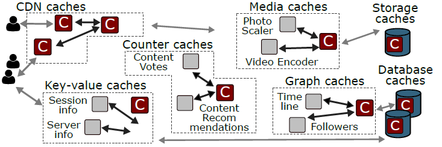

# The *CacheLib* Caching Engine: Design and Experiences at Scale

**摘要**

Web 服务几乎在系统架构的每一层都依赖于缓存。每个缓存通常都由不同的团队独立实现和维护，并且其功能高度定制化。例如，应用程序数据缓存独立于 CDN 缓存。然而，这种方法忽略了不同缓存系统面临共同的困难和挑战，大大增加了部署、维护和扩展每个缓存所需的总体工作。

本文提出了另一种开发缓存的方法，已在 Facebook 成功应用，它从原本不相关的缓存系统中提取了一组核心的通用需求和功能。*CacheLib* 是一种通用缓存引擎，基于 Facebook 的一系列缓存使用经验而设计，简化了缓存的开发和维护。于 2017 年首次在 Facebook 部署，目前支持 70 多项服务，包括 CDN、存储和应用程序数据缓存。本文描述了我们在从独立的、专门的缓存过渡到广泛采用 CacheLib 的过程中的经验。我们将解释 Facebook 的生产工作负载和用例的特征，**==如何驱动了重要的设计决策==**。我们描述了 Facebook 的缓存是如何随着时间的推移而演变的，包括部署 CacheLib 所带来的显着好处。我们还讨论了我们的经验对未来缓存设计和研究的影响。

## 1 简介

大型 Web 服务依靠缓存系统来实现高性能和高效率。例如，在 Facebook，CDN 缓存服务 70% 的 Web 请求，将延迟降低了一个数量级。单台缓存服务器可替代数十台后端数据库服务器，吞吐量提高20%，命中率超过80%。

在 Facebook，各种各样的缓存系统构成了系统架构不可分割的一部分。Facebook 的架构包括 CDN 缓存、应用程序键值缓存、<u>==社交图==</u>缓存和<u>==媒体==</u>缓存（图 1）。缓存在 Amazon [26]、Twitter [42、92]、Reddit [33、89] 和许多其他大型 Web 服务中扮演着类似的角色。

| **图 1**：大型 Web 服务依赖于许多子系统中的缓存来提高系统性能和效率 |
| :----------------------------------------------------------: |
|                                          |

**Facebook 的缓存系统**。过去，Facebook 的每个缓存系统都单独实现。例如，Facebook 单独设计了 CDN 缓存 [86]、键值缓存 [72]、社交图缓存 [17]、存储缓存 [71]、数据库缓存 [2] 等。人们相信，高度专业化的系统中需要高度专业化的缓存，以便实现复杂的一致性协议、利用自定义数据结构，并针对所需的硬件平台进行优化。

尽管这些缓存系统服务于不同的工作负载并需要不同的功能，但它们**共享许多重要的工程和部署挑战（第 2 节）**。所有这些系统每秒处理数百万个查询，缓存工作集大到需要同时使用闪存和 DRAM 进行缓存，**并且必须容忍由于应用程序更新而导致的频繁重启**，这在 Facebook 生产环境中很常见。随着 Facebook 缓存系统数量的增加，为每个系统维护单独的缓存实现变得难以为继。通过反复解决相同的硬工程挑战，团队重复彼此的工作，并产生冗余的代码。此外，单独维护的缓存系统享受不了**其他缓存系统性能优化带来的效率收益**。

因此，Facebook 面临着通用性和定制化之间的权衡。一个更通用的缓存解决方案可能会失去一些针对个别系统的特定领域的优化，但它可以减少开发成本，并提高系统之间的协同效率。为了平衡这种权衡，出现了通用缓存引擎 CacheLib。

**本文介绍了 Facebook 的可扩展缓存部署解决方案：CacheLib**。CacheLib 是一个 C++ 库，提供了一个通用的缓存功能核心，包括缓存索引的高效实现、逐出策略以及 DRAM 和闪存缓存的稳定性优化。CacheLib 通过一个简单的、线程安全的 API 公开其特性，允许程序员轻松构建和定制可扩展的、高度并发的缓存。CacheLib 既用于构建独立的缓存系统，**也用于向应用程序添加进程内缓存**。Facebook 的 CDN、社交图缓存、应用程序**旁路缓存**和块存储系统都使用使用 CacheLib 构建和定制的缓存。

自 2017 年以来，CacheLib 已投入生产，目前为 70 多种不同的服务提供支持。图 2 显示了 CacheLib 在此期间的增长情况。最初，CacheLib 取代了现有缓存，但自 2018 年年中以来，它促进了整个 Facebook 缓存的爆炸式增长，从而显着降低了后端负载。

| **图 2**：随着时间的推移，使用 CacheLib 构建的 Facebook 服务的数量。例如，其中一项服务是 Facebook 的键值缓存系统。最初的增长是由于现有系统的迁移，但最近，许多新系统都是使用 CacheLib 构建 |
| :----------------------------------------------------------: |
|                                          |

### 1.1 Lessons Learned from CacheLib

要开发一个有效的通用缓存框架，不仅需要了解 Facebook 中常见的缓存场景，还需要了解未来部署缓存的更普遍趋势。本节描述了一些场景，在这些场景中，缓存的**==传统智慧==**与我们在Facebook 生产环境中的经验并不匹配。

**专用缓存系统可以而且应该使用通用缓存引擎构建**。在 Facebook，CacheLib 已经取代了几个主要服务中现有的专用缓存，并促使许多新应用程序采用缓存。CacheLib 提供比任何单一的专用缓存系统更广泛的功能集。拥有共同的核心功能可以节省数万行冗余代码，提高系统稳定性，开发人员更容易部署和调优新缓存。此外，CacheLib 还充当优化和最佳实践的聚合点。因此，基于 CacheLib 构建的系统在单个生产服务器上实现了每秒一百万个请求的峰值吞吐量，命中率在 60% 到 90% 之间。为了实现这种性能，每个缓存系统都会定制自己的缓存，以使用其所需的 CacheLib 功能子集。为了容纳尽可能多的系统，CacheLib 的功能集随着时间的推移而增长。因此，曾经用于构建专用缓存系统的特性，现在可用于任何基于 CacheLib 的系统。

生产环境需要大规模缓存。先前对生产系统工作负载的研究 [4、5] 没有分享 Key 的流行分布。因此，流行的基准测试工具 [24、59] 和学术论文 [19、36、41、49、53、65、66、68、74、90、94] 假设形状参数 **α ≈ .9** 的 **==Zipf 流行模型==**^注1^。由此得出的结论是，在大多数情况下，基于 DRAM 的高速缓存就足够了。我们提供了强有力的证据，证明先前的模型对生产工作负载的可缓存性过于乐观。

> ^注1^[互联网中对象访问频率的91分布](https://blog.openacid.com/tech/zipf/)

由于 Facebook 的工作负载比通常假设的更难缓存，因此 Facebook 的缓存需要大量容量才能达到可接受的命中率。Facebook 的缓存系统通常由大型分布式系统组成，其中每个节点都有数百 GB 的缓存容量。这使得使用闪存进行缓存具有吸引力。**但是，大多数缓存系统历来都以 DRAM 为目标，并且使用闪存无法达到可接受的性能**。

**缓存不是一个已解决的问题**。自 2017 年首次部署以来，随着新场景和新需求的出现，CacheLib 不断添加功能。这些新功能已被现有 CacheLib 用户和使用 CacheLib 开发的新系统迅速广泛采用，因此 CacheLib 共享的核心功能随着应用程序的发展而增长。

### 1.2 Bridging the Gap between Research and Production Caching Systems

正如 Facebook 的开发人员在历史上开发了专门的缓存系统一样，我们注意到缓存文献通常针对专门的缓存系统。这对行业采用研究社区的想法构成了障碍，因为专业研究系统所做的假设很少与生产环境的现实完全一致。我们希望 CacheLib 能够为探索 Facebook 之外的新想法提供一个平台，从而减少这些障碍。CacheLib 和精选的 Facebook 工作负载将开源^1^。

> 更多信息，请移至 [www.cachelib.org](http://www.cachelib.org/)

## 2 动机：缓存场景

大型 Web 服务依赖于数百种专门服务，其中包含各种缓存场景。本节抽取了 Facebook 的六个生产系统，描述其缓存需求。

**分层和地理分布式缓存**。Facebook 的 CDN 侧重于为来自用户附近服务器的 HTTP 请求服务，返回静态媒体对象（例如照片、音频和视频块）。具体来说，部署在 Facebook 网络之外的 CDN 服务器的一个目标是减少通过广域网发送的字节数（字节未命中率）。Facebook 的数据中心内也有 CDN 服务器； 他们的目标是减少后端服务和存储的查询数量（对象未命中率）。每个 CDN 服务器都使用本地缓存，包括 DRAM 和闪存。

**应用程序的旁路缓存**。Web 应用程序有广泛的缓存需求。例如，应用程序必须缓存数据库查询、用户数据和使用统计信息。为每个应用程序提供专门的缓存服务效率低下且难以维护。因此，应用程序使用 RPC 访问一组共享缓存服务。每个缓存服务都包含一个大型分布式缓存系统。

**进程内缓存**。许多应用程序不能容忍远程缓存的 RPC 开销。CacheLib 使这些应用程序很容易包含与应用程序逻辑**解耦的高性能进程内缓存**。

例如，一些后端应用程序使用 CacheLib 缓存来存储客户端会话信息，用于限制客户端速率。具体来说，这些应用程序会缓存流量计数器，会看到这些计数器非常高的突发请求率，但一旦流量减慢就会被淘汰。在这种情况下，缓存的延迟和带宽要求使得远程缓存不可行。相反，应用程序实例化一个 CacheLib 缓存，它提供对缓存流计数器的**零拷贝访问**。

**机器学习模型服务系统**。面向用户的机器学习应用程序受益于多处缓存。首先，模型的输入通常是基于用户与内容的交互方式（例如，喜欢某段内容）。因此缓存内容交互计数器，应用程序可以快速访问<u>生成预测所需的输入</u>（例如，对内容进行排名）。其次，由于基于相同输入重复生成预测的计算成本很高，因此模型预测也会被缓存。

**后端存储缓存**。Facebook 的大型服务器集群使用**普通旋转磁盘**来存储持久数据块。即使在块存储服务器前面有多个缓存层，一些块仍然很受欢迎，足以超过磁盘**标称的 IOPS**。存储服务器使用闪存驱动器来缓存常用块，并保护旋转磁盘免受负载影响。为了支持**字节范围**的请求和追加操作，这些闪存缓存紧密集成在存储系统的技术堆栈中。

**数据库页缓冲区**。数据结构和小对象存储在各种数据库系统中。数据库系统使用页面缓存来增加吞吐量并减少访问延迟。为了支持一致性和事务性操作，页面缓存与数据库逻辑紧密集成。

在 Facebook ，我们发现有数百种不同的服务实现了缓存，或者它们的效率可以从缓存层中获益。这些用例**跨越数据中心堆栈和管理域的所有层**。缓存研究跨越操作系统 [16,52]、存储系统 [20, 58]、分布式系统 [8, 22, 66]、网络系统 [9, 65]、数据库 [30] 和计算机体系结构 [7, 56] , 91]。

CacheLib 通过提供一个组件**库**来处理这些不同的用例，从而可以轻松地快速构建高性能缓存。在许多情况下，CacheLib 缓存已经取代了 Facebook 高度专业化的缓存系统。CacheLib 目前用于数十个生产系统，涵盖上述六个示例中的五个。值得注意的是，CacheLib 当前不用作数据库页面缓冲区（请参阅第 6 节）。因此，虽然 CacheLib 不会取代所有专门的缓存系统，但我们已经看到 Facebook 广泛采用通用缓存引擎。

## 3 Facebook 各种缓存系统的共同挑战

尽管缓存用例多种多样，但我们扩展和维护缓存系统的经验揭示了一系列**核心挑战**，这些挑战在各种用例之间经常重叠。本节介绍 Facebook 的常见挑战。

本节中的数据是在 2019 年 12 月至 2020 年 5 月期间从各种缓存用例的 4 个重要工作负载中收集的（第 2 节）。*Lookaside* 和 *SocialGraph* 系统都来自应用程序数据缓存。*Lookaside* 是一项为各种应用程序提供按需的（旁路）缓存服务。*SocialGraph* 专门用于缓存来自 Facebook 社交图谱的信息。*Storage* 系统是后端存储的缓存，*CDN* 是 Facebook 的 CDN 中的缓存。每个工作负载代表其各自服务中一台机器的流量。

### 3.1 大型工作集

Facebook 面临的一个核心挑战是庞大的**工作集**。工作集描述了工作负载中的一组对象，这些对象很受欢迎，可以从缓存中受益。工作集较大的工作负载需要较大的缓存，以产生与工作集较小的工作负载相同的**命中率**。

要衡量工作集，必须考虑随时间推移看到的流行数据量，和随时间变化的数据流行度的变化率。因此，我们展示了 Facebook 的数据**热点分布**和**流失率**。

**流行度**。工作负载的流行度分布度量**采样跟踪中某个时间段内每个键的频率**。这些频率表示系统中不同对象相对的流行程度。先前对 CDN 和 Web 工作负载的测量表明，高度倾斜的 Zipf 分布是一种常见的流行度分布 [5、14、24、38、41、48、83、85]。非正式地，在 Zipf 分布中“最流行的 20% 的对象占 80% 的请求”。形式上，在 Zipf 分布中，第 *i* 个最受欢迎的对象的相对频率为 **1/iα**。虽然一些研究表明 α 低至 **0.56** [38, 40]，但大多数先前的测量表明 **0.9 < α ≤ 1** [5, 14, 24, 41, 48, 85]。在近期的许多系统论文中，这个参数范围已成为标准评估假设 [19, 36, 41, 49, 53, 65, 66, 68, 74, 90, 94]。

图 3 显示了 Facebook 四种工作负载在<u>==对数尺度==</u>上的流行度分布。在这个尺度上，Zipf 分布将是一条具有负斜率 (α) 的直线。*Lookaside* 是四个系统中唯一一个流行度分布为 Zipfian 且 α 接近 1 的系统。*Storage* 分布的尾部遵循 Zipf 分布，但在分布的头部非常平坦。此外，尽管 *SocialGraph* 和 *CDN* 是 Zipfian 分布，但呈现为 α = 0*.*55 和 α = 0*.*7。较低的 α 意味着更高比例的请求进入流行度分布的尾部，这导致更大的工作集。

| **图 3：许多服务难以缓存**。对于 Facebook 的四个生产系统的缓存，每张图都绘制了每个对象的请求数作为对象流行度排名的 (log-log) 函数。绿色虚线显示每个工作负载的最佳 Zipf 分布。较低的 *α* 值表示工作负载更难缓存，因此 SocialGraph 和 CDN 很难缓存。存储不是 Zipfian。每个样本包含超过 24 小时的请求。沿 x 轴的黑色垂直虚线显示线左侧流行对象的累积大小。 |
| :----------------------------------------------------------: |
|                                          |

**流失**。**流失**指的是由于引入新键，或者现有键的流行度随着时间而发生了变化，导致工作集也发发生了变化。流行的 YCSB [24] 工作负载生成器假设没有**流失**，即每个键在整个基准测试中都将保持同样的流行度。该基准和无流失假设被广泛用于系统论文的评估 [19, 36, 49, 53, 65, 66, 68, 74, 90, 94]。

在 Facebook 生产工作负载中，我们发现了很高的流失。如果一个对象属于接收最多请求 10% 的对象之一，我们定义它为**热门对象**。图 4 显示了热门象集如何随时间变化。例如，**x = 3** 处的蓝色条显示 3 小时前的热门对象仍然位于请求最多的前 10% 对象中的概率。在所有的工作负载中，超过三分之二的热门对象在一个小时后就跌出了前 10%。这种高流失率不受我们使用哪个小时作为基准、不同的百分位数（例如，前 25%）和不同的时间粒度（例如，10 分钟后，50% 的热门对象不再受欢迎）的影响。这种高流失率增加了时间局部性的重要性，并使缓存策略更难根据过去的访问模式来估计对象流行度。

|**图 4：对象的受欢迎程度随时间变化很快**。每个图表绘制了最受请求的前 10% 的对象在 x 小时后仍然受欢迎的概率。在所有的工作负载中，即使只有一个小时，受欢迎程度也会显著下降。 |
| :----------------------------------------------------------: |
|                                          |

### 3.2 大小差异

除了流行度和流失率之外，对象大小在缓存性能中也起着关键作用。图 5 显示了四个大型用例的对象大小分布。对于 *Storage* 和 *CDN* ，我们发现 64KB 和 128KB 的块分别非常常见，这是将大对象分成块的结果。对于 *Lookaside* 和 *SocialGraph* ，我们发现对象大小跨越超过七个数量级。注意小对象占主体，它们来自图的边/节点、RPC 计算结果和负缓存（参见第 4.3 节）。

| **图 5：对象大小差异很大，小对象很常见**。四种工作负载对象大小的分布。对象大小在对数刻度的 X 轴上显示。Y 轴显示了一个互补的 CDF —— 对小于给定大小的对象的请求比例。Lookaside 和 SocialGraph 工作负载中的对象大小很小。Storage 和 CDN 将大于 64 KB 和 128 KB 的对象分割成多个键。 |
| :----------------------------------------------------------: |
|                                          |

这些发现限制了通用缓存系统的设计空间。例如，许多现有的缓存系统 [3、32、35、37、70、75、79、87] 每条**缓存行 (64B)** 最多存储一个对象。对于像 *SocialGraph* 这样的系统，其中很大一部分对象在 10B 到 20B 之间，这种方法会浪费空间。另一个挑战是内存数据结构，它被用作闪存上对象的索引。在现有系统中，每个对象的开销在 8B 和 100B 之间有所不同 [32、37、70、79、86、87]。对于对象大小中位数为 100B 的系统，例如 *Lookaside*，这意味着需要 80GB - 1TB 的 DRAM 来索引 1TB 闪存上的对象。必须在处理**对象大小**剧烈变化的同时，限制内存和存储开销。

### 3.3 突发流量

另一个常见的主题是 Facebook 的流量非常有突发性。图 6 显示了实际请求的**到达率**与**泊松到达序列**的比较，在系统评估中通常假设后者 [53, 66, 73, 74, 84]。图 6 显示，实际的到达率比泊松所预测的变化更大。

| **图 6：请求非常有突发性**。与具有相同到达平均数的泊松到达序列（橙色）相比，2 小时范围内每两分钟的请求数（蓝色）。两个小时的窗口涵盖了一天内每项服务的高峰流量时间。CDN 具有特别高的短期爆发。 |
| :----------------------------------------------------------: |
|                                          |

这对于 *CDN* 来说尤为明显，它在相当稳定的请求率之上有急剧的流量爆发。可变到达率使得难以为缓存系统提供足够的资源以在负载高峰期间保持低延迟。

### 3.4 资源管理

为了提高效率，缓存应该利用所有可用资源而不超过它们。这对于 DRAM 尤为重要。一个常见的部署场景包括 CacheLib 以及应用程序进程和内核，所有这些都消耗 DRAM。随着工作负载组成或强度的变化，可用于缓存的内存可能会有很大差异。例如，处理可变大小对象的缓存通常具有不可预测的内存使用量。因此，尝试为缓存提供所有可用内存可能会导致内存过度使用，这是进程内缓存的众所周知的挑战 [78]。具体来说，由于内核中的 OOM-killer ，应用程序中的内存峰值可能导致缓存被丢弃。许多开源缓存系统没有 OOM 的意识 [87]，从而导致重大的运维挑战 [77]。CacheLib 动态分配和释放缓存使用的内存，以避免这些崩溃，而不会留下太多未使用的内存。

### 3.5 计算成本高的查询返回空结果

缓存系统通常专注于跟踪和存储有效后端查询的结果。但是，一些用例经常发送结果为空的查询，表明请求的对象不存在。这通常发生在跟踪用户之间关联的数据库系统中，在该系统中，用户可能会查询他们与另一个用户共同的熟人集合。对于后端数据库来说，此类查询的计算成本通常很高。例如，在查询社交图谱时，用户经常要求查看他们与其他用户共享的关联集，但发现这些关联并不存在。因此，在 *SocialGraph* 的工作负载中，我们测量到 55.6% 的请求是针对不存在的键。其余 44.4% 的请求是有效对象，这些请求中对应的缓存命中率为86.5%。未能缓存空结果将因此显着降低缓存命中率。

### 3.6 缓存数据结构的修改

缓存应该高效地支持结构化数据。这对于直接与应用程序数据结构交互的进程内缓存尤为重要。例如，第 2 节中描述的速率限制器，在一个缓存对象中保存多个字段。在更新缓存数据结构中的特定字段时，应用程序通常希望无须经过反序列化、更新、再重新序列化这样耗时的过程。

### 3.7 频繁重启

最后，生产缓存会频繁重启，以获取代码修复和更新。这是因为工程团队不仅需要快速推出新代码的能力，还需要快速回滚更改的能力。例如，75% 的 *Lookaside* 缓存和 95% 的 *CDN* 缓存的正常运行时间少于 7 天。即使像 *Storage* 和 *SocialGraph* 这样平均正常运行时间较长的系统，也会遵循每月定期维护计划，需要重新启动缓存进程。大多数缓存系统都是临时的，这意味着它们的内容会在应用程序重启时丢失 [37,55]。这是有问题的，因为大型缓存需要很长时间才能预热。在 Facebook 重新启动临时缓存后，缓存命中率需要数小时甚至数天才能稳定下来。之前的工作建议在重启后预热缓存的替代方案，但这需要一个明确的预热阶段作为路由 [33、72] 的一部分，或者需要缓慢的部署 [42]。

### 3.8 总结

虽然并非每个缓存用例都表现出上述所有挑战，但每个用例确实表现出其中的多个挑战。我们将在第 4 节中描述 CacheLib 如何解决这些问题。使用通用缓存引擎解决这些挑战的强大之处在于，使用 CacheLib 的所有应用都可以按需访问 CacheLib  的每个功能。

## 4 设计与实现

CacheLib 能够为广泛的用例构建快速、稳定的缓存。如第 2 节和第 3 节所述，为了解决这些用例中的常见挑战，通用缓存引擎必须有的功能确定如下：

**线程安全的缓存原语**：为了简化处理高度突发流量应用程序的编程，CacheLib 为读取、写入和删除提供了线程安全的 API。此外，线程安全简化了一致性和失效协议的实现。对 CacheLib API 的并发调用使缓存处于有效状态，如果引用公共键，则是线性化扩展 [47]，并引入最小的资源争用。

**透明的混合缓存**：为了在缓存大型工作集的同时实现高命中率，CacheLib 支持由 DRAM 和闪存组成的缓存，称为**混合缓存**。**混合缓存支持大规模部署缓存，每个节点的缓存容量达 TB 级**。CacheLib 通过提供相同的字节寻址接口（第 4.1 节）而不考虑底层存储介质，向应用程序程序员隐藏了闪存缓存系统的复杂性。这种透明性允许应用程序程序员忽略对象何时何地被写入不同的存储介质。它还增加了缓存应用程序的可移植性，允许应用程序在可用的新硬件配置上轻松运行。

**资源开销低**：CacheLib 在各种工作负载下实现了高吞吐量、低内存和CPU使用率（第 2 节）。这使得 CacheLib 适用于进程内的用例，在这些用例中，缓存必须与应用程序共享资源。**资源开销低让 CacheLib 可以支持含有许多小对象的用例**。

**结构化数据**：CacheLib 提供了数组和散列映射的本机实现，可以有效地缓存和修改它们，而不会产生任何序列化开销。缓存结构化数据使程序员可以轻松高效地将缓存与应用程序逻辑集成。

**动态资源监控、分配和 OOM 保护**：为了防止系统内存临时使用峰值导致崩溃，CacheLib 监控系统内存总使用量。CacheLib 动态分配和释放缓存使用的内存，以控制整体系统内存使用情况。

**热重启**：为了无缝处理代码更新，CacheLib 可以执行保持缓存状态的**热重启**。这克服了每次重新启动缓存时都需要预热缓存的问题。

### 4.1 CacheLib API

CacheLib API 设计得足够简单，允许应用程序程序员快速构建进程内缓存层，几乎不需要调优和配置。同时，CacheLib 必须能扩展**以支持复杂的应用程序级一致性协议**，以及**零拷贝数据**以实现高性能。选择一个既简单又强大的 API 是 CacheLib 设计中的一个重要问题。

API 以 `Item` 概念为中心，它是缓存对象的抽象表示。`Item` 允许对底层对象进行字节寻址访问，而不管该对象是存储在 DRAM 还是闪存中。对缓存的 `Items` 的访问是通过 `ItemHandle` 控制的，它可以对缓存的 `Items` 进行引用计数。当构造或销毁 `ItemHandle` 对象时，相应 `Item` 的引用计数器将分别递增或递减。除非引用计数为 0，否则无法将 `Item` 从缓存中逐出。如果具有非零引用计数的 `Item` 过期或被删除，现有的 `ItemHandles` 将保持有效，但不会为 `Item` **==发布==**新的 `ItemHandles`。

图 7 显示了基本的 CacheLib API。要将新对象插入缓存， `allocate` 可能（根据淘汰策略）先清除另一个 `Item`，只要没有**未完成的** `ItemHandles` 引用它。新的 `Item` 可以配置一个过期时间(TTL)，在给定的**内存池**中（见下文）创建，可以单独配置以提供**==强大的隔离保证==**。任何新 `Item` 只有在对应的 `ItemHandle` 上完成 `insertOrReplace` 操作后才可见。

| **图 7**：CacheLib API 使用 `Item`来表示缓存的对象，而不管它是缓存在 DRAM 中还是缓存在闪存中。 |
| :----------------------------------------------------------: |
|                                          |

为了访问缓存的 `Items`，`find` 从键创建一个 `ItemHandle`，之后 `getMemory` 允许对与 `Item` 关联的内存进行非同步的零拷贝访问。要以原子方式更新 `Item`，可以为他们想要更新的键 `allocate` 一个新的 `ItemHandle`，使用 `getMemory` 执行更新，然后用新的 `ItemHandle` 调用 `insertOrReplace` 使更新可见。由于为了性能，CacheLib 客户端访问原始内存，因此 CacheLib **相信**用户会使用 `markNvmUnclean` 方法忠实地指示任何修改。最后，`remove` 删除由键标识的 `Item`，表示底层对象的失效或删除。

| **图 8**：类型化的 `ItemHandles`允许 CacheLib 以本地方式存储结构化对象。除了静态大小的 `Items` 外，CacheLib 还支持可变大小的 `Items`。例如，CacheLib 实现了一个可以动态增长的 hashmap（被视为可回收的缓存 `Item`），提供对其 `Items` 的零拷贝访问。 |
| :----------------------------------------------------------- |
|                                          |

图 8 显示了 CacheLib 对结构化数据的本机支持的一个简单示例。结构化的 `Items` 通过 `TypedHandle` 访问，它提供与 `ItemHandle` 相同的方法。`TypedHandles` 可以低开销访问用户定义的数据结构，这些结构可以像普通 `Items` 一样被缓存和淘汰。<u>除了静态大小的数据结构外，CacheLib 还支持**可变大小的数据结构**； 例如，CacheLib 实现了一个简单的 hashmap，它支持范围查询、数组和可迭代缓冲区</u>。

CacheLib 在 C++ 中实现这些 API，并绑定到其他语言，例如 Rust。

### 4.2 架构概述

CacheLib 被设计成具有足够的可扩展性，以容纳具有高度可变大小的大规模工作集（第 3.1 节）。为了降低每个对象的开销，单个 CacheLib 缓存由多个子系统组成，每个子系统都针对特定的存储介质和对象大小进行定制。具体来说，CacheLib 由 DRAM 缓存和闪存缓存组成。闪存缓存又由两个缓存组成：大对象缓存 (LOC) ，是大小 **≥ 2KB** 的 `Items`；小对象缓存 (SOC)，是大小 **< 2KB** 的 `Items`。

通过在 DRAM 中分配空间来满足 `allocate` 请求，必要时从 DRAM 中逐出 `Items`。被逐出的 `Items` 要么进入闪存缓存（可能导致另一次逐出），要么被丢弃。`find`请求依次检查 DRAM 中的对象，然后是 LOC，最后是 SOC。这种查找顺序最大限度地减少了缓存的平均内存访问时间 [46]（请参阅附录 A）。`find` 调用会立即返回一个 `ItemHandle`。如果请求的对象位于 DRAM 上，则可以使用此 `ItemHandle`。如果请求的对象位于闪存上，则异步获取该对象，一旦对象位于 DRAM 中，`ItemHandle` 就可以使用了。返回空的 `ItemHandle` 表示缓存未命中。图 9 总结了这些数据访问路径。

| **图 9**：使用 CacheLib 构建的混合缓存的 `find` 和 `allocate` 路径。 |
| :----------------------------------------------------------- |
|                                          |

我们现在更详细地描述 CacheLib 的子系统。

**DRAM 缓存**。CacheLib 的 DRAM 缓存的查找使用<u>链式哈希表</u>。DRAM 缓存可以划分为单独的**池**，每个池都有自己的逐出策略。程序员在调用 `allocate`  时选择一个特定的 `PoolId`（参见图 7），从而允许在单个缓存实例中隔离不同类型的流量。

为了提高性能，使用 `slab` 类 [6, 22, 37] 分配缓存内存， `slab` 类存储大小相似的对象。CacheLib 使用 4MB slab 并自定义实现了 `slab` 分配器。每个 slab 需要 7B 的 DRAM（3B 的内部元数据 + 4B 用于标识 `slab` 中对象的大小）。因为 CacheLib 工作负载通常包含许多特定大小的对象（例如 80B），所以每个 `slab` 类对应的大小是根据每个工作负载配置的，以最大限度地减少碎片。4.3 节中描述了对小于 64B 或大于 4MB 的对象的进一步优化。

每个 slab 类都维护自己的淘汰策略状态。CacheLib 旨在支持新淘汰策略的持续发展，目前支持 LRU、多插入点 LRU、2Q [54、93] 和 TinyLFU [31]。这些逐出策略在开销和对新鲜程度或频率的偏好上有所不同，因此也是基于不同的工作负载进行配置。为了近似全局淘汰策略，使用已知的**==重平衡算法 [72]==** 在 slab 类之间重新平衡内存。为了支持这些策略和其他特性，CacheLib 为每个 `item` 分配了 31B 的 DRAM 开销。表 1 描述了元数据，及其 DRAM 开销。

 
 
<B>表 1</B>：CacheLib 的 DRAM 缓存每个 item 使用 31B 的元数据。

 

为了保证原子元数据操作，CacheLib 依赖于各种已知的优化技术 [35、62、64]，包括细粒度锁定、用户空间互斥锁和 C++ `atomics`。这对于逐出策略尤为重要，简单实现会导致锁竞争，并限制吞吐量 [6、9、10、61]。例如，在 LRU 下，热门的 `Items` 经常竞争重置到**最近使用的位置 (MRU) **。由于请求率很高，这在 Facebook 尤为常见（参见图 6）。CacheLib 采用一种简单的解决方案来减少争用：最近重置到 MRU 位置的 `Items` 在一段时间 *T* 内不会被再次重置[9, 87]。只要 *T* 比对象穿透 LRU 列表所花费的时间（即淘汰时间）短得多，这种简化就不会影响实践中的命中率。CacheLib 还使用高级锁定机制，例如**==平面组合 [45]==** 来减少资源争用。

**闪存缓存**。当  `Items` 从 DRAM 缓存中移出时，可以选择将它们写入闪存缓存。由于热点对象的高流失率（第 3 节），闪存上缓存的内容不断变化。因此，除了每个对象保持较低的开销外，CacheLib 还必须应对闪存单元**==有限写入的耐久性==**。

为了降低**写入闪存的速率**^注1^，CacheLib 有选择地将对象写入闪存缓存。如果一个对象存在于闪存中并且在 DRAM 中没有被更改，则不会将其写回闪存。否则，CacheLib 会根据可配置的准入策略缓存需要在闪存上保存的对象。CacheLib 的默认准入策略是以固定概率 *p* [57] 将对象缓存进闪存。调整概率 *p* 允许对闪存的写入速率进行细粒度控制。第 5 节描述了我们在更复杂准入策略方面的经验。

> ^注1^这里感觉是写入频率

闪存耐久性的另一个考虑因素是**写入放大**，即写入设备的字节数大于插入缓存的字节数。例如存储元数据，CacheLib 需要额外的写入，并被迫以块粒度写入。我们区分了**应用层**写放大和**设备层**写放大，前者发生在 CacheLib 本身写入闪存的字节大于插入对象的大小时，后者由闪存设备固件引起。CacheLib 的闪存缓存经过精心设计，以平衡写入放大源和 DRAM 开销。

**大对象缓存 (LOC) **用于在闪存上存储大于 2KB 的对象。由于 LOC 对象大于 2KB，因此 LOC 中唯一对象的数量将只有数百万。

因此，在内存中保存 LOC 的索引可行。**LOC 使用 DRAM 中的分段 B+ 树 [23、34、63] 来存储  `Items` 在闪存中的位置**^注2^。`Items` 与 4KB 闪存页面对齐，因此闪存位置是一个 4B 长、对齐 4KB 的地址。这允许 LOC 索引多达 16TB 的闪存存储空间。

> ^注2^代码里还没看到 B 树。

LOC 使用闪存进一步限制 DRAM 索引的大小。Key 被哈希为 8B。第一个 4B 标识 B+ 树的段，第二个 4B 用作树段中的 Key，用于查找闪存位置。DRAM 索引中的哈希冲突将导致 CacheLib 认为它已找到对象在闪存中的位置。因此，作为对象元数据的一部分，LOC 将每个对象 Key 的完整副本存储在闪存上，并在从闪存中取出对象后验证 Key。每个闪存设备都被划分为区域，每个区域存储不同大小范围的对象。因此，对象大小可以从它在闪存上的位置推断出来，而无需在 DRAM 中明确存储对象大小。那么只需要从闪存中一次读取正确的字节数，CacheLib 就能读取对象。为减少存储在 DRAM 中的闪存地址，每个 4KB 闪存页面最多存储一个对象及其元数据。这节省了空间，因为 LOC 只存储大于 2KB 的对象。大于 4KB 的对象可以跨越多个页面。因为 LOC 在页面级别进行读写，所以任何碎片也会导致应用层的写放大。

为了分摊闪存擦除的计算成本，LOC 的缓存策略逐出整个区域而不是单个对象（区域大小是可配置的，例如 16MB）。默认情况下，使用 FIFO（先进先出方式），严格按顺序擦除区域 [60]。顺序写入提高了闪存转换层的性能，并大大降低了设备级写入放大（参见第 5.2 节）。如果以 FIFO 的方式淘汰了一个热点对象，它可能会被重新提交到缓存中 [86]。或者，LOC 支持伪 LRU 策略，该策略以区域粒度跟踪新鲜度。对区域中任何对象的请求，在逻辑上将该区域重置到 MRU 位置。从闪存中淘汰会擦除 LRU 位置的整个区域。

**小对象缓存 (SOC)**用于在闪存上存储小于 2KB 的对象。由于单个 1TB 闪存设备可以容纳数十亿个小对象，因此精确的查找索引（以及每个对象关联的元数据）将不合理地使用大量 DRAM [32]。因此，SOC 使用近似索引，与闪存页面数量成正比。

| **Figure 10**: SOC alloc proceeds by hashing into sets (I). CacheLib then rewrites the page (II), possibly evicting an object (following FIFO order). Finally, CacheLib recalculates the bloom filter with the Items currently stored in this set’s 4KB page (III). |
| :----------------------------------------------------------- |
|                                          |

SOC 将 key 哈希到集合中。每个集合标识一个 4KB 闪存页面，用于存储多个对象，对象按 FIFO 顺序从集合中逐出。这种设计的简单实现总是从闪存中读取一页以确定它是否包含特定对象。作为优化，CacheLib 在 DRAM 中为每个集合维护了一个 8B Bloom filter，每个集合有 4 个探针。这个过滤器包含闪存页面上存储在集合中的 Key， 90% 以上的时间里防止了不必要的读取 [11, 12]。图 10 显示了 `alloc` 路径，图 11 显示了 `find` 路径。

| **Figure 11**: SOC find proceeds by hashing into sets (I) and then checking a bloom filter, which indicates whether an object is likely to be stored on flash (II). If the bloom filter does not contain the key, the object is definitely not present on flash. Otherwise, CacheLib reads the 4KB flash cache and searches for the key (III)*. |
| :----------------------------------------------------------- |
|                                          |

**控制 SOC 中的写放大尤其具有挑战性**。将对象纳入到 SOC 需要写入整个 4KB 闪存页面，是应用层写入放大的重要来源。这也适用于从闪存中删除对象的删除操作。类似，因为 key 被哈希到集合中，所以向 SOC 写入一批对象是随机写入，从而导致更高的设备层写入放大。此外，SOC 只支持不需要在命中时更新状态的清除策略，例如 FIFO，因为在命中时更新集合需要写入一个 4KB 页面。这些挑战凸显了**复杂准入策略**的重要性（见第 5.2 节）。

### 4.3 高级功能的实现

CacheLib 支持许多有苛刻要求的应用程序。为了能高效支持这些应用，CacheLib 实现了多个高级特性，基于 CacheLib 的所有服务，都可以在相同通用的 CacheLib API 下使用这些功能。我们描述了四个重要特性的实现：结构化 `item`、缓存大对象和小对象、热重启和资源监控，对应于第 3 节中已经讨论的挑战。

**结构化 `item`**。因为 CacheLib 提供对缓存内存的原始访问，所以可以使用 CacheLib API 轻松缓存平面数据结构。此外，CacheLib 原生支持**数组**和 **Map**：支持固定大小对象的数组类型，数组中的每个条目都没有额外开销。Map 类型支持可变对象大小，**==并有有序和无序两种变体==**。每个 Map 条目的开销是 4B，用于存储每个条目的大小。

**在 DRAM 中缓存尺寸不同大小的对象**。为存储超过 4MB 的对象，CacheLib 将多个 DRAM `Items` 链接在一起成为一个逻辑大 `Item`。这种链接需要链中每个对象额外的 4B 下一个指针。大对象最常见的场景是结构化 `Item` 的存储。虽然单个逻辑对象大于 4MB 的情况并不常见，但我们经常看到合计超过 4MB 的 `Arrays` 或 `Maps`。

CacheLib 还有**紧凑型 DRAM 缓存**，用于缓存小于缓存行（cache line，通常为 64B 或 128B）的对象。紧凑型缓存将具有相同 Key-Value  大小的对象存储在单个缓存行中 [18、29、46、80]。紧凑型缓存是集合关联缓存，其中每个缓存行都是一个由 Key 的哈希值索引的集合。LRU 淘汰是通过在缓存行中重新定位对象来完成的。紧凑缓存中的每个对象没有额外开销。

使用紧凑型缓存的一个突出例子是 CacheLib 对**==负缓存==**的支持。**负缓存对象表示后端查询先前已返回空结果**。负缓存对象是固定大小的小对象，只需要存储一个 Key 来识别空查询。正如第 3.5 节中所述，负缓存显着提高了 *SocialGraph* 中的命中率。*Lookaside*、*Storage* 或 *CDN* 不使用负缓存，但 10 个最大的基于 CacheLib 的系统中，有 4 个使用了它。

这两个特性都加强了 CacheLib 的总体设计，即为不同大小的对象提供专门的解决方案，以保持每个对象的低开销。

**动态资源使用和监控**。CacheLib 监控总系统内存使用情况，并不断调整 DRAM 缓存大小以保持在指定范围以下。CacheLib 公开了几个参数来控制内存使用机制。如果系统可用内存低于 `lowerLimitGB` 字节，CacheLib 将迭代释放 `upperLimitGB` 和 `lowerLimitGB` 之间差异的 `percentPerIteration` 百分比，直到系统空闲内存超过 `upperLimitGB`。这个过程最多可以释放总缓存大小的 `maxLimitPercent`，防止缓存变得太小。虽然释放内存可能会导致淘汰，但此功能是为了防止彻底崩溃，这对缓存命中率来说要糟糕得多（参见图 15）。随着系统空闲内存的增加，CacheLib 通过类似的过程增加缓存。

**热重启**。CacheLib 通过使用 **==POSIX 共享内存==**分配 DRAM 缓存空间来实现热重启 [76]。应用关闭期间，可将其缓存状态保留在共享内存中。应用重新启动后可以获得缓存状态的所有权。默认情况下，DRAM 缓存将其索引永久保存在共享内存中。所有其他 DRAM 缓存状态在关闭期间被序列化到共享内存中。LOC B-tree 索引和 SOC 布隆过滤器在关机期间被序列化并写入闪存的专用部分。

## 5 评估

在评估 CacheLib 时，我们旨在展示 CacheLib 的 API 和功能集足够灵活，可以在 Facebook 内外应对常见用例。具体来说，我们展示了基于 CacheLib 的系统可以轻松实现与专用解决方案竞争的性能，而无需对核心缓存引擎进行任何专门的优化。我们还展示了广泛采用 CacheLib，对 Facebook 生产环境产生的重大影响。

### 5.1 系统比较

我们使用 CacheLib 附带的缓存基准测试工具 *CacheBench* 来驱动我们的实验。为了进行比较，我们将 CacheBench 扩展为 Memcached [37] 的进程内版本以及 HTTP 代理 (CDN) 缓存。

CacheBench 通过从可配置的流行度、Key 大小和对象大小分布中采样，提供了一个模块化的请求生成器。为了模拟流失，CacheBench 以可配置的速率不断地引入新 Key。我们<u>基于第 3 节中介绍的应用的旁路缓存和 CDN 用例</u>设置参数值

**应用程序旁路缓存**。在开发 CacheLib 之前，Facebook 的几个团队使用 Memcached 的内部变体作为旁路缓存。但是，应用程序现在使用基于 CacheLib 的旁路缓存。因此，我们将 CacheLib 与变化最小的 Memcached v1.6.6 进行比较，后者是包含许多最新优化的最新版本。为了公平起见，我们将 CacheLib 和 Memcached 配置为都使用各自 LRU 淘汰策略。为了实现旁路模式，CacheBench 配置 CacheLib 实现 **set** 为 `allocate` 后跟 `insertOrReplace`，实现 **get** 为 `find`，并随后访问 `ItemHandle` 的 `getMemory` 方法。

我们使用 32 个线程在一系列缓存大小上评估 CacheLib 和 Memcached。当缓存较小时，命中率较低，这会给淘汰代码路径（ **set** 操作）带来压力。缓存大时，命中率高，对 LRU-head 更新代码路径（ **get** 操作）造成压力。

| **图 12**：CacheLib 与 Memcached 的在不同缓存大小时的比较。CacheLib 和 Memcached 实现了相似的命中率，但 CacheLib 吞吐量更高。 |
| :----------------------------------------------------------: |
|                                         |

图 12 显示了缓存大小介于 8 GB 和 144GB 之间，以及 1 亿个对象的典型工作集的命中率和吞吐量。Memcached 和 CacheLib 实现了类似的命中率，Memcached 在小缓存大小时略高，在大缓存大小时略低。在所有缓存大小中，CacheLib 实现了比 Memcached 更高的吞吐量，每秒处理的请求比 Memcached 多 60%。

CacheLib 的高吞吐量主要归功于减少锁竞争的优化。例如，CacheLib 使用**平面组合**（参见第 4.2 节）来减少对 LRU 列表头上的竞争。此外，CacheLib 在该实验中使用 *T* = 60 秒（请参阅第 4.2 节）。对于 *T* = 10 秒，CacheLib 始终优于 Memcached 的命中率，但代价是吞吐量较低。在生产中，大多数部署使用默认的 *T* = 60 秒。

**HTTP 服务器缓存**。混合 DRAM 闪存的缓存在 Facebook 很流行。例如混合缓存作为 CDN 代理缓存。我们将基于 CacheLib 的 HTTP 服务器缓存与 NGINX 和 Apache Traffic Server (ATS) 进行比较，后者广泛用于构建基于闪存的 CDN [1、44、69、82]。CacheLib 实现是一个带有 NGINX 前端的 FastCGI 服务器。每个系统都使用其默认配置的 512GB 闪存缓存。系统从高性能的原始后端获取错误，而这绝不会成为瓶颈。

为了说明对象大小对闪存缓存性能的影响，我们将所有对象大小配置为相等，然后对一系列对象大小重复实验。为了在整个试验中保持命中率不变，我们调整了唯一对象的数量以保持恒定的工作集大小。

图 13 显示 CacheLib 对用闪存缓存小对象的显式处理比 NGINX 和 ATS 有相当大的优势。随着对象尺寸变大，这种优势逐渐减弱。最终，对象大小变得足够大，以至于所有三个系统都受网络限制，并且它们的吞吐量急剧下降。

| **图 13**：针对不同对象大小，CacheLib 与 ATS 和 NGINX HTTP 用闪存作缓存系统的比较。CacheLib 显著提高了大多数对象大小的吞吐量。 |
| :----------------------------------------------------------- |
|                                         |

我们观察到 NGINX 在对象大小介于 4KB 和 16KB 之间时表现特别好，在对象大小为 8KB 时略胜 CacheLib。我们无法查明造成这种趋势的原因。尽管如此，CacheLib 在各种对象大小上都优于 NGINX 和 ATS。

**基于 LSM 树的存储**。人们很自然地会问，以闪存设备为目标的、现有存储系统是否可以用作闪存缓存系统。特别是，Facebook 的 RocksDB [13] 键值存储使用**日志结构合并树**（LSM-Tree）提供 DRAM 和闪存的混合存储。我们在生产中部署 RocksDB 缓存 *SocialGraph* 工作负载的数据，研究了 RocksDB 是否可以用作应用程序数据的混合旁路缓存。

RocksDB 以较高的空间使用率来换取较低的写入和删除延迟，使用**墓碑**将删除操作推迟到压缩时间 [13]。然而，大多数合并方法计算量大，必须谨慎使用。因此，使用 RocksDB 的 `Delete` 方法来执行对象的针对性淘汰是不可行的，因为合并发生的频率不足以让删除控制闪存的占用空间。如果 RocksDB 填满了闪存设备，则会导致写入和删除操作失败。这在 *SocialGraph* 系统中尤其成问题，它依赖于删除来维持缓存一致性。如果 *SocialGraph* 缓存在一定数量的删除失败，策略是执行冷重启（参见图 15）以恢复一致性。

作为替代方案，我们使用 FIFO 合并来测试 RocksDB，当存储的大小超过其所需大小时，它会简单地淘汰最旧的数据。这种合并方法足够轻量级，可以持续运行并有效地限制 RocksDB 的闪存使用。淘汰最旧的数据往往会淘汰**最近最少更新**的对象，但这些通常与**最近最少使用**的对象不同。RocksDB 没有提供跟踪哪些块包含最近使用对象的功能。由于其简单的淘汰策略，在使用生产 *SocialGraph* 工作负载进行测试时，RocksDB 的命中率仅为 53%，而 CacheLib 的命中率为 76%。此外，FIFO 合并下的 RocksDB 存在严重的读取放大，因此需要比 CacheLib 高 50% 的 CPU 利用率才能满足生产吞吐量水平。因此，尽管基于 LSM 树的解决方案的一些原则可以延续到闪存缓存的设计中，但我们得出结论，RocksDB 本身并不适合 Facebook 的缓存场景。

### 5.2 生产环境中的 CacheLib

通过分析 CacheLib 引入的显著缓进，量化 CacheLib 对 Facebook 生产环境的影响。

**DRAM 开销**。按设计 LOC 和 SOC 的 DRAM 开销很小； 在生产环境中，我们分别测量不到 0.1% 和 0.2%。DRAM 缓存的开销通常较低 (*\<* 7%)。DRAM 开销有两个主要来源：`slab` 类的碎片和元数据开销（第 4.2 节）。调优 CacheLib 的 slab 对于限制碎片至关重要。当前是手动调优。如果不进行调优，许多集群中的碎片化开销会增加一倍以上。不幸的是，我们不知道 **==slab 类边界==**的自动调优算法^2^。附录 B 中详细分析了 DRAM 开销。

> ^2^之前的工作考虑了如何在固定 slab 类 [22] 之间划分缓存空间，但没有首先考虑如何优化边界的定义。从概念上讲，这个问题类似于直线上的设施放置问题 [15]，但我们不知道最优算法。

**闪存持久性**。CacheLib 被设计用来限制对闪存的写入速率，以延长闪存设备的使用寿命（请参阅第 4.2 节）。我们现在评估这个设计的有效性。

由于使用 4KB 页面和以及缓存不同大小的对象会产生碎片，LOC 会导致应用层写入放大。碎片通常很小，但 *Storage* 和 *CDN* 缓存分别有 4.9% 和 7% 的碎片开销。<u>为了进一步减少写放大，CacheLib 最近引入了一项新功能，该功能可以在将区域刷新到磁盘之前，缓存对区域的所有写入</u>。这使得应用程序可以以最小 512 字节的大小写入，从而将 *CDN* 缓存中的碎片从 7% 减少到 2%。

LOC 使用 FIFO 而不是 LRU 淘汰策略，使得 CacheLib 按顺序写入闪存。按顺序写入将设备级写放大从 1*.*5 降低到 1*.*05，但会略微增加应用层写放大。最终效果是每秒向 [NAND 闪存设备](https://web.archive.org/web/20100610065251/http://www.computerworld.com/s/article/349425/Flash_Memory)的写数量减少了 15%。

由于始终写入 4KB（即使对象大小 *<* 2KB），SOC 会导致应用层写入放大。<u>==平均而言，我们测得大约是插入字节数的 6*.*5 倍==</u>。SOC 还会因写入随机 4KB 页面 而导致显著的设备层写放大[43]。根据工作负载，我们测得此开销介于 1*.*1（*Lookaside*）和 1*.*4（*Storage*）之间。

为了达到这种级别的设备级写入放大，闪存通常会超额配置 50%。这种过度配置被 SOC 的空间效率和闪存相对于 DRAM 的低成本所抵消，但在保持当前性能水平的同时减少闪存过度配置是 Facebook 面临的一个公开挑战。

为了进一步限制写入闪存设备的字节数，CacheLib 使用闪存缓存的准入策略。默认的 CacheLib 准入策略以固定概率缓存对象，可延长闪存设备的使用寿命，但也会因为随机拒绝而降低命中率。CacheLib 还包括 *reject first* 准入策略，该策略在对象从 DRAM 中淘汰的前 *n* 次拒绝缓存对象。

最近，CacheLib 实现了一个更高级的准入策略，类似于 [32] 中提出的 *Flashield* 策略，通过预测对象未来的热度来做出快速准入决策。**Flashield 的预测基于对象在 DRAM 中接收到的命中次数**。然而，在 Facebook，大多数对象在 DRAM 中停留的时间不够长，无法获得多次点击。因此对超出 DRAM 缓存生命周期的对象，CacheLib 实现了对象请求频率的有效跟踪。然后使用这些频率来预测，如果缓存对象进闪存，会有多少次命中。附录 C 中详细描述了使用此高级准入策略的经验。它将 *SocialGraph* 中写入闪存的速率降低了 44%，但命中率并未降低。

**命中率**。CacheLib 的 DRAM 缓存最初使用 LRU 淘汰策略的变体。当我们部署基于 2Q 的淘汰策略 [54] 时，各系统的命中率显著提高。例如，*SocialGraph* 缓存的命中率提高了 5 个百分点，*CDN* 缓存的命中率提高了 9 个百分点。

由于部署了大容量 **DRAM-闪存**混合缓存，命中率有了更大的提高。需要大量缓存容量的服务通常由两层层次结构组成，其中 **L1 DRAM-only 缓存**转发未命中的请求到 **L2 DRAM-闪存混合缓存**。<u>==为了**了解**混合缓存带来的改进，我们比较 *SocialGraph* L2 缓存的命中率，一个是部署了混合缓存的 L2 缓存，一个部署了 DRAM-only 缓存的 L2 缓存==</u>。*SocialGraph* 的 DRAM-only L2 缓存目前达到 25% 的命中率。混合高速缓存 L2 提供了 20 倍以上的高速缓存容量，实现了 60% 的命中率，且比仅使用 DRAM  的部署成本低25%。

图 14 显示了 *Lookaside*、*SocialGraph* 和 *CDN* 集群（一些最大的 CacheLib 部署）的 L1 和 L2 缓存的命中率分布。L1 缓存比 L2 缓存实现更高的命中率，命中率中值范围从 75% (*CDN* ) 到 92% (*SocialGraph* )，而 L2 缓存命中率中值范围从 67% (*CDN* ) 到 75% （*SocialGraph*）。这些系统的综合命中率非常高：介于 95-99% 之间。

| **图 14**：典型一天中，排名前四的 CacheLib 用户的服务器的命中率分布。 |
| :----------------------------------------------------------: |
|                                         |

**热重启的影响**。图 15 显示了 L1 和 L2 *SocialGraph* 缓存在不执行热重启的情况下重启的命中率。如果不启用此功能，缓存重启会导致命中率下降，然后慢慢恢复正常。这在 L2 混合缓存中尤其具有破坏性，其中大容量缓存可能需要几天时间才能**预热**。这种命中率下降可能转化为后端系统的临时过载，后端系统假设了相对稳定的到达率。

| **图 15**：SocialGraph L1 缓存（左）和 L2 缓存（右）在缓存重启期间的命中率。当禁用热重启时，命中率会受到影响。 |
| :----------------------------------------------------------: |
|                                         |

## 6 经验与讨论

**Facebook 使用 CacheLib 的经验在很大程度上揭示了现代缓存系统的发展轨迹**。

**很多系统都采用了新功能**。人们可能认为 CacheLib 的许多特性最终只适用于少数服务。然而，我们的经验显示了相反的趋势：**为一个特定服务开发的功能经常被大量基于 CacheLib 的其他服务所采用**。例如，混合缓存和高效**对象过期** (TTL)，都是在 CacheLib 的初始部署之后添加的。今天，五个大型的 CacheLib 用例使用混合缓存。<u>最初添加对象过期是为了在旁路缓存中强制==公平共享==</u>，但后来被需要定期刷新静态内容的 CDN 缓存采用。然而，并非每个系统都使用每个功能。使用通用缓存引擎并不等同于开发一种单一的、放之四海而皆准的缓存方法。相反，我们的目标是**从提取通用缓存功能中**获益，同时仍然允许高度的灵活性一便定制缓存。

**性能改进有助于许多系统**。由于 Facebook 广泛部署了基于 CacheLib 的系统，即使 CacheLib 中的小性能改进（参见第 5.2 节）也会产生巨大的影响。部署新功能通常涉及简单的代码更新或配置更改。进行集中改进的能力促使人们不断努力优化 CacheLib 代码库。例如，<u>在撰写本文时，LOC 索引实现（参见第 4 节）更改为使用新的稀疏哈希图实现，将 CPU 利用率降低了 0.5%，而内存开销没有变化</u>。虽然单个系统的 CPU 减少 0.5% 可能不值得开发成本，但 Facebook 所有混合缓存的 0.5% 减少相当于节省了大量资源。这突出了通用引擎相对于定制引擎的优势。

**提高稳定性**。通用缓存引擎的另一个好处是由于将以前不相交的实现减少到一个成熟的、经过良好测试的平台而提高了稳定性。在构建新系统时，使用 CacheLib 大大减少必须引入生产环境的新代码行数。这降低了生产事故和停机的可能性。根据多年在生产环境中部署缓存的经验，CacheLib 还提供了明确的稳定性机制。

**没有单一的缓存系统占主导地位**。有人可能会问，将 CacheLib 工程方面的努力集中在适应一小部分用例上，而不是广泛部署CacheLib 是否足够。为了回答这个问题，我们比较了每个系统使用的 DRAM 缓存总量^3^。图 16 显示前十名用户占所有 DRAM 缓存使用量的 89%，但没有单一服务占主导地位。例如，前两大服务分别仅占 DRAM 使用量的 25% 和 20%。因此，除非 CacheLib 可以适应许多不同的用例，否则优化 CacheLib 的总体收益将是有限的。

> ^3^并非所有服务都使用混合缓存，尤其是注重吞吐量的 L1 缓存。

|       |
| :----------------------------------------------------------: |
|    **图 16**：大量 Facebook 服务是使用 CacheLib 构建。我们根据服务的总 DRAM 缓存大小来衡量服务的部署大小。没有一项服务的缓存空间超过 Facebook 服务总缓存空间的 25%。 |

**在闪存中缓存标志着范式转变**。人们可能认为缓存命中率通常很高，因此预计闪存提供的额外缓存容量不会带来什么好处。虽然在某些情况下确实如此，但高命中率并不总是意味着额外的缓存容量是无用的。具体来说，工程师提供缓存是为了平衡 DRAM 下一个字节的边际成本和随之而来的命中率增加的边际效益。闪存缓存改变了这种成本计算方式，将额外缓存容量的边际成本降低了一个数量级。**==这使得部署新的混合缓存有价值，因为它大幅增加了缓存容量，而这对单独的 DRAM 没有意义==**。

此外，对于大多数系统来说，缓存命中的好处不再是严格意义上的延迟问题。虽然缓存的经典观点表明缓存只有在减少平均内存访问时间时才有价值 [46]，但这忽略了缓存未命中的连锁反应，例如增加网络拥塞、后端负载和后端功耗。从这个角度来看，命中闪存与命中 DRAM 一样有价值，尽管闪存比 DRAM 慢几个数量级。这再次提示边际成本计算的规模有利于部署闪存。

**CacheLib 并不总能带来性能提升**。基于 CacheLib 的系统并不总是优于它们从一开始就取代的专用系统。例如，*CDN* 系统的第一个基于 CacheLib 的实现，无法与优化了闪存缓存性能的原始 *CDN* 系统相提并论，原始系统实现了**具有低闪存写入速率的高级淘汰策略**。在测试中，第一个基于 CacheLib 的 *CDN* 的实现，比专用系统**低 10% 的命中率**，**高 20% 的闪存写入率**。

在部署基于CacheLib 实现的 *CDN* 之前，对CacheLib进行了优化，以改进混合缓存机制。LOC 淘汰策略从纯 FIFO 淘汰扩展为包括**重新读取策略**，该策略可以在淘汰频繁请求的对象时重新读取。还在 DRAM 和闪存缓存之间添加了**写缓冲区**。这些缓冲区通过减少由于 4KB 对齐写入造成的内部碎片来减少应用层的写放大。写缓冲区还允许 CacheLib 向闪存发出更少、更大的写入，从而减少设备层写放大。

改进后的 LOC 淘汰策略实现了接近专用系统的命中率，同时对闪存的写入比专用系统少 10%。**==如果关闭这两项优化，几乎不会增加开销==**，而且最终也会提高其他基于 CacheLib 的系统的性能。以 *Lookaside* 为例，经过这些改变后，P99 闪存读取延迟减少了 25%，闪存写入速率降低了 2%。

*CDN* 示例说明了通用化和专业化平衡的常见情况：CacheLib 并不总是从一开始就满足每个用例的需求。然而，专用系统所需的功能通常与 CacheLib 的设计并非根本不兼容。<u>如果愿意花时间在 CacheLib 中构建必要的功能</u>，他们就能够访问 CacheLib 的完整功能集，同时将新的优化输出到 Facebook 其他的缓存系统中。

**CacheLib 并不适用于所有用例**。尽管 CacheLib 适用许多用例，但我们知道一些限制阻止了一些人采用 CacheLib。例如，一些广告服务系统依赖于缓存**嵌套**数据结构。为了控制其内存使用并快速将 `Items` 从 DRAM 序列化到闪存中，CacheLib 仅支持**==映射到平面地址空间的数据结构==**。因此，这些广告服务系统无法采用 CacheLib。

另一个例子是 RocksDB，它想使用 CacheLib 来实现其内部页面缓冲区。CacheLib 的 C++ API 利用对象构造函数和析构函数对 `ItemHandle` 对象执行引用计数。这最终阻止了程序员将 CacheLib 与 RocksDB 的 C 风格代码库集成。然而，自动引用计数的简便性导致 CacheLib 被广泛采用用于 C++ 和基于 Rust 的用例。

## 7 相关工作

有大量关于缓存系统的研究，包括对各个生产缓存系统的深入描述。我们回顾了业界和学术界先前在网络和数据中心缓存方面的相关工作。

**业界缓存系统**。缓存系统存在于许多主要的 Web 服务中。Akamai 的地理分布式 CDN [9, 28, 39, 67, 81, 85]，Microsoft 的 Web 缓存系统 [8]，Amazon 使用聚合缓存 [26]，以及 Facebook 的许多独立缓存系统 [5, 48, 71, 72 , 86] 都记录在文献中。同样，Twitter [42, 92] 和 Reddit [33, 89] 经常谈论他们基于开源缓存系统的 DRAM 缓存。CacheLib 提供了一个单一的、通用缓存引擎，解决了这些独立系统所面临的挑战的超集。

**学术界缓存系统**。学术研究考虑了优化缓存系统的许多不同方面。其中包括构建高度并发的系统 [6、9、35、62、64] 和提高命中率 [6、9、10、21、50、51、61、88]。Facebook 的目标是使用 CacheLib 作为平台，以更轻松地评估和部署基于这项研究的系统。

虽然文献主要关注 DRAM 缓存，但之前也有一些关于闪存缓存的工作 [32、57、60、86]。CacheLib 结合了 [86] 和 [60] 中的想法，通过在闪存上进行 FIFO 淘汰来减少写放大。同样，CacheLib 包括 [57] 的准入策略和 [32] 准入策略的变体（参见附录 C）。

<u>尽管在 CacheLib 中可以实现动态缓存分区</u>，但现有研究对 Facebook 缓存分区策略的影响有限。分区可用于消除缓存命中率作为**大小函数** [7, 22, 88] 的性能悬崖，但性能悬崖并不是 Facebook 的主要问题。正如 RobinHood [8] 的作者在他们的工作中指出的那样，当基础设施在不同后端系统之间共享时，RobinHood 分区方案是<u>==有限的==</u>，Facebook 就是这种情况。此外，读取存储在闪存上的对象的大小的计算开销太高，无法在实践中使用大小感知分片 [27]。

## 8 结论

缓存是现代数据中心应用程序的一个重要组成部分，本文只是触及了其中众多挑战和机遇的皮毛。CacheLib 表明构建通用缓存引擎来解决各种缓存用例是可行的。在分享我们构建和部署 CacheLib 的经验时，我们希望从不断壮大的缓存研究人员社区征求想法和反馈，并鼓励其他生产系统分享他们的架构和工作负载。我们希望 CacheLib 将成为工业界和学术界最佳实践的聚合点，实现性能的持续改进，并促进缓存在许多新应用程序中的部署。在未来的缓存系统中，有许多令人兴奋的方向可以探索，包括 **(i)** 更好的资源管理策略（例如，淘汰/准入策略、内存管理）； **(ii)** 新兴硬件平台（例如 FPGA 加速、非易失性存储器、分区命名空间 SSD）； **(iii)** 新颖的应用程序功能（例如，在**负缓存**中所看到的）。我们期待着发展 CacheLib 来应对各种挑战。

## 附录

### A. 缓存查找顺序和延迟

CacheLib 的查找顺序 1) DRAM 缓存，2) LOC，3) SOC。请注意，事先不知道对象的大小。因此，在 DRAM 缓存未命中后，CacheLib 不知道对象是存储在 LOC 还是 SOC 中。因此，它必须首先查询其中一个，如果未命中，则查询另一个。

CacheLib 的查找顺序是由以下对平均查找惩罚（也称为平均内存访问时间，AMAT [46]）的分析所驱动的。<u>我们将每个缓存组件的查找惩罚视为确定某个对象未缓存在该组件中的时间</u>。**我们的关键假设**是从 DRAM 读取比闪存读取快几个数量级（例如，100ns 与 16us [25] 相比）。因此，DRAM 缓存的查找惩罚是一些内存引用（比如 500ns）。

要计算 LOC 的惩罚，**回想一下，LOC 为了减少 DRAM 元数据开销，既不在内存中存储对象的Key，也不存储对象的确切大小**。LOC 通过 4 字节哈希分区 B 树进行索引，每个 B 树使用 4 字节哈希来标识对象的偏移量。如果整个 8 字节哈希值没有哈希冲突，那么 LOC 的查找惩罚由一些内存引用组成（比如 1us，由于哈希操作）。如果存在哈希冲突，则 LOC 需要 (16us) 从闪存读取数据，来比较对象 Key，并确定**未命中状态**。假设最小的 LOC 对象大小 (2KB) 和 1TB 闪存，LOC 中最多存储 5.36 亿个对象。因此，可以计算出 8 字节哈希冲突的概率小于百万分之一，LOC 的平均查找惩罚略高于 1us。

要计算 SOC 的惩罚，**请记住 SOC 不使用内存中索引**。SOC 利用每页的 Bloom 过滤器（例如 1us）来<u>投机地</u>确定**未命中状态**。然而，由于这些布隆过滤器很小，它们的错误率为 10%。如果出现布隆过滤器错误，SOC 需要 (16us) 从闪存读取数据来比较对象 Key。因此，SOC 的平均查找惩罚为 2.6us。

默认顺序为（1）DRAM缓存，（2）LOC，（3）SOC，CacheLib 的平均延迟（AMAT）如下，其中*L*表示查找延迟，*H*命中率：*L（DRAM） + (1 - H(DRAM)) × (L(LOC) + (1 − H(LOC)) × L(SOC))* 。随着 SOC 和 LOC 的顺序颠倒，平均延迟将增加几微秒，具体取决于 LOC 和 SOC 命中率。因此 CacheLib 最后查询 SOC。

### B. DRAM 开销的明细

**DRAM 缓存**。我们将 CacheLib 的 DRAM 缓存开销定义为**其总内存占用量**与**缓存的键和值大小之和**之间的比率。我们进一步将开销分解为 slab 碎片和元数据。在 *Lookaside*、*Storage* 和 *SocialGraph* 中，我们发现总体开销在 2.6% 到 7% 之间，并且平均分配给碎片和元数据。

|                      | *Lookaside* | *Storage* | *SocialGraph* |
| -------------------- | ----------- | --------- | ------------- |
| **Fragmentation**    | 3.9%        | 3%        | 1.6%          |
| **Metadata**         | 3%          | 4%        | 1%            |
| **Overall overhead** | 6.9%        | 7%        | 2.6%          |

**大对象缓存**。回想一下，虽然 LOC 使用 8 字节哈希，但 4 字节用于分区 B 树，因此不需要计算在内。因此，LOC 存储 4 个字节用于 Key 的哈希值，4 个字节用于闪存偏移量，平均每项存储 2.5 个字节用于 B 树指针。对于小型 LOC 对象，这是 0.61%。在生产系统中，这种开销很低，范围从 0.01%（*Storage*）到 0.1%（*Lookaside*）。

### C. Flash 高级准入策略

使用闪存进行缓存的一项重大挑战是闪存设备的写入耐久性有限。如果混合缓存中所有从 DRAM 淘汰的对象都被允许进入闪存，我们将观察到写入速率比闪存设备实现其目标寿命的写入速率高出 50%。因此，闪存准入策略在 CacheLib 的性能中起着重要作用。

Flashield [32] 是最近提出的闪存准入策略。Flashield 依赖于观察对象遍历混合缓存的 DRAM 部分。当对象从 DRAM 中淘汰时，Flashield 根据对象在 DRAM 中被访问的频率做出闪存准入决定。

不幸的是，Facebook 的场景中，缓存对象在 DRAM 的生命周期太短，Flashield 无法发挥作用。如果存储在闪存中，相当数量的对象足够热门，足以产生命中，但不会收到 DRAM 缓存命中。事实上，对于 L2 *Lookaside* 缓存，只有 14% 被考虑用于闪存准入的对象，在 DRAM 中接收到读取或写入。

###### 为了使 Flashield 背后的主要思想适应 Facebook 的环境，CacheLib 明确地收集了关于对象的 DRAM 缓存生命周期之外的特征。我们使用布隆过滤器记录过去六个小时的访问^4^。此外，我们将准入策略的预测指标从 **flashiness** 的抽象概念更改为直接预测对象未来预期接收的读取次数。

> ^4^具体来说，我们使用 6 个 Bloom 过滤器，每个设置为容纳 1 小时的访问。每小时重置最旧的 Bloom 过滤器，并用于跟踪即将到来的一小时。这些 Bloom 过滤器配置为，在观察到的最大查询率时**假阳性为 0.02%**。Bloom 过滤器的空间效率对于避免使用过多的 DRAM 是必要的，每个存储的 Key 使用 8 个字节来存储历史有太多的空间开销。

我们的高级准入政策已在 *SocialGraph* 的生产环境中进行了培训和部署。CacheLib 闪存缓存的默认准入策略是以固定概率接纳对象，从而使闪存写入速率低于预期的目标速率。与此默认准入策略相比，高级准入策略在不降低缓存命中率的情况下，向闪存设备写入的字节数减少了 44%。因此，虽然**==训练高级准入策略==**所需的模型可能很麻烦，但该策略的收益显着延长了闪存设备在生产中的使用寿命。

## 感谢

## 参考

1. Companies using apache traffic server. https://trafficserver.apache.org/users.html. Accessed: 2019-04-22.
2. Lior Abraham, John Allen, Oleksandr Barykin, Vinayak Borkar, Bhuwan Chopra, Ciprian Gerea, Daniel Merl, Josh Metzler, David Reiss, Subbu Subramanian, et al. Scuba: diving into data at facebook. *VLDB*, 6(11):1057– 1067, 2013.
3. Apache. Traffic Server, 2019. Available at https:// trafficserver.apache.org/, accessed 04/13/19.
4. Timothy G Armstrong, Vamsi Ponnekanti, Dhruba Borthakur, and Mark Callaghan. Linkbench: a database benchmark based on the facebook social graph. In *ACM SIGMOD*, pages 1185–1196, 2013.
5. Berk Atikoglu, Yuehai Xu, Eitan Frachtenberg, Song Jiang, and Mike Paleczny. Workload analysis of a large-scale key-value store. In *ACM SIGMETRICS*, volume 40, pages 53–64, 2012.
6. Nathan Beckmann, Haoxian Chen, and Asaf Cidon. Lhd: Improving hit rate by maximizing hit density. In *USENIX NSDI*., pages 1–14, 2018.
7. Nathan Beckmann and Daniel Sanchez. Talus: A simple way to remove cliffs in cache performance. In *IEEE HPCA*., pages 64–75, 2015.
8. Daniel S. Berger, Benjamin Berg, Timothy Zhu, Mor Harchol-Balter, and Siddhartha Sen. RobinHood: Tail latency-aware caching dynamically reallocating from cache-rich to cache-poor. In *USENIX OSDI*, 2018.
9. Daniel S. Berger, Ramesh Sitaraman, and Mor HarcholBalter. Adaptsize: Orchestrating the hot object memory cache in a cdn. In *USENIX NSDI*, pages 483–498, March 2017.
10. Aaron Blankstein, Siddhartha Sen, and Michael J Freedman. Hyperbolic caching: Flexible caching for web applications. In *USENIX ATC*, pages 499–511, 2017.
11. Burton H Bloom. Space/time trade-offs in hash coding with allowable errors. *Communications of the ACM*, 13(7):422–426, 1970.
12. Flavio Bonomi, Michael Mitzenmacher, Rina Panigrahy, Sushil Singh, and George Varghese. An improved construction for counting bloom filters. In *European Symposium on Algorithms*, pages 684–695, 2006.
13. Dhruba Borthakur. Under the hood: Building and open-sourcing rocksdb, 2013. Facebook Engineering Notes, available at [http://bit.ly/2m02DGV,](http://bit.ly/2m02DGV) accessed 09/02/19.
14. Lee Breslau, Pei Cao, Li Fan, Graham Phillips, and Scott Shenker. Web caching and Zipf-like distributions: Evidence and implications. In *IEEE INFOCOM*, pages 126–134, 1999.
15. Jack Brimberg and Abraham Mehrez. Location and sizing of facilities on a line. *Top*, 9(2):271–280, 2001.
16. Tanya Brokhman, Pavel Lifshits, and Mark Silberstein. GAIA: An OS page cache for heterogeneous systems. In *USENIX ATC*, pages 661–674, 2019.
17. Nathan Bronson, Zach Amsden, George Cabrera, Prasad Chakka, Peter Dimov, Hui Ding, Jack Ferris, Anthony Giardullo, Sachin Kulkarni, Harry Li, et al. TAO: Facebook’s distributed data store for the social graph. In *USENIX ATC*, pages 49–60, 2013.
18. Brad Calder, Chandra Krintz, Simmi John, and Todd Austin. Cache-conscious data placement. In *ACM SIGPLAN Notices*, volume 33, pages 139–149, 1998.
19. Badrish Chandramouli, Guna Prasaad, Donald Kossmann, Justin Levandoski, James Hunter, and Mike Barnett. Faster: A concurrent key-value store with in-place updates. In *ACM SIGMOD*, pages 275–290, 2018.
20. Zhifeng Chen, Yan Zhang, Yuanyuan Zhou, Heidi Scott, and Berni Schiefer. Empirical evaluation of multi-level buffer cache collaboration for storage systems. In *ACM SIGMETRICS*, pages 145–156, 2005.
21. Ludmila Cherkasova. Improving WWW proxies performance with greedy-dual-size-frequency caching policy. Technical report, Hewlett-Packard Laboratories, 1998.
22. Asaf Cidon, Assaf Eisenman, Mohammad Alizadeh, and Sachin Katti. Cliffhanger: Scaling performance cliffs in web memory caches. In *USENIX NSDI*, pages 379–392, 2016.
23. Douglas Comer. Ubiquitous b-tree. *ACM Computing Surveys (CSUR)*, 11(2):121–137, 1979.
24. Brian F Cooper, Adam Silberstein, Erwin Tam, Raghu Ramakrishnan, and Russell Sears. Benchmarking cloud serving systems with ycsb. In *ACM SoCC*, pages 143– 154, 2010.
25. Jeff Dean and P Norvig. Latency numbers every programmer should know, 2012.
26. Giuseppe DeCandia, Deniz Hastorun, Madan Jampani, Gunavardhan Kakulapati, Avinash Lakshman, Alex Pilchin, Swaminathan Sivasubramanian, Peter Vosshall, and Werner Vogels. Dynamo: amazon’s highly available key-value store. In *ACM SOSP*, volume 41, pages 205–220, 2007.
27. Diego Didona and Willy Zwaenepoel. Size-aware sharding for improving tail latencies in in-memory key-value stores. In *USENIX NSDI*, pages 79–94, 2019.
28. John Dilley, Bruce M. Maggs, Jay Parikh, Harald Prokop, Ramesh K. Sitaraman, and William E. Weihl. Globally distributed content delivery. *IEEE Internet Computing*, 6(5):50–58, 2002.
29. Ulrich Drepper. What every programmer should know about memory. Technical report, Red Hat, Inc., November 2007.
30. Gil Einziger, Ohad Eytan, Roy Friedman, and Ben Manes. Adaptive software cache management. In *ACM Middleware*, pages 94–106, 2018.
31. Gil Einziger and Roy Friedman. Tinylfu: A highly efficient cache admission policy. In *IEEE Euromicro PDP*, pages 146–153, 2014.
32. Assaf Eisenman, Asaf Cidon, Evgenya Pergament, Or Haimovich, Ryan Stutsman, Mohammad Alizadeh, and Sachin Katti. Flashield: a hybrid key-value cache that controls flash write amplification. In *USENIX NSDI*, pages 65–78, 2019.
33. Daniel Ellis. Caching at reddit, January 2017. Available at https://redditblog.com/2017/01/17/caching-at-reddit/, accessed 09/02/19.
34. Ramez Elmasri and Sham Navathe. *Fundamentals of database systems*. 7 edition, 2015.
35. Bin Fan, David G Andersen, and Michael Kaminsky. MemC3: Compact and concurrent memcache with dumber caching and smarter hashing. In *USENIX NSDI*, pages 371–384, 2013.
36. Bin Fan, Hyeontaek Lim, David G Andersen, and Michael Kaminsky. Small cache, big effect: Provable load balancing for randomly partitioned cluster services. In *ACM SoCC*, page 23, 2011.
37. Brad Fitzpatrick. Distributed caching with memcached. *Linux journal*, 2004(124):5, 2004.
38. Phillipa Gill, Martin Arlitt, Zongpeng Li, and Anirban Mahanti. Youtube traffic characterization: a view from the edge. In *ACM IMC*, pages 15–28, 2007.
39. David Gillman, Yin Lin, Bruce Maggs, and Ramesh K Sitaraman. Protecting websites from attack with secure delivery networks. *IEEE Computer*, 48(4):26–34, 2015.
40. Lei Guo, Enhua Tan, Songqing Chen, Zhen Xiao, and Xiaodong Zhang. The stretched exponential distribution of internet media access patterns. In *ACM PODC*, pages 283–294, 2008.
41. Syed Hasan, Sergey Gorinsky, Constantine Dovrolis, and Ramesh K Sitaraman. Trade-offs in optimizing the cache deployments of cdns. In *IEEE INFOCOM*, pages 460–468, 2014.
42. Mazdak Hashemi. The infrastructure behind twitter: Scale, January 2017. Available at https://blog.twitter.com/engineering/en_us/topics/infrastructure/2017/the-infrastructure-behind-twitter-scale.html, accessed 09/02/19.
43. Jun He, Sudarsun Kannan, Andrea C Arpaci-Dusseau, and Remzi H Arpaci-Dusseau. The unwritten contract of solid state drives. In *ACM EuroSys*, pages 127–144, 2017.
44. Leif Hedstrom. Deploying apache traffic server, 2011. Oscon.
45. Danny Hendler, Itai Incze, Nir Shavit, and Moran Tzafrir. Flat combining and the synchronization-parallelism tradeoff. In *Proceedings of the twenty-second annual ACM symposium on Parallelism in algorithms and architectures*, pages 355–364, 2010.
46. John L Hennessy and David A Patterson. *Computer architecture: a quantitative approach*. Elsevier, 4 edition, 2011.
47. Maurice P Herlihy and Jeannette M Wing. Linearizability: **A correctness condition for concurrent objects**. *ACM Transactions on Programming Languages and Systems*, 12(3):463–492, 1990.
48. Qi Huang, Ken Birman, Robbert van Renesse, Wyatt Lloyd, Sanjeev Kumar, and Harry C Li. An analysis of Facebook photo caching. In *ACM SOSP*, pages 167–181, 2013.
49. Sai Huang, Qingsong Wei, Dan Feng, Jianxi Chen, and Cheng Chen. **Improving flash-based disk cache with lazy adaptive replacement**. *ACM Transactions on Storage*, 12(2):1–24, 2016.
50. Akanksha Jain and Calvin Lin. Back to the future: leveraging belady’s algorithm for improved cache replacement. In *ACM/IEEE ISCA*, pages 78–89, 2016.
51. Jaeheon Jeong and Michel Dubois. Cache replacement algorithms with nonuniform miss costs. *IEEE Transactions on Computers*, 55(4):353–365, 2006.
52. Song Jiang, Xiaoning Ding, Feng Chen, Enhua Tan, and Xiaodong Zhang. **Dulo: an effective buffer cache management scheme to exploit both temporal and spatial locality**. In *USENIX FAST*, volume 4, pages 8–8, 2005.
53. Xin Jin, Xiaozhou Li, Haoyu Zhang, Robert Soulé, Jeongkeun Lee, Nate Foster, Changhoon Kim, and Ion Stoica. **Netcache: Balancing key-value stores with fast in-network caching**. In *ACM SOSP*, pages 121–136, 2017.
54. Theodore Johnson and Dennis Shasha. 2Q: A low overhead high performance buffer management replacement algorithm. In *VLDB*, pages 439–450, 1994.
55. Poul-Henning Kamp. Varnish notes from the architect, 2006. Available at https://www.varnish-cache. org/docs/trunk/phk/notes.html, accessed 09/12/16.
56. Svilen Kanev, Juan Pablo Darago, Kim Hazelwood, Parthasarathy Ranganathan, Tipp Moseley, Gu-Yeon Wei, and David Brooks. Profiling a warehouse-scale computer. In *ACM/IEEE ISCA*, pages 158–169, 2015.
57. Eunji Lee and Hyokyung Bahn. Preventing fast wear-out of flash cache with an admission control policy. *Journal of Semiconductor technology and science*, 15(5):546– 553, 2015.
58. Baptiste Lepers, Oana Balmau, Karan Gupta, and Willy Zwaenepoel. Kvell: the design and implementation of a fast persistent key-value store. In *ACM SOSP*, pages 447–461, 2019.
59. Jacob Leverich. The mutilate memcached load generator, August 2012. Available at https://github.com/ leverich/mutilate, accessed 08/20/19.
60. Cheng Li, Philip Shilane, Fred Douglis, and Grant Wallace. Pannier: Design and analysis of a container-based flash cache for compound objects. *ACM Transactions on Storage*, 13(3):24, 2017.
61. Conglong Li and Alan L Cox. Gd-wheel: a cost-aware replacement policy for key-value stores. In *EUROSYS*, pages 1–15, 2015.
62. Sheng Li, Hyeontaek Lim, Victor W Lee, Jung Ho Ahn, Anuj Kalia, Michael Kaminsky, David G Andersen, O Seongil, Sukhan Lee, and Pradeep Dubey. Architecting to achieve a billion requests per second throughput on a single key-value store server platform. In *ACM ISCA*, pages 476–488, 2015.
63. Yinan Li, Bingsheng He, Robin Jun Yang, Qiong Luo, and Ke Yi. Tree indexing on solid state drives. *Proceedings of the VLDB Endowment*, 3(1-2):1195–1206, 2010.
64. Hyeontaek Lim, Dongsu Han, David G Andersen, and Michael Kaminsky. MICA: A holistic approach to fast in-memory key-value storage. In *USENIX NSDI*, pages 429–444, 2014.
65. Ming Liu, Liang Luo, Jacob Nelson, Luis Ceze, Arvind Krishnamurthy, and Kishore Atreya. Incbricks: Toward in-network computation with an in-network cache. In *ACM ASPLOS*, pages 795–809, 2017.
66. Zaoxing Liu, Zhihao Bai, Zhenming Liu, Xiaozhou Li, Changhoon Kim, Vladimir Braverman, Xin Jin, and Ion Stoica. Distcache: Provable load balancing for large-scale storage systems with distributed caching. In *USENIX FAST*, pages 143–157, 2019.
67. Bruce M Maggs and Ramesh K Sitaraman. Algorithmic nuggets in content delivery. *ACM SIGCOMM CCR*, 45:52–66, 2015.
68. Yandong Mao, Eddie Kohler, and Robert Tappan Morris. Cache craftiness for fast multicore key-value storage. In *ACM EuroSys*, pages 183–196, 2012.
69. Tony Mauro. Why netflix chose nginx as the heart of its cdn. [https://www.nginx.com/blog/](http://www.nginx.com/blog/)why-netflix-chose-nginx-as-the-heart-of-its-cdn. Accessed: 2020-04-22.
70. Domas Mituzas. Flashcache at facebook: From 2010 to 2013 and beyond, October 2013. Facebook Engineering, available at https://bit.ly/3cMXfvT, accessed 04/23/20.
71. Subramanian Muralidhar, Wyatt Lloyd, Sabyasachi Roy, Cory Hill, Ernest Lin, Weiwen Liu, Satadru Pan, Shiva Shankar, Viswanath Sivakumar, Linpeng Tang, et al. f4: Facebook’s warm BLOB storage system. In *USENIX OSDI*, pages 383–398, 2014.
72. Rajesh Nishtala, Hans Fugal, Steven Grimm, Marc Kwiatkowski, Herman Lee, Harry C Li, Ryan McElroy, Mike Paleczny, Daniel Peek, Paul Saab, et al. Scaling memcache at facebook. In *USENIX NSDI*, pages 385– 398, 2013.
73. Henry Qin, Qian Li, Jacqueline Speiser, Peter Kraft, and John Ousterhout. Arachne: core-aware thread management. In *USENIX OSDI*, pages 145–160, 2018.
74. KV Rashmi, Mosharaf Chowdhury, Jack Kosaian, Ion Stoica, and Kannan Ramchandran. Ec-cache: Loadbalanced, low-latency cluster caching with online erasure coding. In *USENIX OSDI*, pages 401–417, 2016.
75. Redis, 2019. https://redis.io/, accessed 04/23/20.
76. Kay A. Robbins and Steven Robbins. *Practical UNIX Programming: A Guide to Concurrency, Communication, and Multithreading*. Prentice-Hall, 2003.
77. Emanuele Rocca. Running Wikipedia.org, June 2016. Available at [https://www.mediawiki.org/](http://www.mediawiki.org/wiki/File:WMF_Traffic_Varnishcon_2016.pdf), accessed 09/12/16.
78. Goldwyn Rodrigues. Taming the oom killer. *LWN*, February 2009.
79. Mohit Saxena, Michael M. Swift, and Yiying Zhang. Flashtier: A lightweight, consistent and durable storage cache. In *ACM EuroSys*, page 267–280, 2012.
80. Chris Sears. The elements of cache programming style. In *USENIX ALS*, pages 283–298, October 2000.
81. Ramesh K. Sitaraman, Mangesh Kasbekar, Woody Lichtenstein, and Manish Jain. Overlay networks: An Akamai perspective. In *Advanced Content Delivery, Streaming, and Cloud Services*. John Wiley & Sons, 2014.
82. Zhenyu Song, Daniel S Berger, Kai Li, and Wyatt Lloyd. Learning relaxed belady for content distribution network caching. In *USENIX NSDI*, pages 529–544, 2020.
83. Kunwadee Sripanidkulchai, Bruce Maggs, and Hui Zhang. An analysis of live streaming workloads on the internet. In *ACM IMC*, pages 41–54, 2004.
84. Akshitha Sriraman and Thomas F Wenisch. *µ*tune: Autotuned threading for OLDI microservices. In *USENIX OSDI*, pages 177–194, 2018.
85. Aditya Sundarrajan, Mingdong Feng, Mangesh Kasbekar, and Ramesh K Sitaraman. Footprint descriptors: Theory and practice of cache provisioning in a global cdn. In *ACM CoNEXT*, pages 55–67, 2017.
86. Linpeng Tang, Qi Huang, Wyatt Lloyd, Sanjeev Kumar, and Kai Li. RIPQ: advanced photo caching on flash for facebook. In *USENIX FAST*, pages 373–386, 2015.
87. Francisco Velázquez, Kristian Lyngstøl, Tollef Fog Heen, and Jérôme Renard. *The Varnish Book for Varnish 4.0*. Varnish Software AS, March 2016.
88. Carl Waldspurger, Trausti Saemundsson, Irfan Ahmad, and Nohhyun Park. Cache modeling and optimization using miniature simulations. In *USENIX*, pages 487– 498), 2017.
89. Neil Williams. Reddit’s architecture, November 2017. QCon SF slide set, available at https://qconsf.com/sf2017/system/files/presentation-slides/qconsf-20171113-reddits-architecture.pdf, accessed 09/02/19.
90. Xingbo Wu, Fan Ni, Li Zhang, Yandong Wang, Yufei Ren, Michel Hack, Zili Shao, and Song Jiang. Nvmcached: An nvm-based key-value cache. In *ACM SIGOPS Asia-Pacific Workshop on Systems*, pages 1– 7, 2016.
91. Yuejian Xie and Gabriel H Loh. Pipp: promotion/insertion pseudo-partitioning of multi-core shared caches. *ACM SIGARCH Computer Architecture News*, 37(3):174–183, 2009.
92. Yao Yue. **Cache à la carte: a framework for inmemory caching**, September 2015. Strange Loop slide set, available at [https://www.youtube.com/watch?](http://www.youtube.com/watch?v=pLRztKYvMLk) , accessed 09/02/19.
93. Yuanyuan Zhou, James Philbin, and Kai Li. The multiqueue replacement algorithm for second level buffer caches. In *USENIX ATC*, pages 91–104, 2001.
94. Timothy Zhu, Anshul Gandhi, Mor Harchol-Balter, and Michael A Kozuch. Saving cash by using less cache. In *USENIX HOTCLOUD*, 2012.