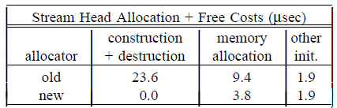
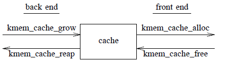
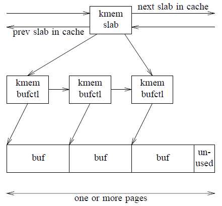
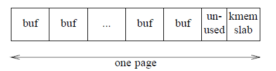

# The Slab Allocator: An Object-Caching Kernel Memory Allocator

**摘要**

本文对 SunOS 5.4 内核内存分配器的设计进行了全面的概述。该分配器基于一组对象缓存原语，这些原语通过**在多次使用之间保留复杂对象的状态**来降低分配复杂对象的成本。事实证明，这些相同的原语对于管理无状态内存（例如数据页和临时缓冲区）同样有效，因为它们节省空间且速度快。分配器的对象缓存动态响应全局内存压力，并采用<u>对象着色方案</u>来提高系统整体的缓存利用率和总线平衡。分配器还具有多种统计和调试功能，可以检测整个系统中的各种问题。

## 1.简介

对象的分配和释放是内核中最常见的操作之一。因此，一个快速的内核内存分配器是必不可少的。**然而，许多情况下，初始化和销毁对象的成本超过为其分配和释放内存的成本**。因此，虽然对分配器进行改进是有益的，但通过缓存经常使用的对象，从而在多次使用之间保留它们的基本结构，可以获得更大的收益。

本文首先讨论对象缓存，因为它所需要的接口将影响分配器的其余部分。下一节将详细描述实现。第 4 节描述了<u>缓冲区地址分配对系统整体缓存利用率和总线平衡的影响</u>，并展示了一个如何改善两者的简单着色方案。第 5 节将分配器的性能与其他几个著名的内核内存分配器进行比较，发现它在空间**和**时间方面通常都更优越。最后，第 6 节描述了分配器的调试功能，它可以检测整个系统中的各种问题。

## 2.对象缓存

对象缓存是一种用于<u>处理频繁分配和释放对象</u>的技术。其思想是在使用之间保留对象初始状态的不变部分——它的**构造**状态，这样就不必在每次使用时都销毁和重新创建对象。例如，一个包含互斥锁的对象只需要调用一次 `mutex_init()` —— 即第一次分配对象时。然后可以多次释放和重新分配该对象，而不会每次都产生 `mutex_destroy()` 和 `mutex_init()` 的开销。对象的嵌入式锁、条件变量、引用计数、（包含）其他对象的列表和只读数据通常都符合构造状态。

缓存很重要，因为构建对象的成本可能比为其分配内存的成本高得多。例如，在运行 SunOS 5.4 开发内核的 SPARC station-2 上，此处介绍的分配器将分配和释放 **stream header** 的成本从 33 微秒减少到 5.7 微秒。如下表所示，大部分节省是由于对象缓存：



缓存在多线程环境中特别有用，在多线程环境中，大量最频繁分配的对象都包含一个或多个嵌入式锁、条件变量和其他可构造状态。对象缓存的设计很简单:

**分配对象**:
```
if (there’s an object in the cache) 
  take it (no construction required);
else{
  allocate memory;
  construct the object;
}
```
**释放对象**:
```
  return it to the cache (no destruction required);
```
**从缓存中回收内存**：
```
  take some objects from the cache; 
  destroy the objects;
  free the underlying memory;
```
对象的构造状态必须只初始化一次——当对象第一次进入缓存时。一旦填充了缓存，分配和释放对象就是快速而琐碎的操作。
### 2.1 一个例子

考虑以下数据结构：
```c
struct foo {
    kmutex_t   foo_lock; 
    kcondvar_t foo_cv; 
    struct bar *foo_barlist; 
    int        foo_refcnt;
};
```
假设一个 `foo` 结构直到 `(foo_refcnt==0)`（既没有对象引用它），并且它所有未结束的 `bar` 事件（无论它们是什么）都完成了，即`(foo_barlist==NULL)`，才能释放它。动态分配的foo的生命周期如下所示：
```c
foo = kmem_alloc(sizeof (struct foo), KM_SLEEP);
mutex_init(&foo->foo_lock, ...); 
cv_init(&foo->foo_cv, ...);
foo->foo_refcnt = 0;
foo->foo_barlist = NULL; 

use foo;

ASSERT(foo->foo_barlist == NULL); 
ASSERT(foo->foo_refcnt == 0); 
cv_destroy(&foo->foo_cv); 
mutex_destroy(&foo->foo_lock); 
kmem_free(foo);
```

请注意，在每次使用 foo 对象之间，我们执行一系列操作，这些操作只不过是一个非常昂贵的**空操作**。所有这些开销（即，除了上面的**使用 foo**之外的所有内容）都可以通过对象缓存来消除。

### 2.2 中央分配器中的对象缓存场景

当然，对象缓存可以在没有中央分配器帮助的情况下实现——任何子系统都可以有上述算法的私有实现。但是，这种方法有几个缺点：

1. 在对象缓存（希望保留内存）和系统其余部分（希望恢复内存）之间存在自然的紧张关系。私人管理的缓存无法明智地处理这种紧张关系。它们对系统的整体内存需求了解有限，**不了解彼此的需求**。同样，系统的其余部分不知道这些缓存的存在，因此没有办法从它们中**提取**内存。

2. 由于私有缓存绕过了中央分配器，它们也绕过了分配器可能拥有的任何记帐机制和调试功能。这使得操作系统更难监控和调试。

3. 对一个常见问题，多个使用相同解决方案的实例，会增加内核代码大小和维护成本。

与标准的 `kmem_alloc(9F)/kmem_free(9F)` 接口所允许的相比，对象缓存需要分配器与其客户端之间更大程度的合作。下一节开发一个接口来支持在中央分配器中缓存构造的对象。
### 2.3 对象缓存接口

这里介绍的**接口**来自两个观察结果：

- (A) 对象的描述（名称、大小、对齐方式、构造函数和析构函数）属于客户——而不是中央分配器。但是分配器不应该只是**知道** `sizeof (struct inode) `是一个有用的池大小。这样的假设是脆弱的 [Grunwald93A]，无法预测第三方设备驱动程序、流模块和文件系统的需求。

- (B) 内存管理策略属于中央分配器——而不是它的客户。客户只想快速分配和释放对象。他们不必担心如何有效地管理底层内存。

根据  (A)，对象缓存的创建必须是客户端驱动的，并且必须包括对象的完整规范：

**(1)** 
```c
struct kmem_cache *kmem_cache_create( 
    char *name,
    size_t size, 
    int align,
    void (*constructor)(void *, size_t), 
    void (*destructor)(void *, size_t));
```

创建一个对象缓存，每个对象的大小都为 `size`，并在对齐边界上对齐。对齐总是向上舍入到最小允许值，因此只要不需要特殊对齐，`align` 就可以为零。**`name` 标识**用于统计和调试缓存。`constructor` 是构造（即执行一次性初始化）缓存中对象的函数； `destructor` 撤消此操作（如果适用）。构造函数和析构函数有一个 `size` 参数，这样它们就可以支持一系列类似的缓存，例如流消息。`kmem_cache_create` 返回一个不透明的描述符，用于访问缓存。

接下来，根据 (B) ，客户端应该只需要两个简单的函数来分配和释放对象：

**(2)**
```c
void *kmem_cache_alloc(
    struct kmem_cache *cp,
    int flags);
```
从缓存中获取一个对象。该对象将处于其构造状态。`flags` 是 `KM_SLEEP` 或 `KM_NOSLEEP`，表示如果当前没有可用内存，是否可以等待内存。

**(3)**
```c
void kmem_cache_free(
    struct kmem_cache *cp, 
    void *buf);
```

将对象返回到缓存。该对象必须仍处于其构造状态。

最后，如果不再需要缓存，客户可以销毁它：
**(4)**
```c
void kmem_cache_destroy( 
    struct kmem_cache *cp);
```

销毁缓存并回收所有关联的资源。所有分配的对象必须已返回到缓存。

这个接口使我们能够构建一个灵活的分配器，非常适合其客户的需求。从这个意义上说，它是一个**自定义**分配器。然而，它不必像大多数自定义分配器那样使用其客户端的编译时知识来构建 [Bozman84A、Grunwald93A、Margolin71]，也不需要像自适应方法那样不断猜测[Bozman84B, Leverett82, Oldehoeft85]。相反，对象缓存接口允许客户指定他们需要的分配服务。

### 2.4 一个例子

这个例子演示了在 2.1节 中介绍的  `foo` 对象使用对象缓存。构造函数和析构函数例程是:
```c
void
foo_constructor(void *buf, int size)
{
    struct foo *foo = buf;
    mutex_init(&foo->foo_lock, ...); 
    cv_init(&foo->foo_cv, ...);
    foo->foo_refcnt = 0;
    foo->foo_barlist = NULL;
}

void
foo_destructor(void *buf, int size)
{
    struct foo *foo = buf;
    
    ASSERT(foo->foo_barlist == NULL); 
    ASSERT(foo->foo_refcnt == 0); 
    cv_destroy(&foo->foo_cv); 
    mutex_destroy(&foo->foo_lock);
}
```
创建 `foo` 缓存：
```c
foo_cache = 
    kmem_cache_create("foo_cache",
                      sizeof (struct foo), 0,
                      foo_constructor, foo_destructor);
```

分配、使用和释放 `foo` 对象：
```c
foo = kmem_cache_alloc(foo_cache, KM_SLEEP); 
use foo;
kmem_cache_free(foo_cache, foo);
```

这使得 foo 分配速度很快，因为分配器通常只会从缓存中获取一个已经构造好的 foo。`foo_constructor` 和 `foo_destructor` 将分别被调用以填充和清空缓存。

上面的例子说明了对象缓存的一个有益的副作用：它通过将很少执行的构造和销毁代码移出热路径来减少**使用**缓存对象代码的指令缓存占用。

## 3. Slab 分配器实现

本节详细介绍 SunOS 5.4 内核内存分配器，即 **slab 分配器**的实现。（这个名字来源于分配器的一个主要数据结构，*slab*。这个名字在 Sun 中使用是因为它比**对象**或**缓存**更有特色。Slabs 将在第 3.2 节中讨论。）

术语 **object**、**buffer** 和 **chunk** 或多或少可以互换使用，具体取决于我们目前如何看待那块内存。

### 3.1 缓存

每个缓存都有一个**前端**和**后端**，它们被设计为尽可能解耦：



前端是分配器的公共接口。它在缓存中来回移动对象，在需要更多对象时调用后端。

后端通过缓存管理实际的内存流。**influx** 例程 (`kmem_cache_grow()`) 从 VM 系统获取内存，从中创建对象，并将这些对象送入缓存。当 VM 系统需要一些内存时，它会调用 **outflux** 例程（`kmem_cache_reap()`）—— 例如，在分页开始时。请注意，所有后端活动仅由内存压力触发。当缓存需要更多对象时，内存流入，当系统其余部分需要更多页面时内存流出； 没有任何限制或水印。滞后控制由工作集算法提供，如第 3.4 节所述。

slab 分配器不是一个单一的实体，而是独立缓存的松散联合体。缓存没有共享状态，因此分配器可以**按不同的缓存分别锁定**，不需要全局锁来保护整个区域（内核堆）。分别锁定可以同时访问任意数量的不同缓存，从而提高了可伸缩性。

每个缓存都维护自己的统计信息——总分配、已分配和空闲缓冲区的数量等。每个缓存的统计信息提供了对整体系统行为的洞察。它们指出了系统的哪些部分消耗的内存最多，并有助于识别内存泄漏。它们还能显示出各种子系统中的活跃级别，在某种程度上，分配器流量是一个精确的近似值。（例如，流消息分配是流活跃度的直接度量。）

操作上，slab 分配器类似于**CustoMalloc** [Grunwald93A]、**QuickFit** [Weinstock88] 和 **Zone** [VanSciver88] 分配器，所有这些分配器都维护<u>**最常用缓冲区大小**</u>的不同空闲表。Grunwald 和 Weinstock 的论文都证明了定制的**==分离内存分配器==** —— 一个对最常用的分配大小有**先验**知识的分配器——通常在空间**和**时间上都是最优的。slab 分配器属于此类，但它的优势在于它的定制是在运行时由客户驱动，而非在编译时硬编码。(Zone分配器也是如此。)

标准的非缓存分配例程 `kmem_alloc(9F)` 和 `kmem_free(9F)` 在内部使用对象缓存。在启动时，系统会创建一组大约 30 个缓存，大小从 8 字节到 9K 不等，增量大约为 10-20%。`kmem_alloc()` 只是从最近大小的缓存执行 `kmem_cache_alloc()`。大于 9K 的分配很少见，由后端页面分配器直接处理。

### 3.2 Slabs

**slab** 是 slab 分配器中的**主要计量单位**。例如，当分配器需要增加缓存时，它会一次性获取整个对象的 **slab**。同样，分配器通过放弃完整的 **slab** 来回收未使用的内存（缩小缓存）。

一个 **slab** 由一页或多页虚拟连续内存页面组成，被切割成大小相等的块，并具有引用计数，指示已分配了多少个这些块。使用这种简单的数据结构来管理**内存池**的好处是相当显著的：

1. **回收未使用的内存是微不足道**。当 slab 引用计数变为零时，关联的页面可以返回到 VM 系统。因此，一个简单的引用计数取代了大多数其他分配器中复杂的树结构、位图和合并算法[Knuth68、Korn85、Standish80] 。

2. **分配和释放内存是快速、常量时间的操作**。我们所要做的就是将对象移入或移出空闲列表并更新引用计数。

3. **不太可能出现严重的外部碎片（空闲列表上未使用的缓冲区）**。随着时间的推移，许多分配器会积累一些小的、不可用的缓冲区。当分配器分割现有的空闲缓冲区以满足较小的请求时，就会发生这种情况。例如，32 字节和 40 字节==这样的分配顺序==可能会导致大量 8 字节空闲缓冲区的累积——即使从未请求过 8 字节缓冲区 [Standish80]。一个**分离的**内存分配器不会遭受这种命运，因为填充其 8 字节空闲列表的唯一方法是实际分配和释放 8 字节缓冲区。任何 32 字节和 40 字节分配序列 — 无论多么复杂 — 都只会填充 32 字节和 40 字节空闲列表。由于之前的分配可以很好地预测未来的分配 [Weinstock88]，这些缓冲区很可能会再次使用。

   slab 减少外部碎片的另一个原因是 slab 中所有对象都是同一类型，因此它们具有相同的生命周期分布^1^。在 slab 粒度上由此产生的短期和长期对象的分离降低了整个页面由于单个长期分配 [Barrett93，Hanson90] 而被劫持的可能性。

4. **内部碎片（每个缓冲区浪费的空间）是最小的**。每个缓冲区的大小都恰到好处（即缓存的对象大小），因此唯一浪费的空间是 slab 末尾未使用的部分。例如，假设页面为 4096 字节，则 400 字节对象缓存中的 slab 每个包含 10 个缓冲区，剩余 96 字节。我们可以将其视为相当于每 400 字节缓冲区浪费 9.6 字节的空间，或 2.4% 的内部碎片。

   一般来说，如果一个 slab 包含 *n* 个缓冲区，那么内部碎片最多为 1/*n*； 因此，分配器实际上可以通过控制 slab 大小来控制内部碎片的数量。然而，较大的 slab 更可能导致外部碎片，因为随着每个 slab 缓冲区数量的增加，能够回收 slab 的可能性会降低。SunOS 5.4 实施将内部碎片限制在 12.5% (1/8)，因为这是权衡内部和外部碎片的经验最佳点。

> ^1^ 支持 `kmem_alloc()` 的通用缓存是一个明显的例外，但它们在 SunOS 5.4 中只占相对较小的一部分——所有主要的内存消费者现在都使用 `kmem_cache_alloc()` 。

#### 3.2.1 Slab布局 —— 逻辑

每个 slab 的内容由 `kmem_slab` 数据结构管理，该结构维护 slab 在缓存中的链接、引用计数和空闲缓冲区列表。反过来，slab 中的每个**缓冲区**都由一个 `kmem_bufctl` 结构管理，该结构包含空闲列表链接、缓冲区地址和指向 slab 的反向指针。如图所示，slab 如下所示（未显示 **bufctl-to-slab** 反向指针）：



#### 3.2.2 小对象的 Slab 布局
对于小于 1/8 页面的对象，通过分配一页来构建 slab，将 slab **元**数据（`kmem_slab`）放在末尾，并将其余部分划分为大小相等的**缓冲区**：



每个**缓冲区**在空闲列表中都充当其自己的 **bufctl**。实际上只需要链接，因为其他一切都是可计算的。这些是针对小缓冲区的基本优化——否则我们最终会为 bufctls 分配几乎与缓冲区本身一样多的内存。

空闲列表链接位于缓冲区的**末尾**，而不是开头，以便于调试。这是由经验观察驱动的，即数据结构的头部通常比尾部更活跃。如果缓冲区在释放后被修改，那么如果堆结构（空闲列表链接）仍然完好无损，那么问题就更容易诊断。

分配器为构造的对象保留一个额外的**字**，这样链接就不会覆盖任何构造的状态。

#### 3.2.3 大对象的 slab 布局
上述方案对小对象有效，但对大对象无效。由于嵌入 slab 数据，4K 页面上只能容纳**一个** 2K 缓冲区。此外，对于大型（多页）slab，我们失去了从**缓冲区地址确定 slab 数据地址**的能力。==因此，大对象的物理布局与逻辑布局相同。所需的 slab 和 bufctl 数据结构来自它们自己的（小对象！）缓存==。每个缓存的自缩放哈希表提供**缓冲区到 bufctl 的转换**。

### 3.3 空闲列表管理

每个缓存都维护一个循环的双向链表，包含其所有 slab。 slab 列表是部分排序的，首先是空 slab（所有缓冲区已分配），然后是部分空的 slab（一些缓冲区已分配，一些空闲），最后是满的 slab（所有缓冲区空闲，`refcnt == 0`）。 缓存的空闲列表指针指向它的第一个非空 slab。 每个 slab 依次有自己的可用缓冲区空闲列表。这种两级空闲列表结构简化了内存回收。当分配器回收一个 slab 时，它不必从缓存的空闲列表中断开每个缓冲区的链接 —— 它只是断开 slab 的链接。

### 3.4 回收内存

当 `kmem_cache_free()` 发现 slab 引用计数为零时，它不会立即回收内存。相反，它只是将 slab 移动到空闲列表的尾部，所有满的 slab 都位于那里。这确保了除非所有部分满的 slab 都被耗尽，否则不会从满的 slab 分配内存。

当系统内存不足时，它会要求分配器释放尽可能多的内存。 分配器强制执行，但保留最近使用的 slab 的 15 秒工作集以防止抖动。测量表明，系统性能对 slab 工作集间隔相当不敏感。 据推测，这是因为两个极端——零工作集（按需回收所满的 slab）和无限工作集（从不回收任何东西）——都是合理的，尽管不是最优的策略。

