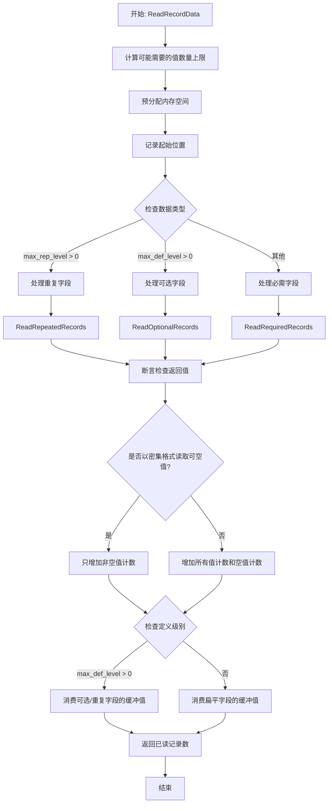

```mermaid
flowchart TD
    A[开始: ReadRecordData] --> B[计算可能需要的值数量上限]
    B --> C[预分配内存空间]
    C --> D[记录起始位置]
    D --> E{检查数据类型}
    
    E -->|max_rep_level > 0| F[处理重复字段]
    E -->|max_def_level > 0| G[处理可选字段]
    E -->|其他| H[处理必需字段]
    
    F --> I[ReadRepeatedRecords]
    G --> J[ReadOptionalRecords]
    H --> K[ReadRequiredRecords]
    
    I --> L[断言检查返回值]
    J --> L
    K --> L
    
    L --> M{是否以密集格式读取可空值?}
    
    M -->|是| N[只增加非空值计数]
    M -->|否| O[增加所有值计数和空值计数]
    
    N --> P{检查定义级别}
    O --> P
    
    P -->|max_def_level > 0| Q[消费可选/重复字段的缓冲值]
    P -->|否| R[消费扁平字段的缓冲值]
    
    Q --> S[返回已读记录数]
    R --> S
    
    S --> Z[结束]
```

