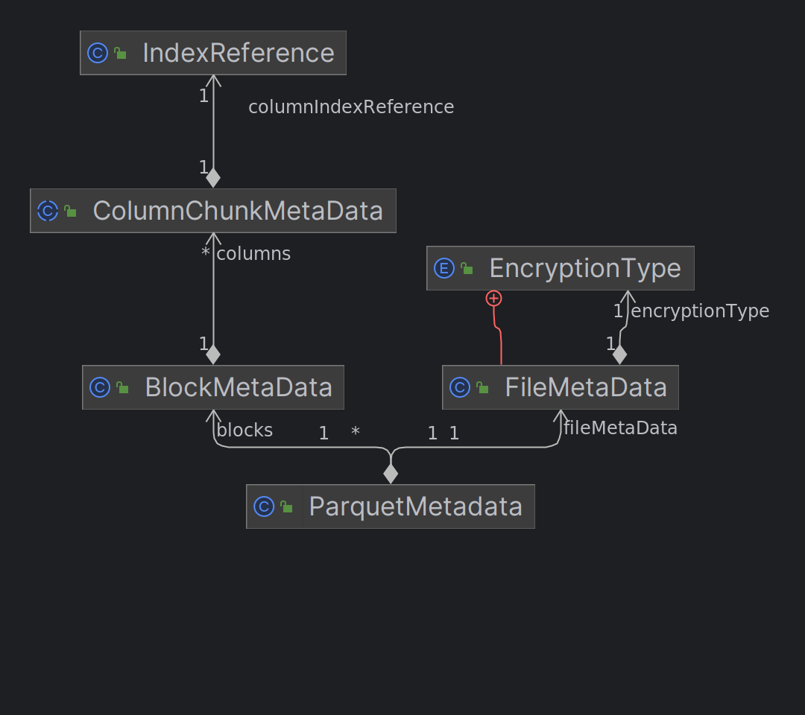

# Arrow

## ArrayData

This data structure is a self-contained representation of the memory and metadata inside an Arrow array data structure (called vectors in Java). The classes `arrow::Array` and its subclasses provide strongly-typed accessors with support for the visitor pattern and other **affordances**. ==This class is designed for easy internal data manipulation, analytical data processing, and data transport to and from IPC messages==. For example, we could cast from int64 to float64 like so: 

```c++
Int64Array arr = GetMyData(); 
auto new_data = arr.data()->Copy(); 
new_data->type = arrow::float64(); 
DoubleArray double_arr(new_data);
```

This object is also useful in an analytics setting where memory may be reused. For example, if we had a group of operations all returning doubles, say: `Log(Sqrt(Expr(arr)))` Then the low-level implementations of each of these functions could have the signatures `void Log(const ArrayData& values, ArrayData* out);` As another example a function may consume one or more memory buffers in an input array and replace them with newly-allocated data, changing the output data type as well.

> 该对象在可以重用内存的分析设置中也很有用。 例如，如果我们有一组全部返回双精度数的操作，例如：`Log(Sqrt(Expr(arr)))`，那么每个函数的底层实现都可以具有签名 `void Log(const ArrayData&values) , ArrayData* out);` 作为另一个示例，函数可能会消耗输入数组中的一个或多个内存缓冲区，并将它们替换为新分配的数据，同时也会更改输出数据类型。

# Parquet && Clickhouse  && Arrow 

## Arrow

> 1. 参靠 `getArrowType`
> 2. 读的时候

|      | `arrow::DataType` | 物理类型[Parquet] | 逻辑类型[Parquet] |
| ---- | ----------------- | ----------------- | ----------------- |
|      | `BooleanType`     | `BOOLEAN`         |                   |
|      |                   | `INT32`           | `INT`             |
|      |                   |                   |                   |

## ClickHouse

> 1. 参考 `preparePrimitiveColumn`
>
> 2. 写的时候
>
> `writeColumnChunkBody` 

| `ColumnType`[C/C++ 类型] | `TypeIndex`[Clickhouse]  | 物理类型[Parquet]      | 转换类型[Parquet] |
| ------------------------ | ------------------------ | ---------------------- | ----------------- |
| `ColumnVector<UInt8>`    | `TypeIndex::UInt8`       | `BOOLEAN`              |                   |
| `ColumnVector<UInt8>`    | `TypeIndex::UInt8`       | `INT32`                | `UINT_8`          |
|                          | `TypeIndex::UInt16`      | `INT32`                | `UINT_16`         |
|                          | `TypeIndex::UInt32`      | `INT32`                | `UINT_32`         |
|                          | `TypeIndex::UInt64`      | `INT64`                | `UINT_64`         |
|                          | `TypeIndex::Int8`        | `INT32`                | `INT_8`           |
|                          | `TypeIndex::Int16`       | `INT32`                | `INT_16`          |
|                          | `TypeIndex::Int32`       | `INT32`                |                   |
|                          | `TypeIndex::Int64`       | `INT64`                |                   |
|                          | `TypeIndex::Float32`     | `FLOAT`                |                   |
|                          | `TypeIndex::Float64`     | `DOUBLE`               |                   |
|                          | `TypeIndex::Enum8`       | `INT32`                | `INT_8`           |
|                          | `TypeIndex::Enum16`      | `INT32`                | `INT_16`          |
|                          | `TypeIndex::IPv4`        | `INT32`                | `UINT_32`         |
|                          | `TypeIndex::Date`        | `INT32`                | `UINT_16`         |
|                          | `TypeIndex::DateTime`    | `INT32`                | `UINT_32`         |
|                          | `TypeIndex::Date32`      | `INT32`                | `DATE`            |
|                          | `TypeIndex::DateTime64`  | `// TODO:`             |                   |
|                          | `TypeIndex::String`      |                        |                   |
|                          | `TypeIndex::FixedString` |                        |                   |
|                          | `TypeIndex::UInt128`     | `FIXED_LEN_BYTE_ARRAY` |                   |
|                          | `TypeIndex::UInt256`     | `FIXED_LEN_BYTE_ARRAY` |                   |
|                          | `TypeIndex::Int128`      | `FIXED_LEN_BYTE_ARRAY` |                   |
|                          | `TypeIndex::Int256`      | `FIXED_LEN_BYTE_ARRAY` |                   |
|                          | `TypeIndex::IPv6`        | `FIXED_LEN_BYTE_ARRAY` |                   |
|                          | `TypeIndex::Decimal32`   | `FIXED_LEN_BYTE_ARRAY` | `DECIMAL`         |
|                          | `TypeIndex::Decimal64`   | `FIXED_LEN_BYTE_ARRAY` | `DECIMAL`         |
|                          | `TypeIndex::Decimal128`  | `FIXED_LEN_BYTE_ARRAY` | `DECIMAL`         |
|                          | `TypeIndex::Decimal256`  | `FIXED_LEN_BYTE_ARRAY` | `DECIMAL`         |


## Arrow VS Parquet

|                                  |                                                              | parquet[包装层]             | arrow             |
| -------------------------------- | ------------------------------------------------------------ | --------------------------- | ----------------- |
| `parquet::arrow::SchemaManifest` | Bridge between a **parquet Schema** and an **arrow Schema**.<br/>Expose parquet columns as a tree structure. Useful traverse and link between arrow's Schema and parquet's Schema. | `parquet::SchemaDescriptor` | `::arrow::Schema` |
| `parquet::arrow::SchemaField`    | Bridge between an `arrow::Field` and **parquet column indices**. | column index                | `::arrow::Field`  |
|                                  |                                                              |                             |                   |

>**`parquet::SchemaDescriptor`**
>
>Container for the converted Parquet schema with a computed information from the schema analysis needed for file reading 
>
> - Column index to Node 
> - Max repetition / definition levels for each primitive node
>
>The ColumnDescriptor objects produced by this class can be used to assist in the reconstruction of fully materialized data structures from the repetition-definition level encoding of nested data 

# 数据结构



|      | Java（parquet-mr）                     | c++（arrow） | 类别   |
| ---- | -------------------------------------- | ------------ | ------ |
|      | `org.apache.parquet.format.FileMetaData` |   `parquet::format::FileMetaData`   | Thrift |
| | `org.apache.parquet.format.ColumnChunk` |  |  |
|      | `org.apache.parquet.format.ColumnIndex` |              |        |
| |  | | |
| |  | | |
| |  | | |
| | `org.apache.parquet.internal.hadoop.metadata.IndexReference` | `parquet::IndexLocation` | |
| | `org.apache.parquet.internal.column.columnindex.ColumnIndex` | `parquet::ColumnIndex` | `包装层` |
| | | `parquet::FileMetaData` | 包装层 |
| | | `parquet::RowGroupMetaData` | 包装层 |
| | | | |
| | | | |
| | `org.apache.parquet.hadoop.metadata.ParquetMetadata` |  |  |
| | `org.apache.parquet.hadoop.metadata.FileMetaData` |  |        |
| | `org.apache.parquet.hadoop.metadata.BlockMetaData` | `parquet::RowGroupMetaData` |  |
| | `org.apache.parquet.hadoop.metadata.ColumnChunkMetaData` | `parquet::ColumnChunkMetaData` | 包装层 |
| |  |  |  |
| |  |  |  |
| |  |  |  |
|      | `org.apache.parquet.schema.MessageType` | `parquet::SchemaDescriptor` | 包装层 |
| | `org.apache.parquet.column.ColumnDescriptor` | `parquet::ColumnDescriptor` | |
| |  |  | |
| |  |  | |
| | `org.apache.parquet.column.page.PageReadStore` | No | |
| |  |  | |
| |  |  | |
| spark | `<spark>.ParquetColumn` |  | |
|  |  |  | |
|  |  |  | |
| | `org.apache.parquet.hadoop.ParquetFileReader` | `parquet::ParquetFileReader` | |
| Spark | `<spark>.ParquetRowGroupReaderImpl` | | Gluten |
| |  | | |
| |  | | |

## arrow vs local engine

|                |      |                               |
| -------------- | ---- | ----------------------------- |
| FileReaderImpl |      | VectorizedParquetRecordReader |
|                |      |                               |
|                |      |                               |

# Parquet MR Column Index

1. 如何构建表达式树
   1. 有些算子会**指向其对应的列**
   2. 

# CH


## `KeyCondition`

**Condition on the index**. 

Consists of the conditions for the key belonging to all possible ranges or sets, as well as logical operators `AND/OR/NOT` above these conditions. Constructs a **reverse polish notation** from these conditions and can calculate (interpret) its satisfiability over key ranges.

### 构造函数

1. Construct key condition from **AST** SELECT query `WHERE`, `PREWHERE` and **additional filters**

   ```c++
   KeyCondition(
       const ASTPtr & query,
       const ASTs & additional_filter_asts,
       Block block_with_constants,
       PreparedSetsPtr prepared_sets_,
       ContextPtr context,
       const Names & key_column_names,
       const ExpressionActionsPtr & key_expr,
       NameSet array_joined_column_names,
       bool single_point_ = false,
       bool strict_ = false)
   ```

2. Construct key condition from AST SELECT query WHERE, PREWHERE and additional filters. Select query, additional filters, prepared sets are initialized using query info.

   ```c++ 
   KeyCondition(
       const SelectQueryInfo & query_info,
       ContextPtr context,
       const Names & key_column_names,
       const ExpressionActionsPtr & key_expr_,
       bool single_point_ = false,
       bool strict_ = false);
   ```

3. Construct key condition from `ActionsDAG` nodes
   ```c++
   KeyCondition(
       ActionsDAGPtr filter_dag,
       ContextPtr context,
       const Names & key_column_names,
       const ExpressionActionsPtr & key_expr,
       NameSet array_joined_column_names,
       bool single_point_ = false,
       bool strict_ = false);
   ```

### check

| 函数                                  |                                                              |
| ------------------------------------- | ------------------------------------------------------------ |
| `BoolMask checkInHyperrectangle(...)` | Whether the condition and its negation are feasible in the direct product of single column ranges specified by `hyperrectangle` |
| `BoolMask checkInRange(...)`          | Whether the condition and its negation are (independently) feasible in the key range. left_key and right_key must contain all fields in the sort_descr in the appropriate order. data_types - the types of the key columns. Argument initial_mask is used for early exiting the implementation when we do not care about one of the resulting mask components (see `BoolMask::consider_only_can_be_XXX`). |
| `bool mayBeTrueInRange(...)`          | Same as `checkInRange`, but calculate only `may_be_true` component of a result. This is more efficient than `checkInRange(...).can_be_true`. |
| `bool alwaysUnknownOrTrue()`          | Checks that the index can not be used.<br />`FUNCTION_UNKNOWN` will be `AND`'ed (if any). |
| `bool anyUnknownOrAlwaysTrue()`       | Checks that the index can not be used.<br />Does not allow any `FUNCTION_UNKNOWN` (will instantly return true). |
| `bool alwaysFalse()`                  |                                                              |
| `bool hasMonotonicFunctionsChain()`   |                                                              |
|                                       |                                                              |

## `IProcessor`

Processor is an element (low level building block) of a query execution pipeline. 

It has zero or more input ports and zero or more output ports. Blocks of data are transferred over ports. Each port has fixed structure: **names** and **types of columns** and **values of constants**. Processors may pull data from input ports, do some processing and push data to output ports. Processor may indicate that it requires input data to proceed and indicate that it needs data from some ports. 

Synchronous work must only use CPU - **don't do any sleep, IO wait, network wait**. Processor may want to do work asynchronously (example: fetch data from remote server) - in this case it will initiate background job and allow to subscribe to it. 

Processor may throw an exception to indicate some runtime error. 

Different ports may have different structure. For example, ports may correspond to different result sets or semantically different parts of result. 

Processor may modify its ports (create another processors and connect to them) on the fly. Example: first execute the subquery; on basis of sub-query result determine how to execute the rest of query and build the corresponding pipeline. 

Processor may simply wait for another processor to execute without transferring any data from it. For this purpose it should connect its input port to another processor, and indicate need of data. Examples:

- `Source`. Has no input ports and single output port. Generates data itself and pushes it to its output port. 

- `Sink`. Has single input port and no output ports. Consumes data that was passed to its input port. 

- **Empty source**. Immediately says that data on its output port is finished. 

- **Null sink**. Consumes data and does nothing. 

- **Simple transformation**. Has single input and single output port. Pulls data, transforms it and pushes to output port. Example: <u>expression calculator</u>. 

  > TODO Better to make each function a separate processor. It's better for pipeline analysis. Also keep in mind 'sleep' and 'rand' functions. 

- **Squashing or filtering transformation**. Pulls data, possibly accumulates it, and sometimes pushes it to output port. Examples: **DISTINCT**, **WHERE**, squashing of blocks for **INSERT SELECT**. 
- **Accumulating transformation**. Pulls and accumulates all data from input until it it exhausted, then pushes data to output port. Examples: ORDER BY, GROUP BY. 
- **Limiting transformation**. Pulls data from input and passes to output. When there was enough data, says that it doesn't need data on its input and that data on its output port is finished. 
- Resize. Has arbitrary number of inputs and arbitrary number of outputs. Pulls data from whatever ready input and pushes it to randomly chosen free output. Examples:
  - Union - merge data from number of inputs to one output in arbitrary order. 
  - Split - read data from one input and pass it to arbitrary output. 
- Concat. Has many inputs and only one output. Pulls all data from first input until it is exhausted, then all data from second input, etc. and pushes all data to output. 
- Ordered merge. Has many inputs but only one output. Pulls data from selected input in specific order, merges and pushes it to output. 
- Fork. Has one input and many outputs. Pulls data from input and copies it to all outputs. Used to process multiple queries with common source of data. 
- Select. Has one or multiple inputs and one output. Read blocks from inputs and check that blocks on inputs are "parallel": correspond to each other in number of rows. Construct a new block by selecting some subset (or all) of columns from inputs. Example: collect columns - function arguments before function execution. 

TODO Processors may carry algebraic properties about transformations they do. For example, that processor doesn't change number of rows; doesn't change order of rows, doesn't change the set of rows, etc. 

TODO Ports may carry algebraic properties about streams of data. For example, that data comes ordered by specific key; or grouped by specific key; or have unique values of specific key. And also simple properties, including lower and upper bound on number of rows. 

TODO Processor should have declarative representation, that is able to be serialized and parsed. Example: read_from_merge_tree(database, table, Columns(a, b, c), Piece(0, 10), Parts(Part('name', MarkRanges(MarkRange(0, 100), ...)), ...)) It's reasonable to have an intermediate language for declaration of pipelines. 

TODO Processor with all its parameters should represent "pure" function on streams of data from its input ports. It's in question, what kind of "pure" function do we mean. For example, data streams are considered equal up to order unless ordering properties are stated explicitly. Another example: we should support the notion of "arbitrary N-th of M substream" of full stream of data.

## RPN

`RPN` Builder build stack of **reverse polish notation** elements (`RPNElements`) required for index analysis.  `RPNBuilder` client must provide `RPNElement` type that has following interface:

``` c++
struct RPNElementInterface
{
    enum Function
    {
        FUNCTION_UNKNOWN, /// Can take any value.
        /// Operators of the logical expression.
        FUNCTION_NOT,
        FUNCTION_AND,
        FUNCTION_OR,
        ...
    };
  RPNElementInterface();
  Function function = FUNCTION_UNKNOWN;
}
```

`RPNBuilder` take care of building stack of `RPNElements` with `NOT`, `AND`, `OR` types. In addition client must provide `ExtractAtomFromTreeFunction` that returns `true` and `RPNElement` as output parameter, if it can convert `RPNBuilderTree` node to `RPNElement`, false otherwise.
