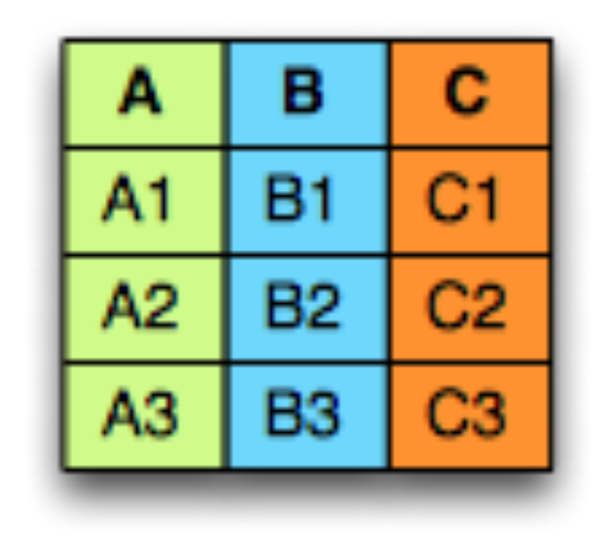
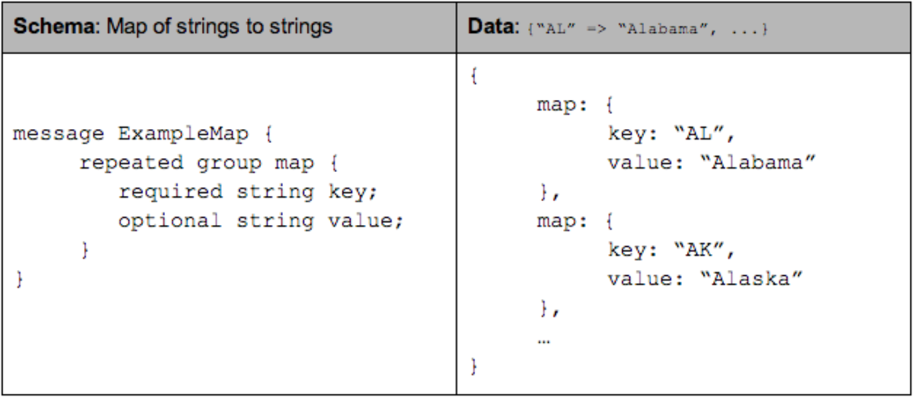
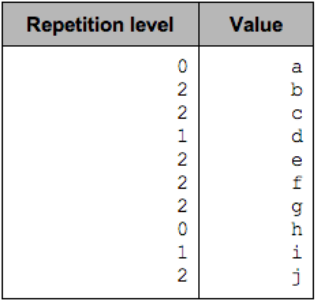
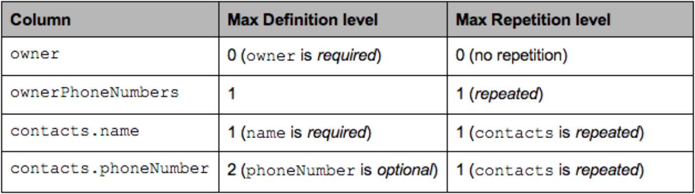

# Dremel made simple with Parquet

对于优化『关系型数据库上的分析任务』，列式存储（Columnar  Storage）是个比较流行的技术。这一技术对处理大数据集的好处是有据可查的，可以参见诸多学术资料，以及一些用作[分析](http://vldb.org/pvldb/vol5/p1790_andrewlamb_vldb2012.pdf)的[商业](http://people.csail.mit.edu/tdanford/6830papers/stonebraker-cstore.pdf)[数据库](http://www.monetdb.org/)。

我们的目标是，对于一个查询，尽量只读取对这个查询有用的数据，以此来让磁盘 IO 最小。用 [Parquet](https://blog.twitter.com/2013/announcing-parquet-10-columnar-storage-for-hadoop)，我们做到了把 Twitter  的大数据集上的 IO 缩减到原来的 1/3。我们也做到了『指哪打哪』，也就是遍历（scan）一个数据集的时候，如果只读取部分列，那么读取时间也相应会缩短，时间缩短的比例就是那几列的数据量占全部列数据量的比例。原理很简单，就是不采用传统的按行存储，而是连续存储一列的数据。如果数据是扁平的（比如二维表形式），那列改成按列存储毫无难度，处理嵌套的数据结构才是真正的挑战.

我们的开源项目 [Parquet](https://blog.twitter.com/2013/announcing-parquet-10-columnar-storage-for-hadoop) 是 Hadoop 上的一种支持列式存储文件格式，起初只是 Twitter 和 Coudera 在合作开发，发展到现在已经有包括 Criteo公司 在内的[许多其他贡献者](https://github.com/Parquet/parquet-mr/graphs/contributors)了。Parquet 用 Dremel 的论文中描述的方式，把嵌套结构存储成扁平格式。由于受益于这种技术，我们决定写篇更通俗易懂的文章来向大家介绍它。首先讲一下嵌套数据结构的一般模型，然后会解释为什么这个模型可以被一坨扁平的列（columns）所描述，最后讨论为什么列式是高效的。

何谓列式存储？看下面的例子，这就是三个列 A B C：



如果把它换成行式存储的，那么数据就是一行挨着一行存储的：


而在面向列的存储中，它一次存一列：


按列存，有几个好处：

- 按列存，能够更好地压缩数据，因为一列的数据一般都是同质的（homogenous）。对于hadoop集群来说，空间节省非常可观.
- I/O 会大大减少，因为扫描（遍历）的时候，可以只读其中部分列。而且由于数据压缩的更好的缘故，IO所需带宽也会减小.
- 当我们在每一列中存储相同类型的数据时，可以使指令分支更可预测，从而选择更适合现代处理器管道的编码。

## 嵌套结构的模型

[首先是嵌套结构的模型](https://github.com/Parquet/parquet-mr/tree/master/parquet-column/src/main/java/parquet/schema)，此处选取的模型就跟 [PB](http://en.wikipedia.org/wiki/Protocol_Buffers) 类似。多个 Field 可以形成一个 group，一个 Field 可以重复出现（叫做 Repeated Field），这样就简单地描述了嵌套和重复，没有必要用更复杂的结构如 Map / List / Sets，因为这些都能用 group 和 Repeated Field 的各种组合来描述。**（熟悉 PB 的人，对这里说的东西应该很清楚，因为这就是跟 PB 一样的，如果此处有疑惑，最好的方法是立即左转出门去看一下 PB）**

整个结构是从最外层一个 message 开始的。每个 Field 有三个属性：repetition、type、name。一个 Field 的 type 属性，要么是 group，要么是基本类型（int, float, boolean, string），有以下三种 repetition 属性：

- Required：出现，且只能出现 1 次.
- Optional：出现 1 或 0 次.
- Repeated：0 到 任意多次

例如，下边是一个 address book 的 schema.

```protobuf
message AddressBook {
  required string owner;
  Repeated string ownerPhoneNumbers;
  Repeated group contacts {
    required string name;
    optional string phoneNumber;
  }
}
```

Lists（或者 Sets）可以用 Repeated Field 表示.


Maps，首先有一个 Repeated Field 在外面，里面每个 Field，是一个 group，group 里面是 key-value 对，其中key 是 required 的.



## 列式存储格式

> 译注：列式存储，简单来说就是三件事：1）把一个嵌套的结构，映射为若干列  2）把一条嵌套的数据，写入这些列里。3）还能根据这些列，把原来的嵌套结构拼出来。做到这三点，目的就达到了。
>
> 直观来看，嵌套结构含有两种信息：
>
> 1. 字段的嵌套关系 
> 2. 最终每个字段的值
>
> 所以如何转换成列式也可以从这里下手，分别解决『值』和『嵌套关系』。Parquet 的做法是，为嵌套结构的 schema 中每个基本类型的 Field，建立一个列。若用一棵树描述 schema，基本类型的 Field，就是树的叶子。

列格式通过将相同基元类型的值存储在一起来提供更有效的编码和解码。 为了以列格式存储嵌套数据结构，我们需要将模式映射到列列表，以便我们可以将记录写入平面列并将它们读回到原始的嵌套数据结构。 在 Parquet 中，我们为架构中的每个基本类型字段创建一列。 如果我们将模式表示为一棵树，那么原始类型就是这棵树的叶子。

上边的 Address book 结构用树表示：


> 观察上图，其实最终的值，都是在基本类型的 **Field** 中的，Group 类型的 Field 本身不含有值，是基本类型组合起来的。

对上图蓝色叶子节点，每个对应一个列，就可以把结构中所有的值存起来了，如下表.


现在，『值』的问题解决了，还剩『嵌套关系』，这种关系，用叫做 **repetition level** 和 **definition level** 的两个值描述。有了这俩值，就可以把原来的嵌套结构完全还原出来，下文将详细讲解这两个值到底是什么。

### Definition Level

> **这俩 Level 容易把人看糊涂，如果看文字描述没明白，请看例子回头再看文字描述**

为支持嵌套结构，我们需要知道一个 Field，<u>在哪一层变成了 null （就是指 Field 没有定义）</u>，这就是 definition level 的功能。设想，如果一个 Field 有定义，很显然，它的 parents 也肯定有定义。如果一个 Field 没有定义，那有可能它的上级也没定义，但上上级有定义；也有可能它的**上级**和**上上级**都没定义，**所以需要知道到底是从哪一级开始没有定义，这是还原整条记录所必须知道的**。

> 译注：（假设有一种一旦出现就每代必须遗传的病）如果你得了这个病，那么有可能你是第一个，你爸爸没这个病；也可能是从你爸爸开始才出现这种病的（你爷爷还没这种病）；也有可能是从你爷爷开始就已经得病了。反过来，如果你爸爸没这个病，那么你爷爷肯定也是健康的。你需要一个值，描述从你家第几代开始得病的，这个值就类似 **definition level**。希望这比喻有助于理解。

**对于扁平结构**（就是没有任何嵌套），Optional Field 可以用一个 bit 来表示是否有定义： 有：1， 无：0。

**对于嵌套结构**，我们可以给每一级的 Optional Field 都加一个 bit 来记录是否有定义，但其实没有必要，因为如上一段所说，因为嵌套的特性上层没定义，那下层当然也没定义，**所以只要知道从哪一级开始没定义就可以了**。

最后，Required Field 因为总是有定义，所以不需要 definition level。还是看例子，下边是一个简单的嵌套的schema：

```protobuf
message ExampleDefinitionLevel {
  optional group a {
    optional group b {
      optional string c;
    }
  }
}
```

转换成列式，它只有一列 a.b.c，所有 Field 都是 Optional 的，都可能是 null。如果 c 有定义，那么 a b 作为它的上层，也将有定义。当 c 是 null 时候，可能是因为它的某一级 parent 为 null 才导致 c 是 null 的，这时为了记录嵌套结构的状况，我们就需要保存最先出现 null 的那一层的深度了。一共三个嵌套的 optional Field，所以最大 definition level 是 3.

以下是各种情形下，a.b.c 的 definiton level:


这里 definition level 不会大于 3，等于 3 的时候，表示 c 有定义； 等于 0,1,2 的时候，指明了 null 出现的层级.

required 总是有定义的，所以不需要 definition level。下面把 b 改成 required，看看情况如何.

```protobuf
message ExampleDefinitionLevel {
optional group a {
  required group b {
      optional string c;
    }
  }
}
```

现在最大的 definition level 是 2，因为 **b** 不需要 definition level。下面是各种情形下，a.b.c 的 definition level:


不要让 definition level 太大，这很重要，目标是所用的比特越少越好（后面会说）

### Repetition level

对于一个带 Repeated Field 的结构，转成列式表示后，一列可能有多个值，这些值的**一部分是一坨里**，**另一部分可能是另一坨里**，但一条记录的全部列都放在一列里，傻傻分不清楚，所以需要一个值来区分怎么分成不同的坨。这个值就是 repetition level：对于列中的一个值，它告诉我这个值，是在哪个层级上，发生重复的。这句话不太好理解，还是看例子吧.


这个结构转成列式的，实际也只有一列：level1.level2，这一列的各个值，对应的 repeatiton level 如下：



为了表述方便，称在一个嵌套结构里，一个 Repeated Field 连续出现的一组值为一个 List（只是为了描述方便），比如 a,b,c 是一个 level2 List， d,e,f,g 是一个level2 List，h 是一个level2 List，i,j 是一个level2 List。a,b,c,d,e,f,g 所在的两个 level2 list 是同一个 level1 List 里的，h,i,j 所在的两个 level2 List 是同一个 level1 List里的。

那么：repetition level 标示着新 List 出现的层级：

- 0 表示整条记录的开始，此时应该创建新的 level1 List 和 level2 List
- 1 表示 level1 List 的开始，此时应该创建一个 level2 List
- 2 表示 level2 List中新的值产生，此时不新建 List，只在 List 里插入新值.

下图可以看出，换句话说就是 repetition level 告诉我们，在从列式表达，还原嵌套结构的时候，是**在哪一级插入新值的**.


repetiton = 0，标志着一整条新 record 的开始。在扁平化结构里，没有 repetition 所以 repetition level 总是 0。[Only levels that are Repeated need a Repetition level](https://github.com/Parquet/parquet-mr/blob/8f93adfd0020939b9a58f092b88a5f62fd14b834/parquet-column/src/main/java/parquet/schema/GroupType.java#L199)：optional 和 required 永远也不会重复，在计算 repetition level 的时候，可将其跳过.

### 拆分与组装

```protobuf
message AddressBook {
  required string owner;
  Repeated string ownerPhoneNumbers;
  Repeated group contacts {
    required string name;
    optional string phoneNumber;
  }
}
```

现在我们同时用这两种标识（definition level, repetition level），重新考虑 Address book 的例子。下表显示了每一列 两种标识可能出现的最大值，并解释了为什么要比列所在深度小.



单说 contacts.phoneNumber 这一列，如果 手机号有定义，则 definition level 达到最大即2，如果有一个联系人是没有手机号的，则 definition level是 1。如果联系人是空的，则 definition level 是0.

```protobuf
AddressBook {
  owner："Julien Le Dem",
  ownerPhoneNumbers："555 123 4567",
  ownerPhoneNumbers："555 666 1337",
  contacts：{
    name："Dmitriy Ryaboy",
    phoneNumber："555 987 6543",
  },
  contacts：{
    name："Chris Aniszczyk"
  }
}
AddressBook {
  owner："A。Nonymous"
}
```

现在我们拿 contacts.phoneNumber 这一列来做说明.

若一条记录是如下这样的：

```
AddressBook {
  contacts：{
    phoneNumber："555 987 6543"
  }
  contacts：{
  }
}
AddressBook {
}
```

转成列式之后，列中存储的东西应该是这样的（R = Repetiton Level， D = Definition Level）：


为了将这条嵌套结构的 record 转换成列式，我们把这个 record 整个遍历一次，

- contacts.phoneNumber：“555 987 6543”
  - new record：R = 0
  - value is defined：D = maximum (2)
- contacts.phoneNumber：null
  - Repeated contacts：R = 1
  - only defined up to contacts：D = 1
- contacts：null
  - new record：R = 0
  - only defined up to AddressBook：D = 0

最后列中存储的东西是：


**注意，NULL 值在这里列出来，是为了表述清晰，但是实际上是不会存储的。列中小于最大 definition 值的（这个例子里最大值是2），都应该是 NULL**。

为了通过列是存储，还原重建这条嵌套结构的记录，写一个循环读列中的值，

- R=0, D=2, Value = “555 987 6543”:
  - R = 0 这是一个新的 record。从根开始按照schema 重建结构，直到 repetition level 达到 2
  - D = 2 是最大值，值是有定义的，所以此时将值插入.
- R=1, D=1:
  - R = 1  level1 的 contact list 中一条新记录
  - D = 1  contacts 有定义，但 phoneNumber 没定义，所建一个空的 contacts 即可.
- R=0, D=0:
  - R = 0 一条新 record。可以重建嵌套结构，直到达到 definition level 的值.
  - D = 0 => contacts 是 null，所以最后拼装出来的是一个空的 Address Book

# 高效存储 Definition Levels 和 Repetiton Levels.

在存储方面，问题很容易归结为：每一个基本类型的列，都要创建三个子列（R, D, Value）。然而，得益于我们所采用的这种列式的格式，三个子列的总开销其实并不大。因为两种 Levels的最大值，是由 schema 的深度决定的，并且通常只用几个 bit 就够用了（1个bit 就可表达1层嵌套，2个bit就可以表达3层嵌套了，3个bit就能够表达7层嵌套了, [ 译注：四层嵌套编程的时候就已经很恶心了，从编程和可维护角度，也不应该搞的嵌套层次太深（个人观点） ]），对于上面的 AddressBook 实例，owner这一列，深度为1，contacts.name 深度为2，而这个表达能力已经很强了。R level 和 D level 的下限 总是0，上限总是列的深度。如果一个 Field 不是 Repeated 的，就更好了，可以不需要 repetition level，而 required Field 则不需要 definition level，这降低了两种 level 的上限.

考虑特殊情况，所有 Field 全是 required（相当于SQL 中的NOT NULL），repetition level 和 definition level 就完全不需要了（总是0，所以不需要存储），直接存值就ok了。如果我们要同时支持存储扁平结构，那么两种 level也是一样不需要存储空间的.

由于以上这些特性，我们可以找到一种结合 [Run Length Encoding 和 bit packing](https://github.com/Parquet/parquet-mr/tree/master/parquet-column/src/main/java/parquet/column/values/rle) 的高效的编码方式。一个很多值为 NULL 的稀疏的列，压缩后几乎不怎么占空间，与此相似，一个几乎总是有值的 optional 列，will cost very little overhead to store millions of 1s（在这个也没想好怎么翻译，总之是开销很小的意思了）。现实状况是，用于存储 levels 的空间，可以忽略不计。以存储一个扁平结构为例（没有嵌套），直接顺序地把一列的值写入，如果某个Field是 optional 的，那就取一位用来标识是否为 null.
