This scanner parses Parquet files located in HDFS, and writes the content as tuples in the Impala in-memory representation of data, e.g.  (tuples, rows, row batches). For the file format spec, see: [parquet-format](https://github.com/apache/parquet-format)

## Schema resolution
Additional columns are allowed at the end in either the table or file schema (i.e., extra columns at the end of the schema or extra fields at the end of a struct).  If there are extra columns in the file schema, they are simply ignored. If there are extra in the table schema, we return NULLs for those columns (if they're materialized).

## Disk IO
Parquet (and other columnar formats) use scan ranges differently than other formats. Each materialized column maps to a single ScanRange per row group.  For streaming reads, all the columns need to be read in parallel. This is done by issuing one ScanRange (in `IssueInitialRanges()`) for the file footer per split. `ProcessSplit()` is called once for each original split and determines the row groups whose midpoints fall within that split. We use the mid-point to determine whether a row group should be processed because if the row group size is less than or equal to the split size, the mid point guarantees that we have at least 50% of the row group in the current split. `ProcessSplit()` then computes the column ranges for these row groups and submits them to the `IoMgr` for immediate scheduling (so they don't surface in `RequestContext::GetNextUnstartedRange()`). Scheduling them immediately also guarantees they are all read at once.

Like the other scanners, each parquet scanner object is one to one with a `ScannerContext`. Unlike the other scanners though, the context will have multiple streams, one for each column. Row groups are processed one at a time this way.

## Nested types

This scanner supports reading and materializing nested data. For a good overview of how nested data is encoded, see [blog.twitter.com/2013/dremel-made-simple-with-parquet](https://blog.twitter.com/engineering/en_us/a/2013/dremel-made-simple-with-parquet). For how SQL nested schemas are translated to parquet schemas, see [Nested-types](https://github.com/apache/parquet-format/blob/master/LogicalTypes.md#nested-types). For these examples, we will use the following table definition:

```
tbl:
  id                bigint
  array_col         array<array<int>>
```
The table definition could correspond to the following parquet schema (note the required `id` field. If written by Impala, all non-repeated fields would be optional, but we can read repeated fields as well):

```properties
required group record         d=0 r=0
  req int64 id                d=0 r=0
  opt group array_col (LIST)  d=1 r=0
    repeated group list       d=2 r=1
      opt group item (LIST)   d=3 r=1
        repeated group list   d=4 r=2
          opt int32 item      d=5 r=2
```

Each element in the schema has been annotated with the maximum def level and maximum rep level corresponding to that element. Note that the repeated elements add a def level. This distinguishes between 0 items (empty list) and more than 0 items (non-empty list). The containing optional LIST element for each array determines whether the whole list is null or non-null. Maps work the same way, the only differences being that the repeated group contains two child fields ("key" and "value" instead of "item"), and the outer element is annotated with MAP instead of LIST. 

> Schema  中的每个元素都已使用与该元素对应的最大**定义级别**和**最大重复级别**进行了注释。请注意，重复的元素会添加一个**定义级别**。用于区分 0 个元素（空列表）和超过 0 个元素（非空列表）的场景。每个数组包含的可选 `LIST` 元素确定整个列表是 null 还是非 null。`Map` 的工作方式相同，唯一的区别是重复组包含两个子字段（`key` 和 `value` 而不是 `item`），并且外部元素使用 `MAP` 而不是 `LIST` 进行注释。

Only scalar schema elements are materialized in parquet files; internal nested elements can be reconstructed using the def and rep levels. To illustrate this, here is data containing every valid definition and repetition for the materialized int 'item' element. The data records appear on the left, the encoded definition levels, repetition levels, and values for the 'item' field appear on the right (the encoded 'id' field is not shown).

```
record                       d r v
------------------------------------
{id: 0, array_col: NULL}     0 0 -
{id: 1, array_col: []}       1 0 -
{id: 2, array_col: [NULL]}   2 0 -
{id: 3, array_col: [[]]}     3 0 -
{id: 4, array_col: [[NULL]]} 4 0 -
{id: 5, array_col: [[1,      5 0 1
                     NULL],  4 2 -
                    [2]]}    5 1 2
{id: 6, array_col: [[3]]}    5 0 3
```

### Example query 1

`select id, inner.item from tbl t, t.array_col outer, outer.item inner`. Results from above sample data:

```
4,NULL
5,1
5,NULL
5,2
6,3
```
Descriptors:

```
Tuple(id=0 tuple_path=[] slots=[
  Slot(id=0 type=ARRAY col_path=[1] collection_item_tuple_id=1),
  Slot(id=2 type=BIGINT col_path=[0])])
Tuple(id=1 tuple_path=[1] slots=[
  Slot(id=1 type=ARRAY col_path=[1,0] collection_item_tuple_id=2)])
Tuple(id=2 tuple_path=[1, 0] slots=[
  Slot(id=3 type=INT col_path=[1,0,0])])
```

The parquet scanner will materialize the following in-memory row batch:

```
  RowBatch
+==========+
| 0 | NULL |
|----------|
| 1 | NULL |      outer
|----------|     +======+
| 2 |  --------->| NULL |
|   |      |     +======+
|----------|
|   |      |     +======+
| 3 |  --------->| NULL |
|   |      |     +======+
|   |      |                  inner
|----------|     +======+    +======+
| 4 |  --------->|  -------->| NULL |
|   |      |     +======+    +======+
|   |      |
|----------|     +======+    +======+
| 5 |  --------->|  -------->|  1   |
|   |      |     |      |    +------+
|   |      |     |      |    | NULL |
|   |      |     +------+    +======+
|   |      |     |      |
|   |      |     |      |    +======+
|   |      |     |  -------->|  2   |
|   |      |     +======+    +======+
|   |      |
|----------|     +======+    +======+
| 6 |  --------->|  -------->|  3   |
+==========+     +======+    +======+
```

The top-level row batch contains two slots, one containing the int64_t 'id' slot and  the other containing the CollectionValue 'array_col' slot. The CollectionValues in  turn contain pointers to their item tuple data. Each item tuple contains a single  ArrayColumn slot ('array_col.item'). The inner CollectionValues' item tuples contain  a single int 'item' slot.

Note that the scanner materializes a NULL CollectionValue for empty collections.  This is technically a bug (it should materialize a CollectionValue with num_tuples =  0), but we don't distinguish between these two cases yet.

> TODO: fix this (IMPALA-2272)

The column readers that materialize this structure form a tree analogous to the  materialized output:

```
CollectionColumnReader slot_id=0 node="repeated group list (d=2 r=1)"
  CollectionColumnReader slot_id=1 node="repeated group list (d=4 r=2)"
    ScalarColumnReader<int32_t> slot_id=3 node="opt int32 item (d=5 r=2)"
ScalarColumnReader<int64_t> slot_id=2 node="req int64 id (d=0 r=0)"
```
Note that the collection column readers reference the "repeated group item" schema  element of the serialized array, not the outer "opt group" element. This is what  causes the bug described above, it should consider both elements.

### Example query 2

`select inner.item from tbl.array_col.item inner;`. Results from the above sample data:

```
NULL
1
NULL
2
3
```
Descriptors:
```
Tuple(id=0 tuple_path=[1, 0] slots=[
  Slot(id=0 type=INT col_path=[1,0,0])])
```

In-memory row batch:

```
+======+
| NULL |
|------|
|  1   |
|------|
| NULL |
|------|
|  2   |
|------|
|  3   |
+======+
```

Column readers:
ScalarColumnReader<int32_t> slot_id=0 node="opt int32 item (d=5 r=2)"   In this example, the scanner doesn't materialize a nested in-memory result, since  only the single int 'item' slot is materialized. However, it still needs to read the  nested data as shown above. An important point to notice is that a tuple is not  materialized for every rep and def level pair read -- there are 9 of these pairs  total in the sample data above, but only 5 tuples are materialized. This is because  in this case, nothing should be materialized for NULL or empty arrays, since we're  only materializing the innermost item. If a def level is read that doesn't  correspond to any item value (NULL or otherwise), the scanner advances to the next  rep and def levels without materializing a tuple.

### Example query 3

`select id, inner.item from tbl t, t.array_col.item inner`.  Results from the above sample data (same as example 1):

```
4,NULL
5,1
5,NULL
5,2
6,3
```
Descriptors:

```
Tuple(id=0 tuple_path=[] slots=[
  Slot(id=0 type=ARRAY col_path=[2]),
  Slot(id=1 type=BIGINT col_path=[0])])
Tuple(id=1 tuple_path=[2, 0] slots=[
  Slot(id=2 type=INT col_path=[2,0,0])])
```

In-memory row batch:
```
  RowBatch
+==========+
| 0 | NULL |
|----------|
| 1 | NULL |
|----------|      inner
| 2 |  --------->+======+
|   |      |     +======+
|----------|
|   |      |
| 3 |  --------->+======+
|   |      |     +======+
|   |      |
|----------|     +======+
| 4 |  --------->| NULL |
|   |      |     +======+
|   |      |
|----------|     +======+
| 5 |  --------->|  1   |
|   |      |     +------+
|   |      |     | NULL |
|   |      |     +------+
|   |      |     |  2   |
|   |      |     +======+
|   |      |
|----------|     +======+
| 6 |  --------->|  3   |
+==========+     +======+
```

Column readers:

```
CollectionColumnReader slot_id=0 node="repeated group list (d=2 r=1)"
  ScalarColumnReader<int32_t> slot_id=2 node="opt int32 item (d=5 r=2)"
ScalarColumnReader<int32_t> id=1 node="req int64 id (d=0 r=0)"
```
In this example, the scanner materializes a "flattened" version of inner, rather than the full 3-level structure. Note that the collection reader references the outer array, which determines how long each materialized array is, and the items in the array are from the inner array.

## Slot materialization
### Top-level tuples:
The slots of top-level tuples are populated in a column-wise fashion. Each column reader materializes a batch of values into a temporary 'scratch batch'. Once a scratch batch has been fully populated, runtime filters and conjuncts are evaluated against the scratch tuples, and the surviving tuples are set in the output batch that is handed to the scan node. The ownership of tuple memory is transferred from a scratch batch to an output row batch once all tuples in the scratch batch have either been filtered or returned as part of an output batch.

### Collection items:
Unlike the top-level tuples, the item tuples of CollectionValues are populated in a row-wise fashion because doing it column-wise has the following challenges. First, we would need to allocate a scratch batch for every collection-typed slot which could consume a lot of memory. Then we'd need a similar mechanism to transfer tuples that survive conjuncts to an output collection. However, CollectionValues lack the row indirection that row batches have, so we would need to either deep copy the surviving tuples, or come up with a different mechanism altogether.

> - [ ] TODO: Populating CollectionValues in a column-wise fashion seems different enough and less critical for most of our users today to defer this task until later.

## Runtime filters
`HdfsParquetScanner` is able to apply runtime filters that arrive before or during scanning. Filters are applied at both the row group (see `AssembleRows()`) and row (see `ReadRow()`) scope. If all filter predicates do not pass, the row or row group will be excluded from output. Only partition-column filters are applied at `AssembleRows()`. The `FilterContexts` for these filters are cloned from the parent scan node and attached to the `ScannerContext`.

## Page filtering

> [Impala-5843](https://issues.apache.org/jira/browse/IMPALA-5843)

A Parquet file can contain a so called "page index". It has two parts, a column index and an offset index. The column index contains statistics like minimum and maximum values for each page. The offset index contains information about page locations in the Parquet file and top-level row ranges. `HdfsParquetScanner` evaluates the min/max conjuncts against the column index and determines the surviving pages with the help of the offset index. Then it will configure the column readers to only scan the pages and row ranges that have a chance to store rows that pass the conjuncts.


## AssembleRows


High-level steps of this function:
1. If late materialization is disabled or not applicable, use `AssembleRowsWithoutLateMaterialization`.

2. Allocate **scratch** memory for tuples able to hold a full batch.

3. Populate the slots of all scratch tuples one column reader at a time only for `filter_readers_`, using the `ColumnReader::Read*ValueBatch()` functions. These column readers are based on columns used in conjuncts and runtime filters.

4. Evaluate runtime filters and conjuncts against the scratch tuples and save pointer of surviving tuples in the output batch. Note that it just saves the pointer to surviving tuples which are still part of **scratch** memory.

5. If no tuples survive step 4, skip materializing tuples for `non_filter_readers`. Collect the rows to be skipped and skip them later at step 6 b.

6. If surviving tuples are present then:

   - a. Get the micro batches of surviving rows to be read by `non_filter_readers_`.
   - b. Skip rows collected at step 4, if needed.
   - c. Fill 'scratch' memory by reading micro batches using `FillScratchMicroBatches`. Only the rows in micro batches are filled in 'scratch' and other rows are ignored. Note, we don't need to filter the rows again as output batch already  has pointer to surviving tuples.

7. Transfer the ownership of scratch memory to the output batch once the scratch memory is exhausted.

8. Repeat steps above until we are done with the row group or an error occurred.


> - [ ] TODO: Since the scratch batch is populated in a column-wise fashion, it is difficult to maintain a maximum memory footprint without throwing away at least  some work. This point needs further experimentation and thought.

## SkipRowsInternal

Wrapper around 'SkipTopLevelRows' to skip across multiple pages. Function handles 3 scenarios:

1. Page Filtering: When this is enabled this function can be used  to skip to a particular `skip_row_id`.
2. Collection: When this scalar reader is reading elements of a collection
3. Rest of the cases.

For page filtering, we keep track of first and last page indexes and keep traversing to next page until we find a page that contains `skip_row_id`. At that point, we can just skip to the required row id. If the page of `skip_row_id` is not a candidate page, we will stop at the next candidate page and `skip_row_id` is skipped by the way. Difference between scenario 2 and 3 is that in scenario 2, we end up decompressing all the pages being skipped, whereas in scenario 3 we only decompress pages required and avoid decompression needed. This is possible because in scenario 3 `data_page_header.num_values` corresponds to number of rows stored in the page. **This is not true in scenario 2 because multiple consecutive values can belong to same row**.

# Parquet 逻辑类型定义

通过指定如何解释基本类型，逻辑类型用于扩展 parquet 用于存储的**物理类型**。这将基本类型的集合保持在最低限度，并重用 parquet 的高效编码。例如，**字符串注解**表示存储的字节数组（二进制）是 UTF8 编码。

这里包含所有逻辑类型的规范。

### 元数据

Parquet 的 `LogicalType` 存储**物理类型**的注解。注解可能需要额外的元数据字段，以及针对这些字段的规则。

逻辑类型注解有一个较旧的表示形式，称为 `ConvertedType`。为了支持与旧文件的向后兼容性，Reader 应该以与`ConvertedType`相同的方式解释 `LogicalTypes`，并且 writer 应该根据**明确定义的转换规则**在元数据中填充 `ConvertedType`。

### 兼容性

Thrift 定义的元数据中有两个用于逻辑类型的字段：`ConvertedType` 和`LogicalType`。`ConvertedType` 是枚举类型，枚举了所有可用的注解。由于 Thrift 的枚举不能有额外的类型参数，因此定义额外的类型参数很麻烦，比如 `Decimal` 的小数位数和精度（它们是 `SchemaElement` 上额外的 32 位整数字段，只与小数相关），或者时间单位和时间戳类型的 UTC 调整标志。为克服这个问题，元数据引入 `LogicalType` 来替换 `ConvertedType`。新的逻辑类型表示为不同 `struct` 的 `Union`，这种方式允许更灵活的 API，逻辑类型可以有类型参数。

```protobuf
/**
 * Decimal logical type annotation
 *
 * To maintain forward-compatibility in v1, implementations using this logical
 * type must also set scale and precision on the annotated SchemaElement.
 *
 * Allowed for physical types: INT32, INT64, FIXED, and BINARY
 */
struct DecimalType {
  1: required i32 scale
  2: required i32 precision
}

/**
 * LogicalType annotations to replace ConvertedType.
 *
 * To maintain compatibility, implementations using LogicalType for a
 * SchemaElement must also set the corresponding ConvertedType from the
 * following table.
 */
union LogicalType {
  1:  StringType STRING       // use ConvertedType UTF8
  2:  MapType MAP             // use ConvertedType MAP
  3:  ListType LIST           // use ConvertedType LIST
  4:  EnumType ENUM           // use ConvertedType ENUM
  5:  DecimalType DECIMAL     // use ConvertedType DECIMAL
  6:  DateType DATE           // use ConvertedType DATE

  // use ConvertedType TIME_MICROS for TIME(isAdjustedToUTC = *, unit = MICROS)
  // use ConvertedType TIME_MILLIS for TIME(isAdjustedToUTC = *, unit = MILLIS)
  7:  TimeType TIME

  // use ConvertedType TIMESTAMP_MICROS for TIMESTAMP(isAdjustedToUTC = *, unit = MICROS)
  // use ConvertedType TIMESTAMP_MILLIS for TIMESTAMP(isAdjustedToUTC = *, unit = MILLIS)
  8:  TimestampType TIMESTAMP

  // 9: reserved for INTERVAL
  10: IntType INTEGER         // use ConvertedType INT_* or UINT_*
  11: NullType UNKNOWN        // no compatible ConvertedType
  12: JsonType JSON           // use ConvertedType JSON
  13: BsonType BSON           // use ConvertedType BSON
  14: UUIDType UUID
}
```

`ConvertedType` 已弃用。但为了保持与旧 writer 的兼容性，Parquet reader 应能够在不存在 `LogicalType` 注解的情况下读取和解释 `ConvertedType` 注解。Parquet writer 必须始终在适用的地方编写 `LogicalType` 注解，但还必须编写相应的 `ConvertedType` 注解（如果有）以保持与旧 reader 的兼容性。

在相应的部分中提到了每个注解的兼容性考虑因素。

## String Types

## Numeric Types

## Temporal Types

## Embedded Types

## 嵌套类型

本节指定如何使用 `LIST` 和 `MAP` 通过在数据中不存在的重复字段周围添加 group 层来对**嵌套类型**进行编码。

这不会影响没有**注解**的重复字段：既不包含在 `LIST` 或 `MAP` 注解的 group 中，也不由 `LIST` 或 `MAP` 注解的重复字段应解释为所需元素的必需列表，其中元素类型是字段的类型。

实现应该使用 `LIST` 和 `MAP` 注解或者没有这些注解的重复字段，但不能同时使用两者。使用注解时，**不允许出现没有注解的重复类型**。

### Lists

`LIST` 用于注解应该被解释为列表的类型。`LIST` 注解必须始终为 3 层结构：

```protobuf
<list-repetition> group <name> (LIST) {
  repeated group list {
    <element-repetition> <element-type> element;
  }
}
```

> 为啥不直接用 `repeated <element-type> <name> ` 这样的形式？假设 SQL 表结构里有这样一个字段：
>
> ```
> a: array<int>
> ```
>
> 似乎需要区分一下三种形式:
>
> | 表现形式  | 含义                   |
> | --------- | ---------------------- |
> | a : null  | a 为空值               |
> | a[]       | a 不为空，是一个空列表 |
> | a[ NULL ] | a 不为空，有一个空元素 |
>
> 按 Parquet 的定义可以区分，而  `repeated <element-type> <name> ` 这样的定义不能区分这三种形式。

- 最外层必须是一个用 `LIST` 注解的**组**，包含一个名为 `list` 的字段。它的**重复级别**确定列表是否可以为空，必须是 `optional` 或者 `required`。

- 名为 `list` 的中间层必须是一个**重复**的组，其中包含一个名为 `element` 的字段。
- `element` 字段编码列表的元素类型，及其**重复级别**。 元素的**重复级别**必须是 `optional` 或者 `required`。

以下示例演示了两个可能的字符串值列表。

```protobuf
// List<String> (list non-null, elements nullable)
required group my_list (LIST) {
  repeated group list {
    optional binary element (UTF8);
  }
}

// List<String> (list nullable, elements non-null)
optional group my_list (LIST) {
  repeated group list {
    required binary element (UTF8);
  }
}
```

元素类型可以是嵌套结构。 例如，列表的列表：

```protobuf
// List<List<Integer>>
optional group array_of_arrays (LIST) {
  repeated group list {
    required group element (LIST) {
      repeated group list {
        required int32 element;
      }
    }
  }
}
```

#### 向后兼容规则

==要求==重复的元素组命名为 `list`，其元素字段命名为 `element`。但是，这些名称可能不会在现有数据中使用，并且在读取时不应作为错误强制执行。例如，以下字段的 schema 应该生成一个可以为空的**非空字符串**列表，即使重复的组被命名为 `element`。

```protobuf
optional group my_list (LIST) {
  repeated group element {       // 名称应该是 list
    required binary str (UTF8);  // 名称应该是 element
  };
}
```

一些现有数据不包括**内部的元素层**。为了向后兼容，由 `LIST` 注解的结构的**元素类型**应始终由以下规则确定：

1. 如果<u>重复字段</u>不是**组**，则其类型为元素类型，元素是 `required`。
2. 如果<u>重复字段</u>是一个有多个字段的组，那么它的类型就是元素类型，（内部的）元素是 `required`。
3. 如果<u>重复字段</u>是一个包含一个字段的组，并且命名为 `array` 或者使用 `LIST` 注解的组，且组名的后缀是`_tuple`，那么<u>重复类型</u>是<u>元素类型</u>，并且元素是 `required`。
4. 否则，重复字段的类型是元素类型，且重复级别是重复字段的重复级别

可以使用这些规则解释的示例：

```protobuf
// List<Integer> (nullable list, non-null elements)
optional group my_list (LIST) {
  repeated int32 element;
}

// List<Tuple<String, Integer>> (nullable list, non-null elements)
optional group my_list (LIST) {
  repeated group element {
    required binary str (UTF8);
    required int32 num;
  };
}

// List<OneTuple<String>> (nullable list, non-null elements)
optional group my_list (LIST) {
  repeated group array {
    required binary str (UTF8);
  };
}

// List<OneTuple<String>> (nullable list, non-null elements)
optional group my_list (LIST) {
  repeated group my_list_tuple {
    required binary str (UTF8);
  };
}
```

# Dremel made simple with Parquet

Columnar storage is a popular technique to optimize analytical workloads in parallel RDBMs. The performance and compression benefits for storing and processing large amounts of data are well documented in academic literature as well as several [commercial](http://people.csail.mit.edu/tdanford/6830papers/stonebraker-cstore.pdf) [analytical](http://vldb.org/pvldb/vol5/p1790_andrewlamb_vldb2012.pdf‎) [databases](http://www.monetdb.org/).

The goal is to keep I/O to a minimum by reading from a disk only the data required for the query. Using [Parquet at Twitter](https://blog.twitter.com/2013/announcing-parquet-10-columnar-storage-for-hadoop), we experienced a reduction in size by one third on our large datasets. Scan times were also reduced to a fraction of the original in the common case of needing only a subset of the columns. The principle is quite simple: instead of a traditional row layout, the data is written one column at a time. While turning rows into columns is straightforward given a flat schema, it is more challenging when dealing with nested data structures.

We recently [introduced Parquet](https://blog.twitter.com/2013/announcing-parquet-10-columnar-storage-for-hadoop), an open source file format for Hadoop that provides columnar storage. Initially a joint effort between Twitter and Cloudera, it now has [many other contributors](https://github.com/Parquet/parquet-mr/graphs/contributors) including companies like Criteo. Parquet stores nested data structures in a flat columnar format using a technique outlined in the [Dremel paper](http://research.google.com/pubs/pub36632.html) from Google. Having implemented this model based on the paper, we decided to provide a more accessible explanation. We will first describe the general model used to represent nested data structures. Then we will explain how this model can be represented as a flat list of columns. Finally we’ll discuss why this representation is effective.

To illustrate what columnar storage is all about, here is an example with three columns.

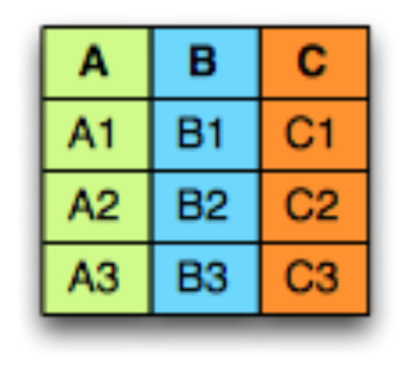

In a row-oriented storage, the data is laid out one row at a time as follows:

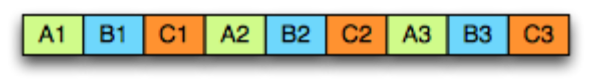

Whereas in a column-oriented storage, it is laid out one column at a time:

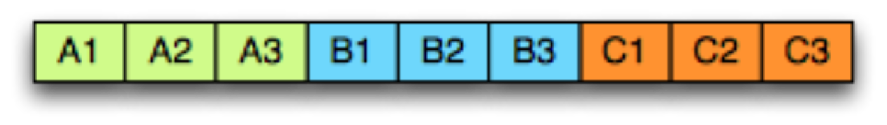

There are several advantages to columnar formats.

- Organizing by column allows for better compression, as data is more homogenous. The space savings are very noticeable at the scale of a Hadoop cluster.
- I/O will be reduced as we can efficiently scan only a subset of the columns while reading the data. Better compression also reduces the bandwidth required to read the input.
- As we store data of the same type in each column, we can use encodings better suited to the modern processors’ pipeline by making instruction branching more predictable.

## The model

To store in a columnar format we first need to describe the data structures using a [schema](https://github.com/Parquet/parquet-mr/tree/master/parquet-column/src/main/java/parquet/schema). This is done using a model similar to [Protocol buffers](http://en.wikipedia.org/wiki/Protocol_Buffers). This model is minimalistic in that it represents nesting using groups of fields and repetition using repeated fields. There is no need for any other complex types like Maps, List or Sets as they all can be mapped to a combination of repeated fields and groups.

The root of the schema is a group of fields called a message. Each field has three attributes: a repetition, a type and a name. The type of a field is either a group or a primitive type (e.g., int, float, boolean, string) and the repetition can be one of the three following cases:

- **required**: exactly one occurrence
- **optional**: 0 or 1 occurrence
- **repeated**: 0 or more occurrences

For example, here’s a schema one might use for an address book:

```protobuf
message AddressBook {
  required string owner;
  repeated string ownerPhoneNumbers;
  repeated group contacts {
    required string name;
    optional string phoneNumber;
  }
}
```

Lists (or Sets) can be represented by a repeating field.

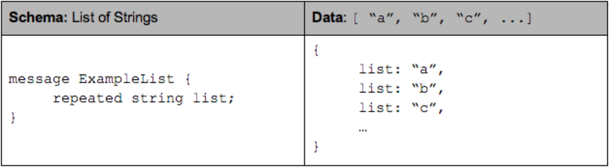

A Map is equivalent to a repeating field containing groups of key-value pairs where the key is required.


## Columnar format

A columnar format provides more efficient encoding and decoding by storing together values of the same primitive type. To store nested data structures in columnar format, we need to map the schema to a list of columns in a way that we can write records to flat columns and read them back to their original nested data structure. In Parquet, we create one column per primitive type field in the schema. If we represent the schema as a tree, the primitive types are the leaves of this tree.

AddressBook example as a tree:

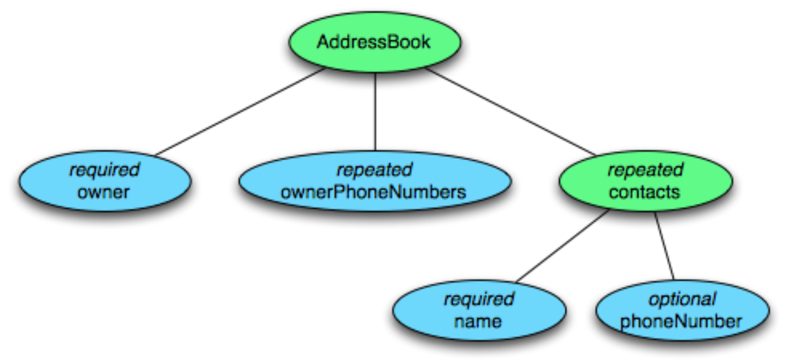

To represent the data in columnar format we create one column per primitive type cell shown in blue.

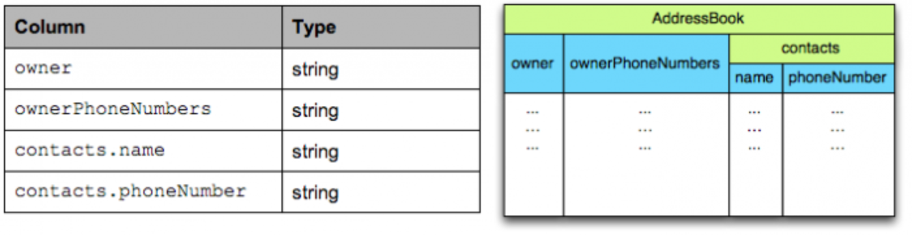

The structure of the record is captured for each value by two integers called repetition level and definition level. Using definition and repetition levels, we can fully reconstruct the nested structures. This will be explained in detail below.

## Definition levels

To support nested records we need to store the level for which the field is null. This is what the definition level is for: from 0 at the root of the schema up to the maximum level for this column. When a field is defined then all its parents are defined too, but when it is null we need to record the level at which it started being null to be able to reconstruct the record.

In a flat schema, an optional field is encoded on a single bit using 0 for null and 1 for defined. In a nested schema, we use an additional value for each level of nesting (as shown in the example), finally if a field is required it does not need a definition level.

For example, consider the simple nested schema below:

```protobuf
message ExampleDefinitionLevel {
  optional group a {
    optional group b {
      optional string c;
    }
  }
}
```

It contains one column: **a.b.c** where all fields are optional and can be null. When **c** is defined, then necessarily **a** and **b** are defined too, but when **c** is null, we need to save the level of the null value. There are 3 nested optional fields so the maximum definition level is 3.

Here is the definition level for each of the following cases:

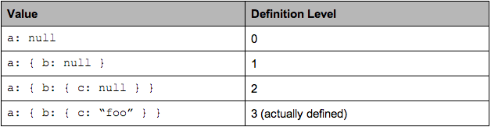


The maximum possible definition level is 3, which indicates that the value is defined. Values 0 to 2 indicate at which level the null field occurs.

A required field is always defined and does not need a definition level. Let’s reuse the same example with the field **b** now **required**:

```protobuf
message ExampleDefinitionLevel {
  optional group a {
    required group b {
      optional string c;
    }
  }
}
```

The maximum definition level is now 2 as **b** does not need one. The value of the definition level for the fields below b changes as follows:

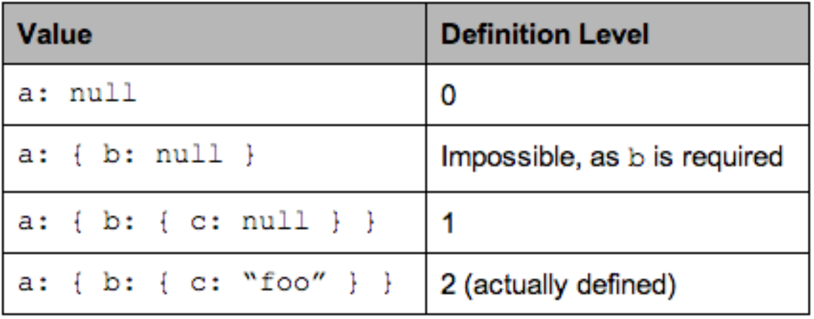

Making definition levels small is important as the goal is to store the levels in as few bits as possible.

## Repetition levels

To support repeated fields we need to store when new lists are starting in a column of values. This is what repetition level is for: it is the level at which we have to create a new list for the current value. In other words, the repetition level can be seen as a marker of when to start a new list and at which level. For example consider the following representation of a list of lists of strings:

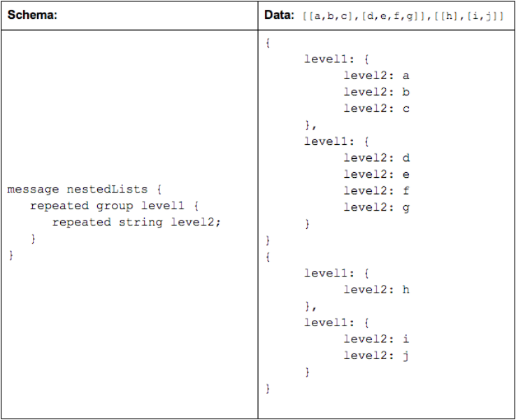

The column will contain the following repetition levels and values:


The repetition level marks the beginning of lists and can be interpreted as follows:

- 0 marks every new record and implies creating a new level1 and level2 list
- 1 marks every new level1 list and implies creating a new level2 list as well.
- 2 marks every new element in a level2 list.

On the following diagram we can visually see that it is the level of nesting at which we insert records:

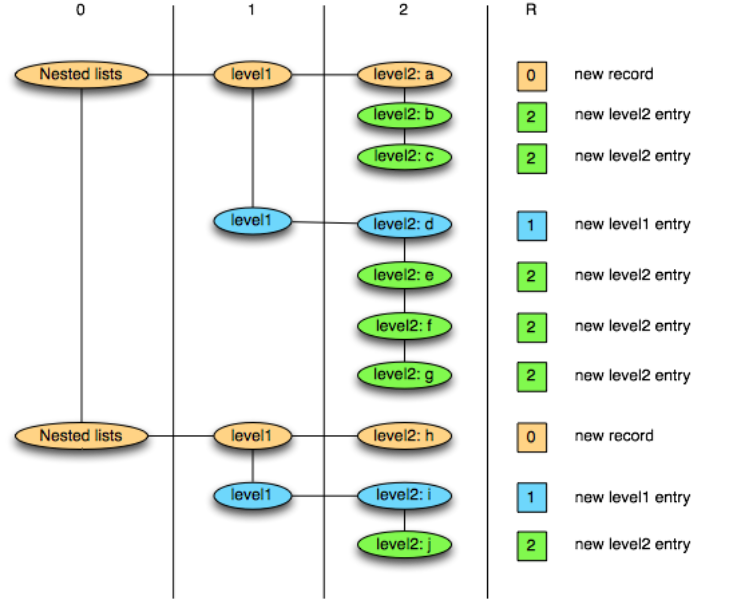

A repetition level of 0 marks the beginning of a new record. In a flat schema there is no repetition and the repetition level is always 0. [Only levels that are repeated need a Repetition level](https://github.com/Parquet/parquet-mr/blob/8f93adfd0020939b9a58f092b88a5f62fd14b834/parquet-column/src/main/java/parquet/schema/GroupType.java#L199): optional or required fields are never repeated and can be skipped while attributing repetition levels.

## Striping and assembly

Now using the two notions together, let’s consider the AddressBook example again. This table shows the maximum repetition and definition levels for each column with explanations on why they are smaller than the depth of the column:

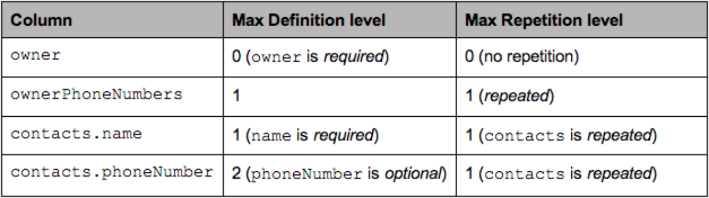

In particular for the column **contacts.phoneNumber**, a defined phone number will have the maximum definition level of 2, and a contact without phone number will have a definition level of 1. In the case where contacts are absent, it will be 0.

```yaml
AddressBook {
  owner: "Julien Le Dem",
  ownerPhoneNumbers: "555 123 4567",
  ownerPhoneNumbers: "555 666 1337",
  contacts: {
    name: "Dmitriy Ryaboy",
    phoneNumber: "555 987 6543",
  },
  contacts: {
    name: "Chris Aniszczyk"
  }
}
AddressBook {
  owner: "A. Nonymous"
}
```

We’ll now focus on the column **contacts.phoneNumber** to illustrate this.

Once projected the record has the following structure:

```yaml
AddressBook {
  contacts: {
    phoneNumber: "555 987 6543"
  }
  contacts: {
  }
}
AddressBook {
}
```

The data in the column will be as follows (R = Repetition Level, D = Definition Level)


To write the column we iterate through the record data for this column:

- contacts.phoneNumber: “555 987 6543”
  - new record: R = 0
  - value is defined: D = maximum (2)
- contacts.phoneNumber: null
  - repeated contacts: R = 1
  - only defined up to contacts: D = 1
- contacts: null
  - new record: R = 0
  - only defined up to AddressBook: D = 0

The columns contains the following data:

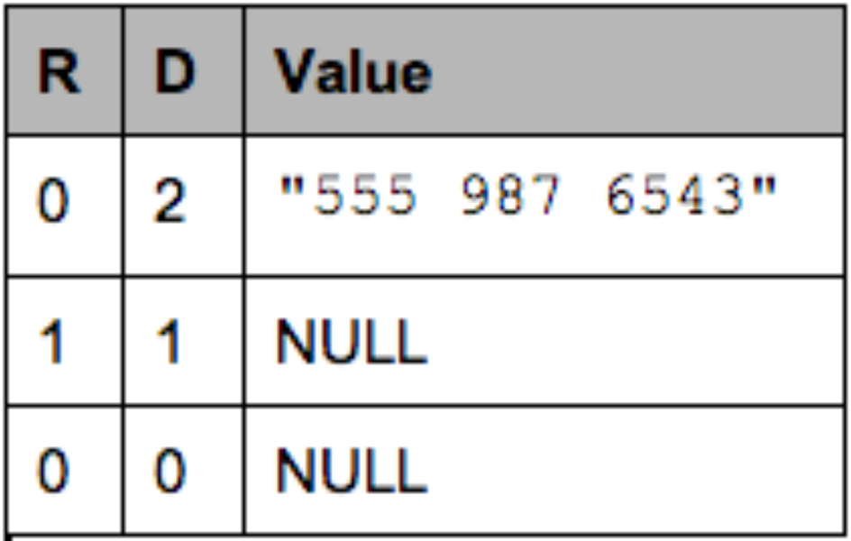

Note that NULL values are represented here for clarity but are not stored at all. A definition level strictly lower than the maximum (here 2) indicates a NULL value.

To reconstruct the records from the column, we iterate through the column:

- R=0, D=2, Value = “555 987 6543”

  :

  - R = 0 means a new record. We recreate the nested records from the root until the definition level (here 2)
  - D = 2 which is the maximum. The value is defined and is inserted.

- R=1, D=1

  :

  - R = 1 means a new entry in the contacts list at level 1.
  - D = 1 means contacts is defined but not phoneNumber, so we just create an empty contacts.

- R=0, D=0

  :

  - R = 0 means a new record. we create the nested records from the root until the definition level
  - D = 0 => contacts is actually null, so we only have an empty AddressBook

## Storing definition levels and repetition levels efficiently

In regards to storage, this effectively boils down to creating three sub columns for each primitive type. However, the overhead for storing these sub columns is low thanks to the columnar representation. That’s because levels are bound by the depth of the schema and can be stored efficiently using only a few bits per value (A single bit stores levels up to 1, 2 bits store levels up to 3, 3 bits can store 7 levels of nesting). In the address book example above, the column **owner** has a depth of one and the column **contacts.name** has a depth of two. The levels will always have zero as a lower bound and the depth of the column as an upper bound. Even better, fields that are not repeated do not need a repetition level and required fields do not need a definition level, bringing down the upper bound.

In the special case of a flat schema with all fields required (equivalent of NOT NULL in SQL), the repetition levels and definition levels are omitted completely (they would always be zero) and we only store the values of the columns. This is effectively the same representation we would choose if we had to support only flat tables.

These characteristics make for a very compact representation of nesting that can be efficiently encoded using a combination of [Run Length Encoding and bit packing](https://github.com/Parquet/parquet-mr/tree/master/parquet-column/src/main/java/parquet/column/values/rle). A sparse column with a lot of null values will compress to almost nothing, similarly an optional column which is actually always set will cost very little overhead to store millions of 1s. In practice, space occupied by levels is negligible. This representation is a generalization of how we would represent the simple case of a flat schema: writing all values of a column sequentially and using a bitfield for storing nulls when a field is optional.

## Get Involved

Parquet is still a young project; to learn more about the project see our [README](https://github.com/Parquet/parquet-mr/blob/master/README.md) or look for the “[pick me up!](https://github.com/Parquet/parquet-mr/issues?labels=pick+me+up!&state=open)” label on GitHub. We do our best to review pull requests in a timely manner and give thorough and constructive reviews.