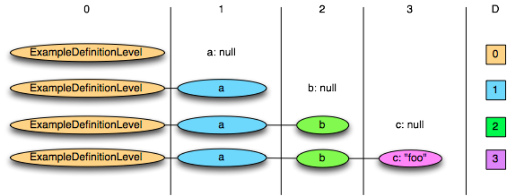
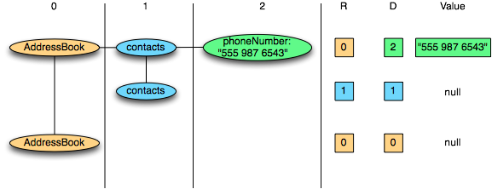

# 执行

## QueryDriver

> The `QueryDriver` owns the `ClientRequestStates` for a query. A single query can map to multiple ClientRequestStates if the query is retried multiple times. The QueryDriver sits between the ImpalaServer and ClientRequestState. Currently, it mainly handles query retries. 
>
> ImpalaServer vs. QueryDriver vs. ClientRequestState vs. Coordinator: 
>
> All of these classes work together to run a client-submitted query end to end. A client submits a request to the ImpalaServer to run a query. The ImpalaServer creates a QueryDriver and ClientRequestState to run the query. The ClientRequestState creates a Coordinator that is responsible for coordinating the execution of all query fragments and for tracking the lifecyle of the fragments. A fetch results request flows from the ImpalaServer to the ClientRequestState and then to the Coordinator, which fetches the results from the fragment running on the coordinator process. 
>
> Query Retries: Query retries are driven by the 'TryQueryRetry' and 'RetryQueryFromThread' methods. Each query retry creates a new ClientRequestState. In other words, a single ClientRequestState corresponds to a single attempt of a query. Thus, a QueryDriver can own multiple ClientRequestStates, one for each query attempt. 
>
> Retries are done asynchronously in a separate thread. If the query cannot be retried for any reason, the original query is unregistered and moved to the ERROR state. The steps required to launch a retry of a query are very similar to the steps necessary to start the original attempt of the query, except parsing, planning, optimizing, etc. are all skipped. This is done by cacheing the TExecRequest from the original query and re-using it for all query retries. 
>
> At a high level, retrying a query requires performing the following steps: 
> * Cancelling the original query
> * Creating a new ClientRequestState with a unique query id and a copy of the TExecRequest from the original query 
> * Registering the new query (ImpalaServer::RegisterQuery) 
> * Launching the new query (ClientRequestState::Exec) 
> * Closing and unregistering the original query 
>
> *Transparent* Query Retries: A key feature of query retries is that they should be "transparent" from the client perspective. No client code modifications should be necessary to support query retries. The QueryDriver makes query retries "transparent" by introducing the concept of an "active" ClientRequestState. The "active" ClientRequestState refers to the currently running attempt to run the query, and is accessible by the method GetActiveClientRequestState(). Callers (e.g. ImpalaServer) can use this method to get a reference to the most recent attempt of the query. 
>
> Disclaimer: While query retries are designed to be *transparent* there are scenarios where clients may see some unexpected behavior when a query is retried. 
>
> When a query is retried, the retry is modeled as a brand new query with a new query id, which will be distinct from the query id of the originally submitted query that ultimately failed. So users might see multiple query ids in play during the lifecycle of a single query submission. 
>
> Since a query retry is a brand new query, that query has its own runtime profile as well; the runtime profiles of the failed and retried queries will be linked together. Users need to be aware that there can be multiple runtime profiles associated with a single query submission. 
>
> Thread Safety: Only GetClientRequestState(query_id) and GetActiveClientRequestState() are thread safe. They are protected by an internal SpinLock.

`QueryDriver` 拥有查询的 `ClientRequestStates`。如果多次重试查询，则单个查询可以映射到多个 ClientRequestState。 `QueryDriver` 位于 `ImpalaServer` 和 `ClientRequestState` 之间。目前主要处理查询重试。

### `ImpalaServer` vs. `QueryDriver` vs. `ClientRequestState` vs. `Coordinator`

所有这些类一起工作以端到端地运行客户端提交的查询。

1. 客户端向 `ImpalaServer` 提交请求以运行查询。 
2. `ImpalaServer`  创建一个 `QueryDriver` 和 `ClientRequestState` 来运行查询。
3. `ClientRequestState` 创建 `Coordinator`，负责协调所有查询**片段**的执行，并跟踪片段的生命周期。
4. 获取结果请求从 `ImpalaServer` 流向 `ClientRequestState`，然后流向 `Coordinator`，`Coordinator` 从运行 `Coordinator` 进程上的**片段**中获取结果。

**查询重试**：查询重试由“TryQueryRetry”和“RetryQueryFromThread”方法驱动。每个查询重试都会创建一个新的 ClientRequestState。换句话说，单个 ClientRequestState 对应于一次查询尝试。因此，一个 QueryDriver 可以拥有多个 ClientRequestStates，一个用于每次查询尝试。

重试在单独的线程中异步完成。如果由于任何原因无法重试查询，则原始查询将取消注册并移至 ERROR 状态。启动查询重试所需的步骤与启动查询的原始尝试所需的步骤非常相似，除了解析、计划、优化等都被跳过。这是通过缓存原始查询中的 TExecRequest 并将其重新用于所有查询重试来完成的。

概括地说，重试查询需要执行以下步骤：
* 取消原来的查询
* 创建一个具有唯一查询 id 和原始查询的 TExecRequest 副本的新 ClientRequestState
* 注册新查询（ImpalaServer::RegisterQuery）
* 启动新查询 (ClientRequestState::Exec)
* 关闭和注销原始查询

**透明**查询重试：查询重试的一个关键特性是，从客户端的角度来看，它们应该是“透明的”。无需修改客户端代码即可支持查询重试。 QueryDriver 通过引入“活动”ClientRequestState 的概念使查询重试“透明”。 “活动的”ClientRequestState 是指当前运行的查询尝试，可通过 GetActiveClientRequestState() 方法访问。调用者（例如 ImpalaServer）可以使用此方法来获取对最近一次查询尝试的引用。

免责声明：虽然查询重试被设计为*透明*，但在某些情况下，客户端在重试查询时可能会看到一些意外行为。

当重试查询时，重试被建模为具有新查询 id 的全新查询，这将与最终失败的最初提交的查询的查询 id 不同。因此，用户可能会在单个查询提交的生命周期中看到多个查询 ID。

由于查询重试是全新的查询，因此该查询也有自己的运行时配置文件；失败和重试查询的运行时配置文件将链接在一起。用户需要注意，可以有多个运行时配置文件与单个查询提交相关联。

线程安全：只有 GetClientRequestState(query_id) 和 GetActiveClientRequestState() 是线程安全的。它们受到内部自旋锁的保护。

## `QueryState`

Central class for all backend execution state (example: the `FragmentInstanceStates` of the individual fragment instances) created for a particular query. This class contains or makes accessible state that is shared across fragment instances; in contrast, fragment instance-specific state is collected in `FragmentInstanceState`.

The lifetime of a `QueryState` is dictated by a reference count. Any thread that executes on behalf of a query, and accesses any of its state, must obtain a reference to the corresponding `QueryState` and hold it for at least the duration of that access. The reference is obtained and released via `QueryExecMgr::Get-/ReleaseQueryState()` or via `QueryState::ScopedRef` (the latter for references limited to the scope of a single function or block). As long as the reference count is greater than 0, all of a query's control structures (contained either in this class or accessible through this class, such as the `FragmentInstanceStates`) are guaranteed to be alive.

Query execution resources (non-control-structure memory, scratch files, threads, etc) are also managed via a separate resource reference count, which should be released as soon as the resources are not needed to free resources promptly.

We maintain a state denoted by `BackendExecState`. The initial state is PREPARING. Once all query fragment instances have finished `FIS::Prepare()`, the BackendExecState will transition to:
 - `EXECUTING` if all fragment instances succeeded in `Prepare()`
 - `ERROR` if any fragment instances failed during or after `Prepare()`
 - `CANCELLED` if the query is cancelled

Please note that even if some fragment instances hit an error during or after Prepare(), the state transition from PREPARING won't happen until all fragment instances have finished Prepare(). This makes sure the query state is initialized to handle either a Cancel() RPC or a PublishFilter() RPC after PREPARING state.

Once BackendExecState() enters EXECUTING state, any error will trigger the BackendExecState to go into ERROR state and the query execution is considered over on this backend.

When any fragment instance execution returns with an error status, all fragment instances are automatically cancelled. The query state thread (started by QueryExecMgr) periodically reports the overall status, the current state of execution and the profile of each fragment instance to the coordinator. The frequency of those reports is controlled by the flag status_report_interval_ms; Setting it to 0 disables periodic reporting altogether. Regardless of the value of that flag, a report is sent at least once at the end of execution with an overall status and profile (and 'done' indicator). If execution ended with an error, that error status will be part of the final report (it will not be overridden by the resulting cancellation).

 Thread-safe Notes:
 - Init() must be called first. After Init() returns successfully, all other public  functions are thread-safe to be called unless noted otherwise.
 - Cancel() is safe to be called at any time (before or during Init()).

 TODO:
 - set up kudu clients in Init(), remove related locking

## `RuntimeState`

> Shared state for Impala's runtime query execution. Used in two contexts: 
>
> -  Within execution of a fragment instance to hold shared state for the fragment instance (i.e. there is a 1:1 relationship with `FragmentInstanceState`). 
> -  A standalone mode for other cases where query execution infrastructure is used outside the context of a fragment instance, e.g. tests, evaluation of constant expressions, etc. In this case the RuntimeState sets up all the required infrastructure.
>
> `RuntimeState` is shared between multiple threads and so methods must generally be thread-safe.  After initialisation, callers must call `ReleaseResources()` to ensure that all resources are correctly freed before destruction.

执行 Impala 查询时的**运行时共享状态**。两种情况下使用：

- 执行**片段实例**时，为**片段实例**保存共享状态（即与 `FragmentInstanceState` 存在 1:1 的关系）。
- **独立模式**：在片段实例的上下文之外，使用<u>查询执行基础设施</u>的其他情况，例如：测试、常量表达式的评估等。在这种情况下，`RuntimeState`  设置了所有必需的基础设施。

`RuntimeState` 在多个线程之间共享，因此方法通常必须是线程安全的。 初始化后，调用者必须调用 `ReleaseResources()` 以确保在销毁之前正确释放所有资源。

---

这里看起来，有两个构造函数：

### 执行片段实例

```c++
/// query_state, fragment_ctx, and instance_ctx need to be alive at least as long as
/// the constructed RuntimeState
RuntimeState(
    QueryState* query_state, 
    const TPlanFragment& fragment,
    const TPlanFragmentInstanceCtx& instance_ctx,
    const PlanFragmentCtxPB& fragment_ctx,
    const PlanFragmentInstanceCtxPB& instance_ctx_pb, 
    ExecEnv* exec_env);
```

### 独立模式

```c++
/*
RuntimeState for test execution and fe-support.cc. Creates its own QueryState and installs desc_tbl, if set. If query_ctx.request_pool isn't set, sets it to "test-pool".
*/
RuntimeState(
    const TQueryCtx& query_ctx, 
    ExecEnv* exec_env, 
    DescriptorTbl* desc_tbl = nullptr);
```

## `FragmentState`

This encapsulates all the static state for a fragment that will be shared across its instances which includes the thrift structures representing fragments and all its instances, plan node tree and data sink config. It also contains state and methods required for creating, invoking and managing codegen. Is not thread safe unless specified.

## `FragmentInstanceState`

`FragmentInstanceState` handles all aspects of the execution of a single plan fragment instance, including setup and finalization, both in the success and error case. Close() happens automatically at the end of Exec() and frees all memory allocated for this fragment instance and closes all data streams.

The FIS makes an aggregated profile for the entire fragment available, which includes profile information for the plan itself as well as the output sink. It also contains a timeline of events of the fragment instance.

This class is thread-safe. 

- All non-getter public functions other than `Exec()` block until the `Prepare` phase  finishes.
-  No member variables, other than the ones passed to the c'tor, are valid before  the `Prepare` phase finishes.

TODO:
- absorb RuntimeState?

---

This scanner parses Parquet files located in HDFS, and writes the content as tuples in the Impala in-memory representation of data, e.g.  (tuples, rows, row batches). For the file format spec, see: [parquet-format](https://github.com/apache/parquet-format)

## 资源管理

### `SpillableRowBatchQueue`

A RowBatchQueue that provides non-blocking queue semantics. `RowBatch`es are stored inside a `BufferedTupleStream`. None of the methods block, this class is not thread safe. The amount of unpinned memory used by the queue can be limited by the parameter `max_unpinned_bytes`. Calls to `AddBatch` after the capacity has been reached will return an error `Status`. Calls to `GetBatch` on an empty queue will return an error Status.

In order to manage the reservation used by the `BufferedTupleStream`, this class uses a `ReservationManager` that creates the `BufferPool::ClientHandle` used by the `BufferedTupleStream`. The `ReservationManager` uses a `ResourceProfile` created by the frontent to limit the amount of reserved memory used by the stream. `name` is a unique name which is purely used for error reporting by the BufferedTupleStream.

`max_unpinned_bytes` limits the maximum number of bytes that can be unpinned in the underlying `BufferedTupleStream`. The limit is only a soft limit, it might be exceeded during AddBatch when unpinning the stream.

`resource_profile` is created in the fe by `PlanRootSink` and specifies the min and max amount of reserved memory the `BufferedTupleStream` can use as well as the size of the default and max page length used by the stream.

The remaining parameters are used to initialize the `ReservationManager` and `BufferedTupleStream`.

### `ReservationManager`

> A `ReservationManager` provides a wrapper around a `TBackendResourceProfile` and a `BufferPool::ClientHandle`, with functionality for claiming and releasing the memory from the **resource profile**.

`ReservationManager` 包装 `TBackendResourceProfile` 和 `BufferPool::ClientHandle` ，具有从 **resource profile** 中声明和释放内存的功能。

### `InitialReservations`

> **Manages the pool of initial reservations for different nodes in the plan tree**. Each plan node and sink claims its initial reservation from here, then returns it when it is done executing. The **frontend** is responsible for making sure that enough initial reservation is in this pool for all of the concurrent claims.

**管理计划树中不同节点的初始预留池**。每个<u>计划节点</u>和<u>接收器</u>都从这里声明其初始保留，然后在执行完成时返回它。 <u>==前端==</u>负责确保该池中有足够的初始预留用于所有<u>**并发声明**</u>。

#### 构造函数
```c++
InitialReservations(ObjectPool* obj_pool, ReservationTracker* query_reservation, MemTracker* query_mem_tracker, int64_t initial_reservation_total_claims);
````

> 1. `query_reservation` and `query_mem_tracker` are the top-level trackers for the query. This creates trackers for initial reservations under those. 
> 2. `initial_reservation_total_claims` is the total of initial reservations that will be claimed over the lifetime of the query. The total bytes claimed via `Claim()` cannot exceed this. 
> 3. Allocated objects are stored in `obj_pool`.

1. `query_reservation` 和 `query_mem_tracker` 是查询的顶层跟踪器。这将为这些<u>==预订==</u>下的<u>==初始预订==</u>创建跟踪器。
2. `initial_reservation_total_claims` 是在查询生命周期内将要求的初始保留总数。通过 `Claim()` 声明的总字节数不能超过此值。
3. 分配的对象存储在 `obj_pool` 中。

# 缓冲

## `BufferPool`

> A buffer pool that manages memory buffers for all queries in an Impala daemon. The buffer pool enforces buffer reservations, limits, and implements policies for moving spilled memory from in-memory buffers to disk. It also enables reuse of buffers between queries, to avoid frequent allocations.
>
> The buffer pool can be used for allocating any large buffers (above a onfigurable minimum length), whether or not the buffers will be spilled. Smaller allocations are not serviced directly by the buffer pool: clients of the buffer pool must **subdivide** buffers if they wish to use smaller allocations.
>
> All buffer pool operations are in the context of a registered buffer pool client. A buffer pool client should be created for every allocator of buffers at the level of granularity required for reporting and enforcement of reservations, e.g. an operator. The client tracks buffer reservations via its ReservationTracker and also includes info that is helpful for debugging (e.g. the operator that is associated with the buffer). **Unless otherwise noted, it is not safe to invoke concurrent buffer pool operations for the same client**.

**缓冲池**管理 Impala 守护程序中所有查询的内存缓冲区。**缓冲池**强制执行==缓冲区预留==、==限制==，并实现溢出策略，即将溢出的内存从<u>内存缓冲区</u>移动到<u>磁盘</u>。它还支持在查询之间重用缓冲区，以避免频繁分配。

**缓冲池可用于分配任意大小的缓冲区**（==超过可配置的最小长度==），无论缓冲区是否会溢出。较小的分配不直接由缓冲池提供服务：缓冲池的客户端如果希望使用较小的分配，则必须细分缓冲区。

缓冲池的所有操作都在**已注册的缓冲池客户端上下文中**。应该为**每个缓冲区分配器**创建**一个缓冲池客户端**，其粒度级别为<u>报告</u>和<u>强制执行预留</u>所需的粒度，例如一个算子。客户端通过其 `ReservationTracker` 跟踪缓冲区预留，还包括有助于调试的信息（例如，与缓冲区关联的算子）。除非另有说明，否则为同一个客户并发调用缓冲池操作不安全。

### Pages, Buffers and Pinning

- A page is a logical block of memory that can reside in memory or on disk.
- A buffer is a physical block of memory that can hold a page in memory.
- A page handle is used by buffer pool clients to identify and access a page and the corresponding buffer. Clients do not interact with pages directly.
- A buffer handle is used by buffer pool clients to identify and access a buffer.
- A page is pinned if it has pin count > 0. A pinned page stays mapped to the same buffer.
- An unpinned page can be written out to disk by the buffer pool so that the buffer can be used for another purpose.

### Buffer/Page Sizes

The buffer pool has a minimum buffer size, which must be a power-of-two. Page and buffer sizes must be an exact power-of-two multiple of the minimum buffer size.

### Reservations

Before allocating buffers or pinning pages, a client must reserve memory through its `ReservationTracker`. Reservation of n bytes give a client the right to allocate buffers or pin pages summing up to n bytes. Reservations are both necessary and sufficient for a client to allocate buffers or pin pages: the operations succeed unless a "system error" such as a disk write error is encountered that prevents unpinned pages from being written to disk.

More memory may be reserved than is used, e.g. if a client is not using its full reservation. In such cases, the buffer pool can use the free buffers in any way, e.g. for keeping unpinned pages in memory, so long as it is able to fulfill the reservations when needed, e.g. by flushing unpinned pages to disk.

### Page/Buffer Handles

The buffer pool exposes PageHandles and BufferHandles, which are owned by clients of the buffer pool, and act as a proxy for the internal data structure representing the page or buffer in the buffer pool. Handles are "open" if they are associated with a page or buffer. An open PageHandle is obtained by creating a page. PageHandles are closed by calling BufferPool::DestroyPage(). An open BufferHandle is obtained by allocating a buffer or extracting a BufferHandle from a PageHandle. The buffer of a pinned page can also be accessed through the PageHandle. The handle destructors check for resource leaks, e.g. an open handle that would result in a buffer leak.

#### Pin Counting of Page Handles:
 Page handles are scoped to a client. The invariants are as follows:
- A page can only be accessed through an open handle.
- A page is destroyed once the handle is destroyed via DestroyPage().
- A page's buffer can only be accessed through a pinned handle.
- Pin() can be called on an open handle, incrementing the handle's pin count.
- Unpin() can be called on a pinned handle, but not an unpinned handle.
- Pin() always increases usage of reservations, and Unpin() always decreases usage, i.e. the handle consumes <pin count> * <page size> bytes of reservation.

### Example Usage: Buffers

 The simplest use case is to allocate a memory buffer.
- The new buffer is created with AllocateBuffer().
- The client reads and writes to the buffer as it sees fit.
- If the client is done with the buffer's contents it can call FreeBuffer() to destroy the handle and free the buffer, or use TransferBuffer() to transfer the buffer to a different client.

### Example Usage: Spillable Pages

- In order to spill pages to disk, the Client must be registered with a FileGroup, which is used to allocate scratch space on disk.
- A spilling operator creates a new page with CreatePage().
- The client reads and writes to the page's buffer as it sees fit.
- If the operator encounters memory pressure, it can decrease reservation usage by calling Unpin() on the page. The page may then be written to disk and its buffer repurposed internally by BufferPool.
- Once the operator needs the page's contents again and has sufficient unused reservation, it can call Pin(), which brings the page's contents back into memory, perhaps in a different buffer. Therefore the operator must fix up any pointers into the previous buffer. Pin() executes asynchronously - the caller only blocks waiting for read I/O if it calls GetBuffer() or ExtractBuffer() while the read is in flight.
- If the operator is done with the page, it can call DestroyPage() to destroy the handle and release resources, or call ExtractBuffer() to extract the buffer.

### Synchronization
The data structures in the buffer pool itself are thread-safe. Client-owned data structures - Client, PageHandle and BufferHandle - are not protected from concurrent accesses. Clients must ensure that they do not invoke concurrent operations with the same Client, PageHandle or BufferHandle.

## `ScanBufferManager`

> Implementation of the buffer management for `ScanRange`. Each `ScanRange` contains a queue of ready buffers and a queue of unused buffers. For each `ScanRange`, there is only a single producer and consumer thread, i.e. only one disk thread will push to a scan range at any time and only one thread will remove from the queue. **This is to guarantee that buffers are queued and read in file order**.

`ScanRange` 的缓冲区管理的实现。 每个 `ScanRange` 包含一个**就绪缓冲区队列**和一个**未使用缓冲区队列**。 对于每个 `ScanRange`，只有一个生产者和消费者线程，即任何时候只有一个磁盘线程会~~<u>推送扫描范围</u>~~，并且只有一个线程会从队列中移除缓冲区。 **这是为了保证缓冲区按文件顺序排队和读取**。

### BUFFER LIFECYCLE
> Disk thread will use the buffer from unused buffer queue to read the data. Once data is read into buffer it will be put into ready buffers and consumer thread will read it using `ScanRange::GetNext()`. Once read consumer will return that buffer for reuse using `ScanRange::ReturnBuffer()` which gets added to unused buffers again. Once data read is completed by `ScanRange` or when it gets cancelled, all the remaining buffers in both queues get freed.

磁盘线程将使用**未使用的缓冲区队列**中的缓冲区来填充读取的数据。一旦数据被读入缓冲区，它将被放入准备好的缓冲区，消费者线程使用 `ScanRange::GetNext()` 读取它。 一旦消费，消费者使用 `ScanRange::ReturnBuffer()` 返回该缓冲区以供重用，该缓冲区将再次添加到未使用的缓冲区中。 一旦 `ScanRange` 完成数据读取或取消数据读取，两个队列中的所有剩余缓冲区都将被释放。

# IO

## `ScanRange`

`ScanRange` description. The caller must call `Reset()` to initialize the fields before calling `RequestContext::AddScanRanges()`. The private fields are used internally by the `IoMgr`.

| 成员                                                 | 说明                                                         |
| ---------------------------------------------------- | ------------------------------------------------------------ |
| `Status cancel_status_`                              | If non-OK, this scan range has been cancelled. This status is the reason for cancellation - `CANCELLED_INTERNALLY` if cancelled without error, or another status if an error caused cancellation. Note that a range can be cancelled without cancelling the owning context. This means that ranges can be cancelled or hit errors without aborting all scan ranges.<br/> Writers must hold both `lock_` and `file_reader_->lock()`. Readers must hold either `lock_` or `file_reader_->lock()`. This prevents the range from being cancelled while any thread is inside a critical section. |
| `void* meta_data_ = nullptr`                         | **Pointer to caller specified metadata**. This is untouched by the io manager and the caller can put whatever auxiliary data in here. |
| `int cache_options_`                                 | Options for enabling HDFS caching and data cache.            |
| `bool expected_local_ = false`                       | If true, we expect this scan range to be a local read. Note that if this is false, it does not necessarily mean we expect the read to be remote, and that we never create scan ranges where some of the range is expected to be remote and some of it local.<br/>**TODO**: we can do more with this |
| `int64_t mtime_`                                     | Last modified time of the file associated with the scan range. Set in `Reset()`. |
| `DiskIoMgr* io_mgr_ = nullptr`                       |                                                              |
| `RequestContext* reader_ = nullptr`                  | Reader/owner of the scan range                               |
| `client_buffer_`                                     |                                                              |
| `cache_`                                             |                                                              |
| `std::unique_ptr<ScanBufferManager> buffer_manager_` | Buffer Mangement for this `ScanRange` will be done by the field below. |
| `std::mutex lock_`                                   | Lock protecting fields below. This lock should not be taken during `FileReader::Open()/Read()/Close()`. <br />If `RequestContext::lock_` and this lock need to be held simultaneously, `RequestContext::lock_` must be taken first. |
| `bool read_in_flight_ = false`                       | **`True` if a disk thread is currently doing a read for this scan range**. Set to true in `DoRead()` and set to `false` in `EnqueueReadyBuffer()` or `CancelInternal()` when the read completes and any buffer used for the read is either enqueued or freed. |
| `bool eosr_queued_ = false`                          | If true, the last buffer for this scan range has been queued. If this is true and `ready_buffers_` is empty, then no more buffers will be returned to the caller by this scan range. |
| `bool blocked_on_buffer_ = false`                    | If true, this scan range is not scheduled because a buffer is not available for the next I/O in the range. This can happen when the scan range is initially created or if the buffers added to the range have all been filled with data an not yet returned. |
| `ConditionVariable buffer_ready_cv_`                 | Condition variable for threads in `GetNext()` that are waiting for the next buffer and threads in `WaitForInFlightRead()` that are waiting for a read to finish. Signalled when a buffer is enqueued in ready buffers managed by buffer manager (i.e., `buffer_manager_->ready_buffers_`) or the scan range is cancelled. |
| `int64_t bytes_read_ = 0`                            | Number of bytes read by this scan range.                     |
| `std::unique_ptr<FileReader> file_reader_`           | Polymorphic object that is responsible for doing file operations. |
| `std::unique_ptr<FileReader> local_buffer_reader_`   | Polymorphic object that is responsible for doing file operations if the path is a remote url and the file is in the local buffer. |
| `bool use_local_buffer_ = false`                     | If set to true, the scan range is using `local_buffer_reader_` to do scan operations. The flag is set during `DoRead()`. If the path is a remote path and the file has a local buffer, the flag is set to true, otherwise the flag is false. |
| `std::vector<SubRange> sub_ranges_`                  | If not empty, the ScanRange will only read these parts from the file |
| `DiskFile* disk_file_ = nullptr`                     | The file handle of the physical file to be accessed.         |
| `DiskFile* disk_buffer_file_ = nullptr`              | The file handle of the physical buffer file to be accessed.  |
| `SubRangePosition sub_range_pos_`                    | `Current read position in the sub-ranges.`                   |
| `int64_t bytes_to_read_ = 0`                         | Number of bytes need to be read by this `ScanRange`. If there are no sub-ranges it equals to `len_`. If there are sub-ranges then it equals to the sum of the lengths of the sub-ranges (which is less than or equal to `len_`). |

## RequestContext

> A request context is used to group together I/O requests belonging to a client of the I/O manager for management and scheduling.

`RequestContext` 用于将属于 **I/O 管理器**某个客户的 I/O 请求组合在一起以进行管理和调度。

### 实现细节

这个对象维护了很多经过仔细同步的**状态**。它维护所有磁盘以及每个磁盘状态（`RequestContext::PerDiskState`）。IO 的请求单位是 `RequestRange`，可以是`ScanRange` 或 `WriteRange`。**Reader** 的 `ScanRange` 是以下六种状态之一:

---

>This object maintains a lot of state that is carefully synchronized. The context maintains state across all disks as well as per disk state. The unit for an IO request is a `RequestRange`, which may be a `ScanRange` or a `WriteRange`. A scan range for the reader is on one of six states:

1) `PerDiskState`'s `unstarted_scan_ranges_`: This range has only been queued and nothing has been read from it.

2) `RequestContext`'s `ready_to_start_ranges_`: This range is about to be started. As soon as the reader picks it up, it will move to the `in_flight_ranges_` queue.

3) `PerDiskState`'s `in_flight_ranges_`: This range is being processed and will be read from the next time a disk thread picks it up in `GetNextRequestRange()`

4) The `ScanRange` is blocked waiting for buffers because it does not have any unused buffers to read data into. It is unblocked when a client adds new buffers via `AllocateBuffersForRange()` or returns existing buffers via `ReturnBuffer()`. `ScanRange`s in this state are identified by `blocked_on_buffer_ == true`.

5) `ScanRange` is cached and in the `cached_ranges_` queue.

6) **Inactive** - either all the data for the range was returned or the range was cancelled. I.e. `ScanRange::eosr_` is true or `ScanRange::cancel_status_ != OK`.

If the scan range is read and does not get blocked waiting for buffers, the transitions are: `1 -> 2 -> 3`. If the scan range does get blocked, the transitions are `1 -> 2 -> 3 -> (4 -> 3)*`

In the case of a cached scan range, the range is immediately put in `cached_ranges_`. When the caller asks for the next range to process, we first pull ranges from the `cache_ranges_` queue. If the range was cached, the range is removed and done (ranges are either entirely cached or not at all). If the cached read attempt fails, we put the range in state 1.

All scan ranges in states 1-5 are tracked in `active_scan_ranges_` so that they can be cancelled when the `RequestContext` is cancelled. Scan ranges are removed from `active_scan_ranges_` during their transition to state 6.

A write range for a context may be in one of two queues:

1) `unstarted_write_ranges_` : Ranges that have been queued but not processed.
2) `in_flight_ranges_` : The write range is ready to be processed by the next disk thread that picks it up in `GetNextRequestRange()`.

`AddWriteRange()` adds `WriteRange`s for a disk.

It is the responsibility of the client to pin the data to be written via a `WriteRange` in memory. After a `WriteRange` has been written, a callback is invoked to inform the client that the write has completed.

An important assumption is that write does not exceed the maximum read size and that the entire range is written when the write request is handled. (In other words, writes are not broken up.)

When a RequestContext is processed by a disk thread in `GetNextRequestRange()`, a write range is always removed from the list of unstarted write ranges and appended to the `in_flight_ranges_` queue. This is done to alternate reads and writes - a read that is scheduled (by calling `GetNextUnstartedRange()`) is always followed by a write (if one exists). And since at most one WriteRange can be present in in_flight_ranges_ at any time (once a write range is returned from `GetNetxRequestRange()` it is completed and not re-enqueued), a scan range scheduled via a call to `GetNextUnstartedRange()` can be queued up behind at most one write range.

## `DiskIoMgr`

> 单列对象

Manager object that schedules IO for all queries on all disks and remote filesystems (such as S3). Each query maps to one or more `RequestContext` objects, each of which has its own queue of scan ranges and/or write ranges.

The API splits up requesting scan/write ranges (non-blocking) and reading the data (blocking). The `DiskIoMgr` has worker threads that will read from and write to disk/hdfs/remote-filesystems, allowing interleaving of IO and CPU. This allows us to keep all disks and all cores as busy as possible.

**All public APIs are thread-safe**. It is not valid to call any of the APIs after `UnregisterContext()` returns.

###  Readers
We can model this problem as a multiple producer (threads for each disk), multiple consumer (scan ranges) problem. There are multiple queues that need to be synchronized. Conceptually, there are two queues:

   1. The per disk queue: this contains a queue of readers that need reads.
   2. The per scan range ready-buffer queue: this contains buffers that have been read and are ready for the caller.

The disk queue contains a queue of readers and is scheduled in a round robin fashion. **Readers map to scan nodes**. The reader then contains a queue of scan ranges. The caller asks the **IoMgr** for the next range to process. The **IoMgr** then selects the best range to read based on disk activity and begins reading and queuing buffers for that range.

### Writers
Data is written via RequestContext::AddWriteRange(). This is non-blocking and adds a WriteRange to a per-disk queue. After the write is complete, a callback in WriteRange is invoked. No memory is allocated within IoMgr for writes and no copies are made. It is the responsibility of the client to ensure that the data to be written is valid. The file to be written is created if not already present.

###  File Operations
In addition to operations for readers and writers, there is a special operation type which is the file operation, allows io operations (upload or fetch) on the entire file between local filesystem and remote filesystem. Each file operation range is enqueued in the specific file operation queue, and processed by a disk thread for doing the file operation. After the operation is done, a callback function of the file operation range is invoked. There is a memory allocation for a block to do the data transmission, and the memory is released immediately after the operation is done.

There are several key methods for scanning data with the IoMgr.

1. RequestContext::StartScanRange(): adds range to the IoMgr to start immediately.
2. RequestContext::AddScanRanges(): adds ranges to the IoMgr that the reader wants to scan, but does not start them until RequestContext::GetNextUnstartedRange() is called.
3. RequestContext::GetNextUnstartedRange(): returns to the caller the next scan range it should process.
4. ScanRange::GetNext(): returns the next buffer for this range, blocking until data is available.

The disk threads do not synchronize with each other. The readers and writers don't synchronize with each other. There is a lock and condition variable for each request context queue and each disk queue. IMPORTANT: whenever both locks are needed, the lock order is to grab the context lock before the disk lock.

### [调度] Scheduling

> If there are multiple request contexts with work for a single disk, the request contexts are scheduled in round-robin order. Multiple disk threads can operate on the same request context. Exactly one request range is processed by a disk thread at a time. If there are multiple scan ranges scheduled for a single context, these are processed in round-robin order. If there are multiple scan and write ranges for a disk, a read is always followed by a write, and a write is followed by a read, i.e. reads and writes alternate. If multiple write ranges are enqueued for a single disk, they will be processed by the disk threads in order, but may complete in any order. No guarantees are made on ordering of writes across disks. The strategy of scheduling is the same for file operation ranges, but the file operation ranges are in a sperate queue compared to read(scan) or write ranges.

如果有多个 `RequestContext` 用于单个磁盘，则按顺序循环调度 `RequestContext`。 多个磁盘线程可以在同一个 `RequestContext` 上运行。 一个磁盘线程一次只处理一个 `ScanRange`。 如果为单个 `RequestContext` 安排了多个 `ScanRange`，则会按顺序循环处理。如果一个磁盘有多个扫描和写入，则写入之后总是读取，读取之后总是写入，**即读取和写入交替**。**如果单个磁盘的多个写入排队，它们将由磁盘线程按顺序处理，但可以按任何顺序完成。 不保证跨磁盘的写入顺序**。文件操作的调度策略相同，但与读取或写入相比，文件操作位于单独的一个队列。

### 资源管理 [ Resource Management ]

> The `IoMgr` is designed to share the available disk I/O capacity between many clients and to help use the available I/O capacity efficiently. The `IoMgr` interfaces are designed to let clients manage their own CPU and memory usage while the IoMgr manages the allocation of the I/O capacity of different I/O devices to scan ranges of different clients.
>
> IoMgr clients may want to work on multiple scan ranges at a time to maximize CPU and I/O utilization. Clients can call `RequestContext::GetNextUnstartedRange()` to start as many concurrent scan ranges as required, e.g. from each parallel scanner thread. Once a scan range has been returned via `GetNextUnstartedRange()`, the caller must allocate any memory needed for buffering reads, after which the IoMgr wil start to fill the buffers with data while the caller concurrently consumes and processes the data. For example, the logic in a scanner thread might look like:
>
>  ```c++
>   while (more_ranges)
>    range = context->GetNextUnstartedRange()
>    while (!range.eosr)
>      buffer = range.GetNext()
>  ```
>
> Note that the IoMgr rather than the client is responsible for choosing which scan range to process next, which allows optimizations like distributing load across disks.
>

`IoMgr` 被设计为在大量客户之间共享可用的磁盘 I/O 带宽，以及高效使用可用的 I/O 带宽。 `IoMgr` 接口让客户端管理自己的 CPU 和内存使用，而 IoMgr 管理不同 I/O 设备，分配 I/O 带宽以扫描不同客户的数据。

`IoMgr` 客户可能希望一次处理多个 `ScanRange` 以最大化 CPU 和 I/O 利用率。根据需要启动尽可能多的并发扫描请调用 `RequestContext::GetNextUnstartedRange()` ，例如，在**每个并行扫描线程**中调用改函数启动一个扫描。一旦通过 `GetNextUnstartedRange()` 返回了扫描范围，调用者必须分配<u>缓冲读取</u>所需的任何内存，之后 `IoMgr` 将开始用数据填充缓冲区，而调用者同时消费和处理数据。例如，扫描器线程中的逻辑可能如下所示：

```c++
  while (more_ranges)
   range = context->GetNextUnstartedRange()
   while (!range.eosr)
     buffer = range.GetNext()
```
请注意，是 IoMgr 而非其客户端负责选择接下来要处理的 `ScanRange`，这允许进行诸如跨磁盘分配负载等优化。


### 缓存管理 [Buffer Management]

> Buffers for reads are either a) allocated on behalf of the caller with AllocateBuffersForRange() ("IoMgr-allocated"), b) cached HDFS buffers if the scan range was read from the HDFS cache, or c) a client buffer, large enough to fit the whole scan range's data, that is provided by the caller when constructing the scan range.
>
> All three kinds of buffers are wrapped in `BufferDescriptor`s before returning to the caller. The caller must always call `ReturnBuffer()` on the buffer descriptor to allow recycling of the buffer memory and to release any resources associated with the buffer or scan range.
>
> In case a), `ReturnBuffer()` may re-enqueue the buffer for `GetNext()` to return again if needed. E.g. if 24MB of buffers were allocated to read a 64MB scan range, ==each buffer== must be returned multiple times. Callers must be careful to call ReturnBuffer() with the previous buffer returned from the range before calling GetNext() so that at least one buffer is available for the I/O mgr to read data into. **Calling GetNext() when the scan range has no buffers to read data into causes a resource deadlock**. NB: if the scan range was allocated N buffers, then it's always ok for the caller to hold onto N - 1 buffers, but currently the IoMgr doesn't give the caller a way to determine the value of N.
>
> If the caller wants to maximize I/O throughput, it can give the range enough memory for 3 max-sized buffers per scan range. Having two queued buffers (plus the buffer that is currently being processed by the client) gives good performance in most scenarios:
>
> 1. If the consumer is consuming data faster than we can read from disk, then the queue will be empty most of the time because the buffer will be immediately pulled off the queue as soon as it is added. There will always be an I/O request in the disk queue to maximize I/O throughput, which is the bottleneck in this case.
> 2. If we can read from disk faster than the consumer is consuming data, the queue will fill up and there will always be a buffer available for the consumer to read, so the consumer will not block and we maximize consumer throughput, which is the bottleneck in this case.
> 3. If the consumer is consuming data at approximately the same rate as we are reading from disk, then the steady state is that the consumer is processing one buffer and one buffer is in the disk queue. The additional buffer can absorb bursts where the producer runs faster than the consumer or the consumer runs faster than the producer without blocking either the producer or consumer. 
>
>  See `IDEAL_MAX_SIZED_BUFFERS_PER_SCAN_RANGE`.

用于读取的缓冲区是 a) 使用 `ScanRange::AllocateBuffersForRange()` 代表调用者分配("IoMgr-allocated") ，b) 如果从 HDFS 缓存中读取 ScanRange，则读取 HDFS 的缓冲区，或者 c) 客户的缓冲区，大到足以容纳整个 `ScanRange` 的数据，由调用者在构造 `ScanRange` 时提供。

在返回给调用者之前，三种缓冲区都包装在 `BufferDescriptor` 中。调用者必须始终在缓冲区描述符上调用 `ScanRange::ReturnBuffer()` 以允许回收缓冲区内存，并释放与缓冲区或 `ScanRange` 相关的任何资源。

在情况 a) 下，`ScanRange::ReturnBuffer()` 可以将缓冲区重新入队，以便 `ScanRange::GetNext()` 在需要时再次返回。例如，如果分配 24MB 的缓冲区来读取 64MB 的 `ScanRange`，则必须多次返回每个缓冲区。在调用 `ScanRange::GetNext()` 之前，调用者**必须**为前一个缓冲区调用 `ScanRange::ReturnBuffer()`，以便至少有一个缓冲区可供 I/O 管理器读取数据。 当 `ScanRange` 没有缓冲区可读取数据时调用 `GetNext()` 会导致资源死锁。**注意**：如果为 `ScanRange` 分配了 N 个缓冲区，那么**调用者**保留 N - 1 个缓冲区总是可以的，但目前 `IoMgr` 没有给调用者提供确定 N 值的方法。

如果调用者想要最大化 I/O 吞吐量，它可以为每个 `ScanRange` 提供足够多内存的 3 个缓冲区。多数情况下，两个缓冲区排队，一个缓冲区客户端当前正在处理，可以提供良好的性能：

1. 如果消费者消耗数据的速度比我们从磁盘读取的速度快，那么队列大部分时间都是空的，因为缓冲区一旦添加就会立即从队列中拉出。磁盘队列中总会有一个 I/O 请求来最大化 I/O 吞吐量，这就是这种情况下的瓶颈。
2. 如果我们从磁盘读取数据的速度快于消费者消费数据的速度，那么队列就会被填满，总有一个缓冲区可供消费者读取，因此消费者不会阻塞，我们就可以最大化消费者吞吐量，这是这种情况下的瓶颈。
3. 如果消费者消耗数据的速率与我们从磁盘读取的速率大致相同，那么稳定状态是消费者正在处理一个缓冲区，并且一个缓冲区在磁盘队列中。 额外的缓冲区可以应对突发事件（即生产者运行速度突然快于消费者，或者消费者运行速度突然快于生产者），而不会阻塞生产者或消费者。

参见 `IDEAL_MAX_SIZED_BUFFERS_PER_SCAN_RANGE`.

### Caching support

Scan ranges contain metadata on whether or not it is cached on the DN. In that case, we use the HDFS APIs to read the cached data without doing any copies. For these ranges, the reads happen on the caller thread (as opposed to the disk threads). It is possible for the cached read APIs to fail, in which case the ranges are then queued on the disk threads and behave identically to the case where the range is not cached.

Resources for these ranges are also not accounted against the reader because none are consumed.

While a cached block is being processed, the block is mlocked. We want to minimize the time the mlock is held.
   - HDFS will time us out if we hold onto the mlock for too long
   - Holding the lock prevents uncaching this file due to a caching policy change.

Therefore, we only issue the cached read when the caller is ready to process the range (GetNextUnstartedRange()) instead of when the ranges are issued. This guarantees that there will be a CPU available to process the buffer and any throttling we do with the number of scanner threads properly controls the amount of files we mlock. With cached scan ranges, we cannot close the scan range until the cached buffer is returned (HDFS does not allow this). We therefore need to defer the close until the cached buffer is returned (ReturnBuffer()).

### Remote filesystem support (e.g. S3)

Remote filesystems are modeled as "remote disks". That is, there is a seperate disk queue for each supported remote filesystem type. In order to maximize throughput, multiple connections are opened in parallel by having multiple threads running per queue. Also note that reading from a remote filesystem service can be more CPU intensive than local disk/hdfs because of non-direct I/O and SSL processing, and can be CPU bottlenecked especially if not enough I/O threads for these queues are started.

### Remote filesystem data caching

To reduce latency and avoid being network bound when reading from remote filesystems, a data cache can be optionally enabled (via --data_cache_config) for caching data read for remote scan ranges on local storage. The cache is independent of file formats. It's merely caching chunks of file blocks directly on local storage to avoid fetching them over network. Please see data-cache.h for details.

### Structure of the Implementation

  - All client APIs are defined in this file, request-ranges.h and request-context.h. Clients can include only the files that they need.
  - Some internal classes are defined in disk-io-mgr-internal.h
  - ScanRange APIs are implemented in scan-range.cc This contains the ready buffer queue logic
  - RequestContext APIs are implemented in request-context.cc This contains the logic for picking scan ranges for a reader.
  - Disk Thread and general APIs are implemented in disk-io-mgr.cc.
  - The handle cache is implemented in handle-cache{.inline,}.h

### Notes

> TODO: We should implement more sophisticated resource management. Currently readers are the unit of scheduling and we attempt to distribute IOPS between them. Instead it would be better to have policies based on queries, resource pools, etc.
>
> TODO: IoMgr should be able to request additional scan ranges from the coordinator to help deal with stragglers.

This is cache line aligned because the `FileHandleCache` needs cache line alignment for its partitions.

# Scan Parquet

## 启动扫描线程

> This is called to start up new scanner threads. It's not a big deal if we spin up more than strictly necessary since they will go through and terminate promptly. However, we want to minimize that by checking a conditions.
> 1. Don't start up if the ScanNode is done
> 2. Don't start up if all the ranges have been taken by another thread.
> 3. Don't start up if the number of ranges left is less than the number of active scanner threads.
> 4. Don't start up if no initial ranges have been issued (see IMPALA-1722).
> 5. Don't start up a ScannerThread if the row batch queue is ~~not~~ full since  we are not scanner bound.
> 6. Don't start up a thread if there is not enough memory available for the  estimated memory consumption (include reservation and non-reserved memory).
> 7. Don't start up a thread if it is an extra thread and we can't reserve another  minimum reservation's worth of memory for the thread.
> 8. Don't start up more than maximum number of scanner threads configured.
> 9. Don't start up if there are no thread tokens.
>
> Case 4. We have not issued the initial ranges so don't start a scanner thread. Issuing ranges will call this function and we'll start the scanner threads then.

调用这个函数是为了启动新的**扫描线程**。如果我们加速超过严格必要的范围，也没什么大不了的，因为它们会立即通过并终止。但是，我们希望通过检查条件来最小化这种情况。

1. 如果 **ScanNode** 已经完成，就不要启动
2. 如果所有 ScanRange 都已被另一个线程占用，则不要启动。
3. 如果剩余 ScanRange  的数量小于**活动的扫描线程**，则不要启动。
4. 如果没有启动初始的 ScanRange，请不要启动（参见 [IMPALA-1722](https://issues.apache.org/jira/browse/IMPALA-1722)）。
5. 如果 `RowBatch` 处理队列已满，则不要启动 `ScannerThread`，因为扫描不是瓶颈。
6. 如果没有足够的内存可用于估计的内存消耗（包括预留和非预留内存），请不要启动线程。
7. 如果线程是额外的线程，并且我们不能为线程保留另一个最小保留值的内存，请不要启动它。
8. 不要启动超过配置的扫描程序线程的最大数量。
9. 如果没有线程令牌，请不要启动。

第 4 条，我们没有启动初始的 ScanRange，所以不要启动扫描器线程。启动初始的 ScanRange 将调用此函数，然后我们将启动扫描程序线程。

## `ScannerContext`

> This class abstracts over getting buffers from the `IoMgr`. Each `ScannerContext` is 1:1 a `HdfsScanner`. `ScannerContext`s contain `Stream`s, which are 1:1 with a `ScanRange`. Columnar formats have multiple streams per context object. This class handles stitching data split across IO buffers and providing some basic parsing utilities. This class it **not** thread safe. It is designed to have a single scanner thread reading from it.
>
> **Each scanner context maps to a single hdfs split**.  There are three threads that are interacting with the context.
>
> 1. `IoMgr` threads that read io buffers from the disk and enqueue them to the stream's underlying `ScanRange` object. This is the producer.
> 2. Scanner thread that calls `GetBytes()` (which can block), materializing tuples from processing the bytes. This is the consumer.
> 3. The scan node/main thread which calls into the context to trigger cancellation or other end of stream conditions.
>

这个类抽象了从 `IoMgr` 获取缓冲区。每个 `ScannerContext` 和 `HdfsScanner` 是 1:1 关系。 `ScannerContext`s 包含 `Stream`s，它们和 `ScanRange` 是 1:1 的关系。如果该对象服务于**列式格式**，则有多个流。此类处理跨 IO 缓冲区拆分的拼接数据，并提供<u>==一些基本的解析功能==</u>。 这个类**不是**线程安全的。它被设计为有只有一个单一的扫描器线程读它。

**每个 `ScannerContext` 对应到一个 hdfs split**。 有三个线程与其交互。

1. 生产者：`IoMgr` 线程从磁盘读取 io 缓冲区，并将它们排队到 Stream 的底层 `ScanRange` 对象。
2. 消费者：调用 `ScannerContext::Stream::GetBytes()`（可以阻塞）扫描线程，**通过处理字节物化元组**。
3. 控制者：扫描节点/主线程调用**取消**或其他 Stream 结束条件的操作。

### Memory management

> Pointers into memory returned from stream methods remain valid until either `ReleaseCompletedResources()` is called or an operation advances the stream's read offset past the end of the memory. E.g. if `ReadBytes(peek=false)` is called, the memory returned is invalidated when `ReadBytes()`, `SkipBytes()`, `ReadVint()`, etc is called. If the memory is obtained by a "peeking" operation, then the memory returned remains valid until the read offset in the stream is advanced past the end of the memory. E.g. if `ReadBuffer(n, peek=true)` is called, then the memory remains valid if `SkipBytes(n)` is called the first time, but not if `SkipBytes()` is called again to advance further.
>
> Each stream only requires a single I/O buffer to make progress on reading through the stream. Additional I/O buffers allow the I/O manager to read ahead in the scan range. The scanner context also allocates memory from a `MemPool` for reads that <u>straddle</u> I/O buffers (e.g. a small read at the boundary of I/O buffers or a read larger than a single I/O buffer). The amount of memory allocated from the `MemPool` is determined by the maximum buffer size read from the stream, plus some overhead. E.g. `ReadBytes(length=50KB)` requires allocating a 50KB buffer from the MemPool if the read straddles a buffer boundary.
>
> > TODO: Some of the synchronization mechanisms such as cancelled() can be removed
>  once the legacy hdfs scan node has been removed.
>

从 `Stream` 的方法返回的指向内存的指针保持有效，直到调用 `ReleaseCompletedResources()` 或操作将 `Stream` 的读取偏移量推进到内存末尾。例如，如果调用 `ReadBytes(peek=false)`，则在调用 `ReadBytes()`、`SkipBytes()`、`ReadVint()` 等时返回的内存无效。如果内存是通过 **peek** 操作获得，则返回的内存保持有效，直到流中的读取偏移量超过内存的末尾。例如。如果调用 `ReadBuffer(n, peek=true)`，则如果第一次调用 `SkipBytes(n)`，内存保持有效，但如果再次调用 `SkipBytes()` 以进一步前进，则内存不再有效。

每个流只需要一个 I/O 缓冲区就可以在读取流时取得进展。额外的 I/O 缓冲区允许 I/O 管理器在 `ScanRange` 内提前读取。Scanner 上下文还从 `MemPool` 为 <u>跨越</u> I/O 缓冲区的读取分配内存（例如，在 I/O 缓冲区边界的小读取或大于单个 I/O 缓冲区的读取）。从 `MemPool` 分配的内存量取决于从流中读取的最大缓冲区大小，加上一些开销。例如。 `ReadBytes(length=50KB)` 如果读取跨越缓冲区边界，则需要从 `MemPool` 分配 50KB 缓冲区。


## HdfsParquetScanner

### Schema resolution
Additional columns are allowed at the end in either the table or file schema (i.e., extra columns at the end of the schema or extra fields at the end of a struct).  If there are extra columns in the file schema, they are simply ignored. If there are extra in the table schema, we return NULLs for those columns (if they're materialized).

### 磁盘 IO [Disk IO]
> Parquet (and other columnar formats) use scan ranges differently than other formats. Each materialized column maps to a single ScanRange per row group.  For streaming reads, all the columns need to be read in parallel. This is done by issuing one ScanRange (in `IssueInitialRanges()`) for the file footer per split. `ProcessSplit()` is called once for each original split and determines the row groups whose midpoints fall within that split. We use the mid-point to determine whether a row group should be processed because if the row group size is less than or equal to the split size, the mid point guarantees that we have at least 50% of the row group in the current split. `ProcessSplit()` then computes the column ranges for these row groups and submits them to the `IoMgr` for immediate scheduling (so they don't surface in `RequestContext::GetNextUnstartedRange()`). Scheduling them immediately also guarantees they are all read at once.
>
> Like the other scanners, each parquet scanner object is one to one with a `ScannerContext`. Unlike the other scanners though, the context will have multiple streams, one for each column. Row groups are processed one at a time this way.

Parquet（以及其他列格式）使用 `ScanRange` 的方式和其他格式不同。每个**物化的列**映射到每个行组的单个 `ScanRange`。流式读取需要并行读取所有列。这是通过为每个 Split 对应的文件 footer 构建一个 `ScanRange` 来完成，参见 `IssueInitialRanges()` 。 **`ProcessSplit()` 为每个原始 Split 调用一次**，**并确定中点是否落在该 Split 内的行组**。我们使用中点来确定是否应该处理行组，因为如果**行组大小 <=  Split 大小**，中点保证我们在当前拆分中至少有 50% 的行组。 `ProcessSplit()` 然后计算这些行组的列范围并将它们提交给 `IoMgr` 以立即调度（因此它们不会出现在`RequestContext::GetNextUnstartedRange()` 中）。立即安排它们还可以保证它们都被立即读取。

与其他 Scanner 一样，每个 Parquet  Scanner 与 `ScannerContext`是一对一的关系。**与其他 Scanner 不同的是，ScannerContext 为每列生成一个 Stream。按这种方式依次处理行组**。

### Nested types

This scanner supports reading and materializing nested data. For a good overview of how nested data is encoded, see [blog.twitter.com/2013/dremel-made-simple-with-parquet](https://blog.twitter.com/engineering/en_us/a/2013/dremel-made-simple-with-parquet). For how SQL nested schemas are translated to parquet schemas, see [Nested-types](https://github.com/apache/parquet-format/blob/master/LogicalTypes.md#nested-types). For these examples, we will use the following table definition:

```
tbl:
  id                bigint
  array_col         array<array<int>>
```
The table definition could correspond to the following parquet schema (note the required `id` field. If written by Impala, all non-repeated fields would be optional, but we can read repeated fields as well):

```properties
required group record         d=0 r=0
  req int64 id                d=0 r=0
  opt group array_col (LIST)  d=1 r=0
    repeated group list       d=2 r=1
      opt group item (LIST)   d=3 r=1
        repeated group list   d=4 r=2
          opt int32 item      d=5 r=2
```

Each element in the schema has been annotated with the maximum def level and maximum rep level corresponding to that element. Note that the repeated elements add a def level. This distinguishes between 0 items (empty list) and more than 0 items (non-empty list). The containing optional LIST element for each array determines whether the whole list is null or non-null. Maps work the same way, the only differences being that the repeated group contains two child fields ("key" and "value" instead of "item"), and the outer element is annotated with MAP instead of LIST. 

> Schema  中的每个元素都已使用与该元素对应的最大**定义级别**和**最大重复级别**进行了注释。请注意，重复的元素会添加一个**定义级别**。用于区分 0 个元素（空列表）和超过 0 个元素（非空列表）的场景。每个数组包含的可选 `LIST` 元素确定整个列表是 null 还是非 null。`Map` 的工作方式相同，唯一的区别是重复组包含两个子字段（`key` 和 `value` 而不是 `item`），并且外部元素使用 `MAP` 而不是 `LIST` 进行注释。

Only scalar schema elements are materialized in parquet files; internal nested elements can be reconstructed using the def and rep levels. To illustrate this, here is data containing every valid definition and repetition for the materialized int 'item' element. The data records appear on the left, the encoded definition levels, repetition levels, and values for the 'item' field appear on the right (the encoded 'id' field is not shown).

```
record                       d r v
------------------------------------
{id: 0, array_col: NULL}     0 0 -
{id: 1, array_col: []}       1 0 -
{id: 2, array_col: [NULL]}   2 0 -
{id: 3, array_col: [[]]}     3 0 -
{id: 4, array_col: [[NULL]]} 4 0 -
{id: 5, array_col: [[1,      5 0 1
                     NULL],  4 2 -
                    [2]]}    5 1 2
{id: 6, array_col: [[3]]}    5 0 3
```

#### Example query 1

`select id, inner.item from tbl t, t.array_col outer, outer.item inner`. Results from above sample data:

```
4,NULL
5,1
5,NULL
5,2
6,3
```
Descriptors:

```
Tuple(id=0 tuple_path=[] slots=[
  Slot(id=0 type=ARRAY col_path=[1] collection_item_tuple_id=1),
  Slot(id=2 type=BIGINT col_path=[0])])
Tuple(id=1 tuple_path=[1] slots=[
  Slot(id=1 type=ARRAY col_path=[1,0] collection_item_tuple_id=2)])
Tuple(id=2 tuple_path=[1, 0] slots=[
  Slot(id=3 type=INT col_path=[1,0,0])])
```

The parquet scanner will materialize the following in-memory row batch:

```
  RowBatch
+==========+
| 0 | NULL |
|----------|
| 1 | NULL |      outer
|----------|     +======+
| 2 |  --------->| NULL |
|   |      |     +======+
|----------|
|   |      |     +======+
| 3 |  --------->| NULL |
|   |      |     +======+
|   |      |                  inner
|----------|     +======+    +======+
| 4 |  --------->|  -------->| NULL |
|   |      |     +======+    +======+
|   |      |
|----------|     +======+    +======+
| 5 |  --------->|  -------->|  1   |
|   |      |     |      |    +------+
|   |      |     |      |    | NULL |
|   |      |     +------+    +======+
|   |      |     |      |
|   |      |     |      |    +======+
|   |      |     |  -------->|  2   |
|   |      |     +======+    +======+
|   |      |
|----------|     +======+    +======+
| 6 |  --------->|  -------->|  3   |
+==========+     +======+    +======+
```

The top-level row batch contains two slots, one containing the int64_t 'id' slot and  the other containing the CollectionValue 'array_col' slot. The CollectionValues in  turn contain pointers to their item tuple data. Each item tuple contains a single  ArrayColumn slot ('array_col.item'). The inner CollectionValues' item tuples contain  a single int 'item' slot.

Note that the scanner materializes a NULL CollectionValue for empty collections.  This is technically a bug (it should materialize a CollectionValue with num_tuples =  0), but we don't distinguish between these two cases yet.

> TODO: fix this (IMPALA-2272)

The column readers that materialize this structure form a tree analogous to the  materialized output:

```
CollectionColumnReader slot_id=0 node="repeated group list (d=2 r=1)"
  CollectionColumnReader slot_id=1 node="repeated group list (d=4 r=2)"
    ScalarColumnReader<int32_t> slot_id=3 node="opt int32 item (d=5 r=2)"
ScalarColumnReader<int64_t> slot_id=2 node="req int64 id (d=0 r=0)"
```
Note that the collection column readers reference the "repeated group item" schema  element of the serialized array, not the outer "opt group" element. This is what  causes the bug described above, it should consider both elements.

#### Example query 2

`select inner.item from tbl.array_col.item inner;`. Results from the above sample data:

```
NULL
1
NULL
2
3
```
Descriptors:
```
Tuple(id=0 tuple_path=[1, 0] slots=[
  Slot(id=0 type=INT col_path=[1,0,0])])
```

In-memory row batch:

```
+======+
| NULL |
|------|
|  1   |
|------|
| NULL |
|------|
|  2   |
|------|
|  3   |
+======+
```

Column readers:
ScalarColumnReader<int32_t> slot_id=0 node="opt int32 item (d=5 r=2)"   In this example, the scanner doesn't materialize a nested in-memory result, since  only the single int 'item' slot is materialized. However, it still needs to read the  nested data as shown above. An important point to notice is that a tuple is not  materialized for every rep and def level pair read -- there are 9 of these pairs  total in the sample data above, but only 5 tuples are materialized. This is because  in this case, nothing should be materialized for NULL or empty arrays, since we're  only materializing the innermost item. If a def level is read that doesn't  correspond to any item value (NULL or otherwise), the scanner advances to the next  rep and def levels without materializing a tuple.

#### Example query 3

`select id, inner.item from tbl t, t.array_col.item inner`.  Results from the above sample data (same as example 1):

```
4,NULL
5,1
5,NULL
5,2
6,3
```
Descriptors:

```
Tuple(id=0 tuple_path=[] slots=[
  Slot(id=0 type=ARRAY col_path=[2]),
  Slot(id=1 type=BIGINT col_path=[0])])
Tuple(id=1 tuple_path=[2, 0] slots=[
  Slot(id=2 type=INT col_path=[2,0,0])])
```

In-memory row batch:
```
  RowBatch
+==========+
| 0 | NULL |
|----------|
| 1 | NULL |
|----------|      inner
| 2 |  --------->+======+
|   |      |     +======+
|----------|
|   |      |
| 3 |  --------->+======+
|   |      |     +======+
|   |      |
|----------|     +======+
| 4 |  --------->| NULL |
|   |      |     +======+
|   |      |
|----------|     +======+
| 5 |  --------->|  1   |
|   |      |     +------+
|   |      |     | NULL |
|   |      |     +------+
|   |      |     |  2   |
|   |      |     +======+
|   |      |
|----------|     +======+
| 6 |  --------->|  3   |
+==========+     +======+
```

Column readers:

```
CollectionColumnReader slot_id=0 node="repeated group list (d=2 r=1)"
  ScalarColumnReader<int32_t> slot_id=2 node="opt int32 item (d=5 r=2)"
ScalarColumnReader<int32_t> id=1 node="req int64 id (d=0 r=0)"
```
In this example, the scanner materializes a "flattened" version of inner, rather than the full 3-level structure. Note that the collection reader references the outer array, which determines how long each materialized array is, and the items in the array are from the inner array.

### Slot materialization
#### Top-level tuples:
The slots of top-level tuples are populated in a column-wise fashion. Each column reader materializes a batch of values into a temporary 'scratch batch'. Once a scratch batch has been fully populated, runtime filters and conjuncts are evaluated against the scratch tuples, and the surviving tuples are set in the output batch that is handed to the scan node. The ownership of tuple memory is transferred from a scratch batch to an output row batch once all tuples in the scratch batch have either been filtered or returned as part of an output batch.

#### Collection items:
Unlike the top-level tuples, the item tuples of CollectionValues are populated in a row-wise fashion because doing it column-wise has the following challenges. First, we would need to allocate a scratch batch for every collection-typed slot which could consume a lot of memory. Then we'd need a similar mechanism to transfer tuples that survive conjuncts to an output collection. However, CollectionValues lack the row indirection that row batches have, so we would need to either deep copy the surviving tuples, or come up with a different mechanism altogether.

> - [ ] TODO: Populating CollectionValues in a column-wise fashion seems different enough and less critical for most of our users today to defer this task until later.

### Runtime filters
`HdfsParquetScanner` is able to apply runtime filters that arrive before or during scanning. Filters are applied at both the row group (see `AssembleRows()`) and row (see `ReadRow()`) scope. If all filter predicates do not pass, the row or row group will be excluded from output. Only partition-column filters are applied at `AssembleRows()`. The `FilterContexts` for these filters are cloned from the parent scan node and attached to the `ScannerContext`.

### Page filtering

> [Impala-5843](https://issues.apache.org/jira/browse/IMPALA-5843)

A Parquet file can contain a so called "page index". It has two parts, a column index and an offset index. The column index contains statistics like minimum and maximum values for each page. The offset index contains information about page locations in the Parquet file and top-level row ranges. `HdfsParquetScanner` evaluates the min/max conjuncts against the column index and determines the surviving pages with the help of the offset index. Then it will configure the column readers to only scan the pages and row ranges that have a chance to store rows that pass the conjuncts.

### AssembleRows


High-level steps of this function:
1. If late materialization is disabled or not applicable, use `AssembleRowsWithoutLateMaterialization`.

2. Allocate **scratch** memory for tuples able to hold a full batch.

3. Populate the slots of all scratch tuples one column reader at a time only for `filter_readers_`, using the `ColumnReader::Read*ValueBatch()` functions. These column readers are based on columns used in conjuncts and runtime filters.

4. Evaluate runtime filters and conjuncts against the scratch tuples and save pointer of surviving tuples in the output batch. Note that it just saves the pointer to surviving tuples which are still part of **scratch** memory.

5. If no tuples survive step 4, skip materializing tuples for `non_filter_readers`. Collect the rows to be skipped and skip them later at step 6 b.

6. If surviving tuples are present then:

   - a. Get the micro batches of surviving rows to be read by `non_filter_readers_`.
   - b. Skip rows collected at step 4, if needed.
   - c. Fill 'scratch' memory by reading micro batches using `FillScratchMicroBatches`. Only the rows in micro batches are filled in 'scratch' and other rows are ignored. Note, we don't need to filter the rows again as output batch already  has pointer to surviving tuples.

7. Transfer the ownership of scratch memory to the output batch once the scratch memory is exhausted.

8. Repeat steps above until we are done with the row group or an error occurred.


> - [ ] TODO: Since the scratch batch is populated in a column-wise fashion, it is difficult to maintain a maximum memory footprint without throwing away at least  some work. This point needs further experimentation and thought.

### SkipRowsInternal

Wrapper around 'SkipTopLevelRows' to skip across multiple pages. Function handles 3 scenarios:

1. Page Filtering: When this is enabled this function can be used  to skip to a particular `skip_row_id`.
2. Collection: When this scalar reader is reading elements of a collection
3. Rest of the cases.

For page filtering, we keep track of first and last page indexes and keep traversing to next page until we find a page that contains `skip_row_id`. At that point, we can just skip to the required row id. If the page of `skip_row_id` is not a candidate page, we will stop at the next candidate page and `skip_row_id` is skipped by the way. Difference between scenario 2 and 3 is that in scenario 2, we end up decompressing all the pages being skipped, whereas in scenario 3 we only decompress pages required and avoid decompression needed. This is possible because in scenario 3 `data_page_header.num_values` corresponds to number of rows stored in the page. **This is not true in scenario 2 because multiple consecutive values can belong to same row**.

# Parquet 逻辑类型定义

通过指定如何解释基本类型，逻辑类型用于扩展 parquet 用于存储的**物理类型**。这将基本类型的集合保持在最低限度，并重用 parquet 的高效编码。例如，**字符串注解**表示存储的字节数组（二进制）是 UTF8 编码。

这里包含所有逻辑类型的规范。

### 元数据

Parquet 的 `LogicalType` 存储**物理类型**的注解。注解可能需要额外的元数据字段，以及针对这些字段的规则。

逻辑类型注解有一个较旧的表示形式，称为 `ConvertedType`。为了支持与旧文件的向后兼容性，Reader 应该以与`ConvertedType`相同的方式解释 `LogicalTypes`，并且 writer 应该根据**明确定义的转换规则**在元数据中填充 `ConvertedType`。

### 兼容性

Thrift 定义的元数据中有两个用于逻辑类型的字段：`ConvertedType` 和`LogicalType`。`ConvertedType` 是枚举类型，枚举了所有可用的注解。由于 Thrift 的枚举不能有额外的类型参数，因此定义额外的类型参数很麻烦，比如 `Decimal` 的小数位数和精度（它们是 `SchemaElement` 上额外的 32 位整数字段，只与小数相关），或者时间单位和时间戳类型的 UTC 调整标志。为克服这个问题，元数据引入 `LogicalType` 来替换 `ConvertedType`。新的逻辑类型表示为不同 `struct` 的 `Union`，这种方式允许更灵活的 API，逻辑类型可以有类型参数。

```protobuf
/**
 * Decimal logical type annotation
 *
 * To maintain forward-compatibility in v1, implementations using this logical
 * type must also set scale and precision on the annotated SchemaElement.
 *
 * Allowed for physical types: INT32, INT64, FIXED, and BINARY
 */
struct DecimalType {
  1: required i32 scale
  2: required i32 precision
}

/**
 * LogicalType annotations to replace ConvertedType.
 *
 * To maintain compatibility, implementations using LogicalType for a
 * SchemaElement must also set the corresponding ConvertedType from the
 * following table.
 */
union LogicalType {
  1:  StringType STRING       // use ConvertedType UTF8
  2:  MapType MAP             // use ConvertedType MAP
  3:  ListType LIST           // use ConvertedType LIST
  4:  EnumType ENUM           // use ConvertedType ENUM
  5:  DecimalType DECIMAL     // use ConvertedType DECIMAL
  6:  DateType DATE           // use ConvertedType DATE

  // use ConvertedType TIME_MICROS for TIME(isAdjustedToUTC = *, unit = MICROS)
  // use ConvertedType TIME_MILLIS for TIME(isAdjustedToUTC = *, unit = MILLIS)
  7:  TimeType TIME

  // use ConvertedType TIMESTAMP_MICROS for TIMESTAMP(isAdjustedToUTC = *, unit = MICROS)
  // use ConvertedType TIMESTAMP_MILLIS for TIMESTAMP(isAdjustedToUTC = *, unit = MILLIS)
  8:  TimestampType TIMESTAMP

  // 9: reserved for INTERVAL
  10: IntType INTEGER         // use ConvertedType INT_* or UINT_*
  11: NullType UNKNOWN        // no compatible ConvertedType
  12: JsonType JSON           // use ConvertedType JSON
  13: BsonType BSON           // use ConvertedType BSON
  14: UUIDType UUID
}
```

`ConvertedType` 已弃用。但为了保持与旧 writer 的兼容性，Parquet reader 应能够在不存在 `LogicalType` 注解的情况下读取和解释 `ConvertedType` 注解。Parquet writer 必须始终在适用的地方编写 `LogicalType` 注解，但还必须编写相应的 `ConvertedType` 注解（如果有）以保持与旧 reader 的兼容性。

在相应的部分中提到了每个注解的兼容性考虑因素。

## String Types

## Numeric Types

## Temporal Types

## Embedded Types

## 嵌套类型

本节指定如何使用 `LIST` 和 `MAP` 通过在数据中不存在的重复字段周围添加 group 层来对**嵌套类型**进行编码。

这不会影响没有**注解**的重复字段：既不包含在 `LIST` 或 `MAP` 注解的 group 中，也不由 `LIST` 或 `MAP` 注解的重复字段应解释为所需元素的必需列表，其中元素类型是字段的类型。

实现应该使用 `LIST` 和 `MAP` 注解或者没有这些注解的重复字段，但不能同时使用两者。使用注解时，**不允许出现没有注解的重复类型**。

### Lists

`LIST` 用于注解应该被解释为列表的类型。`LIST` 注解必须始终为 3 层结构：

```protobuf
<list-repetition> group <name> (LIST) {
  repeated group list {
    <element-repetition> <element-type> element;
  }
}
```

> 为啥不直接用 `repeated <element-type> <name> ` 这样的形式？假设 SQL 表结构里有这样一个字段：
>
> ```
> a: array<int>
> ```
>
> 似乎需要区分一下三种形式:
>
> | 表现形式  | 含义                   |
> | --------- | ---------------------- |
> | a : null  | a 为空值               |
> | a[]       | a 不为空，是一个空列表 |
> | a[ NULL ] | a 不为空，有一个空元素 |
>
> 按 Parquet 的定义可以区分，而  `repeated <element-type> <name> ` 这样的定义不能区分这三种形式。

- 最外层必须是一个用 `LIST` 注解的**组**，包含一个名为 `list` 的字段。它的**重复级别**确定列表是否可以为空，必须是 `optional` 或者 `required`。

- 名为 `list` 的中间层必须是一个**重复**的组，其中包含一个名为 `element` 的字段。
- `element` 字段编码列表的元素类型，及其**重复级别**。 元素的**重复级别**必须是 `optional` 或者 `required`。

以下示例演示了两个可能的字符串值列表。

```protobuf
// List<String> (list non-null, elements nullable)
required group my_list (LIST) {
  repeated group list {
    optional binary element (UTF8);
  }
}

// List<String> (list nullable, elements non-null)
optional group my_list (LIST) {
  repeated group list {
    required binary element (UTF8);
  }
}
```

元素类型可以是嵌套结构。 例如，列表的列表：

```protobuf
// List<List<Integer>>
optional group array_of_arrays (LIST) {
  repeated group list {
    required group element (LIST) {
      repeated group list {
        required int32 element;
      }
    }
  }
}
```

#### 向后兼容规则

==要求==重复的元素组命名为 `list`，其元素字段命名为 `element`。但是，这些名称可能不会在现有数据中使用，并且在读取时不应作为错误强制执行。例如，以下字段的 schema 应该生成一个可以为空的**非空字符串**列表，即使重复的组被命名为 `element`。

```protobuf
optional group my_list (LIST) {
  repeated group element {       // 名称应该是 list
    required binary str (UTF8);  // 名称应该是 element
  };
}
```

一些现有数据不包括**内部的元素层**。为了向后兼容，由 `LIST` 注解的结构的**元素类型**应始终由以下规则确定：

1. 如果<u>重复字段</u>不是**组**，则其类型为元素类型，元素是 `required`。
2. 如果<u>重复字段</u>是一个有多个字段的组，那么它的类型就是元素类型，（内部的）元素是 `required`。
3. 如果<u>重复字段</u>是一个包含一个字段的组，并且命名为 `array` 或者使用 `LIST` 注解的组，且组名的后缀是`_tuple`，那么<u>重复类型</u>是<u>元素类型</u>，并且元素是 `required`。
4. 否则，重复字段的类型是元素类型，且重复级别是重复字段的重复级别

可以使用这些规则解释的示例：

```protobuf
// List<Integer> (nullable list, non-null elements)
optional group my_list (LIST) {
  repeated int32 element;
}

// List<Tuple<String, Integer>> (nullable list, non-null elements)
optional group my_list (LIST) {
  repeated group element {
    required binary str (UTF8);
    required int32 num;
  };
}

// List<OneTuple<String>> (nullable list, non-null elements)
optional group my_list (LIST) {
  repeated group array {
    required binary str (UTF8);
  };
}

// List<OneTuple<String>> (nullable list, non-null elements)
optional group my_list (LIST) {
  repeated group my_list_tuple {
    required binary str (UTF8);
  };
}
```

# Dremel made simple with Parquet

Columnar storage is a popular technique to optimize analytical workloads in parallel RDBMs. The performance and compression benefits for storing and processing large amounts of data are well documented in academic literature as well as several [commercial](http://people.csail.mit.edu/tdanford/6830papers/stonebraker-cstore.pdf) [analytical](http://vldb.org/pvldb/vol5/p1790_andrewlamb_vldb2012.pdf‎) [databases](http://www.monetdb.org/).

The goal is to keep I/O to a minimum by reading from a disk only the data required for the query. Using [Parquet at Twitter](https://blog.twitter.com/2013/announcing-parquet-10-columnar-storage-for-hadoop), we experienced a reduction in size by one third on our large datasets. Scan times were also reduced to a fraction of the original in the common case of needing only a subset of the columns. The principle is quite simple: instead of a traditional row layout, the data is written one column at a time. While turning rows into columns is straightforward given a flat schema, it is more challenging when dealing with nested data structures.

We recently [introduced Parquet](https://blog.twitter.com/2013/announcing-parquet-10-columnar-storage-for-hadoop), an open source file format for Hadoop that provides columnar storage. Initially a joint effort between Twitter and Cloudera, it now has [many other contributors](https://github.com/Parquet/parquet-mr/graphs/contributors) including companies like Criteo. Parquet stores nested data structures in a flat columnar format using a technique outlined in the [Dremel paper](http://research.google.com/pubs/pub36632.html) from Google. Having implemented this model based on the paper, we decided to provide a more accessible explanation. We will first describe the general model used to represent nested data structures. Then we will explain how this model can be represented as a flat list of columns. Finally we’ll discuss why this representation is effective.

To illustrate what columnar storage is all about, here is an example with three columns.


In a row-oriented storage, the data is laid out one row at a time as follows:


Whereas in a column-oriented storage, it is laid out one column at a time:


There are several advantages to columnar formats.

- Organizing by column allows for better compression, as data is more homogenous. The space savings are very noticeable at the scale of a Hadoop cluster.
- I/O will be reduced as we can efficiently scan only a subset of the columns while reading the data. Better compression also reduces the bandwidth required to read the input.
- As we store data of the same type in each column, we can use encodings better suited to the modern processors’ pipeline by making instruction branching more predictable.

## The model

To store in a columnar format we first need to describe the data structures using a [schema](https://github.com/Parquet/parquet-mr/tree/master/parquet-column/src/main/java/parquet/schema). This is done using a model similar to [Protocol buffers](http://en.wikipedia.org/wiki/Protocol_Buffers). This model is minimalistic in that it represents nesting using groups of fields and repetition using repeated fields. There is no need for any other complex types like Maps, List or Sets as they all can be mapped to a combination of repeated fields and groups.

The root of the schema is a group of fields called a message. Each field has three attributes: a repetition, a type and a name. The type of a field is either a group or a primitive type (e.g., int, float, boolean, string) and the repetition can be one of the three following cases:

- **required**: exactly one occurrence
- **optional**: 0 or 1 occurrence
- **repeated**: 0 or more occurrences

For example, here’s a schema one might use for an address book:

```protobuf
message AddressBook {
  required string owner;
  repeated string ownerPhoneNumbers;
  repeated group contacts {
    required string name;
    optional string phoneNumber;
  }
}
```

Lists (or Sets) can be represented by a repeating field.


A Map is equivalent to a repeating field containing groups of key-value pairs where the key is required.


## Columnar format

A columnar format provides more efficient encoding and decoding by storing together values of the same primitive type. To store nested data structures in columnar format, we need to map the schema to a list of columns in a way that we can write records to flat columns and read them back to their original nested data structure. In Parquet, we create one column per primitive type field in the schema. If we represent the schema as a tree, the primitive types are the leaves of this tree.

AddressBook example as a tree:


To represent the data in columnar format we create one column per primitive type cell shown in blue.


The structure of the record is captured for each value by two integers called repetition level and definition level. Using definition and repetition levels, we can fully reconstruct the nested structures. This will be explained in detail below.

## Definition levels

To support nested records we need to store the level for which the field is null. This is what the definition level is for: from 0 at the root of the schema up to the maximum level for this column. When a field is defined then all its parents are defined too, but when it is null we need to record the level at which it started being null to be able to reconstruct the record.

In a flat schema, an optional field is encoded on a single bit using 0 for null and 1 for defined. In a nested schema, we use an additional value for each level of nesting (as shown in the example), finally if a field is required it does not need a definition level.

For example, consider the simple nested schema below:

```protobuf
message ExampleDefinitionLevel {
  optional group a {
    optional group b {
      optional string c;
    }
  }
}
```

It contains one column: **a.b.c** where all fields are optional and can be null. When **c** is defined, then necessarily **a** and **b** are defined too, but when **c** is null, we need to save the level of the null value. There are 3 nested optional fields so the maximum definition level is 3.

Here is the definition level for each of the following cases:




The maximum possible definition level is 3, which indicates that the value is defined. Values 0 to 2 indicate at which level the null field occurs.

A required field is always defined and does not need a definition level. Let’s reuse the same example with the field **b** now **required**:

```protobuf
message ExampleDefinitionLevel {
  optional group a {
    required group b {
      optional string c;
    }
  }
}
```

The maximum definition level is now 2 as **b** does not need one. The value of the definition level for the fields below b changes as follows:


Making definition levels small is important as the goal is to store the levels in as few bits as possible.

## Repetition levels

To support repeated fields we need to store when new lists are starting in a column of values. This is what repetition level is for: it is the level at which we have to create a new list for the current value. In other words, the repetition level can be seen as a marker of when to start a new list and at which level. For example consider the following representation of a list of lists of strings:


The column will contain the following repetition levels and values:


The repetition level marks the beginning of lists and can be interpreted as follows:

- 0 marks every new record and implies creating a new level1 and level2 list
- 1 marks every new level1 list and implies creating a new level2 list as well.
- 2 marks every new element in a level2 list.

On the following diagram we can visually see that it is the level of nesting at which we insert records:


A repetition level of 0 marks the beginning of a new record. In a flat schema there is no repetition and the repetition level is always 0. [Only levels that are repeated need a Repetition level](https://github.com/Parquet/parquet-mr/blob/8f93adfd0020939b9a58f092b88a5f62fd14b834/parquet-column/src/main/java/parquet/schema/GroupType.java#L199): optional or required fields are never repeated and can be skipped while attributing repetition levels.

## Striping and assembly

Now using the two notions together, let’s consider the AddressBook example again. This table shows the maximum repetition and definition levels for each column with explanations on why they are smaller than the depth of the column:


In particular for the column **contacts.phoneNumber**, a defined phone number will have the maximum definition level of 2, and a contact without phone number will have a definition level of 1. In the case where contacts are absent, it will be 0.

```yaml
AddressBook {
  owner: "Julien Le Dem",
  ownerPhoneNumbers: "555 123 4567",
  ownerPhoneNumbers: "555 666 1337",
  contacts: {
    name: "Dmitriy Ryaboy",
    phoneNumber: "555 987 6543",
  },
  contacts: {
    name: "Chris Aniszczyk"
  }
}
AddressBook {
  owner: "A. Nonymous"
}
```

We’ll now focus on the column **contacts.phoneNumber** to illustrate this.

Once projected the record has the following structure:

```yaml
AddressBook {
  contacts: {
    phoneNumber: "555 987 6543"
  }
  contacts: {
  }
}
AddressBook {
}
```

The data in the column will be as follows (R = Repetition Level, D = Definition Level)



To write the column we iterate through the record data for this column:

- contacts.phoneNumber: “555 987 6543”
  - new record: R = 0
  - value is defined: D = maximum (2)
- contacts.phoneNumber: null
  - repeated contacts: R = 1
  - only defined up to contacts: D = 1
- contacts: null
  - new record: R = 0
  - only defined up to AddressBook: D = 0

The columns contains the following data:


Note that NULL values are represented here for clarity but are not stored at all. A definition level strictly lower than the maximum (here 2) indicates a NULL value.

To reconstruct the records from the column, we iterate through the column:

- R=0, D=2, Value = “555 987 6543”

  :

  - R = 0 means a new record. We recreate the nested records from the root until the definition level (here 2)
  - D = 2 which is the maximum. The value is defined and is inserted.

- R=1, D=1

  :

  - R = 1 means a new entry in the contacts list at level 1.
  - D = 1 means contacts is defined but not phoneNumber, so we just create an empty contacts.

- R=0, D=0

  :

  - R = 0 means a new record. we create the nested records from the root until the definition level
  - D = 0 => contacts is actually null, so we only have an empty AddressBook

## Storing definition levels and repetition levels efficiently

In regards to storage, this effectively boils down to creating three sub columns for each primitive type. However, the overhead for storing these sub columns is low thanks to the columnar representation. That’s because levels are bound by the depth of the schema and can be stored efficiently using only a few bits per value (A single bit stores levels up to 1, 2 bits store levels up to 3, 3 bits can store 7 levels of nesting). In the address book example above, the column **owner** has a depth of one and the column **contacts.name** has a depth of two. The levels will always have zero as a lower bound and the depth of the column as an upper bound. Even better, fields that are not repeated do not need a repetition level and required fields do not need a definition level, bringing down the upper bound.

In the special case of a flat schema with all fields required (equivalent of NOT NULL in SQL), the repetition levels and definition levels are omitted completely (they would always be zero) and we only store the values of the columns. This is effectively the same representation we would choose if we had to support only flat tables.

These characteristics make for a very compact representation of nesting that can be efficiently encoded using a combination of [Run Length Encoding and bit packing](https://github.com/Parquet/parquet-mr/tree/master/parquet-column/src/main/java/parquet/column/values/rle). A sparse column with a lot of null values will compress to almost nothing, similarly an optional column which is actually always set will cost very little overhead to store millions of 1s. In practice, space occupied by levels is negligible. This representation is a generalization of how we would represent the simple case of a flat schema: writing all values of a column sequentially and using a bitfield for storing nulls when a field is optional.

## Get Involved

Parquet is still a young project; to learn more about the project see our [README](https://github.com/Parquet/parquet-mr/blob/master/README.md) or look for the “[pick me up!](https://github.com/Parquet/parquet-mr/issues?labels=pick+me+up!&state=open)” label on GitHub. We do our best to review pull requests in a timely manner and give thorough and constructive reviews.