# Selection Pushdown in Column Stores using Bit Manipulation Instructions

Modern analytical database systems predominantly rely on column-oriented storage, which offers superior compression efficiency due to the nature of the columnar layout. This compression, however, creates challenges in decoding speed during query processing. Previous research has explored predicate pushdown on encoded values to avoid decoding, but these techniques are restricted to specific encoding schemes and predicates, limiting their practical use. In this paper, we propose a generic predicate pushdown approach that supports arbitrary predicates by leveraging selection pushdown to reduce decoding costs. At the core of our approach is a fast select operator capable of directly extracting selected encoded values without decoding, by using *Bit Manipulation Instructions*, an instruction set extension to the X86 architecture. We empirically evaluate the proposed techniques in the context of Apache Parquet using both micro-benchmarks and the TPC-H benchmark, and show that our techniques improve the query performance of Parquet by up to one order of magnitude with representative scan queries. Further experimentation using Apache Spark demonstrates speed improvements of up to 5.5X even for end-to-end queries involving complex joins.

## 1 INTRODUCTION

Column-oriented data storage increasingly dominates the analytical database system landscape in this Big Data era. Unlike traditional row-oriented storage formats where tables are stored in a row-by-row manner, such formats employ a columnar storage layout in which values in the same column are stored contiguously. One example of such approach is Apache Parquet [[4](#_bookmark49)], an open-source column-oriented storage format. With the growing trend of moving analytical databases to the cloud, we are seeing increased consensus in the industry with respect to using Parquet as a standard format across major cloud vendors and analytical platforms [[1](#_bookmark46), [10](#_bookmark55), [16](#_bookmark61), [18](#_bookmark63), [38](#_bookmark83), [45](#_bookmark90)].

Since consecutive values in the columnar layout are similar to each other, column stores use a variety of aggressive encoding schemes to compress column values [[14](#_bookmark59)]. The most widely-used encoding scheme is *dictionary encoding*, where each distinct value in a column is mapped to a unique small code according to a dictionary built for the column. These small codes of column values are usually stored in a *bit-packed* manner, using as many bits as needed to represent each code. This encoding scheme, though effective in reducing storage cost, imposes challenges on query processing as these codes must be **decoded** before they can be further processed.

> - [ ] Fig. 1. Time breakdown of TPC-H Q6

Previous research [[41](#_bookmark86)] has focused on accelerating the decoding process by unpacking a group of bit-packed codes in parallel via SIMD vectorization. This approach, though obviously better than a naïve implementation, is still not fast enough due to a *fundamental* limitation: the produced decoded values (e.g., 64-bit integers) are much larger than the input encoded values (typically just a few bits), limiting the degree of data parallelism that can be achieved in this operation. To demonstrate this observation, Figure [1](#_bookmark0) shows the time breakdown of TPC-H Q6 in Parquet (ignoring Parquet-Select for now), which adopts this method for decoding. We see that decoding dominates the overall query time even with this state-of-the-art decoding technique.

In an effort to alleviate this challenge, a line of research attempts to avoid decoding by leveraging the idea of **predicate pushdown** [[23](#_bookmark68), [25](#_bookmark70), [26](#_bookmark71), [29](#_bookmark74), [40](#_bookmark85)]. The basic idea of this rich line of work is to evaluate a converted predicate on the encoded values directly, essentially pushing down predicate evaluation to avoid the costly decoding. In spite of the high performance they achieve, these techniques rely on two key assumptions: 1) the encoding is order-preserving; 2) the predicates are simple enough (e.g., basic comparison predicates) such that they can be converted to equivalent ones in the encoded domain. Unfortunately, neither of these two assumptions may hold in practice, significantly limiting their applicability. For example, although Parquet makes extensive use of dictionary encoding, the dictionary encoding employed is not order-preserving, which eliminates the possibility of adopting these techniques in Parquet. Moreover, even with an order-preserving encoding, many complex predicates, such as string matching, user-defined functions, and cross-table predicates (e.g., [[32]](#_bookmark78)), cannot be supported.

In this paper, we propose a different predicate pushdown approach for column stores. Our broad approach supports *arbitrary* predicates even without an order-preserving encoding. The approach is based on a simple observation: a query on a table typically involves multiple predicates across multiple columns; when evaluating a predicate on a column, records failing to meet prior predicates can be bypassed directly. In column stores, this short-circuit optimization can be implemented using a **select operator**, which selects all values in a given column that satisfy all previous predicates. <u>The key insight of this paper is that we can push down the select operator to directly select encoded values, rather than decoded values, ensuring that only the selected values need to be decoded for full predicate evaluation</u>. We call this technique **selection pushdown**. With this approach, all relevant values are still decoded first and then evaluated against the original predicates, making this approach applicable for arbitrary predicates.

Despite the seemingly simple idea, a key technical challenge lies in designing a fast select operator capable of operating directly on encoded values, moving all selected values from a vector of encoded values packed in a processor word simultaneously. It turns out that this goal is unattainable, if not impossible, without using special hardware capabilities [[27](#_bookmark72)]. A key finding in this paper is the recognition that the **Bit Manipulation Instructions** (BMI), which were introduced by Intel in 2013 and are now available in nearly all Intel and AMD processors, are well-suited to address this challenge. To the best of our knowledge, this is the first paper that leverages BMI for database applications. It is important to note that applying BMI to this application is *nontrivial*, which likely explains why BMI has been largely ignored in database systems over the past decade.

Additionally, we find that the role of BMI goes well beyond the select operator. In fact, BMI plays a crucial role in *all* the key techniques proposed in this paper, as summarized below.

- **Select operator** (Section [3](#_bookmark6)). A select operator copies all selected values, indicated by a select bitmap, from a vector of bit-packed values to contiguous bits in the output. Our BMI-based implementation can process all encoded values packed in a 64-bit processor word using a total of only four instructions, regardless of how many encoded values are packed in a word (e.g., 64 1-bit values, 32 2-bit values, or even 21$\frac{1}{3}$3-bit values), by fully exploiting the parallelism available inside a processor word. This fast operator lays the foundation for our solution.

- **Selection pushdown framework** (Section [4](#_bookmark15)). To take full advantage of the fast select operator, we develop a selection pushdown framework for evaluating an arbitrary scan query on a table, which typically involves a sequence of filter and project operations on various columns. In this framework, both filter and project operations take as input a select bitmap generated by previous filter operations, and make use of the fast select operator to select encoded values upfront before decoding them. Additionally, each filter operation also needs to refine the select bitmap according to the evaluation of its predicate. To achieve this, specific transformations on the select bitmap are required, because the predicate is evaluated on selected values only and the results must be aligned to the original select bitmap. Interestingly, these transformations, though previously considered to be expensive, can now be performed efficiently using BMI (Section [4.3](#_bookmark18)).

- **Supporting complex structures** (Section [5](#_bookmark23)). Modern columnar storage, such as Parquet, offers support for complex structures, including nested and/or repeated structures. Parquet adopts the columnar representation from Google’s Dremel [[31](#_bookmark77)], using two small integers per value to encode structure information. Due to the presence of null or repeated values in each column within complex structures, column values of the same record may not be fully aligned across columns. Consequently, in our framework, an intermediate select bitmap generated by a filter operation on one column cannot be directly applied to another column. Instead, these bitmaps require sophisticated transformations based on the structural information represented by the small integers. Another key finding of this paper is the recognition that BMI is also well-suited to evaluate these encoded small values (Section [5.3](#_bookmark27)) and transform these bitmaps accordingly (Section [5.4](#_bookmark30)). Based on this finding, we develop BMI-based techniques for these necessary operators and extend our framework to have full support for complex structures in Parquet.

By combining all these techniques, we built a library called Parquet-Select that enables predicate pushdown in Parquet (Section [6](#_bookmark35)). Importantly, Parquet-Select makes no changes to the Parquet format and can, therefore, read any file conforming to the format specification. Figure [1](#_bookmark0) compares the time breakdown between Parquet and Parquet-Select. It is clear that by selecting encoded values upfront, the decoding cost in Parquet-Select is significantly reduced. In the meantime, the selection cost decreases as well, thanks to our fast selector operator and the selection pushdown framework. Our detailed evaluation (Section [7)](#_bookmark36) using both micro-benchmarks and the TPC-H benchmark shows that Parquet-Select always outperforms Parquet, improving the query speed by up to more than one order of magnitude for individual scan queries. The results with Spark further show a speedup of up to 5.5X, even for end-to-end queries involving complex joins, which opens up new potential for faster database processing for similar critical workloads.

Finally, we note that although we present our techniques in the context of Parquet, these techniques can be adapted to other on-disk or in-memory columnar storage formats, such as Apache ORC [[3],](#_bookmark48) Apache Arrow [[2],](#_bookmark47) or internal formats of analytical database systems.

## 2 BACKGROUND

### 2.1  Bit Manipulation Instruction Set (BMI)

The Bit Manipulation Instruction set (BMI) is an extension to the X86 architecture for Intel and AMD processors. As the name suggests, the goal of BMI is to accelerate common bitwise operations by using dedicated hardware instructions. Unlike SIMD instruction sets (e.g., AVX2 or AVX512), BMI instructions operate on 64-bit general-purpose registers. BMI contains a total of 14 instructions. 

Most bitwise operations supported by BMI have a sufficiently fast software implementation. For example, the BLSI instruction extracts the rightmost 1 from a 64-bit operand *𝑥* , which can be implemented by using two arithmetic instructions: `𝑥 & -𝑥` [[27](#_bookmark72)]. Consequently, even before the advent of BMI, these bitwise operations were used in various scenarios including database applications (e.g., [[28](#_bookmark75), [29](#_bookmark74)]). With the advent of BMI, these software-implemented operations in existing software can be easily replaced by their BMI counterparts through compiler techniques or manual optimizations, without rethinking the algorithm design.

> 位操作指令集 (BMI) 是 Intel 和 AMD 处理器 X86 架构的扩展。顾名思义，BMI 的目标是通过使用专用硬件指令来加速常见的位操作。与 SIMD 指令集（例如 AVX2 或 AVX512）不同，BMI 指令操作于 64 位通用寄存器。BMI 总共包含 14 条指令。
>
> BMI 支持的大多数位操作都拥有足够快的软件实现。例如，BLSI 指令从 64 位操作数 x 中提取最右边的 1，这可以通过两条算术指令来实现：`x& − x`[27]。因此，即使在 BMI 出现之前，这些位操作就已经应用于包括数据库应用程序在内的各种场景（例如 [28, 29]）。随着 BMI 的出现，现有软件中这些软件实现的操作可以通过编译器技术或手动优化轻松地被 BMI 对应操作取代，而无需重新考虑算法设计。

2.1.1.  **PEXT and PDEP**. Two BMI instructions, namely PEXT and PDEP, do not fall into the above mentioned category. The PEXT (parallel bit extract) instruction extracts the bits selected by a select mask operand from a source operand and copies them to the contiguous low-order bits in the destination, with the high-order bits set to 0s. The PDEP (parallel bit deposit) instruction does the opposite of PEXT: the contiguous low-order bits from the source operand are copied to the selected bits of destination, indicated by the select mask operand, while other bits in the destination are set to 0s. Figure [2](#_bookmark3) shows examples of PEXT and PDEP on 16-bit operands. Notice that we use the little-endian view throughout this paper, which means the first bit, value, or word is the rightmost one in all figures and the last one is the leftmost one.


> - [ ] Fig. 2. Examples of PEXT and PDEP

Unlike other BMI instructions such as BLSI, it remains an open question on how to efficiently implement PEXT and PDEP without using dedicated hardware instructions. A naïve implementation, which iterates over each bit and moves selected bits one at a time, is extremely inefficient. To demonstrate this, Table [1](#_bookmark4) compares the software and BMI implementations of BLSI, PEXT, and PDEP on both Intel and AMD processors. Unsurprisingly, BMI is *two orders of magnitude faster* than our software implementation on both Intel and AMD processors. By contrast, the software implementation of BLSI runs at significantly higher throughput and is even surprisingly faster than its BMI counterpart.

<a id="_bookmark4"></a>

| Throughput (ops/s) | Intel Xeon Gold 6140 |          |          |          |         | AMD EPYC 7413 |
| ------------------ | -------------------- | -------- | -------- | -------- | ------- | ------------- |
|                    | BLSI                 | PEXT     | PDEP     | BLSI     | PEXT    | PDEP          |
| Software           | 3100M                | 8.1M     | 8.7M     | 6214M    | 18.3M   | 18.5M         |
| BMI                | 1381M                | 1150M    | 1143M    | 1243M    | 1713M   | 1651M         |
| Speedup            | **0.46X**            | **142X** | **131X** | **0.2X** | **94X** | **89X**       |

Table 1. BMI vs. software implementation

Due to the prohibitively low performance of the software implementation of PEXT and PDEP, existing algorithms or systems tend to avoid these expensive bitwise operations in performancecritical tasks, making it rare to find opportunities to apply PEXT/PDEP directly in existing programs. Consequently, the advent of BMI requires us to fundamentally rethink the algorithm/system design with these powerful instructions. In this paper, we explore this opportunity for predicate pushdown in column stores.

PEXT/PDEP support has been widely available in server processors for years. Intel first introduced PEXT and PDEP with the Haswell processors in 2013. AMD added support for these instructions through microcode starting with the Zen microarchitecture in 2017, followed by a full hardware implementation in the Zen 3 microarchitecture in 2020. However, ARM-based server processors, such as AWS Graviton [[5](#_bookmark50)] and Nvidia Grace [[11](#_bookmark56)], have yet to offer PEXT/PDEP support. One of the objectives of this paper is to motivate ARM engineers to assess the possibility of adding similar instructions in upcoming ARM-based processors.

### 2.2 Apache Parquet <a id="_bookmark5"></a>

Apache Parquet [[4](#_bookmark49)] is an open-source columnar storage format, developed based on the storage techniques from Google’s Dremel [[31](#_bookmark77)]. It has arguably become the de-facto columnar storage format for data analytics in the Big Data ecosystem. We briefly describe the data model, columnar encoding, and storage format of Parquet.

**Data Model and Schema.** Parquet inherits the data model from Protocol Buffers [[12](#_bookmark57)], which is based on strongly-typed nested structure. In Parquet, each record consists of one or more fields,

each of which can be an *atomic* field or a *group* field. Group fields contain nested fields, which can recursively be either atomic or group fields. Each field is defined with two types: *data type*, which specifies the primitive data type such as int32 or byte array, and *repetition type*, which defines the number of occurrences of the field in its parent group field and can be labeled as one of the three types: *required* (1 time), *optional* (0 or 1 time), and *repeated* (*\>*1 times).

**Repetition and Definition Levels.** To represent complex structure in a columnar representation, Parquet stores two additional integer numbers, called *repetition level* and *definition level*, to encode

this structural information. We refer the readers to the original Dremel paper [[31](#_bookmark77)] for the definitions and the algorithm to reconstruct the original tree-structured records. For the purpose of this paper, repetition and definition levels are used to find: 1) null field values; and 2) the number of repeated values for each record.

**Encodings.** Field values, repetition and definition levels are compressed independently using common encoding schemes [[14](#_bookmark59)]. In particular, Parquet extensively uses a hybrid encoding scheme

that adaptively switches between run-length encoding (RLE) and bit-packing encoding: a long run of the same value is stored as a RLE run; other values are encoded in bit-packing runs. Thus, an encoded column typically contains interleaved RLE and bit-packed runs. Repetition and definition levels are directly encoded using this hybrid encoding. Field values, regardless of data types, are first mapped to codes using dictionary encoding, which are then encoded using this hybrid scheme. If the size of the dictionary reaches a certain threshold, Parquet falls back to use the plain encoding. The dictionary used in Parquet is not order-preserving, meaning that most predicates cannot be evaluated on dictionary codes directly.

**Storage Format.** In Parquet, data is first partitioned into blocks in row-major order, called

*row-groups*. Within each row-group, data is stored contiguously in column-major order, i.e., similar to the PAX layout [[15](#_bookmark60)]. Each root-to-leaf field path in the schema corresponds to a *column* in a row group, which includes three components: field values, repetition levels, and definition levels. The three components are stored independently in separate data pages. Unnecessary information is never physically stored in Parquet: null values are omitted from the field values; definition levels are not physically stored if the field is a required field; similarly, repetition levels are omitted for non-repeated fields.

<a id="_bookmark6"></a>

## 3 BIT-PARALLEL SELECT OPERATOR

We begin by describing our fast select operator, which lays the foundation for efficient selection pushdown in column stores.

### 3.1 Problem Statement

A **select operator** takes as input a byte array consisting of *𝑛 𝑘*-bit values and an *𝑛*-bit select bitmap. It extracts all selected values where their corresponding bits in the select bitmap are 1s, and copies them into the contiguous bits in an output byte array, just as if the bits of all unselected values had been removed from the input.

Figure [3](#_bookmark9) shows the input and the expected output when selecting 3 out of 8 example 4-bit values (ignoring the computation steps for now). As the 3rd, 7th, and 8th bits from the right in the bitmap are 1s, the output should contain v2, v6, and v7. Similarly, an example with 3-bit values is shown in Figure [4](#_bookmark12). Note that in this example, as the word size (32) is not a multiple of the bit width (3), some values such as v10 and v21 are placed across the word boundaries, which makes this problem even more challenging.

An obvious solution to this problem would be to scan over all bit-packed values, extracting and gathering selected bit-packed values one at a time, which runs in *𝑂(n)* instructions. However, considering that each value is typically only a few bits long and much smaller than the processor word (e.g., 64 bits), this simple implementation does not fully utilize the width of a processor word, thus wasting the parallelism available in processors.

Hence, our goal is to design a *bit-parallel* select operator. Intuitively, this means that the algorithm is able to simultaneously process *all* values that are packed into a processor word, moving all selected values to appropriate positions in parallel. The formal definition of a bit-parallel algorithm is given in Definition [1.](#_bookmark7)

**Definition 1.** For a given word size **𝑤** , an algorithm is a *bit-parallel algorithm* if it processes *𝑛𝑘*-bit values in $𝑂(\frac{nk}{w})$ instructions.

**选择运算符**将一个由 n 个 k 位值和一个 n 位选择位图组成的字节数组作为输入。它会提取所有在选择位图中对应位为 1 的选定值，并将它们复制到输出字节数组的连续位中，就像所有未选定值的位都已从输入中删除一样。

图 3 显示了从 8 个示例 4 位值中选择 3 个时的输入和预期输出（暂时忽略计算步骤）。由于位图中从右侧数第 3、7 和 8 位为 1，因此输出应包含 v2、v6 和 v7。类似地，图 4 显示了包含 3 位值的示例。请注意，在此示例中，由于字长 (32) 不是位宽 (3) 的倍数，因此某些值（例如 v10 和 v21）会超出字边界，这使得此问题更具挑战性。

解决这个问题的一个显而易见的方法是扫描所有位打包值，一次提取并收集一个选定的位打包值，这需要 O(n) 条指令。然而，考虑到每个值通常只有几位长，远小于处理器字长（例如 64 位），这种简单的实现并没有充分利用处理器字宽，从而浪费了处理器可用的并行能力。

因此，我们的目标是设计一个位并行选择算子。直观地说，这意味着该算法能够同时处理打包到处理器字中的所有值，并将所有选定的值并行移动到适当的位置。位并行算法的正式定义如定义 1 所示。

**定义 1**. 对于给定的字长 $w$，如果一个算法在 $O(\frac{ nk} w)$ 条指令中处理 n 个 k 位值，则该算法是**位并行算法**。

### 3.2 Simplified Algorithm

We first describe a simplified bit-parallel algorithm for the cases where the bit width *𝑘* of values is a power of 2 such that no value is placed across word boundaries. We will extend this algorithm to support arbitrary bit widths in Section [3.3](#_bookmark13).

We initially use a special case of the problem to illustrate the basic idea behind the algorithm. Suppose that each value has only 1 bit (*𝑘* = 1). In this special case, we want to extract all bits that correspond to 1s in the bitmap from the values. Interestingly, this is precisely what PEXT does by placing the values in the source operand and using the bitmap as the mask operand (Section [2.1.1](#_bookmark2)).

This observation can be generalized to handle wider values. For *𝑘*-bit values, instead of using the select bitmap as the mask operand of PEXT directly, we need an *extended bitmap* that uses *𝑘* bits to represent each bit in the original bitmap, enabling us to extract all *𝑘* bits for every selected value. Conceptually, this extended bitmap can be generated by duplicating each bit in the select bitmap *𝑘* times.

> 我们首先描述一种简化的位并行算法，该算法适用于值的位宽 k 为 2 的幂，且所有值都不会跨越字边界的情况。我们将在 3.3 节中扩展此算法以支持任意位宽。
>
> 我们首先使用问题的一个特例来说明该算法背后的基本思想。假设每个值只有 1 位（k= 1）。在这个特例中，我们希望从值中提取位图中所有与 1 对应的位。有趣的是，这正是 PEXT 所做的，它将值放入源操作数中，并使用位图作为掩码操作数（见 2.1.1 节）。
>
> 这一观察结果可以推广到处理更宽的值。对于 k 位值，我们不需要直接使用选择位图作为 PEXT 的掩码操作数，而是需要一个**扩展位图**，它使用 k 位来表示原始位图中的每个位，从而使我们能够提取每个选定值的所有 k 位。从概念上讲，这个扩展位图可以通过将选择位图中的每个位复制 k 次来生成。

Figure [3](#_bookmark9) shows the algorithm to select 3 4-bit values from 8 4-bit values. In the figure, we switch the background color to distinguish adjacent elements corresponding to different values. As seen in the figure, the algorithm runs in two steps. In the first step, it converts the input select bitmap **1**1**0**0**0**1**0**0 to an extended bitmap **1111**1111**0000**0000**0000**1111**0000**0000. In step 2, since all corresponding bits of the selected value have been set in the extended bitmap, we now can apply this extended bitmap and use PEXT to copy all selected bits to the output, essentially moving only the selected values v7, v6, and v2 to the output.

> 图 3 展示了从 8 个 4 位值中选择 3 个 4 位值的算法。图中，我们切换背景颜色以区分对应于不同值的相邻元素。如图所示，该算法分两步运行。第一步，它将输入选择位图 **1**1**0**0**0**1**0**0 转换为扩展位图 **1111**1111**0000**0000**0000**1111**0000**0000。在第二步中，由于所选值的所有对应位都已在扩展位图中设置，我们现在可以应用此扩展位图并使用 PEXT 将所有选定位复制到输出，本质上只将选定值 v7、v6 和 v2 移动到输出。

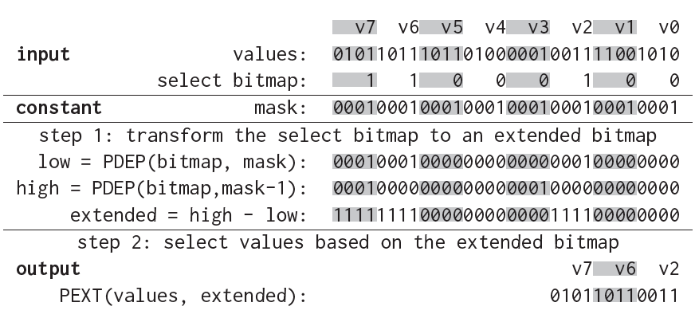Fig. 3. Bit-parallel selection on 8 4-bit values

With BMI, we design an elegant way to convert a select bitmap to the extended bitmap using only three instructions (two PDEP and one subtraction), regardless of the bit width of values. Figure [3](#_bookmark9) shows this computation on the example values in step 1. **The first PDEP instruction** moves each bit in the select bitmap to the rightmost position in the corresponding *𝑘*-bit field in the extended bitmap, according to the mask 0^𝑘−1^1...0^𝑘−1^1 (we use exponentiation to denote the bit repetition, e.g., 1^4^0^2^ = 111100). **The second PDEP instruction** uses a modified mask (*𝑚𝑎𝑠𝑘*  1), where the rightmost 1 is removed from *𝑚𝑎𝑠𝑘*. As a result, each bit in the select bitmap is now moved to the rightmost position in the *next 𝑘*-bit field in the extended bitmap. Thus, in the result mask *ℎ𝑖𝑔ℎ*, each moved bit is actually outside its corresponding *𝑘*-bit field, and can be thought of as a “borrowed” bit from the next field. With the two result masks *𝑙𝑜𝑤* and *ℎ𝑖𝑔ℎ*, we now perform a subtraction between the two masks (*ℎ𝑖𝑔ℎ 𝑙𝑜𝑤* ) to produce an extended bitmap. This last step relies on the propagating of the carries to set all bits between a pair of 1s to 1s, as illustrated below:

> 利用 BMI，我们设计了一种优雅的方法，只需三条指令（两条 PDEP 指令和一条减法指令）即可将选择位图转换为扩展位图，而无需考虑值的位宽。图 3 展示了步骤 1 中示例值的计算过程。第一条 PDEP 指令根据掩码 0^k−1^1...0^k−1^1（我们使用幂来表示位重复，例如 1^4^0^2^= 111100），将选择位图中的每个位移动到扩展位图中相应 k 位字段的最右侧位置。第二条 PDEP 指令使用修改后的掩码（掩码 − 1），其中最右侧的 1 被从掩码中移除。<u>因此，选择位图中的每个位现在都移动到扩展位图中下一个 k 位字段的最右侧位置</u>。因此，在结果掩码高位中，每个移动的位实际上都位于其对应的 k 位字段之外，可以将其视为从下一个字段“借用”的位。有了两个结果掩码的低位和高位，我们现在对这两个掩码（高位 - 低位）进行减法运算，以生成一个扩展位图。最后一步依赖于进位的传播，将一对 1 之间的所有位设置为 1，如下所示：

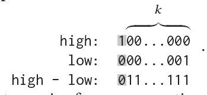

Notice that the 1-bit in high prevents carries from propagating to the next 𝑘-bit field. As a result, the calculations are safely performed inside each *𝑘*-bit field and never interfere with each other. Thus, the subtraction acts as if it processes all *𝑘*-bit fields in parallel.

The abovementioned algorithm is summarized in Algorithm [1](#_bookmark10) and Algorithm [2](#_bookmark11) (we show the extend operator as a separate operator, as it will be reused in Section [5.4.1](#_bookmark31)). In addition to the input values and bitmap, it takes a mask as input. For *𝑘*-bit values where 𝑘 is a power of 2, we set *𝑚𝑎𝑠𝑘*  = 0^𝑘−1^1 0^𝑘−1^1. If the input contains a large number of values packed into multiple processor words, we run Algorithm [1](#_bookmark10) on each word and concatenate the output through bit shifting.

> - [ ] **Algorithm 1** select (*𝑣𝑎𝑙𝑢𝑒𝑠*, *𝑏𝑖𝑡𝑚𝑎𝑝*, *𝑚𝑎𝑠𝑘*)
> - [ ] **Algorithm 2** extend (*𝑏𝑖𝑡𝑚𝑎𝑝*, *𝑚𝑎𝑠𝑘*)

The length of the output for each word can be calculated by performing the `POPCNT` instruction (counting 1s in a processor word) on the input select bitmap.

### 3.3 General Algorithm

We next extend the simplified algorithm to support an arbitrary bit width *𝑘*. Figure [4](#_bookmark12) shows an example of selecting 8 values from 32 3-bit values that are packed into 3 32-bit words. Since the bit width *𝑘* = 3 is not a power of 2, there are values (v10 and v21) placed across word boundaries. The key challenge of the general algorithm lies in dealing with these partial values with minimal overhead.

> 接下来，我们扩展简化算法以支持任意位宽 k。图 4 展示了一个示例，该示例从 32 个 3 位值中选择 8 个值，这些值被打包成 3 个 32 位字。由于位宽 k=3 不是 2 的幂，因此存在跨字边界的值（v10 和 v21）。通用算法的关键挑战在于以最小的开销处理这些部分值。

<a id="_bookmark12"></a>
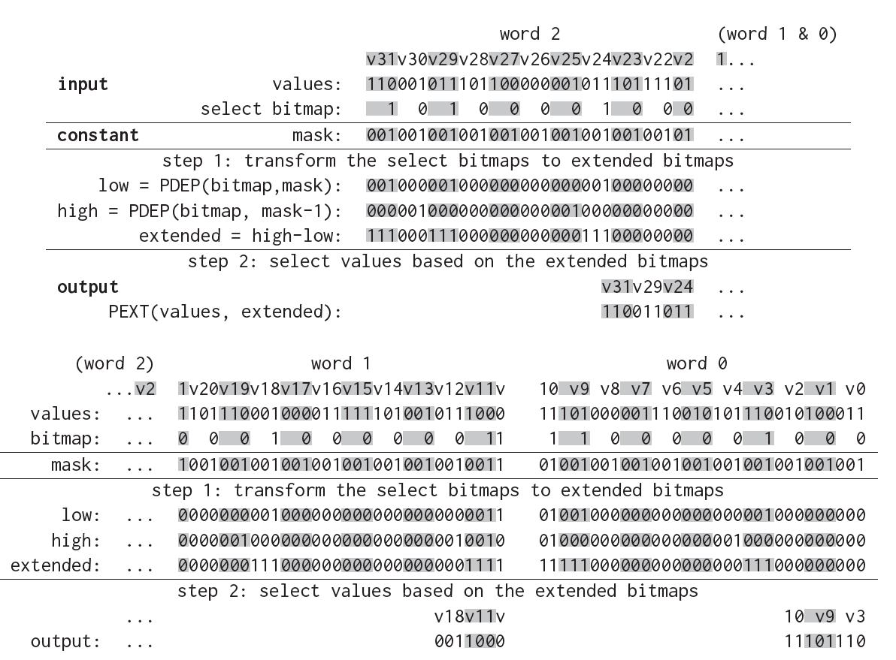

Fig. 4. Bit-parallel selection on 32 3-bit values (v10 and v21 span over multiple words)

> 有趣的是，我们发现即使处理器字中包含**部分值（partial values）**，只要掩码满足以下两个要求，算法 [1](#_bookmark10) 仍然有效。首先，掩码**需按字的布局进行移位对齐**。在图 [4](#_bookmark12) 中，字 2 中的掩码需**左移 2 位**，因为字 2 中的部分值 v21 占用了剩余的 2 位。类似地，字 1 中的掩码左移 1 位，以容纳字 1 中 v10 的剩余 1 位。其次，**mask** 中的最低有效位必须为 1，即使它对应于值中间的一位。对于最右端具有部分值的字，最右边位置的这个额外的 1 确保减法指令能够为扩展位图中的部分值生成一个 1 序列。例如，在图 [4,](#_bookmark12) 中，字 1 中 **mask** 的最右位被设置为 1，尽管它对应的是 v10 的第三位。这个额外的 1 位引导**第一条 PDEP 指令**：将选择位图的最右比特位移至 **low** 掩码的最末位，从而在扩展位图最右端生成所需的 1 。

Interestingly, we find that Algorithm [1](#_bookmark10) remains valid even for words containing partial values, as long as the masks meet the two requirements shown as follows. First, the mask needs to be shifted to be aligned with the layout of the word. In Figure [4,](#_bookmark12) the mask in word 2 is left shifted by 2 bits, as there are 2 remaining bits in the partial value v21 in word 2. Similarly, the mask in word 1 is left shifted by 1 bit to accommodate the 1 remaining bit of v10 in word 1. Second, the least significant bit in a *𝑚𝑎𝑠𝑘* must be 1, even though it corresponds to a bit in the middle of a value. For a word with a partial value on the right end, this extra 1 at the rightmost position ensures that the subtraction instruction is able to generate a sequence of 1s for the partial value in the extended bitmap. For example, in Figure [4,](#_bookmark12) the rightmost bit of *𝑚𝑎𝑠𝑘* in word 1 is set to 1 though it corresponds to the third bit of v10. This extra 1-bit guides the first PDEP instruction to move the rightmost bit from the select bitmap to the rightmost position in **low** , which then results in the expected 1-bit on the right end of the extended bitmap.

In general, Algorithm [3](#_bookmark14) shows the steps to generate masks for an arbitrary word size 𝑤 and bit width 𝑘. For a given 𝑤 and 𝑘, we put 𝑤 values in one group that span over 𝑘 processor words. It is clear that the words at the same position in these groups can use the same mask as they share the same layout of values. As a result, we only need to generate 𝑘 masks, one for each word in a group. These masks are always pre-created and reused repeatedly.

> 总体而言，算法 [3](#_bookmark14) 展示了为任意字长 𝑤 和位宽 𝑘 生成掩码的步骤。对于给定的 𝑤 和 𝑘，我们将  k 个 𝑤 字长的值分为一组，它们跨越 k 个处理器字。显然，**同组内相同位置的处理器字可使用相同掩码**，因为它们值的布局一致。所以我们只需生成  k 个掩码（每组内每个字对应一个）。这些掩码是预先创建，并可重复使用。

**算法3 generate_masks(w, k)** <a id="_bookmark14"></a> 
1: $masks \leftarrow \emptyset $  
2: **for** \( i := 0 \) **to** \( k \) **do**  
3:   $offset \leftarrow k - (i \times w) \% k$  
4:    $masks.\text{add}\left( (0^{k-1}1 \ldots 0^{k-1}1 \ll offset) \lor 1 \right)$  
5: **return** masks 

With this approach, the general algorithm needs to run the same four instructions described in Algorithm [1](#_bookmark10) and [2](#_bookmark11) on each word, and surprisingly, it does not introduce any additional overhead compared to the simplified algorithm. It is also worth noting that the simplified algorithm is a specialization of the general algorithm. When the bit width *𝑘* is a power of 2, the general algorithm will generate the same *𝑚𝑎𝑠𝑘* for all words in a group and the mask generated by Algorithm [3](#_bookmark14) is identical to the one described in Section [3.2](#_bookmark8).

According to Definition [1,](#_bookmark7) the proposed algorithm is clearly a bit-parallel algorithm since it runs a constant number of instructions on each processor word, regardless of the bit width of values or the selectivity of the select bitmap.

> 采用这种方法，通用算法需要在每个字上运行算法 [1](#_bookmark10) 和 [2](#_bookmark11) 中描述的四条指令，令人惊讶的是，与简化算法相比，它并没有引入任何额外的开销。另外值得注意的是，简化算法是通用算法的特例。当位宽 $𝑘$ 是 2 的幂时，通用算法将为同一组中的所有字生成相同的 **𝑚𝑎𝑠𝑘**，并且算法 [3](#_bookmark14) 生成的掩码与 [3.2](#_bookmark8) 节中描述的掩码相同。
>
> 根据定义 [1](#_bookmark7)，所提出的算法显然是一种位并行算法，因为它在每个处理器字上运行恒定数量的指令，而与值的位宽或所选位图的选择性无关。

## 4 SELECTION PUSHDOWN

Given the fast select operator described in Section [3,](#_bookmark6) we next present how to take *full* advantage of it in evaluating an arbitrary scan query. In this section, we will also introduce the second use case of BMI, which is critical in enabling selection pushdown in the framework.

> 基于第 [3](#_bookmark6) 节中描述的快速选择运算符，我们接下来将介绍如何在执行任意扫描查询时**充分**利用它。在本节中，我们还将介绍 BMI 的第二个用例，它对于在框架中实现选择下推至关重要。

### 4.1 Framework

Our framework aims to accelerate arbitrary scan queries by making the best use of the select operator. A scan query returns the values of the projection columns (i.e., in the SELECT clause) from the records that match the filters on a list of filter columns (i.e., in the WHERE clause). For the sake of simplicity, we first assume that the WHERE clause is a conjunction of filters, which is the most common case. We will relax this assumption in Section [4.5](#_bookmark22), extending the framework to allow conjunctions, disjunctions, negations, or an arbitrary boolean combination of them.

The framework is built upon a simple yet crucial observation: when performing a `filter` or `project` operation, records failing to meet prior predicates can be bypassed directly. While this observation is undeniably obvious, previous approaches have not leveraged it effectively. Indeed, in the case of filter operations, previous work tends to perform predicate evaluation on **all** values [[29](#_bookmark74), [34](#_bookmark80)], intentionally ignoring the fact that some values might have been filtered by prior filters. **This is primarily because the additional cost associated with the select operator often outweighs the potential savings in predicate evaluation**. However, given the fast select operator that operates on encoded values (Section [3](#_bookmark6)), it has become more favorable to select values upfront, even for filter operations. Consequently, our framework is designed to take full advantage of the BMI-based select operator in both project and filter operations. Interestingly, this design also introduces new technical challenges that can be addressed by using BMI (Section [4.3](#_bookmark18)).

In this framework, each filter operation produces a select bitmap as the output, which uses one bit per record to indicate if the corresponding record matches all filters that have been evaluated so far. The select bitmap can be fed into the next filter operation or the remaining project operations to accelerate the subsequent operations.

> 我们的框架旨在通过充分利用 select 运算符来加速任意扫描查询。扫描查询会从与一系列过滤列（即 WHERE 子句中的 filter）匹配的记录中返回投影列（即 SELECT 子句中的列）的值。为简单起见，我们首先假设 WHERE 子句是筛选器的**合取**（即通过 AND 连接），这是最常见的情况。我们将在 [4.5](#_bookmark22) 节中放宽此假设，将框架扩展到支持合取、析取、否定或其任意布尔组合的过滤条件。
>
> 该框架基于一个简单但关键的观察：在执行 `filter`（过滤）或 `project`（投影）操作时，**不满足先前谓词**的记录可以直接跳过。虽然这一观察显而易见，但之前的方法并未有效地利用它。事实上，在过滤操作中，先前的研究倾向于对所有值执行谓词求值 [[29](#_bookmark74), [34](#_bookmark80)]，而有意忽略了某些值可能已被先前的过滤器过滤掉的事实。这主要是因为**选择运算符的额外开销**通常超过了谓词计算可能节省的成本。然而，借助基于编码值的高效选择运算符（第 [3](#_bookmark6) 节），**提前过滤值**变得更具优势，即使对于过滤操作也是如此。因此，我们的框架旨在**充分利用基于 BMI（位图索引）的选择运算符**，同时支持投影和过滤操作。有趣的是，这种设计也带来了新的技术挑战，但可通过 BMI 来解决（第 [4.3](#_bookmark18) 节）。
>
> 在该框架中，每个过滤操作会生成一个**选择位图**作为输出，其中每条记录用 **1 比特位**表示其是否满足当前所有已评估的过滤条件。该选择位图可传递至下一个过滤操作或剩余的投影操作，从而加速后续流程。

**Running example.** To illustrate our methods, we use a running example throughout this section. The query is shown below:

> **贯穿本节的示例**。为了说明我们的方法，我们在本节中**使用如下示例**。查询如下：

```sql
SELECT c FROM R WHERE a < 10 AND b < 4
```

Figure [5](#_bookmark16) shows the input and output of each operation to evaluate the example query. The query is converted as a filter operation on column *𝑎*, followed by another filter operation on column *𝑏*, and ended with a project operation on column *𝑐*. The first filter must read all column values and, thus, has no input select bitmap. The produced bitmap, bitmap~𝑎~, is then passed to the second filter operation that now can skip the values in records that fail to satisfy the first predicate. The second filter operation refines the select bitmap according to the predicate on column *𝑏*, resulting in an updated bitmap, bitmap~𝑏~ , with 4 bits set to 1. Finally, we pass bitmap~𝑏~ to the project operation as an input to select values in column *𝑐* from matching records.

> 图 [5](#_bookmark16) 展示了用于评估示例查询时每个操作的输入和输出。该查询被转换为：首先对列 **𝑎** 执行过滤操作，接着对列 **𝑏** 执行第二个过滤操作，最后对列 **𝑐** 执行投影操作。第一个过滤操作**没有输入选择位图**，因此必须读取所有列值。生成位图 bitmap~𝑎~ 传递给第二个过滤器，此时该操作可跳过**不满足第一个谓词**的记录中的值。第二个过滤操作根据列 **𝑏** 上的谓词更新选择位图，生成更新后的位图 bitmap~𝑏~ ，其中 4 位设置为 1。最后，我们将 bitmap~𝑏~ 作为输入传递给投影操作，以从匹配的记录中选择列 **𝑐** 中的值。

<a id="_bookmark16"></a>
|     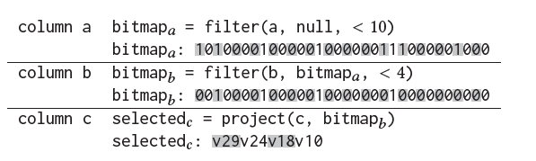     |
| :------------------------------------: |
| Fig. 5. Operations in evaluating the example query |

### 4.2 Operation Implementation

In our framework, filter and project operations can be implemented by composing four basic operators, as shown below:

- **Select**. As the first step, we use the select operator described in Section [3](#_bookmark6) to remove irrelevant values from the target column. Pushing down the select operator results in a reduced number of values that need to be passed to the subsequent operators. This step can be skipped if the filter or project operation has no input select bitmap (e.g., the first filter in a query).

- **Unpack**. Next, we use the unpack operator to convert the encoded values to their native representation in primitive data types. We adopt the state-of-the-art SIMD-based implementation [[41](#_bookmark86)] for this operator. For project operations, we can now return the unpacked results and skip the remaining two operators/steps.

- **Evaluate**. For filter operations, we next evaluate all decoded values with the filter predicate and generate a bitmap to indicate whether each (selected) value satisfies the predicate. Since all column values have been unpacked and decoded, this operator allows arbitrary predicates. Furthermore, since all (selected) column values are now stored in primitive data types, this enables a more straightforward implementation of predicate evaluation using SIMD vectorization [[34–36]](#_bookmark81).

- **Transform.** The bitmap produced by an evaluate operator may not be directly used as a select bitmap for the next operation. This is because the bitmap has as many bits as the selected records, rather than all records. The transform operator is designed to convert such a bitmap into an appropriate select bitmap that can be used for the subsequent operation(s). In Section [4.3](#_bookmark18), we will describe an efficient way to implement this operator using BMI.

As an example, Table [2](#_bookmark17) shows the steps of the example filter and project operations. The first filter operation is implemented as an unpack operator followed by an evaluate operator. The select and transform operators are avoided because this is the first filter and has to read all values. In contrast, the second filter operation performs all four operators: it pre-selects the values based on bitmap*𝑎*, which, however, requires an additional bitmap transformation at the end of this operation. The refined bitmap, bitmap*𝑏* , is then used to accelerate the project operation on column c, which is implemented as a select operator followed by an unpack operator.

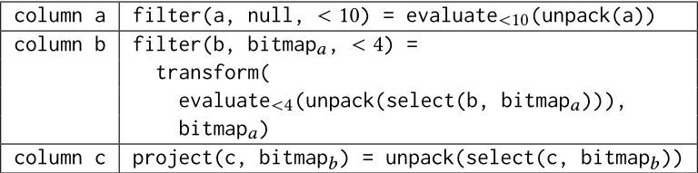
Table 2. Implementation of example filter and project operations

> 在我们的框架中，过滤和投影操作可以通过组合四个基本运算符来实现，如下所示：
>
> - **选择（Select）**：第一步，我们使用 [3](#_bookmark6) 节中描述的选择运算符，从目标列中删除不相关的值。**下推选择运算符可减少需传递到后续操作符的数据量**。如果过滤或投影操作没有输入选择位图（例如，查询中的第一个过滤器），则可以跳过此步骤。
>
> - **解包（Unpack）**：接下来，我们使用解包运算符将编码值转换为原始数据类型的原生表示形式。对此运算符，我们采用最先进的基于 SIMD 的实现 [[41](#_bookmark86)]。对于投影操作，我们现在可以返回解包结果并跳过剩下的两个运算符/步骤。
>
> - **求值（Evaluate）**：对于过滤操作，我们接下来使用过滤谓词评估所有解码值，并生成一个位图来指示每个（选择的）值是否满足谓词。由于所有列值都已解包和解码，因此该运算符允许任意谓词。此外，由于所有（选择的）列值现在存储为原始数据类型，可通过 SIMD 向量化 [[34–36]](#_bookmark81) 更简单地实现谓词评估。
>
> - **转换（Transform）**：评估运算符生成的位图不能直接用作下一个操作的选择位图。<u>这是因为位图的位数与选定的记录数相同，而不是所有记录的位数</u>。转换运算符旨在将此类位图转换为适用于后续操作的选择位图。第 [4.3](#_bookmark18) 节将描述如何通过 BMI 高效实现此运算符。
>
> 例如，表 [2](#_bookmark17) 展示了示例过滤和投影操作的步骤。第一个过滤操作实现为一个解包运算符，后跟一个求值运算符。由于这是第一个过滤器，需要读取所有值，因此避免使用选择运算符和转换运算符。相比之下，第二个过滤操作执行所有四个运算符：它根据位图 **𝑎** 预先选择值，但这需要在此操作结束时进行额外的位图转换。然后，使用改进的位图 bitmap~𝑏~ 来加速对 **c** 列的投影操作，该操作实现为一个选择运算符，后跟一个解包运算符。

#### Unpack 和 Decode

Unpack 的本质是数据从**存储优化形态**到**计算优化形态**的转换，它平衡了存储效率与计算效率。通过 SIMD 加速和选择下推，该操作成为现代分析型数据库实现高性能查询的基石技术。

在数据库执行引擎的上下文中，**（解包）和 Decode（解码）本质相同**，但存在**细粒度技术差异**。以下是关键解析：

##### 一、**术语定义对比**

| **术语**   | **技术本质**                                            | **操作目标**                | **输入/输出**       |
| :--------- | :------------------------------------------------------ | :-------------------------- | :------------------ |
| **Unpack** | 将**压缩存储的编码值**转换为**连续内存的原生数据**      | 优化内存访问模式 + 数据对齐 | 编码值 → 原始值数组 |
| **Decode** | 将**特定编码格式**（如字典/RLE/位压缩）**解释为语义值** | 还原数据语义                | 压缩数据块 →        |

##### 二、**在框架中的实际关系**

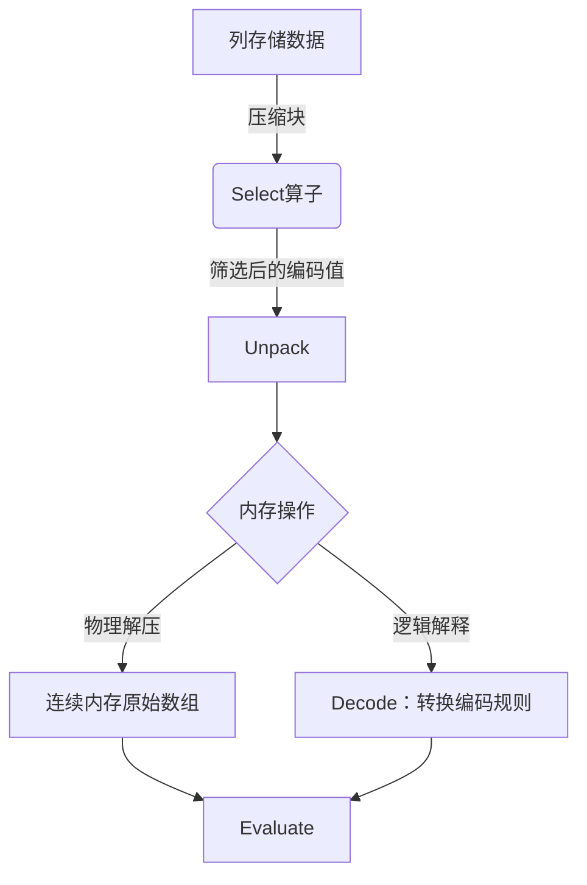

1. **耦合性**
   在实现中，Unpack **必然包含 Decode**
   - *例*：字典编码列需先查字典（Decode）再填充到连续内存（Unpack）
2. **差异焦点**
   - `Decode` 侧重 **数据语义还原**（编码值 → 逻辑值）
     *如：字典ID 42 → 字符串 "Beijing"*
   - `Unpack` 侧重 **内存布局转换**（分散存储 → 连续数组）
     *如：位压缩数据[0b1101] → 数组[1,0,1,1]*

### 4.3 Bitmap Transform Operator

To demonstrate the need for the transform operator, we first walk through the filter operation on column b in the running example. Figure [6](#_bookmark19) breaks down the key steps of this operation. **As the first step**, it applies bitmap~𝑎~, i.e., the bitmap generated by the filter on column a, and selects 8 values (v3, v9-11, v18, v24, v29, v31) that pass the first filter (see Figure [4](#_bookmark12) for detailed steps). **Next**, we unpack these 3-bit encoded values and evaluate all decoded values, producing a 8-bit bitmap called **filtered** (step 2). **However**, this bitmap indicates whether each **selected value**, rather than any value, in the column satisfies the predicate, and thus needs to be transformed in order to be used as a select bitmap for the next operation(s).

To transform the filtered bitmap, we need to deposit the bits in “filtered” to the bit positions corresponding to the selected values in the select bitmap bitmap~𝑎~ (i.e., the 1s in bitmap~𝑎~). In other words, we need to replace the *𝑖*-th 1 in the select bitmap with the *𝑖*-th bit in “filtered”, while retaining all 0s in the select bitmap at their original bit positions. Interestingly, this is exactly what the PDEP instruction performs by using “filtered” as the source operand and the select bitmap as the mask operand (see Section [2.1](#_bookmark1) and Figure [2](#_bookmark3)). Continuing the example from Figure [6](#_bookmark19) (step 3), we replace the first (rightmost) 1 in bitmap~𝑎~ by the first (rightmost) bit 0 from “filtered”, indicating that the first selected value v3 does not pass the predicate on column b. The use of PDEP enables us to move all 8 bits from “filtered” to appropriate positions in the select bitmap in parallel. It is worth noting that without the hardware-implemented BMI instruction, this transformation (as well as the select operator) would be significantly more expensive as we showed in Table [1](#_bookmark4), which further highlights the crucial role of BMI in the design of the entire solution.

<a id="_bookmark19"></a>

|     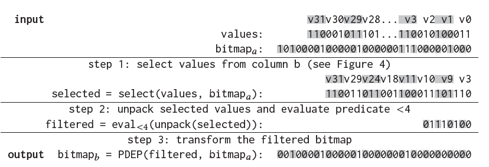     |
| :------------------------------------: |
| Fig. 6. Selection pushdown on example column b |

> 为了演示变换运算符的必要性，我们首先在运行示例中演示对 b 列的过滤操作。图 [6](#_bookmark19) 分解了此操作的关键步骤。**第一步**应用 bitmap~𝑎~（即由 a 列上的过滤器生成的位图），并选择通过第一个过滤器的 8 个值 (v3，v9-11，v18，v24，v29，v31)（详细步骤参见图 [4](#_bookmark12)）。**接下来**，我们解包这些 3 位编码值并评估所有解码值，生成一个名为 **filtered** 的 8 位位图（步骤 2）。**但是**，此位图指示的是列中每个**选定的值**（而不是任何值）是否满足谓词，因此需要经过转换才能用作后续操作的选择位图。
>
> 要转换这个 **filtered** 位图，我们需要将 **filtered** 中的位存入选择位图 bitmap~𝑎~ 中选定值对应的位位置（即 bitmap~𝑎~ 中的 1）。换句话说，我们需要将选择位图中的第 *𝑖* 个 1 替换为 **filtered** 中的第 *𝑖* 个位，同时将选择位图中的所有 0 保留在其原始位位置。有趣的是，这正是 PDEP 指令通过使用 **filtered** 作为源操作数，并使用选择位图作为掩码操作数所执行的操作（参见第 [2.1](#_bookmark1) 和图 [2](#_bookmark3)）。继续图 [6](#_bookmark19)（步骤 3）中的示例，我们用 **filtered** 中（最右侧）的第一个 0 替换 bitmap~𝑎~ 中（最右侧）的第一个 1，这表明第一个选定值 v3 未通过 b 列的谓词。使用 PDEP 使我们能够将 **filtered** 中的所有 8 位并行移动到选择位图中的适当位置。值得注意的是，如果没有硬件实现的 BMI 指令，此转换（以及选择运算符）的开销将显著增加，如表 [1](#_bookmark4) 所示，这进一步凸显了 BMI 在整个解决方案设计中的关键作用。

### 4.4 Filter Ordering <a id="_bookmark20"></a>

Thus far we have assumed that all filters are evaluated in the same order as specified in the query. We next address the query optimization problem of determining the order of filters. Unlike traditional filter ordering problems, this problem requires the consdieration of both filter selectivity and the bit width of columns, both of which affect scan performance (see Figure [12](#_bookmark39)). To solve this problem, we first develop a cost model and then propose a simple yet efficient greedy algorithm to determine the best order. For simplicity, we assume that filter predicates are independent of each other and the selectivity of each filter is pre-known, e.g., via selectivity estimation techniques such as [[37]](#_bookmark82).

4.4.1 **Cost Model**. Let **𝑘** denote the bit width, **𝑤** denote the processor word size, and **𝑠** denote the selectivity where $𝑠 \in [0, 1]$. We assume a sequence of **𝑛** filters, **𝑓~1~** ... **𝑓~𝑛~**. Our objective is to minimize the cost of running the filter sequence. The cost of any filter (except the first filter **𝑓~1~**) is the sum of the cost to run the select operator on all **𝑘**-bit values and the cost to unpack and evaluate selected values and the cost to transform the bitmap. According to Definition [1](#_bookmark7), its runtime is positively correlated with the bit width. <u>Thus</u>, the cost of select for a filter **𝑓~i~** is $\propto \frac{k_i}{w} $. The unpack and evaluate operators run on some subset of values that have been filtered by all p*𝑤*rior filters. The number of values that any filter will unpack and evaluate equals to the total number of values multiplied by the product of selectivity of all prior filters. <u>Thus</u>, the cost of unpack and evaluate for a filter **𝑓~i~** is $\propto  {\textstyle \prod_{j=1}^{i-1}}s_j$. The cost of transform can be ignored as it uses only one PDEP instruction. <u>Finally</u>, the cost of a filter **𝑓~i~** in a sequence (except the first filter **𝑓~1~**) is $\propto (\frac{k_i}{w} + {\textstyle \prod_{j=1}^{i-1}}s_j)$. The first filter **𝑓~1~** does not use select and transform operators, but it needs to unpack and evaluate all values. Putting all these pieces together, the cost of **𝑓~1~** ... **𝑓~n~** is:

<a id="_bookmark21"></a>
$$
\operatorname{cost}\left(f_{1}\right)+\sum_{i=2}^{n} \operatorname{cost}\left(f_{i}\right) \propto 1+\sum_{i=2}^{n}\left(\frac{k_{i}}{w}+\prod_{j=1}^{i-1} s_{j}\right) \propto \sum_{i=2}^{n} \frac{k_{i}}{w}+\sum_{i=2}^{n} \prod_{j=1}^{i-1} s_{j}\qquad\qquad (1)
$$

4.4.2 **Optimal Order**. For a set of *𝑛* filters, our goal is to find a sequence with the lowest cost as defined in Equation [1](#_bookmark21). We make two key observations from Equation [1](#_bookmark21) that can significantly prune the search space: 1) for sequences starting with the same filter, the term ${\textstyle \sum_{i=2}^{n}}\frac{k_i}{w}    $ in Equation [1](#_bookmark21) filters; 2) to minimize the second term ${\textstyle \sum_{i=2}^{n}}\frac{k_i}{w} {\textstyle \prod_{j=1}^{i-1}}s_j    $, we should sort all filters in ascending order of selectivity, assuming the first filter has been determined.

Based on these observations, it becomes evident that a simple greedy approach can find the *optimal* order: we begin by selecting an arbitrary filter as the first filter; the optimal order of the remaining filters can be found by sorting them in the ascending order of their selectivity, whose cost can be calculated by using Equation [1](#_bookmark21); we then compare all *𝑛* possible choices for the first filter and find the one with the lowest overall cost. This approach drastically reduces our search space from **𝑂(𝑛!)** to **𝑂(𝑛)** candidate sequences, and the obtained order is optimal under the aforementioned assumptions. Relaxing these assumptions is an interesting direction for future work.

### 4.5 Supporting Disjunctions and Negations

Finally, we extend our framework to allow conjunctions, disjunctions, negations, or an arbitrary boolean combination of them. For each disjunction in the WHERE clause, we always convert it to a combination of conjunctions and negations by applying De Morgan’s laws: $a \vee b = \neg (\neg a\wedge \neg b)$. To support negations, we add a boolean flag, namely **negate**, as an addition input parameter to the filter operation. If this flag is true, we need to flip the bitmap produced by the evaluate operator. All other operators within a filter operation remain unchanged. With this approach, our framework supports disjunctions and negations with negligible overhead.

> 最后，我们扩展了框架，使其支持合取（AND）、析取（OR）、否定（NOT）或其任意的布尔组合。对于 WHERE 子句中的每个析取（OR）条件，我们总是应用 De Morgan 定律：$a \vee b = \neg (\neg a\wedge \neg b)$，将其转换为合取（AND）和否定（NOT）的组合。为了支持否定（NOT），我们添加了一个布尔标志，名为 **negate**，作为过滤操作的附加输入参数。如果该标志为真，如果此标志为真，则需要翻转求值运算符生成的位图。过滤操作中的所有其他运算符保持不变。通过这种方法，我们的框架能够以可忽略的开销支持析取（OR）和否定（NOT）。

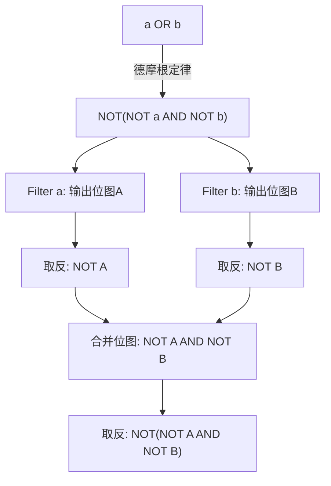

## 5 SELECTION PUSHDOWN IN PARQUET

The techniques described in the previous sections are general techniques that can be applied to most column stores. In this section, we adapt and extend these techniques to enable selection pushdown in one specific but widely adopted storage format, Apache Parquet.

> 前几节中描述的技术是通用技术，可以应用于大多数列存储。在本节中，我们将调整和扩展这些技术，以便在一种特定但广泛采用的存储格式 Apache Parquet 中实现选择下推。

### 5.1 Overview

As we described in Section [2.2](#_bookmark5), each column value in Parquet is a triple: **repetition level**, definition level, **field value**. Repetition and definition levels are metadata that is used to represent complex structure in a columnar manner. A select operation in Parquet takes as input a column that includes encoded repetition and definition levels as well as field values, and a bitmap indicating the records to be selected, and outputs the repetition/definition levels and the field values of all selected records, as if we use the standard reader to read a Parquet file that contains the matching records only.

The challenge arises from the way that Parquet encodes the structure information to represent optional, nested, or repeated fields (Section [2.2](#_bookmark5)). As Parquet never explicitly stores null values and all repeated values are stored contiguously in the same array, the number of levels or values in the column may not be the same as the number of records, meaning that the select operation we presented in Section [3](#_bookmark6) is not directly applicable to Parquet.

In this section, we present our techniques to efficiently transform the input select bitmap to the ones that can be applied to the field values and repetition/definition levels. This transformation requires the knowledge of the structure of data, which is represented by repetition and definition levels. In the interest of space, we omit the formal definitions of these concepts, but introduce two simple facts that we will use throughout this section: ① a column value is null if its definition level is not equal to the maximum definition level of the column; ② a column value belongs to the same record of the previous column value if its repetition level is not 0.

**Running example**. Figure [7](#_bookmark24) shows an example repeated column that contains 32 column values belonging to 24 records. Each column value has one definition level and one repetition level. So there are 32 definition/repetition levels. The mapping between levels and records can be built by looking at the repetition levels according to ② : the 1st and 2nd levels belong to the first record as the 2nd repetition level is non-0; the 2nd and 3rd records have only one value; the next three levels all belong to the 4th record, etc. Half of the 32 column values have a definition level that is not equal to 2 (the maximum definition level in this column), meaning that there are 16 null values (①). These null values are not explicitly stored in the field values. As a result, even though the column contains 32 column values, it has only 16 non-null field values stored in the value array. In Figure [7](#_bookmark24), we also include a 24-bit select bitmap. Each bit in the bitmap indicates whether each record, i.e., all column values belonging to the record, need to be selected. We connect each bit in the select bitmap to the corresponding repetition and definition levels, and the non-null field value in solid lines. Thus, a level or value needs to be included in the selected column if and only if it is connected to a 1 in the select bitmap.

<a id="_bookmark24"></a>

|     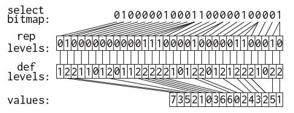     |
| :------------------------------------: |
| Fig. 7. Selecting an example repeated column in Parquet |

> 正如我们在 [2.2](#_bookmark5) 节中所述，Parquet 中的每个列值都是一个三元组：**重复级别**，**定义级别**，**字段值**。重复级别和定义级别是用于以列式方式表示复杂结构的元数据。Parquet 中的 select 操作以一个列作为输入，包含编码后的重复层级、定义层级以及字段值，同时还需要一个指示待选记录的位图；输出所有被选中记录的重复/定义层级和字段值，就像我们使用标准 reader 读取仅包含匹配记录的 Parquet 文件一样。
>
> 挑战源于 Parquet 对结构信息进行编码以表示可选、嵌套或重复字段的方式（[2.2](#_bookmark5) 节）。由于 Parquet 从不显式存储空值，并且所有重复值都连续存储在同一个数组中，因此列中的级别或值的数量可能与记录数不同，这意味着我们在 [3](#_bookmark6) 节中介绍的 select 操作不能直接应用于 Parquet。
>
> 在本节中，我们将介绍一些技术，用于高效地将输入的选择位图转换为可应用于字段值和重复/定义级别的位图。此转换需要了解数据的结构信息，该结构由重复和定义级别表示。限于篇幅，我们省略了这些概念的正式定义，但引入两个将在本节通篇使用的简单事实：① 如果列值的定义级别不等于该列的最大定义级别，则该列值为空；② 如果列值的重复级别不为 0，则该列值与其前一个列值属于同一条记录。
>
> **本节示例**。图 [7](#_bookmark24) 展示了一个重复列的示例，其中包含 24 条记录的 32 个列值。每个列值都有一个定义级别和一个重复级别。因此，共有 32 个定义/重复级别。可以通过根据 ② 查看重复级别来构建级别和记录之间的映射：第 1 和第 2 个级别属于第一条记录（因为第 2 个重复级别非 0 ）；第二和第三条记录只有一个值；接下来的三个级别均属于第四条记录，依此类推。32 个列值中有一半的定义级别不等于 2（此列中的最大定义级别），这意味着有 16 个空值 (①)。这些空值未显式存储在字段值中。因此，即使该列包含 32 个列值，其值数组中也只存储了 16 个非空字段值。在图 [7](#_bookmark24) 中，我们还包含一个 24 位的选择位图。位图中的每个位指示是否需要选择每条记录（即属于该记录的所有列值）。我们将选择位图中的每个位与相应的重复和定义级别以及非空字段值用实线连接起来。因此，当且仅当某个级别或值与选择位图中的 1 连接时，才需要将其包含在选定列中。

### 5.2 Workflow

Algorithm [4](#_bookmark25) shows the workflow to select repetition/definition levels and field values from a Parquet column based on a select bitmap. The basic idea of the algorithm is to transform the input select bitmap to two auxiliary select bitmaps, called **level bitmap** and **value bitmap**, that can be used to select the definition/repetition levels and values, respectively. The level bitmap is generated by copying each bit in the select bitmap as many times as the number of levels in the corresponding record. Then, the value bitmap can be created by removing the bits corresponding to null values from the level bitmap. Figure [8](#_bookmark26) illustrates the transformations from the select bitmap to the level and value bitmaps for the example column.

> 算法 [4](#_bookmark25) 展示了基于选择位图从 Parquet 列中选择重复/定义级别和字段值的工作流程。该算法的核心思想是将输入的选择位图转换为两个**辅助选择位图**——**层级位图**（level bitmap）和**值位图**（value bitmap），它们分别用于选择定义/重复级别和字段值。层级位图的生成方式是：将选择位图中的每一位复制若干次，**复制的次数等于对应记录中的层级数量**。随后，通过从层级位图中剔除与空值（null values）对应的位来创建值位图。图 [8](#_bookmark26) 展示了**示例列**从选择位图到层级和值位图的转换过程。

<a id="_bookmark25"></a>

| **Algorithm 4** select-parquet (*𝑟𝑒𝑝𝑠*, *𝑑𝑒𝑓𝑠*, *𝑣𝑎𝑙𝑢𝑒𝑠*, *𝑏𝑠𝑒𝑙𝑒𝑐𝑡* ) |
| :----------------------------------------------------------: |
|                    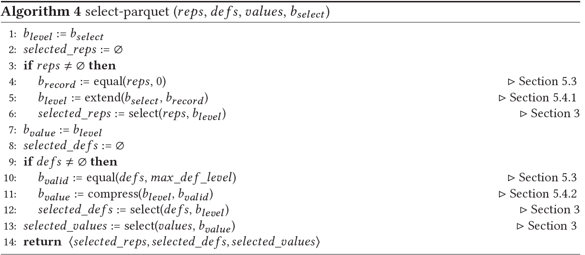                    |

<a id="_bookmark26"></a>

|     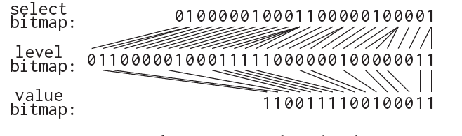     |
| :------------------------------------: |
| Fig. 8. Transformations on the select bitmap |

In the first part of the algorithm (Line 1-5), we produce the level bitmap for selecting the repetition and definition levels. This step can be skipped for the simple cases where the column has no repeated values: we can reuse the input select bitmap directly (Line 1) as the number of levels matches the number of records. To produce the level bitmap, we first produce a bitmap called **record bitmap** by finding the first levels of all records, i.e., all repetition levels that are 0s ( 2 ) (Line 4), and then extend the input select bitmap to the level bitmap using the produced record bitmap (Line 5). In Section [5.3](#_bookmark27), we will describe a bit-parallel operator for the former step, and present a way to reuse an existing operator (extend) for the latter step in Section [5.4.1](#_bookmark31). Now, with the produced level bitmap that has been aligned to the levels, we can reuse the select operator presented in Section [3](#_bookmark6) to select both repetition levels (Line 6) and definition levels (Line 12).

Similarly, to accommodate the fact that all null values are not physically stored in the field values, we also need to generate the value bitmap (Line 7-11). According to 1 , we can find all null values by comparing the definition levels to the maximum definition level of the column (Line 10). The result bitmap, called *valid bitmap*, is then used to compress the input select bitmap, by removing all bits that correspond to null values (Line 11). We describe this step in more details in Section [5.4.2](#_bookmark33).

Finally, we select the field values by using the value bitmap as the select bitmap (Line 13), and return all selected field values along with the repetition/definition levels. Note that for the arguably most common cases where the column is simply a required column, all bitmap transformations are not needed, and only the field values are selected. In this case, the Parquet select operator is reduced to the standard select operator that we presented in Section [3](#_bookmark6).

It is worth pointing out that, according to Definition [1](#_bookmark7), all operators used in Algorithm [4](#_bookmark25) are bit-parallel algorithms. Additionally, all operators rely on either the PDEP or PEXT instruction to achieve the full data parallelism available in processor words.

>  在算法的第一部分（第 1-5 行），我们生成用于选择重复和定义级别的层级位图。对于列中没有重复值的简单情况，这一步可以跳过：由于<u>**层级数**</u>与记录数匹配，我们可以直接重用输入的选择位图（第 1 行）。为了生成层级位图，我们首先通过查找所有记录的第一个层级（即所有为 0 的重复级别（2））来生成一个名为**<u>记录位图</u>**的位图（第 4 行），然后使用生成的记录位图将输入选择位图扩展为层级位图（第 5 行）。在 [5.3](#_bookmark27) 节中，我们将描述用于前一步的位并行运算符，并在 [5.4.1](#_bookmark31) 节中介绍一种在后一步中重用现有运算符（扩展）的方法。现在，通过生成的<u>已对齐到各级别的层级位图</u>，我们可以重用 [3](#_bookmark6) 节中介绍的选择运算符来选择重复级别（第 6 行）和定义级别（第 12 行）。
>
> 同样，为了适应所有空值在字段值中并不实际存储的事实，我们还需要生成值位图（第 7-11 行）。根据 1，我们可以通过将定义级别与列的最大定义级别进行比较来找到所有空值（第 10 行）。然后，使用结果位图（称为“有效位图”）来压缩输入选择位图，方法是删除所有与空值对应的位（第 11 行）。我们将在 [5.4.2](#_bookmark33) 节中更详细地描述此步骤。
>
> 最后，我们使用值位图作为选择位图来选择字段值（第 13 行），并返回所有选定的字段值以及重复/定义级别。请注意，在最常见的情况下，如果该列仅仅是必需列，则无需进行所有位图转换，只需选择字段值即可。在这种情况下，Parquet 选择运算符将简化为我们在 [3](#_bookmark6) 节中介绍的标准选择运算符。
>
> 值得指出的是，根据定义 [1](#_bookmark7)，算法 [4](#_bookmark25) 中使用的所有运算符都是**位并行算法**。此外，所有运算符都依赖于 PDEP 或 PEXT 指令来实现处理器字中的**完全数据并行性**。
>

### 5.3 Predicate Pushdown on Levels

We describe a bit-parallel equal operator to compare a sequence of bit-packed values to a constant value and output an equality bitmap. It operates on encoded values directly and thus evaluates all values packed in a processor word in parallel. We use this operator to find: 1) all definition levels that are equal to the maximum definition level ( 1 ); and 2) all repetition levels that are 0s ( 2 ). In Parquet, repetition and definition levels are small integer values that are typically encoded with no more than a few bits. Consequently, applying this operator on levels is remarkably efficient due to the higher degree of data parallelism.

Algorithm [5](#_bookmark28) shows the steps to perform bit-parallel comparisons. For 𝑘-bit levels, the first step is to duplicate the literal value to all *𝑘*-bit fields. In the next step, we use a formula adapted from [[27](#_bookmark72)] to compare all 𝑘-bit values simultaneously. The results are stored in the most significant bit of each 𝑘-bit field: 1 means that the two values are the same. These result bits are then extracted by using the PEXT instruction to generate a compact bitmap representation.

> 我们描述了一个**位并行相等运算符**，用于将一组位压缩值（bit-packed values）与一个常量值进行比较，并输出一个**相等位图**。它直接在编码值上操作，因此可以并行评估处理器字中打包的所有值。我们使用此运算符来查找：1) 所有等于最大定义级别的定义级别（事实①）；以及 2) 所有为 0 的重复级别（事实②）。在 Parquet 中，重复级别和定义级别是较小的整数值，通常仅使用几位进行编码。因此，由于数据并行度较高，将此运算符应用于级别非常高效。
>
> 算法 [5](#_bookmark28) 展示了执行位并行比较的步骤。对于 **𝑘** 位级别，第一步是将字面值复制到所有 **𝑘** 位字段。下一步，我们使用改编自 [[27](#_bookmark72)] 的公式同时比较所有 **𝑘** 位值。结果存储在每个 **𝑘** 位字段的最高有效位中：1 表示两个值相同。然后使用 PEXT 指令提取这些结果位，以生成紧凑的位图表示。

<a id="_bookmark28"></a>
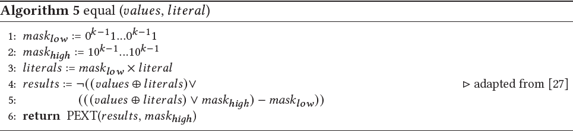

Figure [9](#_bookmark29) shows an example of comparing the first 16 2-bit definition levels in the running example to the maximum definition level (2). The results are the first 16 bits of the valid bitmap `𝑏𝑣𝑎𝑙𝑖𝑑` , which indicates non-null values in the column.

> 图 [9](#_bookmark29) 展示了将本节示例中的前 16 个 2 位定义级别与最大定义级别 (2) 进行比较的示例。结果是有效位图 `𝑏𝑣𝑎𝑙𝑖𝑑` 的前 16 位，表示该列中的值不为空。

<a id="_bookmark29"></a>
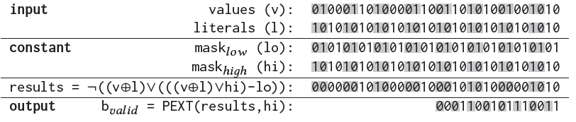
Fig. 9. Equality comparisons on 16 2-bit definition levels

### 5.4 Transforming the Select Bitmap

1.  *Select Bitmap to Level Bitmap.* The upper part of Figure [8](#_bookmark26) illustrates the transformation from the select bitmap to the level bitmap. For each bit in the select bitmap, we need to duplicate it as many times as the number of values in the corresponding record. Interestingly, this transformation

can be implemented by using the extend operator (Algorithm [2)](#_bookmark11) we introduced in Section [3.2.](#_bookmark8) In the select operator, for *𝑘*-bit values, we use the extend operator to copy each bit in the bitmap to *𝑘* bits by using a specific predefined bitmap 0*𝑘* −11*...*0*𝑘* −11 as the mask. In general, the extend operator duplicates the *𝑖*-th bit in the input *𝑘* times, where *𝑘* denotes the distance between the *𝑖*-th 1 and

*𝑖* 1 -th 1 in the mask bitmap. By performing the equality comparisons between the repetition levels and 0s (Section [5.3),](#_bookmark27) we have generated the record bitmap where each 1-bit represents the first value in each record (according to 2 ). Thus, the distance between each pair of adjacent 1s represents the number of values in the corresponding record. Based on this finding, we now can extend the select bitmap by using the record bitmap as the mask of the extend operator, duplicating each bit *𝑘* times where *𝑘* is the number of values in the corresponding record. The result bitmap is the level bitmap. Figure [10](#_bookmark32) demonstrates the steps of this transformation for the running example. In this figure, we alternate background color to distinguish values or bits in different records.

**input** b*𝑠𝑒𝑙𝑒𝑐𝑡* : 010000010001100000100001

b*𝑟𝑒𝑐𝑜𝑟𝑑* : 10111111111100011110111110011101

low = PDEP(b*𝑠𝑒𝑙𝑒𝑐𝑡* , b*𝑟𝑒𝑐𝑜𝑟𝑑* ): 00100000100000011000000100000001

high = PDEP(b*𝑠𝑒𝑙𝑒𝑐𝑡* , b*𝑟𝑒𝑐𝑜𝑟𝑑* -1): 10000001000100010000001000000100

**output** b*𝑙𝑒𝑣𝑒𝑙*  = high low: 01100000100011111000000100000011

Fig. 10. Transforming a select bitmap to a level bitmap

1.  *Level Bitmap to Value Bitmap.* As described earlier, Parquet does not explicitly store null values in the field values. Consequently, to produce a bitmap that can be used to select field values, we need to extract all bits from the level bitmap that corresponds to non-null values. This transformation is illustrated in the lower part of Figure [8.](#_bookmark26) As we have generated the valid bitmap by comparing the definition levels (Section [5.3),](#_bookmark27) this transformation can be simply implemented by applying PEXT on the level bitmap with the use of the valid bitmap as the mask (similar to Section [4.3).](#_bookmark18)

    Figure [11](#_bookmark34) demonstrates that a single PEXT instruction transforms the level bitmap *𝑏𝑙𝑒𝑣𝑒𝑙* to the value bitmap *𝑏𝑣𝑎𝑙𝑢𝑒* , removing all bits in *𝑏𝑙𝑒𝑣𝑒𝑙* that correspond to 0s in *𝑏𝑣𝑎𝑙𝑖𝑑* . The produced *𝑏𝑣𝑎𝑙𝑢𝑒* is then be used to select the non-null values from the example column.

**input** b*𝑙𝑒𝑣𝑒𝑙* : 01100000100011111000000100000011

b*𝑣𝑎𝑙𝑖𝑑* : 01100001000111110001100101110011

**output**  b*𝑣𝑎𝑙𝑢𝑒*  = PEXT(b*𝑙𝑒𝑣𝑒𝑙* , b*𝑣𝑎𝑙𝑖𝑑* ): 1100111100100011

Fig. 11. Transforming a level bitmap to a value bitmap

## 6 PARQUET-SELECT

We built a library, called Parquet-Select, that enables predicate pushdown in Apache Parquet and is the full implementation of the techniques presented in this paper. Parquet-Select makes no changes to the Parquet format and can, therefore, read any file conforming to the format specification. It is designed to support *arbitrary* filters: each filter is a user-defined lambda function and can be used to implement even the most complex predicates such as complex string matching, UDFs, or cross-table predicates (e.g., [[32](#_bookmark78)]). For a given set of filters, Parquet-Select returns only the values in the matching records, as if we use the standard Parquet library to read a Parquet file that contains the matching records only.

Parquet-Select supports all data types available in Parquet, i.e., boolean, int32, int64, int96, float, double, byte array, and fixed-length byte array. It also inherits the data model from Parquet, supporting arbitrary nesting of required, optional, and repeated fields. However, in our current implementation, the fields referenced in filters must be required or optional fields. Supporting filters on repeated fields is part of our plan for future work.

The techniques we presented in previous sections focus on the dictionary/bit-packing encoding. RLE is another common encoding that is particularly favorable for encoding levels, which likely have long runs of identical values (e.g., 0s). Additionally, plain encoding is often used as the fallback option for the dictionary encoding. In Parquet-Select, we also implemented selection pushdown for RLE and plain encodings by leveraging bitwise operators. **These bitwise operators do not require the use of BMI and are consequently beyond the scope of this paper**. Therefore, we briefly outline the approach: for an RLE run(𝑣, 𝑘 ) where *𝑣* denotes the value and *𝑘* denotes how many times the value appears, to select values from it based on a select bitmap, we need to populate the value *𝑣* as many times as the number of selected values in the run; this number can be calculated by using the POPCNT instruction to count the number of 1s in the *𝑘* corresponding bits in the select bitmap. POPCNT is not part of BMI and is available on most CPU architectures including X86 and ARM.

We implemented Parquet-Select in C++, based on the open-source C++ version of the Arrow/Parquet library^1^ (version 8.0.0). For all operators that use BMI instructions, we implemented a dynamic dispatching mechanism to detect whether BMI support is available on the host processors at run time and fall back to an alternative implementation if BMI support is missing.

## 7 EVALUATION

We ran our experiments on a server with a 2.6GHz AMD EPYC 7413 processor, and 256GB of DDR4 memory. We used an NVMe SSD as the storage device, with a maximum I/O throughput of 3.5GB/s. The machine runs 64-bit Windows Server 2022 Datacenter operating system. We also ran our experiments on another server with Intel Xeon Gold 6140 CPUs. The results are similar to that with the AMD processor and are therefore omitted in this paper.

The configuration of the server is similar to a compute node running analytical data systems for data warehouse or data lake applications [[45](#_bookmark90)]. These systems typically cache data read from cloud object stores (e.g., Azure Storage and AWS S3) in local SSDs using techniques such as Databricks Cache [[30](#_bookmark76)], Snowflake Cache Layer [[21](#_bookmark66)], or Crystal cache [[22](#_bookmark67)]. Below, we assume that all data files are stored in local SSDs.

In the evaluation below, we compare Parquet-Select to the open-source C++ version of Arrow/Parquet^2^ (version 8.0.0). Parquet implements the SIMD-based unpack algorithm [[41](#_bookmark86)] for decoding. To compare with Parquet-Select, we also implemented the filter and selection operations on decoded column values using SIMD instructions and optimized these operations with our best efforts. Unless explicitly stated otherwise, all Parquet files used in our evaluation are generated with default values from Parquet for all configuration parameters, e.g., row group size = 64MB, data page size = 1MB, maximum dictionary size = 1MB, no page-level compression. We ran all experiments using a single thread.

> 1. The Parquet C++ library has been integrated into the Apache Arrow library.
> 2. <https://github.com/apache/arrow>

### 7.1 Evaluating Selection Performance

In the first experiment, we compare the performance of Parquet-Select and Parquet on a project operation with a given select bitmap, and evaluate how this comparison is affected by the characteristics of the operation, including the bit width of the column values and the selectivity of the select bitmap. To this end, we created a Parquet file with a single column containing 128 million 64-bit integer values. We ensure that there are only 2*𝑘* distinct values in the column, where *𝑘* is the bit width of the values encoded with dictionary encoding and is varying in this experiment. For Parquet, all encoded values are first unpacked to 64-bit integers and then selected into an output buffer based on the select bitmap, while Parquet-Select selects encoded values directly followed by unpacking the selected values. No evaluate or transform operators are involved in this experiment.

> - [ ]  Fig. 12. Parquet vs. Parquet-Select: selection operation

Figure [12](#_bookmark39) plots the speedup of Parquet-Select over Parquet by varying the selectivity and the bit width of column values. Parquet-Select outperforms Parquet under all circumstances, with up to 10X performance gains. As expected, Parquet-Select performs better as the selectivity increases. In the extreme case where we select all values (selectivity = 1/1), both methods have similar performance, as they have to unpack the same amount of values. The only difference is in the select operator: Parquet-Select is slightly faster than Parquet with smaller values because the selection on bit-packed values reads less amount of memory compared to the selection on decoded 64-bit values. As the selectivity increases, the speedup of Parquet-Select dramatically improves for the obvious reason that, in addition to the performance gain on the select operator, Parquet-Select also reduces the number of values that need to be unpacked. These results confirm that the unpack operator, though it has been highly optimized with SIMD vectorization [[41](#_bookmark86)], still acts as a performance bottleneck since it has a lower degree of data parallelism due to the size of decoded values (64 bits).

The figure also shows that Parquet-Select achieves higher performance gains as the bit width decreases. This is due to the fact that the select operator used in Parquet-Select can process all values packed in a processor word in parallel (see Section [3](#_bookmark6)) and thus achieves a higher degree of data parallelism with smaller values. It is therefore more efficient than either the unpack or select operators on 64-bit decoded values where the available data parallelism is limited by the size of decoded values (64 bits). This effect is more pronounced when the selectivity is relatively low and the unpack operator in Parquet-Select does not dominate the overall execution time.

### 7.2 Micro-Benchmark Evaluation

We next evaluate the two approaches with scan queries using a micro-benchmark. In this experiment, we generated a Parquet table R with 20 columns (a1 ∼ a20) and 128 million rows. A scan query, shown below, is used to evaluate how the performance comparison is affected by the characteristics of a scan query, including the number of filters, the number of projections, the bit width of column values, and the data types. The selectivity of each filter is fixed at 25%, but the overall selectivity of the query is varied as we vary the number of filters. By default, we use the settings shown as follows: \#filters = 2 (overall selectivity = 6.25%), \#projections = 3, bit width = 5, data type = int64.

```sql
SELECT MAX(a10), MAX(a11), ... FROM R WHERE a1 < C1 AND a2 < C2 AND ...
```
Figure [13a](#_bookmark40) compares the performance of Parquet-Select and Parquet by varying the bit width from 1 to 16. Similar to the results in the previous experiment, Parquet-Select achieves higher speedup with smaller column values. Interestingly, we observe that the execution time saved by Parquet-Select nearly remains the same regardless of the bit width. Since the gap between the two lines is mainly due to the additional unpacking cost on unselected values in Parquet, this further confirms that the unpacking cost is largely independent of the bit width of the input values due to the fixed size of decoded values (64 bits).

> - [ ] Fig. 13. Parquet vs. Parquet-Select: scan micro-benchmark

As shown in Figure [13b](#_bookmark40) and [13c,](#_bookmark40) Parquet-Select is more effective when the scan query has more projection or filter columns. This is because, as we evaluate the filters successively, the selectivity on each column continues to increase, resulting in higher performance gains of Parquet-Select on projection columns or filter columns evaluated later in the query. As a result, Parquet-Select performs better when the query contains a long list of projection or filter columns. In addition to this effect, adding more filters also further reduces the overall selectivity, which leads to even higher speedup compared to adding projections (6.0X vs. 4.7X).

Figure [13d](#_bookmark40) shows the query time of the two approaches with various data types including int32, int64, int96, float, double, and byte array. The performance improvement is similar (3.0-3.6X) with all data types except for byte array. The relatively lower speedup (2.5X) with byte array is mainly because the more expensive predicates on byte array values particularly slow down the first filter, where Parquet-Select has to select and evaluate all values, thereby hindering the overall performance gain over Parquet. The costly data types, however, may also result in higher improvement if there are more filter or projection columns. To show this effect, Figure [13e](#_bookmark40) plots the performance with byte array values by varying the number of filters. Compared to the results with int64 values (Figure [13b),](#_bookmark40) Parquet-Select achieves lower speedup when the query has only 1 filter, but becomes more effective as the number of filters increases.

### 7.3 Case Study: TPC-H Benchmark Q6

To understand the performance of Parquet-Select on a more realistic workload, in the following experiments, we use the TPC-H benchmark [[13](#_bookmark58)] at the scale factor of 10. The total size of the dataset is approximately 10GB. The largest table Lineitem contains 60 million rows. Before a more complete evaluation with join queries, we first conduct a case study using a representative scan query – Q6 in the TPC-H benchmark.

<a id="_bookmark41"></a>

|     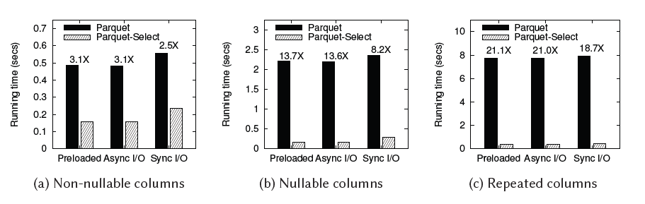     |
| :------------------------------------: |
| Fig. 14. Parquet vs. Parquet-Select: TPC-H benchmark Q6 |


Q6 is a scan query that contains three filters on three different columns l_shipdate, l_discount, and l_quantity, and two projections on columns l_extendedprice and l_discount. The three filter columns are encoded with 12 bits, 4 bits, and 6 bits in Parquet, respectively. The selectivity of the three filters is 15.2%, 27.3%, and 46.0%, respectively. The overall selectivity of the query is 1.9%.

7.3.1 **Non-nullable Columns**. As per the specification of the TPC-H benchmark, all column values are not nullable. We first ran an experiment with this setting. Figure [14a](#_bookmark41) shows the results of Q6 with three I/O settings: the Parquet file is either preloaded into main memory or loaded from disks using asynchronous or synchronous I/O. As can be seen from the figure, Parquet-Select outperforms Parquet by a factor of 3 when the file has been preloaded into memory. Interestingly, with the use of asynchronous I/O, both Parquet-Select and Parquet maintain nearly the same query time even though data is now loaded from disks. **This is due to the fact that reading Parquet columns is CPU bound, making the asynchronous I/O operations fully overlap with the CPU-intensive operations such as select and unpack operators**. This can be further confirmed by the results with synchronous I/O: the time difference between Preloaded and Sync I/O indicates the I/O time, which is clearly less than the computation time for both approaches. For storage devices with limited I/O speed (e.g., magnetic disks or remote storage), the time difference between Parquet and Parquet-Select should remain unchanged, while the speedup may be reduced accordingly.

7.3.2 **Nullable Columns**. To evaluate the performance with nullable column values, we modified the Lineitem table by altering 12.5% of values in each column to nulls. Figure [14b](#_bookmark41) shows the query time of Q6 on this modified dataset. For Parquet, we observe a significant performance degradation due to the added null values, with the query time up from 0.5s to 2.2s. The reasons for this dramatic difference are twofold. First, in addition to column values, Parquet has to decode the definition levels and evaluate a predicate on these decoded levels to find all null values. Second, the select bitmap needs to be transformed in order to be used for selecting non-null values. In contrast, Parquet-Select performs the predicate evaluation on encoded levels directly (Section [5.3](#_bookmark27)) and leverages BMI instructions to transform the select bitmap in a bit-parallel manner (Section [5.4](#_bookmark30)). With these techniques, it adds only marginal cost in Parquet-Select to handle nullable columns, as shown by comparing the query time in Figure [14a](#_bookmark41) and [14b.](#_bookmark41) For the above reasons, Parquet-Select is 13.7X faster than Parquet with nullable values.

7.3.3 **Repeated Columns**. Next, we added two extra columns with repeated values to the Lineitem table. In these two repeated columns, each record contains a variable number of values, following a uniform distribution between 0 and 8 with an average of 4 values per record. We further modified Q6 to replace the two projected columns (l_discount and l_extendedprice) accessed in the aggregation with the two repeated columns. All filters and their selectivity in this modified query remain unchanged. Figure [14c](#_bookmark41) shows the query time of this modified Q6 with repeated columns. Unsurprisingly, Parquet-Select achieves even higher speedup (around 20X) over Parquet. Selecting a repeated column requires two additional steps: 1) reading and selecting repetition levels, which are encoded and stored in the same way as the column values; and 2) transforming the select bitmap according to the repetition levels. With the use of BMI, the techniques proposed in this work substantially improve both the read/select step (Section [3](#_bookmark6)) and the bitmap transformation step (Section [5.4.1](#_bookmark31)), resulting in over 20X reduction in the cost of processing repeated columns. In light of these results, we envision that Parquet-Select could potentially encourage the broader use of complex structured data in analytical data systems.

<a id="_bookmark42"></a>

|     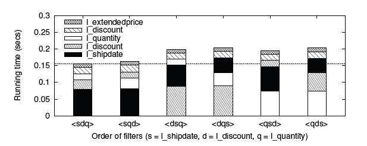     |
| :------------------------------------: |
| Fig. 15. Impact of filter ordering on TPC-H Q6 |

7.3.4 **Filter Ordering**. In the next experiment, we study the impact of filter ordering on the performance of Parquet-Select. For this purpose, we manually changed the order of filter evaluation and tested all six different orders of the three filters in Q6. The results are shown in Figure [15](#_bookmark42). For this query, the best order \<l_shipdate, l_discount, l_quantity\> is up to 30% faster than other orders. As can be seen from the figure, the most critical choice is to evaluate the filter on l_shipdate first. One reason is that this filter is more selective (15.2%) than other filters and thus evaluating this filter earlier is beneficial for subsequent filters. Second, the column l_shipdate has the largest values (12 bits), making it less beneficial to evaluate it later in the plan even with a more selective bitmap. Our order selection algorithm precisely captures these effects (see Section [4.4](#_bookmark20)) and successively picks the best order for this query.

### 7.4 TPC-H Benchmark Evaluation

We next extend our evaluation with the TPC-H benchmark by using Apache Spark [[17](#_bookmark62), [44](#_bookmark89)] (version 3.3.0). We study two approaches: 1) Spark + Parquet, which is the standard and deeply integrated way to query Parquet files using Spark; and 2) Spark + Parquet-Select, which is a way to enable predicate pushdown in Spark by leveraging Parquet-Select. To connect Parquet-Select to Spark as a new data source, we built a connector by implementing the Spark Data Source V2 API. With this approach, all records in Parquet files are filtered using the pushdown predicates in the ParquetSelect library and only the matching ones are fed into Spark for the subsequent processing such as joins and aggregates. Although the Data Source V2 API also allows aggregate pushdown, we did not implement it as it is orthogonal to this work. The connector is implemented in Scala/Java and interacts with the C++ Parquet-Select library through JNI (Java Native Interface).

In addition to Q6, we select 9 join queries from the TPC-H benchmark. All these queries, except for Q19, have a conjunction predicate consisting of at least 1 filter on the Lineitem table. Q19 has a more complex predicate that is a disjunction of three predicates, each of which is a conjunction of filters. The selectivity on the Lineitem table of these queries is summarized in the table below:

> - [ ]  Fig. 16. Spark+Parquet vs. Spark+Parquet-Select: TPC-H
> - [ ] 表格

Figure [16](#_bookmark43) shows the running time of the two solutions with the 10 TPC-H queries. Spark+ParquetSelect outperforms Spark+Parquet for all queries, with speedup ranging from 1.1X to 5.5X. The performance gains are highly correlated with the selectivity on the Lineitem table. In particular, it achieves higher improvement (5.0X, 3.1X, 2.0X, 3.7X, 5.5X) for queries that have highly selective predicates (Q6, Q12, Q14, Q15, Q19). This is because: 1) Parquet-Select is more effective with selective predicates; 2) the subsequent joins are performed on a smaller portion of the Lineitem table and thus have an insignificant impact on speedup achieved by Parquet-Select. For the rest of the queries, the join operations are more expensive and dominate the overall query time, limiting the performance gains of Parquet-Select (1.1X 1.3X). It is worth pointing out that these queries do have highly selective filters on the other side of the joins the dimension tables. This presents an opportunity to further push down the cross-table predicates, e.g., data-induced predicates [[32](#_bookmark78)], which is an interesting direction for future work.

We also compare the query time of Q6 in Spark to that of the standalone implementation shown in Figure [14a.](#_bookmark41) Compared to the standalone implementation where the data produced by either Parquet-Select or Parquet is processed in a hard-coded tight loop, Spark imposes a considerable overhead to process the produced data for the obvious reason that the data must be fed into Spark engine, meaning that it must be reformatted to the internal format and be deeply copied into a buffer managed by Spark. Parquet-Select mitigates this overhead by feeding only the selected values to Spark, resulting in higher speedup (5.0X) in Spark than in the standalone implementation (3.1X). This indicates that the performance gains of Parquet-Select in real-world use cases could be even higher than what we demonstrated in previous experiments.

### 7.5 Impact of Encoding and Compression

7.5.1 **RLE encoding**. Thus far, we have evaluated selection pushdown for bit-packed values. In the next experiment, we investigate the efficiency of selection pushdown for RLE-encoded data. Figure [17a](#_bookmark44) plots the speedup of Parquet-Select over Parquet by varying the selectivity of the select operation. Parquet-Select achieves up to 9X speedup over Parquet. <u>Even with all values selected, Parquet-Select remains 1.8X faster than Parquet, **as it decodes and selects values in a single pass**, **while Parquet requires two separate passes to complete these steps**</u>. As seen in comparison to the results shown in Figure [12,](#_bookmark39) selection pushdown is generally more efficient for RLE-encoded values than for bit-packed values.

> - [ ]  Fig. 18. Impact of page-level compression on TPC-H Q6

Next, we study scenarios with interleaved bit-packing and RLE runs within the same column. Figure [17b](#_bookmark44) shows the results as the percentage of values encoded by RLE and bit-packing varies. On average, both RLE and bit-packing runs contain 100 values. The bit-packed values are encoded using 8 bits per value. As illustrated in the figure, Parquet-Select performs the best when the column uses either RLE or bit-packing only. Its performance declines when Parquet-Select has to frequently switch between processing RLE and bit-packing runs, due to the overhead associated with parsing run metadata.

7.5.2 **Page-level compression**. In Parquet, encoded values are organized into data pages, which can be further compressed optionally using a variety of compression schemes. In our final experiment, we studied the impact of page-level compression on the performance comparison between Parquet and Parquet-Select using Q6 from the TPC-H benchmark. We chose two widely-used and fast compression schemes, LZ4 and Snappy, which both reduced the size of the Lineitem Parquet file by approximately 30%.

Figure [18a](#_bookmark45) and [18b](#_bookmark45) compare the query time of Parquet and Parquet-Select with various compression schemes in the standalone implementation and Spark, respectively. First, we observe that both Parquet and Parquet-Select suffer from the use of page-level compression, as the decompression cost outweights the saved I/O cost on NVMe SSDs. Second, as the decompression time is independent of the two approaches, the time difference between Parquet and Parquet-Select remains constant, but the speedup of Parquet-Select over Parquet is reduced when the Parquet file is compressed. These findings suggest that, to fully benefit from BMI, data files on fast storage devices should be stored in an uncompressed form. This conclusion is in line with recent work [[45](#_bookmark90)] from Databricks, which recommends caching uncompressed Parquet files in compute nodes after reading and decompressing them from remote storage.

## 8 RELATED WORK

We categorize the related work into the following broad lines of research: predicate pushdown and column-oriented storage.

**Predicate pushdown.** Predicate pushdown is a well-known technique that has been widely used in various use scenarios in Big Data, data warehouse, and data lake applications. In cloud, cloud object stores such as AWS S3 [[6](#_bookmark51)] and Azure Storage [[8](#_bookmark53), [20](#_bookmark65)] recently are offering predicate pushdown as cloud services, e.g., AWS S3 Select [[7](#_bookmark52)] and Azure ADLS query acceleration [[9](#_bookmark54)], to reduce the amount of data that needs to be transferred to compute nodes. Such techniques have been explored for database applications [[42](#_bookmark87), [43](#_bookmark88)].

Many techniques have also been developed to explore the idea of predicate pushdown for a variety of data formats, motivated by the predicate pushdown capability in the input adapter of database engines, e.g., the Spark data source API. For example, Mison [[28](#_bookmark75)] is a JSON parser that is capable of pushing down filters and projections to the parser, avoiding expensive parsing on unnecessary fields. Sparser [[33](#_bookmark79)] takes one step further and applies filters on textual formats even before parsing. Another area for leveraging predicate pushdown is in the context of data caching. Recent work [[22](#_bookmark67)] proposes to cache only parts of a table that match the predicates to improve query performance and cache utilization. We complement this line of work by enabling predicate pushdown in columnar data formats such as Parquet.

**Column-oriented storage.** Two influential pioneers in column stores are C-Store [[39](#_bookmark84)] and MonetDB [[19](#_bookmark64), [24](#_bookmark69)]. The compression efficiency of common encoding schemes in column stores has been studied in [[14](#_bookmark59)]. SIMD-Scan [[40](#_bookmark85), [41](#_bookmark86)] is a practical method to optimize the decoding process using SIMD vectorization [[34](#_bookmark80)–[36](#_bookmark81)]. This method has been adopted in Parquet, and serves as the baseline in our evaluation. Parquet-Select uses SIMD-Scan to decode encoded values as well, but unlike Parquet, it pushes down the select operator to minimize the number of values that need to be decoded.

There has been a large body of work on parallel predicate evaluation on encoded values [[23](#_bookmark68), [25](#_bookmark70), [26](#_bookmark71), [29](#_bookmark74), [40](#_bookmark85)]. All these techniques are based on two assumptions: 1) the encoding is order-preserving; 2) the predicates are simple enough such that they can be performed on the encoded values directly (e.g., basic comparison operators). The techniques proposed in this paper are complementary to these techniques, especially for the cases where either of the two assumptions does not hold. Parquet is such an example, since the dictionary encoding used in Parquet is not order-preserving. However, in Parquet-Select, we find one specific use case for these techniques: filtering levels (Section [5.3](#_bookmark27)), because all levels are small integers that are encoded with bit-packing encoding directly and are always evaluated with pre-defined equality predicates.

## 9 CONCLUSIONS

With the increasing demand for data analytics, there is a critical need for efficient and generic predicate pushdown in column stores. This paper presents techniques that address this need by leveraging BMI instructions. At the core of our approach is a BMI-based select operator and a framework that enables selection pushdown for arbitrary scan queries. Our experimental studies in the context of Apache Parquet demonstrate that the proposed techniques substantially improve query performance across a wide spectrum of queries.

## 10 REFERENCES

1.  Retrieved Oct 2022. *Amazon Athena*. <https://aws.amazon.com/athena/>
2.  Retrieved Oct 2022. *Apache Arrow*. <https://arrow.apache.org/>
3.  Retrieved Oct 2022. *Apache ORC*. <https://orc.apache.org/>
4.  Retrieved Oct 2022. *Apache Parquet*. <https://parquet.apache.org/>
1.  Retrieved Oct 2022. *AWS Graviton Processor*. <https://aws.amazon.com/ec2/graviton/>
2.  Retrieved Oct 2022. *AWS S3*. <https://aws.amazon.com/s3/>
3.  Retrieved Oct 2022. *AWS S3 Select*. <https://aws.amazon.com/blogs/aws/s3-glacier-select/>
4.  Retrieved Oct 2022. *Azure Blob Storage*. <https://azure.microsoft.com/en-us/products/storage/blobs/>
5.  Retrieved Oct 2022. *Azure Data Lake Storage Query Acceleration*. [https://learn.microsoft.com/en-us/azure/storage/](https://learn.microsoft.com/en-us/azure/storage/blobs/data-lake-storage-query-acceleration) [blobs/data-lake-storage-query-acceleration](https://learn.microsoft.com/en-us/azure/storage/blobs/data-lake-storage-query-acceleration)
6.  Retrieved Oct 2022. *Azure Synapse Analytics*. <https://azure.microsoft.com/en-us/products/synapse-analytics/>
7.  Retrieved Oct 2022. *Nvidia Grace CPU*. <https://www.nvidia.com/en-us/data-center/grace-cpu/>
8.  Retrieved Oct 2022. *Protocol Buffers: Google’s data interchange format*. <https://developers.google.com/protocol-buffers/>
9.  Retrieved Oct 2022. *TPC Benchmark H Standard Specification. Revision 2.17.1*. [https://www.tpc.org](https://www.tpc.org/)
10. Daniel J. Abadi, Samuel Madden, and Miguel Ferreira. 2006. Integrating compression and execution in column-oriented database systems. In *SIGMOD*. ACM, 671–682. <https://doi.org/10.1145/1142473.1142548>
11. Anastassia Ailamaki, David J. DeWitt, Mark D. Hill, and Marios Skounakis. 2001. Weaving Relations for Cache Performance. In *VLDB*. Morgan Kaufmann, 169–180. <http://www.vldb.org/conf/2001/P169.pdf>
12. Michael Armbrust, Tathagata Das, Sameer Paranjpye, Reynold Xin, Shixiong Zhu, Ali Ghodsi, Burak Yavuz, Mukul Murthy, Joseph Torres, Liwen Sun, Peter A. Boncz, Mostafa Mokhtar, Herman Van Hovell, Adrian Ionescu, Alicja Luszczak, Michal Switakowski, Takuya Ueshin, Xiao Li, Michal Szafranski, Pieter Senster, and Matei Zaharia. 2020. Delta Lake: High-Performance ACID Table Storage over Cloud Object Stores. *Proc. VLDB Endow.* 13, 12 (2020), 3411–3424. <http://www.vldb.org/pvldb/vol13/p3411-armbrust.pdf>
13. Michael Armbrust, Reynold S. Xin, Cheng Lian, Yin Huai, Davies Liu, Joseph K. Bradley, Xiangrui Meng, Tomer Kaftan, Michael J. Franklin, Ali Ghodsi, and Matei Zaharia. 2015. Spark SQL: Relational Data Processing in Spark. In *SIGMOD*.
14. Alexander Behm, Shoumik Palkar, Utkarsh Agarwal, Timothy Armstrong, David Cashman, Ankur Dave, Todd Greenstein, Shant Hovsepian, Ryan Johnson, Arvind Sai Krishnan, Paul Leventis, Ala Luszczak, Prashanth Menon, Mostafa Mokhtar, Gene Pang, Sameer Paranjpye, Greg Rahn, Bart Samwel, Tom van Bussel, Herman Van Hovell, Maryann Xue, Reynold Xin, and Matei Zaharia. 2022. Photon: A Fast Query Engine for Lakehouse Systems. In *SIGMOD ’22: International Conference on Management of Data, Philadelphia, PA, USA, June 12 17, 2022*. ACM, 2326–2339. <https://doi.org/10.1145/3514221.3526054>
15. Peter A. Boncz, Marcin Zukowski, and Niels Nes. 2005. MonetDB/X100: Hyper-Pipelining Query Execution. In *CIDR 2005, Second Biennial Conference on Innovative Data Systems Research, Asilomar, CA, USA, January 4-7, 2005, Online Proceedings*. [www.cidrdb.org,](http://www.cidrdb.org/) 225–237. <http://cidrdb.org/cidr2005/papers/P19.pdf>
16. Brad Calder, Ju Wang, Aaron Ogus, Niranjan Nilakantan, Arild Skjolsvold, Sam McKelvie, Yikang Xu, Shashwat Srivastav, Jiesheng Wu, Huseyin Simitci, Jaidev Haridas, Chakravarthy Uddaraju, Hemal Khatri, Andrew Edwards, Vaman Bedekar, Shane Mainali, Rafay Abbasi, Arpit Agarwal, Mian Fahim ul Haq, Muhammad Ikram ul Haq, Deepali Bhardwaj, Sowmya Dayanand, Anitha Adusumilli, Marvin McNett, Sriram Sankaran, Kavitha Manivannan, and Leonidas Rigas. 2011. Windows Azure Storage: a highly available cloud storage service with strong consistency. In *Proceedings of the 23rd ACM Symposium on Operating Systems Principles 2011, SOSP 2011, Cascais, Portugal, October 23-26, 2011*. ACM, 143–157. <https://doi.org/10.1145/2043556.2043571>
17. Benoît Dageville, Thierry Cruanes, Marcin Zukowski, Vadim Antonov, Artin Avanes, Jon Bock, Jonathan Claybaugh, Daniel Engovatov, Martin Hentschel, Jiansheng Huang, Allison W. Lee, Ashish Motivala, Abdul Q. Munir, Steven Pelley, Peter Povinec, Greg Rahn, Spyridon Triantafyllis, and Philipp Unterbrunner. 2016. The Snowflake Elastic Data Warehouse. In *Proceedings of the 2016 International Conference on Management of Data, SIGMOD Conference 2016, San Francisco, CA, USA, June 26 July 01, 2016*. ACM, 215–226. <https://doi.org/10.1145/2882903.2903741>
18. Dominik Durner, Badrish Chandramouli, and Yinan Li. 2021. Crystal: A Unified Cache Storage System for Analytical Databases. *Proc. VLDB Endow.* 14, 11 (2021), 2432–2444. <https://doi.org/10.14778/3476249.3476292>
23. <a id="_bookmark68"></a>Ziqiang Feng, Eric Lo, Ben Kao, and Wenjian Xu. 2015. ByteSlice: Pushing the Envelop of Main Memory Data Processing with a New Storage Layout. In *Proceedings of the 2015 ACM SIGMOD International Conference on Management of Data, Melbourne, Victoria, Australia, May 31 June 4, 2015*. ACM, 31–46. <https://doi.org/10.1145/2723372.2747642>

24. Stratos Idreos, Fabian Groffen, Niels Nes, Stefan Manegold, K. Sjoerd Mullender, and Martin L. Kersten. 2012. MonetDB: Two Decades of Research in Column-oriented Database Architectures. *IEEE Data Eng. Bull.* 35, 1 (2012), 40–45. <http://sites.computer.org/debull/A12mar/monetdb.pdf>
25. <a id="_bookmark70"></a>Hao Jiang and Aaron J. Elmore. 2018. Boosting data filtering on columnar encoding with SIMD. In *Proceedings of the 14th International Workshop on Data Management on New Hardware, Houston, TX, USA, June 11, 2018*. ACM, 6:1–6:10. <https://doi.org/10.1145/3211922.3211932>
26. Ryan Johnson, Vijayshankar Raman, Richard Sidle, and Garret Swart. 2008. Row-wise parallel predicate evaluation.Proc. VLDB Endow. 1, 1 (2008), 622–634. <https://doi.org/10.14778/1453856.1453925>

27. Donald E. Knuth. 2009. *The Art of Computer Programming, Volume 4, Fascicle 1: Bitwise Tricks & Techniques; Binary Decision Diagrams* (12th ed.). Addison-Wesley Professional.
28.  Yinan Li, Nikos R. Katsipoulakis, Badrish Chandramouli, Jonathan Goldstein, and Donald Kossmann. 2017. Mison: A Fast JSON Parser for Data Analytics. *PVLDB* 10, 10 (2017), 1118–1129.
29.   <a id="_bookmark74"></a>Yinan Li and Jignesh M. Patel. 2013. BitWeaving: fast scans for main memory data processing. In *Proceedings of the ACM SIGMOD International Conference on Management of Data, SIGMOD 2013, New York, NY, USA, June 22-27, 2013*.    ACM, 289–300. <https://doi.org/10.1145/2463676.2465322>

30.  Alicja Luszczak, Michal Szafranski, Michal Switakowski, and Reynold Xin. [n. d.]. *Databricks Cache Boosts Apache Spark Performance*. <https://databricks.com/blog/2018/01/09/databricks-cache-boosts-apache-spark-performance.html>
31.  Sergey Melnik, Andrey Gubarev, Jing Jing Long, Geoffrey Romer, Shiva Shivakumar, Matt Tolton, and Theo Vassilakis. 2010. Dremel: Interactive Analysis of Web-Scale Datasets. *PVLDB* 3, 1 (2010), 330–339.
32.  Laurel J. Orr, Srikanth Kandula, and Surajit Chaudhuri. 2019. Pushing Data-Induced Predicates Through Joins in Big-Data Clusters. *Proc. VLDB Endow.* 13, 3 (2019), 252–265. <https://doi.org/10.14778/3368289.3368292>
33.  Shoumik Palkar, Firas Abuzaid, Peter Bailis, and Matei Zaharia. 2018. Filter Before You Parse: Faster Analytics on Raw Data with Sparser. *PVLDB* 11, 11 (2018), 1576–1589.
34.  <a id="_bookmark80"></a>Orestis Polychroniou, Arun Raghavan, and Kenneth A. Ross. 2015. [Rethinking SIMD Vectorization for In-Memory Databases](https://doi.org/10.1145/2723372.2747645). In Proceedings of the 2015 ACM SIGMOD International Conference on Management of Data, Melbourne,Victoria, Australia, May 31 June 4, 2015. ACM, 1493–1508.

35.  <a id="_bookmark81"></a>Orestis Polychroniou and Kenneth A. Ross. 2019. Towards Practical Vectorized Analytical Query Engines. In *Proceedings of the 15th International Workshop on Data Management on New Hardware, DaMoN 2019, Amsterdam, The Netherlands, 1 July 2019*, Thomas Neumann and Ken Salem (Eds.). ACM, 10:1–10:7. <https://doi.org/10.1145/3329785.3329928>
36.  <a id="_bookmark81"></a>Orestis Polychroniou and Kenneth A. Ross. 2020. VIP: A SIMD vectorized analytical query engine. *VLDB J.* 29, 6 (2020), 1243–1261. <https://doi.org/10.1007/s00778-020-00621-w>
37. <a id="_bookmark82 "></a>Viswanath Poosala and Yannis E. Ioannidis. 1997. Selectivity Estimation Without the Attribute Value Independence Assumption. In *VLDB’97, Proceedings of 23rd International Conference on Very Large Data Bases, August 25-29, 1997, Athens, Greece*, Matthias Jarke, Michael J. Carey, Klaus R. Dittrich, Frederick H. Lochovsky, Pericles Loucopoulos, and Manfred A. Jeusfeld (Eds.). Morgan Kaufmann, 486–495. <http://www.vldb.org/conf/1997/P486.PDF>
11. Raghav Sethi, Martin Traverso, Dain Sundstrom, David Phillips, Wenlei Xie, Yutian Sun, Nezih Yegitbasi, Haozhun Jin, Eric Hwang, Nileema Shingte, and Christopher Berner. 2019. Presto: SQL on Everything. In *35th IEEE International Conference on Data Engineering, ICDE 2019, Macao, China, April 8-11, 2019*. IEEE, 1802–1813. [https://doi.org/10.1109/](https://doi.org/10.1109/ICDE.2019.00196) [ICDE.2019.00196](https://doi.org/10.1109/ICDE.2019.00196)
12. Michael Stonebraker, Daniel J. Abadi, Adam Batkin, Xuedong Chen, Mitch Cherniack, Miguel Ferreira, Edmond Lau, Amerson Lin, Samuel Madden, Elizabeth J. O’Neil, Patrick E. O’Neil, Alex Rasin, Nga Tran, and Stanley B. Zdonik. 2005. C-Store: A Column-oriented DBMS. In *VLDB*. ACM, 553–564. [http://www.vldb.org/archives/website/2005/program/](http://www.vldb.org/archives/website/2005/program/paper/thu/p553-stonebraker.pdf) [paper/thu/p553-stonebraker.pdf](http://www.vldb.org/archives/website/2005/program/paper/thu/p553-stonebraker.pdf)
40. Thomas Willhalm, Ismail Oukid, Ingo Müller, and Franz Faerber. 2013. Vectorizing Database Column Scans with Complex Predicates. In *International Workshop on Accelerating Data Management Systems Using Modern Processor and Storage Architectures ADMS 2013, Riva del Garda, Trento, Italy, August 26, 2013*. 1–12. [http://www.adms-](http://www.adms-conf.org/2013/muller_adms13.pdf) [conf.org/2013/muller_adms13.pdf](http://www.adms-conf.org/2013/muller_adms13.pdf)
41. <a id="_bookmark86"></a>Thomas Willhalm, Nicolae Popovici, Yazan Boshmaf, Hasso Plattner, Alexander Zeier, and Jan Schaffner. 2009. SIMDScan: **Ultra Fast in-Memory Table Scan using on-Chip Vector Processing Units**. *Proc. VLDB Endow.* 2, 1 (2009), 385–394. <https://doi.org/10.14778/1687627.1687671>
42. Yifei Yang, Matt Youill, Matthew E. Woicik, Yizhou Liu, Xiangyao Yu, Marco Serafini, Ashraf Aboulnaga, and Michael Stonebraker. 2021. FlexPushdownDB: Hybrid Pushdown and Caching in a Cloud DBMS. *Proc. VLDB Endow.* 14, 11 (2021), 2101–2113. <https://doi.org/10.14778/3476249.3476265>
43. Xiangyao Yu, Matt Youill, Matthew E. Woicik, Abdurrahman Ghanem, Marco Serafini, Ashraf Aboulnaga, and Michael Stonebraker. 2020. PushdownDB: Accelerating a DBMS Using S3 Computation. In *36th IEEE International Conference on Data Engineering, ICDE 2020, Dallas, TX, USA, April 20-24, 2020*. IEEE, 1802–1805. [https://doi.org/10.1109/ICDE48307.](https://doi.org/10.1109/ICDE48307.2020.00174) [2020.00174](https://doi.org/10.1109/ICDE48307.2020.00174)
44. Matei Zaharia, Mosharaf Chowdhury, Tathagata Das, Ankur Dave, Justin Ma, Murphy McCauly, Michael J. Franklin, Scott Shenker, and Ion Stoica. 2012. Resilient Distributed Datasets: A Fault-Tolerant Abstraction for In-Memory Cluster Computing. In *NSDI*.
45. <a id="_bookmark90"></a>Matei Zaharia, Ali Ghodsi, Reynold Xin, and Michael Armbrust. 2021. **[Lakehouse: A New Generation of Open Platforms that Unify Data Warehousing and Advanced Analytics](https://www.cidrdb.org/cidr2021/papers/cidr2021_paper17.pdf)**. In *11th Conference on Innovative Data Systems Research, CIDR 2021, Virtual Event, January 11-15, 2021, Online Proceedings*.