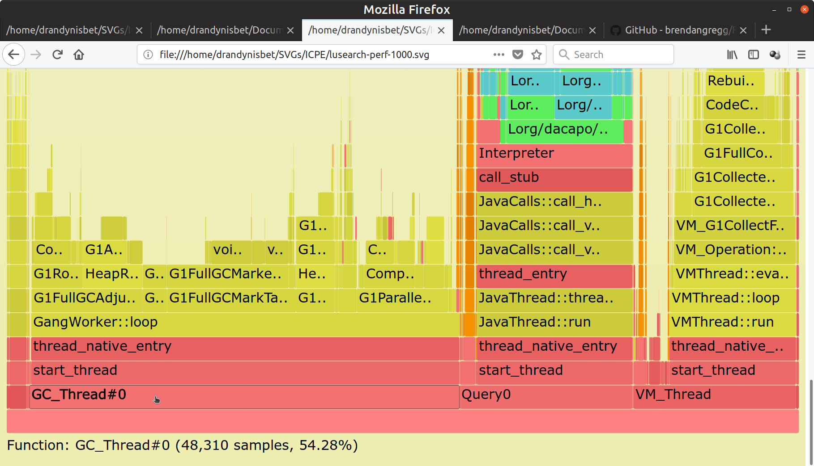
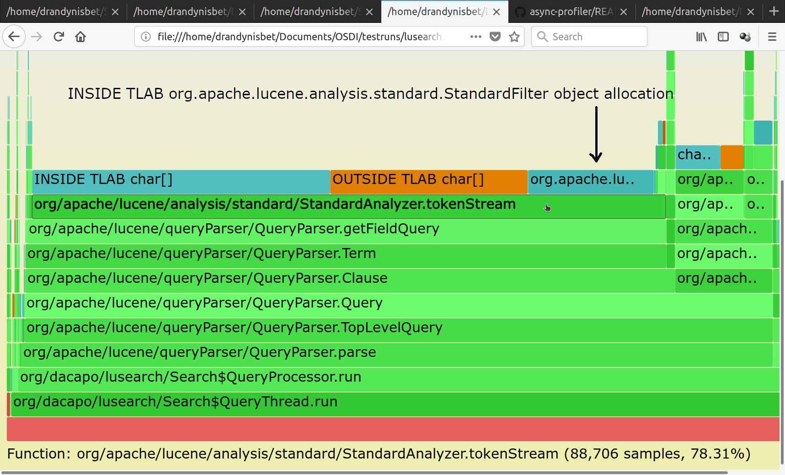
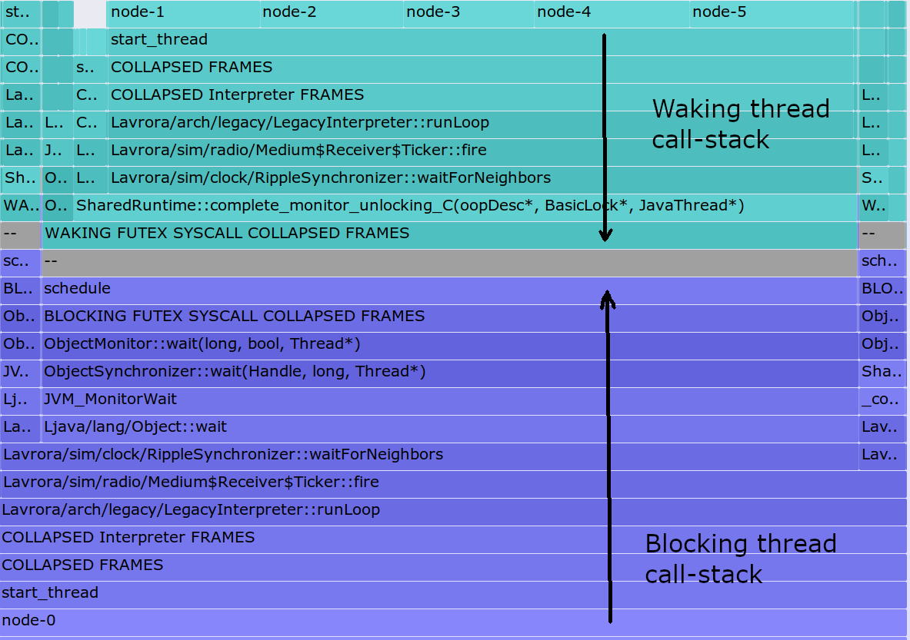
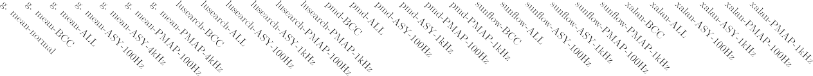

Profiling and Tracing Support for Java Applications

Andy Nisbet, Nuno Miguel Nobre, Graham Riley, and Mikel Luján

## School of Computer Science, University of Manchester, Manchester, UK

{name.surname}@manchester.ac.uk

# ABSTRACT

We demonstrate the feasibility of undertaking performance evalua- tions for JVMs using: (1) a hybrid JVM/OS tool, such as async-pro- filer, (2) OS centric profiling and tracing tools based on Linux perf, and (3) the *Extended Berkeley Packet Filter Tracing* (eBPF) framework where we demonstrate the rationale behind the stan- dard offwaketime tool, for analysing the causes of blocking laten- cies, and our own eBPF-based tool bcc-java, that relates changes in microarchitecture performance counter values to the execution of individual JVM and application threads at low overhead.

The relative execution time overheads of the performance tools are illustrated for the DaCapo-bach-9.12 benchmarks with Open- JDK9 on an Intel Xeon E5-2690, running Ubuntu 16.04. Whereas sampling based tools can have up to 25% slowdown using 4kHz frequency, our tool bcc-java has a geometric mean of less than 5%. Only for the avrora benchmark, bcc-java has a significant over- head (37%) due to an unusually high number of futex system calls. Finally, we provide a discussion on the recommended approaches to solve specific performance use-case scenarios.

# CCS CONCEPTS

### General and reference → Performance; • Software and its engineering → Virtual machines.

**ACM Reference Format:**

Andy Nisbet, Nuno Miguel Nobre, Graham Riley, and Mikel Luján. 2019. Profiling and Tracing Support for Java Applications. In *Tenth ACM/SPEC International Conference on Performance Engineering (ICPE ’19), April 7–11, 2019, Mumbai, India.* ACM, New York, NY, USA, [8](#_bookmark14) pages. [https://doi.org/10.](https://doi.org/10.1145/3297663.3309677) [1145/3297663.3309677](https://doi.org/10.1145/3297663.3309677)

# INTRODUCTION

We briefly survey standard performance evaluation approaches and tools, and their limitations for Java Virtual Machines (JVMs) concerning *Garbage Collection* (GC) log files, heap analysis, lock contention, processor core sampling, and bytecode based instru- mentation for the measurement of application specific performance metrics (Table [1](#_bookmark5) summarises tool features and capabilities). Logging involves turning on JVM flags to monitor specific JVM subsystem behavior (e.g. JIT compilation or GC). The two main approaches to

We acknowledge support of the EU Horizon 2020 ACTiCLOUD 732366, and the UK EPSRC PAMELA EP/K008730/1 project grants.

Permission to make digital or hard copies of all or part of this work for personal or classroom use is granted without fee provided that copies are not made or distributed for profit or commercial advantage and that copies bear this notice and the full citation on the first page. Copyrights for components of this work owned by others than the author(s) must be honored. Abstracting with credit is permitted. To copy otherwise, or republish, to post on servers or to redistribute to lists, requires prior specific permission and/or a fee. Request permissions from [p](mailto:permissions@acm.org)[ermissions@acm.org.](mailto:ermissions@acm.org)

*ICPE ’19, April 7–11, 2019, Mumbai, India*

© 2019 Copyright held by the owner/author(s). Publication rights licensed to ACM. ACM ISBN 978-1-4503-6239-9/19/04. . . \$15.00

<https://doi.org/10.1145/3297663.3309677>

profiling are tracing and sampling. Tracing instruments code to mea- sure microarchitecture or system performance metrics. Sampling profilers repeatedly collect the stack trace of called functions/meth- ods, that describe the code running on the processing core, *on-core*, at the sampled moments in time.

The Unix OS perf tool is becoming widely used as it supports

both sampling and tracing. In the Java community, sampling based profiling is widely implemented with *JVM Tools Interface* (JVMTI) agent support using GetCallTrace (e.g. JProfiler). This approach is reliant on restricting sampling to safe-points, that are inserted by the JIT compiler to support GC. Such restrictions generate bias, and can lead to incorrect performance information. DTrace was a key tool popularizing tracing on Solaris, and then ported to FreeBSD, NetBSD, Mac OS, and in 2018 to Windows. Since 2016, Linux inte- grated similar functionality via the eBPF framework (Kernel version 4.9). This paper demonstrate the feasibility of undertaking perfor- mance evaluations for unmodified JVMs using either, (1), a hybrid JVM/OS tool, such as async-profiler, (2), OS-centric profiling

and tracing tools based on perf, or (3) our own eBPF-based tracing tool, bcc-java. The contributions of this paper are:

-   We measure the overheads of on-core sampling with profiling for 100Hz (1 sample every 10ms), 1kHz (every 1ms) and 4kHz (every 250*µ*s) for the DaCapo benchmarks. We find that 1kHz sampling can be used with the async-profiler and perf/perf-map-agent with a reasonable geomean overhead of less than 5.2% and 11.2% respectively compared to normal execution.
-   We show how flamegraphs produced using perf combined with perf-map-agent can be used to identify where JIT based compila- tion has failed to inline successfully.
-   We report that heap allocation based profiling using the async-p- rofiler is low overhead, at less than 2.8%, for all benchmarks, and that flamegraphs enable developers to easily determine the main allocation sources in their programs.
-   We present a low overhead tracing tool bcc-java (see Section [5)](#_bookmark11) with a geometric mean overhead of 3.6% for characterizing the per- formance of all service and application threads created by a JVM. The bcc-java tool is developed on top of Linux *eBPF Compiler Col- lection* (BCC) [[12,](#_bookmark21) [23]](#_bookmark38) for adding tracing support to operating system kernels and applications. Performance counter measurements such as instructions executed, processor cycles and cache misses can be directly related to application thread IDs, and to VM services. The monitoring techniques in the tool have generic applicability that could be deployed to characterize any multi-threaded application.
-   We demonstrate how the BCC offwaketime tracing tool can be used to produce flamegraph visualizations that describe important aspects of thread blocking and wakeup execution behavior without requiring JVM modifications.
-   We summarize the main features of the tools async-profiler, perf, offwaketime, and our new bcc-java tool in Table [1.](#_bookmark5)

Section [2](#_bookmark0) generally discusses the capabilities of log file analysis tools targeting GC and JVM related memory performance anal- ysis. Section [3](#_bookmark1) presents Flamegraphs [[13]](#_bookmark22) and how to interpret them for JVMs. Section [4](#_bookmark4) explains the capabilities of traditional Java based profiling tools and their limitations. The benefits of AsyncGetCallTrace based profiling, and the *stack fragment sam- pling* approach of [[15]](#_bookmark25) are discussed. Section [5](#_bookmark11) explains the rationale behind the design of the eBPF/BCC tools and the tracing tool that we have built. Section [6](#_bookmark12) presents our experimental methodology and performance overhead analysis. Section [7](#_bookmark13) presents guidelines for the use of performance evaluation tools under different use-cases, and finally Section [8](#_bookmark23) discusses our conclusions.

# RELATED WORK: GC & JVM ANALYSIS

JVM implementations support the logging of GC statistics by stati- cally or dynamically turning on JVM flags. The statistics typically concern object allocations, usage of heap memory spaces, *stop- the-world* (STW) pauses, and total execution times for each GC invocation. STW pauses occur when all application threads are blocked during GC. Post-processing or runtime analysis of logs can be performed by tools such as [[10,](#_bookmark19) [9,](#_bookmark18) [11,](#_bookmark20) [20].](#_bookmark31) Lengauer *et al*. [[17]](#_bookmark27) presents an in-depth analysis of the GC behavior of Java bench- marks including DaCapo using G1 GC in the HotSpot JVM. Auto- mated processing of logs can aid identification and solution of GC related performance problems, such as increasing the maximum heap size, changing the ratio of younger to older generation heap sizes, and changing heuristics for moving objects into different heap spaces. Dynamic dashboard visualizations are typically used to present information concerning the relative health and efficiency of applications in production environments.

However, GC log analysis cannot help in identifying or resolv- ing which application code is the cause of high memory allocation and/or leaks. The JVM can provide a heap dump snapshot of the current live objects at relatively high cost. Such dumps may help de- velopers to determine why GC execution and pause times might be higher than expected. Unfortunately heap dumps lack information on the allocation site of an object, nor can a dump help determine which thread allocated an object. Object deallocations can only be detected by comparing two subsequent dumps and finding that an object was removed. This is difficult as objects often change their heap storage location during GC where objects move between memory generation regions, and in heap compaction. Object allo- cation profiling and recording of every object using standard JVMs are typically based on expensive [[24]](#_bookmark39) combinations of bytecode based instrumentation, and stack traces. Consequently, many tools only record allocations above minimum sizes, and/or every n-th allocation in order to reduce overhead.

AntTracks [[16]](#_bookmark26) is a customized HotSpot based JVM that instru- ments object allocation, movement and deallocation with a low logging overhead of less than 4.68%. The recorded events are suffi- ciently detailed to enable the heap’s state to be reconstructed offline, for the beginning and end of every GC cycle by incrementally ap- plying the effect of events described in trace files. *Thread local allocation buffers* (TLABs) are used to store event traces, with data compression to minimise trace collection and storage overheads.

Cao *et al*. [[6]](#_bookmark15) evaluated the power and performance requirements of managed runtime workload execution. Their work considered single-ISA heterogeneous *asymmetric multicore processor* (AMP) hardware with processor cores that are optimised for different power-performance tradeoffs. The main findings of interest are that GC accounts for 10% of processor execution cycles on average, and nearly 40% for lusearch from the DaCapo benchmarks.

Sartor *et al*. [[21]](#_bookmark32) presented techniques to analyze the scalability of

managed language applications with speedup stacks. Lightweight OS kernel modules were used to monitor an application and its VM service threads scheduling behavior with an overhead of up to 1.15% but, typically under 1%. They perform experiments on one node of an Intel Xeon E5-2650L server consisting of 2 sockets, each with 20MB shared LLC, 8 physical cores, with hyper thread- ing enabled giving 16 logical cores on each socket, and a 64-bit

3.2.37 Linux kernel. Sufficient logical cores are present to ensure that the OS does not need to schedule out a thread other than for synchronization or I/O. A problem with this approach is that it is not expected to be portable across processor ISA architectures, and it may require recompilation for each new kernel release. For their experiments, they used JikesRVM [[4]](#_bookmark35) with the DaCapo lusearch, pmd, sunflow and xalan benchmarks. JikesRVM was modified to record the JVM application, compilation and garbage collection thread type *process identifiers* (PIDs) to enable their kernel modules to attribute microarchitectural performance counter measurements to specific JVM thread types. The *speedup stack* visualization helps developers to determine if optimization efforts that focus on appli- cation, or JVM runtime services are likely to improve performance. Our bcc-java tool development was motivated by [[21].](#_bookmark32)

Hofer *et al*. [[14]](#_bookmark24) modified OpenJDK8u45 to observe and trace

events related to lock contention with a mean runtime overhead of 7.8%. The call-stacks of a thread blocking on a lock, and the thread holding the lock causing the blocking were recorded. They also presented a tool for users to identify locking bottlenecks in their code by analysing the traced events. They identified that many call-stacks that use locks are actually identical, therefore it is only necessary to maintain a hash set of known call-stacks.

The BCC offwaketime tool performs a similar task to [[14],](#_bookmark24) ex-

cept that it uses eBPF’s OS level tracing of kernel events associated with thread scheduling to determine: (1) the call-stack of a blocked thread, (2) its blocked time duration, and (3) the call-stack of the waking thread, which causes the scheduling state of the blocked thread to change to runnable. The call-stack of the blocking thread does not change whilst it is *off-core* and blocked. Hence, its call- stack need only be recorded when it meets some selection criteria, such as belonging to a process that we are interested in, and if its blocking duration is within a specified range. This enables efficient and selective tracing of call-stack blocking and wakeup behavior due to thread interactions.

# FLAMEGRAPH VISUALIZATIONS

Brendan Gregg [[13]](#_bookmark22) has shown that *scalable vector graphic* (SVG) visualizations of flamegraphs, see Figure [1,](#_bookmark2) can aid identification of performance critical code from sampled stack traces. Stack traces can be related to processing core time, or to the change in a quantity, such as last level cache misses, from a hardware counter. In this

Cropped view of rendered flamegraph. Yellow is C++ code, green is JIT compiled Java, red is native/library, and orange is kernel code. Constrained heap size to make GC significant.Inlined methods appear as teal/blue.

### Figure 1: Flamegraph: lusearch processing of on-core stack traces using perf,perf-map-agent with 1000Hz sampling.

way it is possible to produce flamegraphs that characterize the microarchitectural behavior of an application’s execution. SVGs enables flamegraphs to be viewed, zoomed in/out, and searched for text inside web browsers. The percentage contribution of a method is easily determined by searching for its name, whereupon each instance of the method in the graph is highlighted and its overall contribution to the total number of samples is displayed at the bottom right hand corner. This can be especially important for determining the relative contribution of methods having many different call-sites in an application.

In a flamegraph, any stack traces having identical callers are merged, then any non-identical child callee nodes in the collected traces appear as a new control flow path. Control flow paths are visualized by presenting the unique names of methods inside rectan- gular blocks that are typically organized lexicographically in order from left to right. Divergence in a control flow path is indicated by more than one rectangular block being stacked on top of another, such as for the blocks stacked on top of GangWorker::loop in our Figure [1.](#_bookmark2) The topmost frame in a flamegraph is the method that

was executing when a call-stack was sampled. The topmost meth- ods will be identified correctly as long as any sampling skid1 [[7]](#_bookmark16) does not cause an incorrect method to be attributed. Note how the use of different colours can be used to distinguish between inlined Java, kernel, JIT compiled Java, C++, and native/library code. Interpreted Java methods are only labelled as Interpreter, and cannot be identified with perf/perf-map-agent. However, call-stacks and flamegraphs produced with async-profiler can identify methods that undergo interpreted execution. It is a fairly trivial matter, using options for async-profiler and perf to gen- erate flamegraphs where thread PIDs are also captured with call- stacks, this can sometimes be beneficial, but it can quickly become confusing if an application contains many threads.

*Identifying Inlined Methods.* In Figure [1,](#_bookmark2) an inlined method ap- pears as a teal/blue frame above a green Java JIT compiled method,

1 Skid occurs when the reported program counter (PC) value is a number of instructions away from the actual PC when the thread was interrupted for stack sampling.

further inlined methods appear as stacks of teal/blue frames. Inlin- ing information accuracy is improved through the use of -XX:+Deb- ugNonSafePoints. Note that flamegraph columns where a teal/blue rectangle/method is directly below green, indicate a place where the JIT compiled and inlined code has called a method that was chosen not to be inlined. Note that *on-core* flamegraphs, only demonstrate stacks for threads that were executing when sampling of call stacks occurred. They neglect the importance of *off-core* time when threads are blocked.

*Heap/Allocation Flamegraphs.* Figure [2](#_bookmark6) is an heap allocation flamegraph created using async-profiler, here the width of a call stack is proportional to the amount of heap memory allocation. The topmost call-stack element represents the allocated data type,

i.e. an array, such as char [], or an object such as StandardFilter. The profiler features TLAB-driven sampling that relies on callbacks (see AllocTracer in the OpenJDK/HotSpot sources) to receive no- tifications; i), when an object is allocated inside a newly created TLAB (annotated as INSIDE or aqua in Figure [2),](#_bookmark6) and ii), when an object is allocated on a slow path outside a TLAB (annotated as OUTSIDE or in orange in Figure [2),](#_bookmark6) for example when its size exceeds that of the TLAB. This means not every allocation is counted, but only allocations every N kB, where N is the average size of TLAB. This makes heap sampling very cheap and suitable for production, as in practice it will often reflect the top allocation sources, but the collected data may be incomplete.

*Offwaketime Flamegraphs.* The blocking latency associated with *off-cpu* time can be analysed with offwaketime flamegraphs. Fig- ure [3](#figure-3-cropped-annotated-offwaketime-flamegraph-re--stricted-to-thread-node-0-blocking-for-avrora-benchmark) presents cropped illustrative output of the BCC/eBPF tool offwaketime for the avrora benchmark for blocking of thread node-0. The bottom stacks, colored blue, are off-core stacks that indicate the sequence of method calls leading to a thread blocking, and these are read from the bottom up leading towards the point where they blocked, that is separated from the waking thread stack by a grey block that is labelled --. The waking thread stacks, col- ored aqua, have their call-stack frames listed in reverse order, and are read from the top down, from application code, down to the method that caused the blocked thread’s scheduling state to change. The tool offwaketime achieves similar information to [[14]](#_bookmark24) for de- termining the blocking and wakeup behavior without requiring a modified JVM. A current limitation is that one wakeup stack may not be sufficient to explain all the sources of blocking latency. For example, when the "waker-thread" was itself blocked on another thread, potentially leading to a chain of blocking and wakeup stacks.

# JAVA BASED PROFILING

Sampling profilers repeatedly collect snapshots of the call-stack of functions/methods, that describe the *on-core* execution context of a thread running on a processing core, at the sampled moments in time. The thread execution time of specific methods is statistically related to the number of times the method appears in all stack traces

\- as long as the samples are collected fairly, and that all points in a program run are selected randomly to remain statistically inde- pendent. If many samples are collected over time, and the code stack-traces are highly correlated, then we can safely assume that

| Tool                                                    | async-profiler                                                     | perf                                       | bcc-java                                 | offwaketime                                     |
|---------------------------------------------------------|--------------------------------------------------------------------|--------------------------------------------|------------------------------------------|-------------------------------------------------|
| Native applications                                     | No                                                                 | Yes                                        | Yes                                      | Yes                                             |
| JIT compiled code support                               | Automatic                                                          | requires perf-map-agent                    | Not appropriate                          | requires perf-map-agent                         |
| JVM Restrictions                                        | OpenJDK/HotSpot AsyncGetCallTrace TLAB overflow callbacks JDK 7u40 | JDK 8u60 onwards                           | No, but for thread names JDK9 needed     | JDK8u60 onwards                                 |
| Interpreted methods                                     | Identified                                                         | Seen as Interpreter                        | Not appropriate                          | Seen as Interpreter                             |
| Identify inlined Java methods                           | No                                                                 | Yes -XX:+DebugNonSafePoints                | No                                       | No                                              |
| JDK -XX Flags +PreserveFramePointer +DebugNonSafePoints | None No No                                                         | Yes Required Improves inlining accuracy    | None No No                               | Yes Required No                                 |
| Methodology                                             | Sampled call-stack                                                 | Sampled call-stack                         | eBPF tracing instrumentation             | eBPF tracing blocked time captures call-stacks  |
| PC stack sampling skid                                  | Yes                                                                | Yes                                        | No                                       | No                                              |
| Heap profiling/overhead                                 | TLAB based, low overhead                                           | None                                       | None                                     | None                                            |
| Identify hot-methods                                    | Some JVM stubs/intrinsics are invisible                            | Full-stack, stubs & intrinsics are visible | Thread-based (No)                        | Blocked-time (No)                               |
| Microarchitecture counters                              | Sample call-stacks                                                 | Sample call-stacks                         | Measures changes associated with threads | Measures off-core time                          |
| Flamegraph visualisation                                | Yes                                                                | Yes                                        | No                                       | Yes                                             |
| Relate blocked thread call-stacks to wakeup call-stacks | No                                                                 | No                                         | No                                       | Yes - with selective filtering on blocking time |

### Table 1: Summary of features and functionality of profiling and tracing tools used in experiments.

**Figure  2:  Annotated  flamegraph,  async-profiler  for**

### lusearch benchmark for heap memory allocations.

threads in a program are spending most of their time executing code described by the most heavily correlated call-stack. Unfortu- nately, profilers that directly rely on the *Java Virtual Machine Tool Interface* (JVMTI) suffer from the problem of safe-point2 bias [[18].](#_bookmark28) The sampled data is skewed towards the times when threads have voluntarily yielded the processing core at safe-points where the JVTMI’s GetStackTrace can directly obtain call-stacks. One might incorrectly come to the conclusion that the actual hot code should lie somewhere between the sampled call stack of the "hot" safe-point and the potential call-stack of the immediately previous safe-point.

2 The JVM inserts safe-points that define points where the state of an executing thread is well understood. Effectively this means that all object references stored on the stack are at known locations, and actual storage locations can change during an GC.

### Figure 3: Cropped, annotated offwaketime flamegraph (re- stricted to thread node-0 blocking) for avrora benchmark.

Yet, this is not the case because there are significant, variable and lengthy delays between when an JVMTI agent signals an JVM to sample a stack trace and the operation occurring. The JVMTI re- quest is first added to the VM thread’s work queue, and the VM thread must process any prior pending tasks first. Figure [1](#_bookmark2) demon- strates significant VM_Thread activity (20% of call stacks) related to GC.

Mytkowicz et. al. demonstrated, in [[18]](#_bookmark28) that four different com- mercial and open-source profilers often produced demonstrably different results for the percentage overhead of, and the actual hottest method. The overhead of profiling varied between 1.1x and

 

### Figure 4: Normalized execution time overheads for unprofiled (normal) bcc-java (BCC), async-profiler on-core with (ASY) and heap allocation with (ALL), perf (PMAP) summarised for lusearch, pmd, sunflow, xalan benchmarks. g.mean refer to all 11 benchmarks studied

1.5x for the different profilers on sequential benchmarks chosen from DaCapo, and different profilers caused significant perturbation to the placement of safe-points in compiled methods. Safe-point placement is an implementation decision of the JVM, therefore dif- ferent JVM’s are likely to report hot-methods with different results and accuracy. Current popular and widely used profilers such as VisualVM, JProfile and YourKit all provide a sampling processing- core profiler that suffers from the problem of safe-point bias. Fur- ther problems concerning sampling profilers, and also for bytecode based instrumentation using JVMTI, is that any injected bytecode:–

–Introduces overhead to actually perform the stack trace collection.

–Affects the accuracy of analysis and the applied JIT optimizations; Inlining decisions change if a method becomes too large to inline. GC and memory behavior in the JVM may be significantly altered if escape analysis [[8]](#_bookmark17) cannot decide if it is safe to allocate specific objects on the stack, and instead they are allocated on the heap.

–Changes in code size are likely to affect compiled code layout, and cache performance due to the need to respect machine alignment for specific data types.

–Will change safe-point placement because of injected bytecode.

A prototype safe-point bias free proof-of-concept profiler was first demonstrated in [[18].](#_bookmark28) UNIX signals were used to pause Java application threads prior to sampling the call-stack of the currently executing method. A JVMTI agent was used to build a map of x86 code ranges to Java methods that enables code addresses in

executes completely outside of the JVM, and cannot know the identity of an interpreted method.

The honest-profiler [[3]](#_bookmark34) and async-profiler [[2,](#_bookmark33) [19]](#_bookmark29) are re-

cent examples that have extended and improved the proof of con- cept ideas of [[18].](#_bookmark28) We do not discuss the honest-profiler due to space limitations. The async-profiler employs a hybrid approach for its stack trace collection based on i), AsyncGetCallTrace to obtain information on a thread’s Java frames, without the require- ment to be at a safe-point, and ii), perf to provide information on native code and kernel frames. The perf_event API is used to configure stack samples to be placed into a memory buffer, and a signal is delivered when a sample has been taken. Its signal handler then calls AsyncGetCallTrace to capture the Java stack that it then merges with the perf stack trace of native and kernel information. The main benefits of this approach over a purely perf/eBPF ap- proach is that it can be used to profile applications running on older JVM releases that do not support -XX:+PreserveFramepointer3 that is necessary for OS tool based stack walking of Java thread

stacks. The main pros and cons of async-profiler are:

-   AsyncGetCallTrace is an internal Oracle/OpenJDK API that is not guaranteed to be available in other JVM implementations.
-   Optimised compiler inserted stub code that enables efficient im- plementation of compiler intrinsics, and performance critical JVM operations such as crc32 and System.arraycopy will generally be invisible to AsyncGetCallTrace because the JVM does not record

call-stacks to be mapped back to Java methods. Note, the profiler

3 Execution overhead of this flag was less than 4% in our experiments.

the necessary metadata for many such stubs.

-   Off-core thread stacks that are blocked or sleeping are not col- lected by AsyncGetCallTrace.
-   AsyncGetCallTrace will produce some failed stack traces where

    it is unable to safely walk a stack without causing an invalid memory access. There were very few failed stack traces in our experiments. perf also suffers from this unavoidable problem.

-   Does not require generating a map file to map Java code addresses to method names, if one uses perf_event directly then one tradi- tionally uses perf-map-agent for this purpose.
-   Identifies the methods in interpreter frames, perf-map-agent

    merely identifies that an interpreter frame is present.

-   Allocation profiling can be performed to identify the sites where the largest amount of heap memory is allocated. In our experiments the overhead of allocation profiling is always below 2.8%. Allocation profiling does not impact on escape analysis or JIT optimizations. The async-profiler tool can collect stack traces from Java methods, native calls, JVM code and kernel functions (only pos- sible in processing core profiling mode). Both async-profiler and perf approaches support reading performance counters sup- ported by perf_events such as:- last-level cache/data TLB load misses, L1-dcache misses, branch misses, page faults, and instruc- tions retired. The perf approach collects callstacks and has access to perf_events, and uses the perf-map-agent JVMTI agent to generate a mapping of code addresses to Java symbol names. The main benefits of the perf-based approach over async-profiler are that: (1) the JVM flag -XX:+DebugNonSafepoints enables inlin- ing decisions to be accurately visualized in a flamegraph, and that (2) JVM generated stubs, and performance critical operations (e.g. JVM intrinsics), can be observed that are invisible to async-profiler.

    No commercial features are required by async-profiler, as it is completely based on open-source technologies and works with OpenJDK from version 7u40 onwards, where the TLAB callbacks ap- peared. Note, the heap allocation functionality of async-profiler requires libjvm.so JVM debug symbols.

*Stack Fragment Sampling (SFS).* SFS, as described in [[15],](#_bookmark25) has less overhead than AsyncGetCallTrace and JVMTI based methods, this is achieved using a modified HotSpot JVM. SFS typically occurs only when a thread is active and on-core. A thread is paused to copy a fragment of its full stack to a buffer. Copied fragments are asynchronously retrieved from the buffer and decoded to full stack traces. Redundant samples are not captured giving reduced storage overheads.

Their work is of low overhead, but they encounter significant problems when enabling the collection of information on waiting periods, i.e. when a thread is blocked for I/O or to acquire a lock. The number of lost samples increases from a maximum of 2% for pmd, to more than 50% for the benchmarks actors, avrora, and scalatest in their experiments. Further, SFS operational overheads are likely to be lower on their quad-core experimental setup in comparison to our 8 core node. The performance slowdown of their techniques was approximately 1.15x (i.e. 15% slower) for avrora when waiting time was not sampled for a 10kHz sampling rate. They found i) that their heuristic rules to enable stack walking work for more than 90% of sampled stacks, even when execution

is in native or VM code, and ii), that a fragment size of 32KB can obtain complete stack traces.

# THE BCC-JAVA TOOL

The *Berkeley Packet Filter* (BPF) [[22]](#_bookmark37) enabled instrumentation code to be attached to a network socket by injecting bytecode (describing an BPF program) from userspace to the kernel. JIT compilation and verification checks are performed to ensure no security or kernel crashes can occur. The development of *extended BPF (eBPF)* has (i) improved JIT compilation, (ii) added many more probes to Linux, and (iii) enabled user-level statically defined trace probe points for application programs. *Probes* are points where dynamic instrumen- tation can be attached. Each probe has a specific set of variables that are used to describe the probe’s events. The instrumented code can perform different processing based on the values of the variables of a probe.

We use the BCC toolkit that provides a set of Python scripting ex- amples demonstrating how to; i), launch BCC tools, ii), exploit eBPF features for instrumentation, and iii), how to efficiently perform I/O to obtain profiling/tracing results.

The main capabilities of BCC, and eBPF are summarized in [[12].](#_bookmark21) Instrumented code can read hardware performance counters, and update arbitrary data structures to collect and process information. A *Maps* data abstraction enables information to be processed and aggregated in kernel, before sharing with user-space when required. We have developed a low-overhead tracing tool that records mi- croarchitectural and execution time characteristics associated with the multi-threaded execution of Java programs. The tool currently records a thread’s name, its start/exit time, cycles, instructions, and time spent on-core in execution. We additionally record the number of scheduling quanta given to each thread, the off-core waiting time, and the total number of sys_futex system calls. The initial JVM

process is created by executing the JDK java command; hereafter

referred to as the *java-process*. Our tool uses instrumentation of:

-   *java-process* creation and termination by instrumenting kernel methods for sched_process_exec, sched_process_fork and sc- hed_process_exit. The PID of the initial *java-process* that is cre- ated is stored in a hashmap.
-   The creation of new threads that are children of the initial PID are tracked using a kernel probe attached to the sys_clone method.
-   Kernel probes are attached to the entry and exit of the sys_futex system call. We record for each thread, the number of futex calls, the total elapsed time whilst blocked, and performance counter

    values when a thread is blocked/unblocked.

-   Thread scheduling, namely sched_switch is instrumented to col- lect time and performance counter information concerning the allocation of a thread to a processing core. The counter values and elapsed time are updated at the end of a thread’s quantum, or when the thread enters the sys_futex system call.
-   On termination of the *java-process*, the tool stores per-thread de- tails of accumulated performance counter values, total wait time, total calls to sys_futex, and elapsed time. OpenJDK9 uses a default thread naming scheme that allows to distinguish between different types of threads, i.e. application and service threads related to JIT compilation, GC, and other JVM services. Thus, measurements are linked to specific JVM subsystems.

# EXPERIMENTS – TOOLS OVERHEADS

The experimental objective is to quantify the execution time over- heads of perf, async-profiler and bcc-java tools using the es- tablished set of DaCapo [[5]](#_bookmark36) JVM performance evaluation bench- marks. The overheads of running the different performance tools are normalized against the execution times of ELEVEN unmodified (avrora, fop, h2, jython, luindex, lusearch, pmd, sunflow, tradebeans, tradesoap, xalan) DaCapo-bach-9.12 benchmarks that execute suc- cessfully under OpenJDK9 with G1 GC using default application problem and heap sizes.

The experimental machine is a two-socket Intel Xeon E5-2690, with 8 physical cores per socket (hyper-threading is disabled), 20MB LLC cache, and a total of 384GB DRAM main memory, with Linux kernel 4.13.0-36-generic. All cores are set to 2.9GHz frequency via a user-space governor. No other users are present on the system, a single ssh connection is used to initiate and monitor experiments that only access local disks. NUMA memory effects are avoided by executing applications only on cores belonging to one socket, as in [[21].](#_bookmark32) We used bcc-tools version 0.5.0-1, and OpenJDK (build 9-internal+0-2016-04-14-19524-6.buildd.src, mixed mode).

Each benchmark is executed for 20 iterations and the 19th itera- tion’s time is recorded. This is repeated 30 times in order to avoid variability due to JIT recompilation and startup costs. The 19th itera- tion execution time measurements are normalized to the average of each benchmark under normal execution without profiling over its 30 runs. Figure [4](#figure-4-normalized-execution-time-overheads-for-unprofiled-normal-bcc-java-bcc-async-profiler-on-core-with-asy-and-heap-allocation-with-all-perf-pmap-summarised-for-lusearch-pmd-sunflow-xalan-benchmarks-gmean-refer-to-all-11-benchmarks-studied) depicts the median execution times, in the form of box plots, normalized to average execution time without sampling. On each box, the central mark denotes the median, and the bottom and top edges indicate the 25th and 75th percentiles, respectively. The box spans the interquartile range of the sampled data. The whiskers extend to the most extreme data points not considered outliers, which are not shown. However, the whiskers extend to up to 1.5x of the interquartile range below and above the bottom and top edges, respectively. This corresponds to approximately 2.7*σ* or 99.3% coverage if the data were normally distributed. The g.mean labels in Figure [4](#figure-4-normalized-execution-time-overheads-for-unprofiled-normal-bcc-java-bcc-async-profiler-on-core-with-asy-and-heap-allocation-with-all-perf-pmap-summarised-for-lusearch-pmd-sunflow-xalan-benchmarks-gmean-refer-to-all-11-benchmarks-studied) show the geometric means over all ELEVEN benchmarks; e.g., g.mean-ASY-100Hz is the geometric mean over all benchmarks of async-profiler on-core profiling with 100Hz sampling. These are accompanied by error bars that delimit 95% confidence intervals.

The experimental configurations are: (1) baseline (no profiling tools used), (2) async-profiler with **ALL** allocation and **ASY** pro- cessing core profiling, (3) perf with perf-map-agent (notated as **PMAP**), and (4) bcc-java based tracing (notated as **BCC**) where we measure the instructions and cycles executed along with accu- mulated counts of execution/waiting time and the start and end times of individual threads. For on-core async-profiler and perf we used 100Hz, 1kHz and 4kHz sampling frequencies. Note, 10kHz perf sampling was not feasible as kernel warning messages ap- peared concerning interrupts and frequency throttling.

For clarity, Figure [4](#figure-4-normalized-execution-time-overheads-for-unprofiled-normal-bcc-java-bcc-async-profiler-on-core-with-asy-and-heap-allocation-with-all-perf-pmap-summarised-for-lusearch-pmd-sunflow-xalan-benchmarks-gmean-refer-to-all-11-benchmarks-studied) only plots sampling frequencies of 100Hz and 1KHz for a small set of individual benchmarks (lusearch, pmd, sunflow and xalan), whilst geomean plots refer to execution of all ELEVEN benchmarks with 100Hz and 4KHz sampling, in this way we can see the relatively higher overheads of async-profiler (1.26x ASY-4kHz) in comparison to perf (1.16x PMAP-4kHz) at

higher sampling rates (perf overhead is substantially less than async-profiler for 4kHz sample rates for all benchmarks other than avrora). This is despite the unusually high overhead of perf on avrora that is more than 2x even at a low 100Hz. However on a laptop class machine with an i7-7500U processor having 2 physical processing cores (4-hyperthreaded) @2.7GHz, the overhead of the same experiment was 3.8%. We cannot definitively explain why there is a significant overhead even for 100Hz sampling, but we suspect that processor chipset issues, and kernel version issues such as default perf buffer sizes may be relevant.

Our *bcc-java* tool has very low-overhead apart from avrora

where its average overhead is 1.37x. bcc-java text output enabled us to determine that the Java application threads were spending circa 80% of their total execution time blocked off-core, largely because of repeated calls to sys_futex when attempting to acquire locks. bcc-java has relatively high overhead on avrora because instrumentation measuring time, cycles and instructions executed, along with the code to update the in-kernel eBPF maps, occurs with relatively high frequency, that we calculated from bcc-java tracing to occur on average every 9863 cycles and 12658 instruc- tions executed, by examining bcc-java tracing information for one iteration of one application thread on avrora.

# PERFORMANCE USE-CASE GUIDELINES

The next paragraphs present use-cases and the suggested guidelines for how to identify them.

1.  *Identifying the call-stack context, load-imbalance, and functions where significant execution time is spent.* Browser views of on-core flamegraphs produced via perf, or using async-profiler are ap- propriate. The method with the most significant execution time equates to finding the top-most widest call-stack tower. Note that some functions may appear in many different call-stacks, because they are called from many different call-sites, and this may cumula- tively add up to be a significant proportion of the total number of stack-samples, and hence execution time. Searching for a function name in the browser view of an SVG will determine the total % appearances of the function in all call-stack samples. perf can see many JVM intrinsics, compiler stubs and inlining decisions that

    are mostly invisible to async-profiler. Load-imbalance can be

    identified by using flamegraphs that propagate thread PIDs to the call-stack. Unequal width call-stacks concerning different thread PIDs will signify unequal on-core load-imbalance across threads. Load-imbalance can also measured by examining thread start/stop and blocked execution times that is traced by the bcc-java tool.

    1.  *Identifying if GC time, and memory allocation issues are signifi- cant* Core-profiled flamegraphs can be used to identify if GC related methods are significant, whereas allocation based flamegraphs with async-profiler can determine the source code methods where significant memory allocation occurs, and whether allocations were from inside or outside of a TLAB. Manually restructuring the code to reduce the volume of memory allocated, and applying standard GC log file analysis tools to change and optimize specific GC algo- rithm parameters are recommended.
    2.  *Identifying JIT compilation method inlining decisions that may be critical for performance.* We recommend, using perf, with

        \-XX:+DebugNonSafePoints enabled. Flamegraph columns where

a teal/blue rectangle is placed directly below a green rectangle indi- cates a call site where JIT compiled and inlined code has called a method that was chosen not to be inlined. JIT compilation logging can be selectively enabled for the affected methods. A tool such

[6] Ting Cao, Stephen M Blackburn, Tiejun Gao, and Kathryn S McKinley. 2012. The yin and yang of power and performance for asymmetric hardware and managed software. In *Proceedings of the 39th Annual International Symposium on Computer Architecture* (ISCA ’12). IEEE Computer Society, Portland, Oregon, 225–236. isbn: 978-1-4503-1642-2. [http://dl.acm.org/citation.cfm?id=2337159.](http://dl.acm.org/citation.cfm?id=2337159.2337185)

as JITWatch [[1]](#references) may help to determine the reasons why inlining failed. Careful refactoring of large methods into multiple smaller ones may enable inlining decisions that were previously precluded.

1.  *Identifying the causes of blocked thread execution states,* for example, lock-contention, I/O, and a lack of processing resources. The bcc-java tool can be used to identify on a per-thread basis if a thread spends a significant amount of time blocked, and, also if it relates to sys_futex lock acquisition/release. The eBPF/BCC tool offwaketime can be used to identify the specific call-stacks that contribute to long blocking times, and also the call stacks that cause the blocked threads to be woken up in the kernel. This achieves similar functionality to [[14]](#_bookmark24) but without any JVM modifications.

    Note, the offwaketime tool uses tracing so the actual blocked exe-

    [7]

[8]

[9]

[10]

[2337185.](http://dl.acm.org/citation.cfm?id=2337159.2337185)

Dehao Chen, Neil Vachharajani, Robert Hundt, Shih-wei Liao, Vinodha Ra- masamy, Paul Yuan, Wenguang Chen, and Weimin Zheng. 2010. Taming hard- ware event samples for fdo compilation. In *Proceedings of the 8th Annual IEEE/ACM International Symposium on Code Generation and Optimization* (CGO ’10). ACM, Toronto, Ontario, Canada, 42–52. isbn: 978-1-60558-635-9. doi: [10.1145/1772954.1772963.](https://doi.org/10.1145/1772954.1772963) [http://doi.acm.org.manchester.idm.oclc.org/10.1145/](http://doi.acm.org.manchester.idm.oclc.org/10.1145/1772954.1772963) [1772954.1772963.](http://doi.acm.org.manchester.idm.oclc.org/10.1145/1772954.1772963)

Jong-Deok Choi, Manish Gupta, Mauricio Serrano, Vugranam C. Sreedhar, and

Sam Midkiff. 1999. Escape analysis for Java. In *Proceedings of the 14th ACM SIGPLAN Conference on Object-oriented Programming, Systems, Languages, and Applications* (OOPSLA ’99). ACM, Denver, Colorado, USA, 1–19. isbn: 1-58113- 238-7. doi: [10.1145/320384.320386.](https://doi.org/10.1145/320384.320386) [http://doi.acm.org/10.1145/320384.320386.](http://doi.acm.org/10.1145/320384.320386)

Oracle Corporation. 2013. Advanced Java diagnostics and monitoring without performance overhead. (2013). [http://www.oracle.com/technetwork/java/](http://www.oracle.com/technetwork/java/javaseproducts/mission-control/java-mission-control-wp-2008279.pdf) [javaseproducts/mission-control/java-mission-control-wp-2008279.pdf](http://www.oracle.com/technetwork/java/javaseproducts/mission-control/java-mission-control-wp-2008279.pdf).

GCeasy. 2018. Gc easy universal gc log analyzer. Web Page. (2018). [http://](http://gceasy.io/) [gceasy.io/.](http://gceasy.io/)

cution time is measured. Command line arguments can be used to

[11] GCViewer. 2017. Open source fork of tagtraum industries gcviewer. [https:](https://github.com/chewiebug/GCViewer)

filter out very short and extremely long thread blocking times such as when a server is lightly loaded or inactive.

[12]

[//github.com/chewiebug/GCViewer.](https://github.com/chewiebug/GCViewer) (2017).

Brendan Gregg. 2018. Linux enhanced bpf (ebpf) tracing tools. (2018). Retrieved from [http://www.brendangregg.com/ebpf.html.](http://www.brendangregg.com/ebpf.html)

# CONCLUSIONS

This paper examines the peformance analysis capabilities of async- profiler, perf/perf-map-agent and the potential of eBPF-based tools such as our bcc-java, and offwaketime. Flamegraph visual- izations of memory allocation (GC) and processing core profiling can easily show which Java methods and native or OS code are significant, and that even JIT compilation inlining decisions can be captured. Sampling at 1kHz (1000 samples per second) offers reasonable overhead and 100Hz sampling rates are suitable for pro-

1.  Brendan Gregg. 2016. The flame graph. *Queue*, 14, 2, Article 10, (Mar. 2016),

    10:91–10:110. issn: 1542-7730. doi: [10.1145/2927299.2927301.](https://doi.org/10.1145/2927299.2927301) [http://doi.acm.](http://doi.acm.org/10.1145/2927299.2927301) [org/10.1145/2927299.2927301.](http://doi.acm.org/10.1145/2927299.2927301)

2.  Peter Hofer, David Gnedt, Andreas Schörgenhumer, and Hanspeter Mössen- böck. 2016. Efficient tracing and versatile analysis of lock contention in Java ap- plications on the virtual machine level. In *Proceedings of the 7th ACM/SPEC on In- ternational Conference on Performance Engineering* (ICPE ’16). ACM, Delft, The Netherlands, 263–274. isbn: 978-1-4503-4080-9. doi: [10.1145/2851553.2851559.](https://doi.org/10.1145/2851553.2851559) [http://doi.acm.org/10.1145/2851553.2851559.](http://doi.acm.org/10.1145/2851553.2851559)
3.  Peter Hofer and Hanspeter Mössenböck. 2014. Fast Java profiling with scheduling- aware stack fragment sampling and asynchronous analysis. In *Proceedings of the 2014 International Conference on Principles and Practices of Programming on the Java Platform: Virtual Machines, Languages, and Tools* (PPPJ ’14). ACM, Cra- cow, Poland, 145–156. isbn: 978-1-4503-2926-2. doi: [10.1145/2647508.2647509.](https://doi.org/10.1145/2647508.2647509)

duction use, except for avrora with perf. Although not presented in the paper, the async-profiler and the perf/perf-map-agent approaches can both be used to attribute microarchitecture perfor- mance counter events to flamegraphs. However, PC sampling skid

1.  

    [http://doi.acm.org/10.1145/2647508.2647509.](http://doi.acm.org/10.1145/2647508.2647509)

    Philipp Lengauer, Verena Bitto, and Hanspeter Mössenböck. 2015. Accurate and efficient object tracing for Java applications. In *Proceedings of the 6th ACM/SPEC International Conference on Performance Engineering* (ICPE ’15). ACM, Austin, Texas, USA, 51–62. isbn: 978-1-4503-3248-4. doi: [10.1145/2668930.2688037.](https://doi.org/10.1145/2668930.2688037)

    http://doi.acm.org/10.1145/2668930.2688037.

(affecting both async-profiler and the perf/perf-map-agent) will vary depending on the specific performance counter event and processor implementation. We have found that sampling-based pro- filer flamegraph visualizations provide a useful tool to investigate

1.  Philipp Lengauer, Verena Bitto, Hanspeter Mössenböck, and Markus Weninger. 2017. A comprehensive Java benchmark study on memory and garbage col- lection behavior of DaCapo, DaCapo Scala, and SPECjvm2008. In *Proceed- ings of the 8th ACM/SPEC on International Conference on Performance Engi- neering* (ICPE ’17). ACM, L’Aquila, Italy, 3–14. isbn: 978-1-4503-4404-3. doi:

and to characterize Java application and GC performance. In con- trast, our tool bcc-java does not suffer from the PC-sampling skid problem as it is a tracing based tool. The overhead of bcc-java is small (geomean 3.6%) despite capturing microarchitectural perfor-

1.  

    [10.1145/3030207.3030211.](https://doi.org/10.1145/3030207.3030211) [http://doi.acm.org/10.1145/3030207.3030211.](http://doi.acm.org/10.1145/3030207.3030211)

    Todd Mytkowicz, Amer Diwan, Matthias Hauswirth, and Peter F. Sweeney. 2010. Evaluating the accuracy of Java profilers. In *Proceedings of the 31st ACM SIGPLAN Conference on Programming Language Design and Implementation* (PLDI ’10). ACM, Toronto, Ontario, Canada, 187–197. isbn: 978-1-4503-0019-3. doi: [10.1145/1806596.1806618.](https://doi.org/10.1145/1806596.1806618) [http://doi.acm.org/10.1145/1806596.1806618.](http://doi.acm.org/10.1145/1806596.1806618)

mance counters on thread scheduling activities.

1.  Andre Pangin and Vadim Tsesko. 2017. The art of jvm profiling. JPoint Interna- tional Developer Conference. (2017). [http://2017.jpoint.ru/en/talks/the-art-of-](http://2017.jpoint.ru/en/talks/the-art-of-jvm-profiling/)

# REFERENCES

1.  

    [jvm-profiling/.](http://2017.jpoint.ru/en/talks/the-art-of-jvm-profiling/)

    Git Project. 2018. Visualvm home page. [https://visualvm.github.io/.](https://visualvm.github.io/) (2018).

1.  AdoptOpenJDK. 2018. Adoptopenjdk jitwatch home page. [https://github.com/](https://github.com/AdoptOpenJDK/jitwatch) [AdoptOpenJDK/jitwatch.](https://github.com/AdoptOpenJDK/jitwatch) (2018).
2.  Andre Pangin et al. 2018. Async-profiler. [https://github.com/jvm-profiling-](https://github.com/jvm-profiling-tools/async-profiler) [tools/async-pr](https://github.com/jvm-profiling-tools/async-profiler)ofiler,changeset=0a6f365. (2018).
3.  Richard Warburton et al. 2018. Honest profiler git repository. [https://github.](https://github.com/jvm-profiling-tools/honest-profiler) [com/jvm-profiling-tools/honest-profiler.](https://github.com/jvm-profiling-tools/honest-profiler) (2018).
4.  Bowen Alpern et al. 1999. Implementing jalapeño in Java. In *Proceedings of the 14th ACM SIGPLAN Conference on Object-oriented Programming, Systems, Languages, and Applications* (OOPSLA ’99). ACM, Denver, Colorado, USA, 314– 324. isbn: 1-58113-238-7. doi: [10.1145/320384.320418.](https://doi.org/10.1145/320384.320418) [http://doi.acm.org/10.](http://doi.acm.org/10.1145/320384.320418) [1145/320384.320418.](http://doi.acm.org/10.1145/320384.320418)
5.  Stephen M. Blackburn et al. 2006. The DaCapo benchmarks: Java benchmarking development and analysis. In *Proceedings of the 21st Annual ACM SIGPLAN Con- ference on Object-oriented Programming Systems, Languages, and Applications* (OOPSLA ’06). ACM, Portland, Oregon, USA, 169–190. isbn: 1-59593-348-4. doi: [10.1145/1167473.1167488.](https://doi.org/10.1145/1167473.1167488) [http://doi.acm.org/10.1145/1167473.1167488.](http://doi.acm.org/10.1145/1167473.1167488)
6.  J.B. Sartor, K.D. Bois, S. Eyerman, and L. Eeckhout. 2017. Analyzing the scala- bility of managed language applications with speedup stacks. In *Proceedings of the IEEE Int. Symp. Performance Analysis of Systems and Software (ISPASS)*, 23–32.
7.  Valentine Sinitsyn. 2014. Berkeley packet filters with scapy (and friends). *Linux J.*, 2014, 242, Article 3, (June 2014). issn: 1075-3583. [http://dl.acm.org/citation.](http://dl.acm.org/citation.cfm?id=2642922.2642925) [cfm?id=2642922.2642925.](http://dl.acm.org/citation.cfm?id=2642922.2642925)
8.  Cheng-Chun Tu, Joe Stringer, and Justin Pettit. 2017. Building an extensible open vswitch datapath. *SIGOPS Oper. Syst. Rev.*, 51, 1, (Sept. 2017), 72–77. issn: 0163-5980. doi: [10.1145/3139645.3139657.](https://doi.org/10.1145/3139645.3139657) [http://doi.acm.org/10.1145/3139645.](http://doi.acm.org/10.1145/3139645.3139657) [3139657.](http://doi.acm.org/10.1145/3139645.3139657)
9.  YourKit. 2018. Object allocation recording. (2018). Retrieved from [https://www.](https://www.yourkit.com/docs/java/help/allocations.jsp) [yourkit.com/docs/java/help/allocations.jsp.](https://www.yourkit.com/docs/java/help/allocations.jsp)
