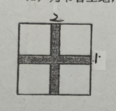

# 11-01 数学

> 10.20 ~10.31

## 新内容

### 均值不等式

8. 两个正数 $a$，$b$ 满足 $4ab+a+b=12$，求：  
   （1）❌$ab$的取值范围；  
   （2）$a+b$的取值范围。

7. 已知 $a,b \in \R$,且 $2a-3b=1$,则 $9^{a}+\dfrac{1}{27^{b}}$ 的最小值为\_\_\_\_\_\_\_\_\_\_.
      > [!CAUTION]
      > 不确定是否会做

7. ❌已知 $x>1$，则代数式 $2x+\dfrac{4}{x-1}$ 的最小值是\_\_\_\_\_\_\_\_  

8. ❌若命题“对任意实数 $a>0$,$b>0$,且 $a+b=4$,不等式 $\dfrac{4}{a}+\dfrac{1}{b}>m $ 恒成立”为真命题,则 $m$ 的取值范围为\_\_\_\_\_\_\_\_\_\_.

14. ❌若 $x$，$y$ 为正实数，求证：$(x+\dfrac{1}{2y})^{2}+(y+\dfrac{1}{2x})^{2}\geq4$.

    > [!CAUTION]
    >
    > 不会两次运用均值不等式

12. ❌定义：关于 $x$ 的不等式$\mid x-A\mid<B$的解集叫 $A$ 的 $B$ 邻域。若 $a+b-2$ 的 $a+b$ 邻域为区间$(-2,2)$，则 $a^{2}+b^{2}$ 的最小值是\_\_\_\_\_\_\_\__
     > [!CAUTION]
     > 不熟悉 $a^{2}+b^{2} \ge \dfrac{(a+b)^2}{2}$ 这个不等式，需要老师拓展一下

16. ❌如果正数$a,b,c,d$满足$a+b=cd=4$，那么（ ）  
      A. $ab\leqslant c+d$，且等号成立时$a,b,c,d$的取值唯一  
      B. $ab\geqslant c+d$，且等号成立时$a,b,c,d$的取值唯一  
      C. $ab\leqslant c+d$，且等号成立时$a,b,c,d$的取值不唯一  
      D. $ab\geqslant c+d$，且等号成立时$a,b,c,d$的取值不唯一
      > [!CAUTION]
      > 没有理解 取值唯一是什么意思？
      >
      > 还是没懂，问老师

###  三角不等式

2. ❌若关于 $x$ 的不等式 $\mid x+1\mid +\mid x-2\mid \geqslant a$ 恒成立，则$a$ 的取值范围是\_\_\_\_\_\_\_\_\_\_\_\_.

3. ❌若函数 $ y=\mid x+1\mid +\mid x+t\mid$ 的最小值为 3，则实数 $t$ 的值为\_\_\_\_\_\_\_\_\_\_\_\_.

14. ❌如果$\mid x+1\mid+\mid x+9\mid>a$对任意实数 $x$ 总成立，则$a$的取值范围是（ ）  
      A. $\{a\mid a<8\}$；          B. $\{a\mid a>8\}$；           C. $\{a\mid a\geqslant8\}$；          D. $\{a\mid a\leqslant8\}$

12. ❌对任意 $ x\in R $，$ x\neq-1 $，不等式 $\dfrac{|2x-1|+|2-x|}{|x+1|}\geq a$ 恒成立，则实数a的取值范围是\_\_\_\_\_\_\_\_\_\_\_\_.
     > [!CAUTION]
     > 三角不等式不能灵活使用，和前面的 2， 3 混淆，需要统一讲解

------

12. ❌已知 $x,y$ 是实数,若 $\mid x+y\mid<\dfrac{1}{3}$,   $\mid 2x-y\mid<\dfrac{1}{6}$,求证: $\mid y\mid<\dfrac{5}{18}$.

     > [!CAUTION]
     > 需要老师讲解此类问题的解题思路。

13. ❌设$ f(x)=x^{2}-x+1 $，$ g(x)=\mid\dfrac{1}{x}-a-1\mid+\mid\dfrac{1}{x}+a\mid(a\in R,a\neq0) $,若对任意的$ x_{1}\in \R $,都存在$ x_{2}\in \R $,使得$ f(x_{1})\geq g(x_{2}) $成立.求实数$a$ 的取值范围;

     > [!CAUTION]
     > 这里的**逻辑问题**是 $\min f(x) \ge \min g(x)$ 的最小值。有可能和恒成立问题淆。

16. 设 $ f(x)=\mid x+\dfrac{1}{a}\mid+\mid x-a\mid(a>0) $.
    (1) ❌若 $f(2)<a+1 $,求实数  $a$ 的取值范围;
    (2)若对任意$ a\in(0,+\infty) $, $ f(x)\geqslant m $ 恒成立,求实数  $m$ 的取值范围.
## 复习

### 集合

5. ❌⭐设集合 $A=\left\{ x|\dfrac{x}{(x-1)^{2}}\geq0,x\in R\right\}$，$ B=\left\{ y|\sqrt{x-2011},x\in R\right\} $，则 $ A\cap B= $\_\_\_\_\_\_\_\_\_\_\_\_.
    > [!CAUTION]
    > 没有理解 $B$ 是求**值域**

11. ❌设全集 $\mathbf{U} = \{(x,y) \mid x, y \in \mathbb{R} \} $，集合 $ M = \left\{ (x,y) \left| \dfrac{y+2}{x-2} = 1 \right. \right\} $，集合 $ N = \{ (x,y) \mid y \neq x-4 \} $，则 $ \overline{M} \cap \overline{N} =$\_\_\_\_\_\_\_\_\_\_\_\_。

### 充要条件

> 错的比较多

9. ❌“$ x\geqslant\dfrac{1}{2}$ ”是“$ x+\dfrac{1}{x}\geqslant 2 $”的(   )
    A. 充分非必要条件；   B. 必要非充分条件；  C. 充要条件；  D. 非充分非必要条件
    

7. ❌已知条件 $p:x>1$，条件 $q:\dfrac{1}{x}<1$，则 $p$ 是 $q$ 成立的\_\_\_\_\_\_\_\__

7. ❌$m<1$ 是“一元二次方程 $x^{2}+x+m=0$ 有实数解”的\_\_\_\_\_\_\_\_\_\_\_\_条件.
    > [!CAUTION]
    >
    > 知道 $\alpha = m <1, \beta = m <\dfrac{1}{4}, \beta \subset \alpha$ ，但是下面的关系记不住
    > $$
    > (1)\ \alpha \Rightarrow \beta \Leftrightarrow \alpha \subset \beta \\
    > (2)\ \alpha \Leftarrow \beta \Leftrightarrow \beta \subset \alpha \\
    > \alpha \Leftrightarrow \beta \Leftrightarrow \alpha = \beta \\
    > $$
    > 将上面的 （2）式记成 $\alpha \Rightarrow \beta \Leftrightarrow \beta \subset \alpha$

14. ❌条件 $p$：$\vert x-1\vert>x-1 $，条件 $q$：$x<a$，若 $p$ 是 $q$ 的充分不必要条件，则 $a$ 的取值范围是（  ）
    A. $a>1$；    B. $a≥1$；    C. $a<1$；   D. $a≤1$

### 解不等式

11. ❌已知不等式组$\begin{cases}x^{2}-3x-10<0\\x^{2}-(5+2k)x+10k<0\end{cases}$只有一个整数解$\{4\}$，则实数$k$的取值范围\_\_\_\_\_\_\_\_\_

17. ⭕️ 解不等式组$\begin{cases}\mid 2x-1\mid\geqslant1\\1-\dfrac{3x}{x-2}\geqslant0\end{cases}$
      > [!CAUTION]
      >
      > 抄写错误？

5. ❌不等式 $x^2-3|x|-4\leq 0$ 的解集是\_\_\_\_\_\_\_\_  
   > [!CAUTION]
   > $t=|x|$，绝对值的概念不熟

10. ❌设关于 $x$ 的不等式 $ax-b>0$ 的解集为 $(-\infty, 2)$，则关于 $x$ 的不等式 $\dfrac{ax+b}{x-2}>0$ 的解集为\_\_\_\_\_\_\_\_  
       > [!CAUTION]
       > 乘负号变号又忘记了

17. ❌解不等式：$\dfrac{(x-2)(x-3)(10-x)}{x^{2}(x-1)}\geq0$
    > [!CAUTION]
    > 又错在分母不能为 0

17. ❌解不等式组 $\begin{cases}\dfrac{1}{|1-3x|}\geq2\\ \mid 1-2x\mid>x^{2}\end{cases}$

### 对数、指数和幂

3. ❌已知 $x^{-\frac{2}{3}}=4$，则 $x=$\_\_\_\_\_\_\_\_  
   > [!CAUTION]
   > 
   > 基础不熟，开平方根

3. ❌将$\sqrt{a^{2}\sqrt{a}}$（其中$a>0$）化为有理数指数幂的形式为\_\_\_\_\_\_\_\__

9. ❌已知 $ \lg2=a $，$ \lg3=b $，用 $a$，$b$ 表示 $\dfrac{\lg12}{\lg15}= $\_\_\_\_\_\_\_\_\_\_\_\_.

### 综合

19. 某农户计划在一片空地上修建一个田字形的菜园如图所示，要求每个矩形用地的面积为$36m^{2}$且需用篱笆围住，菜园间留有一个十字形过道，纵向部分路宽为1m，横向部分路宽为2m。  
      (1) 当矩形用地的长和宽分别为多少时，所用篱笆最短？此时该菜园的总面积为多少？  
      (2) ❌为节省土地，使菜园的总面积最小，此时矩形用地的长和宽分别为多少？

20. ❌已知$x_{1},x_{2}$是一元二次方程$4kx^{2}-4kx+k+1=0$的两个实根。  
      (1) 是否存在实数 $k$，使$(2x_{1}-x_{2})(x_{1}-2x_{2})=-\dfrac{3}{2}$成立？若存在，求出 $k$ 的值；若不存在，说明理由。  
      (2) 求使$\dfrac{x_{1}}{x_{2}}+\dfrac{x_{2}}{x_{1}}-2$的值为整数的整数 $k$ 的值。

    > [!CAUTION]
    >
    > 第一问漏了 $\Delta \geq 0$
    >
    > 第二问一个是算错了，一个是没理解求使原式的值为整数的整数 $ k $ 的值。

21. 已知命题 $P$：函数$f(x)=\dfrac{1}{3}(1-x)$且$\mid f(a)\mid<2$，命题 $Q$：集合$A=\left\{x\mid x^{2}+(a+2)x+1=0,x\in\mathbf{R}\right\}$，$B=\{x\mid x>0\}$且$A\cap B=\varnothing$。  
    ⭕️  (1) 分别求命题 $P$、$Q$ 为真命题时的实数 $a$ 的取值范围；  
      (2) 当实数 $a$ 取何范围时，命题 $P$、$Q$中有且仅有一个为真命题；  
     ❌(3) 设 $P$、$Q$ 皆为真时 $a$ 取值范围为集合 $S$，$T=\left\{y\mid y=x+\dfrac{m}{x},x\in\mathbf{R},x\neq0,m>0\right\}$，若全集 $\mathbf{U}=\mathbf{R}$，$\overline{T}\subseteq S$，求 $m$ 的取值范围。

    > [!CAUTION]
    >
    > 第一问老师批的另解是什么意思？
    >
    > 第三问没有理解 $y$ 的值域如何求，实际上对均值不等式的一正没有理解透彻

----

12. ❌⭐研究问题：“已知关于 $x$ 的不等式 $ax^2-bx+c>0$ 的解集为 $(1,2)$，解关于 $x$ 的不等式 $cx^2-bx+a>0$”，有如下解法：  
    > [!NOTE]
    >
    > 解：由 $a x^2 - b x + c > 0 \Rightarrow a - b\left(\dfrac{1}{x}\right) + c\left(\dfrac{1}{x}\right)^2 > 0$，令 $y = \dfrac{1}{x}$，则 $y \in \left( \dfrac{1}{2}, 1 \right)$，所以不等式 $c x^2 - b x + a > 0$ 的解集为 $\left( \dfrac{1}{2}, 1 \right)$。

    参考上述解法，已知关于 $x$ 的不等式 $\dfrac{k}{x + a} + \dfrac{x + b}{x + c} < 0$ 的解集为 $(-2, -1) \cup (2, 3)$，则关于 $x$ 的不等式 $\dfrac{k x}{a x - 1} + \dfrac{b x - 1}{c x - 1} < 0$ 的解集为\_\_\_\_\_\_\_\_。

20. 某校决定投资建一个形状为长方体的体育器材室，高度为3米，底面面积为36平方米，它的后墙利用旧围墙改造（面积足够用），改造费用为每平方米4百元，正面用防火板建造，防火板每平方米造价为8百元，两侧墙用砖建造，每平方米造价为6百元，顶部每平方米造价为3百元，下底费用不计。  
    (1) 求器材室总造价 $y$（百元）关于器材室的正面长 $x$（米）的函数关系式；  
    (2)❌ 应怎样设计才能使器材室总造价最低，并求出总造价的最小值。  

21. 设函数 $f(x)=a x^2+(1-a) x+a-2$（$a\in R$）。  
    (1) 若关于 $x$ 的不等式 $f(x)\leq 0$ 的解集为 $\left[0,\dfrac{1}{2}\right]$，求实数 $a$ 的值；  
    (2) ❌若不等式 $f(x)\geq -2$ 对于实数 $a\in [-1,1]$ 时恒成立，求 $x$ 的取值范围；  
    (3) ❌解关于 $x$ 的不等式：$f(x)<a-1$。 
    
----

19. 迈冬奥，要设计的一张矩形广告，该广告含有大小相等的左中右三个矩形栏目，这三栏的面积之和为 $ 60000cm^{2} $。四周空白的宽度为 $10$cm，栏与栏之间的中缝空白的宽度按 $5cm$. (**差图**)
    (1) 试用栏目高 $a(cm)$ 与宽 $b(cm)$ 表示整个矩形广告面积 $ S(cm^{2}) $；
    (2) ❌怎样确定矩形栏目高与宽的尺寸，能使整个矩形广告面积最小，并求最小值.

    > [!CAUTION]
    > 均值不等式写错了！

20. 已知集合 $ A=\left\{ x\mid(x-2)\left [ x-(3a+1)\right ]<0\right\} $，$B=\left\{ x\mid\dfrac{x-a}{x-\left ( a^{2}+1 \right ) }\lt 0\right\}$.
    (1) 当 $a=2$ 时，求 $ A\cap B $；
    (2) ❌求使 $B\subseteq a$ 的实数 $a$ 的取值范围.

    > [!CAUTION]
    > $B \Rightarrow  [x-( a^{2}+1)](x-a)<0 $，不知道如何判断 $a^{2}+1$ 和 $a$ 之间的大小，其实 $a^{2}+1-a$ 可以通过 $\Delta < 0$，或者配方得 $a^{2}+1 > a$ 

21. 已知集合 $M_{a}=\left\{ x|x^{2}-ax+2>0\right\}$（$a$为实数）
    (1) 求 $ M_{3}$；
    (2) 若 $ M_{a}=(-\infty, b)\cup(4,+\infty) $，求 $a$，$b$ 的值；
    (3) ❌若 $ (1,+\infty)\subseteq M_{a}$，实数 $a$ 的取值范围。

---

21. 设函数 $ f(x)=ax^{2}+(b-2)x+3(a\ne 0) $，
(1)若不等式 $ f(x)>0 $ 的解集为$ (-1,3) $，求$ 2a+b $ 的值；
(2) ❌若 $ b=-a-3 $，求不等式 $ f(x)<-4x+2 $ 的解集.