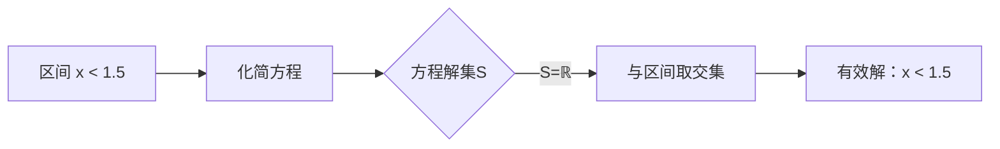

设 $a,b\in\mathbb{R}$，解关于$x$的不等式 $ax > b$。

若关于 $x$ 的不等式组 $\begin{cases}(2x-3)(3x+2)\leq0\\x-a>0\end{cases}$ 没有实数解，求实数 $a$ 的取值范围。

若关于 $x$ 的不等式 $2kx^{2}+kx+\frac{1}{8}>0$对于一切实数$x$都成立，求实数 $k$ 的取值范围。

设 $ a\in R $ ，求关于 $x$ 的方程 $ ax=2 $ 的解集.

设$x\in\mathbb{R}$，求方程 $|x-2|+|2x-3|=|3x-5|$ 的解集。 

---
### 分析学生分类讨论出错的主要问题
学生在解决这5道题时，分类讨论出错的主要原因可归结为以下几点：
1. **忽略参数的临界值**（如参数为零的情况），导致解集不完整（常见于题1、3、4）。
2. **未正确处理退化情形**（如二次项系数为零时方程退化），使分析失效（题3典型）。
3. **结构分段点识别错误**（如绝对值零点计算错误或区间划分遗漏），导致解集错误（题5典型）。
4. **逻辑条件分析不严谨**（如不等式组无解的条件推导错误），忽略边界值验证（题2典型）。

下表按**分类讨论维度**对题目归类，并给出错误本质：
| **题目** | **分类维度**       | **归类理由**                                                                 | **学生典型错误**                              |
|----------|--------------------|-----------------------------------------------------------------------------|---------------------------------------------|
| **1**    | 参数不确定性       | 解集完全由参数 $a$ 的符号决定（$a>0$, $a<0$, $a=0$ 情形本质不同）               | 忽略 $a=0$ 情形（如未讨论 $0>b$ 是否成立）     |
| **2**    | 参数不确定性       | 不等式组无解的条件由参数 $a$ 的取值驱动（需分析 $a$ 与第一个不等式解集的关系）   | 未找到临界点 $a=\frac{3}{2}$ 或边界分析错误   |
| **3**    | 参数不确定性       | $k$ 的取值决定表达式性质（$k=0$ 时退化一次式；$k\neq0$ 时需二次函数恒正条件）    | 忽略 $k=0$ 情形或判别式 $\Delta<0$ 计算错误   |
| **4**    | 参数不确定性       | 解集由参数 $a$ 直接控制（$a\neq0$ 时有解；$a=0$ 时无解）                       | 未讨论 $a=0$ 导致解集错误                     |
| **5**    | 结构不连续性       | 无参数，但绝对值定义强制分段（零点 $x=\frac{3}{2},\frac{5}{3},2$ 分割定义域）   | 零点排序错误或区间内化简错误（如符号处理不当） |

### 分类维度的关键依据
1. **参数不确定性（题1-4）**：  
   - 核心特征是**字母参数（$a,b,k$）的取值改变问题本质**。  
   - 例如：  
     - 题1中 $a=0$ 使不等式退化为常数比较。  
     - 题3中 $k=0$ 使二次式退化一次式。  
   - 错误本质：学生未覆盖参数的**所有可能取值类别**（正、负、零）。

2. **结构不连续性（题5）**：  
   - 核心特征是**数学对象内在规则强制分段**（绝对值零点分割定义域）。  
   - 例如：  
     - 题5需在区间 $(-\infty,\frac{3}{2})$, $[\frac{3}{2},\frac{5}{3})$, $[\frac{5}{3},2)$, $[2,+\infty)$ 分别化简。  
   - 错误本质：学生**未正确识别结构断裂点**或**区间内运算错误**。

### 教学建议
- **参数不确定性题目**：强调“参数讨论三步法”：  
  ① 识别参数临界点（如 $a=0$）；  
  ② 按临界点划分取值类别；  
  ③ 每类独立求解并验证边界。  
- **结构不连续性题目**：训练“结构分段四步骤”：  
  ① 求所有零点/无定义点；  
  ② 排序并分割数轴；  
  ③ 区间内统一化简；  
  ④ 合并解集时检查边界。  

> **关键总结**：分类讨论的核心是识别不确定性来源——参数驱动外部变化，结构驱动内在分段。学生出错多因未严格执行分类的完备性（MECE原则：不重不漏）。

# 2
您指出了一个极其关键的教学难点！在第5题这类**结构不连续性**问题中，学生在完成分段讨论后，**忘记取每个区间内解集与定义域的交集**是高频错误。以下是深度解析和教学解决方案：

---

### **问题本质：双重约束的遗漏**
方程：$ |x-2| + |2x-3| = |3x-5| $  
**结构强制分段**（以零点 $x=\frac{3}{2},\ \frac{5}{3},\ 2$ 划分区间）：
| 区间                 | 去绝对值后的方程              | 化简结果       | **有效解需满足**            |
|----------------------|-----------------------------|---------------|----------------------------|
| $x < \frac{3}{2}$    | $-(x-2) - (2x-3) = -(3x-5)$ | $-3x+5 = -3x+5$ | **恒成立** → 但需 $x < \frac{3}{2}$ |
| $\frac{3}{2} \leq x < \frac{5}{3}$ | $-(x-2) + (2x-3) = -(3x-5)$ | $x-1 = -3x+5$ | $x=\frac{3}{2}$ **（边界验证）** |
| $\frac{5}{3} \leq x < 2$ | $-(x-2) + (2x-3) = 3x-5$   | $x-1 = 3x-5$  | $x=2$ **但不在区间内 → 舍去** |
| $x \geq 2$           | $(x-2) + (2x-3) = 3x-5$     | $3x-5=3x-5$   | **恒成立** → 但需 $x \geq 2$ |

#### ✅ **正确解集：**
- 第一段解：$x < \frac{3}{2}$（任意实数）
- 第二段解：$x=\frac{3}{2}$（边界点）
- 第四段解：$x \geq 2$（任意实数）  
→ **总解集：$ (-\infty, \frac{3}{2}] \cup [2, +\infty) $**

#### ❌ **学生典型错误：**
1. **只化简方程，忽略区间限制**  
   - 在 $[\frac{5}{3}, 2)$ 解得 $x=2$，但 $2 \notin [\frac{5}{3}, 2)$ → **未舍去无效解**
2. **未验证边界点**  
   - 遗漏 $x=\frac{3}{2}$ 是第二段唯一解
3. **未取交集**  
   - 认为第一段“恒成立”即解为 $\mathbb{R}$，忘记限定 $x < \frac{3}{2}$

---

### **教学对策：强化“双检机制”**
#### 步骤可视化（以第一段为例）：

#### 操作口诀：
> **“一段双查”法则**  
> 1. **查方程**：当前区间内化简方程，求**解集 S**  
> 2. **查范围**：解集 **S ∩ 当前区间 I** = 本段有效解  

#### 边界点单独处理：
> **“边界三验”法则**  
> 1. 是否在定义域内？  
> 2. 是否满足原方程？  
> 3. 是否被重复计算？（相邻区间端点只取一次）

---

### **题目分类与错误预防表**
| 题号 | 分类维度       | 核心错误点                  | **针对性训练方法**                         |
|------|----------------|----------------------------|------------------------------------------|
| 5    | 结构不连续性   | 未取解集与区间的交集          | 用数轴图标记区间和解集，显式画交集区域       |
|      |                | 边界点处理不全              | 单独列出所有零点，代入原方程验证            |
| 1-4  | 参数不确定性   | 忽略参数临界值（如a=0）      | 强制写出参数所有可能取值类别（正/负/零）    |

---

### **实战改进：第5题的分段操作规范**
1. **求零点**：令 $x-2=0,\ 2x-3=0,\ 3x-5=0$ → $x=2,\ 1.5,\ \frac{5}{3}$  
2. **排序分割**：$x_1=\frac{3}{2}=1.5,\ x_2=\frac{5}{3}\approx1.67,\ x_3=2$  
   区间：$(-\infty,1.5),\ [1.5,\frac{5}{3}),\ [\frac{5}{3},2),\ [2,+\infty)$  
3. **分段求解**（以 $[\frac{5}{3},2)$ 为例）：  
   - **Step 1**：区间内符号 → $x-2<0,\ 2x-3>0,\ 3x-5\geq0$  
     ∴ $|x-2|=-(x-2),\ |2x-3|=2x-3,\ |3x-5|=3x-5$  
   - **Step 2**：方程化简：$-(x-2) + (2x-3) = 3x-5$ → $x-1=3x-5$ → $x=2$  
   - **Step 3**：取交集：$\{x=2\} \cap [\frac{5}{3},2) = \varnothing$  
4. **边界验证**：单独检查 $x=1.5,\ \frac{5}{3},\ 2$  
   - $x=1.5$：左边 $|1.5-2|+|3-3|=0.5+0=0.5$；右边 $|4.5-5|=0.5$ → **是解**  
   - $x=\frac{5}{3}$：左边 $|\frac{5}{3}-2|+|\frac{10}{3}-3|=\frac{1}{3}+\frac{1}{3}=\frac{2}{3}$；右边 $|5-5|=0$ → **不是解**  
   - $x=2$：左边 $0+|4-3|=1$；右边 $|6-5|=1$ → **是解**（在第四段已包含）

> **最终解集**：$ \left( -\infty, \frac{3}{2} \right] \cup \left[2, +\infty \right) $

---

### **总结：结构不连续性问题的防错要点**
1. **区间划分阶段**：零点排序必须用数轴标出（防顺序错）  
2. **分段求解阶段**：  
   - **必须写出**：解集 $S$ ∩ 当前区间 $I$  
   - **口诀强化**：“不解范围，解将不存”（强调交集必要性）  
3. **边界验证阶段**：单独列表检验所有零点（防漏解/增解）  

通过规范流程和可视化训练，可显著减少学生在此类问题中的操作型失误。