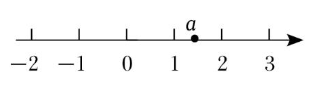
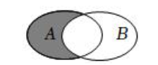
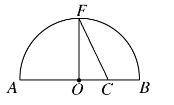
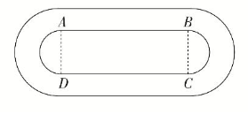

## 2025-2026学年高一数学上学期第一次月考卷

> [!NOTE]
>
> (考试时间：120分钟 试卷满分：150分)
> **注意事项**：
>
> 1. 答卷前，考生务必将自己的姓名、准考证号填写在答题卡上。
> 2. 回答选择题时，选出每小题答案后，用铅笔把答题卡上对应题目的答案标号涂黑。如需改动，用橡皮擦干净后，再选涂其他答案标号。回答非选择题时，将答案写在答题卡上。写在本试卷上无效。
> 3. 考试结束后，将本试卷和答题卡一并交回。
> 4. 测试范围：**沪教版2020必修第一册第一章~第二章**。
> 5. 难度系数：0.65。
> 6. 🔴怪题；⭐ 考点不确定；🚩 好题；⚠️用到后续的知识；🟠 预计会做错
>

### 一、填空题（本大题共有12题，满分54分，第1-6题每题4分，第7-12题每题5分）

1. 实数 $a$ 在数轴上的位置如图所示，化简：$|a-2|+ \sqrt{a^2-2a+1}=$\_\_\_\_\_\_\_\_     
   
   
2. 已知集合 $P=\{1,2\}$，$Q=\{2, 3\}$，若 $M=\{x\mid x\in P, \text{且}\ x\notin Q\}$，则 $M=$\_\_\_\_\_\_\_\_

3. 已知集合 $A=\{x\mid -2<x<2\}$，$B=\{-2, 0, 1, 2\}$，则 $A\cap B=$\_\_\_\_\_\_\_\_

4. 若 $M = (x-3)^2$，$N = (x-2)(x-4)$，则 $M,N$ 的大小关系是 $M$\_\_\_\_\_\_\_\_$N$

5. 若关于 $x$ 的不等式 $ax^2 + bx + 2 > 0$ 的解集是 $(-2, 3)$，则 $a+b=$\_\_\_\_\_\_\_\_

6. 已知集合 $A=\{x\mid 1<x<2\}$，$B=\{x\mid 1<x<a\}$，其中 $a$ 为实常数。若 $B\subseteq A$，则实数 $a$ 的取值范围是\_\_\_\_\_\_\_\_

7. 已知集合 $A = \{0, 1, 2, 3, 4\}$，$B = \{x \mid x > m\}$，若 $A\cap(\overline{B})$ 有三个元素，则实数 $m$ 的取值范围是\_\_\_\_\_\_\_\_

8. 我国经典数学名著《九章算术》中有这样的一道题：**今有出钱五百七十六，买竹七十八，欲其大小率之，问各几何？**其意是，“**今有人出钱 576，买竹子 78 根，拟分大、小两种竹子为单位进行计算，每根大竹子比小竹子贵 1 钱，问买大、小竹子各多少根**？每种竹子单价各是多少钱？”则在这个问题中大竹子的单价可能为\_\_\_\_\_\_\_\_钱。

9. 已知集合 $A = \{0, 1, 2, 3, 4, 5\}$，集合 $B = \{1, 3, 5, 7, 9\}$，则文氏图（Venn图）中阴影部分表示的集合中元素的个数为\_\_\_\_\_\_\_\_
   

10. 🚩🟠若对任意 $x > 0$，$\dfrac{x}{x^2 + 3x + 1} \leq a$ 恒成立，则 $a$ 的取值范围是\_\_\_\_\_\_\_\_

11. 关于 $x$ 的方程 $|x-3| + |x-5| = 2$ 的解集为\_\_\_\_\_\_\_\_

12. 李老师在黑板上写下一个等式 $\dfrac{1}{(\ )}+\dfrac{9}{【\ 】} = 1$，请同学们在两个括号 $(\ )$，$【\ 】$ 内分别填写两个正数，使得等号成立，哪个同学所填的两个数之和最小，则该同学获得**优胜奖**；小明同学要想确保获得**优胜奖**，他应该在 $(\ )$ 括号内填上数字\_\_\_\_\_\_\_\_

### 二、选择题（本题共有4题，满分18分，第13-14题每题4分，第15-16题每题5分；每题有且只有一个正确选项）

13. 用反证法证明“已知 $x, y \in \mathbb{R}$, $x^2 + y^2 = 0$，求证：$x = y = 0$”时，应假设（ ）  
      A. $x \neq y \neq 0$；B. $x = y \neq 0$；C. $x \neq 0$ 且 $y \neq 0$；D. $x \neq 0$ 或 $y \neq 0$
    
14. 已知集合 $A = \{x \mid x^2 - x - 2 < 0\}$，$B = \{x \mid 2a - 1 < x < a + 3\}$。若“$x \in A$”是“$x \in B$”的充分不必要条件，则 $a$ 的取值范围为（ ）  
      A. $[-1, 0]$；B. $(-1, 0)$；C. $[4, +\infty)$；D. $(4, +\infty)$
    
15. 毛泽东同志在《清平乐·六盘山》中的两句诗为“不到长城非好汉，屈指行程二万”，假设诗句的前一句为真命题，则“到长城”是“好汉”的（ ）  
      A. 充分不必要条件；B. 必要不充分条件；C. 充要条件；D. 既不充分也不必要条件
    
16. 🚩《几何原本》第二卷中的几何代数法（以几何方法研究代数问题）成了后世西方数学家处理问题的重要依据，通过这一原理，很多代数的定理都能够通过图形实现证明，并称之为无字证明。现有如图所示的图形，点 $F$ 在半圆 $O$ 上，点 $C$ 在直径 $AB$ 上，且 $OF \perp AB$。设 $AC = a$，$BC = b$，则该图形可以完成的无字证明为（ ）  
      A. $\frac{a + b}{2} \geq \sqrt{ab} \quad (a > 0, b > 0)$；B. $a^2 + b^2 \geq 2ab \quad (a > 0, b > 0)$  
      C. $\frac{2ab}{a + b} \leq \sqrt{ab} \quad (a > 0, b > 0)$；D. $\frac{a + b}{2} = \sqrt{\frac{a^2 + b^2}{2}} \quad (a > 0, b > 0)$
    

### 三、解答题（本大题共有5题，满分78分，第17-19题每题14分，第20、21题每题18分。）

17. 已知集合 $A = \{x \mid -1 \leq x \leq 3\}$，集合 $B = \{x \mid m - 2 \leq x \leq m + 2, m \in \mathbb{R}\}$。  
      (1) 若 $A \cap B = \{x \mid 0 \leq x \leq 3\}$，求实数 $m$ 的值；  
      (2) 若 $A \subseteq \bar{B}$，求实数 $m$ 的取值范围。

18. 设集合 $A = \{x \mid -3 < x < 1\}$，集合 $B = \{x \mid |x + a| < 1\}$。  
      (1) 若 $a = 3$，求 $A \cup B$；  
      (2) 设 $p： x \in A$，$q： x \in B$，若 $p$ 是 $q$ 成立的必要不充分条件，求实数 $a$ 的取值范围。

19. 某学校设计如图所示的环状田径场，该田径场的内圈由两条平行线段（图中的 $AB$，$DC$）和两个半圆构成，设 $AB = x$ m，且 $x \geq 80$。
      
      (1) 若图中矩形 $ABCD$ 的面积为 $\frac{16200}{\pi}$ m$^2$，则当 $x$ 取何值时，内圈的周长最小？  
      (2) 若内圈的周长为 $400$ m，则当 $x$ 取何值时，矩形 $ABCD$ 的面积最大？

20. 已知函数 $f(x) = ax^2 - 10x + 4b$。  
      (1) 当 $a = 1$，$b = 4$ 时，求不等式 $f(x) \geq 0$ 的解集；  
      (2) 若关于 $x$ 的不等式 $f(x) < 0$ 的解集为 $(a, b)$，求实数 $a$，$b$ 的值；  
      (3) 若 $f(1) = 0$，且 $a > 0$，$b > 0$，则当 $a$，$b$ 取何值时，$\frac{1}{a} + \frac{1}{b}$ 值最小？最小值是多少？

21. 设 $A$ 是实数集的非空子集，称集合 $B = \{uv \mid u, v \in A \text{ 且 } u \neq v\}$ 为集合 $A$ 的生成集。  
      (1) 当 $A = \{2, 3, 5\}$ 时，写出集合 $A$ 的生成集 $B$；  
      (2) 🟠若 $A$ 是由 $5$ 个正实数构成的集合，求其生成集 $B$ 中元素个数的最小值；  
      (3) 🟠判断是否存在 $4$ 个正实数构成的集合 $A$，使其生成集 $B = \{2, 3, 5, 6, 10, 16\}$，并说明理由。