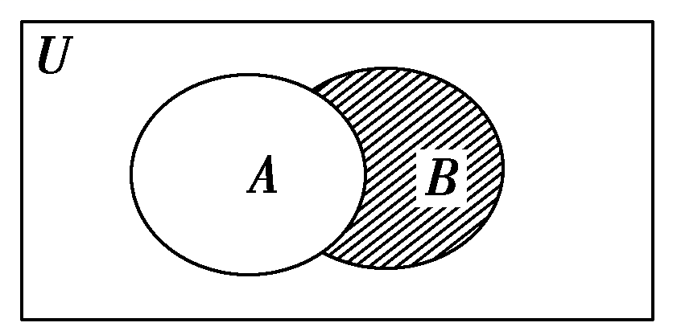

## 第一章 集合与逻辑【过关测试】
### 一、填空题（本大题共有12题，满分54分，第1-6题每题4分，第7-12题每题5分）考生应在答题纸的相应位置直接填写结果．

1.（崇明区2020届高三上期末（一模））已知集合$A＝\{0，1，2，3\}$，$B＝\{x| 0＜x≤2\}$，则$A∩B$＝\_\_\_\_\_\_\_\_　　．

> [!TIP]
>
> 1. 集合的表示法，教材第 4 页 
> 2. 需要问老师：什么时候可以用**区间法**表示集合？
> 3. 教材第 8 页，集合的运算，请问集合运算的结果是什么？

2．下列集合中，不同于另外三个集合的序号是\_\_\_\_\_\_\_\_.

①$\{x | x = 1\}$；② $\{y | (y-1)^2 = 0\}$；③$\{x=1\}$；④$\{1\}$

> [!TIP]
>
> 1. 集合的表示法，教材第 4 页 
> 2. 在集合论中，通常使用 $\{元素\}$  或 $\{变量∣条件\}$ 的形式
> 3. 此题需要问老师

3．命题“如果 $x+y>0$，则 $x >0$ 或 $y >0$ ”的逆否命题为\_\_\_\_\_\_\_\_.

> [!TIP]
>
> 1. 一些常用的否定形式，教材第 17 页 ，**需要背诵**
> 2. 当采用**表述法**表示集合时，对于 $ x＝\{ x | x满足性质p\}$
>    1. 如果 $x$ 需要**同时满足多个**性质 $p_1,p_2$，应该如何写？
>    1. 如果 $x$ 需要**只需要满足任何一个**性质 $p_1,p_2$，应该如何写？

4．已知集合  $A=\{x | x^2 -x -6 ≤ 0\}$，$B = \{x \mid \lvert x \rvert ≤2 \}$，则$ A\cup B = $\_\_\_\_\_\_.

> 第二次做仍然错

5．集合 $\{2a, a^2 - a\}$ 中实数 $a$ 的取值范围是\_\_\_\_\_\_\_\_

> [!TIP]
>
> 1. 教材第 20 页的内容提要，集合有有哪些特征？

> 第二次做仍然错

6．用列举法表示集合 $\{ x| x+y=4 ,  x ∈  \mathbb{N}, y∈  \mathbb{N}^* \} = $\_\_\_\_\_\_\_\_

> [!TIP]
>
> 1. 教材第 3 页，常用集合的符号
> 2. 补充一个正整数集（所有正整数组成的集合）：$\mathbb{N}^*$ 或 $\mathbb{N}^+$（$^*$ 或 $^+$ 表示“非零/正”）

7．已知集合中 $ A = \{ x \mid ax^{2} - 3x + 2 = 0 \}$ 至多有一个元素，则 $a$ 的取值范围是   

> [!TIP]
>
> 1. 一元二次函数，根与系数的关系
> 2. 一定需要是 2 次函数吗？

8．用集合的描述法表示：除 $(3,4)$ 这个点之外，坐标平面上的所有点组成的集合是\_\_\_\_\_\_\_\_

9．命题“若 $a>b$，则 $a^2>b^2$ ”为\_\_\_\_\_\_\_\_命题（填“真”或“假”）.

10．若 $x>3$ 是 $ x > a$ 的充分不必要条件，则实数 $a$ 的取值范围是 \_\_\_\__.

> [!TIP]
>
> 在问题中，“$ x > 3$ 是$  x > a$ 的充分不必要条件”要求：
>  - **充分性**：$ x > 3 \Rightarrow x > a$。
>  - **不必要性**：$ x > a \not\Rightarrow x > 3$。

> 不能确定是否理解

11．如果集合 $M=\{(x,y) | x+y<0,xy>0\}$, $P=\{(x,y)|x<0,y<0\}$,那么 $M$ 与 $P$ 的关系为\_\_\_\__\_\_\_\__.

12．$A=\{ x \mid -5 < x < 2\}$，$B = \{ x \mid x= y+1, y \in A \}$，则$A \cap B = $\_\_\_\__.

> [!NOTE]
>
> 1. 需要问老师：
>    1. 什么时候可以用**区间法**表示集合？
>    2. 是不是最后不用**区间法**

### 二、选择题（本大题共有4题，满分20分，每题5分）每题有且只有一个正确选项，考生应在答题纸的相应位置，将代表正确选项的小方格涂黑．

13、 设 $A$，$B$  是非空集合，定义：$A \times B = \{x \mid x \in A \cup B \space 且 \space x \notin A \cap B\} $，已知： $A = \{ x \mid y = \sqrt{2x - x^2} \}$，$B = \{ x \mid x > 1 \}$，则 $A \times B$ 等于（  ）
A.  $[0,1] \cup (2,+\infty)$，B. $[0,1) \cup (2,+\infty)$,   C. $[0,1]$，D. $[0,2]$

14、若 $P＝\{x \mid x＜1\}$，$Q＝\{x \mid x＞－1\}$，则(　　)

A．$P \subseteq  Q$
B．$Q \subseteq  P$
C．$C_RP \subseteq Q$ 
D．$Q \subseteq C_RP$

15、（普陀区2020届高三上期末（一模））设集合 $A = \{x \mid \lvert x-a \rvert = 1\}$，$B=\{1, -3, b\}$，若 $A \subseteq  B$，则对应的实数对 $(a,b)$ 有（ ） 
 A.1 对；B.2 对； C. 3 对； D. 4 对

16、已知全集 $U＝\{1,2,3,4,5,6\}$，集合 $A＝\{2,3,4\}$，集合$B＝\{2,4,5\}$，则右图中的阴影部分表示( )

A．{2,4}；B．{1,3}；C．{5}；D．{2,3,4,5}

### 三、解答题（本大题共有5题，满分76分）解答下列各题必须在答题纸的相应位置写出必要的步骤．

17．（1）已知集合  $A＝\{2,4,6\}$，写出集合的所有子集

18.用描述法表示下列集合：

（1）小于1500的正偶数组成的集合；（2）所有矩形组成的集合.

19．已知集合 $S$ 满足条件：若 $\alpha \in S$，则 $\dfrac{1+\alpha}{1-\alpha} \in S \quad (\alpha \neq 0, \alpha \neq \pm 1)$。若 $ 3 \in S$，试把集合 $S$ 中的所有元素都求出来．

20．（1）求满足 $\{1,3\} \cup A = \{1,3,5\}$ 的集合 $A$；

（2）若$A = \{x \mid x^2-3x +2 = 0\}$，$B=\{x \mid mx-1 = 0\}$，求当 $B \subseteq A$ 时，实数 $m$ 的取值集合.

21．已知集合 $A=\{ x \mid \dfrac{1}{2} < 2^x <8\}$，$B=\{x \mid 1-m \leqslant x <2m-3\}$

（1）当时 $x \in  \mathbf{Z}$，写出集合 $A$ 的所有非空子集；

（2）若 $A \cap B = \{x \mid -1<x<1\} $，求 $m$ 的值.