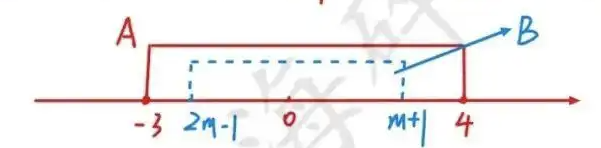
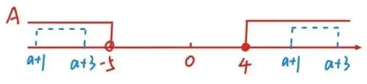
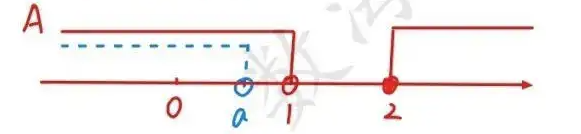

# 常见错题

## 子集的个数
> 数学练习卷——10 

1. **原题**：已知集合 $P = \{2, 4, 6, 8\}$，则集合 $P$ 的真子集的个数是（ ）  
   **正确答案**：15  
   **解析**：含有 $n$ 个元素的集合的真子集个数为 $2^n - 1$。$P$ 有 4 个元素，故真子集个数为 $2^4 - 1 = 15$，选 C。

8. **原题**：集合 $\{x \in \mathbb{N} \mid \frac{6}{6 - x} \in \mathbb{N}\}$ 的子集个数为（ ）  
   **正确答案**：16  
   **解析**：  
   - $6 - x$ 是 6 的正因数，即 $6 - x = 1, 2, 3, 6$，解得 $x = 5, 4, 3, 0$，集合有 4 个元素。  
   - 子集个数为 $2^4 = 16$，选 D。
## 求交集

已知 $a > b > 0$，求 $ A\cap B $
1. $: A = \{ x > a \} $， $B = \{ x > b\} $
2. $: A = \{ x < a \} $， $B = \{ x < b\} $
3. $: A = \{ x > -a \} $， $B = \{ x > -b\} $
4. $: A = \{ x < -a \} $， $B = \{ x < -b\} $
## 集合运算中的参数影响

> [!TIP]
>
> **子集只看元素在不在，不看端点存不存在**

> 求 m 的范围

### 题目1：已知集合 $A = \{x|-3\leq x\leq4\}$，$B = \{x|2m - 1 < x < m + 1\}$ 且 $B\subseteq A$，求实数 $m$ 的取值范围。
**解题思路**：  

集合包含关系$B\subseteq A$需分两种情况讨论：  

1. **当 $B=\varnothing$ 时**：空集是任何集合的子集，因此需满足 $2m - 1 \geq m + 1$，解得 $m \geq 2$。  
2. **当 $B\neq\varnothing$ 时**：此时 $2m - 1 < m + 1$（即 $m < 2$），且 $B$ 的所有元素必须在 $A$ 内。因此需满足：  $2m - 1 \geq -3 \quad \text{且} \quad m + 1 \leq 4$， 解得 $-1 \leq m \leq 3$。结合 $m < 2$，得 $-1 \leq m < 2$。  

**结论**：综合两种情况，$m$ 的取值范围是 $m \geq -1$。

**易错点**：漏掉 $B$ 为空集的情况（导致漏解）、分类后答案未取并集（误取交集）。  

**变化**：如果  $A = \{x|-3\leq x\leq4\}$ 改成  $A = \{x|-3<  x < 4\}$ 结论是？

### 变式1- 题目2：已知集合 $A = \{x|x\geq 4 \text{ 或 } x < -5\}$，$B = \{x|a + 1 \leq x \leq a + 3\}$，若 $B\subseteq A$，求 $a$ 的取值范围。

**变式题差异**：无需讨论空集，因 $B$ 的区间端点 $a+1 < a+3$ 恒成立（$B$ 必非空）；  

**解题思路**：  

由于 $a + 1 < a + 3$ 恒成立，$B$ 非空。需分两种情况讨论 $B$ 完全包含在 $A$ 的哪一部分：  

1. **$B$ 在 $A$ 的左半部分**：即 $B$ 的所有元素 $x < -5$，因此 $a + 3 < -5$，解得 $a < -8$。  
2. **$B$ 在 $A$ **：即$B$的所有元素 $x \geq 4$，因此 $a + 1 \geq 4$，解得 $a \geq 3$。  

**结论**：$a$ 的取值范围是$a < -8$ 或 $a \geq 3$。

**易错点检验**：若 $a = -8$，则 $B = \{x|-7 \leq x \leq -5\}$，但 $A$ 中 $x < -5$ 不包含$-5$，因此 $a = -8$ 不满足，故 $a < -8$。  

### 变式2 - 题目3：已知 $p : A = \{x|x < 1 \text{ 或 } x \geq 2\}$，$q:B = \{x|x - a < 0\}$，若 $p$ 是 $q$ 的必要不充分条件，求实数 $a$ 的取值范围。

**变式题差异**：结合充分必要条件，$p$ 是 $q$ 的必要不充分条件等价于 $q \Rightarrow p$ 且 $p \nRightarrow q$，需转化为集合包含关系 $B \subseteq A$且$A \nsubseteq B$，即 $ B \subsetneqq A $。  

**解题思路**：  

1. $p$ 是 $q$ 的**必要不充分条件**，即 $q \Rightarrow p$（$B \subseteq A$），但 $p \nRightarrow q$（$A \nsubseteq B$） ，就是 $B \subsetneqq A$
2. 集合 $B = \{x|x < a\}$，需满足 $B \subsetneqq A$。由于 $A$ 是 $x < 1$ 或 $x \geq 2$，$B$ 必须完全包含在 $x < 1$ 的部分（否则若 $a > 2$，则 $B$ 中存在 $1 \leq x < a$ 的部分，而这部分不属于 $A$）。因此 $a \leq 1$。  

**结论**：$a$ 的取值范围是 $a \leq 1$。

**变化**：$p : A = \{x|x < 1 \text{ 或 } x \geq 2\}$  改成  $p : A = \{x|x < 1\}$，结论如何？

----

1 已知集合 $A = \{x \mid -3 \leq x \leq 4\}$，$B = \{x \mid 1 < x < m\} (m > 1)$，且 $B \subseteq A$，则实数 $m$ 的取值范围是  

2  **设全集 $ U = \mathbb{R} $，集合 $p : A = \{x \mid m-2 < x < m+2\} $，$q: B = \{x \mid -4 < x < 4\} $**，若 $p$ 是 $q$ 的充分不必要条件，求 $m$ 的取值范围

