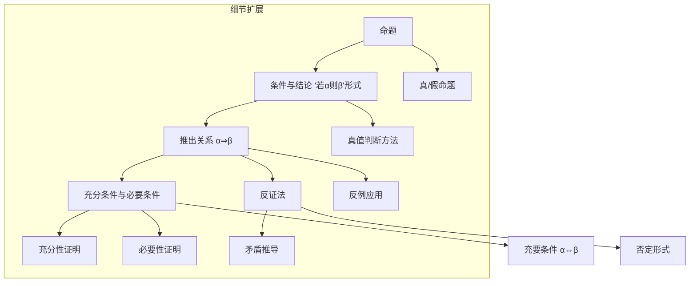

## 1.2 常用逻辑用语

本章节内容分为三个主要部分：命题与推出关系（1.2.1）、充分条件与必要条件（1.2.2）、反证法（1.2.3）。以下基于用户提供的6张图片内容进行总结，包含指定部分：新知识点的Mermaid流程图、细致总结、例题分析、练习分析、练习与例题对应关系、更多否定形式。

### 1. 新知识点整体结构
新知识点主要包括：

1. 命题的定义与性质、条件与结论形式、推出关系、充分/必要/充要条件、反证法。
2. 整体结构遵循章节逻辑顺序：先定义命题基础，再引入条件关系和逻辑推导，最后扩展到证明方法。

- **解释**： 
  - 流程从核心概念“命题”开始，延伸至具体形式（“若α则β”），再引入逻辑关系（推出关系、充分/必要/充要条件），最后到证明工具（反证法）。
  - “细节扩展”包含子知识点，如真值判断、反例、矛盾推导等。
  - 箭头表示依赖关系：例如，理解推出关系是学习充要条件的基础，反证法依赖于推出关系和否定形式。

### 2. 新知识点总结
#### 1. 命题
- **定义**：用自然语言、符号或式子表达，且能判断真假的语句（通常为陈述句）。
- **分类**：
  - 真命题：判断为真的命题（如“4能被2整除”）。
  - 假命题：判断为假的命题（如“3能被2整除”）。
- **非命题**：
  - 疑问句（如“你是高一学生吗？”）；
  - 祈使句（如“请起立”）；
  - 含可变对象的陈述句（如“x>3”，因x未确定无法判断真假）。

#### 2. “若α，则β”形式的命题
- **结构**：α为条件，β为结论（需保持原命题含义）。
- **推出关系α⇒β**：
  - 定义：所有满足α的对象都满足β（用集合表示为α的解集⊆β的解集）。
  - 证明：需严格推导（如例1中“个位是5的自然数能被5整除”）。
- **传递性**：若α⇒β且β⇒γ，则α⇒γ（逻辑推理的基础）。

#### 3. 充分条件与必要条件
- **充分条件**：若α⇒β，则α是β的充分条件（“有α足够推出β”）。
- **必要条件**：若α⇒β，则β是α的必要条件（“无β则必无α”）。
- **示例**：“等腰三角形”是“两底角相等”的充分条件；“两底角相等”是“对顶角相等”的必要条件。

#### 4. 充要条件
- **定义**：若α⇒β且β⇒α，则α是β的充要条件（记作α⇔β，读作“α当且仅当β”）。
- **本质**：α与β等价（如“三角形两内角相等”与“三角形两边相等”）。

#### 5. 反证法
- **步骤**：
  1. 假设结论不成立（否定结论）；
  2. 通过逻辑推理导出矛盾（与已知条件、定理、公理等矛盾）；
  3. 结论：原命题成立。
- **关键**：正确否定结论（利用表1-2的否定形式）。
- **应用场景**：证明唯一性（如例 4 中 $m=1$ 的唯一性）、无理数（如例 7 的 $\sqrt2$ ）、不等式（如例 6 的$x+y>2⇒x>1或y>1$）。

### 3. 例题分析
本章共有**7个例题**，均基于旧知识点引入新知识。旧知识点主要在初中数学或高中前期课程引入（如初中代数、几何、集合基础）。具体如下：

| 例题 | 新知识点应用 | 涉及旧知识点 | 引入时间 |
|------|--------------|---------------|----------|
| 例1 | 判断7个语句是否为命题及真假 | 整除（如"4能被2整除"）、三角形相似、补角、全等三角形 | 初中代数（7-8年级） |
| 例2 | 改写**若 α 则 β** 形式，判断 $α ⇒ β$ 是否成立 | 等腰三角形性质、素数定义、对顶角性质 | 初中几何（7-9年级） |
| 例3 | 判断  α 是 β 的充分/必要/充要条件 | 正方形和矩形性质、有理数定义 | 初中代数（8-9年级） |
| 例4 | 证明充要条件，应用充分性和必要性 | 集合操作（交集、子集）、元素性质 | 高中第一章集合（高一上） |
| 例5 | 反证法证明若 $n²$ 是偶数，则 $n$ 是偶数 | 奇偶性定义（奇数=2k+1）、平方运算 | 初中代数（7年级） |
| 例6 | 反证法证明若 $x+y>2$，则$x>1$ 或 $y>1$ | 逻辑联结词**或**的含义 |  |
| 例7 | 反证法证明 $\sqrt2$ 无理数 | 有理数定义（可表示为互素分数）、反证法步骤 | 初中代数（8-9年级） |

- **总结**：
  - 所有例题都依赖旧知识点，重点是将新概念（如推出关系、反证法）应用到熟悉内容（如几何、代数、集合）。
  - 引入时间基于标准课程安排：初中数学打基础，高中第一章集合在 1.2 之前引入。

### 4. 练习分析
本章共有**3组练习**（练习1.2(1)、1.2(2)、1.2(3)），总计**7题**（练习1.2(1)有3题但含子问，实际训练点约10个）。旧知识点同例题，主要来自初中。具体如下：

| 练习编号 | 练习内容 | 新知识点应用 | 涉及旧知识点 | 引入时间 |
|----------|----------|--------------|---------------|----------|
| **练习1.2(1)** | - 题1：举生活命题并判断 - 题2：判断命题真假（4小问） - 题3：用α ⇒ β表示关系（2小问） | 命题定义、真值判断、推出关系 | 偶数、素数、集合真子集、三角形性质 | 初中代数/几何 |
| **练习1.2(2)** | - 题1：填空条件关系（3小问） - 题2：求m范围 | 充分/必要/充要条件判断 | 平行四边形、矩形性质、不等式 | 初中几何/代数 |
| **练习1.2(3)** | - 题1：反证法证明奇偶性 - 题2：反证法证明实数关系 | 反证法应用 | 整数立方、实数比较 | 初中代数 |

- **总结**：
  - 练习总量适中（7题），侧重应用新知识点到具体问题。
  - 旧知识点覆盖广：代数（整除、不等式）、几何（三角形、四边形）、集合（真子集）、逻辑基础。
  - 引入时间：初中数学。

### 5. 练习与例题对应关系
以下列出每个练习可参考的例题，便于学生根据例题解法完成练习：

| 练习编号及题号 | 可参考例题 | 对应原因（知识点应用） | 具体帮助点 |
|----------------|------------|------------------------|-------------|
| **练习1.2(1)题1**（举生活命题） | 例1 | 如何判断语句是否为命题及真假 | 参考例1中语句(1)-(7)的分析方法 |
| **练习1.2(1)题2**（判断真假） | 例1 | 使用反例证明假命题 | 参考例1语句(2)和(4)的反例构造 |
| **练习1.2(1)题3**（α ⇒ β表示） | 例2 | 改写命题形式并判断推出关系 | 参考例2(1)-(3)的格式 |
| **练习1.2(2)题1**（填空条件） | 例3 | 判断充分/必要/充要条件 | 参考例3(1)-(2)的推理过程 |
| **练习1.2(2)题2**（求m范围） | 例4 | 应用充分条件定义解决集合或不等式 | 参考例4的充分性和必要性证明逻辑 |
| **练习1.2(3)题1**（反证法奇偶性） | 例5 | 反证法证明整数奇偶性 | 参考例5的假设和矛盾推导 |
| **练习1.2(3)题2**（反证法实数） | 例6 | 反证法证明逻辑关系 | 参考例6的否定形式应用和矛盾建立 |

- **总结**：每个练习都直接对应1-2个例题，学生可依葫芦画瓢完成。例如，反证法练习（练习1.2(3)）对应例5-6；条件关系填空（练习1.2(2)）对应例3。

### 6. 更多否定形式
基于表1-2（第5张图提供的常见否定形式），扩展更多数学中常用的否定形式。表1-2列出了5种基本类型，以下是额外补充（共10个例子），覆盖常见场景：

| 陈述句a | a的否定形式 |
|---------|-------------|
| 所有x∈A满足P(x) | 存在x∈A不满足P(x) |
| 存在x∈A满足P(x) | 所有x∈A不满足P(x) |
| x=m（m为常数） | x≠m |
| x≥k | x<k |
| x∈A∩B | x∉A 或 x∉B |
| x∈A∪B | x∉A 且 x∉B |
| P且Q（P∧Q） | 非P或非Q（¬P∨¬Q） |
| P或Q（P∨Q） | 非P且非Q（¬P∧¬Q） |
| 若P则Q（P⇒Q） | P且非Q（P∧¬Q） |
| 等价于（P⇔Q） | P且非Q 或 非P且Q（(P∧¬Q)∨(¬P∧Q)） |

- **来源**：基于表1-2逻辑扩展（如表1-2包含“x>1 ⇒ x≤1”“所有满足p ⇒ 至少一个不满足p”），补充数学常见场景如不等式、集合、逻辑连接词（或/且）、量化词（存在/所有）。
- **应用**：反证法中正确写出否定形式是关键（如例6-7）。
