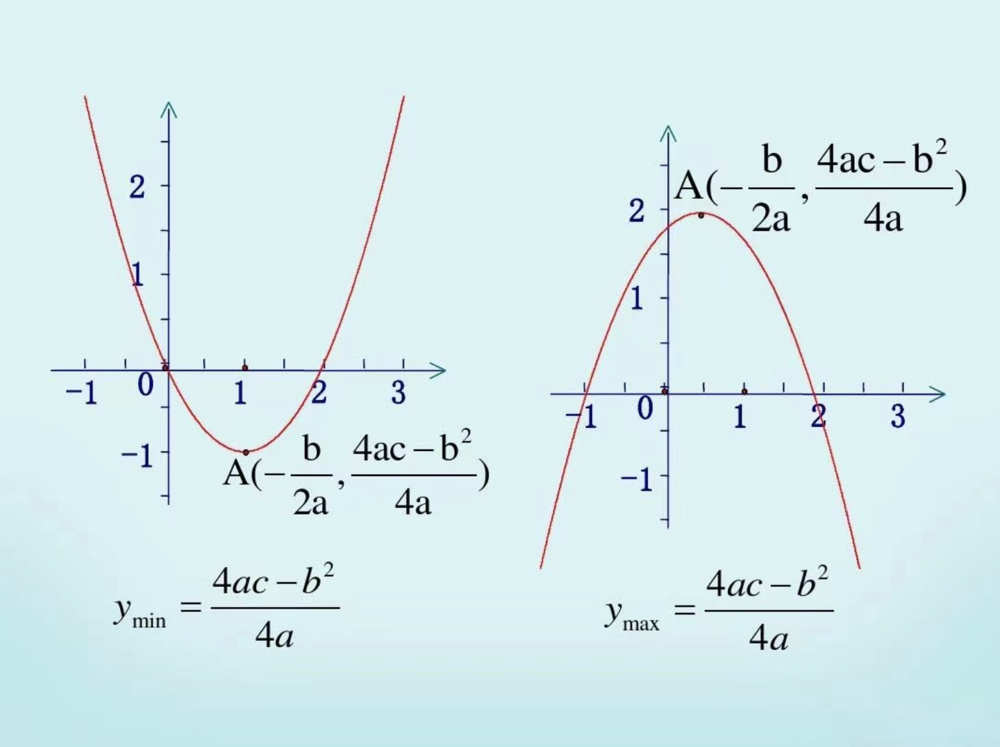
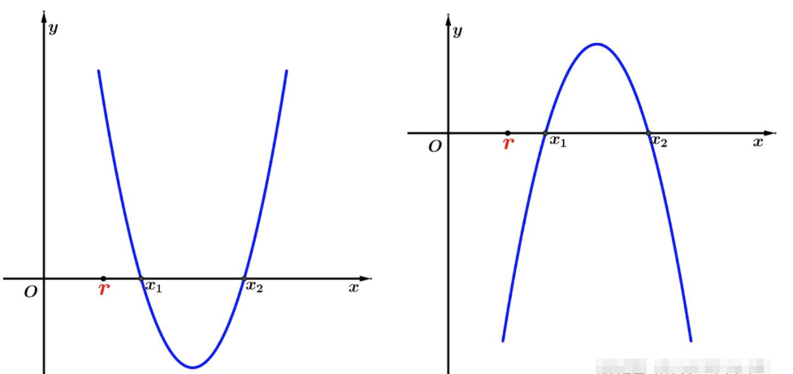
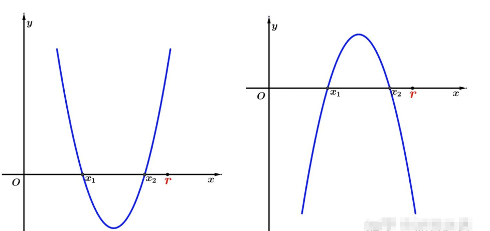
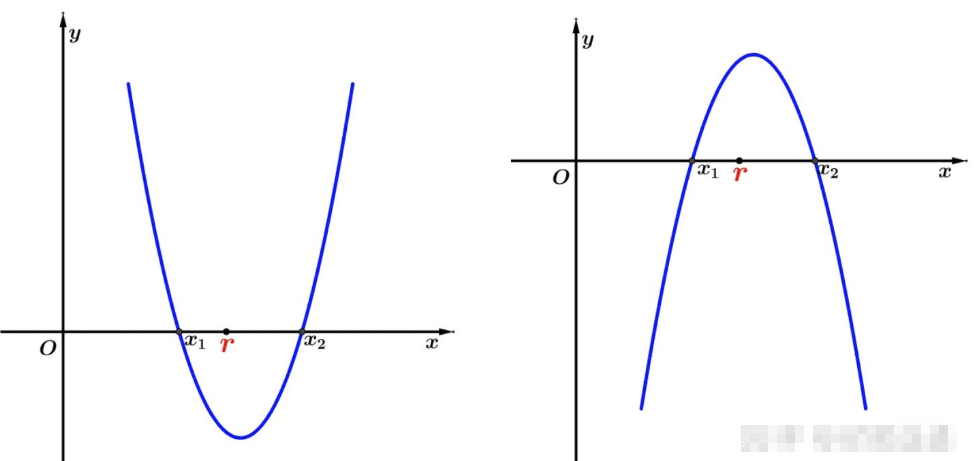
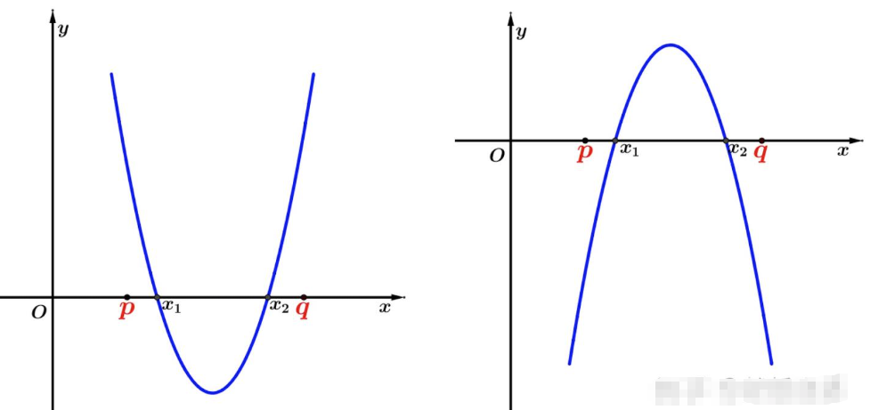
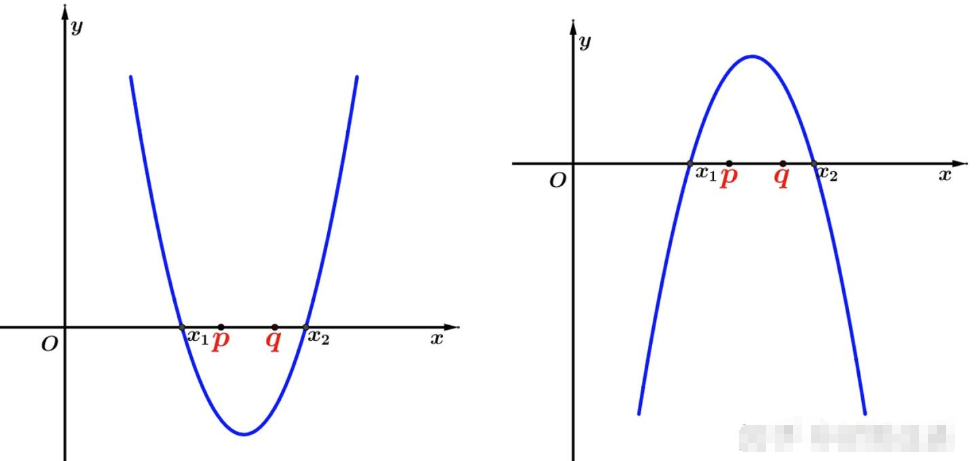
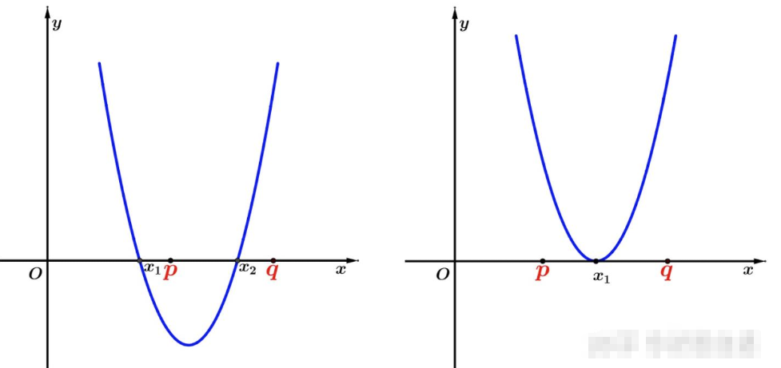

# 一元二次方程根的分布

## 一、基础知识回顾

### 1. 二次函数图像（抛物线）

令 $f(x) = ax^2 + bx + c$，则：
- 开口方向：$ a > 0 $ 向上，$ a < 0 $ 向下；
- 对称轴：$ x = -\frac{b}{2a} $；
- 顶点：$ \left( -\frac{b}{2a},\ f\left(-\frac{b}{2a}\right) \right) $。

**图像法是分析根分布最直观的工具**。

### 2. 判别式（Discriminant）
一元二次方程的标准形式为：

$$
ax^2 + bx + c = 0 \quad (a \ne 0)
$$

设其两根为 $ x_1 $、$ x_2 $，判别式为 $ \Delta = b^2 - 4ac $。

**根的分布讨论前提是** $\Delta \geq 0$，以确保**存在**实数根。

- $\Delta > 0$：有两个**不相等**的实根；
- $ \Delta = 0 $：有两个**相等**的实根（重根）；
- $ \Delta < 0 $：无实根。

#### 韦达定理（Vieta's Formulas）

若方程有实根，则：

$$
x_1 + x_2 = -\frac{b}{a}, \quad x_1 \cdot x_2 = \frac{c}{a}
$$

## 二、常见的根分布类型与条件

以下讨论均默认 $\Delta \geq 0$，且 $ a \ne 0 $。

| 类型                                     | 条件                                                         | 图 |
| ---------------------------------------- | ------------------------------------------------------------ | ---- |
| **两根均为正数**                         | $\begin{cases}\Delta \geq 0 \\x_1 + x_2 > 0 \Rightarrow -\dfrac{b}{a} > 0 \\x_1 \cdot x_2 > 0 \Rightarrow \dfrac{c}{a} > 0\end{cases}$ |      |
| **两根均为负数**                         | $\begin{cases}\Delta \geq 0 \\x_1 + x_2 < 0 \Rightarrow -\dfrac{b}{a} < 0 \\x_1 \cdot x_2 > 0 \Rightarrow \dfrac{c}{a} > 0\end{cases}$ |      |
| **一根为正，一根为负**                   | $x_1 \cdot x_2 < 0 \Rightarrow \dfrac{c}{a} < 0 \Leftrightarrow ac<0$ 无需判断 $\Delta > 0$，以及 $x_1 + x_2$ 的符号 |      |
| **两根都大于常数** $r$                 | $\begin{cases}\Delta \geq 0 \\\text{对称轴} > r \Rightarrow -\dfrac{b}{2a} > r \\a \cdot f(r) > 0\end{cases}$ $ a \cdot f(r) > 0 $ 表示 $f(r)$ 与 $ a $ 同号 |  |
| **两根都小于常数 $r$**                 | $\begin{cases}\Delta \geq 0 \\\text{对称轴} < r \Rightarrow -\dfrac{b}{2a} < r \\a \cdot f(r) > 0\end{cases}$ | |
| **一根大于** $ r $，**一根小于** $ r $   | $\begin{cases}\Delta > 0 \\a \cdot f(r) < 0\end{cases}$ 此时 $r$ 位于两根之间，**无需考虑对称轴** |  |
| **两根都在区间** $ (p, q) $ **内**     | $\begin{cases}\Delta \geq 0 \\p < -\dfrac{b}{2a} < q \\a \cdot f(p) > 0 \\a \cdot f(q) > 0\end{cases}$ | |
| **一个实数根小于** $p$，**另一个实数根大于** $q$ | $\begin{cases}\Delta \geq 0 \\a \cdot f(p) < 0 \\a \cdot f(q) < 0\end{cases}$ ||
| **至少有一个根在区间** $ (p, q) $ **内** | $f(p) \cdot f(q) < 0$ 或 $\begin{cases}\Delta = 0 \\p \leq -\dfrac{b}{2a} \leq q\end{cases}$ |  |

1. 来自 https://zhuanlan.zhihu.com/p/461527198

## 三、例题

### 例1 若关于 \(x\) 的二次方程 \( 7x^2 - (p + 13)x + p^2 - p - 2 = 0 \) 的两根 \(\alpha, \beta\) 满足 \( 0 < \alpha < 1 < \beta < 2 \)，求实数 \(p\) 的取值范围

> [!TIP]
>
> 解：记 \( f(x) = 7x^2 - (p + 13)x + p^2 - p - 2 \)，则依题意有
> \[
> \begin{cases}
> f(0) > 0 \\
> f(1) < 0 \\
> f(2) > 0
> \end{cases}
> \]

### 例2 若方程 \( 8x^2 + (m + 1)x + m - 7 = 0 \) 有负根，求实数 \( m \) 的取值范围

> [!TIP]
>
> 解：记 \( f(x) = 8x^2 + (m + 1)x + m - 7 \)。
>
> 当 \( f(x) \) 的两个零点均为负数时，依题意有
> \[
> \begin{cases}
> \Delta > 0 \\
> -\frac{m+1}{16} < 0 \\
> f(0) > 0
> \end{cases}
> \]
>
> 当 \( f(x) \) 的两个零点为一正一负时，依题意有 \( f(0) < 0 \)。
>

### 例3 实数 \( m \) 为何值时关于 \(x\) 的方程 \( 7x^2 - (m + 13)x + m^2 - m - 2 = 0 \) 的两个实数根 \( x_1, x_2 \) 满足 \( 0 < x_1 < x_2 < 2 \)

> [!TIP]
>
> 解：记 \( f(x) = 7x^2 - (m + 13)x + m^2 - m - 2 \)，则依题意有
> \[
> \begin{cases}
> \Delta > 0 \\
> 0 < \frac{m+13}{14} < 2 \\
> f(0) > 0 \\
> f(2) > 0
> \end{cases}
> \]

### 例4 ⭐已知集合 \( A = \{ x \mid x^2 - 4mx + 2m + 6 = 0 \} \)，\( B = \{ x \mid x < 0, x \in \mathbb{R} \} \)，且 \( A \cap B \neq \varnothing\)，求实数 \( m \) 的取值范围

> [!TIP]
>
>
> 解：主要分为以下几个步骤：
> 1. **分析目标**：$m\text{ 的取值范围} \rightarrow m\text{ 有关的不等式}$
>
> 2. **分析条件**：需要找到 \( m \) 使得 \( A \cap B \neq \varnothing\)，即方程 \( x^2 - 4mx + 2m + 6 = 0 \) **至少有一个负实数根**。
>
>    1. **确保方程有实根**：计算判别式 \( \Delta = (-4m)^2 - 4 \cdot 1 \cdot (2m + 6) = 16m^2 - 8m - 24 \geq 0 \)。  
>       简化得 \( 16m^2 - 8m - 24 \geq 0 \) → 除以 8：\( 2m^2 - m - 3 \geq 0 \)
>    2. 解不等式得 \( m \geq \frac{3}{2} \) 或 \( m \leq -1 \)。
>
> 3. **分类讨论与补集思想**：
>
>    1. 🔑反向思维：先考虑两根均为非负的情况（即 \( x_1 \geq 0 \) 且 \( x_2 \geq 0 \)），然后取补集。
>    2. 两根均为非负的条件：
>       1. 两根之和：\( x_1 + x_2 = 4m \geq 0 \) → \( m \geq 0 \)。
>       2. 两根之积：\( x_1 \cdot x_2 = 2m + 6 \geq 0 \) → \( m \geq -3 \)。
>       3. 结合判别式条件（\( m \geq \frac{3}{2} \) 或 \( m \leq -1 \)），可得两根均为非负时 \( m \geq \frac{3}{2} \)（因为 \( m \geq 0 \) 且 \( m \geq \frac{3}{2} \) 的交集）。
>       4. 因此，均为正根的 \( m \) 集合为 \( C = \{ m \mid m \geq \frac{3}{2} \} \)。
>
> 4. **取补集**：全集 \( U \) 是满足判别式的 \( m \) 集合，即 \( U = \{ m \mid m \geq \frac{3}{2} \text{ 或 } m \leq -1 \} \)。那么，有负根的情况（即 \( A \cap B \neq \varnothing\)）对应的是 \( U \) 中除去 \( C \)，即 \( m \leq -1 \)。
>
> **最终答案**：实数 \( m \) 的取值范围是 \( m \leq -1 \)。
>
> **总结**：
>
> 此题本质是考一元二次方程根的分布，但是：
>
> 1. 建模，根据集合的性质知道目标是什么：即方程 \( x^2 - 4mx + 2m + 6 = 0 \) **至少有一个负实数根**。
> 2. 简化，**至少有一个负实根**意味着**有一个负实根或者两个负实根**，需要解两个不等式，简化为在**有实根的全集里**取**两根均为非负根**的**补集**。

## 三、常见误区与辨析

### 误区 1：忽略 $ \Delta \geq 0 $ 的前提

> ❌**错误示例**：给定方程 $ x^2 + 2x + 3 = 0 $，计算 $ x_1 x_2 = \frac{c}{a} = 3 > 0 $，得出“两根同号”。  
> **错误原因**：$ \Delta = 4 - 12 = -8 < 0 $，无实根，后续讨论无意义。

> ✅ **正确做法**：任何根分布问题，**第一步必须是 $ \Delta \geq 0 $**。

### 误区 2：忽视对称轴的重要性

> ❌**错误示例**：求 $ m $ 使得方程 $ x^2 - 2mx + m^2 - 1 = 0 $ 的两根都大于 1。仅列：$ \Delta = 4 > 0 $，$ f(1) = m^2 - 2m > 0 \Rightarrow m < 0 $ 或 $ m > 2 $。 
>
> **反例**：取 $ m = -1 $，方程为 $ x^2 + 2x = 0 $，根为 $ 0 $ 和 $ -2 $，均不大于 1。

> ✅ **正确做法**：还需对称轴 $ m > 1 $，结合得 $ m > 2 $。

### 误区 3：错误理解 $f(r)$ 的符号，忽略 $ a $ 的影响

> ❌**错误做法**：当 $ a < 0 $ 时，仍机械套用 $ f(r) > 0 $ 或 $ f(r) < 0 $。

> ✅ **正确做法**：统一使用 $ a \cdot f(r) > 0 $ 或 $ a \cdot f(r) < 0 $，自动适配开口方向。

### 误区 4：误认为“至少一个根在 $ (p,q) $ 内”等价于 $ f(p)f(q) < 0 $

> ❌**错误原因**：忽略了 $ \Delta = 0 $ 时，有重根的情况，比如：$f(x) = (x - 1.5)^2 $，区间 $ (1,2) $。  
> $f(1) = 0.25 >0$，$f(2) = 0.25>0$，$f(1)f(2)>0$，但根 $x =1.5 \in (1,2)$。

> ✅ **正确理解**：$f(p)f(q)<0$ 是**充分非必要**条件。完整判断需结合对称轴、函数值符号等。

### 误区 5：含参方程中忘记分类讨论 $ a $ 的符号或是否为零

> ❌**错误示例**：方程 $ (m-1)x^2 + \cdots = 0 $，直接按二次方程处理。  
> **错误原因**：当 $ m = 1 $ 时，方程退化为一次方程，所有二次方程结论失效。

> ✅ **正确做法**：先讨论
> 
>- $ m = 1 $：是否为一次方程？是否有根？
> - $ m \ne 1 $：再按 $ a > 0 $ 或 $ a < 0 $ 分类讨论。

## 习题

1. 【2025-0909-17】关于 $x$ 的二次方程 $a x^{2}+b x+c=0$ ($a\ne 0$)  
    (a) 有一个正根和一个负根的充要条件是\_\_\_\_\_\_\_\_\_\_\_\_\_\_\_\_\_\_\_\_\_\_\_\_；  
    (b) 有两个正根的充要条件是\_\_\_\_\_\_\_\_\_\_\_\_\_\_\_\_\_\_\_\_\_\_\_\_；  
    (c) 有一个正根和一个零根的充要条件是\_\_\_\_\_\_\_\_\_\_\_\_\_\_\_\_\_\_\_\_\_\_\_\_。  

2. 【沪教 2.1 B 组第 4 题】对一元二次方程 $ ax^{2}+bx+c=0 \space (a\neq0) $ ，证明：$ac<0$ 是该方程**有两个异号实根**的充要条件.

3. 【沪教 2.1 B 组第 8 题】设 $ s=a+b $ ， $ p=ab \space (a,b\in R) $ ，写出 $ a>1 $ 且 $ b>1 $ 用 $s$, $p$ 表示的一个充要条件，并证明.