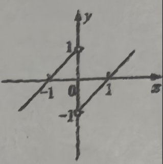
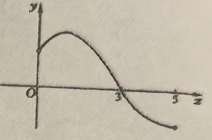
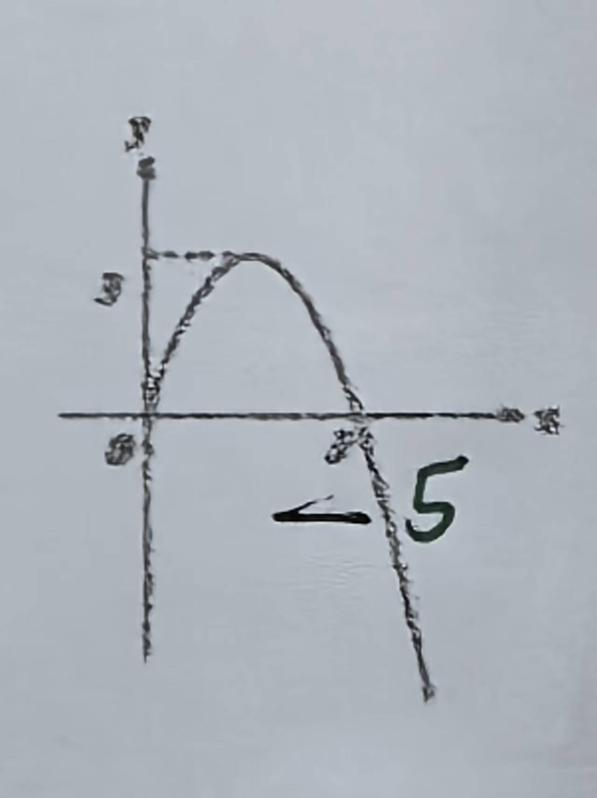
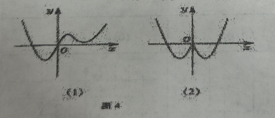

# 第五章

> ❓️爸爸检查发现做错
>
> ⚠️ 题估计有问题

## 1107 函数的概念

### 一、选择题

1. 函数 $y=\sqrt{1-x^{2}}+\sqrt{x^{2}-1}+\dfrac{x^{2}-1}{x+1}$的定义域为（   ）  
    (A)$(-1,1]$                            (B)$(-∞,-1)∪[1,+∞)$  
    (C)$\{-1,1\}$                          (D)$\{1\}$

2. 下列四组函数中的 $ f(x) $、$g(x)$，表示同一函数的是（   ）  
    (A)$f(x)=x$ 与 $g(x)= \dfrac{x^{2}}{x}$  
    (B)$ f(x)=\sqrt[3]{x}$与g(x)= $ \sqrt{x^{3}}$  
    (C)$ f(x)=\sqrt{1-x}\cdot\sqrt{1+x}$ 与 $g(x)=  \sqrt{1-x^{2}}$  
    (D)$ f(x)=\sqrt{(1-x)^{3}}$与g(x)=|1-x|

3. 下列图形不可能是函数 $y=f(x)$ 的图像的是（   ）
    

4. 已知函数 $ f(x)=\begin{cases}x^{2},x\leq 0 \\-x^{2},x>0\end{cases}$，则 $f[f(2)]$ 的值是（   ）  
    (A) $16$           (B)$-16$              (C) $4$             (D) $-4$

5. 已知 $ f(x)=\begin{cases}3x+9,(x<0)\\3-2x,(x\geq 0)\end{cases}$，若 $b=f(a)$，则 $a=-2$ 时，$f(b)$ 的值为（   ）  
    (A) $18$           (B)$-3$               (C) $30$            (D) $-11$

###  二、填空题
6. ❌已知 $y=x^{2},x\in[1,2]$，则 $ f(x)  $ 的值域是\_\_\_\_\_\_\_\_.

7. 已知 $ f(x)=|x| $的值域为[0,1]，则 $ f(x) $ 的定义域是\_\_\_\_\_\_\_\_.

8. $ f(x) $的定义域是 $(0,2]$，则 $ f(\dfrac{1}{x}) $ 的定义域是\_\_\_\_\_\_\_\_.

9. 如图,写出此函数的解析式是\_\_\_\_\_\_\_\_.

10. 已知 $ f(n)=\begin{cases}n-3(n\geqslant10)\\f[f(n+5)]<10\end{cases}(n\in \N^*) $，则 $f(5)$=\_\_\_\_\_\_\_\_.

11. 已知 $f(\sqrt{t}-1)=t-2\sqrt{t}$，则 $f(x)=\underline{\quad\quad}$,定义域是\_\_\_\_\_\_\_\_.

12. ❌$ f(x)=\dfrac{x-1}{x+2},g(x)=\dfrac{ax+b}{x+c} $,且$ f(g(x))=\dfrac{1}{x} $，则$a=$\_\_\_\_\_\_\_\_, $b=$\_\_\_\_\_\_\_\_, $c=$\_\_\_\_\_\_\_\_.

###  三、解答题

13. 设 $ f(x)  $ 的定义域为 $[3,8]$，求 $ f(x^{2}-1) $ 的定义域.

14. 求下列函数的定义域:  
❌(1)$ y=\dfrac{(x-1)^{0}}{\sqrt[3]{x+2}} $;                         (2) $y=\sqrt{5-x}+\dfrac{1}{|x|-2} $;  
(3)$ y=\dfrac{2x+1}{\sqrt{2-x-x^{2}}} $;              (4)$ y=\sqrt{9-x^{2}}+\dfrac{1}{|x-2|} $.

15. ❌已知函数 $f(x)=\dfrac{x-4}{mx^{2}+4mx+3}$的定义域是 $\R$，求实数 $m$ 的取值范围.

16. 作出下列函数的图像，并求出该函数的值域  
    (1) $ y = (x-1)^{0} $;                                    ❌(2) $ y = 2 + (-1)^{x} $, $ \left| x \right| \le 2 $, $ x \in Z $;  
    (3) $ y=\begin{cases}x, x\leqslant 0\\\dfrac{1}{x},x>0\end{cases}$                                (4) $ y=4-|2-x| $;
    (5) $ y=\left|-x^2-2x+3\right| $                         ❌(6) $ y=\left\{\begin{array}{ll}x^2+2x,&x\leqslant 0,\\-x^2+2x,&x>0.\end{array}\right. $

17、已知函数 $$ f(x)=\begin{cases}x^2+1,&x\leqslant 0\\-2x, &x>0\end{cases}$$ 求使函数值为 $10$ 的 $x$ 的值.

18、已知函数 $$ f(x)=\begin{cases}\pi+1,&x>0,\\\pi, &x=0,\\0, &x<0.\end{cases}$$ 求 $f(f(-x))$ 的值.

## 1110 函数的表示方法

### 一、填空题

1. ❓️若 $f(x)=\dfrac{2}{\sqrt{x^2-4}}$，$ g(x)=\sqrt{x-2}$。$ \sqrt{x+2}$，则$f(x)·g(x)=$\_\_\_\_\_\_\_\_\_\_\_\_,定义域为\_\_\_\_\_\_\_\_\_\_\_\_.

2. 若 $f(x)=\dfrac{1}{\sqrt{x}},g(x)=\dfrac{1-\sqrt{x}}{x}$，则 $f(x)+g(x)=$\_\_\_\_\_\_\_\_\_\_\_\_，$ x\in $\_\_\_\_\_\_\_\_\_\_\_\_.

3. 若 $f(x)=3 x^2 $，$g(x)=2x+\dfrac{1}{x}$，则 $f(2)+g( \dfrac{1}{2} )=$\_\_\_\_\_\_\_\_\_\_\_\_,$f(2)·g( \dfrac{1}{2} )=$\_\_\_\_\_\_\_\_\_\_\_\_.

4. 已知 $f(x)=2f(\dfrac{1}{x})+1 $，则 $f(10)=$\_\_\_\_\_\_\_\_\_\_\_\_.

5. 若 $ f(x-1)=x^2 $，则 $f(x)$=\_\_\_\_\_\_\_\_\_\_\_\_.

6. ❓️❌若 $f(1+\dfrac{1}{x})=\dfrac{1}{x^2}-1 $，则 $f(x)$=\_\_\_\_\_\_\_\_\_\_\_\_.

### 二、选择题

7. 若函数 $y=f(x)$ 满足 $f(x+1)=4f(x)$，则 $ f(x)  $ 的解析式为(   )
    (A) $4x$                   (B) $4(x+1)$                      (C) $x^4$                       (D) $ 4^x $

8. 已知 $ f(x-\dfrac{1}{x})=x^2+\dfrac{1}{x^2} $，则 $f(x+1)$
    (A) $ (x+1)^2+\dfrac{1}{(x+1)^2} $                    (B) $ (x-\dfrac{1}{x})^2+\dfrac{1}{(x-\dfrac{1}{x})^2} $
    (C) $ (x+1)^2 +2$                                  (D) $ (x+1)^2+1 $

9. 设 $f(x)=\dfrac{1}{1-x}$，则 $f\{f[f(x)]\}$ 的解析式为(   )
    (A) $ \dfrac{1}{(1-x)}$                  (B) $ \dfrac{1}{(1-x)^3} $                 (C) $-x$                     (D) $x$

10. 已知定义域为 $\R$ 的函数满足 $f(a+b)=f(a)f(b)(a,b \in R)$ 且 $f(x)>0$，若 $f(1)=\dfrac{1}{2}$，则 $f(2)$ 等于(   )
    (A) $2$                 (B) $4$                         (C) $\dfrac{1}{2}$                       (D) $\dfrac{1}{4}$

11. ❌设函数 $y=f(x)$ 图像如图所示，则函数 $f(x)$ 的解析式为 $f(x)=$ (   )
    (A) $ \sqrt{x^2-2x+1} $  
    (B) $ \sqrt{x^2-2|x|+1} $  
    (C) $ \mid x^2-1\mid $  
    (D) $ x^2-2\mid x\mid+1 $

### 三、解答题

12.❌❓️(1)已知 $ f(x-3)=x^{2}+2x+1 $,求 $f(x+3)$;
   ❌(2)已知 $f(\sqrt{x}+1)=x+2\sqrt{x}$,求$ f(x),f(x+1) $与$ f(x^{2}) $.

13.❌(1)已知 $ f(3x)=2x^{2}-1 $,求 $f(x)$;
  ❌❓️(2)已知 $f(x-\dfrac{1}{x})=x^{2}+\dfrac{1}{x^{2}}+1 $,求 $f(x)$.

14.下表表示函数 $y=f(x)$:

| $x$    | $0<x<5$ | $5 \leq x<10$ | $10 \leq x<15$ | $15 \leq  x<20$ |
| ------ | ------- | ------------- | -------------- | --------------- |
| $f(x)$ | $-4$    | $6$           | $8$            | $10$            |

(1)写出函数 $f(x)$ 的定义域、值域;
❌(2)写出满足不等式 $f(x)≥x$ 的整数解组成的集合.

## 1111 函数的奇偶性(1)

### 1、填空

(1)函数 $y = |x|$ 的图像关于\_\_\_\_\_\_\_\_\_\_\_\_对称。

(2)若函数 $f(x)$ 是奇函数,定义域为 $[a-3, 5]$, 则 $a=$\_\_\_\_\_\_\_\_\_\_\_\_。

(3)已知函数 $f(x) = a x^{5} + b x^{\frac{1}{3}} + 2$。若 $f(2) = 3$, 则 $f(-2) =$\_\_\_\_\_\_\_\_\_\_\_\_。

❌(4)右图为**奇函数** $y = f(x)$ 在 $y$ 轴右边部分的图像, $f(x) > 0$ 的解集为\_\_\_\_\_\_\_\_\_\_\_\_。
> [!CAUTION]
>
> > 错的原因，奇偶搞反了。

### 2、选择题

(1)“函数 $f(x)$ 的<u>定义域</u>关于原点对称”是“函数 $f(x)$ 为奇函数”的(   )
  (A)充分非必要条件;                   (B)必要非充分条件;
  (C)充要条件;                                (D)既非充分又非必要条件。

❌(2)下列命题中,真命题是(   )
  (A)偶函数的图像一定与 $y$ 轴相交;
  (B)奇函数的图像一定通过原点;
  (C)偶函数的图像关于 $y$ 轴对称;
  (D)既是奇函数又是偶函数的函数只能是 $f(x) = 0$。

### 3、判断下列函数的奇偶性

> [!CAUTION]
>
> 错的原因，老师给出的验证奇偶的 3 个步骤，做到两个就得出结论了。
>

(1) $y = |x|$, $x \in [-2, 1]$。                                              (2) $y = \dfrac{x^{2}(x + 1)}{x + 1}$。
❌(3) $y = 2x^{2} - 1$, $x \in [-1, 1]$。                                (4) $y = 3x^{2} + x$。
(5) $f(x) = x^{2} - 2x$。                                                   ❌(6) $y = \dfrac{\sqrt{1 - x^{2}}}{|x + 2| - 2}$。

4.已知函数 $f(x) = \begin{cases} -x^{2} + x & (x \geqslant 0) \\ x^{2} + x & (x < 0) \end{cases}$，求证：$f(x)$ 是奇函数。

5.已知 $f(x)$ 为偶函数，当 $x \geqslant 0$ 时，$f(x) = (x - 1)^{2} + 1$，求 $f(x)$ 的解析式。

6.已知函数 $f(x) = \dfrac{px^{2} + 2}{3x + q}$ 是奇函数，且 $f(2) = \dfrac{5}{3}$，求实数 $p$，$q$ 的值。

7.若 $f(x)$ 是定义在 $\mathbb{R}$ 上的奇函数，当 $x < 0$ 时，$f(x) = x(1 - x)$。求 $f(x)$ 的解析式。

8.已知 $f(x)$ 是奇函数，$g(x)$ 是偶函数，且 $f(x) + g(x) = \dfrac{1}{2x + 1}$，求 $f(x)$、$g(x)$ 的解析式。

## 1112 函数的奇偶性(2)

### (一)、填空题

1. 函数 $ y=x^{4}-2|x| $ 的图像关于\_\_\_\_\_\_对称.

2. 若函数 $y=\dfrac{(x+1)(x+a)}{x}(a\in \R)$ 是奇函数，则 $a=$\_\_\_\_\_\_.

3. 设$ f(x)=ax^{9}+bx^{3}+cx+2 $，若 $f(-1)=1$，则 $f(1)=$\_\_\_\_\_\_.

4. 给出函数：①$ y=|x| $ ，②$ y=\sqrt{1-x^{2}}+\sqrt{x^{2}-1} $，③$ y=3^{x}+3^{-x} $.其中**既是奇函数又是偶函数**的为\_\_\_\_\_\_.(填写正确的全部序号)

5. 已知 $y=f(x)$ 是定义在 $\R$ 上的偶函数，且当 $x\in(0,+\infty)$ 时，$ f(x)=|x^{2}-2x|$ ，则当 $x\in(-\infty,0)$ 时，$f(x)=$\_\_\_\_\_\_.

6. 设 $y=f(x)$ 与 $y=g(x)$ 均是定义在 $\R$ 上的函数，记 $ h(x)=f(x)\cdot g(x) $，则“$f(x)$、$g(x)$ 均为偶函数”是“ $y=h(x)$ 为偶函数”的\_\_\_\_\_\_条件.

7. 若函数 $y=\begin{cases}2x-3,&x>0,\\f(x),&x<0\end{cases}$为奇函数，则f(x)=\_\_\_\_\_\_.

8. 判断函数 $y=(x-1)\sqrt{\dfrac{x+1}{x-1}}$的奇偶性：\_\_\_\_\_\_.

9. 判断函数 $ y=\begin{cases}x^{2}+x,&x\leq0,\\-x^{2}+x,&x>0\end{cases} $的奇偶性：\_\_\_\_\_\_.

10. 若函数 $ f(x)=x^{2}-|x+a| $ 为偶函数，则实数 $a=$\_\_\_\_\_\_.

### (二)、 选择题

11. 下列函数是偶函数的是     (   )
    A. $ y=\dfrac{x}{x^{2}-1}$           B. $ y=\sqrt{x-1} $                C. $ y=x^{\frac{2}{3}} $             D. $ y=\dfrac{x^{3}+x^{2}}{x+1}$

12. “ $y=f(x)$ 的定义域关于原点对称”是“ $y=f(x)$ 为奇函数”的     (   )
    A. 充分非必要条件；             B. 必要非充分条件；
    C. 充要条件；                         D. 既非充分又非必要条件.

13. 设 $y=f(x)$ 是定义在 $\R$ 上的函数，则函数 $y=f(x)+f(-x)$ 在 $\R$ 上一定是     (   )
    A. 奇函数；                                       B. 偶函数；
    C. 既是奇函数又是偶函数；               D. 非奇非偶函数.

### (三)、解答题

14.判断下列函数的奇偶性：
❌(1)$ f(x)=\sqrt{x-1} $                                          ❌ (2)$ f(x)=|2x+1|+|2x-1| $ 
(3)$ f(x)=\begin{cases}2x+5&(x>0),\\0&(x=0),\\2x-5&(x<0).\end{cases} $                  (4)$ f(x)=\dfrac{\sqrt{4-x^{2}}}{|x+3|-x}$

15.已知函数 $f(x)=\dfrac{ax^{2}+1}{bx+c}(a,b,c\in \mathbf{Z})$ 是奇函数，且 $f(1)=2$, $f(2)<3$,求 $f(x)$ 的解析式.

16.已知定义在 $\R$ 上的函数 $y=f(x) $，对于任意实数 $x$、$y$，均有 $f(xy)=f(x)+f(y)$.
(1)求 $f(1)$ 和 $f(-1)$;
❌(2)求证:$y=f(x) $ 为偶函数.

17.已知定义在 $\R$ 上奇函数 $f(x)$ 在 $x≥0$ 时的图像是如图所示的抛物线的一部分.
(1)请补全函数 $f(x)$ 的图像;
(2)写出函数 $f(x)$ 的表达式;
❌(3)讨论方程 $|f(x)|=a$ 的解的个数.

> [!CAUTION]
>
>   画图有问题
>

## 1113 函数的单调性(1)

### 1、填空：

(1)函数 $y=-\dfrac{1}{x}$ 的单调递增区间是\_\_\_\_\_\_\_\_\_\_\_\_.

(2)若函数 $f(x)=kx^{2}+2x+4$ 在区间 $[1,+\infty) $上是减函数,在区间 $(-\infty,1]$ 上是增函数,则 $ f(3)= $\_\_\_\_\_\_\_\_\_\_\_\_.

(3)若偶函数 $y=f(x) $ 在 $ (-\infty,0) $上是增函数,则 $f(-2)$、$f( \pi )$、$f(\dfrac{\sqrt{3}}{2}) $按从小到大排列为\_\_\_\_\_\_\_\_\_\_\_\_.

(4)若函数 $y=2x^{2}+ax+3$ 在 $(-\infty,4]$ 上是减函数,则 $a$ 的取值范围是\_\_\_\_\_\_\_\_\_\_\_\_.

(5)已知函数 $f(x) $同时满足下列条件:①奇函数;②当 $x\in[-2,2]$ 时,$f(x) $是增函数,$f(x)$ 的解析式可以是\_\_\_\_\_\_\_\_\_\_\_\_和\_\_\_\_\_\_\_\_\_\_\_\_.

### 2、选择题：

(1)已知函数 $f(x)$ 的单调递增区间为 $[-1,1]$.若 $ -1\leqslant a<b\leqslant1 $,则 $f(a)-f(b)$ (   )
  (A)大于 $0$;          (B)等于$0$;                 (C)小于$0$;                    (D)符号不能确定.

(2)下列四个命题:  ①两个增函数的和仍是增函数;  ②两个减函数的和仍是减函数;  ③一个增函数和一个减函数的和是增函数;  ④一个增函数和一个减函数的和是减函数.  其中真命题的序号是(   )
  (A)①、②;          (B)①、③;                (C)①、④;                 (D)②、④.

### 3、写出下列函数的单调区间:

(1) $y=|x-1|$ .                                (2) $y=ax+b(a≠0)$.
(3) $y=x^{2}-4x,x\in[-3,3]$ .          (4) $y=ax^{2}+2ax+a^{2}(a≠0)$ .
(5) $y=x+\dfrac{1}{x}$ .                               (6) $y=x-\dfrac{1}{x}$ .

4、判断函数 $f(x)=-x^{3}+1$ 在 $\R$ 上的单调性，并证明.

5、已知 $f(x)$ 是定义在 $(-3,3)$ 上的奇函数，且该函数在 $[0,3)$ 上的解析式为 $y=(x-1)^{2}-1$ .
  (1)求 $f(x)$ 在 $(-3,0)$ 上的解析式；
  (2)在平面直角坐标系中作出函数 $f(x)$ 的图像，并写出单调区间.

6、已知函数 $y=kx^{2}-4x-8$ 在 $[4,16]$ 上单调递减，求实数 $k$ 的取值范围.

7、用定义判断函数 $f(x)=\dfrac{ax+1}{x+2}(\alpha \neq \dfrac{1}{2})$ 在 $(-2, +\infty )$ 上的单调性.

## 1114 函数的单调性(2)

### 一、填空题

1. ❌函数 $y=x^{2}-8$ 的奇偶性是\_\_\_\_\_\_\_\_\_\_\_\_，函数 $y=x^{2}-8$，$ x\in[-1,1)$ 的奇偶性是\_\_\_\_\_\_\_\_\_\_\_\_.

2. 函数 $y=x+1$ 的奇偶性是\_\_\_\_\_\_\_\_\_\_\_\_，函数 $y=kx(x\neq0)$ 的奇偶性是\_\_\_\_\_\_\_\_\_\_\_\_.

3. ❌函数 $f(x)$、$g(x)$ 在区间 $[-a,a] (a>0)$上都是奇函数，且 $g(x)\neq0$，则 $f(x)+g(x)$ 的奇偶性是\_\_\_\_\_\_\_\_\_\_\_\_，$f(x)-g(x)$ 的奇偶性是\_\_\_\_\_\_\_\_\_\_\_\_，$f(x)·g(x)$ 的奇偶性是\_\_\_\_\_\_\_\_\_\_\_\_，$\dfrac{f(x)}{g(x)}$ 的奇偶性是\_\_\_\_\_\_\_\_\_\_\_\_.

4. 下列函数：① $y=\sqrt{x^{2}+1}$，② $y=(\sqrt{x})^{2}+1 $；③ $y=x^{2}+x $；④ $y=\dfrac{x^{2}(2-x)}{2-x} $；⑤ $y=\dfrac{x^{2}(4-x^{2})}{4-x^{2}} $；⑥y=(x-2) $\sqrt{\dfrac{x+2}{2-x}} (-2<x<2)$，其中，奇函数的序号是\_\_\_\_\_\_\_\_\_\_\_\_，偶函数的序号是\_\_\_\_\_\_\_\_\_\_\_\_.

5. 函数 $y=-\dfrac{1}{x}$ 的单调递增区间是\_\_\_\_\_\_\_\_\_\_\_\_.

6. ❌函数 $y=x^{2}+4x+3$ 的递增区间是\_\_\_\_\_\_\_\_\_\_\_\_，递减区间是\_\_\_\_\_\_\_\_\_\_\_\_.

7. 函数 $y=\dfrac{x+2}{x+1}$ 的递减区间是\_\_\_\_\_\_\_\_\_\_\_\_.

8. 函数 $y=x^{2}-2ax+a^{2}-1$ 在$(-∞,1)$上是减函数，则实数 $a$ 的取值范围是\_\_\_\_\_\_\_\_\_\_\_\_.

9. 函数 $y=|x-1|$ 的递增区间是\_\_\_\_\_\_\_\_\_\_\_\_，递减区间为\_\_\_\_\_\_\_\_\_\_\_\_.

10. 函数 $y=|x^{2}-2x|$ 的递增区间是\_\_\_\_\_\_\_\_\_\_\_\_.

11. 函数 $y=x^{2}-2|x|$ 的递增区间是\_\_\_\_\_\_\_\_\_\_\_\_.

12. ❌函数 $y=x+\dfrac{1}{x}$ 在 $(-1,0)$ 上单调\_\_\_\_\_\_\_\_\_\_\_\_（递增或递减）.

13. ❌函数 $y=|x-1|+|x+1|$ 的严格递增区间是\_\_\_\_\_\_\_\_\_\_\_\_，严格递减区间为\_\_\_\_\_\_\_\_\_\_\_\_.

14. ❌函数 $y=|x-1|-|x+2|$ 的单调严格递减区间是\_\_\_\_\_\_\_\_\_\_\_\_.

15. 函数 $y=\sqrt{-x^{2}+2x+3}$ 的单调递减区间是\_\_\_\_\_\_\_\_\_\_\_\_

### 二、解答题

16. ~~已知偶函数 $y=f(x) $在 $(-1,0)$上单调递增，求不等式 $f(1-x)>f(1-x^{2})$ 在区间 $(-1,1)$ 上的解集.~~

17. 已知函数 $f(x)=x^{2}-\dfrac{1}{x^{2}}$ .
    (1)判断函数的奇偶性，并加以证明；
    (2)判断函数在 $ (-\infty,0) $ 上的单调性，并加以证明；

18. 已知函数 $f(x)=|x+1|+ax ( a\in \R )$.
    ①当 $a=1$ 时，画出此时函数的图象；
    ②❌若函数 $f(x)$ 在 $\R$ 上是严格单调函数，求 $a$ 的取值范围.

19. 已知函数 $f(x)$ 是定义在 $\R^{+}$ 上的增函数，$f(\dfrac{x}{y})=f(x)-f(y)$，$f(6)=1$ .
    (1)求f(36)；
    (2)❌解不等式：$ f(x+5)-f(\dfrac{1}{x})<2$ .
    
    
## 1117 42 高一数学练习卷 

### 一、填空题  
1. ❌函数 $ y=2x^{2}+x-1 $ 的单调增区间是\_\_\_\_\_\_\_\_\_.  
2. 若函数 $y=f(x) (x∈R)$ 是偶函数，且 $f(1)<f(3)$，则 $f(-3)$ 与 $f(-1)$ 的大小关系为\_\_\_\_\_\_\_\_\_.  
3. ❌已知函数 $f(x)=x^{2}+2(a-1)x+2$ 在区间 $(-∞,4]$ 上是严格减函数，则实数 $a$ 的取值范围是\_\_\_\_\_\_\_\_\_.  
4. 函数 $y=(1-m)x^{2}+(m-2)x+3 (x \in [n,4])$ 为偶函数，则 $m+n=$\_\_\_\_\_\_\_\_\_.  
5. ❌若函数 $f(x)$ 是 $\R$ 上的严格减函数，则有 $f(1)$\_\_\_\_\_\_\_\_\_$ f(a^{2}+a+2) $ (填"<"或">").  
6. ❌已知 $ f(x)=x^{2017}+ax^{5}-\dfrac{b}{x}-8 $，若 $f(7)=3$，则 $f(-7)=$\_\_\_\_\_\_\_\_\_.  
7. 函数 $ y=\sqrt{-x^{2}+4x-3} $ 的单调减区间为\_\_\_\_\_\_\_\_\_.  
8. 已知函数 $ f(x)=\dfrac{x+a}{x+2} $ 在区间 $(-2,+∞)$ 上为增函数，则实数 $a$ 的取值范围是\_\_\_\_\_\_\_\_\_.  
9. 若函数 $y=ax$ 和 $y=-\dfrac{b}{x}$ 在区间 $(0,+∞)$ 上都是严格减函数，则函数 $ y=\dfrac{b}{a}x+1 $ 在$( -\infty ,+\infty)$ 上的单调性是\_\_\_\_\_\_\_\_\_.  
10. 已知函数 $f(x)$ 是 $\R$ 上的减函数，则满足 $ f\left(|\frac{1}{x}|\right)<f(1) $ 的实数 $x$ 的取值范围是\_\_\_\_\_\_\_\_\_.  
11. ❌定义在 $\R$ 上的奇函数 $f(x)$ 在 $[0,+∞)$ 上的图像如图所示，则不等式 $x\cdot f(x)\geq0$ 的解集是\_\_\_\_\_\_\_\_\_.  

### 二、选择题  
12. 若 $ f(x)=(m-1)x^{2}+2mx+3 $ 是偶函数，则该函数在区间 $[-5,-2]$ 上是(   )  
    A. 增函数                B. 减函数                C. 没有单调性              D. 单调性由 $ m $ 的值确定  

13. 若函数 $f(x)$ 在区间 $[1,3)$ 上是增函数，在区间 $[3,5]$ 上也是增函数，则函数 $f(x)$ 在区间 $[1,5]$ 上(   )  
A. 必是增函数          B. 不一定是增函数            C. 必是减函数              D. 是增函数或减函数  

### 三、解答题  
14. 判断下列函数的奇偶性，并证明：  
    ①  $ f(x)=x^{4}+\frac{2}{x^{2}}-3 $                  ②  $ f(x)=2x^{2}-x $            ③  $ f(x)=\sqrt{x-2}\cdot\sqrt{x+2} $  
15. 已知函数 $f(x)$ 是定义在 $\R$ 上的奇函数，当 $x>0$ 时 $f(x)=x^{2}-x$，求 $f(x)$ 的解析式.  
16. 奇函数 $f(x)$ 为定义在 $[-1,1]$ 上的单调递减函数，且 $f(a)+f\left(a^{2}\right)>0$，求 $a$ 的取值范围.  
17. 设函数 $ f(x)=\dfrac{ax^{2}+1}{bx+c} $ 是奇函数 $(a,b,c \in \mathbf{Z})$，且 $f(1)=2$，$f(2)<3$.  
    (1)求 $a,b,c$ 的值；(2)❌判断并证明 $f(x)$ 在 $[1,+\infty)$ 上的单调性.  
18. ❌已知 $y=f(x) $ 是定义在 $\R$ 的增函数，且 $f(xy)=f(x)+f(y)$  
    (1)求证: $ f(\frac{x}{y})=f(x)-f(y) $ ；(2) 若 $f(3)=1$,且 $f(a)>f(a-1)+2$,求实数 $a$ 的取值范围.

## 1118 二次函数的图像和性质

### 一、填空题
1、函数 $y=x^{2}-4 x+2, x \in[0,3]$ 的最大值为\_\_\_\_\_\_\_\_\_，最小值为\_\_\_\_\_\_\_\_\_。
2、函数 $y=-x^{2}+2 x+3, x \in[2,3]$ 的最大值为\_\_\_\_\_\_\_\_\_，最小值为\_\_\_\_\_\_\_\_\_。
3、函数 $y=x^{2}-2 x, x \in[0,+\infty)$ 的值域为\_\_\_\_\_\_\_\_\_。
4、函数 $y=-x^{2}+2 x+3, x \in[-1,3]$ 的值域为\_\_\_\_\_\_\_\_\_。
5、已知函数 $f(x)=x^{2}+x+a-1$ 在区间[0,1]上的最小值为0，则a的值为\_\_\_\_\_\_\_\_\_。
6、❌已知函数 $f(x)=x^{2}-6 x+8(x \in[1, a]) $，并且函数 $f(x)$ 的最小值为 $f(a)$，则实数 $a$ 的取值范围是\_\_\_\_\_\_\_\_\_。
7、若二次函数 $f(x)=3 x^{2}+b x+1$ 在 $(-\infty,-\dfrac{1}{3}]$ 上是减函数，在 $[-\dfrac{1}{3},+\infty)$ 上是增函数，则 $f(x)$ 的最小值为\_\_\_\_\_\_\_\_\_。
8、函数 $f(x)=\dfrac{1}{1-x(1-x)}$ 的最大值是\_\_\_\_\_\_\_\_\_。
9、设 $\alpha, \beta$ 为方程 $4 x^{2}-4 m x+m+2=0$ 的两个实根，$ \alpha^{2}+\beta^{2}$ 的最小值为\_\_\_\_\_\_\_\_\_。
10、❌对任意 $ x \in \R $，设 $f(x)$ 为 $2-x^{2}$ 与 $x$ 的较小者，在 $f(x)$ 的值域是\_\_\_\_\_\_\_\_\_。

### 二、选择题
11.已知 $y=x^{2}-2 x+3$ 在区间 $[0, m]$ 上有最大值 $3$，最小值 $2$，则 $m$ 的取值范围是（  ）
  A、$[1, +\infty)$                    B、$[0, 2]$                     C、$(-\infty, 2]$                      D、$[1, 2]$

12.函数 $f(x)=-x^{2}-2ax, x \in[0, 1]$ 的最大值为 $a^{2} $，则实数 $a$ 的取值范围是（  ）
  A、$[0, 1]$                          B、$(0, 2]$                  C、$[-2, 0]$                 D、$[-1, 0]$

### 三、解答题
13.❌已知函数 $f(x)=x^{2}-2 tx+1, x\in[2,5]$ 是单调函数,且最大值为 $8$,求实数 $t$ 的值。
14.已知 $f(x)=x^{2}+4x+3 $,求 $f(x)$ 在区间 $ [t,t+1]$ 上的最小值 $g(t)$。
15.已知 $A$为函数 $f(x)=x^{2}-2 mx+2m^{2}-m+1,(m\in R)$ 的最小值组成的集合,求集合 $A$ 中的最小值。
16.已知函数 $f(x)=x^{2}+2ax+2(x\in[-5,5]) $。
(1)、当 $a=-1$ 时,求函数 $f(x)$ 的最大值与最小值。
(2)、❌求实数 $a$ 的取值范围,使 $y=f(x)$ 在区间 $[-5,5]$上是单调函数。
(3)、❌求 $f(x)$ 的最大值 $g(a)$。

## 1119 耐克函数的图像、性质和应用

### 一、填空题  
1. 函数 $y=2x+\dfrac{1}{x}$ $(1\leq x\leq 2)$ 的最大值是\_\_\_\_\_\_\_\_\_\_最小值是\_\_\_\_\_\_\_\_\_\_.  
2. 函数 $y=2x+\dfrac{2}{x}$ $(-3\leq x\leq-2)$ 的最小值是\_\_\_\_\_\_\_\_\_\_最大值是\_\_\_\_\_\_\_\_\_\_.  
3. 函数 $y=x+\dfrac{1}{2x}$ 的单调递增区间是\_\_\_\_\_\_\_\_\_\_.  
4. 函数 $g(x)=x+2+\dfrac{1}{x+4}$ 的值域是\_\_\_\_\_\_\_\_\_\_.  
5. 函数 $y=\dfrac{t^{2}-2t+2}{t},t\in(0,\dfrac{1}{4}]$ 的最小值是\_\_\_\_\_\_\_\_\_\_.  
6. 函数 $y=\dfrac{x^{2}+3}{\sqrt{x^{2}+2}}$ 的最小值是\_\_\_\_\_\_\_\_\_\_.  
7. ❌如果函数 $y=ax+\dfrac{1}{x}$ $(a>0)$ 在 $(0,2]$ 上是减函数, 在 $[2,+\infty)$ 上是增函数, 则实数 $a$ 的值是\_\_\_\_\_\_\_\_\_\_.  
8. 函数 $y=f(x)$ 的值域是 $\left[\dfrac{1}{2},3\right]$, 则函数 $F(x)=f(x)+\dfrac{1}{f(x)}$ 的值域是\_\_\_\_\_\_\_\_\_\_.  
9. ❌已知函数 $y=f(x)$ 是偶函数, 当 $x>0$ 时, $f(x)=x+\dfrac{4}{x}$, 且当 $x\in[-3,-1]$ 时 $n\leq f(x)\leq m$ 恒成立, 则 $m-n$ 的最小值是\_\_\_\_\_\_\_\_\_\_.  
10. 对于给定的函数 $f(x)=x+\dfrac{1}{x}$ $(x\neq 0)$, 有以下四个结论: ① $f(x)$ 的图象关于原点对称; ② $f(x)$ 在定义域上是增函数; ③ $f(x)$ 在区间 $(0,1]$ 上为减函数, 且在 $[1,+\infty)$ 上为增函数; ④ $f(|x|)$ 有最小值 2. 其中结论正确的是\_\_\_\_\_\_\_\_\_\_.  

### 二、选择题  
11. 函数 $y=ax-\dfrac{1}{x}$ $(a>0)$ 在区间 $[1,+\infty)$ 上的单调性是(   )  
    A. 增函数 ；B. 减函数 ；C. 先增后减  D. 先减后增  
12. ❌下列函数中, 最小值是 4 的是(   )
    A. $y=x+\dfrac{4}{x}$；                                 B. $y=\dfrac{x^{4}+4}{x^{2}}$ $(0<x<1)$  
    C. $y=4x+\dfrac{1}{x}$ $(0<x<1)$；           D. $y=x^{2}-2x+5$ $(2\leq x\leq 4)$  

### 三、解答题  
14. 设函数 $f(x)=x+\dfrac{a}{x+1},x\in[0,+\infty)$  
(1) 当 $a=2$ 时, 求函数 $f(x)$ 的最小值;  
(2)❌ 当 $0<a<1$ 时, 证明函数 $f(x)$ 的单调性, ~~并写出 $f(x)$ 的最小值.~~  

15. 已知函数 $f(x)=\dfrac{x^{2}+2x+a}{x},x\in[1,+\infty)$ . 若对于 $x\in[1,+\infty)$, $f(x)>0$ 恒成立, 试求 $a$ 的取值范围.  

16. 已知函数 $f(x)=x+\dfrac{a}{x}$ $(a>0)$.  
(1) 求证: 函数 $f(x)$ 在 $(\sqrt{a},+\infty)$ 上是严格增函数;  
(2) ❌若函数 $f(x)$ 在 $(a-2,+\infty)$ 上是严格增函数, 求实数 $a$ 的取值范围.  

## 1120 函数图像的变换

1. 若$f(x)$的图像过$(0,1)$点,则$f(-x)$的图像过\_\_\_\_\_\_\_\_\_\_点，$f(x+1)$的图像过\_\_\_\_\_\_\_\_\_\_点，$f(x+1)+1$的图像过\_\_\_\_\_\_\_\_\_\_点。  

2. 把函数$y=(x-2)^{2}+2$的图像向左平移一个单位，再向上平移一个单位，所得图像对应的函数解析式为\_\_\_\_\_\_\_\_\_\_。  

3. 函数$y=\sqrt{-x}$图像向\_\_\_\_\_\_\_\_\_\_平移\_\_\_\_\_\_\_\_\_\_个单位得到函数$y=\sqrt{2-x}$的图像。  

4. 求函数$y=x^{2}-3|x|+\dfrac{1}{4}$ $(x\in \R)$的单调区间。  

5. 试讨论方程$\left|x^{2}-2x-3\right|=a$的解的个数($a\in \R$)。  

6. 已知$f(x)$当$x\in \R$时恒满足$f(2+x)=f(2-x)$，若方程$f(x)=0$恰有5个不同的实数根，求各根之和。  

7. 已知图4(1)中的图像对应的函数为$y=f(x)$,则图4(2)中的图像对应的函数在下列给出的西式中，只可能是( )(A)$y=f(|x|)$(B)$y=|f(x)|$(C)$y=f(-|x|)$(D)$y=-f(|x|)$  

8. 设函数$y=f(x)$的定义域为$\R$,则函数$y=f(x-1)$与函数$y=f(x-1)$的图像关于( )。  
    (A)直线$y=0$对称 ；(B)直线$x=0$对称；(C)直线$y=1$对称 (D)直线 $x=1$ 对称  

9. 画出下列函数的大致图象  
（1）$y=x^{2}+2|x|-3$         （2）$f(x)=\left|\dfrac{3x+1}{x-2}\right|$     （3）$f(x)=\dfrac{3|x|+1}{|x|-1}$  

10. 函数$f(x)=\left\{\begin{matrix} -2x-3,x<0,\\ x^{2},x\geq0. \end{matrix}\right.$ 若 $a>0>b$，且$f(a)=f(b)$，求$f(a+b)$的取值范围。  

11. 利用函数图像讨论方程$ \left | 1-x \right |=kx $，($k\geq0$)的实根的个数。  

12. 定义在R上的函数$f(x)$满足：如果则任意$ x_{1},x_{2}\in \R $，都有$ f(\dfrac{x_{1}+x_{2}}{2})\leq\dfrac{1}{2}[f(x_{1})+f(x_{2})] $，则称函数$f(x)$是 $R$ 上的凹函数。已知二次函数$ f(x)=ax^{2}+x(a\in \R,a\neq0) $。  
(1)求证：当$a>0$时，函数$f(x)$是凹函数。  
(2)如果$x\in[0,1]$时，$  f(x) \leq1 $，试求实数 $a$ 的范围。

----

# 第四章

## 1124 幂函数的图像与性质(1)

### 一、填空题

1. 函数 $y=x^{k}$ 的图像在第一、二象限，且不过原点，试写出一个符合上述条件的幂函数\_\_\_\_\_\_\_\_\_\_\_\_.

2. 函数 $y=x^{k}$ 的图像关于原点对称，且经过原点，试写出一个符合上述条件的幂函数\_\_\_\_\_\_\_\_\_\_\_\_.

3. 函数 $y=x^{k}$ 的图像关于直线 $y=x$ 对称，不经过原点，则此幂函数为\_\_\_\_\_\_\_\_\_\_\_\_.

4. $y=x^{k}$ 的图像当 $0<x<1$ 时，在直线 $y=x$ 的上方，在 $x>1$ 时，在直线 $y=x$ 的下方，且 $k>0$，试写出一个符合上述条件的幂函数\_\_\_\_\_\_\_\_\_\_\_\_.

5. $f(x)$ 为幂函数，又是二次函数，则 $f(x)=$\_\_\_\_\_\_\_\_\_\_\_\_.

6. $f(x)$ 为幂函数，又是反比例函数，则 $f(x)=$\_\_\_\_\_\_\_\_\_\_\_\_.

7. 构造幂函数直接比较大小：① $ 1.2^{\frac{3}{5}} $\_\_\_\_\_\_\_\_\_\_\_\_ $1.3^{\frac{3}{5}} $；② $(-0.71)^{-\frac{2}{3}}$ \_\_\_\_\_\_\_\_\_\_\_\_  $0.72^{-\frac{2}{3}}$.

8. 函数 $y=\dfrac{(x+2)^{\frac{1}{2}}}{(1-x)^{\frac{3}{4}}}$ 的定义域是\_\_\_\_\_\_\_\_\_\_\_\_.

9. 已知函数 $y=f(x)$ 经过 $(3,\dfrac{\sqrt{3}}{3})$,则 $ f(x)= $\_\_\_\_\_\_\_\_\_\_\_\_.

10. 设幂函数 $ y=x^{n} $ 的图像经过点 $(3,4)$, 则画做 $ y=x^{n} $ 的值域是\_\_\_\_\_\_\_\_\_\_\_\_.

### 二、选择题

11. 下列四个结论中,正确的是(   )
    (A)幂函数的图像通过 $(0,0)$、$(1,1)$ 两点
    (B)幂函数的图像不可能出现在第四象限
    (C)当 $n>0$ 时，$ y=x^{n}(n\in \N^{*}) $ 是增函数
    (D)当 $n=0$ 时，$ y=x^{n} $ 的图像是一条直线

12. 下列六个函数 $ y=x^{3},y=x^{\frac{1}{2}},y=x^{-\frac{1}{2}},y=x^{\frac{2}{3}},y=x^{-2},y=x^{2} $中定义域为 $\R$ 的函数有(   )
    (A) $2$ 个                   (B) $3$ 个                       (C) $4$ 个                       (D) $5$ 个

13. ⚠️下列函数在定义域上是奇函数,且在区间 $ (-\infty,0) $ 上是增函数的是(   )
    (A)$ y=x^{\frac{1}{2}} $            (B)$ y=x^{\frac{1}{2}} $             (C)$ y=x^{-2} $               (D)$ y=x^{\frac{1}{3}} $

14. 若 $a<0$, 则(   )
    (A)$ 2^{a}>(\dfrac{1}{2})^{a}>0.2^{a} $                           (B)$ 0.2^{a}>(\dfrac{1}{2})^{a}>2^{a} $
    (C)$ (\dfrac{1}{2})^{a}>0.2^{a}>2^{a} $                           (D)$ 2^{a}>0.2^{a}>(\dfrac{1}{2})^{a} $

### 三、解答题

15. 将下列八个函数①$ y=x^{\frac{2}{3}} $;②$ y=x^{-2} $;③$ y=x^{\frac{1}{3}} $;④ $ y=x^{-\frac{1}{3}} $; ⑤$ y=x^{\frac{1}{2}} $;⑥$ y=x^{\frac{4}{3}} $;⑦$y=x^{-\frac{1}{2}} $;⑧$ y=x^3 $作出大致图像:

16. 研究函数 $y=x^{-\frac{4}{3}}$ 的定义域、值域、奇偶性、单调性并画出图像。

17. (1)在同一坐标系中画出函数 $ y=x^{\frac{1}{2}} $和$ y=2-x $ 的图像；
    (2)利用图像解不等式$ x^{\frac{1}{2}}>2-x $.

18. 已知 $ f(x)=(m^{2}+m)x^{m^{2}-2m-1} $，当 $m$ 取什么值时？这个函数是
    (1)正比例函数？
    (2)反比例函数？
    (3)在第一象限内它的图像是上升曲线？

19. 已知幂函数 $ y=x^{m^{2}-2m-3}(m\in \mathbf{Z}) $ 的图像与 $x$、$y$ 轴都无交点，且关于 $y$ 轴对称，求 $m$ 的值，并画出它的草图。