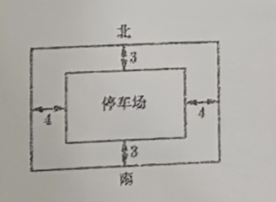

# 260101 高一数学期末考试复习卷(四)

> 👍️ 好题
> ⭕ 常见必考题

## 一、填空题

1. 已知集合 $A=\{-1,1,2\}$, $B=\{x \mid x^{2}+x=0\}$, 则 $A \cap B=$ \_\_\_\_\_\_\_\_\_\_\_\_

2. 不等式 $x^{2}-2x+1\leq 0$ 的解集为 \_\_\_\_\_\_\_\_\_\_\_\_

3. 函数 $f(x)=x+\dfrac{4}{x}, x\in[-1,-4]$ 的值域为 \_\_\_\_\_\_\_\_\_\_\_\_

4. 计算: $\log_{2}\dfrac{20}{9}+2\log_{2}3-\log_{2}5+7^{\log_{7}2}=$ \_\_\_\_\_\_\_\_\_\_\_\_

5. 用“二分法”求方程 $x^{2}+x-4=0$ 在区间 $(1,2)$ 内的实根, 首先取区间中点 $x=1.5$ 进行判断, 那么下一个取的点是 $x=$ \_\_\_\_\_\_\_\_\_\_\_\_

6. 已知条件 $p: 2k-1\leq x\leq 1-k$, $q: -3\leq x<3$, 且 $p$ 是 $q$ 的必要条件, 则实数 $k$ 的取值范围为 \_\_\_\_\_\_\_\_\_\_\_\_

7. 若集合 $A=\{x \mid x^{2}+5x-6=0\}$, $B=\{x \mid ax+3=0, a\in \mathbb{R}\}$, 且 $B \subset A$, 则满足条件的实数 $a$ 的取值集合为 \_\_\_\_\_\_\_\_\_\_\_\_

8. ❌已知函数 $f(x)=2^{|x-a|}$ 在区间 $[1,+\infty)$ 上是严格增函数, 则实数 $a$ 的取值范围为 \_\_\_\_\_\_\_\_\_\_\_\_

9. ❌⭕ 已知函数 $y=f(x)$ 是定义在实数集 $\mathbb{R}$ 上的偶函数, 若 $f(x)$ 在区间 $(0,+\infty)$ 上是严格增函数, 且 $f(2)=0$, 则不等式 $\dfrac{f(x)}{x}\leq 0$ 的解集为 \_\_\_\_\_\_\_\_\_\_\_\_

10. 若关于 $x$ 的不等式 $a^2< \mid x\mid + \mid x+1\mid$ 对一切实数恒成立, 则实数 $a$ 的取值范围是 \_\_\_\_\_\_\_\_\_\_\_\_

11. 👍️已知函数 $f(x)=\begin{cases} x^{2}+3x & x\geq 0 \\ 3x-x^{2} & x<0 \end{cases}$, 若 $f(a^{2}-3)+f(2a)>0$, 则实数 $a$ 的取值范围为 \_\_\_\_\_\_\_\_\_\_\_\_

12. ❌已知集合 $A=\left\{x \left | |x-m| < m+\dfrac{1}{3} \right. , \text{ 其中 } x,m\in \mathbb{Z}, \text{ 且 } m>0\right\}$, $B=\left\{x \left | | x+\dfrac{1}{3}| < 2m \right. , \text{ 其中 } x,m\in \mathbb{Z}, \text{ 且 } m>0\right\}$, 则 $A \cap B$ 的元素个数为 \_\_\_\_\_\_\_\_\_\_\_\_ (用含正整数 $m$ 的式子表示)

## 二、选择题

13. 函数 $y=\dfrac{4^{x}+1}{2^{x}}$ 的图像的对称性为（   ）
    A. 关于 $x$ 轴对称            B. 关于 $y$ 轴对称          C. 关于原点对称                    D. 关于直线 $y=x$ 对称

14. 已知全集 $U=\mathbb{R}$ 及集合 $A=\left\{ a \left| \dfrac{1}{4}\leq 2^{2-a}<8, \text{且 } a\in \mathbb{Z} \right. \right\}$, $B=\left\{ b \left| b^{2}+3b-10>0, \text{其中 } b\in \mathbb{R} \right. \right\}$, 则 $A\cap\overline{B}$ 的元素个数为（   ）
    A. 4                                 B. 3                               C. 2                                           D. 1

15. 已知函数 $y=2^{x}+x$, $y=\ln x+x$, $y=\lg x+x$ 的零点依次为 $x_{1}$, $x_{2}$, $x_{3}$, 则 $x_{1}$, $x_{2}$, $x_{3}$ 的大小关系为（   ）
    A. $x_{1}<x_{2}<x_{3}$       B. $x_{2}<x_{1}<x_{3}$            C. $x_{2}<x_{3}<x_{1}$                   D. $x_{1}<x_{3}<x_{2}$

16. ❌设 $y=f(x)$ 是定义在 $\mathbb{R}$ 上的奇函数, 且当 $x\geq 0$ 时, $f(x)=x^{2}$, 若对任意的 $x\in[t,t+2]$, 不等式 $f(x+t)\geq 2f(x)$ 恒成立, 则实数 $t$ 的取值范围是（   ）
    A. $[\sqrt{2},+\infty)$            B. $[2,+\infty)$                      C. $(0,2]$                             D. $[-\sqrt{2},-1]\cup[\sqrt{2},\sqrt{3}]$

## 三、解答题

17. 已知 $a$, $b$ 是任意实数, 求证: $a^{4}+b^{4}\geq a^{3}b+ab^{3}$, 并指出等号成立的条件.

18. 某居民小区欲在一块空地上建一面积为 $1200 \text{m}^{2}$ 的矩形停车场, 停车场的四周留有人行通道, 设计要求停车场外侧南北的人行通道宽 $3 \text{m}$, 东西的人行通道宽 $4 \text{m}$, 如图所示 (图中单位: m), 问如何设计停车场的边长, 才能使人行通道占地面积最小? 最小面积是多少?
    

---
19. 设 $f(x)=\dfrac{-2^{x}+a}{2^{x+1}+b}$ ($a$, $b$ 为实常数).
    ❌(1) 当 $a=b=1$ 时, 证明: $y=f(x)$ 不是奇函数;
    (2) 当 $a=-1$, $b=-2$ 时, 判断并证明函数 $y=f(x)$ 的奇偶性.

20. 已知函数 $f(x)=\lg\left(x+\dfrac{a}{x}-2\right)$, 其中 $a$ 为大于零的常数.
    (1) 当 $a=1$ 时, 求函数 $f(x)$ 的定义域;
    ❌(2) 若对任意 $x\in[2,+\infty)$, 恒有 $f(x)>0$, 试确定 $a$ 的取值范围;
    ❌(3) 若 $f(x)$ 的值域为 $\mathbb{R}$, 求 $a$ 的取值范围.

---

21. 对于定义在 $D$ 上的函数 $y=f(x)$, 设区间 $[m,n]$ 是 $D$ 的一个子集, 若存在 $x_0\in(m, n)$, 使得函数 $y=f(x)$ 在区间 $[m,x_0]$ 上是严格减函数, 在区间 $[x_0,n]$ 上是严格增函数, 则称函数 $y=f(x)$ 在区间 $[m,n]$ 上具有性质 $P$.
    (1) 若函数 $y=ax^2+bx$ 在区间 $[0,1]$ 上具有性质 $P$, 写出实数 $a$, $b$ 所满足的条件;
    ❌(2) 设 $c$ 是常数, 若函数 $y=x^3-cx$ 在区间 $[1,2]$ 上具有严格增（~~性质 $P$~~）, 求实数 $c$ 的取值范围.