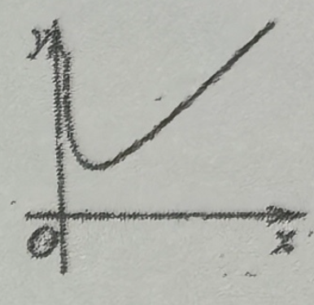

# 260101 高一数学期末考试复习卷(七)
> 👍️ 好题
> ⭕ 常见必考题
## 一、填空题

1. 已知全集 $U=(-\infty,1]$，集合 $A=(-1,1)$，则 $\overline{A}$ = \_\_\_\_\_\_\_\_\_\_\_\_.  
2. 已知集合 $A=\{(x,y)|4x+y=6\}$，$B=\{(x,y)|x-y=4\}$，则 $A \bigcap B$ = \_\_\_\_\_\_\_\_\_\_\_\_\_.  
3. 满足 $\{a,b\} \subseteq M \subseteq \{a,b,c,d,e,f\}$ 的集合 $M$ 有 \_\_\_\_\_\_\_\_\_\_\_\_ 个。  
4. 👍️已知函数 $y=f(x)$ 为偶函数，则函数 $y=f(x+1)$ 的对称轴是 \_\_\_\_\_\_\_\_\_\_\_\_\_.  
5. 若集合 $A=\{x|x \leq 1\}$，集合 $B=\{x|x \geq a\}$，且 $A \cup B = \mathbb{R}$，则 $a$ 的取值范围为 \_\_\_\_\_\_\_\_\_\_\_\_\_.  
6. 若 $3^{a}=7^{b}=63$，则 $\dfrac{2}{a}+\dfrac{1}{b}$ 的值为 \_\_\_\_\_\_\_\_\_\_\_\_\_.  
7. 集合 $A=\{y|y=\sqrt{x^{2}-1}\}$，$B=\{x|y=\sqrt{-x^{2}+x+2}\}$，则 $A \cup B$ = \_\_\_\_\_\_\_\_\_\_\_\_\_.  
8. ❌2️⃣已知不等式 $|x-4|-|x+3|<a$ 有解，则 $a$ 的取值范围是 \_\_\_\_\_\_\_\_\_\_\_\_\_.  
9. ❌设 $k \in \{-2,-1,\dfrac{1}{3},\dfrac{2}{3},2\}$，若 $x \in (-1,0) \cup (0,1)$，且 $x^{k}>|x|$，则 $k$ 取值的集合是 \_\_\_\_\_\_\_\_\_\_\_\_\_.  
10. ❌设 $f(x)=\lg\dfrac{1+a \cdot 2^{x}+4^{x}}{3}$，当 $x \in (-\infty,1]$ 时，$f(x)$ 恒有意义，则实数 $a$ 的取值范围是 \_\_\_\_\_\_\_\_\_\_\_\_\_.  
11. ❌2️⃣已知 $a>b>1$ 且 $a^{2}-6a-2m+1=0$，$b^{2}-6b-2m+1=0$，则实数 $m$ 取值范围是 \_\_\_\_\_\_\_\_\_\_\_\_\_.  
12. 👍️若函数 $f(x)$ 在定义域 $D$ 内某区间 $I$ 上是严格增函数，且 $\dfrac{f(x)}{x}$ 在 $I$ 上是严格减函数，则称 $y=f(x)$ 在 $I$ 上是“弱增函数”。已知函数 $g(x)=x^{2}+(4-m)x+m$ 在 $(0,2]$ 上是“弱增函数”，则实数 $m$ 的值为 \_\_\_\_\_\_\_\_\_\_\_\_\_.  

## 二、选择题

13. ❌设 $a>b$，则使 $\dfrac{1}{a}>\dfrac{1}{b}$ 成立的一个充要条件是（   ）  
    A. $b<0<a$            B. $0<a<b$                    C. $b<a<0$                   D. $-1<b<0<a<1$

14. $h(x)=f(x)+g(x)$，则“$f(x),g(x)$ 均为偶函数”是“$h(x)$ 为偶函数”的（   ）  
    A. 充要条件           B. 充分不必要条件         C. 必要不充分条件       D. 非充分非必要条件

15. 下列四个函数中，图像如右图所示的只能是（   ）  
    A. $y=x+\lg x$             B. $y=x-\lg x$         C. $y=-x+\lg x$          D. $y=-x-\lg x$

16. 设函数 $f(x)=\log_{4}{x}-(\dfrac{1}{4})^{x}$ 和 $g(x)=\log_{\frac{1}{4}}{x}-(\dfrac{1}{4})^{x}$ 的零点分别为 $x_{1}$，$x_{2}$，则（   ）  
A. $x_{1}x_{2}=1$                   B. $0<x_{1}x_{2}<1$        C. $1<x_{1}x_{2}<2$         D. $x_{1}x_{2} \geq 2$

## 三、解答题

17. 记函数 $f(x)=\sqrt{\dfrac{x+4}{x+1}-2}$ 的定义域为 $A$，$g(x)=\log_{3}{(x-m-2)(x-m)}$ 的定义域为 $B$。若 $A \subseteq B$，求实数 $m$ 的取值范围。

18. 已知函数 $f(x)=\begin{cases} cx+1 & (0<x<c) \\ 2^{-\dfrac{x}{c^2}}+1 & (c \leq x<1) \end{cases}$，且 $f(c^{2})=\dfrac{9}{8}$。  
    (1) 求实数 $c$ 的值；❌ (2) 解不等式 $f(x)>\dfrac{\sqrt{2}}{8}+1$。

----

19. 运货卡车以每小时 $x$ 千米的速度匀速行驶 1300 千米，按交通法规限制 $50 \leq x \leq 100$（单位：千米/小时）。假设柴油的价格是每升 7 元，而汽车每小时耗油 $\left(2+\dfrac{x^{2}}{360}\right)$ 升，司机的工资是每小时 30 元。  
（1）求这次行车总费用 $y$ 关于 $x$ 的表达式（总费用为油费与司机工资的综合）；  
（2）当 $x$ 为何值时，这次行车的总费用最低，并求出最低费用的值。（精确到 0.1 元）

20. 已知函数 $f(x)=1-\dfrac{6}{a^{x+1}+a}$（$a>0$，$a \neq 1$）是定义在 $\mathbb{R}$ 上的奇函数。  
（1）求实数 $a$ 的值及函数 $y=f(x)$ 的值域；  
（2）若不等式 $t \cdot f(x) \geq 3^{x}-3$ 在 $x \in [1,2]$ 上恒成立，求实数 $t$ 的取值范围。

---

❌2️⃣21. 已知函数 $f(x)=\sqrt{1+x}+\sqrt{1-x}$。  
(1) 求函数 $f(x)$ 的定义域和值域；  
(2) 设 $F(x)=\dfrac{a}{2} \cdot \left[f^{2}(x)-2\right]+f(x)$（$a$ 为实数），求 $F(x)$ 在 $a=1$ 时的值域；  
(3) 若 $-m^{2}+2tm+\sqrt{2} \leq \sqrt{2}-a$ 对所有负实数 $a$ 及 $t \in [-1,1]$ 恒成立，求实数 $m$ 的取值范围。

> 简化的题 
>
> 若 $-m^{2}+2tm+\sqrt{2} \leq \sqrt{2}$ 对所有 $t \in [-1,1]$ 恒成立，求实数 $m$ 的取值范围。