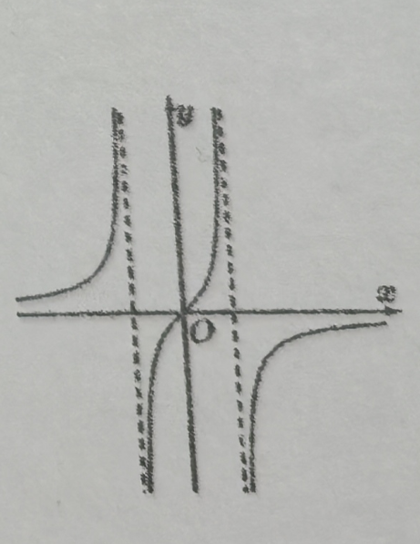
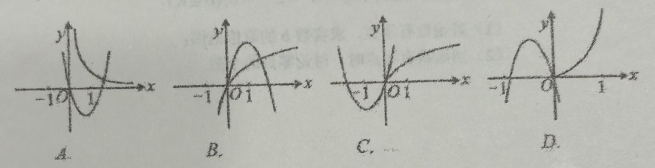

# 260101 高一数学期末考试复习卷(八)

> 👍️ 好题
> ⭕ 常见必考题

## 一、填空题

1、满足关系式 $A\subseteq\{0,1,2\}$ 的集合 A 共有\_\_\_\_\_\_个。

2、化简 $\mid a\mid+(a^2)^{\frac{1}{2}} + \sqrt[3]{a^3}(a<0)= $ \_\_\_\_\_\_\_\_\_\_\_\_。

3、不等式 $\dfrac{5}{x+1}\geq1$ 的解集是\_\_\_\_\_\_\_\_\_\_\_\_。

4、$f(x)=x^{2}+2x+1,x\in[-2,2]$ 的值域是\_\_\_\_\_\_\_\_\_\_\_\_。

5、函数 $y=0.5^{x^{2}-2x}$ 严格增区间为\_\_\_\_\_\_\_\_\_\_\_\_。

6、已知 $\lg a<1$，化简 $\sqrt{(\lg a)^{2}-\lg\dfrac{a^2}{10}}$，其结果为\_\_\_\_\_\_\_\_\_\_\_\_。

7、已知 $y=f(x)$ 为奇函数，当 $x>0$ 时 $f(x)=x(1-x)$，则当 $x\in \mathbf{R}$ 时，则 $f(x)=$ \_\_\_\_\_\_\_\_\_\_\_\_。

8、❌一元二次方程 $x^{2}+(2a-1)x+a-2=0$ 的一根比 1 大，另一根比 -1 小，则实数 a 的取值范围是\_\_\_\_\_\_\_\_\_\_\_\_。

9、❌定义运算: $a*b=\begin{cases}a, & a\leq b, \\ b, & a>b,\end{cases}$ 如 $1*2=1$，则函数 $f(x)=(2^{x})*(2^{-x})$ 的值域为\_\_\_\_\_\_\_\_\_\_\_\_。

10、将函数 $f(x)=2^{x}$ 的图像向左平移一个单位得图像 $C_{1}$，再将 $C_{1}$ 向上平移一个单位得到图像 $C_{2}$，作出 $C_{2}$ 关于 y 轴的对称图像 $C_{3}$，则 $C_{3}$ 的解析式是\_\_\_\_\_\_\_\_\_\_\_\_。

11、❌奇函数 $f(x)$ 满足: ① $f(x)$ 在 $(0,+\infty)$ 内严格增; ② $f(1)=0$; 则不等式 $(x-1)f(x)>0$ 的解集为\_\_\_\_\_\_\_\_\_\_\_\_。

12、❌已知常数 $a$、$b$、$c\in \mathbf{R}$，函数 $f(x)=\dfrac{bx+c}{x^{2}-a}$ 的图象如图所示，则 $a$、$b$、$c$ 的大小关系用“<”可以表示为\_\_\_\_\_\_\_\_\_\_\_\_。

## 二、选择题

13. 设集合 $M=\{x\mid -1\leq x<2\}$，$N=\{x\mid x-k\leq0\}$，若 $M\cap N\neq\phi$，则 k 的取值范围是(   )
    A. $(-\infty,2]$                              B. $[-1,+\infty)$                         C. $(-1,+\infty)$                      D. $[-1,2]$

14. 函数 $f(x)=\ln x+2x-6$ 的零点一定位于区间(   )
    A. (1,2)                                     B. (2,3)                                   C. (3,4)                                  D. (4,5)

15. 在同一直角坐标系中，二次函数 $y=ax^{2}+bx$ 与幂函数 $y=\dfrac{b}{a}x^{2}(x>0)$ 图像的关系可能为(   )

16. ❌已知“**非空集合 M 的元素都是集合 P 的元素**”是假命题，给出下列四个命题：
    ① M 的元素不都是 P 的元素；  ② M 的元素都不是 P 的元素；
    ③ 存在 $x\in M$ 且 $x\in P$；            ④ 存在 $x\in M$ 且 $x\notin P$；
    这四个命题中，真命题的个数为(   )
    A. 1 个                                       B. 2 个                              C. 3 个                                 D. 4 个

##  三、解答题

17. ❌设函数 $y=(a^{2}+4a-5)x^{2}-4(a-1)x+3$ 的图像都在 $x$ 轴上方，求实数 $a$ 的取值范围。==未讨论$(a^{2}+4a-5) < 0$，虽然这不满足题意，但需要写出来，否则不完整==

---

18. 已知函数 $f(x^{2}-3)=\lg\dfrac{x^{2}}{x^{2}-6}$。
    (1) 求 $f(x)$ 表达式及定义域；(2) 判断函数 $f(x)$ 的奇偶性，并证明。

19. 设关于 x 的函数 $f(x)=4^{x}-2^{x+1}-b$，$(b\in \mathbf{R})$。
    (1) 若函数有零点，求实数 b 的取值范围；
    (2) 当函数有零点时，讨论零点的个数。

20. 已知函数 $f(x)=\dfrac{2^{x}+a}{2^{x}+b}$。
    (1) 当 $a=4$，$b=-2$ 时，解关于 $x$ 的方程 $f(x)=2^{x}$；
    (2) 若函数 $f(x)$ 是定义在 $\mathbf{R}$ 上的奇函数，求函数 $f(x)$ 解析式。
---

21. 为了助力企业发展，某地政府决定向当地企业发放补助款，其中对纳税额在 3 万元至 6 万元（包括 3 万元和 6 万元）的小微企业做统一方案。方案要求同时具备下列两个条件：① 补助款 $f(x)$ （万元）随企业原纳税额 $x$ （万元）的增加而增加；② 补助款不低于原纳税额 $x$ （万元）的 50%，经测算政府决定采用函数模型 $f(x)=\dfrac{x}{4}-\dfrac{b}{x}+4$ （其中 b 为参数）作为补助款发放方案。
（1）判断使用参数 $b=12$ 是否满足条件，并说明理由；
（2）❌求同时满足条件①、②的参数 b 的取值范围。