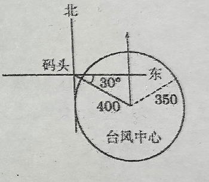

# 260109 高一数学课本练习

## 一、例题

1、👍️设 $a$、$b$ 为实数，求证 $|a| - |b| \leqslant |a - b|$，并指出等号成立的条件。

2、某船从甲码头顺流航行 75 千米到达乙码头，停留 30 分钟后再逆流航行 126 千米到达丙码头。如果水流速度为 4 千米/时，该船要在 5 小时内（包含 5 小时）完成整个航行任务，那么船的速度至少要达到多少千米/时？

3、已知某码头东偏南 $30^\circ$ 方向有一个台风中心，台风中心距该码头的初始距离为 400 千米。台风以 130 千米/时的速度向正北方向移动，且距台风中心 350 千米以内的范围都受到台风影响。问：从初始时刻起多少小时后，该码头将受到台风影响？码头受台风影响的时间将持续多久？

4、对数视力表是根据视角的原理设计的。所谓视角就是由物体边缘上的两点在眼结点处所形成的夹角，用 $\alpha$ 表示，其单位为分。视力表是以 $1'$ 视角为单位设计的。我国视力的记录采用“5分记录”，就是以5减去视角的常用对数值来表达视力 $L$，即满足 $L = 5 - \lg\alpha$。
(1) 如果规定能分辨 $1'$ 视角的视力为正常标准视力，那么采用“5分记录”，其视力记录值为多少？
(2) 在标准距离处，若远视力表最大视标(E)的视角为 $10'$，最小视标(E)的视角为 $0.501'$，求其直接可测的视力范围。（精确到0.1）

## 二、课堂练习

1、已知 $a < 2$，求函数 $y = |x - 1|$，$x \in [a, 2]$ 的最大值。

2、👍️已知 $a$ 为实数，写出关于 $x$ 的方程 $ax^2 + 2x + 1 = 0$ 至少有一个实数根的一个充要条件，一个充分非必要条件和一个必要非充分条件。

3、❌👍️已知 $a$、$b$ 是正数，求证 $\sqrt{(1+a)(1+b)} \geqslant 1 + \sqrt{ab}$。

4、求函数 $y = \log_a(a - a^x) (a > 0, a \neq 1)$ 的定义域。

5、已知函数 $y = \log_{0.1}(x + m)$ 的图像不经过第三象限，求实数 $m$ 的取值范围。

6、若指数函数 $y = \left( \log_a \frac{3}{5} \right)^x (0 < a < 1)$ 在 $\mathbb{R}$ 上严格递增，求实数 $a$ 的取值范围。

7、❌某车辆装配车间每2小时装配完成一辆车。按照计划，该车间今天生产8小时，试用解析法和图像法分别表示从开始生产的时刻起所经过的时间 $x$（时）与装配完成的车辆数 $y$（辆）之间的函数 $y = f(x)$。

## 三、课后练习
1、已知集合 $A = \{ x | (a - 1)x^2 + 3x - 2 = 0 \}$，是否存在这样的实数 $a$，使得集合 $A$ 有且仅有两个子集？若存在，求出实数 $a$ 的值及对应的两个子集；若不存在，说明理由。

2、❌设 $a \in \mathbb{R}$，求关于 $x$ 的方程 $ax = a^2 + x - 1$ 的解集。==分类讨论==

3、设 $\alpha: 1 \leqslant x < 4$，$\beta: x < m$，$\alpha$ 是 $\beta$ 的充分条件，求实数 $m$ 的取值范围。

4、设点 $(\sqrt{2}, 2)$ 在幂函数 $y_1 = x^a$ 的图像上，点 $\left( -2, \frac{1}{4} \right)$ 在幂函数 $y_2 = x^b$ 的图像上，问当 $x$ 取何值时，$y_1 = y_2$？

5、对函数 $y = \log_a(x + 1) (a > 0, a \neq 1)$，已知当 $x \in [0, 1]$ 时，恰有 $y \in [0, 1]$，求实数 $a$ 的值。

6、已知函数 $y = \dfrac{ax + 1}{x + 2}$，$a \in \mathbb{Z}$。问：是否存在整数 $a$，使该函数在 $x \in [-1, +\infty)$ 上严格递减，并且函数值不恒为负？若存在，找出一个满足此条件的 $a$；若不存在，请说明理由。

7、设集合 $A = \left\{ x \left| \left( \dfrac{1}{2} \right)^{x^2 - x - 6} > 1 \right. \right\}$，集合 $B = \{ x | \log_3(x - 1) < 2 \}$，求 $A \cup B$。

8、[❓️] 已知关于 $x$ 的方程 $b^2 (\log_2 x)^2 = 10 \log_2 x$ 有两个不同的整数解，求出其整数解，并写出实数 $b$ 的最大值。

9、已知 $a \neq 0$，试讨论函数 $f(x) = \frac{a}{1 - x^2}$ 在区间 $(0, 1)$ 上的单调性。

10、科学家以里氏震级来度量地震的强度，若设 $I$ 为地震时所散发出来的相对能量程度，则里氏震级度量 $r$ 可定义为 $r = \frac{2}{3} \lg I + 2$，试比较 6.9 级地震和 7.8 级地震的相对能量比值（精确到个位）。

11、某物流公司在上海及杭州分别有库存的某机器12台和6台，现决定销售给A市10台、B市8台。已知上海调运一台机器到A、B市的运费分别为400元和800元；杭州调运一台机器到A、B市的运费分别为300元和500元。设从上海调运 $x$ 台机器往A市，求总运费 $y$（元）关于 $x$ 的函数关系。
