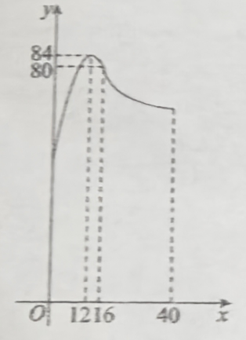

# 260114 高一数学期末考试复习卷（十一）

## 一、填空题（本大题满分36分，每小题3分）

1.  设全集 $U = \R$，已知集合 $A = \left\{x \mid \left|4 - x < 2x + 1\right|\right\}$，则 $\overline{A} =$\_\_\_\_\_\_\_\_\_\_\_\_\_.

2.  函数 $f(x) = \dfrac{1}{\sqrt{2 - x}}$ 定义域为 $M$，$g(x) = 3^{x} - 2$ 的值域为 $N$，则 $M \cap N =$\_\_\_\_\_\_\_\_\_\_\_\_\_.

3.  已知 $a > 0$，化简 $\sqrt[3]{a^{2}} \cdot \left(\dfrac{1}{a}\right)^{\frac{5}{2}} \cdot a^{\frac{5}{6}} =$\_\_\_\_\_\_\_\_\_\_\_\_\_.

4.  设集合 $M = \left\{x \mid x^{2} \leq 1\right\}$，$N = \{b\}$，若 $M \cup N = M$，则实数 $b$ 的取值范围为 \_\_\_\_\_\_\_\_\_\_\_\_\_.

5.  若 $\lg 2 = a$，$\lg 3 = b$，则用 $a$ 和 $b$ 表示 $\log_{5} 12 =$\_\_\_\_\_\_\_\_\_\_\_\_\_.

6.  利用反证法证明“若 $a + b < 0$，则 $a, b$ 至少有一个小于 $0$”时，假设应为 \_\_\_\_\_\_\_\_\_\_\_\_\_.

7.  幂函数 $f(x) = (m^{2} - m - 1)x^{m^2 + m - 3}$ 在 $(0, +\infty)$ 上是减函数，则实数 $m$ 的值为 \_\_\_\_\_\_\_\_\_\_\_\_\_.

8.  已知 $a, b \in \R$，且 $a - 3b + 6 = 0$，则 $2^{a} + \dfrac{1}{8^{b}}$ 最小值为 \_\_\_\_\_\_\_\_\_\_\_\_\_.

9.  已知函数 $y = f(x)$ 的表达式为 $f(x) = x - 4 \log_{3} x$，用二分法计算此函数在区间 $[1, 3]$ 上零点的近似值，第一次计算 $f(1)$、$f(3)$ 的值，第二次计算 $f\left(x_{1}\right)$ 的值，第三次计算 $f\left(x_{2}\right)$ 的值，则 $x_{2} =$\_\_\_\_\_\_\_\_\_\_\_\_\_.

10. 我们国内生产总值由1978年初的3679亿元增长到2017的年末的82.7万亿元，计算出年平均增长率 \_\_\_\_\_\_\_\_\_\_\_\_\_. (结果精确到0.1%)

11. 已知函数 $f(x) = \begin{cases} (1-2a)x + 3a, & x<1 \\ 2^{x-1}, & x \geqslant 1 \end{cases}$ 的值域为 $\R$，则实数 $a$ 的取值范围是 \_\_\_\_\_\_\_\_\_\_\_\_\_.

12. 下列==四（实际3个）==个命题中正确的是 \_\_\_\_\_\_\_\_\_\_\_\_\_.
    ①已知定义在 $\R$ 上的偶函数 $y = f(1 + x)$，则 $f(1 + x) = f(1 - x)$;
    ②已知函数 $f(x) = \dfrac{1}{x - 3.5}$，$x \in \N^{*}$，既无最大值，也无最小值；
    ③函数 $f(x) = (2^{|x|} - 1)^{2} - 5(2^{|x|} - 1) + 6$ 的所有零点构成的集合共有4个子集；

## 二、选择题（本大题满分16分，每小题4分）

13. 已知 $a \in \R$，则“$a < 1$”是“$\dfrac{1}{a} > 1$”的（   ）
    A. 充分非必要条件                     B. 必要非充分条件                            C. 充要条件                          D. 既非充分也非必要条件
    
14. 下列函数中，在 $R$ 上既是奇函数又是减函数的是（   ）
    A. $y = \dfrac{1}{x}$                                        B. $y = \ln \dfrac{1 - x}{1 + x}$                                 C. $y = -x \mid x \mid$                      D. $y = 3^{-x}$

15. 设集合 $A = \left\{x \mid x^{2} + 2x - 3 > 0\right\}$，集合 $B = \left\{x \mid x^{2} - 2ax - 1 \leq 0, a > 0\right\}$，若 $A \cap B$ 中恰有一个整数，则实数 $a$ 的取值范围是（   ）
    A. $\left(0, \dfrac{3}{4}\right)$                                   B. $\left[\dfrac{3}{4}, \dfrac{4}{3}\right)$                                          C. $\left[\dfrac{3}{4}, 2\right)$                            D. $\left(1, +\infty\right)$
    
16. 在天文学中，天体的明暗程度可以用星等或亮度来描述. 两颗星的星等与亮度满足 $m_{2} - m_{1} = \dfrac{5}{2} \lg \dfrac{E_{1}}{E_{2}}$，其中星等为 $m_{k}$ 的星的亮度为 $E_{k}$ ($k = 1, 2$). 已知太阳的星等是 $-26.7$，天狼星的星等是 $1.45$，则太阳与天狼星的亮度的比值为（   ）
    A. $10^{10.1}$                                            B. $10.1$                                          C. $\lg 10.1$                              D. $10^{-10.1}$

## 三、解答题（满分48分）

17. 设函数 $f(x) = \dfrac{x + 1}{x - 2}$ ($x > 3$).
    (1) 指出 $f(x)$ 在 $(3, +\infty)$ 上单调性，并证明你的结论；
    (2) 若 $f(x) - a < 0$ 在 $(3, +\infty)$ 上有解，求 $a$ 的取值范围.

----

18. 已知集合 $A = \left\{x \mid \left(\dfrac{1}{2}\right)^{x^2-x-6} < 1\right\}$，$B = \left\{x \mid \mid x + a - 2 \mid < 2\right\}$，若 $A \cap B = \varnothing$.
    (1) 求实数 $a$ 的取值范围； (2) 求 $y = f\left(a\right) = 2 \cdot 3^{2a - 1} - 16 \cdot 3^{a}$ 的值域.
    
19. 已知 $a \in \R$，函数 $f\left(x\right) = \log_{2}\left[(a - 3)x + 3a - 4\right]$；
    (1) 当 $a = 2$ 时，解不等式 $f\left(\dfrac{1}{x}\right) < 0$；
    (2) 若函数 $y = f\left(x^{2} - 4x\right)$ 的值域为 $R$，求 $a$ 的取值范围.

20. 已知常数 $a \in \R$，函数 $f\left(x\right) = \log_{2}\left(\dfrac{1}{x} + a\right)$.
    (1) 若 $a = 3$，求不等式 $f(x) > 0$ 的解集；
    (2) 若函数 $y = f(x) - \log_{2}\left[(a - 4)x + 2a - 5\right]$ 至少有一个零点在 $\left(-\dfrac{1}{2}, \dfrac{1}{2}\right)$ 内，求实数 $a$ 的取值范围.

21. 研究表明：在一节40分钟的网课中，学生的注意力指数 $y$ 与听课时间 $x$（单位：分钟）之间的变化曲线如图所示，当 $x \in [0, 16]$ 时，曲线是二次函数图像的一部分；当 $x \in [16, 40]$ 时，曲线是函数 $y = 80 + \log_{0.8}(x + a)$ 图像的一部分，当学生的注意力指数不高于68时，将学生处于“欠佳听课状态”.
    （1）求函数 $y = f(x)$ 的解析式；
    （2）在一节 40 分钟的网课中，学生处于“欠佳听课状态”的时间有多长？（精确到1分钟）
    