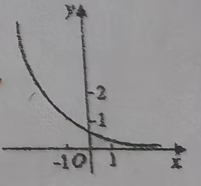

# 1211 高一数学周练卷

班级 $\underline{\text{高一1}}$ 姓名 $\underline{\text{陈奕璇}}$ 学号 $\underline{\text{12}}$  得分 $\underline{\text{70}}$

## 一、填空题  
1. 指数函数 $ y = f(x) $ 的图像过点 $P(2,4)$，则 $f(x)=$\_\_\_\_\_\_\_\_\_\_\_\_.  
2. 函数$ f(x)=a^{x - 3}+3 $的图象恒过定点\_\_\_\_\_\_\_\_\_\_\_\_.  
3. 已知幂函数 $f(x)$ 的图像过点$ (2,\dfrac{\sqrt{2}}{2}) $，则 $f(3)$ =\_\_\_\_\_\_\_\_\_\_\_\_.  
4. 函数$ y = \sqrt{\log_{2}(3x - 2)} $的定义域是\_\_\_\_\_\_\_\_\_\_\_\_.  
5. 不等式 $ 2^{x^{2} - 4x - 3}<\left(\dfrac{1}{2}\right)^{3(x - 1)} $的解集为\_\_\_\_\_\_\_\_\_\_\_\_.  
6. 函数 $ y = \log_{0.1}(x^{2}-2x - 3) $的单调递增区间为\_\_\_\_\_\_\_\_\_\_\_\_.  
7. 若$ \log_{a}\dfrac{2}{3}<1 $，则实数 $a$ 的取值范围为\_\_\_\_\_\_\_\_\_\_\_\_.  
8. 若函数$ f(x)=a^{x}-1 $的定义域和值域都是 $[0,2]$，则实数 $a$ 等于\_\_\_\_\_\_\_\_\_\_\_\_.  
9. 函数$ f(x)=a^{x} $在区间 $[1,2]$ 上的最大值与最小值的差为 $ \dfrac{a}{2} $，则 $a=$\_\_\_\_\_\_\_\_\_\_\_\_.  
10. 已知函数$ f(x)=\lg(ax^{2}+3x + 2) $的值域为 $\R$，则实数 $a$ 的取值范围是\_\_\_\_\_\_\_\_\_\_\_\_.  
11. 已知函数$ f(x)=\begin{cases}a^{x},x>1\\(2 - 3a)x + 1,x\leq1\end{cases} $，若函数 $f(x)$ 在 $\R$ 上为减函数，则实数 $a$ 的取值范围是\_\_\_\_\_\_\_\_\_\_\_\_.  
12. ❌若函数$ f(x)=\begin{cases}ax + 2,x\leq0\\\log_{\frac{1}{2}}(x + 1)+a,x>0\end{cases} $存在最大值，则实数 $a$ 的取值范围为\_\_\_\_\_\_\_\_\_\_\_\_.  

## 二、选择题  
13. 函数$ y = -a^{x}(a>0\text{且}a\neq1) $的图像（   ）  
A. 与$ y = a^{x} $的图像关于 $y$ 轴对称                        B. 与$ y = a^{x} $的图像关于坐标原点对称  
C. 与$ y = a^{-x} $的图像关于 $y$ 轴对称                      D. 与$ y = a^{-x} $的图像关于坐标原点对称  

14. 函数$ f(x)=a^{x - b} $的图象如图，其中 $a$、$b$为常数，则下列结论正确的是（   ） 
    A. $a>1，b<0$                      B. $a>1，b>0$                             C. $0<a<1，b>0$                         D. $0<a<1，b<0$  
     

## 三、解答题  

15、作出下列函数的大致图像  
  $ y=x^{-5} $,                   $ y=x^{\frac{1}{3}} $,                  $ y=x^{\frac{2}{3}} $,              $ y=\dfrac{-x-1}{x+2} $,                 ❌ $ y=\left|2^{x}-1\right| $,                         $ y=|\lg|x| |$  

16、求下列函数的定义域和值域.  
❌(1) $ y=\left(\dfrac{2}{3}\right)^{-|x|} $                                      (2) $ y=\dfrac{3^{x}}{1+3^{x}} $                            ❌ (3) $ y = \log_{2}(9 - 3^{x}) $

17、已知函数$ f(x)=\log_{2}(4^{x}+b\cdot2^{x}+4) $, $g(x)=x$.  
(1)当 $b=-5$ 时，求 $f(x)$ 的定义域;  
(2)❌若 $f(x)>g(x)$ 恒成立，求实数 $b$ 的取值范围.  

❌18、已知幂函数$ f(x)=(p^{2}-3p+3)x^{p^{2}-\frac{3}{2}p-\frac{1}{2}} $满足 $f(2)<f(4)$.  
(1)求函数 $f(x)$ 的解析式；  
(2)若函数$ g(x)=[f(x)]^{4}+m[f(x)]^{2} $,$ x\in[1,3] $,且 $g(x)$ 的最小值为 0,求实数 $m$ 的值.