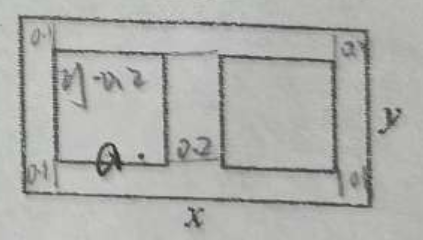

# 260109 高一数学期末考试复习卷(十) 周练
> 61

## 一、填空题

1.  设 $m$ 实数，集合 $M = \{m, m^{2}\}$，若 $1 \in M$，则 $m =$\_\_\_\_\_\_\_\_\_.

2.  函数 $y = \log_{2}{\dfrac{x-2}{x+1}}$ 的定义域为\_\_\_\_\_\_\_\_\_.

3.  已知幂函数 $y = f(x)$ 图像经过点 $(2, \dfrac{1}{8})$，则 $f(\dfrac{1}{2}) =$\_\_\_\_\_\_\_\_\_.

4.  已知 $\lg2 = a, \lg3 = b$，则用 $a, b$ 表示 $\log_{6}25 =$\_\_\_\_\_\_\_\_\_.

5.  已知 $a, b$ 为实数，满足 $a^{2} + ab + b^{2} \geq 0$，则等号成立条件是\_\_\_\_\_\_\_\_\_.

6.  试用函数观点解不等式 $2^{x} - (x+1)^{\frac{1}{2}} \geq 0$，则该不等式的解集为\_\_\_\_\_\_\_\_\_.

7.  用二分法求函数 $y = f(x)$ 在区间 $(2, 3)$ 上的零点的近似值，由计算得 $f(2) = -2$，$f(3) = 0.625$，$f(2.5) = -0.984$，$f(2.75) = -0.26$。下一个求 $f(m)$，则 $m =$\_\_\_\_\_\_\_\_\_.

8.  若 $|x+1| + |x-2| > a^{2} + a + 1$ 对于一切实数 $x$ 都成立，则实数 $a$ 的取值范围是\_\_\_\_\_\_\_\_\_.

9.  ❌已知函数 $y = f(x)$ 是 $\mathbb{R}$ 上的奇函数，且是 $(-\infty, 0)$ 上的严格减函数，若 $f(1) = 0$，则满足不等式 $(x-1)f(x) > 0$ 的 $x$ 的取值范围为\_\_\_\_\_\_\_\_\_.

10. ❌如图所示，某公司拟在一张矩形海报纸上设计大小相等的左右两个矩形宣传栏，宣传栏的面积之和为 $4.5 \text{m}^2$，要求海报上四周空白的宽度为 $0.1 \text{m}$，两个宣传栏之间的空隙的宽度为 $0.2 \text{m}$，设海报纸的长和宽分别为 $x \text{m}, y \text{m}$，为节约成本（即使用纸量最少），则长 $x =$\_\_\_\_\_\_\_\_\_ $\text{m}$.

11. ❌若函数 $y = \begin{cases} 3^{x}, & x \leq 1 \\\\ -x^{2} + a, & x > 1 \end{cases}$ 的值域为 $(-\infty, 3]$，则实数 $a$ 的取值范围是\_\_\_\_\_\_\_\_\_.

12. ❌若函数 $y = (4 - x^{2})(x^{2} + ax + b)$ 的图象关于直线 $x = -3$ 对称，则 $a + b$ 的值为\_\_\_\_\_\_\_\_\_.

## 二、选择题

13. “$\dfrac{1}{x} < 1$” 是 “$x > 1$” 的（   ）条件
    A. 充分非必要                           B. 必要非充分                            C. 充要                             D. 既非充分又非必要

14. 下列函数中，既是偶函数，又在区间 $(0, +\infty)$ 上为严格减函数的是（   ）
    A. $y = x + \dfrac{1}{x}$                            B. $y = 2^{|x|}$                                       C. $y = x^{-\frac{2}{3}}$                      D. $y = \ln x$

15. ❌下列说法正确的是（   ）
    A. 方程 $x^2 + x + 1 = 0$ 的两个实数根 $x_1, x_2$ 满足 $x_1 + x_2 = -1$
    B. 关于 $x$ 的一元二次方程 $x^2 + tx + 1 = 0$ 一定有两个不相等的实数根
    C. 已知方程 $(x+3)^2 + x + 1 = 0$ 两个实数根 $x_1, x_2$，则 $x_1 \cdot x_2 = 1$
    D. 若关于 $x$ 的一元二次方程 $x^2 - x - 1 = 0$ 的两个实数根 $x_1 < x_2$，则 $x_1 < 1 < x_2$

16. ❌我们把函数 $y = x \in \mathbb{R}$ 称为高斯函数，其中 $[x]$ 表示不超过 $x$ 的最大整数，如 $[1.1] = 1, [-1.1] = -2$，则点集 $P = \{(x, y) \mid [x]^2 + [y]^2 = 1\}$ 所表示的平面区域的面积是（   ）
    A. 4                                                B. 2                                                      C. 6                                     D. 1

## 三、解答题（本大题共有5题，满分56分）

17. 已知集合 $A = \{x \mid a \leq x \leq a + 2\}$，集合 $B = \{x \mid x < -1 \text{ 或 } x > 5\}$，全集 $U = \mathbb{R}$.
    (1) 若 $a = 1$，求 $\overline{A} \cup B$；(2) 若 $A \subseteq B$，求实数 $a$ 的取值范围.
    
18. 已知 $a, b$ 都是正实数，且 $\dfrac{b}{a} = b - a$.
    (1) 求证：$a > 1$；❌(2) 求 $b$ 的最小值.
    
19. 已知定义在 $\mathbb{R}$ 上的函数 $y = f(x)$ 的表达式为 $f(x) = \dfrac{2^{x} - a}{2^{x} + a}$，若此函数为奇函数.
    (1) 求证：$y = f(x)$ 在 $\mathbb{R}$ 上为严格增函数；
    (2) 若 $m$ 为实数，解关于 $x$ 的不等式：$f(1) > f(m\lg x)$.

20. 现有某光伏产业公司为了提高生产效率，决定投入 $98$ 万元购进一套生产设备. 预计使用该设备后，每年的总收入为 $50$ 万元，前 $x$ ($x$ 为正整数) 年维修、保养费用总和为 $2x^{2} + 10x$ 万元，设使用 $x$ 年后该设备的盈利额为 $y$ 万元.
    (1) 写出 $y$ 与 $x$ 之间的函数关系式，并求从第几年开始，该设备开始盈利（盈利额为正值）；
    (2) 使用若干年后，对设备处理方案有两种：
        ① 当年平均盈利额达到最大值时，以 $30$ 万元价格处理该设备；
        ② 当盈利额达到最大值时，以 $12$ 万元价格处理该设备.
        请你研究一下哪种方案处理较为合理？请说明理由.（注：年平均盈利额为 $\omega$， $\omega = \dfrac{y}{x}$）

21. ❌已知 $y = f(x)$ 是定义在 $\mathbb{R}$ 上的函数，给定数集 $A$. 若对任意的 $x_{1}, x_{2} \in \mathbb{R}$，当 $x_{1} - x_{2} \in A$ 时，均有 $f(x_{1}) - f(x_{2}) \in A$，则称函数 $y = f(x)$ 在集合 $A$ 上封闭.
    (1) 若 $f(x) = 2024x + 1$，分别判断 $y = f(x)$ 在 $[0, +\infty)$ 和 $[0, 1]$ 上是否封闭? 说明理由；
    (2) 若 $y = f(x)$ 在 $\{3\}$ 上封闭，当 $x \in [0, 3)$ 时， $f(x) = x^{2} - 2x$，解不等式 $2 < f(x) < 3$；