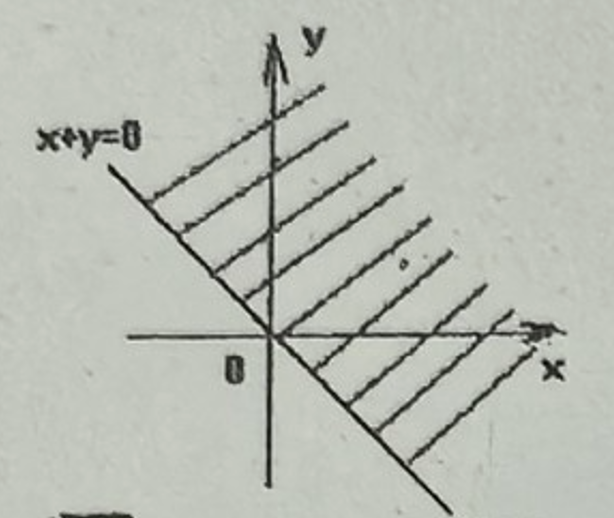

## 20260306 高一数学练习卷

### 一、填空题

1. 终边落在 $x$ 轴上的角的集合是 \_\_\_\_\_\_\_。

2. 已知角 $\alpha$ 的终边经过点 $(1,-2)$，则 $\sin \alpha + \cos \alpha =$ \_\_\_\_\_\_\_。

3. 已知 $\alpha$ 为第二象限角，则 $\dfrac{\alpha}{2}$ 的终边在第 \_\_\_\_ 象限。

4. 若 $\dfrac{\pi}{2} < \alpha < \pi$，则 $\sec \alpha \sqrt{1-\sin^2 \alpha} =$ \_\_\_\_\_\_\_。

5. 已知 $\alpha$ 为第二象限角，且 $\tan \alpha = -\dfrac{4}{3}$，则 $\sin \alpha - \cos \alpha =$ \_\_\_\_\_\_\_。

6. 若 $\cos \alpha = -\dfrac{\sqrt{3}}{2}$，且角 $\alpha$ 的终边经过点 $P(x,2)$，则 $x =$ \_\_\_\_\_\_\_。

7. 若 $\alpha$ 为第四象限角，且 $\sin \alpha = -\sqrt{2} \cos \alpha$，则 $\sin \alpha =$ \_\_\_\_\_\_\_。

8. 如右图，写出终边落在阴影部分（包括边界）的角的集合\_\_\_\_\_\_\_。

9. 若 $\sin \alpha + \cos \alpha = \dfrac{3}{5}$，则 $\sin \alpha \cos \alpha =$ \_\_\_\_\_\_\_。

10. 若 $\sin \theta \sqrt{\sin^2 \theta} + \cos \theta \sqrt{\cos^2 \theta} = -1$，则 $\theta$ 在第 \_\_\_\_ 象限。

11. $\dfrac{|\sin \alpha|}{\sin \alpha} + \dfrac{|\cos \alpha|}{\cos \alpha} + \dfrac{|\tan \alpha|}{\tan \alpha}$ 的值组成的集合为 \_\_\_\_\_\_\_。

12. 为使 $\sqrt{\cos x + \lg (4-x)}$ 有意义，$x$ 的取值范围是 \_\_\_\_\_\_\_。

### 二、选择题

13. 若 $\alpha \in \mathbf{R}$，$\sin \alpha \cos \alpha < 0$，$\tan \alpha \sin \alpha < 0$，则 $\alpha$ 是
    A. 第一象限角                    B. 第二象限角                            C. 第三象限角                            D. 第四象限角

14. 已知 $\alpha$ 是三角形的一个内角，且 $\sin \alpha + \cos \alpha = \dfrac{2}{3}$，那么该三角形的形状为
    A. 锐角三角形                       B. 钝角三角形                         C. 不等腰的直角三角形          D. 等腰直角三角形

15. 下列命题正确的是
    （1）角的弧度数与实数之间建立了一一对应；
    （2）终边相同的角必定相等；
    （3）锐角必定是第一象限的角；
    （4）小于 $90^{\circ}$ 的角必定是锐角；
    （5）第二象限的角一定大于第一象限的角。
    A. （1）（3）                          B. （1）（2）（5）                      C. （3）（4）（5）                    D. （1）

### 三、解答题

16. 若扇形的周长是 $18$，面积也是 $18$，求扇形的圆心角的弧度数。

17. 已知角 $\alpha$ 的终边经过点 $P(4a,-3a)$（$a \ne 0$），求 $2 \sin \alpha + \cos \alpha$ 的值。

18. 已知 $\sin \alpha = \dfrac{4-2m}{m+5}$，$\cos \alpha = \dfrac{m-3}{m+5}$，$\alpha$ 是第四象限角，求 $\tan \alpha$ 的值。

19. 已知 $\tan \alpha = 3$，求值。
（1）$\dfrac{4 \sin \alpha - 2 \cos \alpha}{5 \cos \alpha + 3 \sin \alpha}$              （2）$\dfrac{2 \sin^2 \alpha - \sin \alpha \cos \alpha + 3 \cos^2 \alpha}{1 + \sin^2 \alpha}$

20. 已知 $\sin \theta + \cos \theta = \dfrac{1}{5}$，$\theta \in (0,\pi)$，求下列各式的值。
（1）$\sin \theta - \cos \theta$       （2）$\tan \theta$         （3）$\dfrac{\cos \theta - \sin \theta}{\cos \theta + \sin \theta} - \dfrac{\cos \theta + \sin \theta}{\cos \theta - \sin \theta}$
