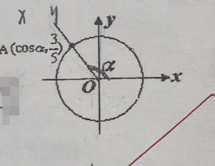

## 20260312 高一数学练习卷

### 一、填空题

1、设 $3$ 弧度的圆心角所对的弧长是 $12$ cm，则这个圆心角所对的扇形面积为\_\_\_\_\_\_\_\_ 
2、❌已知 $a$ 为第三象限角，且 $\sin a = -\dfrac{3}{5}$，则 $\cot a =$\_\_\_\_\_\_\_\_\_\_\_
3、❌若 $\cos a = \dfrac{\sqrt{3}}{2}$，且角 $\alpha$ 的终边经过点 $P(x, 2)$，则 $x =$\_\_\_\_\_\_\_\_\_\_\_
4、已知 $\sin(\pi+\alpha)=\frac{1}{3}$，$\frac{3\pi}{2}<\alpha<2\pi$，则 $\sin(\frac{\pi}{2}-\alpha)=$\_\_\_\_\_\_\_\_\_\_\_
5、化简：$\sin^{2}\alpha + \cos^{2}\alpha \sin^{2}\beta + \cos^{2}\alpha \cos^{2}\beta=$\_\_\_\_\_\_\_\_\_\_\_
6、若 $\alpha$ 为第二象限角，则 $\tan\alpha\sqrt{\dfrac{1}{\sin^{2}\alpha}-1}=$\_\_\_\_\_\_\_\_\_\_\_
7、已知 $\tan x = \sqrt{3}$，$x \in [0, 2\pi)$，那么 $x =$\_\_\_\_\_\_\_\_\_\_\_
8、已知 $\cos x = -\dfrac{\sqrt{2}}{2}$，那么 $x =$\_\_\_\_\_\_\_\_\_\_\_
9、若 $\sin x + \sin^{2}x = 1$，求 $\cos^{2} x + \cos^{4}x =$\_\_\_\_\_\_\_\_\_\_\_
10、❌若 $\tan 70^{\circ} = k$，则 $\sin 110^{\circ} =$\_\_\_\_\_\_\_\_\_\_\_
11、❌如右图所示，角 $\alpha$ 的终边与单位圆交于第二象限的点  $A(\cos\alpha, \frac{3}{5})$，则 $\cos \alpha - \sin \alpha =$\_\_\_\_\_\_\_\_\_\_\_
12、已知 $\sin \alpha + \sin \beta = 1$，且 $\cos \alpha + \cos \beta = 1$，求 $\sin \alpha + \cos \alpha =$\_\_\_\_\_\_\_\_\_\_\_

### 二、 选择题
13、❌若 $\alpha$ 是第三象限角，则点 $P(\sin \dfrac{\alpha}{2}, \cos \dfrac{\alpha}{2})$ 在
（A）第四象限内；                   （B）第一或第四象限内；
（C）第二或第四象限内；       （D）第三或第四象限内；

14、已知 $\tan \alpha = m, (m \neq 0), \sin \alpha = \dfrac{m}{\sqrt{1 + m^{2}}}$ 则 $\alpha$ 的终边落在
（A）第1、2象限                 （B）第1、3象限
（C）第1、4象限                  （D）第2、3象限

### 三、解答题
15、已知 $\tan(x + \theta) = \dfrac{3}{2}$，求下列各式的值：
(1) $\dfrac{3\sin\theta - 2\cos\theta}{2\sin\theta + \cos\theta}$                    (2) $4\sin^{2}\theta - 3\sin\theta\cos\theta$

16、已知点 $P(3, 4)$ 是角 $\alpha$ 终边上的点，$\cos \beta = \dfrac{5}{13}$，$\beta \in [0, \dfrac{\pi}{2}]$，求：
(1) $\sin \alpha$                                             (2) $\cos (\alpha - \beta)$       

17、已知 $\tan(x - \alpha) = -3$，求
(1) $\tan \alpha$              (2) 求 $ \dfrac{\sin(\pi-\alpha)-\cos(\pi+\alpha)-\sin(2\pi-\alpha)+\cos(-\alpha)}{\sin(\frac{\pi}{2}-\alpha)+\cos(\frac{3\pi}{2}-\alpha)} $ 的值

18、❌已知 $\cos \alpha = \dfrac{1}{7}$，$\cos(\alpha + \beta) = -\dfrac{11}{14}$，$\alpha \in (0, \pi), \alpha + \beta \in (0, \pi)$，求 $\cos \beta$ 的值。

