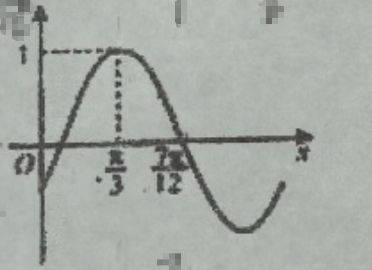
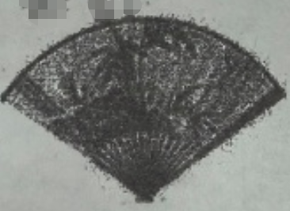
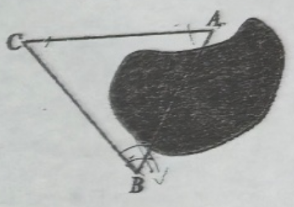
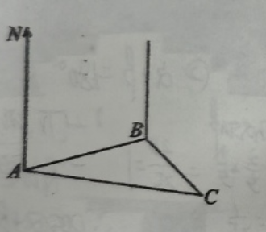

## 20260402  期中复习卷（一）

### 一、填空题
1. 角 $2026^\circ$ 是第\_\_\_\_\_\_\_\_\_\_\_\_象限角。
2. 若 $\cos\alpha = \dfrac{1}{3}$，则 $\sin\left(\dfrac{3\pi}{2}-\alpha\right) =$\_\_\_\_\_\_\_\_\_\_\_\_。
3. 若 $\sin\alpha>0,\cos\alpha<0$，角 $\alpha$ 的终边在第\_\_\_\_\_\_\_\_\_\_\_\_象限。
4. 已知 $\cos x = -\dfrac{3}{5}, x\in[0,\pi]$，则满足条件的 $x=$\_\_\_\_\_\_\_\_\_\_\_\_（结果用反三角表示）。
5. $\tan\left(\alpha-\dfrac{\pi}{4}\right)=2$，则 $\tan\alpha=$\_\_\_\_\_\_\_\_\_\_\_\_。
6. 函数 $f(x)=2\sin\left(\dfrac{\pi}{4}+x\right)\cos\left(\dfrac{\pi}{4}+x\right)$ 的最小正周期为\_\_\_\_\_\_\_\_\_\_\_\_。
7. 已知角 $\alpha$ 终边上的一点 $P(a,\sqrt{3}a)(a<0)$，则 $\sin\alpha=$\_\_\_\_\_\_\_\_\_\_\_\_。
8. 如果 $\tan(\alpha+\beta)=\dfrac{2}{5},\tan\left(\beta-\dfrac{\pi}{4}\right)=\dfrac{1}{4}$，那么 $\tan\left(\alpha+\dfrac{\pi}{4}\right)$ 的值是\_\_\_\_\_\_\_\_\_\_\_\_。
9. 已知 $\sin\alpha+\cos\alpha=\dfrac{\sqrt{3}}{3}$，且 $\alpha\in(0,\pi)$，求 $\tan\alpha + \cot\alpha =$\_\_\_\_\_\_\_\_\_\_\_\_。
10. 函数 $y=\sqrt{2\sin x-1}(0\leq x\leq 2\pi)$ 定义域为\_\_\_\_\_\_\_\_\_\_\_\_。
11. 已知函数 $f(x)=\sin(\omega x+\phi)\left(\omega>0,-\dfrac{\pi}{2}<\phi<\dfrac{\pi}{2}\right)$ 的部分图象如下图所示，则函数 $f(x)$ 的解析式为 $f(x)=$\_\_\_\_\_\_\_\_\_\_\_\_。
12. 折扇可看作是从一个圆面中剪下的扇形制作而成，设扇形的面积为 $S_1$，圆面中剩余部分的面积为 $S_2$，当 $S_1$ 与 $S_2$ 的比值为 $\dfrac{\sqrt{5}-1}{2}$ 时，扇面看上去形状较为美观，那么此时扇形的圆心角的弧度数为\_\_\_\_\_\_\_\_\_\_\_\_。

### 二、选择题
13. “$\theta=2k\pi+\dfrac{\pi}{4}, k\in\mathbb{Z}$” 是 “$\tan\theta=1$” 的（  ）
A. 充分不必要条件                            B. 必要不充分条件                           C. 充要条件                       D. 既不充分也不必要条件

14. 下列命题中正确的是（  ）
A. 终边重合的两个角相等                         B. 锐角是第一象限的角
C. 第二象限的角是钝角                              D. 小于 $90^\circ$ 的角都是锐角

15. 为了得到函数 $y=3\sin\left(2x+\dfrac{\pi}{6}\right)$ 的图像，只需要将函数 $y=3\sin(2x)$ 的图像（  ）
    A. 向左平移 $\dfrac{\pi}{6}$ 个单位                               B. 向左平移 $\dfrac{\pi}{12}$ 个单位

    C. 向右平移 $\dfrac{\pi}{6}$ 个单位                              D. 向右平移 $\dfrac{\pi}{12}$ 个单位

16. 为测量 $A,B$ 两地之间的距离，甲同学选定了与 $A,B$ 不共线的 $C$ 处，构成 $\triangle ABC$，以下是测量数据的不同方案：
    ①测量 $\angle A,|AC|,|BC|$；②测量 $\angle A,\angle B,|BC|$；③测量 $\angle C,|AC|,|BC|$；④测量 $\angle A,\angle B,\angle C$。
    要求甲同学选择的方案能唯一确定 $A,B$ 两地之间的距离，这样方案的个数有（  ）
    A. 1个                                                        B. 2个                                              C. 3个                                                 D. 4个
    

### 三、解答题
17. 已知 $\sin\alpha=\dfrac{3}{5},\cos\beta=-\dfrac{4}{5},\alpha,\beta\in\left(\dfrac{\pi}{2},\pi\right)$，求 $\cos(\alpha+\beta)$ 的值。

18. 已知 $\tan(3\pi+\beta)=-3$，求 (1) $\dfrac{3\sin\beta-2\cos\beta}{2\sin\beta+\cos\beta}$；(2) $4\sin^2\beta-3\sin\beta\cos\beta$。

19. 在 $\triangle ABC$ 中，$a,b,c$ 分别是 $A,B,C$ 的对边，且 $\dfrac{\cos B}{\cos C}=-\dfrac{b}{2a+c}$。
(1) 求角 $B$ 的大小；(2) 若 $b=\sqrt{13},a+c=4$，求 $\triangle ABC$ 的面积。

20. 如图，我边防巡逻艇在 $A$ 处测得，北偏东 $75^\circ$ 相距 $10$ 海里的 $B$ 处，有一艘可疑船只正以每小时 $12$ 海里里的航速沿东南方向驶去。上级指示我艇：匀速航行半小时，在 $C$ 处准时追上目标。
    (1) 求我边防巡逻艇的航速；
    (2) 求我边防巡逻艇的航向角（即 $\angle NAC$ 的大小，精确到 $0.01$）。
    

21. 已知函数 $f(x)=2\cos^2x+2\sqrt{3}\sin x\cos x-1$。
(1) 把 $f(x)$ 表示为 $A\sin(\omega x+\varphi)$ 的形式，并写出函数 $y=f(x)$ 的最小正周期；
(2) 求函数 $y=f(x)$ 的单调递增区间；
(3) 若不等式 $|f(x)-m|<2$ 在 $x\in\left[-\dfrac{\pi}{4},\dfrac{\pi}{4}\right]$ 上恒成立，求实数 $m$ 的取值范围。