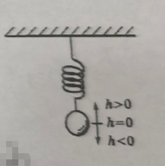

## 20260402 高一数学练习卷

### 一、填空题
1.  正弦曲线 $y = \sin x$ 在 $(0, 2\pi)$ 内最高点坐标为$\underline{\hspace{2cm}}$。
2.  函数 $y = \cos 2x - 2\sqrt{3}\sin x \cos x$ 的最小正周期是$\underline{\hspace{2cm}}$。
3.  若函数 $y = A\sin(\omega x + \varphi) (A>0, \omega>0)$ 的振幅为 3，最小正周期为 $\dfrac{2\pi}{7}$，初相为 $\dfrac{\pi}{6}$，则它的解析式是$\underline{\hspace{2cm}}$。
4.  将函数 $y = \sin x$ 的图像向右平移 $\dfrac{\pi}{3}$ 个单位，所有点的横坐标伸长到原来的 2 倍，则可得到函数$\underline{\hspace{2cm}}$的图像。
5.  函数 $y = 2\sin 3x - 3\cos 3x$ 的周期为$\underline{\hspace{2cm}}$，最大值为$\underline{\hspace{2cm}}$。
6.  ❌函数 $y = \dfrac{1}{2}\sin\left(2x - \dfrac{\pi}{4}\right)$ 的图像向$\underline{\hspace{1cm}}$平移$\underline{\hspace{1cm}}$个单位可得到函数 $y = \dfrac{1}{2}\sin 2x$ 的图像。
7.  函数 $y = \dfrac{1}{2}\sin\left(2x - \dfrac{\pi}{4}\right) + 1$ 的单调递增区间为$\underline{\hspace{2cm}}$。
8.  ❌函数 $y = \sin 2x - \sqrt{3}\cos 2x \left(-\dfrac{\pi}{6} \leq x \leq \dfrac{\pi}{6}\right)$ 的值域为$\underline{\hspace{2cm}}$。
9.  ❌若函数 $f(x) = 2\sin(2x + \varphi) (0 < \varphi < 2\pi)$ 对任意 $x \in \mathbb{R}$ 都有 $f(x) \geq f\left(\dfrac{5\pi}{12}\right)$，则 $\varphi = \underline{\hspace{2cm}}$。
10. 已知函数 $y = A\sin(x + \varphi)$ 在同一周期内，当 $x = \dfrac{\pi}{3}$ 时，取到最大值 4，当 $x = \dfrac{4}{3}\pi$ 时，取到最小值 $-4$。函数的解析式为$\underline{\hspace{2cm}}$。
11. ❌若函数 $f(x) = \sin x + 2|\sin x|, x \in [0, 2\pi]$ 的图像与直线 $y = k$ 有且只有两个不同的交点，则实数 $k$ 的取值范围为$\underline{\hspace{2cm}}$。

### 二、选择题
12. 下列函数既是周期函数，又是偶函数的是（  ）
A. $y = \sin x$；                   B. $y = \sin |x|$；                                C. $y = \sin\left(x + \dfrac{\pi}{4}\right)$；                                   D. $y = |\sin x|$。

13. 函数 $f(x) = \lg(2\sin x)$ 的单调递增区间为（  ）

A. $\left[2k\pi - \dfrac{\pi}{2}, 2k\pi + \dfrac{\pi}{2}\right] (k \in \mathbb{Z})$；                                                B. $\left(2k\pi - \dfrac{\pi}{2}, 2k\pi + \dfrac{\pi}{2}\right) (k \in \mathbb{Z})$；
C. $\left[2k\pi, 2k\pi + \dfrac{\pi}{2}\right] (k \in \mathbb{Z})$；                                                            D. $\left(2k\pi, 2k\pi + \dfrac{\pi}{2}\right] (k \in \mathbb{Z})$。

### 三、解答题
14. ❌设 $x \in \left[-\dfrac{\pi}{6}, \dfrac{2\pi}{3}\right]$，求函数 $y = -4\cos^2 x - 12\sin x + 3$ 的最大值和最小值。
15. 求函数 $y = 5\sin x \cos x - 5\sqrt{3}\cos^2 x + \dfrac{5}{2}\sqrt{3}$ 的最小正周期、单调递减区间和值域。
16. ❌试对实数 $a$ 的不同取值，讨论方程 $\sin x + \sqrt{3}\cos x - a = 0$ 在 $x \in \left[\dfrac{\pi}{3}, \dfrac{3\pi}{2}\right]$ 上的解的个数。
17. 如图，弹簧挂着的小球上下振动。设小球相对于平衡位置（即静止时的位置）的距离 $h$（cm）与时间 $t$（s）之间的函数表达式 $h = 2\sin\left(\pi t + \dfrac{\pi}{4}\right), t \geq 0$，作出这个函数的大致图像，并回答下列问题：
（1）小球开始振动（即 $t=0$ 时）的位置在哪里？
（2）❌当 $t \in [0, 2]$ 时，求小球相对与平衡位置的距离不小于 1 的时间段。

