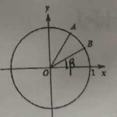
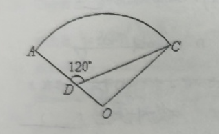

## 20260403  期中复习卷（二）

### 一、填空题
1. 已知一扇形的圆心角为 $2$ 弧度，半径为 $1\mathrm{cm}$，则此扇形的面积为 $\underline{\hspace{2cm}}\mathrm{cm}^2$。
2. 已知点 $P(\tan\alpha,\cos\alpha)$ 在第三象限，则角 $\alpha$ 的终边在第 $\underline{\hspace{2cm}}$ 象限。
3. 已知 $\cos\alpha = \dfrac{1}{4}$，则 $\sin\left(\dfrac{\pi}{2}+\alpha\right) = \underline{\hspace{2cm}}$。
4. 若 $f(x) = a\sin x + 3\cos x$ 是偶函数，则实数 $a = \underline{\hspace{2cm}}$。
5. ❌若 $\sin x = \dfrac{1}{5}$，$x\in\left[0,\pi\right]$，则角 $x = \underline{\hspace{2cm}}$。
6. 已知 $\sin\alpha\cdot\cos\alpha = \dfrac{3}{8}$，且 $\dfrac{\pi}{4}<\alpha<\dfrac{\pi}{2}$，则 $\cos\alpha - \sin\alpha = \underline{\hspace{2cm}}$。
7. 已知 $\theta$ 为第四象限角，且 $\cos\theta = \dfrac{3}{5}$，则 $\sin2\theta + \cos2\theta = \underline{\hspace{2cm}}$。
8. ❌$\triangle ABC$ 中，$\sin A:\sin B:\sin C = 7:5:3$，则此三角形中最小角为 $\underline{\hspace{2cm}}$。
9. 函数 $y = \sin x - \sqrt{3}\cos x$，$x\in\left[\dfrac{2\pi}{3},\dfrac{7\pi}{6}\right]$ 的值域是 $\underline{\hspace{2cm}}$。
10. 若 $f(x) = 2\sin\omega x$（$0<\omega<1$）在区间 $\left[0,\dfrac{\pi}{3}\right]$ 上的最大值是 $\sqrt{2}$，则 $\omega = \underline{\hspace{2cm}}$。
11. ❌已知 $\alpha,\beta$ 为锐角，且 $\sin\alpha = \dfrac{4}{5}$，$\cos(\alpha+\beta) = \dfrac{12}{13}$，则 $\cos\beta = \underline{\hspace{2cm}}$。
12. ❎️定义函数 $f(x)=\begin{cases}\sin x, &\sin x\geq\cos x\\\cos x, &\sin x < \cos x\end{cases}$ ，给出下列四个命题：
    （1）该函数的值域为 $[-1,1]$
    （2）当且仅当 $x = 2k\pi+\dfrac{\pi}{2}(k\in\mathbb{Z})$ 时，该函数取得最大值
    （3）该函数是以 $\pi$ 为最小正周期的周期函数
    （4）当且仅当 $2k\pi+\pi < x < 2k\pi+\dfrac{3\pi}{2}(k\in\mathbb{Z})$ 时，$f(x)<0$
    上述命题中正确的序号是 $\underline{\hspace{2cm}}$。

### 二、选择题
13. ❌在 $\triangle ABC$ 中，“$\sin A = \sin B$”是“$A = B$”的（  ）
A. 充分非必要条件                          B. 必要非充分条件                        C. 充分必要条件                    D. 非充分非必要条件

14. 函数 $y = \sin\left(2x+\dfrac{\pi}{3}\right)$ 的图像是由函数 $y = \sin2x$ 的图像（  ）
A. 向左平移 $\dfrac{\pi}{3}$                                       B. 向左平移 $\dfrac{\pi}{6}$                             C. 向左平移 $\dfrac{5\pi}{6}$                   D. 向右平移 $\dfrac{5\pi}{6}$

15. 下列函数中是偶函数，以 $\pi$ 为最小正周期，且在 $\left(0,\dfrac{\pi}{2}\right)$ 上为增函数的是（  ）
A. $y = \sin x$                                           B. $y = \cos x$                                   C. $y = |\sin x|$                        D. $y = |\cos x|$

16. ❌设函数 $f(x) = 2\sin\omega x - 1(\omega>0)$，在区间 $\left[0,\dfrac{3\pi}{4}\right]$ 上至少有 $2$ 个不同的零点，至多有 $3$ 个不同的零点，则 $\omega$ 的取值范围是（  ）【填空】
~~A. $\left[\dfrac{26}{9},\dfrac{10}{3}\right)$  B. $\left[\dfrac{26}{9},\dfrac{58}{9}\right)$
C. $\left[\dfrac{26}{9},\dfrac{10}{3}\right]\cup\left[\dfrac{34}{9},\dfrac{58}{9}\right)$  D. $\left[\dfrac{26}{9},\dfrac{10}{3}\right)\cup\left[\dfrac{34}{9},\dfrac{58}{9}\right)$~~

### 三、解答题
17. 已知 $\tan\alpha = 2$，求下列各式的值：
    （1）$\dfrac{2\cos\alpha+\sin\alpha}{\sin\alpha-3\cos\alpha}$；                                                                     （2）$\dfrac{\sin^2x-3\sin x\cos x}{\sin^2x+\cos^2x}$。
    
18. 如图，在平面直角坐标系 $xOy$ 中，以 $Ox$ 轴为始边做两个锐角 $\alpha,\beta$，它们的终边分别与单位圆相交于 $A,B$ 两点，已知 $A,B$ 的横坐标分别为 $\dfrac{\sqrt{2}}{10},\dfrac{2\sqrt{5}}{5}$。
    （1）求 $\tan(\alpha+\beta)$ 的值；                               （2）求 $\alpha+2\beta$ 的值。
    

19. 如图：某住宅小区的平面图呈扇形 $AOC$，小区的两个出入口设置在点 $A$ 及点 $C$ 处，小区里有两条笔直的小路 $AD$、$CD$，且拐弯处的转角为 $120^\circ$，已知某人从 $C$ 沿 $CD$ 走到 $D$ 用了 $10$ 分钟，从 $D$ 沿 $DA$ 走到 $A$ 用了 $6$ 分钟，若此人步行的速度为每分钟 $50$ 米，求该扇形的半径 $OA$ 的长（精确到 $1$ 米）。
    

20. ❌ 已知函数 $f(x) = 2\sin^2\left(\dfrac{\pi}{4}+x\right)-\sqrt{3}\cos2x$。
    （1）求 $f(x)$ 的最小正周期和单调递增区间；
    （2）若关于 $x$ 的方程 $f(x)-m = 1$ 在 $x\in\left[\dfrac{\pi}{4},\dfrac{\pi}{2}\right]$ 上有解，求实数 $m$ 的取值范围。

21. 已知 $\triangle ABC$，三条边 $a,b,c$ 的对角分别是 $A,B,C$，面积为 $S$。根据下列条件，研究以下各问题：
    （1）若 $\dfrac{a}{\tan A} = \dfrac{b}{\tan B} = \dfrac{c}{\tan C}$，判断 $\triangle ABC$ 的形状；
    （2）若 $c = 2$，$a^2+b^2 = 8$，求 $\triangle ABC$ 面积 $S$ 的最大值。