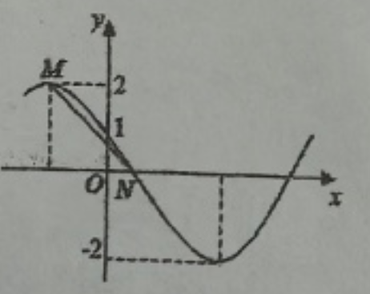
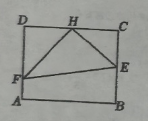

## 20260408 期中复习卷（四）

### 一、填空题
1. 一个扇形的面积是 $1\ \mathrm{cm}^2$，它的弧长为 $2\ \mathrm{cm}$，则其中心角的弧度数为\_\_\_\_\_\_\_\_\_\_\_\_。
2. 函数 $y = \tan(2x - \dfrac{\pi}{3})$ 的最小正周期为\_\_\_\_\_\_\_\_\_\_\_\_。
3. 已知角 $\alpha$ 终边上有一点 $P(2,1)$，则 $\sin(2\alpha + \dfrac{\pi}{2}) =$\_\_\_\_\_\_\_\_\_\_\_\_。
4. 已知 $\sin\alpha = \dfrac{4}{5}, \cos\alpha = -\dfrac{3}{5}$，则 $2\alpha$ 终边所在的象限是\_\_\_\_\_\_\_\_\_\_\_\_。
5. 直线 $y = a$ 与函数 $f(x) = \tan\omega x$（$\omega>0$，$\omega$ 为常数）的两个相邻交点的距离是\_\_\_\_\_\_\_\_\_\_\_\_。
6. 在 $\triangle ABC$ 中，角 $A,B,C$ 的对边分别为 $a,b,c$，若 $a=8,b=7,B=60^\circ$，则 $c=$\_\_\_\_\_\_\_\_\_\_\_\_。
7. 已知函数 $y = \sin(2x + \theta)$ 是偶函数，则满足条件的所有 $\theta$ 的值为\_\_\_\_\_\_\_\_\_\_\_\_。
8. 函数 $f(x) = \sin(2x - \dfrac{\pi}{6})$ 的单调递减区间是\_\_\_\_\_\_\_\_\_\_\_\_。
9. 函数 $y = \sin x - 3|\sin x|, x\in[0,2\pi]$ 的图像与直线 $y = k$ 有且四个不同的交点，则 $k$ 的取值范围是\_\_\_\_\_\_\_\_\_\_\_\_。
10. 已知函数 $f(x) = 2\sin(\omega x + \varphi)(\omega>0, \varphi\in[\dfrac{\pi}{2},\pi])$ 部分图象如图所示，其中 $f(0)=1$，$|MN|=\dfrac{5}{2}$，则点 $M$ 的坐标为\_\_\_\_\_\_\_\_\_\_\_\_。
11. 将函数 $f(x) = \sin(\omega x + \dfrac{\pi}{6})(\omega\in R$ 且 $\omega\neq0)$ 的图象上所有点的横坐标变为原来的 $2$ 倍，纵坐标保持不变，若所得函数的图象与函数 $g(x) = \cos(x + \varphi)(0<\varphi<\pi)$ 的图象重合，则 $\tan(\dfrac{\pi}{3}\omega + \varphi) =$\_\_\_\_\_\_\_\_\_\_\_\_。
12. 已知函数 $f(x) = \sqrt{3}\sin\omega x - \cos\omega x(\omega>0)$ 在区间 $[-\dfrac{\pi}{3},\dfrac{3\pi}{4}]$ 上单调递增，且在区间 $[0,\pi]$ 上只取得一次最大值，则 $\omega$ 的最大值是\_\_\_\_\_\_\_\_\_\_\_\_。

### 二、选择题
13. 与 $-60^\circ$ 角的终边相同的角是（  ）
A. $300^\circ$                                                      B. $240^\circ$                                      C. $120^\circ$                                      D. $60^\circ$

14. 设 $\theta\in R$，则“$\sin\theta = \dfrac{1}{3}$”是“$\theta = \arcsin\dfrac{1}{3}$”的（  ）
A. 充分非必要条件                                 B. 必要非充分条件                 C. 充要条件                               D. 既非充分也非必要条件

15. 在 $\triangle ABC$ 中，若 $\dfrac{a}{b} = \dfrac{\cos B}{\cos A}$，则 $\triangle ABC$ 形状是（  ）
A. 直角三角形                                            B. 等腰三角形                        C. 等腰直角三角形                  D. 等腰或直角三角形

16. 把 $a\sin\theta + b\cos\theta(ab\neq0)$ 化成 $\sqrt{a^2+b^2}\sin(\theta+\varphi)$ 时，下列关于辅助角 $\varphi$ 的表述中，不正确的是（  ）
A. 辅助角 $\varphi$ 一定同时满足 $\sin\varphi = \dfrac{b}{\sqrt{a^2+b^2}}, \cos\varphi = \dfrac{a}{\sqrt{a^2+b^2}}$
B. 满足条件的辅助角 $\varphi$ 一定是方程 $\tan x = \dfrac{b}{a}$ 的解
C. 满足方程 $\tan x = \dfrac{b}{a}$ 的角 $x$ 一定都是符合条件的辅助角 $\varphi$
D. 在平面直角坐标系中，满足条件的辅助角 $\varphi$ 的终边都重合

### 三、解答题
17. 已知 $\theta$ 为第四象限角，且 $\cos\theta = \dfrac{3}{5}$，求 $\sin(2\theta + \dfrac{\pi}{3})$ 的值。

18. 在 $\triangle ABC$ 中，$\cos C = -\dfrac{1}{4}, c = 2a$。
(1) 求 $\sin A$ 的值；      (2) 若 $\triangle ABC$ 的周长为 $18$，求 $\triangle ABC$ 的面积。

19. 已知函数 $f(x) = \sqrt{2}\cos(2x - \dfrac{\pi}{4}), x\in \R$。
(1) 求函数 $f(x)$ 的最小正周期和单调递增区间；
(2) 当 $x\in[-\dfrac{\pi}{8},\dfrac{\pi}{2}]$ 时，方程 $f(x)=a$ 恰有两个不同的实数根，求实数 $a$ 的取值范围。

20. 一矩形的水塘 $ABCD$，已知长 $AB=40$ 米，宽 $BC=20\sqrt{3}$ 米，计划在水塘建造三座小桥 $HE$、$HF$ 和 $EF$，并要求 $H$ 是 $CD$ 的中点，点 $E$ 在边 $BC$ 上，点 $F$ 在边 $AD$ 上，且 $\angle EHF$ 为直角，如图所示。(1) 设 $\angle CHE = \theta$（弧度），试将三座桥的全长（即 $\triangle EHF$ 的周长）$L$ 表示成 $\theta$ 的函数，并求出此函数的定义域；(2) 建这三座桥，每米建设预算平均费用为 $1250$ 元，试问如何设计才能使总费用最低？并求出最低总费用（结果保留整数）。

21. 已知函数 $f(x) = \cos^2\omega x + \sqrt{3}\sin\omega x\cdot\cos\omega x(\omega>0)$，其相邻两个零点之间的距离为 $\dfrac{\pi}{2}$。
(1) 求实数 $\omega$ 的值及函数 $f(x)$ 的单调递增区间；
(2) 求函数 $f(x)$ 在 $x\in[-\dfrac{\pi}{6},\dfrac{\pi}{3}]$ 上的最大值和最小值；
(3) 设 $g(x) = f(x) - m$，若函数 $g(x)$ 在 $x\in[-\dfrac{\pi}{6},\dfrac{\pi}{3}]$ 上有两个不同零点，求实数 $m$ 的取值范围。