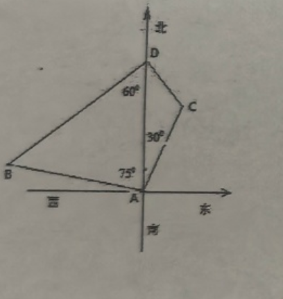

## 20260409 期中复习卷（五）

### 一、填空题
1. 函数 $y = \cos( \dfrac{1}{2}x - \dfrac{\pi}{3})$ 的最小正周期为\_\_\_\_\_\_\_\_\_。
2. 已知 $\sin \dfrac{\alpha}{2} = - \dfrac{\sqrt{5}}{5}$，则 $\cos\alpha=\_\_\_\_\_\_\_\_\_$。
3. 设 $\sin\theta = \dfrac{3}{5}, \cos\theta = - \dfrac{4}{5}$，则 $2\theta$ 的终边所在的象限是\_\_\_\_\_\_\_\_\_。
4. “$a=1$” 是 “函数 $y = \cos^2 ax - \sin^2 ax$ 的最小正周期为 $\pi$” 的\_\_\_\_\_\_\_\_\_ 条件。
5. 已知角 $\alpha$ 的终边在直线 $y=2x$ 上，则 $\tan2\alpha=\_\_\_\_\_\_\_\_\_$。
6. 已知 $\sin\alpha = \dfrac{1}{3} (2\pi < \alpha < 3\pi)$，则 $\sin \dfrac{\alpha}{2} + \cos \dfrac{\alpha}{2}=\_\_\_\_\_\_\_\_\_$。
7. 已知某等腰三角形一个底角的余弦值为 $ \dfrac{2}{3}$，则这个三角形顶角的大小为\_\_\_\_\_\_\_\_\_。
8. 在 $\triangle ABC$ 中，已知 $B=60^\circ$，则 $\tan \dfrac{A}{2} + \tan \dfrac{C}{2} + \sqrt{3}\tan \dfrac{A}{2}\tan \dfrac{C}{2}$ 的值为\_\_\_\_\_\_\_\_\_。
9. 在 $\triangle ABC$ 中，若 $a+b=8$，$\angle C=30^\circ$，则 $\triangle ABC$ 面积的最大值是\_\_\_\_\_\_\_\_\_。
10. 已知 $y = \sin x$ 和 $y = \cos x$ 的图像的连续三个交点 $A$、$B$、$C$ 构成 $\triangle ABC$，$\triangle ABC$ 的面积为\_\_\_\_\_\_\_\_\_。
11. 已知函数 $f(x) = 2\sin( \dfrac{x}{4} + \dfrac{\pi}{3})$，若对任意的 $x \in \R$，都有 $f(x_1) \leq f(x) \leq f(x_2)$，则 $|x_1 - x_2|$ 的最小值为\_\_\_\_\_\_\_\_\_。
12. 在 $\triangle ABC$ 中，已知 $a=8$，$B= \dfrac{\pi}{6}$，要使该三角形有唯一解，则 $b$ 的取值范围为\_\_\_\_\_\_\_\_\_。

### 二、选择题
13. 在下列四个函数中，周期为 $\dfrac{\pi}{2}$ 的偶函数为（  ）
(A) $y=2\sin2x\cos2x$   (                 B) $y=\cos^22x-\sin^22x$                      (C) $y=x\tan2x$                (D) $y=\cos^2x-\sin^2x$

14. 把函数 $y = \sin(2x+ \dfrac{\pi}{3})$ 的图象向左平移 $\varphi$ 的单位，所得到的函数为偶函数，则 $\varphi$ 的最小值是（  ）
A. $ \dfrac{\pi}{12}$                                                       B. $ \dfrac{\pi}{6}$                                                               C. $ \dfrac{\pi}{4}$                                            D. $ \dfrac{\pi}{3}$

15. 函数 $y = 2\sin( \dfrac{\pi}{6}-2x), x\in[0,\pi]$ 的递增区间是（  ）
A. $[0, \dfrac{\pi}{3}]$                                                  B. $[ \dfrac{\pi}{12}, \dfrac{7\pi}{12}]$                                              C. $[ \dfrac{\pi}{3}, \dfrac{5\pi}{6}]$                                D. $[ \dfrac{5\pi}{6},\pi]$

16. 某人要制作一个三角形，要求它的三条高的长度分别为 $ \dfrac{1}{13}, \dfrac{1}{11}, \dfrac{1}{5}$，则此人（  ）
(A) 不能作出这样的三角形                                 (B) 能作出一个锐角三角形
(C) 能作出一个直角三角形                                  (D) 能作出一个钝角三角形

### 三、解答题
17. 已知 $\pi < \alpha < \dfrac{3\pi}{2}, \pi < \beta < \dfrac{3\pi}{2}, \sin\alpha = - \dfrac{\sqrt{5}}{5}, \cos\beta = - \dfrac{\sqrt{10}}{10}$，求 $\alpha-\beta$ 的值。

18. 锐角 $\triangle ABC$ 中，$a=8, B= \dfrac{\pi}{3}, S_{\triangle ABC}=24\sqrt{3}$。
    (1) 求边 $c$；  (2) 求 $\triangle ABC$ 中最小内角的正弦值和最大内角的余弦值。

19. 已知：函数 $f(x)=\sin2x-2\sqrt{3}\cos^2x+\sqrt{3}, x\in[ \dfrac{\pi}{4}, \dfrac{\pi}{2}]$。
    (1) 求 $f(x)$ 的最大值和最小值，并写出 $x$ 为何值时取得最值；
    (2) 若不等式 $|f(x)-a|<2$，对一切 $x\in[ \dfrac{\pi}{4}, \dfrac{\pi}{2}]$ 恒成立，求实数 $a$ 的取值范围。

20. 某船在海面 $A$ 处测得灯塔 $C$ 与 $A$ 相距 $10\sqrt{3}$ 海里，且在北偏东 $30^\circ$ 的方向；测得灯塔 $B$ 与 $A$ 相距 $15\sqrt{6}$ 海里，且在北偏西 $75^\circ$ 的方向，船往正北方向航行到 $D$ 处，再看灯塔 $B$ 在南偏西 $60^\circ$ 的方向，问灯塔 $C$ 与 $D$ 相距多少海里？

22. 对于函数 $f(x)(x\in D)$，若存在非零常数 $T$，使得对任意的 $x\in D$，都有 $f(x+T)\geq f(x)$ 成立，我们称函数 $f(x)$ 为“$T$ 函数”，若对任意的 $x\in D$，都有 $f(x+T)>f(x)$ 成立，则称函数 $f(x)$ 为“严格 $T$ 函数”。
    (1) 求证：$f(x)=\sin x$，$D=\R$ 是“$T$ 函数”；
    (2) 若函数 $f(x)=kx+\sin^2x$ 是“$\dfrac{\pi}{2}$ 函数”，求 $k$ 的取值范围。