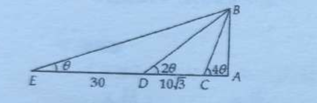
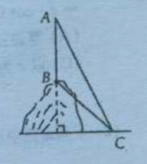
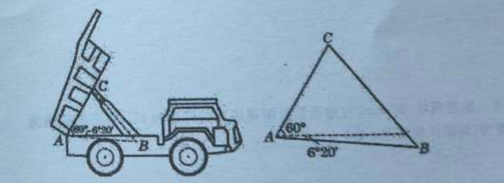

## 20260430 利用正弦定理、余弦定理解应用题

### 知识解读

【例1】某船在海面 A 处测得灯塔 C 和 A 相距 $10\sqrt{3}$ 海里，且在北偏东 $30^\circ$ 的方向，测得灯塔 B 与 A 相距 $15\sqrt{6}$ 海里，且在北偏西 $75^\circ$ 的方向，船由 A 向正北方向航行到 D 处，再看灯塔 B 在南偏西 $60^\circ$ 的方向。问灯塔 C 与 D 相距多少海里？C 在 D 的什么方向？

【例2】在塔底的水平面上某点测得塔顶的仰角为 $\theta$，由此点向塔顶沿直线行走 30 米，测得塔顶的仰角为 $2\theta$，再向塔前进 $10\sqrt{3}$ 米，又测得塔顶的仰角为 $4\theta$，求塔高。

### 课堂练习 - 填空题

1. 大楼的顶上有一座电视塔，高 20m。在地面某处测得塔顶的仰角为 $45^\circ$，塔底的仰角为 $30^\circ$，则此大楼的高度为（结果保留两位小数）\_\_\_\_\_\_\_\_\_\_\_\_。

2. 某人向正东方向走 $x$ km 后，向右转 $150^\circ$，然后朝前走 3km，结果他离出发点恰好为 $\sqrt{3}$ km，则 $x =$ \_\_\_\_\_\_\_\_\_\_\_\_。

3. 甲、乙两塔相距 20m，从乙塔底望甲塔顶的仰角为 $60^\circ$，从甲塔顶望乙塔顶的俯角为 $30^\circ$，则甲、乙两塔的高度分别为\_\_\_\_\_\_\_\_\_\_\_\_。

4. 已知一根铁棒长 3 米，与地面成 $60^\circ$ 角。若此时阳光与地面成 $45^\circ$，则铁棒在地面上的影子最长为\_\_\_\_\_\_\_\_\_\_\_\_。（精确到 0.01 米）

### 跟踪训练 - 填空

(1) 在 $\triangle ABC$ 中，若 $a=5$，$b=4$，$\sin C=\dfrac{4}{5}$，则 $c=$ \_\_\_\_\_\_\_\_\_\_\_\_。
(2) 在 $\triangle ABC$ 中，若 $AB=AC$，$AB=4BC$，则 $\sin B=$ \_\_\_\_\_\_\_\_\_\_\_\_。
(3) 已知 $\triangle ABC$ 的三个内角为 $A,B,C$，且关于 $x$ 的方程 $Bx^2+(A+C)x+B=0$ 有两个相等的实数解。若 $a\cos C=c\cos A$，则 $\triangle ABC$ 是\_\_\_\_\_\_\_\_\_\_\_\_三角形。
(4) 若三角形三内角的正弦之比为 $1:2:\sqrt{3}$，则三边长之比为\_\_\_\_\_\_\_\_\_\_\_\_。
(5) 若 $a$、$a+1$、$a+2$ 是锐角三角形的三边长，则 $a$ 的取值范围是\_\_\_\_\_\_\_\_\_\_\_\_。
(6) 在 $\triangle ABC$ 中，若 $A+C=2B$，$b^2=ac$，则 $\triangle ABC$ 是\_\_\_\_\_\_\_\_\_\_\_\_三角形。

### 跟踪训练 - 选择题
(1) 若 $\triangle ABC$ 中的三边长 $a$、$b$、$c$ 和所对角 $A$、$B$、$C$ 满足条件 $a\cdot\cos A + b\cdot\cos B = c\cdot\cos C$，则此三角形必定是（）
  (A) 等边三角形；                                     (B) 等腰直角三角形；
  (C) 以 $c$ 为斜边的直角三角形；              (D) 以 $a$ 或 $b$ 为斜边的直角三角形。

(2) 下列命题中不正确的是（）
  (A) 若 $a$、$b$、$c$ 是三角形的三边长，且 $a^2+b^2-c^2>0$，则 $C$ 一定是锐角；
  (B) 在 $\triangle ABC$ 中，若 $a^2>b^2+c^2$，则 $A>B+C$；
  (C) 在 $\triangle ABC$ 中，若 $4\sin A\cos A=0$，则 $\triangle ABC$ 一定是直角三角形；
  (D) 直角三角形的三边长之比一定为 $3:4:5$。

(3) 在 $\triangle ABC$ 中，满足 $\dfrac{\cos 2A}{a^2} - \dfrac{\cos 2B}{b^2} = \dfrac{1}{a^2} - \dfrac{1}{b^2}$ 的三角形是（）
  (A) 等腰三角形；                          (B) 直角三角形；
  (C) 等边三角形；                           (D) 无法确定。

(4) 在 $\triangle ABC$ 中，满足 $A=40^\circ$，$B=80^\circ$，$c=5$ 的三角形有（）
  (A) 0 个；                    (B) 1 个；                      (C) 2 个；           (D) 无数个。

### 跟踪训练 - 解答题

3. 在 $\triangle ABC$ 中，已知 $a=4$，$b=6$，$c=3\sqrt{5}$，求 $S_{\triangle ABC}$。

4. 某货轮在 A 处看灯塔 S 在北偏东 $30^\circ$ 方向，它以每小时 18 海里的速度向正北方向航行，经过 40 分钟航行到 B 处，看灯塔 S 在北偏东 $75^\circ$ 方向。求此时货轮到灯塔 S 的距离。

5. 山上有一座电视接收塔，塔高 50 米，在山下地面 C 处测得塔顶 A 的仰角为 $75^\circ$，测得塔底 B 的仰角为 $60^\circ$，求山高。
   

6. 在 $\triangle ABC$ 中，求证：
(1) $\dfrac{\cos 2A}{a^2} - \dfrac{\cos 2B}{b^2} = \dfrac{1}{a^2} - \dfrac{1}{b^2}$；                      (2) $(a^2-b^2-c^2)\tan A + (a^2-b^2+c^2)\tan B = 0$。

7. 如图，自动卸货汽车采用液压机构，设计时需要计算油泵顶杆 BC 的长度。已知车厢的最大仰角为 $60^\circ$，油泵顶点 B 与车厢支点 A 之间的距离为 1.95 m，AB 与水平线之间的夹角为 $6^\circ 20'$，AC 的长为 1.4 m。计算 BC 的长。（结果精确到 0.01 m）
   